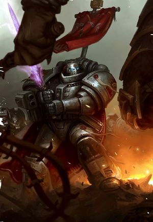
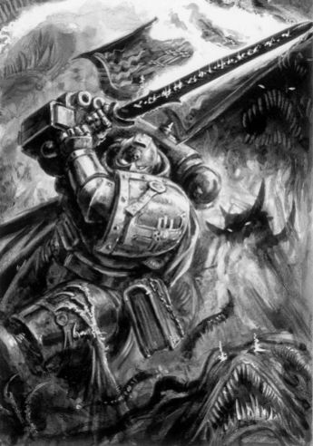
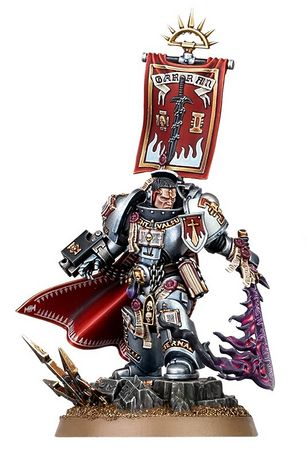

# 0721 加兰·克罗 Garran Crowe

精校状态：中文行文已逐段精校，部分术语仍为暂定

分类：人类帝国 / 灰骑士

原文来源：https://www.bilibili.com/opus/1149010709314535431

原作者：帝国神选罐头

原文时间：2025年12月22日 08:28

[返回分类目录](目录.md) · [全书目录](../../目录.md)

原篇名：加兰·克洛维 Garran Crowe

<!-- A0721-B0001 -->
**英文原文**

Garran Crowe is Castellan Champion of the Grey Knights' Purifiers order and the bearer of the Blade of Antwyr — a daemon sword that cannot be destroyed, nor wielded by lesser mortals.

<!-- /A0721-B0001 -->

<!-- A0721-B0002 -->

原译文

加兰·克洛维是灰骑士净化者的堡主冠军，也是安特维尔之刃的持有者，这是一把不能被摧毁的恶魔之剑，也不能被凡人使用。

**校订译文**

加兰·克罗是灰骑士净化者的堡主冠军，也是安特维尔之刃的持有者。这把恶魔之剑既无法摧毁，也绝非寻常凡人所能驾驭。

**校注：** Garran Crowe 沿核心加兰·克罗；GW09/GW10第23页仅直接核得 Castellan Crowe 克罗堡主，全名不作直接官译认证。

<!-- /A0721-B0002 -->

<!-- A0721-B0003 图片 -->

<!-- A0721-B0004 -->

原译文

Garran Crowe 加兰·克洛维

**校订译文**

Garran Crowe 加兰·克罗

<!-- /A0721-B0004 -->

<!-- A0721-B0005 -->
**英文原文**

Crowe's ownership of the blade has brought him both physical and spiritual peril. When not fighting the maddened mortals and desperate daemons that are drawn by the sword's evil, Crowe must do psychic battle with the Blade itself, for it strives ever to tempt him with promises of power or bind his will with the blackest sorceries. As such, Crowe never draws upon the Blade's powers, relying instead on its physical properties and his own skill at arms.

<!-- /A0721-B0005 -->

<!-- A0721-B0006 -->

原译文

克洛维拥有这把剑给他带来了身体和精神上的危险。当不与被剑的邪恶所吸引的疯狂的凡人和渴望的恶魔作战时，克洛维必须与剑本身进行心理战，因为它总是试图用力量的承诺来诱惑他，或者用最黑暗的魔法来束缚他的意志。因此，克洛维从不利用刀刃的力量，而是依靠它的物理特性和他自己的武器技能。

**校订译文**

持有这把剑，让克罗无论肉体还是灵魂都身处险境。若非忙于迎战被剑中邪恶吸引而来的疯狂凡人和急切恶魔，他就必须与剑本身展开灵能较量。它不断以强大力量诱惑他，或企图用最黑暗的巫术束缚他的意志。因此，克罗绝不借用剑中的力量，只依靠剑身本身，以及自己的武艺作战。

<!-- /A0721-B0006 -->

<!-- A0721-B0007 -->
### History 历史

<!-- /A0721-B0007 -->

<!-- A0721-B0008 -->
**英文原文**

In M41 as a young Purifier under the command of Castellan Merrat Gavallan (the then-current wielder of the Blade of Antywr), Crowe was deployed to fight a Daemonic outbreak in the Sandava System. The outbreak originated from a Chaos corrupted mask that had originally been on the Missionary Ship Envoy of Discipline. Soon enough, the decadent Cardinal of Sandava II, Beautus Rannoch, became corrupted by the mask and was able to summon the Keeper of Secrets Mnay'salath.

<!-- /A0721-B0008 -->

<!-- A0721-B0009 -->

原译文

在M41，作为一名年轻的净化者，在堡主默拉特·加瓦兰（当时是安特维尔之刃的持有者）的指挥下，克洛维被部署到桑达瓦星系中对抗恶魔爆发。这次爆发源于最初在传教士船纪律特使号身上的一个混沌腐化的面具。很快，堕落的桑达瓦二号红衣主教比尤图斯·兰诺克被面具腐化，并能够召唤守密者姆奈'萨拉特。

**校订译文**

第四十一个千年，克罗还只是堡主默拉特·加瓦兰麾下的一名年轻净化者。加瓦兰当时持有安特维尔之刃，两人奉命前往桑达瓦星系镇压恶魔侵袭。祸端来自一张受混沌污染的面具，原本存放在传教船纪律特使号上。桑达瓦二号腐朽堕落的红衣主教比尤图斯·兰诺克很快受其腐化，召出了守密者姆奈’萨拉特。

<!-- /A0721-B0009 -->

<!-- A0721-B0010 -->
**英文原文**

The Grey Knights arrived on Sandava II to confront the Daemon, which had corrupted its cathedral into a living monstrous creature. During the battle Gavallan, weakened by years of resisting the Blade of Antwyr, is tricked by Mnay'salath into releasing the sword and allow it to possess the Governor of Sandava II, Otto Glas. Gavallan was then killed by the possessed Glas. Crowe rallied the remaining Grey Knights Purifiers, defeating hordes of both Mnay'salath and those controlled Glas and the Blade of Antwyr. Crowe was able to take the Blade for Antwyr from Glas and used it to kill both the possessed Governor as well as Mnay'salath. In the aftermath of the battle the Grey Knights enact Exterminatus upon Sandava II and Crowe is made by the new Warden of the Blade of Antwyr before deploying to Sandava III to face the Daemon Varangallax.

<!-- /A0721-B0010 -->

<!-- A0721-B0011 -->

原译文

灰骑士抵达桑达瓦二号，与恶魔对峙，恶魔将大教堂腐化成了一个活生生的怪物。在战斗中，加瓦兰因多年抵抗安特维尔之刃而削弱，被姆奈'萨拉特欺骗，释放了这把剑，并允许它占据桑达瓦二号的总督奥托·格拉斯。加瓦兰随后被附身的格拉斯杀死。克洛维召集了剩下的灰骑士净化者，击败了姆奈'萨拉特的部落和那些控制格拉斯和安特维尔之刃的人。克洛维能够从格拉斯手中夺取安特维尔之刃，并用它杀死了被附身的总督和姆奈'萨拉特。战斗结束后，灰骑士在桑达瓦二号上实施了灭绝令，克洛维成为安特维尔之刃的新守护者，然后部署到桑达瓦三号面对恶魔瓦兰加莱克斯。

**校订译文**

灰骑士抵达桑达瓦二号时，恶魔已将当地大教堂腐化成活生生的怪物。加瓦兰因多年抵抗安特维尔之刃而日渐衰弱，在交战中被姆奈’萨拉特诱使放开魔剑，让它附身于行星总督奥托·格拉斯。附身后的格拉斯随后杀死加瓦兰。克罗重整幸存净化者，击退姆奈’萨拉特，以及格拉斯和魔剑各自控制的大军。他从格拉斯手中夺回安特维尔之刃，用它杀死被附身的总督与守密者。战后，灰骑士对桑达瓦二号实施灭绝令，克罗则成为魔剑的新守护者，随后前往桑达瓦三号迎战恶魔瓦兰加莱克斯。

**校注：** those controlled [by] Glas and the Blade 指受总督与魔剑控制的大军；原译颠倒为控制总督和魔剑的人。源文 Blade for Antwyr 显为同物介词笔误。

<!-- /A0721-B0011 -->

<!-- A0721-B0012 -->
**英文原文**

While fighting on Sandava III and learning to resist the power of the Blade of Antwyr, the Great Rift opens and the Noctis Aeterna begins. It fell to Crowe to command the Grey Knights in this new fight for survival as chaos consumes Sandava III. The Grey Knights, alongside Sisters of Battle forces under Canoness Setheno, struggle to maintain order in Hive Skoria and beat back not only Daemons but also a warband of Noise Marines. As the Noise Marines are poised to overrun the hive and spread a maddening Chaos song, Crowe detonates a Cyclonic Torpedo underneath Skoria, giving the gift of mercy to the surviving population and denying it to the Arch-Enemy.

<!-- /A0721-B0012 -->

<!-- A0721-B0013 -->

原译文

在桑达瓦三号战斗并学习抵抗安特维尔之刃的力量时，大裂隙打开，永恒之夜开始。在这场新的生存之战中，克洛维负责指挥灰骑士，因为混沌吞噬了桑达瓦三号。灰骑士与大修女赛特诺领导的战斗修女部队们一起，努力维持斯科里亚巢都的秩序，不仅击退了恶魔，还击退了一支噪音战士。当噪音战士准备占领巢都并传播一首令人抓狂的混沌之歌时，克洛维在斯科里亚地下引爆了一枚旋风鱼雷，为幸存的人口提供了仁慈的礼物，并拒绝将它提供给大敌。

**校订译文**

克罗在桑达瓦三号作战、学习抵御魔剑之力时，大裂隙开启，永恒之夜降临。混沌吞噬当地，指挥灰骑士求生的重担落在他肩上。他们与大修女赛特诺麾下的战斗修女协力，试图维持斯科里亚巢都的秩序，抵挡恶魔及一支噪音战士战帮。眼看噪音战士即将攻陷巢都，传播使人发狂的混沌之歌，克罗在城下引爆旋风鱼雷，以死亡给予幸存民众最后的仁慈，使其不至落入大敌之手。

<!-- /A0721-B0013 -->

<!-- A0721-B0014 图片 -->

<!-- A0721-B0015 -->

原译文

Castellan Crowe in action against the forces of Chaos 堡主克洛维在对抗混沌部队的行动

**校订译文**

Castellan Crowe in action against the forces of Chaos 克罗堡主迎战混沌部队

<!-- /A0721-B0015 -->

<!-- A0721-B0016 -->
**英文原文**

Crowe reestablishes contact with his Chapter after meeting 3rd Brotherhood Grand Master Aldrik Voldus aboard the Strike Cruiser Excoris Dominus Crowe learned that years had past for the greater Galaxy while he was on Sandava III, and the planet has been moved hundreds of lightyears from its original destination. Crowe is subsequently kept on Titan due to the events in the Sandava System, where he researched heavily what had transpired in Sandava.

<!-- /A0721-B0016 -->

<!-- A0721-B0017 -->

原译文

在与第三兄弟会大导师阿尔德里克·沃尔达斯在打击巡洋舰驱魔天主号上与克洛维会面后，克洛维与他的战团重新建立了联系。克洛维在桑达瓦三号上得知，伟大宇宙已经过去了好几年，而这颗行星已经从最初的目的地移动了数百光年。由于桑达瓦星系的事件，克洛维随后被留在泰坦上，在那里他对桑达瓦发生的事情进行了大量研究。

**校订译文**

在驱魔天主号打击巡洋舰上与第三兄弟会大导师阿尔德里克·沃尔达斯会面后，克罗终于重新联系上战团。他得知，自己留在桑达瓦三号期间，外界银河已经过去数年，而这颗行星也被移到了距原位置数百光年之外。由于桑达瓦事件，战团暂时将他留在泰坦。他在那里深入研究了星系中发生的一切。

**校注：** greater Galaxy 指外界银河，非“伟大宇宙”；destination 依前后位移描述译原位置，不强行增设行星航行目的地。

<!-- /A0721-B0017 -->

<!-- A0721-B0018 -->
**英文原文**

Eventually released but still kept in isolation aboard the Strike Cruiser Tyndaris as it tried to navigate the Nachmund Gauntlet under Justicar Styer, the Grey Knights discover that more systems in the region are being moved in a manner similar to what had taken place at Sandava and suspect that the same forces of Slaanesh are responsible. They then move to what they suspect is the next target, Angriff Primus as its Governor, Vismar, is consumed by madness and allies with the Noise Marines under their champion Tarautas. Together, the heretics are able to open a Warp Rift at Angriff Primus' capital of Algidus.

<!-- /A0721-B0018 -->

<!-- A0721-B0019 -->

原译文

最终被释放，但仍被隔离在廷达里斯号打击巡洋舰上，因为它试图在仲裁官斯泰尔的指挥下航行到纳克蒙德走廊，灰骑士发现该地区的更多星系正在以类似于桑达瓦发生的方式移动，并怀疑色孽的同一部队对此负有责任。然后，他们转向他们怀疑的下一个目标，安格里夫主星，因为它的总督维斯马尔被疯狂和冠军塔拉乌塔斯领导的噪音战士的盟友所吞噬。异端们联手在安格里夫主星的首都阿尔吉杜斯打开了一个亚空间裂隙。

**校订译文**

克罗最终获准离开，但仍被隔离安置在廷达里斯号打击巡洋舰上。该舰由仲裁官斯泰尔指挥，正试图穿越纳克蒙德走廊。灰骑士发现，当地更多星系也如桑达瓦一样被挪移，怀疑仍是同一股色孽势力所为，于是前往他们推测的下一个目标——安格里夫主星。此时，该星总督维斯马尔已陷入疯狂，与冠军塔拉乌塔斯领导的噪音战士结盟。异端们合力在首都阿尔吉杜斯开启了一道亚空间裂隙。

<!-- /A0721-B0019 -->

<!-- A0721-B0020 -->
**英文原文**

In the subsequent battle against Slaaneshi hordes and Tarautas' warband, the Grey Knights under Crowe discover the "instrument" being used to displacement entire planetary systems and bring them into the thrall of the Dark Prince of Pleasure. As they fight their way to the device's core, they are confronted by The Masque and forced to do battle with the creature. Both Crowe and Styer are almost overcome by the Masque's dancing influence before the Sisters of Battle under Setheno and Inquisitor Furia are able to disrupt the song of Slaanesh. Crowe is however still held in sway by the Masque, eventually predicting its moves to strike down the Daemon with the Blade of Antwyr. The Grey Knights under Crowe, the Knight of the Flame Drake, and Justicar Styer are then able to destroy the palace core, eliminating the Chaos ritual. However all of Angriff is then consumed by the destabilizing Warp Storm, but the Grey Knights are able to escape back aboard the Tyndaris. Drake sacrifices himself to allow Crowe to escape. Crowe suspects the entire affair to have been part of a greater manipulation by Slaanesh.

<!-- /A0721-B0020 -->

<!-- A0721-B0021 -->

原译文

在随后与色孽部落和塔拉乌塔斯的战斗中，克洛维手下的灰骑士发现了一种“工具”，它被用来取代整个行星星系，并将它们带入欢愉黑暗王子的奴役之下。当他们战斗到设备的核心时，他们遇到了假面舞者，被迫与该生物作战。克洛维和斯泰尔几乎都被假面舞者的舞蹈影响所征服，然后赛特诺和审判官福里亚的战斗修女才能够扰乱色孽的歌曲。然而，克洛维仍然被假面舞者控制着，最终预测它将用安特维尔之刃击败恶魔。克洛维手下的灰骑士、火焰骑士德雷克和仲裁官斯泰尔随后能够摧毁宫殿核心，消除混沌仪式。然而，所有的愤怒随后都被破坏稳定的亚空间风暴吞噬，但灰骑士能够逃回廷达利斯号。德雷克牺牲了自己，让克洛维逃脱。克洛维怀疑整个事件都是色孽更大操纵的一部分。

**校订译文**

与色孽大军及塔拉乌塔斯战帮交战时，克罗麾下的灰骑士发现了那件“乐器”：它能挪移整个恒星系，使其受欢愉黑暗王子支配。他们一路杀向装置核心，却遭假面舞者阻挡，被迫与其交战。克罗与斯泰尔几乎完全陷入恶魔舞步的操纵，所幸赛特诺与审判官福里亚率战斗修女赶来，打断色孽之歌。克罗仍受假面舞者牵制，却终于预判到它的动作，以安特维尔之刃将其击倒。克罗、火焰骑士德雷克与仲裁官斯泰尔率灰骑士摧毁宫殿核心，终止了混沌仪式。但失去稳定的亚空间风暴随后吞噬整个安格里夫，灰骑士勉强逃回廷达里斯号。德雷克为掩护克罗逃生而牺牲。克罗怀疑，这一切仍是色孽更大阴谋中的一环。

**校注：** instrument 兼有乐器和装置意，此处与色孽之歌对应，暂用带引号乐器；displacement 是挪移恒星系，非取代。Angriff 是前述行星名，原译“所有的愤怒”错误。击倒恶魔的施事者为克罗。

<!-- /A0721-B0021 -->

<!-- A0721-B0022 图片 -->

<!-- A0721-B0023 -->

原译文

Castellan Crowe 堡主克洛维

**校订译文**

Castellan Crowe 克罗堡主

<!-- /A0721-B0023 -->

<!-- A0721-B0024 -->
**英文原文**

In 888.M41, the daemon Skulltaker's Blood Crusade seized the desolate planet of Birmingham and began rituals that would transform it into a Daemon World. Crowe deployed along with the Grey Knights of strike force "Iron Helm" into the heart of the daemonic horde. Judging that no other Grey Knight had the skill to best Skulltaker, Crowe challenged the daemon to single combat. Using a vial of the Emperor's crystalised tears to consecrate the ground, Crowe managed to weaken Skulltaker just enough to force a protracted stalemate. As Crowe battled Skulltaker to a standstill in the twilight ruins of the spaceport, the Grey Knights defeated the daemon horde.

<!-- /A0721-B0024 -->

<!-- A0721-B0025 -->

原译文

888.M41，恶魔夺颅者的鲜血远征占领了荒凉的伯明翰星球，并开始了将其变成恶魔世界的仪式。克洛维与打击部队“铁盔”的灰骑士一起部署到了恶魔部落的中心。克洛维认为没有其他灰骑士有能力击败夺颅者，于是向恶魔发起了决斗的挑战。克洛维用一小瓶帝皇的结晶之泪来神圣化土地，设法削弱了夺颅者，刚好足以迫使双方陷入僵局。当克洛维在太空港的暮色废墟中与夺颅者战斗至停顿时，灰骑士击败了恶魔部落。

**校订译文**

M41.888，恶魔夺颅者率鲜血远征攻占荒凉的伯明翰，开始举行将其转化为恶魔世界的仪式。克罗随灰骑士“铁盔”突击部队直插恶魔大军腹地。他判断无人能胜过夺颅者，便亲自向其挑战。他用一小瓶帝皇结晶之泪祝圣地面，削弱恶魔，使其力量降至自己勉强能够相持的程度。两人在暮色笼罩的太空港废墟中久战不分胜负，其他灰骑士则趁机击败恶魔大军。

**校注：** 本段纪年早于前文大裂隙事件，按原条目编排保留，不将段落顺序等同时间顺序。原文仅称交手成僵局，未改成克罗独力斩杀夺颅者。

<!-- /A0721-B0025 -->

<!-- A0721-B0026 -->
**英文原文**

During the Psychic Awakening, Crowe was sent to rescue the Grey Knights who were unable to escape Sortiarius, following the Chapter's retreat from the Daemon World.

<!-- /A0721-B0026 -->

<!-- A0721-B0027 -->

原译文

在灵能觉醒期间，克洛维被派去营救无法逃离索提尔瑞斯的灰骑士，因为该战团从恶魔世界撤退。

**校订译文**

灵能觉醒期间，灰骑士从索提尔瑞斯撤退后，克罗受命前往营救未能撤出的战士。

<!-- /A0721-B0027 -->

本篇核心术语与暂定项

以下列出本篇出现的英文原形及核心术语表用词。同形词可能指不同对象，具体词义以本篇正文和校注为准；单复数、别名和仅见于图注的名称可能尚未列入。完整候选见[术语表](../../术语表/双语术语候选.csv)。

| 英文 | 采用中文 | 状态 |
| --- | --- | --- |
| Grey Knights | 灰骑士 | 官方已核对 |
| Warp | 亚空间 | 官方已核对 |
| Great Rift | 大裂隙 | 官方已核对 |
| Inquisitor | 审判官 | 官方已核对 |
| Emperor | 帝皇 | 官方已核对 |
| Slaanesh | 色孽 | 官方已核对 |
| Sisters of Battle | 战斗修女 | 暂定·官方待核 |
| Nachmund Gauntlet | 纳克蒙德走廊 | 暂定·官方待核 |
| Brotherhood | 兄弟会 | 暂定·官方待核 |
| Birmingham | 伯明翰 | 暂定·官方待核 |
| Titan | 泰坦 | 暂定·官方待核 |
| Master | 导师（审判庭职衔）／舰务官（舰员职务） | 语境定译·官方待核 |
| Cardinal | 红衣主教 | 暂定 |
| Missionary | 传教士 | 暂定 |
| Canoness | 大修女 | 官方已核对 |
| Champion | 冠军 | 暂定·官方待核 |
| Chapter | 战团 | 暂定·官方待核 |
| Garran Crowe | 加兰·克罗 | 官方词根参考·全名待核 |
| Aldrik Voldus | 阿尔德里克·沃尔达斯 | 暂定·官方待核 |
| Strike Cruiser | 打击巡洋舰 | 暂定·官方待核 |
| Torpedo | 鱼雷 | 暂定·官方待核 |
| Cyclonic Torpedo | 旋风鱼雷 | 暂定·官方待核 |
| Castellan | 堡主 | 官方已核对 |
| Powers | 能天使 | 暂定·官方待核 |
| Keeper of Secrets | 守密者 | 官方已核对 |
| Skulltaker | 夺颅者 | 官方已核对 |
| Horde | 部落 | 暂定·官方待核 |
| Sortiarius | 索提尔瑞斯 | 暂定·官方待核 |
| Primus | 领军 | 官方已核对 |
| Grand Master | 大导师 | 暂定·官方待核 |
| Justicar | 仲裁官 | 暂定·官方待核 |
| Mercy | 仁慈 | 暂定·官方待核 |
| The Dark | 《黑暗》 | 暂定·官方待核 |
| Blade of Antwyr | 安特维尔之刃 | 暂定·官方待核 |
| Merrat Gavallan | 默拉特·加瓦兰 | 暂定·官方待核 |
| Sandava System | 桑达瓦星系 | 暂定·官方待核 |
| Envoy of Discipline | 纪律特使号 | 暂定·官方待核 |
| Beautus Rannoch | 比尤图斯·兰诺克 | 暂定·官方待核 |
| Otto Glas | 奥托·格拉斯 | 暂定·官方待核 |
| Varangallax | 瓦兰加莱克斯 | 暂定·官方待核 |
| Setheno | 赛特诺 | 暂定·官方待核 |
| Hive Skoria | 斯科里亚巢都 | 暂定·官方待核 |
| Excoris Dominus | 驱魔天主号 | 暂定·官方待核 |
| Tyndaris | 廷达里斯号（舰船）／廷达里斯（采矿聚落） | 语境定译·官方待核 |
| Styer | 斯泰尔 | 暂定·官方待核 |
| Angriff Primus | 安格里夫主星 | 暂定·官方待核 |
| Vismar | 维斯马尔 | 暂定·官方待核 |
| Tarautas | 塔拉乌塔斯 | 暂定·官方待核 |
| Algidus | 阿尔吉杜斯 | 暂定·官方待核 |
| Furia | 福里亚 | 暂定·官方待核 |
| Knight of the Flame | 火焰骑士 | 暂定·官方待核 |
| Warp Storm | 亚空间风暴 | 暂定·官方待核 |
| System | 星系（恒星系统） | 暂定·官方待核 |
| Noctis Aeterna | 永恒之夜 | 暂定·官方待核 |

