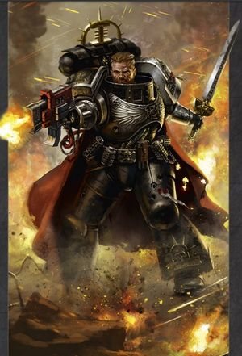
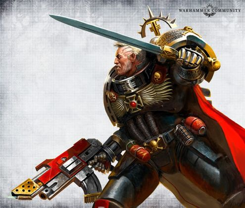
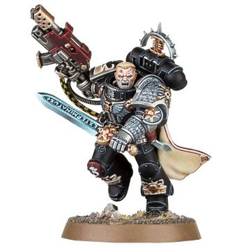
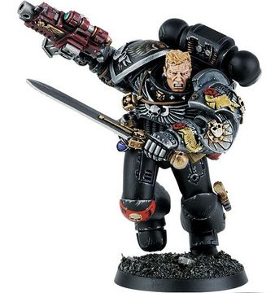

# 0722 阿尔忒弥斯 Artemis

精校状态：中文行文已逐段精校，部分术语仍为暂定

分类：人类帝国 / 死亡守望

原文来源：https://www.bilibili.com/opus/1122049657706381313

原作者：帝国神选罐头

原文时间：2025年10月10日 16:45

[返回分类目录](目录.md) · [全书目录](../../目录.md)

<!-- A0722-B0001 -->
**英文原文**

Artemis is a Space Marine of the Mortifactors Space Marine Chapter, currently serving with the Deathwatch as a Watch Captain of Talasa Prime. He developed uncanny skills for detecting the slightest hint of xenos taint and destroying any alien influence he may find.

<!-- /A0722-B0001 -->

<!-- A0722-B0002 -->

原译文

阿尔忒弥斯是苦行者星际战士战团的一名星际战士，目前在死亡守望担任塔拉萨主星的守望连长。他发展出了一种不可思议的技能，可以检测到任何外来污染的迹象，并摧毁他可能发现的任何外来影响。

**校订译文**

阿尔忒弥斯出身苦行者星际战士战团，现于死亡守望服役，担任塔拉萨主星的守望连长。他能敏锐察觉最细微的异形污染，并摧毁发现的一切异形影响。

**校注：** Watch Captain Artemis 在 GW09/GW10 均第24、25页直接对应守望连长阿尔忒弥斯；仅姓名词根可用于无职衔简称。

<!-- /A0722-B0002 -->

<!-- A0722-B0003 图片 -->

<!-- A0722-B0004 -->

原译文

Artemis 阿尔忒弥斯

**校订译文**

Artemis 阿尔忒弥斯

<!-- /A0722-B0004 -->

<!-- A0722-B0005 -->
### Biography 传记

<!-- /A0722-B0005 -->

<!-- A0722-B0006 -->
**英文原文**

A veteran of a hundred campaigns, Artemis was recruited into the Mortifactors from barbaric nomadic tribes living on the Feral World of Posul a century before joining the Deathwatch. As a youth, Artemis was one of the greatest warriors of his tribe and paved the floor of his father's lodge with the skeletons of his slain enemies. Gaining many enemies due to his reputation, Artemis was ambushed by fifty warriors from an enemy tribe. Succeeding in killing them all, he nonetheless took heavy wounds and was only saved by the Chaplains of the Mortifactors. Recognized for his strength, he was healed by the Chapter's Apothecaries and began the process of being transformed into a Space Marine.

<!-- /A0722-B0006 -->

<!-- A0722-B0007 -->

原译文

阿尔忒弥斯是一名百战老兵，在加入死亡守望之前的一个世纪，他被从生活在波苏尔蛮荒世界的野蛮游牧部落招募到了苦行者。年轻时，阿尔忒弥斯是部落中最伟大的战士之一，他用被杀敌人的骷髅铺满了父亲小屋的地板。由于他的名声，阿尔忒弥斯招致了许多敌人，他被一个敌对部落的五十名战士伏击。尽管他成功地杀死了他们所有人，但他还是受了重伤，只有苦行者的牧师救了他。由于他的力量得到认可，他被战团的药剂师治愈，并开始转变为星际战士。

**校订译文**

阿尔忒弥斯是身经百战的老兵。在加入死亡守望一个世纪前，苦行者从蛮荒世界波苏尔的游牧部落招募了他。少年时，他已是部落最强大的战士之一，用所杀敌人的骸骨铺满父亲住所的地板。名声也为他招来仇敌：一个敌对部落派五十名战士伏击他。他将其全部杀死，自己也身受重伤，幸得苦行者教士救下。战团认可他的实力，命药剂师治好伤势，开始将他改造为星际战士。

<!-- /A0722-B0007 -->

<!-- A0722-B0008 -->
**英文原文**

As a full battle-brother, Artemis quickly distinguished himself and showed great talent in the art of xenos slaying. Such were his skills that he became recognized by the Ordo Xenos, which asked to recruit him into the Deathwatch. Artemis accepted the call and served first under Inquisitor Severnius against Genestealer cults on the Missionary World of St. Capilene, helping save the planet from falling under Tyranid domination. Inquisitor Severnius praised Artemis, promoting him as second-in-command of his kill-team. For two decades he fought alongside Severnius, rooting out alien corruption wherever it may be found. On Varnix Prime, he thwarted a Hrud attempt to capture an Adeptus Mechanicus base and while on the Agri-World of Tarrenhorst he and Severnius discovered an infestation of Warp entities that enslaved entire populations psychically.

<!-- /A0722-B0008 -->

<!-- A0722-B0009 -->

原译文

作为一名完全的战斗兄弟，阿尔忒弥斯很快脱颖而出，在屠杀异型的艺术方面表现出了巨大的天赋。正是由于他的技能，他得到了攘外修会的认可，后者要求招募他加入死亡守望。阿尔忒弥斯接受了这一召唤，首先在圣卡皮伦传教世界的审判官塞维纽斯手下与基因窃取者教派作战，帮助拯救了这个行星，使其免受泰伦统治。审判官塞维纽斯赞扬了阿尔忒弥斯，并提拔他为杀戮小队的二号指挥官。二十年来，他与塞维纽斯并肩作战，在任何地方根除外星腐化。在瓦尔尼克斯主星上，他挫败了赫鲁德试图占领一个机械神教基地的企图，而在塔伦地垒农业世界，他和塞维纽斯发现了一种亚空间实体的侵扰，这些实体在精神上奴役了整个人口。

**校订译文**

成为正式战斗兄弟后，阿尔忒弥斯很快脱颖而出，展现出猎杀异形的杰出天赋。异形审判庭因此注意到他，邀请他加入死亡守望。他接受征召，首先在审判官塞维纽斯麾下，对抗传教世界圣卡皮伦的基因窃取者教派，协助挽救当地，使其免遭泰伦控制。塞维纽斯嘉奖了他，提拔他为杀戮小队副指挥官。此后二十年，两人并肩作战，四处肃清异形污染。在瓦尔尼克斯主星，他挫败赫鲁德夺取机械修会基地的企图；在农业世界塔伦地垒，他与审判官又发现一群亚空间实体，正以灵能奴役整个人口。

<!-- /A0722-B0009 -->

<!-- A0722-B0010 图片 -->

<!-- A0722-B0011 -->

原译文

Artemis 阿尔忒弥斯

**校订译文**

Artemis 阿尔忒弥斯

<!-- /A0722-B0011 -->

<!-- A0722-B0012 -->
**英文原文**

It was Brother Artemis who, with his Kill-Team, answered the request from the Colonel of the Kaslon Regiment on Assumptus V of the Donorian Sector. The Deathwatch destroyed K'nib xenos on this planet and Artemis himself killed the Alcayde of this race, thus ending their incursions into Imperial space (though official records said that victory was obtained by the Kaslon regiment).

<!-- /A0722-B0012 -->

<!-- A0722-B0013 -->

原译文

是阿尔忒弥斯兄弟和他的杀戮小队回应了多诺里安星区升格五号卡斯隆兵团上校的请求。死亡守望摧毁了这个行星上的克'尼卜异型，阿尔忒弥斯自己杀死了这个种族的要塞司令，从而结束了他们对帝国空域的入侵（尽管官方记录说胜利是由卡斯隆兵团取得的）。

**校订译文**

多诺里安星区升格五号的卡斯隆团上校发出求援后，阿尔忒弥斯率杀戮小队前来响应。死亡守望消灭当地的克尼卜异形，他本人则击杀该种族的要塞司令，结束了它们对帝国疆域的侵袭。不过，官方记录将这场胜利归于卡斯隆团。

<!-- /A0722-B0013 -->

<!-- A0722-B0014 -->
**英文原文**

It was against these new foes that Artemis and Severnius encountered one of their most daunting challenges. The creatures began attempting to psychically dominate the Kill-Team and bend them to their will. Though Severnius was able to physically shield most of the Kill-Team, three Space Marines fell under the aliens' control and turned their Bolters on their brethren. A further two Space Marines were cut down by gunfire, but Artemis persevered and hacked down one of his erstwhile allies as the Kill-Team formed a defensive circle, assailed by hordes of alien-dominated victims. Artemis, Severnius, and the two remaining Space Marines fought viciously and were able to barricade themselves in a small temple dedicated to the Emperor. Severnius by this point was exhausted by having to maintain his psychic shield while the three Space Marines desperately held off enemy attacks. For six days this situation continued until the Kill-Team was able to finally contact Thunderhawk gunships and coordinate a rescue. But before the gunship could land, the weakened Servenius was killed by one of the enslaved Space Marines, and command of the Kill-Team now passed to Artemis. Once on their orbiting ship, Artemis declared Exterminatus and blasted the world with Cyclonic Torpedoes.

<!-- /A0722-B0014 -->

<!-- A0722-B0015 -->

原译文

正是面对这些新敌人，阿尔忒弥斯和塞维纽斯遇到了他们最艰巨的挑战之一。这些生物开始试图在心理上主宰杀戮小队，并让他们屈从于自己的意愿。尽管塞维纽斯能够为大部分杀戮小队提供灵能屏障，但三名星际战士落入外星人的控制之下，并将他们的爆矢枪对准了他们的兄弟。又有两名星际战士被炮火击倒，但阿尔忒弥斯坚持下来，击倒了他以前的一个盟友，因为杀戮小队形成了一个防御圈，遭到了成群结队的外星人支配的受害者的攻击。阿尔忒弥斯、塞维纽斯和剩下的两名星际战士进行了激烈的战斗，并成功将自己封锁在一座供奉帝皇的小神殿里。此时，塞维纽斯已经筋疲力尽，因为他不得不在三名星际战士拼命抵抗敌人的攻击时保持他的灵能屏障。这种情况持续了六天，直到杀戮小队最终能够联系到雷鹰炮艇并协调救援。但在炮艇降落之前，被削弱的塞维纽斯被一名被奴役的星际战士杀死，杀戮小队的指挥权现在交给了阿尔忒弥斯。一旦登上他们的轨道舰，阿尔忒弥斯宣布了灭绝令，并用旋风鱼雷轰炸了世界。

**校订译文**

面对这些新敌人，阿尔忒弥斯与塞维纽斯遭遇了最严峻的考验之一。它们企图以灵能控制杀戮小队，迫使战士服从。塞维纽斯虽护住大多数成员，仍有三名星际战士被控制，将爆矢枪转向兄弟，又射杀两人。阿尔忒弥斯奋力抵抗，砍倒一名昔日同伴；小队结成防御圈，迎战成群被异形操纵的受害者。他与审判官及其余两名星际战士苦战，终于退入一座帝皇小神殿固守。三名战士拼命抵挡攻势，塞维纽斯则不断维持灵能护盾，很快疲惫不堪。六天后，他们终于联络上雷鹰炮艇，安排撤离。但炮艇尚未降落，虚弱的审判官便被一名遭控制的星际战士杀死，指挥权随即转至阿尔忒弥斯手中。回到轨道战舰后，他宣布灭绝令，以旋风鱼雷轰击整颗行星。

**校注：** 本段 these new foes 与前一条克尼卜战绩的衔接不明；前文塔伦地垒的灵能侵扰更贴近后续叙述，保留原指代并待核，未擅定灭绝令实施于哪个星球。physically shield 与后文明确 psychic shield 不一致，按后文译灵能保护。

<!-- /A0722-B0015 -->

<!-- A0722-B0016 图片 -->

<!-- A0722-B0017 -->

原译文

Artemis 阿尔忒弥斯

**校订译文**

Artemis 阿尔忒弥斯

<!-- /A0722-B0017 -->

<!-- A0722-B0018 -->
**英文原文**

In the closing days of the 41st Millennium, Artemis foiled the ritual of Eldar Farseer Eldrad Ulthran in the Battle of Port Demesnus. During the battle, Artemis ignored the pleas of the Farseer to cooperate with him as he planned to destroy Slaanesh, stating that he would rather see humanity fall to Chaos rather than trust the word of a xenos. The act inadvertently saved billions of Human lives.

<!-- /A0722-B0018 -->

<!-- A0722-B0019 -->

原译文

在第41个千年的最后几天，阿尔忒弥斯在德米斯诺斯港之战中挫败了灵族先知埃尔德拉德·乌斯兰的仪式。在战斗中，阿尔忒弥斯无视先知的请求，与他合作，因为他计划摧毁色孽，并表示他宁愿看到人类堕入混沌，也不愿相信异型的话。该行动无意中挽救了数十亿人的生命。

**校订译文**

第四十一个千年末，阿尔忒弥斯在德梅斯努斯港之战中挫败灵族大先知艾尔德拉德·乌瑟兰的仪式。大先知声称自己意在消灭色孽，请求与他合作，却遭拒绝。阿尔忒弥斯宣称，宁可眼见人类陷落于混沌，也不会相信异形的承诺。按本篇记述，这一行动却无意间挽救了数十亿人的性命。

**校注：** 保留源文“意在消灭色孽”与“无意挽救数十亿人”两项描述，原文未在本段解释二者关系，不自行补入仪式机制。

<!-- /A0722-B0019 -->

<!-- A0722-B0020 -->
**英文原文**

Artemis continues to serve in the Deathwatch, destroying Xenos infestations wherever he may find them. He has gone on to become one of the most successful members of the Deathwatch, leading Watch Company Tertius of Watch Fortress Talasa Prime.

<!-- /A0722-B0020 -->

<!-- A0722-B0021 -->

原译文

阿尔忒弥斯继续在死亡守望中服役，无论他在哪里发现异型侵扰，都会将其摧毁。他后来成为了死亡守望最成功的成员之一，领导着塔拉萨主星要塞的特尔蒂乌斯守望连队。

**校订译文**

阿尔忒弥斯继续在死亡守望服役，所到之处皆肃清异形侵扰。他已成为该组织最功勋卓著的成员之一，统率塔拉萨主星守望要塞的特尔蒂乌斯守望连。

<!-- /A0722-B0021 -->

<!-- A0722-B0022 图片 -->

<!-- A0722-B0023 -->

原译文

Deathwatch Marine Artemis for Inquisitor 审判官的死亡守望战士阿尔忒弥斯

**校订译文**

Deathwatch Marine Artemis for Inquisitor 《审判官》游戏的死亡守望战士阿尔忒弥斯

**校注：** Inquisitor 此处为游戏名称，而非一名审判官的所有格。官网回顾确认该游戏名称与模型类别：https://www.warhammer-community.com/en-gb/articles/ySR9wOok/40-years-of-warhammer-boxed-games-through-the-ages/；中文游戏名仅作直译。

<!-- /A0722-B0023 -->

<!-- A0722-B0024 -->
### Wargear 战斗装备

原题：Wargear 战备

<!-- /A0722-B0024 -->

<!-- A0722-B0025 -->
**英文原文**

In battle, Artemis is armed with a special Combi-Flamer named Hellfire Extremis; its flamer component uses bio-alchemical toxic fire, the fuel of which stored in a compartment of his backpack. In close combat, he wields the relic power sword Exterminatus. Artemis lost his right hand in battle with Tyranids so it was replaced with a bionic. He also has a bionic eye with bio-detection capability.

<!-- /A0722-B0025 -->

<!-- A0722-B0026 -->

原译文

在战斗中，阿尔忒弥斯装备了一种名为极端地狱火的特殊复合火焰枪；它的火焰组件使用生物炼金毒火，燃料储存在他背包的一个隔间里。在近战中，他挥舞着圣物动力剑灭绝令。阿尔忒弥斯在与泰伦的战斗中失去了右手，所以用仿生手代替了它。他还有一只具有生物探测能力的仿生眼。

**校订译文**

阿尔忒弥斯配备名为极端地狱火的特殊复合喷火器。其火焰喷射组件燃烧生物炼金术制造的剧毒燃料，储料罐位于背包内。近战时，他使用圣物动力剑灭绝令。由于在对抗泰伦时失去右手，他安装了机械义手，还配有具备生命探测能力的机械义眼。

<!-- /A0722-B0026 -->

本篇核心术语与暂定项

以下列出本篇出现的英文原形及核心术语表用词。同形词可能指不同对象，具体词义以本篇正文和校注为准；单复数、别名和仅见于图注的名称可能尚未列入。完整候选见[术语表](../../术语表/双语术语候选.csv)。

| 英文 | 采用中文 | 状态 |
| --- | --- | --- |
| Space Marines | 星际战士 | 官方已核对 |
| Deathwatch | 死亡守望 | 官方已核对 |
| Adeptus Mechanicus | 机械修会 | 官方已核对 |
| Eldar | 灵族 | 暂定·语境区分 |
| Tyranids | 泰伦虫族 | 官方已核对 |
| Genestealer Cults | 基因窃取者教派 | 官方已核对 |
| Warp | 亚空间 | 官方已核对 |
| Inquisitor | 审判官 | 官方已核对 |
| Farseer | 大先知 | 官方已核对 |
| Emperor | 帝皇 | 官方已核对 |
| Agri-World | 农业世界 | 暂定·官方待核 |
| Slaanesh | 色孽 | 官方已核对 |
| Ordo Xenos | 异形审判庭 | 用户指定 |
| Sector | 星区 | 暂定·官方待核 |
| Talasa Prime | 塔拉萨主星 | 暂定·官方待核 |
| Missionary | 传教士 | 暂定 |
| Space Marine | 星际战士 | 暂定·官方待核 |
| Chapter | 战团 | 暂定·官方待核 |
| Captain | 连长 | 暂定·官方待核 |
| Veteran | 老兵 | 暂定·官方待核 |
| Brother | 修士 | 暂定·官方待核 |
| Battle-Brother | 战斗兄弟 | 暂定·官方待核 |
| Artemis | 阿尔忒弥斯 | 暂定·官方待核 |
| Mortifactors | 苦行者 | 暂定·官方待核 |
| Xenos | 异形 | 暂定·官方待核 |
| K'nib | 克尼卜 | 暂定·官方待核 |
| Hrud | 赫鲁德 | 暂定·官方待核 |
| Eldrad Ulthran | 艾尔德拉德·乌瑟兰 | 官方已核对 |
| Port Demesnus | 德梅斯努斯港 | 暂定·官方待核 |
| Tribe | 部落（欧克组织） | 暂定·官方待核 |
| Chaplains | 教士 | 暂定·官方待核 |
| Watch Captain | 守望连长 | 暂定·官方待核 |
| Posul | 波苏尔 | 暂定·官方待核 |
| Severnius | 塞维纽斯 | 暂定·官方待核 |
| St. Capilene | 圣卡皮伦 | 暂定·官方待核 |
| Varnix Prime | 瓦尔尼克斯主星 | 暂定·官方待核 |
| Tarrenhorst | 塔伦地垒 | 暂定·官方待核 |
| Donorian Sector | 多诺里安星区 | 暂定·官方待核 |
| Assumptus V | 升格五号 | 暂定·官方待核 |
| Kaslon Regiment | 卡斯隆团 | 暂定·官方待核 |
| Watch Company Tertius | 特尔蒂乌斯守望连 | 暂定·官方待核 |
| Hellfire Extremis | 极端地狱火 | 暂定·官方待核 |
| Feral World | 蛮荒世界 | 暂定·官方待核 |
| Corruption | 腐败 | 暂定·官方待核 |
| Combi-Flamer | 复合喷火器 | 暂定·官方待核 |
| Flamer | 火焰喷射器（武器）／火妖（奸奇单位） | 语境定译·对应官译已核 |

