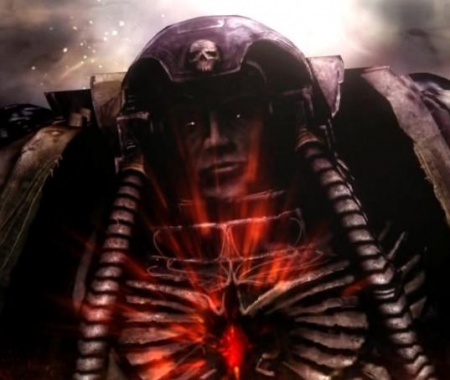

# 0723 亚撒利雅·凯拉斯 Azariah Kyras

精校状态：中文行文已逐段精校，部分术语仍为暂定

分类：人类帝国 / 血鸦

原文来源：https://www.bilibili.com/opus/1209683573408268312

原作者：帝国神选罐头

原文时间：2026年06月03日 20:30

[返回分类目录](目录.md) · [全书目录](../../目录.md)

<!-- A0723-B0001 -->

原译文

"Faithful... enlightened... ambitious... bretheren. In but a single decade -a few mere swipes of the pendulum- we have gathered a sacrifice to Khorne that will be made legend. Though it was a simpler, weaker voice that illuminated me during my centuries upon the Judgement of Carrion...it was Khorne's messenger who showed me the true path of freedom from our pathetic corpse Emperor. And what is this path? This meaning, this purpose to which we gather the skulls of our foes? It is nothing. There is no meaning, no purpose. We murder. We kill. It is mindless savagery, this UNIVERSE is mindless. In mere hours, billions will die! Innocent! Guilty! Strong and weak! Honest and deceitful! ALL of them! They will scream, they will burn, and for no purpose but that mighty Khorne may revel in their bloodshed! And united in this void of purpose, fear, or duty... we shall at long last be free! Blood for the blood good! Skulls for the skull throne! Let the galaxy BURN!" - Azariah Kyras “忠诚…启发…野心…兄弟。在短短十年内，仅仅几次钟摆的摆动，我们就为恐虐收集了一份将成为传奇的祭祀。尽管在腐尸审判号的几个世纪里，是一个更简单、更微弱的声音启明了我……是恐虐的信使向我展示了从我们可悲的尸皇那里获得自由的真正道路。这条路是什么？这意味着，我们收集敌人颅骨的目的是什么？没什么。没有意义，没有目的。我们谋杀。我们杀戮。这是无脑的残暴行为，这个宇宙是无意识的。仅仅几个小时，数十亿人就会死亡！无罪！有罪！强者和弱者！诚实和欺骗！他们所有人！他们会尖叫，他们会燃烧，除了强大的恐虐可能会陶醉于他们的流血之外，没有任何目的！在这种没有目的、恐惧或责任的情况下团结起来……我们最终将会自由！血祭血神！颅献颅座！让银河燃烧！” - 亚撒利雅·凯拉斯

**校订译文**

"Faithful... enlightened... ambitious... bretheren. In but a single decade -a few mere swipes of the pendulum- we have gathered a sacrifice to Khorne that will be made legend. Though it was a simpler, weaker voice that illuminated me during my centuries upon the Judgement of Carrion...it was Khorne's messenger who showed me the true path of freedom from our pathetic corpse Emperor. And what is this path? This meaning, this purpose to which we gather the skulls of our foes? It is nothing. There is no meaning, no purpose. We murder. We kill. It is mindless savagery, this UNIVERSE is mindless. In mere hours, billions will die! Innocent! Guilty! Strong and weak! Honest and deceitful! ALL of them! They will scream, they will burn, and for no purpose but that mighty Khorne may revel in their bloodshed! And united in this void of purpose, fear, or duty... we shall at long last be free! Blood for the blood good! Skulls for the skull throne! Let the galaxy BURN!" - Azariah Kyras “忠诚的……开悟的……雄心勃勃的……兄弟们。短短十年，不过钟摆几次来回，我们就为恐虐备下了足以载入传说的祭品。虽然在腐尸审判号上度过的数百年间，最初点醒我的是一个更简单、更微弱的声音，但真正指明自由之路，让我摆脱那可悲尸皇的，是恐虐的使者。而这条路是什么？我们收集仇敌头颅，究竟有何意义，又有何目的？什么都没有。没有意义，没有目的。我们谋杀，我们杀戮。这只是盲目的残暴；整个宇宙本就盲目无知。再过几个小时，数十亿人就将死去！无辜者！有罪者！强者与弱者！诚实者与奸诈者！所有人！他们将尖叫，他们将燃烧，除了让伟大的恐虐尽情享受鲜血横流，再无其他目的！当我们合为一体，抛却目的、恐惧与职责……我们终于将获得自由！血祭血神！颅献颅座！让银河燃烧！”——亚撒利雅·凯拉斯

**校注：** 原中英混合引文的英文逐字保留，含 bretheren、blood good 等源文拼写错误；中文按 brethren、Blood God 的明确语境译。引文是凯拉斯的虚无主义宣言，不代表编者立场。

<!-- /A0723-B0001 -->

<!-- A0723-B0002 -->
**英文原文**

Azariah Kyras was the leader — Chapter Master and Chief Librarian both – of the Blood Ravens.

<!-- /A0723-B0002 -->

<!-- A0723-B0003 -->

原译文

亚撒利雅·凯拉斯是血鸦的领袖 — 战团长和首席智库。

**校订译文**

亚撒利雅·凯拉斯曾是血鸦领袖，兼任战团长与首席智库员。

<!-- /A0723-B0003 -->

<!-- A0723-B0004 图片 -->

<!-- A0723-B0005 -->

原译文

Azariah Kyras 亚撒利雅·凯拉斯

**校订译文**

Azariah Kyras 亚撒利雅·凯拉斯

<!-- /A0723-B0005 -->

<!-- A0723-B0006 -->
## Biography 传记

<!-- /A0723-B0006 -->

<!-- A0723-B0007 -->
**英文原文**

Relatively little is known of the leader of the Blood Ravens. What is known is that 1,000 years before the Black Legion's invasion of Subsector Aurelia, planet Aurelia disappeared during a Warp Storm after being pushed sufficiently out of orbit for the planet to be covered with glaciers and almost the whole population killed. Just before the planet was taken by the Warp, Epistolary Kyras managed to imprison a wounded Great Unclean One of Nurgle by the name of Ulkair, after his master Moriah was killed fighting it. Soon after, the Warp took the planet, and Azariah Kyras with it.

<!-- /A0723-B0007 -->

<!-- A0723-B0008 -->

原译文

人们对血鸦的领袖知之甚少。众所周知的是，在黑色军团入侵奥瑞利亚分区的1000年前，奥瑞利亚行星在一次亚空间风暴中消失了，因为它被推离了轨道，被冰川覆盖，几乎全部人口死亡。就在这颗行星被亚空间夺取之前，星语官凯拉斯在他的导师摩利亚被杀后，设法监禁了一个名叫乌凯尔的受伤的纳垢大不净者。不久之后，亚空间夺取了这颗行星，亚撒利雅·凯拉斯也随之而去。

**校订译文**

这位血鸦领袖的生平所知甚少。已知的是，黑色军团入侵奥瑞利亚次星区约一千年前，奥瑞利亚行星在亚空间风暴中偏离轨道，最终冰川覆盖全球，居民几乎全部死去，行星也随之消失。在它被亚空间吞没前，星语官凯拉斯的导师莫里亚与纳垢大不净者乌凯尔交战身亡，凯拉斯则设法囚禁了受伤的恶魔。随后，行星与他本人一同被卷入亚空间。

**校注：** Epistolary 沿已定星语官，区别 Astropath 星语者。Moriah 沿318较早莫里亚，本篇原摩利亚。

<!-- /A0723-B0008 -->

<!-- A0723-B0009 -->
**英文原文**

Assumed dead, Kyras was posthumously awarded honours for bravery. Kyras returned five centuries later, appearing inexplicably before the battered elements of the Blood Ravens 5th Company aboard a space hulk called the Judgment of Carrion. Kyras aided Apothecary Galan, the leader of the expedition, in fighting the daemons and Tyranids infesting the hulk. Though the Space Marines had found a lost Battle-Brother, they were still marooned, unable to escape. Their "exits sealed, and beacons failed," Galan and his Marines were given to despair. Galan was haunted by a daemonic presence, which was given name when Kyras regaled the other survivors with his tale of losses endured by their Chapter in imprisoning Ulkair. The daemon reached out from his imprisonment within the Warp-swallowed world of Aurelia, tormenting the Blood Ravens and hungering for their gene-seed. Kyras did nothing to hinder the defeatist mood, and spread the taint of Chaos into his brothers instead. Eventually Kyras made a pact with Ulkair for their release from the Judgment of Carrion, which required that Galan be possessed by a daemon of the Warp.

<!-- /A0723-B0009 -->

<!-- A0723-B0010 -->

原译文

凯拉斯被假定死亡，并因勇气而被追授荣誉。五个世纪后，凯拉斯返回，在一艘名为腐尸审判号的太空废船上，莫名其妙地出现在血鸦第五连队的残破成员面前。凯拉斯协助探索队领袖药剂师加兰与侵扰废船的恶魔和泰伦作战。尽管星际战士已经找到了一个失踪的战斗兄弟，但他们仍然被困，无法逃脱。他们的“出口被封锁，信标失灵”，加兰和他的战士陷入绝望。被一个恶魔实体所困扰，当凯拉斯向其他幸存者讲述他们的战团在监禁乌凯尔时所遭受的损失时，这个实体就被命名了。恶魔从被囚禁在被亚空间吞噬的奥瑞利亚世界中伸出手来，折磨着血鸦，渴望得到他们的基因种子。凯拉斯没有采取任何行动来阻碍失败主义情绪，而是将混乱的污染传播给了他的兄弟们。最终，凯拉斯与乌凯尔达成了一项协议，将他们从腐尸身审判号中释放出来，该契约要求加兰被亚空间恶魔所占据。

**校订译文**

凯拉斯被认定战死，并因英勇行为获追授荣誉。五百年后，他却离奇地出现在太空废船腐尸审判号上，与伤亡惨重的血鸦第五连残部相遇。他协助探索队指挥官、药剂师加兰，迎战盘踞废船的恶魔与泰伦。然而，寻回失踪兄弟并未使他们脱困：“出口封死，信标失灵”，加兰与战士们渐渐陷入绝望。一个恶魔般的存在始终纠缠加兰；当凯拉斯讲述战团当年为囚禁乌凯尔付出的代价时，众人才明白它的身份。乌凯尔从被亚空间吞没的奥瑞利亚牢狱中伸出意志，折磨血鸦，觊觎他们的基因种子。凯拉斯不仅没有阻止绝望蔓延，反而向兄弟传播混沌腐化。最终，他与乌凯尔达成契约，换取众人逃离腐尸审判号的机会，而代价是让加兰被亚空间恶魔附身。

**校注：** given name 指从叙述中识别出纠缠者是乌凯尔，并非当场给恶魔命名；腐化对象为战团兄弟，不能将 Chaos 译为一般混乱。

<!-- /A0723-B0010 -->

<!-- A0723-B0011 -->
**英文原文**

Both Galan and Kyras escaped the Judgment of Carrion, and Kyras' return was hailed as a blessing by elements of the Blood Ravens, but not by the Captain of the 3rd Company, Gabriel Angelos who viewed the return of Kyras as an ill omen. Sometime thereafter, Kyras rose to the ranks of both Chief Librarian and Chapter Master. Galan was stationed as an Apothecary within the Honour Guard. Angelos subtly investigated Kyras' actions.

<!-- /A0723-B0011 -->

<!-- A0723-B0012 -->

原译文

加兰和凯拉斯都逃脱了腐尸审判号，凯拉斯的回归被血鸦的成员誉为祝福，但第三连队连长加百列·安杰罗斯却认为凯拉斯的归来是凶兆。此后的某个时候，凯拉斯晋升为首席智库和战团长。加兰在荣誉卫队中担任药剂师。安杰罗斯巧妙地调查了凯拉斯的行动。

**校订译文**

加兰与凯拉斯都逃出了腐尸审判号。部分血鸦视凯拉斯归来为祝福，第三连连长加百列·安杰罗斯却将其看作凶兆。此后，凯拉斯陆续执掌首席智库员与战团长之位，加兰则调任荣誉卫队药剂师。安杰罗斯暗中调查着凯拉斯的举动。

<!-- /A0723-B0012 -->

<!-- A0723-B0013 -->
## The Second Aurelian Crusade 第二次奥瑞利安远征

原题：The Second Aurelian Crusade 第二次奥瑞利亚远征

<!-- /A0723-B0013 -->

<!-- A0723-B0014 -->
**英文原文**

The Black Legion's invasion into subsector Aurelia finally revealed Kyras' corruption. The Blood Ravens attached to the 4th Company boarded the Judgment of Carrion and discovered evidence left behind by Galan and Kyras, suggesting chaotic influence and revealing the pact with Ulkair.

<!-- /A0723-B0014 -->

<!-- A0723-B0015 -->

原译文

黑色军团入侵奥瑞利亚分区最终揭露了凯拉斯的腐化。附属于第四连队的血鸦登上了腐尸审判号，发现了加兰和凯拉斯留下的证据，表明存在混沌的影响，并揭示了与乌凯尔的契约。

**校订译文**

黑色军团入侵奥瑞利亚次星区，终于揭开凯拉斯腐化的真相。配属第四连的血鸦登上腐尸审判号，发现加兰与凯拉斯留下的证据，既显示出混沌影响，也揭露了他们与乌凯尔的契约。

<!-- /A0723-B0015 -->

<!-- A0723-B0016 -->
**英文原文**

Kyras himself was not present in the subsector during the invasion, instead having sent Captain Apollo Diomedes of the Honour Guard to represent his authority and order a withdrawal from any contact with the Black Legion. However, according to Galan's confession as he lay mortally wounded by the Force Commander, Diomedes himself was not corrupted; only some of the men under his command had been tainted.

<!-- /A0723-B0016 -->

<!-- A0723-B0017 -->

原译文

在入侵期间，凯拉斯本人没有在该分区在场，而是派荣誉卫队的阿波罗·狄俄墨得斯连长代表他的权力，命令他退出与黑色军团的任何接触。然而，根据加兰在被部队指挥官重伤时的供词，狄俄墨得斯本人并没有腐化；只有他手下的一些人受到了污染。

**校订译文**

入侵期间，凯拉斯本人不在次星区内。他派荣誉卫队连长阿波罗·狄俄墨得斯代表自己，下令部队撤离，避免与黑色军团接触。不过，加兰被战团部队指挥官击成重伤后供认，狄俄墨得斯本人并未腐化，受到污染的只是部分部下。

**校注：** 原文 Force Commander 为部队指挥官称号，未自行补入其姓名。

<!-- /A0723-B0017 -->

<!-- A0723-B0018 -->
**英文原文**

Gabriel Angelos and Aramus disobeyed the Chapter Master's order to withdraw and stayed to defeat the stirring Ulkair on Aurelia. The ending of the game states that the "renegade" Blood Ravens plan to depose Kyras, creating a prologue for a Chapter-wide civil war. Kyras declared Angelos and his follows traitors and ordered the Marines loyal to him to hunt them down.

<!-- /A0723-B0018 -->

<!-- A0723-B0019 -->

原译文

加百列·安杰罗斯和阿拉穆斯不服从战团长的命令撤退，留下来击败奥瑞利亚上出现的乌凯尔。游戏的结局表明，“变节”血鸦计划推翻凯拉斯，为全战团内战拉开序幕。凯拉斯宣布安杰罗斯和他的追随者是叛徒，并命令忠于他的战士追捕他们。

**校订译文**

加百列·安杰罗斯与阿拉莫斯违抗撤退命令，留在奥瑞利亚击败了再度兴风作浪的乌凯尔。游戏结局表明，这些被称作“变节者”的血鸦计划推翻凯拉斯，一场波及全战团的内战由此揭幕。凯拉斯则宣布安杰罗斯及其追随者为叛徒，命忠于自己的战士追杀他们。

<!-- /A0723-B0019 -->

<!-- A0723-B0020 -->
## Kyras the Ascended 升格者凯拉斯

<!-- /A0723-B0020 -->

<!-- A0723-B0021 -->
**英文原文**

Ten years after the Second Aurelian Crusade, the subsector remained in turmoil as remnants of the Black Legion, Orks and Tyranids continued to cause further chaos on the Imperial worlds. The civil war amongst the Chapter also continued, which combined with the chaos, forced the Inquisition to declare Exterminatus on the entire subsector. In order to prevent this, Captain Diomedes investigated the allegations made by Captain Angelos, resolved to either prove Kyras' corruption, or to redeem him.

<!-- /A0723-B0021 -->

<!-- A0723-B0022 -->

原译文

第二次奥瑞利安远征十年后，该分区仍处于动荡之中，因为黑色军团、欧克和泰伦的残余继续在帝国世界造成进一步的混乱。战团之间的内战也在继续，再加上混沌，迫使审判庭宣布对整个分区进行灭绝令。为了防止这种情况，狄俄墨得斯连长调查了安杰罗斯连长的指控，决定要么证明凯拉斯的腐化，要么救赎他。

**校订译文**

第二次奥瑞利安远征十年后，次星区仍未恢复安宁。黑色军团残部、欧克蛮人与泰伦继续蹂躏帝国世界，血鸦内部的内战也尚未结束。这些乱象最终迫使审判庭对整个次星区宣布灭绝令。为阻止这场毁灭，狄俄墨得斯开始调查安杰罗斯的指控，决心要么证实凯拉斯已腐化，要么还他清白。

**校注：** redeem him 在调查指控的语境中译还其清白，而非已经证实腐化后再进行灵魂救赎。civil war amongst the Chapter 是战团内部内战。

<!-- /A0723-B0022 -->

<!-- A0723-B0023 -->
**英文原文**

The resulting investigation proved that Kyras had fully committed himself to Chaos, orchestrating the events in Subsector Aurelia to force the Exterminatus. Diomedes confirmed that, while the whispers of the Great Unclean One Ulkair started Kyras on the path to Chaos, it was ultimately the daemon of Khorne released from the Maledictum by Gabriel Angelos on Tartarus that fully convinced Kyras to forsake the Emperor. Kyras eventually extended this offer to Diomedes, but was rejected.

<!-- /A0723-B0023 -->

<!-- A0723-B0024 -->

原译文

由此产生的调查证明，凯拉斯完全致力于混沌，策划了奥瑞利亚分区的事件，以迫使灭绝令。狄俄墨得斯证实，虽然大不净者乌凯尔的低语让凯拉斯走上了混沌之路，但最终是加百列·安杰罗斯在塔尔塔罗斯从诅咒之石中释放的恐虐恶魔完全说服凯拉斯抛弃了帝皇。凯拉斯最终向狄俄墨得斯提出了这一提议，但遭到了拒绝。

**校订译文**

调查证明，凯拉斯已彻底投向混沌，并暗中操纵奥瑞利亚次星区的局势，目的正是迫使帝国实施灭绝令。狄俄墨得斯确认，最初诱使凯拉斯踏上混沌之路的是乌凯尔的低语；但最终促使他彻底抛弃帝皇的，是加百列·安杰罗斯在塔尔塔罗斯打碎诅咒之印时释放的恐虐恶魔。后来，凯拉斯也邀请狄俄墨得斯加入，却被拒绝。

**校注：** Maledictum 沿318及724诅咒之印，与 Cicatrix Maledictum 大裂隙无关；原本篇诅咒之石为同物异译。

<!-- /A0723-B0024 -->

<!-- A0723-B0025 -->
**英文原文**

With the Exterminatus under way, Kyras went to Cyrene, a former Blood Raven recruiting world that had been subject to Exterminatus years before. There Kyras' ascension to Daemon Prince was interrupted by Blood Ravens forces under Angelos and Diomedes arriving as reinforcements. Though Kyras severely wounded Angelos in the course of ensuing battle, he was ultimately defeated and slayed by Captain Diomedes himself.

<!-- /A0723-B0025 -->

<!-- A0723-B0026 -->

原译文

随着灭绝令的进行，凯拉斯去了昔兰尼，一个多年前曾受灭绝令影响的前血鸦招募世界。在那里，凯拉斯升格恶魔王子的过程被安杰罗斯和狄俄墨得斯率领的血鸦部队作为增援部队打断。尽管凯拉斯在随后的战斗中重伤了安杰罗斯，但他最终还是被狄俄墨得斯连长本人击败并杀死。

**校订译文**

灭绝令开始执行后，凯拉斯前往昔兰尼。这颗昔日血鸦征兵世界，多年前便已遭过灭绝令摧残。他在那里举行升格恶魔亲王的仪式，却遭安杰罗斯率领的血鸦，以及赶来增援的狄俄墨得斯部队打断。交战中，他重创安杰罗斯，最终仍被狄俄墨得斯连长亲手击败并杀死。

**校注：** 原文的增援与升格过程按本段叙事保留，不据游戏分支结局补写其他可能的击杀者。

<!-- /A0723-B0026 -->

<!-- A0723-B0027 -->
**英文原文**

Angelos succeeded Kyras as Chapter Master after a bloody purge of the tainted elements of the Chapter.

<!-- /A0723-B0027 -->

<!-- A0723-B0028 -->

原译文

在对战团中的被污染成员进行血腥清洗后，安杰罗斯接替凯拉斯成为战团长。

**校订译文**

血鸦对遭腐化的成员展开血腥清洗后，安杰罗斯接替凯拉斯，成为战团长。

<!-- /A0723-B0028 -->

本篇核心术语与暂定项

以下列出本篇出现的英文原形及核心术语表用词。同形词可能指不同对象，具体词义以本篇正文和校注为准；单复数、别名和仅见于图注的名称可能尚未列入。完整候选见[术语表](../../术语表/双语术语候选.csv)。

| 英文 | 采用中文 | 状态 |
| --- | --- | --- |
| Space Marines | 星际战士 | 官方已核对 |
| Tyranids | 泰伦虫族 | 官方已核对 |
| Orks | 欧克蛮人 | 官方已核对 |
| Librarian | 智库员 | 官方已核对 |
| Warp | 亚空间 | 官方已核对 |
| Inquisition | 审判庭 | 暂定 |
| Khorne | 恐虐 | 官方已核对 |
| Nurgle | 纳垢 | 官方已核对 |
| Apollo Diomedes | 阿波罗·狄俄墨得斯 | 暂定 |
| Azariah Kyras | 亚撒利雅·凯拉斯 | 暂定 |
| Subsector Aurelia | 奥瑞利亚次星区 | 暂定 |
| Blood Ravens | 血鸦 | 暂定 |
| Emperor | 帝皇 | 官方已核对 |
| Daemon Prince | 恶魔亲王 | 官方已核对 |
| Black Legion | 黑色军团 | 暂定·官方待核 |
| Subsector | 次星区 | 暂定·官方待核 |
| Epistolary | 星语官 | 暂定·官方待核 |
| Chief Librarian | 首席智库员 | 暂定·官方待核 |
| Master | 导师（审判庭职衔）／舰务官（舰员职务） | 语境定译·官方待核 |
| Apothecary | 药剂师 | 官方已核对 |
| Honour Guard | 荣誉卫队 | 暂定·官方待核 |
| Chapter | 战团 | 暂定·官方待核 |
| Chapter Master | 战团长 | 暂定·官方待核 |
| Captain | 连长 | 暂定·官方待核 |
| Brother | 修士 | 暂定·官方待核 |
| Battle-Brother | 战斗兄弟 | 暂定·官方待核 |
| Gabriel Angelos | 加百列·安杰罗斯 | 暂定·官方待核 |
| Aramus | 阿拉莫斯 | 暂定·官方待核 |
| Remnants | 残骸 | 暂定·官方待核 |
| Gene-seed | 基因种子 | 暂定·官方待核 |
| Great Unclean One | 大不净者 | 官方已核对 |
| The Tainted | 污染者 | 暂定·官方待核 |
| The Blood | 鲜血 | 暂定·官方待核 |
| Moriah | 莫里亚 | 暂定·官方待核 |
| Second Aurelian Crusade | 第二次奥瑞利安远征 | 暂定·官方待核 |
| Maledictum | 诅咒之印 | 暂定·官方待核 |
| Warp Storm | 亚空间风暴 | 暂定·官方待核 |
| Cyrene | 昔兰尼 | 暂定·官方待核 |
| Corruption | 腐败 | 暂定·官方待核 |
| Omen | 预兆号 | 暂定·官方待核 |

