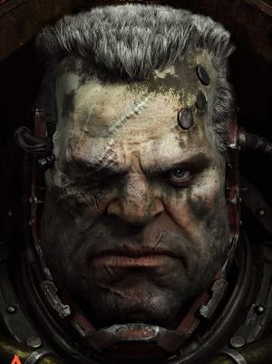
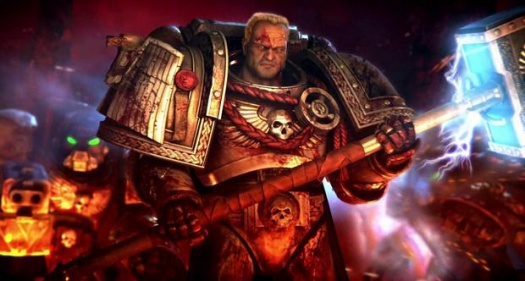
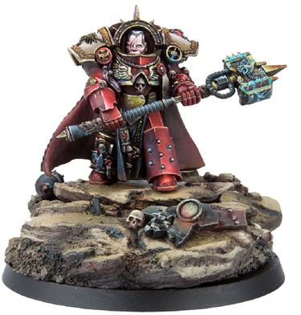
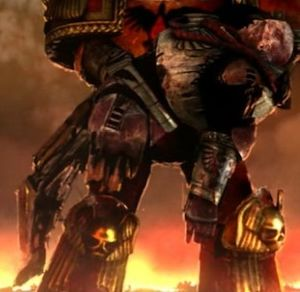
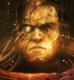
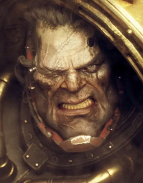

# 0724 加百列·安杰罗斯 Gabriel Angelos

精校状态：中文行文已逐段精校，部分术语仍为暂定

分类：人类帝国 / 血鸦

原文来源：https://www.bilibili.com/opus/1122338232256692264

原作者：帝国神选罐头

原文时间：2025年10月11日 11:25

[返回分类目录](目录.md) · [全书目录](../../目录.md)

原篇名：加百列·安杰洛斯 Gabriel Angelos

<!-- A0724-B0001 -->
**英文原文**

Gabriel Angelos is the Chapter Master of the Blood Ravens, and widely regarded as one of the Chapter's greatest heroes.

<!-- /A0724-B0001 -->

<!-- A0724-B0002 -->

原译文

加百列·安杰洛斯是血鸦的战团长，被广泛认为是战团最伟大的英雄之一。

**校订译文**

加百列·安杰罗斯是血鸦战团长，被广泛视为战团最伟大的英雄之一。

**校注：** Gabriel Angelos 沿247既定加百列·安杰罗斯，统一本篇安杰洛斯、安杰罗斯、加百利等异写。

<!-- /A0724-B0002 -->

<!-- A0724-B0003 图片 -->

<!-- A0724-B0004 -->

原译文

Gabriel Angelos 加百列·安杰洛斯

**校订译文**

Gabriel Angelos 加百列·安杰罗斯

<!-- /A0724-B0004 -->

<!-- A0724-B0005 -->
### Biography 传记

<!-- /A0724-B0005 -->

<!-- A0724-B0006 -->
### Early Life 早期生活

<!-- /A0724-B0006 -->

<!-- A0724-B0007 -->
**英文原文**

Like many of the Blood Ravens Gabriel was born on the planet of Cyrene, from whence the Chapter often drew recruits. He was an accomplished leader of his peers before he even entered his teen years, and passed the Blood Trials set by the Blood Ravens' Chaplains through working in tandem with fellow Aspirant Isador Akios.

<!-- /A0724-B0007 -->

<!-- A0724-B0008 -->

原译文

像许多血鸦一样，加百列出生在昔兰尼行星，战团经常从那里招募新兵。在进入青少年时期之前，他已经是同龄人中一位有成就的领导者，并通过与有志者伊萨多·阿基奥斯合作，通过了血鸦牧师设定的鲜血试验。

**校订译文**

与许多血鸦一样，加百列出生于战团经常征兵的昔兰尼。他尚未进入少年期，便已是同龄人中的出色领袖。后来，他与同为候选者的伊萨多·阿基奥斯通力合作，通过了血鸦教士设置的鲜血试炼。

<!-- /A0724-B0008 -->

<!-- A0724-B0009 -->
### Cyrene 昔兰尼

<!-- /A0724-B0009 -->

<!-- A0724-B0010 -->
**英文原文**

Many years later, with an entire Company of Blood Ravens under his command, Gabriel returned to Cyrene to preside over the Blood Trials and recruit new members into the Chapter. But Gabriel found something very wrong during the trial and cut them short. He quickly returned to his Strike Cruiser and sent a coded signal out of the system. Within months of the signal, ships of the Inquisition and the Imperial Navy appeared over Cyrene and began the cleansing of the planet. Accompanying the Ordo Malleus was a full Brotherhood of Grey Knights. With the Blood Ravens and a detachment of Storm Troopers, the Grey Knights took the cleansing to the surface. What they found was not a Chaos cult per se but a world ready to embrace change. Ideas like democracy, un-registered Psykers and free trade with Xenos were now widespread. Gabriel assisted with the destruction of his world but ordered one squad of Blood Ravens, led by Sergeant Ulray to remain off the grid, searching for someone.

<!-- /A0724-B0010 -->

<!-- A0724-B0011 -->

原译文

许多年后，在他的指挥下，加百列率领整个血鸦连队回到昔兰尼主持鲜血试炼，并招募新成员加入战团。但加百列在试炼中发现了一些非常错误的地方，并打断了他们。他迅速返回他的打击巡洋舰，并从星系中发送了一个编码信号。在信号发出后的几个月内，审判庭和帝国海军的舰船出现在昔兰尼上空，开始清理行星。陪同圣锤修会的是一个完整的灰骑士兄弟会。凭借血鸦和一支冲锋队，灰骑士将清洗带到了表面。他们发现的不是混沌教派本身，而是一个准备接受变化的世界。民主、非法灵能者和与异型的自由贸易等想法现在很普遍。加百列协助摧毁了他的世界，但命令由乌尔雷军士率领的一支血鸦小队远离坐标，寻找某人。

**校订译文**

多年后，加百列已统率整整一连血鸦，返回昔兰尼主持鲜血试炼，招募新血。但他察觉情况严重不对，提前终止试炼，迅速返回打击巡洋舰，向星系外发出加密信号。数月内，审判庭与帝国海军的舰船抵达昔兰尼上空，开始净化行星。一整个灰骑士兄弟会随恶魔审判庭到来，在血鸦及一支风暴兵分遣队协助下，将清洗推进到地表。他们发现的并非严格意义上的混沌教派，而是一个准备迎接变革的世界：民主思潮、未经登记的灵能者，以及与异形自由贸易等现象已经普及。加百列参与毁灭自己的故乡，却暗令乌尔雷军士率一支小队脱离公开行动，寻找一个人。

**校注：** Storm Troopers 为风暴兵，非一般冲锋队；off the grid 指脱离公开监视或调度，不是远离某组地理坐标。对世界思想变化的描述依原文保留。

<!-- /A0724-B0011 -->

<!-- A0724-B0012 图片 -->

<!-- A0724-B0013 -->

原译文

Gabriel Angelos as Captain of the Blood Ravens Third Company 加百列·安杰洛斯作为血鸦第三连队连长

**校订译文**

Gabriel Angelos as Captain of the Blood Ravens Third Company 担任血鸦第三连连长时的加百列·安杰罗斯

<!-- /A0724-B0013 -->

<!-- A0724-B0014 -->
**英文原文**

That person was Esmond Angelos, Gabriel's father. Gabriel refused to believe that his father, a retired Imperial Guard soldier, would have turned away from the Emperor. He fully intended to take Esmond back with him to the Chapter. But to Gabriel's horror he discovered that his father not only supported rebellion against the Imperium, but was one of the major political leaders. Esmond despised the Imperium because the Space Marines had taken away his own son and cursed Gabriel for his role as an Imperial butcher and wished he had died with his mother in childbirth. Gabriel whispered one last prayer for Cyrene and executed his father.

<!-- /A0724-B0014 -->

<!-- A0724-B0015 -->

原译文

那个人就是加百列的父亲埃斯蒙德·安杰洛斯。加百列拒绝相信他的父亲，一名退役的帝国卫队士兵，会背离帝皇。他完全打算带埃斯蒙德回到战团。但令加百列惊恐的是，他发现他的父亲不仅支持反抗帝国，而且是主要的政治领导人之一。埃斯蒙德鄙视帝国，因为星际战士带走了他自己的儿子，诅咒加百列扮演帝国屠夫的角色，并希望他在分娩时和母亲一起死去。加百列低声为昔兰尼做了最后一次祈祷，然后处决了他的父亲。

**校订译文**

那个人是他的父亲，埃斯蒙德·安杰罗斯。加百列不相信这位退役帝国卫队士兵会背弃帝皇，本打算将他带回战团。但他惊恐地发现，父亲不仅支持反抗帝国，还是其中一位重要政治领袖。星际战士夺走儿子，使埃斯蒙德憎恨帝国。他斥责加百列沦为帝国屠夫，甚至宁愿儿子当年与母亲一同死于分娩。加百列最后低声为昔兰尼祈祷，然后亲手处决父亲。

<!-- /A0724-B0015 -->

<!-- A0724-B0016 -->
### Tartarus 塔尔塔罗斯

<!-- /A0724-B0016 -->

<!-- A0724-B0017 -->
**英文原文**

It was on Tartarus that Gabriel was to undergo the true tests of his abilities and his faith, as he had to both stall an unstoppable Ork invasion long enough to evacuate the planet, while simultaneously seeking out and eradicating the Alpha Legion forces on the world, led by Lord Bale and the Chaos Sorcerer Sindri Myr. The Chaos forces were searching for a ancient artifact called the Maledictum, and the sorcerer Sindri managed to corrupt Isador Akios, now a Librarian of the Blood Ravens Chapter, into betraying the Blood Ravens.

<!-- /A0724-B0017 -->

<!-- A0724-B0018 -->

原译文

在塔尔塔罗斯，加百列将接受对其能力和信仰的真正考验，因为他必须拖延一场不可阻挡的欧克入侵，以撤离行星，同时寻找并消灭世界上由贝尔领主和混沌巫师辛德里·米尔领导的阿尔法军团。混沌势力正在寻找一种名为诅咒之印的古代神器，巫师辛德里设法腐化了伊萨多·阿基奥斯，他现在是血鸦战团的智库，背叛了血鸦。

**校订译文**

在塔尔塔罗斯，加百列的能力与信仰迎来真正考验。他既要拖住势不可挡的欧克入侵，为行星撤离争取时间，又必须找出并消灭贝尔领主与混沌巫师辛德里·米尔统率的阿尔法军团部队。敌人正在寻找名为诅咒之印的古老遗物。辛德里还诱使此时已成为血鸦智库员的伊萨多·阿基奥斯堕落，背叛了战团。

<!-- /A0724-B0018 -->

<!-- A0724-B0019 -->
**英文原文**

Gabriel, shaken by the loss of his old friend Isador Akios, nonetheless confronted him and executed him for heresy. He went on to lead the Blood Ravens against Chaos, slaying Lord Bale in a duel and eventually defeating Sindri Myr, who had used the Maledictum to become a Daemon Prince.

<!-- /A0724-B0019 -->

<!-- A0724-B0020 -->

原译文

加百列因老朋友伊萨多·阿基奥斯的迷失而震惊，尽管如此，他还是与他对峙，并因异端处决了他。他继续领导血鸦对抗混沌，在决斗中杀死了贝尔领主，并最终击败了辛德里·米尔，后者曾使用诅咒之印成为恶魔王子。

**校订译文**

老友伊萨多的堕落令加百列深受打击，但他仍直面对方，以异端之罪将其处决。随后，他继续率血鸦对抗混沌，在决斗中斩杀贝尔领主，最终又击败了借诅咒之印升格为恶魔亲王的辛德里·米尔。

<!-- /A0724-B0020 -->

<!-- A0724-B0021 图片 -->

<!-- A0724-B0022 -->

原译文

Gabriel Angelos as Chapter Master of the Blood Ravens 加百列·安杰罗斯作为血鸦战团长

**校订译文**

Gabriel Angelos as Chapter Master of the Blood Ravens 加百列·安杰罗斯作为血鸦战团长

<!-- /A0724-B0022 -->

<!-- A0724-B0023 -->
**英文原文**

After defeating Sindri however, Angelos destroyed the Maledictum with a Daemonhammer called God-Splitter, thinking to eradicate the Chaos threat, but instead he released a great Warp Daemon from its prison, as foreseen by Eldar Farseer Macha who had aided in fighting the daemon. Farseer Macha had warned him not to destroy the Maledictum but he had proceeded to smash it with the God-Splitter anyway. Angelos escaped Tartarus before the ensuing warp storm trapped him there, and vowed to defeat the new Chaos threat he himself had unleashed

<!-- /A0724-B0023 -->

<!-- A0724-B0024 -->

原译文

然而，在击败辛德里之后，安杰罗斯用一个名为裂神者的恶魔之锤摧毁了诅咒之印，试图消除混沌的威胁，但他却从监狱中释放了一个大亚空间恶魔，正如灵族先知玛查所预见的那样，他曾帮助对抗这个恶魔。先知玛查曾警告他不要摧毁诅咒之印，但他还是用裂神者将其粉碎。安杰罗斯在随后的亚空间风暴将他困在那里之前逃离了塔尔塔罗斯，并发誓要击败他自己释放的新的混沌威胁

**校订译文**

击败辛德里后，安杰罗斯以恶魔锤裂神者砸碎诅咒之印，自以为能根除混沌威胁，却反而释放了囚禁其中的强大亚空间恶魔。这正是此前协助作战的灵族大先知玛查所预见的后果。她曾明确警告不要摧毁遗物，但加百列仍执意动手。他赶在随后的亚空间风暴封锁星球前逃离塔尔塔罗斯，并发誓要消灭这个被自己放出的威胁。

**校注：** 协助对抗恶魔的是大先知玛查；原译代词“他”易误指恶魔。原文为强大亚空间恶魔，不以此一句断定特定大魔类别。

<!-- /A0724-B0024 -->

<!-- A0724-B0025 -->
### Rahe's Paradise 拉赫天堂

<!-- /A0724-B0025 -->

<!-- A0724-B0026 -->
**英文原文**

Shortly after the Tartarus campaign Angelos traveled to the world of Rahe's Paradise to conduct the Blood Trials for a new set of aspirants for the Blood Ravens. At first, all seemed routine (save for his premonitions of an Eldar invasion), but soon after the discovery of an ancient Eldar tablet, all hell broke loose: Eldar Rangers conducted multiple hit-and-run attacks, focusing exclusively on the Psykers of the Chapter and the potential psykers among the Blood Trials aspirants, and Gabriel met with Farseer Macha once more.

<!-- /A0724-B0026 -->

<!-- A0724-B0027 -->

原译文

塔尔塔罗斯战役后不久，安杰洛斯前往拉赫天堂世界，为血鸦的一批新成员进行鲜血试炼。起初，一切似乎都是例行公事（除了他对灵族入侵的预感），但在发现一块古老的灵族石碑后不久，一切都变得一团糟：灵族游侠进行了多次跑打攻击，专门针对战团的灵能者和鲜血试炼中的潜在灵能者，加百列再次会见了先知玛查。

**校订译文**

塔尔塔罗斯战役后不久，安杰罗斯前往拉赫天堂，为一批新的血鸦候选者主持鲜血试炼。起初，除他本人对灵族入侵的不祥预感外，一切似乎照常进行。但一块古老灵族石碑被发现后，局面迅速失控。灵族游侠反复实施突袭，目标全是战团灵能者，以及候选者中具有灵能潜质的人。加百列也再次与大先知玛查相遇。

<!-- /A0724-B0027 -->

<!-- A0724-B0028 -->
**英文原文**

Macha revealed that the Eldar had killed the psykers to prevent the breaking of Lsanthranil's Shield, a device that gave the illusion of a large Eldar psychic presence on the planet. This illusion was the only thing preventing the awakening of the Necrons hidden under the surface of the planet, which would continue to slumber as long as they believed that their ancient foes still dominated the galaxy.

<!-- /A0724-B0028 -->

<!-- A0724-B0029 -->

原译文

玛查透露，灵族杀死灵能者，以防止兰桑瑟兰尼尔的屏障被打破，这是一种装置，给人一种大量灵族灵能存在于行星上的错觉。这种幻觉是唯一阻止隐藏在行星表面下的死灵觉醒的东西，只要他们相信他们的古老敌人仍然统治着银河系，死灵就会继续沉睡。

**校订译文**

玛查解释，灵族杀死这些灵能者，是为了避免兰桑瑟兰尼尔之盾被破坏。这件装置营造出行星上存在大批灵族灵能力量的假象，而它正是阻止地下太空死灵苏醒的唯一屏障。只要太空死灵相信，古老宿敌仍统治着银河，它们就会继续沉睡。

<!-- /A0724-B0029 -->

<!-- A0724-B0030 -->
**英文原文**

Despite Macha's warnings a space battle destroyed the Spirit Pool of the Dark Reaper aspect, and the psychic scream of the lost souls shattered Lsanthranil's Shield and awakened the Necrons. Gabriel Angelos then ordered the destruction of the planet and left for the threatened planet of Lorn V with the surviving aspirants.

<!-- /A0724-B0030 -->

<!-- A0724-B0031 -->

原译文

尽管玛查发出警告，但一场太空战斗摧毁了黑暗收割者的灵魂池，迷失灵魂的灵能尖啸打破了兰桑瑟兰尼尔的屏障，唤醒了死灵。加百列·安杰洛斯随后下令摧毁这颗行星，并带着幸存的有志者前往受威胁的洛恩五号行星。

**校订译文**

然而，尽管玛查事先警告，一场太空战斗仍摧毁了黑暗死神神殿的灵魂池。逝去灵魂发出的灵能尖啸击碎兰桑瑟兰尼尔之盾，唤醒了太空死灵。加百列下令毁灭行星，随后率幸存候选者前往同样受到威胁的洛恩五号。

**校注：** Dark Reaper 采用官方黑暗死神；aspect 在灵族语境中为神殿体系，非普通形象。

<!-- /A0724-B0031 -->

<!-- A0724-B0032 -->
### Lorn V 洛恩五号

<!-- /A0724-B0032 -->

<!-- A0724-B0033 -->
**英文原文**

When Angelos arrived on Lorn V, he made contact with the single Eldar survivor of the battle, Farseer Taldeer, who had been asking for him since teleporting to the Battle Barge Litany of Fury.

<!-- /A0724-B0033 -->

<!-- A0724-B0034 -->

原译文

当安杰罗斯抵达洛恩五号时，他与战斗中唯一的灵族幸存者先知塔迪尔取得了联系，先知自传送到战斗驳船祷文之怒号以来一直在寻找他。

**校订译文**

抵达洛恩五号后，安杰罗斯联系上那场战斗中唯一幸存的灵族——大先知塔迪尔。她自传送到狂怒祷文号战斗驳船以来，一直要求见他。

<!-- /A0724-B0034 -->

<!-- A0724-B0035 -->
**英文原文**

Ignoring accusations of heresy levelled against him by Captain Ulantis of the Ninth Company, Angelos was convinced by Taldeer to allow her to take him and a small squad of Blood Ravens to a rip in the Webway, made by the Librarian Rhamah, in an attempt to reach the World of Law, Arcadia, and find the last Blade of Vaul to use against the waking Necrons. On the planet, he was given the blade by the Eldar Harlequins following a battle with the Prodigal Sons of Ahzek Ahriman, and Ahriman himself; Angelos gave the blade to Macha upon returning to Lorn V. With it, Macha destroyed the Necrons completely, but was not heard from or seen afterwards. Gabriel Angelos then continued his command as Captain of the Watch and met the newly transformed Ckrius Qurius, whom the Blood Ravens had recruited from Tartarus.

<!-- /A0724-B0035 -->

<!-- A0724-B0036 -->

原译文

安杰罗斯无视第九连队的乌兰蒂斯连长对他的异端指控，被塔迪尔说服，允许她带他和一小队血鸦去被拉玛造成的在网道上的一个裂口，试图到达阿卡迪亚的律法世界，并找到最后一把瓦尔之剑来对付苏醒的死灵。在这个行星上，他与阿扎克·阿里曼的浪子和阿里曼本人作战后，灵族丑角给了他这把剑；安杰罗斯在返回洛恩五号时将这把剑刃交给了玛查。玛查用这把剑彻底摧毁了死灵，但事后没有人听到或看到。加百列·安杰罗斯随后继续担任守望连长，并会见了新改造的克里乌斯·库里乌斯，他是血鸦从塔尔塔罗斯招募来的。

**校订译文**

尽管第九连连长乌兰蒂斯指控他涉嫌异端，安杰罗斯仍接受塔迪尔的建议，带一小队血鸦随她前往智库员拉玛撕开的网道裂口，试图进入律法世界阿卡迪亚，寻找最后一把瓦尔之剑，以对抗苏醒的太空死灵。在那里，他们与阿扎克·阿里曼及其浪子战帮交战，随后由灵族丑角手中得到利剑。返回洛恩五号后，加百列将其交给玛查。她凭此彻底消灭太空死灵，却自此不知所踪。加百列继续履行守望连长职责，并接见了刚完成改造的克里乌斯·库里乌斯——一名战团从塔尔塔罗斯招来的新战士。

**校注：** World of Law 与 Arcadia 同位，指律法世界阿卡迪亚，而非阿卡迪亚所属的另一个世界；Rhamah 保留智库员职衔。Captain of the Watch 为血鸦职务，不据字面推为死亡守望任职。

<!-- /A0724-B0036 -->

<!-- A0724-B0037 -->
### The Aurelian Crusades 奥瑞利安远征

<!-- /A0724-B0037 -->

<!-- A0724-B0038 -->
**英文原文**

Angelos and the Litany of Fury were in the distant Vorga system, completing a great victory over the Tau, when Subsector Aurelia was invaded by the Tyranids. They arrived in the system in time to join the Blood Ravens' Force Commander Aramus during the climactic battle on Typhon Primaris, when Angelos joined Aramus and his men in defeating the Hive Tyrant leading the swarm.

<!-- /A0724-B0038 -->

<!-- A0724-B0039 -->

原译文

安杰罗斯和祷文之怒号在遥远的沃伽星系中，完成了对钛的伟大胜利，当时奥瑞利安分区被泰伦入侵。他们及时抵达星系，在提丰主星的高潮战斗中加入了血鸦部队指挥官阿拉姆斯，当时安杰洛斯加入了阿拉姆斯和他的部下，击败了领导虫群的虫巢暴君。

**校订译文**

泰伦入侵奥瑞利亚次星区时，安杰罗斯与狂怒祷文号远在沃伽星系，刚刚对钛族取得大胜。他们及时赶回，加入血鸦部队指挥官阿拉莫斯在提丰主星的决战。加百列与阿拉莫斯及其部下合力，击败了指挥虫群的虫巢暴君。

<!-- /A0724-B0039 -->

<!-- A0724-B0040 -->
### Maledictum 诅咒之印

<!-- /A0724-B0040 -->

<!-- A0724-B0041 -->
**英文原文**

In battles with the Daemon Prince imprisoned inside the Maledictum, and with renegade Chapter Master Azariah Kyras, Angelos lost his right eye and both his legs.

<!-- /A0724-B0041 -->

<!-- A0724-B0042 -->

原译文

在与被囚禁在诅咒之印内的恶魔王子以及叛徒战团长阿扎里亚·凯拉斯的战斗中，安杰罗斯失去了右眼和双腿。

**校订译文**

在先后对抗诅咒之印中囚禁的恶魔亲王，以及叛变的战团长亚撒利雅·凯拉斯时，安杰罗斯失去了右眼与双腿。

**校注：** 本段将诅咒之印囚禁者称作 Daemon Prince，前文只称 great Warp Daemon，分别依源文用词保留，不额外合并为确定的大魔阶层。

<!-- /A0724-B0042 -->

<!-- A0724-B0043 图片 -->

<!-- A0724-B0044 -->

原译文

Gabriel Angelos' broken body 加百列的破损躯体

**校订译文**

Gabriel Angelos' broken body 加百列·安杰罗斯重伤的躯体

<!-- /A0724-B0044 -->

<!-- A0724-B0045 -->
**英文原文**

After defeating Azariah Kyras, Angelos's broken body was lifted from the debris by Captain Apollo Diomedes. Angelos recovered, with the aid of augmetics to replace his lost legs and eye, and was hailed as the Blood Ravens' new Chapter Master.

<!-- /A0724-B0045 -->

<!-- A0724-B0046 -->

原译文

击败阿扎里亚·凯拉斯后，阿波罗·迪奥梅德斯连长将安杰洛斯破碎的身体从废墟中抬了出来。安杰洛斯在增强部件的帮助下恢复了健康，以弥补他失去的腿和眼睛，并被誉为血鸦的新战团长。

**校订译文**

凯拉斯被击败后，阿波罗·狄俄墨得斯连长从废墟中抱出安杰罗斯残破的身躯。他借助机械义肢与义眼恢复过来，随后被拥戴为血鸦的新任战团长。

<!-- /A0724-B0046 -->

<!-- A0724-B0047 -->
### Acheron 黄泉星

原题：Acheron 冥河

**校注：** Acheron 沿18与318既定黄泉星，原本篇冥河世界保留于对照稿；与同词根骑士型号为不同实体。

<!-- /A0724-B0047 -->

<!-- A0724-B0048 -->
**英文原文**

On the world of Acheron, the Imperium, Orks, and Eldar would all come to blows while fighting over a catastrophic weapon known as the Spear of Khaine. The Blood Ravens under Gabriel Angelos arrived, running an Inquisitorial blockade to aid Imperial Knight forces under Lady Solaria. During the battle on Acheron, Angelos battled both Biel-Tan Eldar and Gorgutz' Orks.

<!-- /A0724-B0048 -->

<!-- A0724-B0049 -->

原译文

在冥河世界里，帝国、欧克和灵族在争夺一种名为凯恩之矛的灾难性武器时发生冲突。加百列·安杰洛斯率领的血鸦抵达，突破审判庭封锁，以协助索拉莉亚夫人率领的帝国骑士部队。在冥河战役中，安杰洛斯与比耶-坦灵族和戈古兹的欧克作战。

**校订译文**

在黄泉星，帝国、欧克蛮人与灵族为争夺据称威力足以引发灾难的凯恩之矛而交战。加百列率血鸦突破审判庭封锁，支援索拉莉亚夫人麾下的帝国骑士。战役期间，他先后迎战比耶坦灵族与戈古兹的欧克部队。

<!-- /A0724-B0049 -->

<!-- A0724-B0050 图片 -->

<!-- A0724-B0051 -->

原译文

Gabriel Angelos' rebuilt body with Augmetics 加百利·安杰罗斯用增强部件重建身体

**校订译文**

Gabriel Angelos' rebuilt body with Augmetics 加百列·安杰罗斯经机械增补重建的身体

<!-- /A0724-B0051 -->

<!-- A0724-B0052 -->
**英文原文**

After tracking Gorgutz' forces to the vault containing the Spear of Khaine, Angelos was caught in an Inquisition orbital bombardment that intended to destroy the device but instead opened the vault it was sealed in. However, Angelos survived and led an attack on the temple of the Spear of Khaine that overran both the Eldar and Ork forces. When they came to the "Spear" they instead found a trap that freed a Bloodthirster and its Daemonic hordes. Desperate, Angelos had the Battle Barge The Dauntless collide with a fissure in Acheron's surface to prevent the daemonic infestation from spreading. Angelos was able to teleport to safety before the planet was destroyed.

<!-- /A0724-B0052 -->

<!-- A0724-B0053 -->

原译文

在追踪戈古兹的部队到了装有凯恩之矛的秘库后，安杰罗斯被审判庭的轨道轰炸所困，该轰炸旨在摧毁该装置，但却打开了密封的秘库。然而，安杰罗斯幸存下来，并领导了对凯恩之矛神殿的袭击，袭击了灵族和欧克部队。当他们来到“长矛”时，他们反而发现了一个陷阱，释放了一个嗜血狂魔及其恶魔部落。绝望之下，安杰罗斯让无畏号战斗驳船与冥河表面的裂隙相撞，以防止恶魔的侵扰蔓延。安杰罗斯能够在行星被摧毁之前传送到安全地带。

**校订译文**

追踪戈古兹部队抵达凯恩之矛秘库后，安杰罗斯遭遇审判庭的轨道轰炸。轰炸本想摧毁这件装置，却反而打开了封存它的密库。他幸存下来，随后攻入凯恩之矛神殿，击溃灵族与欧克部队。然而，众人触及所谓“长矛”时，才发现那是陷阱，释放了一头嗜血狂魔及其恶魔大军。危急之下，加百列命无畏号战斗驳船撞入黄泉星地表的裂隙，阻止恶魔侵染扩散。他本人则在行星毁灭前，及时传送至安全地带。

**校注：** overran 指击溃并突破对方，不只是发起袭击；原文说明行星毁灭前已传送脱身。

<!-- /A0724-B0053 -->

<!-- A0724-B0054 -->
### Great Rift 大裂隙

<!-- /A0724-B0054 -->

<!-- A0724-B0055 -->
**英文原文**

At the end of the 41st Millennium the Blood Ravens still reeling from the Acheron Campaign, the three Aurelian Crusades, and the Kaurava Campaign. Chapter Master Angelos had been planning to begin a rebuilding of the Chapter and decreed that this consolidation was to be conducted alongside large-scale recruitment. Blood Trials to find aspirants were carried out on every world from which the Blood Ravens recruited, and they were held more frequently. Production of arms, ships, and other war materiel increased. Angelos declared that, once enough of the Chapter had been rebuilt, the Blood Ravens would strike out into the galaxy anew.

<!-- /A0724-B0055 -->

<!-- A0724-B0056 -->

原译文

在第41个千年结束时，血鸦仍在遭受冥河战役、三次奥瑞利安远征和考拉瓦战役的打击。战团长安杰罗斯一直计划开始重建战团，并下令在大规模招募的同时进行这一整合。在血鸦的每个招募世界都进行了寻找有志者的鲜血试炼，而且试炼的频率更高。武器、舰船和其他战争物资的生产有所增加。Angelos宣称，一旦足够的章节被重建，血乌鸦将重新进入银河系。

**校订译文**

第四十一个千年末，血鸦仍未从黄泉星战役、三次奥瑞利安远征及考拉瓦战役的损失中恢复。安杰罗斯计划重建战团，命令整顿与大规模征兵同时推进。所有征兵世界都更频繁地举行鲜血试炼，选拔候选者；武器、舰船及其他军需品也加紧生产。他宣布，待战团恢复足够实力，血鸦便将再度出征银河。

<!-- /A0724-B0056 -->

<!-- A0724-B0057 -->
**英文原文**

But this grand rebuilding was not to be. Scant weeks after initiating his plans, madness erupted in the sky as the Great Rift emerged and the Astronomican went out. Contact between the Blood Ravens detachments conducting Blood Trials and the Omnis Arcanum became next to impossible. Ships full of aspirants were lost to the warp. All over Sub-sector Aurelia, outbreaks of mutation and other psychic phenomena were endemic. Some Blood Ravens, psychically sensitive as many are, perished or were driven to madness by the surge in empyric energy. Those Librarians able to make some sense of the distortion reported terrible visions and nightmares, some even of the Great Unclean One Ulkair stirring in his prison in the core of old Aurelia. Entire Astropathic choirs died horrendous deaths as uncontrollable forces built up inside them to the point that their heads exploded under the expanding pressure. Worse still, many worlds under the Blood Ravens protection cried out for aid, with the entire Aurelian Sub-Sector now beset by Daemons. Ever a stubborn warrior of honor, Angelos ordered the Blood Ravens to try and intervene wherever they could and for many years the Chapter bled, isolated from the greater Imperium.

<!-- /A0724-B0057 -->

<!-- A0724-B0058 -->

原译文

但这次大规模的重建并没有实现。在启动他的计划后不到几周，随着大裂隙的出现和星炬的消失，天空中爆发了疯狂。进行鲜血试炼的血鸦分队与全知奥秘号之间的联系几乎是不可能的。满载着有志者的飞船在亚空间中迷失了方向。在整个奥瑞利亚分区，突变和其他灵能现象的爆发是地方性的。一些像许多人一样灵能敏感的血鸦，被至高天的能量的激增所毁灭或推向疯狂。那些能够理解这种扭曲的智库报告了可怕的幻觉和噩梦，有些甚至是大不净者乌凯尔在旧奥瑞利亚星核的监狱里骚动。由于无法控制的力量在他们体内积聚，他们的头部在不断扩大的压力下爆炸，整个星语唱诗班都惨死了。更糟糕的是，在血鸦的保护下，许多世界都在呼喊援助，整个奥瑞利安分区现在都被恶魔包围了。安杰罗斯是一位顽固的荣誉战士，他命令血鸦队尽可能地进行干预，多年来，该战团一直在流血，与更大的帝国隔绝。

**校订译文**

但这场重建未能如愿。计划启动不过数周，大裂隙便撕开天空，星炬熄灭，疯狂四起。执行鲜血试炼的各支血鸦分队几乎无法联系全知奥秘号，满载候选者的舰船迷失于亚空间。奥瑞利亚次星区各地广泛出现突变及其他灵能异象。血鸦中许多人对灵能敏感，一些战士在至高天能量暴涨中死去，另一些则陷入疯狂。能够稍加辨识这些扭曲现象的智库员，也报告了可怖的异象与梦魇，甚至有人看见大不净者乌凯尔在旧奥瑞利亚星核深处的牢狱中蠢蠢欲动。整个星语唱诗班因体内积聚无法控制的力量，头颅承受不住压力而爆裂，惨死殆尽。更糟的是，受血鸦庇护的世界纷纷求援，整个次星区都遭恶魔围困。安杰罗斯始终固执地坚守荣誉，命战团尽一切可能介入救援。此后多年，血鸦与帝国其他地区隔绝，在孤军奋战中不断流血。

**校注：** endemic 在此指到处发生、普遍蔓延，不是“地方性”标签；entire choir 的集体死亡依原文保留。

<!-- /A0724-B0058 -->

<!-- A0724-B0059 -->
**英文原文**

Contact between the Imperium was reestablished when 7th Captain Atanaxis met with a Adeptus Custodes Cruiser. However he stated that Angelos would initially not be informed of this or the new Primaris Space Marine technology transferred to the Chapter.

<!-- /A0724-B0059 -->

<!-- A0724-B0060 -->

原译文

当第七连长阿塔纳西斯会见了一艘禁军巡洋舰时，与帝国之间的联系重新建立。然而，他表示，安杰罗斯最初不会被告知这一点，也不会被告知转移到该战团的新原铸星际战士技术。

**校订译文**

第七连连长阿塔纳西斯遇到一艘禁军巡洋舰后，血鸦终于重新与帝国取得联系。不过，他表示，暂时不会将此事告知安杰罗斯，也不会透露战团已获得新的原铸星际战士技术。

**校注：** 拒绝立即告知战团长的是阿塔纳西斯；未将暂时隐瞒改写为永久叛变。

<!-- /A0724-B0060 -->

<!-- A0724-B0061 图片 -->

<!-- A0724-B0062 -->

原译文

Angelos as Chapter Master 作为战团长的安杰罗斯

**校订译文**

Angelos as Chapter Master 担任战团长的安杰罗斯

<!-- /A0724-B0062 -->

<!-- A0724-B0063 -->
### Relations with the Eldar 与灵族的关系

<!-- /A0724-B0063 -->

<!-- A0724-B0064 -->
**英文原文**

Gabriel Angelos is depicted as having a mysterious bond with the Eldar of Biel-Tan, particularly with Farseer Macha. Despite the condemnation of his fellow commanders, the Inquisition, Adepta Sororitas, and even from his own friend Isador Akios, Gabriel is shown as stubborn in his attempts to assist the Eldar and Macha. The Harlequins of Arcadia refer to him as "Gabriel of the Hidden Heart," and see him as a symbol of hope for the Eldar in the form of a human.

<!-- /A0724-B0064 -->

<!-- A0724-B0065 -->

原译文

加百列·安杰罗斯被描绘成与比耶-坦的灵族有着神秘的联系，尤其是与先知玛查。尽管他的指挥官同僚、审判庭、修女会甚至他自己的朋友伊萨多·阿基奥斯都谴责了加百列，但加百列在协助灵族和玛查方面表现得很固执。阿卡迪亚的丑角们称他为“隐藏内心的加百列”，并将他视为人类形式的灵族希望的象征。

**校订译文**

相关叙事中，加百列·安杰罗斯与比耶坦灵族之间似乎存在神秘联系，尤以他与大先知玛查的关系为甚。尽管其他指挥官、审判庭、战斗修女会，乃至好友伊萨多·阿基奥斯都曾谴责他，他仍坚持援助灵族与玛查。阿卡迪亚的丑角称他为“隐心者加百列”，视其为以人类形态出现的灵族希望象征。

**校注：** is depicted as 属于对作品叙事的描述，保留这一层次；隐心者为该绰号暂译，原隐藏内心的加百列。

<!-- /A0724-B0065 -->

本篇核心术语与暂定项

以下列出本篇出现的英文原形及核心术语表用词。同形词可能指不同对象，具体词义以本篇正文和校注为准；单复数、别名和仅见于图注的名称可能尚未列入。完整候选见[术语表](../../术语表/双语术语候选.csv)。

| 英文 | 采用中文 | 状态 |
| --- | --- | --- |
| Space Marines | 星际战士 | 官方已核对 |
| Grey Knights | 灰骑士 | 官方已核对 |
| Adepta Sororitas | 修女会 | 官方已核对 |
| Adeptus Custodes | 帝皇禁军 | 官方已核对 |
| Imperial Guard | 帝国卫队 | 暂定·语境区分 |
| Eldar | 灵族 | 暂定·语境区分 |
| Tyranids | 泰伦虫族 | 官方已核对 |
| Necrons | 太空死灵 | 官方已核对 |
| Orks | 欧克蛮人 | 官方已核对 |
| Librarian | 智库员 | 官方已核对 |
| Astronomican | 星炬 | 暂定 |
| Warp | 亚空间 | 官方已核对 |
| Great Rift | 大裂隙 | 官方已核对 |
| Inquisition | 审判庭 | 暂定 |
| Imperium | 帝国 | 暂定·简称 |
| Imperial Navy | 帝国海军 | 暂定 |
| Webway | 网道 | 暂定 |
| Sorcerer | 巫师 | 官方已核对 |
| Farseer | 大先知 | 官方已核对 |
| Hive Tyrant | 虫巢暴君 | 官方已核对 |
| Ordo Malleus | 恶魔审判庭 | 用户指定 |
| Apollo Diomedes | 阿波罗·狄俄墨得斯 | 暂定 |
| Azariah Kyras | 亚撒利雅·凯拉斯 | 暂定 |
| Subsector Aurelia | 奥瑞利亚次星区 | 暂定 |
| Blood Ravens | 血鸦 | 暂定 |
| Emperor | 帝皇 | 官方已核对 |
| Battle Barge | 战斗驳船 | 暂定·官方待核 |
| Daemon Prince | 恶魔亲王 | 官方已核对 |
| Eldar Rangers | 灵族游侠 | 暂定·官方待核 |
| Sector | 星区 | 暂定·官方待核 |
| Subsector | 次星区 | 暂定·官方待核 |
| Brotherhood | 兄弟会 | 暂定·官方待核 |
| Acheron | 黄泉星 | 暂定·官方待核 |
| Kaurava Campaign | 考拉瓦战役 | 暂定·官方待核 |
| Master | 导师（审判庭职衔）／舰务官（舰员职务） | 语境定译·官方待核 |
| Ancient | 旗手 | 官方已核对 |
| Aspirant | 候补骑士 | 暂定·官方待核 |
| Alpha Legion | 阿尔法军团 | 暂定·官方待核 |
| Ahzek Ahriman | 阿扎克·阿里曼 | 暂定·官方待核 |
| Space Marine | 星际战士 | 暂定·官方待核 |
| Chapter | 战团 | 暂定·官方待核 |
| Chapter Master | 战团长 | 暂定·官方待核 |
| Captain | 连长 | 暂定·官方待核 |
| Sergeant | 军士 | 暂定·官方待核 |
| Primaris Space Marine | 原铸星际战士 | 暂定·官方待核 |
| Gabriel Angelos | 加百列·安杰罗斯 | 暂定·官方待核 |
| The Kaurava Campaign | 考拉瓦战役 | 暂定·官方待核 |
| Aramus | 阿拉莫斯 | 暂定·官方待核 |
| Strike Cruiser | 打击巡洋舰 | 暂定·官方待核 |
| Litany of Fury | 狂怒祷文号 | 暂定·官方待核 |
| Sindri Myr | 辛德里·米尔 | 暂定·官方待核 |
| Bale | 贝尔 | 暂定·官方待核 |
| Xenos | 异形 | 暂定·官方待核 |
| Great Unclean One | 大不净者 | 官方已核对 |
| Bloodthirster | 嗜血狂魔 | 官方已核对 |
| Prodigal Sons | 浪子 | 暂定·官方待核 |
| Rangers | 游侠 | 官方已核对 |
| Biel-Tan | 比耶坦 | 暂定·官方待核 |
| Vaul | 瓦尔 | 暂定·官方待核 |
| Kaurava | 考拉瓦 | 暂定·官方待核 |
| Butcher | 屠夫号 | 暂定·官方待核 |
| Chaplains | 教士 | 暂定·官方待核 |
| Reaper | 收割者号 | 暂定·官方待核 |
| Arcadia | 阿卡迪亚 | 暂定·官方待核 |
| The Dark | 《黑暗》 | 暂定·官方待核 |
| The Blood | 鲜血 | 暂定·官方待核 |
| Maledictum | 诅咒之印 | 暂定·官方待核 |
| Blood Trials | 鲜血试炼 | 暂定·官方待核 |
| Isador Akios | 伊萨多·阿基奥斯 | 暂定·官方待核 |
| Ulray | 乌尔雷 | 暂定·官方待核 |
| Esmond Angelos | 埃斯蒙德·安杰罗斯 | 暂定·官方待核 |
| Lord Bale | 贝尔领主 | 暂定·官方待核 |
| God-Splitter | 裂神者 | 暂定·官方待核 |
| Macha | 玛查 | 暂定·官方待核 |
| Spirit Pool | 灵魂池 | 暂定·官方待核 |
| Taldeer | 塔迪尔 | 暂定·官方待核 |
| Ulantis | 乌兰蒂斯 | 暂定·官方待核 |
| Rhamah | 拉玛 | 暂定·官方待核 |
| World of Law | 律法世界 | 暂定·官方待核 |
| Ckrius Qurius | 克里乌斯·库里乌斯 | 暂定·官方待核 |
| Vorga System | 沃伽星系 | 暂定·官方待核 |
| Spear of Khaine | 凯恩之矛 | 暂定·官方待核 |
| Lady Solaria | 索拉莉亚夫人 | 暂定·官方待核 |
| Gorgutz | 戈古兹 | 暂定·官方待核 |
| Omnis Arcanum | 全知奥秘号 | 暂定·官方待核 |
| Atanaxis | 阿塔纳西斯 | 暂定·官方待核 |
| Gabriel of the Hidden Heart | 隐心者加百列 | 暂定·官方待核 |
| Warp Storm | 亚空间风暴 | 暂定·官方待核 |
| System | 星系（恒星系统） | 暂定·官方待核 |
| Cyrene | 昔兰尼 | 暂定·官方待核 |
| Augmetics | 机械增强体 | 暂定·官方待核 |
| The Loss | 失落 | 暂定·官方待核 |

