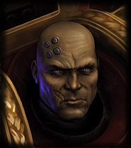
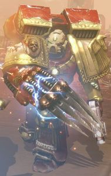
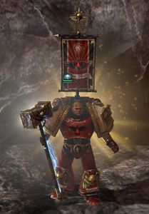
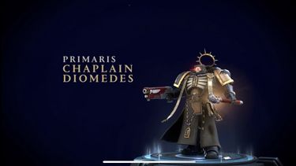

# 0725 阿波罗·狄俄墨得斯 Apollo Diomedes

精校状态：中文行文已逐段精校，部分术语仍为暂定

分类：人类帝国 / 血鸦

原文来源：https://www.bilibili.com/opus/1209335663873228818

原作者：帝国神选罐头

原文时间：2026年06月02日 22:00

[返回分类目录](目录.md) · [全书目录](../../目录.md)

<!-- A0725-B0001 -->

原译文

It is true that even if we should defeat the traitor,we face condemnation and death. But it is not for pride or favor that we serve,but for the Emperor himself and the purpose he has granted us. If we shall die fulfilling that purpose,so be it. None will find us wanting! - Captain Diomedes 诚然，即使我们打败了叛徒，我们也会面临谴责和死亡。但我们服役不是为了尊严或喜爱，而是为了帝皇本人和他赋予我们的目的。如果我们为实现这个目的而死，那就这样吧。没有人会发现我们有所欠缺！- 连长狄俄墨得斯

**校订译文**

It is true that even if we should defeat the traitor,we face condemnation and death. But it is not for pride or favor that we serve,but for the Emperor himself and the purpose he has granted us. If we shall die fulfilling that purpose,so be it. None will find us wanting! - Captain Diomedes 诚然，即使击败叛徒，我们仍可能面临定罪与死亡。但我们服役，并非为了荣耀或宠信，而是为了帝皇本人，以及他赐予我们的使命。若必须为完成使命而死，那便如此。我们绝不辜负期望！——狄俄墨得斯连长

**校注：** 混合引文英文逐字保留，含原稿英文标点后缺空格；本任务不修改英文底稿。None will find us wanting 为宣誓不负所托，不逐字译“发现欠缺”。

<!-- /A0725-B0001 -->

<!-- A0725-B0002 -->
**英文原文**

Apollo Diomedes was once a Captain of the Blood Ravens Honour Guard during the Aurelian Crusades. After the Aurelian Crusades and slaying Azariah Kyras by his own hands Diomedes stepped down as Captain of the Honour Guard and became a Chaplain. Chapter Master Gabriel Angelos has declared Diomedes as the Hero of the Chapter.

<!-- /A0725-B0002 -->

<!-- A0725-B0003 -->

原译文

阿波罗·狄俄墨得斯曾在奥瑞利安远征期间担任血鸦荣誉卫队的连长。奥瑞利安远征后，狄俄墨得斯亲手杀死了亚撒利雅·凯拉斯，辞去荣誉卫队连长的职务，成为一名牧师。战团长加百列·安杰洛斯宣布狄俄墨得斯为战团的英雄。

**校订译文**

阿波罗·狄俄墨得斯曾在奥瑞利安远征期间统率血鸦荣誉卫队。亲手杀死亚撒利雅·凯拉斯、结束远征后，他卸下卫队连长之职，转任教士。战团长加百列·安杰罗斯将他誉为战团英雄。

<!-- /A0725-B0003 -->

<!-- A0725-B0004 图片 -->

<!-- A0725-B0005 -->

原译文

Apollo Diomedes 阿波罗·狄俄墨得斯

**校订译文**

Apollo Diomedes 阿波罗·狄俄墨得斯

<!-- /A0725-B0005 -->

<!-- A0725-B0006 -->
## Biography 传记

<!-- /A0725-B0006 -->

<!-- A0725-B0007 -->
## Before the Aurelian Crusades 奥瑞利安远征前

<!-- /A0725-B0007 -->

<!-- A0725-B0008 -->
**英文原文**

Captain Apollo Diomedes commanded the Blood Ravens' First Company for almost two centuries. He lead the Chapter's elite with honour and skill.

<!-- /A0725-B0008 -->

<!-- A0725-B0009 -->

原译文

阿波罗·狄俄墨得斯连长指挥血鸦第一连队近两个世纪。他以荣誉和技巧领导着战团的精英。

**校订译文**

阿波罗·狄俄墨得斯曾统率血鸦第一连近两百年，以高超的指挥才能与荣誉之心率领战团精锐。

<!-- /A0725-B0009 -->

<!-- A0725-B0010 -->
**英文原文**

Diomedes' most famous victory came on the ravaged penal world of Obscurus. On the same day, he and his brothers defeated the Ork Warboss Manstompa Megakilla and the Chaos Sorcerer Anupharis the Cruel. After that victory Diomedes was elevated to the command of the Chapter Master's own honour guard, becoming Azariah Kyras's most public agent among the Chapter's far-flung battle brothers.

<!-- /A0725-B0010 -->

<!-- A0725-B0011 -->

原译文

狄俄墨得斯最著名的胜利发生在严重损害的朦胧星刑罚世界。同一天，他和他的兄弟们击败了欧克头目踏人大杀手和混沌巫师残酷者阿努法瑞斯。胜利后，狄俄墨得斯被提升为战团长自己的荣誉卫队指挥官，成为亚撒利雅·凯拉斯在战团广泛的战斗兄弟中最公开的代理人。

**校订译文**

他最著名的胜利发生在饱受蹂躏的刑罚世界朦胧星。同一天，他与兄弟们击败了欧克战争头目踏人大杀手，以及混沌巫师残酷者阿努法瑞斯。此战之后，他升任战团长荣誉卫队指挥官，成为亚撒利雅·凯拉斯在遍布各地的战团战士之间最常公开露面的代理人。

<!-- /A0725-B0011 -->

<!-- A0725-B0012 -->
## Second Aurelian Crusade 第二次奥瑞利安远征

<!-- /A0725-B0012 -->

<!-- A0725-B0013 -->
### The Rescue 救援

<!-- /A0725-B0013 -->

<!-- A0725-B0014 -->
**英文原文**

Aramus and his Battle-Brothers from the Blood Ravens' Fourth Company were battling a unnamed Black Legion Sorcerer of Tzeentch when Apollo Diomedes used his jump pack to land near the Sorcerer and slay him personally. Diomedes asked for a report on what happened from Scout Sergeant Priam and Aramus and his men. Priam gave a detailed account about how the Black Legion used the Chapter's Locater Signal to ambush them. Thaddeus interjected when Diomedes dismissed Priam's report and talked about how the Black Legion had killed many scouts and abducted more. Before Thaddeus could reveal more information Scout Sergeant Cyrus told him to be quiet. Diomedes instead ordered Aramus and his brothers to return to their Strike Cruiser and await further orders. Meanwhile Sergeant Priam and his initiates were to be transported back to Firebase Argus. Diomedes' final order was to tell everyone involved to keep the mission a secret before he departed as well.

<!-- /A0725-B0014 -->

<!-- A0725-B0015 -->

原译文

阿拉穆斯和他在血鸦第四连队的战斗兄弟们正在与一位未透露姓名的奸奇黑色军团巫师作战，阿波罗·狄俄墨得斯用他的跳跃背包降落在巫师附近并亲自杀死了他。狄俄墨得斯要求侦察军士普里阿姆和阿拉穆斯及其部下报告发生了什么。普里阿姆详细描述了黑色军团是如何利用战团的定位信号伏击他们的。当狄俄墨得斯驳斥普里阿姆的报告，并谈到黑色军团是如何杀死许多侦察兵并绑架更多侦察兵时，撒迪厄斯插话了。在撒迪厄斯透露更多信息之前，侦察军士赛勒斯告诉他要安静。狄俄墨得斯反而命令阿拉穆斯和他的兄弟们返回他们的打击巡洋舰，等待进一步的命令。与此同时，普里阿姆军士和他的修士们将被送回阿格斯火力基地。狄俄墨得斯的最后命令是告诉所有相关人员，在他离开之前，也要对这次任务保密。

**校订译文**

阿拉莫斯与血鸦第四连的兄弟正迎战一名黑色军团奸奇巫师时，狄俄墨得斯以跳跃背包降至巫师身边，亲手将其斩杀。随后，他要求侦察军士普里阿姆，以及阿拉莫斯等人汇报经过。普里阿姆详细说明，敌人利用战团的定位信号设下伏击。狄俄墨得斯却不以为然，撒迪厄斯于是插话，指出黑色军团已杀死许多侦察兵，还俘走了更多人。赛勒斯在他继续透露消息前制止了他。狄俄墨得斯命阿拉莫斯等人返回打击巡洋舰待命，将普里阿姆与其新兵送回阿格斯火力基地。临行前，他还要求所有人对任务严守秘密。

**校注：** 陈述侦察兵伤亡的是插话的撒迪厄斯，非狄俄墨得斯；initiates 在本段为新兵，不是宗教修士。

<!-- /A0725-B0015 -->

<!-- A0725-B0016 图片 -->

<!-- A0725-B0017 -->

原译文

Captain Apollo Diomedes during the Second Aurelian Crusade 第二次奥瑞利安远征中的阿波罗·狄俄墨得斯连长

**校订译文**

Captain Apollo Diomedes during the Second Aurelian Crusade 第二次奥瑞利安远征中的阿波罗·狄俄墨得斯连长

<!-- /A0725-B0017 -->

<!-- A0725-B0018 -->
**英文原文**

Hours later Captain Diomedes would issue a planetwide stand down order on Calderis to stop hunting down the Black Legion. The majority of the Blood Ravens obeyed Diomedes' orders; the only exceptions were Aramus, members of the Fourth Company, and a number of First Company Veterans assigned to Aramus' strike force, who openly disobeyed Captain Diomedes and their Chapter at the behest of Captain Gabriel Angelos to continue hunting down the Black Legion.

<!-- /A0725-B0018 -->

<!-- A0725-B0019 -->

原译文

几小时后，狄俄墨得斯连长将向卡德利斯发出全球范围内的撤离令，停止追捕黑色军团。大多数血鸦听从了狄俄墨得斯的命令；唯一的例外是阿拉穆斯，第四连队的成员，以及一些被分配到阿拉穆斯的打击部队的第一连队老兵，他们在加百列·安杰罗斯连长的命令下公开违抗狄俄墨得斯连长及其战团继续追捕黑色军团。

**校订译文**

几小时后，狄俄墨得斯向卡德里斯全星发布停止行动的命令，禁止继续追剿黑色军团。大多数血鸦服从了命令，唯有阿拉莫斯、其第四连部下，以及配属突击部队的部分第一连老兵，在加百列·安杰罗斯授意下公开抗命，继续追击敌人。

**校注：** stand down 为停止行动、解除战斗状态，并不单指撤离行星。Calderis 沿18卡德里斯，原本篇卡德利斯统一。

<!-- /A0725-B0019 -->

<!-- A0725-B0020 -->
### Sector wide stand down orders 全星区停止行动令

原题：Sector wide stand down orders 星区撤离令

<!-- /A0725-B0020 -->

<!-- A0725-B0021 -->
**英文原文**

Several days later into the Second Aurelian Crusade, Captain Diomedes transmitted priority orders to every Blood Raven in the entire sector to cease crusade, recruitment and other operations, telling them that they must return to their muster points and prepare for mobilisation for the Ferox Rift Crusade. Aramus and his brothers from the Fourth and First Company continued to disobey his orders and took the fight to the Black Legion. Gabriel Angelos and his brothers from the Third Company also chose to disobey Diomedes' order with Gabriel sending a message to Aramus telling him to continue fighting the Black Legion while he would confront Diomedes and tried to convince him to save the sector.

<!-- /A0725-B0021 -->

<!-- A0725-B0022 -->

原译文

在第二次奥瑞利亚远征的几天后，狄俄墨得斯连长向整个地区的每一名血鸦发出了优先命令，要求他们停止远征、招募和其他行动，告诉他们必须返回集合点，为费罗克斯裂隙远征的动员做准备。阿拉穆斯和他在第四连队和第一连队的兄弟们继续违抗他的命令，与黑色军团作战。加百列·安杰罗斯和他的第三连队兄弟也选择不服从狄俄墨得斯的命令，加百列向阿拉穆斯发送了一条信息，告诉他继续与黑色军团作战，同时他将直面狄俄墨得斯，并试图说服他拯救该星区。

**校订译文**

又过数日，狄俄墨得斯向星区内全部血鸦发出优先命令，要求停止远征、征兵及其他行动，返回集结点，准备参加费罗克斯裂隙远征。阿拉莫斯与第一、第四连的兄弟继续抗命，迎战黑色军团。加百列及第三连也拒绝服从。他通知阿拉莫斯继续作战，自己则去当面劝说狄俄墨得斯，争取挽救星区。

<!-- /A0725-B0022 -->

<!-- A0725-B0023 -->
### Declaring Gabriel and his followers as Traitors 宣布加百列和他的追随者为叛徒

<!-- /A0725-B0023 -->

<!-- A0725-B0024 -->
**英文原文**

Weeks after Aramus and his brothers killed Araghast the Pillager, they would receive another priority message from Captain Diomedes, with full authority from their Chapter Master, Azariah Kyras; Diomedes then declared Gabriel Angelos and his brothers who followed him Traitors to the Chapter, proclaiming that Gabriel was guilty of refusing Chapter Orders, spreading Heresy, raising arms against his one-time brothers, and stealing relics, arms and artefacts from the Chapter. Afterwards he ordered every Blood Raven within the sector to find and kill Gabriel as he escaped with his brothers on the Battle Barge Litany of Fury. Aramus and his brothers once again openly refused to hunt down Gabriel, as they knew the truth that Kyras and his Honour Guard had been corrupted by the influence of Chaos.

<!-- /A0725-B0024 -->

<!-- A0725-B0025 -->

原译文

在阿拉穆斯和他的兄弟们杀死掠夺者阿拉格斯特几周后，他们将收到狄俄墨得斯连长的另一条优先信息，并得到他们的战团长亚撒利雅·凯拉斯的充分授权；狄俄墨得斯随后宣布加百列·安杰罗斯和跟随他的兄弟是战团的叛徒，宣称加百列拒绝战团命令，传播异端，对他曾经的兄弟举起武器，并从战团偷走圣物，武器和造物。之后，他命令该地区的每一名血鸦找到并杀死加百列，因为他和他的兄弟们乘坐愤怒祷文号战斗驳船逃跑了。阿拉穆斯和他的兄弟们再次公开拒绝追捕加百列，因为他们知道凯拉斯和他的荣誉卫队已经被混沌的影响所腐化。

**校订译文**

阿拉莫斯等人杀死掠夺者阿拉格斯特数周后，收到狄俄墨得斯发来的另一条优先通信。在战团长亚撒利雅·凯拉斯全权授权下，他宣布加百列及追随者为战团叛徒，罪名包括拒绝命令、传播异端、向昔日兄弟举兵，以及盗取战团圣物、武器与遗物。加百列已率部乘狂怒祷文号战斗驳船离去，狄俄墨得斯于是命全星区血鸦搜捕并杀死他。阿拉莫斯等人再次公开拒绝，因为他们已知道，凯拉斯及荣誉卫队受到混沌腐化。

**校注：** 授权来自战团长、由狄俄墨得斯行使；接收指控的阿拉莫斯并未因此取得授权。

<!-- /A0725-B0025 -->

<!-- A0725-B0026 -->
### Raid on Calderis 突袭卡德利斯

<!-- /A0725-B0026 -->

<!-- A0725-B0027 -->
**英文原文**

Days later, Aramus and his Battle-Brothers would conduct a full raid on Firebase Argus on the planet Calderis. Aramus personally slayed Apothecary Galan and freed him from Daemonic Possession; Galan revealed that the Honour Guard had been fully corrupted due to Kyras, but Diomedes remained pure, merely he was blinded by his own pride. Aramus then destroyed Firebase Argus and confronted Diomedes himself. Tarkus openly confronted and debated Diomedes' decisions such as leaving the sector to die to the Black Legion and surrounding himself with traitors of the chapter. Tarkus would present evidence to Diomedes that Apothecary Galan and Kyras were corrupted during the expedition onboard the Judgement of Carrion and how they were hunted down by the Greater Daemon of Nurgle named Ulkair. Upon hearing Ulkair's name and finding out that Galan himself told Aramus and his brothers, Diomedes let them go out of shame and continued fighting to save the sector.

<!-- /A0725-B0027 -->

<!-- A0725-B0028 -->

原译文

几天后，阿拉穆斯和他的战斗兄弟们将对卡德利斯行星上的阿格斯火力基地进行全面突袭。阿拉穆斯亲自杀死了药剂师加兰，并将他从恶魔占据中解放出来；加兰透露，荣誉卫队因凯拉斯而完全堕落，但狄俄墨得斯仍然保持纯洁，只是他被自己的骄傲蒙蔽了双眼。阿拉穆斯随后摧毁了阿格斯火力基地，并亲自与狄俄墨得斯对峙。塔库斯公开对抗和辩论狄俄墨得斯的决定，例如离开该星区死于黑色军团，并让战团的叛徒包围自己。塔库斯将向狄俄墨得斯提供证据，证明药剂师加兰和凯拉斯在腐尸审判号上的探险中被腐化，以及他们是如何被纳垢大魔乌凯尔追捕的。在听到乌凯尔的名字并发现加兰亲自告诉阿拉穆斯和他的兄弟们后，狄俄墨得斯出于羞愧让他们离开，并继续为拯救该地区而战。

**校订译文**

数日后，阿拉莫斯率部全面突袭卡德里斯的阿格斯火力基地。他亲手杀死药剂师加兰，使其摆脱恶魔附身。临死前，加兰透露：荣誉卫队因凯拉斯而彻底堕落，狄俄墨得斯本人却仍然纯洁，只是被骄傲蒙住了双眼。摧毁基地后，阿拉莫斯等人与狄俄墨得斯对峙。塔库斯当面质问他，为何坐视星区毁于黑色军团之手，又为何任由叛徒环伺。他出示证据，说明加兰与凯拉斯在腐尸审判号探险期间遭乌凯尔纠缠，最终受混沌污染。听到这个恶魔之名，又得知真相出自加兰亲口，狄俄墨得斯羞愧难当，放众人离去，转而继续为拯救星区作战。

**校注：** 临终供述安排在最终死亡前，理顺原文先概述 killed 再回叙供述的次序。

<!-- /A0725-B0028 -->

<!-- A0725-B0029 -->

原译文

Declared renegade, I cannot act against Kyras without shedding the blood of my brothers. Yet, hope endures! A handful of heroes still remain in service to the chapter, uncorrupted by Kyras' heresy. Led by Captain Diomedes, these heroes hunt down the remnants of the vile black legion across the sector. However, Diomedes hubris blinds him to Kyras' true nature. If the sector and Chapter is to survive, he must first overcome his own pride...— Captain Gabriel Angelos 宣布变节，如果不让我的兄弟们流血，我就不能对凯拉斯采取行动。然而，希望永存！少数英雄仍然在为战团服务，没有被凯拉斯的异端所腐化。在狄俄墨得斯连长的带领下，这些英雄在整个星区追捕邪恶的黑色军团的残余。然而，狄俄墨得斯的傲慢让他看不到凯拉斯的真实本性。如果这个星区和战团要生存下去，他必须首先克服自己的骄傲... —连长加百列·安杰罗斯

**校订译文**

Declared renegade, I cannot act against Kyras without shedding the blood of my brothers. Yet, hope endures! A handful of heroes still remain in service to the chapter, uncorrupted by Kyras' heresy. Led by Captain Diomedes, these heroes hunt down the remnants of the vile black legion across the sector. However, Diomedes hubris blinds him to Kyras' true nature. If the sector and Chapter is to survive, he must first overcome his own pride...— Captain Gabriel Angelos 我已被宣布为叛徒；若要对凯拉斯动手，就不可避免地使兄弟流血。但希望尚存！仍有少数英雄忠于战团，未遭凯拉斯的异端腐化。他们由狄俄墨得斯连长率领，在星区各处追剿可憎的黑色军团残部。然而，狄俄墨得斯的傲慢使他看不清凯拉斯的真面目。若要让星区与战团存续，他必须先战胜自己的骄傲……——加百列·安杰罗斯连长

<!-- /A0725-B0029 -->

<!-- A0725-B0030 -->
## Third Aurelian Crusade 第三次奥瑞利安远征

<!-- /A0725-B0030 -->

<!-- A0725-B0031 -->
**英文原文**

Ten years after the Second Aurelian Crusade, Captain Diomedes lead a mission to hunt down and destroy the remnants of the Black Legion led by Eliphas the Inheritor who was revived by Abaddon The Despoiler. After ten years of searching he found out where he had been hiding and he travelled there accompanied by Techmarine Martellus and several Blood Ravens battle brothers. Arriving at the Ladon Swamplands on Typhon Primaris, Martellus received an urgent distress signal from advance forces requesting help. Diomedes and Martellus arrived just in time when they found their Battle Brother named "The Ancient" was wounded. After killing Black Legion troops, Diomedes revived The Ancient and reprimanded him for being reckless and almost getting himself killed. Martellus reminded Diomedes that he was silent as penance for deeds committed and started repairing his armour, as it was damaged by the Black Legion in the ambush. After repairing The Ancient's armour, the group continued pursuing Eliphas and killing any Black Legion troops they encountered along the way.

<!-- /A0725-B0031 -->

<!-- A0725-B0032 -->

原译文

第二次奥瑞利安远征十年后，狄俄墨得斯连长率领一个使团，追捕并摧毁由继承者艾里法斯领导的黑色军团残余，后者被掠夺者阿巴顿复活。经过十年的搜寻，他找到了藏身之处，并在技术军士马特勒斯和几位血鸦战斗兄弟的陪同下前往那里。马特勒斯抵达提丰一号的拉冬沼泽地后，收到了来自先遣部队的紧急求救信号。狄俄墨得斯和马特勒斯及时赶到，发现他们的战斗兄弟“古老者”受伤了。在杀死黑色军团士兵后，狄俄墨得斯复苏了古老者，并谴责他鲁莽行事，差点害死自己。马特勒斯提醒狄俄墨得斯，他保持沉默是对所犯行为的忏悔，并开始修理他的盔甲，因为它在伏击中被黑色军团损坏了。在修复了古老者的盔甲后，该小队继续追捕艾里法斯，并杀死了他们在途中遇到的任何黑色军团士兵。

**校订译文**

第二次奥瑞利安远征十年后，狄俄墨得斯率队追剿黑色军团残部，其首领正是获掠夺者阿巴顿复活的继承者艾里法斯。经过十年追踪，他终于找到对方藏身之处，带科技战士马特勒斯与数名血鸦前往。抵达提丰主星的拉冬沼泽地后，马特勒斯收到先遣部队的紧急求援。两人及时赶到，发现绰号“古老者”的战斗兄弟已受伤。他们杀死敌军，救起古老者；狄俄墨得斯斥责他行事鲁莽，险些丧命。马特勒斯则提醒连长，此人以沉默为过往行为赎罪，随后修理他在伏击中损坏的护甲。整备完毕，一行人继续追赶艾里法斯，沿途清除黑色军团战士。

**校注：** The Ancient 在本篇为塔库斯隐藏身份时的绰号，暂沿古老者，不套用现代单位 Ancient 旗手的官译。revived 在受伤语境中为救起，不是死后复活。

<!-- /A0725-B0032 -->

<!-- A0725-B0033 图片 -->

<!-- A0725-B0034 -->

原译文

Captain Apollo Diomedes during the Third Aurelian Crusade 第三次奥瑞利安远征中的阿波罗·狄俄墨得斯连长

**校订译文**

Captain Apollo Diomedes during the Third Aurelian Crusade 第三次奥瑞利安远征中的阿波罗·狄俄墨得斯连长

<!-- /A0725-B0034 -->

<!-- A0725-B0035 -->
**英文原文**

Martellus spotted a Blood Ravens outpost and advised Diomedes to capture it so that they could call in additional reinforcements. Once the outpost was captured they called in Scout Marines as reinforcements to help bolster their army. After consolidating his troops, Diomedes ordered his men to advance and destroy any heretics along the way. While advancing on the Jungles of Typhon, the group encountered an Ork ship and proceed to destroy both the xenos and traitors in order to loot the area for supplies. Once the supplies had been secured they continued to move forward until they arrived at an abandoned forward base. Diomedes decided to fortify their position, expecting a counterattack after capturing a strategic location; Diomedes called in Devastator Marines then ordered them to garrison a bunker to provide covering fire for their Battle Brothers.

<!-- /A0725-B0035 -->

<!-- A0725-B0036 -->

原译文

马特勒斯发现了一个血鸦前哨，并建议狄俄墨得斯占领它，以便他们可以召集更多的增援部队。一旦前哨被占领，他们就召集侦察战士作为增援，以帮助加强他们的军队。在巩固了他的部队后，狄俄墨得斯命令他的部下前进并摧毁沿途的任何异端。在向提丰的丛林前进的过程中，该小队遇到了一艘欧克舰船，并着手摧毁异型和叛徒，以掠夺该地区的补给。一旦补给得到保障，他们继续前进，直到到达一个废弃的前线基地。狄俄墨得斯决定巩固他们的阵地，预计在占领一个战略位置后会遭到反击；狄俄墨得斯召集了毁灭者战士，然后命令他们驻扎一个掩体，为他们的战斗兄弟提供掩护火力。

**校订译文**

马特勒斯发现一处血鸦前哨，建议夺回它以呼叫增援。众人控制前哨后，调来侦察兵扩充兵力。狄俄墨得斯整顿队伍，继续前进，消灭沿途异端。在提丰丛林中，他们发现一艘欧克船只，遂清除周边异形与叛徒，搜取补给。随后，一行人来到废弃的前进基地。狄俄墨得斯预计，夺占这处要地必将引来反击，于是加固阵地，调来破坏者战士驻守碉堡，为兄弟提供火力掩护。

<!-- /A0725-B0036 -->

<!-- A0725-B0037 -->
**英文原文**

The Black Legion sent several attack waves at Diomedes' base but, despite being outnumbered, the Blood Ravens managed to not only survive but counterattacked once every attacker was dead. Eventually Diomedes and Martellus confronted Eliphas the Inheritor and a duel commenced. Diomedes personally slew the Inheritor but not before he mocked Diomedes and his chapter as puppets to the Dark Gods of Chaos. With Eliphas dead the remaining Black Legionaries were routed and Diomedes was congratulated by Azariah Kyras for slaying Eliphas. Cyrus overheard their conversation and openly reprimanded Diomedes for siding with Kyras despite being shown evidence of his corruption. Diomedes rebuked Cyrus and said he would decide the fates of Martellus and Cyrus after the mission.

<!-- /A0725-B0037 -->

<!-- A0725-B0038 -->

原译文

黑色军团在狄俄墨得斯的基地发动了几次攻击，但尽管寡不敌众，血鸦队不仅幸存下来，而且在每个攻击者都死后进行了反击。最终，狄俄墨得斯和马特勒斯与继承者艾里法斯对峙，决斗开始了。狄俄墨得斯亲自杀死了继承者，但在此之前，他嘲笑狄俄墨得和他的战团是混沌黑暗诸神的傀儡。随着艾里法斯的死亡，剩下的黑色军团被击溃，亚撒利雅·凯拉斯祝贺狄俄墨得斯杀死了艾里法斯。赛勒斯无意中听到了他们的谈话，并公开谴责狄俄墨得斯站在凯拉斯一边，尽管有证据表明他腐化了。狄俄墨得斯斥责赛勒斯，并表示他将在任务结束后决定马特勒斯和赛勒斯的命运。

**校订译文**

黑色军团分数波进攻基地，血鸦虽兵力居劣，仍守住阵地，歼灭来敌后立即反攻。狄俄墨得斯与马特勒斯终于追上艾里法斯。决斗中，连长亲手将其斩杀；临死前，继承者仍嘲笑血鸦不过是混沌诸神的傀儡。首领一死，黑色军团残部溃散，凯拉斯则发来祝贺。赛勒斯听见通信，当面斥责狄俄墨得斯：腐化证据早已摆在眼前，他却还站在凯拉斯一边。连长驳斥了他，并表示任务结束后再处置赛勒斯与马特勒斯。

**校注：** 嘲笑血鸦是诸神傀儡的是艾里法斯，原译主语模糊。

<!-- /A0725-B0038 -->

<!-- A0725-B0039 -->
**英文原文**

Martellus received a priority vox transmission from the Inquisition and immediately relayed it to Diomedes. Inquisitor Adrastia introduced herself as the representative of the Ordo Hereticus and Diomedes debriefed her regarding the Black Legion's defeat and Eliphas's death, maintaining that the Blood Ravens had remained Loyal to the Imperium. Adrastia was not impressed but contacted Diomedes specifically due to the situation in the Sub-Sector escalating. Adrastia received a report from Gabriel Angelos that Kyras was a heretic and a traitor to the chapter and Emperor. Diomedes in a fit of rage denounced Angelos' accusation and instead punished Gabriel and the battle brothers who followed him. Adrastia instead reminded Diomedes that Gabriel Angelos recommended him to clear the Blood Ravens of any guilt and corruption within the Chapter. Adrastia finally revealed the true motives of the Ordo Hereticus to Diomedes, saying that the entire subsector would be subjected to Exterminatus. If Diomedes could expose Kyras as a traitor then the subsector would be saved but if Diomedes cannot, she would declare his chapter as traitors and would burn them with the subsector. After their conversation Adrastia ended all communication with Diomedes and let him hunt down the corruption within their Chapter. Cyrus advised Diomedes to keep their investigation a secret and urged him to move quickly and subtly.

<!-- /A0725-B0039 -->

<!-- A0725-B0040 -->

原译文

马特勒斯收到了来自审判庭的优先音阵传输，并立即将其转发给狄俄墨得斯。审判官阿德拉斯蒂娅介绍自己是讨逆修会的代表，狄俄墨得斯向她汇报了黑色军团的失败和艾里法斯的死亡，坚称血鸦一直忠于帝国。阿德拉斯蒂娅没有留下深刻印象，但由于分区局势升级，她特别联系了狄俄墨得斯。阿德拉斯蒂娅收到了加百列·安杰罗斯的报告，称凯拉斯是异端，是战团和帝皇的叛徒。狄俄墨得斯勃然大怒，谴责安杰罗斯的指控，反而惩罚了加百列和跟随他的战斗兄弟。阿德拉斯蒂娅反而提醒狄俄墨得斯，加百利·安杰罗斯建议他清除战团内的任何罪行和腐化。阿德拉斯蒂娅最终向狄俄墨得斯透露了讨逆修会的真实动机，称整个分区都将受到灭绝令。如果狄俄墨得斯能够揭露凯拉斯是叛徒，那么分区将得以拯救，但如果狄俄墨得斯不能，她将宣布他的战团为叛徒，并将他们与分区一起焚毁。谈话结束后，阿德拉斯蒂娅结束了与狄俄墨得斯的所有沟通，让他追查他们战团内的腐化。赛勒斯建议狄俄墨得斯对他们的调查保密，并敦促他迅速而巧妙地采取行动。

**校订译文**

马特勒斯收到审判庭的优先通信，立即转给狄俄墨得斯。审判官阿德拉斯蒂娅自称代表异端审判庭，连长则汇报黑色军团败退与艾里法斯伏诛，坚称血鸦始终忠于帝国。她对此不为所动：次星区局势恶化，才是她联系他的原因。她已收到加百列的报告，指控凯拉斯背叛战团与帝皇。狄俄墨得斯怒斥这番指控，转而追究加百列及其追随者的罪责。审判官提醒他，恰是加百列推荐由他查明战团罪行、清除腐化。她随后揭示，异端审判庭已准备对整个次星区实施灭绝令。若他能揭露凯拉斯为叛徒，次星区尚可得救；若不能，她便会将整个战团认定为叛徒，一同焚毁。说完，她切断通信，留他自行调查。赛勒斯建议对此保密，并尽快隐秘行动。

**校注：** Ordo Hereticus 按用户决定异端审判庭；not impressed 在此指不为汇报所动，非没记住内容。

<!-- /A0725-B0040 -->

<!-- A0725-B0041 -->
### Teleportarium Network 传送仪网络

<!-- /A0725-B0041 -->

<!-- A0725-B0042 -->
**英文原文**

Martellus gave a suggestion to the group regarding ancient teleport networks called Teleportariums that they could use to travel between the world's of the subsector unnoticed found within the Ladon Temple Ruins on Typhon Primaris. However, Martellus gave a warning that the ruins were currently occupied by the Cadian 39th, who had gone rogue and joined the Alpha Legion Warband. After Diomedes listened to the Cadian 39th's Commander on a vox transmission intercepted by Martellus, he decided that his strike force must capture the Teleportariums and destroy the Cadians.

<!-- /A0725-B0042 -->

<!-- A0725-B0043 -->

原译文

马特勒斯向该小队提出了一个关于被称为传送仪的古代传送网络的建议，他们可以利用这些网络在分区内的世界之间旅行。在提丰一号的拉冬圣殿废墟内的一个未被注意到的地方发现。然而，马特勒斯警告说，这些废墟目前被卡迪亚第39团占领，他们已经叛变并加入了阿尔法军团战帮。狄俄墨得斯在马特勒斯截获的音阵传输中听到了卡迪亚第39团指挥官后，他决定他的打击部队必须占领传送仪并摧毁卡迪亚人。

**校订译文**

马特勒斯提出，可利用提丰主星拉冬神殿遗址中的古老传送仪网络，在次星区各世界之间秘密往来。但遗址已被投靠阿尔法军团战帮的卡迪亚第三十九团占据。听过马特勒斯截获的敌方指挥官通信后，狄俄墨得斯决定夺取传送仪，消灭叛军。

**校注：** unnoticed 修饰在世界间秘密旅行，原译错接成发现遗址的位置无人注意。

<!-- /A0725-B0043 -->

<!-- A0725-B0044 -->
**英文原文**

Arriving at the ruins, Diomedes led his strike force through the jungle to find a route to the Teleportariums while killing any patrol squads they came across. Unfornately they were spotted by the Cadian 39th's Commander who rode on a Baneblade and began ordering his men on high alert and hunt down the intruders. Diomedes and his strike force retreated as they didn't have the firepower to destroy the Baneblade and managed to escape back to their outpost. After regrouping, The Stike Force overheard a Cadian Guardsman ordering his men to protect the targeting cogitators as they needed them for their turrets or else they would go haywire. With this information Diomedes ordered his strike force to destroy the nearby targeting cogitators so they could use the turrets against the Traitors and Heretics. Should they find more, Diomedes instructed his brothers to destroy the cogitators first so that they could destroy enemy patrols and outposts with them. They advanced through the ruins while constantly being hunted down by the Cadian 39th's Commander until eventually they were cornered by the Commander being protected by turrets and his troops. With nowhere else to run, Diomedes ordered his strike force to destroy the nearby targeting cogitator in order to kill the Commander. Once the cogitator was destroyed, the turrets went haywire and destroyed the Baneblade and any nearby troops unfortunate enough to stay near them.

<!-- /A0725-B0044 -->

<!-- A0725-B0045 -->

原译文

到达废墟后，狄俄墨得斯带领他的打击部队穿过丛林，找到了一条通往传送仪的路线，同时杀死了他们遇到的任何巡逻队。不幸的是，他们被卡迪亚迪39团指挥官发现了，他驾驶着毒刃开始命令他的部下处于高度戒备状态，追捕入侵者。狄俄墨得斯和他的打击部队撤退了，因为他们没有火力摧毁毒刃，并设法逃回了他们的前哨。重新集结后，打击部队无意中听到一名卡迪亚卫兵命令他的部下保护目标士兵，因为他们的炮塔需要他们，否则它们会失控。有了这些信息，狄俄墨得斯命令他的打击部队摧毁附近的目标沉思者，这样他们就可以用炮塔对付叛徒和异端。如果他们发现更多，狄俄墨得斯指示他的兄弟们先摧毁那些沉思者，这样他们就可以摧毁敌人的巡逻队和前哨。他们在废墟中前进，同时不断被卡迪亚第39团指挥官追捕，直到最终被炮塔和他的部队保护的指挥官逼到了角落。由于无处可逃，狄俄墨得斯命令他的打击部队摧毁附近的目标沉思者，以杀死指挥官。一旦沉思者被摧毁，炮塔就失控了，摧毁了毒刃和任何不幸留在附近的附近部队。

**校订译文**

抵达遗址后，突击部队穿越丛林，寻找通往传送仪的道路，沿途清除巡逻队，却被乘坐毒刃战车的卡迪亚指挥官发现。敌军随即进入高度戒备，追捕入侵者。血鸦无力击毁毒刃，只能暂退前哨。重整期间，他们截听到一名卡迪亚卫兵要求部下保护瞄准沉思者，否则炮塔就会失控。狄俄墨得斯立即利用这一弱点，命部队优先摧毁沉思者，借失控炮塔杀伤叛徒、摧毁据点。他们一面穿越废墟，一面躲避敌方指挥官追击，最终仍被对方及炮塔、部队堵入死角。无路可退之际，连长命人击毁附近的瞄准沉思者。炮塔随即失控开火，摧毁毒刃，也杀伤了留在火力范围内的敌军。

**校注：** targeting cogitators 为瞄准沉思者，是控制炮塔的装置，原译目标士兵错误；每处失控均来自装置被毁。

<!-- /A0725-B0045 -->

<!-- A0725-B0046 -->
**英文原文**

Martellus found the Teleportarium and started working on it as he needed to know if the Teleportarium was working and how many the strike force could use within a day. While Martellus was working on the Teleportarium, Diomedes and Cyrus got into a heated debate; Diomedes was trying to see if he could find evidence to redeem Kyras while Cyrus rebuked him and constantly reminded him about Kyras and his corruption within the Chapter. The conversation ended with Diomedes declaring they would continue the investigation and redeem their chapter in the eyes of the Inquisition.

<!-- /A0725-B0046 -->

<!-- A0725-B0047 -->

原译文

马特勒斯发现了传送仪，并开始研究它，因为他需要知道传送仪是否正常工作，以及一天内可以使用多少打击部队。当马特勒斯在传送仪上工作时，狄俄墨得斯和赛勒斯陷入了激烈的争论；狄俄墨得斯试图找到证据来救赎凯拉斯，而赛勒斯则斥责他，并不断提醒他凯拉斯和他在战团内的腐化。对话结束时，狄俄墨得斯宣布他们将继续调查，并在审判庭的眼中救赎他们的战团。

**校订译文**

马特勒斯找到传送仪，开始检验其状态，以及一天内可供突击部队使用的次数。与此同时，狄俄墨得斯与赛勒斯激烈争论。连长仍想寻找能为凯拉斯洗清嫌疑的证据，赛勒斯则不断提醒他，凯拉斯与战团内部的腐化早有牵连。最后，狄俄墨得斯宣布继续调查，要在审判庭面前挽回战团清誉。

**校注：** how many ... within a day 原文省略宾语，按传送设备语境暂理解为可使用次数，非一天可使用多少支突击部队。

<!-- /A0725-B0047 -->

<!-- A0725-B0048 -->
**英文原文**

Once the Teleportarium had been studied, Martellus informed his brothers that it could be used safely and suggested to Diomedes that they should try to find more Teleportariums so that they could travel across the Sector.

<!-- /A0725-B0048 -->

<!-- A0725-B0049 -->

原译文

在研究了传送仪之后，马特勒斯告诉他的兄弟们，它可以安全使用，并建议狄俄墨得斯尝试找到更多的传送仪，以便他们可以穿越该星区。

**校订译文**

完成检查后，马特勒斯确认传送仪可安全使用，并建议继续寻找其他节点，以便在星区各处行动。

<!-- /A0725-B0049 -->

<!-- A0725-B0050 -->
### Calderis 卡德里斯

原题：Calderis 卡德利斯

<!-- /A0725-B0050 -->

<!-- A0725-B0051 -->
**英文原文**

While investigating Calderis for evidence, Martellus intercepted a disturbing vox transmission regarding Blood Ravens Strike Force Omega led by Sergeant Lysandros: they had been given orders by a unknown leader named The Ascendant to raze Argus Settlement to the ground to protect his plans and identity from his so called "pursuers". Diomedes and his brothers decided to intervene and protect their recruiting worlds from even their own Battle Brothers. Arriving at Argus Settlement, Diomedes and his brothers captured a nearby Blood Ravens outpost and requested a Razorback and several troops to bolster their army. Diomedes communicated with Strike Force Omega to stand down and cease the pointless slaughter of Argus Settlement.

<!-- /A0725-B0051 -->

<!-- A0725-B0052 -->

原译文

在调查卡德利斯寻找证据的同时，马特勒斯截获了一条关于莱桑德罗斯军士领导的血鸦欧米伽打击部队的令人不安的音阵传输：他们接到了一位名叫升格者的未知领导人的命令，将阿格斯定居点夷为平地，以保护他的计划和身份免受所谓的“追捕者”的攻击。狄俄墨得斯和他的兄弟们决定进行干预，保护他们的招募世界免受他们自己的战斗兄弟的攻击。抵达阿格斯定居点后，迪奥梅德斯和他的兄弟们占领了附近的血鸦前哨，并要求一辆豪猪和几名士兵增援他们的军队。狄俄墨得斯与欧米伽打击部队沟通，要求其停止对阿格斯定居点的无谓屠杀。

**校订译文**

在卡德里斯调查时，马特勒斯截获一条令人不安的通信：莱桑德罗斯军士统率的血鸦欧米伽突击部队，奉一个自称“升格者”的神秘首领之命，要将阿格斯聚落夷为平地，掩盖其身份与计划，避免被所谓的“追捕者”查明。狄俄墨得斯决定保护征兵世界，即使敌人是自己的战斗兄弟。抵达后，他们夺取附近前哨，调来豪猪战车与援军，并要求欧米伽部队立即停手，结束无谓屠杀。

<!-- /A0725-B0052 -->

<!-- A0725-B0053 -->
**英文原文**

Lysandros refused to obey Diomedes' order and continued burning down Argus Settlement. Diomedes made a difficult decision that not even Angelos would do: he ordered his Battle Brothers under his command to execute any Blood Ravens who refused to stand down and show no mercy. Lysandros was shocked that Diomedes would openly kill his own brothers and Strike Force Omega took heavy casualties. Diomedes and his brothers managed to save the important infrastructure within Argus Settlement, The Traitors started to panic and requested Lysandros to call in reinforcements. Lysandros started sending reinforcement to aid nearby squads against Diomedes and his strike force. However, Diomedes managed to kill the reinforcements and organised a counterattack on Lysandros' base to quickly end the massacre. Despite the base being heavily guarded, Diomedes managed to destroy it and killed Lysandros but not before he mocked the strike force, telling them that "The Ascendant" would eventually be triumphant.

<!-- /A0725-B0053 -->

<!-- A0725-B0054 -->

原译文

莱桑德罗斯拒绝服从狄俄墨得斯的命令，继续烧毁阿格斯定居点。狄俄墨得斯做出了一个连安杰洛斯都不会做的艰难决定：他命令他的战斗兄弟在他的指挥下处决任何拒绝屈服的血鸦，展示了毫不留情。莱桑德罗斯对狄俄墨得斯公开杀害自己的兄弟感到震惊，欧米伽打击部队也遭受了重大伤亡。狄俄墨得斯和他的兄弟们设法挽救了阿格斯定居点内的重要基础设施，叛徒们开始恐慌，并要求莱桑德罗斯召集增援部队。莱桑德罗斯开始派遣增援部队，帮助附近的小队对抗狄俄墨得斯和他的打击部队。然而，狄俄墨得斯设法杀死了增援部队，并组织了对莱桑德罗斯的基地的反击，以迅速结束大屠杀。尽管基地戒备森严，狄俄墨得斯还是设法摧毁了它并杀死了莱桑德罗斯，但在此之前，他嘲笑了打击部队，告诉他们“升格者”最终会取得胜利。

**校订译文**

莱桑德罗斯拒不服从，继续焚毁聚落。狄俄墨得斯于是作出连安杰罗斯都不愿作出的艰难决定：凡拒绝停止行动的血鸦，一律处决，绝不留情。军士震惊于他竟会向兄弟下杀手，欧米伽部队也很快伤亡惨重。狄俄墨得斯保住重要基础设施，叛徒们开始恐慌，要求增援。莱桑德罗斯不断派兵支援附近小队，却遭逐一消灭。为尽快终结屠杀，连长转攻其基地，突破重防，杀死军士。临死前，莱桑德罗斯仍嘲笑众人，声称“升格者”终将获胜。

**校注：** stand down 为停止军事行动，非人格屈服；临终嘲讽来自莱桑德罗斯，避免代词倒置。

<!-- /A0725-B0054 -->

<!-- A0725-B0055 -->
**英文原文**

After killing Sergeant Lysandros and destroying Strike Force Omega, Martellus intercepted an additional vox transmission within Calderis regarding Warboss Smashface and his Waaagh! moving their supplies via a convoy to a nearby supply depot. Diomedes decided that the Waaagh! was too dangerous to allow to grow and decided to intercept the Orks' supplies and destroy as much of them as they could. After arriving in the sector, the strike force fought their way through a series of ambushes and advance forces instructed by Smashface to protect the depot. After arriving at the depot, Diomedes ordered his Battle Brothers to fortify the location and call in additional forces to stop the Ork convoys, along with destroying nearby bridges to create a killzone. Once the convoy arrived, the Blood Ravens immediately opened fire on any vehicles within the killzone. Eventually the heavy losses forced Warboss Smashface to show up to protect the convoy. In the end Diomedes and his strike force not only killed Smashface and destroyed his Waaagh! which prevented another crisis from engulfing Calderis.

<!-- /A0725-B0055 -->

<!-- A0725-B0056 -->

原译文

在杀死莱桑德罗斯军士并摧毁欧米伽打击部队后，马特勒斯在卡德利斯内部截获了另一条关于战争头目碎脸和他的Waaagh！通过车队将他们的物资运送到附近的补给站。狄俄墨得斯判决Waaagh！太危险了，不能让它增长，于是决定拦截欧克的补给，并尽可能多地摧毁它们。到达该区域后，打击部队在一系列伏击中奋力前行，由碎脸指挥的先遣部队保护仓库。抵达仓库后，狄俄墨得斯命令他的战斗兄弟们加固该地点，并增派部队阻止欧克车队，同时摧毁附近的桥梁以制造杀戮区。车队抵达后，血鸦立即向杀戮区内的任何载具开火。最终，惨重的损失迫使战争头目碎脸出现保护车队。最后，狄俄墨得斯和他的打击部队不仅杀死了碎脸，还摧毁了他的Waaagh！这防止了另一场危机席卷卡德利斯。

**校订译文**

消灭欧米伽突击部队后，马特勒斯又截获消息：战争头目碎脸正以车队向附近补给站运送物资，为其 Waaagh! 大军供给。狄俄墨得斯认为不能任由威胁壮大，决定截断补给，尽可能摧毁物资。突击部队突破一连串伏击，击败守卫补给站的先遣敌军，占领目标。他们加固阵地、呼叫援军，又炸断附近桥梁，布置交叉杀伤区。车队抵达后，血鸦立即向进入区域的车辆开火。惨重损失迫使碎脸亲自现身保护运输队，最终却连同整支 Waaagh! 大军一并被击败，卡德里斯因此免于又一场灾难。

<!-- /A0725-B0056 -->

<!-- A0725-B0057 -->
### Aurelia 奥瑞利亚

<!-- /A0725-B0057 -->

<!-- A0725-B0058 -->
**英文原文**

After securing Calderis, Diomedes and his strike force travelled to Aurelia to find more clues. However, Martellus intercepted a vox transmission from an Alpha Legion Warband regarding their plans to construct a dark portal to summon Daemons on Aurelia again. Diomedes deployed his strike force to stop the Alpha Legion from constructing the Dark Portal and secure the Teleportarium. Arriving at Minos Ironworks, Diomedes ordered his brothers to fight their way through the Alpha Legion troops and secure the nearby Teleportarium. After accomplishing this, it was found to have been rendered unusable due to the influence of the Dark Portal as not only was it fully operational, it started summoning Daemons on Aurelia again. Despite this setback, Diomedes continued fighting and ordered his brothers to find and destroy the portal to prevent more Daemonic incursions on Aurelia. Arriving at the portal, the Alpha Legion counterattacked Diomedes' strike force while they gained additional reinforcements from shrines they had erected to Khorne that summoned Bloodletters onto the battlefield. Eventually Diomedes and his strike force prevailed in destroying both the Dark Portal and the Summoning Shrines.

<!-- /A0725-B0058 -->

<!-- A0725-B0059 -->

原译文

在确保卡德利斯的安全后，狄俄墨得斯和他的打击部队前往奥瑞利亚寻找更多线索。然而，马特勒斯截获了阿尔法军团的一条音阵传输，内容是他们计划建造一个黑暗传送门，再次在奥瑞利亚召唤恶魔。狄俄墨得斯部署了他的打击部队，阻止阿尔法军团建造黑暗传送门，并保护了传送仪。抵达米诺斯钢铁厂后，狄俄墨得斯命令他的兄弟们穿过阿尔法军团的部队，保护附近的传送仪。完成这项任务后，由于黑暗传送门的影响，它被发现已经无法使用，因为它不仅完全投入使用，还开始再次在奥瑞利亚召唤恶魔。尽管遭遇挫折，狄俄墨得斯仍继续战斗，并命令他的兄弟们找到并摧毁传送门，以防止更多的恶魔入侵奥瑞利亚。到达传送门后，阿尔法军团对狄俄墨得斯的打击部队进行了反击，同时他们从他们为恐虐建造的神龛中获得了额外的增援，这些神龛将放血鬼召唤到战场上。最终，狄俄墨得斯和他的打击部队成功摧毁了黑暗传送门和召唤神殿。

**校订译文**

稳定卡德里斯后，突击部队前往奥瑞利亚追查线索。马特勒斯截获阿尔法军团战帮的通信，得知其正建造黑暗传送门，准备再次召唤恶魔。狄俄墨得斯率部抵达米诺斯钢铁厂，杀穿敌阵，夺下附近传送仪，却发现它已因黑暗传送门的干扰而失灵；与此同时，敌方传送门已经运转，开始召唤恶魔。他立即命部队转攻传送门，阻止入侵扩大。阿尔法军团反击，并利用恐虐神龛召来放血鬼增援。最终，血鸦击破防守，同时摧毁黑暗传送门与召唤神龛。

**校注：** 失灵的是传送仪，已运作并召唤恶魔的是黑暗传送门；原译两处“它”混指，造成同一装置既无法使用又完全运作的矛盾。

<!-- /A0725-B0059 -->

<!-- A0725-B0060 -->
**英文原文**

With the destruction of the Dark Portal, one of the enraged Alpha Legion officers ordered every Legionary to hunt Diomedes and his Brothers down as revenge. Diomedes ordered his Battle Brothers to return to the Teleportarium and, once they arrived, killed all of the Alpha Legion reinforcements and secured the Teleportarium.

<!-- /A0725-B0060 -->

<!-- A0725-B0061 -->

原译文

随着黑暗传送门的毁灭，一名愤怒的阿尔法军团军官命令每个军团士兵追捕狄俄墨得斯和他的兄弟作为复仇。狄俄墨得斯命令他的战斗兄弟返回传送仪，一旦他们到达，就杀死了所有阿尔法军团的增援部队，并确保了传送仪的安全。

**校订译文**

传送门被毁后，一名阿尔法军团军官怒令全军追杀血鸦报仇。狄俄墨得斯率众返回传送仪，消灭赶来的敌方援军，重新控制了这处设施。

<!-- /A0725-B0061 -->

<!-- A0725-B0062 -->
**英文原文**

After dealing with the Warband, Martellus intercepted more vox transmissions, these ones regarding 31st Harakoni Warhawks that had been corrupted by Ulkair. The Traitors had secured a munitions dump at Chapter Keep Selenon. Diomedes decided that his strike force must execute the Harakoni Commander and secure the munitions dump before the Traitors could use it against them. Arriving at the keep, Diomedes and his Brothers immediately hunted down and destroyed any Harakoni Troops that stood in their way. However, the Harakoni Warhawks deployed their Manticore batteries to bombard the Blood Ravens' positions, which caused several casualties in the strike force. Along the way the strike force encountered Loyalist survivors of the 31st Harakoni Warhawks and proceed to help in any way they could. Once they arrived at the munitions dump, Cyrus noticed Loyalist survivors and advised Diomedes to assist them. The last loyalist officer of the 31st Harakoni Warhawk greeted and praised Diomedes and his men for arriving.

<!-- /A0725-B0062 -->

<!-- A0725-B0063 -->

原译文

在与战帮打交道后，马特勒斯截获了更多的音阵传输，这些传输是关于被乌凯尔腐化的第31哈拉考尼战鹰的。叛徒们已经在塞勒农战团要塞找到了一个军火库。狄俄墨得斯决定，他的打击部队必须处决哈拉考尼指挥官，并在叛徒对他们使用弹药之前确保弹药库的安全。到达要塞后，狄俄墨得斯和他的兄弟们立即追捕并摧毁了任何阻挡他们的哈拉考尼部队。然而，哈拉考尼战鹰部署了他们的蝎尾狮炮阵轰炸了血鸦的阵地，造成了打击部队的几人伤亡。一路上，打击部队遇到了第31哈拉考尼战鹰的忠诚派幸存者，并继续尽其所能提供帮助。当他们到达弹药库时，赛勒斯注意到了忠诚派幸存者，并建议狄俄墨得斯协助他们。第31哈拉考尼战鹰的最后一位忠诚派军官迎接并赞扬了狄俄墨得斯和他的部下的到来。

**校订译文**

解决战帮后，马特勒斯又截获有关哈拉考尼战鹰第三十一团的通信：该团受乌凯尔腐化，叛军已夺取塞勒农战团堡垒内的一座弹药库。狄俄墨得斯决定击杀其指挥官，夺回弹药，免其落入敌手。血鸦一路歼灭阻挡的哈拉考尼部队，却也遭蝎尾狮导弹车阵地轰击，付出数人伤亡。途中，他们遇到该团仍保持忠诚的幸存者，尽力施援。抵达弹药库后，赛勒斯发现还有忠诚者在固守，便建议协助。该团最后一位忠诚军官前来迎接，感谢血鸦及时赶到。

<!-- /A0725-B0063 -->

<!-- A0725-B0064 -->
**英文原文**

He debriefed them about the situation at the munitions dump and told them that most of the Regiment went mad due to Ulkair's corruption and that he and his men secured the munitions dump when they arrived but the debrief was cut off when his corrupted Commander intercepted their vox communications and sent in corrupted Troops and Alpha Legion reinforcements while mocking both Diomedes and the Loyalist officer. Loyalist Harakonis and Blood Ravens defended the munitions until every attacker had been destroyed. Once the munitions dump was secured, the loyalist Harakoni officer thanked Diomedes and his Battle Brothers for assisting them and saluted them goodbye. Diomedes and his strike force proceeded to the Commander's location while still being bombarded by Manticores. Despite this setback the strike force eventually destroyed every Manticore to halt the bombardments on their positions. Arriving at the Commander's location, Diomedes and his brothers started attacking the corrupted Harakoni Warhawks and Alpha Legion Troops until the Commander showed himself while inside a Banewolf. Diomedes successfully killed the Traitor Commander personally and the Traitors were routed from Aurelia.

<!-- /A0725-B0064 -->

<!-- A0725-B0065 -->

原译文

他向他们汇报了弹药库的情况，并告诉他们，由于乌凯尔的腐化，该兵团的大部分人都疯了，当他们到达时，他和他的部下保护了弹药库，但当他腐化的指挥官拦截了他们的音阵通信并派遣了腐化的部队和阿尔法军团增援部队，同时嘲笑狄俄墨得斯和忠诚派军官时，汇报被切断了。忠诚派哈拉考尼和血鸦防御了军火，直到每个袭击者都被摧毁。一旦弹药库得到保护，忠诚派哈拉考尼军官感谢狄俄墨得斯和他的战斗兄弟的协助，并向他们道别。狄俄墨得斯和他的打击部队继续前往指挥官所在地，同时仍受到蝎尾狮的轰炸。尽管遭遇了这一挫折，但打击部队最终摧毁了每一辆蝎尾狮，以阻止对其阵地的轰炸。到达指挥官的位置后，狄俄墨得斯和他的兄弟们开始攻击腐化的哈拉考尼战鹰和阿尔法军团，直到指挥官在毒狼内部出现。狄俄墨得斯亲自成功杀死了叛徒指挥官，叛徒们从奥瑞利亚被击溃。

**校订译文**

军官汇报，大多数士兵已因乌凯尔腐化陷入疯狂，而自己与部下抵达后守住了弹药库。话未说完，叛变指挥官便截入通信，嘲笑他们，同时派来受污染的部队与阿尔法军团增援。忠诚的哈拉考尼战士与血鸦并肩守库，直到全歼来敌。危机解除后，军官向他们道谢，敬礼送别。狄俄墨得斯继续追击叛军首领，一路仍遭蝎尾狮导弹车轰炸，但最终将这些车辆全部摧毁。抵达目标后，他们击破哈拉考尼叛军及阿尔法军团部队，逼出乘坐毒狼战车的指挥官。连长亲手将其杀死，叛军遂从奥瑞利亚溃退。

**校注：** 弹药库叛军据点与忠诚残部夺守的顺序依段间信息理顺；指挥官乘坐的是毒狼战车，不是本人变成毒狼。

<!-- /A0725-B0065 -->

<!-- A0725-B0066 -->
**英文原文**

After securing Aurelia, Diomedes reviewed the recent clues and evidence they found and concluded that there was a Traitor within the Chapter corrupting their Battle Brothers. However, issues arose when Cyrus and Martellus confronted Diomedes again as he was still in denial that "The Asecendant" is not Kyras and believed it to be someone else. Cyrus demanded Diomedes to answer him this: did he believe Kyras was innocent and a virtuous servant of the Emperor, or was the shame of serving under a heretic too much to endure. Due to his own pride, Diomedes dropped the conversation and instead asked Martellus the status of the Teleportariums. Martellus told Diomedes that they could travel to Meridian, however, he intercepted a vox transmission regarding Traitor Guardsmen.

<!-- /A0725-B0066 -->

<!-- A0725-B0067 -->

原译文

在确保奥瑞利亚的安全后，狄俄墨得斯审查了他们发现的最新线索和证据，并得出结论，战团中有一个叛徒正在腐化他们的战斗兄弟。然而，当塞勒斯和马特勒斯再次与狄俄墨得斯对峙时，问题出现了，因为他仍然否认“升格者”不是凯拉斯，并认为那是别人。塞勒斯要求狄俄墨得斯回答他：他是相信凯拉斯是无辜的，是帝皇的善良仆人，还是认为在异端手下服役的耻辱太过难以忍受。由于他自己的骄傲，狄俄墨得斯放弃了谈话，而是问马特勒斯传送仪的状态。马特勒斯告诉狄俄墨得斯，他们可以前往梅里迪安，但他截获了一条关于叛徒卫兵的音阵传输。

**校订译文**

奥瑞利亚局势稳定后，狄俄墨得斯梳理证据，承认战团内确有叛徒，正在腐化其他兄弟。但面对赛勒斯与马特勒斯的质问，他仍不肯承认“升格者”就是凯拉斯，坚持另有其人。赛勒斯逼问：他究竟真相信凯拉斯是清白、忠诚的帝皇仆人，还是根本无法承受曾为异端效命的耻辱？骄傲使连长回避了问题，转而询问传送仪状态。马特勒斯答称已能前往梅里迪安，同时也截获了关于叛乱卫兵的新消息。

**校注：** 源文 in denial that ... is not Kyras 双重否定与 believed ... someone else 冲突；依后一分句及后文承认真相，修为不肯承认升格者就是凯拉斯。

<!-- /A0725-B0067 -->

<!-- A0725-B0068 -->
### Meridian 梅里迪安

<!-- /A0725-B0068 -->

<!-- A0725-B0069 -->
**英文原文**

Diomedes reviewed the intercepted vox transmission regarding Traitor Guardsmen of the Cadian 110th as they mentioned following a leader called "Lord Ascendant" and they had successfully captured Meridian's Capitol Spire after they betrayed the defenders from within. Cyrus advised Diomedes to travel to Meridian and intercept any vox communication between the Cadian 110th and The "Lord Ascendant". Diomedes agreed and deployed his strike force at Capitol Spire and assaulted the Cadian 110th's Stronghold.

<!-- /A0725-B0069 -->

<!-- A0725-B0070 -->

原译文

狄俄墨得斯查看了截获的关于卡迪亚第110团叛徒卫兵的音阵传输，他们提到了一位名为“升格领主”的领导人，在从内部背叛防御者后，他们成功占领了梅里迪安的国会尖塔。赛勒斯建议狄俄墨得斯前往梅里迪安，拦截卡迪亚第110团和“升格领主”之间的任何音阵通信。狄俄墨得斯同意了，并在国会尖塔部署了他的打击部队，袭击了卡迪亚第110团的要塞。

**校订译文**

截获的通信显示，卡迪亚第一百一十团叛军追随一名“升格领主”，已从内部背叛守军，夺取梅里迪安的国会尖塔。赛勒斯建议前往当地，监听敌军与升格领主之间的联系。狄俄墨得斯接受建议，部署突击部队，进攻该团据点。

<!-- /A0725-B0070 -->

<!-- A0725-B0071 -->
**英文原文**

Arriving on Capitol Spire, the Cadian 110th Sergeant who led the regiment detected the Blood Ravens and issued direct orders to destroy any assailants within Capitol Spire. The Blood Ravens managed to capture a nearby abandoned base and fortified it against the Cadian 110th but not before the Sergeant ordered his Leman Russes to retreat and ordered an assault line of Banewolves to push the Blood Ravens back. The Blood Ravens held the line and destroyed the counterattack. The strike force also managed to intercept additional vox communications and learned that the Cadians had set up an air command bunker to call in airstrikes on their positions. Despite this setback, Diomedes led his brothers as they all pushed through and destroyed any outposts and reinforcements who stood their way. Eventually Diomedes successfully destroyed the air command bunker and proceeded to besiege the Cadians' stronghold. The base was destroyed but not before Martellus intercepted the "Lord Ascendant's" vox transmissions.

<!-- /A0725-B0071 -->

<!-- A0725-B0072 -->

原译文

抵达国会尖塔后，领导该兵团的卡迪亚第110团军士发现了血鸦，并直接下令摧毁国会尖塔内的任何袭击者。血鸦设法占领了附近的一个废弃基地，并对其进行了防御，以对抗卡迪亚第110团，但在此之前，军士命令他的黎曼鲁斯撤退，并命令毒狼突击队将血鸦击退。血鸦守住了防线，摧毁了反击。打击部队还设法拦截了额外的音阵通信，并了解到卡迪亚人已经建立了一个空中指挥掩体，对他们的阵地进行空袭。尽管遭遇了这一挫折，狄俄墨得斯还是带领他的兄弟们穿过并摧毁了任何阻碍他们前进的前哨和增援部队。最终，狄俄墨得斯成功摧毁了空中指挥掩体，并开始围攻卡迪亚人的要塞。基地被摧毁，但在此之前，马特勒斯截获了“升格领主”的音阵传输。

**校订译文**

统率卡迪亚第一百一十团的军士发现血鸦抵达，命部下消灭所有入侵者。血鸦占领附近废弃基地，加固防御；敌方军士则先撤走黎曼鲁斯战车，派出毒狼战车列阵进攻。血鸦守住防线，击溃反扑，又从截获的通信中得知，敌人建有航空指挥碉堡，能够呼叫空袭。他们遂一路摧毁前哨、消灭援军，最终攻下碉堡，再围攻卡迪亚主基地。基地被摧毁前，马特勒斯成功截获了升格领主的通信。

**校注：** 原文明确由军士统率该团，虽非通常完整团级编制的职衔，仍予保留，不自行升格为上校。

<!-- /A0725-B0072 -->

<!-- A0725-B0073 -->
**英文原文**

After securing the Capitol Spire from the Traitors, Martellus intercepted more vox transmissions on Meridian about an Ork Waaagh!. He suggested to Diomedes that the Orks might have captured Imperial archeotech and they should recover it from the Orks. Arriving at Spire Golgotha, Diomedes ordered his brothers to secure the nearby power nodes and defend them at all costs to prevent the Orks from powering up their mysterious weapon. After Diomedes and his strike force secured all three power nodes, the Ork Nob revealed their secret weapon (a Battlewagon called "Daisy") and started attacking the Blood Ravens. After intense fighting Diomedes and his strike force eventually prevailed in not only killing the Ork Nob but routing the entire Waaagh!.

<!-- /A0725-B0073 -->

<!-- A0725-B0074 -->

原译文

在从叛徒手中夺回国会尖塔后，马特勒斯在梅里迪安上截获了更多关于欧克Waaagh！的音阵传输。他向狄俄墨得斯建议，欧克可能已经占领了帝国的考古科技，他们应该从欧克手中夺回它。狄俄墨得斯抵达各各他尖塔后，命令他的兄弟们保护附近的能量节点，并不惜一切代价保护它们，以防止欧克为他们的神秘武器供能。在狄俄墨得斯和他的打击部队控制了所有三个能量节点后，欧克老大透露了他们的秘密武器（一辆名为“黛西”的战斗大卡车），并开始攻击血鸦。经过激烈的战斗，狄俄墨得斯和他的打击小队最终不仅杀死了欧克老大，还击败了整个Waaagh！。

**校订译文**

夺回国会尖塔后，马特勒斯截获更多欧克 Waaagh! 的通信，推测它们可能抢到帝国古科技，建议前去收回。抵达各各他尖塔后，狄俄墨得斯命部队夺取并死守附近供能节点，阻止敌人启动神秘武器。三个节点全部受控后，一名强蛮人亮出了秘密武器：名叫“黛西”的战斗堡垒，并向血鸦进攻。经过激战，突击部队杀死强蛮人，击溃了整支 Waaagh! 大军。

**校注：** Battlewagon 采用战斗堡垒，Nob 采用强蛮人；不与 Warboss 战争头目混为一职。

<!-- /A0725-B0074 -->

<!-- A0725-B0075 -->
**英文原文**

With Meridian secured, Diomedes finally confronted the truth that Kyras was the Chapter traitor and was ashamed to admit it. Martellus told Diomedes that they needed to contact Adrastia as soon as possible in order to combine their forces and defeat Kyras. Diomedes disagreed with the idea due to Adrastia needing more evidence and instead decided to confont Kyras himself.

<!-- /A0725-B0075 -->

<!-- A0725-B0076 -->

原译文

随着梅里迪安的安全，狄俄墨得斯终于面对了凯拉斯是战团叛徒的事实，并羞于承认这一点。马特勒斯告诉狄俄墨得斯，他们需要尽快联系阿德拉斯蒂娅，以便联合部队击败凯拉斯。狄俄墨得斯不同意这个想法，因为阿德拉斯蒂娅需要更多的证据，而是决定亲自对峙凯拉斯。

**校订译文**

梅里迪安恢复安全后，狄俄墨得斯终于承认凯拉斯就是叛徒，羞愧难当。马特勒斯主张立即联系阿德拉斯蒂娅，联合兵力消灭他；连长却认为审判官还需要更多证据，决定亲自去与凯拉斯对质。

<!-- /A0725-B0076 -->

<!-- A0725-B0077 -->
### Typhon Primaris 提丰主星

原题：Typhon Primaris 提丰一号

<!-- /A0725-B0077 -->

<!-- A0725-B0078 -->
**英文原文**

Cyrus traced Kyras' transmission back to Typhon but the auspex scans sensed no enemy activity. He suggested the group must remain cautious even if Kyras was seemingly alone. Arriving at Typhon Arena, Diomedes and his Brothers were ambushed by an Aeldari Warp Spider Exarch and his Warhost as they protected their Seer Council from the invaders. Diomedes and his strike force survived the ambush and continued to investigate the Aeldari's true motives and destroyed them before confronting Kyras. The strike force continued searching until they found the location of the Seer Council and the Exarch called in reinforcements via a hidden Webway Gate. While continuing their hunt for the Seer Council, along the way the strike force managed to destroy the Webway Gate to prevent reinforcements arriving. The Aeldari were killed by Diomedes and his brothers but not before the Exarch cursed Diomedes about the impending doom on the subsector.

<!-- /A0725-B0078 -->

<!-- A0725-B0079 -->

原译文

赛勒斯追踪到凯拉斯的发送可以追溯到提丰，但鸟卜仪扫描没有发现敌人的活动。他建议，即使凯拉斯似乎独自一人，小队也必须保持谨慎。抵达提丰竞技场后，狄俄墨得斯和他的兄弟们遭到了一名灵族次元蜘蛛主教和他的战争天军的伏击，在保护他们的先知议会免受入侵者袭击时。狄俄墨得斯和他的打击小队在伏击中幸存下来，并继续调查灵族的真实动机，在对抗凯拉斯之前摧毁他们。打击部队继续搜寻，直到他们找到了先知议会的位置，其通过一个隐藏的网道门召集了增援部队。在继续追捕先知议会的同时，一路上，打击小队设法摧毁了网道门，以防止增援部队到达。灵族被狄俄墨得斯和他的兄弟们杀死，但在此之前，主教诅咒狄俄墨得斯即将到来的分区毁灭。

**校订译文**

赛勒斯追踪通信，确定凯拉斯位于提丰主星，但鸟卜仪未发现敌军活动。他提醒众人，即使凯拉斯看似孤身一人，也必须谨慎。抵达提丰竞技场后，一名艾达灵族次元蜘蛛主教率战军伏击血鸦，以保护先知议会。突击部队击退伏击，继续追查灵族意图，准备先扫清阻碍，再面对凯拉斯。他们找到先知议会的位置，主教则通过隐藏的网道门召来援军。血鸦追击途中摧毁网道门，切断增援，最终杀死这支灵族部队。主教临死前仍诅咒狄俄墨得斯，警告整个次星区即将毁灭。

**校注：** 伏击意在保护先知议会的是艾达灵族；Exarch 为灵族主教，区别帝国教会职衔。

<!-- /A0725-B0079 -->

<!-- A0725-B0080 -->
**英文原文**

With the Aeldari Warhost destroyed they continued investigating Typhon Primaris. Cyrus speculated that Kyras wasn't on Typhon Primaris and the strike force might have been manipulated into slaying the Aeldari but he didn't know the true purpose of it. Kyras finally revealed himself and congratulated Diomedes on slaying the Aeldari Warhost as their ritual prevented the Exterminatus Fleet emerging from the Warp. Kyras admitted that despite all the lies he spoke as Chapter Master, only one truth remained: Diomedes was the greatest warrior in the entire chapter's history and Kyras tried to corrupt Diomedes one last time into killing Cyrus, Martellus, The Ancient and the Brothers who followed him in the investigation. Diomedes refused and Kyras left his Brothers to their fate when the Exterminatus Fleet arrived. Cyrus in a panic advised his brothers to withdraw and escape the doomed planet. Diomedes continued to lead his Battle Brothers to safety and entered an arena. Inside the arena they were trapped and forced to accept a challenge from a Alpha Legion Chaos Champion. The strike force successfully killed the Chaos Champion and escaped Typhon Primaris via a nearby Teleportarium.

<!-- /A0725-B0080 -->

<!-- A0725-B0081 -->

原译文

随着灵族战争天军被摧毁，他们继续调查提丰一号。赛勒斯猜测凯拉斯不在提丰一号上，打击部队可能被操纵杀害了灵族，但他不知道什么是真正的目的。凯拉斯终于暴露了自己，并祝贺狄俄墨得斯杀死了灵族战争天军，因为他们的仪式阻止了灭绝令舰队从亚空间中出现。凯拉斯承认，尽管他作为战团长说了很多谎言，但只有一个真相：狄俄墨得斯是整个战团历史上最伟大的战士，凯拉斯最后一次试图腐化狄俄墨得斯，杀死赛勒斯、马特勒斯、古老者和在调查中追随他的兄弟。狄俄墨得斯拒绝了，当灭绝令舰队到达时，凯拉斯任由他的兄弟们自生自灭。赛勒斯惊慌失措地建议他的兄弟们撤退，逃离这个注定要毁灭的行星。狄俄墨得斯继续带领他的战斗兄弟前往安全地带，并进入了一个竞技场。在竞技场内，他们被困，被迫接受阿尔法军团混沌冠军的挑战。打击小队成功杀死了混沌冠军，并通过附近的传送仪逃离了提丰一号。

**校订译文**

消灭灵族战军后，众人继续搜查。赛勒斯怀疑，凯拉斯根本不在这里，他们只是被利用去杀灵族，却不明白这样做有何目的。凯拉斯随后现身，祝贺他们完成任务：灵族的仪式原本正在阻止灭绝令舰队脱离亚空间。凯拉斯承认，自己身为战团长说了无数谎言，唯有一点是真话——狄俄墨得斯是战团史上最出色的战士。他最后一次试图诱使连长堕落，命其杀死赛勒斯、马特勒斯、古老者及其他参与调查的兄弟。遭拒后，他径自离去，任众人在抵达的灭绝令舰队面前自生自灭。赛勒斯急呼撤退。连长率部寻找安全路线，却在一座竞技场中受困，被迫接受阿尔法军团混沌冠军的挑战。他们杀死冠军，终于经附近传送仪逃离提丰主星。

<!-- /A0725-B0081 -->

<!-- A0725-B0082 -->
### Judgement of Carrion 腐尸审判号

<!-- /A0725-B0082 -->

<!-- A0725-B0083 -->
**英文原文**

After using the teleportarium to escape the Exterminatus of Typhon Primaris, the survivors arrived on the Judgement of Carrion. Cyrus asked Diomedes for any plans or orders but Diomedes broke down in despair as his entire life he had served as a puppet and all of his glories were lies. The Ancient seeing Diomedes' breakdown revealed his true indentity as Tarkus. Tarkus helped Diomedes snap out of his despair and reminded him that Kyras had not taken their duty to the Emperor. Upon hearing Tarkus' speech, Diomedes snapped out of his despair and led his brothers to find a way to escape the Judgement of Carrion. As they continued to explore the Space Hulk, a Mad Mek detected them as trespassers and sent troops against Diomedes and his Brothers. Diomedes ordered his Brothers to counterattack and destroy any camps and teleporters they encountered to prevent reinforcements arriving. Diomedes and his Brothers eventually slayed the Mad Mek, destroyed his clan and secured the Teleportarium.

<!-- /A0725-B0083 -->

<!-- A0725-B0084 -->

原译文

在使用传送仪逃离提丰一号的灭绝令后，幸存者们抵达了腐尸审判号。赛勒斯向狄俄墨得斯询问任何计划或命令，但狄俄墨得斯绝望地崩溃了，因为他一生都是傀儡，他所有的荣耀都是谎言。古老者看到狄俄墨得斯的崩溃，揭示了他作为塔库斯的真实身份。塔库斯帮助狄俄墨得斯摆脱了绝望，并提醒他凯拉斯没有对帝皇尽职尽责。听到塔库斯的演讲后，狄俄墨得斯从绝望中振作起来，带领他的兄弟们寻找逃离腐尸审判号的方法。当他们继续探索太空废船时，一位疯狂的技师发现他们是入侵者，并派遣军队对抗狄俄墨得斯和他的兄弟。狄俄墨得斯命令他的兄弟们反击并摧毁他们遇到的任何营地和传送器，以防止增援部队到达。狄俄墨得斯和他的兄弟们最终杀死了疯技师，摧毁了他的氏族，并获得了传送仪。

**校订译文**

幸存者通过传送仪逃过灭绝令，来到腐尸审判号。赛勒斯询问下一步命令，狄俄墨得斯却陷入绝望：他觉得自己一生只是傀儡，所有荣耀都是谎言。古老者见状，揭示自己就是塔库斯，并提醒他，凯拉斯再怎样欺骗，也不能夺走他们对帝皇的职责。连长终于振作，率众寻找逃离废船的道路。一名疯技师发现这些入侵者，派兵阻拦。狄俄墨得斯命部队反击，摧毁沿途营地与传送装置，切断敌援。最终，他们杀死疯技师，摧毁其氏族，夺得传送仪。

**校注：** Kyras had not taken their duty to the Emperor 指凯拉斯无法剥夺他们对帝皇的职责，原译成凯拉斯本人未尽职责，丢失鼓舞同伴的要点。

<!-- /A0725-B0084 -->

<!-- A0725-B0085 -->
**英文原文**

While inside the Judgement of Carrion, Martellus found a vox recording within the Space Hulk and told Diomedes about valuable assets they could use for the strike force. Diomedes agreed and ordered the strike force to protect the labour engine and its cargo hold against the Tyranids. The strike force succeeded in their mission and used its assets against Azariah Kyras.

<!-- /A0725-B0085 -->

<!-- A0725-B0086 -->

原译文

在腐尸审判号中，马特勒斯在太空废船中发现了一段音阵录音，并告诉狄俄墨得斯他们可以用于打击部队的宝贵资产。狄俄墨得斯同意了，并命令打击部队保护劳工引擎及其货物免受泰伦的攻击。打击部队成功完成了任务，并利用其资产对付亚撒利雅·凯拉斯。

**校订译文**

探索腐尸审判号时，马特勒斯发现一段通信录音，得知废船中还有可供突击部队使用的宝贵物资。狄俄墨得斯同意取用，命部队保护工程机车及其货舱，抵挡泰伦袭击。任务成功后，这批物资被投入对抗凯拉斯的作战。

**校注：** labour engine 在带货舱、需沿途护卫的游戏任务语境中暂译工程机车；原劳工引擎待核。没有擅补具体型号或动力来源。

<!-- /A0725-B0086 -->

<!-- A0725-B0087 -->
**英文原文**

After securing the Judgement of Carrion, Martellus received a vox transmission from Inquisitor Adrastia as she tried to contact Diomedes. Adrastia told Diomedes that she had contacted Gabriel Angelos as well and she received a disturbing recorded message from him. He revealed that Kyras's true master was not Ulkair but another Daemon, the Daemon of Tartarus, who was freed from a single blow from Gabriel's hammer Godsplitter. His plan was to seek skulls and offer them to Khorne in order to open a warp rift, including manipulating the Exterminatus Fleet to cause as many genocides as he could for Khorne. After finishing the recording, Adrastia said that she could't halt the Exterminatus fleet until Diomedes and Angelos killed Kyras or else the Exterminatus Fleet would continue to play into the Daemon's hands. Cyrus figured out the only world where Kyras could hide and wait out the Exterminatus fleet was Cyrene. With the information given to the strike force, Martellus reconfigured the Teleportarium to Cyrene and the strike force prepared for battle.

<!-- /A0725-B0087 -->

<!-- A0725-B0088 -->

原译文

在获得腐尸审判号后，马特勒斯收到了审判官阿德拉斯蒂娅的音阵传输，她试图联系狄俄墨得斯。阿德拉斯蒂娅告诉狄俄墨得斯，她也联系了加百列·安杰罗斯，并收到了他令人不安的音阵信息。他透露，凯拉斯的真正主人不是乌凯尔，而是另一个恶魔，塔尔塔罗斯的恶魔，他从加百列的锤子裂神者的一击中解放出来。他的计划是寻找颅骨并将其提供给恐虐，以打开一个亚空间裂隙，包括操纵灭绝令舰队，为恐虐造成尽可能多的种族灭绝。录音完毕后，阿德拉斯蒂娅表示，在狄俄墨得斯和安杰罗斯杀死凯拉斯之前，她无法阻止灭绝令舰队，否则灭绝令舰队将继续落入恶魔手中。赛勒斯发现，凯拉斯唯一可以藏身并等待灭绝令舰队的世界就是昔兰尼。根据向打击部队提供的信息，马特勒斯将传送仪重新配置到昔兰尼，打击部队做好了战斗准备。

**校订译文**

控制腐尸审判号后，马特勒斯收到阿德拉斯蒂娅的通信。她已联络加百列，并收到一段令人不安的录音：凯拉斯真正的主人并非乌凯尔，而是塔尔塔罗斯的那个恶魔——加百列曾用裂神者一击将其释放。它们的阴谋是搜集头颅，献给恐虐，打开亚空间裂隙；为此甚至操纵灭绝令舰队，制造尽可能多的灭绝惨剧。录音结束，审判官表示，在狄俄墨得斯与加百列杀死凯拉斯前，她无法叫停舰队，否则舰队仍将继续受恶魔利用。赛勒斯推断，唯一能让凯拉斯藏身、等待灭绝令舰队过去的地方，就是昔兰尼。马特勒斯据此重新设定传送仪，众人整装备战。

**校注：** 源文称审判官无法叫停舰队，且未交代全部指挥权约束，按本段保留；恶魔与凯拉斯操纵大规模死亡的目的不因词句绕行而省略。

<!-- /A0725-B0088 -->

<!-- A0725-B0089 -->
### Cyrene 昔兰尼

<!-- /A0725-B0089 -->

<!-- A0725-B0090 -->
**英文原文**

Before confronting Kyras, Martellus intercepted a vox transmission between the Alpha Legion, Traitor Blood Ravens and Cadian 85th Fire Drakes scavenging weapons and vehicles including a Land Raider Redeemer. Arriving at Fortress Militant, Diomedes and his Brothers killed the scavengers and recaptured a Land Raider Redeemer. Once the Land Raider was fully operational, Diomedes ordered a full assault on all three armies' headquarters to prevent reinforcements reaching Kyras. Despite the destruction of all three headquarters, the Traitors and Heretics continued to resist under the leadership of a Traitor Blood Raven officer. The officer rode a corrupted Land Raider fuelled by the powers of Chaos and desperately fought Diomedes and his strike force. The final battle ended with the officer killed and every traitor routed.

<!-- /A0725-B0090 -->

<!-- A0725-B0091 -->

原译文

在与凯拉斯对峙之前，马特勒斯截获了阿尔法军团、叛徒血鸦和卡迪亚第85火龙拾荒武器团之间的音阵传输，其中包括一辆兰德掠袭者救赎者。抵达军事要塞后，狄俄墨得斯和他的兄弟们杀死了拾荒者，并夺回了一辆兰德掠袭者救赎者。一旦兰德掠袭者全面投入使用，狄俄墨得斯下令对所有三支军队的总部发动全面进攻，以防止增援部队到达凯拉斯。尽管三个总部都被摧毁，叛徒和异端在叛徒血鸦军官的领导下继续抵抗。这位军官驾驶着一辆被混沌力量加强的腐化的兰德掠袭者，拼命地与狄俄墨得斯和他的打击部队作战。最后的战斗以军官被杀和每个叛徒被击溃而告终。

**校订译文**

决战之前，马特勒斯截获阿尔法军团、叛变血鸦，以及卡迪亚第八十五“火龙”团之间的通信。他们正在搜刮武器与车辆，包括一辆救赎者型兰德掠袭者战车。血鸦抵达军事要塞，消灭搜刮者，夺回战车。待其恢复运转，狄俄墨得斯命全军进攻三支叛军各自的指挥部，阻止它们增援凯拉斯。即使总部尽毁，叛徒仍在一名血鸦军官率领下抵抗。他驾驶受混沌力量驱动的腐化兰德掠袭者，拼死迎战。最终，军官被杀，余部尽数溃败。

**校注：** scavenging weapons and vehicles 是三支部队正在搜刮武器车辆，不是团名组成部分；第八十五团别号火龙。

<!-- /A0725-B0091 -->

<!-- A0725-B0092 -->
**英文原文**

The staggering amount of deaths within the subsector due to the constant war and exterminatus of Typhon Primaris. Azariah Kyras managed to slowly ascend into becoming a Daemon Prince within the Pit of the Maledictum on Cyrene. Gabriel Angelos, Jonah Orion and Blood Ravens squads from the Third Company arrived early to confront Kyras. Diomedes, Tarkus, Cyrus, Martellus and the rest of the strike force arrived too late to regroup with Angelos and his men but battled their way against the Alpha Legion Warband under Kyras' command. Eventually Gabriel, Jonah and the Battle-Brothers under his command confronted Kyras in his Daemon Prince form and attempted to kill him before he fully ascended. During the battle, Kyras ordered his troops to protect the Skull Towers as they provided him invulnerability against any attacks. Diomedes upon hearing kyras' orders from a intercepted vox transmission from the Alpha Legion ordered the strike force to destroy the Skull Towers to weaken Kyras. After destroying the first tower, Kyras critically wounded Gabriel Angelos and Jonah Orion. Diomedes, upon seeing their brothers critically wounded, swore an oath to avenge them and stop Kyras from slaughtering the subsector. The battle continued to rage on but Diomedes and his strike force successfully destroyed all three Skull Towers and made Kyras vulnerable to attack. The final battle ended with Diomedes personally slaying Kyras with the help of an orbital bombardment from the Litany of Fury. With the death of Kyras, Diomedes managed to contact Adrastia and halt the Exterminatus and saved Gabriel Angelos as he rushed him to get medical aid. Some time after the Third Aurelian Crusade, Diomedes and Angelos managed to cleanse the corruption within the chapter and rebuilt what was lost during the Aurelian Crusades. Diomedes would eventually step down as Captain of the Honour Guard and take on a new role as a Chaplain.

<!-- /A0725-B0092 -->

<!-- A0725-B0093 -->

原译文

由于持续的战争和提丰一号的灭绝令，该分区内的死亡人数惊人。亚撒利雅·凯拉斯设法在昔兰尼的诅咒之坑内慢慢升格成为一名恶魔王子。来自第三连队的加百列·安杰罗斯、约拿·俄里翁和血鸦小队提前抵达，与凯拉斯对峙。狄俄墨得斯、塔库斯、赛勒斯、马特勒斯和其他打击部队来得太晚，无法与安杰罗斯和他的部下重新集结，但与在凯拉斯指挥下的阿尔法军团作战。最终，加百列、约拿和他指挥下的战斗兄弟们与恶魔王子形态的凯拉斯对峙，并试图在他完全升格之前杀死他。在战斗中，凯拉斯命令他的部队保护颅骨之塔，因为它们使他免受任何攻击。狄俄墨得斯在听到截获的从凯拉斯向阿尔法军团的音阵传输中发出的命令后，命令打击部队摧毁颅骨之塔以削弱凯拉斯。在摧毁第一座塔后，凯拉斯重伤了加百利·安杰罗斯和约拿·俄里翁。狄俄墨得斯看到他们的兄弟受重伤，发誓要为他们报仇，阻止凯拉斯屠杀分区。战斗仍在继续，但狄俄墨得斯和他的打击小队成功摧毁了所有三座颅骨之塔，使凯拉斯容易受到攻击。最后的战斗以狄俄墨得斯在愤怒祷文号的轨道轰炸下亲自杀死凯拉斯而告终。随着凯拉斯的死亡，狄俄墨得斯设法联系了阿德拉斯蒂亚，阻止了灭绝令，并在加百列·安杰罗斯赶紧去寻求医疗救助时救了他。第三次奥瑞利安远征后的一段时间，狄俄墨得斯和安杰罗斯设法清除了战团的腐化，并重建了奥瑞利安远征期间失去的东西。狄俄墨得斯最终辞去荣誉卫队连长一职，担任牧师的新角色。

**校订译文**

次星区连年战争，加上提丰主星遭灭绝令摧毁，造成骇人的死亡。借助这些牺牲，凯拉斯在昔兰尼的诅咒之坑中逐渐升格为恶魔亲王。加百列、约拿·俄里翁与第三连部队先行抵达，准备在升格完成前杀死他。狄俄墨得斯、塔库斯、赛勒斯、马特勒斯及其他战士来迟，未能及时会合，只能先突破凯拉斯麾下的阿尔法军团战帮。战斗中，凯拉斯命部下保护颅骨之塔，这些高塔使他免受攻击。截听到命令后，狄俄墨得斯立即下令摧毁高塔。第一座倒塌后，凯拉斯重创加百列与约拿，连长遂誓为兄弟复仇，阻止其继续屠戮次星区。血鸦最终摧毁全部三座高塔，使凯拉斯失去庇护。狄俄墨得斯在狂怒祷文号轨道火力支援下，亲手将其斩杀。随后，他联系阿德拉斯蒂娅，叫停灭绝令，并将加百列紧急送医，救回其性命。第三次奥瑞利安远征结束后，两人清除战团残余腐化，着手弥补远征中的损失。狄俄墨得斯最终卸下荣誉卫队连长之职，成为教士。

**校注：** 在轨道火力支援下杀死凯拉斯，而非狄俄墨得斯本人遭轰炸；被紧急送医的伤者是加百列。

<!-- /A0725-B0093 -->

<!-- A0725-B0094 -->
## Trivia 琐事

<!-- /A0725-B0094 -->

<!-- A0725-B0095 -->
**英文原文**

Chaplain Apollo Diomedes was the first depiction of a Firstborn Marine reimagined as a Primaris Marine via an in-game skin, before any major Space Marine characters in the tabletop and lore. It didn't take long before Games Workshop would reveal the following year (November 24 2018) Marneus Augustus Calgar would be the first Firstborn Marine in-universe to receive the Rubicon Primaris surgery.

<!-- /A0725-B0095 -->

<!-- A0725-B0096 -->

原译文

牧师阿波罗·狄俄墨得斯是第一个通过游戏中的皮肤将长子战士重新构想为原铸星际战士的描绘，在桌面和传说中的任何主要星际战士角色之前。没过多久，Games Workshop就公布了第二年（2018年11月24日）马涅乌斯·奥古斯图斯·卡尔加将成为宇宙中第一位接受原铸界限手术的长子战士。

**校订译文**

通过一款游戏皮肤，阿波罗·狄俄墨得斯教士成为首个被重新设计为原铸星际战士形象的长子角色，早于桌面游戏与背景故事中的主要人物。次年，即2018年11月24日，Games Workshop 随后公布：马涅乌斯·奥古斯图斯·卡尔加将成为设定中首位接受原铸跨越手术的长子星际战士。

**校注：** 明确区分游戏皮肤的先行形象与设定中的首例手术；纪年依所给原文，不据后续产品版本重写历史。

<!-- /A0725-B0096 -->

<!-- A0725-B0097 图片 -->

<!-- A0725-B0098 -->

原译文

Chaplain Diomedes depicted as a Primaris Marine 被描绘为原铸战士的牧师狄俄墨得斯

**校订译文**

Chaplain Diomedes depicted as a Primaris Marine 以原铸星际战士形象呈现的狄俄墨得斯教士

<!-- /A0725-B0098 -->

本篇核心术语与暂定项

以下列出本篇出现的英文原形及核心术语表用词。同形词可能指不同对象，具体词义以本篇正文和校注为准；单复数、别名和仅见于图注的名称可能尚未列入。完整候选见[术语表](../../术语表/双语术语候选.csv)。

| 英文 | 采用中文 | 状态 |
| --- | --- | --- |
| Aeldari | 艾达灵族 | 官方已核对 |
| Tyranids | 泰伦虫族 | 官方已核对 |
| Orks | 欧克蛮人 | 官方已核对 |
| Warp | 亚空间 | 官方已核对 |
| Inquisition | 审判庭 | 暂定 |
| Inquisitor | 审判官 | 官方已核对 |
| Imperium | 帝国 | 暂定·简称 |
| Webway | 网道 | 暂定 |
| Sorcerer | 巫师 | 官方已核对 |
| Khorne | 恐虐 | 官方已核对 |
| Tzeentch | 奸奇 | 官方已核对 |
| Nurgle | 纳垢 | 官方已核对 |
| Waaagh! | Waaagh! | 暂定·保留原文 |
| History | 历史 | 编辑用语已统一 |
| Warp Spider | 次元蜘蛛 | 官方已核对 |
| Teleportarium | 传送室 | 暂定 |
| Archeotech | 古科技 | 暂定 |
| Apollo Diomedes | 阿波罗·狄俄墨得斯 | 暂定 |
| Azariah Kyras | 亚撒利雅·凯拉斯 | 暂定 |
| Blood Ravens | 血鸦 | 暂定 |
| Techmarine | 科技战士 | 官方已核对 |
| Emperor | 帝皇 | 官方已核对 |
| Battle Barge | 战斗驳船 | 暂定·官方待核 |
| Daemon Prince | 恶魔亲王 | 官方已核对 |
| Black Legion | 黑色军团 | 暂定·官方待核 |
| Ordo Hereticus | 异端审判庭 | 用户指定 |
| Sector | 星区 | 暂定·官方待核 |
| Subsector | 次星区 | 暂定·官方待核 |
| Redeemer | 救赎者 | 暂定·官方待核 |
| Calderis | 卡德里斯 | 暂定·官方待核 |
| Obscurus | 朦胧星 | 暂定·官方待核 |
| Third Aurelian Crusade | 第三次奥瑞利安远征 | 暂定·官方待核 |
| Land Raider | 兰德掠袭者战车 | 官方已核对 |
| Clear | 清明 | 暂定·官方待核 |
| Master | 导师（审判庭职衔）／舰务官（舰员职务） | 语境定译·官方待核 |
| Mission | 教团／传教机构 | 暂定 |
| Battlewagon | 战斗堡垒 | 官方已核对 |
| Chaplain | 教士 | 官方已核对 |
| Apothecary | 药剂师 | 官方已核对 |
| Ancient | 旗手 | 官方已核对 |
| Razorback | 豪猪战车 | 官方已核对 |
| Scout Sergeant | 侦察兵军士 | 暂定·官方待核 |
| Ferox | 凶猛号 | 暂定·官方待核 |
| Fates | 命运者 | 暂定·官方待核 |
| Honour Guard | 荣誉卫队 | 暂定·官方待核 |
| Alpha Legion | 阿尔法军团 | 暂定·官方待核 |
| Champion | 冠军 | 暂定·官方待核 |
| Despoiler | 劫掠者 | 暂定·官方待核 |
| Space Marine | 星际战士 | 暂定·官方待核 |
| Chapter | 战团 | 暂定·官方待核 |
| Chapter Master | 战团长 | 暂定·官方待核 |
| Captain | 连长 | 暂定·官方待核 |
| Sergeant | 军士 | 暂定·官方待核 |
| Brother | 修士 | 暂定·官方待核 |
| Devastator | 破坏者 | 暂定·官方待核 |
| Scout | 侦察兵 | 暂定·官方待核 |
| Gabriel Angelos | 加百列·安杰罗斯 | 暂定·官方待核 |
| Firstborn | 长子 | 暂定·官方待核 |
| Aramus | 阿拉莫斯 | 暂定·官方待核 |
| Invaders | 侵略者 | 暂定·官方待核 |
| Remnants | 残骸 | 暂定·官方待核 |
| Warhawks | 战鹰 | 暂定·官方待核 |
| Strike Cruiser | 打击巡洋舰 | 暂定·官方待核 |
| Marneus Augustus Calgar | 马涅乌斯·奥古斯图斯·卡尔加 | 暂定·官方待核 |
| Rubicon Primaris | 原铸跨越手术 | 暂定·官方待核 |
| Initiates | 进阶者 | 官方已核 |
| Selenon | 塞勒农 | 暂定·官方待核 |
| Litany of Fury | 狂怒祷文号 | 暂定·官方待核 |
| Eliphas the Inheritor | 继承者艾里法斯 | 暂定·官方待核 |
| Powers | 能天使 | 暂定·官方待核 |
| Baneblade | 毒刃 | 官方已核对 |
| Xenos | 异形 | 暂定·官方待核 |
| Bloodletters | 放血者 | 官方已核对 |
| Abaddon the Despoiler | 掠夺者阿巴顿 | 官方已核对 |
| Land Raider Redeemer | 救赎者型兰德掠袭者战车 | 官方已核对 |
| Exarch | 主教（灵族道途） | 暂定·官方待核 |
| Raider | 掠袭者飞艇 | 官方已核对 |
| Mek | 蛮人技师 | 官方已核对 |
| Warboss | 战争头目 | 官方已核对 |
| Chapter Keep | 战团堡垒 | 暂定·官方待核 |
| Battle Brother | 战斗兄弟 | 暂定·官方待核 |
| Adrastia | 阿德拉斯蒂娅 | 暂定·官方待核 |
| Mercy | 仁慈 | 暂定·官方待核 |
| The Dark | 《黑暗》 | 暂定·官方待核 |
| The Blood | 鲜血 | 暂定·官方待核 |
| Second Aurelian Crusade | 第二次奥瑞利安远征 | 暂定·官方待核 |
| Maledictum | 诅咒之印 | 暂定·官方待核 |
| Manstompa Megakilla | 踏人大杀手 | 暂定·官方待核 |
| Anupharis the Cruel | 残酷者阿努法瑞斯 | 暂定·官方待核 |
| Priam | 普里阿姆 | 暂定·官方待核 |
| Thaddeus | 撒迪厄斯 | 暂定·官方待核 |
| Cyrus | 赛勒斯 | 暂定·官方待核 |
| Firebase Argus | 阿格斯火力基地 | 暂定·官方待核 |
| Ferox Rift Crusade | 费罗克斯裂隙远征 | 暂定·官方待核 |
| Araghast the Pillager | 掠夺者阿拉格斯特 | 暂定·官方待核 |
| Tarkus | 塔库斯 | 暂定·官方待核 |
| Martellus | 马特勒斯 | 暂定·官方待核 |
| Ladon Swamplands | 拉冬沼泽地 | 暂定·官方待核 |
| Ladon Temple Ruins | 拉冬神殿遗址 | 暂定·官方待核 |
| targeting cogitator | 瞄准沉思者 | 暂定·官方待核 |
| Lysandros | 莱桑德罗斯 | 暂定·官方待核 |
| Strike Force Omega | 欧米伽突击部队 | 暂定·官方待核 |
| Argus Settlement | 阿格斯聚落 | 暂定·官方待核 |
| Smashface | 碎脸 | 暂定·官方待核 |
| Minos Ironworks | 米诺斯钢铁厂 | 暂定·官方待核 |
| 31st Harakoni Warhawks | 哈拉考尼战鹰第三十一团 | 暂定·官方待核 |
| Capitol Spire | 国会尖塔 | 暂定·官方待核 |
| Spire Golgotha | 各各他尖塔 | 暂定·官方待核 |
| Mad Mek | 疯技师 | 暂定·官方待核 |
| labour engine | 工程机车 | 暂定·官方待核 |
| Cadian 85th Fire Drakes | 卡迪亚第八十五火龙团 | 暂定·官方待核 |
| Fortress Militant | 军事要塞 | 暂定·官方待核 |
| Pit of the Maledictum | 诅咒之坑 | 暂定·官方待核 |
| Jonah Orion | 约拿·俄里翁 | 暂定·官方待核 |
| Skull Towers | 颅骨之塔 | 暂定·官方待核 |
| Argus | 阿耳戈斯 | 暂定·官方待核 |
| Cyrene | 昔兰尼 | 暂定·官方待核 |
| Penal World | 刑罚世界 | 暂定·官方待核 |
| Corruption | 腐败 | 暂定·官方待核 |
| Scout Sergeant Cyrus | 侦察军士赛勒斯 | 暂定·官方待核 |
| Manticore | 蝎尾狮导弹车 | 官方已核对 |
| Jump Pack | 跳跃背包 | 暂定·官方待核 |
| Auspex | 鸟卜仪 | 暂定·官方待核 |
| Games Workshop | Games Workshop | 暂定·官方待核 |
| Ascendant | 升腾星堡 | 暂定·官方待核 |

