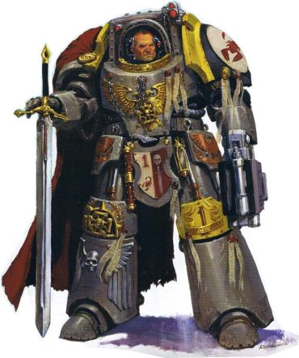
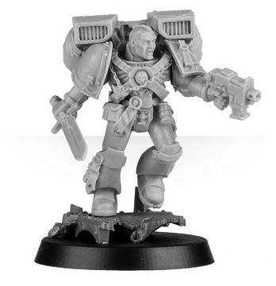
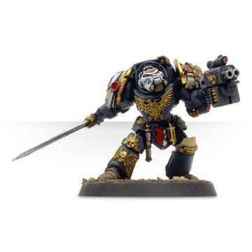
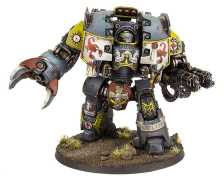

# 0727 卡拉布·库伦 Carab Culln

精校状态：中文行文已逐段精校，部分术语仍为暂定

分类：人类帝国 / 红蝎

原文来源：https://www.bilibili.com/opus/1122698756058251273

原作者：帝国神选罐头

原文时间：2025年10月12日 10:44

[返回分类目录](目录.md) · [全书目录](../../目录.md)

<!-- A0727-B0001 -->
**英文原文**

Carab Culln is the current High Lord Commander of the Red Scorpions Chapter. He is known throughout the Imperium as a deft tactician as well as a proud and courageous individual, traits which made him perfectly suited to the leadership of the Red Scorpions. Like all Red Scorpions he is extremely wary of abhumans, mutants and anything else deviating from the pure human form.

<!-- /A0727-B0001 -->

<!-- A0727-B0002 -->

原译文

卡拉布·库伦是红蝎战团的现任至高领主指挥官。在整个帝国中，他被认为是一位灵巧的战术家，也是一位自豪而勇敢的人，这些特质使他非常适合红蝎的领导。像所有红蝎一样，他对亚人、变种人和任何偏离纯粹人类形态的东西都非常警惕。

**校订译文**

卡拉布·库伦是红蝎战团的现任至高领主指挥官。他以高明的战术、骄傲的性格与过人的勇气闻名帝国，这些特质使他成为领导红蝎的理想人选。与所有红蝎战士一样，他对亚人、变种人以及任何偏离纯正人类形态的存在都极为警惕。

**校注：** 本篇同时保留库伦的至高领主指挥官头衔与其负伤后由两人代掌指挥权的叙述，系所给英文条目的时间层次，不另行推断正式卸任日期。

<!-- /A0727-B0002 -->

<!-- A0727-B0003 图片 -->

<!-- A0727-B0004 -->

原译文

Lord High Commander Carab Culln, Chapter Master of the Red Scorpions 领主至高指挥官卡拉布·库伦，红蝎战团长

**校订译文**

Lord High Commander Carab Culln, Chapter Master of the Red Scorpions 至高领主指挥官卡拉布·库伦，红蝎战团长

<!-- /A0727-B0004 -->

<!-- A0727-B0005 -->
**英文原文**

During the Indomitus Crusade, Culln was grievously wounded and interred within a Dreadnought.

<!-- /A0727-B0005 -->

<!-- A0727-B0006 -->

原译文

在不屈远征期间，库伦受了重伤，被安置在一架无畏内。

**校订译文**

不屈远征期间，库伦身受重伤，被安置在一台无畏机甲之中。

<!-- /A0727-B0006 -->

<!-- A0727-B0007 -->
## History 历史

<!-- /A0727-B0007 -->

<!-- A0727-B0008 -->
**英文原文**

Culln was inducted into the Red Scorpions from the primitive planet known as Zaebus Minoris.

<!-- /A0727-B0008 -->

<!-- A0727-B0009 -->

原译文

库伦从被称为泽巴斯·米诺若斯的原始行星被引入红蝎。

**校订译文**

库伦出身于原始行星泽巴斯·米诺若斯，并在那里被招募进红蝎战团。

<!-- /A0727-B0009 -->

<!-- A0727-B0010 -->
**英文原文**

Culln, like all Marines of Codex Chapters, started his Imperial life as a Scout, quickly rising through all possible ranks and eventually being made Captain of the 1st Company after the death of Commander Usaml on the Space Hulk Vulgator. Before this he served as first as an Assault Squad Sergeant and then as a Sergeant of the Vanguard (he fought, for example, during the Siege of Vraks as Veteran Sergeant of an Eighth Company Assault squad, returning latter in the campaign in command of a Vanguard squad) and then as the Sergeant of the 1st Company Veteran Terminators. Culln was raised to the position of Chapter Master during the Badab War when Verant Ortys was slain in the infamous "Betrayal at Grief" incident. Culln also dislikes the use of camouflage, feeling that it is a form of cowardice and so treats the Tenth Company with disdain.

<!-- /A0727-B0010 -->

<!-- A0727-B0011 -->

原译文

库伦和所有圣典战团的战士一样，以侦察兵的身份开始了他的帝国生活，在所有可能的军衔中迅速晋升，并在太空废船沃尔盖托尔号上指挥官乌萨姆牺牲后，最终被任命为第一连队连长。在此之前，他先是担任突击小队军士，然后担任先锋军士（例如，在弗拉克斯围城期间，他担任第八连队突击小队的老兵军士，后来在战役中返回先锋小队指挥），然后担任第一连队老兵终结者军士。在巴达布战争期间，当维兰特·奥尔蒂斯在臭名昭著的“悲伤之叛”事件中被杀时，库伦被提升为战团长。库伦也不喜欢使用伪装，觉得这是一种懦弱，因此对第十连队不屑一顾。

**校订译文**

与所有圣典战团的战士一样，库伦以侦察兵的身份开始为帝国服役，随后迅速晋升，历任多个职务。他先后担任突击小队军士、先锋小队军士以及第一连老兵终结者军士。例如，在弗拉克斯围攻战期间，他起初是第八连一支突击小队的老兵军士，后来重返这场战役时，已在指挥一支先锋小队。乌萨姆指挥官在太空废船沃尔盖托尔号上阵亡后，库伦最终升任第一连连长。巴达布战争期间，维兰特·奥尔蒂斯在臭名昭著的“格里夫背叛事件”中遇害，库伦遂接任战团长。他不喜欢使用伪装，认为这是一种怯懦的表现，因此也看不起第十连。

<!-- /A0727-B0011 -->

<!-- A0727-B0012 图片 -->

<!-- A0727-B0013 -->

原译文

Carab Culln during the Siege of Vraks 弗拉克斯围城期间的卡拉布·库伦

**校订译文**

Carab Culln during the Siege of Vraks 弗拉克斯围攻战期间的卡拉布·库伦

<!-- /A0727-B0013 -->

<!-- A0727-B0014 -->
### The Anphelion Project 远日计划

**校注：** Anphelion 为原文专名，沿稿“远日计划”；未将其误认成拼写相近的 aphelion（远日点）。译名暂定。

<!-- /A0727-B0014 -->

<!-- A0727-B0015 -->
**英文原文**

Culln took command of the Red Scorpions mission on the fourth moon of Beta-Anphelion. His actions during this mission (namely evacuating only the Red Scorpions accompanying him and leaving Inquisitor Solomon Lok to die fighting Tyranids) has earned him ire amongst some factions of the Ordo Xenos.

<!-- /A0727-B0015 -->

<!-- A0727-B0016 -->

原译文

库伦负责指挥红蝎在贝塔-安菲利翁的第四颗卫星上的任务。他在这次任务中的行动（即只疏散陪同他的红蝎，让审判官所罗门·洛克在与泰伦的战斗中死去）让他在攘外修会的一些派系中感到愤怒。

**校订译文**

库伦曾指挥红蝎在贝塔-安菲利翁第四颗卫星上的行动。他在任务中只撤走了随行的红蝎战士，却把审判官所罗门·洛克留在那里，任其在与泰伦虫族的战斗中丧生。这一举动激怒了异形审判庭的部分派系。

**校注：** 修正施受关系：是库伦抛下审判官的行为激怒了异形审判庭派系，而非库伦本人感到愤怒。

<!-- /A0727-B0016 -->

<!-- A0727-B0017 图片 -->

<!-- A0727-B0018 -->

原译文

Carab Culln during the Anphelion Project 远日计划期间的卡拉布·库伦

**校订译文**

Carab Culln during the Anphelion Project 远日计划期间的卡拉布·库伦

<!-- /A0727-B0018 -->

<!-- A0727-B0019 -->
### The Badab War 巴达布战争

<!-- /A0727-B0019 -->

<!-- A0727-B0020 -->
**英文原文**

After becoming Chapter Master, Culln also became commander of the loyalist forces where he proved to be a deft strategist, able to utilise the unique skills and strategies of the various chapters under his command. Culln refused to hide his presence and personally led several key assaults during the campaign, including the attack on Angstrom XIII.

<!-- /A0727-B0020 -->

<!-- A0727-B0021 -->

原译文

在成为战团长后，库伦还成为了忠诚派部队的指挥官，在那里他被证明是一位灵巧的战略家，能够利用他指挥的各个战团的独特技能和策略。库伦拒绝隐藏自己的存在，并在战役期间亲自领导了几次关键袭击，包括对安斯特罗姆13号的袭击。

**校订译文**

接任战团长后，库伦也成为忠诚派部队的指挥官。他展现出高明的战略才能，善于发挥麾下各战团独有的专长与战法。他不愿隐蔽自己的行踪，曾亲自率队发动数次关键突击，包括对安斯特罗姆十三号的进攻。

<!-- /A0727-B0021 -->

<!-- A0727-B0022 -->
### Internment 安置于无畏机甲

原题：Internment 禁锢

<!-- /A0727-B0022 -->

<!-- A0727-B0023 -->
**英文原文**

During the campaigns of the Indomitus Crusade, Culln was grievously wounded slaying the Great Beast of Sarum. Culln’s remains were returned to the Chapter, bearing only the faintest whisperings of life. Thus in honour he was interred within the armored shell of an ancient Leviathan Dreadnought, blessed with the technology to allow Culln to serve his brethren in battle once again.

<!-- /A0727-B0023 -->

<!-- A0727-B0024 -->

原译文

在不屈远征期间，库伦在杀死萨鲁姆巨兽时受了重伤。库伦的残躯被送回了战团，只带着生命中最微弱的低语。因此，为了纪念他，他被安置在一艘古老的利维坦无畏机甲内，这架无畏拥有让库伦再次在战斗中为他的兄弟们服役的技术。

**校订译文**

不屈远征期间，库伦在斩杀萨勒姆巨兽时身受重伤。他的残躯被送回战团时，只剩下极其微弱的生命迹象。为表彰他的功绩，战团将他安置进一台古老的利维坦无畏机甲，以机甲内的技术维持生命，使他得以再次与兄弟们并肩作战。

**校注：** Sarum 统一前文世界名词根“萨勒姆”；原“萨鲁姆巨兽”改“萨勒姆巨兽”。此处名称统一不额外断定战斗地点与前文星球的关系。interred 在此为将濒死战士安置进维生机甲，并非安葬死者。

<!-- /A0727-B0024 -->

<!-- A0727-B0025 图片 -->

<!-- A0727-B0026 -->

原译文

Carab Culln as a Dreadnought 作为无畏的卡拉布·库伦

**校订译文**

Carab Culln as a Dreadnought 成为无畏战士后的卡拉布·库伦

<!-- /A0727-B0026 -->

<!-- A0727-B0027 -->
**英文原文**

In the aftermath of his wounding command of the Red Scorpions has been taken up by Casan Sabius and Sirae Karagon.

<!-- /A0727-B0027 -->

<!-- A0727-B0028 -->

原译文

在他受伤之后，红蝎的指挥权被卡桑·萨比乌斯和西拉·卡拉贡接管。

**校订译文**

库伦受伤后，卡桑·萨比乌斯与西拉·卡拉贡接掌了红蝎战团的指挥权。

<!-- /A0727-B0028 -->

<!-- A0727-B0029 -->
## Wargear 战斗装备

原题：Wargear 战备

<!-- /A0727-B0029 -->

<!-- A0727-B0030 -->
**英文原文**

Culln wears a suit of ornate Terminator Armour into battle which incorporates a Teleport Homer and Iron Halo. He wields the Blade of Vord which is a relic of the 1st company and was originally used by Commander Vord. He also carries a Master Crafted Storm Bolter. With his rise to Chapter Master, he began carrying the ancient Blade of the Scorpion instead of the Blade of Vord.

<!-- /A0727-B0030 -->

<!-- A0727-B0031 -->

原译文

库伦穿着华丽的终结者盔甲参加战斗，其中包括传送信标和铁光环。他挥舞着沃德之剑，这是第一连队的圣物，最初由指挥官沃德使用。他还携带了一个大师级风暴爆矢枪。随着他升任战团长，他开始携带古老的蝎剑而不是沃德之剑。

**校订译文**

库伦曾身披一套华丽的终结者护甲作战，护甲配有传送信标与铁光环。他使用的沃德之剑是第一连的圣物，最初由沃德指挥官持有；此外，他还携带一支精工风暴爆矢枪。升任战团长后，他以古老的蝎剑取代了沃德之剑。

<!-- /A0727-B0031 -->

<!-- A0727-B0032 -->
**英文原文**

As a Dreadnought, Culln is equipped with a Leviathan Siege Claw, twin-linked Assault Cannons, and Hunter-Killer Missiles.

<!-- /A0727-B0032 -->

<!-- A0727-B0033 -->

原译文

作为无畏，库伦配备了利维坦攻城爪、双联突击炮和猎人杀手导弹。

**校订译文**

成为无畏战士后，库伦装备了利维坦攻城爪、双联突击炮以及猎杀者导弹。

<!-- /A0727-B0033 -->

本篇核心术语与暂定项

以下列出本篇出现的英文原形及核心术语表用词。同形词可能指不同对象，具体词义以本篇正文和校注为准；单复数、别名和仅见于图注的名称可能尚未列入。完整候选见[术语表](../../术语表/双语术语候选.csv)。

| 英文 | 采用中文 | 状态 |
| --- | --- | --- |
| Tyranids | 泰伦虫族 | 官方已核对 |
| Terminator | 终结者 | 官方已核对 |
| Inquisitor | 审判官 | 官方已核对 |
| Imperium | 帝国 | 暂定·简称 |
| Indomitus | 不屈学派 | 暂定·学派语境 |
| Teleport Homer | 传送信标 | 暂定·官方待核 |
| Sarum | 萨勒姆 | 暂定·官方待核 |
| Hunter-Killer | 猎杀者 | 暂定·官方待核 |
| Indomitus Crusade | 不屈远征 | 暂定·官方待核 |
| Ordo Xenos | 异形审判庭 | 用户指定 |
| Badab | 巴达布 | 暂定·官方待核 |
| Master | 导师（审判庭职衔）／舰务官（舰员职务） | 语境定译·官方待核 |
| Mission | 教团／传教机构 | 暂定 |
| Ancient | 旗手 | 官方已核对 |
| Lord Commander | 领主指挥官 | 暂定·官方待核 |
| Iron Halo | 铁光环 | 暂定·官方待核 |
| Chapter | 战团 | 暂定·官方待核 |
| Chapter Master | 战团长 | 暂定·官方待核 |
| Captain | 连长 | 暂定·官方待核 |
| Veteran | 老兵 | 暂定·官方待核 |
| Terminators | 终结者 | 暂定·官方待核 |
| Sergeant | 军士 | 暂定·官方待核 |
| Scout | 侦察兵 | 暂定·官方待核 |
| Vanguard | 先锋 | 暂定·官方待核 |
| Red Scorpions | 红蝎 | 暂定·官方待核 |
| Casan Sabius | 卡桑·萨比乌斯 | 暂定·官方待核 |
| Sirae Karagon | 西拉·卡拉贡 | 暂定·官方待核 |
| Carab Culln | 卡拉布·库伦 | 暂定·官方待核 |
| Grief | 格里夫 | 暂定·官方待核 |
| Xenos | 异形 | 暂定·官方待核 |
| Dreadnought | 无畏机甲 | 暂定·官方待核 |
| Zaebus | 泽巴斯 | 暂定·官方待核 |
| Zaebus Minoris | 泽巴斯·米诺若斯 | 暂定·官方待核 |
| Usaml | 乌萨姆 | 暂定·官方待核 |
| Vulgator | 沃尔盖托尔号 | 暂定·官方待核 |
| Betrayal at Grief | 格里夫背叛事件 | 暂定·官方待核 |
| Beta-Anphelion | 贝塔-安菲利翁 | 暂定·官方待核 |
| Solomon Lok | 所罗门·洛克 | 暂定·官方待核 |
| Angstrom XIII | 安斯特罗姆十三号 | 暂定·官方待核 |
| Great Beast of Sarum | 萨勒姆巨兽 | 暂定·官方待核 |
| Blade of Vord | 沃德之剑 | 暂定·官方待核 |
| Blade of the Scorpion | 蝎剑 | 暂定·官方待核 |
| Solomon | 所罗门 | 暂定·官方待核 |
| Angstrom | 埃格斯特朗 | 暂定·官方待核 |
| Verant Ortys | 韦朗特·奥尔蒂斯 | 暂定·官方待核 |
| Beta | 贝塔号 | 暂定·官方待核 |
| claw | 利爪分队 | 暂定·官方待核 |
| Bolter | 爆矢枪 | 暂定·官方待核 |
| Storm bolter | 风暴爆矢枪 | 官方已核对 |
| Terminator Armour | 终结者盔甲 | 暂定·官方待核 |

