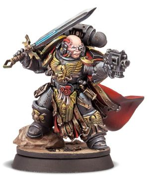

# 0728 卡桑·萨比乌斯 Casan Sabius

精校状态：中文行文已逐段精校，部分术语仍为暂定

分类：人类帝国 / 红蝎

原文来源：https://www.bilibili.com/opus/1122366239738429449

原作者：帝国神选罐头

原文时间：2025年10月11日 13:14

[返回分类目录](目录.md) · [全书目录](../../目录.md)

<!-- A0728-B0001 -->
**英文原文**

Casan Sabius is a Red Scorpions Captain and, since the internment of Carab Culln into the shell of a Leviathan Dreadnought, he has become one of the two de facto Chapter Masters of the Chapter, alongside Sirae Karagon.

<!-- /A0728-B0001 -->

<!-- A0728-B0002 -->

原译文

卡桑·萨比乌斯是红蝎的连长，自从卡拉布·库伦被禁锢在一艘利维坦无畏的石棺中以来，他已经成为该战团事实上的两位战团长之一，与西拉·卡拉贡并肩作战。

**校订译文**

卡桑·萨比乌斯是红蝎战团的一名连长。卡拉布·库伦被安置进利维坦无畏机甲后，他与西拉·卡拉贡共同掌权，成为战团事实上的两位领导者。

<!-- /A0728-B0002 -->

<!-- A0728-B0003 图片 -->

<!-- A0728-B0004 -->

原译文

Casan Sabius 卡桑·萨比乌斯

**校订译文**

Casan Sabius 卡桑·萨比乌斯

<!-- /A0728-B0004 -->

<!-- A0728-B0005 -->
### Overview 概述

<!-- /A0728-B0005 -->

<!-- A0728-B0006 -->
**英文原文**

Sabius is renowned amongst his Chapter, as being a formidable strategist and swordsman. These skills aided him when Lord High Commander Culln, fell in combat against the Hive Fleet Kraken beast known as the Great Beast of Sarum and the Red Scorpions rallied around Sabius' leadership as the Hive Fleet began to overwhelm them. In order to save his Chapter from being destroyed, Sabius took command of the Red Scorpions' fleet and enacted a flawless strategy of disengagement from the tendrils of the Hive Fleet, whilst also coordinating a precision orbital bombardment that allowed them to escape. Afterwards, Culln was interred within a Leviathan Dreadnought and command of the Chapter fell to Sabius, who his Battle Brothers deemed worthy to lead them. However he does not share their belief. Sabius secretly feels responsible for the loss of Culln, whom he so admired, and only now reluctantly leads the Red Scorpions as its Lord-Regent, until the Chapter selects a new Lord High Commander.

<!-- /A0728-B0006 -->

<!-- A0728-B0007 -->

原译文

萨比乌斯在他的战团中以强大的战略和剑术而闻名。当领主至高指挥官库伦在与被称为萨鲁姆巨兽的虫巢舰队克拉肯的战斗中倒下时，这些技能帮助了他，当虫巢舰队开始压倒红蝎时，红蝎团结在萨比乌斯的领导下。为了拯救他的战团免于被摧毁，萨比乌斯指挥了红蝎舰队，并制定了一项完美的脱离虫巢舰队卷须的战略，同时还协调了精确的轨道轰炸，使他们得以逃脱。之后，库伦被安置在一架利维坦无畏内，该战团的指挥权落到了萨比乌斯手中，他的战斗兄弟们认为萨比乌斯值得领导他们。然而，他并不认同他们的信仰。萨比乌斯暗自觉得自己对库伦的倒下负有责任，他非常钦佩库伦，直到现在才不情愿地领导红蝎作为领主摄政，直到战团选出新的领主最高指挥官。

**校订译文**

萨比乌斯在战团中以卓越的战略才能与剑术闻名。至高领主指挥官库伦在对抗克拉肯虫巢舰队的萨勒姆巨兽时倒下，红蝎也逐渐被虫巢舰队压制；危急之际，战士们团结在萨比乌斯的指挥之下。他接管红蝎舰队，以一套无懈可击的撤退方案脱离虫巢舰队的触须舰队，同时协调精确的轨道轰炸，终于带领战团逃出生天，免遭覆灭。此后，库伦被安置进利维坦无畏机甲，指挥权落到萨比乌斯手中，战斗兄弟们认为他有资格领导战团。但萨比乌斯并不这样看。他十分敬仰库伦，私下认为自己应对库伦的倒下负责。因此，他只是勉强以领主摄政的身份领导红蝎，等待战团选出新的至高领主指挥官。

**校注：** does not share their belief 指萨比乌斯不认为自己有资格领导战团，不是与兄弟们信仰不同。

<!-- /A0728-B0007 -->

<!-- A0728-B0008 -->
**英文原文**

During a battle, Sabius can always be seen fighting on the front lines, where his bravery and determination leads him to slay the most dangerous foes with the Blade of the Scorpion. This always inspires great fervour in his Battle Brothers, who fight all the harder to seek out grander feats of glory to forge a legacy worthy of their Lord-Regent. However now, a need for atonement drives Sabius to serve his Emperor with greater zeal and he throws himself into the fray, lest his revered Chapter suffers further harm. This earnestness is mirrored in the Lord-Regent’s nigh-on fanatical pursuit of genetic purity, a traditionalist outlook that unites the battlegroups of the Chapter after the losses sustained in the Indomitus Crusade.

<!-- /A0728-B0008 -->

<!-- A0728-B0009 -->

原译文

在战斗中，萨比乌斯总是在前线作战，他的勇气和决心使他用蝎剑杀死了最危险的敌人。这总是激发他的战斗兄弟们的巨大热情，他们更加努力地寻找更辉煌的壮举，以打造一个值得他们的领主摄政继承的遗产。然而现在，赎罪的需要驱使萨比乌斯以更大的热情为帝皇服务，他全身心投入战斗，以免他尊敬的战团受到进一步的伤害。这种认真反映在领主摄政对基因纯净的狂热追求上，这是一种传统主义观点，在不屈远征中遭受损失后，将战团的战斗群团结在一起。

**校订译文**

战斗中，萨比乌斯总是冲杀在最前线，凭借勇气与决心，以蝎剑斩杀最危险的敌人。这总能激发战斗兄弟们的热情，促使他们奋勇作战，追求更为辉煌的功绩，留下足以匹配这位领主摄政的荣耀。如今，赎罪的渴望驱使萨比乌斯更加热忱地为帝皇效命；为了不让自己敬爱的战团再受伤害，他总是奋不顾身地投入厮杀。这份执着也体现在他对基因纯净近乎狂热的追求上。这种恪守传统的理念，将不屈远征中损失惨重的各个战斗群重新凝聚在一起。

<!-- /A0728-B0009 -->

本篇核心术语与暂定项

以下列出本篇出现的英文原形及核心术语表用词。同形词可能指不同对象，具体词义以本篇正文和校注为准；单复数、别名和仅见于图注的名称可能尚未列入。完整候选见[术语表](../../术语表/双语术语候选.csv)。

| 英文 | 采用中文 | 状态 |
| --- | --- | --- |
| Indomitus | 不屈学派 | 暂定·学派语境 |
| Emperor | 帝皇 | 官方已核对 |
| Sarum | 萨勒姆 | 暂定·官方待核 |
| Indomitus Crusade | 不屈远征 | 暂定·官方待核 |
| Chapter | 战团 | 暂定·官方待核 |
| Captain | 连长 | 暂定·官方待核 |
| Red Scorpions | 红蝎 | 暂定·官方待核 |
| Casan Sabius | 卡桑·萨比乌斯 | 暂定·官方待核 |
| Sirae Karagon | 西拉·卡拉贡 | 暂定·官方待核 |
| Carab Culln | 卡拉布·库伦 | 暂定·官方待核 |
| Lord High Commander | 至高领主指挥官 | 暂定·官方待核 |
| Dreadnought | 无畏机甲 | 暂定·官方待核 |
| Great Beast of Sarum | 萨勒姆巨兽 | 暂定·官方待核 |
| Blade of the Scorpion | 蝎剑 | 暂定·官方待核 |
| Kraken | 克拉肯 | 暂定·官方待核 |
| The Loss | 失落 | 暂定·官方待核 |

