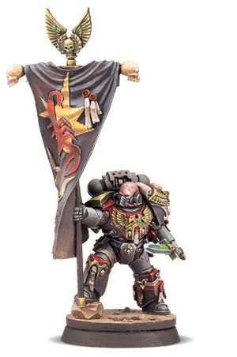

# 0729 西拉·卡拉贡 Sirae Karagon

精校状态：中文行文已逐段精校，部分术语仍为暂定

分类：人类帝国 / 红蝎

原文来源：https://www.bilibili.com/opus/1122370238309990419

原作者：帝国神选罐头

原文时间：2025年10月11日 13:29

[返回分类目录](目录.md) · [全书目录](../../目录.md)

<!-- A0729-B0001 -->
**英文原文**

Sirae Karagon is a Red Scorpions Ancient-Invigilus and, since the internment of Carab Culln into the shell of a Leviathan Dreadnought, he has become one of the two de facto Chapter Masters of the Chapter alongside Casan Sabius.

<!-- /A0729-B0001 -->

<!-- A0729-B0002 -->

原译文

西拉·卡拉贡是一位红蝎警戒旗手，自从卡拉布·库伦被束缚在一艘利维坦无畏中以来，他已经成为与卡桑·萨比乌斯一起的两位事实上的战团长之一。

**校订译文**

西拉·卡拉贡是红蝎战团的警戒旗手。卡拉布·库伦被安置进利维坦无畏机甲后，他与卡桑·萨比乌斯共同掌权，成为战团事实上的两位领导者。

<!-- /A0729-B0002 -->

<!-- A0729-B0003 图片 -->

<!-- A0729-B0004 -->

原译文

Sirae Karagon 西拉·卡拉贡

**校订译文**

Sirae Karagon 西拉·卡拉贡

<!-- /A0729-B0004 -->

<!-- A0729-B0005 -->
### Overview 概述

<!-- /A0729-B0005 -->

<!-- A0729-B0006 -->
**英文原文**

While serving as the Chapter's Ancient, Karagon defeated a Genestealer Patriarch while the Chapter cleansed a Genestealer Cult on the Imperium Hive World Lamarno VII. For this feat, he was honoured by Lord High Commander Culln with carrying the Chapter's relic Vexilla Imperialis Battle Standard into battle. When Culln later fell against the Hive Fleet Kraken beast known as the Great Beast of Sarum, Karagon was raised to a rarely invoked position amongst his Chapter; that of Ancient-Invigilus, who serves as a guardian of the purity for the Red Scorpions. This rank, in the style of a naysmith of Old Terra, brings with it the authority to scrutinise the commands of the Chapter's current Lord-Regent Casan Sabius, but also to privately hold Sabius' confidence and ensure he retains his humility in his position of power. This is reflected in the Chapter's battles, as Karagon is a grim-faced and pragmatic warrior who perfectly balances Sabius' zeal and fury.

<!-- /A0729-B0006 -->

<!-- A0729-B0007 -->

原译文

在担任战团的旗手期间，卡拉贡击败了一位基因窃取者族长，而战团在帝国巢都世界拉马诺七号上清洗了一个基因窃取者教派。由于这一壮举，他被领主至高指挥官库伦授予荣誉，将该战团的圣物维西拉帝国战旗带入战斗。当卡伦后来与被称为萨鲁姆巨兽的虫巢舰队克拉肯兽交战时，卡拉贡被提升到了他所在战团中一个很少被提及的位置；警戒旗手，他是红蝎纯洁的守护者。这个级别，以旧泰拉的否决铁匠的风格，带来了审查该战团现任领主摄政卡桑·萨比乌斯的命令的权力，同时也私下保持萨比乌斯的信心，并确保他在权力地位上保持谦逊。这反映在本战团的战斗中，因为卡拉贡是一个面容严肃、务实的战士，完美地平衡了萨比乌斯的热情和愤怒。

**校订译文**

红蝎战团在帝国巢都世界拉马尔诺七号清剿基因窃取者教派时，时任战团旗手的卡拉贡击败了一名基因窃取者族长。为表彰这一功绩，至高领主指挥官库伦授予他携带战团圣物维西拉帝国战旗出征的荣誉。后来，库伦在对抗克拉肯虫巢舰队的萨勒姆巨兽时倒下，卡拉贡被擢升为战团中极少启用的“警戒旗手”，负责守护红蝎的纯洁。这一职衔仿照古泰拉的谏官而设，使他有权审视现任领主摄政卡桑·萨比乌斯的命令；同时，他也是萨比乌斯私下信任的顾问，负责提醒对方在手握大权时仍保持谦逊。在战场上，这种职责体现得同样鲜明：卡拉贡冷峻而务实，恰好能够制衡萨比乌斯的热忱与怒火。

**校注：** naysmith 按其质疑命令、维持领袖谦逊的职责暂译“谏官”，不按 smith 字面误译铁匠。Ancient-Invigilus 沿原译“警戒旗手”；rarely invoked 指职衔极少启用。

<!-- /A0729-B0007 -->

本篇核心术语与暂定项

以下列出本篇出现的英文原形及核心术语表用词。同形词可能指不同对象，具体词义以本篇正文和校注为准；单复数、别名和仅见于图注的名称可能尚未列入。完整候选见[术语表](../../术语表/双语术语候选.csv)。

| 英文 | 采用中文 | 状态 |
| --- | --- | --- |
| Imperium | 帝国 | 暂定·简称 |
| Patriarch | 族长 | 官方已核对 |
| Hive World | 巢都世界 | 暂定·官方待核 |
| Terra | 泰拉 | 暂定·官方待核 |
| Sarum | 萨勒姆 | 暂定·官方待核 |
| Ancient | 旗手 | 官方已核对 |
| Chapter | 战团 | 暂定·官方待核 |
| Red Scorpions | 红蝎 | 暂定·官方待核 |
| Casan Sabius | 卡桑·萨比乌斯 | 暂定·官方待核 |
| Sirae Karagon | 西拉·卡拉贡 | 暂定·官方待核 |
| Carab Culln | 卡拉布·库伦 | 暂定·官方待核 |
| naysmith | 谏官 | 暂定·官方待核 |
| Lord High Commander | 至高领主指挥官 | 暂定·官方待核 |
| Imperialis | 帝国徽记 | 暂定·官方待核 |
| Lamarno | 拉马尔诺 | 暂定·官方待核 |
| Dreadnought | 无畏机甲 | 暂定·官方待核 |
| Great Beast of Sarum | 萨勒姆巨兽 | 暂定·官方待核 |
| Ancient-Invigilus | 警戒旗手 | 暂定·官方待核 |
| Vexilla Imperialis Battle Standard | 维西拉帝国战旗 | 暂定·官方待核 |
| Kraken | 克拉肯 | 暂定·官方待核 |

