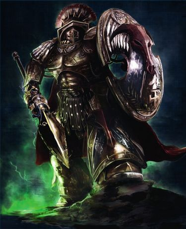
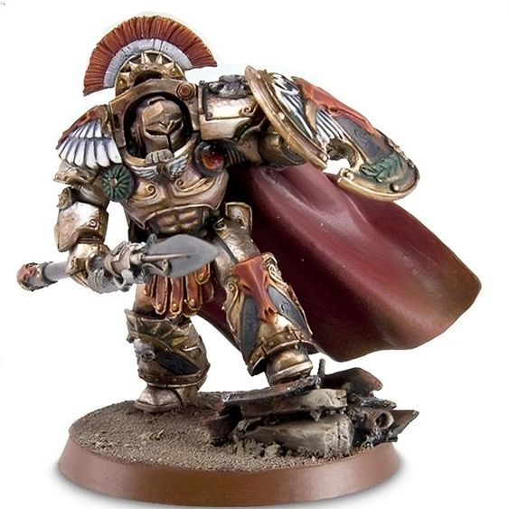

# 0730 阿斯忒里昂·摩洛克 Asterion Moloc

精校状态：中文行文已逐段精校，部分术语仍为暂定

分类：人类帝国 / 米诺陶

原文来源：https://www.bilibili.com/opus/1123091998973100068

原作者：帝国神选罐头

原文时间：2025年10月13日 12:10

[返回分类目录](目录.md) · [全书目录](../../目录.md)

原篇名：阿斯特里昂·莫洛克 Asterion Moloc

<!-- A0730-B0001 -->
**英文原文**

Asterion Moloc — Satrap of the Daedelos Krata, Bringer of Wrath, the Brazen Warlord, Spear of Judgement — is the current Chapter Master of the Minotaurs. Bloody-handed and paranoid, he is a dark legend whose name is a byword for destruction and slaughter in the Emperor's name.

<!-- /A0730-B0001 -->

<!-- A0730-B0002 -->

原译文

阿斯特里昂·莫洛克 — 代达罗斯迷宫号总督，愤怒使者，黄铜军阀，审判之矛 — 是米诺陶的现任战团长。他双手沾满鲜血，偏执多疑，是一个黑暗的传说，他的名字是帝皇之名下毁灭和屠杀的代名词。

**校订译文**

阿斯忒里昂·摩洛克拥有代达洛斯·克拉塔号总督、愤怒使者、黄铜军阀与审判之矛等称号，是米诺陶战团的现任战团长。他双手染血、偏执多疑，是一个阴暗的传奇人物；他的名字已成为以帝皇之名毁灭与屠戮的代名词。

**校注：** 人物名沿213“阿斯忒里昂·摩洛克”；舰名沿316“代达洛斯·克拉塔”，不再因联想将其译成代达罗斯迷宫号。

<!-- /A0730-B0002 -->

<!-- A0730-B0003 图片 -->

<!-- A0730-B0004 -->

原译文

Asterion Moloc 阿斯特里昂·莫洛克

**校订译文**

Asterion Moloc 阿斯忒里昂·摩洛克

<!-- /A0730-B0004 -->

<!-- A0730-B0005 -->
## Biography 传记

<!-- /A0730-B0005 -->

<!-- A0730-B0006 -->
**英文原文**

A diligent and disciplined logistician, strategist, and master of siegecraft, Lord Asterion Moloc revels in his dark reputation. The veteran of a hundred battles, his body has been heavily rebuilt with cybernetic augments and his sheer spite and malice are enough to allow him to shrug off wounds that would fell a lesser Space Marine. Moloc takes pleasure in the utter destruction of his foes, most often found in battle at the head of his Terminators slamming into the enemy line, and has personally slain several renegade Chapter Masters, as well as Ork Warbosses, Corsair Princes, and Champions of the Dark Gods.. Outside of battle, he can be found on his brazen throne at the center of the maze-like chambers of the heavy assault carrier Daedelos Krata, surrounded by data-feeds, tabulation servitors, and casualty reports, measuring the drops of blood spilt in quest of his Chapter's strategic goals.

<!-- /A0730-B0006 -->

<!-- A0730-B0007 -->

原译文

阿斯特里昂·莫洛克领主是一位勤奋自律的后勤学家、战略家和攻城大师，他陶醉于自己的黑暗声誉。作为一名经历过百战的老兵，他的身体已经通过智控增强进行了大量重造，他纯粹的怨恨和恶意足以让他无视一个让星际战士倒下的伤口。莫洛克对敌人的彻底毁灭感到高兴，最常见的是在战斗中，他的终结者之头撞向敌人的防线，并亲自杀死几名变节的战团长，以及欧克战争头目、海盗王子和黑暗诸神的冠军。在战斗之外，他可以在重型突击母舰代达罗斯迷宫号迷宫般的房间中心的厚颜无耻的宝座上找到，周围环绕着数据馈送、制表机仆和伤亡报告，测量着为追求本战团战略目标而洒下的血滴。

**校订译文**

阿斯忒里昂·摩洛克领主是一位勤勉自律的后勤专家、战略家与攻城大师，也十分陶醉于自己的恶名。他身经百战，身体经过大幅机械改造，单凭强烈的怨毒与恶意，就足以无视那些会击倒较弱星际战士的伤势。他以彻底毁灭敌人为乐，常常亲率终结者冲击敌军防线，曾亲手杀死多位叛变战团长、欧克蛮人战争头目、海盗王子与黑暗诸神的冠军。战事暂歇时，他会坐在重型突击母舰代达洛斯·克拉塔号的黄铜王座上。王座位于迷宫般舱室的中心，周围尽是数据终端、负责统计的机仆与伤亡报告；他在那里衡量战团为了实现战略目标所付出的每一滴鲜血。

**校注：** brazen throne 指黄铜王座，原“厚颜无耻的宝座”误取 brazen 的另一义。at the head of his Terminators 指率领终结者，不是终结者之头。

<!-- /A0730-B0007 -->

<!-- A0730-B0008 -->
**英文原文**

The Minotaurs Chapter have been used often in the past to persecute traitors, iconoclasts, and renegades from within the ranks of the Space Marines by the High Lords of Terra. As a result, Asterion Moloc has long become expert in the systematic destruction of other Adeptus Astartes forces that have strayed from the path of righteousness, viewing such targets as both worthy of the Emperor's wrath, and the ultimate test of the Minotaurs' skills in battle. This reason above any other was the one of the fundamental causes for the Minotaurs Chapter to join the Loyalists in the Badab War and many of their battles, specifically the savage engagements in which they devastated the Lamenters Chapter and forced their surrender, having entered into legend among the Space Marines.

<!-- /A0730-B0008 -->

<!-- A0730-B0009 -->

原译文

米诺陶战团在过去经常被用来迫害来自星际战士内部的叛徒、反传统者和变节者。因此， 阿斯特里昂·莫洛克长期以来一直是有系统地摧毁其他偏离正义之路的阿斯塔特修会部队的专家，认为这些目标既值得帝皇之怒，也是对米诺陶战斗技能的最终考验。这个原因高于其他任何原因，是米诺陶战团加入巴达布战争和他们的许多战斗中的忠诚派的根本原因之一，特别是他们摧毁了恸哭者战团并迫使他们投降的野蛮交战，在星际战士中成为了传奇。

**校订译文**

泰拉高领主曾多次派遣米诺陶战团，追剿星际战士内部的叛徒、反传统者与变节者。因此，阿斯忒里昂·摩洛克早已精于有系统地摧毁偏离正道的阿斯塔特部队。他认为，这类目标既理应承受帝皇的怒火，也能给予米诺陶战士的战斗技艺以最严酷的考验。这是米诺陶战团在巴达布战争中加入忠诚派的主要原因之一，重要性超过其他诸多因素。他们在战争中的许多事迹都成为星际战士间的传奇，尤以重创恸哭者战团、迫使其投降的残酷交锋最为著名。

<!-- /A0730-B0009 -->

<!-- A0730-B0010 -->
**英文原文**

Asterion Moloc was the commander-in-chief of the Space Marine forces sent to the Amarah system by request of governor Calibron Laan to defend it against an unknown enemy. During the Amarah Void Battle, Moloc led an assault force into the heart of the Necron vessel Dead Hand and fought with the Necron Overlord believed to be Maktlan Kutlakh, war leader of the Maynarkh, before he was vented into space, badly wounded. Moloc was initially reported as killed in action, but his fleet recovered him alive. This is at least the seventh such incident over the last five centuries, which leads some to believe that "Asterion Moloc" is a legacy inherited by the Chapter Master of the Minotaurs along with his panoply and engrammatically-enforced memories and personality.

<!-- /A0730-B0010 -->

<!-- A0730-B0011 -->

原译文

阿斯特里昂·莫洛克是应总督卡利布隆·拉安的要求派往阿玛拉星系的星际战士部队的首席指挥官，以防御未知的敌人。在阿玛拉虚空战中，莫洛克率领一支突击部队进入了死灵飞船死亡之手的中心，并与据信是美奈克战争领袖，死灵霸主马克特兰·库特拉克作战，之后他被释放到太空，身受重伤。据报道，莫洛克最初在战斗中阵亡，但他的舰队将其捕捉。这至少是过去五个世纪以来发生的第七起此类事件，这导致一些人认为“阿斯特里昂·莫洛克”是米诺陶的战团长继承的遗产，以及他全面而强制执行的记忆和个性。

**校订译文**

应总督卡利布隆·拉安的请求，一支星际战士部队被派往阿玛拉星系，抵御身份不明的敌人，阿斯忒里昂·摩洛克担任总指挥。在阿玛拉虚空战中，他率突击部队深入太空死灵战舰死亡之手号，与一名太空死灵霸主交战；对方被认为是美奈克的战争领袖马克特兰·库特拉克。随后，摩洛克被抛入太空，身受重伤。最初的报告称他已经阵亡，但舰队后来将仍然活着的他救回。过去五百年里，类似事件至少发生过七次，因此有人认为，“阿斯忒里昂·摩洛克”其实是由历任米诺陶战团长承袭的身份，与整套装备一同传承的，还有通过记忆印刻技术强制植入的记忆与人格。

**校注：** 原译“舰队将其捕捉”误解 recovered him alive，实际是舰队将仍存活的摩洛克救回；panoply 指整套装备，非“全面”。关于姓名与人格继承仅保留原文的推测。

<!-- /A0730-B0011 -->

<!-- A0730-B0012 -->
**英文原文**

During the Age of the Dark Imperium Moloc arrived at Terra with the rest of his Chapter, proclaiming his Chapter had escaped Death Guard assault but in truth due to the Hexarchy's plans. He oversaw the Minotaurs' anti-cultist activities on Terra, with his brutal scorched-earth tactics putting him into conflict with Tor Garadon, Trajann Valoris, and Violeta Roskavler. When the Hexarchy's coup collapsed due to the betrayal of Fadix and a counterattack by Custodes and Imperial Fists, Moloc prepared his chapter to fight. However he was confronted by Violeta Roskavler, now the sole claimant of Master of the Administratum due to the fight of Irthu Haemotalion. Curiously, Moloc promptly withdrew the Minotaurs from Terra after Roskavler whispered something in his ear.

<!-- /A0730-B0012 -->

<!-- A0730-B0013 -->

原译文

在黑暗帝国时代，莫洛克带着他的战团的其他成员抵达了泰拉，宣称他的战团逃脱了死亡守卫的袭击，但事实上是由于六头叛乱的计划。他监督了米诺陶在泰拉上的反邪教徒行动，他残酷的焦土战术使他与托尔·加拉顿、图拉真·瓦洛里斯和维奥莱塔·罗斯卡夫勒发生冲突。当六头政变因法迪克斯的背叛以及禁军和帝国之拳的反击而失败时，莫洛克准备好了战斗。然而，他遇到了维奥莱塔·罗斯卡夫勒，由于伊图·哈莫塔里昂的战斗，她现在是内务部长的唯一索赔者。奇怪的是，在罗斯卡夫勒在他耳边低声说了些什么之后，莫洛克迅速将米诺陶从泰拉撤离。

**校订译文**

黑暗帝国时代，摩洛克率战团其余成员抵达泰拉，声称自己是为躲避死亡守卫的袭击而来，实际却是在执行六头集团的计划。他指挥米诺陶在泰拉清剿邪教徒，残酷的焦土战术使他与托尔·加拉顿、图拉真·瓦洛瑞斯以及维奥莱塔·罗斯卡夫勒发生冲突。法迪克斯倒戈，加上禁军与帝国之拳发起反击，最终使六头政变失败，摩洛克随即命令战团准备战斗。然而，维奥莱塔·罗斯卡夫勒来到他面前；伊图·哈默塔利昂出逃后，她已成为内政部之主这一职位的唯一主张者。奇怪的是，她在摩洛克耳边低语了几句，摩洛克便迅速带着米诺陶撤离了泰拉。

**校注：** 英文 fight of Irthu Haemotalion 疑为 flight 的笔误，结合上下文暂按伊图出逃理解，原英文保留待核。人名沿80“伊图·哈默塔利昂”；Hexarchy 组织译六头集团，政变事件译六头政变。

<!-- /A0730-B0013 -->

<!-- A0730-B0014 图片 -->

<!-- A0730-B0015 -->

原译文

Asterion Moloc 阿斯特里昂·莫洛克

**校订译文**

Asterion Moloc 阿斯忒里昂·摩洛克

<!-- /A0730-B0015 -->

<!-- A0730-B0016 -->
## Wargear 战斗装备

原题：Wargear 战备

<!-- /A0730-B0016 -->

<!-- A0730-B0017 -->
**英文原文**

Moloc wears an ornate suit of Tartaros Pattern Terminator Armor into battle. He wields the Black Spear, a truly deadly relic-weapon of unknown provenance that is similar in some regards to weapons of the Adeptus Custodes, and carries a heraldic storm shield marked with archaic Terran Helac glyphs of unknown significance.

<!-- /A0730-B0017 -->

<!-- A0730-B0018 -->

原译文

莫洛克身着华丽的塔尔塔罗斯型终结者盔甲投入战斗。他挥舞着黑矛，这是一种来源不明的真正致命的圣物武器，在某些方面与禁军的武器相似，并携带了一个带有纹章的风暴盾，上面标有意义不明的古泰拉赫拉克象形文字。

**校订译文**

摩洛克身披华丽的塔尔塔罗斯型终结者护甲作战，手持来历不明、威力致命的圣物武器黑矛。黑矛在某些方面与帝国禁军的武器相似。他还携带一面饰有纹章的风暴盾，盾上刻着古泰拉的赫拉克符文，其含义已不可考。

<!-- /A0730-B0018 -->

本篇核心术语与暂定项

以下列出本篇出现的英文原形及核心术语表用词。同形词可能指不同对象，具体词义以本篇正文和校注为准；单复数、别名和仅见于图注的名称可能尚未列入。完整候选见[术语表](../../术语表/双语术语候选.csv)。

| 英文 | 采用中文 | 状态 |
| --- | --- | --- |
| Space Marines | 星际战士 | 官方已核对 |
| Adeptus Astartes | 阿斯塔特修会 | 官方已核对 |
| Adeptus Custodes | 帝皇禁军 | 官方已核对 |
| Death Guard | 死亡守卫 | 官方已核对 |
| Terminator | 终结者 | 官方已核对 |
| Imperium | 帝国 | 暂定·简称 |
| Administratum | 内政部 | 暂定 |
| Imperial Fists | 帝国之拳 | 暂定 |
| Emperor | 帝皇 | 官方已核对 |
| Corsair | 海盗 | 暂定·官方待核 |
| Terra | 泰拉 | 暂定·官方待核 |
| High Lords of Terra | 泰拉高领主 | 暂定·官方待核 |
| Dark Imperium | 黑暗帝国 | 暂定·官方待核 |
| Badab | 巴达布 | 暂定·官方待核 |
| Master | 导师（审判庭职衔）／舰务官（舰员职务） | 语境定译·官方待核 |
| Minotaurs | 米诺陶 | 暂定·官方待核 |
| Master of the Administratum | 内政部之主 | 暂定·官方待核 |
| Trajann Valoris | 图拉真·瓦洛瑞斯 | 官方已核对 |
| Daedelos Krata | 代达洛斯·克拉塔 | 暂定·官方待核 |
| Space Marine | 星际战士 | 暂定·官方待核 |
| Chapter | 战团 | 暂定·官方待核 |
| Chapter Master | 战团长 | 暂定·官方待核 |
| Veteran | 老兵 | 暂定·官方待核 |
| Terminators | 终结者 | 暂定·官方待核 |
| Tor Garadon | 托尔·加拉顿 | 官方已核 |
| Asterion Moloc | 阿斯忒里昂·摩洛克 | 暂定·官方待核 |
| Lamenters | 恸哭者 | 暂定·官方待核 |
| Overlord | 霸主 | 官方已核对 |
| Iconoclasts | 圣像破坏者 | 暂定·官方待核 |
| Malice | 恶意 | 暂定·官方待核 |
| Irthu Haemotalion | 伊图·哈默塔利昂 | 暂定·官方待核 |
| The Dark | 《黑暗》 | 暂定·官方待核 |
| Satrap of the Daedelos Krata | 代达洛斯·克拉塔号总督 | 暂定·官方待核 |
| Bringer of Wrath | 愤怒使者 | 暂定·官方待核 |
| The Brazen Warlord | 黄铜军阀 | 暂定·官方待核 |
| Spear of Judgement | 审判之矛 | 暂定·官方待核 |
| Calibron Laan | 卡利布隆·拉安 | 暂定·官方待核 |
| Amarah | 阿玛拉 | 暂定·官方待核 |
| Dead Hand | 死亡之手号 | 暂定·官方待核 |
| Maktlan Kutlakh | 马克特兰·库特拉克 | 暂定·官方待核 |
| Maynarkh | 美奈克 | 暂定·官方待核 |
| Hexarchy | 六头集团 | 暂定·官方待核 |
| Helac | 赫拉克 | 暂定·官方待核 |
| Black Spear | 黑矛 | 暂定·官方待核 |
| System | 星系（恒星系统） | 暂定·官方待核 |
| Violeta Roskavler | 维奥莱塔·罗斯卡夫勒 | 暂定·官方待核 |
| Storm Shield | 风暴盾 | 暂定·官方待核 |
| Tartaros Pattern | 冥府型 | 暂定·官方待核 |

