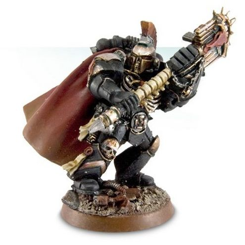

# 0731 伊万努斯·恩科米 Ivanus Enkomi

精校状态：中文行文已逐段精校，部分术语仍为暂定

分类：人类帝国 / 米诺陶

原文来源：https://www.bilibili.com/opus/1123116463111012359

原作者：帝国神选罐头

原文时间：2025年10月13日 13:45

[返回分类目录](目录.md) · [全书目录](../../目录.md)

<!-- A0731-B0001 -->
**英文原文**

Ivanus Enkomi, the Voice of the Minotaur, is the current Reclusiarch Chaplain of the Minotaurs.

<!-- /A0731-B0001 -->

<!-- A0731-B0002 -->

原译文

伊万努斯·恩科米，米诺陶之音，现任米诺陶隐修牧师。

**校订译文**

伊万努斯·恩科米，人称“米诺陶之音”，是米诺陶战团现任隐修长。

<!-- /A0731-B0002 -->

<!-- A0731-B0003 图片 -->

<!-- A0731-B0004 -->

原译文

Ivanus Enkomi, Reclusiarch Chaplain of the Minotaurs 伊万努斯·恩科米，米诺陶的隐修牧师

**校订译文**

Ivanus Enkomi, Reclusiarch Chaplain of the Minotaurs 伊万努斯·恩科米，米诺陶战团隐修长

<!-- /A0731-B0004 -->

<!-- A0731-B0005 -->
## Biography 传记

<!-- /A0731-B0005 -->

<!-- A0731-B0006 -->
**英文原文**

The gaunt, brooding Ivanus Enkomi was the eyes and voice of his Chapter at the Loyalist councils of war during the Badab War. Although the Minotaurs played a key part in the war, they remained largely aloof and distant from their allies as was the Chapter's wont, letting their blood reputation and brutal victories speak for them. Enkomi was judged by many to be a paradox, at once a natural observer whose stern gaze missed little and whose crimson-tattooed face and red-irised eyes spoke of an origin on some distant and feral world, but whose voice, although rarely employed, betrayed extraordinary intelligence and a capacity for fiery oratory that rivaled the greatest demagogues of the Ecclesiarchy in potency and skill.

<!-- /A0731-B0006 -->

<!-- A0731-B0007 -->

原译文

憔悴、沉思的伊万努斯·恩科米是巴达布战争期间忠诚派战争议会中他所在的战团的眼睛和声音。尽管米诺陶在战争中发挥了关键作用，但他们仍然像战团的习惯一样，在很大程度上与盟友保持距离，让他们的血腥声誉和残酷胜利为他们说话。许多人认为恩科米是一个悖论，他既是一个天生的观察者，严肃的目光几乎没有错过，他深红色的纹身脸和红虹膜的眼睛诉说着一个遥远而野性的世界的起源，但他的声音，虽然很少被使用，却表现出非凡的智慧和激情的演讲能力，在影响力和技巧上可与国教最伟大的煽动家相媲美。

**校订译文**

巴达布战争期间，形容枯槁、性情阴郁的伊万努斯·恩科米代表战团出席忠诚派作战会议，充当战团的耳目与代言人。尽管米诺陶在战争中发挥了关键作用，他们仍一如既往地与盟友保持距离，以血腥的威名和残酷的胜绩代替言辞。在许多人眼中，恩科米集诸多矛盾于一身：他是天生的观察者，严厉的目光几乎不会漏过任何细节；脸上的深红刺青和赤红虹膜，暗示他来自某个遥远的蛮荒世界。然而，他虽鲜少开口，一旦发言便展露出过人的智慧与煽动人心的演说天赋，其感染力和技巧堪比国教会最出色的煽动家。

<!-- /A0731-B0007 -->

<!-- A0731-B0008 -->
**英文原文**

Chaplain Enkomi was also a skilled tactical commander as befitted one of his rank and title, who led his forces from the front in battle, exhorting them to ever greater heights of hatred and destruction against the God-Emperor's foes. In addition to his role as emissary between his chapter and the Loyalist high command, Chaplain Enkomi was at the forefront of the Minotaurs' attack in several key battles of the Badab War. Most notably he led a victorious boarding assault against the Lamenters' strike cruiser Dawn Reaper during the cataclysmic Battle of Optera, and commanding his Chapter's forces during the attack on Shaprias in the Maelstrom which foiled the Tyrant of Badab's dark machinations on that world and further uncovered the extent of the Astral Claws' sins and blasphemies.

<!-- /A0731-B0008 -->

<!-- A0731-B0009 -->

原译文

牧师恩科米也是一位技术娴熟的战术指挥官，与他的军衔和头衔相称，他从前线领导他的部队作战，劝告他们对神皇的敌人更加仇恨和毁灭。除了担任其战团与忠诚派最高指挥部之间的使者外，牧师恩科米还在巴达布战争的几场关键战役中处于米诺陶进攻的最前沿。最值得注意的是，在灾难性的奥普特拉之战中，他领导了一场胜利的跳帮攻击，对抗了恸哭者的打击巡洋舰黎明收割者，并在大漩涡中对沙普里亚斯的攻击中指挥了他的战团部队，挫败了巴达布暴君对那个世界的黑暗阴谋，进一步揭示了星辰之爪的罪恶和亵渎的程度。

**校订译文**

恩科米教士也是一位出色的战术指挥官，无愧于自己的职衔。他总是在前线率军奋战，激励麾下战士以更深的仇恨、更猛烈的攻势摧毁神皇之敌。他不仅是战团与忠诚派最高指挥部之间的使者，也曾在巴达布战争的数场关键战役中亲率米诺陶发起进攻。其中最著名的一次，是在惨烈的奥普特拉之战中成功跳帮恸哭者打击巡洋舰黎明收割者号。此外，他还指挥战团部队进攻大漩涡内的沙普里亚斯，挫败巴达布暴君在当地的阴谋，进一步揭露了星辰之爪罪行与亵渎行为的严重程度。

<!-- /A0731-B0009 -->

<!-- A0731-B0010 -->
**英文原文**

During the harrowing of the renegade Night Reapers Chapter, Enkomi took part in the Battle of Gathetris, where his Crozius Arcanum was shattered by a blow from a thunder hammer. He went on to act as a major Minotaurs commander during the Orphean War.

<!-- /A0731-B0010 -->

<!-- A0731-B0011 -->

原译文

在变节的午夜收割者战团的折磨中，恩科米参加了加特里斯之战，在那里他的牧师权杖被雷霆锤击碎。在俄耳甫斯战争期间，他继续担任米诺陶的主要指挥官。

**校订译文**

清剿叛变的暗夜收割者战团期间，恩科米参加了加特里斯之战，他的教士权杖在战斗中被雷霆锤击碎。此后，他又在俄耳甫斯战争中担任米诺陶的主要指挥官。

<!-- /A0731-B0011 -->

<!-- A0731-B0012 -->
## Wargear 战斗装备

原题：Wargear 战备

<!-- /A0731-B0012 -->

<!-- A0731-B0013 -->
**英文原文**

Enkomi carries the Crozius Arkanos, replacing his Auxiliary Grenade Launcher and broken Crozius Arcanum, as well as a Power Fist. In addition to his Rosarius and ornate Power Armour, he also utilizes a Jump Pack. Due to the number of boarding actions which took place during the Badab War, Enkomi sometimes traded his power armour and jump pack for a suit of void-hardened power armour.

<!-- /A0731-B0013 -->

<!-- A0731-B0014 -->

原译文

恩科米携带阿卡诺斯权杖，替换他的辅助榴弹发射器和破碎的牧师权杖，以及一件动力拳。除了他的玫瑰念珠和华丽的动力盔甲，他还使用了跳跃背包。由于巴达布战争期间发生了多次跳帮行动，恩科米有时会用他的动力盔甲和跳跃背包替换一套虚空硬化的动力盔甲。

**校订译文**

恩科米以阿卡诺斯权杖取代了辅助榴弹发射器和损毁的教士权杖，另配有一只动力拳。他身披华丽的动力护甲，佩戴玫瑰念珠，并使用跳跃背包。巴达布战争中跳帮作战频繁，因此他有时会卸下通常使用的动力护甲和跳跃背包，换上专门强化了虚空防护能力的动力护甲。

**校注：** 修正替换方向：Enkomi 将普通护甲与跳跃背包换下，改穿强化虚空防护的动力护甲；不是反过来。

<!-- /A0731-B0014 -->

<!-- A0731-B0015 -->
## Trivia 琐事

<!-- /A0731-B0015 -->

<!-- A0731-B0016 -->
**英文原文**

Enkomi is a village in Cyprus where a 12th century BC bronze statuette of a 'Horned God' was found.

<!-- /A0731-B0016 -->

<!-- A0731-B0017 -->

原译文

恩科米是塞浦路斯的一个村庄，在那里发现了公元前12世纪的“角神”青铜像。

**校订译文**

恩科米是塞浦路斯的一座村庄，当地曾出土一尊公元前十二世纪的“有角神”青铜小像。

<!-- /A0731-B0017 -->

本篇核心术语与暂定项

以下列出本篇出现的英文原形及核心术语表用词。同形词可能指不同对象，具体词义以本篇正文和校注为准；单复数、别名和仅见于图注的名称可能尚未列入。完整候选见[术语表](../../术语表/双语术语候选.csv)。

| 英文 | 采用中文 | 状态 |
| --- | --- | --- |
| Maelstrom | 大漩涡 | 官方已核对 |
| Emperor | 帝皇 | 官方已核对 |
| Ecclesiarchy | 国教会 | 暂定 |
| Badab | 巴达布 | 暂定·官方待核 |
| Reclusiarch | 隐修长 | 暂定·官方待核 |
| Ivanus Enkomi | 伊万努斯·恩科米 | 暂定·官方待核 |
| Minotaurs | 米诺陶 | 暂定·官方待核 |
| Rosarius | 玫瑰念珠 | 暂定·官方待核 |
| Crozius Arcanum | 教士权杖 | 暂定·官方待核 |
| Chaplain | 教士 | 官方已核对 |
| Night Reapers | 暗夜收割者 | 暂定·官方待核 |
| Power Armour | 动力盔甲 | 暂定·官方待核 |
| Chapter | 战团 | 暂定·官方待核 |
| Lamenters | 恸哭者 | 暂定·官方待核 |
| Strike Cruiser | 打击巡洋舰 | 暂定·官方待核 |
| The Harrowing | 折磨 | 暂定·官方待核 |
| Gaunt | 兵虫 | 暂定·官方待核 |
| Reaper | 收割者号 | 暂定·官方待核 |
| Feral World | 蛮荒世界 | 暂定·官方待核 |
| Voice of the Minotaur | 米诺陶之音 | 暂定·官方待核 |
| Dawn Reaper | 黎明收割者号 | 暂定·官方待核 |
| Optera | 奥普特拉 | 暂定·官方待核 |
| Shaprias | 沙普里亚斯 | 暂定·官方待核 |
| Gathetris | 加特里斯 | 暂定·官方待核 |
| Crozius Arkanos | 阿卡诺斯权杖 | 暂定·官方待核 |
| Astral Claws | 星辰之爪 | 暂定·官方待核 |
| Thunder Hammer | 雷霆锤 | 暂定·官方待核 |
| Paradox | 悖论 | 暂定·官方待核 |
| Grenade launcher | 榴弹发射器 | 暂定·官方待核 |
| Auxiliary Grenade Launcher | 辅助榴弹发射器 | 暂定·官方待核 |
| Jump Pack | 跳跃背包 | 暂定·官方待核 |
| Grenade | 手榴弹 | 暂定·官方待核 |
| Power fist | 动力拳 | 官方已核对 |

