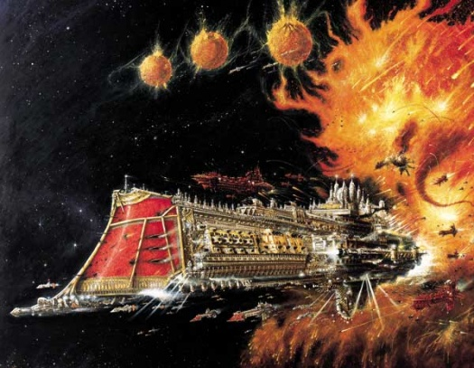
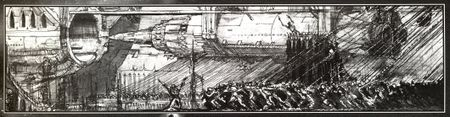
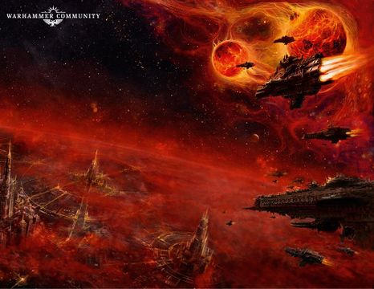
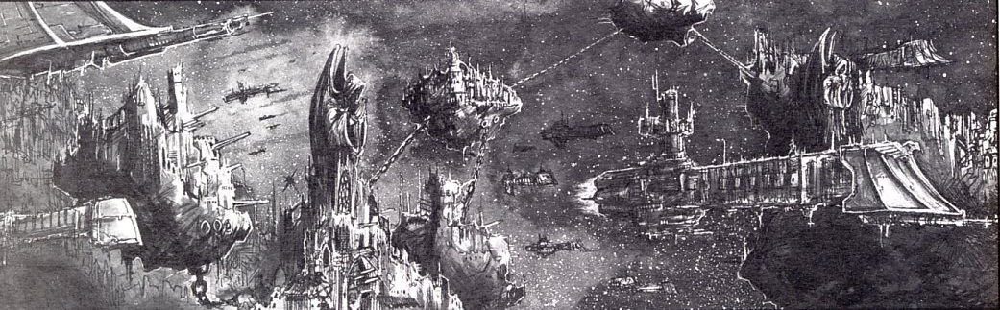
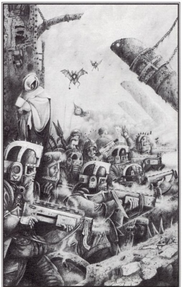

# 0487 帝国海军 Imperial Navy

精校状态：中文行文已逐段精校，部分术语仍为暂定

分类：组织

原文来源：https://www.bilibili.com/opus/1126382442171596819

原作者：帝国神选罐头

原文时间：2025年10月22日 08:59

[返回分类目录](目录.md) · [全书目录](../../目录.md)

<!-- A0487-B0001 -->
**英文原文**

And of all your works, greatest are these vessels, for they carry the blessed into righteous battle -Imperial Navy litany

<!-- /A0487-B0001 -->

<!-- A0487-B0002 -->

原译文

在你所有的作品中，最伟大的是这些战舰，因为它们将受祝之人带入正义的战斗- 帝国海军祷文

**校订译文**

在你的一切造物中，最伟大的当属这些战舰，因为它们载着蒙福之人，奔赴正义之战。——帝国海军祷文

<!-- /A0487-B0002 -->

<!-- A0487-B0003 -->
**英文原文**

The Imperial Navy, or Navis Imperialis in High Gothic, is one of the armed forces employed by the Imperium. While the Astra Militarum (or Imperial Guard) is responsible for the Imperium's ground forces, the Imperial Navy is responsible for the fleets of warships that soar between the stars and planets in the Imperium as well as engaging threats both inside and outside the Imperium's borders. The Imperial Navy is the military arm of the Imperial Fleet and was, until its separation after the Horus Heresy, a branch of the Imperial Army.

<!-- /A0487-B0003 -->

<!-- A0487-B0004 -->

原译文

帝国海军，或高哥特语中的帝国海军，是帝国使用的武装部队之一。虽然星界军（或帝国卫队）负责帝国的地面部队，但帝国海军负责在帝国的恒星和行星之间翱翔的战舰舰队，以及在帝国边界内外应对威胁。帝国海军是帝国舰队的军事部门，在荷鲁斯叛乱事件后分离之前，它是帝国军队的一个分支。

**校订译文**

帝国海军，高哥特语称 Navis Imperialis，是人类帝国的武装力量之一。星界军，又称帝国卫队，负责地面作战；海军则掌管航行于群星与行星之间的战舰，迎击帝国疆域内外的威胁。它是帝国舰队的军事分支，在荷鲁斯之乱后独立之前，曾隶属于帝国军。

<!-- /A0487-B0004 -->

<!-- A0487-B0005 图片 -->

<!-- A0487-B0006 -->

原译文

Imperial Navy symbol 帝国海军标志

**校订译文**

Imperial Navy symbol 帝国海军标志

<!-- /A0487-B0006 -->

<!-- A0487-B0007 -->
**英文原文**

Parent Agency:Imperial Fleet

<!-- /A0487-B0007 -->

<!-- A0487-B0008 -->

原译文

隶属机构：帝国舰队

**校订译文**

隶属机构：帝国舰队

<!-- /A0487-B0008 -->

<!-- A0487-B0009 -->
**英文原文**

Headquarters:Naval Headquarters, Terra

<!-- /A0487-B0009 -->

<!-- A0487-B0010 -->

原译文

总部：海军总部，泰拉

**校订译文**

总部：海军总部，泰拉

<!-- /A0487-B0010 -->

<!-- A0487-B0011 -->
**英文原文**

Leader:Lord High Admiral of the Imperial Navy

<!-- /A0487-B0011 -->

<!-- A0487-B0012 -->

原译文

领袖：帝国海军至高领主海军上将

**校订译文**

领袖：帝国海军至高海军司令

<!-- /A0487-B0012 -->

<!-- A0487-B0013 -->
**英文原文**

Established:Post-Horus Heresy, M31 (preceded by the Imperialis Armada)

<!-- /A0487-B0013 -->

<!-- A0487-B0014 -->

原译文

成立：荷鲁斯叛乱后，M31（之前是帝国舰队）

**校订译文**

成立：荷鲁斯之乱后，M31；前身为帝国无敌舰队。

<!-- /A0487-B0014 -->

<!-- A0487-B0015 -->
## Origins 起源

<!-- /A0487-B0015 -->

<!-- A0487-B0016 -->
**英文原文**

During the early Imperium in the Great Crusade-era, the Imperial Navy was originally a subbranch of the Imperial Army known as the Imperialis Armada. During this time, the Imperialis Armada was primarily used for the defense of Imperial space while planetary invasion was left to the fleets of the Legiones Astartes. However, after the devastating Horus Heresy, which saw widespread rebellion from within the Army, Lord Commander of the Imperium Roboute Guilliman felt it prudent to separate the Army and Navy in order to lessen the threat of future insurrections.

<!-- /A0487-B0016 -->

<!-- A0487-B0017 -->

原译文

在大远征的早期帝国时期，帝国海军最初是帝国军队的一个分支，被称为帝国舰队。在此期间，帝国舰队主要用于防御帝国空域，而行星入侵则留给了阿斯塔特军团的舰队。然而，在毁灭性的荷鲁斯叛乱事件发生后，军队内部发生了广泛的叛乱，帝国领主指挥官罗伯特·基里曼认为，为了减少未来叛乱的威胁，将陆军和海军分开是明智的。

**校订译文**

大远征时期，帝国海军的前身是帝国军下属的帝国无敌舰队，主要负责保卫帝国太空疆域，行星入侵则交给阿斯塔特军团舰队。毁灭性的荷鲁斯之乱中，帝国军大范围叛变。战后，帝国最高统帅罗保特·基里曼认为应将陆上军队与海军分开，以降低未来叛乱的危险。

<!-- /A0487-B0017 -->

<!-- A0487-B0018 图片 -->

<!-- A0487-B0019 -->

原译文

Imperial Navy warfleet 帝国海军战争舰队

**校订译文**

Imperial Navy warfleet 帝国海军战争舰队

<!-- /A0487-B0019 -->

<!-- A0487-B0020 -->
## Organisation 组织

<!-- /A0487-B0020 -->

<!-- A0487-B0021 -->
### Fleet Structure 舰队结构

<!-- /A0487-B0021 -->

<!-- A0487-B0022 -->
**英文原文**

The Imperial Navy is organized into five fleets, each assigned to one of the Segmentae Majoris. Each fleet is named for the Segmentum in which it is based, such as the Battlefleet Solar.

<!-- /A0487-B0022 -->

<!-- A0487-B0023 -->

原译文

帝国海军分为五个舰队，每个舰队都分配给一个主要星域。每个舰队都以其所在的星域命名，如太阳舰队。

**校订译文**

帝国海军分为五个舰队，每个舰队都分配给一个主要星域。每个舰队都以其所在的星域命名，如太阳舰队。

<!-- /A0487-B0023 -->

<!-- A0487-B0024 图片 -->

<!-- A0487-B0025 -->
**英文原文**

These fleets are then subdivided into smaller fleets patrolling individual sectors and subsectors, and are also generally named after the area they safeguard. For example, Battlefleet Gothic protects the Gothic Sector.

<!-- /A0487-B0025 -->

<!-- A0487-B0026 -->

原译文

然后，这些舰队被细分为巡逻单个星区和分区的较小舰队，并且通常以它们所保护的区域命名。例如，哥特舰队保护哥特星区。

**校订译文**

五大舰队再分为规模较小的舰队，巡逻各星区与次星区，通常以防区命名。例如，哥特战斗舰队负责保护哥特星区。

<!-- /A0487-B0026 -->

<!-- A0487-B0027 -->
**英文原文**

The Imperial Navy's administrative center is the Naval Headquarters on Terra.

<!-- /A0487-B0027 -->

<!-- A0487-B0028 -->

原译文

帝国海军的行政中心泰拉上的海军总部。

**校订译文**

帝国海军的行政中心是位于泰拉的海军总部。

<!-- /A0487-B0028 -->

<!-- A0487-B0029 -->
### Fleet Headquarters 舰队总部

<!-- /A0487-B0029 -->

<!-- A0487-B0030 -->
**英文原文**

Segmentum Solar - Mars

<!-- /A0487-B0030 -->

<!-- A0487-B0031 -->

原译文

太阳星域 - 火星

**校订译文**

太阳星域 - 火星

<!-- /A0487-B0031 -->

<!-- A0487-B0032 -->
**英文原文**

Segmentum Pacificus - Hydraphur

<!-- /A0487-B0032 -->

<!-- A0487-B0033 -->

原译文

太平星域 - 海德拉弗

**校订译文**

太平星域 - 海德拉弗

<!-- /A0487-B0033 -->

<!-- A0487-B0034 -->
**英文原文**

Segmentum Obscurus - Cypra Mundi

<!-- /A0487-B0034 -->

<!-- A0487-B0035 -->

原译文

朦胧星域 - 赛普拉·蒙迪

**校订译文**

朦胧星域 - 赛普拉·蒙迪

<!-- /A0487-B0035 -->

<!-- A0487-B0036 -->
**英文原文**

Segmentum Tempestus - Bakka

<!-- /A0487-B0036 -->

<!-- A0487-B0037 -->

原译文

暴风星域 - 巴卡

**校订译文**

暴风星域 - 巴卡

<!-- /A0487-B0037 -->

<!-- A0487-B0038 -->
**英文原文**

Segmentum Ultima - Kar Duniash

<!-- /A0487-B0038 -->

<!-- A0487-B0039 -->

原译文

极限星域 - 卡尔·杜尼亚斯

**校订译文**

极限星域——卡尔·杜尼亚什

<!-- /A0487-B0039 -->

<!-- A0487-B0040 -->
### Fleet Personnel 舰队人员

<!-- /A0487-B0040 -->

<!-- A0487-B0041 -->
**英文原文**

The Imperial Navy is headed by the Lord High Admiral of the Imperial Navy, who is often one of the High Lords of Terra. He oversees five Segmentum Lord High Admirals.

<!-- /A0487-B0041 -->

<!-- A0487-B0042 -->

原译文

帝国海军由帝国海军至高领主海军上将领导，他通常是泰拉的高领主之一。他监管着五名星域领主至高海军上将。

**校订译文**

帝国海军由至高海军司令统领；他通常也是泰拉高领主之一，麾下有五位星域至高海军司令。

<!-- /A0487-B0042 -->

<!-- A0487-B0043 图片 -->

<!-- A0487-B0044 -->

原译文

Navy officer 海军军官

**校订译文**

Navy officer 海军军官

<!-- /A0487-B0044 -->

<!-- A0487-B0045 -->
**英文原文**

Below the Lord Admirals are various Sector and Battlefleet commanders, then individual ship Captains and junior officers, and finally a myriad array of Non-Commissioned Officers. The Imperial Navy has a corps of Commissars that oversee the morale and discipline of Naval personnel, known as the Fleet Commissariat.

<!-- /A0487-B0045 -->

<!-- A0487-B0046 -->

原译文

在领主海军上将的下面是各种部门和战斗舰队的指挥官，然后是单独的船长和低级军官，最后是无数的士官。帝国海军有一群政委，负责监督海军人员的士气和纪律，称为舰队政委。

**校订译文**

领主海军上将之下，是各星区和战斗舰队指挥官，再下为舰长、初级军官及众多士官。海军另设舰队政委部，负责监督舰员士气与军纪。

<!-- /A0487-B0046 -->

<!-- A0487-B0047 -->
**英文原文**

The Imperial Navy also operates Naval Security Battalions, also known as Naval Armsmen. These consist of units of armed soldiers intended to put down mutinies, board enemy ships, and protect Imperial Navy installations. Typically, Naval Security troopers are equipped with black body armour and shotguns.

<!-- /A0487-B0047 -->

<!-- A0487-B0048 -->

原译文

帝国海军还运营着海军保卫营，也称为海军武装人员。这些部队由武装士兵组成，旨在镇压叛乱、跳帮敌舰和保护帝国海军设备。通常，海军保卫部队配备黑色盔甲和霰弹枪。

**校订译文**

帝国海军设有海军保卫营，其成员也称海军武装卫兵，负责镇压哗变、跳帮敌舰，并保护海军设施。他们通常穿黑色护甲，装备霰弹枪。

<!-- /A0487-B0048 -->

<!-- A0487-B0049 -->
**英文原文**

Imperial Navy vessels require personnel from other Imperial elements to function. These include Navigators from the Navis Nobilite for navigation, Astropaths for interstellar communication, and Tech-Priests from the Adeptus Mechanicus for higher maintenance. One of the foremost duties of the Navy is to transport the Imperial Guard to warzones, and as such, every Navy vessel, no matter how small, will sport some means of training deck to accommodate them.

<!-- /A0487-B0049 -->

<!-- A0487-B0050 -->

原译文

帝国海军战舰需要其他帝国部门的人员才能运作。其中包括用于导航的导航者家族的导航者，用于星际通信的星语者，以及用于更高维护的机械修会的技术神甫。海军的首要职责之一是将帝国卫队运送到战区，因此，每艘海军战舰，无论多小，都会配备一些训练甲板来容纳他们。

**校订译文**

海军舰船需要其他帝国组织的专业人员协助运作：导航员家族的导航员负责领航，星语者负责星际通信，机械修会技术祭司则承担高阶维护。运送帝国卫队前往战区是海军的主要职责之一，因此每艘海军舰船，无论多小，都设有某种训练甲板，供搭载部队使用。

<!-- /A0487-B0050 -->

<!-- A0487-B0051 -->
**英文原文**

The lowest level of personnel in the Navy hierarchy are bondsmen, who are little more than slaves. Alongside Servitors, these poor souls, organized into Press Gangs undertake the most thankless and dangerous tasks on a vessel. Bondsmen are acquired by various means, such as rounding up criminals or unsavory elements of Imperial society or simply being born into their status aboard a vessel. Other times, if a ship is low on such menials they may round up the nearest bystanders at random on the nearest world. Bondsmen's duties include cleaning, hauling ammunition into weapons chambers, shoveling fuel, and manual labor. Working long hours and only fed meager rations, Bondsmen are met with brutal discipline should they protest their status.

<!-- /A0487-B0051 -->

<!-- A0487-B0052 -->

原译文

海军等级制度中最低级别的人员是奴隶，他们只不过是奴隶。除了机仆，这些可怜的灵魂被组织成壮丁，在船上承担着最吃力不讨好、最危险的任务。奴隶是通过各种方式获得的，比如抓捕罪犯或帝国社会中的不良分子，或者只是在船上出生。其他时候，如果一艘船上没有这样的仆人，他们可能会在最近的世界里随机抓捕最近的旁观者。奴隶的职责包括清洁、将弹药运入武器室、铲燃料和体力劳动。长时间工作，只吃微薄的口粮，如果他们抗议自己的地位，就会受到残酷的纪律处分。

**校订译文**

海军等级体系最底层的是役奴，地位与奴隶相差无几。他们被编成强征劳役队，与机仆一起承担舰上最危险、最不受重视的工作。役奴来源各异：有人是被抓捕的罪犯或社会边缘人，有人则出生于舰上，世袭这一身份。舰船缺少劳役人员时，也可能在最近的世界随意抓走路人。他们负责清扫、搬运弹药、铲送燃料等体力劳动，工时漫长，口粮微薄；一旦抗议，便遭残酷惩罚。

<!-- /A0487-B0052 -->

<!-- A0487-B0053 -->
## Vessels 战舰

<!-- /A0487-B0053 -->

<!-- A0487-B0054 -->
**英文原文**

The Imperial Navy consists of millions of heavily armoured and armed spaceships, both warp-capable and system-bound. While the interstellar vessels are the most famous, the Navy also operates sublight system defence boats, orbital defence stations, star forts and even planetary-based defence lasers and missile silos. The Imperial Navy deploys a vast diversity of vessel types, from one-man attack fighters to kilometers-long Battleships.

<!-- /A0487-B0054 -->

<!-- A0487-B0055 -->

原译文

帝国海军由数百万重型装甲和武装宇宙飞船组成，既有亚空间能力，也有星系绑定。虽然星际战舰是最著名的，但海军还使用着亚光速星系防御舰、轨道防御站、星堡，甚至基于行星的防御激光和导弹发射井。帝国海军部署了各种各样的舰艇，从单人攻击战斗机到数公里长的战列舰。

**校订译文**

帝国海军拥有数百万艘重装甲、重武装舰船，既有能够穿行亚空间的星舰，也有只能在单一星系内活动的船只。除最著名的星际舰艇外，海军还使用亚光速星系防御艇、轨道防御站与星堡，甚至掌管地表防御激光炮和导弹发射井。舰艇种类繁多，从单人战斗机到数公里长的战列舰，应有尽有。

<!-- /A0487-B0055 -->

<!-- A0487-B0056 图片 -->

<!-- A0487-B0057 -->

原译文

Imperial Navy workers load a Torpedo into its firing tube 帝国海军工人将鱼雷装入发射管

**校订译文**

Imperial Navy workers load a Torpedo into its firing tube 帝国海军工人将鱼雷装入发射管

<!-- /A0487-B0057 -->

<!-- A0487-B0058 -->
**英文原文**

Construction of Imperial Navy warships is complicated, obscenely expensive, and often takes place over decades or even centuries. The vast majority of construction is done in orbital shipyards by the Adeptus Mechanicus, but the Navy itself sends specialist technicians to oversee certain critical elements. Other such specialist are sent by the Departmento Munitorum and Administratum to give ritual attention to specialized areas. However the Tech-Priests do not take part in the construction of two highly classified of the warship: the Astropathic Choir (which is built by the Adeptus Astra Telepathica) and the chamber for the ship's Navigators (which is built by the Navis Nobilite). While most new Imperial Navy vessels are constructed in the Navy's own shipyards, a number are build by planetary shipyards of hive, factory or other worlds as part of the tithe.

<!-- /A0487-B0058 -->

<!-- A0487-B0059 -->

原译文

帝国海军战舰的建造过程复杂，成本高昂，通常需要几十年甚至几个世纪的时间。绝大多数的建造都是由机械神教在轨道造船厂完成的，但海军本身也派遣了专业技术人员来监督某些关键要素。其他此类专家由军务部和内务部派遣，对专门领域进行仪规关注。然而，技术神甫没有参与建造战舰的两个高度机密的结构：星域唱诗班（由星语庭建造）和舰船导航者大厅（由导航者家族建造）。虽然大多数新的帝国海军舰艇都是在海军自己的造船厂建造的，但也有一些是由巢都、工厂或其他世界的行星造船厂建造的。

**校订译文**

帝国海军战舰建造复杂、耗资惊人，往往需要数十年乃至数百年。绝大多数工程由机械修会在轨道船厂完成，海军则派专业技术人员监督关键部分。军务部和内政部也会派专家，对各自负责的领域履行仪式性监管。不过，技术祭司不参与两处高度保密舱区的建造：星语者合唱团舱室由星语庭负责，导航员舱室由导航员家族负责。大多数新舰出自海军自有船厂，另有部分由巢都世界、工厂世界等地的船厂建造，作为什一税缴纳。

<!-- /A0487-B0059 -->

<!-- A0487-B0060 -->
**英文原文**

Another source of new voidships are the forge worlds of the Adeptus Mechanicus. While most of the newly constructed vessels are destined for their own fleet, a number of them are supplied to the Imperial Navy. These Mechanicus-build hulls are marvels of engineering, oftentimes incorporating rare technologies. Though the construction of a single new cruiser may take more than a decade even for a well-supplied shipyard, a forge world can commission multiple new cruisers per years, thanks to economies of scale, having at any given time a dozen or more hulls in varying stages of construction.

<!-- /A0487-B0060 -->

<!-- A0487-B0061 -->

原译文

新虚空舰的另一个来源是机械神教的铸造世界。虽然大多数新建的船只都是为自己的舰队准备的，但其中一些是为帝国海军提供的。这些机械教制造的船体是工程学的奇迹，经常采用罕见的技术。尽管即使对于供应充足的造船厂来说，建造一艘新巡洋舰也可能需要十多年的时间，但由于规模节约，铸造世界每年可以委托建造多艘新巡洋舰，在任何时候都有十几艘或更多处于不同建造阶段的船体。

**校订译文**

机械修会的铸造世界也是新舰来源之一。它们建造的舰船大多供自有舰队使用，也会交付一部分给帝国海军。这些舰体常包含稀有技术，堪称工程奇迹。即使供应充足的船厂，造一艘巡洋舰仍可能耗时十余年；但铸造世界能同时建造十多艘乃至更多不同阶段的舰体，凭规模效益，每年仍可让数艘新巡洋舰投入服役。

<!-- /A0487-B0061 -->

<!-- A0487-B0062 -->
**英文原文**

Sometimes, the Imperial Navy expands its numbers by salvaging old wrecks. This practice uses up less resources than the construction of a new ship, but is considered far more dangerous because these wrecks are often home to predatory aliens. Even less likely is the discovery of a spaceworthy wreck which is part of a Space Hulk. Securing such a hulk is considered worth the risk, even if they are very high. Sometimes, these wrecks are of an older pattern or mark the Imperium no longer has the ability to reproduce or feature archaeotech or other assorted riches.

<!-- /A0487-B0062 -->

<!-- A0487-B0063 -->

原译文

有时，帝国海军通过打捞旧沉船来扩大其数量。这种做法比建造新船消耗的资源少，但被认为更危险，因为这些沉船通常是掠食性外星人的家园。更不可能的是发现作为太空废船一部分的太空沉船。即使风险很高，搜索这样一艘废船也是值得的。有时，这些残骸具有更古老的型号或标志着帝国不再有能力再现或展示的考古技术或其他各种财富。

**校订译文**

海军有时也会打捞旧舰残骸以扩充舰队。相比造新舰，修复旧舰耗费资源较少，危险却更大，因为残骸中常盘踞捕食性异形。更罕见的情况是，在太空废船中发现尚能修复至适航状态的舰体；即使风险极高，夺取这样的废船仍被认为值得。有些旧舰属于帝国已无法复制的古老型号，也可能藏有古科技或其他财富。

<!-- /A0487-B0063 -->

<!-- A0487-B0064 -->
### Battleships 战列舰

<!-- /A0487-B0064 -->

<!-- A0487-B0065 -->
**英文原文**

Battleships are colossal vessels with significant weaponry and shields. They usually serve as the flagship for the Admiral of the Fleet, though this is not always the case. Although very powerful, battleships are slow to manoeuvre and cannot react quickly to enemies that rapidly change course. Imperial battleships can have crews of between 25,000 to 3,000,000 or more depending on sources, including large numbers of Imperial Navy armsmen to defend against enemy boarding assaults. Battleships can be up to 8 kilometres from prow to stern and displace billions of tons. Because they represent such a vast expenditure of resources and require a fairly advanced technical base, these are typically constructed only in the largest shipyards above the major Adeptus Mechanicus Forge Worlds. These vessels are precious assets and are carefully husbanded, usually employed in only larger fleet formations.

<!-- /A0487-B0065 -->

<!-- A0487-B0066 -->

原译文

战列舰是拥有标志武器和护盾的巨型战舰。它们通常作为舰队海军上将的旗舰，尽管情况并非总是如此。虽然非常强大，但战列舰的机动速度很慢，无法对快速改变航向的敌人做出快速反应。帝国战列舰的船员人数可能在2,5000至300,0000人之间，具体取决于来源，包括大量帝国海军武装人员，以抵御敌人的跳帮攻击。战列舰从舰首到舰尾可达8公里，排水量可达数十亿吨。因为它们代表了如此巨大的资源支出，需要相当先进的技术基础，所以这些通常只在主要的机械神教铸造世界之上的最大造船厂建造。这些战舰是宝贵的资产，通常只在较大的舰队编队中使用。

**校订译文**

战列舰体型巨大，武备与护盾强大，通常担任舰队海军上将的旗舰，但并非一概如此。它们威力惊人，却转向迟缓，难以迅速应对频繁变换航向的敌人。不同来源记载的舰员数量差异很大，从两万五千到三百万以上不等，其中包括抵御跳帮的大批海军武装卫兵。战列舰全长可达八公里，质量数十亿吨。建造这类巨舰需要海量资源与先进技术基础，因此通常只有重要铸造世界上空最大的船厂能够承造。海军极为珍惜这些资产，谨慎使用，通常只将其编入大型舰队。

**校注：** 舰员数量在不同来源中从两万五千至三百万以上差异极大，忠实保留原文范围；原译数字分隔位置错误。spaceship displacement 此处以质量描述，避免读成水中排水量。

<!-- /A0487-B0066 -->

<!-- A0487-B0067 图片 -->

<!-- A0487-B0068 -->

原译文

Imperial Navy ships 帝国海军舰船

**校订译文**

Imperial Navy ships 帝国海军舰船

<!-- /A0487-B0068 -->

<!-- A0487-B0069 -->
**英文原文**

There are various classes of Imperial Battleship, but the Emperor and Retribution are by far the most common in the Imperial Navy.

<!-- /A0487-B0069 -->

<!-- A0487-B0070 -->

原译文

帝国战列舰有各种类型，但帝皇和报应是帝国海军中最常见的。

**校订译文**

帝国战列舰型号繁多，其中最常见的是帝皇级与报复级。

<!-- /A0487-B0070 -->

<!-- A0487-B0071 -->

原译文

Apocalypse Class Battleship 天启级战列舰

**校订译文**

Apocalypse Class Battleship 天启级战列舰

<!-- /A0487-B0071 -->

<!-- A0487-B0072 -->

原译文

Emperor Class Battleship 帝皇级战列舰

**校订译文**

Emperor Class Battleship 帝皇级战列舰

<!-- /A0487-B0072 -->

<!-- A0487-B0073 -->

原译文

Invincible Class Fast Battleship 无敌级快速战列舰

**校订译文**

Invincible Class Fast Battleship 无敌级快速战列舰

<!-- /A0487-B0073 -->

<!-- A0487-B0074 -->

原译文

Nemesis Class Fleet Carrier 复仇女神级舰队航母

**校订译文**

Nemesis Class Fleet Carrier 复仇女神级舰队航母

<!-- /A0487-B0074 -->

<!-- A0487-B0075 -->

原译文

Oberon Class Battleship 奥伯龙级战列舰

**校订译文**

Oberon Class Battleship 奥伯龙级战列舰

<!-- /A0487-B0075 -->

<!-- A0487-B0076 -->

原译文

Retribution Class Battleship 报复级战列舰

**校订译文**

Retribution Class Battleship 报复级战列舰

<!-- /A0487-B0076 -->

<!-- A0487-B0077 -->

原译文

Vanquisher Class Battleship 征服者级战列舰

**校订译文**

Vanquisher Class Battleship 征服者级战列舰

<!-- /A0487-B0077 -->

<!-- A0487-B0078 -->

原译文

Victory Class Battleship 胜利级战列舰

**校订译文**

Victory Class Battleship 胜利级战列舰

<!-- /A0487-B0078 -->

<!-- A0487-B0079 -->

原译文

Graia Class Battleship 格拉亚级战列舰

**校订译文**

Graia Class Battleship 格拉亚级战列舰

<!-- /A0487-B0079 -->

<!-- A0487-B0080 -->

原译文

Adjudicator Class Battleship 裁决者级战列舰

**校订译文**

Adjudicator Class Battleship 裁决者级战列舰

<!-- /A0487-B0080 -->

<!-- A0487-B0081 -->
### Cruisers 巡洋舰

<!-- /A0487-B0081 -->

<!-- A0487-B0082 -->
**英文原文**

Smaller than Battleships, Cruisers are the ships of the line in Imperial Fleets. There are several different sub-categories of Cruiser.

<!-- /A0487-B0082 -->

<!-- A0487-B0083 -->

原译文

巡洋舰比战列舰小，是帝国舰队中的主力舰。巡洋舰有几个不同的子类别。

**校订译文**

巡洋舰比战列舰小，是帝国舰队中的主力舰。巡洋舰有几个不同的子类别。

<!-- /A0487-B0083 -->

<!-- A0487-B0084 -->
### Grand Cruisers 大型巡洋舰

<!-- /A0487-B0084 -->

<!-- A0487-B0085 -->
**英文原文**

Grand Cruisers are significantly smaller than battleships yet distinctly larger than regular cruisers. These vessels are usually very old in design, do not incorporate many features typical in current Imperial Navy vessels, like armoured prow, and are not entirely compatible with current Navy tactical doctrine. Due to this, many are retired from active duty but are still used by reserve fleets. There are also some modernised versions of grand cruisers in service, but since they are much larger and more heavily-armed than their predecessors, they are often classed as battleships. These kinds of vessels are usually purpose-built or modified from battlecruiser hulls and are not commonly encountered in the Imperial Navy.

<!-- /A0487-B0085 -->

<!-- A0487-B0086 -->

原译文

大型巡洋舰比战列舰小得多，但明显比普通巡洋舰大。这些舰艇的设计通常很旧，没有包含当前帝国海军舰艇的许多典型特征，如装甲船首，也不完全符合当前的海军战术原则。因此，许多已经退役，但仍被预备舰队使用。也有一些现代化版本的大型巡洋舰在役，但由于它们比前辈更大、装备更重，因此通常被归类为战列舰。这些类型的船只通常是专门建造的或由战列巡洋舰船体改装而成的，在帝国海军中并不常见。

**校订译文**

大型巡洋舰明显小于战列舰，却大于普通巡洋舰。其设计通常十分古老，缺少装甲舰艏等现代海军舰艇常见特征，也不完全适应现行战术。因此，许多已退出一线现役，但仍在预备舰队服役。另有少量现代化改型，比旧型更庞大、火力更强，因此往往被归为战列舰。这些舰艇通常专门建造，或由战列巡洋舰舰体改装，在帝国海军中较为罕见。

<!-- /A0487-B0086 -->

<!-- A0487-B0087 -->

原译文

Avenger Class Grand Cruiser 复仇者级大型巡洋舰

**校订译文**

Avenger Class Grand Cruiser 复仇者级大型巡洋舰

<!-- /A0487-B0087 -->

<!-- A0487-B0088 -->

原译文

Exorcist Class Grand Cruiser 驱魔者级大型巡洋舰

**校订译文**

Exorcist Class Grand Cruiser 驱魔者级大型巡洋舰

<!-- /A0487-B0088 -->

<!-- A0487-B0089 -->

原译文

Furious Class Grand Cruiser 狂怒级大型巡洋舰

**校订译文**

Furious Class Grand Cruiser 狂怒级大型巡洋舰

<!-- /A0487-B0089 -->

<!-- A0487-B0090 -->

原译文

Vengeance Class Grand Cruiser 复仇级大型巡洋舰

**校订译文**

Vengeance Class Grand Cruiser 复仇级大型巡洋舰

<!-- /A0487-B0090 -->

<!-- A0487-B0091 -->
### Battle Cruisers 战列巡洋舰

<!-- /A0487-B0091 -->

<!-- A0487-B0092 -->
**英文原文**

Battlecruisers are based on a hull design that is similar to the regular Cruisers, though Battle Cruisers are generally somewhat larger and more heavily armed, incorporating more advanced power distribution systems capable of supporting battleship-grade weaponry in a cruiser hull.

<!-- /A0487-B0092 -->

<!-- A0487-B0093 -->

原译文

战列巡洋舰基于与常规巡洋舰相似的船体设计，尽管战列巡洋舰通常更大、装甲更重，并采用了更先进的配能系统，能够在巡洋舰船体中支持战列舰级武器。

**校订译文**

战列巡洋舰的舰体设计与普通巡洋舰相近，但通常更大、火力更强。其先进配能系统，使巡洋舰规模的舰体能够支撑战列舰级武器。

<!-- /A0487-B0093 -->

<!-- A0487-B0094 -->

原译文

Armageddon Class Battle Cruiser 天启级战列巡洋舰

**校订译文**

Armageddon Class Battle Cruiser 阿玛吉多顿级战列巡洋舰

<!-- /A0487-B0094 -->

<!-- A0487-B0095 -->

原译文

Chalice Class Battle Cruiser 圣杯级战列巡洋舰

**校订译文**

Chalice Class Battle Cruiser 圣杯级战列巡洋舰

<!-- /A0487-B0095 -->

<!-- A0487-B0096 -->

原译文

Dominion Class Battle Cruiser 统御级战列巡洋舰

**校订译文**

Dominion Class Battle Cruiser 统御级战列巡洋舰

<!-- /A0487-B0096 -->

<!-- A0487-B0097 -->

原译文

Long Serpent Class Battlecruiser 长蛇级战列巡洋舰

**校订译文**

Long Serpent Class Battlecruiser 长蛇级战列巡洋舰

<!-- /A0487-B0097 -->

<!-- A0487-B0098 -->

原译文

Mars Class Battle Cruiser 火星级战列巡洋舰

**校订译文**

Mars Class Battle Cruiser 火星级战列巡洋舰

<!-- /A0487-B0098 -->

<!-- A0487-B0099 -->

原译文

Mercury Class Battle Cruiser 水星级战列巡洋舰

**校订译文**

Mercury Class Battle Cruiser 水星级战列巡洋舰

<!-- /A0487-B0099 -->

<!-- A0487-B0100 -->

原译文

Overlord Class Battle Cruiser 霸主级战列巡洋舰

**校订译文**

Overlord Class Battle Cruiser 霸主级战列巡洋舰

<!-- /A0487-B0100 -->

<!-- A0487-B0101 -->
### Cruisers 巡洋舰

<!-- /A0487-B0101 -->

<!-- A0487-B0102 -->
**英文原文**

Cruisers make up the majority of a fleet. Though not as powerful as a Battleship, cruisers are much faster and can still deliver a deadly blow. There are multiple classes of cruisers, most based on the same general hull design but incorporating different combinations of broadside batteries, lance turrets and starfighter hangars. Cruisers can carry a crew complement of 1,000-100,000, depending on sources. While cruisers are still particularly complex, it is not uncommon for them to be constructed on smaller Forge Worlds or any Civilised World with a shipyard suitable for constructing vessels of their size.

<!-- /A0487-B0102 -->

<!-- A0487-B0103 -->

原译文

巡洋舰占舰队的大部分。虽然没有战列舰那么强大，但巡洋舰的速度要快得多，仍然可以造成致命的打击。巡洋舰有多种类型，大多数基于相同的总体船体设计，但采用了不同的舷侧炮组、光矛炮塔和星际战斗机机库组合。巡洋舰可以搭载1000-100000名船员，具体取决于来源。虽然巡洋舰仍然特别复杂，但在较小的铸造世界或任何有适合建造这种规模战舰的造船厂的文明世界建造巡洋舰并不罕见。

**校订译文**

巡洋舰构成舰队主体。它们不及战列舰强大，却快得多，同样能够造成致命打击。不同型号多以相同的基本舰体为基础，采用不同组合的舷侧炮组、光矛炮塔与战斗机机库。各来源记载的舰员规模从一千到十万人不等。虽然仍是复杂的工程，较小的铸造世界，乃至拥有适当规模船厂的文明世界，也常能建造巡洋舰。

<!-- /A0487-B0103 -->

<!-- A0487-B0104 -->

原译文

Dictator Class Cruiser 独裁者级巡洋舰

**校订译文**

Dictator Class Cruiser 独裁者级巡洋舰

<!-- /A0487-B0104 -->

<!-- A0487-B0105 -->

原译文

Dominator Class Cruiser 统御者级巡洋舰

**校订译文**

Dominator Class Cruiser 统御者级巡洋舰

<!-- /A0487-B0105 -->

<!-- A0487-B0106 -->

原译文

Gothic Class Cruiser 哥特级巡洋舰

**校订译文**

Gothic Class Cruiser 哥特级巡洋舰

<!-- /A0487-B0106 -->

<!-- A0487-B0107 -->

原译文

Lunar Class Cruiser 月球级巡洋舰

**校订译文**

Lunar Class Cruiser 月球级巡洋舰

<!-- /A0487-B0107 -->

<!-- A0487-B0108 -->

原译文

Tyrant Class Cruiser 暴君级巡洋舰

**校订译文**

Tyrant Class Cruiser 暴君级巡洋舰

<!-- /A0487-B0108 -->

<!-- A0487-B0109 -->
### Light Cruiser 轻型巡洋舰

<!-- /A0487-B0109 -->

<!-- A0487-B0110 -->
**英文原文**

A subset of the cruiser category are the Light Cruisers. These ships fall in size between cruisers and escorts, mixing the firepower and durability of the former with the speed and manoeuvrability of the latter. Light cruisers are a fairly common ship class, for they are relatively simple to construct for being a capital ship, and they are uniquely suited for reconnaissance patrols and for making a presence where their speed and manoeuvrability are an advantage and where having a larger number of smaller hulls allows the Navy to monitor a wider area of space.

<!-- /A0487-B0110 -->

<!-- A0487-B0111 -->

原译文

轻型巡洋舰是巡洋舰类别的一个子集。这些船只的尺寸介于巡洋舰和护卫舰之间，将前者的火力和耐用性与后者的速度和机动性相结合。轻型巡洋舰是一种相当常见的船型，因为作为主力舰，它们的建造相对简单，而且它们特别适合侦察巡逻和在速度和机动性有利的情况下存在，并且拥有更多的小型船体可以让海军监视更广阔的空间区域。

**校订译文**

轻型巡洋舰的体型介于普通巡洋舰与护卫舰之间，兼具前者的火力、坚固程度，以及后者的速度与机动性。作为主力舰，它们相对易于建造，因此十分常见。它们适合侦察巡逻，也适合在重视速度和机动的地区维持海军存在；以更多小舰分散部署，还能覆盖更广的太空疆域。

<!-- /A0487-B0111 -->

<!-- A0487-B0112 图片 -->

<!-- A0487-B0113 -->

原译文

Imperial Navy ships 帝国海军舰船

**校订译文**

Imperial Navy ships 帝国海军舰船

<!-- /A0487-B0113 -->

<!-- A0487-B0114 -->

原译文

Dauntless Class Light Cruiser 无畏级轻型巡洋舰

**校订译文**

Dauntless Class Light Cruiser 无畏级轻型巡洋舰

<!-- /A0487-B0114 -->

<!-- A0487-B0115 -->

原译文

Defiant Class Light Cruiser 挑衅级轻型巡洋舰

**校订译文**

Defiant Class Light Cruiser 挑衅级轻型巡洋舰

<!-- /A0487-B0115 -->

<!-- A0487-B0116 -->

原译文

Defender Class Light Cruiser 防御者级轻型巡洋舰

**校订译文**

Defender Class Light Cruiser 防御者级轻型巡洋舰

<!-- /A0487-B0116 -->

<!-- A0487-B0117 -->

原译文

Endeavor Class Light Cruiser 奋进级轻型巡洋舰

**校订译文**

Endeavor Class Light Cruiser 奋进级轻型巡洋舰

<!-- /A0487-B0117 -->

<!-- A0487-B0118 -->

原译文

Endurance Class Light Cruiser 耐力级轻型巡洋舰

**校订译文**

Endurance Class Light Cruiser 耐力级轻型巡洋舰

<!-- /A0487-B0118 -->

<!-- A0487-B0119 -->

原译文

Enforcer Class Light Cruiser 执行者级轻型巡洋舰

**校订译文**

Enforcer Class Light Cruiser 执行者级轻型巡洋舰

<!-- /A0487-B0119 -->

<!-- A0487-B0120 -->

原译文

Siluria Class Light Cruiser 志留级轻型巡洋舰

**校订译文**

Siluria Class Light Cruiser 志留级轻型巡洋舰

<!-- /A0487-B0120 -->

<!-- A0487-B0121 -->

原译文

Styges Class Light Cruiser 冥河级轻型巡洋舰

**校订译文**

Styges Class Light Cruiser 冥河级轻型巡洋舰

<!-- /A0487-B0121 -->

<!-- A0487-B0122 -->
### Escorts 护卫舰

<!-- /A0487-B0122 -->

<!-- A0487-B0123 -->
**英文原文**

Escort ships are the smallest type of ship in the Imperial Navy fleets, found in two distinct sub-classes.

<!-- /A0487-B0123 -->

<!-- A0487-B0124 -->

原译文

护卫舰是帝国海军舰队中最小的舰艇类型，分为两个不同的子类。

**校订译文**

护卫舰是帝国海军舰队中最小的舰艇类型，分为两个不同的子类。

<!-- /A0487-B0124 -->

<!-- A0487-B0125 -->
**英文原文**

The larger of the two are Frigates, better armed and more heavily armoured. Destroyers are generally smaller, but they are by far the fastest and most manoeuvrable interstellar warships employed by the Imperial Navy. They are usually organised in squadrons of 2 to 6 vessels and will always operate as a group. The main task of the escort ships is to serve as a screen for capital ships against enemy torpedoes and attack crafts so that they can get into position more quickly and safely. They are also employed behind the gun line to finish off enemy cruisers that have been damaged so that the larger vessels can concentrate on the most important threats in an enemy formation. Most escort classes specialise in a certain role, such as the Cobra class torpedo boat destroyers or the Firestorm class frigate with its armour-piercing prow-mounted Lance. Escort ships are normally not more than 1.5 kilometres in length, with destroyers generally being only 750 metres to 2 kilometres from prow to stern.

<!-- /A0487-B0125 -->

<!-- A0487-B0126 -->

原译文

其中较大的是护卫舰，装备更好，装甲更重。驱逐舰通常较小，但它们是帝国海军迄今为止使用的最快、最机动的星际战舰。他们通常被组织成2至6艘舰艇的中队，并将始终作为一个小队运作。护卫舰的主要任务是作为主力舰对抗敌方鱼雷和攻击机的屏障，使其能够更快、更安全地就位。它们也被用在炮线后面，以消灭被损坏的敌方巡洋舰，这样较大的战舰就可以集中精力应对敌方编队中最重要的威胁。大多数护卫舰都专门从事某种角色，如眼镜蛇级鱼雷驱逐舰或装有光矛的穿甲船首的火风暴级护卫舰。护卫舰的长度通常不超过1.5公里，驱逐舰从舰首到舰尾通常只有750米到2公里。

**校订译文**

两类中较大的是护航舰（Frigate），武备更强、装甲更厚。驱逐舰（Destroyer）通常较小，却是海军速度最快、机动性最好的星际战舰，通常以二至六艘组成中队，协同行动。护卫舰（Escort）的主要职责是替主力舰阻挡鱼雷与攻击艇，使其迅速、安全地进入战位；也可在主炮战列后方清除受创敌方巡洋舰，让大舰专注最重要的威胁。多数型号各有专长，例如眼镜蛇级以鱼雷为主，火风暴级则拥有舰艏安装的穿甲光矛。护卫舰通常不超过一点五公里长；同一来源又记载，驱逐舰通常长七百五十米至两公里。

**校注：** Escort 是上位类别，含 Frigate 与 Destroyer；为在本段区别，Frigate 暂作护航舰，型号列表仍沿用既有护卫舰名。原文称 Escort 通常不超过1.5公里，却给其子类驱逐舰最高2公里，保留数字差异。

<!-- /A0487-B0126 -->

<!-- A0487-B0127 -->

原译文

Turbulent Class Heavy Frigate 湍流级重型护卫舰

**校订译文**

Turbulent Class Heavy Frigate 湍流级重型护卫舰

<!-- /A0487-B0127 -->

<!-- A0487-B0128 -->

原译文

Invictor Class Heavy Frigate 不败级重型护卫舰

**校订译文**

Invictor Class Heavy Frigate 不败级重型护卫舰

<!-- /A0487-B0128 -->

<!-- A0487-B0129 -->

原译文

Tempest Class Frigate 暴风级护卫舰

**校订译文**

Tempest Class Frigate 暴风级护卫舰

<!-- /A0487-B0129 -->

<!-- A0487-B0130 -->

原译文

Firestorm Class Frigate 火风暴级护卫舰

**校订译文**

Firestorm Class Frigate 火风暴级护卫舰

<!-- /A0487-B0130 -->

<!-- A0487-B0131 -->

原译文

Havoc Class Frigate 浩劫级护卫舰

**校订译文**

Havoc Class Frigate 浩劫级护卫舰

<!-- /A0487-B0131 -->

<!-- A0487-B0132 -->

原译文

Sword Class Frigate 剑级护卫舰

**校订译文**

Sword Class Frigate 剑级护卫舰

<!-- /A0487-B0132 -->

<!-- A0487-B0133 -->

原译文

Falchion Class Escort 弯刀级护卫舰

**校订译文**

Falchion Class Escort 弯刀级护卫舰

<!-- /A0487-B0133 -->

<!-- A0487-B0134 -->

原译文

Cobra Class Destroyer 眼镜蛇级驱逐舰

**校订译文**

Cobra Class Destroyer 眼镜蛇级驱逐舰

<!-- /A0487-B0134 -->

<!-- A0487-B0135 -->

原译文

Viper Class Destroyer 蝰蛇级驱逐舰

**校订译文**

Viper Class Destroyer 蝰蛇级驱逐舰

<!-- /A0487-B0135 -->

<!-- A0487-B0136 -->

原译文

Claymore Class Corvette 阔剑级小型护卫舰

**校订译文**

Claymore Class Corvette 阔剑级小型护卫舰

<!-- /A0487-B0136 -->

<!-- A0487-B0137 -->

原译文

Defence Monitor 防御监视器

**校订译文**

Defence Monitor 防御重炮舰

**校注：** Monitor 为舰型，不是监视器；暂用现实舰种常见译法浅水重炮舰，但此处是太空防御舰，不表示实际在浅水航行。

<!-- /A0487-B0137 -->

<!-- A0487-B0138 -->
### Older and obsolete classes 陈旧过时的种类

<!-- /A0487-B0138 -->

<!-- A0487-B0139 -->
**英文原文**

There are many older classes of Imperial ship that are no longer in production:

<!-- /A0487-B0139 -->

<!-- A0487-B0140 -->

原译文

有许多老式的帝国飞船已经停产：

**校订译文**

有许多老式的帝国飞船已经停产：

<!-- /A0487-B0140 -->

<!-- A0487-B0141 -->
**英文原文**

Ironclad Battleships - also known as Adamanticlads much like their contemporary counterparts, are vast 8-kilometre vessels which lack the void shielding of their counterparts in favour of metres of adamantium plate armour. These ships, built before the advent of void-screen technology, have since been phased out of production, for the main part, to be replaced by more modern designs.

<!-- /A0487-B0141 -->

<!-- A0487-B0142 -->

原译文

铁甲战列舰，也被称为坚铠，与当代战舰非常相似，是一种巨大的8公里长的战舰，没有同类战舰的虚空盾，而是采用了数米厚的精金板装甲。这些船是在虚空庇护技术出现之前建造的，此后已逐步停产，对于主要部分，被更现代的设计所取代。

**校订译文**

铁甲战列舰，又称精金铁甲舰，与现代战列舰同样可长达八公里，却没有虚空盾，而是依靠数米厚的精金装甲防护。它们建造于虚空屏障技术出现之前，如今大多已停产，被更现代的设计取代。

<!-- /A0487-B0142 -->

<!-- A0487-B0143 -->
**英文原文**

Obsolete Classes - There are many classes of vessel which were once utilised by the Imperial Navy. Many of these older vessels are still in service with the Traitor Fleets.

<!-- /A0487-B0143 -->

<!-- A0487-B0144 -->

原译文

过时的种类 - 帝国海军曾经使用过许多种类的战舰。许多这些旧战舰仍在叛徒舰队服役。

**校订译文**

过时的种类 - 帝国海军曾经使用过许多种类的战舰。许多这些旧战舰仍在叛徒舰队服役。

<!-- /A0487-B0144 -->

<!-- A0487-B0145 -->
### Note on variations in Classes 关于种类变化的说明

<!-- /A0487-B0145 -->

<!-- A0487-B0146 -->
**英文原文**

While naval warships can be defined along a fairly limited number of classes based on weapon configurations approved by the Adeptus Mechanicus, the form these vessels takes varies widely throughout the Imperium. For example, a Lunar class constructed above Cypra Mundi in Segmentum Obscurus may bear little resemblance to a Lunar class constructed above Kar Duniash in Ultima Segmentum and even less so to a Lunar class, constructed among the vast shipyards of Mars. Nonetheless, they will all have roughly the same operating characteristics and weapon configuration, and thus can be easily serviced by any orbital facility throughout Imperial space.

<!-- /A0487-B0146 -->

<!-- A0487-B0147 -->

原译文

虽然海军战舰可以根据机械神教批准的武器配置划分为相当有限的类别，但这些战舰在整个帝国中的形式差异很大。例如，在朦胧星域的赛普拉·蒙迪上方建造的月球级可能与在极限星域的卡尔·杜尼亚斯上方建造的月球级几乎没有相似之处，甚至与在火星的大型造船厂中建造的月球级更不相似。尽管如此，它们都具有大致相同的操作特性和武器配置，因此可以很容易地通过帝国空域中的任何轨道设施进行维修。

**校订译文**

海军战舰按机械修会认可的武器配置划分为数量有限的舰级，但同级舰外形仍可能因产地而迥异。例如，朦胧星域赛普拉·蒙迪建造的月球级，可能与极限星域卡尔·杜尼亚什出产者十分不同，更不像火星巨型船厂的版本。不过，它们的运作特性与武器配置大体相同，因此帝国各地的轨道设施都可提供维护。

<!-- /A0487-B0147 -->

<!-- A0487-B0148 -->
**英文原文**

For example, ships build by Voss all feature so-called Aquila prows upon their fronts, to show devotion to the Imperial creed, something not typical to other STC ship designs. Even existing vessels based on these STC designs, who are only repaired or refitted at the forge world, will be reconfigured to henceforth bear the Aquila prow.

<!-- /A0487-B0148 -->

<!-- A0487-B0149 -->

原译文

例如，沃斯建造的船只都有所谓的天鹰船首，以表明对帝国信条的忠诚，这是其他STC船只设计所不典型的。即使是基于这些STC设计的现有船只，只是在铸造世界进行维修或改装，也将被重新配置，以承载天鹰船首。

**校订译文**

例如，沃斯出产的舰船均采用所谓天鹰舰艏，以表明对帝皇信仰的虔诚，而其他标准建造模板舰型通常没有这种外形。即使现有舰船只到沃斯维修或改装，也会被改造成天鹰舰艏。

<!-- /A0487-B0149 -->

<!-- A0487-B0150 -->
**英文原文**

Furthermore, some ship types build at Voss, like the Endeavour, Endurance and Defiant classes, feature a prominent mid-ship corridor, dividing the forward hull from the rear section, due to the fact that Voss, in difference to the rest of the Mechanicus, lacks knowledge of the science of magnetic containment fields. In case of a magnetic field failure the containment of the vast energies produced by a ship's plasma reactor can not be guaranteed. To prevent such a failure from threatening the main magazine or causing a reactor meltdown, the plasma reactor and engine rooms have to be separated from the rest of the ship by the mid-ship corridor. In case of a containment field failure, the mid-ship corridor will break, physically disconnecting the rear from the rest of the ship.

<!-- /A0487-B0150 -->

<!-- A0487-B0151 -->

原译文

此外，在沃斯建造的一些船型，如奋进、耐力和挑衅级，都有一个突出的船体中部走廊，将船体前部和后部分开，因为沃斯与机械教的其他船型不同，它缺乏磁场控制的科学知识。在磁场失效的情况下，无法保证对战舰等离子反应堆产生的巨大能量的控制。为了防止这种故障威胁到主弹药库或导致反应堆熔毁，等离子反应堆和发动机室必须通过船中走廊与船的其他部分隔开。如果抑制立场发生故障，船中部走廊将破裂，将后部与船的其他部分物理断开。

**校订译文**

沃斯建造的奋进级、耐力级与挑衅级等舰型，还拥有显眼的舰体中部通道，将前后舰体连接起来。原因是沃斯不同于机械修会其他地方，缺乏磁约束场方面的科学知识：一旦磁场失效，便无法确保控制等离子反应堆释放的巨大能量。为防止故障危及主弹药库或导致反应堆熔毁，反应堆和引擎舱通过中央通道与其余舰体隔开；约束场失效时，通道会断裂，将后部舰体彻底分离。

**校注：** 所给资料确称沃斯缺乏磁约束场知识，未将其按现代理论或其他设定修成仅缺少某项技术；这解释了特殊舰体分离设计。

<!-- /A0487-B0151 -->

<!-- A0487-B0152 -->
**英文原文**

Unsurprisingly, the mid-ship corridor is vulnerable to enemy weapons fire, forcing it to be additionally protected by huge, thick plates made from solid adamantine, giving these ships constructed at Voss their distinct appearance. On the other hand, the mid-ship corridor helps against boarding actions, forcing an enemy that has captured one part of the ship to advance through a choke-point to capture the other.

<!-- /A0487-B0152 -->

<!-- A0487-B0153 -->

原译文

不出所料，船中走廊容易受到敌方武器的攻击，迫使它额外受到由坚固的精金制成的巨大厚板的保护，使这些在沃斯建造的战舰具有独特的外观。另一方面，船中走廊有助于防止跳帮行动，迫使占领船身一部分的敌人通过瓶颈前进以占领另一部分。

**校订译文**

中央通道容易受到敌方火力打击，因此须覆以巨大厚重的精金装甲板，也由此形成沃斯舰艇的独特外观。不过，这一结构也有利于抵御跳帮：敌人即使占据一端，仍必须通过狭窄的通道，才能夺取另一端。

<!-- /A0487-B0153 -->

<!-- A0487-B0154 -->
### Attack Craft 攻击机

<!-- /A0487-B0154 -->

<!-- A0487-B0155 -->
**英文原文**

Many Imperial vessels carry onboard various smaller craft for both offense and defense.

<!-- /A0487-B0155 -->

<!-- A0487-B0156 图片 -->

<!-- A0487-B0157 -->

原译文

Imperial Navy landng party 帝国海军登陆队

**校订译文**

Imperial Navy landng party 帝国海军登陆队

<!-- /A0487-B0157 -->

<!-- A0487-B0158 -->

原译文

许多帝国战舰携带各种小型飞行器，用于进攻和防御。

**校订译文**

许多帝国战舰携带各种小型飞行器，用于进攻和防御。

<!-- /A0487-B0158 -->

<!-- A0487-B0159 -->

原译文

Fury Interceptor 狂怒拦截机

**校订译文**

Fury Interceptor 狂怒拦截机

<!-- /A0487-B0159 -->

<!-- A0487-B0160 -->

原译文

Faustus Interceptor 浮士德拦截机

**校订译文**

Faustus Interceptor 浮士德拦截机

<!-- /A0487-B0160 -->

<!-- A0487-B0161 -->

原译文

Shark Assault Boat 鲨鱼突击舰

**校订译文**

Shark Assault Boat 鲨鱼突击艇

<!-- /A0487-B0161 -->

<!-- A0487-B0162 -->

原译文

Starhawk Bomber 星鹰轰炸机

**校订译文**

Starhawk Bomber 星鹰轰炸机

<!-- /A0487-B0162 -->

<!-- A0487-B0163 -->

原译文

Praetorian Bomber 禁卫轰炸机

**校订译文**

Praetorian Bomber 禁卫轰炸机

<!-- /A0487-B0163 -->

<!-- A0487-B0164 -->

原译文

Control Craft 控制机

**校订译文**

Control Craft 控制机

<!-- /A0487-B0164 -->

<!-- A0487-B0165 -->
### Aircraft 飞行器

<!-- /A0487-B0165 -->

<!-- A0487-B0166 -->
**英文原文**

The branch of the Imperial Navy known as the Aeronautica Imperialis is responsible for the majority of Imperial Aircraft. These aircraft are used both for space-combat and providing air support to Imperial ground forces.

<!-- /A0487-B0166 -->

<!-- A0487-B0167 -->

原译文

帝国海军被称为帝国海航的分支负责帝国飞机的大部分。这些飞机既用于太空作战，也为帝国地面部队提供空中支援。

**校订译文**

帝国海军的航空分支称为帝国海航，负责帝国大多数飞行器，既执行太空作战，也为地面部队提供空中支援。

<!-- /A0487-B0167 -->

<!-- A0487-B0168 -->
### Aquatic Vessels 水上战舰

<!-- /A0487-B0168 -->

<!-- A0487-B0169 -->
**英文原文**

The Imperial Navy also fields aquatic vessels such as Naval Battleships.

<!-- /A0487-B0169 -->

<!-- A0487-B0170 -->

原译文

帝国海军还部署了海军战舰等水上船只。

**校订译文**

帝国海军也使用海面战列舰等水上舰艇。

<!-- /A0487-B0170 -->

<!-- A0487-B0171 -->
## Imperial Navy Equipment 帝国海军装备

<!-- /A0487-B0171 -->

<!-- A0487-B0172 -->

原译文

Weapons Batteries 武器排炮

**校订译文**

Weapons Batteries 武器排炮

<!-- /A0487-B0172 -->

<!-- A0487-B0173 -->

原译文

Torpedo 鱼雷

**校订译文**

Torpedo 鱼雷

<!-- /A0487-B0173 -->

<!-- A0487-B0174 -->

原译文

Lance 光矛

**校订译文**

Lance 光矛

<!-- /A0487-B0174 -->

<!-- A0487-B0175 -->

原译文

Macrocannon 宏炮

**校订译文**

Macrocannon 宏炮

<!-- /A0487-B0175 -->

<!-- A0487-B0176 -->

原译文

Nova Cannon 新星炮

**校订译文**

Nova Cannon 新星炮

<!-- /A0487-B0176 -->

<!-- A0487-B0177 -->

原译文

Disruption Bomb 扰乱炸弹

**校订译文**

Disruption Bomb 扰乱炸弹

<!-- /A0487-B0177 -->

<!-- A0487-B0178 -->

原译文

Atlas (Warhead) 阿特拉斯（弹头）

**校订译文**

Atlas (Warhead) 阿特拉斯（弹头）

<!-- /A0487-B0178 -->

<!-- A0487-B0179 -->
## Notable Members of the Imperial Navy 帝国海军著名成员

<!-- /A0487-B0179 -->

<!-- A0487-B0180 -->

原译文

Lord High Admiral Merelda Pereth 至高领主海军上将梅雷达·佩雷斯

**校订译文**

Lord High Admiral Merelda Pereth 至高海军司令梅雷达·佩雷斯

<!-- /A0487-B0180 -->

<!-- A0487-B0181 -->

原译文

Lord High Admiral Lansung 至高领主海军上将兰松

**校订译文**

Lord High Admiral Lansung 至高海军司令兰松

<!-- /A0487-B0181 -->

<!-- A0487-B0182 -->

原译文

Lord Admiral Zaccarius Rath 领主海军上将扎卡里乌斯·拉斯

**校订译文**

Lord Admiral Zaccarius Rath 领主海军上将扎卡里乌斯·拉斯

<!-- /A0487-B0182 -->

<!-- A0487-B0183 -->

原译文

Lord Admiral Anastasia Arkelius 领主海军上将阿纳斯塔西娅·阿卡留斯

**校订译文**

Lord Admiral Anastasia Arkelius 领主海军上将阿纳斯塔西娅·阿卡留斯

<!-- /A0487-B0183 -->

<!-- A0487-B0184 -->

原译文

High Admiral Vortigern Hanroth 至高海军上将伏提庚·汉罗斯

**校订译文**

High Admiral Vortigern Hanroth 至高海军上将伏提庚·汉罗斯

<!-- /A0487-B0184 -->

<!-- A0487-B0185 -->

原译文

Admiral Cornelius von Ravensburg 海军上将科尼利厄斯·冯·拉文斯堡

**校订译文**

Admiral Cornelius von Ravensburg 海军上将科尼利厄斯·冯·拉文斯堡

<!-- /A0487-B0185 -->

<!-- A0487-B0186 -->

原译文

Admiral Parol 海军上将帕罗尔

**校订译文**

Admiral Parol 海军上将帕罗尔

<!-- /A0487-B0186 -->

<!-- A0487-B0187 -->

原译文

Admiral Quarren 海军上将夸润

**校订译文**

Admiral Quarren 海军上将夸润

<!-- /A0487-B0187 -->

<!-- A0487-B0188 -->

原译文

Admiral Usurs 海军上将尤苏尔

**校订译文**

Admiral Usurs 海军上将尤苏尔

<!-- /A0487-B0188 -->

<!-- A0487-B0189 -->

原译文

Vice Admiral Alber Vander Trake 海军中将阿尔伯·范德·特雷克

**校订译文**

Vice Admiral Alber Vander Trake 海军中将阿尔伯·范德·特雷克

<!-- /A0487-B0189 -->

<!-- A0487-B0190 -->

原译文

Captain Abridal 舰长阿布里达尔

**校订译文**

Captain Abridal 舰长阿布里达尔

<!-- /A0487-B0190 -->

<!-- A0487-B0191 -->

原译文

Captain Horatio Bugler 舰长霍雷肖·布格勒

**校订译文**

Captain Horatio Bugler 舰长霍雷肖·布格勒

<!-- /A0487-B0191 -->

<!-- A0487-B0192 -->

原译文

Captain Virator Hax 舰长维拉托·哈克斯

**校订译文**

Captain Virator Hax 舰长维拉托·哈克斯

<!-- /A0487-B0192 -->

<!-- A0487-B0193 -->

原译文

Commander Brunt 指挥官布伦特

**校订译文**

Commander Brunt 指挥官布伦特

<!-- /A0487-B0193 -->

本篇核心术语与暂定项

以下列出本篇出现的英文原形及核心术语表用词。同形词可能指不同对象，具体词义以本篇正文和校注为准；单复数、别名和仅见于图注的名称可能尚未列入。完整候选见[术语表](../../术语表/双语术语候选.csv)。

| 英文 | 采用中文 | 状态 |
| --- | --- | --- |
| Adeptus Mechanicus | 机械修会 | 官方已核对 |
| Astra Militarum | 星界军 | 官方已核对 |
| Imperial Guard | 帝国卫队 | 暂定·语境区分 |
| Imperial Army | 帝国军 | 暂定·官方待核 |
| Roboute Guilliman | 罗保特·基里曼 | 官方已核对 |
| Horus Heresy | 荷鲁斯之乱 | 官方已核对 |
| Adeptus Astra Telepathica | 星语庭 | 暂定 |
| Warp | 亚空间 | 官方已核对 |
| Imperium | 帝国 | 暂定·简称 |
| Imperial Navy | 帝国海军 | 暂定 |
| Administratum | 内政部 | 暂定 |
| Emperor | 帝皇 | 官方已核对 |
| Departmento Munitorum | 军务部 | 暂定 |
| Navis Nobilite | 导航员家族 | 暂定·官方待核 |
| Imperial Fleet | 帝国舰队 | 暂定 |
| Forge World | 铸造世界 | 暂定·官方待核 |
| Navis Imperialis | 帝国海军 | 暂定·官方待核 |
| Great Crusade | 大远征 | 暂定·官方待核 |
| Terra | 泰拉 | 暂定·官方待核 |
| Horus | 荷鲁斯 | 暂定·官方待核 |
| STC | 标准建造模板 | 暂定·官方待核 |
| High Lords of Terra | 泰拉高领主 | 暂定·官方待核 |
| Navigators | 导航员 | 官方已核对 |
| Imperial Creed | 帝国教义 | 暂定·官方待核 |
| Lord Commander of the Imperium | 帝国最高统帅 | 暂定·官方待核 |
| Aeronautica Imperialis | 帝国海航 | 暂定·官方待核 |
| Legiones Astartes | 阿斯塔特军团 | 暂定·官方待核 |
| Imperialis Armada | 帝国无敌舰队 | 暂定·官方待核 |
| Segmentum Solar | 太阳星域 | 暂定·官方待核 |
| Segmentum Pacificus | 太平星域 | 暂定·官方待核 |
| Segmentum Obscurus | 朦胧星域 | 暂定·官方待核 |
| Segmentum Tempestus | 暴风星域 | 暂定·官方待核 |
| Ultima Segmentum | 极限星域 | 暂定·官方待核 |
| Segmentum | 星域 | 暂定·官方待核 |
| Sector | 星区 | 暂定·官方待核 |
| High Gothic | 高哥特语 | 暂定·官方待核 |
| Endurance | 坚韧 | 暂定·官方待核 |
| Mars | 火星 | 暂定·官方待核 |
| Bakka | 巴卡 | 暂定·官方待核 |
| Hydraphur | 海德拉弗 | 暂定·官方待核 |
| Cypra Mundi | 塞浦拉·蒙迪 | 暂定·官方待核 |
| Kar Duniash | 卡杜尼亚斯 | 暂定·官方待核 |
| Obscurus | 朦胧星 | 暂定·官方待核 |
| Tech | 技术语 | 暂定·官方待核 |
| Aquila | 天鹰 | 暂定·官方待核 |
| Lance | 骑士矛阵 | 暂定·官方待核 |
| Astropathic Choir | 星语唱诗团 | 暂定·官方待核 |
| Lord Commander | 领主指挥官 | 暂定·官方待核 |
| Destroyers | 毁灭者 | 暂定·官方待核 |
| Torpedo | 鱼雷 | 暂定·官方待核 |
| Monitor | 监视者 | 暂定·官方待核 |
| Armsmen | 武装水手 | 暂定·官方待核 |
| Fleet Commissariat | 舰队政委部 | 暂定·官方待核 |
| Naval Armsmen | 海军武装卫兵 | 暂定·官方待核 |
| Aquila prow | 天鹰舰艏 | 暂定·官方待核 |
| Imperialis | 帝国徽记 | 暂定·官方待核 |
| Admiral of the Fleet | 舰队元帅 | 暂定·官方待核 |
| Menials | 杂役 | 暂定·官方待核 |
| Bear | 熊 | 暂定·官方待核 |
| Gun | 甘 | 暂定·官方待核 |
| Lord High Admiral | 海军至高上将 | 暂定·官方待核 |
| Segmentae Majoris | 五大星域 | 暂定·官方待核 |
| Lord High Admirals | 海军至高上将 | 暂定·官方待核 |
| System | 星系（恒星系统） | 暂定·官方待核 |
| Voss | 沃斯 | 暂定·官方待核 |
| Civilised World | 文明世界 | 暂定·官方待核 |
| Firestorm Class Frigate | 火风暴级护卫舰 | 暂定·官方待核 |

