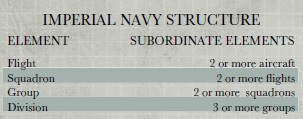

# 0488 帝国海航 Aeronautica Imperialis

精校状态：中文行文已逐段精校，部分术语仍为暂定

分类：组织

原文来源：https://www.bilibili.com/opus/1143255947022434305

原作者：帝国神选罐头

原文时间：2025年12月06日 20:16

[返回分类目录](目录.md) · [全书目录](../../目录.md)

<!-- A0488-B0001 -->
**英文原文**

The Aeronautica Imperialis is a branch of the Imperial Navy dedicated to atmospheric warfare. The Aeronautica Imperialis works closely with the Imperial Guard, providing both gunship transportation and close air support.

<!-- /A0488-B0001 -->

<!-- A0488-B0002 -->

原译文

帝国海航是帝国海军的一个分支，专门从事大气作战。帝国海航与帝国卫队密切合作，提供炮艇运输和近距离空中支援。

**校订译文**

帝国海航是帝国海军的一个分支，专门从事大气作战。帝国海航与帝国卫队密切合作，提供炮艇运输和近距离空中支援。

<!-- /A0488-B0002 -->

<!-- A0488-B0003 图片 -->

<!-- A0488-B0004 -->

原译文

Organization of Aeronautica Imperialis units 帝国海航单位组织

**校订译文**

Organization of Aeronautica Imperialis units 帝国海航单位组织

<!-- /A0488-B0004 -->

<!-- A0488-B0005 -->
## Aeronautica Imperialis Aircraft 帝国海航飞行器

<!-- /A0488-B0005 -->

<!-- A0488-B0006 -->
### Fighters 战斗机

<!-- /A0488-B0006 -->

<!-- A0488-B0007 -->

原译文

Thunderbolt 霹雳

**校订译文**

Thunderbolt 雷霆

**校注：** Thunderbolt 沿用本稿第81、83篇“雷霆”；Fury 型随之统一。

<!-- /A0488-B0007 -->

<!-- A0488-B0008 -->

原译文

Thunderbolt Fury 霹雳狂怒

**校订译文**

Thunderbolt Fury 雷霆狂怒型

<!-- /A0488-B0008 -->

<!-- A0488-B0009 -->

原译文

Lightning 闪电

**校订译文**

Lightning 闪电

<!-- /A0488-B0009 -->

<!-- A0488-B0010 -->

原译文

Lightning Strike 闪电打击

**校订译文**

Lightning Strike 闪电打击

<!-- /A0488-B0010 -->

<!-- A0488-B0011 -->

原译文

Avenger 复仇者

**校订译文**

Avenger 复仇者

<!-- /A0488-B0011 -->

<!-- A0488-B0012 -->
### Bombers 轰炸机

<!-- /A0488-B0012 -->

<!-- A0488-B0013 -->

原译文

Marauder Bomber 掠夺者轰炸机

**校订译文**

Marauder Bomber 掠夺者轰炸机

<!-- /A0488-B0013 -->

<!-- A0488-B0014 -->

原译文

Marauder Destroyer 掠夺者毁灭者

**校订译文**

Marauder Destroyer 掠夺者毁灭者

<!-- /A0488-B0014 -->

<!-- A0488-B0015 -->

原译文

Marauder Colossus 掠夺者巨像

**校订译文**

Marauder Colossus 掠夺者巨像

<!-- /A0488-B0015 -->

<!-- A0488-B0016 -->

原译文

Marauder Vigilant 掠夺者警戒

**校订译文**

Marauder Vigilant 掠夺者警戒

<!-- /A0488-B0016 -->

<!-- A0488-B0017 -->

原译文

Marauder Pathfinder 掠夺者探路者

**校订译文**

Marauder Pathfinder 掠夺者探路者

<!-- /A0488-B0017 -->

<!-- A0488-B0018 -->
### Gunships 炮艇

<!-- /A0488-B0018 -->

<!-- A0488-B0019 -->

原译文

Valkyrie 瓦尔基里

**校订译文**

Valkyrie 女武神炮艇

<!-- /A0488-B0019 -->

<!-- A0488-B0020 -->

原译文

Vendetta 仇杀

**校订译文**

Vendetta 仇杀

<!-- /A0488-B0020 -->

<!-- A0488-B0021 -->

原译文

Vulture 秃鹫

**校订译文**

Vulture 秃鹫

<!-- /A0488-B0021 -->

<!-- A0488-B0022 -->

原译文

Sky Talon 空爪

**校订译文**

Sky Talon 空爪

<!-- /A0488-B0022 -->

<!-- A0488-B0023 -->

原译文

Spectre 幽灵

**校订译文**

Spectre 幽灵

<!-- /A0488-B0023 -->

<!-- A0488-B0024 -->
### Other 其他

<!-- /A0488-B0024 -->

<!-- A0488-B0025 -->

原译文

Arvus Lighter 阿维鲁斯驳船

**校订译文**

Arvus Lighter 阿维鲁斯驳船

<!-- /A0488-B0025 -->

<!-- A0488-B0026 -->

原译文

Aquila Lander 天鹰登陆舰

**校订译文**

Aquila Lander 天鹰登陆舰

<!-- /A0488-B0026 -->

<!-- A0488-B0027 -->

原译文

Chiropteran Scout 翼手侦察机

**校订译文**

Chiropteran Scout 翼手侦察机

<!-- /A0488-B0027 -->

本篇核心术语与暂定项

以下列出本篇出现的英文原形及核心术语表用词。同形词可能指不同对象，具体词义以本篇正文和校注为准；单复数、别名和仅见于图注的名称可能尚未列入。完整候选见[术语表](../../术语表/双语术语候选.csv)。

| 英文 | 采用中文 | 状态 |
| --- | --- | --- |
| Imperial Guard | 帝国卫队 | 暂定·语境区分 |
| Imperial Navy | 帝国海军 | 暂定 |
| Aeronautica Imperialis | 帝国海航 | 暂定·官方待核 |
| Imperialis | 帝国徽记 | 暂定·官方待核 |

