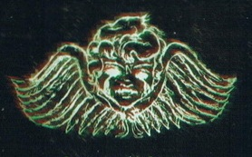

# 0489 导航员家族 Navis Nobilite

精校状态：中文行文已逐段精校，部分术语仍为暂定

分类：组织

原文来源：https://www.bilibili.com/opus/1143499888257925154

原作者：帝国神选罐头

原文时间：2025年12月07日 12:03

[返回分类目录](目录.md) · [全书目录](../../目录.md)

原篇名：导航者宗族 Navis Nobilite

<!-- A0489-B0001 -->
**英文原文**

The Navis Nobilite is an ancient organization predating even the Imperium by several thousand years, and is comprised of a unique form of mutant called Navigators who have the unique ability to navigate spacecraft through the warp. The Navis Nobilite are part of the Adeptus Terra and Imperial Fleet.

<!-- /A0489-B0001 -->

<!-- A0489-B0002 -->

原译文

导航者宗族是一个古老的组织，甚至比帝国早了几千年，由一种名为导航者的独特变种人组成，他们具有在亚空间中导航宇宙飞船的独特能力。导航者宗族是中央政务部和帝国舰队的一部分。

**校订译文**

导航员家族是一个比帝国还早数千年出现的古老组织，其成员是一类被称为导航员的特殊变种人。他们具有引导舰船穿越亚空间的独特能力。导航员家族隶属于中央政务部与帝国舰队。

<!-- /A0489-B0002 -->

<!-- A0489-B0003 图片 -->

<!-- A0489-B0004 -->

原译文

Navis Nobilite symbol 导航者宗族标志

**校订译文**

Navis Nobilite symbol 导航员家族标志

<!-- /A0489-B0004 -->

<!-- A0489-B0005 -->
**英文原文**

Parent Agency:Imperial Fleet

<!-- /A0489-B0005 -->

<!-- A0489-B0006 -->

原译文

隶属机构：帝国舰队

**校订译文**

隶属机构：帝国舰队

<!-- /A0489-B0006 -->

<!-- A0489-B0007 -->
**英文原文**

Headquarters:Palace of the Navigators, Terra

<!-- /A0489-B0007 -->

<!-- A0489-B0008 -->

原译文

总部：导航者宫殿，泰拉

**校订译文**

总部：导航员宫殿，泰拉

<!-- /A0489-B0008 -->

<!-- A0489-B0009 -->
**英文原文**

Leader:Paternova (represented by the Paternoval Envoy)

<!-- /A0489-B0009 -->

<!-- A0489-B0010 -->

原译文

领袖：星父（由星父特使代表）

**校订译文**

领袖：最高族长（由最高族长特使代表）

<!-- /A0489-B0010 -->

<!-- A0489-B0011 -->
**英文原文**

Armed Forces:Various Security Forces

<!-- /A0489-B0011 -->

<!-- A0489-B0012 -->

原译文

武装部队：各种安全部队

**校订译文**

武装部队：各种安全部队

<!-- /A0489-B0012 -->

<!-- A0489-B0013 -->
**英文原文**

Established:M30

<!-- /A0489-B0013 -->

<!-- A0489-B0014 -->

原译文

成立时间：M30

**校订译文**

成立时间：M30

**校注：** 资料栏将成立时间列为 M30，但本篇历史称该组织早于帝国数千年。可能分别指古老组织与帝国建制，本底稿未作解释，暂保留原文差异。

<!-- /A0489-B0014 -->

<!-- A0489-B0015 -->
## History 历史

<!-- /A0489-B0015 -->

<!-- A0489-B0016 -->
**英文原文**

The Navigator Gene was first developed by Humanity in roughly M22. The development of the Gene was instrumental in allowing for humans to colonize the Galaxy via Warp Travel. As such, the new Navigator class grew into a powerful organization independent of any government or cartel. The Navigators eventually coalesced into Great Families which in turn formed a broad union known as the Navis Nobilite. The Navis Nobilite was able to weather the Age of Strife and eventually merged into the Emperor's Imperium. During the Age of Exploration, the Navigator Houses began to survey the systems that would later form the Imperium.

<!-- /A0489-B0016 -->

<!-- A0489-B0017 -->

原译文

导航者基因最早是由人类在大约M22开发的。基因的发展有助于人类通过亚空间航行在银河系定居。因此，新的导航者阶层成长为一个独立于任何政府或企业联盟的强大组织。导航者最终结成了大家族，大家族又形成了一个被称为导航者宗族的广泛联盟。导航者宗族最终能够度过纷争时代，并入了帝皇的帝国。在探索时代，导航者家族开始调查后来形成帝国的星系。

**校订译文**

人类大约在 M22 首次开发出导航员基因，使人类得以借助亚空间航行在银河各处殖民。因此，新兴的导航员阶层逐渐发展成一个不受任何政府或商业联盟支配的强大组织。导航员最终结成各个大家族，这些家族又组成了一个广泛的联盟，即导航员家族。这个组织熬过了纷争时代，最终加入帝皇的帝国。在探索时代，各导航员家族开始勘测日后成为帝国疆域的星系。

<!-- /A0489-B0017 -->

<!-- A0489-B0018 -->
## Status 地位

原题：Status 状态

<!-- /A0489-B0018 -->

<!-- A0489-B0019 -->
**英文原文**

The Navigator Houses hold a unique position within the Imperium; they are not answerable to Imperial authority, but tend to toe the line because of the mutual benefits each side receives. Furthermore, members of the Navis Nobilite are compelled by ancient and binding oaths to serve with the Adeptus Mechanicus for a set duration in return for the Techpriests' services, serving the Imperial Navy and Merchant Fleets. A Navigator can also be rewarded with a Free Charter, which allows them to lease their services to whom ever they choose to.

<!-- /A0489-B0019 -->

<!-- A0489-B0020 -->

原译文

导航者宗族在帝国中占有独特的地位；他们不对帝国当局负责，但由于双方互惠互利，他们倾向于遵守规则。此外，导航者宗族的成员必须遵守古老而有约束力的誓言，在规定的期限内与机械神教一起服役，以换取技术神甫的服务，为帝国海军和商船队服务。导航者还可以获得自由宪章的奖励，这允许他们将服务租给他们选择的任何人。

**校订译文**

各导航员家族在帝国中享有独特的地位：他们不必向帝国当局负责，但出于双方互惠互利的考虑，通常仍会遵守帝国的规矩。此外，古老而具有约束力的誓言要求导航员家族成员为机械修会服役一定年限，以换取技术祭司的服务。他们也为帝国海军和商船队效力。导航员还可能获赐一份自由特许状，凭此自行选择为谁提供有偿服务。

<!-- /A0489-B0020 -->

<!-- A0489-B0021 -->
**英文原文**

This autonomy does not however, protect the Navigators from the agents of the Inquisition. The Ordo Malleus has been assigned jurisdiction over the Navigators, to ensure the taint of Chaos is not able to take hold. Given the slightest reason, the Inquisition will ruthlessly purge any offending parties; goods and assets are seized, midnight raids on Navigator palaces are followed by arrests and a purging of those seen as tainted; their fate to be burnt as heretics or locked away in Inquisition torture chambers. As such, the Navis Nobilite are all too willing to tackle this problem internally.

<!-- /A0489-B0021 -->

<!-- A0489-B0022 -->

原译文

然而，这种自治权并不能保护导航者免受审判庭特工的侵害。圣锤修会已被赋予对导航者的管辖权，以确保混沌的污染无法控制。只要有一点理由，审判庭就会无情地清洗任何违规方；货物和资产被没收，午夜突袭导航者宫殿后，逮捕并净化那些被视为被污染的人；他们的命运是被当作异端烧死或被关进审判庭的酷刑室。因此，导航者宗族非常愿意在内部解决这个问题。

**校订译文**

然而，这种自治权并不能使导航员免受审判庭调查。恶魔审判庭负责监督导航员，确保混沌污染无从生根。只要找到一点理由，审判庭便会无情地清洗涉事者：没收货物与资产，深夜突袭导航员的宫殿，逮捕并清除被认为受到污染的人。这些人要么作为异端被烧死，要么被囚禁在审判庭的刑讯室中。因此，导航员家族总是十分积极地在内部处理这类问题。

<!-- /A0489-B0022 -->

<!-- A0489-B0023 -->
**英文原文**

The Navis Nobilite has been known to act violently when its status is threatened. During the Horus Heresy, the Paternova dispatched agents to destroy the Dark Glass artifact due to the threat it represented to the Navigators' monopoly on Warp Travel.

<!-- /A0489-B0023 -->

<!-- A0489-B0024 -->

原译文

众所周知，当其地位受到威胁时，导航者宗族会采取暴力行动。在荷鲁斯叛乱期间，星父派遣特工摧毁了神器黑暗琉璃，因为它对导航者垄断亚空间航行构成了威胁。

**校订译文**

导航员家族在地位受到威胁时，会采取暴力手段。在荷鲁斯之乱期间，最高族长曾派遣特工去摧毁黑暗琉璃装置，因为它威胁到了导航员对亚空间航行的垄断。

**校注：** 英文 dispatched agents to destroy 说明派遣人员执行摧毁任务，不能据此断言任务已成功；修正原译“摧毁了”。

<!-- /A0489-B0024 -->

<!-- A0489-B0025 -->
## The Navigator Houses 导航员家族

原题：The Navigator Houses 导航者家族

<!-- /A0489-B0025 -->

<!-- A0489-B0026 -->
**英文原文**

The Navis Nobilite consists of several Houses or Great Families, each consisting of a large group of related Navigators who reside in a literal House. This house is generally a large fortress-mansion presided over by the Great Family's leader, or Novator. There the Novator lives with his immediate family and retainers.

<!-- /A0489-B0026 -->

<!-- A0489-B0027 -->

原译文

导航者宗族由几个家族或大家族组成，都由一大群居住在同一个家族中的相关导航者组成。家族通常是一座由大家族领袖或星长主持的大型堡垒公馆。星长和他的直系亲属和随从住在那里。

**校订译文**

导航员家族这一组织由若干家族或大家族组成。每个家族都由一大群具有亲缘关系的导航员构成，并拥有实际的家族宅邸。宅邸通常是一座庞大的堡垒式府邸，由大家族的领袖——星长（Novator）主持。星长与其直系亲属、家臣一同居住在这里。

**校注：** House 此处兼有家族与实体宅邸两义；修正“居住在同一个家族中”。Novator 沿用原稿“星长”，暂定。

<!-- /A0489-B0027 -->

<!-- A0489-B0028 -->
**英文原文**

Each family is very close and often very large, and different families are often allied by marriage, while others are rivals. The families are organised into Houses and have their own unique traditions and positions dependent upon their own histories. For instance, House Belisarius is led by an individual referred to as the Celestarch and has its own standing military trained by the Space Wolves.

<!-- /A0489-B0028 -->

<!-- A0489-B0029 -->

原译文

每个家庭都很亲密，而且往往很大，不同的家庭往往通过婚姻结盟，而其他家庭则是竞争对手。这些家庭被组织成家族，有自己独特的传统和地位，这取决于他们自己的历史。例如，贝利萨留斯家族由一位被称为天君的人领导，并拥有由太空野狼训练的常备军。

**校订译文**

每个家族的内部关系都十分紧密，而且往往人丁兴旺。不同家族之间常通过联姻结盟，也有些家族互相敌对。各家族根据自身的历史，形成了独特的传统与职衔。例如，贝利萨留斯家族由一位称为天君的人领导，并拥有一支由太空野狼训练的常备军。

<!-- /A0489-B0029 -->

<!-- A0489-B0030 -->
**英文原文**

It has been stated that it would be impossible to catalogue and critique each of the Navigator families, but many can be grouped into broad categories, representing their unique strain of the gene as well as their area of influence and way of life. For example, Navigator Houses in the Calixis Sector and the Koronus Expanse are categorised into four prevalent groups:

<!-- /A0489-B0030 -->

<!-- A0489-B0031 -->

原译文

有人说，不可能对每个导航者家庭进行记载和评论，但许多可以分为大类，代表他们独特的基因品系以及他们的影响领域和生活方式。例如，卡利西斯星区和科罗努斯扩区的导航者家族分为四类：

**校订译文**

据说，要逐一记述和评析所有导航员家族几乎是不可能的，但许多家族可以根据其特有的基因品系、势力范围和生活方式归入若干大类。例如，卡利西斯星区和克洛诺斯广域的导航员家族主要分为以下四类：

<!-- /A0489-B0031 -->

<!-- A0489-B0032 图片 -->

<!-- A0489-B0033 -->

原译文

Nostromo Navigator House emblem 诺斯特罗莫导航者家族徽章

**校订译文**

Nostromo Navigator House emblem 诺斯特罗莫导航员家族徽章

<!-- /A0489-B0033 -->

<!-- A0489-B0034 -->
**英文原文**

Magisterial Houses are those most closely related to the original Navigator families. They are the wealthiest and most traditional and will have holdings in the Navigator's Quarter on Terra. Due to the maintenance of their bloodlines, they are less susceptible to the symptomatic mutations of being a Navigator.

<!-- /A0489-B0034 -->

<!-- A0489-B0035 -->

原译文

权威家族是与原初导航者家庭关系最密切的。他们是最富有、最传统的人，持有泰拉上的导航者群体。由于他们的血统得以维持，他们不太容易受到导航者的突变症候的影响。

**校订译文**

权威家族与最初的导航员家族血缘关系最为接近。他们最富有，也最恪守传统，在泰拉的导航员区拥有产业。由于妥善维系了血统，他们较少出现导航员特有的突变症状。

<!-- /A0489-B0035 -->

<!-- A0489-B0036 -->
**英文原文**

Nomadic Houses have relinquished their properties and have taken entirely to spaceborne lifestyles; they are perhaps the most skilled of Navigators but have difficulty relating to planetary cultures.

<!-- /A0489-B0036 -->

<!-- A0489-B0037 -->

原译文

游牧家族已经放弃了他们的财产，完全过上了星载生活方式；他们可能是最熟练的导航者，但很难与行星文化建立联系。

**校订译文**

游牧家族放弃了地面产业，完全以太空为家。他们或许是技艺最精湛的导航员，却很难适应行星上的文化。

<!-- /A0489-B0037 -->

<!-- A0489-B0038 -->
**英文原文**

Shrouded Houses have somehow lost their status in relation to other houses and exist in a state of decline; sometimes referred to as Beggar Houses by other Navigators. Individual Navigators have little support from their own families, making them quite resourceful, while their Warp Eye often becomes more perceptive.

<!-- /A0489-B0038 -->

<!-- A0489-B0039 -->

原译文

寿衣家族在某种程度上失去了与其他家族的联系，处于衰落状态；有时被其他导航者称为乞丐家族。个别导航者几乎没有家庭的支援，这使他们非常足智多谋，而他们的亚空间之眼往往变得更加敏锐。

**校订译文**

寿衣家族由于种种原因，相较于其他家族已失去昔日的地位，处于衰落之中，有时被其他导航员称为乞丐家族。他们的导航员很少能得到家族支援，因此往往善于随机应变，而其亚空间之眼也常常变得更加敏锐。

**校注：** Shrouded Houses 沿用原稿类别名“寿衣家族”，暂定待核；正文 lost their status 是地位衰落，并非失去与其他家族的联系。

<!-- /A0489-B0039 -->

<!-- A0489-B0040 -->
**英文原文**

Renegade Houses are those families that have been rejected by the Paternova either by turning from their ancient traditions or have been exiled due to conflicts with other houses. They are unable to maintain their genetic purity and often suffer the most mutation but can also benefit from new strains that might occur.

<!-- /A0489-B0040 -->

<!-- A0489-B0041 -->

原译文

叛逆家族是指那些被星父拒绝的家庭，要么是因为偏离了古老的传统，要么是由于与其他家族的冲突而被流放。它们无法保持基因纯洁，经常遭受最多的突变，但也可以从可能出现的新品系中受益。

**校订译文**

叛逆家族是遭到最高族长排斥的家族：有些背弃了古老传统，有些则因与其他家族冲突而被放逐。他们无法保持基因纯度，往往出现最严重的突变，但也可能受益于新产生的基因品系。

<!-- /A0489-B0041 -->

<!-- A0489-B0042 -->
### Notable Houses 著名家族

<!-- /A0489-B0042 -->

<!-- A0489-B0043 -->

原译文

House Achelieux 阿舍利厄斯家族

**校订译文**

House Achelieux 阿舍利厄家族

<!-- /A0489-B0043 -->

<!-- A0489-B0044 -->

原译文

House Belisarius 贝利萨留斯家族

**校订译文**

House Belisarius 贝利萨留斯家族

<!-- /A0489-B0044 -->

<!-- A0489-B0045 -->

原译文

House Brobantis 布罗班蒂斯家族

**校订译文**

House Brobantis 布罗班蒂斯家族

<!-- /A0489-B0045 -->

<!-- A0489-B0046 -->

原译文

House Castana 卡斯塔纳家族

**校订译文**

House Castana 卡斯塔纳家族

<!-- /A0489-B0046 -->

<!-- A0489-B0047 -->
### Great Navigator Houses 导航员大家族

原题：Great Navigator Houses 大导航者家族

<!-- /A0489-B0047 -->

<!-- A0489-B0048 -->
**英文原文**

The largest and most powerful and wealthy Houses of the Navis Nobilite are known as the Great Navigator Houses. They are all supported by complex networks of fealties, oaths, tithes and contracts, which has allowed the Great Houses to have almost total control over the movement of goods across the Imperium.

<!-- /A0489-B0048 -->

<!-- A0489-B0049 -->

原译文

导航者宗族中最大、最强、最富有的家族被称为大导航者家族。它们都得到了复杂的效忠宣誓、誓言、什一税和契约网络的支持，这使得大家族几乎完全控制了整个帝国的货物运输。

**校订译文**

导航员家族中规模最大、势力最强、财富最多的那些家族，被称为导航员大家族。复杂的效忠关系、誓约、什一税与契约网络支撑着他们，使这些大家族几乎掌控了整个帝国的货物流通。

<!-- /A0489-B0049 -->

<!-- A0489-B0050 -->
### Known Great Houses 已知大家族

<!-- /A0489-B0050 -->

<!-- A0489-B0051 -->

原译文

House Davor-Jarni 达沃·雅尼家族

**校订译文**

House Davor-Jarni 达沃·雅尼家族

<!-- /A0489-B0051 -->

<!-- A0489-B0052 -->

原译文

House Hals-Viati 哈尔斯·维亚蒂家族

**校订译文**

House Hals-Viati 哈尔斯·维亚蒂家族

<!-- /A0489-B0052 -->

<!-- A0489-B0053 -->

原译文

House Locarno 洛迦诺家族

**校订译文**

House Locarno 洛迦诺家族

<!-- /A0489-B0053 -->

<!-- A0489-B0054 -->

原译文

House M'edici 美'第奇家族

**校订译文**

House M'edici 美’第奇家族

<!-- /A0489-B0054 -->

<!-- A0489-B0055 -->

原译文

House Sixtus 西克斯图斯家族

**校订译文**

House Sixtus 西克斯图斯家族

<!-- /A0489-B0055 -->

<!-- A0489-B0056 -->
### The Paternova 最高族长

原题：The Paternova 星父

<!-- /A0489-B0056 -->

<!-- A0489-B0057 -->
**英文原文**

The Paternova is the great leader of the Navis Nobilite, who is chosen from the most powerful Navigators of the Great Families. The Paternova rules from the Palace of the Navigators. His position is far more than just one of leadership, he is able to somehow control, or amplify, the warp sight of the other Navigators. Without him, Navigators would suffer a considerable reduction in their ability to navigate the warp, with some losing the power altogether. When this happens warp travel becomes far more unstable. As the Paternova never leaves his Palace he, and the Navis Nobilite as a whole, are represented in the Senatorum Imperialis by the Paternoval Envoy. The current Paternova is Francisco M'edici 14th of the Great Navigator House M'edici.

<!-- /A0489-B0057 -->

<!-- A0489-B0058 -->

原译文

星父是导航者宗族的伟大领袖，他是从大家族中最强大的导航者中选出的。星父在导航者宫殿统治。他的职位远不止是领导，他能够以某种方式控制或放大其他导航者的亚空间视觉。没有他，导航者在亚空间中的导航能力将大大降低，有些人甚至会完全失去力量。当这种情况发生时，亚空间航行会变得更加不稳定。由于星父从未离开过他的宫殿，他和整个导航者宗族在帝国参议院由星父特使代表。目前的星父是大导航者家族美第奇的弗朗西斯科·美'第奇十四世。

**校订译文**

最高族长是导航员家族的最高领袖，从各大家族最强大的导航员中选出，并在导航员宫殿中统领整个组织。其作用远不止领导：他还能以某种方式控制或增强其他导航员的亚空间视力。没有他，导航员穿行亚空间的能力便会大幅衰退，有些人甚至会完全失去这种能力，亚空间航行也随之变得更加不稳定。最高族长从不离开宫殿，因此由最高族长特使在帝国参议院代表他及整个导航员家族组织。现任最高族长是出身美’第奇大家族的弗朗西斯科·美’第奇十四世。

<!-- /A0489-B0058 -->

<!-- A0489-B0059 -->
**英文原文**

Another important position within the Navis Nobilite is the Consul Pre-Eminus.

<!-- /A0489-B0059 -->

<!-- A0489-B0060 -->

原译文

导航者宗族中的另一个重要职位是前杰领事。

**校订译文**

导航员家族中另一个重要的职位是前杰领事。

<!-- /A0489-B0060 -->

<!-- A0489-B0061 -->
### Security Forces 安全部队

<!-- /A0489-B0061 -->

<!-- A0489-B0062 -->
**英文原文**

The Navigators maintain their own heavily armed security forces, mostly designed to protect the Navigator Houses and guard the Navigator's Quarter on Terra. In times of war the great wealth of the Navigator's allows them to gather mercenary armies that can rival a Planetary Defense Force or System Defense Fleet.

<!-- /A0489-B0062 -->

<!-- A0489-B0063 -->

原译文

导航者拥有自己的全副武装的安全部队，主要是为了保护导航者家族和守卫泰拉上的导航者群体。在战争时期，导航者的巨大财富使他们能够召集雇佣军，与行星防御部队或星系防御舰队相媲美。

**校订译文**

导航员拥有自己的重装警卫部队，主要负责保护各家族，并守卫泰拉的导航员区。战争时期，他们凭借巨额财富，能够召集足以匹敌行星防御部队或星系防御舰队的雇佣军。

<!-- /A0489-B0063 -->

<!-- A0489-B0064 -->
### Trade Wars 贸易战争

<!-- /A0489-B0064 -->

<!-- A0489-B0065 -->
**英文原文**

Conflicts between adversarial Navis Nobilite Houses can result in what is referred to as a trade war. These are controlled conflicts with set contracts for the rules of engagement during the quarrel, such as disallowing assassination attempts, open-warfare, destruction of assets, or other rules to mitigate damage. Open warfare is uncommon between Navigator Houses.

<!-- /A0489-B0065 -->

<!-- A0489-B0066 -->

原译文

敌对的导航者宗族之间的冲突可能会导致所谓的贸易战争。这些是与争吵期间交战规则的设定协议的受控冲突，例如禁止暗杀企图、公开战争、破坏资产或其他减轻损害的规则。导航者家族之间的公开战争并不常见。

**校订译文**

敌对导航员家族之间的冲突，可能演变成所谓的贸易战争。这类冲突受到约束，交战双方会签订协议，事先规定交战规则，例如禁止暗杀、公开作战或破坏资产，并以其他条款减少损失。导航员家族之间的公开战争并不常见。

<!-- /A0489-B0066 -->

<!-- A0489-B0067 -->
**英文原文**

Though assassinations are often used between feuding Navigator Houses, open warfare is not uncommon as well. While this can occur without warning, a Navigator House can also formally declare a Trade War against a rival House. The Imperium's Administratum allows this to occur, as the Navigator Conventions ensure a Trade War is waged in a controlled fashion, that limits the amount of damage that can be done and prevents a Navigator House from destroying their rival. This is done by restricting their attacks to targets that both Houses agree to and using only forces that are under their direct command. Shipping lanes, mercantile operations and equipment are usually attacked in a Trade War, along with the Houses' employees and individual Navigators that have been declared as targets as well. All attacks must be limited to only the warring Houses themselves as well, which means that subsidiaries and allied lesser Navigator Houses are off limits. However, this last rule is often broken. Besides the number of lives lost in the conflict, Trade Wars can also result in a Navigator House losing control of commercial contracts, markets or shipping routes to their rivals.

<!-- /A0489-B0067 -->

<!-- A0489-B0068 -->

原译文

尽管在世仇的导航者家族之间经常使用暗杀，但公开战争也并不罕见。虽然这可能会在没有警告的情况下发生，但导航者家族也可以正式宣布对敌对家族的贸易战争。帝国政府允许这种情况发生，因为导航者协议确保贸易战争以受控的方式进行，限制了可以造成的损害程度，并防止导航者家族摧毁对手。这是通过将他们的攻击限制在两个家族同意的目标上，并只使用他们直接指挥的部队来实现的。在贸易战争中，航线、商业运营和设备通常会受到攻击，同时被宣布为目标的家族雇员和个别导航者也会受到攻击。所有攻击也必须仅限于交战家族本身，这意味着附属公司和盟军较小的导航者家族是被禁止的。然而，这最后一条规则经常被打破。除了在冲突中丧生的人数外，贸易战争还可能导致导航者家族失去对商业合同、市场或航运路线的控制权。

**校订译文**

结怨的导航员家族常常互相暗杀，公开战争也并不罕见。战争可能毫无预兆地爆发，一个家族也可以正式向对手宣布发动贸易战争。帝国内政部允许这种行为，因为《导航员公约》规定贸易战争必须受到控制，以限制损失，避免一个家族彻底摧毁另一个家族。双方只能打击彼此事先同意的目标，并且只能动用由自己直接指挥的部队。通常允许攻击的目标包括航线、商业活动、设备，以及被明确列为目标的家族雇员和个别导航员。所有攻击还必须仅针对交战家族本身，不能波及附属机构和结盟的小导航员家族，不过最后这条规则常遭到违反。贸易战争除了造成人员伤亡，还可能使一个家族将商业合同、市场或航线的控制权拱手让给对手。

**校注：** 英文前段称公开战争 uncommon，本段却称 not uncommon，且对暗杀是否允许的表述也有差别。保留两段差异；可能对应不同契约或来源，但底稿没有说明。

<!-- /A0489-B0068 -->

<!-- A0489-B0069 -->
**英文原文**

Because they are paranoid that a Tradewar could always be declared against them, Navigator Houses go to great lengths to not appear militarily weak and pay well to maintain private armies. Mercenaries and Assassins are used as well, but if a House can not or will not pay to hire or maintain an army, they will instead train their slaves or penitents to become their soldiers. But because of how expensive a Tradewar often is, they normally do not last long. Regardless of what their reasons were for waging them, the warring Houses will not often see it worth justifying the cost it would take to win a Tradewar or the potential loss in profits they can occur. Due to this premature ending, Tradewars tend to produce bitter enmities between the warring Houses and leave many scores unsettled. The Great Navigator Houses though, do not see Tradewars as open conflicts. Instead, they are merely viewed as an extension of the Great Houses' customary means of conducting a competition between rivals.

<!-- /A0489-B0069 -->

<!-- A0489-B0070 -->

原译文

因为他们偏执地认为贸易战争总是会对他们宣战，导航者家族竭尽全力不让自己在军事上显得软弱，并支付高昂的费用来维持私人军队。雇佣兵和刺客也被使用，但如果一个家族不能或不愿支付雇佣或维持军队的费用，他们就会训练奴隶或忏悔者成为士兵。但由于贸易战争的成本通常很高，它们通常不会持续很长时间。无论发动这些战争的原因是什么，交战双方都不会经常认为值得为赢得贸易战争所需的成本或可能发生的利润损失辩护。由于这种过早的结束，贸易战争往往会在交战双方之间产生强烈的敌意，并留下许多悬而未决的问题。然而，大导航者家族并不认为贸易战争是公开的冲突。相反，它们只是被视为大家族在竞争对手之间进行竞争的惯常手段的延伸。

**校订译文**

各导航员家族总是疑心别人随时会向自己发动贸易战争，因此竭力避免显露军事上的弱势，不惜重金维持私军，也会雇用佣兵和刺客。如果某个家族无力或不愿出资雇用、维持军队，就会将奴隶或忏悔者训练成士兵。贸易战争通常耗资巨大，因而持续时间往往不长。无论最初为何开战，交战家族通常都会认为，取胜所需的代价及可能损失的利润并不划算。这种半途而止的结局，往往在双方之间留下深仇大恨和大量未清的旧账。不过，导航员大家族并不把贸易战争视为公开冲突，而只是将其看作家族间惯常竞争手段的延伸。

<!-- /A0489-B0070 -->

本篇核心术语与暂定项

以下列出本篇出现的英文原形及核心术语表用词。同形词可能指不同对象，具体词义以本篇正文和校注为准；单复数、别名和仅见于图注的名称可能尚未列入。完整候选见[术语表](../../术语表/双语术语候选.csv)。

| 英文 | 采用中文 | 状态 |
| --- | --- | --- |
| Space Wolves | 太空野狼 | 官方已核对 |
| Adeptus Mechanicus | 机械修会 | 官方已核对 |
| Horus Heresy | 荷鲁斯之乱 | 官方已核对 |
| Navigator | 导航员 | 官方已核对 |
| Warp | 亚空间 | 官方已核对 |
| Inquisition | 审判庭 | 暂定 |
| Imperium | 帝国 | 暂定·简称 |
| Imperial Navy | 帝国海军 | 暂定 |
| Equipment | 装备 | 编辑用语已统一 |
| Administratum | 内政部 | 暂定 |
| Ordo Malleus | 恶魔审判庭 | 用户指定 |
| Emperor | 帝皇 | 官方已核对 |
| Adeptus Terra | 中央政务部 | 暂定 |
| Navis Nobilite | 导航员家族 | 暂定·官方待核 |
| Imperial Fleet | 帝国舰队 | 暂定 |
| Mutant | 变种人 | 暂定·官方待核 |
| Age of Strife | 纷争时代 | 暂定·官方待核 |
| Terra | 泰拉 | 暂定·官方待核 |
| Horus | 荷鲁斯 | 暂定·官方待核 |
| Navigators | 导航员 | 官方已核对 |
| Sector | 星区 | 暂定·官方待核 |
| Koronus Expanse | 克洛诺斯广域 | 暂定·官方待核 |
| Paternova | 最高族长 | 暂定·官方待核 |
| Dark Glass | 黑暗琉璃 | 暂定·官方待核 |
| Ancient | 旗手 | 官方已核对 |
| Paternoval Envoy | 最高族长特使 | 暂定·官方待核 |
| Consul | 领事 | 暂定·官方待核 |
| Penitents | 忏悔者 | 暂定·官方待核 |
| Novator | 星长 | 暂定·官方待核 |
| Celestarch | 天君 | 暂定·官方待核 |
| Magisterial Houses | 权威家族 | 暂定·官方待核 |
| Nomadic Houses | 游牧家族 | 暂定·官方待核 |
| Shrouded Houses | 寿衣家族 | 暂定·官方待核 |
| Renegade Houses | 叛逆家族 | 暂定·官方待核 |
| Navigator Conventions | 《导航员公约》 | 暂定·官方待核 |
| Free Charter | 自由特许状 | 暂定·官方待核 |
| Imperialis | 帝国徽记 | 暂定·官方待核 |
| Strain | 群系 | 暂定·官方待核 |
| The Dark | 《黑暗》 | 暂定·官方待核 |
| System | 星系（恒星系统） | 暂定·官方待核 |
| Calixis Sector | 卡利西斯星区 | 暂定·官方待核 |
| House Belisarius | 贝利萨留斯家族 | 暂定·官方待核 |

