# 0491 导航员 Navigator

精校状态：中文行文已逐段精校，部分术语仍为暂定

分类：组织

原文来源：https://www.bilibili.com/opus/1143861275408728082

原作者：帝国神选罐头

原文时间：编辑于 2026年05月26日 07:38

[返回分类目录](目录.md) · [全书目录](../../目录.md)

原篇名：导航者 Navigator

<!-- A0491-B0001 -->
**英文原文**

Navigators (Homo navigo) are a strain of abhumans responsible for guiding human ships through the Warp, via the use of their specialised third eye. Without the Navigators, rapid voyages beyond the closest systems would be impossible, thus being one of the Imperium's most valuable assets. The majority of them comprise various Houses of Navis Nobilite, highly influential within the Imperium of Man. Their status as mutants and members of the elite causes Navigators to rarely interact with other members of Imperial society.

<!-- /A0491-B0001 -->

<!-- A0491-B0002 -->

原译文

导航者（人属导航亚种）是一种亚人，负责通过使用其专门的第三只眼引导人类船只通过亚空间。如果没有导航者，就不可能在最近的星系之外进行快速航行，因此这是帝国最宝贵的资产之一。他们中的大多数由不同的导航者宗族的家族组成，在人类帝国中具有高度影响力。他们作为变种人和精英成员的身份导致导航者很少与帝国社会的其他成员互动。

**校订译文**

导航员（Homo navigo，人属导航亚种）是一类亚人，凭借特殊的第三只眼引导人类舰船穿越亚空间。没有他们，人类便无法迅速航行至邻近星系之外，因此导航员是帝国最宝贵的资源之一。他们大多属于导航员家族组织中的不同家族，在人类帝国中享有极大的影响力。变种人与社会精英的双重身份，使导航员很少与帝国社会的其他群体往来。

<!-- /A0491-B0002 -->

<!-- A0491-B0003 图片 -->
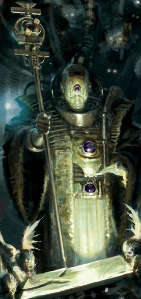

<!-- A0491-B0004 -->

原译文

Navigator 导航者

**校订译文**

Navigator 导航员

<!-- /A0491-B0004 -->

<!-- A0491-B0005 -->
## Overview 概述

<!-- /A0491-B0005 -->

<!-- A0491-B0006 -->
### Biology 生理

<!-- /A0491-B0006 -->

<!-- A0491-B0007 -->
### Genetics 基因

<!-- /A0491-B0007 -->

<!-- A0491-B0008 -->
**英文原文**

The origins of the Navigator gene are shrouded in mystery and rumour, even among Navigators themselves, but firmly placed within the Dark Age of Technology; various sources date their introduction to M10, M15, M19, or M22, in most sources predating the re-emergence of psykers in Mankind. It is unknown whether they evolved on their own, or were manufactured by genetic engineering; even if the consensus pointed to the latter, either would appear to be a response to Mankind’s need to perfect Warp travel. Since their appearance they began to extend their influence due to their crucial service within human society, forming noble houses that with waxing and waning times ultimately grew in wealth, escaping the grasp of industrial and trading cartels, eventually establishing the Navis Nobilite well before the advent of the Imperium. It is of note that in M41 many held a belief that Navigator gene originated from the time just before the Great Crusade which took place between late M30 and early M31, manufactured by the Emperor himself. Some Ordos amongst the Holy Inquisition suspect that the ancient stasis vaults beneath the mansions of the Navigator's Quarter on Holy Terra contain records of the true origin of the Navigator gene. The aforementioned gene is easily lost through its recessive trait, and can only be saved for future generations through intermarriage, lost when bred with ordinary humans.

<!-- /A0491-B0008 -->

<!-- A0491-B0009 -->

原译文

导航者基因的起源笼罩在神秘和谣言之中，即使在导航者自己身上也是如此，但它被牢牢地置于黑暗技术时代；各种资料表明，它们被引入M10、M15、M19或M22，在大多数资料中，它们的出现早于人类灵能者的重新出现。目前尚不清楚他们是自己进化的，还是通过基因工程制造的；即使共识指向后者，两者似乎都是对人类完善亚空间航行需求的回应。自从他们出现以来，由于他们在人类社会中的重要服务，他们开始扩大自己的影响力，形成导航者宗族，随着时代的兴衰，最终财富不断增长，摆脱了工业和贸易企业联盟的控制，最终在帝国出现之前就建立了导航者宗族。值得注意的是，在M41，许多人认为导航者基因起源于M30晚期和M31早期之间发生的大远征之前，由帝皇自己制造。神圣审判庭的一些修会怀疑，神圣泰拉的导航者群体的公馆下的古代静滞秘库中包含了导航者基因真实起源的记录。上述基因很容易因其隐性特征而丢失，只能通过与通婚为子孙后代保存。

**校订译文**

导航员基因的起源充满谜团与传言，连导航员自己也不清楚，但各方都将其出现时间归于黑暗科技时代。不同资料分别将这一时间定在 M10、M15、M19 或 M22；多数资料认为，导航员出现得比人类灵能者的再次涌现更早。人们尚不清楚他们是自然演化的产物，还是通过基因工程制造的；虽然普遍倾向于后一种解释，但无论是哪种情况，都似乎回应了人类完善亚空间航行的需要。导航员自出现之日起，便依靠自身不可或缺的服务扩大影响力，建立贵族家族。这些家族历经兴衰，最终积累起巨额财富，摆脱工业与贸易垄断集团的控制，在帝国诞生很久以前就建立了导航员家族组织。不过，在 M41，许多人相信导航员基因由帝皇亲自创造，起源于大远征之前；大远征则发生于 M30 晚期至 M31 初期。神圣审判庭中的某些分支怀疑，泰拉导航员区各座府邸下方的古老静滞秘库，保存着这一基因真实起源的记录。导航员基因具有隐性遗传特征，很容易在后代中失传；只有导航员彼此通婚才能将其保存下去，与普通人类生育则会失去这一特征。

**校注：** 原文给出多种起源年代，且本篇末尾还列出其他来源，均如实保留；隐性基因与通婚的说法按设定原文译，不用现实遗传学替作者改写。

<!-- /A0491-B0009 -->

<!-- A0491-B0010 -->
**英文原文**

The primary trait of a Navigator is their pineal eye, nested in a socket on their forehead. While it perfectly fills the sensory function as either of his normal eyes do, it is also able to open a miniscule Warp gate within itself. From this stems all the Navigator’s powers. Although Navigators may open their third eye in an unremarkable way, the term “fully open” is used to describe the state required for its more extraordinary application. During the opening of this gate, a Navigator is able to glimpse the Empyrean in its true state, although their mind converts this image to a more mundane approximation; only with age does this comforting illusion recede, leaving apparent the true horror of the Warp. Nonetheless, the ability to observe the Warp is crucial in their function as navigational officers, allowing them uniquely to have some semblance of assurance of their position within it. While the eye always appears within a genetically pure newborn, in some cases it is located deep within the skull, requiring trepanning surgery and/or a cybernetic shutter for it to be brought to its proper spot. These surgeries commonly occur during a Navigator's adolescence. If, even with both of the parents being Navigators, a newborn has his Navigator gene dormant, and no Third Eye to speak of, they are called a Typhlotic. Even if the child is a barren fruit of the line, they aren't known to be harmed, and are kept around, although the specifics of their role in the house are unknown. Notwithstanding the Navigators' toleration of their unfortunate typhlotic kinfolk, the appearance of them within a lineage is considered a threat to the house's survival. Across their history there were a few known houses who slowly but surely lost the ability to produce purestrain genestock, and at some point not even spending their whole fortune on bloodbrokers and unsound marriage arrangements is able to save the house from falling back into baseline Humanity, without any such useful abilities as their ancestors possessed.

<!-- /A0491-B0010 -->

<!-- A0491-B0011 -->

原译文

导航者的主要特征是他们的松果体处的眼睛，嵌在前额的眼窝里。虽然它完美地填补了他的任何一只正常眼睛的感官功能，但它也能够在自己内部打开一个微小的亚空间之门。导航者的所有能力都源于此。尽管导航者可能会以一种不起眼的方式睁开第三只眼，但“完全睁开”一词用于描述其更特殊应用所需的状态。在打开这扇门的过程中，导航者能够看到至高天的真实状态，尽管他们的头脑将这一形象转化为更世俗的近似；只有随着年龄的增长，这种安慰的幻觉才会消退，留下亚空间的真正恐怖。尽管如此，观察亚空间的能力对他们作为导航者的职能至关重要，使他们能够独特地对自己在亚空间中的位置有一定的保证。虽然眼睛总是出现在基因纯洁的新生儿体内，但在某些情况下，它位于头骨深处，需要开孔手术和/或智控门才能将其带到适当的位置。这些手术通常发生在导航者的青春期。如果即使父母双方都是导航者，新生儿的导航者基因处于休眠状态，没有第三只眼，他们就被称为无眼者。即使孩子是这一行的无核之果，他们也不会受到伤害，并被留在身边，尽管他们在家族中的具体角色尚不清楚。尽管导航者能容忍他们不幸的无眼者血亲，但他们在血统中的出现被认为是对家族生存的威胁。在他们的历史上，有一些已知的家族缓慢但肯定地失去了产生纯净品系基因储备的能力，在某个时候，甚至没有把全部财产都花在鲜血掮客和不健全的婚姻安排上，就能够拯救家族，使其免于倒退到普通人类，而没有他们祖先所拥有的任何有用能力。

**校订译文**

导航员最显著的特征是松果体之眼，位于前额的眼窝内。它既能像两只普通眼睛一样正常视物，也能在内部开启一道微小的亚空间之门，导航员的所有能力都源于此。平常睁开第三只眼并没有什么惊人之处；所谓“完全睁开”，是指发挥其超常能力所需的状态。开启这道门户时，导航员能够瞥见至高天的真实面貌，不过大脑会将景象转化成较为寻常、易于理解的近似图景。随着年龄增长，这层令人安心的幻象才会逐渐消退，显露亚空间真正的恐怖。观察亚空间的能力对履行导航职责至关重要，使他们能够在其中大致确定自身的位置。血统纯正的新生儿都会长出这只眼睛，但有时它深埋颅内，需要通过颅骨开孔手术、植入机械启闭装置，或两者并用，使其能够在适当位置显露。这类手术通常在青春期进行。即使父母双方都是导航员，婴儿也可能因导航员基因未被激活而不具备第三只眼，这样的人被称为无眼者（Typhlotic）。虽然他们未能继承家系的天赋，但没有已知记录表明他们会因此遭到伤害；家族仍会收留他们，只是具体安排何种职责尚不清楚。尽管导航员容忍这些不幸的血亲，无眼者的出现仍被视为家族存续的威胁。历史上，有少数家族逐渐失去生育纯血后裔的能力；一旦衰退到某个地步，即使耗尽全部财富，求助血统掮客并安排不可靠的婚配，也无法阻止家族退回普通人类的状态，彻底失去祖先的特殊能力。

<!-- /A0491-B0011 -->

<!-- A0491-B0012 图片 -->
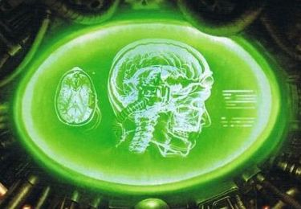

<!-- A0491-B0013 -->

原译文

Navigator's skull crossection, showing how the pineal eye connects to the brain 导航者的头骨横截面图，显示了松果体之眼与大脑的连接方式

**校订译文**

Navigator's skull crossection, showing how the pineal eye connects to the brain 导航员的头骨横截面图，显示了松果体之眼与大脑的连接方式

<!-- /A0491-B0013 -->

<!-- A0491-B0014 -->
**英文原文**

Due to unspecified reasons Navigators normally keep their Third Eye hidden, covered with a bandana or any other decorative piece. It is noted on one occasion that a Navigator only kept her Third Eye hidden when outside the safe haven of the spaceship, freely unveiling it while stepping aboard, with the notion of doing so only speculated by her peers to come with familiarity of this environment. In stark contrast, Navigators of the Elutrian Confederacy proudly flaunt their third eye, instead covering their mundane eyes, considering them to be of no importance to their status. While the most prominent of the Eye's powers is known to be extremely lethal, it is under full conscious control of the Navigator, being utterly harmless on its own without the Navigator's decision to otherwise be. Psychically inclined individuals however can still sense the eye even if covered, although no one but the most powerful of psykers notes the effect, and most baseline humans often doubt the existence of this mythical eye, until in a rare occurrence they are given a chance to see it. It however is often met with disappointment as it ends up being an unimpressive peculiarity, if not a reason to brand and detest them as a mutant on the first occasion of noticing the eye.

<!-- /A0491-B0014 -->

<!-- A0491-B0015 -->

原译文

由于未指明的原因，导航者通常会隐藏他们的第三只眼，用头巾或任何其他装饰品覆盖。有一次，有人注意到，一名导航者只有在太空舰的安全区外才把她的第三只眼藏起来，在登上太空舰时自由地揭开它，只有在熟悉这种环境的情况下，她的同辈才会猜测这样做。与之形成鲜明对比的是，净化联盟的导航者自豪地炫耀他们的第三只眼，而是遮住他们平凡的眼睛，认为它们对他们的地位并不重要。虽然众所周知，眼睛最显著的力量是极其致命的，但它在导航者的完全意识控制下，在导航者没有决定的情况下，它本身是完全无害的。然而，有灵能天赋的人即使遮盖，仍然可以感觉到眼睛，尽管除了最强大的灵能者之外，没有人注意到这种效果，大多数普通人类经常怀疑这种神话般的眼睛的存在，直到在极少数情况下他们有机会看到它。然而，它经常令人失望，因为它最终是一个不起眼的特性，如果不是一个在第一次注意到眼睛时就将其标记为突变并憎恨它们的理由的话。

**校订译文**

导航员通常会用头巾或其他饰物遮住第三只眼，具体原因并不明确。有一次，人们发现一位导航员只在离开舰船这一安全环境时遮眼，上舰后便会毫不避讳地露出第三只眼；同行只能猜测，这或许是因为她对舰上的环境感到熟悉。净化联盟的导航员则截然相反：他们自豪地展示第三只眼，反而遮住普通的双眼，认为后者无关自身的身份地位。第三只眼最著名的力量虽然极其致命，却完全受导航员的意识控制；只要导航员不主动施展，它本身便毫无害处。具备灵能感知的人可能察觉被遮住的第三只眼，不过只有极强大的灵能者才会注意到这种感应。多数普通人甚至怀疑这只传说之眼是否存在，直到极少数时候亲眼见到。实际见到后，人们往往因其外观平平而失望；也有人一见这只眼睛，便将导航员认定为变种人并心生厌恶。

**校注：** 英文一方面笼统称有灵能倾向者可感知，另一方面称仅最强大的灵能者注意到；按“可能感知”与“实际注意”整理，未扩大适用范围。

<!-- /A0491-B0015 -->

<!-- A0491-B0016 图片 -->
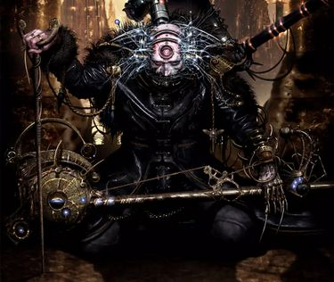

<!-- A0491-B0017 -->

原译文

Navigator with a cybernetic shutter uncovering his underdeveloped pineal eye 带着智控门的导航者露出了他低度开发的松果体之眼

**校订译文**

Navigator with a cybernetic shutter uncovering his underdeveloped pineal eye 装有机械启闭装置的导航员，露出发育不全的松果体之眼

<!-- /A0491-B0017 -->

<!-- A0491-B0018 -->
**英文原文**

Other quirks of the Navigators are a superior lifespan (even without juvenat treatments one can easily live up to around three or four hundred years) and the fact that no Navigator can be born a psyker (although classified as psykers in some instances, they can't possess any standard psionic gift, inherently lacking any psy rating).

<!-- /A0491-B0018 -->

<!-- A0491-B0019 -->

原译文

导航者的其他怪异是寿命更长（即使没有回春治疗，也很容易活到三四百岁左右），而且没有导航者天生就是灵能者（尽管在某些情况下被归类为灵能者，但他们不能拥有任何标准的灵能天赋，天生就缺乏任何灵能评级）。

**校订译文**

导航员还具有其他特殊之处：寿命远超常人，即使不接受回春治疗，也很容易活到三四百岁；此外，导航员不会同时天生拥有普通灵能者的能力。尽管有些分类将他们视为灵能者，他们并不具备常规灵能天赋，也没有对应的灵能评级。

<!-- /A0491-B0019 -->

<!-- A0491-B0020 -->
### Mutations 突变

<!-- /A0491-B0020 -->

<!-- A0491-B0021 -->
**英文原文**

Due to eugenics programs within the Navis Nobilite, which aim to create manifold strains of their genepool, with each house trying to perfect a unique aspect of their powers, the Navigators are plagued with further deformative mutations. Their constant Warp exposure increases the likelihood of additional activation of different parts of the Navigator genes, or even some Warp mutations themselves, causing deformations to a visage already estranged to that of a normal human. Each Navigator expresses at least a few of these mutations at birth, and members of the same house tend to share the same mutations as their kin. Some are still able to pass as humans when obscuring their forehead, some children still are absolutely devoid of any mutation, groomed by their elders to become the facade of the house in public relations, the Navis Scions, attracting fellow humans with their exotic beauty and regaling them with the tales of their adventures. When inevitably they acquire mutations, many strive for cosmetic surgery to mask their recent disfigurements. Although unlikely it isn’t out of the realm of possibility for a one individual to gather the majority of the mutative expressions of their genome. Those whose malformations have extended so severely are known to be kept secret by their houses, not revealed to the eyes of the public, sealed either in their luxurious estates or in exclusionary tabernacles aboard their ships.

<!-- /A0491-B0021 -->

<!-- A0491-B0022 -->

原译文

由于导航者宗族内部的优生学计划旨在创造其基因库的多种品系，每个家族都试图完善其能力的独特方面，导航者受到了进一步畸形突变的困扰。他们持续的亚空间暴露增加了导航者基因不同部分额外激活的可能性，甚至增加了一些亚空间突变本身的可能性，导致已经与正常人疏远的面部变形。每个导航者在出生时都至少表达了其中的一些突变，同一家族的成员往往与他们的血亲共享相同的突变。有些人在遮住额头时仍然能够冒充人类，有些孩子仍然完全没有任何突变，被长老培养成公共关系中家族的门面，即导航之裔，用他们的奇异的美丽吸引同胞，并用他们的冒险故事取悦他们。当他们不可避免地获得突变时，许多人会努力进行整容手术来掩盖他们最近的缺陷。尽管可能性不大，但一个人收集其基因组的大部分突变表达并非不可能。众所周知，那些畸形严重的人被他们的家族保密，不向公众透露，被密封在他们的豪华庄园或舰上的排斥性会堂里。

**校订译文**

导航员家族组织推行优生计划，试图培育出多种基因品系，各家族都想强化某一种独特能力。这也使导航员饱受额外的畸形突变困扰。长期接触亚空间，会提高导航员基因中其他部分被激活的概率，甚至直接诱发亚空间突变，使他们本已不同于常人的外貌进一步变形。每个导航员出生时通常就会表现出几种突变，同一家族的血亲往往具有相似特征。有些人只要遮住额头，就仍能以普通人的面貌示人；另一些孩子则完全没有其他突变，会被长辈培养成家族对外交往的门面，称为导航之裔。他们以异乎寻常的美貌吸引人类同胞，再用冒险故事博取好感。后来突变不可避免地出现时，许多人会寻求整容手术，掩饰新产生的畸形。虽然罕见，但一个导航员也可能表现出自身基因组中大多数突变特征。畸变如此严重的人会被家族秘密藏起来，隔绝公众的视线，独居于奢华庄园或舰上禁止他人进入的密室之中。

**校注：** 英文先称所有导航员出生时至少有数种突变，后又称部分孩子全无突变；后者暂理解为第三只眼以外的突变，仍需原出处核实。

<!-- /A0491-B0022 -->

<!-- A0491-B0023 图片 -->
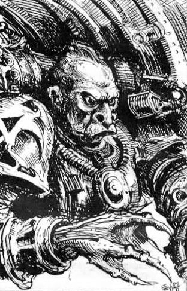

<!-- A0491-B0024 -->

原译文

A heavily mutated Navigator. Note the lack of Third Eye 一个严重变异的导航者。注意第三只眼的缺失

**校订译文**

A heavily mutated Navigator. Note the lack of Third Eye 一名严重变异的导航员，注意其第三只眼已经缺失

<!-- /A0491-B0024 -->

<!-- A0491-B0025 -->
**英文原文**

Among the mutations considered normal for a Navigator are:

<!-- /A0491-B0025 -->

<!-- A0491-B0026 -->

原译文

导航者正常的突变包括：

**校订译文**

被视为导航员正常特征的突变包括：

<!-- /A0491-B0026 -->

<!-- A0491-B0027 -->

原译文

additional joints allowing for natural contortionism 额外的关节允许自然扭曲

**校订译文**

additional joints allowing for natural contortionism 额外的关节使身体可以自然弯折

<!-- /A0491-B0027 -->

<!-- A0491-B0028 -->

原译文

extreme height 极度身高

**校订译文**

extreme height 身材异常高大

<!-- /A0491-B0028 -->

<!-- A0491-B0029 -->
**英文原文**

either unnaturally thin or uncomfortably bloated figure, sometimes creating a withered form of loosely hanging flesh

<!-- /A0491-B0029 -->

<!-- A0491-B0030 -->

原译文

要么是不自然的瘦，要么是令人不舒服的臃肿的身材，有时会形成一种松弛下垂的枯萎的肉体

**校订译文**

身形极度消瘦或臃肿得令人不适，有时呈现肌肉萎缩、皮肉松弛下垂的外貌。

<!-- /A0491-B0030 -->

<!-- A0491-B0031 -->

原译文

grotesquely pale skin 奇异的苍白皮肤

**校订译文**

grotesquely pale skin 皮肤呈病态的苍白色

<!-- /A0491-B0031 -->

<!-- A0491-B0032 -->

原译文

translucent skin 半透明皮肤

**校订译文**

translucent skin 半透明皮肤

<!-- /A0491-B0032 -->

<!-- A0491-B0033 -->

原译文

skin covered in scales 皮肤上覆盖着鳞片

**校订译文**

skin covered in scales 皮肤上覆盖着鳞片

<!-- /A0491-B0033 -->

<!-- A0491-B0034 -->

原译文

visage marbled with veins 布满纹理的面容

**校订译文**

visage marbled with veins 面部血管交织，宛如大理石纹路

<!-- /A0491-B0034 -->

<!-- A0491-B0035 -->

原译文

complete lack of body hair 体毛完全缺失

**校订译文**

complete lack of body hair 体毛完全缺失

<!-- /A0491-B0035 -->

<!-- A0491-B0036 -->
**英文原文**

all eyes becoming solid black shapes without an iris, allowing for increased vision in the dark

<!-- /A0491-B0036 -->

<!-- A0491-B0037 -->

原译文

所有眼睛都变成了没有虹膜的纯黑形状，可以在黑暗中提高视力

**校订译文**

所有眼睛都变成看不见虹膜的纯黑色，从而增强暗处视力。

<!-- /A0491-B0037 -->

<!-- A0491-B0038 -->
**英文原文**

enlarged eyes with diminutive other facial features

<!-- /A0491-B0038 -->

<!-- A0491-B0039 -->

原译文

眼睛增大，其他面部特征较小

**校订译文**

眼睛变大，其他五官则显得细小。

<!-- /A0491-B0039 -->

<!-- A0491-B0040 -->

原译文

enlarged ears 耳朵增大

**校订译文**

enlarged ears 耳朵增大

<!-- /A0491-B0040 -->

<!-- A0491-B0041 -->
**英文原文**

membranous growths stretching between limbs and/or digits (webbed hands and feet)

<!-- /A0491-B0041 -->

<!-- A0491-B0042 -->

原译文

四肢和/或手指之间延伸的膜状赘生物（有蹼的手和脚）

**校订译文**

四肢之间或指、趾之间长出膜状组织，形成蹼手、蹼足。

<!-- /A0491-B0042 -->

<!-- A0491-B0043 -->
**英文原文**

skin stretched to the point when a nose is nothing but a pair of slits, ears are but small holes, and eyes unable to blink

<!-- /A0491-B0043 -->

<!-- A0491-B0044 -->

原译文

皮肤被拉伸到鼻子只剩下一对裂缝，耳朵只剩下小孔，眼睛无法眨眼

**校订译文**

皮肤绷紧，鼻子只剩两道裂口，耳朵只剩小孔，眼睛无法眨动。

<!-- /A0491-B0044 -->

<!-- A0491-B0045 -->

原译文

bones of fingers grown and hardened to form talons 手指骨生长并硬化形成爪

**校订译文**

bones of fingers grown and hardened to form talons 指骨伸长、硬化，形成利爪

<!-- /A0491-B0045 -->

<!-- A0491-B0046 -->

原译文

thousand small teeth as sharp as needles 千颗如针般锋利的小齿

**校订译文**

thousand small teeth as sharp as needles 上千颗针般尖利的细小牙齿

<!-- /A0491-B0046 -->

<!-- A0491-B0047 -->

原译文

translucent white blood 半透明的白色血液

**校订译文**

translucent white blood 半透明的白色血液

<!-- /A0491-B0047 -->

<!-- A0491-B0048 -->

原译文

quickly knitting wounds and bone breaks 快速缝合伤口和骨折

**校订译文**

quickly knitting wounds and bone breaks 伤口与骨折迅速愈合

<!-- /A0491-B0048 -->

<!-- A0491-B0049 -->

原译文

movement with fluid and sinuous grace 流畅而优美的运动

**校订译文**

movement with fluid and sinuous grace 动作柔韧流畅、蜿蜒优雅

<!-- /A0491-B0049 -->

<!-- A0491-B0050 -->

原译文

prematurely aged appearance 过早外观衰老Across the aeons throughout the Age of Strife many Navigator houses perished, and for some time many theorised that a few rogue Navigators survived in some dark corner of the Galaxy. This hypothesis was confirmed in the most horrifying manner. It is true that among the stars some survived stranded from their kin; however, having been abused by their peers in eugenics programs unconcerned with their subjects' well-being, their offspring approached ferality, devoid of human mindset: Navigator Abominations. One notable individual of this kind was said to possess six atrophied limbs, sprouting from an elongated and grotesquely thin body, it had no mouth to speak of, nor any other facial features save its Warp eye, the last remnant of what allowed the witnesses to recognise it as a member of one of the strains of humanity, which was not even viewed as human among its people. Navis Nobilite policy to deal with those Abominations is a merciless purge.在纷争时代的漫长岁月里，许多导航者家族都消失了，有一段时间，许多人推测，一些离群导航者在银河系的某个黑暗角落幸存下来。这一假设以最可怕的方式得到了证实。的确，在群星中，有些幸存下来的被困在亲属身边；然而，由于在优生学项目中受到同辈的虐待，他们的后代变得野性十足，缺乏人类的思维方式：导航者憎恶。据说，这种著名的个体有六条萎缩的四肢，从细长而怪诞的瘦弱身体中长出来，它没有嘴巴，除了它的亚空间之眼，也没有其他任何面部特征，这是让目击者认出它是人类种族之一的最后残余，在人类中甚至不被视为人类。导航者宗族处理这些憎恶的政策是一场无情的净化。Paternova metamorphosis 星父蜕变Throughout their naturally long lives many Navigators never cease to grow in size, and when their ribs enlarge to allow for growth of internal gills, they become what is known as an Heir Apparent, separate from the patriarch or matriarch of their houses. Not all Navigators end up evolving to this degree, and few of the elders might not become Heirs. Heirs of different houses feel unshakeable disdain towards those of the different houses, actively assassinating each other before the next stage of their evolution kicks in. In both hierarchical and biological sense, alone above the entirety of the navigatorial nobility rules the Paternova, who is the ultimate form that the Navigator can take. While able to live for up to a thousand years he still is inexorably mortal, and upon his death throughout the Galaxy all Navigators feel their powers wane; at this point Heirs Apparent lose many of their normal brain functions, and while they grow even larger, with their gills somehow gaining an ability to breathe vacuum or any poison or water, they become feral beasts set on exterminating any and all other Heirs.在他们漫长的自然生命中，许多导航者的体型从未停止过增长，当他们的肋骨扩大以允许内部鳃生长时，他们就会成为所谓的继承人，与它们家族的族长或女族长分开。并非所有导航者最终都进化到这种程度，很少有长老可能不会成为继承人。不同家族的继承人对不同家族的人感到不可动摇的蔑视，在他们进化的下一阶段开始之前积极地互相暗杀。在等级制度和生理意义上，只有在整个导航者宗族之上，星父才是导航者可以达到的最终形态。虽然他能够活到一千年，但他仍然是不可避免的凡人，在他去世后，整个银河系的所有导航者都感到自己的力量在减弱；此时，继承人明显失去了许多正常的大脑功能，当它们长得更大时，它们的鳃不知何故获得了在真空或任何毒药或水中呼吸的能力，它们变成了野兽，开始消灭任何和所有其他继承人。With the last shreds of Humanity they are drawn to each another and then, devoid of those sentiments, start to fight among themselves. With each Heir dead, all others only increase in the extent of their transformation, until only one remains who, with his senses returned, is crowned the next Paternova, reinvigorating the shared powers of Navigators with the linking of his mind. During those elective periods of Paternovas, Navigators powers are impaired, and Warp journeys take longer. However obscure his role is, no one doubts the importance of Paternova for the Navigators' biology, described by them nebulously as the guiding father whose powers transcend the Warp itself.随着人性的最后一点碎片，他们被彼此吸引，然后，失去了这些情绪，开始相互争斗。随着每一位继承人的死亡，所有其他继承人的转变程度只会增加，直到只剩下一位，他的感官恢复，被加冕为下一位星父，通过思维连接重振导航者的共同力量。在星父的选择期，导航者的能力会受到损害，亚空间航行需要更长的时间。无论他的角色多么模糊，没有人怀疑星父对导航者生理的重要性，他们模糊地将星父描述为其力量超越亚空间本身的引导之父。In Society 在社会中Wider Imperial society generally shuns the abhumans within their midst. While it's true that many are able to find their niche outside the scornful gaze of common men, the Navigators alone enjoy not only acceptance (albeit often begrudged), but nigh universal wealth among the mutants of any kind. Many factions, political, commercial and private, strive to secure a deal with one of the noble houses of Navis Nobilite. Some are fortunate enough to enjoy complex bonds of honour, debts and patronage, like the Imperial Navy or naval aristocracies. Rogue Trader dynasties are often tied for generations to specific Navigator dynasties, creating lasting bonds of familiarity. Even if Warp travel is vaguely possible without Navigators, their contracts are often one of the most valuable commodities after the spaceship, and a few mercantile powers of Imperial Commercia are known to maintain relations with some Nobilite families.更广泛的帝国社会通常会避开他们中间的亚人。虽然许多人确实能够在普通人的轻蔑目光之外找到自己的位置，但只有导航者不仅得到了认可（尽管经常心怀嫉妒），而且在任何类型的变种人中都拥有近乎普遍的财富。许多政治、商业和私人派别都在努力与导航者宗族的贵族家族达成协议。有些人很幸运，可以享受复杂的荣誉、债务和赞助关系，比如帝国海军或海军贵族。行商浪人王朝往往世世代代与特定的导航者王朝联系在一起，形成了持久的熟悉关系。即使没有导航者，亚空间航行也几乎是可能的，但他们的合同往往是继宇宙飞船之后最有价值的商品之一，众所周知，帝国商业的一些商业力量与一些宗族家庭保持着关系。

**校订译文**

prematurely aged appearance 外貌过早衰老

Across the aeons throughout the Age of Strife many Navigator houses perished, and for some time many theorised that a few rogue Navigators survived in some dark corner of the Galaxy. This hypothesis was confirmed in the most horrifying manner. It is true that among the stars some survived stranded from their kin; however, having been abused by their peers in eugenics programs unconcerned with their subjects' well-being, their offspring approached ferality, devoid of human mindset: Navigator Abominations. One notable individual of this kind was said to possess six atrophied limbs, sprouting from an elongated and grotesquely thin body, it had no mouth to speak of, nor any other facial features save its Warp eye, the last remnant of what allowed the witnesses to recognise it as a member of one of the strains of humanity, which was not even viewed as human among its people. Navis Nobilite policy to deal with those Abominations is a merciless purge.

纷争时代漫长的岁月中，许多导航员家族消亡了。一度有人推测，少数失散的导航员仍在银河的阴暗角落幸存，这一猜想后来以极其骇人的方式得到证实。的确，有些导航员在星海中与血亲失散后存活下来；然而，他们遭同族用于完全不顾实验对象福祉的优生计划，后代逐渐野兽化，失去人类的思维，成为导航员憎恶体。其中一个著名个体据说有六条萎缩的肢体，从细长得骇人的躯干上伸出。它没有嘴，也没有其他五官，只剩一只亚空间之眼，让目击者勉强认出它曾属于人类的某个分支；就连它自己的族人，也已不再将它视为人类。导航员家族对这些憎恶体采取毫不留情的清除政策。

Paternova metamorphosis 最高族长蜕变

Throughout their naturally long lives many Navigators never cease to grow in size, and when their ribs enlarge to allow for growth of internal gills, they become what is known as an Heir Apparent, separate from the patriarch or matriarch of their houses. Not all Navigators end up evolving to this degree, and few of the elders might not become Heirs. Heirs of different houses feel unshakeable disdain towards those of the different houses, actively assassinating each other before the next stage of their evolution kicks in. In both hierarchical and biological sense, alone above the entirety of the navigatorial nobility rules the Paternova, who is the ultimate form that the Navigator can take. While able to live for up to a thousand years he still is inexorably mortal, and upon his death throughout the Galaxy all Navigators feel their powers wane; at this point Heirs Apparent lose many of their normal brain functions, and while they grow even larger, with their gills somehow gaining an ability to breathe vacuum or any poison or water, they become feral beasts set on exterminating any and all other Heirs.

许多导航员在漫长的自然寿命中，体形始终不断增长。当肋骨扩张，容纳体内长出的鳃时，他们便成为所谓的法定继承人；这一身份不同于各家族的男性或女性族长。并非所有导航员都会演化到这一步，有些年长者也可能始终不成为继承人。不同家族的法定继承人彼此怀有根深蒂固的蔑视，甚至在下一阶段蜕变开始前就积极谋杀对方。无论按组织地位还是生理形态，最高族长都凌驾于整个导航员贵族群体之上，是导航员能够达到的最终形态。他虽可活到一千岁，仍无法逃脱死亡。最高族长去世时，全银河的导航员都会感到力量衰退；法定继承人则失去许多正常脑功能，体形继续膨胀，鳃也不知为何获得了在真空、有毒环境或水中维持呼吸的能力。他们化作野兽，只求杀尽其他法定继承人。

With the last shreds of Humanity they are drawn to each another and then, devoid of those sentiments, start to fight among themselves. With each Heir dead, all others only increase in the extent of their transformation, until only one remains who, with his senses returned, is crowned the next Paternova, reinvigorating the shared powers of Navigators with the linking of his mind. During those elective periods of Paternovas, Navigators powers are impaired, and Warp journeys take longer. However obscure his role is, no one doubts the importance of Paternova for the Navigators' biology, described by them nebulously as the guiding father whose powers transcend the Warp itself.

残存的人性将他们引向彼此；随后，这最后的情感也消失了，他们开始厮杀。每死去一名继承人，其余人的蜕变便进一步加深，直到只剩一人。幸存者恢复理智，加冕为新的最高族长，并通过心灵连接重新增强所有导航员共享的力量。最高族长的遴选期间，导航员的能力受到削弱，亚空间航行因此更加耗时。无论其具体作用多么晦暗，没人怀疑最高族长在导航员生理体系中的重要性。他们以含混的说法称其为“指引之父”，宣称其力量超越亚空间本身。

In Society 社会地位

Wider Imperial society generally shuns the abhumans within their midst. While it's true that many are able to find their niche outside the scornful gaze of common men, the Navigators alone enjoy not only acceptance (albeit often begrudged), but nigh universal wealth among the mutants of any kind. Many factions, political, commercial and private, strive to secure a deal with one of the noble houses of Navis Nobilite. Some are fortunate enough to enjoy complex bonds of honour, debts and patronage, like the Imperial Navy or naval aristocracies. Rogue Trader dynasties are often tied for generations to specific Navigator dynasties, creating lasting bonds of familiarity. Even if Warp travel is vaguely possible without Navigators, their contracts are often one of the most valuable commodities after the spaceship, and a few mercantile powers of Imperial Commercia are known to maintain relations with some Nobilite families.

帝国社会普遍排斥亚人。许多亚人虽然能够在普通人的鄙视之外找到容身之处，但在各类变种人中，只有导航员不仅得到接纳——即使这种接纳往往十分勉强——还几乎普遍享有财富。政治、商业及私人势力无不设法与导航员贵族家族订立契约。有些势力幸运地与他们建立了由荣誉、债务和庇护交织而成的关系，例如帝国海军及海军贵族。行商浪人王朝也常与特定的导航员家系世代合作，结下长久交情。尽管没有导航员也勉强能够进行亚空间航行，导航员的服务契约仍往往是仅次于舰船本身的宝贵资产；帝国商务机构中的一些商贸势力也与导航员家族维持着联系。

**校注：** 原块混入多个英文、中文段落及标题。保留其中全部英文，只修订中文并恢复分段。stranded from their kin 应为与血亲失散，非被困在亲属身边。

<!-- /A0491-B0050 -->

<!-- A0491-B0051 图片 -->
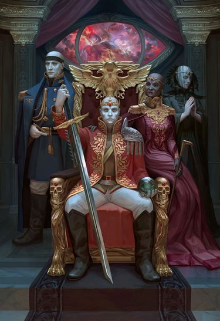

<!-- A0491-B0052 -->

原译文

Prominent Navigators of House Brobantis 布罗班蒂斯家族的著名导航者

**校订译文**

Prominent Navigators of House Brobantis 布罗班蒂斯家族的著名导航员

<!-- /A0491-B0052 -->

<!-- A0491-B0053 -->
**英文原文**

Due to their status as a mutant, many Navigators lead sheltered lives, which their high status can allow. While some commoners react with hostility to the presence of Navigators, others respond either with amusement or indifference. This uncertainty leads many Navigators to try to hide their nature from the public, and even if the Imperium might tolerate them, those who don't are found in every corner of Imperial space. Some Space Marine chapters such as Black Templars and Red Scorpions openly loathe contact with their Navigators; these intolerant groups would be directly opposed to the mutants' inclusion aboard their ships if it were not entirely necessary. This behaviour is exhibited even among common men of the Imperium, and while many Navigators get a perverse pleasure from strolling down the corridors of ships on which they serve, on other vessels Navigators seclude themselves to their private spires, choosing not to interact with others; there is at least one instance of Navigator being forced to do so by overtly xenophobic crew.

<!-- /A0491-B0053 -->

<!-- A0491-B0054 -->

原译文

由于他们是变种人，许多导航者过着受庇护的生活，这是他们的高地位所允许的。虽然一些平民对导航者的存在表现出敌意，但其他人的反应要么是娱乐，要么是漠不关心。这种不确定性导致许多导航者试图向公众隐瞒自己的本性，即使帝国可能容忍他们，那些不容忍他们的人也会出现在帝国空域的每个角落。一些星际战士战团，如黑色圣堂和红蝎，公开讨厌与他们的导航者接触；如果不是完全必要的话，这些不宽容的群体将直接反对将变种人纳入他们的船上。这种行为甚至在帝国的普通人中也有所表现，虽然许多导航者在他们所服务的船只走廊上漫步时获得了一种反常的快乐，但在其他战舰上，导航者将自己隔离在私人尖塔上，选择不与他人互动；至少有一次，导航者被公然仇外的船员强迫这样做。

**校订译文**

由于变种人的身份，许多导航员选择与外界保持距离，其显赫地位也使这种生活成为可能。平民见到他们时，有人抱以敌意，有人觉得新奇可笑，也有人毫不在意。无法预料的反应，使许多导航员试图隐瞒自己的真实身份。即使帝国容忍他们，帝国疆域内也处处都有不肯接纳他们的人。黑色圣堂、红蝎等星际战士战团公然厌恶与导航员接触；如果不是不可或缺，他们根本不会容许变种人登上自己的舰船。帝国普通人中也存在这种态度。有些导航员偏偏喜欢在任职舰船的走廊里闲逛，从中获得一种怪异的乐趣；另一些舰上的导航员则退居私人尖塔，不与旁人往来。至少有一名导航员，是被公开排斥异己的船员强迫隔离的。

<!-- /A0491-B0054 -->

<!-- A0491-B0055 -->
**英文原文**

Notwithstanding the stigma of the mutant, the protégés of noble houses called Navis Scions revel in attention, as it is their trade to be an approachable face of their lineage, and by truth or lie to improve the social connections with Imperial society, though often restricted to its higher echelons, with the intent of gaining reputation and thus more wealthy and influential clientele. In legal matters the whole Nobilite relies on the protection of the Paternova whose word is held in high esteem, often against that of any member of the Holy Orders of the Inquisition. As long as the Paternova does not brand a Navigator or their whole house as renegades, they may feel as safe as any high ranking noble within the Imperium can. While many Inquisitors hesitate to persecute even a single Navigator, some more radical Inquisitors or Ministorum members in their zeal to eradicate the heretic, the mutant and the witch are known to indiscriminately exterminate even those most vital to the workings of the Imperium. Nonetheless, even if the ship's captain is found guilty of treason against the Emperor, the Navigator is granted immunity from any capital punishment that will be incurred on the rest of the crew in their shared guilt.

<!-- /A0491-B0055 -->

<!-- A0491-B0056 -->

原译文

尽管变种人被污名化，但被称为导航之裔的贵族家族的门徒却沉迷于关注，因为他们的职业是成为自己血统的平易近人的面孔，通过真理或谎言来改善与帝国社会的社会联系，尽管通常仅限于其高层，目的是获得声誉，从而获得更富有和有影响力的客户。在法律事务中，整个宗族都依赖于星父的保护，星父的话受到高度尊重，通常反对审判庭神圣修会任何成员的话。只要星父不将导航者或他们的整个家族标记为叛徒，他们可能会像帝国中的任何高级贵族一样感到安全。虽然许多审判官对迫害哪怕一个导航者都犹豫不决，但一些更激进的审判官或教会成员在根除异端、变种人和女巫的热情中，甚至会不加选择地消灭那些对帝国运作最重要的人。尽管如此，即使船长被判犯有叛国罪，导航者也可以免于其他船员因共同罪行而遭受的任何死刑。

**校订译文**

尽管背负变种人的污名，被称为导航之裔的家族后辈却乐于受到关注。他们的职责就是以亲切易近的形象代表自己的家系，借助实话或谎言改善家族与帝国社会的关系——通常是与上层社会的关系——以提高声望，争取更富有、更有影响力的客户。在法律事务中，整个导航员家族组织都依靠最高族长庇护。其言辞分量极重，往往足以抗衡神圣审判庭成员的意见。只要最高族长没有宣布某名导航员或其整个家族为叛逆，他们就能享有与帝国高级贵族相近的安全保障。许多审判官甚至不愿轻易追究一名导航员，但一些更激进的审判官或国教会成员，在根除异端、变种人和巫者的狂热中，也会不加区别地杀死这些维系帝国运作的关键人物。不过，即使舰长被判背叛帝皇，其他船员也因连坐而获死罪，导航员通常仍可免受这种死刑。

<!-- /A0491-B0056 -->

<!-- A0491-B0057 -->
**英文原文**

Aboard spaceships, while the crew might have their varied sentiments towards the mutant at the helm, including officers the captain however often keeps amiable terms with the Navigator. Whether out of necessity or genuine trust, the Navigator is recognisable as one of the most important and staunchly loyal persons on board, often nicknamed the captain's right hand. Thanks to their importance towards faster-than-light travel many mutinies have been made null due to Navigator's unwillingness to cooperate with the mutineers. There have been instances of the Navigators instigating rebellions or even taking over the ships in question, though these are rare and managed internally by the edict of the Paternova, lest it mar the Nobilite's general reputation. Due to the Navigators' economic autonomy it is not on the whole wise for a captain to fall out of favour with them, since at any given moment they may relinquish their contract and just decide to abandon the post at the nearest rendezvous with a point of transit, essentially stranding the crew until another Navigator can be recruited.

<!-- /A0491-B0057 -->

<!-- A0491-B0058 -->

原译文

在宇宙飞船上，虽然船员们可能对掌舵的变种人有不同的看法，包括军官，但船长经常与导航者保持友好的关系。无论是出于必要还是出于真正的信任，导航者都是船上最重要、最忠诚的人之一，通常被称为船长的右手。由于他们对超光速航行的重要性，许多叛乱因导航者不愿意与叛乱者合作而被取消。曾经有过导航者煽动叛乱甚至接管相关船只的情况，尽管这种情况很少见，并且由星父的命令在内部进行管理，以免损害宗族的整体声誉。由于导航者的经济自主权，一位不受他们欢迎的船长总的来说是不明智的，因为在任何时候，他们都可能放弃契约，只是决定在最近的汇合点放弃岗位，基本上是让船员滞留，直到可以招募到另一名导航者。

**校订译文**

在舰船上，船员乃至军官可能对掌握航向的变种人态度各异，但舰长通常会与导航员保持良好关系。无论出于现实需要还是真诚的信任，导航员往往都是舰上最重要、最忠诚的人物之一，常被称为舰长的左膀右臂。他们对超光速航行至关重要，因此许多兵变仅因导航员拒绝合作便告失败。也曾有导航员煽动叛乱，甚至夺取舰船的事例，不过十分罕见；最高族长会下令在内部处理，以免损害整个组织的声誉。导航员具有经济自主权，舰长与他们交恶通常并不明智。他们可能随时解除契约，在下一处停靠或转运地点离舰，使舰船滞留，直至船员找到另一位导航员。

<!-- /A0491-B0058 -->

<!-- A0491-B0059 图片 -->
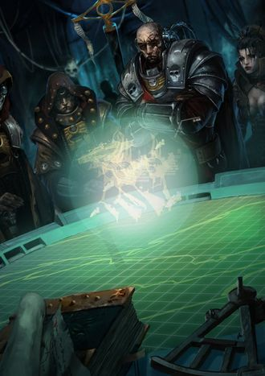

<!-- A0491-B0060 -->

原译文

Navigator alongside the captain and his other officers 导航者与船长和其他军官一起

**校订译文**

Navigator alongside the captain and his other officers 与舰长及其他军官在一起的导航员

<!-- /A0491-B0060 -->

<!-- A0491-B0061 -->
**英文原文**

As a polity Navis Nobilite is a highly influential faction, which is known for patronage of both persons and projects, mostly concerned with matters of explorations and settling or re-establishing footholds of interstellar routes, funding expeditions to unknown space, bringing colonies back into the Imperial fold, quelling rebellions in Imperial systems with their private armies. While each house acts as its own separate entity, they all are legally obliged to have an agreement of Paternova to back their decisions up, although this only comes to question when the consensus of allowed actions is broken, which might end up with the transgressing project being well in motion before Paternova relays their decision. One such enterprise of the expedition out to Canis Major dwarf galaxy was considered insane by most of the other unaffiliated houses, however when Paternova dictated their edict the fleet was already outside communicative range, and whether their plan to establish a micro-empire in the alien galaxy ended in success or failure is investigated only by the members of the misbehaving house. On the other hand, Navis Nobilite keeps both their secrets and their monopoly on space travel with absolute ruthlessness; it can ruin the career of an aspiring Rogue Trader or even cast their whole noble house into the abyss of history if they were found to be in possession of one of secrets of the Navigator houses, among them the knowledge of lineages, breeding programmes and prominent Novators. One is unlikely to stumble upon this knowledge accidentally, as Navigator houses don't speak in gothic among themselves, instead cultivating among themselves unique dialects of forgotten antiquity, and if somehow one was even to glance upon their mapping system they'd be confused with methodologies utterly alien from Imperial ones, along with divisions of space diverging from classical subsectors, mapped and named only in accordance with their own hermetic systems. Similarly, Nobilite has their eye out for any technology or method of travel that might threaten to encroach on their monopoly; many are outlawed due either to a technical violation of Imperial laws or simply as a favour from the Administratum. Those that they aren't able to outlaw they often aggressively buy out, and people who acquire any of those items bring upon themselves the ire of Nobilite.

<!-- /A0491-B0061 -->

<!-- A0491-B0062 -->

原译文

作为一个政治组织，导航者宗族是一个极具影响力的派系，以赞助个人和项目而闻名，主要关注探索和定居或重建星际路线的立足点，资助未知空域的探索，将殖民地带回帝国，用私人军队平息帝国星系中的叛乱。虽然每个家族都是自己的单独实体，但他们都有法律义务得到星父的同意来支持他们的决定，尽管这只有在允许的行动共识被打破时才会受到质疑，这可能会导致违规项目在星父转达他们的决定之前顺利进行。大多数其他独立的家族都认为，前往大犬座矮星系的探险这样的事业是疯狂的，然而，当星父下达命令时，舰队已经超出了通信范围，他们在异星系建立微型帝国的计划是成功还是失败，只有行为不端的家族成员才会被调查。另一方面，导航者宗族以绝对无情的方式保守着他们的秘密和对太空航行的垄断；如果发现一个有抱负的行商浪人掌握着导航者家族的秘密之一，其中包括血统知识、生育计划和重要的星长，这可能会毁掉他们的职业生涯，甚至将他们的整个贵族家族扔进历史的深渊。人们不太可能偶然发现这一知识，因为导航者家族之间不会用哥特语交谈，而是在他们之间培养被遗忘的古代独特方言，如果以某种方式看一眼他们的测绘系统，他们会被与帝国完全不同的方法所混淆，以及与经典分区不同的空间划分，这些空间划分只能根据他们自己的隐秘系统进行测绘和命名。同样，宗族也密切关注任何可能侵犯其垄断地位的技术或航行方式；许多被宣布为非法，要么是因为技术上违反了帝国法律，要么只是因为内务部的恩惠。那些他们无法取缔的东西，他们经常积极收购，而获得任何这些东西的人都会招致宗族的愤怒。

**校订译文**

作为一个政治组织，导航员家族势力庞大，常常资助个人和各类项目，尤其关注探索、殖民以及建立或恢复星际航线沿途据点。他们会出资探索未知星域，使失联殖民地重新归附帝国，也会动用私军镇压帝国星系的叛乱。各家族虽然独立行事，但依法都应取得最高族长对其决策的许可。不过，通常只有行动逾越了公认界限，这项要求才会被追究；最高族长作出裁定时，违规项目往往已经展开。一场前往大犬座矮星系的远征便是如此。多数未参与的家族都认为这一计划疯狂至极，但最高族长下达敕令时，远征舰队已驶出通信范围。它们试图在异域星系建立一个小型帝国，最终成败如何，只有涉事家族的成员在调查。另一方面，导航员家族会以毫不留情的手段保护自身秘密和星际航行垄断。如果某位雄心勃勃的行商浪人被发现掌握了家族的血统、繁育计划或重要星长等秘密，其事业可能就此毁灭，甚至整个贵族家族都会被扫入历史。外人很难偶然获知这些事情：导航员家族彼此不用哥特语交谈，而是维持着源自久远年代的独特方言。即使看到他们的星图，也会因完全不同于帝国的制图方法而无从理解；他们不按常见的次星区划分空间，而依据家族内部的隐秘体系绘图、命名。导航员家族也密切监视任何可能威胁其垄断的技术和航行方法。许多技术会因在法律细节上触犯帝国规定，或仅仅因为内政部有意卖个人情而遭到禁止。无法取缔的技术，他们往往会设法强行收购；任何获得这类东西的人，都可能招致家族的怒火。

<!-- /A0491-B0062 -->

<!-- A0491-B0063 -->
**英文原文**

Each member of Navis Nobilite debates conditions of their contract with the fleets' owners on their own, there is no standard agreement, only that the employer grants a set share of whatever profits they come to earn in their enterprises towards the Navigator's house, with the Navigator's own additional stipulations. The most deserving Navigators might be given a Free Charter, able to lease their services with utter accordance to their own free will. The loyalty of Navigators to the Imperium is well noted, and it is no surprise how few rogue naval powers there exist, if only due to it boiling down to the matter of the coin. While loyal to the Imperium, their individual employers aren't always a subject of utmost fidelity, some houses choosing to employ their members as spies who'd pick up anything that might allow Nobilite any leverage within further deals. However, there are many houses that either fall into relative poverty or out of favour of Paternova, essentially blacklisting them to any available employers. The so-called Shrouded or Beggar houses are forced to the brinks of the known galaxy, where they develop a special sly and opportunistic outlook, that forces them towards less than legal compacts with shadier individuals. Renegade houses, even if they didn't start with contempt towards their extended kin, mostly become bitter towards the society that pushed them out. Casting aside their prior allegiances and restrictions of Imperial dogma, they fully devote their services to whatever power of discord, criminal or heretical is the highest bidder.

<!-- /A0491-B0063 -->

<!-- A0491-B0064 -->

原译文

导航者宗族的每个成员都会自己舰队的所有者讨论合同条件，没有标准协议，只有雇主将他们在事业中赚取的任何利润的一部分捐给导航者家族，并附有导航者自己的附加合同。最值得的导航者可能会获得一份自由宪章，能够完全按照自己的自由意志租用他们的服务。导航者对帝国的忠诚是众所周知的，如果仅仅因为硬币的问题，那么离群海军力量的存在是多么的少也就不足为奇了。虽然忠于帝国，但他们的个人雇主并不总是最忠诚的对象，一些家族选择使用他们的成员作为间谍，他们会收集任何可能让宗族在进一步交易中发挥任何影响力的东西。然而，有许多家族要么陷入相对贫困，要么不受星父的青睐，基本上是将他们列入任何可用雇主的黑名单。所谓的寿衣或乞丐家族被迫进入已知星系的边缘，在那里他们形成了一种特殊的狡猾和机会主义的观点，迫使他们与更阴暗的人达成不合法的契约。叛逆家族，即使他们一开始没有蔑视他们的血亲，大多也会对把他们赶出去的社会感到痛苦。抛开他们之前的忠诚和帝国教条的限制，他们全心全意地为任何出价最高的不协、犯罪或异端势力服务。

**校订译文**

导航员家族的每位成员都会自行与舰队所有者商谈契约，没有统一的标准条款。共同的原则只是：雇主须将经营收益中约定的份额支付给导航员所属家族，再满足导航员本人提出的附加条件。功绩最卓著的导航员可能获赐自由特许状，完全自主地选择为谁提供有偿服务。导航员对帝国的忠诚广为人知；即使只考虑经济因素，也就不难理解为何脱离帝国的海上武装势力如此之少。不过，效忠帝国并不意味着导航员对每一位雇主都绝对忠诚。有些家族会让成员充当间谍，搜集一切能为日后谈判增加筹码的情报。也有许多家族陷入相对贫困，或失去最高族长的支持，几乎被所有潜在雇主列入黑名单。所谓的寿衣家族或乞丐家族被迫流落到已知银河的边缘，逐渐养成狡黠、投机的处世方式，与身份可疑的人订立不完全合法的契约。叛逆家族即使最初并不仇视其他血亲，往往也会怨恨将自己排斥在外的社会。他们抛弃旧日效忠关系和帝国教条的约束，不论出价者是叛乱、犯罪还是异端势力，只要报酬最高便为其效命。

<!-- /A0491-B0064 -->

<!-- A0491-B0065 图片 -->
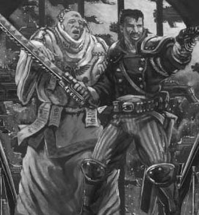

<!-- A0491-B0066 -->

原译文

Navigator participating in an on-board skirmish 导航者参与船上冲突

**校订译文**

Navigator participating in an on-board skirmish 参与舰上战斗的导航员

<!-- /A0491-B0066 -->

<!-- A0491-B0067 -->
### Chaos Navigators 混沌导航员

原题：Chaos Navigators 混沌导航者

<!-- /A0491-B0067 -->

<!-- A0491-B0068 -->
**英文原文**

"My right eye offended me, so I plucked it out. My left eye deceived me, so I cast it into the void. My Third Eye remains. With it I see an immaculate light greater than the faltering Astronomican!"– Kokabiel Grigoris, rogue Navigator and Ipsissimus of the Cyclopean Congregation

<!-- /A0491-B0068 -->

<!-- A0491-B0069 -->

原译文

“我的右眼冒犯了我，所以我把它拔了出来。我的左眼欺骗了我，于是我把它扔进了虚空。我的第三只眼仍然存在。有了它，我看到了比衰弱的星炬更纯洁的光！” —科卡比尔·格里戈里斯，离群导航者和独眼教会的自己自身者

**校订译文**

“我的右眼冒犯了我，我便将它剜出。我的左眼欺骗了我，我便将它投入虚空。我的第三只眼仍在。透过它，我看见无瑕的光芒，远胜摇曳衰弱的星炬！”——科卡比尔·格里戈里斯，叛离的导航员、独眼教会的至高自我者（Ipsissimus）

**校注：** Ipsissimus 是神秘学职阶，原译“自己自身者”不通，暂译“至高自我者”并保留英文待核。

<!-- /A0491-B0069 -->

<!-- A0491-B0070 -->
**英文原文**

Many Chaos-affiliated fleets and corsairs continue to use Navigators in order to circumnavigate the Warp. This leads them to actively seek out and enslave Imperial Navigators wherever they may be found. Other Navigators in the service of Chaos have been driven mad and heavily mutated but nonetheless willingly serve their masters. Other Chaos fleets, particularly those closely linked with the Gods of Chaos will forego Navigators and instead utilize Sorcerers and Daemons to navigate the Warp.

<!-- /A0491-B0070 -->

<!-- A0491-B0071 -->

原译文

许多隶属于混沌的舰队和海盗继续使用导航者来环航亚空间。这导致他们积极寻找并奴役帝国导航者，无论他们在哪里。其他为混沌服务的导航者已经发疯并严重变异，但仍然愿意为他们的主人服务。其他混沌舰队，特别是那些与混沌诸神关系密切的舰队，将放弃导航者，而是利用巫师和恶魔来导航亚空间。

**校订译文**

许多依附混沌的舰队和海盗仍依靠导航员穿越亚空间，因此会四处搜寻并奴役帝国导航员。另一些效力于混沌的导航员则已陷入疯狂、严重变异，却仍自愿侍奉主人。还有一些混沌舰队，尤其是与混沌诸神联系紧密的舰队，会舍弃导航员，改用巫师和恶魔引导航行。

<!-- /A0491-B0071 -->

<!-- A0491-B0072 -->
## Abilities 能力

<!-- /A0491-B0072 -->

<!-- A0491-B0073 -->
**英文原文**

In stark contrast to psykers who release immaterial energies into realspace, Navigators, although in possession of certain powers, are chiefly limited in their influence on reality to wherever their third eye can aim its sight. Those few powers visible outside the Warp emerge from their superb and more innate control of the empyrean energies within this alien dimension, than any of the most talented and the most learned psykers of realspace could muster. While the psyker primarily enforces their will on reality, the Navigator does so on unreality, able to not only see this horrific dimension in its truest state, but also make its currents obey their will, slightly altering them to their and their allies' favour. However, oftentimes a Navigator's soul is not distinguished from a psyker's by daemonkind, shining brightly into the Immaterium, inviting them in. Additionally any limiters of Warp powers also hamper the abilities of Navigators, for example Drukhari technology that restrains all psychic abilities, also blocks any of the abilities of the Third Eye.

<!-- /A0491-B0073 -->

<!-- A0491-B0074 -->

原译文

与将非物质能量释放到现实空间的灵能者形成鲜明对比的是，导航者虽然拥有某些力量，但他们对现实的影响主要局限于他们的第三只眼可以瞄准的任何地方。在亚空间之外可见的少数力量来自他们对这个异维度内的超高和更先天的对至高天能量的控制，超过现实空间中任何最有才华、最有学识的灵能者所能聚集的。虽然灵能者主要在现实中执行他们的意志，但导航者在非现实中这样做，他们不仅能够看到这个可怕的维度的真实状态，而且能够使其潮流服从他们的意愿，稍微改变他们和他们的盟友的利益。然而，通常导航者的灵魂与灵能者的灵魂并没有被恶魔区分开来，它们会明亮地照射到非物质界，邀请他们进入。此外，任何对亚空间能力的限制也会阻碍导航者的能力，例如限制所有灵能能力的杜鲁卡里技术，也会阻止第三只眼的任何能力。

**校订译文**

灵能者将非物质能量释放到现实空间，而导航员虽然也掌握超常力量，对现实的影响却主要局限于第三只眼的视线范围。那些在亚空间之外也能显现的能力，源于他们对这个异质维度中至高天能量的精妙、本能的掌控，连现实空间中天赋最高、学识最渊博的灵能者也难以企及。灵能者主要将意志施加于现实，导航员则将意志施加于非现实：他们不但能看见这个恐怖维度的真实面貌，也能使其中的潮流服从意志，作出有利于自己和同伴的微小改变。不过，在恶魔眼中，导航员的灵魂往往与灵能者无异，同样在非物质界中明亮闪耀，引来恶魔觊觎。此外，压制亚空间力量的手段也会阻碍导航员。例如，黑暗灵族用于封锁一切灵能的技术，同样能封锁第三只眼的能力。

<!-- /A0491-B0074 -->

<!-- A0491-B0075 -->
**英文原文**

While the most of these abilities must be learned and honed, they derive from the Navigator's innate gift, and their use incurs no peril, unlike the abilities of psykers. All Navigators no matter their talent and education possess both a power to sense psychic phenomena alongside the most basic and the most lethal of the powers unleashed from their eye, the so-called Lidless Stare.

<!-- /A0491-B0075 -->

<!-- A0491-B0076 -->

原译文

虽然这些能力中的大多数都必须学习和磨练，但它们来自导航者的天赋，与灵能者的能力不同，使用它们不会带来任何危险。所有导航者，无论他们的天赋和受教育程度如何，都拥有感知灵能现象的能力，以及从他们的眼睛中释放出来的最基本、最致命的能力，即所谓的无面凝视。

**校订译文**

这些能力大多需要学习和磨练，但都源于导航员的先天天赋。按本段的说法，使用它们不会像灵能者施展能力那样引发危险。不论天赋高低、受教育程度如何，每个导航员都能感知灵能现象，并以第三只眼释放最基本、也最致命的力量——无睑凝视。

**校注：** 原文称使用能力无危险，但后文说明某些能力会伤害导航员；这里按原文保留，只限于与普通灵能能力作比较，不能理解为后文所有能力绝对安全。

<!-- /A0491-B0076 -->

<!-- A0491-B0077 图片 -->
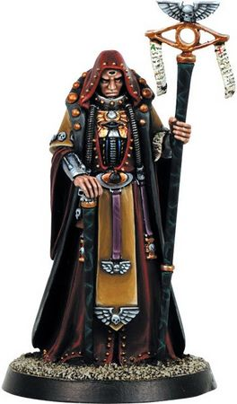

<!-- A0491-B0078 -->

原译文

Navigator from Inquisitor 来自《审判官》的导航者

**校订译文**

Navigator from Inquisitor 来自《审判官》的导航员

<!-- /A0491-B0078 -->

<!-- A0491-B0079 -->
### Warp Sense 亚空间感知

<!-- /A0491-B0079 -->

<!-- A0491-B0080 -->
**英文原文**

Many psykers are endowed with sensibilities towards their direct surroundings, able to discern Warp signatures of other people on whose souls they cast their gaze. The Navigators are also able to delve into their peers' minds, detecting irregularities both correlating with their innate peculiarities and those of the chaotic origin. So can they see the tracks left in the Materium of portent psychic use, able to see ephemeral remnants of psykers' and daemons' tamperings, allowing them to track such individuals and discern their position, sometimes even sensing ancient events that leave only faint empathic echoes of the people who once present in that location. However, even without observing the Warp directly, Navigators can uniquely sense stellar and immaterial phenomena within light years of their surroundings. Accurately sensing any Warp instability, especially approaching Warp Storms, they are acutely aware of any ship translating in or out the Immaterium in a given radius, detecting battles that take place in the empyrean, and foreseeing approaching dangers to themselves. In the void they can sense hidden threats, concealed ships, void creatures and minefields or more mundane obstacles like asteroids or space debris. Warp-seers employed by Navis Nobilite are tasked with investigation of any of those anomalous warp events noticed by their star-faring masters.

<!-- /A0491-B0080 -->

<!-- A0491-B0081 -->

原译文

许多灵能者被赋予了对周围环境的敏感性，能够分辨出他们凝视的其他人的亚空间特征。导航者还能够深入研究同伴的思想，发现与他们天生的特性和混沌起源相关的异常。因此，他们可以看到在预示灵能使用的物质中留下的痕迹，能够看到灵能者和恶魔干预的短暂残余，使他们能够追踪这些人并辨别他们的位置，有时甚至能感觉到古代事件，这些事件只留下曾经出现在那个地方的人的微弱共鸣。然而，即使不直接观察亚空间，导航者也能在周围光年内独特地感知恒星和非物质界现象。他们准确地感知到任何亚空间不稳定，尤其是接近亚空间风暴，他们敏锐地意识到任何船只在给定半径内驶入或驶出非物质界，探测到在至高天中发生的战斗，并预见到自己即将面临的危险。在虚空中，他们可以感知到隐藏的威胁、隐藏的船只、虚空生物和雷区，或者小行星或太空碎片等更平凡的障碍物。导航者宗族使用的亚空间观察者的任务是调查他们的星航大师发现的任何异常亚空间事件。

**校订译文**

许多灵能者能敏锐地感知周围环境，注视他人的灵魂时，可以辨认其亚空间特征。导航员同样能够探察他人的心智，发现源于天生特质或混沌影响的异常。他们也能看见强大灵能在物质界留下的痕迹：灵能者和恶魔活动的短暂残影可供追踪、定位，有时甚至能感知古老事件，仅凭当年在场者留下的微弱情感回响。即使不直接观察亚空间，导航员也能感知周围数光年内的恒星和非物质界现象。他们能准确察觉亚空间的异常波动，尤其是逼近的亚空间风暴，也能敏锐地感知一定范围内舰船进出亚空间的活动、至高天中的战斗，以及向自己逼近的危险。在虚空中，他们可以察觉隐藏的威胁、隐蔽舰船、虚空生物、雷区，以及小行星和太空碎片等寻常障碍。导航员家族雇用的亚空间观察者，则负责调查这些星际旅行者所发现的异常亚空间事件。

<!-- /A0491-B0081 -->

<!-- A0491-B0082 -->
### Warp Navigation 亚空间导航

<!-- /A0491-B0082 -->

<!-- A0491-B0083 -->
**英文原文**

The main defining characteristic of Navigators is their famed ability to pilot ships in the Immaterium, it is done so with the use of their third eye. After the gate within is opened, the Navigator is able to see the Warp as it is in reality, albeit with their mind providing a comprehensive allegory to the incomprehensible. Still, the more the Navigator spends in the warp, the allegorical view fades, and the true reality of it starts to settle, nonetheless never fully allowing for comprehension of its whole nature. The most often used approximation reported (though not limited to) boils down to that of steering a marine ship on an ocean, thus inviting a common use of various marine terms to explain Warp phenomena encountered. The ability to steer in this sea takes years to develop, observing their elder siblings or parents while they pilot the ship.

<!-- /A0491-B0083 -->

<!-- A0491-B0084 -->

原译文

导航者的主要特征是他们著名的在非物质界驾驶船只的能力，这是通过他们的第三只眼来实现的。在内部之门打开后，导航者能够看到亚空间的真实，尽管他们的头脑为不可理解的事物提供了一个全面的寓言。尽管如此，导航者在亚空间中花费的时间越多，寓言视角就越淡，他的真实也就开始稳定下来，尽管如此，他永远无法完全理解其全部性质。报告中最常用的近似（但不限于）归结为在海洋上操纵海船，因此需要使用各种海上术语来解释遇到的亚空间现象。在这片海洋中驾驶的能力需要数年时间才能发展，在他们驾驶船只时观察他们的长兄/姐或父母。

**校订译文**

导航员最具代表性的本领，是凭借第三只眼引导舰船穿越非物质界。眼中的门户打开后，他们能看到亚空间的真实面貌，不过大脑会以可理解的比喻，转述原本不可理解的景象。导航员在亚空间停留越久，这层比喻性的图景就越淡，真实面貌逐渐浮现；即便如此，他们也永远无法完全理解亚空间的本质。最常见的一种感受，是仿佛驾驶海船航行于大洋之上，因此导航员常借用航海术语描述各种亚空间现象。要学会在这片海洋中掌舵，必须花上多年，观察父母或年长手足如何引导舰船。

<!-- /A0491-B0084 -->

<!-- A0491-B0085 图片 -->
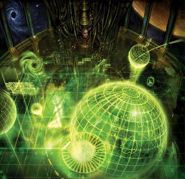

<!-- A0491-B0086 -->

原译文

Navigator consulting a map 导航者查看地图

**校订译文**

Navigator consulting a map 导航员查看地图

<!-- /A0491-B0086 -->

<!-- A0491-B0087 -->
**英文原文**

No sane Navigator is ever bold enough to claim that any Warp travel is safe, even if they spend decades without an incident, thus they also spend much time to be assured of their survival beforehand. They first peer into the void to look for imminent threats, create prognostic temporal deviance of their travels' estimated passage and employ often occult rituals of divination, syncretic to their house or even the person. Those might boil down to reading of the runically emblazoned bones, entering a trance state with a servitor recording their rambled prophecy or reading entrails of specific animals. When all is found satisfying to Navigator's precautions, they excuse any non-Navigatorial staff that might be present in their seclusion, leaving around only younger members of their family for them to learn their craft. Then they begin a process of entering a trance like state, and melding with a machine spirit of the ship. When meld is finished the Navigator sends through the cogitators an order to raise the Gellar Field to entomb the whole ship, excluding their chamber. This signalizes the ships captain that he might start the process of translation into the Warp. Having entered the Empyrean, it floods through the Navigators' bridge, allowing them to become active part of their unreality. The elder one at the helm is left with the sole command of the ship, since only they can now be fully aware of their surroundings and react appropriately. They open their eye, and they see their truth of the Warp. Of note is there is no need to lift their circlets obscuring the Eye, as for its warp-sight it is not in any form an obstacle.

<!-- /A0491-B0087 -->

<!-- A0491-B0088 -->

原译文

没有一个理智的导航者会大胆地声称任何亚空间航行都是安全的，即使他们花了几十年的时间没有发生任何事故，因此他们也会花很多时间提前确保自己的生存。他们首先窥探虚空，寻找迫在眉睫的威胁，对他们的航行估计的路程造成预测性的时间偏差，并经常使用神秘的占卜仪式，与他们的家族甚至个人融合。这些可能归结为阅读印有符文的骨头，进入恍惚状态，机仆记录他们漫无边际的预言，或阅读特定动物的内脏。当所有人都对导航者的预防措施感到满意时，他们会原谅任何可能出现在他们隐居处的非导航者，只留下年轻的家人让他们学习他们的技艺。然后，他们开始进入恍惚状态，并与飞船的机魂融合。当融合完成时，领航员通过沉思者发出命令，升起盖勒力场，覆盖整艘船，不包括他们的房间。这向船长发出信号，表示他可能会开始传送到亚空间。进入至高天后，它淹没了导航者的剑桥，让他们成为他们虚幻世界的积极组成部分。掌舵的长老独自指挥这艘船，因为只有他们现在才能充分意识到周围的环境并做出适当的反应。他们睁开眼睛，看到了亚空间的真实。值得注意的是，没有必要抬起遮挡眼睛的头环，因为它的亚空间视线在任何形式上都不受阻碍。

**校订译文**

即使数十年未曾出事，任何理智的导航员都不会声称亚空间航行绝对安全。他们会花费大量时间作行前准备，以提高生还的把握：首先窥视虚空，搜寻迫近的威胁，估计航行耗时可能出现的时间偏差，再举行家族传统或个人独创的神秘占卜仪式。这可能包括解读刻有符文的骨头、进入恍惚状态并让机仆记录喃喃预言，或检查特定动物的内脏。确认各项准备妥当后，导航员会请所有非导航员人员离开自己的专用舱室，只留下家族年轻成员观摩学习。随后，他们进入恍惚般的状态，与舰船的机魂融合。融合完成后，导航员通过沉思者下令展开盖勒力场，包裹除自身舱室之外的整艘舰船。这也是通知舰长可以开始跃入亚空间的信号。舰船进入至高天后，亚空间涌入导航员舰桥，使他们成为这片非现实环境中的参与者。掌舵的年长导航员此时独自指挥舰船，因为只有他能充分感知周围环境并作出正确反应。他睁开第三只眼，看见自己所感知的亚空间真相。遮眼的头环无须取下，因为它并不妨碍亚空间视力。

**校注：** 原文明确盖勒力场不覆盖导航员舱室，并让亚空间涌入其舰桥；此处忠实保留来源说法，不以其他版本的防护设定替换。bridge 是舰桥，非剑桥。

<!-- /A0491-B0088 -->

<!-- A0491-B0089 -->
**英文原文**

Nearly always the first duty of the pilot is to locate the Astronomican, the Emperor's beacon on Terra, with its radiance and angle of approach divine their current position and in the end the proper route towards their destination. Its light encompasses the chief part of the galaxy (~50,000 ly radius), nonetheless it is not the only point of reference within the Immaterium, albeit the best. Astropaths can send dim temporary beacons, by which the Navigator might locate the rest of the fleet and follow the Navigator Primaris, the elder at the head of the fleet, those beacons are discernable in a radius of 10 light years. Although it isn't absolutely necessary as the Navigator can discern tracks in the Immaterium, and follow them in case they got lost, or otherwise in need of tracking someone without their knowledge. Servants of the dark gods are able to create crude imitations of the Astronomican, supported with a constant sacrifices of brains and blood of slaves, an example of it was an infamous Beacon of the Damned. Still even without the help of the beacons, the Navigator isn't entirely helpless: there exist charts of Warp travel routes that they were able to consult with prior to the journey; experienced Navigators often know many of those routes devoted to their memory; and they are able still to consult psychically registered map of routes known and kept in secrecy by their house or any other house they know the engrammatic codes of. Above it, they can be assisted with Warp Antennas, massive force staves strengthening the signal of the Astronomican, Warp Sextants, an array of sensors sending the Navigator the data through the cogitators and his submersion tank, Witch Augurs that sends information of other material vessels nearby in the Immaterium or Runecasters, which prescience helps the Navigator to avoid Warp Storms.

<!-- /A0491-B0089 -->

<!-- A0491-B0090 -->

原译文

驾驶员的首要任务几乎总是定位星炬，这是帝皇在泰拉上的灯塔，它的光芒和接近角度预示着他们当前的位置，并最终确定通往目的地的正确路线。它的光线涵盖了银河系的主要部分（半径约50000光年），尽管它不是非物质界内的唯一参考点，但它是最好的。星语者可以发送昏暗的临时信标，导航者可以通过这些信标定位舰队的其他成员，并跟随舰队之首的长老 — 首席导航者，这些信标在10光年的半径内都可以辨认出来。虽然这不是绝对必要的，因为导航者可以在非物质界辨别踪迹，并在他们迷路或需要在他们不知情的情况下跟踪他们时跟随他们。黑暗诸神的仆人能够创造出对星炬的粗糙模仿，并不断牺牲奴隶的大脑和血液作为支撑，其中一个例子就是臭名昭著的诅咒灯塔。即使没有灯塔的帮助，导航者也并非完全无能为力：他们在航行前可以参考亚空间航行路线图；经验丰富的导航者通常知道许多专门用于记忆的路线；他们仍然能够查阅他们家族的或他们知道的任何其他家族所知道并保密的灵能记录路线图的记忆痕迹编码。在上面，他们可以借助亚空间天线、增强星炬信号的巨大灵能杖、亚空间六分仪、一系列传感器通过沉思者和他的潜水舱向导航者发送数据、女巫占卜仪发送附近其他物质战舰的信息，这些信息发送在非物质界或符文投射器中，有助于导航者避开亚空间风暴。

**校订译文**

导航员的首要任务几乎总是找到星炬——帝皇位于泰拉的灯塔。他们根据星炬的亮度与来光方向推断当前位置，进而确定通往目的地的合适航线。星炬照亮银河的大部分区域，覆盖半径约五万光年；它虽是非物质界中最好的参照，却并非唯一参照。星语者可以发出微弱、短暂的信标，导航员在十光年范围内便能辨认，借此找到舰队其他舰船，跟随领航舰队的年长者，即首席导航员。这并非绝对必要，因为导航员也能辨认非物质界中的航迹，在失散时沿迹追赶，或秘密跟踪其他舰船。黑暗诸神的仆从能够不断献祭奴隶的脑髓和鲜血，维持对星炬的粗陋仿制品；臭名昭著的诅咒灯塔就是一例。即使没有信标，导航员也并非束手无策。他们可在出发前查阅亚空间航线图，经验丰富者更能熟记许多航线；他们还可以查询家族以灵能方式记录、秘密保存的航图，或凭掌握的记忆编码读取其他家族的航图。此外，导航员还可借助各种设备：亚空间天线是增强星炬信号的巨型灵能杖；亚空间六分仪通过沉思者和浸泡舱向导航员传递传感器数据；巫术探测仪报告非物质界中附近其他实体舰船的位置；符文投射器则提供预知信息，帮助导航员避开亚空间风暴。

<!-- /A0491-B0090 -->

<!-- A0491-B0091 -->
**英文原文**

Throughout the sea of the Empyrean, there are multiple dangers natural to this environment, Warp Storms, Warp Reefs and Warp Shoals made out of rampant and hard to predict eddies of the Warp. Recent stellar phenomena like supernovas, or new black holes might put the Warp into a disarray, gravity wells, Warp shadows and temporal disruptions, some star clusters, even binary systems all those might steer the Navigator way off their target, while they try to evade both stationary and predatory elements of the Warp. Some of those phenomena might be artificial, sometimes suspected to purposefully hide and protect regions of space from being violated by human presence, others still are but accidental, like the satellite relay surrounding all the planets of the Threnos system, which blast Imperial liturgies through all frequencies making this region impassable for Navigators, causing irritation even by its proximity. Due to that, no one entered the system for millennia. Navigators tend to avoid all of those, however some posited possibilities of traversals of such basal danger as the ubiquitous Warp Storms, and some in acts of desperation or greed chose those routes. Many of their ghostly ships trapped in the timeless sea for eternity. Yet, still some of the dangers come seeking the ship directly, warp presences of many kinds, that might appear to the Navigator in a shape of monstrous predatory animals, often Navigators report to at least hearing cries of Flesh Hounds in the Warp.

<!-- /A0491-B0091 -->

<!-- A0491-B0092 -->

原译文

在整个至高天之海，这种环境有多种自然危险，由猖獗且难以预测的亚空间漩涡组成的亚空间风暴、亚空间暗礁和亚空间浅滩。最近的恒星现象，如超新星或新的黑洞，可能会使亚空间陷入混乱，重力井，亚空间阴影和时间扰乱，一些星群，甚至双星系统 — 所有这些都可能使导航者远离目标，同时他们试图避开亚空间的静滞和掠夺性元素。其中一些现象可能是人为的，有时被怀疑是为了故意隐藏和保护太空区域免受人类活动的侵犯，而另一些现象仍然是偶然的，比如挽歌星系所有行星周围的卫星中继，通过所有频率爆破了帝国的礼拜仪式，使该地区无法被导航者通行，即使靠近也会引起恼怒。因此，数千年来没有人进入这个星系。导航者倾向于避开所有这些，然而，一些人认为有可能穿越无处不在的亚空间风暴等基本危险，一些人出于绝望或贪婪选择了这些路线。他们的许多成为幽灵船被困在永恒之海中。然而，仍然有一些危险来自直接寻找飞船，许多种类的亚空间存在，在导航者看来可能是可怕的掠食性动物，通常导航者至少会听到亚空间中的血肉猎犬的叫声。

**校订译文**

至高天之海充满这一环境固有的危险：狂暴而难以预测的亚空间涡流会形成风暴、暗礁与浅滩。新近爆发的超新星或新形成的黑洞等天体现象，也会扰乱亚空间。引力井、亚空间阴影、时间紊乱、某些星团乃至双星系统，都可能使导航员在躲避固定障碍和捕食性威胁时大幅偏离目标。有些现象可能是人为制造的，甚至被怀疑是专为隐藏、保护某片星域，使其不受人类侵入。另一些则是无意造成的，例如环绕挽歌星系各行星的卫星中继网，持续在所有频段高声播送帝国祷文，使导航员无法通行，甚至仅仅靠近也会感到烦扰。因此，数千年来无人进入这一星系。导航员通常设法避开这些危险，但也有人认为无处不在的亚空间风暴并非绝对无法穿越，并因绝望或贪欲而冒险尝试。他们的许多舰船变成了幽灵船，永远困在没有时间的海洋中。还有些危险会主动追逐舰船：各式亚空间存在在导航员眼中，可能呈现为可怖的捕食巨兽。导航员常报告说，即使看不到，也能听见亚空间中血肉猎犬的嚎叫。

<!-- /A0491-B0092 -->

<!-- A0491-B0093 图片 -->
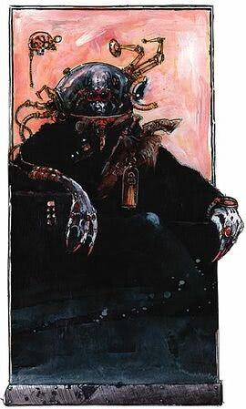

<!-- A0491-B0094 -->

原译文

Navigator 导航者

**校订译文**

Navigator 导航员

<!-- /A0491-B0094 -->

<!-- A0491-B0095 -->
**英文原文**

Besides his ability to steer the vessel from any danger, the Navigator is able to influence the Warp surrounding it, while able to create small vortexes that may keep them on route, they may as well create whole Warp Storms with their power, use the prescient waters of the Warp to position their ship in an optimal attacking position when forced to battle within the Empyrean or obliterate the trail of their ship confusing those who might track them. Alternatively if employing a Mimic Engine, they are able to change their trail signature to aid in any potential subterfuge.

<!-- /A0491-B0095 -->

<!-- A0491-B0096 -->

原译文

除了能够引导船只远离任何危险外，导航者还能够影响周围的亚空间，同时能够产生小漩涡，使它们保持在航线上，他们还可以用自己的力量创造整个亚空间风暴，在被迫在至高天内战斗时，利用亚空间之水的预知将他们的船定位在最佳攻击位置，或者抹去他们的船的踪迹，让那些可能追踪他们的人感到困惑。或者，如果使用模拟引擎，他们能够改变他们的踪迹特征，以帮助任何潜在的秘密手段。

**校订译文**

导航员不仅能引导舰船避开危险，还能影响周围的亚空间。他们可以制造小型涡流，使舰船保持航向，甚至凭自身力量掀起整场亚空间风暴；被迫在至高天中作战时，可以借助亚空间潮流带来的预知，将舰船置于最佳攻击位置；也能抹除航迹，迷惑追踪者。若使用模拟引擎，还能改变自身航迹的特征，以协助实施欺骗。

<!-- /A0491-B0096 -->

<!-- A0491-B0097 -->
### Warp eye 亚空间之眼

<!-- /A0491-B0097 -->

<!-- A0491-B0098 -->
**英文原文**

The only use to the Imperium of the Navigator's pineal eye is its aid in Warp navigation, however it also possesses qualities that are rarely exploited in practice, able to summon powers that although powerful rarely outweigh the risk of losing a Navigator by forcing them into perilous situations that would require them. On its own the eye does nothing, Navigator's extra optical apparatus, and still some find it unsettling to look at, especially psykers, who can see its Warp gate even when it's closed. However when the Navigator chooses to open the inner gate, or even accidentally glimpses at someone when having it inadvertently opened, it unleashes the power of the Warp in its cone of vision. Young Navigators, the least experienced in handling their bizarre anatomy, can only unleash the full potential of the Warp - Lidless Stare - while reported that some can survive its blast for a split second, unprepared or found wanting perish all, their mind driven mad and evaporated in an unmeasurably minuscule time. It is however an instant death, which when provided with worse alternatives is able to be perceived as merciful. One of the few survivors described it as if the sea of warp, distant, yet all-encompassing bubbled to the surface of the materium to swallow him with its paradoxical nature, dismayed as to how the barrier between the worlds in that very moment was as thin as the lens of an eye. It is the main reason why inmity of a Navigator or in the worst scenario, a possession of one by a daemon is an extremely hazardous ordeal. For there is nothing stopping that creature from unleashing this highest of the horrors upon one's soul, fracturing its fleshy vessel in an instant.

<!-- /A0491-B0098 -->

<!-- A0491-B0099 -->

原译文

导航者的松果体之眼在帝国的唯一用途是它在亚空间导航中的辅助作用，但它也具有在实践中很少被利用的品质，能够召唤出力量，尽管这些力量强大，但很少超过失去导航者的风险，迫使他们陷入需要他们的危险境地。就其本身而言，眼睛什么也不做，导航者的额外眼组织，仍然有人觉得看起来很不舒服，尤其是灵能者，即使它关闭了，他们也能看到他的亚空间之门。然而，当导航者选择打开内门，甚至在无意中打开内门时无意中瞥见某人时，它会在其视锥中释放亚空间的力量。年轻的导航者在处理他们奇怪的解剖结构方面经验最少，他们只能释放出亚空间的全部潜力 — 无面凝视，而据报告，有些人可以在瞬间幸存下来，毫无准备或被发现想要毁灭一切，他们的思维被疯狂驱使，在无法估量的极短时间内消失了。然而，这是一种瞬间的死亡，当有更糟糕的选择时，它能够被视为仁慈的。为数不多的幸存者之一将其描述为，仿佛亚空间之海，遥远而包罗万象，浮起到物质界表面，以其矛盾的性质吞噬了他，对当时世界之间的屏障是如何像眼睛的晶状体一样薄感到沮丧。这就是为什么在导航者内部，或者在最坏的情况下，恶魔占据导航者是一种极其危险的折磨的主要原因。因为并没有什么能阻止这种生物在一个人的灵魂上释放出这种至高的恐怖，在一瞬间撕裂其血肉容器。

**校订译文**

帝国利用导航员松果体之眼的主要目的，是辅助亚空间航行。不过，它还具有其他鲜少实际运用的能力。虽然威力强大，但为了使用这些能力而将导航员置于险境、冒失去他们的风险，往往得不偿失。平常，第三只眼只是一件额外的视觉器官，不会自行发挥力量；即便如此，有人仍觉得它令人不安，尤其是灵能者，因为他们即使在眼睛闭合时，也能看到其中的亚空间门户。导航员一旦主动开启内部之门，或在意外开启时瞥见他人，便会向视野所及之处释放亚空间力量。年轻导航员尚不善于控制这种奇异器官，只能将力量全数释放，形成“无睑凝视”。据报告，极少数人可以抵挡一瞬，但凡毫无准备或抵抗力不足者，无不在难以计量的刹那间心智崩溃、命丧当场。这种死亡来得极快，若与更可怕的下场相比，甚至可以被视为一种仁慈。一名罕见的幸存者形容，那感觉仿佛遥远却又无所不在的亚空间之海涌上物质界表面，要以自相矛盾的本质将他吞没；令他惊惧的是，两个世界之间的屏障在那一刻竟薄如眼睛的晶状体。这正是与导航员为敌，尤其是遭遇被恶魔附身的导航员时，极其危险的原因：没有什么能阻止那种存在将至深的恐怖倾泻到人的灵魂上，瞬间撕碎其血肉躯壳。

**校注：** 原文 inmity 显为 enmity 笔误，即与导航员为敌。unprepared or found wanting 指无准备或抵抗不足者，修正原译误拆。

<!-- /A0491-B0099 -->

<!-- A0491-B0100 图片 -->
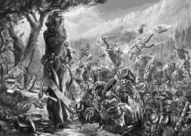

<!-- A0491-B0101 -->

原译文

Navigator killing a horde of orks with the power of her eye 导航者用眼睛的力量杀死了一群欧克

**校订译文**

Navigator killing a horde of orks with the power of her eye 导航员用第三只眼的力量杀死一群欧克蛮人

<!-- /A0491-B0101 -->

<!-- A0491-B0102 -->
**英文原文**

If the Navigator chooses to hone their eye's power, they are able to modulate its output to the point where it can be used as a non-lethal tool, the third eye is thus able to utterly immobilize any creature its sight falls upon. It is especially useful against psykers, additionally debilitating them against the use of their powers. Daemons still are damaged by it, loosing coherence in this sight, slowly deteriorating back into Warp energies they were formed with. Further lesser emanation can simply shock, or otherwise stupefy a person, inflicting upon them visions of dread forcing them to either flee or suffer a severe melt-down. Only those who learned to more amiably manifest the warp eye are allowed to enter into a Navigator duel, requiring for Warp eye to not deal a lethal blow, which due to the readiness of the youth to be chosen as a representative combatant of a house, implies this ability to be taught relatively early in life.

<!-- /A0491-B0102 -->

<!-- A0491-B0103 -->

原译文

如果导航者选择磨练眼睛的力量，他们能够将其输出调节到可以用作非致命工具的程度，因此第三只眼能够完全固定其视线所及的任何生物。它对灵能者特别有用，还可以削弱他们的力量。恶魔仍然受到它的伤害，在这视线中失去了连贯性，慢慢退化回他们形成时的亚空间能量。进一步的较小放射只会使人震惊，或以其他方式使人昏迷，给他们带来恐惧的幻觉，迫使他们要么逃跑，要么遭受严重的崩溃。只有那些学会了更和蔼地表现亚空间之眼的人才被允许参加导航者决斗，要求亚空间之眼不要造成致命打击，由于年轻人准备被选为一个家族的代表参战者，这意味着这种能力可以在生命的早期就被教授。

**校订译文**

导航员若持续磨练第三只眼的力量，就能调节强度，使其成为非致命的工具，将视线内的生物彻底定住。这对灵能者尤其有效，还能阻碍他们施展能力。恶魔则仍会受到伤害，在凝视下逐渐失去稳定形态，消散成构成自身的亚空间能量。强度更弱的释放，可以令人震慑或昏迷，也可以灌入恐惧幻象，迫使目标逃跑或精神崩溃。只有学会温和运用亚空间之眼的人，才获准参加导航员决斗，因为决斗要求避免致命打击。年轻导航员常被选为家族的决斗代表，说明这项控制技巧会在较早的人生阶段教授。

<!-- /A0491-B0103 -->

<!-- A0491-B0104 -->
**英文原文**

In between the instant death of the Lidless Stare and a mere defensive weaker emanations of the third eye, there are some which can easily be considered cruel, a Navigator can easily decide to punish a person with moderate exposure to the Warp, bathing their flesh in the empyrean light inviting both scarring and chaotic mutations. The choice to corrupt so another does not come out of nor result in a healthy mind, leading the Navigator in question into a bottomless spiral of insanity. Some however use slightly more power, arguably able to suffer no costs to their mental health: it is a registered practice of some of the more pious of the Navis Nobilite houses to use their Warp eye to unleash non-lethal but still scarring radiation out of their eyes. While it does not cause mutations, it melts the flesh and ashens thus exposed bones, the cruellest of them choosing the intensity of Warp fire to rise and suffering to lengthen. It is dictated that this power of the Third Eye was bestowed upon them by the Emperor and by this sign of his edict, they may prosecute his enemies with its cleansing flame. It is thus, among those zealot houses, considered a fitting punishment for the errant members of the Nobilite.

<!-- /A0491-B0104 -->

<!-- A0491-B0105 -->

原译文

在无面凝视的瞬间死亡和第三只眼的防御性较弱的放射之间，有一些很容易被认为是残忍的，导航者可以很容易地决定惩罚一个适度暴露于亚空间的人，将他们的血肉沐浴在至高天之光下，既会留下疤痕，也会引起混乱的突变。选择腐化他人既不会产生也不会导致健康的心态，导致有问题的导航者陷入无底的疯狂螺旋。然而，有些人使用的功率略高，可以说他们的心理健康不会受到任何损害：这是导航者宗族的家族中一些更虔诚的人的一种被记录的做法，他们使用亚空间之眼从眼睛中释放出非致命但仍会留疤的放射。虽然它不会引起突变，但它会融化血肉并化为灰烬，从而暴露出骨头，其中最残酷的选择是提高亚空间火焰的强度，延长痛苦。据说，这第三只眼的力量是帝皇赋予他们的，通过他的这一敕令的标志，他们可以用它的净化之火攻击他的敌人。因此，在那些狂热家族中，这被认为是对宗族中犯错成员的适当惩罚。

**校订译文**

在致人瞬间死亡的无睑凝视与较弱的防御性释放之间，还有一些显然十分残酷的用法。导航员可以让目标适度暴露于亚空间，以至高天之光灼照血肉，留下伤疤并诱发混沌突变，借此施罚。选择如此腐化他人，本就不是心智健康的表现，也只会使施术者进一步陷入无底的疯狂。不过，也有人略微提高力量强度，据说反而不会损害自己的心智。已有记录表明，一些更虔诚的导航员家族会从亚空间之眼释放非致命但会留下创伤的辐射。它不引发突变，却能熔化血肉，将暴露的骨骼烧成灰色；其中最残酷者还会增强亚空间之火，刻意延长痛苦。他们宣称第三只眼的力量由帝皇赐予，既是其旨意的标志，便可用其中的净化火焰惩戒帝皇之敌。在这些狂热家族中，这种做法被视为惩罚犯错族人的适当方式。

**校注：** 原文称略提高强度的灼烧用法不致损害施术者心智，与前述致突变用法形成区别，但机制未作解释；保留其说法，不推定安全范围。ashens 此处按变灰、烧灰色译，未扩大为整副骨骼焚尽。

<!-- /A0491-B0105 -->

<!-- A0491-B0106 图片 -->
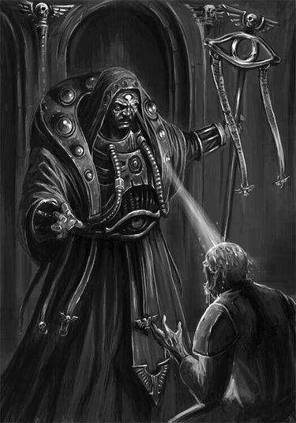

<!-- A0491-B0107 -->

原译文

Navigator choosing to mutate a subject of his power 导航者选择突变他的力量的目标

**校订译文**

Navigator choosing to mutate a subject of his power 导航员选择让受其力量影响的目标发生突变

<!-- /A0491-B0107 -->

<!-- A0491-B0108 -->
**英文原文**

Ultimately as the last reserve Navigators can release what is known as the Red Tide, although its power instantly evaporates flesh of anyone it falls upon, its primarily use is to damage other solid matter that might be an obstacle to the Navigator, as well as able to kill those that hide their eyes from meeting the Warp eye's gaze. It's also considered detrimental to a Navigator, so unless they want to commit the final sacrifice, it is for their best not to maintain it for longer periods. The most skilled Navigators are able to release the Red Tide for but a sliver of a second, allowing for the blast to still be able to kill the subject, and the damage to the Navigator be considered negligible and repairable.

<!-- /A0491-B0108 -->

<!-- A0491-B0109 -->

原译文

最终，作为最后一个最后手段，导航者可以释放所谓的赤潮，尽管它的力量会立即蒸发掉它所遇到的任何人的血肉，但它的主要用途是破坏其他可能阻碍导航者的固体，并能够杀死那些遮住眼睛的人。它也被认为对导航者有害，所以除非他们想做出最后的牺牲，否则最好不要长时间保持它。最熟练的导航者能够释放赤潮，但只有一秒钟的时间，爆炸仍能杀死目标，但对导航者的伤害可以忽略不计，可以修复。

**校订译文**

导航员最后的手段，是释放被称为“赤潮”的力量。它能瞬间蒸发命中者的血肉，但主要用途是摧毁挡路的实体障碍，也能杀死那些闭眼或遮眼、避开亚空间之眼凝视的人。赤潮同样会伤害导航员自身，因此除非准备作出最终牺牲，否则不宜长时间维持。技巧最高超的导航员能够只释放极短的一瞬，使冲击仍足以杀死目标，而自身受到的损伤则轻微到可以忽略，并能够恢复。

**校注：** a sliver of a second 是极短的一瞬，非整整一秒；修正原译。

<!-- /A0491-B0109 -->

<!-- A0491-B0110 -->
### Other abilities 其他能力

<!-- /A0491-B0110 -->

<!-- A0491-B0111 -->
**英文原文**

Limited in scope and number, Navigator possess few abilities some might accredit to a psyker. One of those is the ability to summon a Cloud in the Warp that would obfuscate his presence from a psychic inquiry, albeit not making him physically invisible, the Navigator can also extend this ability to people close by, but only by extreme control of this talent. The other two abilities are tied to a way his third eye perceives the Warp, in which the concept of time is just one of physical dimensions. For the first, the Navigator is truly precognizant if only for short periods in the future, and only really knowing possible outcomes of the events, not a firm and unchangeable future, still able to avert many of those minute tragedies that might end them. Some Navis Scions are known to exploit people's naivety, with full knowledge of their lack of further foresight, and act as soothsayers to the exorbitantly wealthy to wow them with those short snippets of prophecy and increase their standings with the wider nobility. The second power allows the Navigator to step aside in time to an adjacent timeline, able to move themselves outside of danger by just walking away from the version of the reality where they'd be harmed. This power while amazing is small in scope, and even those small exerts might damage causality enough for the reality to collapse and shatter their very body. The Navigator might escape a horrible death that might have befallen them, towards a death that inadvertently will.

<!-- /A0491-B0111 -->

<!-- A0491-B0112 -->

原译文

由于机会和数量有限，导航者几乎没有什么能力，有些人可能会认为这是一个灵能者。其中之一是召唤亚空间中的云的能力，这将使他的存在在灵能探查中变得模糊，尽管不会使他在身体上隐形，导航者也可以将这种能力扩展到附近的人，但只能通过对这种天赋的极端控制。另外两种能力与他的第三只眼感知亚空间的方式有关，在这种方式中，时间的概念只是物理维度之一。首先，导航者是真正的预知者，如果只是在未来的短时间内，只有真正知道事件的可能结果，而不是一个坚定和不可改变的未来，仍然能够避免许多可能结束这些的微小悲剧。众所周知，一些导航之裔利用人们的天真，充分了解他们缺乏进一步的远见，并充当超级富豪的预言家，用这些简短的预言片段让他们惊叹不已，并提高他们在更广泛的贵族中的地位。第二种力量允许导航者及时退到相邻的时间线，能够通过离开他们会受到伤害的现实位面来摆脱危险。这种力量虽然令人惊叹，但范围很小，即使是那些小的力量也可能破坏因果关系，使现实崩溃并粉碎他们的身体。导航者可能会逃脱一场可能降临在他们身上的可怕死亡，走向一场无意中会降临的死亡。

**校订译文**

导航员还有少数会被人误认为常规灵能的能力，其种类和作用范围都很有限。其中一种是在亚空间中召来云雾，遮蔽自身，使其难以被灵能探查发现，但不会让肉身隐形。控制极为精妙时，导航员还可以将效果扩展到身边的人。另外两种能力源于第三只眼感知亚空间的方式：在那里，时间不过是诸多物理维度之一。第一种是真正的短期预知。导航员只能看见近期事件的可能结果，而非不可改变的确定未来，但仍足以避开许多看似微小却可能致命的意外。有些导航之裔明知自己无法预见更遥远的未来，却利用外人的无知，为巨富充当预言家，以短暂的预言片段博取惊叹，提高自己在贵族社会的地位。第二种能力让导航员从时间中侧移一步，进入相邻的时间线，离开那个自己会受伤的现实版本，从而躲过危险。这种能力虽然惊人，作用范围却很小；即使细微的运用，也可能破坏因果关系，使现实崩塌，连同导航员的身体一起粉碎。他可能逃过一种本来只是可能发生的惨死，却因此迎来另一种必然降临的死亡。

<!-- /A0491-B0112 -->

<!-- A0491-B0113 -->
**英文原文**

Of physical unique abilities, most are concerned with the individual mutation, although they all share the ability to offset the fatigue of their bodies and put away the need to sleep. Although it isn't absolute, and Navigators must eventually sleep, otherwise risking falling into a comatose state, it still allows them long vigils during Warp traversals, forcing the captain to swap them in their duty within relatively longer intervals than others of his crew. Notably elders who transformed into Heir Apparents are invariably able to breathe in water, toxic gas or even vacuum of space with their gills. Multijointed Navigators all are contortionists, able to perform feats of extreme body elasticity and acrobacy, those whose digits hardened to claws or whose teeth are naturally sharpened are getting small benefits of always carrying some sort of weapon other than their third eye.

<!-- /A0491-B0113 -->

<!-- A0491-B0114 -->

原译文

在身体独特的能力中，大多数都与个体突变有关，尽管他们都有抵消身体疲劳和消除睡眠需求的能力。虽然这不是绝对的，导航者最终必须睡觉，否则有陷入昏迷状态的风险，但它仍然允许他们在亚空间航行期间长时间守夜，迫使船长在比其他船员更长的时间间隔内将他们换到岗位上。值得注意的是，变成继承人的长老总是能够用鳃呼吸水、有毒气体，甚至太空的真空。多关节导航者都是柔术者，能够完成极端的身体弹性和肢端弯曲的壮举，那些手指变硬成爪或牙齿自然变尖的人，除了第三只眼外，总是携带某种武器的小优点。

**校订译文**

导航员特殊的肉体能力大多取决于个人突变，不过他们普遍能够压制疲劳、推迟睡眠。这并非完全免除睡眠需求：最终仍须休息，否则可能陷入昏迷。但这足以让他们在亚空间航行中长时间值守，舰长为他们安排轮换的间隔可以比其他船员更长。已蜕变为法定继承人的年长者，能够利用鳃在水中、有毒气体中，甚至太空真空中维持呼吸。具有额外关节的导航员擅长柔术，能作出极度柔韧的动作和杂技；手指硬化成爪或牙齿天生尖利的人，则等于在第三只眼之外，随身携带着另一种武器。

**校注：** 以鳃在真空呼吸是英文设定的原说法，并非现实生物学主张。

<!-- /A0491-B0114 -->

<!-- A0491-B0115 图片 -->
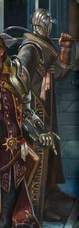

<!-- A0491-B0116 -->

原译文

Navigator with a mask uniquely not hiding his third eye 戴着面具的导航者，独一无二地不遮住他的第三只眼

**校订译文**

Navigator with a mask uniquely not hiding his third eye 一名戴面具的导航员，其面具罕见地没有遮住第三只眼

<!-- /A0491-B0116 -->

<!-- A0491-B0117 -->
## Notable individuals 著名个体

<!-- /A0491-B0117 -->

<!-- A0491-B0118 -->

原译文

Dovrian Ofar 多夫里安·奥弗尔

**校订译文**

Dovrian Ofar 多夫里安·奥弗尔

<!-- /A0491-B0118 -->

<!-- A0491-B0119 -->

原译文

Durlan Ocellati 杜兰·奥塞拉蒂

**校订译文**

Durlan Ocellati 杜兰·奥塞拉蒂

<!-- /A0491-B0119 -->

<!-- A0491-B0120 -->

原译文

Espern Locarno 埃斯珀恩·洛迦诺

**校订译文**

Espern Locarno 埃斯珀恩·洛迦诺

<!-- /A0491-B0120 -->

<!-- A0491-B0121 图片 -->
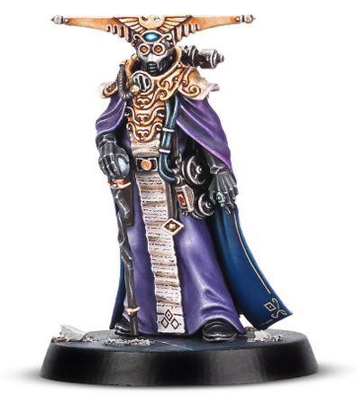

<!-- A0491-B0122 -->

原译文

Navigator Espern Locarno realeased with Warhammer Quest: Blackstone Fortress 发布于《战锤任务：黑石要塞》的导航者埃斯珀恩·洛迦诺

**校订译文**

Navigator Espern Locarno realeased with Warhammer Quest: Blackstone Fortress 随《战锤任务：黑石要塞》推出的导航员埃斯珀恩·洛迦诺

<!-- /A0491-B0122 -->

<!-- A0491-B0123 -->

原译文

Helad Gibran 赫拉德·纪伯伦

**校订译文**

Helad Gibran 赫拉德·纪伯伦

<!-- /A0491-B0123 -->

<!-- A0491-B0124 -->

原译文

Hernando Jurkantz 赫尔南多·尤坎茨

**校订译文**

Hernando Jurkantz 赫尔南多·尤坎茨

<!-- /A0491-B0124 -->

<!-- A0491-B0125 -->

原译文

Lustram Locarno 卢斯特拉姆·洛迦诺

**校订译文**

Lustram Locarno 卢斯特拉姆·洛迦诺

<!-- /A0491-B0125 -->

<!-- A0491-B0126 -->

原译文

Octavia 奥克塔维亚

**校订译文**

Octavia 奥克塔维亚

<!-- /A0491-B0126 -->

<!-- A0491-B0127 -->

原译文

Pieter Achelieux 彼得·阿舍利厄斯

**校订译文**

Pieter Achelieux 彼得·阿舍利厄

<!-- /A0491-B0127 -->

<!-- A0491-B0128 -->

原译文

Horron Sch'est 霍伦·施'埃斯特

**校订译文**

Horron Sch'est 霍伦·施'埃斯特

<!-- /A0491-B0128 -->

<!-- A0491-B0129 -->

原译文

Seeken 西肯

**校订译文**

Seeken 西肯

<!-- /A0491-B0129 -->

<!-- A0491-B0130 -->

原译文

Silvanus 西尔瓦努斯

**校订译文**

Silvanus 西尔瓦努斯

<!-- /A0491-B0130 -->

<!-- A0491-B0131 -->

原译文

Skorpeus Belisarius 斯科尔皮乌斯·贝利撒留斯

**校订译文**

Skorpeus Belisarius 斯科尔皮乌斯·贝利萨留斯

<!-- /A0491-B0131 -->

<!-- A0491-B0132 -->

原译文

Nilus Yeshar 尼卢斯·耶沙尔

**校订译文**

Nilus Yeshar 尼卢斯·耶沙尔

<!-- /A0491-B0132 -->

<!-- A0491-B0133 -->

原译文

Chettamandey Vula Brobantis 切塔曼迪·武拉·布罗班蒂斯

**校订译文**

Chettamandey Vula Brobantis 切塔曼迪·武拉·布罗班蒂斯

<!-- /A0491-B0133 -->

<!-- A0491-B0134 -->

原译文

Salpo 萨尔波

**校订译文**

Salpo 萨尔波

<!-- /A0491-B0134 -->

<!-- A0491-B0135 -->
**英文原文**

Orks make a use of their brand of navigators which are invariably simple Weirdboyz, navigating the Warp through crude intuition and primitive divination. Their exploits allow for the same short Warp jumps the Imperium makes without the use of their Navigators. As still, they are prone to accidentally letting their vessel lost. However, they can move through Warp Storms at speeds that baffle even the most experienced Navigators. In spite of those benefits most Orks forego the use of Ork navigators altogether.

<!-- /A0491-B0135 -->

<!-- A0491-B0136 -->

原译文

欧克利用他们的大脑作为导航者，这些总是简单的怪异小子，通过粗糙的直觉和原始的占卜来导航亚空间。他们的发挥允许在不使用导航者的情况下进行与帝国相同的短亚空间跳跃。同样，他们很容易不小心让船迷失。然而，它们在亚空间风暴中的移动速度甚至会让最有经验的导航者感到困惑。尽管有这些好处，但大多数欧克完全放弃使用欧克导航者。

**校订译文**

欧克蛮人也有自己的导航者，通常就是灵能小子，凭粗陋的直觉与原始占卜引导亚空间航行。他们能完成的短距离跃迁，大致相当于帝国舰船在没有导航员时所能完成的跃迁，而且也容易意外迷航。然而，他们穿越亚空间风暴的速度，连最老练的人类导航员都会惊讶。尽管具有这些优势，多数欧克蛮人仍完全不用自己的导航者。

<!-- /A0491-B0136 -->

<!-- A0491-B0137 -->
**英文原文**

Aboard Eldar corsairs' ships the function of a navigator is served by a Void Dreamer, who above simple acts of divining the way through the Warp is able to ward the daemons from the vessel akin to Gellar Field.

<!-- /A0491-B0137 -->

<!-- A0491-B0138 -->

原译文

在灵族海盗的船上，导航者的功能由虚空梦想家提供，他除了简单的探测亚空间路径的行为外，还能够像盖勒力场一样将恶魔从战舰上挡开。

**校订译文**

灵族海盗舰船由虚空梦行者承担导航职责。他们不仅能占卜亚空间中的航路，还能像盖勒力场一样将恶魔挡在舰船之外。

<!-- /A0491-B0138 -->

<!-- A0491-B0139 -->
**英文原文**

Kroot manage to navigate Warp to a similar degree of finesse that Imperium can without the use of Navigators, a fact that remains a mystery to the Imperial investigations.

<!-- /A0491-B0139 -->

<!-- A0491-B0140 -->

原译文

克鲁特成功地以类似于帝国在不使用导航者的情况下所能达到的技巧导航亚空间，这一事实对帝国科学研究来说仍然是个谜。

**校订译文**

克鲁特能够引导亚空间航行，其精细程度大致相当于帝国在不使用导航员时的水平。他们如何做到这一点，帝国调查人员至今仍不清楚。

<!-- /A0491-B0140 -->

<!-- A0491-B0141 -->
**英文原文**

Warp Witches, are human breed of psykers that are able to replace Navigators in their position, albeit in a crude manner, and never truly approaching Navigator's gift, they nonetheless allow a piloted jump, when no other means is available. One of renegade Navigators was known to employ a whole coterie of those, to guide his pirate fleet.

<!-- /A0491-B0141 -->

<!-- A0491-B0142 -->

原译文

亚空间女巫是人类品种的灵能者，能够取代处于其位置的导航者，尽管是以一种粗鲁的方式，并且永远不会真正接近导航者的天赋，但在没有其他方法的情况下，他们仍然允许有人驾驶跳跃。众所周知，一名变节导航者雇佣了一大群这样的人来导航他的海盗舰队。

**校订译文**

亚空间巫者是一类人类灵能者，能以粗陋的方式代替导航员。虽然其本领永远无法真正媲美导航员的天赋，但在别无选择时，仍能为跃迁提供引导。已知曾有一名叛离的导航员雇用一整群亚空间巫者，为自己的海盗舰队领航。

<!-- /A0491-B0142 -->

<!-- A0491-B0143 -->
**英文原文**

Horendeusly mutilated individual human known as Sendak Voltrasse was granted uniquely an ability to navigate in a way any Navigator can. His stretched flesh fused to his suit, removed eyes and an obsidian sphere embedded in his chest, engraved with blasphemous tongue might be connected to this power.

<!-- /A0491-B0143 -->

<!-- A0491-B0144 -->

原译文

被称为桑戴克·沃特拉斯的被严重肢解的人类个体被赋予了独特的导航能力，以任何导航者都能做到的方式进行导航。他伸展的肉体与套装融为一体，摘除了眼睛，胸前嵌着一个黑曜石球体，上面刻着渎神之舌，这可能与这种力量有关。

**校订译文**

一个名叫桑戴克·沃特拉斯的人类，身体被残酷地肢解后，获得了如同导航员一般的特殊导航能力。他被拉伸的血肉与服装融为一体，双眼被摘除，胸口嵌着一颗刻有亵渎文字的黑曜石球体；这些变化可能与其力量有关。

<!-- /A0491-B0144 -->

<!-- A0491-B0145 -->
**英文原文**

The cost of the Navigator is nigh always too costly for most of the fleets, that is why commonly found Chartist captains of the Merchant Fleet, came to rely successfully on series of maps depicting the stable routes in the Immaterium, while more reliable, it is nowhere as fast as a piloted jump made by Navigator, requiring multiple stops for confirming their positions in galaxy, many of those maps they possess were made by Navigators themselves, although rendered on paper instead in a psychic abstract the Navigators are known to inscribe in.

<!-- /A0491-B0145 -->

<!-- A0491-B0146 -->

原译文

对于大多数舰队来说，导航者的成本几乎总是太高了，这就是为什么商船队中常见的宪章船长成功地依靠了一系列描绘非物质界稳定路线的地图，虽然更可靠，但它没有导航者进行的有人驾驶的跳跃那么快，需要多次停留来确认他们在银河系中的位置，他们拥有的许多地图都是由导航者自己制作的，尽管这些地图是在纸上呈现的，而不是以导航者已知会题写的灵能抽象形式呈现的。

**校订译文**

对多数舰队而言，雇用导航员的费用实在过高。因此，商船队中常见的特许舰长往往依靠一系列描绘非物质界稳定航线的地图航行。这种方法虽较为可靠，却远不及导航员引导的跃迁迅速，因为途中必须多次停下，确认在银河中的位置。他们使用的许多地图本来就是导航员绘制的，只是转写成了纸面形式，而非导航员惯用的灵能抽象记录。

<!-- /A0491-B0146 -->

<!-- A0491-B0147 -->
**英文原文**

Within the imperium there exist technologies that allow ships to travel without the use of Navigators, however they are often turned illegal or pushed towards obsoletism, most often due to the Navis Nobilite houses' desire to hold their monopoly over space travel. Among them there exist: Prognosticators, considered a heretek that allows for calculated jumps no other cogitators are able to provide; Klenova Class M Warp Engines, which although legal and still produced, is currently litigated against by the Nobilite, and use of them brings ire of the houses upon the particular fleet owner; Immaterios Novis, a purported tech of Xeno Hybris, said to utterly replace the need of Navigators, with faster short jumps, a matter of particular interest to many parties; Void Abacus, archeotech from the Dark Age of Technology, allowing for unpiloted jumps to be at least 4 times longer, while the Navis Nobilite can't outlaw them against the will of Mechanicum, they devote their means to acquire and destroy any Abacus that ever surfaces.

<!-- /A0491-B0147 -->

<!-- A0491-B0148 -->

原译文

在帝国内部，存在允许船只在不使用导航者的情况下航行的技术，但它们往往被视为非法或被推向废弃，最常见的原因是导航者宗族家族希望垄断太空航行。其中有：预言者，被认为是异端，允许计算跳跃，没有其他沉思者能够提供；克莱诺瓦级M亚空间引擎虽然合法，且仍在生产，但目前正受到宗族的诉讼，使用这些引擎会激怒特定的舰队所有者；非物质界导航仪，据称是尊异派的技术，它将用更快的短跳完全取代对导航者的需求，这是许多方特别感兴趣的问题；虚空算盘，来自黑暗技术时代的考古科技，允许无人驾驶的跳跃至少延长4倍，而导航者宗族不能违背机械教的意志将其取缔，他们致力于获取和摧毁任何出现的算盘。

**校订译文**

帝国中存在无需导航员也能进行航行的技术，但它们经常被宣布为非法，或受到排挤而逐渐废弃，主要原因是导航员家族希望维持对星际航行的垄断。这些技术包括：预言器，可计算其他沉思者无法提供的跃迁方案，被视为技术异端；克莱诺瓦 M 级亚空间引擎，虽仍属合法且继续生产，却正遭导航员家族提起诉讼，使用它会使舰队所有者招致家族敌意；非物质界导航仪，据称是尊异派掌握的技术，能以更快的短距离跃迁完全取代导航员，因而引起各方兴趣；虚空算盘，来自黑暗科技时代的古老技术，能够使无人引导的跃迁距离至少达到原来的四倍。导航员家族无法违背机械教的意愿取缔虚空算盘，便投入资源，设法取得并销毁每一件重现于世的装置。

**校注：** 原文 Mechanicum 按机械教保留；这里描述帝国时代事务，可能混用了 Adeptus Mechanicus，待原出处核实。no less than four times 的实际文意为达到四倍，不能译成再增加四倍。

<!-- /A0491-B0148 -->

<!-- A0491-B0149 -->
**英文原文**

While rare it isn't impossible for Space Marine chapter to make a Navigator into a full-fledged Marine, an idea not foreign to Ultramarines, who denoted one of their Navigators as too old to undergo the full initiation. Uniquelly White Scars Space Marines chapter is noted for possessing high numbers of Navigators turned into full brethren. Those Navigator Space Marines are rarely committed to battle.

<!-- /A0491-B0149 -->

<!-- A0491-B0150 -->

原译文

虽然星际战士战团将导航者变成一名成熟的星际战士的情况罕见，但并非不可能，这对极限战士来说并非典型，他们表示他们的导航者太老了，无法接受全面的入会。独特的白色伤疤星际战士战团以拥有大量变成完全的兄弟的导航者而闻名。那些导航者星际战士很少投入战斗。

**校订译文**

星际战士战团将导航员改造为正式星际战士的情况虽然罕见，却并非不可能。极限战士并不陌生于这一设想，只是曾判断其一名导航员年龄过大，无法接受完整改造。白疤战团则据称拥有相当多已成为正式战斗兄弟的导航员，这是它独特的情况。这些导航员星际战士很少被投入战斗。

**校注：** 原文确称白疤有许多完成星际战士改造的导航员；内容可能来自早期设定。本篇未列逐条出处，暂按原文保留并标为待核，不据其他版本删改。

<!-- /A0491-B0150 -->

<!-- A0491-B0151 -->
**英文原文**

When the Navigator dies, with their third eye inner warp gate open, the gate is maintained for an indefinite time, although whether natural decay factors in is unknown. Nonetheless, thus extracted eye can become a weapon in the hands of those careful of its danger.

<!-- /A0491-B0151 -->

<!-- A0491-B0152 -->

原译文

当导航者死亡时，第三只睛的内部亚空间之门打开，门会无限期地保持，尽管是否存在自然衰变因素尚不清楚。尽管如此，这样提取的眼睛可能会成为那些注意其危险的人手中的武器。

**校订译文**

如果导航员死去时，第三只眼内的亚空间之门仍然开启，门户便会持续存在，时间没有明确上限；自然腐败是否会使其关闭，目前尚不清楚。因此，取下的眼睛可以被懂得谨慎应对其危险的人用作武器。

<!-- /A0491-B0152 -->

<!-- A0491-B0153 -->
**英文原文**

During the so-called Carnivoration of Cel, three noble houses of the Askellon Sector exhibited an indirectly cannibalistic practice by feeding their stock of mhoxen with animals injected with cerebral extractions of ritually slaughtered Navigators. This manipulated mhoxen flesh was said to grant the nobles purity of senses, allowing to fully appreciate other flavours. The practice lead to rampant mutations within those houses members.

<!-- /A0491-B0153 -->

<!-- A0491-B0154 -->

原译文

在所谓的塞尔食肉期间，阿斯凯隆星区的三个贵族家族表现出一种间接的食人行为，他们用注射了仪式上屠宰的导航者大脑提取物的动物喂他们的莫克森牲畜。据说，这种经过操作的莫克森肉赋予了贵族们纯粹的感官，让他们能够充分欣赏其他味道。这种做法导致这些家族成员中的突变猖獗。

**校订译文**

在所谓的“塞尔食肉事件”中，阿斯凯隆星区的三个贵族家族实行了一种间接食人仪式：先将仪式屠杀的导航员脑部提取物注射进动物体内，再将这些动物喂给他们饲养的莫克森牲畜。据说，如此处理的莫克森肉能够使贵族的感官变得纯净，让他们充分品尝其他风味。这种做法最终导致三个家族的成员出现大范围突变。

<!-- /A0491-B0154 -->

<!-- A0491-B0155 -->
**英文原文**

Psycharus Worm is a Halo Device resembling a brass grub, however when exposed to a source of warp energies it animates and exhibits terrible intelligence, alongside the power to animate the dead and use them as its puppets. When exposed to a Navigator it instantly jumps towards their warp eye, in return for opening the warp gate, granting them its power and dark alien murderous desires.

<!-- /A0491-B0155 -->

<!-- A0491-B0156 -->

原译文

灵能蠕虫是一种类似于黄铜蛆的光环装置，但当暴露在亚空间能量源中时，它会激活并表现出可怕的智慧，同时还能激活死者并将其用作木偶。当暴露在导航者面前时，它会立即跳向他们的亚空间之眼，以换取打开亚空间之门，赋予他们力量和黑暗的异型杀戮欲望。

**校订译文**

灵能蠕虫是一种光环装置，外形像黄铜制的蛆虫。接触亚空间能量后，它便会活动起来，表现出可怕的智慧，还能驱动死者，将其当作傀儡。它一旦遇到导航员，就会立刻扑向其亚空间之眼，借此打开亚空间门户，并将自身的力量与阴暗、异质的杀戮欲望赋予对方。

<!-- /A0491-B0156 -->

<!-- A0491-B0157 -->
**英文原文**

Even if considered one of the few creatures in the known universe able to stand against influence of the warp with some surety, Navigators are nonetheless still touchable by chaos, and to shield themselves from it they are known to acquire Eldar Dreamstones, which above that help alleviate nightmares that can plague some Navigators after their shift of work.

<!-- /A0491-B0157 -->

<!-- A0491-B0158 -->

原译文

即使被认为是已知宇宙中为数不多的能够有把握地抵抗亚空间影响的生物之一，导航者仍然可以被混沌所触及，为了保护自己免受混沌的影响，众所周知，他们会获取灵族梦石，这有助于缓解一些导航者在轮班后可能会做的噩梦。

**校订译文**

导航员虽被视为已知宇宙中少数能够较有把握地抵御亚空间影响的生物，仍然会受到混沌侵蚀。为保护自己，他们会设法取得灵族梦石；这些物品还能缓解部分导航员完成值勤后饱受困扰的噩梦。

<!-- /A0491-B0158 -->

<!-- A0491-B0159 -->
**英文原文**

The concept of Navigators in 40K is very similar to the Guild Navigators of the Dune universe.

<!-- /A0491-B0159 -->

<!-- A0491-B0160 -->

原译文

40K中的导航者概念与沙丘宇宙中的领航者工会非常相似。Conflicting sources 来源冲突

**校订译文**

40K 中导航员的概念，与《沙丘》宇宙中的宇航公会领航员非常相似。

Conflicting sources 来源冲突

<!-- /A0491-B0160 -->

<!-- A0491-B0161 -->
**英文原文**

In the very first mention and appearance of Navigators in 1st Edition within Warhammer 40,000: Rogue Trader (1987), and Warhammer 40,000 Chapter Approved - The Book of the Astronomican (1988), Navigators' Third Eye is unmentioned, and attached images of Navigator are devoid of this feature. This peculiar part of their anatomy was introduced with the novel Inquisitor (1990), It was first mentioned and illustrated in White Dwarf 140 (UK) (1991), the Navigators kept being mentioned in all of the Warhammer 40,000 wargame setting's editions since (although devoid of images), but the first mention of the Third Eye in a proper core setting rulebook happened in 6th Edition Rulebook (2012). Across roleplaying systems the Third Eye was first mentioned and rendered in a miniature with Exterminatus Issue 7 (2003), a magazine addendum to rules of the Inquisitor game system, and for the first time in a proper rulebook in Dark Heresy Core Rulebook (2008), being mentioned in multiple roleplaying systems for years prior to wargame setting's 6th Edition.

<!-- /A0491-B0161 -->

<!-- A0491-B0162 -->

原译文

在《战锤40000：行商浪人》（1987）第一版和《战锤40000战团批准 - 星炬之书》（1988）中首次提到和出现导航者时，没有提到导航者的第三只眼，附带的导航者图像也没有这个特征。他们的解剖结构的这一特殊部分是在小说《审判官》（1990年）中介绍的，它在《白矮人第140期》（英国）（1991年）中首次被提及和说明，自那以后，战锤40000战争游戏的所有版本中都一直提到导航者（尽管没有图像），但真正的在核心设定规则书中首次提到第三只眼是在第六版规则书（2012年）中。在角色扮演系统中，第三只眼首次被提及，并在《灭绝令》第7期（2003年）中以微缩模型呈现，这是审判官游戏系统规则的杂志附录，在《黑暗异端核心规则书》（2008年）中首次在正式的规则书中提及，在战争游戏设定的第六版之前的几年里，它在多个角色扮演系统里被提及。

**校订译文**

导航员最初登场于第一版《战锤 40,000：行商浪人》（1987）及《战锤 40,000 战团批准：星炬之书》（1988）时，文字并未提及第三只眼，插图中也没有这一特征。这种特殊器官于小说《审判官》（1990）中引入，并在英国版《白矮人》第 140 期（1991）中首次以文字和插图介绍。此后各版《战锤 40,000》战棋设定仍持续提到导航员，虽然没有相应插图；核心规则书则直到第六版（2012）才首次提及第三只眼。在角色扮演游戏体系中，第三只眼最早出现于《灭绝令》第 7 期（2003），并通过微缩模型呈现。这是为《审判官》游戏提供规则补充的杂志。它随后首次进入正式的角色扮演规则书，即《黑暗异端核心规则书》（2008）；在战棋第六版问世前，多款角色扮演游戏已提及这一特征多年。

**校注：** 本段为底稿对各出版物的沿革梳理，尚未逐本核验，故不将其中年份与“首次”标为独立核实结论。

<!-- /A0491-B0162 -->

<!-- A0491-B0163 -->
**英文原文**

Note 1: There is conflicting sources regarding whether Psykers or Navigators appeared first. According to the Deathwatch Core Rulebook, scientifically proven psykers are proven to exist sometime between M18 and M22. It lists Navigators as appearing later between M22 and M25.

<!-- /A0491-B0163 -->

<!-- A0491-B0164 -->

原译文

注1：关于灵能者或导航者哪个首先出现，存在相互矛盾的来源。根据《死亡守望核心规则书》，被科学证实的灵能者被证明存在于M18和M22之间的某个时间。它列出了导航者出现在随后的M22和M25之间。

**校订译文**

注 1：不同来源对于灵能者和导航员谁先出现，记述互有矛盾。《死亡守望核心规则书》称，灵能者的存在于 M18 至 M22 之间的某个时期得到科学证实；导航员则稍晚，在 M22 至 M25 之间出现。

<!-- /A0491-B0164 -->

本篇核心术语与暂定项

以下列出本篇出现的英文原形及核心术语表用词。同形词可能指不同对象，具体词义以本篇正文和校注为准；单复数、别名和仅见于图注的名称可能尚未列入。完整候选见[术语表](../../术语表/双语术语候选.csv)。

| 英文 | 采用中文 | 状态 |
| --- | --- | --- |
| Space Marines | 星际战士 | 官方已核对 |
| Black Templars | 黑色圣堂 | 官方已核对 |
| Deathwatch | 死亡守望 | 官方已核对 |
| Eldar | 灵族 | 暂定·语境区分 |
| Drukhari | 黑暗灵族 | 官方已核对 |
| Orks | 欧克蛮人 | 官方已核对 |
| Psyker | 灵能者 | 官方已核对 |
| Divination | 预知学派 | 官方已核对 |
| Ultramarines | 极限战士 | 官方已核对 |
| Astronomican | 星炬 | 暂定 |
| Navigator | 导航员 | 官方已核对 |
| Void Dreamer | 虚空梦行者 | 暂定 |
| Warp | 亚空间 | 官方已核对 |
| Inquisition | 审判庭 | 暂定 |
| Inquisitor | 审判官 | 官方已核对 |
| Imperium of Man | 人类帝国 | 官方已核对 |
| Imperium | 帝国 | 暂定·简称 |
| Mechanicum | 机械教 | 暂定·历史称谓 |
| Servitor | 机仆 | 暂定 |
| Dark Age of Technology | 黑暗科技时代 | 暂定 |
| Faster-Than-Light | 超光速航行 | 暂定 |
| Gellar Field | 盖勒力场 | 暂定 |
| Piloted Jump | 领航跳跃 | 暂定 |
| Kroot | 克鲁特 | 暂定 |
| History | 历史 | 编辑用语已统一 |
| Conflicting sources | 来源冲突 | 编辑用语已统一 |
| Notes | 注释 | 编辑用语已统一 |
| Administratum | 内政部 | 暂定 |
| Archeotech | 古科技 | 暂定 |
| Rogue Trader | 行商浪人 | 暂定 |
| Emperor | 帝皇 | 官方已核对 |
| Navis Nobilite | 导航员家族 | 暂定·官方待核 |
| Mutant | 变种人 | 暂定·官方待核 |
| Rating | 普通水手 | 暂定·官方待核 |
| Great Crusade | 大远征 | 暂定·官方待核 |
| Terra | 泰拉 | 暂定·官方待核 |
| Navigators | 导航员 | 官方已核对 |
| Merchant Fleet | 商船队 | 暂定·官方待核 |
| Sector | 星区 | 暂定·官方待核 |
| Tech | 技术语 | 暂定·官方待核 |
| Paternova | 最高族长 | 暂定·官方待核 |
| Ancient | 旗手 | 官方已核对 |
| White Scars | 白疤 | 官方已核 |
| Scars | 伤疤 | 暂定·官方待核 |
| Space Marine | 星际战士 | 暂定·官方待核 |
| Chapter | 战团 | 暂定·官方待核 |
| Captain | 连长 | 暂定·官方待核 |
| Red Scorpions | 红蝎 | 暂定·官方待核 |
| Remnants | 残骸 | 暂定·官方待核 |
| Renegade Houses | 叛逆家族 | 暂定·官方待核 |
| Free Charter | 自由特许状 | 暂定·官方待核 |
| Absolute | 绝对号 | 暂定·官方待核 |
| Powers | 能天使 | 暂定·官方待核 |
| Lidless Stare | 无睑凝视 | 暂定·官方待核 |
| Typhlotic | 无眼者 | 暂定·官方待核 |
| Ipsissimus | 至高自我者 | 暂定·官方待核 |
| Navigator Primaris | 首席导航员 | 暂定·官方待核 |
| Red Tide | 赤潮 | 暂定·官方待核 |
| Mimic Engine | 模拟引擎 | 暂定·官方待核 |
| Flesh Hounds | 血肉猎犬 | 官方已核对 |
| Strain | 群系 | 暂定·官方待核 |
| Brand | 布兰德 | 暂定·官方待核 |
| Rampant | 猖獗号 | 暂定·官方待核 |
| Sphere | 防御圈 | 暂定·官方待核 |
| Newborn | 新血 | 暂定·官方待核 |
| The Dark | 《黑暗》 | 暂定·官方待核 |
| System | 星系（恒星系统） | 暂定·官方待核 |
| Kin | 炉裔 | 暂定·官方待核 |
| Void Abacus | 虚兆 | 暂定·官方待核 |
| Warhammer 40,000: Rogue Trader | 战锤40000：行商浪人 | 暂定·官方待核 |
| Chapter Approved | 战团批准 | 暂定·官方待核 |

