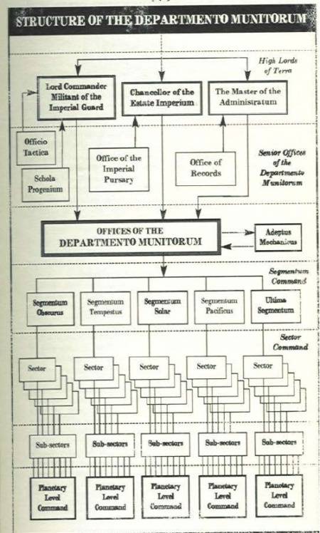

# 0492 军务部 Departmento Munitorum

精校状态：中文行文已逐段精校，部分术语仍为暂定

分类：组织

原文来源：https://www.bilibili.com/opus/1143253756563947542

原作者：帝国神选罐头

原文时间：2025年12月06日 20:08

[返回分类目录](目录.md) · [全书目录](../../目录.md)

<!-- A0492-B0001 -->
**英文原文**

The Departmento Munitorum (or Munitorium) is a department of the Administratum devoted to the general administration, supply, and command of the Imperial Guard, but despite its necessity it is often viewed by the Guard as ineffective. The Munitorum has ultimate responsibility for the raising of new regiments, training of troops, provision of equipment and supplies, and transportation of troops and equipment to and from theatres of war. It is primarily a logistical organisation like the Administratum, but while the Administratum deals with civilian logistics, the Munitorum deals with the logistics of war. Using military as opposed to civilian ranks, the Departmento Munitorum dates back to the Great Crusade.

<!-- /A0492-B0001 -->

<!-- A0492-B0002 -->

原译文

军务部（军需部）是内务部的一个部门，专门负责帝国卫队的一般管理、供应和指挥，但尽管有必要，它往往被卫队视为无效。军务部对组建新兵团、训练部队、提供装备和物资以及往返战区的部队和装备运输负有最终责任。它主要是一个像内务部一样的后勤组织，但内务部负责民用后勤，而军务部则负责战争后勤。军务部使用军队而不是平民等级，可以追溯到大远征时期。

**校订译文**

军务部（Departmento Munitorum，亦拼作 Munitorium）是内政部下辖的部门，负责帝国卫队的日常行政、补给与指挥。它不可或缺，却常被卫队官兵视为效率低下的机构。组建新兵团、训练部队、提供装备物资，以及将人员装备运入或撤出战区，最终都由军务部负责。它与内政部一样，主要是后勤管理组织；区别在于内政部处理民用后勤，军务部负责战争后勤。军务部使用军衔而非文职等级，其历史可以追溯至大远征时期。

<!-- /A0492-B0002 -->

<!-- A0492-B0003 图片 -->

<!-- A0492-B0004 -->
**英文原文**

Parent Agency:Adeptus Administratum

<!-- /A0492-B0004 -->

<!-- A0492-B0005 -->

原译文

隶属机构：内务部

**校订译文**

隶属机构：内政部

<!-- /A0492-B0005 -->

<!-- A0492-B0006 -->
**英文原文**

Headquarters:Terra

<!-- /A0492-B0006 -->

<!-- A0492-B0007 -->

原译文

总部：泰拉

**校订译文**

总部：泰拉

<!-- /A0492-B0007 -->

<!-- A0492-B0008 -->
**英文原文**

Leader:Lord Commander Militant (titular head), Master of the Administratum, Chancellor of the Estate Imperium

<!-- /A0492-B0008 -->

<!-- A0492-B0009 -->

原译文

领袖：军务领主指挥官（名义上的首脑），内务部长，帝国档案部长

**校订译文**

领袖：军务领主指挥官（名义首脑）、内政部之主、帝国档案部部长

<!-- /A0492-B0009 -->

<!-- A0492-B0010 -->
**英文原文**

Armed Forces:Imperial Guard, Militarum Tempestus

<!-- /A0492-B0010 -->

<!-- A0492-B0011 -->

原译文

武装部队：帝国卫队、暴风军

**校订译文**

武装部队：帝国卫队、暴风军

<!-- /A0492-B0011 -->

<!-- A0492-B0012 -->
**英文原文**

Established:M30

<!-- /A0492-B0012 -->

<!-- A0492-B0013 -->

原译文

成立时间：M30

**校订译文**

成立时间：M30

<!-- /A0492-B0013 -->

<!-- A0492-B0014 -->
## Overview 概述

<!-- /A0492-B0014 -->

<!-- A0492-B0015 -->
**英文原文**

The Munitorum is financed by tithes of men, money, and materiel, and all Imperial planets able to support the Imperial military forces in a sector are regularly called on to do so. To make sure the tithes are provided as and when required, representatives of the Departmento Munitorum are present on almost every Imperial planet. Representatives of the organisation, themselves often recruited from the Schola Progenium, are also present on all Imperial Navy ships, and wherever Imperial Guard forces are stationed. This allows the Departmento to manage the many fronts of the Imperial Guard, organizing not only their logistics but also their interstellar transportation. The Officio Prefectus, better known as the Commissariat, is an arm of the Departmento Munitorum which ensures the loyalty that serve within the Astra Militarum.

<!-- /A0492-B0015 -->

<!-- A0492-B0016 -->

原译文

军务部由人员、金钱和物资的什一税资助，所有能够支持某一星区帝国军队的帝国行星都会定期被要求这样做。为了确保在需要时提供什一税，军务部的代表几乎出现在每个帝国行星上。该组织的代表，他们自己经常从忠嗣学院招募，也出现在所有帝国海军舰艇上，以及帝国卫队驻扎的任何地方。这使军务部能够管理帝国卫队的许多前线，不仅组织他们的后勤，还组织他们的星际运输。长官部，更为人所知的是政委部，是军务部的一个部门，负责确保星界军内部的忠诚。

**校订译文**

军务部的资源来自以人力、金钱与物资形式缴纳的什一税。一个星区内，所有有能力支援帝国武装力量的行星，都会定期被要求履行这项义务。为确保按时足额征收，几乎每颗帝国行星都有军务部代表驻留。所有帝国海军舰船及帝国卫队驻地也设有这类代表，他们常从忠嗣学院招募而来。凭借这一网络，军务部能够管理帝国卫队的众多战线，统筹后勤和星际运输。军务部下辖的长官部，更常被称为政委部，负责确保星界军服役人员的忠诚。

<!-- /A0492-B0016 -->

<!-- A0492-B0017 -->
**英文原文**

The Munitorum was founded shortly before the end of the Great Crusade. It was created from the Corps Logisticae, a division of naval administration, shortly before the Ullanor Crusade. Within a few short months of its establishment, the Departmento Munitorum no longer restricted its activities to the mere task of resupply and maintenance, but also became enmeshed in the mire of politics surrounding the great fleets and their military leaders. They were tasked with ensuring adherence to central strategy within the Expeditionary Fleets and with bringing the more wayward elements of the Imperial military back in line. This led to mistrust and unrest amongst the fleets themselves, as many within the military saw this as bureaucrats trying to take over and run the war effort - a view shared by several very notable individuals who resisted the interference of the Departmento Munitorum as much as they could without directly refusing to comply.

<!-- /A0492-B0017 -->

<!-- A0492-B0018 -->

原译文

军务部是在大远征结束前不久成立的。它是在乌兰诺远征前不久由海军管理部门的后勤部队创建的。在成立后的短短几个月内，军务部的行动不再局限于补给和维护，而是陷入了围绕大舰队及其军事领导人的政治泥潭。他们的任务是确保远征舰队遵守中央战略，并让帝国军队中难以控制的分子重新排列。这导致了舰队之间的不信任和动荡，因为军队中的许多人认为这是官僚试图接管和管理战争的努力 — 几位非常著名的人士也持相同观点，他们尽可能地抵制军务部的干预，而不直接拒绝遵守。

**校订译文**

军务部成立于大远征临近结束之际，具体是在乌兰诺远征前不久，由海军行政体系内的后勤署改组而成。成立仅数月，它就不再局限于补给和维护，而开始卷入各大舰队及其军事领袖周围的政治纷争。军务部受命确保远征舰队遵循中央战略，并约束帝国武装力量中自行其是的部分。这在舰队内部引起不信任与骚动：许多军人认为，官僚正试图接管战争的指挥权。几位极有声望的人物也持同样看法，他们在避免公然抗命的前提下，尽可能抵制军务部干预。

<!-- /A0492-B0018 -->

<!-- A0492-B0019 -->
**英文原文**

The Munitorum is organised to allow each level of the organisation to respond effectively to threats, regardless of size and location. The local departments of the organisation can raise tithes from worlds close to a war zone without needing a response from the higher levels of the Departmento Munitorum. As the level of a threat increases and more local departments of the munitorum become involved, the amount tithed, and the amount of planets tithed from, increases. At this point higher levels of the Departmento Munitorum will also become involved, and may funnel additional resources from other parts of the Imperium in to a war zone. The local Departmento Munitorum presence in a subsector has the ability to impose instant tithes, without forewarning, as and when required. Because of this, central command is not needed, due to the functional autonomy of each level of the organisation.

<!-- /A0492-B0019 -->

<!-- A0492-B0020 -->

原译文

军务部的组织是为了使组织的各个层面能够有效地应对威胁，无论其规模和位置如何。该组织的地方部门可以从靠近战区的世界筹集什一税，而不需要军务部高层的回应。随着威胁程度的增加，越来越多的当地部门参与其中，缴纳的什一税和行星的什一税也会增加。此时，军务部的更高级别也将参与其中，并可能将帝国其他地区的额外资源输送到战区。在需要时，地方军务部在分区的存在有能力在没有预警的情况下立即征收什一税。因此，由于组织各级的职能自主权，不需要中央指挥。

**校订译文**

军务部的组织结构旨在使各级机构都能有效应对不同规模、不同地点的威胁。地方部门无需等待上级回复，便可向战区附近的世界征收什一税。随着威胁升级，参与应对的地方部门越来越多，征税数额和征税行星的数量也随之增加。此时，更高层级的军务部机构会介入，并可能从帝国其他地区调拨额外资源。次星区的军务部机构可按需要立即征收什一税，无须事先通知。正因各级部门拥有实际运作上的自主权，这些行动无需中央逐一指挥。

<!-- /A0492-B0020 -->

<!-- A0492-B0021 -->
**英文原文**

When deciding to respond to a request for aid from a world the agents of the Departmento Munitorum must undertake the grim work of balancing available assets such as nearby recruiting worlds, localized Warp travel conditions, and importance of the planet to the greater Imperium. Most of all, they must balance these factors with the status of campaigns already being waged elsewhere.

<!-- /A0492-B0021 -->

<!-- A0492-B0022 -->

原译文

当决定回应来自世界的援助请求时，军务部的特工必须承担起平衡可用资产的艰巨工作，如附近的募兵世界、本地的亚空间航行条件以及行星对更大帝国的重要性。最重要的是，他们必须平衡这些因素与其他地方已经开展的战役的状况。

**校订译文**

在决定如何回应某个世界的求援时，军务部人员必须作出艰难权衡：附近有哪些可用的征兵世界、当地亚空间航行条件如何、该行星对整个帝国有多大价值。最重要的是，还必须将这些因素与其他地区正在进行的战役需求一并考虑。

<!-- /A0492-B0022 -->

<!-- A0492-B0023 图片 -->

<!-- A0492-B0024 -->

原译文

Organization of the Departmento Munitorum 军务部的组织

**校订译文**

Organization of the Departmento Munitorum 军务部的组织

<!-- /A0492-B0024 -->

<!-- A0492-B0025 -->
## Organizational structure 组织结构

<!-- /A0492-B0025 -->

<!-- A0492-B0026 -->
### Command 指挥

<!-- /A0492-B0026 -->

<!-- A0492-B0027 -->
**英文原文**

The Departmento Munitorum is represented and overseen by three members of the High Lords of Terra.

<!-- /A0492-B0027 -->

<!-- A0492-B0028 -->

原译文

军务部由泰拉高领主的三名成员代表和监督。

**校订译文**

军务部由泰拉高领主的三名成员代表和监督。

<!-- /A0492-B0028 -->

<!-- A0492-B0029 -->
**英文原文**

Lord Commander Militant of the Imperial Guard

<!-- /A0492-B0029 -->

<!-- A0492-B0030 -->

原译文

帝国卫队的军务领主指挥官

**校订译文**

帝国卫队的军务领主指挥官

<!-- /A0492-B0030 -->

<!-- A0492-B0031 -->

原译文

Chancellor of the Estate Imperium 帝国档案部长

**校订译文**

Chancellor of the Estate Imperium 帝国档案部部长

<!-- /A0492-B0031 -->

<!-- A0492-B0032 -->

原译文

Master of the Administratum 内务部长

**校订译文**

Master of the Administratum 内政部之主

<!-- /A0492-B0032 -->

<!-- A0492-B0033 -->
### Senior Offices 高级部门

<!-- /A0492-B0033 -->

<!-- A0492-B0034 -->
**英文原文**

The Departmento Munitorum has four Senior Offices, each answering to one of its three directors:

<!-- /A0492-B0034 -->

<!-- A0492-B0035 -->

原译文

军务部有四个高级部门，每个向三名理事中的一名负责：

**校订译文**

军务部设有四个高级部门，各自向三位主管之一负责：

<!-- /A0492-B0035 -->

<!-- A0492-B0036 -->
**英文原文**

Officio Tactica — Subordinate Lord Commander Militant

<!-- /A0492-B0036 -->

<!-- A0492-B0037 -->

原译文

战术部 — 军务领主指挥官的下级

**校订译文**

战术部——隶属军务领主指挥官。

<!-- /A0492-B0037 -->

<!-- A0492-B0038 -->
**英文原文**

Schola Progenium — Coordinated with the Adeptus Ministorum.

<!-- /A0492-B0038 -->

<!-- A0492-B0039 -->

原译文

忠嗣学院 — 与国教教会协调

**校订译文**

忠嗣学院——与国教会协调运作。

<!-- /A0492-B0039 -->

<!-- A0492-B0040 -->
**英文原文**

Office of the Imperial Pursary — Subordinate to the Chancellor of the Estate Imperium

<!-- /A0492-B0040 -->

<!-- A0492-B0041 -->

原译文

帝国财务部 — 帝国档案部长的下级

**校订译文**

帝国财务部——隶属帝国档案部部长。

<!-- /A0492-B0041 -->

<!-- A0492-B0042 -->
**英文原文**

Office of Records — Subordinate to the Master of the Administratum

<!-- /A0492-B0042 -->

<!-- A0492-B0043 -->

原译文

记录部 — 内务部长的下级

**校订译文**

记录部——隶属内政部之主。

<!-- /A0492-B0043 -->

<!-- A0492-B0044 -->
### Offices 部门

<!-- /A0492-B0044 -->

<!-- A0492-B0045 -->
**英文原文**

Below the senior offices are a vast multitude of lower Offices each overseeing a different task. Many of these offices coordinate their activities with the Adeptus Mechanicus.

<!-- /A0492-B0045 -->

<!-- A0492-B0046 -->

原译文

在高级部门下面是大量的下级部门，每个部门都负责不同的任务。其中许多部门与机械神教协调行动。

**校订译文**

高级部门下辖众多低一级的机构，各司其职。其中许多机构会与机械修会协调行动。

<!-- /A0492-B0046 -->

<!-- A0492-B0047 -->
**英文原文**

Administrative Division — Registers machinery, ordnance and fighting assets transported onboard Voidships.

<!-- /A0492-B0047 -->

<!-- A0492-B0048 -->

原译文

管理部 — 登记在虚空舰上运输的机械、军械和作战资产。

**校订译文**

行政处——登记虚空舰运输的机械、军械及作战资源。

<!-- /A0492-B0048 -->

<!-- A0492-B0049 -->

原译文

Administratum Assay Corps 行政测定部队

**校订译文**

Administratum Assay Corps 内政部检验队

<!-- /A0492-B0049 -->

<!-- A0492-B0050 -->
**英文原文**

Commissariat — Recruits, trains, and oversees the activities of Commissars.

<!-- /A0492-B0050 -->

<!-- A0492-B0051 -->

原译文

政委部 — 招募、培训和监督政委的行动。

**校订译文**

政委部 — 招募、培训和监督政委的行动。

<!-- /A0492-B0051 -->

<!-- A0492-B0052 -->
**英文原文**

Divisio Honorum - Oversees the production and distribution of awards.

<!-- /A0492-B0052 -->

<!-- A0492-B0053 -->

原译文

荣誉部 - 监督奖项的制作和分发。

**校订译文**

荣誉部——监督勋奖的制作与颁发。

<!-- /A0492-B0053 -->

<!-- A0492-B0054 -->

原译文

Engineer Corps 工程部队

**校订译文**

Engineer Corps 工程部队

<!-- /A0492-B0054 -->

<!-- A0492-B0055 -->

原译文

Field Enforcement Corps 实地执行部队

**校订译文**

Field Enforcement Corps 实地执行部队

<!-- /A0492-B0055 -->

<!-- A0492-B0056 -->

原译文

Heavy Logistics Echelon 重型后勤梯队

**校订译文**

Heavy Logistics Echelon 重型后勤梯队

<!-- /A0492-B0056 -->

<!-- A0492-B0057 -->

原译文

Labour Corps 劳动部队

**校订译文**

Labour Corps 劳动部队

<!-- /A0492-B0057 -->

<!-- A0492-B0058 -->

原译文

Line of Communication Corps 通信部队

**校订译文**

Line of Communication Corps 交通线部队

**校注：** 军事术语 line of communication 指维系军队运输补给的交通线，不能仅按通信联络理解。

<!-- /A0492-B0058 -->

<!-- A0492-B0059 -->
**英文原文**

Mass Conveyance Squadron — Transports Guard companies with the help of Flat Bed Crawlers.

<!-- /A0492-B0059 -->

<!-- A0492-B0060 -->

原译文

大型运输中队 — 在平板履带车的帮助下运输卫队。

**校订译文**

大型运输中队——借助平板履带车运送卫队各连。

<!-- /A0492-B0060 -->

<!-- A0492-B0061 -->

原译文

Ordinators 协调者

**校订译文**

Ordinators 协调者

<!-- /A0492-B0061 -->

<!-- A0492-B0062 -->

原译文

Pioneer Corps 先锋部队

**校订译文**

Pioneer Corps 先锋部队

<!-- /A0492-B0062 -->

<!-- A0492-B0063 -->

原译文

Provost Command Corps 教长指挥部队

**校订译文**

Provost Command Corps 军纪指挥部队

**校注：** Provost 此处指军事警务或军纪职能，非宗教教长；名称暂定。

<!-- /A0492-B0063 -->

<!-- A0492-B0064 -->
**英文原文**

Questor — Supervises the distribution of discipline, work quotas and equipment.

<!-- /A0492-B0064 -->

<!-- A0492-B0065 -->

原译文

执行者 — 监督纪律、工作配额和设备的分配。

**校订译文**

执行者——监督纪律执行、工作配额安排和装备分配。

<!-- /A0492-B0065 -->

<!-- A0492-B0066 -->

原译文

Siege Auxillia Corps 攻城辅助部队

**校订译文**

Siege Auxillia Corps 攻城辅助部队

<!-- /A0492-B0066 -->

<!-- A0492-B0067 -->

原译文

Transit Division 运输部

**校订译文**

Transit Division 运输部

<!-- /A0492-B0067 -->

<!-- A0492-B0068 -->
### Segmentum Command 星域指挥部

<!-- /A0492-B0068 -->

<!-- A0492-B0069 -->
**英文原文**

The highest level of Munitorum strategic command is at the Segmentum level, overseeing Munitorum activities in its respective region. Each Munitorum Segmentum command is in turn divided into a sector, sub-sector, and planetary command.

<!-- /A0492-B0069 -->

<!-- A0492-B0070 -->

原译文

军务部战略指挥部的最高级别位于星域级别，负责监督军务部在其各自地区的行动。每个星域军务部指挥部又分为一个星区、分区和行星指挥部。

**校订译文**

军务部最高的战略指挥层级是星域指挥部，负责监督本星域内的军务部活动。每个星域指挥部之下，再分设星区、次星区和行星各级指挥机构。

<!-- /A0492-B0070 -->

<!-- A0492-B0071 -->
## Known Departmento Munitorum members 已知军务部成员

<!-- /A0492-B0071 -->

<!-- A0492-B0072 -->

原译文

Elthan 埃尔坦

**校订译文**

Elthan 埃尔坦

<!-- /A0492-B0072 -->

<!-- A0492-B0073 -->

原译文

Eskolios 埃斯科利奥斯

**校订译文**

Eskolios 埃斯科利奥斯

<!-- /A0492-B0073 -->

<!-- A0492-B0074 -->

原译文

Ilya Ravallion 伊利亚·拉瓦利恩

**校订译文**

Ilya Ravallion 伊利亚·拉瓦利恩

<!-- /A0492-B0074 -->

<!-- A0492-B0075 -->
**英文原文**

Violeta Roskavler - Former Munitorum Chief who was subsequently made Master of the Administratum.

<!-- /A0492-B0075 -->

<!-- A0492-B0076 -->

原译文

维奥莱塔·罗斯卡夫勒 - 前军务部最高领导人，后来被任命为内务部长。

**校订译文**

维奥莱塔·罗斯卡夫勒——前军务部主管，后来出任内政部之主。

<!-- /A0492-B0076 -->

本篇核心术语与暂定项

以下列出本篇出现的英文原形及核心术语表用词。同形词可能指不同对象，具体词义以本篇正文和校注为准；单复数、别名和仅见于图注的名称可能尚未列入。完整候选见[术语表](../../术语表/双语术语候选.csv)。

| 英文 | 采用中文 | 状态 |
| --- | --- | --- |
| Adeptus Mechanicus | 机械修会 | 官方已核对 |
| Astra Militarum | 星界军 | 官方已核对 |
| Imperial Guard | 帝国卫队 | 暂定·语境区分 |
| Warp | 亚空间 | 官方已核对 |
| Imperium | 帝国 | 暂定·简称 |
| Imperial Navy | 帝国海军 | 暂定 |
| Equipment | 装备 | 编辑用语已统一 |
| Administratum | 内政部 | 暂定 |
| Adeptus Administratum | 内政部 | 暂定 |
| Adeptus Ministorum | 国教会 | 暂定 |
| Departmento Munitorum | 军务部 | 暂定 |
| Schola Progenium | 忠嗣学院 | 暂定·官方待核 |
| Great Crusade | 大远征 | 暂定·官方待核 |
| Terra | 泰拉 | 暂定·官方待核 |
| High Lords of Terra | 泰拉高领主 | 暂定·官方待核 |
| Estate Imperium | 帝国档案部 | 暂定·官方待核 |
| Segmentum | 星域 | 暂定·官方待核 |
| Sector | 星区 | 暂定·官方待核 |
| Subsector | 次星区 | 暂定·官方待核 |
| Honorum | 荣誉星 | 暂定·官方待核 |
| Master | 导师（审判庭职衔）／舰务官（舰员职务） | 语境定译·官方待核 |
| Master of the Administratum | 内政部之主 | 暂定·官方待核 |
| Corps Logisticae | 后勤署 | 暂定·官方待核 |
| Militarum Tempestus | 暴风军 | 暂定·官方待核 |
| Chancellor of the Estate Imperium | 帝国档案部部长 | 暂定·官方待核 |
| Ullanor | 乌兰诺 | 暂定·官方待核 |
| Lord Commander | 领主指挥官 | 暂定·官方待核 |
| Lord Commander Militant | 军务领主指挥官 | 暂定·官方待核 |
| Officio Prefectus | 长官部 | 暂定·官方待核 |
| Administrative Division | 行政处 | 暂定·官方待核 |
| Violeta Roskavler | 维奥莱塔·罗斯卡夫勒 | 暂定·官方待核 |

