# 0493 星界军 Astra Militarum

精校状态：中文行文已逐段精校，部分术语仍为暂定

分类：组织

原文来源：https://www.bilibili.com/opus/1112458815343689751

原作者：帝国神选罐头

原文时间：编辑于 2025年09月26日 15:54

[返回分类目录](目录.md) · [全书目录](../../目录.md)

<!-- A0493-B0001 -->
**英文原文**

The Astra Militarum, commonly known in Low Gothic as Imperial Guard, is the primary fighting force of the Imperium of Man, so numerous in size that even the Departmento Munitorum cannot place a figure on the number of Guardsmen under arms at any one time; the lists of new recruits and toll of casualties can run into the millions in a single day. Every single year, trillions of new recruits are tithed into the Guard, giving their commanders a functional infinite source of manpower, with it being said that, if the entirety of the Imperial Guard would form up in a column, it would reach from Terra to Armageddon.

<!-- /A0493-B0001 -->

<!-- A0493-B0002 -->

原译文

星界军，在低哥特语中通常被称为帝国卫队，是人类帝国的主要战斗力量，其规模如此之大，以至于即使是军务部也无法在任何时候统计卫兵的数量；新兵名单和伤亡人数可能在一天内达到数百万。每年都有数万亿的新兵加入卫队，为他们的指挥官提供了功能上无限的人力资源，据说，如果整个帝国卫队形成一个纵队，它将从泰拉延伸到阿玛吉多顿。

**校订译文**

星界军在低哥特语中通常称为帝国卫队，是人类帝国的主要作战力量。其规模之庞大，连军务部也无法确定任一时刻究竟有多少卫兵在役；每天的新兵与伤亡名单都可能达到数百万人。每年数万亿新兵以什一税的形式被征入卫队，为指挥官提供近乎取之不尽的人力。据说，若全体帝国卫队排成一列，队伍能从泰拉一直延伸到阿玛吉多顿。

**校注：** 本篇开篇称每年征入数万亿人，后文却仅以数十亿估计总兵力；英文底稿本身数量口径不一致，均保留，不自行改数字。

<!-- /A0493-B0002 -->

<!-- A0493-B0003 图片 -->
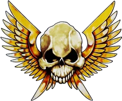

<!-- A0493-B0004 -->

原译文

Astra Militarum symbol 星界军标志

**校订译文**

Astra Militarum symbol 星界军标志

<!-- /A0493-B0004 -->

<!-- A0493-B0005 -->
**英文原文**

Parent Agency:Adeptus Administratum

<!-- /A0493-B0005 -->

<!-- A0493-B0006 -->

原译文

上级机构：内务部

**校订译文**

上级机构：内政部

<!-- /A0493-B0006 -->

<!-- A0493-B0007 -->
**英文原文**

Headquarters:Terra

<!-- /A0493-B0007 -->

<!-- A0493-B0008 -->

原译文

总部：泰拉

**校订译文**

总部：泰拉

<!-- /A0493-B0008 -->

<!-- A0493-B0009 -->
**英文原文**

Leader:Lord Commander Militant

<!-- /A0493-B0009 -->

<!-- A0493-B0010 -->

原译文

领导者：军务领主指挥官

**校订译文**

领导者：军务领主指挥官

<!-- /A0493-B0010 -->

<!-- A0493-B0011 -->
**英文原文**

Established:Post-Horus Heresy, M31 (preceded by Imperial Army)

<!-- /A0493-B0011 -->

<!-- A0493-B0012 -->

原译文

成立：荷鲁斯叛乱后，M31（之前有帝国军队）

**校订译文**

成立：荷鲁斯之乱之后，M31（前身为帝国军）

<!-- /A0493-B0012 -->

<!-- A0493-B0013 -->
**英文原文**

It would be unfeasible trying to put any exact number on the strength of the Guard; however, it is believed that there must be many billions of Guardsmen, divided into millions of regiments. This absolute numeracy provides the Guard with its main power; their ability to deploy in numbers that, eventually, result in victory. Attacking in seemingly endless influxes across battle-zones, charging forth under the cover of massive barrages and delivering massed lasgun volleys, in the Guard the individual Human soldier may appear a lost thing, almost forgotten. Yet the actions of these anonymous soldiers daily decide the fate of worlds. In times of crisis the Imperial Guard will call upon their deadliest of soldiers, whether they are the Imperium's famed Storm Troopers or the regimental elite Kasrkin and Death Korps Grenadiers.

<!-- /A0493-B0013 -->

<!-- A0493-B0014 -->

原译文

试图准确统计卫队的兵力是不可行的；然而，据信，一定有数十亿的卫队，分为数百万个兵团。这种绝对的数量为卫队提供了主要力量；他们能够部署大量兵力，最终取得胜利。在卫队中，似乎无休止地涌入战区进行攻击，在大规模弹幕的掩护下冲锋，并进行密集的激光枪扫射，个体人类士兵可能看起来像是一件丢失的东西，几乎被遗忘了。然而，这些无名士兵的行动每天都在决定着世界的命运。在危机时刻，帝国卫队将召集他们最致命的士兵，无论是帝国著名的风暴兵还是团精英卡舍津和死亡军团掷弹兵。

**校订译文**

想精确统计卫队兵力，几乎是不可能的。不过，据信数百万个兵团中至少有数十亿名卫兵。这种压倒性的数量正是卫队的主要力量：投入足够多的部队，直至赢得胜利。士兵仿佛无穷无尽地涌入战区，在密集炮火掩护下冲锋，以激光枪齐射打击敌人。在这支大军中，单独一名人类士兵显得微不足道，几乎无人记得。然而，正是这些无名士兵的行动，每天都决定着各个世界的命运。危急时刻，帝国卫队会投入最精锐的战士，例如帝国闻名的风暴兵，以及卡舍津、死亡军团掷弹兵等团属精英。

<!-- /A0493-B0014 -->

<!-- A0493-B0015 图片 -->
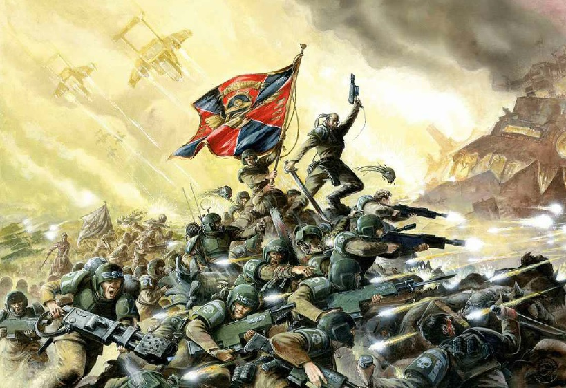

<!-- A0493-B0016 -->

原译文

The Astra Militarum 星界军

**校订译文**

The Astra Militarum 星界军

<!-- /A0493-B0016 -->

<!-- A0493-B0017 -->
**英文原文**

The Guard forms the very backbone of the Imperium; without it, Mankind would surely perish. Whilst regular Guardsmen are hardly the equals of Space Marines, fighting neither with the advantages of genetic enhancement or the most powerful personal weaponry, the Guard possesses the courage and the manpower to face and annihilate the enemies of the Emperor across the galaxy.

<!-- /A0493-B0017 -->

<!-- A0493-B0018 -->

原译文

卫队是帝国的中坚力量；没有它，人类肯定会灭亡。虽然常规卫队很难与星际战士相提并论，既没有基因增强的优势，也没有最强大的个人武器，但卫队拥有勇气和人力，可以在银河系中面对并消灭帝皇之敌。

**校订译文**

卫队是帝国真正的支柱；没有它，人类必将灭亡。普通卫兵难以与星际战士匹敌，既没有基因强化，也缺乏最强大的单兵武器，但卫队凭借勇气与充足兵力，仍能在银河各地迎战并消灭帝皇之敌。

<!-- /A0493-B0018 -->

<!-- A0493-B0019 -->
## Origins 起源

<!-- /A0493-B0019 -->

<!-- A0493-B0020 -->
**英文原文**

The Astra Militarum, as the standing Human armed force of the Imperium, can trace its origin back to the days of the Great Crusade, several millennia ago, when it was a somewhat different organisation known as the Imperial Army. Following the events of the Horus Heresy, however, the Imperial Army was split into two organisations; the Astra Militarum, and the Imperial Navy. This was done to prevent the possibility of large-scale rebellions occurring again, as the new regulations ensured that the link between fleet and army was severed.

<!-- /A0493-B0020 -->

<!-- A0493-B0021 -->

原译文

星界军作为帝国的常备人类武装力量，其起源可以追溯到几千年前的大远征时期，当时它是一个稍微不同的组织，被称为帝国军队。然而，在荷鲁斯叛乱事件之后，帝国军队分裂为两个组织；星界军和帝国海军。这样做是为了防止大规模叛乱再次发生的可能性，因为新规定确保了舰队和军队之间的联系被切断。

**校订译文**

星界军作为帝国的常备人类武装力量，其起源可以追溯至数千年前的大远征。当时的组织形式有所不同，被称为帝国军。荷鲁斯之乱之后，帝国军拆分为星界军与帝国海军。新规切断陆军与舰队的一体化指挥关系，旨在防止再次出现大规模叛乱。

<!-- /A0493-B0021 -->

<!-- A0493-B0022 -->
**英文原文**

Since then, the Imperial Guard has endured the vast majority of the fighting in the Imperium's wars. Defending all fronts simultaneously, the Astra Militarum has crushed rebellions and alien empires alike.

<!-- /A0493-B0022 -->

<!-- A0493-B0023 -->

原译文

从那时起，帝国卫队经历了帝国战争中的绝大多数战斗。星界军同时保卫所有战线，粉碎了叛乱和外星帝国。

**校订译文**

此后，帝国卫队承担了帝国战争中绝大多数的战斗。星界军同时坚守各条战线，既镇压叛乱，也摧毁异形帝国。

<!-- /A0493-B0023 -->

<!-- A0493-B0024 -->
## Structure 结构

<!-- /A0493-B0024 -->

<!-- A0493-B0025 -->
**英文原文**

The Astra Militarum has numerous subdivisions, most notable of which are the Militarum Vendorum, Militarum Ordinatus, Militarum Auxilla, Militarum Tempestus, Militarum Regimentos, Departmento Tacticae, Militarum Strategos, and Astra Militarum Intelligence Service. In turn, the Astra Militarum is overseen by the Departmento Munitorum's Officio Prefectus (also known as the Commissariat).

<!-- /A0493-B0025 -->

<!-- A0493-B0026 -->

原译文

星界军有许多分支机构，其中最著名的是后勤部、军械部、亚人辅助军、风暴军、兵团管理部、战术部、战略部和星界军情报部门。反过来，星界军由军务部的长官部（也称为政委部）监督。

**校订译文**

星界军下设众多分支，其中较重要的包括后勤部、军械部、军务辅助部队、暴风军、兵团管理部、战术部、战略部和星界军情报部门。星界军本身则受军务部下辖的长官部监督，该机构亦称政委部。

<!-- /A0493-B0026 -->

<!-- A0493-B0027 图片 -->
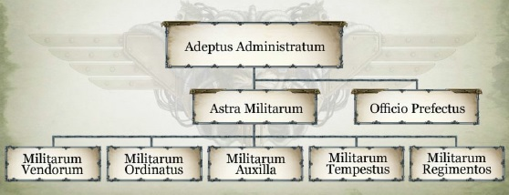

<!-- A0493-B0028 -->

原译文

Astra Militarum administrative structure 星界军管理结构

**校订译文**

Astra Militarum administrative structure 星界军管理结构

<!-- /A0493-B0028 -->

<!-- A0493-B0029 -->
**英文原文**

The Astra Militarum's fighting forces are organised into largely autonomous regiments. These regiments are raised by the worlds of the Imperium that have been classified as fit for such a purpose. These regiments can be sent anywhere in the galaxy, potentially serving in designated combat-zones for years at a time. It is not considered likely that any Guardsman will return to their world of origin; a fading memory of home is considered one of the average Guardsman's most constant companions. But while Guardsmen likely will never return home, they are often deployed as garrisons on worlds ravaged by war. Should a regiment be the only semblance of Imperial order left on a world after a particularly costly but bravely fought campaign, they may be granted custodianship of the planet as a reward. The officers of such regiments inevitably become wealthy and powerful figures locally, forming a new noble and ruling class. This Right of Settlement is the closest thing a Guardsmen can ever hope for with regards to retirement.

<!-- /A0493-B0029 -->

<!-- A0493-B0030 -->

原译文

星界军的战斗部队被组织成基本自治的兵团。这些兵团是由帝国的世界组建的，这些世界被归类为适合这样的目的。这些兵团可以被派往银河系的任何地方，可能一次在指定的战区服役多年。据认为，任何卫队都不太可能回到他们的原籍世界；对家园的淡忘被认为是普通卫兵最常陪伴的之一。但是，尽管卫队可能永远不会回家，但他们经常被部署为饱受战争蹂躏的世界的驻军。如果一个兵团是帝国秩序在一场特别代价高昂但英勇作战的战役后在世界上留下的唯一表象，他们可能会被授予行星监护权作为奖励。这些兵团的军官不可避免地在当地成为富有和有权势的人物，形成了一个新的贵族和统治阶级。这种定居权是卫队在退休方面最接近的希望。

**校订译文**

星界军的作战部队编为拥有较大自主权的兵团，由被认定适合承担征兵义务的帝国世界组建。这些兵团可被派往银河任何地方，在指定战区连续服役多年。卫兵通常很难重返故乡；日渐模糊的家园记忆，往往是他们最恒久的陪伴。不过，他们经常会被安排驻守遭战火蹂躏的世界。如果某个兵团经历一场英勇而代价惨重的战役后，成为当地残存的唯一帝国秩序，便可能获授行星治理权作为奖赏。团内军官随之成为当地富有而显赫的人物，形成新的贵族与统治阶层。这种“定居权”，就是普通卫兵所能期待的、最接近退役安居的结局。

<!-- /A0493-B0030 -->

<!-- A0493-B0031 -->
**英文原文**

Whilst individual regiments are commanded by their own officers, when regiments are combined together to form a battlegroup, overall command is often placed with a General Staff specifically created for the purpose by the Departmento Munitorum. Such officers and tacticians are highly trained in their esoteric art of commanding from the rear, and often stand in stark contrast to regimental commanders at the front, who more often than not lead by example.

<!-- /A0493-B0031 -->

<!-- A0493-B0032 -->

原译文

虽然各个兵团由自己的军官指挥，但当兵团合并在一起形成一个战斗群时，总体指挥通常由军务部专门为此目的创建的总参谋部负责。这些军官和战术家在从后方指挥的深奥艺术方面训练有素，与前线的兵团指挥官形成鲜明对比，后者往往以身作则。

**校订译文**

各兵团由本团军官指挥，但多个兵团组成战斗群时，通常由军务部为此设立的总参谋部统一指挥。这些军官与战术人员受过专门训练，精通在后方统筹战事的复杂技艺；他们与前线往往身先士卒的兵团指挥官，形成鲜明对比。

<!-- /A0493-B0032 -->

<!-- A0493-B0033 -->
### Command Structure 指挥结构

<!-- /A0493-B0033 -->

<!-- A0493-B0034 -->
**英文原文**

The Astra Militarum is ultimately run by the Departmento Munitorum, who have three seats on the council of the High Lords of Terra. It provides the daunting task of managing the Astra Militarum's logistics and supplies all its supplies, equipment, training, and also some of the representatives sent to worlds with an Astra Militarum presence. While they do not directly control the prosecution of Imperial military strategy, they have devolved power to different sections of the Imperium, at the planetary level, subsector level and sector level. Each world compares the threat posed to them against a previously defined threat-level and if it is deemed dangerous enough, the threat is passed to the subsector level and troops from surrounding worlds may be mobilised. If the threat increases further a full scale request to the sector level can see hundreds of worlds mobilising and converging on one system or group of systems.

<!-- /A0493-B0034 -->

<!-- A0493-B0035 -->

原译文

星界军最终由军务部管理，该部门在泰拉高领主议会中拥有三个席位。它提供了管理星界军后勤的艰巨任务，并为其所有物资、设备、训练以及与星界军一起派往世界的一些代表提供补给。虽然他们不直接控制帝国军事战略的实施，但他们已将权力下放给帝国的不同部门，包括行星级、分区级和星区级。每个世界将其面临的威胁与之前定义的威胁级别进行比较，如果认为足够危险，则将威胁传递给分区级别，并可能动员来自周围世界的部队。如果威胁进一步增加，对星区级别的全面请求可以看到数百个世界动员起来，并集中在一个星系或一组星系上。

**校订译文**

星界军最终由军务部管理，后者在泰拉高领主议会中有三名代表。军务部承担繁重的后勤工作，负责物资、装备、训练，并向有星界军驻扎的世界派出部分代表。它虽不直接负责帝国军事战略的实施，却将相应权力下放到行星、次星区和星区各级机构。每个世界依据预设的威胁标准评估局势；危险达到一定程度，就向次星区上报，周边世界的部队便可能被动员。威胁进一步升级时，向星区全面求援，则可能使数百个世界动员兵力，汇集至一个或一组星系。

<!-- /A0493-B0035 -->

<!-- A0493-B0036 图片 -->
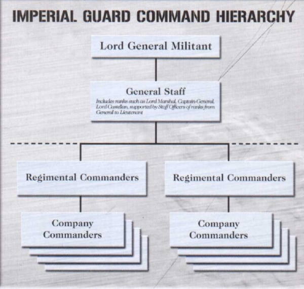

<!-- A0493-B0037 -->

原译文

Command Structure of the Astra Militarum 星界军指挥结构

**校订译文**

Command Structure of the Astra Militarum 星界军指挥结构

<!-- /A0493-B0037 -->

<!-- A0493-B0038 -->
**英文原文**

However this process is notoriously slow and inefficient due to the size and scope of the Imperium and its bureaucracy. A plea for aid may not be acted on for months, years, or even decades. As a result, cries for reinforcements can go unheeded for eons and fleets often arrive to find that the planet they were sent to aid has long since been destroyed.

<!-- /A0493-B0038 -->

<!-- A0493-B0039 -->

原译文

然而，由于帝国及其官僚机构的规模和范围，这一过程是出了名的缓慢和低效。援助请求可能在几个月、几年甚至几十年内都不会得到回应。因此，增援的呼声可能会被忽视很久，舰队经常抵达时发现，他们被派去援助的星球早已被摧毁。

**校订译文**

然而，由于帝国及其官僚机构的规模和范围，这一过程是出了名的缓慢和低效。援助请求可能在几个月、几年甚至几十年内都不会得到回应。因此，增援的呼声可能会被忽视很久，舰队经常抵达时发现，他们被派去援助的星球早已被摧毁。

<!-- /A0493-B0039 -->

<!-- A0493-B0040 -->
**英文原文**

But should a planet come attack from an enemy and the local Planetary Defence Forces prove insufficient to overcome it, and should the petitions to the Departmento Munitorum for aid go smoothly, the primary response to an attack on an Imperial world will consist of the Imperial Guard. As war descends upon neighbouring systems new regiments will be raised and army groups of many regiments drawn from the resources of nearby planets. When an army is assembled regiments are drawn from many different planets, resulting in a conglomeration of uniforms and combat skills rather than a single homogenous force. Should the initial response not prove decisive enough to defeat the enemy, reinforcements will be drawn from further away and more new regiments will be raised to replace their losses. The ponderous process repeats itself until the enemy is grounded down and destroyed in what is often a grueling war of attrition.

<!-- /A0493-B0040 -->

<!-- A0493-B0041 -->

原译文

但是，如果一颗行星遭到敌人的攻击，而当地的行星防御部队被证明不足以克服它，并且向军务部请求援助的请求进展顺利，那么对帝国世界的攻击的主要反应将是帝国卫队。随着战争降临到邻近的星系，将组建新的兵团，并从附近行星的资源中抽调许多兵团的军队。当一支军队集结时，从许多不同的行星上抽调兵团，导致一致和战斗技能的聚集，而不是一支单一的同质部队。如果最初的反应不够果断，无法击败敌人，将从更远的地方增援，并组建更多的新兵团来弥补损失。这个漫长的过程会不断重复，直到敌人在一场通常是艰苦的消耗战中被牵制和摧毁。

**校订译文**

如果一颗帝国行星遭到进攻，本地行星防御部队无力击退敌人，而向军务部求援的过程又顺利，前来应援的主力便是帝国卫队。随着战火蔓延至邻近星系，新的兵团将被组建，附近行星的资源也会被用于集结由多个兵团组成的集团军。兵团来自不同星球，因此集结的军队拥有五花八门的制服和作战专长，而不是整齐划一的同质部队。首批兵力不足以制胜时，就从更远处调来援军，再组建更多兵团填补损失。这一迟缓的过程不断重复，直到敌人在漫长而艰苦的消耗战中被拖垮、歼灭。

<!-- /A0493-B0041 -->

<!-- A0493-B0042 -->
### Regimental Structure 兵团结构

<!-- /A0493-B0042 -->

<!-- A0493-B0043 -->
**英文原文**

The regiment is the primary unit of the Astra Militarum. Recruited from a single planet at a single raising of the Imperial Tithe, it is founded as a complete entity, complete with its own officer, supply, and support cadres. It should be noted however, that like most everything else in the Guard, the precise details of even these essential elements can vary widely from world to world. Whilst the majority of the regiment, even the non-combatant personnel, will come from their founding world, the Commissars assigned to it are always off-worlders. A regiment at full-strength can consist of tens of thousands or even hundreds of thousands of personnel. Regiments based around a more specific niche such as Super-Heavy Tanks are usually smaller, such as the Vostroyan Armoured 24th that numbers only 1,500 tank crew and support personnel operating around a dozen Baneblades and Shadowswords.

<!-- /A0493-B0043 -->

<!-- A0493-B0044 -->

原译文

兵团是星界军的主要单位。它是从一个行星上招募来的，在帝国什一税的一次提升中，它被建立为一个完整的实体，拥有自己的军官、补给和支援干部。然而，应该指出的是，与卫队中的大多数其他事物一样，即使是这些基本要素的确切细节也可能因世界而异。虽然该兵团的大多数人，甚至是非战斗人员，都将来自他们的建军世界，但分配给它的政委总是脱离世界的。一个满员兵团可以由数万甚至数十万人组成。以超重型坦克等更具体的生态位为基础的部队通常规模较小，例如沃斯托尼亚第24装甲团，只有1500名坦克乘员和支援人员，操作着十几辆毒刃和影剑。

**校订译文**

兵团是星界军的基本单位，通常由某颗行星在一次帝国什一税征收中组建，自成立起就具备自己的军官、补给和支援人员。不过，与卫队中的多数事物一样，即使这些基本组成的具体细节，也会因世界而异。团内绝大多数成员，包括非战斗人员，都来自建军世界，但配属政委必定来自其他星球。满员兵团可有数万乃至数十万人。承担专门任务的兵团，例如超重型坦克团，通常规模较小：沃斯特洛亚第 24 装甲团只有一千五百名坦克乘员和支援人员，操作约十余辆毒刃与影剑。

<!-- /A0493-B0044 -->

<!-- A0493-B0045 图片 -->
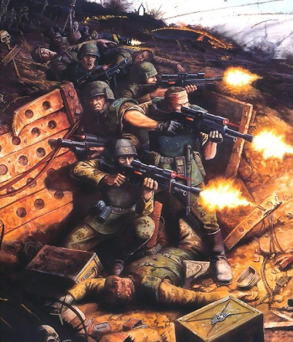

<!-- A0493-B0046 -->

原译文

Troops of the Astra Militarum 星界军部队

**校订译文**

Troops of the Astra Militarum 星界军部队

<!-- /A0493-B0046 -->

<!-- A0493-B0047 -->
**英文原文**

Regiments are typically divided into several Companies according to a set of templates detailed in the Tactica Imperialis. The number of companies in a regiment depends upon the type and size of the forces at the commander's disposal, but may consist of as few as three or as many as twenty. Companies are further organized into Platoons, which are further divided into ten-man infantry squads. Support units, such as heavy weapons units, specialists, vehicles, artillery, and Abhumans may be attached to a company for a single battle or an entire campaign. However they are rarely permanent additions to a Regiment and are attached as needed by commanders. It is common practice, especially in armoured and artillery regiments, to break down several companies and attach them to infantry forces in exchange for platoons to provide close support from attentions of the enemy. If serving together for extended durations, attached units tend to adopt their foster-regiment's uniform and unit markings.

<!-- /A0493-B0047 -->

<!-- A0493-B0048 -->

原译文

根据帝国战术中详细介绍的一组模板，兵团通常被分为几个连。一个兵团中的连的数量取决于指挥官可支配部队的类型和规模，但可能少至三个或多至二十个。连进一步组织成排，排又分为十人步兵班。支援部队，如重型武器部队、专家、载具、火炮和亚人，可能隶属于一个连，用于一场战斗或整个战役。然而，他们很少是一个团的永久性增建，并根据指挥官的需要进行配备。通常的做法是，特别是在装甲和炮兵团中，分解几个连并将其附属于步兵部队，以换取排在敌人注意时提供近战支援。如果长期在一起服役，附属部队倾向于采用其寄养兵团的制服和部队标志。

**校订译文**

兵团通常依据《帝国战术》中的编制范例分为若干连。连的数量取决于部队类型和规模，少则三个，多则二十个。连下设排，排再分为十人步兵班。重武器分队、专业人员、车辆、火炮及亚人等支援力量，可为一场战斗或整场战役临时配属给某个连，但很少永久加入该兵团，通常由指挥官按需调配。装甲团和炮兵团尤其常将若干连拆分，配属步兵部队，并换取步兵排为自身提供近距离保护，防范敌军攻击。配属单位长期一同服役后，往往会采用接收兵团的制服和标志。

<!-- /A0493-B0048 -->

<!-- A0493-B0049 -->
**英文原文**

An Astra Militarum regiment is essentially a temporary unit, unlike the Space Marine chapters. After being formed they normally receive no further reinforcements. It is rarely practical for regiments to receive new recruits from their homeworlds to replace casualties, mainly due to the immense distances between a regiment's homeworld and its posting. The costs, risks, and time-lag difficulties involved in transporting relatively few soldiers to reinforce their brethren rarely justify themselves, especially when alternate and more efficient means of reinforcement tend to exist. If on garrison or outpost duty, an Astra Militarum regiment may be able to recruit from the local population. If on active combat duty, two or more under-strength regiments may be merged together in order to create a new regiment at full strength. This can result in regiments being bolstered by troopers from their own homeworld, such as in the case of the Valhallan 597th Ice Warriors, or can result in a true mongrel unit, with the Guardsmen included coming from several different worlds (such as the Tanith First and Only).

<!-- /A0493-B0049 -->

<!-- A0493-B0050 -->

原译文

星界军兵团本质上是一个临时单位，与星际战士不同。在形成后，它们通常不会得到进一步的增援。对于兵团来说，从家园接收新兵来代替伤亡人员是不现实的，主要是因为兵团的家园和驻地之间距离很远。运送相对较少的士兵增援他们的兄弟所涉及的成本、风险和时滞困难很少能证明自己的合理性，尤其是在存在替代和更有效的增援手段的情况下。如果执行驻军或前哨任务，星界军兵团可能能够从当地居民中招募人员。如果正在执行现役任务，两个或多个兵力不足的兵团可以合并在一起，以组建一个满员的新兵团。这可能会导致兵团得到来自自己家园的士兵的支援，例如瓦尔哈拉冰雪战士第597团，也可能导致一个真正的混杂部队，其中包括来自几个不同世界的卫兵（如塔尼斯第一唯一团）。

**校订译文**

星界军兵团与星际战士战团不同，本质上是临时组建的单位。成立后，它们通常不会持续得到来自母星的新兵补充。兵团驻地距离母星往往过于遥远，为少量补员承担长途运输的成本、风险和时间延误，很少值得，尤其还有其他更有效的补充办法。执行驻防或前哨任务的兵团，可以从当地居民中招募人员；正在作战的两个或多个缺额兵团，则可能合并为一个满员新团。合并后的士兵有时仍来自同一母星，例如瓦尔哈拉冰雪战士第 597 团；也可能来自数个世界，形成混编部队，例如塔尼斯第一唯一团。

<!-- /A0493-B0050 -->

<!-- A0493-B0051 -->
**英文原文**

If any regiment survives for long enough, it can eventually receive reinforcement from children born to the Guardsmen who have been raised inside the regiment and can normally be expected to join it upon reaching the required age. These new recruits, officially designated as "probiters", but more commonly called Whiteshields, are formed into their own platoons where they receive their latter combat training by taking part in actual combat, until they are ready to join the regiment as Guardsmen proper.

<!-- /A0493-B0051 -->

<!-- A0493-B0052 -->

原译文

如果任何一个兵团能够存活足够长的时间，它最终可以从在兵团内长大的卫兵所生的孩子那里得到增援，通常可以在达到所需年龄后加入。这些新兵被正式指定为“正直者”，但更常见的是被称为白盾，他们被组成自己的排，在那里他们通过参加实战来接受后期的战斗训练，直到他们准备好作为卫兵加入该兵团。

**校订译文**

如果一个兵团存在得足够久，卫兵在团内生养、抚育的子女便可能成为新的兵源；他们达到规定年龄后，通常也会加入该团。这些新兵正式称为“见习兵”（probiters），更常见的称呼则是“白盾”。他们编成独立的排，在实战中完成后期训练，直到能够作为正式卫兵加入兵团。

**校注：** probiters 原译“正直者”是误解，指仍在受训、待正式编入的见习兵；更常用称呼 Whiteshields 沿白盾。

<!-- /A0493-B0052 -->

<!-- A0493-B0053 -->
**英文原文**

One known notable exception to this reinforcement rule is that of Vostroyan Firstborn regiments; due to the peculiar background of the Vostroyans, their Guard regiments are reinforced in the field by new recruits sent out by their homeworld, despite the difficulties involved.

<!-- /A0493-B0053 -->

<!-- A0493-B0054 -->

原译文

这一强化规则的一个已知的显著例外是沃斯托尼亚长子团；由于沃斯托尼亚人的特殊背景，尽管困难重重，但他们的卫队兵团在战场上得到了来自家园的新兵的增援。

**校订译文**

这一补员惯例有一个著名例外：沃斯特洛亚长子团。由于沃斯特洛亚人的特殊历史背景，即使困难重重，母星仍会持续派出新兵，为在外作战的兵团补员。

<!-- /A0493-B0054 -->

<!-- A0493-B0055 -->
**英文原文**

When reinforcement does not occur, for whatever reason, regiments may find themselves gradually depleted through casualties until they are destroyed in battle or mustered out for meritorious service. The former incidence is much more likely to occur than the latter.

<!-- /A0493-B0055 -->

<!-- A0493-B0056 -->

原译文

当增援没有发生时，无论出于什么原因，兵团都可能会发现自己因伤亡而逐渐耗尽，直到在战斗中被摧毁或被征召服役。前者比后者更有可能发生。

**校订译文**

如果由于种种原因始终得不到补员，兵团就会在伤亡中逐渐衰弱，最终要么在战斗中覆灭，要么因战功卓著而获准退役遣散；前一种结局远比后一种常见。

**校注：** mustered out for meritorious service 指因功退役遣散，原译“被征召服役”意思相反。

<!-- /A0493-B0056 -->

<!-- A0493-B0057 -->
### Recruitment 招募

<!-- /A0493-B0057 -->

<!-- A0493-B0058 -->
**英文原文**

Many of the new recruits inducted into newly raised Imperial Guard regiments will already have some modicum of fighting ability. They are often taken from their homeworlds own Planetary Defence Forces, where the visiting Administratum officials there for the Imperial Tithe commonly take 10% of the local forces strength for service in the Imperial Guard. Others come from savage Hive Worlds where only gang warfare is commonplace and only the strongest survive. More may come from medieval Feudal Worlds where they have taken part in tribal conflicts while others may have learned to survive the harsh conditions of their native Death World. In any case, upon being recruited via the Imperial Tithe, Guardsmen will receive intensive training that tempers their natural and native fighting skills and forges them into worthy soldiers. This often involves heavy indoctrination with regards to the Imperial Cult and regular screenings by Commissars.

<!-- /A0493-B0058 -->

<!-- A0493-B0059 -->

原译文

许多新加入新组建的帝国卫队兵团的新兵已经具备了一定的战斗能力。他们经常被从自己的星球防御部队中带走，在那里，来访的收取帝国什一税的内务部官员通常会带走当地部队10%的兵力，在帝国卫队服役。其他人来自野蛮的巢都世界，那里只有帮派战争司空见惯，只有最强的人才能生存。更多的人可能来自中世纪的封建世界，在那里他们参与了部落的冲突，而其他人可能已经学会了在当地死亡世界的恶劣条件下生存。无论如何，在通过帝国什一税招募后，卫兵将接受强化训练，锻炼他们的自然和本土战斗技能，并将他们锻造成有价值的士兵。这通常涉及帝国教派的大量灌输和政委的定期筛查。

**校订译文**

新组建的帝国卫队兵团中，许多新兵原本就具备一定的战斗能力。他们常从母星的行星防御部队中征调；前来征收帝国什一税的内政部官员，通常抽取当地兵力的百分之十，补充帝国卫队。另一些新兵来自残酷的巢都世界，帮派战争司空见惯，只有强者才能生存；还有人来自中世纪式的封建世界，曾参与部落冲突，或是在死亡世界的恶劣环境中学会求生。无论出身如何，新兵经什一税征召后，都要接受密集训练，将天生和故乡习得的战斗技巧锻炼成合格士兵的本领。训练通常还包括大量帝皇信仰灌输，以及政委定期进行的审查。

<!-- /A0493-B0059 -->

<!-- A0493-B0060 图片 -->
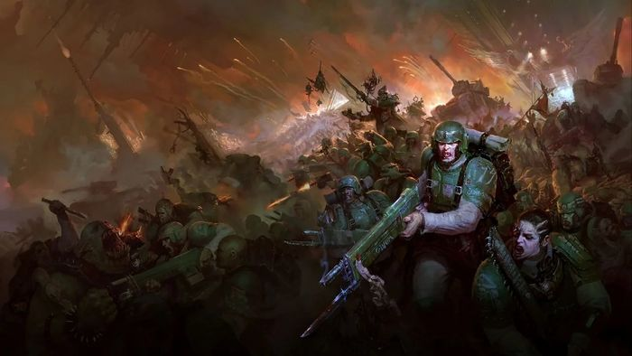

<!-- A0493-B0061 -->

原译文

Astra Militarum forces battle Orks 星界军部队与欧克作战

**校订译文**

Astra Militarum forces battle Orks 星界军部队与欧克蛮人作战

<!-- /A0493-B0061 -->

<!-- A0493-B0062 -->
**英文原文**

After being raised, the regiment is shipped to its posting; they receive their training on Imperial Navy vessels during the often lengthy interstellar voyage. Their posting can be directly into the heart of a warzone, or it may be to garrison or outpost duty.

<!-- /A0493-B0062 -->

<!-- A0493-B0063 -->

原译文

被提升后，该兵团被运送到其驻地；在漫长的星际航行中，他们在帝国海军战舰上接受训练。他们的驻扎可以直接进入战区的中心，也可以是驻军或前哨任务。

**校订译文**

兵团组建后便被运往驻地，并在通常漫长的星际旅途中，于帝国海军舰上接受训练。目的地可能是战区核心，也可能是驻防地或前哨。

<!-- /A0493-B0063 -->

<!-- A0493-B0064 -->
**英文原文**

Due to the myriad threats and unending wars facing the Imperium, even the gargantuan Imperial Guard finds itself frequently the victim of critical manpower shortages and a heavily overworked General Staff. As a result, mass conscription on such a scale that entire Hive cities are emptied to fuel war efforts are known to occur, especially in light of the formation of the Great Rift. Unlike the Guardsmen recruited through routine tithes, these hastily assembled conscripts often only have the barest training and equipment.

<!-- /A0493-B0064 -->

<!-- A0493-B0065 -->

原译文

由于帝国面临的无数威胁和无休止的战争，即使是庞大的帝国卫队也经常成为严重人力短缺和总参谋部过度劳累的受害者。因此，众所周知，大规模征兵的规模如此之大，以至于整个巢都城市都被清空以助长战争，尤其是在大裂隙形成的情况下。与通过常规什一税招募的卫队不同，这些匆忙集结的应征入伍者往往只有最简陋的训练和装备。

**校订译文**

面对帝国数不清的威胁与无休止的战争，就连庞大的帝国卫队也常陷入严重缺员，总参谋部更是不堪重负。因此，有时会出现将整座巢都几乎征空的大规模征兵，尤其在大裂隙形成之后。与通过常规什一税征入的卫兵不同，这些仓促集结的新兵通常只有最基本的训练和装备。

<!-- /A0493-B0065 -->

<!-- A0493-B0066 -->
### The Regiments of the Astra Militarum 星界军兵团

<!-- /A0493-B0066 -->

<!-- A0493-B0067 -->
**英文原文**

There are countless thousands of regiments spread throughout the galaxy. Some are garrisoning worlds, others are part of campaigns or crusades and some have even been forgotten about by the Departmento Munitorum and Administratum. As such there has never been and never will be an absolutely complete list of regiments available for combat.

<!-- /A0493-B0067 -->

<!-- A0493-B0068 -->

原译文

银河系中分布着无数个兵团。有些是驻防世界，有些是战役或远征的一部分，有些甚至被军务部和内务部遗忘了。因此，从来没有也永远不会有一份绝对完整的可供战斗的兵团名单。

**校订译文**

银河各处分布着成千上万的兵团：有的驻守世界，有的参加战役或远征，有的甚至已经被军务部与内政部遗忘。因此，从来没有、将来也不可能有一份绝对完整的可用兵团名单。

<!-- /A0493-B0068 -->

<!-- A0493-B0069 图片 -->
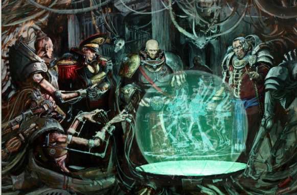

<!-- A0493-B0070 -->

原译文

Imperial Guard Commanders analyze a battlefield 帝国卫队指挥官分析战场

**校订译文**

Imperial Guard Commanders analyze a battlefield 帝国卫队指挥官分析战场

<!-- /A0493-B0070 -->

<!-- A0493-B0071 -->
**英文原文**

Some of the most notable regiments include:

<!-- /A0493-B0071 -->

<!-- A0493-B0072 -->

原译文

一些最著名的兵团包括

**校订译文**

一些最著名的兵团包括

<!-- /A0493-B0072 -->

<!-- A0493-B0073 -->

原译文

Armageddon Steel Legion 阿玛吉多顿钢铁军团

**校订译文**

Armageddon Steel Legion 阿玛吉多顿钢铁军团

<!-- /A0493-B0073 -->

<!-- A0493-B0074 -->

原译文

Attilan Rough Riders 阿提拉蛮骑兵

**校订译文**

Attilan Rough Riders 阿提拉蛮骑兵

<!-- /A0493-B0074 -->

<!-- A0493-B0075 -->

原译文

Cadian Shock Troopers 卡迪亚突击军

**校订译文**

Cadian Shock Troopers 卡迪亚突击军

<!-- /A0493-B0075 -->

<!-- A0493-B0076 -->

原译文

Catachan Jungle Fighters 卡塔昌丛林战士

**校订译文**

Catachan Jungle Fighters 卡塔昌丛林斗士

<!-- /A0493-B0076 -->

<!-- A0493-B0077 -->

原译文

Death Korps of Krieg 克里格死亡军团

**校订译文**

Death Korps of Krieg 克里格死亡军团

<!-- /A0493-B0077 -->

<!-- A0493-B0078 -->

原译文

Elysian Drop Troops 艾丽西亚空降兵

**校订译文**

Elysian Drop Troops 艾丽西亚空降兵

<!-- /A0493-B0078 -->

<!-- A0493-B0079 -->

原译文

Mordian Iron Guard 莫迪安铁卫

**校订译文**

Mordian Iron Guard 莫迪安铁卫

<!-- /A0493-B0079 -->

<!-- A0493-B0080 -->

原译文

Tallarn Desert Raiders 塔兰沙漠突袭者

**校订译文**

Tallarn Desert Raiders 塔兰沙漠突袭者

<!-- /A0493-B0080 -->

<!-- A0493-B0081 -->

原译文

Tanith First and Only 塔尼斯第一唯一团

**校订译文**

Tanith First and Only 塔尼斯第一唯一团

<!-- /A0493-B0081 -->

<!-- A0493-B0082 -->

原译文

Valhallan Ice Warriors 瓦尔哈拉冰雪战士

**校订译文**

Valhallan Ice Warriors 瓦尔哈拉冰雪战士

<!-- /A0493-B0082 -->

<!-- A0493-B0083 -->

原译文

Vostroyan Firstborn 沃斯托尼亚长子团

**校订译文**

Vostroyan Firstborn 沃斯特洛亚长子团

<!-- /A0493-B0083 -->

<!-- A0493-B0084 -->
**英文原文**

Other, lesser known, regiments are:

<!-- /A0493-B0084 -->

<!-- A0493-B0085 -->

原译文

其他鲜为人知的团包括：

**校订译文**

其他鲜为人知的团包括：

<!-- /A0493-B0085 -->

<!-- A0493-B0086 -->

原译文

13th Penal Legion 第13刑罚军团

**校订译文**

13th Penal Legion 第13刑罚军团

<!-- /A0493-B0086 -->

<!-- A0493-B0087 -->

原译文

Athonian Tunnel Rats 阿托尼亚隧道鼠

**校订译文**

Athonian Tunnel Rats 阿托尼亚隧道鼠

<!-- /A0493-B0087 -->

<!-- A0493-B0088 -->

原译文

Faeburn Vanquishers 法伯恩征服者

**校订译文**

Faeburn Vanquishers 法伯恩征服者

<!-- /A0493-B0088 -->

<!-- A0493-B0089 -->

原译文

Harakoni Warhawks 哈拉考尼战隼

**校订译文**

Harakoni Warhawks 哈拉考尼战隼

<!-- /A0493-B0089 -->

<!-- A0493-B0090 -->

原译文

Indigan Praefects 因迪加近卫军

**校订译文**

Indigan Praefects 因迪加近卫军

<!-- /A0493-B0090 -->

<!-- A0493-B0091 -->

原译文

Kanak Skull Takers 卡纳科携颅者

**校订译文**

Kanak Skull Takers 卡纳科携颅者

<!-- /A0493-B0091 -->

<!-- A0493-B0092 -->

原译文

Mordant Acid Dogs 莫丹特强酸狗

**校订译文**

Mordant Acid Dogs 莫丹特强酸狗

<!-- /A0493-B0092 -->

<!-- A0493-B0093 -->

原译文

Miasman Redcowls 米亚斯曼红袍军

**校订译文**

Miasman Redcowls 米亚斯曼红袍军

<!-- /A0493-B0093 -->

<!-- A0493-B0094 -->

原译文

Praetorian Guard 忠诚禁卫

**校订译文**

Praetorian Guard 忠诚禁卫

<!-- /A0493-B0094 -->

<!-- A0493-B0095 -->

原译文

Savlar Chem Dogs 萨夫拉化学狗

**校订译文**

Savlar Chem Dogs 萨夫拉化学狗

<!-- /A0493-B0095 -->

<!-- A0493-B0096 -->

原译文

Terrax Guard 特瑞克斯近卫军

**校订译文**

Terrax Guard 特瑞克斯近卫军

<!-- /A0493-B0096 -->

<!-- A0493-B0097 -->

原译文

Truskan Snowhounds 崔斯卡雪原猎犬

**校订译文**

Truskan Snowhounds 崔斯卡雪原猎犬

<!-- /A0493-B0097 -->

<!-- A0493-B0098 -->

原译文

Ventrillian Nobles 文崔利安贵族军

**校订译文**

Ventrillian Nobles 文崔利安贵族军

<!-- /A0493-B0098 -->

<!-- A0493-B0099 -->

原译文

Vresh Grenadiers 乌列什掷弹兵

**校订译文**

Vresh Grenadiers 乌列什掷弹兵

<!-- /A0493-B0099 -->

<!-- A0493-B0100 -->
## Heroes of the Astra Militarum 星界军的英雄

<!-- /A0493-B0100 -->

<!-- A0493-B0101 -->
**英文原文**

Certain members of regiments have become famous throughout a region, or sometimes the entire Imperium. They are often the officers or commanders rather than individual guardsmen and they are remembered as saviours of humanity, seen spreading the light of the Emperor far and wide, or protecting it from the ravages of Xenos, mutants and heretics. Some of these figures are listed below.

<!-- /A0493-B0101 -->

<!-- A0493-B0102 -->

原译文

某些兵团的成员在整个地区，有时甚至是整个帝国都很出名。他们通常是军官或指挥官，而不是个体卫兵，他们被人们铭记为人类的救世主，被视为将帝皇之光传播到四面八方，或保护它免受异型、变种人和异端的蹂躏。下面列出了其中一些成员。

**校订译文**

某些兵团成员会名扬一方，甚至享誉整个帝国。他们通常是军官或指挥官，而非普通卫兵。人们将他们铭记为人类的救星，认为他们将帝皇之光传播至远方，或保护人类免受异形、变种人与异端蹂躏。以下列出其中一些人物。

<!-- /A0493-B0102 -->

<!-- A0493-B0103 图片 -->
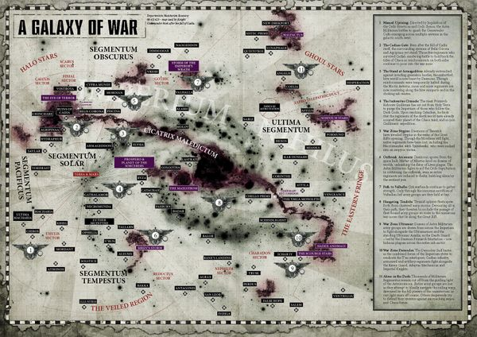

<!-- A0493-B0104 -->

原译文

Imperial Guard deployments across the Galaxy 帝国卫队在银河中的部署

**校订译文**

Imperial Guard deployments across the Galaxy 帝国卫队在银河中的部署

<!-- /A0493-B0104 -->

<!-- A0493-B0105 -->

原译文

Lord Commander Solar Macharius 太阳领主指挥官马卡里乌斯

**校订译文**

Lord Commander Solar Macharius 太阳领主指挥官马卡里乌斯

<!-- /A0493-B0105 -->

<!-- A0493-B0106 -->

原译文

Lord Commander Solar Arcadian Leontus 太阳领主指挥官阿卡迪亚·雷昂图斯

**校订译文**

Lord Commander Solar Arcadian Leontus 太阳领主阿卡迪亚·雷昂图斯

<!-- /A0493-B0106 -->

<!-- A0493-B0107 -->

原译文

Warmaster Macaroth 战帅马卡龙

**校订译文**

Warmaster Macaroth 战帅马卡洛斯

<!-- /A0493-B0107 -->

<!-- A0493-B0108 -->

原译文

Warmaster Slaydo 战帅斯莱多

**校订译文**

Warmaster Slaydo 战帅斯莱多

<!-- /A0493-B0108 -->

<!-- A0493-B0109 -->

原译文

Lord Castellan Ursarkar E. Creed 堡主领主乌尔萨卡·E·克里德

**校订译文**

Lord Castellan Ursarkar E. Creed 堡主领主乌尔萨卡·E·克里德

<!-- /A0493-B0109 -->

<!-- A0493-B0110 -->

原译文

Lord Castellan Ursula Creed 堡主领主乌尔苏拉·克里德

**校订译文**

Lord Castellan Ursula Creed 堡主领主厄苏拉·克里德

<!-- /A0493-B0110 -->

<!-- A0493-B0111 -->

原译文

Lord Marshal Varnan Dreir 元帅领主瓦尔南·德莱尔

**校订译文**

Lord Marshal Varnan Dreir 大元帅瓦尔南·德雷尔

<!-- /A0493-B0111 -->

<!-- A0493-B0112 -->

原译文

Commissar Sebastian Yarrick 政委塞巴斯蒂安·亚瑞克

**校订译文**

Commissar Sebastian Yarrick 政委塞巴斯蒂安·亚瑞克

<!-- /A0493-B0112 -->

<!-- A0493-B0113 -->

原译文

Commissar Ciaphas Cain 政委凯法斯·凯恩

**校订译文**

Commissar Ciaphas Cain 政委凯法斯·凯恩

<!-- /A0493-B0113 -->

<!-- A0493-B0114 -->

原译文

Colonel-Commissar Ibram Gaunt 上校政委伊布拉姆·冈特

**校订译文**

Colonel-Commissar Ibram Gaunt 上校政委伊布拉姆·冈特

<!-- /A0493-B0114 -->

<!-- A0493-B0115 -->

原译文

Commander Kubrik Chenkov 指挥官库布里克·琴科夫

**校订译文**

Commander Kubrik Chenkov 指挥官库布里克·琴科夫

<!-- /A0493-B0115 -->

<!-- A0493-B0116 -->

原译文

Commissar Severina Raine 政委萨佛瑞娜·芮恩

**校订译文**

Commissar Severina Raine 政委萨佛瑞娜·芮恩

<!-- /A0493-B0116 -->

<!-- A0493-B0117 -->

原译文

Colonel Schaeffer 上校谢弗尔

**校订译文**

Colonel Schaeffer 上校谢弗尔

<!-- /A0493-B0117 -->

<!-- A0493-B0118 -->

原译文

Colonel 'Iron Hand' Straken 上校‘铁手’斯塔肯

**校订译文**

Colonel 'Iron Hand' Straken 上校‘铁手’斯特瑞肯

<!-- /A0493-B0118 -->

<!-- A0493-B0119 -->

原译文

Captain Al'rahem 连长阿尔·拉赫姆

**校订译文**

Captain Al'rahem 连长阿尔·拉赫姆

<!-- /A0493-B0119 -->

<!-- A0493-B0120 -->

原译文

Captain Mogul Kamir 连长莫卧儿·卡米尔

**校订译文**

Captain Mogul Kamir 连长莫卧儿·卡米尔

<!-- /A0493-B0120 -->

<!-- A0493-B0121 -->

原译文

Tank Commander Pask 坦克指挥官帕斯克

**校订译文**

Tank Commander Pask 坦克指挥官帕斯克

<!-- /A0493-B0121 -->

<!-- A0493-B0122 -->

原译文

Gunnery Sergeant Harker 炮手军士哈克

**校订译文**

Gunnery Sergeant Harker 炮手军士哈克

<!-- /A0493-B0122 -->

<!-- A0493-B0123 -->

原译文

Colour Sergeant Jarran Kell 旗帜军士贾兰·凯尔

**校订译文**

Colour Sergeant Jarran Kell 旗帜军士贾兰·凯尔

<!-- /A0493-B0123 -->

<!-- A0493-B0124 -->

原译文

Sergeant Lukas Bastonne 军士卢卡斯·巴斯托尼

**校订译文**

Sergeant Lukas Bastonne 军士卢卡斯·巴斯托尼

<!-- /A0493-B0124 -->

<!-- A0493-B0125 -->

原译文

Conscript Minka Lesk 征召兵敏卡·莱斯克

**校订译文**

Conscript Minka Lesk 征召兵敏卡·莱斯克

<!-- /A0493-B0125 -->

<!-- A0493-B0126 -->
**英文原文**

Nork Deddog - Catachan Ogryn commander and legendary bodyguard

<!-- /A0493-B0126 -->

<!-- A0493-B0127 -->

原译文

诺克·德多格 - 卡塔昌欧格林指挥官和传奇保镖

**校订译文**

保镖诺克——卡塔昌的欧格林指挥官、传奇保镖。

<!-- /A0493-B0127 -->

<!-- A0493-B0128 -->
**英文原文**

Sly Marbo - Catachan sniper known as the One Man Army

<!-- /A0493-B0128 -->

<!-- A0493-B0129 -->

原译文

斯莱·马博 - 被称为“一人军队”的卡塔昌狙击手

**校订译文**

斯莱·马博 - 被称为“一人军队”的卡塔昌狙击手

<!-- /A0493-B0129 -->

<!-- A0493-B0130 -->
**英文原文**

Stumper Muckstart - Ratling sharpshooter

<!-- /A0493-B0130 -->

<!-- A0493-B0131 -->

原译文

斯特姆佩尔.马克斯达 - 莱特林神射手

**校订译文**

斯特姆佩尔·马克斯达——莱特林神射手。

<!-- /A0493-B0131 -->

<!-- A0493-B0132 -->
**英文原文**

Ollanius Pius - Patron saint of the Astra Militarum

<!-- /A0493-B0132 -->

<!-- A0493-B0133 -->

原译文

欧兰尼奥斯·皮乌斯 - 星界军的主保圣人

**校订译文**

欧良尼乌斯·庇乌斯——星界军的主保圣人。

**校注：** 名字词根依 GW-09/GW-10 第9页官方圣物名“欧良尼乌斯的死亡面具”；Pius 暂译庇乌斯，全名未获官方核对。与 Ollanius Persson 欧良尼乌斯·佩松分列，不据同名合并人物。

<!-- /A0493-B0133 -->

<!-- A0493-B0134 -->
## Equipment 装备

<!-- /A0493-B0134 -->

<!-- A0493-B0135 -->
**英文原文**

The Imperium's superstitious nature and mistrust of technological innovation has long precluded the development of new weapons. Even the slightest technological alteration in the manufacturing process in a gun or blade can invite the ire of the Adeptus Mechanicus. Some vehicle designs, such as the Leman Russ Battle Tank, are scarcely younger than the Imperium itself and have been in service for 10,000 years. Thus the Astra Militarum are reliant on a suite of weapons that have served Humanity for many millennia and often appear archaic in design when compared to other armies. But while the Astra Militarum relies on relatively simple fuel-fed tracked armoured vehicles such as the Chimera and its many variants, these ancient patterns are nonetheless highly reliable, simple to manufacture, and able to be effectively used in nearly any environment.

<!-- /A0493-B0135 -->

<!-- A0493-B0136 -->

原译文

帝国的迷信性质和对技术创新的不信任长期阻碍了新武器的发展。即使是枪或刀刃制造过程中最轻微的技术变化也会引起机械神教的愤怒。一些载具设计，如黎曼鲁斯战斗坦克，几乎不比帝国本身年轻，已经服役了10000年。因此，星界军依赖于一套为人类服务了数千年的武器，与其他军队相比，这些武器的设计往往显得过时。但是，虽然星界军依赖于相对简单的燃油履带式装甲车，如奇美拉及其许多变体，但这些古老的型号仍然非常可靠，易于制造，几乎可以在任何环境中有效使用。

**校订译文**

帝国的迷信与对技术创新的猜忌，长期阻碍新武器的开发。制造枪械或刀刃时，即使最微小的技术改动，也可能招致机械修会的愤怒。某些车辆设计，例如黎曼鲁斯战斗坦克，几乎与帝国同样古老，已服役一万年。因此，星界军依赖许多已为人类效力数千年的武器，与其他军队相比，其设计往往显得陈旧。不过，奇美拉及其各种衍生型号等结构相对简单的燃油履带装甲车辆，虽然古老，却可靠、易于制造，几乎能在任何环境中有效使用。

<!-- /A0493-B0136 -->

<!-- A0493-B0137 图片 -->
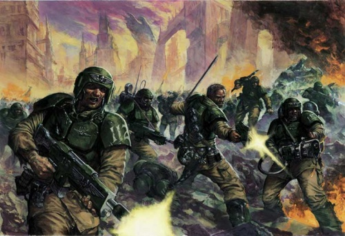

<!-- A0493-B0138 -->

原译文

Astra Militarum - Cadian Shock Troops 星界军 - 卡迪亚突击兵

**校订译文**

Astra Militarum - Cadian Shock Troops 星界军 - 卡迪亚突击军

<!-- /A0493-B0138 -->

<!-- A0493-B0139 -->
**英文原文**

The armoury of the Astra Militarum is vast and covers many aspects of the equipment necessary for the survival of a fighting force in many different environments. It ranges from portable Vox-casters, communications units, to medals denoting promotion and excellence in battle. Astra Militarum weaponry is produced on a massive level across a wide array of worlds, from simple manufactorums to advanced Forge World facilities based upon ancient STC templates. While varied in vintage and pattern, Astra Militarum weaponry remains broadly similar in overall form and function across the Imperium. The most ubiquitous weapon of the Astra Militarum is the venerable Lasgun, which while cheap and easy to maintain is known for its reliability. However other regiments may use more primitive projectile weapons such as Autoguns.

<!-- /A0493-B0139 -->

<!-- A0493-B0140 -->

原译文

星界军的军械库非常庞大，涵盖了战斗部队在许多不同环境中生存所需的许多方面的装备。它包括便携式音阵投射、通信设备，以及表示晋升和战斗卓越的奖牌。星界军武器在世界各地大规模生产，从简单的铸造厂到基于古代STC模板的先进铸造世界设施。虽然年代和样式各不相同，但星界军武器在整个帝国的整体形式和功能上仍然大致相似。星界军最普遍的武器是古老的激光枪，它虽然便宜且易于维护，但以其可靠性而闻名。然而，其他兵团可能会使用更原始的实弹武器，如自动枪。

**校订译文**

星界军的装备种类极为丰富，涵盖部队在各种环境中维持作战所需的物品，从便携式通讯器，到标志晋升和卓越战功的勋章，不一而足。武器依据古老的 STC 模板，在众多世界大规模生产，生产设施既有简易工厂，也有铸造世界上的先进工场。虽然年代和型号各异，帝国各地星界军武器的基本形制与功能仍大致相通。最普遍的武器是久经考验的激光枪，价格低廉、易于维护，以可靠性著称；也有兵团使用自动枪等更原始的实弹武器。

<!-- /A0493-B0140 -->

<!-- A0493-B0141 -->
**英文原文**

There is no standard uniform within the Astra Militarum. Uniform is usually determined by the style of the homeworld an individual regiment was raised from. Troopers from some worlds may go into war in full battle-dress while on others they wear little more than primitive armour and tribal tattoos.

<!-- /A0493-B0141 -->

<!-- A0493-B0142 -->

原译文

星界军内部没有标准制服。制服通常由一个兵团所出身的家园的风格决定。来自一些世界的士兵可能会穿着全套战斗服参加战争，而在另一些世界，他们只穿着原始盔甲和部落纹身。

**校订译文**

星界军没有统一制式的军服，通常沿用各兵团母星的风格。有些世界的士兵身穿全套作战服，另一些则只披着简陋盔甲，裸露的皮肤上带着部落纹身。

<!-- /A0493-B0142 -->

<!-- A0493-B0143 -->
## Doctrine 作战学说

原题：Doctrine 学说

<!-- /A0493-B0143 -->

<!-- A0493-B0144 -->
**英文原文**

Despite the technological immensity that the Astra Militarum can deliver to the battlefield, the cold fact of the matter is that the most important resource of the Guard is the seemingly limitless number of bodies it can deploy to contest its objectives - each imperial world is obligated to make available for recruitment 10% of its armed forces per year, and armies may be gathered from a 10,000 light-year radius. It does not matter the number of casualties it may take to win a battle. The Imperial Guard will devote many thousands of men to overcome a small goal as the Space Marines would devote a few hundred. Obviously, a Guardsman could never possess the battle prowess of a Space Marine, but there are many millions of Guardsmen for just that one Space Marine.

<!-- /A0493-B0144 -->

<!-- A0493-B0145 -->

原译文

尽管星界军可以向战场提供巨大的技术，但冷酷的事实是，卫队最重要的资源是它可以部署的看似无限数量的成员来对抗其目标 — 每个帝国世界都有义务每年提供10%的武装部队供招募，军队可以从10000光年半径内集结。赢得一场战斗可能需要多少伤亡并不重要。帝国卫队将投入数千人来克服一个小目标，就像星际战士将投入几百人一样。显然，一名卫兵永远不可能拥有星际战士的战斗能力，但仅仅一名星际战士就要对应数百万名卫兵。

**校订译文**

星界军虽能将庞大的技术装备投入战场，但冷酷的事实是：卫队最重要的资源，仍是为夺取目标而投入的近乎无穷的人命。按本段说法，每个帝国世界每年都有义务提供其武装力量的百分之十供征召，而一次集结可从半径一万光年的范围内抽调军队。为赢得战斗会付出多少伤亡，并不重要。星际战士投入几百人完成的小目标，帝国卫队可能投入数千人。单个卫兵显然无法媲美一名星际战士，但帝国每拥有一名星际战士，就有数百万名卫兵。

**校注：** 原文把每年百分之十写作普遍征兵义务；可能存在世界、时期和资料差异，暂按原文保留。

<!-- /A0493-B0145 -->

<!-- A0493-B0146 图片 -->
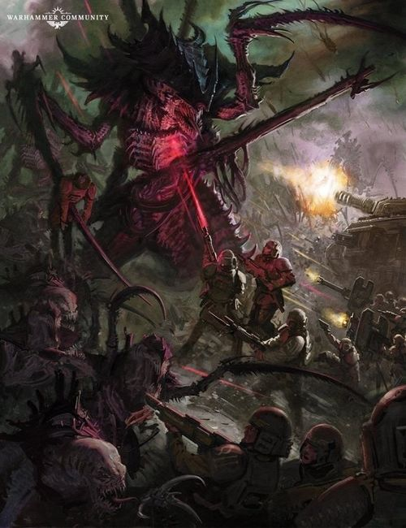

<!-- A0493-B0147 -->

原译文

Imperial Guardsmen battle Tyranids 帝国卫队与泰伦作战

**校订译文**

Imperial Guardsmen battle Tyranids 帝国卫队与泰伦作战

<!-- /A0493-B0147 -->

<!-- A0493-B0148 -->
**英文原文**

The Astra Militarum's countless regiments include all manner of infantry, cavalry - mechanised and mounted alike - artillery, and war engines. Each particular regiment is normally uniform in organisation inside itself, and often seem to specialise in one particular form of war. For instance, light infantry regiments can barely demonstrate any motorised transport and certainly possess no weapons that are not man-portable. In contrast, an artillery regiment contains little else. This ensures that the Imperial Guard are at their strongest when multiple regiments are massed together, and is itself another deliberate structure to ensure that large-scale rebellion by a military commander is difficult to organise.

<!-- /A0493-B0148 -->

<!-- A0493-B0149 -->

原译文

星界军的无数兵团包括各种步兵、骑兵 — 机械化和骑兵化 — 火炮和战争引擎。每个特定的兵团在内部组织上通常是统一的，并且似乎经常专门从事一种特定的战争形式。例如，轻步兵团几乎无法展示任何机动交通工具，当然也没有非便携式武器。相比之下，炮兵团几乎没有其他内容。这确保了当多个兵团聚集在一起时，帝国卫队处于最强大的状态，这本身就是另一个深思熟虑的结构，以确保军事指挥官难以组织大规模叛乱。

**校订译文**

星界军的无数兵团涵盖各类步兵、机械化骑兵、骑乘部队、炮兵及战争机器。每个兵团内部通常编制统一，专精于某一种作战方式。例如，轻步兵团几乎没有机动车辆，更没有必须依靠车辆搬运的重型武器；炮兵团则几乎全由火炮及其配套力量组成。因此，多个兵团协同集结时，帝国卫队才能发挥最大战力。这种有意设计的编制，也是为了让单个军事指挥官难以组织大规模叛乱。

<!-- /A0493-B0149 -->

<!-- A0493-B0150 -->
**英文原文**

The war philosophy of the Imperial Guard favours the concept of total war, prosecuting a conflict with the singular objective of defeating the enemy. In battle, the Imperial Guard favors grinding attritional warfare fought with masses of simple but consistently effective infantry, armoured vehicles, and artillery.

<!-- /A0493-B0150 -->

<!-- A0493-B0151 -->

原译文

帝国卫队的战争哲学倾向于全面战争的概念，以击败敌人为唯一目标进行冲突。在战斗中，帝国卫队倾向于与大量简单但始终有效的步兵、装甲车和火炮进行激烈的消耗战。

**校订译文**

帝国卫队奉行全面战争理念，以击败敌人为唯一目标。战场上，他们偏好依靠数量庞大、简单而持续有效的步兵、装甲车辆与火炮，展开艰苦的消耗战。

<!-- /A0493-B0151 -->

<!-- A0493-B0152 -->
**英文原文**

The Guard is constantly looking for new opportunities to secure victory by advancing both on the theoretical level and at the front. Individual commanders for example need to be aware of the bigger picture for an overall battlefield perspective, allowing them to better perform in their combat tasks by maximising their advantages. Concepts like fluid field orders and unit-level decision making are also favoured.

<!-- /A0493-B0152 -->

<!-- A0493-B0153 -->

原译文

卫队不断寻找新的机会，通过在理论层面和前线推进来确保胜利。例如，个别指挥官需要从整体战场的角度了解大局，通过最大限度地发挥优势，使他们能够更好地执行战斗任务。流动域指令和单元级决策等概念也受到青睐。

**校订译文**

卫队也不断从理论研究与前线实践中寻求新的制胜方法。例如，指挥官必须掌握战场全局，尽可能发挥自身优势，才能更好地完成作战任务。他们也重视灵活调整的战地命令，以及基层单位自主决策等理念。

<!-- /A0493-B0153 -->

<!-- A0493-B0154 -->
## Relics of the Astra Militarum 星界军的圣物

<!-- /A0493-B0154 -->

<!-- A0493-B0155 -->
**英文原文**

Due to the organization of the Astra Militarum various wrolds and regiments have their own heirlooms, comparable to the heirlooms owned by each Space Marine Chapters. Nonetheless there are certain rare relics that ware worn or wielded by several different officers, commissars or other individuals of the Imperial Guard.

<!-- /A0493-B0155 -->

<!-- A0493-B0156 -->

原译文

由于星界军的组织，各个世界和兵团都有自己的传家宝，与每个星际战士战团拥有的传家宝相当。尽管如此，仍有一些罕见的圣物是由帝国卫队的几个不同军官、政委或其他个人佩戴或使用的。

**校订译文**

由于星界军由各个世界的不同兵团组成，这些世界和兵团各有传承之物，类似星际战士战团珍藏的圣物。不过，也有一些罕见遗物曾由不同的卫队军官、政委或其他人物佩戴、使用。

<!-- /A0493-B0156 -->

<!-- A0493-B0157 图片 -->
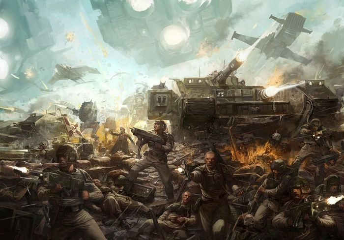

<!-- A0493-B0158 -->

原译文

Astra Militarum forces 星界军部队

**校订译文**

Astra Militarum forces 星界军部队

<!-- /A0493-B0158 -->

<!-- A0493-B0159 -->
**英文原文**

Famous heirlooms include:

<!-- /A0493-B0159 -->

<!-- A0493-B0160 -->

原译文

著名的传家宝包括：

**校订译文**

著名的传家宝包括：

<!-- /A0493-B0160 -->

<!-- A0493-B0161 -->

原译文

The Blade of Conquest 征服之刃

**校订译文**

The Blade of Conquest 征服之刃

<!-- /A0493-B0161 -->

<!-- A0493-B0162 -->

原译文

The Dagger of Tu'Sakh 图萨克匕首

**校订译文**

The Dagger of Tu'Sakh 图萨克匕首

<!-- /A0493-B0162 -->

<!-- A0493-B0163 -->

原译文

The Deathmask of Ollanius 欧兰尼奥斯的死亡面具

**校订译文**

The Deathmask of Ollanius 欧良尼乌斯的死亡面具

<!-- /A0493-B0163 -->

<!-- A0493-B0164 -->

原译文

The Emperor's Benediction 帝皇祝福

**校订译文**

The Emperor's Benediction 帝皇祝福

<!-- /A0493-B0164 -->

<!-- A0493-B0165 -->

原译文

Kurov's Aquila 库罗夫天鹰

**校订译文**

Kurov's Aquila 库罗夫天鹰

<!-- /A0493-B0165 -->

<!-- A0493-B0166 -->

原译文

The Laurels of Command 指挥桂冠

**校订译文**

The Laurels of Command 指挥桂冠

<!-- /A0493-B0166 -->

<!-- A0493-B0167 -->

原译文

The Tactical Auto-Reliquary of Tyberius 泰伯琉斯的战术自动圣物箱

**校订译文**

The Tactical Auto-Reliquary of Tyberius 泰伯琉斯的战术自动圣物箱

<!-- /A0493-B0167 -->

<!-- A0493-B0168 -->

原译文

Behemoth Primal 最初巨兽

**校订译文**

Behemoth Primal 最初巨兽

<!-- /A0493-B0168 -->

<!-- A0493-B0169 -->
**英文原文**

Regiment specific heirlooms include:

<!-- /A0493-B0169 -->

<!-- A0493-B0170 -->

原译文

兵团特有的传家宝包括：

**校订译文**

兵团特有的传家宝包括：

<!-- /A0493-B0170 -->

<!-- A0493-B0171 -->
**英文原文**

The Armour of Graf Toschenko (Vostroya)

<!-- /A0493-B0171 -->

<!-- A0493-B0172 -->

原译文

格拉夫·托琴科（沃斯托尼亚）

**校订译文**

格拉夫·托琴科之甲（沃斯特洛亚）

**校注：** 原译漏掉 Armour，补回“之甲”。

<!-- /A0493-B0172 -->

<!-- A0493-B0173 -->
**英文原文**

Celeritas (Cadia)

<!-- /A0493-B0173 -->

<!-- A0493-B0174 -->

原译文

迅捷（卡迪亚）

**校订译文**

迅捷（卡迪亚）

<!-- /A0493-B0174 -->

<!-- A0493-B0175 -->
**英文原文**

Claw of the Desert Tigers (Tallarn)

<!-- /A0493-B0175 -->

<!-- A0493-B0176 -->

原译文

沙漠虎之爪（塔兰）

**校订译文**

沙漠虎之爪（塔兰）

<!-- /A0493-B0176 -->

<!-- A0493-B0177 -->
**英文原文**

The Iron Left (Cadia)

<!-- /A0493-B0177 -->

<!-- A0493-B0178 -->

原译文

钢铁左臂（卡迪亚）

**校订译文**

钢铁左臂（卡迪亚）

<!-- /A0493-B0178 -->

<!-- A0493-B0179 -->
**英文原文**

Kabe's Herald (Cadia)

<!-- /A0493-B0179 -->

<!-- A0493-B0180 -->

原译文

卡贝之先驱（卡迪亚）

**校订译文**

卡贝之先驱（卡迪亚）

<!-- /A0493-B0180 -->

<!-- A0493-B0181 -->
**英文原文**

Mamorph Tuskblade (Catachan)

<!-- /A0493-B0181 -->

<!-- A0493-B0182 -->

原译文

玛莫夫长牙刃（卡塔昌）

**校订译文**

玛莫夫长牙刃（卡塔昌）

<!-- /A0493-B0182 -->

<!-- A0493-B0183 -->
**英文原文**

Order of the Iron Star of Mordian (Mordian)

<!-- /A0493-B0183 -->

<!-- A0493-B0184 -->

原译文

莫迪安钢铁之星勋章（莫迪安）

**校订译文**

莫迪安钢铁之星勋章（莫迪安）

<!-- /A0493-B0184 -->

<!-- A0493-B0185 -->
**英文原文**

Pietrov's MK 45 (Valhalla)

<!-- /A0493-B0185 -->

<!-- A0493-B0186 -->

原译文

彼得罗夫的MK 45（瓦尔哈拉）

**校订译文**

彼得罗夫的 MK 45（瓦尔哈拉）

<!-- /A0493-B0186 -->

<!-- A0493-B0187 -->
**英文原文**

Relic of Lost Cadia (Cadia)

<!-- /A0493-B0187 -->

<!-- A0493-B0188 -->

原译文

失落的卡迪亚之圣物（卡迪亚）

**校订译文**

失落的卡迪亚之圣物（卡迪亚）

<!-- /A0493-B0188 -->

<!-- A0493-B0189 -->
**英文原文**

Skull Mask of Acheron (Armageddon)

<!-- /A0493-B0189 -->

<!-- A0493-B0190 -->

原译文

黄泉颅骨面具（阿玛吉多顿）

**校订译文**

黄泉颅骨面具（阿玛吉多顿）

<!-- /A0493-B0190 -->

<!-- A0493-B0191 -->
**英文原文**

The Standard of the Lost 113th (Cadia)

<!-- /A0493-B0191 -->

<!-- A0493-B0192 -->

原译文

失落的113团之旗（卡迪亚）

**校订译文**

失落第 113 团的军旗（卡迪亚）

<!-- /A0493-B0192 -->

<!-- A0493-B0193 -->
**英文原文**

Volkov's Cane (Cadia)

<!-- /A0493-B0193 -->

<!-- A0493-B0194 -->

原译文

沃尔科夫之杖（卡迪亚）

**校订译文**

沃尔科夫之杖（卡迪亚）

<!-- /A0493-B0194 -->

<!-- A0493-B0195 -->
**英文原文**

Wrath of Cadia (Cadia)

<!-- /A0493-B0195 -->

<!-- A0493-B0196 -->

原译文

卡迪亚之怒（卡迪亚）

**校订译文**

卡迪亚之怒（卡迪亚）

<!-- /A0493-B0196 -->

<!-- A0493-B0197 -->
## Development History 发展历史

<!-- /A0493-B0197 -->

<!-- A0493-B0198 -->
**英文原文**

The Astra Militarum, originally referred to as the Imperial Army, are first mentioned in 1987's Warhammer 40,000: Rogue Trader as defensive garrison military force of the Imperium. The first use of the term "Imperial Guard" dates back to White Dwarf #109 in 1989. In 1994 they received their own Codex in the 2nd Edition, which introduced most of their present lore including colorful Regiments such as the Cadian Shock Troopers, Catachan Jungle Fighters, Mordian Iron Guard, Tallarn Desert Raiders, and Valhallan Ice Warriors. The designation of "Imperial Army" was retconned into referring to the pre-Horus Heresy predecessor of the Imperial Guard.

<!-- /A0493-B0198 -->

<!-- A0493-B0199 -->

原译文

星界军最初被称为帝国军队，在1987年的《战锤40000：行商浪人》中首次被提及为帝国的防御性驻军军事力量。“帝国卫队”一词的首次使用可以追溯到1989年的白矮人109期。1994年，他们在第二版中收到了自己的圣典，其中介绍了他们目前的大部分传说，包括丰富多彩的兵团，如卡迪亚突击军、卡塔昌丛林战士、莫迪安铁卫、塔兰沙漠突袭者和瓦尔哈拉冰雪战士。“帝国军队”的名称被重新指定为指荷鲁斯叛乱前帝国卫队的前身。

**校订译文**

星界军最初称为“帝国军”，于 1987 年的《战锤 40,000：行商浪人》中首次登场，当时被描述为帝国的防御驻军。“帝国卫队”这一名称首次见于 1989 年的《白矮人》第 109 期。1994 年，第二版为其出版了专属圣典，确立了如今的大部分背景设定，包括卡迪亚突击军、卡塔昌丛林斗士、莫迪安铁卫、塔兰沙漠突袭者与瓦尔哈拉冰雪战士等风格各异的兵团。“帝国军”这一旧称随后被重新解释为荷鲁斯之乱前、帝国卫队的前身组织。

**校注：** 本段为底稿的出版沿革记述，未另行逐本核验“首次”与年份，不标为独立官方核验结论。

<!-- /A0493-B0199 -->

<!-- A0493-B0200 -->
**英文原文**

In the 6th Edition, Games Workshop introduced the term "Astra Militarum" to refer to the Imperial Guard, though this is explained as a High Gothic title and both names continue to be referenced.

<!-- /A0493-B0200 -->

<!-- A0493-B0201 -->

原译文

在第6版中，GW引入了“星界军”一词来指代帝国卫队，尽管这被解释为一个高哥特语的头衔，这两个名字仍然被引用。

**校订译文**

第六版中，Games Workshop 引入“Astra Militarum”一名来称呼帝国卫队，本稿译为“星界军”。设定中将其解释为高哥特语名称，因此两个名字此后继续并用。

<!-- /A0493-B0201 -->

本篇核心术语与暂定项

以下列出本篇出现的英文原形及核心术语表用词。同形词可能指不同对象，具体词义以本篇正文和校注为准；单复数、别名和仅见于图注的名称可能尚未列入。完整候选见[术语表](../../术语表/双语术语候选.csv)。

| 英文 | 采用中文 | 状态 |
| --- | --- | --- |
| Space Marines | 星际战士 | 官方已核对 |
| Adeptus Mechanicus | 机械修会 | 官方已核对 |
| Astra Militarum | 星界军 | 官方已核对 |
| Imperial Guard | 帝国卫队 | 暂定·语境区分 |
| Imperial Army | 帝国军 | 暂定·官方待核 |
| Ratling | 莱特林 | 官方已核对 |
| Ogryn | 欧格林 | 官方已核对 |
| Chimera | 奇美拉 | 官方已核对 |
| Horus Heresy | 荷鲁斯之乱 | 官方已核对 |
| Great Rift | 大裂隙 | 官方已核对 |
| Imperium of Man | 人类帝国 | 官方已核对 |
| Imperium | 帝国 | 暂定·简称 |
| Imperial Navy | 帝国海军 | 暂定 |
| Equipment | 装备 | 编辑用语已统一 |
| Administratum | 内政部 | 暂定 |
| Adeptus Administratum | 内政部 | 暂定 |
| Rogue Trader | 行商浪人 | 暂定 |
| Emperor | 帝皇 | 官方已核对 |
| Departmento Munitorum | 军务部 | 暂定 |
| Forge World | 铸造世界 | 暂定·官方待核 |
| Great Crusade | 大远征 | 暂定·官方待核 |
| Terra | 泰拉 | 暂定·官方待核 |
| Horus | 荷鲁斯 | 暂定·官方待核 |
| STC | 标准建造模板 | 暂定·官方待核 |
| Kasrkin | 卡舍津 | 官方已核对 |
| High Lords of Terra | 泰拉高领主 | 暂定·官方待核 |
| Imperial Cult | 帝皇信仰 | 暂定·官方待核 |
| Sector | 星区 | 暂定·官方待核 |
| Subsector | 次星区 | 暂定·官方待核 |
| Low Gothic | 低哥特语 | 暂定·官方待核 |
| High Gothic | 高哥特语 | 暂定·官方待核 |
| Armageddon | 阿玛吉多顿 | 暂定·官方待核 |
| Mordian | 莫迪安 | 暂定·官方待核 |
| Valhalla | 瓦尔哈拉 | 暂定·官方待核 |
| Tallarn | 塔兰 | 暂定·官方待核 |
| Tanith | 塔尼斯 | 暂定·官方待核 |
| Catachan | 卡塔昌 | 暂定·官方待核 |
| Cadia | 卡迪亚 | 暂定·官方待核 |
| Vostroya | 沃斯特洛亚 | 暂定·官方待核 |
| Acheron | 黄泉星 | 暂定·官方待核 |
| Feudal Worlds | 封建世界 | 暂定·官方待核 |
| Nork Deddog | 保镖诺克 | 官方已核对 |
| Militarum Auxilla | 军务辅助部队 | 暂定·官方待核 |
| Imperial Tithe | 帝国什一税 | 暂定·官方待核 |
| Ancient | 旗手 | 官方已核对 |
| Ordinatus | 百机战争机器 | 暂定·官方待核 |
| Companions | 近侍 | 暂定·官方待核 |
| Militarum Tempestus | 暴风军 | 暂定·官方待核 |
| Lord Commander | 领主指挥官 | 暂定·官方待核 |
| Founding | 建军 | 暂定·官方待核 |
| Herald | 传令官 | 暂定·官方待核 |
| Space Marine | 星际战士 | 暂定·官方待核 |
| Armoury | 军械库 | 暂定·官方待核 |
| Firstborn | 长子 | 暂定·官方待核 |
| Absolute | 绝对号 | 暂定·官方待核 |
| Lord Commander Militant | 军务领主指挥官 | 暂定·官方待核 |
| Officio Prefectus | 长官部 | 暂定·官方待核 |
| Vostroyan Firstborn | 沃斯特洛亚长子团 | 暂定·官方待核 |
| Militarum Vendorum | 后勤部 | 暂定·官方待核 |
| Militarum Ordinatus | 军械部 | 暂定·官方待核 |
| Militarum Regimentos | 兵团管理部 | 暂定·官方待核 |
| Departmento Tacticae | 战术部 | 暂定·官方待核 |
| Militarum Strategos | 战略部 | 暂定·官方待核 |
| Catachan Jungle Fighters | 卡塔昌丛林斗士 | 官方已核对 |
| Sly Marbo | 斯莱·马博 | 官方已核对 |
| Leman Russ Battle Tank | 黎曼鲁斯战斗坦克 | 官方已核对 |
| Ollanius Pius | 欧良尼乌斯·庇乌斯 | 官方词根参考·全名待核 |
| Xenos | 异形 | 暂定·官方待核 |
| Imperialis | 帝国徽记 | 暂定·官方待核 |
| Gun | 甘 | 暂定·官方待核 |
| System | 星系（恒星系统） | 暂定·官方待核 |
| Death World | 死亡世界 | 暂定·官方待核 |
| Tallarn Desert Raiders | 塔兰沙漠突袭者 | 暂定·官方待核 |
| Mordian Iron Guard | 莫迪安铁卫 | 暂定·官方待核 |
| Cadian Shock Troopers | 卡迪亚突击军 | 暂定·官方待核 |
| Valhallan Ice Warriors | 瓦尔哈拉冰雪战士 | 暂定·官方待核 |
| claw | 利爪分队 | 暂定·官方待核 |
| Warhammer 40,000: Rogue Trader | 战锤40000：行商浪人 | 暂定·官方待核 |
| Games Workshop | Games Workshop | 暂定·官方待核 |

