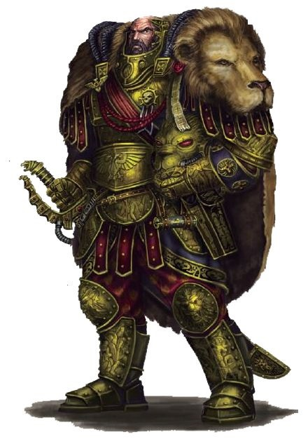

# 0494 战帅 Warmaster

精校状态：中文行文已逐段精校，部分术语仍为暂定

分类：组织

原文来源：https://www.bilibili.com/opus/1052973930574249993

原作者：帝国神选罐头

原文时间：2025年04月07日 13:16

[返回分类目录](目录.md) · [全书目录](../../目录.md)

<!-- A0494-B0001 -->
**英文原文**

Warmaster, also known as Lord Solar, or just Solar is a special military rank of the Imperium and the Imperial Guard.

<!-- /A0494-B0001 -->

<!-- A0494-B0002 -->

原译文

战帅，也被称为太阳领主，或简称太阳，是帝国和帝国卫队的一个特殊军衔。

**校订译文**

战帅，也被称为太阳领主，或简称太阳，是帝国和帝国卫队的一个特殊军衔。

**校注：** 本篇前半沿旧版将 Warmaster 与 Lord Solar 等同，末尾说明版本变化。2022-12-16 官方文章已把太阳星域统帅与跨地区远征战帅分别描述，因此不宜把两个译名合并成同一全书术语。详见本篇末尾。

<!-- /A0494-B0002 -->

<!-- A0494-B0003 图片 -->

<!-- A0494-B0004 -->

原译文

Warmaster Tiber Achilus 战帅泰伯·阿基里斯

**校订译文**

Warmaster Tiber Achilus 战帅泰伯·阿基里斯

<!-- /A0494-B0004 -->

<!-- A0494-B0005 -->
## Overview 概述

<!-- /A0494-B0005 -->

<!-- A0494-B0006 -->
**英文原文**

Historically, Warmaster was the title bestowed upon the most favoured Primarch, Horus of the Luna Wolves Space Marine Legion, by the Emperor. The granting of this title was to recognise that Horus was to act as the Emperor's proxy during the latter part of the Great Crusade. Eventually, the Luna Wolves were renamed the Sons of Horus to better reflect the prestige of the Warmaster's title. Now, it stands as the one of the most powerful ranks in the Imperial Guard, second only to the rank of Lord Commander Militant of the Imperial Guard.

<!-- /A0494-B0006 -->

<!-- A0494-B0007 -->

原译文

从历史上看，战帅是帝皇授予最受宠爱的原体 — 影月苍狼星际战士军团的荷鲁斯的头衔。授予这一头衔是为了承认荷鲁斯在大远征后期将担任帝皇的代理人。最终，影月苍狼被重新命名为荷鲁斯之子，以更好地反映战帅头衔的声望。现在，它是帝国卫队中最高的军衔之一，仅次于军事领主指挥官。

**校订译文**

历史上，战帅是帝皇赐予其最宠爱的原体——影月苍狼军团之主荷鲁斯——的头衔，表明他将在大远征后期代表帝皇行事。后来，影月苍狼更名为荷鲁斯之子，以彰显战帅的崇高声望。在本文所述的帝国卫队体系中，战帅是权力最大的军衔之一，仅次于军务领主指挥官。

<!-- /A0494-B0007 -->

<!-- A0494-B0008 -->
**英文原文**

Warmasters are created when a Crusade is being planned and resources from multiple sectors are needed. Supreme overall command is necessary as internal strife and corruption might make assembling the material required and co-operating in the field difficult for members of the same rank. The rank is not available unless granted by the High Lords of Terra and such an individual is said to be given the powers by the Emperor himself. There is rarely more than one Warmaster operating within the Imperium at any one time, due to the extreme powers given to them.

<!-- /A0494-B0008 -->

<!-- A0494-B0009 -->

原译文

当远征正在计划中并且需要来自多个部门的资源时，就会创建战帅。最高总指挥是必要的，因为内乱和腐败可能会使同级别成员难以收集所需材料并在现场合作。除非泰拉的高领主授予，否则无法获得军衔，据说这样的人是由帝皇亲自授予权力的。由于他们被赋予了极限的权力，在任何时候，帝国内很少有一个以上的战帅在任。

**校订译文**

帝国筹备一场需要调动多个星区资源的远征时，便可能任命战帅。内讧与腐败会使同级军官难以集结资源、协同作战，因此需要一位拥有全局最高指挥权的人。只有泰拉高领主可以授予这一军衔，而获任者被认为是从帝皇本人那里得到权力。由于权限极大，帝国在同一时期很少有超过一位战帅在任。

**校注：** 英文称同一时期极少有多位战帅，属本篇来源的概括，未据全书其他时间线推定为严格唯一。

<!-- /A0494-B0009 -->

<!-- A0494-B0010 -->
**英文原文**

Other names for this rank of Lord Solar, or just Solar are by many considered more preferable — coming from the title held by Macharius in his crusade at the beginning of the 41st millennium. Some consider 'Warmaster' a cursed title because of the ties to Horus and the Horus Heresy, which tore the Imperium in two. In this light, 'Lord Solar' is considered a more prestigious and desirable title, but fundamentally, the two ranks are interchangeable.

<!-- /A0494-B0010 -->

<!-- A0494-B0011 -->

原译文

许多人认为，这一级别太阳领主或太阳比其他名字更可取——来自马卡里乌斯在第41个千年初的远征中所拥有的头衔。有些人认为“战帅”是一个被诅咒的头衔，因为它与荷鲁斯和荷鲁斯叛乱有联系，后者将帝国一分为二。从这个角度来看，“太阳领主”被认为是一个更具声望和吸引力的头衔，但从根本上说，这两个级别是可以互换的。

**校订译文**

许多人更愿意使用“太阳领主”或简称“太阳”这一称呼，源于马卡里乌斯在第四十一个千年初远征时使用的头衔。“战帅”与荷鲁斯及那场撕裂帝国的叛乱紧密相连，因而被一些人视为受诅咒的名字。相比之下，“太阳领主”显得更尊贵，也更受欢迎。按照本段所依据的旧版资料，两者本质上可以互换。

<!-- /A0494-B0011 -->

<!-- A0494-B0012 -->
## Notable Warmasters 著名战帅

<!-- /A0494-B0012 -->

<!-- A0494-B0013 -->
**英文原文**

M31

<!-- /A0494-B0013 -->

<!-- A0494-B0014 -->
**英文原文**

Horus — Commander of the Great Crusade

<!-- /A0494-B0014 -->

<!-- A0494-B0015 -->

原译文

荷鲁斯 — 大远征的指挥官

**校订译文**

荷鲁斯 — 大远征的指挥官

<!-- /A0494-B0015 -->

<!-- A0494-B0016 -->
**英文原文**

M35

<!-- /A0494-B0016 -->

<!-- A0494-B0017 -->
**英文原文**

Kiodrus — One of the commanders of Saint Sabbat's original crusade.

<!-- /A0494-B0017 -->

<!-- A0494-B0018 -->

原译文

基奥德鲁斯 — 圣萨巴特起源远征的指挥官之一。

**校订译文**

基奥德鲁斯——圣萨巴特最初那场远征的指挥官之一。

<!-- /A0494-B0018 -->

<!-- A0494-B0019 -->
**英文原文**

M36

<!-- /A0494-B0019 -->

<!-- A0494-B0020 -->
**英文原文**

Terfuek — Commanded the Imperial forces during the Pacificus War.

<!-- /A0494-B0020 -->

<!-- A0494-B0021 -->

原译文

特尔富克 — 在太平星域之战期间指挥帝国军队。

**校订译文**

特尔富克 — 在太平星域之战期间指挥帝国军队。

<!-- /A0494-B0021 -->

<!-- A0494-B0022 -->
**英文原文**

M38

<!-- /A0494-B0022 -->

<!-- A0494-B0023 -->
**英文原文**

Demetrius — Warmaster of the Salonika Crusade (733.M38).

<!-- /A0494-B0023 -->

<!-- A0494-B0024 -->

原译文

迪米特里厄斯 — 萨洛尼卡远征的战帅（733.M38）。

**校订译文**

迪米特里厄斯 — 萨洛尼卡远征的战帅（733.M38）。

<!-- /A0494-B0024 -->

<!-- A0494-B0025 -->
**英文原文**

M41

<!-- /A0494-B0025 -->

<!-- A0494-B0026 -->
**英文原文**

Macharius — Lord Solar. Commander of the Macharian Crusade

<!-- /A0494-B0026 -->

<!-- A0494-B0027 -->

原译文

马卡里乌斯 — 太阳领主。马卡里安远征的指挥官

**校订译文**

马卡里乌斯 — 太阳领主。马卡里安远征的指挥官

<!-- /A0494-B0027 -->

<!-- A0494-B0028 -->
**英文原文**

Solon — Successor to Macharius. Warmaster during the Macharian Heresy.

<!-- /A0494-B0028 -->

<!-- A0494-B0029 -->

原译文

索伦 — 马卡里乌斯的继任者。马卡里安叛乱时期的战帅。

**校订译文**

索伦 — 马卡里乌斯的继任者。马卡里安叛乱时期的战帅。

<!-- /A0494-B0029 -->

<!-- A0494-B0030 -->
**英文原文**

Slaydo — Commander of the Sabbat Worlds Crusade.

<!-- /A0494-B0030 -->

<!-- A0494-B0031 -->

原译文

斯莱多 — 萨巴特世界远征司令。

**校订译文**

斯莱多 — 萨巴特诸世界远征司令。

<!-- /A0494-B0031 -->

<!-- A0494-B0032 -->
**英文原文**

Macaroth — Slaydo's successor.

<!-- /A0494-B0032 -->

<!-- A0494-B0033 -->

原译文

马卡洛斯 — 斯莱多的继任者。

**校订译文**

马卡洛斯 — 斯莱多的继任者。

<!-- /A0494-B0033 -->

<!-- A0494-B0034 -->
**英文原文**

Tiber Achilus — Former warmaster of the Achilus Crusade in the Jericho Reach.

<!-- /A0494-B0034 -->

<!-- A0494-B0035 -->

原译文

泰伯·阿基里斯 — 杰里科河段的阿基里斯远征前战帅。

**校订译文**

泰伯·阿基里斯——杰里科疆域阿基里斯远征的前任战帅。

<!-- /A0494-B0035 -->

<!-- A0494-B0036 -->
**英文原文**

Ingenus — Kidnapped by Dark Eldar pirates in 845.M41. Fate afterwards is unknown. Thereafter all Warmasters were issued bodyguards.

<!-- /A0494-B0036 -->

<!-- A0494-B0037 -->

原译文

英格努斯 — 845.M41被黑暗灵族海盗绑架。后来的命运是未知的。此后，所有战帅都配备了保镖。

**校订译文**

英格努斯 — 845.M41被黑暗灵族海盗绑架。后来的命运是未知的。此后，所有战帅都配备了保镖。

<!-- /A0494-B0037 -->

<!-- A0494-B0038 -->
**英文原文**

Brabastis — achieved a triumph in 931.M41.

<!-- /A0494-B0038 -->

<!-- A0494-B0039 -->

原译文

布拉布斯特斯 — 在931.M41达到巨大成功

**校订译文**

布拉布斯特斯——于 931.M41 取得一次大捷。

<!-- /A0494-B0039 -->

<!-- A0494-B0040 -->

原译文

Ryse 赖斯

**校订译文**

Ryse 赖斯

<!-- /A0494-B0040 -->

<!-- A0494-B0041 -->
**英文原文**

Katask — Fought in the 13th Black Crusade

<!-- /A0494-B0041 -->

<!-- A0494-B0042 -->

原译文

卡塔斯克 — 参加第13次黑色远征

**校订译文**

卡塔斯克 — 参加第13次黑色远征

<!-- /A0494-B0042 -->

<!-- A0494-B0043 -->
### Other/Unsorted 其他/未排序

<!-- /A0494-B0043 -->

<!-- A0494-B0044 -->

原译文

Gatus 加图斯

**校订译文**

Gatus 加图斯

<!-- /A0494-B0044 -->

<!-- A0494-B0045 -->

原译文

Hokaeto 霍凯托

**校订译文**

Hokaeto 霍凯托

<!-- /A0494-B0045 -->

<!-- A0494-B0046 -->

原译文

Ketherion 凯瑟里昂

**校订译文**

Ketherion 凯瑟里昂

<!-- /A0494-B0046 -->

<!-- A0494-B0047 -->

原译文

Menitus 梅尼图斯

**校订译文**

Menitus 梅尼图斯

<!-- /A0494-B0047 -->

<!-- A0494-B0048 -->

原译文

Nathasian 纳萨西安

**校订译文**

Nathasian 纳萨西安

<!-- /A0494-B0048 -->

<!-- A0494-B0049 -->

原译文

Rhyngold 林戈尔德

**校订译文**

Rhyngold 林戈尔德

<!-- /A0494-B0049 -->

<!-- A0494-B0050 -->
## Trivia 琐事

<!-- /A0494-B0050 -->

<!-- A0494-B0051 -->
### Conflicting Sources - Warmaster and Lord Solar 冲突的来源-战帅和太阳领主

<!-- /A0494-B0051 -->

<!-- A0494-B0052 -->
**英文原文**

Codex: Imperial Guard (3rd Edition, 2nd Codex), released in 2003, states that Lord Solar is a title interchangeable with that of Warmaster (pg. 9). It is again stated in Codex: Astra Militarum (8th Edition), pg. 7. However, this was rescinded in a Warhammer Community article from 16/12/22, which states that the Lord Solar is just the Lord Commander of the Segmentum Solar, and not the Warmaster.

<!-- /A0494-B0052 -->

<!-- A0494-B0053 -->

原译文

2003年发布的圣典：帝国卫队（第3版，第2版圣典）指出，“太阳领主”是一个可以与“战帅”互换的头衔（第9页）。圣典：星界军（第8版）第7页再次指出了这一点。然而，这在22年12月16日的一篇战锤社区文章中被撤销，该文章指出，太阳领主只是太阳星域的领主指挥官，而不是战帅。

**校订译文**

2003 年出版的《帝国卫队圣典》（第三版的第二本圣典）第 9 页，称“太阳领主”与“战帅”可以互换；《星界军圣典》第八版第 7 页也作同样表述。不过，2022 年 12 月 16 日的一篇战锤社区文章重新区分了二者：太阳领主是统领太阳星域的领主指挥官，而战帅则是由泰拉高领主任命、指挥跨地区远征的特殊职衔。

**校注：** 已核官方文章《Just What Is a Lord Solar Anyway – A Guardsman’s Primer to the Hierarchy of the Astra Militarum》（2022-12-16）：Lord Commander Solar 负责太阳星域；Warmaster 受任指挥跨地区远征。网址：https://www.warhammer-community.com/en-gb/articles/7npi0Tl9/just-what-is-a-lord-solar-anyway-a-guardsmans-primer-to-the-hierarchy-of-the-astra-militarum/

<!-- /A0494-B0053 -->

本篇核心术语与暂定项

以下列出本篇出现的英文原形及核心术语表用词。同形词可能指不同对象，具体词义以本篇正文和校注为准；单复数、别名和仅见于图注的名称可能尚未列入。完整候选见[术语表](../../术语表/双语术语候选.csv)。

| 英文 | 采用中文 | 状态 |
| --- | --- | --- |
| Astra Militarum | 星界军 | 官方已核对 |
| Imperial Guard | 帝国卫队 | 暂定·语境区分 |
| Eldar | 灵族 | 暂定·语境区分 |
| Dark Eldar | 黑暗灵族 | 暂定·旧称对应 |
| Horus Heresy | 荷鲁斯之乱 | 官方已核对 |
| Imperium | 帝国 | 暂定·简称 |
| Emperor | 帝皇 | 官方已核对 |
| Primarch | 原体 | 官方已核对 |
| Great Crusade | 大远征 | 暂定·官方待核 |
| Terra | 泰拉 | 暂定·官方待核 |
| Luna Wolves | 影月苍狼 | 暂定·官方待核 |
| Horus | 荷鲁斯 | 暂定·官方待核 |
| Sons of Horus | 荷鲁斯之子 | 暂定·官方待核 |
| High Lords of Terra | 泰拉高领主 | 暂定·官方待核 |
| Segmentum Solar | 太阳星域 | 暂定·官方待核 |
| Segmentum | 星域 | 暂定·官方待核 |
| Luna | 月球 | 暂定·官方待核 |
| Space Marine Legion | 星际战士军团 | 暂定·官方待核 |
| Lord Commander | 领主指挥官 | 暂定·官方待核 |
| Space Marine | 星际战士 | 暂定·官方待核 |
| Powers | 能天使 | 暂定·官方待核 |
| Lord Commander Militant | 军务领主指挥官 | 暂定·官方待核 |
| Lord Solar | 太阳领主 | 暂定·官方待核 |
| Macaroth | 马卡洛斯 | 暂定·官方待核 |
| Jericho Reach | 杰里科疆域 | 暂定·官方待核 |
| Sabbat Worlds | 萨巴特诸世界 | 暂定·官方待核 |
| Macharian Crusade | 马卡里安远征 | 暂定·官方待核 |
| Macharius | 马卡里乌斯 | 暂定·官方待核 |
| Demetrius | 德米特里厄斯 | 暂定·官方待核 |
| Macharian Heresy | 马卡里安叛乱 | 暂定·官方待核 |
| Corruption | 腐败 | 暂定·官方待核 |
| Slaydo | 斯莱多 | 暂定·官方待核 |

