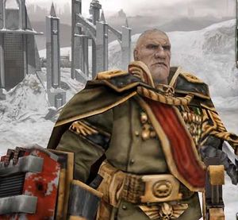

# 0495 将军 General

精校状态：中文行文已逐段精校，部分术语仍为暂定

分类：组织

原文来源：https://www.bilibili.com/opus/1220321352703016979

原作者：帝国神选罐头

原文时间：2026年07月02日 12:30

[返回分类目录](目录.md) · [全书目录](../../目录.md)

<!-- A0495-B0001 -->
**英文原文**

General is a high rank within the Imperial Guard.

<!-- /A0495-B0001 -->

<!-- A0495-B0002 -->

原译文

将军是帝国卫队的高级将领。

**校订译文**

将军是帝国卫队的一种高级军衔。

<!-- /A0495-B0002 -->

<!-- A0495-B0003 -->
## Overview 概述

<!-- /A0495-B0003 -->

<!-- A0495-B0004 -->
**英文原文**

Generals are high-ranking officers who are also members of the General Staff. General is one of the most prestigious ranks within the Imperial Guard and those bear the title are usually highly decorated and experienced commanders who have been on countless campaigns throughout their career. However other Generals are sometimes arrogant individuals who have been promoted due to the pedigree of their homeworld. These officers are often placed in charge of newly founded Regiments tithed to a Crusade.

<!-- /A0495-B0004 -->

<!-- A0495-B0005 -->

原译文

将军是高级军官，也是总参谋部的成员。将军是帝国卫队中最负盛名的军衔之一，拥有这一头衔的人通常都是荣誉卓著、经验丰富的指挥官，他们在整个职业生涯中参加了无数次战役。然而，其他将军有时是傲慢的人，他们因为家园世界的起源而被提拔。这些军官经常被任命成为为远征而新建立的兵团的什一税的负责人。

**校订译文**

将军是总参谋部的高级军官，在帝国卫队中享有极高声望。获得这一军衔者通常战功显赫、经验丰富，戎马生涯中经历过无数战役。不过，也有些将军仅凭母星的显赫地位而获晋升，性情骄横。这类军官常被派去指挥新组建、作为什一税交付远征的新兵团。

<!-- /A0495-B0005 -->

<!-- A0495-B0006 图片 -->

<!-- A0495-B0007 -->

原译文

General Sturnn 斯图恩将军

**校订译文**

General Sturnn 斯图恩将军

<!-- /A0495-B0007 -->

<!-- A0495-B0008 -->
## Hierarchy 等级制度

<!-- /A0495-B0008 -->

<!-- A0495-B0009 -->
**英文原文**

In the command hierarchy of the Imperial Guard the rank of General is listed as being below that of Lord General and above that of Marshal:

<!-- /A0495-B0009 -->

<!-- A0495-B0010 -->

原译文

在帝国卫队的指挥体系中，将军的军衔被列为低于领主将军，高于元帅：

**校订译文**

在帝国卫队的指挥体系中，将军的军衔被列为低于领主将军，高于元帅：

**校注：** 本段为底稿所列虚构军阶体系，将 Marshal 放在 General 之下；不套用现实军队“元帅高于将军”的顺序改写。

<!-- /A0495-B0010 -->

<!-- A0495-B0011 -->
**英文原文**

The level of General within the Imperial Guard command hierarchy is as follows from highest to lowest:

<!-- /A0495-B0011 -->

<!-- A0495-B0012 -->

原译文

帝国卫队指挥层级中的将军级别从高到低如下：

**校订译文**

帝国卫队中，将军上下的部分指挥层级，从高到低如下：

<!-- /A0495-B0012 -->

<!-- A0495-B0013 -->

原译文

Warmaster 战帅

**校订译文**

Warmaster 战帅

<!-- /A0495-B0013 -->

<!-- A0495-B0014 -->

原译文

Lord General 领主将军

**校订译文**

Lord General 领主将军

<!-- /A0495-B0014 -->

<!-- A0495-B0015 -->

原译文

General 将军

**校订译文**

General 将军

<!-- /A0495-B0015 -->

<!-- A0495-B0016 -->

原译文

Marshal 元帅

**校订译文**

Marshal 元帅

<!-- /A0495-B0016 -->

<!-- A0495-B0017 -->

原译文

Lieutenant General 中将

**校订译文**

Lieutenant General 中将

<!-- /A0495-B0017 -->

<!-- A0495-B0018 -->

原译文

Major General 少将

**校订译文**

Major General 少将

<!-- /A0495-B0018 -->

<!-- A0495-B0019 -->

原译文

Colonel 上校

**校订译文**

Colonel 上校

<!-- /A0495-B0019 -->

<!-- A0495-B0020 -->

原译文

etc.等

**校订译文**

etc.等

<!-- /A0495-B0020 -->

<!-- A0495-B0021 -->
## Notable Generals 著名将军

<!-- /A0495-B0021 -->

<!-- A0495-B0022 -->
**英文原文**

Akkir — Commander during the Chaemos Rebellion.

<!-- /A0495-B0022 -->

<!-- A0495-B0023 -->

原译文

阿克基尔 — 凯摩斯叛乱期间的指挥官

**校订译文**

阿克基尔 — 凯摩斯叛乱期间的指挥官

<!-- /A0495-B0023 -->

<!-- A0495-B0024 -->
**英文原文**

Arrian — Commander during the Macharian Crusade.

<!-- /A0495-B0024 -->

<!-- A0495-B0025 -->

原译文

阿里安 — 马卡里安远征期间的指挥官

**校订译文**

阿里安 — 马卡里安远征期间的指挥官

<!-- /A0495-B0025 -->

<!-- A0495-B0026 -->
**英文原文**

Dilen Belfry — Commander of the Sabbat Worlds Crusade.

<!-- /A0495-B0026 -->

<!-- A0495-B0027 -->

原译文

迪伦·贝尔弗里 — 安息日世界远征的指挥官

**校订译文**

迪伦·贝尔弗里——萨巴特诸世界远征的指挥官。

<!-- /A0495-B0027 -->

<!-- A0495-B0028 -->
**英文原文**

Isaia Bendikt — Cadian Shock Troopers.

<!-- /A0495-B0028 -->

<!-- A0495-B0029 -->

原译文

伊萨亚·本迪克特 — 卡迪亚突击军

**校订译文**

伊萨亚·本迪克特 — 卡迪亚突击军

<!-- /A0495-B0029 -->

<!-- A0495-B0030 -->

原译文

Finneax Cam 芬尼克斯·卡姆

**校订译文**

Finneax Cam 芬尼克斯·卡姆

<!-- /A0495-B0030 -->

<!-- A0495-B0031 -->
**英文原文**

Andreas Carnhide — Commander during the Sabbat Worlds Crusade.

<!-- /A0495-B0031 -->

<!-- A0495-B0032 -->

原译文

安德烈亚斯·卡恩海德 — 安息日世界远征期间的指挥官

**校订译文**

安德烈亚斯·卡恩海德——萨巴特诸世界远征期间的指挥官。

<!-- /A0495-B0032 -->

<!-- A0495-B0033 -->
**英文原文**

Cijard — active during the Great Scouring.

<!-- /A0495-B0033 -->

<!-- A0495-B0034 -->

原译文

西贾德 — 活跃在大清洗期间

**校订译文**

西贾德 — 活跃在大清洗期间

<!-- /A0495-B0034 -->

<!-- A0495-B0035 -->
**英文原文**

Borgen Crassus — Commander during the Macharian Crusade.

<!-- /A0495-B0035 -->

<!-- A0495-B0036 -->

原译文

博尔根·克拉苏 — 马卡里安远征期间的指挥官

**校订译文**

博尔根·克拉苏 — 马卡里安远征期间的指挥官

<!-- /A0495-B0036 -->

<!-- A0495-B0037 -->
**英文原文**

Cyrus of Larrentine — Commander during the Macharian Crusade.

<!-- /A0495-B0037 -->

<!-- A0495-B0038 -->

原译文

拉伦廷的赛勒斯 — 马卡里安远征期间的指挥官

**校订译文**

拉伦廷的赛勒斯 — 马卡里安远征期间的指挥官

<!-- /A0495-B0038 -->

<!-- A0495-B0039 -->

原译文

Kasmund Dar-Galot 卡斯蒙德·达尔-加洛特

**校订译文**

Kasmund Dar-Galot 卡斯蒙德·达尔-加洛特

<!-- /A0495-B0039 -->

<!-- A0495-B0040 -->

原译文

Maelon Dhrost 梅隆·德罗斯特

**校订译文**

Maelon Dhrost 梅隆·德罗斯特

<!-- /A0495-B0040 -->

<!-- A0495-B0041 -->
**英文原文**

Luthor Dvorgin — Mordian Iron Guard.

<!-- /A0495-B0041 -->

<!-- A0495-B0042 -->

原译文

卢瑟·德沃金 — 莫迪安铁卫

**校订译文**

卢瑟·德沃金 — 莫迪安铁卫

<!-- /A0495-B0042 -->

<!-- A0495-B0043 -->
**英文原文**

Jater Elbeth — Commander in the Sabbat Worlds Crusade.

<!-- /A0495-B0043 -->

<!-- A0495-B0044 -->

原译文

贾特·埃尔贝斯 — 安息日世界远征期间的指挥官

**校订译文**

贾特·埃尔贝斯——萨巴特诸世界远征期间的指挥官。

<!-- /A0495-B0044 -->

<!-- A0495-B0045 -->

原译文

Flowerdew 弗劳尔迪

**校订译文**

Flowerdew 弗劳尔迪

<!-- /A0495-B0045 -->

<!-- A0495-B0046 -->
**英文原文**

Maastren Gnoxx — Commander of the 8th Vusillian Praetors.

<!-- /A0495-B0046 -->

<!-- A0495-B0047 -->

原译文

马斯特伦·诺克斯 — 维西利安执政官第八团的指挥官

**校订译文**

马斯特伦·诺克斯 — 维西利安执政官第八团的指挥官

<!-- /A0495-B0047 -->

<!-- A0495-B0048 -->
**英文原文**

Alexis Grail — Cadian High Command

<!-- /A0495-B0048 -->

<!-- A0495-B0049 -->

原译文

亚历克西斯·格雷尔 — 卡迪亚高级指挥

**校订译文**

亚历克西斯·格雷尔——卡迪亚最高指挥部成员。

<!-- /A0495-B0049 -->

<!-- A0495-B0050 -->
**英文原文**

Grask — Cadian.

<!-- /A0495-B0050 -->

<!-- A0495-B0051 -->

原译文

格拉斯克 — 卡迪亚人

**校订译文**

格拉斯克 — 卡迪亚人

<!-- /A0495-B0051 -->

<!-- A0495-B0052 -->
**英文原文**

Illin Grawe-Ash — Commander in the Sabbat Worlds Crusade.

<!-- /A0495-B0052 -->

<!-- A0495-B0053 -->

原译文

伊林·格雷韦-阿什 — 安息日世界远征的指挥官

**校订译文**

伊林·格雷韦-阿什——萨巴特诸世界远征的指挥官。

<!-- /A0495-B0053 -->

<!-- A0495-B0054 -->
**英文原文**

Coron Grizmund — Commander of the Narmenian Armoured during the Sabbat Worlds Crusade

<!-- /A0495-B0054 -->

<!-- A0495-B0055 -->

原译文

科罗恩·格里兹蒙德 — 安息日世界远征期间纳梅尼安装甲团的指挥官

**校订译文**

科罗恩·格里兹蒙德——萨巴特诸世界远征期间，纳梅尼安装甲部队的指挥官。

<!-- /A0495-B0055 -->

<!-- A0495-B0056 -->
**英文原文**

Maximus Octavian Grüber III — Cadian Shock Troopers.

<!-- /A0495-B0056 -->

<!-- A0495-B0057 -->

原译文

马克西姆斯·屋大维·格鲁贝尔三世 — 卡迪亚突击军

**校订译文**

马克西姆斯·屋大维·格鲁贝尔三世 — 卡迪亚突击军

<!-- /A0495-B0057 -->

<!-- A0495-B0058 -->
**英文原文**

Alberich Harster — Cadian Shock Troopers.

<!-- /A0495-B0058 -->

<!-- A0495-B0059 -->

原译文

阿尔伯里奇·哈斯特 — 卡迪亚突击军

**校订译文**

阿尔伯里奇·哈斯特 — 卡迪亚突击军

<!-- /A0495-B0059 -->

<!-- A0495-B0060 -->

原译文

Hulias. 胡利亚斯

**校订译文**

Hulias. 胡利亚斯

<!-- /A0495-B0060 -->

<!-- A0495-B0061 -->
**英文原文**

Justus — Cadian.

<!-- /A0495-B0061 -->

<!-- A0495-B0062 -->

原译文

加斯特斯 — 卡迪亚人

**校订译文**

加斯特斯 — 卡迪亚人

<!-- /A0495-B0062 -->

<!-- A0495-B0063 -->
**英文原文**

Rutgher Kaine — Traitor General.

<!-- /A0495-B0063 -->

<!-- A0495-B0064 -->

原译文

鲁特格·凯恩 — 叛徒将军

**校订译文**

鲁特格·凯恩 — 叛徒将军

<!-- /A0495-B0064 -->

<!-- A0495-B0065 -->
**英文原文**

Kazanlak — Infected by an endoparasitical Xeno and started a rebellion that was later suppressed.

<!-- /A0495-B0065 -->

<!-- A0495-B0066 -->

原译文

卡赞勒克 — 感染了一种内部寄生异型，并开始了一场后来被镇压的叛乱。

**校订译文**

卡赞勒克——被一种体内寄生的异形感染，随后发动叛乱，最终遭到镇压。

<!-- /A0495-B0066 -->

<!-- A0495-B0067 -->
**英文原文**

Kaze — General in the Imperial Army during the Horus Heresy.

<!-- /A0495-B0067 -->

<!-- A0495-B0068 -->

原译文

卡泽 — 荷鲁斯叛乱期间的帝国军队将军

**校订译文**

卡泽——荷鲁斯之乱期间的帝国军将军。

<!-- /A0495-B0068 -->

<!-- A0495-B0069 -->

原译文

Juna Keene 朱娜·基恩

**校订译文**

Juna Keene 朱娜·基恩

<!-- /A0495-B0069 -->

<!-- A0495-B0070 -->

原译文

Koledin 科莱丁

**校订译文**

Koledin 科莱丁

<!-- /A0495-B0070 -->

<!-- A0495-B0071 -->
**英文原文**

Kurov — Considered one of the most gifted officers in Imperial history.

<!-- /A0495-B0071 -->

<!-- A0495-B0072 -->

原译文

库罗夫 — 被认为是帝国历史上最有天赋的军官之一。

**校订译文**

库罗夫 — 被认为是帝国历史上最有天赋的军官之一。

<!-- /A0495-B0072 -->

<!-- A0495-B0073 -->
**英文原文**

Holst Lithonan — Imperial Army General during the Great Crusade.

<!-- /A0495-B0073 -->

<!-- A0495-B0074 -->

原译文

霍尔斯特·利托南 — 大远征期间的帝国军队将军

**校订译文**

霍尔斯特·利托南——大远征期间的帝国军将军。

<!-- /A0495-B0074 -->

<!-- A0495-B0075 -->

原译文

Lynch 林奇

**校订译文**

Lynch 林奇

<!-- /A0495-B0075 -->

<!-- A0495-B0076 -->
**英文原文**

Lysander — Commander during the Macharian Crusade.

<!-- /A0495-B0076 -->

<!-- A0495-B0077 -->

原译文

吕山德 — 马卡里安远征期间的指挥官

**校订译文**

吕山德 — 马卡里安远征期间的指挥官

<!-- /A0495-B0077 -->

<!-- A0495-B0078 -->

原译文

Milus Montague 米尔斯·蒙塔古

**校订译文**

Milus Montague 米尔斯·蒙塔古

<!-- /A0495-B0078 -->

<!-- A0495-B0079 -->

原译文

Mortswain 莫特斯温

**校订译文**

Mortswain 莫特斯温

<!-- /A0495-B0079 -->

<!-- A0495-B0080 -->
**英文原文**

Myndoras Odon — Cadian General.

<!-- /A0495-B0080 -->

<!-- A0495-B0081 -->

原译文

明多拉斯·奥登 — 卡迪亚将军

**校订译文**

明多拉斯·奥登 — 卡迪亚将军

<!-- /A0495-B0081 -->

<!-- A0495-B0082 -->
**英文原文**

Maltius Othram — Noted to serve in the Achilus Crusade under Lord Commander Ebongrave.

<!-- /A0495-B0082 -->

<!-- A0495-B0083 -->

原译文

马尔提乌斯·奥斯拉姆 — 曾在领主指挥官伊邦格雷夫指挥下的阿基里斯远征中服役。

**校订译文**

马尔提乌斯·奥斯拉姆 — 曾在领主指挥官伊邦格雷夫指挥下的阿基里斯远征中服役。

<!-- /A0495-B0083 -->

<!-- A0495-B0084 -->

原译文

Throm Percevus 索罗姆・珀塞弗斯

**校订译文**

Throm Percevus 索罗姆・珀塞弗斯

<!-- /A0495-B0084 -->

<!-- A0495-B0085 -->
**英文原文**

Hasso Ras-Aziz — Commander of the Imperial forces during the Akhar Basin Massacre.

<!-- /A0495-B0085 -->

<!-- A0495-B0086 -->

原译文

哈索·拉斯-阿齐兹 — 阿克哈盆地大屠杀期间帝国部队的指挥官

**校订译文**

哈索·拉斯-阿齐兹 — 阿克哈盆地大屠杀期间帝国部队的指挥官

<!-- /A0495-B0086 -->

<!-- A0495-B0087 -->
**英文原文**

Sejanus — Aide to Lord Solar Macharius.

<!-- /A0495-B0087 -->

<!-- A0495-B0088 -->

原译文

塞扬努斯 — 太阳领主马卡里乌斯的助手

**校订译文**

塞扬努斯 — 太阳领主马卡里乌斯的助手

<!-- /A0495-B0088 -->

<!-- A0495-B0089 -->

原译文

Stahl 施塔尔

**校订译文**

Stahl 施塔尔

<!-- /A0495-B0089 -->

<!-- A0495-B0090 -->
**英文原文**

Steinhold — Cadian General.

<!-- /A0495-B0090 -->

<!-- A0495-B0091 -->

原译文

斯坦霍尔德 — 卡迪亚将军

**校订译文**

斯坦霍尔德 — 卡迪亚将军

<!-- /A0495-B0091 -->

<!-- A0495-B0092 -->
**英文原文**

Sturnn — Commander of the Cadian 412th during the Lorn V campaign.

<!-- /A0495-B0092 -->

<!-- A0495-B0093 -->

原译文

斯图恩 — 洛恩五号战役期间卡迪亚第412团的指挥官

**校订译文**

斯图恩 — 洛恩五号战役期间卡迪亚第412团的指挥官

<!-- /A0495-B0093 -->

<!-- A0495-B0094 -->

原译文

Kaspar Sylar 卡斯帕·西拉尔

**校订译文**

Kaspar Sylar 卡斯帕·西拉尔

<!-- /A0495-B0094 -->

<!-- A0495-B0095 -->
**英文原文**

Tarka — Commander during the Macharian Crusade.

<!-- /A0495-B0095 -->

<!-- A0495-B0096 -->

原译文

塔尔卡 — 马卡里安远征期间的指挥官

**校订译文**

塔尔卡 — 马卡里安远征期间的指挥官

<!-- /A0495-B0096 -->

<!-- A0495-B0097 -->

原译文

Travis 特拉维斯

**校订译文**

Travis 特拉维斯

<!-- /A0495-B0097 -->

<!-- A0495-B0098 -->
**英文原文**

Vogor Vlastan — Vostroyan Firstborn.

<!-- /A0495-B0098 -->

<!-- A0495-B0099 -->

原译文

伏戈尔·弗拉斯坦 — 沃斯托尼亚长子

**校订译文**

伏戈尔·弗拉斯坦——沃斯特洛亚长子团成员。

<!-- /A0495-B0099 -->

<!-- A0495-B0100 -->
**英文原文**

Vindictis — General that made a request for the vehicles that was named later in his name - the Vindicator.

<!-- /A0495-B0100 -->

<!-- A0495-B0101 -->

原译文

温迪克蒂斯 — 将军要求获得后来以他的名义命名的载具 — “维护者”。

**校订译文**

温迪克蒂斯——曾提出一种战车的需求，该车后来以他的名字命名，即维护者战车。

<!-- /A0495-B0101 -->

<!-- A0495-B0102 -->

原译文

Vishron 维什龙

**校订译文**

Vishron 维什龙

<!-- /A0495-B0102 -->

<!-- A0495-B0103 -->

原译文

Wendall Gauge 温德尔·高吉

**校订译文**

Wendall Gauge 温德尔·高吉

<!-- /A0495-B0103 -->

<!-- A0495-B0104 -->
**英文原文**

Xance — NorthCol 2nd Enforcers

<!-- /A0495-B0104 -->

<!-- A0495-B0105 -->

原译文

赞斯 — 诺斯科尔第二执行者团

**校订译文**

赞斯 — 诺斯科尔第二执行者团

<!-- /A0495-B0105 -->

<!-- A0495-B0106 -->
**英文原文**

Yorin — Cadian 44th.

<!-- /A0495-B0106 -->

<!-- A0495-B0107 -->

原译文

约林 — 卡迪亚第44团

**校订译文**

约林 — 卡迪亚第44团

<!-- /A0495-B0107 -->

本篇核心术语与暂定项

以下列出本篇出现的英文原形及核心术语表用词。同形词可能指不同对象，具体词义以本篇正文和校注为准；单复数、别名和仅见于图注的名称可能尚未列入。完整候选见[术语表](../../术语表/双语术语候选.csv)。

| 英文 | 采用中文 | 状态 |
| --- | --- | --- |
| Imperial Guard | 帝国卫队 | 暂定·语境区分 |
| Imperial Army | 帝国军 | 暂定·官方待核 |
| Horus Heresy | 荷鲁斯之乱 | 官方已核对 |
| History | 历史 | 编辑用语已统一 |
| Great Crusade | 大远征 | 暂定·官方待核 |
| Horus | 荷鲁斯 | 暂定·官方待核 |
| Enforcers | 地方执法者 | 暂定·官方待核 |
| Mordian | 莫迪安 | 暂定·官方待核 |
| Vindicator | 维护者战车 | 官方已核对 |
| Lord Commander | 领主指挥官 | 暂定·官方待核 |
| Firstborn | 长子 | 暂定·官方待核 |
| Vostroyan Firstborn | 沃斯特洛亚长子团 | 暂定·官方待核 |
| Lord Solar | 太阳领主 | 暂定·官方待核 |
| Marshal | 元帅 | 官方已核对 |
| Great Scouring | 大清洗 | 暂定·官方待核 |
| Andreas | 安德烈亚斯 | 暂定·官方待核 |
| Bear | 熊 | 暂定·官方待核 |
| Cyrus | 赛勒斯 | 暂定·官方待核 |
| Sabbat Worlds | 萨巴特诸世界 | 暂定·官方待核 |
| Macharian Crusade | 马卡里安远征 | 暂定·官方待核 |
| Macharius | 马卡里乌斯 | 暂定·官方待核 |
| Borgen Crassus | 博尔根·克拉苏 | 暂定·官方待核 |
| Cyrus of Larrentine | 来自拉伦廷的赛勒斯 | 暂定·官方待核 |
| Holst | 霍尔斯特 | 暂定·官方待核 |
| Mordian Iron Guard | 莫迪安铁卫 | 暂定·官方待核 |
| Cadian Shock Troopers | 卡迪亚突击军 | 暂定·官方待核 |
| Vindictis | 温迪克斯 | 暂定·官方待核 |
| Isaia Bendikt | 以赛亚·本迪克特 | 暂定·官方待核 |

