# 0496 卫兵 Guardsman

精校状态：中文行文已逐段精校，部分术语仍为暂定

分类：组织

原文来源：https://www.bilibili.com/opus/1146112495440625705

原作者：帝国神选罐头

原文时间：编辑于 2026年03月19日 12:45

[返回分类目录](目录.md) · [全书目录](../../目录.md)

<!-- A0496-B0001 -->
**英文原文**

Guardsman is the generic term for any member of the Imperial Guard, regardless of rank, but is also synonymous with the lowest enlisted rank of Trooper. There are untold billions upon billions of Guardsmen in service, such that even the Departmento Munitorum has no idea of the true number of Guardsmen in existence. It has been remarked that if the entirety of the Astra Militarum would form up into a column, it would stretch from Terra to Armageddon. Every year, trillions of new recruits are tithed into the Guard. These are normal men and women of the Imperium, called upon to serve the God-Emperor of Mankind and protect His realm against all threats. That they do so against a galaxy full of eldritch horrors, foul xenos and other nameless terrors is a heroic testament to their courage.

<!-- /A0496-B0001 -->

<!-- A0496-B0002 -->

原译文

卫兵是帝国卫队任何成员的通用术语，无论其军衔如何，但也是士兵最低军衔的同义词。有无数亿卫兵在服役，以至于即使是内务部也不知道现有卫兵的真实人数。有人说，如果整个星界军形成一个纵队，它将从泰拉延伸到阿玛吉多顿。每年，数万亿的新兵被编入卫队。这些是帝国的普通男女，被召唤为人类的神皇服役，保护他的领域免受一切威胁。他们这样做是为了对抗充满骇人的恐怖、肮脏的异型和其他无名恐怖的星系，这是对他们勇气的英勇证明。

**校订译文**

“卫兵”泛指帝国卫队中任何军衔的成员，也可专指最低级的士兵军衔。服役者以数不清的亿万计，连军务部也不知道确切人数。据说，若全体星界军排成一列，队伍能从泰拉延伸到阿玛吉多顿。每年，又有数万亿新兵以什一税的形式被征入卫队。他们都是帝国的普通男女，应召为人类神皇效力，保护其疆域免受各种威胁。面对充满诡异恐怖、邪恶异形与无名怪物的银河，他们仍然履行职责，这本身就是勇气的英勇见证。

<!-- /A0496-B0002 -->

<!-- A0496-B0003 图片 -->
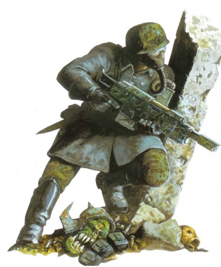

<!-- A0496-B0004 -->

原译文

Guardsman of the Armageddon Steel Legions 阿玛吉多顿钢铁军团的卫兵

**校订译文**

Guardsman of the Armageddon Steel Legions 阿玛吉多顿钢铁军团的卫兵

<!-- /A0496-B0004 -->

<!-- A0496-B0005 -->
## Recruitment and Training 招募与训练

<!-- /A0496-B0005 -->

<!-- A0496-B0006 -->
**英文原文**

The recruitment (or conscription) and training of each Guardsman is based entirely on the customs and traditions of their native homeworld, a result of the tithe imposed on each Planetary Governor. Just as there are a million worlds in the Imperium so too are there a million ways one can become a Guardsman; for many it is considered an honour to join the Guard, or at least a way to escape a wretched existence. The result are Guardsmen as wildly different from each other as possibly, from highly-trained professional soldiers to savage gang-fighters and medieval barbarians. If any additional training is required, especially among primitive recruits with little to no knowledge of how to work modern weapons of war, it will be given in transit to their initial deployment.

<!-- /A0496-B0006 -->

<!-- A0496-B0007 -->

原译文

每个卫兵的招募（或征兵）和训练完全基于他们家园世界的习俗和传统，这是强加给每个行星总督的什一税的结果。正如帝国中有百万个世界一样，一个人也有百万种方式可以成为一名卫兵；对许多人来说，加入卫队是一种荣誉，或者至少是逃离悲惨生活的一种方式。其结果是，从训练有素的专业士兵到野蛮的帮派战士和中世纪的野蛮人，卫兵之间的可能截然不同。如果需要任何额外的训练，特别是在对如何使用现代战争武器知之甚少甚至一无所知的原始新兵中，将在他们的初始部署过程中进行。

**校订译文**

每位行星总督承担的什一税义务，决定了其世界必须为帝国卫队提供兵员；至于如何招募或征召、如何训练，则完全依据当地习俗与传统。帝国有百万个世界，也就有百万种成为卫兵的方式。许多人视参军为荣誉，或至少把它当作逃离悲惨生活的机会。因此，卫兵的出身与素质千差万别，既有训练有素的职业军人，也有凶悍的帮派战士和中世纪式的蛮族。如果还需补充训练，尤其是来自原始社会、不懂使用现代武器的新兵，通常会在前往首次部署地点的途中完成。

<!-- /A0496-B0007 -->

<!-- A0496-B0008 -->
## Role and Organisation 角色和组织

<!-- /A0496-B0008 -->

<!-- A0496-B0009 -->
**英文原文**

Guardsmen fulfil every conceivable role within the Imperial Guard, from tank crewmen to snipers, vox-operators to medics. As laid out in the Tactica Imperium, the basic organisational unit most Guardsmen will fight under is the squad, a number of which will form into a platoon. Several platoons will make up a company which in turn make up a regiment. While such standards do exist, they are not uniformly followed for any number of reasons, leading to formations of different names, sizes and compositions.

<!-- /A0496-B0009 -->

<!-- A0496-B0010 -->

原译文

卫兵在帝国卫队中扮演着所有可以想象的角色，从坦克乘员到狙击手，从音阵操作员到军医。正如帝国战术中所规定的那样，大多数卫兵将在其下作战的基本组织单位是小队，其中一些人将组成一个排。几个排组成一个连队，连队又组成一个兵团。虽然确实存在这样的标准，但由于多种原因，它们并没有得到统一遵守，导致形成了不同的名称、规模和构成。

**校订译文**

卫兵承担帝国卫队中几乎所有可想见的职责，从坦克乘员、狙击手，到音阵操作员、军医，不一而足。按照《帝国战术》的规定，大多数卫兵的基本作战单位是班，数个班组成排，数个排组成连，多个连再组成兵团。不过，这些标准并未因种种原因得到统一执行，各地编制的名称、规模与人员构成也因此不同。

<!-- /A0496-B0010 -->

<!-- A0496-B0011 图片 -->
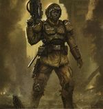

<!-- A0496-B0012 -->

原译文

Guardsman 卫兵

**校订译文**

Guardsman 卫兵

<!-- /A0496-B0012 -->

<!-- A0496-B0013 -->
## Variations 变体

<!-- /A0496-B0013 -->

<!-- A0496-B0014 -->
### Medics 军医

<!-- /A0496-B0014 -->

<!-- A0496-B0015 -->
**英文原文**

Medics and Field Chiurgeons are Guardsmen trained to give medical treatment to wounded in the field in the heat of combat. They typically operate out of Company Command Squads. Medics go by many different names, but all are trained in providing first response and frontline medical care to injured Guardsmen. They are also equally combat-capable and will fight shoulder-to-shoulder with their fellow squad-mates.

<!-- /A0496-B0015 -->

<!-- A0496-B0016 -->

原译文

军医和野战医疗兵是经过训练的卫兵，在激战中为野战伤员提供医疗服务。他们通常在连队指挥组之外行动。军医有很多不同的名字，但他们都受过为受伤的卫兵提供第一反应和一线医疗护理的培训。他们同样具有战斗能力，并将与队友并肩作战。

**校订译文**

军医和野战医疗兵都是受过医疗训练的卫兵，负责在激烈战斗中救治伤员，通常编在连指挥组中。各地称谓虽不同，他们都掌握急救和前线医疗技能。同时，他们也具备战斗能力，能与同组战友并肩作战。

**校注：** operate out of 指以连指挥组为编制或行动基础，非“在指挥组之外”。同改军旗手段。

<!-- /A0496-B0016 -->

<!-- A0496-B0017 图片 -->
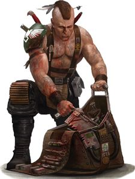

<!-- A0496-B0018 -->

原译文

Imperial Guard Field Chiurgeon 帝国卫队野战医疗兵

**校订译文**

Imperial Guard Field Chiurgeon 帝国卫队野战医疗兵

<!-- /A0496-B0018 -->

<!-- A0496-B0019 -->
### Standard Bearer 军旗手

原题：Standard Bearer 标准旗手

<!-- /A0496-B0019 -->

<!-- A0496-B0020 -->
**英文原文**

Standard Bearers are Guardsmen who due to battlefield gallantry have been rewarded with the honour of holding the Company or Regimental Standard. Typically operating out of Company Command Squads, the Standard Bearer serves as a reminder for the rest of the Company to fight with duty and honor.

<!-- /A0496-B0020 -->

<!-- A0496-B0021 -->

原译文

标准旗手是指因在战场上的英勇表现而获得持有连队或兵团旗帜荣誉的卫兵。通常在连队指挥组之外执行任务，它提醒连队其他成员要尽职尽责地战斗。

**校订译文**

军旗手是在战场上表现英勇，因而获授执掌连旗或团旗之荣誉的卫兵。他们通常编在连指挥组中，以军旗提醒全连官兵，为职责与荣誉而战。

<!-- /A0496-B0021 -->

<!-- A0496-B0022 图片 -->
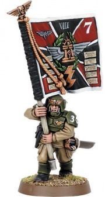

<!-- A0496-B0023 -->

原译文

Imperial Guard Standard Bearer 帝国卫队标准旗手

**校订译文**

Imperial Guard Standard Bearer 帝国卫队军旗手

<!-- /A0496-B0023 -->

<!-- A0496-B0024 -->
### Vox-Operator 音阵操作员

<!-- /A0496-B0024 -->

<!-- A0496-B0025 -->
**英文原文**

Vox-Operators are Guardsmen who operate Vox communication systems in the field, allowing for improved communications and coordination between Company, Platoon, and Squad commands.

<!-- /A0496-B0025 -->

<!-- A0496-B0026 -->

原译文

音阵操作员是在现场操作音阵通信系统的卫兵，可以改善连队、排和小队指挥之间的通信和协调。

**校订译文**

音阵操作员负责在战场上操纵音阵通信系统，加强连、排、班各级指挥之间的联络与协调。

<!-- /A0496-B0026 -->

<!-- A0496-B0027 图片 -->
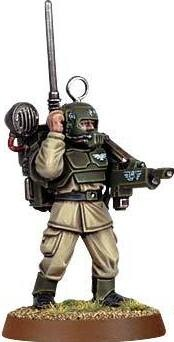

<!-- A0496-B0028 -->

原译文

Imperial Guard Vox-Operator 帝国卫队音阵操作员

**校订译文**

Imperial Guard Vox-Operator 帝国卫队音阵操作员

<!-- /A0496-B0028 -->

<!-- A0496-B0029 图片 -->
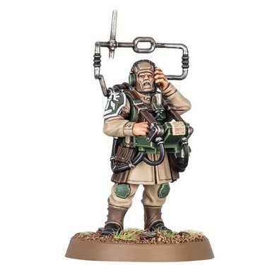

<!-- A0496-B0030 -->

原译文

Transmachina Ocula 超械之眼

**校订译文**

Transmachina Ocula 超械之眼

<!-- /A0496-B0030 -->

<!-- A0496-B0031 -->
**英文原文**

Transmachina Ocula are Guardsman who have been ordained as lay technicians in their Regiments by the Adeptus Mechanicus and have been inducted into the Mechanicus' lesser mysteries.

<!-- /A0496-B0031 -->

<!-- A0496-B0032 -->

原译文

超械之眼是卫兵，他们被机械神教任命为其兵团中的非专业技术人员，并被引入机械教的低级奥秘。

**校订译文**

超械之眼是经机械修会认可、在兵团中担任世俗技术人员的卫兵。他们获准学习机械修会较浅层的秘传知识。

**校注：** lay technicians 是非神职、世俗技术人员，不能译为不专业或没有技术能力。

<!-- /A0496-B0032 -->

<!-- A0496-B0033 -->
### Weapons Specialists 武器专家

<!-- /A0496-B0033 -->

<!-- A0496-B0034 -->
**英文原文**

Some Guardsmen are given a variety of specialized weapons such as Plasma Guns, Heavy Bolters, Meltaguns, and Flamers. They typically operate out of Heavy Weapons Squads or Special Weapons Squads.

<!-- /A0496-B0034 -->

<!-- A0496-B0035 -->

原译文

一些卫兵获得了各种特殊武器，如等离子枪、重型爆矢枪、热熔枪和火焰枪。他们通常在重型武器小队或特殊武器小队中执行任务。

**校订译文**

一些卫兵获得了各种特殊武器，如等离子枪、重型爆矢枪、热熔枪和火焰喷射器。他们通常在重型武器小队或特殊武器小队中执行任务。

<!-- /A0496-B0035 -->

<!-- A0496-B0036 图片 -->
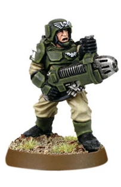

<!-- A0496-B0037 -->

原译文

Guardsmen with a Plasma Gun 手持等离子枪的卫兵

**校订译文**

Guardsmen with a Plasma Gun 手持等离子枪的卫兵

<!-- /A0496-B0037 -->

<!-- A0496-B0038 -->
### Hardened Veterans 坚定老兵

<!-- /A0496-B0038 -->

<!-- A0496-B0039 -->
**英文原文**

As regiments fight gruelling campaigns that last for years on end, eventually they will shrink in size as the number of casualties rises. In many cases an entire company will be reduced to a single squad of the most battle-tested, hardcore Guardsmen blessed with the strength and will to survive the nightmarish battlefields of the 41st Millennium. These Hardened Veterans are experts in all aspects of warfare, from marksmanship to demolition work, and carry a variety of non-standard weapons and equipment. Some regiments may have whole companies of battle-born killers, having survived the grim realities of warfare relatively unscathed. In many cases however these lone squads of hardened survivors will be attached to other regiments, often newly-formed ones, in the hope that their skills will be assimilated by their new parent unit. The Catachan Jungle Fighters do not contain Hardened Veterans as elite troops, instead their standard soldiers are considered to be the equivalent, having grown up and survived on the galaxy's deadliest planet.

<!-- /A0496-B0039 -->

<!-- A0496-B0040 -->

原译文

随着兵团连续多年进行艰苦的战役，随着伤亡人数的增加，他们的规模最终会缩小。在许多情况下，整个连队将缩减为一个由最久经考验、最坚定的卫兵组成的小队，他们有力量和意志在第41个千年的噩梦般的战场上生存下来。这些久经考验的老兵是各个战争方面的专家，从枪法到拆毁工作，他们携带各种非标准武器和装备。一些兵团可能有一整个连队的战斗诞生的杀手，他们在残酷的战争现实中相对毫发无损地幸存下来。然而，在许多情况下，这些孤独的坚定幸存者小队将隶属于其他兵团，通常是新组建的兵团，希望他们的技能能被新的原单位吸收。卡塔昌丛林战士不包含作为精英部队的坚定老兵，相反，他们的标准士兵被认为是等同的，他们在银河系最致命的行星上长大并幸存下来。

**校订译文**

兵团连年经历艰苦战役，会随着伤亡增加不断减员。有时，整个连最后只剩一个班的老兵；他们久经战阵，凭顽强的意志与力量，在第四十一个千年的梦魇战场上存活下来。这些坚定老兵精通射击、爆破等多种作战技能，携带各种非制式武器装备。有些兵团运气较好，保留下整连相对完整、久经战争锤炼的战士；但更多时候，这些零散的老兵班会被调配给其他兵团，尤其是新建兵团，以期将经验传授给新战友。卡塔昌丛林斗士则不单设这类精英，因为普通士兵从银河最致命的行星上长大并活下来，已被视为与坚定老兵同等精锐。

<!-- /A0496-B0040 -->

<!-- A0496-B0041 图片 -->
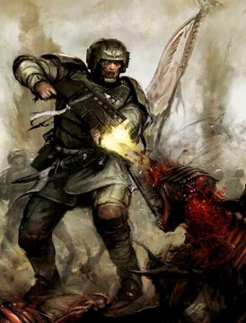

<!-- A0496-B0042 -->

原译文

Shotgun-wielding Veteran Guardsman battles Tyranids 挥舞着霰弹枪的老兵卫兵与泰伦作战

**校订译文**

Shotgun-wielding Veteran Guardsman battles Tyranids 一名持霰弹枪的卫队老兵与泰伦作战

<!-- /A0496-B0042 -->

<!-- A0496-B0043 图片 -->
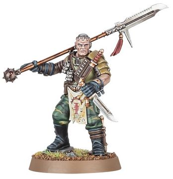

<!-- A0496-B0044 -->

原译文

Death World Veteran in Inquisition service 死亡世界老兵在审判庭服役

**校订译文**

Death World Veteran in Inquisition service 死亡世界老兵在审判庭服役

<!-- /A0496-B0044 -->

<!-- A0496-B0045 -->
### Heavy Gunner 重炮手

<!-- /A0496-B0045 -->

<!-- A0496-B0046 -->
**英文原文**

Heavy Gunners are Guardsmen specialized to operate heavy weapons such as Lascannons, Missile Launchers, Mortars, and Heavy Flamers. They often operate in Heavy Weapon Squads.

<!-- /A0496-B0046 -->

<!-- A0496-B0047 -->

原译文

重炮手是专门操作激光炮、导弹发射器、迫击炮和重型火焰枪等重型武器的卫兵。他们经常在重武器小队作战。

**校订译文**

重炮手是专门操作激光炮、导弹发射器、迫击炮和重型火焰喷射器等重型武器的卫兵。他们经常在重武器小队作战。

<!-- /A0496-B0047 -->

<!-- A0496-B0048 图片 -->
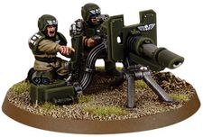

<!-- A0496-B0049 -->

原译文

Cadian Heavy Gunners with a Lascannon 配备激光炮的卡迪亚重炮手

**校订译文**

Cadian Heavy Gunners with a Lascannon 配备激光炮的卡迪亚重炮手

<!-- /A0496-B0049 -->

<!-- A0496-B0050 -->
### Stormtroopers 风暴兵

<!-- /A0496-B0050 -->

<!-- A0496-B0051 -->
**英文原文**

Storm Troopers, also known as Tempestus Scions, are specially-trained Guardsmen used to perform various types of special operations.

<!-- /A0496-B0051 -->

<!-- A0496-B0052 -->

原译文

风暴兵，也称为暴风忠嗣，是经过专门训练的卫兵，用于执行各种类型的特种作战。

**校订译文**

风暴兵又称风暴忠嗣军，是接受专门训练、执行各种特种作战任务的卫兵。

<!-- /A0496-B0052 -->

<!-- A0496-B0053 图片 -->
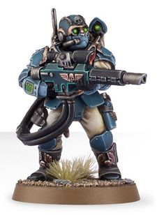

<!-- A0496-B0054 -->

原译文

Stormtrooper 风暴兵

**校订译文**

Stormtrooper 风暴兵

<!-- /A0496-B0054 -->

<!-- A0496-B0055 -->
### Rough Riders 蛮骑兵

<!-- /A0496-B0055 -->

<!-- A0496-B0056 -->
**英文原文**

Rough Riders are Guardsmen deployed as cavalry troopers.

<!-- /A0496-B0056 -->

<!-- A0496-B0057 -->

原译文

蛮骑兵是作为骑兵部队部署的卫兵。

**校订译文**

蛮骑兵是作为骑兵部队部署的卫兵。

<!-- /A0496-B0057 -->

<!-- A0496-B0058 图片 -->
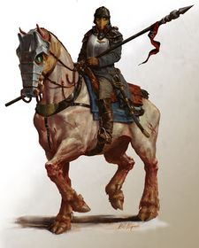

<!-- A0496-B0059 -->

原译文

Krieg Rough Rider 克里格蛮骑兵

**校订译文**

Krieg Rough Rider 克里格蛮骑兵

<!-- /A0496-B0059 -->

<!-- A0496-B0060 -->
### Sharpshooter 神枪手

<!-- /A0496-B0060 -->

<!-- A0496-B0061 -->
**英文原文**

Sharpshooter are trained snipers of the Imperial Guard.

<!-- /A0496-B0061 -->

<!-- A0496-B0062 -->

原译文

神枪手是帝国卫队训练有素的狙击手。

**校订译文**

神枪手是帝国卫队训练有素的狙击手。

<!-- /A0496-B0062 -->

<!-- A0496-B0063 图片 -->
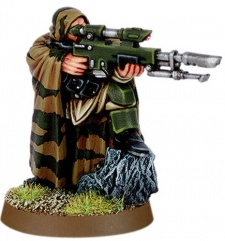

<!-- A0496-B0064 -->

原译文

Cadian Sharpshooter 卡迪亚神枪手

**校订译文**

Cadian Sharpshooter 卡迪亚神枪手

<!-- /A0496-B0064 -->

<!-- A0496-B0065 -->
### Scouts 侦察兵

<!-- /A0496-B0065 -->

<!-- A0496-B0066 -->
**英文原文**

Scouts are used for reconnaissance and to lead troops through difficult terrain.

<!-- /A0496-B0066 -->

<!-- A0496-B0067 -->

原译文

侦察兵用于侦察和带领部队穿过困难的地形。

**校订译文**

侦察兵用于侦察和带领部队穿过困难的地形。

<!-- /A0496-B0067 -->

<!-- A0496-B0068 图片 -->
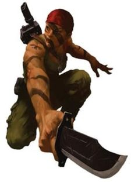

<!-- A0496-B0069 -->

原译文

Imperial Guard Scout 帝国卫队侦察兵

**校订译文**

Imperial Guard Scout 帝国卫队侦察兵

<!-- /A0496-B0069 -->

<!-- A0496-B0070 -->
### Engineer 工兵

<!-- /A0496-B0070 -->

<!-- A0496-B0071 -->
**英文原文**

Combat Engineers are used by Imperial Guard Regiments such as the Death Korps of Krieg. They specialize in tunnelling, counter-mining, and engineering operations.

<!-- /A0496-B0071 -->

<!-- A0496-B0072 -->

原译文

战斗工兵被克里格死亡军团等帝国卫队使用。他们专门从事隧道、反布雷和工程作业。

**校订译文**

克里格死亡军团等帝国卫队部队配有战斗工兵。他们专长于挖掘坑道、反坑道作战及其他工程任务。

**校注：** 结合 tunnelling 的工兵语境，counter-mining 指针对敌军坑道的作业，非反布雷。

<!-- /A0496-B0072 -->

<!-- A0496-B0073 图片 -->
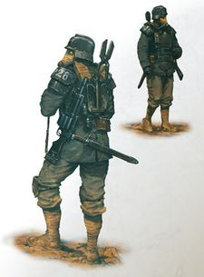

<!-- A0496-B0074 -->

原译文

Death Korps Engineer 死亡军团工兵

**校订译文**

Death Korps Engineer 死亡军团工兵

<!-- /A0496-B0074 -->

<!-- A0496-B0075 -->
### Operator 操作员

<!-- /A0496-B0075 -->

<!-- A0496-B0076 -->
**英文原文**

Operators are Guardsmen who pilot and maintain the many vehicles in the Imperial Guard, giving them basic technical knowledge that makes them highly valued.

<!-- /A0496-B0076 -->

<!-- A0496-B0077 -->

原译文

操作员是卫兵，他们驾驶和维护帝国卫队的许多载具，为他们提供基本的技术知识，使他们受到高度重视。

**校订译文**

操作员负责驾驶和维护帝国卫队的各类车辆。他们因此具备基础技术知识，在部队中十分受重视。

<!-- /A0496-B0077 -->

<!-- A0496-B0078 图片 -->
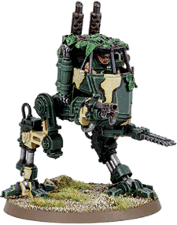

<!-- A0496-B0079 -->

原译文

Catachan Operator piloting a Sentinel 卡塔昌操作员驾驶哨兵

**校订译文**

Catachan Operator piloting a Sentinel 卡塔昌操作员驾驶哨兵

<!-- /A0496-B0079 -->

<!-- A0496-B0080 -->
### Breacher 破坏者

<!-- /A0496-B0080 -->

<!-- A0496-B0081 -->
**英文原文**

Breachers are Imperial Guardsmen who specialize in demolition and explosives as well as the breaching of enemy defenses.

<!-- /A0496-B0081 -->

<!-- A0496-B0082 -->

原译文

破坏者是指专门从事爆破和爆炸以及突破敌人防御的帝国卫队。

**校订译文**

破坏者是专门运用爆破与炸药、突破敌方防御的帝国卫兵。

<!-- /A0496-B0082 -->

<!-- A0496-B0083 图片 -->
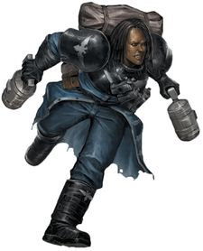

<!-- A0496-B0084 -->

原译文

Imperial Guard Breacher 帝国卫队破坏者

**校订译文**

Imperial Guard Breacher 帝国卫队破坏者

<!-- /A0496-B0084 -->

<!-- A0496-B0085 -->
### Regimental Bodyguard 兵团护卫

<!-- /A0496-B0085 -->

<!-- A0496-B0086 -->
**英文原文**

Guardsmen can be personally handpicked by the Imperial Governor or Astra Militarum General to act as their bodyguards and accompany them into battle.

<!-- /A0496-B0086 -->

<!-- A0496-B0087 -->

原译文

卫兵可以由帝国总督或星界军将军亲自挑选，担任他们的护卫，陪同他们参加战斗。

**校订译文**

卫兵可以由帝国总督或星界军将军亲自挑选，担任他们的护卫，陪同他们参加战斗。

<!-- /A0496-B0087 -->

<!-- A0496-B0088 图片 -->
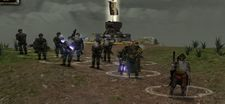

<!-- A0496-B0089 -->

原译文

Regimental Bodyguards accompanying Vance Stubbs 陪同万斯·斯塔布斯的兵团护卫

**校订译文**

Regimental Bodyguards accompanying Vance Stubbs 陪同万斯·斯塔布斯的兵团护卫

<!-- /A0496-B0089 -->

<!-- A0496-B0090 -->
### Conscripts 征召兵

<!-- /A0496-B0090 -->

<!-- A0496-B0091 -->
**英文原文**

Conscripts are Guardsmen who are quickly conscripted and rushed into service. They typically have little training and only the most basic equipment. Different forms of conscripts exist, including:

<!-- /A0496-B0091 -->

<!-- A0496-B0092 -->

原译文

征召兵是迅速被征召入伍并迅速投入服役的卫兵。他们通常没有什么训练，只有最基本的装备。存在不同形式的征召兵，包括：

**校订译文**

征召兵是匆忙应征、迅速被投入服役的卫兵，通常只受过少量训练，配备最基本的装备。他们又分为不同类别，包括：

<!-- /A0496-B0092 -->

<!-- A0496-B0093 -->
### Whiteshield 白盾

<!-- /A0496-B0093 -->

<!-- A0496-B0094 -->
**英文原文**

Whiteshields, formally known as probitors, are the young descendants of Imperial Guardsmen on militant worlds, raised since childhood to one day join the Imperial Guard. They are not yet considered true guardsmen, but traditionally earn the rank of guardsman upon their first battle.

<!-- /A0496-B0094 -->

<!-- A0496-B0095 -->

原译文

白盾，正式名称为正直者，是军事世界中帝国卫队的年轻后裔，从小就被培养成有一天会加入帝国卫队。他们还没有被认为是真正的卫兵，但传统上在第一次战斗中就获得了卫兵的军衔。

**校订译文**

白盾的正式称呼是见习兵（probitors），是尚武世界中帝国卫兵的年轻后代，从小就为日后参军作准备。他们尚不算正式卫兵，按照传统，要经历第一次战斗后才取得卫兵军衔。

**校注：** 本篇 probitors 与493篇 probiters 拼写不同，均指白盾的正式称谓，暂视作底稿异拼并统一“见习兵”。

<!-- /A0496-B0095 -->

<!-- A0496-B0096 图片 -->
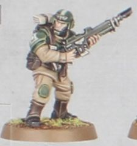

<!-- A0496-B0097 -->

原译文

Cadian Whiteshield 卡迪亚白盾

**校订译文**

Cadian Whiteshield 卡迪亚白盾

<!-- /A0496-B0097 -->

<!-- A0496-B0098 -->
### Penal Conscripts 刑罚征召兵

<!-- /A0496-B0098 -->

<!-- A0496-B0099 -->
**英文原文**

For some service in the Imperial Guard is a way to absolve them of even the most horrible of crimes.

<!-- /A0496-B0099 -->

<!-- A0496-B0100 -->

原译文

对于一些在帝国卫队服役的人来说，这是一种赦免他们最可怕罪行的方式。

**校订译文**

对某些人而言，在帝国卫队服役，是赎清罪行的方式，即使犯下极为严重的罪行也是如此。

<!-- /A0496-B0100 -->

<!-- A0496-B0101 图片 -->
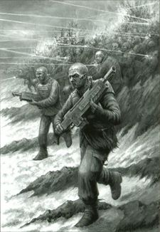

<!-- A0496-B0102 -->

原译文

Penal Legion Conscripts 刑罚军团征召兵

**校订译文**

Penal Legion Conscripts 刑罚军团征召兵

<!-- /A0496-B0102 -->

<!-- A0496-B0103 -->
## Equipment 装备

<!-- /A0496-B0103 -->

<!-- A0496-B0104 -->
**英文原文**

The only standard piece equipment each Guardsman is guaranteed to receive is the Lasgun, and even then some will go into battle without one. Not even a standard uniform exists within the Guard, each Guardsman equipped according to the traditions and resources available to their parent regiment. The basic equipment loadout issued by the Departmento Munitorum includes the lasgun with six power packs, enough for a minimum of 2000 shots, a close combat weapon, usually a bayonet, frag grenades, a laspistol and basic necessities like four days-ration packs, toiletry articles and other items used on the trip to the battlefield. All in all, the standard equipment loadout weighs 25kg, not including special issue items unique to some regiments like the Vitrian reflective armour.

<!-- /A0496-B0104 -->

<!-- A0496-B0105 -->

原译文

每个卫兵唯一能保证获得的标准装备是激光枪，即使这样，有些人也会在没有激光枪的情况下参加战斗。卫队内部甚至没有标准制服，每个卫队都根据其原兵团的传统和可用资源进行装备。军务部发放的基本装备包括带有六个能量包的激光枪，足以发射至少2000次，一种近战武器，通常是刺刀，破片手榴弹、激光手枪和基本必需品，如四天的口粮包、洗漱用品和其他战场之旅中使用的物品。总的来说，标准装备的载重量为25公斤，不包括一些兵团特有的特殊物品，如维特里安反射盔甲。

**校订译文**

激光枪是每名卫兵按规定都应获得的唯一标准装备，即便如此，仍有人没有枪就被送上战场。卫队连统一军服都没有，个人装备依据所属兵团的传统和可用资源而定。军务部规定的基本配发包括：一支激光枪及六个能量包，至少足够射击两千次；一种近战武器，通常为刺刀；破片手榴弹；激光手枪；以及四天口粮、洗漱用品和行军必需品。标准负重合计二十五千克，不含某些兵团特有的装备，例如维特里安反射甲。

<!-- /A0496-B0105 -->

<!-- A0496-B0106 图片 -->
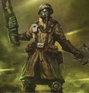

<!-- A0496-B0107 -->

原译文

Well equiped soldier 全装备士兵

**校订译文**

Well equiped soldier 装备齐全的士兵

<!-- /A0496-B0107 -->

<!-- A0496-B0108 -->
## Guardswomen 女卫兵

<!-- /A0496-B0108 -->

<!-- A0496-B0109 -->
**英文原文**

Several Guard regiments include female troopers, including the Tanith First, the Omicron Rangers, and the Calderon Rifles. However, less than 10% of all Guard soldiers are female, and the vast majority of these serve in all-female regiments, such as the Valhallan 296th Ice Warriors. Mixed-sex regiments, such as the Tanith First and the Valhallan 597th, are a rarity.

<!-- /A0496-B0109 -->

<!-- A0496-B0110 -->

原译文

几个卫队兵团包括女性士兵，包括塔尼斯第一兵团、奥密克戎游侠和卡尔德隆步枪兵团。然而，所有卫队士兵中只有不到10%是女性，其中绝大多数都在全女性兵团服役，如瓦尔哈拉冰雪战士第296兵团。混合性别的军团，如塔尼斯第一兵团和瓦尔哈拉第597兵团，是罕见的。

**校订译文**

一些卫队兵团拥有女性士兵，例如塔尼斯第一团、奥密克戎游侠和卡尔德隆步枪团。按本段资料，女性不到卫兵总数的百分之十，其中绝大多数在全女性兵团服役，例如瓦尔哈拉冰雪战士第 296 团。塔尼斯第一团、瓦尔哈拉第 597 团这类男女混编兵团则较为少见。

**校注：** 女性比例与混编情况按所给英文保留；这里未确认统计年代或其是否适用于所有现行资料。

<!-- /A0496-B0110 -->

<!-- A0496-B0111 图片 -->
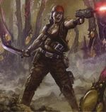

<!-- A0496-B0112 -->

原译文

Catachan Guardswoman 卡塔昌女卫兵

**校订译文**

Catachan Guardswoman 卡塔昌女卫兵

<!-- /A0496-B0112 -->

<!-- A0496-B0113 -->
## Death 死亡

<!-- /A0496-B0113 -->

<!-- A0496-B0114 -->
**英文原文**

Upon their deaths, the Guardsmen's next of kin are sent a Martyrdom Certificate, which is normally signed by their commanding officer.

<!-- /A0496-B0114 -->

<!-- A0496-B0115 -->

原译文

在他们死亡后，卫队的近亲会收到一份殉难证书，通常由他们的指挥官签署。

**校订译文**

卫兵阵亡后，其近亲会收到一份殉难证书，通常由直属指挥官签署。

<!-- /A0496-B0115 -->

<!-- A0496-B0116 -->
## Retirement 退役

<!-- /A0496-B0116 -->

<!-- A0496-B0117 -->
**英文原文**

Retirement from the Imperial Guard is unlikely, as is any hope of returning to one's world of origin. However, if a Regiment has been so badly mauled that it is considered a waste of time and resources to combine it with others, they may be assigned garrison duty of a nearby planet, usually the same one they had just been fighting over. With the population center often decimated and the planet in tatters, the Regiment may be awarded custodianship of the world as a reward. The officers of such forces inevitably become powerful, and wealthy figures whose descendants form the new noble class.

<!-- /A0496-B0117 -->

<!-- A0496-B0118 -->

原译文

从帝国卫队退役是不太可能的，回到原籍世界的任何希望也是如此。然而，如果一个兵团受到如此严重的打击，以至于将其与其他兵团合并被认为是浪费时间和资源，他们可能会被分配到附近行星的驻军任务，通常是他们刚刚为之战斗的行星。随着人口中心经常被摧毁，行星四分五裂，该兵团可能会被授予世界的监护权作为奖励。这些部队的军官不可避免地会变得强大而富有，他们的后代形成了新的贵族阶层。

**校订译文**

帝国卫兵很少有机会退役，也几乎无望返回母星。不过，如果某个兵团伤亡惨重，已不值得耗费时间与资源并入其他部队，就可能被派去驻守附近行星，通常正是他们刚刚为之作战的世界。当地人口中心往往遭到重创，行星满目疮痍，兵团便可能获授治理权作为奖赏。其军官随之成为有权有势的富人，后代则形成新的贵族阶层。

<!-- /A0496-B0118 -->

<!-- A0496-B0119 -->
## Known Guardsmen Privates 已知卫队列兵

原题：Known Guardsmen Privates 著名卫兵个体

<!-- /A0496-B0119 -->

<!-- A0496-B0120 -->
**英文原文**

Krymer - private of the Third Squadron (Sentinel operator) of the 2nd Armoured Reconnaissance Company of the Krieg 1st Armoured Regiment

<!-- /A0496-B0120 -->

<!-- A0496-B0121 -->

原译文

克莱默 - 克里格第一装甲兵团第二装甲侦察连队第三中队（哨兵操作员）的二等兵

**校订译文**

克莱默——克里格第 1 装甲团、第 2 装甲侦察连、第 3 中队的列兵，担任哨兵驾驶员。

<!-- /A0496-B0121 -->

<!-- A0496-B0122 -->
**英文原文**

Liebig - private of the Third Squadron (Sentinel operator) of the 2nd Armoured Reconnaissance Company of the Krieg 1st Armoured Regiment

<!-- /A0496-B0122 -->

<!-- A0496-B0123 -->

原译文

利比格 - 克里格第一装甲兵团第二装甲侦察连队第三中队（哨兵操作员）列兵

**校订译文**

利比格——克里格第 1 装甲团、第 2 装甲侦察连、第 3 中队的列兵，担任哨兵驾驶员。

<!-- /A0496-B0123 -->

<!-- A0496-B0124 -->
**英文原文**

Ohm - private of the Third Squadron (Sentinel operator) of the 2nd Armoured Reconnaissance Company of the Krieg 1st Armoured Regiment

<!-- /A0496-B0124 -->

<!-- A0496-B0125 -->

原译文

欧姆 - 克里格第一装甲兵团第二装甲侦察连队第三中队（哨兵操作员）的二等兵

**校订译文**

欧姆——克里格第 1 装甲团、第 2 装甲侦察连、第 3 中队的列兵，担任哨兵驾驶员。

<!-- /A0496-B0125 -->

<!-- A0496-B0126 -->
**英文原文**

Zworkyin - private of the Third Squadron (Sentinel operator) of the 2nd Armoured Reconnaissance Company of the Krieg 1st Armoured Regiment

<!-- /A0496-B0126 -->

<!-- A0496-B0127 -->

原译文

兹沃金 - 克里格第一装甲兵团第二装甲侦察连队第三中队（哨兵操作员）的二等兵

**校订译文**

兹沃金——克里格第 1 装甲团、第 2 装甲侦察连、第 3 中队的列兵，担任哨兵驾驶员。

<!-- /A0496-B0127 -->

本篇核心术语与暂定项

以下列出本篇出现的英文原形及核心术语表用词。同形词可能指不同对象，具体词义以本篇正文和校注为准；单复数、别名和仅见于图注的名称可能尚未列入。完整候选见[术语表](../../术语表/双语术语候选.csv)。

| 英文 | 采用中文 | 状态 |
| --- | --- | --- |
| Adeptus Mechanicus | 机械修会 | 官方已核对 |
| Astra Militarum | 星界军 | 官方已核对 |
| Imperial Guard | 帝国卫队 | 暂定·语境区分 |
| Imperium | 帝国 | 暂定·简称 |
| Equipment | 装备 | 编辑用语已统一 |
| Emperor of Mankind | 人类帝皇 | 暂定 |
| Emperor | 帝皇 | 官方已核对 |
| Departmento Munitorum | 军务部 | 暂定 |
| Terra | 泰拉 | 暂定·官方待核 |
| Armageddon | 阿玛吉多顿 | 暂定·官方待核 |
| Tanith | 塔尼斯 | 暂定·官方待核 |
| Catachan | 卡塔昌 | 暂定·官方待核 |
| Probitors | 见习兵 | 暂定·官方待核 |
| Frag Grenades | 破片手榴弹 | 暂定·官方待核 |
| Nameless | 无名者 | 暂定·官方待核 |
| Missile Launchers | 导弹发射器 | 暂定·官方待核 |
| Catachan Jungle Fighters | 卡塔昌丛林斗士 | 官方已核对 |
| Death Korps of Krieg | 克里格死亡军团 | 官方已核对 |
| Standard Bearer | 军旗手 | 暂定·官方待核 |
| Transmachina Ocula | 超械之眼 | 暂定·官方待核 |
| Tempestus Scions | 风暴忠嗣军 | 官方已核对 |
| Xenos | 异形 | 暂定·官方待核 |
| Flamers | 火妖（奸奇单位）／火焰喷射器（武器） | 语境定译·对应官译已核 |
| Rangers | 游侠 | 官方已核对 |
| Kin | 炉裔 | 暂定·官方待核 |
| Krieg | 克里格 | 暂定·官方待核 |

