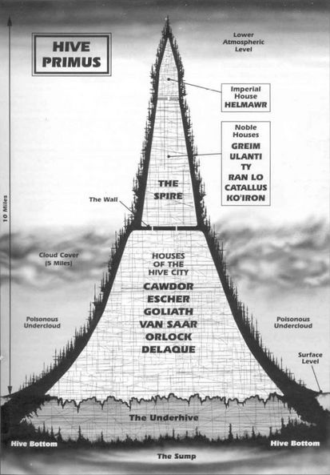
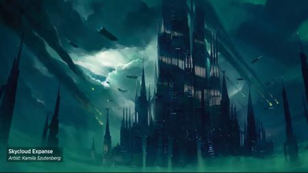
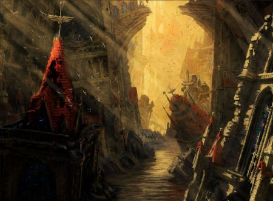

# 0497 巢都 Hive

精校状态：中文行文已逐段精校，部分术语仍为暂定

分类：组织 / 巢都 Hive

原文来源：https://www.bilibili.com/opus/1218458182986236038

原作者：帝国神选罐头

原文时间：编辑于 2026年06月30日 15:51

[返回分类目录](目录.md) · [全书目录](../../目录.md)

<!-- A0497-B0001 -->
**英文原文**

A Hive is a huge urban accretion, built-up over many thousands of years, and home to countless numbers of people.

<!-- /A0497-B0001 -->

<!-- A0497-B0002 -->

原译文

巢都是一个巨大的城市，经过数千年的建造，是无数人的家园。

**校订译文**

巢都是历经数千年不断堆叠扩建而成的巨型城市，无数居民在其中生活。

<!-- /A0497-B0002 -->

<!-- A0497-B0003 图片 -->

<!-- A0497-B0004 -->

原译文

Hive Primus 第一巢都

**校订译文**

Hive Primus 第一巢都

<!-- /A0497-B0004 -->

<!-- A0497-B0005 -->
## Overview 概述

<!-- /A0497-B0005 -->

<!-- A0497-B0006 -->
**英文原文**

Around the entire Imperium over 85% of all planets have at least one hive city cluster.

<!-- /A0497-B0006 -->

<!-- A0497-B0007 -->

原译文

在整个帝国周围，超过85%的行星至少有一个巢都城市群。

**校订译文**

按本篇资料，帝国超过百分之八十五的行星，至少拥有一处巢都城市群。

**校注：** 百分之八十五以及一颗巢都世界常有数千座巢都均来自英文底稿，未给出统计年代与口径，不视为另行核实的普遍数字。

<!-- /A0497-B0007 -->

<!-- A0497-B0008 -->
**英文原文**

Hives consist of great housing and factory blocks, forming ranges of man-made mountains. These huge towering urban complexes are known as city hives, or simply as hives, and their individual peaks or towers are called city spires or spires. A close group of hives is known as a hive cluster. There are often several thousand hives on a single Hive world. A Hive consists of many layers; the lowest layers form the underhive. Hives are worlds in themselves, where the populace has never seen the outer world, and concepts such as the ground and sky are completely alien. There are entire regions inside the hive blocked off by collapsed sections, where is found the treasure of the hive, the Archeotech hoards, ancient stores of technology.

<!-- /A0497-B0008 -->

<!-- A0497-B0009 -->

原译文

巢都由巨大的居住区和工厂区组成，形成了人造山脉。这些巨大的高耸城市建筑群被称为巢都城市，或者简称为巢都，它们各自的尖端或塔楼被称为城市尖塔或尖塔。一组紧密的巢都被称为巢都群。一个巢都世界里通常有几千个巢都。巢都由许多层组成；最底层形成下巢。巢都本身就是世界，民众从未见过外面的世界，地面和天空等概念完全陌生。巢都内的整个区域都被坍塌的部分封锁了，在那里发现了巢都的宝藏、考古科技密藏和古老技术贮存。

**校订译文**

巢都由庞大的住宅区和工厂区构成，层层堆叠，宛如人造山脉。这些高耸的城市建筑群称为巢都城市，通常简称巢都；其中单独的峰顶或高塔，则称为城市尖塔，简称尖塔。彼此紧邻的数座巢都组成巢都群。按本篇说法，一颗巢都世界上往往有数千座巢都。每座巢都内部又分许多层，最底部的层区构成下巢。巢都自成天地，许多居民从未见过外界，连地面和天空都只是陌生的概念。有些整片区域被坍塌结构隔断，其中埋藏着巢都的宝藏：古老技术的遗存与考古科技密藏。

<!-- /A0497-B0009 -->

<!-- A0497-B0010 -->
**英文原文**

Exotic planetary environments give rise to unusual hives, such as those of Landunder which cling to the floating surface crust and extend downwards into the world's oceans. Even gas giants can host hive cities suspended in their upper atmospheres, like Scitalyss or Vesmir II, which are sometimes known as skyhives. Above the latter the main hives are connected with the gas-enshrouded planet via elevator mineshafts providing a steady flow of raw materials.

<!-- /A0497-B0010 -->

<!-- A0497-B0011 -->

原译文

奇异的行星环境会产生不寻常的巢都，例如地下巢都，它们附着在漂浮的地表地壳上，向下延伸到世界的海洋中。即使是气态巨行星也可以拥有悬浮在其高层大气中的巢都城市，如西塔利斯或维斯米尔二号，有时被称为天巢。在后者上，主巢都通过电梯矿井与气体笼罩的行星相连，提供稳定的原材料流。

**校订译文**

特殊的行星环境会孕育异样的巢都。例如，兰德安德的巢都依附于漂浮的地壳，向下伸入海洋。即使是气态巨行星，其高层大气中也能悬浮着巢都城市，例如西塔利斯和维斯米尔二号；这类城市有时称为天巢。在维斯米尔二号，主要巢都通过带升降设施的采矿竖井，与气体笼罩的行星下方相连，源源不断地获取原材料。

**校注：** Landunder 是行星专名，不是泛指地下；暂音译兰德安德。

<!-- /A0497-B0011 -->

<!-- A0497-B0012 -->
## Anatomy of a Hive 巢都结构

<!-- /A0497-B0012 -->

<!-- A0497-B0013 -->
### The Spire 尖塔

<!-- /A0497-B0013 -->

<!-- A0497-B0014 -->
**英文原文**

The upper hive is the region in which the administrators of the hive and various important people live. The homes are better, space is a premium and power is free for all. Life is easy here. The spires are the furthest from the horrors of the lower levels and as such are the best fitted. They are for anyone visiting the planet, giving the best view of the surroundings. Some hive spires pierce through the cloud barriers giving a huge area to watch over.

<!-- /A0497-B0014 -->

<!-- A0497-B0015 -->

原译文

上巢是巢都管理者和各种重要人物居住的区域。房子更好，空间优质，能量是免费的。这里的生活很轻松。尖塔距离低层的恐怖最远，因此是最合适的。它们适合任何访问行星的人，可以欣赏到周围环境的最佳景色。一些巢都的尖塔穿透云层屏障，提供了一个巨大的观察区域。

**校订译文**

上巢是管理者及其他显要人物的居所。住宅条件优越，空间虽然昂贵，能源却免费供应，生活相当舒适。尖塔远离下层的恐怖，因此设施最为完备，也是到访者理想的落脚处，可以俯瞰周围最佳的景致。有些尖塔穿透云层，视野极为开阔。

<!-- /A0497-B0015 -->

<!-- A0497-B0016 图片 -->

<!-- A0497-B0017 -->

原译文

Spire 尖塔

**校订译文**

Spire 尖塔

<!-- /A0497-B0017 -->

<!-- A0497-B0018 -->
### The Shell 外壳

<!-- /A0497-B0018 -->

<!-- A0497-B0019 -->
**英文原文**

The outer shell of a hive is punctuated by deep vertical and angled shafts that allow light and air into the hive's core. These shafts are covered by movable, massive shields for protection. The shell houses crucial infrastructure like travel tunnels, gateway fortresses, and garrison blocks, vital for regulating traffic and defending against invasion. Giant defence lasers mounted on the shell target orbiting threats, whether human or alien spacecraft.

<!-- /A0497-B0019 -->

<!-- A0497-B0020 -->

原译文

巢都的外壳上点缀着深深的垂直和倾斜的竖井，允许光线和空气进入巢都的核心。这些竖井由可移动的大型护盾覆盖，以提供保护。外壳内有重要的基础设施，如旅行隧道、门户堡垒和驻军区，对调节交通和防御入侵至关重要。安装在外壳上的巨型防御激光瞄准了轨道上的威胁，无论是人类还是异型飞船。

**校订译文**

巢都外壳开有深入内部的垂直或倾斜井道，将光线与空气引入核心。井口覆盖着巨大的可移动护板。交通隧道、关口堡垒和驻军区等关键设施也设于外壳中，负责管制通行、抵御入侵。外壳上安装的巨型防御激光炮，能够攻击轨道上的人类或异形舰船。

<!-- /A0497-B0020 -->

<!-- A0497-B0021 -->
**英文原文**

One of the shell's major function is the defense against fierce ash storms, common on Necromunda. These storms can strip away outer layers, including laser defences and essential facilities, threatening the stability of the hive. Regular maintenance by work gangs is necessary to reinforce and repair the shell, preventing ash storms from penetrating deep into the spire's tunnels and infrastructure.

<!-- /A0497-B0021 -->

<!-- A0497-B0022 -->

原译文

外壳的主要功能之一是防御在涅克罗蒙达上常见的猛烈火山灰风暴。这些风暴会剥离外层，包括激光防御和基本设施，威胁巢都的稳定性。有必要由工作小组进行定期维护，以加固和修复外壳，防止火山灰风暴深入尖塔的隧道和基础设施。

**校订译文**

外壳的主要作用之一，是抵御涅克罗蒙达常见的猛烈灰烬风暴。风暴会剥蚀外层结构，连激光防御设施和其他关键设备也可能被毁，危及整座巢都的稳定。劳工队必须定期修补和加固外壳，阻止灰烬风暴侵入尖塔深处的隧道与设施。

**校注：** ash storm 此处未明确源于火山，改作灰烬风暴。

<!-- /A0497-B0022 -->

<!-- A0497-B0023 -->
### Heat Sinks 散热井

原题：Heat Sinks 散热器

<!-- /A0497-B0023 -->

<!-- A0497-B0024 -->
**英文原文**

At the core of every spire on Necromunda is a vertical shaft known as the heat sink, extending from the topmost levels to deep below the planet's crust. This vast, hollow plasteel tube, several kilometres wide, harnesses heat from the planet’s core to generate power for the spire. Generator stations along the heat sink convert raw heat into energy, which is distributed to manufactories and hab layers around the core. In the lower levels, the heat sink provides warmth but no direct power.

<!-- /A0497-B0024 -->

<!-- A0497-B0025 -->

原译文

涅克罗蒙达上每个尖塔的核心都是一个被称为散热器的垂直竖井，从最高层延伸到地壳深处。这根几公里宽的巨大中空塑钢管道利用行星核心的热量为尖塔发电。散热器沿线的发电站将原始热能转化为能量，分配给核心周围的制造厂和居住层。在较低的层，散热器提供热量，但不提供直接电力。

**校订译文**

涅克罗蒙达每座尖塔的核心都有一条称为散热井的垂直井道，从最高层一直深入行星地壳。这根巨大的中空塑钢管道宽达数千米，利用行星核心的热量为尖塔供能。沿井设置的发电站将地热转化为电力，再输送给周边的工厂和居住层。在低层区域，散热井只提供热量，并不直接供电。

**校注：** 原文名为 heat sink，但描述的是贯通巢都、利用地热供能的巨型竖井；暂作“散热井”，保留命名与实际功能的差别。

<!-- /A0497-B0025 -->

<!-- A0497-B0026 -->
**英文原文**

Control of power generation systems is a major marker of a powerful clan in Necromunda's inner core, as clans in whose territory these systems fall earn substantial income. Other clans may control territories through which power is transmitted, extracting tolls from factories and power producers. This creates a feudal economy where clans act as producers, suppliers, and consumers. In the upper hab layers, power services are regulated and controlled by the government, specifically by the troops of Lord Helmawr.

<!-- /A0497-B0026 -->

<!-- A0497-B0027 -->

原译文

发电系统的控制是涅克罗蒙达的内核的强大氏族的主要标志，因为这些系统所在的氏族可以获得可观的收入。其他氏族可能控制着输电的领土，从工厂和电力生产者那里收取通行费。这创造了一种封建经济，氏族充当生产者、供应者和消费者。在上方居住层，电力服务由政府，特别是赫尔马沃领主的部队进行监管和控制。

**校订译文**

在涅克罗蒙达巢都的内部核心，控制发电系统是强大氏族的重要标志：这些系统所在领地的氏族，可以获取可观收入。另一些氏族控制电力必经的领地，向工厂和发电者收取通行费。这形成了一套封建式经济关系，各氏族分别充当生产者、供应者和消费者。上部居住层的供电则由政府管制，具体由赫尔玛沃领主的部队负责。

<!-- /A0497-B0027 -->

<!-- A0497-B0028 -->
### Hab Zones 居住区

<!-- /A0497-B0028 -->

<!-- A0497-B0029 -->
**英文原文**

The majority of a hive’s population on Necromunda belongs to the indentured worker class, living in overcrowded and squalid hab zones. Social standing within the spire is reflected by residential levels: the elite live luxuriously in the uppermost levels, enjoying natural light, fresh air, and real food imported from agri-worlds. Below them are the twilight levels, where conditions are harsher with dim natural light, no fresh air, and heavily recycled food. The lowest levels are the undercity, shrouded in artificial light and characterized by extreme recycling, including air and even people.

<!-- /A0497-B0029 -->

<!-- A0497-B0030 -->

原译文

涅克罗蒙达上的巢都的大部分人口属于契约工人阶级，生活在过度拥挤和肮脏的居住区。尖塔内的社会地位反映在居住层：精英们奢华地生活在最高层，享受自然光、新鲜空气和从农业世界进口的真正食物。在它们下面是黄昏层，那里的条件更为恶劣，自然光线昏暗，没有新鲜空气，食物大量回收利用。最低层是地下城市，笼罩在人造光下，以极端的回收利用为特征，包括空气甚至人。

**校订译文**

涅克罗蒙达巢都的多数居民属于契约劳工阶层，挤在拥挤肮脏的居住区中。居住楼层直接体现社会地位：精英在顶层过着奢华生活，享有自然光、新鲜空气，以及农业世界运来的真正食物。其下是条件恶劣的昏暗楼层，自然光微弱，没有新鲜空气，食物经过反复回收加工。最低处则是完全依赖人工照明的地下城区，那里一切都被极限回收，包括空气，甚至人体。

<!-- /A0497-B0030 -->

<!-- A0497-B0031 -->
### Manufactories 制造厂

<!-- /A0497-B0031 -->

<!-- A0497-B0032 -->
**英文原文**

The industrial complexes within the spires of Necromunda produce various goods traded for food to sustain the planet's vast population. These manufactories extend from below the hab zones to the surface of the Ash Wastes, with their waste solidifying around the hive bases and adding to the planet's layers. As ash levels rise, lower factories are buried but remain operational as long as waste can be pumped to the surface. The manufactory levels are filled with waste pipes, shafts, and drains, expelling toxic substances into the environment.

<!-- /A0497-B0032 -->

<!-- A0497-B0033 -->

原译文

涅克罗蒙达尖塔内的工业建筑群生产各种商品，以换取食物，维持行星上庞大的人口。这些工厂从居住区下方延伸到灰烬荒地的表面，它们的废弃物在巢都底部周围固化，并增加了行星的层次。随着灰烬层的上升，较低的工厂被掩埋，但只要废弃物可以被泵送到地表，工厂就会继续运营。制造厂层充满了废水管、竖井和排水管，将有毒物质排放到环境中。

**校订译文**

涅克罗蒙达尖塔内的工业区生产各种货物，以换取维持庞大人口所需的食物。工厂从居住区下方延伸至灰烬荒原的地表；排出的废料在巢都基部周围凝固，不断增厚行星表层。随着灰烬越积越高，低处的工厂被掩埋，但只要仍能将废料泵送到地表，就会继续生产。工厂层遍布排污管、竖井和排水渠，将有毒物质倾入周围环境。

<!-- /A0497-B0033 -->

<!-- A0497-B0034 -->
**英文原文**

Industrial production is controlled by numerous clans, each fitting into a feudal system of supply and demand. Powerful clans, particularly the six Clan Houses, serve as intermediaries for goods and services. This system efficiently regulates industrial activity, with clans forming alliances or engaging in feuds that often result in gang warfare. Workers, who live near the manufactories, are essential resources and may undergo expensive surgical enhancements to improve their utility, making them highly valuable to their employers.

<!-- /A0497-B0034 -->

<!-- A0497-B0035 -->

原译文

工业生产由众多氏族控制，每个氏族都符合封建供需体系。强大的氏族，特别是六个氏族家族，是商品和服务的中介。这种制度有效地规范了工业活动，氏族结成联盟或进行交战，这往往导致帮派战争。居住在制造厂附近的工人是必不可少的资源，他们可能会接受昂贵的手术增强以提高他们的效用，这使他们对雇主来说非常有价值。

**校订译文**

众多氏族控制着工业生产，各自嵌入一套封建式供求体系。强大的氏族，尤其是六大氏族家族，充当货物与服务的中介。这套体系有效地调节工业活动，而氏族之间的结盟和争斗，也常引发帮派战争。住在工厂附近的工人是重要资源，有些人会接受昂贵的手术强化，以提高工作效能，因此对雇主而言价值极高。

<!-- /A0497-B0035 -->

<!-- A0497-B0036 -->
### Ruined Manufactories 废弃制造厂

<!-- /A0497-B0036 -->

<!-- A0497-B0037 -->
**英文原文**

As the ash waste surface rises, servicing buried manufactories becomes increasingly difficult. Massive vacuum pumps lift waste above the surface, but this process has limits. When waste disposal becomes impractical, manufactories are shut down and abandoned. Consequently, lower levels become wastelands inhabited by low-life scum, while lower hab zones are converted into new manufactories, and upper habs are extended upwards, perpetually renewing the spires of the hive city.

<!-- /A0497-B0037 -->

<!-- A0497-B0038 -->

原译文

随着灰烬荒地表面的上升，为被埋葬的制造厂提供服务变得越来越困难。大型真空泵将废弃物拉升到地表以上，但这一过程有其局限性。当废弃物处理变得不切实际时，制造厂就会关闭并废弃。因此，较低的层变成了居住着下层渣滓的荒地，而较低的居住区则被改造成了新的制造厂，而较高的居住区则向上延伸，不断重申着巢都城市的尖塔。

**校订译文**

灰烬荒原的地面不断升高，埋在地下的工厂也越来越难以维持。巨型真空泵虽然能将废料抽至地面，抽送能力却终有极限。一旦无法继续排污，工厂就会停产废弃。低层逐渐变成社会底层渣滓盘踞的荒地，较低的住宅区则改造成新工厂，上部住宅区继续向高处扩建，巢都尖塔就在这一循环中不断更新。

<!-- /A0497-B0038 -->

<!-- A0497-B0039 -->
**英文原文**

Abandoned manufactories, filled with obsolete machinery, can extend as far below ground as the spires stretch above. The lowest parts of these zones often collapse under the hive's weight or are filled in to create foundations for new structures. These derelict areas are infested by scavvies—mutant gangs scavenging for anything usable or tradable.

<!-- /A0497-B0039 -->

<!-- A0497-B0040 -->

原译文

废弃的制造厂里堆满了废弃的机器，可以延伸到地下，就像尖塔延伸到地上一样。这些区域的最低部分经常在巢都的重量下坍塌，或者被填充为新结构的地基。这些荒废的地区到处都是拾荒者 — 变种人帮派在寻找任何可用或可交易的东西。

**校订译文**

堆满过时机器的废弃工厂，向地下延伸的深度，有时可与地上尖塔的高度相当。最深处往往被巢都的重量压垮，或遭填埋，成为新建筑的地基。变种人拾荒帮派遍布这些废墟，搜寻一切可使用或交易的东西。

<!-- /A0497-B0040 -->

<!-- A0497-B0041 -->
### Underhive 下巢

<!-- /A0497-B0041 -->

<!-- A0497-B0042 -->
**英文原文**

The Underhive is the most run-down area where most of the rules are created by gangs. It is a difficult place to live where the power has long been turned off. People rule through fear and shun the rich above them in the better apartments.

<!-- /A0497-B0042 -->

<!-- A0497-B0043 -->

原译文

下巢是最破败的地区，大部分规则都是由帮派制定的。这是一个很难生活的地方，那里的电力早已被切断。人们通过恐惧来统治，在更好的房间里避开上面的富人。

**校订译文**

下巢是最破败的地区，大多数规矩由帮派制定。这里早已断电，生存艰难。统治者依靠恐惧维持权力，居民则疏远那些住在上层优越居所中的富人。

<!-- /A0497-B0043 -->

<!-- A0497-B0044 图片 -->

<!-- A0497-B0045 -->

原译文

Part of an Underhive 下巢的一部分

**校订译文**

Part of an Underhive 下巢的一部分

<!-- /A0497-B0045 -->

<!-- A0497-B0046 -->
### The Hive Bottom 底巢

<!-- /A0497-B0046 -->

<!-- A0497-B0047 -->
**英文原文**

At the base of the hive, buildings become structurally dangerous, creating an inhospitable area known as the hive bottom. This zone is filled with decayed and crumbling structures, collapsed domes, and foundation piles, forming a layer of almost solid rubble. Enclosed pockets within the rubble are linked by tunnels formed by leaking liquids, resulting in a vast lake of radioactive waste called the Sump. The hive bottom is uninhabitable for most life forms, except for monstrous mutants that thrive in the darkness and pollution. Occasionally, these creatures make their way into the underhive or lower parts of the city, but their natural habitat remains the hive bottom.

<!-- /A0497-B0047 -->

<!-- A0497-B0048 -->

原译文

在巢都底部，建筑物的结构变得危险，形成了一个不适宜居住的区域，称为底巢。这个区域充满了腐烂和摇摇欲坠的结构、倒塌的穹顶和基桩，形成了一层几乎实心的碎石。瓦砾中的封闭口袋由泄漏液体形成的隧道连接起来，形成了一个巨大的放射性废弃物湖，称为污水坑。底巢不适合大多数生命形态居住，除了在黑暗和污染中茁壮成长的可怕变种人。偶尔，这些生物会进入下巢或城市的下部，但它们的自然栖息地仍然是底巢。

**校订译文**

巢都最底部的建筑结构岌岌可危，形成不适宜居住的底巢。腐朽崩塌的建筑、坍落的穹顶与基桩，堆成近乎实心的废墟层。废墟内残存的封闭空腔，由渗漏液体冲出的通道相连，最终汇成巨大的放射性废液湖，称为污水坑。除那些在黑暗与污染中繁衍的可怖变异生物外，多数生命都无法在此生存。这些怪物偶尔会爬进下巢或城市低层，但底巢才是它们真正的栖息地。

<!-- /A0497-B0048 -->

<!-- A0497-B0049 -->
### Outskirts 郊区

<!-- /A0497-B0049 -->

<!-- A0497-B0050 -->
**英文原文**

The outskirts are not as bad to live in as the underhive, but certainly not an easy place to live. Power is nonexistant and running water and constant food supplies are rare. It is certain that people die of starvation here or of some disease spreading through the area.

<!-- /A0497-B0050 -->

<!-- A0497-B0051 -->

原译文

郊区不像下巢那么糟糕，但肯定不是一个容易居住的地方。电力是不存在的，自来水和持续的食物供应是罕见的。可以肯定的是，这里的人们死于饥饿或某种疾病在该地区传播。

**校订译文**

郊区的生活虽不像下巢那么恶劣，却也十分艰难。这里没有电力，自来水和稳定的食物供应更是罕见，居民常因饥饿或蔓延的疾病而死。

<!-- /A0497-B0051 -->

<!-- A0497-B0052 -->
## Main Parts of any Hive City

<!-- /A0497-B0052 -->

<!-- A0497-B0053 -->
## 任何巢都城市的主要部分

<!-- /A0497-B0053 -->

<!-- A0497-B0054 -->
**英文原文**

The main Sectors of each Hive City are:

<!-- /A0497-B0054 -->

<!-- A0497-B0055 -->

原译文

每个巢都城市的主要区域是：

**校订译文**

每个巢都城市的主要区域是：

<!-- /A0497-B0055 -->

<!-- A0497-B0056 -->
**英文原文**

Sectors Imperialis - the main hive levels (the most varied and populated of divisions within a hive city);

<!-- /A0497-B0056 -->

<!-- A0497-B0057 -->

原译文

帝国区 - 主要的巢都层（巢都城市内最多样化和人口最多的分区）；

**校订译文**

帝国区 - 主要的巢都层（巢都城市内最多样化和人口最多的分区）；

<!-- /A0497-B0057 -->

<!-- A0497-B0058 -->
**英文原文**

Sectors Periferus - the outskirts beyond a hive's borders;

<!-- /A0497-B0058 -->

<!-- A0497-B0059 -->

原译文

外围区 — 巢都边界之外的郊区；

**校订译文**

外围区 — 巢都边界之外的郊区；

<!-- /A0497-B0059 -->

<!-- A0497-B0060 -->
**英文原文**

Sectors Mechanicus - heavy industrial zones;

<!-- /A0497-B0060 -->

<!-- A0497-B0061 -->

原译文

机械教区 - 重工业区；

**校订译文**

机械区——重工业区域。

<!-- /A0497-B0061 -->

<!-- A0497-B0062 -->
**英文原文**

Sectors Spirum - the upper spires;

<!-- /A0497-B0062 -->

<!-- A0497-B0063 -->

原译文

尖塔区 - 上面的尖塔；

**校订译文**

尖塔区 - 上面的尖塔；

<!-- /A0497-B0063 -->

<!-- A0497-B0064 -->
**英文原文**

Sectors Habculum - vast hab-blocks;

<!-- /A0497-B0064 -->

<!-- A0497-B0065 -->

原译文

居住区 - 巨大的居住区；

**校订译文**

居住区——大片住宅街区。

<!-- /A0497-B0065 -->

<!-- A0497-B0066 -->
**英文原文**

Sectors Infernus - either the underhive or the underwastes.

<!-- /A0497-B0066 -->

<!-- A0497-B0067 -->

原译文

炼狱区 — 要么是下巢，要么是下层荒原。

**校订译文**

炼狱区 — 要么是下巢，要么是下层荒原。

<!-- /A0497-B0067 -->

本篇核心术语与暂定项

以下列出本篇出现的英文原形及核心术语表用词。同形词可能指不同对象，具体词义以本篇正文和校注为准；单复数、别名和仅见于图注的名称可能尚未列入。完整候选见[术语表](../../术语表/双语术语候选.csv)。

| 英文 | 采用中文 | 状态 |
| --- | --- | --- |
| Imperium | 帝国 | 暂定·简称 |
| Archeotech | 古科技 | 暂定 |
| Hive World | 巢都世界 | 暂定·官方待核 |
| Mutant | 变种人 | 暂定·官方待核 |
| Necromunda | 涅克罗蒙达 | 暂定·官方待核 |
| Ancient | 旗手 | 官方已核对 |
| Host | 天军 | 暂定·官方待核 |
| Landunder | 兰德安德 | 暂定·官方待核 |
| Heat Sink | 散热井 | 暂定·官方待核 |
| Ash Wastes | 灰烬荒原 | 暂定·官方待核 |
| Sectors Mechanicus | 机械区 | 暂定·官方待核 |
| Imperialis | 帝国徽记 | 暂定·官方待核 |
| Scitalyss | 西塔利斯 | 暂定·官方待核 |
| System | 星系（恒星系统） | 暂定·官方待核 |
| Hive City | 巢都城市 | 暂定·官方待核 |

