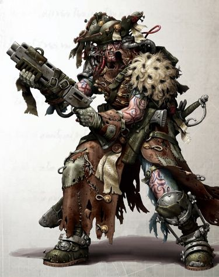
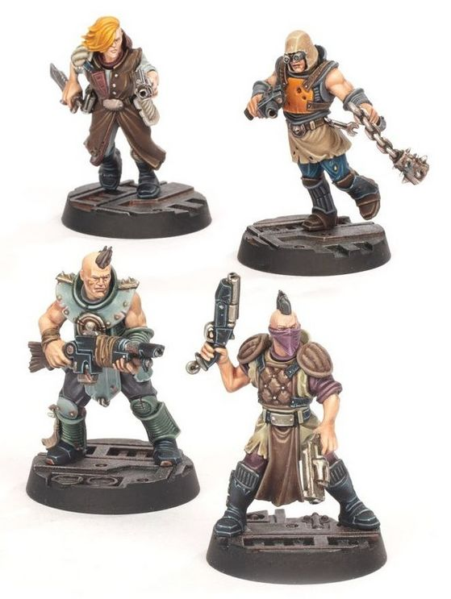

# 0498 巢都渣滓 Hive Scum

精校状态：中文行文已逐段精校，部分术语仍为暂定

分类：组织 / 巢都 Hive

原文来源：https://www.bilibili.com/opus/1178824263452327954

原作者：帝国神选罐头

原文时间：2026年03月12日 16:40

[返回分类目录](目录.md) · [全书目录](../../目录.md)

<!-- A0498-B0001 -->

原译文

You see, you've won again. I told you I was no good at cards. I'll play one more round, but only because you insist.- Reetheus Orl, Barking Saint, Hive Sibellius 你看，你又赢了。我告诉过你我不擅长打牌。我会再打一轮，但这只是因为你坚持。 - 瑞修斯·奥尔，剥皮圣人，西贝柳斯巢都

**校订译文**

You see, you've won again. I told you I was no good at cards. I'll play one more round, but only because you insist.- Reetheus Orl, Barking Saint, Hive Sibellius “看，你又赢了。我早说过自己不会打牌。既然你坚持，那我就再陪你玩一局。”——瑞修斯·奥尔，西贝柳斯巢都“狂吠圣人”

**校注：** Barking Saint 暂作“狂吠圣人”，原译剥皮将 bark 的树皮义误套于此；可能为场所名，具体性质待核。保留全部原英文。

<!-- /A0498-B0001 -->

<!-- A0498-B0002 -->
**英文原文**

Hive Scum, or Scummers, are masterless or itinerant Imperial hivers who will fight for anyone who offers them coin. Scum is a catch-all term for any and all manner of criminals and unsavoury characters. Whether they're petty thieves, Imperial Guard deserters, escaped penal convicts, scam artists, fallen nobles, gangers, desperados, murderers, smugglers, hab-rats and more.

<!-- /A0498-B0002 -->

<!-- A0498-B0003 -->

原译文

巢都渣滓，或称人渣，是没有主人或四处游荡的帝国巢都人，他们会为任何提供硬币的人而战。渣滓是一个包罗万象的术语，指的是各种各样的罪犯和令人讨厌的人物。无论他们是小偷、帝国卫队逃兵、逃犯、骗子、没落贵族、帮派成员、亡命徒、杀人犯、走私犯、巢鼠等等。

**校订译文**

巢都渣滓，亦称人渣，是不依附任何势力或四处游荡的帝国巢都居民，只要付钱，就会替人卖命。“渣滓”笼统涵盖各类罪犯与不受欢迎的人物：小偷、帝国卫队逃兵、越狱犯、骗子、没落贵族、帮派成员、亡命徒、凶手、走私者、巢鼠，等等。

<!-- /A0498-B0003 -->

<!-- A0498-B0004 图片 -->

<!-- A0498-B0005 -->

原译文

Scum 渣滓

**校订译文**

Scum 渣滓

<!-- /A0498-B0005 -->

<!-- A0498-B0006 -->
**英文原文**

Some are mercenaries who travel from zone to zone, earning whatever easy money is around before moving on. Many though are drunkards and down-and-outs who, despite their appearances, are more than capable of holding their own in a fight. Regardless of their background, hive scum are too wild and independent to submit to the leadership of anyone for very long and will only work when they feel like it — as their services are always in demand.

<!-- /A0498-B0006 -->

<!-- A0498-B0007 -->

原译文

有些是雇佣兵，他们从一个区旅行到另一个区，在继续前进之前赚取任何容易赚到的钱。不过，许多人都是酒鬼和穷困潦倒的人，尽管外表如此，但他们完全有能力在战斗中站稳脚跟。无论他们的背景如何，蜂巢渣滓都太狂野和独立，无法长期服从任何人的领导，只有在他们愿意的时候才会工作 — 因为他们的服务总是有需求的。

**校订译文**

有些人是四处流动的佣兵，到一个区域捞些容易到手的钱，就转往下一处。更多人则是酒鬼与落魄者，尽管外表不堪，打起架来却很能自保。不论出身，巢都渣滓都太过桀骜独立，不愿长久服从任何领袖，只在自己乐意时接活——反正总有人需要他们。

<!-- /A0498-B0007 -->

<!-- A0498-B0008 -->
**英文原文**

In the underhives of Necromunda, most hive scum end up working for the Merchant Guilds, though a few are always willing to aid one of the Hive World's numerous gangs. They are especially valuable to newly-created gangs, who hire hive scum to supplement their low numbers or inexperienced gang members. For the more established gangs, however, hive scum are either seen as not worth hiring or nothing more than cannon fodder to use against the gang's enemies.

<!-- /A0498-B0008 -->

<!-- A0498-B0009 -->

原译文

在涅克罗蒙达的下巢中，大多数巢都渣滓最终都为商人行会工作，尽管有少数人总是愿意帮助巢都世界众多帮派中的一个。对于新成立的帮派来说，他们尤其有价值，他们雇佣巢都渣滓来补充数量少或经验不足的帮派成员。然而，对于更成熟的帮派来说，巢都渣滓要么被视为不值得雇佣，要么只不过是用来对付帮派敌人的炮灰。

**校订译文**

在涅克罗蒙达的下巢，多数巢都渣滓最终会替商人行会效力，但也总有少数人愿意帮助当地数不清的帮派。新成立的帮派尤其看重他们，可以借此弥补人数不足或成员缺乏经验的弱点。根基稳固的大帮派则往往认为他们不值得雇用，或者仅将他们当作对付敌人的炮灰。

<!-- /A0498-B0009 -->

<!-- A0498-B0010 -->
**英文原文**

The Inquisition is known to make use of hive scum for their wide range of practical skills. Breaking into a property, charming or intimidating or tricking a target, utilising a local black market, opening fire on a crowd of innocents without a second-thought, all this and more could fall under the skill set of hive scum.

<!-- /A0498-B0010 -->

<!-- A0498-B0011 -->

原译文

众所周知，审判庭利用巢都渣滓来获得广泛的实用技能。闯入一处房屋，诱骗或恐吓或欺骗目标，利用当地黑市，不假思索地向一群无辜者开火，所有这些甚至更多都可能属于巢都渣滓的技能。

**校订译文**

审判庭也会雇用巢都渣滓，借重他们五花八门的实用本领：撬门闯入、讨好、恐吓或欺骗目标、利用当地黑市，乃至毫不犹豫地向无辜人群开火，都可能在其擅长之列。

<!-- /A0498-B0011 -->

<!-- A0498-B0012 图片 -->

<!-- A0498-B0013 -->

原译文

Hive Scum 巢都渣滓

**校订译文**

Hive Scum 巢都渣滓

<!-- /A0498-B0013 -->

<!-- A0498-B0014 -->
**英文原文**

Scum have little or no honour and will seek an advantage wherever they can, whether it be in combat, economically, or elsewhere.

<!-- /A0498-B0014 -->

<!-- A0498-B0015 -->

原译文

渣滓很少或根本没有荣誉，他们会尽可能地寻求优势，无论是在战斗中、经济上还是在其他地方。

**校订译文**

渣滓几乎不讲荣誉，只要有机会，就会在战斗、金钱或任何其他事情上占尽便宜。

<!-- /A0498-B0015 -->

本篇核心术语与暂定项

以下列出本篇出现的英文原形及核心术语表用词。同形词可能指不同对象，具体词义以本篇正文和校注为准；单复数、别名和仅见于图注的名称可能尚未列入。完整候选见[术语表](../../术语表/双语术语候选.csv)。

| 英文 | 采用中文 | 状态 |
| --- | --- | --- |
| Imperial Guard | 帝国卫队 | 暂定·语境区分 |
| Inquisition | 审判庭 | 暂定 |
| Hive World | 巢都世界 | 暂定·官方待核 |
| Necromunda | 涅克罗蒙达 | 暂定·官方待核 |

