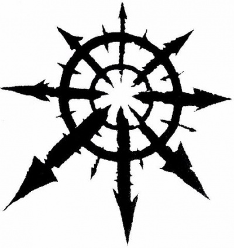
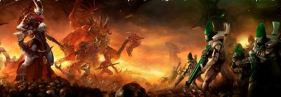
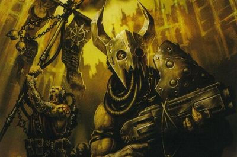
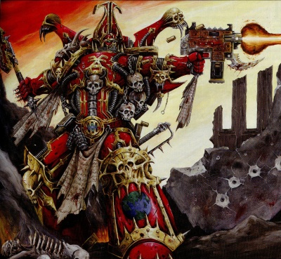
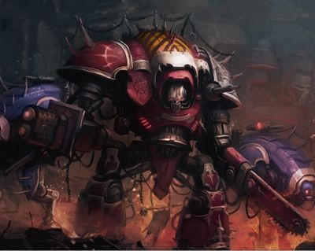
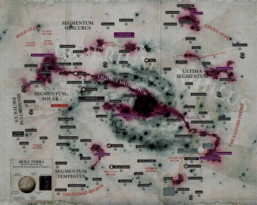
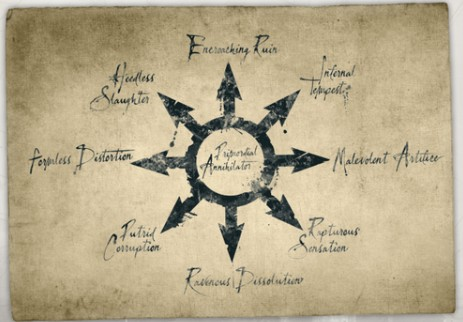

# 0499 混沌 Chaos

精校状态：中文行文已逐段精校，部分术语仍为暂定

分类：组织 / 混沌 Chaos

原文来源：https://www.bilibili.com/opus/1053726430328782857

原作者：帝国神选罐头

原文时间：编辑于 2025年09月24日 18:48

[返回分类目录](目录.md) · [全书目录](../../目录.md)

<!-- A0499-B0001 -->
**英文原文**

Chaos is a part of the psychic energy that composes Warp space. More generally, "Chaos" refers to anything related to Chaos, including its influence, the Gods of Chaos, their followers, and the Warp. Chaos is almost synonymous with the Warp - the two concepts are inseparable: Chaos is the limitless ocean of spiritual and emotional energy that defines the Warp. It is a great and raw force of change and power, and is both physically and spiritually corrupting. The most gifted mortals, psykers, can utilise this energy, thus making them capable of abilities which transcend the laws of the material universe. However, the malevolent power of Chaos can gradually corrupt a psyker, tainting their mind and body.

<!-- /A0499-B0001 -->

<!-- A0499-B0002 -->

原译文

混沌是构成亚空间的精神能量的一部分。更一般地说，“混沌”是指与混沌有关的任何事物，包括它的影响、混沌诸神、他们的追随者和亚空间。混沌几乎是亚空间的同义词 — 这两个概念是不可分割的：混沌是定义亚空间的无限精神和情感能量的海洋。它是一股巨大而原始的变化和力量，在身体和精神上都会腐化。最有天赋的凡人，灵能者，可以利用这种能量，从而使他们能够拥有超越物质宇宙法则的能力。然而，混沌的邪恶力量会逐渐腐化灵能者，污染他们的身心。

**校订译文**

混沌是构成亚空间的灵能能量的一部分。广义上的“混沌”，也指与之有关的一切，包括其影响、混沌诸神、追随者和亚空间本身。混沌与亚空间几乎同义，两个概念不可分割：混沌是构成亚空间特性的无尽精神与情感之海，是原始、庞大的变化之力，能够同时腐化肉体与灵魂。凡人中最具天赋的灵能者，可以运用这种能量，施展超越物质宇宙法则的能力，但混沌的恶意力量也会逐渐侵蚀他们的身心。

<!-- /A0499-B0002 -->

<!-- A0499-B0003 图片 -->

<!-- A0499-B0004 -->

原译文

The eight-pointed star of Chaos 混沌八芒星

**校订译文**

The eight-pointed star of Chaos 混沌八芒星

<!-- /A0499-B0004 -->

<!-- A0499-B0005 -->
**英文原文**

The iconic symbol of Chaos is the eight-pointed star, representing the infinite possibilities of Chaos.

<!-- /A0499-B0005 -->

<!-- A0499-B0006 -->

原译文

混沌的标志性符号是八芒星，代表混沌的无限可能性。

**校订译文**

混沌的标志性符号是八芒星，代表混沌的无限可能性。

<!-- /A0499-B0006 -->

<!-- A0499-B0007 -->
**英文原文**

Chaos itself has many names. The Eldar, for example, call it the Primordial Annihilator while Lorgar and the Word Bearers dub it the Primordial Truth.

<!-- /A0499-B0007 -->

<!-- A0499-B0008 -->

原译文

混沌本身有很多名字。例如，灵族称之为原初毁灭者，而珞珈和怀言者则称之为原初真理。

**校订译文**

混沌本身有很多名字。例如，灵族称之为原初毁灭者，而珞珈和怀言者则称之为原初真理。

<!-- /A0499-B0008 -->

<!-- A0499-B0009 -->
## Overview 概述

<!-- /A0499-B0009 -->

<!-- A0499-B0010 -->
### The Realm of Chaos 混沌领域

<!-- /A0499-B0010 -->

<!-- A0499-B0011 -->
**英文原文**

The Realm of Chaos was formed as the emotions of mortals (be they anguish, desire, hatred, or pride) pooled together in the psychic mirror-reality of the material universe known as The Warp. Such was the power of these emotions that they eventually formed creatures which, over time, gained sentience, resulting in the birth and rise of the Gods of Chaos. As the races of the material universe grew, so too did their hopes, dreams, rage, wars, loves, and hatreds. All of these raw emotions served to fuel the growth and power of the Chaos Gods. Eventually, the gods reached back, into the dreams and desires of mortals, and since that time they have been working to influence the physical realm and its myriad races.

<!-- /A0499-B0011 -->

<!-- A0499-B0012 -->

原译文

混沌领域是由凡人的情感（无论是痛苦、欲望、仇恨还是骄傲）汇集在物质宇宙的精神现实镜像中形成的，被称为亚空间。正是这些情绪的力量，它们最终形成了生物，随着时间的推移，这些生物获得了知觉，导致了混沌诸神的诞生和崛起。随着物质宇宙中种族的增长，他们的希望、梦想、愤怒、战争、爱和仇恨也在增长。所有这些原始的情绪都为混沌诸神的成长和力量提供了动力。最终，众神回到了凡人的梦境和欲望中，从那时起，他们一直在努力影响物质世界及其无数种族。

**校订译文**

亚空间是物质宇宙在灵能层面的镜像，凡人的痛苦、欲望、仇恨、骄傲等情感在其中汇聚，形成了混沌领域。这些情感强大到凝成某些存在，并随着岁月流逝逐渐获得自我意识，最终诞生、壮大为混沌诸神。物质宇宙的各种族不断发展，其希望、梦想、愤怒、战争、爱与恨也随之增长。这些原始情感不断滋养诸神。最终，诸神反过来伸向凡人的梦境与欲望，自此不断干预物质世界及其中的无数种族。

<!-- /A0499-B0012 -->

<!-- A0499-B0013 -->
**英文原文**

Chaos and its realm exists far outside of imagination; an impossible abstraction made real only by metaphor and the roiling emotions of the minds of mortals. It is constantly reborn, eternally shifting. Within this realm titanic hosts made purely of energy and emotion clash as the Gods of Chaos wage their endless Great Game. The Chaos Gods and their dominions are one, for both are formed of the same Warp Energy. As the Gods gain power, their realms expand. However the Gods are not alone, for they have countless servants made of their own essence known as Daemons. The beings of the Warp have no true physical forms and even Daemons are simply taking a skin or bubble of appearance that is a projection of their God. The Realm of Chaos is a fantastical landscape devoid of consistency and unbound by the laws of time and space, a random, unstructured panorama of pure energy and unfocused consciousness. It is from this nature that it is dubbed Chaos, for it is Chaotic in the truest sense.

<!-- /A0499-B0013 -->

<!-- A0499-B0014 -->

原译文

混沌及其领域存在于想象之外；一种不可能的抽象，只有通过隐喻和凡人心中翻腾的情感才能实现。它不断重生，不断变化。在这个领域中，完全由能量和情感构成的庞大群体相互冲突，而混沌诸神则进行着他们永无休止的伟大游戏。混沌诸神和他们的领域是一体的，因为两者都是由相同的亚空间能量形成的。随着诸神获得力量，他们的领域也在扩大。然而，诸神并不孤单，因为他们有无数由自己的本质组成的仆人，被称为恶魔。亚空间的生物没有真正的物理形态，甚至恶魔也只是获取了一副外表皮囊或是表象躯壳，它们所信奉的诸神的一种外在投射。混沌领域是一个缺乏一致性、不受时间和空间法则约束的奇幻景观，是一个随机、无结构的纯能量和无聚焦意识的全景。正是由于这种性质，它被称为混沌，因为它是最真实意义上的混沌。

**校订译文**

混沌及其领域超乎想象，是一种不可能的抽象存在，只能通过隐喻和凡人翻涌的情感获得形貌。它不断重生，永远变化。混沌诸神在其中进行无休止的伟大游戏，由纯粹能量与情感组成的庞大军势相互厮杀。诸神与各自领域本为一体，都由同样的亚空间能量构成；神祇力量增长，领域也随之扩张。诸神并非孤身存在，它们以自身本质创造了无数仆从，即恶魔。亚空间存在没有真正的物质形体，恶魔的外貌也只是一层显现的皮囊，是其所属神祇的投影。混沌领域不具稳定的一致性，也不受时间和空间法则约束，处处是随机、无序的纯能量与未定形意识。正因这种彻底的混乱本性，它才被称为混沌。

<!-- /A0499-B0014 -->

<!-- A0499-B0015 -->
**英文原文**

The Realm of Chaos and the Material Universe can overlap, often with devastating consequences for mortals. Warp Storms and Warp Rifts are such examples of a breach between these two realities.

<!-- /A0499-B0015 -->

<!-- A0499-B0016 -->

原译文

混沌领域和物质宇宙可以重叠，通常会给凡人带来毁灭性的后果。亚空间风暴和亚空间裂隙就是这两个现实之间破裂的例子。

**校订译文**

混沌领域与物质宇宙有时会重叠，通常给凡人带来灾难。亚空间风暴和裂隙，就是两个现实之间出现突破口的例子。

<!-- /A0499-B0016 -->

<!-- A0499-B0017 -->
### Ancient History 古代历史

<!-- /A0499-B0017 -->

<!-- A0499-B0018 -->
**英文原文**

At the dawn of time, the Old Ones took some of the primitive races, guiding their development to suit a specific purpose. The Warp at this time was not the hostile place it was in later ages. During their war against the Necrons, the Old Ones created races to battle the threat they posed, creating races with stronger ties to the Warp, giving them psychic power to turn the tide against the Necrons. One of these races was the Eldar.

<!-- /A0499-B0018 -->

<!-- A0499-B0019 -->

原译文

在时间的黎明，古圣引领了一些原始种族，引导他们的发展以适应特定的目的。此时的亚空间并不是后来那个充满敌意的地方。在与死灵的战争中，古圣创造了种族来对抗他们构成的威胁，创造了与亚空间有更紧密联系的种族，赋予他们扭转局势的灵能力量。其中一个种族是灵族。

**校订译文**

在远古之初，古圣引导某些原始种族发展，使其适合特定用途。当时的亚空间还不像后世那样充满敌意。与太空死灵交战时，古圣创造了与亚空间联系更紧密的种族，赋予它们灵能力量，希望借此扭转战局。灵族就是其中之一。

<!-- /A0499-B0019 -->

<!-- A0499-B0020 -->
**英文原文**

Just before the birth of the Emperor of Mankind, the three Gods of Chaos; Khorne, Tzeentch, and Nurgle had already begun to take form in the Warp, although it would take until the end of Terra's Middle Ages for them to fully awaken. Slaanesh had not awoken until around M29, marking the end of the Eldar Empire and the end of the Age of Strife, as well as the beginning of the Great Crusade and the rise of the Imperium.

<!-- /A0499-B0020 -->

<!-- A0499-B0021 -->

原译文

就在人类帝皇诞生之前，混沌三神；恐虐、奸奇和纳垢已经开始在亚空间中成形，尽管他们要到泰拉的中世纪末期才能完全觉醒。色孽直到M29左右才醒来，这标志着灵族帝国的结束和纷争时代的结束，以及大远征和帝国崛起的开始。

**校订译文**

按本段所依据的历史记述，在人类帝皇诞生前不久，恐虐、奸奇和纳垢三位混沌之神便已开始在亚空间中成形，但直到泰拉中世纪末期才完全觉醒。色孽则直到 M29 左右才苏醒，标志着灵族帝国和纷争时代终结，也开启了大远征与帝国崛起。

**校注：** 本段沿用与泰拉中世纪相联的混沌诸神起源版本，年代及宇宙尺度与其他资料可能不同；色孽觉醒 M29 也按原文保留，待出处核实。

<!-- /A0499-B0021 -->

<!-- A0499-B0022 -->
**英文原文**

The rise of Chaos and the first three Chaos Gods, as described, seems to correspond to the development of humanity, implying that Mankind, of all the sentient species, were primarily responsible for the disharmonising of the Warp and the birth of the first three Chaos Gods. Although, without question, all sentient species played a role in the birth of the Chaos Gods, it seems that mankind has an especially close relationship with Chaos, or that mankind's nature is particularly aggressive and unstable.

<!-- /A0499-B0022 -->

<!-- A0499-B0023 -->

原译文

如上所述，混沌与前三位混沌之神的兴起似乎与人类的发展相对应，这意味着人类在所有有知觉的物种中，对亚空间的不谐和前三个混沌之神的诞生负有主要责任。尽管毫无疑问，所有有知觉的物种都在混沌诸神的诞生中发挥了作用，但人类似乎与混沌有着特别密切的关系，或者说人类的本质特别具有攻击性和不稳定性。

**校订译文**

按上述记述，混沌及最初三位混沌之神的兴起，似乎与人类的发展相对应，暗示在所有智慧物种中，人类对亚空间失衡和这三位神祇的诞生负有主要责任。虽然所有智慧物种无疑都起了作用，人类似乎与混沌格外密切，或者人类天性本就尤其富于攻击性、不稳定。

<!-- /A0499-B0023 -->

<!-- A0499-B0024 -->
## The Forces of Chaos 混沌部队

<!-- /A0499-B0024 -->

<!-- A0499-B0025 -->
**英文原文**

The forces of Chaos are those who have pledged themselves to the Gods of Chaos. They are most commonly organized into several types:

<!-- /A0499-B0025 -->

<!-- A0499-B0026 -->

原译文

混沌的部队是那些向混沌诸神宣誓的人。它们通常分为几种类型：

**校订译文**

混沌势力由向混沌诸神宣誓效忠者组成，通常分为以下几类：

<!-- /A0499-B0026 -->

<!-- A0499-B0027 -->
### Daemons 恶魔

<!-- /A0499-B0027 -->

<!-- A0499-B0028 -->
**英文原文**

Daemons are entities of the Warp, horrific creatures brought to the battlefield by the guile of sorcerers. They are often armed simply with claws that rip and tear the enemy to shreds; some use psychic-based powers. The lesser daemons tend to be very poorly armoured and fall in great numbers to rapid-fire weaponry.

<!-- /A0499-B0028 -->

<!-- A0499-B0029 -->

原译文

恶魔是亚空间的实体，是由巫师的诡计带到战场上的可怕生物。他们通常只带着爪子，把敌人撕成碎片；有些使用基于灵能的力量。较小的恶魔往往护甲很差，大量使用速射武器。

**校订译文**

恶魔是亚空间中的存在，通过巫师的手段被带到战场。它们往往只凭利爪就能将敌人撕碎，有些还会运用灵能力量。低阶恶魔通常防护薄弱，面对速射武器时会大量倒下。

**校注：** fall in great numbers to rapid-fire weaponry 是大量死于速射武器，非大量使用速射武器。

<!-- /A0499-B0029 -->

<!-- A0499-B0030 图片 -->

<!-- A0499-B0031 -->

原译文

Chaos Daemons battle Eldar 混沌恶魔与灵族作战

**校订译文**

Chaos Daemons battle Eldar 混沌恶魔与灵族作战

<!-- /A0499-B0031 -->

<!-- A0499-B0032 -->
### The Lost and the Damned 迷失者与被诅咒者

<!-- /A0499-B0032 -->

<!-- A0499-B0033 -->
**英文原文**

The Lost and the Damned are a broad range of renegades and mutants, including degenerate humans, beastmen, cultists, rogue psykers, mutants of the Daemon Worlds, and Traitor Guardsmen. They are also often poorly armoured but come in vast numbers.

<!-- /A0499-B0033 -->

<!-- A0499-B0034 -->

原译文

迷失者和被诅咒者是各种各样的叛徒和变种人，包括堕落的人类、野兽人、邪教徒、失控灵能者、恶魔世界的变种人和叛徒卫队。他们的装甲也往往很差，但人数众多。

**校订译文**

迷失者与被诅咒者涵盖形形色色的叛徒和变种人，包括堕落人类、野兽人、混沌教徒、失控灵能者、恶魔世界的变种人，以及叛变的卫兵。他们通常防护简陋，却数量庞大。

<!-- /A0499-B0034 -->

<!-- A0499-B0035 图片 -->

<!-- A0499-B0036 -->

原译文

Chaos Cultists of the Pilgrims of Hayte 海特朝圣者的混沌教徒

**校订译文**

Chaos Cultists of the Pilgrims of Hayte 海特朝圣者的混沌教徒

<!-- /A0499-B0036 -->

<!-- A0499-B0037 -->
### Chaos Space Marines 混沌星际战士

<!-- /A0499-B0037 -->

<!-- A0499-B0038 -->
**英文原文**

The Chaos Space Marines are formed of the Adeptus Astartes who fell under the sway of Warmaster Horus and rebelled against the Emperor in an attempt to bring the material galaxy under the control of Chaos. A full nine legions left the side of the Emperor and joined Chaos, some choosing specific deities to worship while others went to Chaos Undivided. In the millennia since, other formations of Adeptus Astartes have also fallen to Chaos, from single squads to entire chapters.

<!-- /A0499-B0038 -->

<!-- A0499-B0039 -->

原译文

混沌星际战士由阿斯塔特修会组成，他们在战帅荷鲁斯的统治下反抗帝皇，试图将物质银河系置于混沌的控制之下。整整九个军团离开了帝皇的身边，投入了混沌，一些人选择了特定的诸神来崇拜，而另一些人则去了无分混沌。自那以后的数千年里，阿斯塔特修会的其他编队也堕入混沌，从单个小队到整个战团。

**校订译文**

最初的混沌星际战士，是受战帅荷鲁斯影响而背叛帝皇的阿斯塔特战士，企图将物质银河置于混沌支配之下。整整九支军团离开帝皇、投向混沌，有的崇拜特定神祇，有的信奉无分混沌。此后数千年间，又有其他阿斯塔特部队堕落，规模从单个小队到整个战团不等。

<!-- /A0499-B0039 -->

<!-- A0499-B0040 图片 -->

<!-- A0499-B0041 -->

原译文

World Eaters Chaos Space Marine 吞世者混沌星际战士

**校订译文**

World Eaters Chaos Space Marine 吞世者混沌星际战士

<!-- /A0499-B0041 -->

<!-- A0499-B0042 -->
### Dark Mechanicus 黑暗机械教

<!-- /A0499-B0042 -->

<!-- A0499-B0043 -->
**英文原文**

The Dark Mechanicus are corrupted Tech-Priests of the Adeptus Mechanicus, wielding horrific Warp-fused technologies and Daemon Engines.

<!-- /A0499-B0043 -->

<!-- A0499-B0044 -->

原译文

黑暗机械教是机械神教的堕落技术神甫，他们挥舞着可怕的亚空间融合技术和恶魔引擎。

**校订译文**

黑暗机械教由机械修会中堕落的技术祭司构成，操纵与亚空间融合的可怖技术和恶魔引擎。

<!-- /A0499-B0044 -->

<!-- A0499-B0045 -->
### Traitor Titan Legions 叛徒泰坦军团

<!-- /A0499-B0045 -->

<!-- A0499-B0046 -->
**英文原文**

The Traitor Titan Legions consist of legions of the Collegia Titanica who have fallen to Chaos, many turning their backs on the Imperium during the Horus Heresy. Utilizing Titan war machines corrupted by the powers of Chaos, they are among the most reviled enemies of the Adeptus Mechanicus.

<!-- /A0499-B0046 -->

<!-- A0499-B0047 -->

原译文

叛徒泰坦军团由已经堕入混沌的泰坦修会军团组成，其中许多人在荷鲁斯叛乱期间背弃了帝国。他们利用被混沌力量腐蚀的泰坦战争机器，是机械神教最受唾骂的敌人之一。

**校订译文**

叛徒泰坦军团是泰坦修会中堕入混沌的军团，其中许多在荷鲁斯之乱期间就背弃了帝国。他们驾驶遭混沌力量腐化的泰坦战争机器，是机械修会最憎恶的敌人之一。

<!-- /A0499-B0047 -->

<!-- A0499-B0048 -->
### Chaos Knights 混沌骑士

<!-- /A0499-B0048 -->

<!-- A0499-B0049 -->
**英文原文**

Chaos Knights consist of Imperial Knights and in many cases their entire Households that have fallen to the Ruinous Powers. They pilot Knight suits, which while smaller than a Titan are still powerful war machines in their own right.

<!-- /A0499-B0049 -->

<!-- A0499-B0050 -->

原译文

混沌骑士由帝国骑士组成，在许多情况下，他们的整个家族都落入了毁灭力量的手中。他们驾驶骑士机甲，虽然比泰坦小，但它们本身仍然是强大的战争机器。

**校订译文**

混沌骑士是投向毁灭诸力的帝国骑士，有时甚至整个骑士家族一同堕落。他们驾驶的骑士机甲虽小于泰坦，本身仍是强大的战争机器。

<!-- /A0499-B0050 -->

<!-- A0499-B0051 图片 -->

<!-- A0499-B0052 -->

原译文

Chaos Knight 混沌骑士

**校订译文**

Chaos Knight 混沌骑士

<!-- /A0499-B0052 -->

<!-- A0499-B0053 -->
### Other Species 其他种类

<!-- /A0499-B0053 -->

<!-- A0499-B0054 -->
**英文原文**

Other races and civilizations have also fallen to Chaos. These include the Scaephylyds, Laer, Yu'vath, Saruthi, Grell, Lok'kroll, and Xenarch and many others.

<!-- /A0499-B0054 -->

<!-- A0499-B0055 -->

原译文

其他种族和文明也堕入了混沌。其中包括百目虫、刺人、尤瓦斯、萨鲁提、格雷尔、洛克‘克罗尔和泽纳克等许多其他。

**校订译文**

其他种族与文明也曾堕入混沌，包括百目虫、莱尔、尤瓦斯、萨鲁提、格雷尔、洛克’克罗尔、泽纳克等。

**校注：** Laer 采用全书565专篇标题“莱尔”，修正本篇孤例“刺人”。

<!-- /A0499-B0055 -->

<!-- A0499-B0056 -->
## The Gods of Chaos 混沌诸神

<!-- /A0499-B0056 -->

<!-- A0499-B0057 -->
**英文原文**

There are four great Powers of Chaos. Each one is given form and fed by the emotions manifested by sentient beings in the material universe.

<!-- /A0499-B0057 -->

<!-- A0499-B0058 -->

原译文

混沌有四个伟力。每个都是由物质宇宙中有情众生表现出的情感赋予形式和滋养的。

**校订译文**

混沌有四大强权，它们都由物质宇宙中智慧生命的情感赋予形态，并从中汲取力量。

<!-- /A0499-B0058 -->

<!-- A0499-B0059 图片 -->

<!-- A0499-B0060 -->

原译文

Notable Warp Rifts in the Galaxy 银河系中值得注意的亚空间裂缝

**校订译文**

Notable Warp Rifts in the Galaxy 银河系中值得注意的亚空间裂缝

<!-- /A0499-B0060 -->

<!-- A0499-B0061 -->
**英文原文**

The Chaos Powers and the emotions that gave rise to them:

<!-- /A0499-B0061 -->

<!-- A0499-B0062 -->

原译文

混沌伟力及产生其的情绪：

**校订译文**

混沌诸神及孕育它们的情感如下：

<!-- /A0499-B0062 -->

<!-- A0499-B0063 -->
**英文原文**

Khorne is born of hate and rage.

<!-- /A0499-B0063 -->

<!-- A0499-B0064 -->

原译文

恐虐诞生于仇恨和愤怒之中。

**校订译文**

恐虐诞生于仇恨和愤怒之中。

<!-- /A0499-B0064 -->

<!-- A0499-B0065 -->
**英文原文**

Nurgle is born of despair and fear of death.

<!-- /A0499-B0065 -->

<!-- A0499-B0066 -->

原译文

纳垢诞生于对死亡与恐惧的绝望之中。

**校订译文**

纳垢诞生于绝望和对死亡的恐惧。

**校注：** despair and fear of death 是绝望、对死亡的恐惧两项，非“对死亡与恐惧的绝望”。

<!-- /A0499-B0066 -->

<!-- A0499-B0067 -->
**英文原文**

Slaanesh is born of lust and hedonism.

<!-- /A0499-B0067 -->

<!-- A0499-B0068 -->

原译文

色孽诞生于欲望和享乐主义。

**校订译文**

色孽诞生于欲望和享乐主义。

<!-- /A0499-B0068 -->

<!-- A0499-B0069 -->
**英文原文**

Tzeentch is born of ambition, hope, and the desire for change.

<!-- /A0499-B0069 -->

<!-- A0499-B0070 -->

原译文

奸奇诞生于野心、希望和对变化的渴望。

**校订译文**

奸奇诞生于野心、希望和对变化的渴望。

<!-- /A0499-B0070 -->

<!-- A0499-B0071 -->
**英文原文**

There are also more potential Gods of Chaos, though their status is in flux:

<!-- /A0499-B0071 -->

<!-- A0499-B0072 -->

原译文

还有更多潜在的混沌诸神，尽管他们的地位在不断变化：

**校订译文**

还有其他潜在的混沌之神，其地位尚未定型：

<!-- /A0499-B0072 -->

<!-- A0499-B0073 -->
**英文原文**

Malice is born of anarchy and hatred, and directly opposes the other four main powers. Though fully formed, its tendence toward self-annihilation limits its ability to grow as strong as the great powers.

<!-- /A0499-B0073 -->

<!-- A0499-B0074 -->

原译文

恶意源于无政府状态和仇恨，直接反对其他四个主要力量。虽然已经完全形成，但它自我毁灭的倾向限制了它像伟力一样强大的能力。

**校订译文**

恶意诞生于无序与仇恨，直接对抗四大混沌强权。它虽已完全成形，却因自我毁灭的倾向，难以成长到与四大强权相当的程度。

<!-- /A0499-B0074 -->

<!-- A0499-B0075 -->
**英文原文**

Pater Mutatis is born from the distortion of mind and body. Though not yet a major Chaos God, it had emerged from Fabius Bile's gestalt intelligence by M42.

<!-- /A0499-B0075 -->

<!-- A0499-B0076 -->

原译文

变种之父源于身心的扭曲。虽然它还不是一个主要的混沌之神，但它是由法比乌斯·拜耳的格式塔智慧在M42中出现的。

**校订译文**

变种之父源于身心的扭曲。它虽尚非主要混沌神祇，但到 M42 已从法比乌斯·拜尔的集合意识中诞生。

<!-- /A0499-B0076 -->

<!-- A0499-B0077 -->
**英文原文**

The Dark King is born from the drive toward destruction. Though prophesied to emerge at some point, the Chaos God has not yet fully formed.

<!-- /A0499-B0077 -->

<!-- A0499-B0078 -->

原译文

黑暗之王诞生于毁灭的冲动之中。虽然预言会在某个时候出现，但混沌之神尚未完全形成。

**校订译文**

黑暗之王源于毁灭冲动。虽然预言称它终将在某个时刻诞生，这位混沌神祇目前仍未完全成形。

<!-- /A0499-B0078 -->

<!-- A0499-B0079 -->
## The Ætheric Dominions 以太神域

<!-- /A0499-B0079 -->

<!-- A0499-B0080 -->
**英文原文**

All Daemons of Chaos seem aligned to at least one of the eight Ætheric Dominions, the aspects of Chaos within the Warp.

<!-- /A0499-B0080 -->

<!-- A0499-B0081 -->

原译文

所有混沌恶魔似乎都至少与八种以太神域之一保持一致，这些以太神域乃是亚空间中混沌的不同面相。

**校订译文**

所有混沌恶魔似乎都至少归属于八种以太神域之一；这些神域代表亚空间中混沌的不同面相。

<!-- /A0499-B0081 -->

<!-- A0499-B0082 图片 -->

<!-- A0499-B0083 -->

原译文

The eight pointed star of Chaos representing the Ætheric Dominions 混沌八芒星，代表以太神域

**校订译文**

The eight pointed star of Chaos representing the Ætheric Dominions 混沌八芒星，代表以太神域

<!-- /A0499-B0083 -->

<!-- A0499-B0084 -->
**英文原文**

Encroaching Ruin: Chaos in its purest form. It hungers only for destruction, that all things mortal meet their end and be forgotten. To this singular end it moves inexorably, driven by a nightmarish purpose which subsumes the petty divisions of daemonkind.

<!-- /A0499-B0084 -->

<!-- A0499-B0085 -->

原译文

侵蚀毁灭：这是最纯粹形态的混沌。它只渴望破坏，盼望着所有凡物走向终结并被遗忘。受着一种可怕的目标驱使，它朝着这唯一的目的无情地推进，而这种目标让恶魔族群间那些琐碎的分歧都变得无足轻重。

**校订译文**

侵蚀毁灭：这是最纯粹形态的混沌。它只渴望破坏，盼望着所有凡物走向终结并被遗忘。受着一种可怕的目标驱使，它朝着这唯一的目的无情地推进，而这种目标让恶魔族群间那些琐碎的分歧都变得无足轻重。

<!-- /A0499-B0085 -->

<!-- A0499-B0086 -->
**英文原文**

Formless Distortion: Even as Daemons manifest as obscene parodies of mortal forms, the true essence of Chaos is endlessly shifting and unknowable, twisting, changing and perverting everything it touches. Some Daemons who cross into the Materium embody this to its fullest extent, shaping themselves into agglomerations of immaterial flesh, for whom death is simply one component of the eternal metamorphosis they would inflict upon the material world.

<!-- /A0499-B0086 -->

<!-- A0499-B0087 -->

原译文

无形扭曲：即便恶魔以对凡人生物形态的淫秽模仿之姿显现，但混沌的真正本质却是在永无止境地变幻且难以捉摸，它扭曲、改变并腐化着所触及的一切事物。一些穿越到物质界的恶魔将这一点体现得淋漓尽致，它们把自己塑造成由非物质的血肉聚合而成的形态。对于这些恶魔而言，死亡仅仅是它们想要施加于物质世界的永恒变形过程中的一个组成部分而已。

**校订译文**

无形扭曲：恶魔虽以扭曲亵渎的凡人形貌显现，混沌的真实本质却永远变化、不可知晓，扭曲、改变并腐化所触及的一切。有些进入物质界的恶魔将这种本性体现到极致，把自己化作非物质血肉的聚合体。对它们而言，死亡只是永恒蜕变的一部分，而它们要把这种蜕变强加给整个物质世界。

<!-- /A0499-B0087 -->

<!-- A0499-B0088 -->
**英文原文**

Heedless Slaughter: The fury of battle and the red joy of life’s final end. For some among the hordes of the Warp, the only goal is to fight and to die – it matters not where or why as long as blood flowed. Such entities would appear garbed in the trappings of conquerors and executioners, caring only for the tally of skulls and death they might reap from the mortal world, irrespective of such concerns as friend or foe.

<!-- /A0499-B0088 -->

<!-- A0499-B0089 -->

原译文

无心屠戮：狂怒以及生命最终终结时那血腥的快感。对于亚空间大军中的某些存在而言，唯一的目标就是战斗与死亡——在哪里战斗、为何而战并不重要，只要有鲜血流淌就行。这些存在往往身着征服者与刽子手的服饰装备现身，只在乎他们能从凡世收割到多少颗头颅、制造多少死亡，而全然不顾对方是敌是友之类的问题。

**校订译文**

无心屠戮：战斗的狂怒，生命终结时的血腥欢愉。亚空间群魔中的某些存在，只求战斗与死亡，不在乎身在何处、为何而战，只要鲜血流淌即可。它们披着征服者和刽子手的装束，只计算自己能从凡世收割多少头颅、制造多少死亡，根本不分敌我。

<!-- /A0499-B0089 -->

<!-- A0499-B0090 -->
**英文原文**

Putrid Corruption: A slow corruption, rotting away body and soul, with no final release in death. Among the hosts of Chaos there were those who cared nothing for victory or defeat, only that suffering was spread to as many as possible. Such creatures manifest into the material world in disease and filth, content to spread their vile gifts to the world of mortals.

<!-- /A0499-B0090 -->

<!-- A0499-B0091 -->

原译文

腐败侵蚀：一种缓慢的腐化，一点点侵蚀肉体与灵魂，即便死亡也无法带来最终的解脱。在混沌大军中，有那么一些存在，他们对胜利或失败毫不在意，只想着尽可能地将苦难散播开来。这类生物以疾病和污秽的形态现身于物质世界，心满意足地把他们那丑恶的“馈赠”传播到凡人的世界中。

**校订译文**

腐败侵蚀：一种缓慢的腐化，一点点侵蚀肉体与灵魂，即便死亡也无法带来最终的解脱。在混沌大军中，有那么一些存在，他们对胜利或失败毫不在意，只想着尽可能地将苦难散播开来。这类生物以疾病和污秽的形态现身于物质世界，心满意足地把他们那丑恶的“馈赠”传播到凡人的世界中。

<!-- /A0499-B0091 -->

<!-- A0499-B0092 -->
**英文原文**

Ravenous Dissolution: Such is the hatred that swirls within the Warp that it encompasses all things, and this hatred extends even to itself. To expect rational and sane logic from creatures such as these would be foolish, for Chaos was both its name and nature. Yet, in its self-destructive hatred there is no ally to be found, only a new and more unpredictable foe.

<!-- /A0499-B0092 -->

<!-- A0499-B0093 -->

原译文

贪婪溶解：在亚空间中翻涌着的仇恨是如此强烈，它涵盖了一切事物，而这种仇恨甚至会延伸到混沌自身。指望从这类生物身上看到理性且正常的逻辑是愚蠢的，因为“混沌”既是它们的名字，也是它们的本质。然而，在其自我毁灭式的仇恨中，找不到任何盟友，只有新的、更加难以捉摸的敌人。

**校订译文**

贪婪溶解：在亚空间中翻涌着的仇恨是如此强烈，它涵盖了一切事物，而这种仇恨甚至会延伸到混沌自身。指望从这类生物身上看到理性且正常的逻辑是愚蠢的，因为“混沌”既是它们的名字，也是它们的本质。然而，在其自我毁灭式的仇恨中，找不到任何盟友，只有新的、更加难以捉摸的敌人。

<!-- /A0499-B0093 -->

<!-- A0499-B0094 -->
**英文原文**

Malevolent Artifice: Just as Chaos reflects back a twisted mockery of humanity’s every facet, so too is the very drive to create perverted into a malevolent and destructive force within the Immaterium. Conjured forth into realspace, such daemons harness the works of mortals as a vector for their own annihilation, their machine-like forms at once a mimicry of flesh and artifice, every action made to demonstrate their supremacy over both mortal beings and everything they deigned to create.

<!-- /A0499-B0094 -->

<!-- A0499-B0095 -->

原译文

恶毒技艺：正如混沌以扭曲和嘲弄的方式映射出人类的每一个方面一样，创造的驱动力在非物质界也被扭曲成了一种恶意且具破坏性的力量。当这些恶魔被召唤到现实空间时，它们利用凡人的造物作为实现自身毁灭意图的载体。它们那机器般的形态既是对血肉之躯的模仿，也是对人造物品的模仿。它们的一举一动都意在彰显其凌驾于凡人以及凡人所精心创造的一切事物之上的至高地位。

**校订译文**

恶毒技艺：混沌将人性的各个侧面映成扭曲的嘲弄，就连创造欲也在非物质界中变成恶意与破坏的动力。这类恶魔被召入现实空间后，会利用凡人的造物，将毁灭反施于凡人。它们如同机器的躯体，同时模仿血肉与人工造物；一举一动都在彰显自己凌驾于凡人及其胆敢创造的一切事物之上。

**校注：** their own annihilation 的指代有歧义；结合下一句对凡人及其造物的敌意，译为利用凡人造物反噬凡人，并保留待核，不理解成恶魔必然自毁。

<!-- /A0499-B0095 -->

<!-- A0499-B0096 -->
**英文原文**

Infernal Tempest: Some Daemons are brought forth a maelstrom of raw warpstuff with them, manifesting the energy of the Immaterium as sheer elemental power. Around these entities roiled tempests of prismatic fire, the air is riven with crackling arcs of lightning as the earth twists into fragments of shimmering crystal. To these Daemons there is no higher purpose than the promulgation of that power and of its profligate use on the battlefields of the material realm.

<!-- /A0499-B0096 -->

<!-- A0499-B0097 -->

原译文

地狱风暴：一些恶魔降临之时，会伴随着一股由纯粹的亚空间物质所形成的大漩涡，将非物质界的能量以纯粹的元素之力展现出来。在这些恶魔周围，五彩斑斓的火焰风暴汹涌翻腾，空气中充斥着噼啪作响的闪电弧光，大地扭曲成一片片闪烁的水晶碎块。对于这些恶魔而言，没有什么比宣扬这种力量，并在物质界的战场上肆意施展这种力量更为崇高的目标了。

**校订译文**

地狱风暴：一些恶魔降临之时，会伴随着一股由纯粹的亚空间物质所形成的大漩涡，将非物质界的能量以纯粹的元素之力展现出来。在这些恶魔周围，五彩斑斓的火焰风暴汹涌翻腾，空气中充斥着噼啪作响的闪电弧光，大地扭曲成一片片闪烁的水晶碎块。对于这些恶魔而言，没有什么比宣扬这种力量，并在物质界的战场上肆意施展这种力量更为崇高的目标了。

<!-- /A0499-B0097 -->

<!-- A0499-B0098 -->
**英文原文**

Rapturous Sensation: A maddening screech of sensation and wild impulses. For some among the forces of Chaos the ends of violence truly mattered not, merely that they were there to take part and to experience its vicissitudes, inflicting overwhelming pain and gorging on mortals’ fear. These daemonkind revel in the sensory overload of war, bounding over shell-sundered battlefields to deliver blissful death as they exulted in each blinding flash and deafening blast.

<!-- /A0499-B0098 -->

<!-- A0499-B0099 -->

原译文

狂喜感知：那是一种令人疯狂的感官刺激的尖啸和狂野的冲动。对于混沌势力中的某些存在而言，暴力的结果其实并不重要，重要的是他们能够参与其中，体验其中的跌宕起伏，施加难以承受的痛苦，并尽情享受凡人的恐惧。这些恶魔陶醉于战争带来的感官超载之中，在被炮弹炸得支离破碎的战场上跳跃穿梭，给予他人看似极乐的死亡，同时为每一道炫目的闪光和震耳欲聋的爆炸而狂喜。

**校订译文**

狂喜感知：令人发狂的感官尖啸与狂野冲动。某些混沌存在并不在乎暴力的结果，只求亲身参与、体验变化，向他人施加难以承受的痛苦，饱食凡人的恐惧。它们陶醉于战争带来的感官过载，在炮火撕裂的战场上跳跃穿行，播撒带来狂喜的死亡，并为每道炫目闪光、每次震耳爆炸而欢欣。

<!-- /A0499-B0099 -->

本篇核心术语与暂定项

以下列出本篇出现的英文原形及核心术语表用词。同形词可能指不同对象，具体词义以本篇正文和校注为准；单复数、别名和仅见于图注的名称可能尚未列入。完整候选见[术语表](../../术语表/双语术语候选.csv)。

| 英文 | 采用中文 | 状态 |
| --- | --- | --- |
| Space Marines | 星际战士 | 官方已核对 |
| Adeptus Astartes | 阿斯塔特修会 | 官方已核对 |
| Adeptus Mechanicus | 机械修会 | 官方已核对 |
| Chaos Space Marines | 混沌星际战士 | 官方已核对 |
| Eldar | 灵族 | 暂定·语境区分 |
| Necrons | 太空死灵 | 官方已核对 |
| Psyker | 灵能者 | 官方已核对 |
| Horus Heresy | 荷鲁斯之乱 | 官方已核对 |
| Warp | 亚空间 | 官方已核对 |
| Imperium | 帝国 | 暂定·简称 |
| The Lost and the Damned | 迷失者与被诅咒者 | 暂定 |
| Khorne | 恐虐 | 官方已核对 |
| Tzeentch | 奸奇 | 官方已核对 |
| Nurgle | 纳垢 | 官方已核对 |
| Old Ones | 古圣 | 暂定 |
| Maelstrom | 大漩涡 | 官方已核对 |
| Emperor of Mankind | 人类帝皇 | 暂定 |
| Emperor | 帝皇 | 官方已核对 |
| Word Bearers | 怀言者 | 暂定·官方待核 |
| Slaanesh | 色孽 | 官方已核对 |
| Great Crusade | 大远征 | 暂定·官方待核 |
| Age of Strife | 纷争时代 | 暂定·官方待核 |
| Terra | 泰拉 | 暂定·官方待核 |
| Horus | 荷鲁斯 | 暂定·官方待核 |
| Collegia Titanica | 泰坦修会 | 暂定·官方待核 |
| Realm of Chaos | 混沌领域 | 暂定·官方待核 |
| Beastmen | 野兽人 | 暂定·官方待核 |
| Titan | 泰坦 | 暂定·官方待核 |
| Tech | 技术语 | 暂定·官方待核 |
| Fabius Bile | 法比乌斯·拜尔 | 官方已核对 |
| Executioners | 处刑者 | 语境定译·官方待核 |
| Reborn | 复生者（战团）／重生者（死神军自称） | 语境定译·官方待核 |
| Mortal | 凡人 | 暂定·官方待核 |
| Lorgar | 珞珈 | 暂定·官方待核 |
| Chaos Undivided | 混沌无分 | 暂定·官方待核 |
| Primordial Truth | 原初真理 | 暂定·官方待核 |
| Powers | 能天使 | 暂定·官方待核 |
| Great Game | 伟大游戏 | 暂定·官方待核 |
| Dark Mechanicus | 黑暗机械教 | 暂定·官方待核 |
| Laer | 莱尔 | 暂定·官方待核 |
| Malice | 恶意 | 暂定·官方待核 |
| Pater Mutatis | 变种之父 | 暂定·官方待核 |
| Ætheric Dominions | 以太神域 | 暂定·官方待核 |
| Encroaching Ruin | 侵蚀毁灭 | 暂定·官方待核 |
| Formless Distortion | 无形扭曲 | 暂定·官方待核 |
| Heedless Slaughter | 无心屠戮 | 暂定·官方待核 |
| Putrid Corruption | 腐败侵蚀 | 暂定·官方待核 |
| Ravenous Dissolution | 贪婪溶解 | 暂定·官方待核 |
| Malevolent Artifice | 恶毒技艺 | 暂定·官方待核 |
| Infernal Tempest | 地狱风暴 | 暂定·官方待核 |
| Rapturous Sensation | 狂喜感知 | 暂定·官方待核 |
| Yu'vath | 尤瓦斯 | 暂定·官方待核 |
| Saruthi | 萨鲁提 | 暂定·官方待核 |
| Grell | 格雷尔 | 暂定·官方待核 |
| Xenarch | 泽纳克 | 暂定·官方待核 |
| Ruinous Powers | 毁灭诸力 | 暂定·官方待核 |
| Primordial Annihilator | 原初毁灭者 | 暂定·官方待核 |
| Dark King | 黑暗之王 | 暂定·官方待核 |
| The Dark | 《黑暗》 | 暂定·官方待核 |
| Corruption | 腐败 | 暂定·官方待核 |
| Titan Legions | 泰坦军团 | 暂定·官方待核 |

