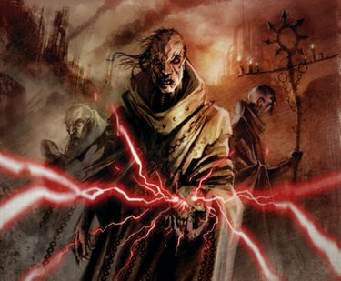

# 0500 巫术 Sorcery

精校状态：中文行文已逐段精校，部分术语仍为暂定

分类：组织 / 混沌 Chaos

原文来源：https://www.bilibili.com/opus/1191377537979121671

原作者：帝国神选罐头

原文时间：2026年04月15日 12:33

[返回分类目录](目录.md) · [全书目录](../../目录.md)

<!-- A0500-B0001 -->
**英文原文**

This article is an overview on the topic of Sorcery and tangential subjects relating to basic principles and mechanisms of various forms of warpcraft.

<!-- /A0500-B0001 -->

<!-- A0500-B0002 -->

原译文

本文概述了巫术和与各种形式的亚空间技艺的基本原理和机制相关的相干主题。

**校订译文**

本文概述巫术，以及各种亚空间技艺的基本原理、运作机制和相关主题。

<!-- /A0500-B0002 -->

<!-- A0500-B0003 图片 -->

<!-- A0500-B0004 -->

原译文

Practitioners of the dark art of sorcery 巫术黑暗技艺的践行者

**校订译文**

Practitioners of the dark art of sorcery 巫术黑暗技艺的践行者

<!-- /A0500-B0004 -->

<!-- A0500-B0005 -->
## Introduction 介绍

<!-- /A0500-B0005 -->

<!-- A0500-B0006 -->
**英文原文**

Sorcerer is a catch-all term for practitioners of warpcraft that draw upon the powers of Chaos, ultimately being based on the power of daemons and the realms of Dark Gods. Through occult formulae and willpower these individuals can perform baleful miracles to achieve immediate mental and physical effects much like that of psykers. A sorcerer does not need to have innate psychic ability to perform such warpcraft, but daemonic pacts are an easy path to power for those born as psykers. The border distinguishing the innate psychic powers of a psyker and sorcery isn't always clear.

<!-- /A0500-B0006 -->

<!-- A0500-B0007 -->

原译文

巫师是一个包罗万象的术语，指的是利用混沌力量的亚空间技艺练习者，最终基于恶魔和黑暗诸神的力量。通过神秘的方法和意志力，这些人可以创造出恶意的神迹，以实现与灵能者非常相似的即时精神和身体效果。巫师不需要天生的灵能能力来执行这种亚空间技艺，但对于天生的灵能者来说，恶魔契约是一条通往力量的捷径。区分巫术和灵能者的天生灵能力量的界限并不总是很清楚。

**校订译文**

“巫师”是对借用混沌之力施展亚空间技艺者的统称，其力量最终来自恶魔和黑暗诸神的领域。他们借助神秘术式与意志力，施展凶险的奇迹，造成类似灵能者能力的直接身心影响。施展这类技艺不必天生具有灵能；但对生来就是灵能者的人而言，与恶魔订立契约也是一条获取力量的捷径。灵能者的先天能力与巫术之间，并不总有清晰的界线。

<!-- /A0500-B0007 -->

<!-- A0500-B0008 -->
**英文原文**

The technological applications of the Warp include the schematics of imperial Warp-drives and imperial Gellar Field-generators have eerie similarities to arcane constructs used in sorcery. Seals, runes, wards, and other symbols are almost a universal feature of warp-technology, and is viewed with varying degrees of superstition or ignorance to their workings.

<!-- /A0500-B0008 -->

<!-- A0500-B0009 -->

原译文

亚空间的技术应用包括帝国亚空间驱动的示意图，帝国盖勒力场发生器与巫术中使用的神秘结构有着惊人的相似之处。印章、符文、保护和其他符号几乎是亚空间技术的一个普遍特征，人们对它们的运作有不同程度的迷信或无知。

**校订译文**

亚空间技术——包括帝国亚空间引擎和盖勒力场发生器的设计——与巫术所用的秘法结构，有着令人不安的相似之处。印记、符文、护符和其他象征，几乎遍布所有亚空间技术；至于它们如何运作，人们则不同程度地陷于迷信或无知。

<!-- /A0500-B0009 -->

<!-- A0500-B0010 -->
**英文原文**

The deluded claim that sorcery is nothing more than a difficult and barely understood science. And indeed it is an art that can be learned and honed through practice and advice. However, this is ultimately a dangerous self-delusion: Sorcery is based on the Warp and the Warp is unreliable and malicious. The most basic and crude applications of Sorcery, e.g. telekinesis, require only relatively little practice and teaching. Powerful and precise applications require the use of rituals or the combination of several disciplines.

<!-- /A0500-B0010 -->

<!-- A0500-B0011 -->

原译文

这种自欺欺人的说法认为巫术只不过是一门难以理解的科学。事实上，这是一门可以通过实践和建议来学习和磨练的技艺。然而，这最终是一种危险的自欺欺人：巫术是基于亚空间的，亚空间是不可靠和恶意的。巫术最基本和最粗糙的应用，如心灵感应，只需要相对较少的实践和教学。强大而精确的应用需要使用仪式或几个学派的组合。

**校订译文**

有人自欺地宣称，巫术不过是一门艰深、尚未被充分理解的科学。它确实能够通过指导与练习学习、精进，但把它视为可靠的科学，终究是危险的自我欺骗：巫术源于亚空间，而亚空间反复无常，充满恶意。最粗浅的应用，例如念动力，只需少量学习与实践；要获得强大且精确的效果，则须借助仪式，或结合数种技艺。

**校注：** telekinesis 是念动力，非心灵感应。

<!-- /A0500-B0011 -->

<!-- A0500-B0012 -->
**英文原文**

The Immaterium and Realspace are connected: One is the reflection of the other and vice versa. Each influences the other to some degree. A living being consists of two components: A material body, but also an immaterial essence, which some call soul, residing in the Immaterium, the Warp.

<!-- /A0500-B0012 -->

<!-- A0500-B0013 -->

原译文

非物质界和现实空间是相互联系的：一个是另一个的映像，反之亦然。两者在一定程度上相互影响。一个生命由两个部分组成：一个物质的身体，但也有一个非物质的本质，有人称之为灵魂，居住在非物质界，亚空间中。

**校订译文**

非物质界与现实空间彼此相连，互为映照，也在一定程度上相互影响。生命由两部分构成：物质性的身体，以及存在于非物质界、也就是亚空间中的非物质本质——有些人称之为灵魂。

<!-- /A0500-B0013 -->

<!-- A0500-B0014 -->
**英文原文**

In some local cultures, the use of certain materials and practices associated with Sorcery is nothing more than tradition and superstition. The Imperium regards these people as Heretics anyways.

<!-- /A0500-B0014 -->

<!-- A0500-B0015 -->

原译文

在一些当地文化中，使用与巫术相关的某些材料和做法只不过是传统和迷信。帝国无论如何都把这些人视为异端。

**校订译文**

在一些地方文化中，使用某些与巫术相关的材料或习俗，可能仅仅出于传统与迷信。但帝国仍会将这些人视为异端。

<!-- /A0500-B0015 -->

<!-- A0500-B0016 -->
**英文原文**

Sanctioned psykers of the Imperium are trained with the teachings of the Scholastica Psykana, though this is no homogeneous institution but consists of several schools of training and particular teachings can vary from school to school.

<!-- /A0500-B0016 -->

<!-- A0500-B0017 -->

原译文

帝国的合法灵能者接受灵能学院的教义训练，尽管这不是一个同质的机构，而是由几个培训学校组成，具体的教义可能因学校而异。

**校订译文**

帝国的合法灵能者接受灵能学院体系的训练。这个体系并非单一、整齐划一的机构，而由多所学校组成，具体教导也因校而异。

<!-- /A0500-B0017 -->

<!-- A0500-B0018 -->
**英文原文**

Divination is a very difficult discipline. It requires subtlety, patience, an intelligent mind, and a belief in oneself as well into what is being divined. It is far too easy to jump to obvious interpretations of a portent. Instead there are multiple layers of meaning and they need to be unearthed one by one to arrive at the true answer. There seems to be two categories of divination: One kind of methods reveals practical information on real-life events, isolated snippets of facts of sometimes shocking accuracy, yet without a context that would put these snippets into perspective. The other kind of methods, which includes for example cartomancy like the Imperial Tarot, works opposite: It uses overarching archetypes and metaphors to reveal an abstract story that tells the big picture and the deeper meaning, yet without hard facts as to whom or to what or to where this story precisely refers to.

<!-- /A0500-B0018 -->

<!-- A0500-B0019 -->

原译文

占卜是一门非常困难的学派。它需要微妙、耐心、聪明的头脑，以及对自己和所占卜的东西的信仰。人们很容易对一个征兆做出明显的解释。相反，它有多层含义，需要逐一挖掘才能得出真正的答案。似乎有两类占卜：一种方法揭示了现实生活中事件的实际信息，有时准确度令人震惊的孤立事实片段，但没有一个背景可以让这些片段得到正确的理解。另一种方法，包括例如帝国塔罗牌这样的占卜术，起到了相反的作用：它使用总体原型和隐喻来揭示一个抽象的故事，这个故事叙述了大局和更深的含义，但没有确切的事实来说明这个故事到底指的是谁、指的是什么或指的是哪里。

**校订译文**

占卜是一门极难掌握的技艺，需要细腻的判断、耐心、聪慧，以及对自身和占卜对象的信念。人很容易停留在征兆最直观的解释上，但真正的答案往往隐藏在多层含义中，必须逐层发掘。占卜大致可分两类：一类揭示现实事件的具体信息，有时是准确得惊人的事实片段，却缺乏能解释其意义的背景；另一类则相反，例如帝国塔罗牌等牌占术，借助宏观的原型与隐喻，呈现一个抽象故事，揭示全貌和深层含义，却不明确指出故事究竟对应何人、何事、何地。

<!-- /A0500-B0019 -->

<!-- A0500-B0020 -->
## Terminology 术语

<!-- /A0500-B0020 -->

<!-- A0500-B0021 -->
**英文原文**

The Body of Light is a Sorcerer's consciousness as it travels separated from the body through the Warp.

<!-- /A0500-B0021 -->

<!-- A0500-B0022 -->

原译文

光体是一个巫师的意识，因为它通过亚空间与身体分离。

**校订译文**

光体是巫师脱离肉身、在亚空间中行游时的意识。

<!-- /A0500-B0022 -->

<!-- A0500-B0023 -->
**英文原文**

The expression "Inner Eye" refers to psychic perception. It is used by the Thousand Sons.

<!-- /A0500-B0023 -->

<!-- A0500-B0024 -->

原译文

“内视”一词指的是灵能感知。它被千子使用。

**校订译文**

“内视”是千子对灵能感知的称呼。

<!-- /A0500-B0024 -->

<!-- A0500-B0025 -->
**英文原文**

imagines is the term for images, pictures and patterns with symbolic meaning and power that resonate in the Warp.

<!-- /A0500-B0025 -->

<!-- A0500-B0026 -->

原译文

想象是指在亚空间中产生共鸣的具有象征意义和力量的图像、图片和图案。

**校订译文**

imagines 指具有象征意义与力量、能在亚空间中共鸣的图像或图案，暂译“象征图像”。

<!-- /A0500-B0026 -->

<!-- A0500-B0027 -->
**英文原文**

imago is the term for a life-like projection of the sorcerer to a location. However this projection shows an idealized version and does e.g. not include stains and dirt on the person and cannot touch or be touched.

<!-- /A0500-B0027 -->

<!-- A0500-B0028 -->

原译文

意象是指巫师向某个地点的逼真投影。然而，这个投影显示了一个理想化的版本，例如不包括人身上的污渍和污垢，也不能触碰或被触摸。

**校订译文**

意象（imago）是巫师向另一处地点投射的逼真影像。它呈现施术者的理想化外貌，例如不会带着本人身上的污渍；这种投影既不能触碰其他事物，也无法被触碰。

<!-- /A0500-B0028 -->

<!-- A0500-B0029 -->
## List of Sorcerous Tomes 巫术典籍列表

<!-- /A0500-B0029 -->

<!-- A0500-B0030 -->
**英文原文**

A Marvelous Historie of Eevil; Being a warninge to Man Kind on the Abuses of Sorcerie and the Seduction of the Daemon - Pre-Imperial Humanity (Interex) - few - treatise warning against the seduction of Chaos and sorcery

<!-- /A0500-B0030 -->

<!-- A0500-B0031 -->

原译文

《令人惊异的邪恶历史；对人类关于巫术的滥用和恶魔的诱惑的警告》— 前帝国人类（英特雷斯）— 几篇关于混沌和巫术诱惑的警告论文

**校订译文**

《令人惊异的邪恶历史：警示人类滥用巫术与恶魔诱惑之害》——帝国建立前的人类文明（英特雷斯）；少量传本。一部告诫人类警惕混沌与巫术诱惑的论著。

**校注：** 书单中的 few、multiple、unique 与后文明确的 copies 对照，按传本数量整理；底稿未保留原表头，数量栏仍可待原始表格复核。

<!-- /A0500-B0031 -->

<!-- A0500-B0032 -->
**英文原文**

Book of Empty Promises - Chaos (Pilgrims of Hayte) - multiple - used by the cult Pilgrims of Hayte, sometimes styled to look like an imperial prayer-book; contains valuable information on daemonology and the Pilgrims of Hayte, as well as several rituals for the summoning and binding of daemons; has a strong psychic corrupting influence on the mind of the reader

<!-- /A0500-B0032 -->

<!-- A0500-B0033 -->

原译文

《空诺之书》— 混沌（海特朝圣者） — 多次被海特朝圣者教派使用，有时看起来像一本帝国祷告书；包含有关恶魔学和海特朝圣者的宝贵信息，以及召唤和束缚恶魔的几种仪式；对读者的心灵有强烈的精神腐化作用

**校订译文**

《空诺之书》——混沌（海特朝圣者）；多份传本。海特朝圣者教派使用的书籍，有时伪装成帝国祈祷书。内含恶魔学与该教派的重要资料，以及数种召唤、束缚恶魔的仪式，对读者心智具有强烈的灵能腐化作用。

<!-- /A0500-B0033 -->

<!-- A0500-B0034 -->
**英文原文**

Book of Lorgar - Chaos (Word Bearers) - multiple - contains knowledge on the nature of the universe, as dictated to Lorgar by the Chaos-Gods; the Book of Lorgar has at least 9752 volumes and is continually being expanded and copied

<!-- /A0500-B0034 -->

<!-- A0500-B0035 -->

原译文

《珞珈之书》- 混沌（怀言者）- 多个 - 包含混沌诸神向珞珈口述的宇宙本质的知识；《珞珈之书》至少有9752卷，并不断被扩充和复制

**校订译文**

《珞珈之书》——混沌（怀言者）；多份传本。记载混沌诸神向珞珈口授的宇宙本质知识，至少已有九千七百五十二卷，仍在不断扩充、抄录。

<!-- /A0500-B0035 -->

<!-- A0500-B0036 -->
**英文原文**

Book of Magnus - Chaos (Thousand Sons) - contains every single thought and deed of Magnus during the Great Crusade

<!-- /A0500-B0036 -->

<!-- A0500-B0037 -->

原译文

《马格努斯之书》- 混沌（千子）- 包含了马格努斯在大远征期间的每一个思考和行动

**校订译文**

《马格努斯之书》——混沌（千子）。记载马格努斯在大远征期间的每一个念头与每一项行动。

<!-- /A0500-B0037 -->

<!-- A0500-B0038 -->
**英文原文**

Codex Atrox - Imperium (Inquisition?) - esoteric topics, including a woodcut-image and a description of a Propylaeum Tripartite; access to this book is restricted

<!-- /A0500-B0038 -->

<!-- A0500-B0039 -->

原译文

《残暴圣典》- 帝国（审判庭？）- 机密话题，包括木刻图像和对三重之门的描述；这本书的访问受到限制

**校订译文**

《残暴圣典》——帝国（审判庭？）。涉及隐秘知识，包含三重之门的木刻图像与描述；查阅受到限制。

<!-- /A0500-B0039 -->

<!-- A0500-B0040 -->
**英文原文**

Damon’s Third Tretis on Matters Rare - Heretic - Written by Damon and is a theoretical treatise on psychic matters of their time. Known to be located at the Temple of Lies, controlled by Tzeentch cultists.

<!-- /A0500-B0040 -->

<!-- A0500-B0041 -->

原译文

《达蒙在罕见之事的第三篇》 - 异端 - 由达蒙撰写，是一篇关于他们那个时代灵能问题的理论论文。众所周知，它位于由奸奇邪教徒控制的谎言神庙。

**校订译文**

《达蒙论稀有事物第三篇》——异端。由达蒙撰写，讨论其时代灵能问题的理论著作，已知藏于奸奇教徒控制的谎言神庙。

<!-- /A0500-B0041 -->

<!-- A0500-B0042 -->
**英文原文**

Eris Transform - Imperium (Heretics) - multiple - describes the ritual of the imperial philosophy of Ateanism to unveil an artwork's inner beauty, in truth the ritual is a dangerous ritual of Slaanesh

<!-- /A0500-B0042 -->

<!-- A0500-B0043 -->

原译文

《纷争转换》- 帝国（异端）- 多个 - 描述了阿提安帝国思想体系的仪式，以揭示艺术作品的内在美，事实上，这个仪式是色孽的一个危险仪式

**校订译文**

《纷争转换》——帝国（异端）；多份传本。描述帝国内阿提安思想体系所用的一种仪式，声称可以揭示艺术品的内在美，实则是危险的色孽仪式。

<!-- /A0500-B0043 -->

<!-- A0500-B0044 -->
**英文原文**

Folio Diabolicus - Chaos - multiple - on the summoning of and dealing with daemons, procedures for creating a daemonhost, many sorcerous spells; has a strong psychic corrupting influence on the mind of the reader

<!-- /A0500-B0044 -->

<!-- A0500-B0045 -->

原译文

《恶魔之页》-混沌 - 多个 - 关于召唤和处理恶魔，创建恶魔宿主的过程，许多巫术咒语；对读者的心灵有强烈的精神腐化作用

**校订译文**

《恶魔之页》——混沌；多份传本。记载召唤及应对恶魔的方法、制造恶魔宿主的步骤，以及多种巫术咒语，对读者心智具有强烈的灵能腐化作用。

<!-- /A0500-B0045 -->

<!-- A0500-B0046 -->
**英文原文**

Grimoire of True Names - Imperium (Ordo Malleus) - multiple - accounts of the true names and activities of daemons in the Calixis-Sector; the text is convoluted and the reports are hard to decipher

<!-- /A0500-B0046 -->

<!-- A0500-B0047 -->

原译文

《真名魔典》- 帝国（圣锤修会）- 多个 - 关于卡利西斯星区恶魔真名和活动的描述；文本复杂难懂，报告难以解读

**校订译文**

《真名魔典》——帝国（恶魔审判庭）；多份传本。记录卡利西斯星区恶魔的真名与活动，文字曲折晦涩，报告难以解读。

<!-- /A0500-B0047 -->

<!-- A0500-B0048 -->
**英文原文**

Hurian's Third Text - Chaos?, Inquisition? - detailed description of a ritual to summon a Flamer of Tzeentch

<!-- /A0500-B0048 -->

<!-- A0500-B0049 -->

原译文

《胡里安的第三文章》— 混沌？审判庭？- 召唤奸奇火妖的仪式的详细描述

**校订译文**

《胡里安第三篇》——混沌？审判庭？详细记载召唤奸奇火妖的仪式。

<!-- /A0500-B0049 -->

<!-- A0500-B0050 -->
**英文原文**

Libellus Appello - Chaos (various Cults) - unique - on the concept of the true name of daemons as well as how to find these names via astrology; written in an obscure tongue and difficult to translate; as of 815.M41 confiscated by the Inquisition

<!-- /A0500-B0050 -->

<!-- A0500-B0051 -->

原译文

《呼召小册》 - 混沌（各种教派）- 独一 - 关于恶魔真名的概念以及如何通过占星术找到这些名称；用晦涩难懂的语言写成，难以翻译；截至815.M41被审判庭没收

**校订译文**

《呼召小册》——混沌（多个教派）；孤本。讨论恶魔真名的概念，以及通过占星术查明真名的方法。以晦涩语言写成，难以翻译；截至 815.M41，已被审判庭没收。

<!-- /A0500-B0051 -->

<!-- A0500-B0052 -->
**英文原文**

Liber Pestilentia - Chaos - on the topic of Nurgle and his daemons

<!-- /A0500-B0052 -->

<!-- A0500-B0053 -->

原译文

《瘟疫之书》 - 混沌 - 关于纳垢和他的恶魔的话题

**校订译文**

《瘟疫之书》——混沌。讨论纳垢及其恶魔。

<!-- /A0500-B0053 -->

<!-- A0500-B0054 -->
**英文原文**

Malus Codicium - Chaos - unique, destroyed in 385.M41 - contains several spells and rituals, images of powerful runes, how to summon a daemon, how to create a daemonhost; has a strong but subtle psychic corrupting influence on the mind of the reader

<!-- /A0500-B0054 -->

<!-- A0500-B0055 -->

原译文

《邪恶律典》 - 混沌 - 独一，于385.M41被摧毁 - 包含几个咒语和仪式、强大符文的图像、如何召唤恶魔、如何创建恶魔宿主、对读者的心灵有强烈但微妙的精神腐化影响

**校订译文**

《邪恶律典》——混沌；孤本，于 385.M41 被毁。内含数种咒语与仪式、强大符文的图像，以及召唤恶魔、制造恶魔宿主的方法，对读者心智具有强烈而隐蔽的灵能腐化作用。

<!-- /A0500-B0055 -->

<!-- A0500-B0056 -->
**英文原文**

Necroteuch - Chaos - two copies, both destroyed in 240.M41 - rumour has it that the content is incredibly powerful knowledge; the book has an extremely strong corrupting aura, affecting everything around it

<!-- /A0500-B0056 -->

<!-- A0500-B0057 -->

原译文

《死灵之书》 - 混沌 - 两份副本，均于240.M41被摧毁 - 有传言称其内容是令人难以置信的强大知识；这本书具有极强的腐化性，影响着周围的一切

**校订译文**

《死灵之书》——混沌；两份传本，均于 240.M41 被毁。传言书中蕴藏威力惊人的知识；此书散发极强的腐化气息，影响周围的一切。

<!-- /A0500-B0057 -->

<!-- A0500-B0058 -->
**英文原文**

Occultus ad Oculos - Chaos - multiple - detailed description on the nature of the warp, warp-creatures and mutation; detailed procedures how to create a daemonhost; has a strong psychic corrupting influence on the mind of the reader

<!-- /A0500-B0058 -->

<!-- A0500-B0059 -->

原译文

《显中之隐》- 混沌 - 多个 - 详细描述了亚空间的本质、亚空间生物及其变异；如何创建恶魔宿主的详细过程；对读者的心灵有强烈的精神腐化作用

**校订译文**

《显中之隐》——混沌；多份传本。详细描述亚空间的本质、亚空间生物与突变，以及制造恶魔宿主的完整步骤，对读者心智具有强烈的灵能腐化作用。

<!-- /A0500-B0059 -->

<!-- A0500-B0060 -->
**英文原文**

On the Confinement of Aetheric Forces - Imperium (Inquisition) - how to imprison daemons

<!-- /A0500-B0060 -->

<!-- A0500-B0061 -->

原译文

《至高天部队的监禁》— 帝国（审判庭）— 如何监禁恶魔

**校订译文**

《论以太力量的禁锢》——帝国（审判庭）。记载囚禁恶魔的方法。

**校注：** Aetheric Forces 是以太力量，非至高天军队；Confinement 为禁锢。

<!-- /A0500-B0061 -->

<!-- A0500-B0062 -->

原译文

Sibylline Incitements 《西比琳的煽动》

**校订译文**

Sibylline Incitements 《西比琳的煽动》

<!-- /A0500-B0062 -->

<!-- A0500-B0063 -->
**英文原文**

The Ochre Book - Imperium (Inquisition?) - esoteric topics, including a description of a Propylaeum Tripartite; access to this book is restricted

<!-- /A0500-B0063 -->

<!-- A0500-B0064 -->

原译文

《赭石之书》- 帝国（审判庭？）- 机密话题，包括对三重之门的描述；这本书的访问受到限制

**校订译文**

《赭石之书》——帝国（审判庭？）。讨论隐秘知识，包括对三重之门的描述；查阅受到限制。

<!-- /A0500-B0064 -->

<!-- A0500-B0065 -->
**英文原文**

Tome of Ammicus Tole - Chaos (Hereteks) - multiple, though most owners possess only fragments; complete copies are extremely rare - contains mostly heretical ramblings, though hidden in the text are instructions for sorcerous rituals and schematics for several heretic tech-devices

<!-- /A0500-B0065 -->

<!-- A0500-B0066 -->

原译文

《阿米库斯·托勒典籍》- 混沌（技术异端）- 多个，尽管大多数主人只拥有碎片；完整的副本极为罕见 - 主要包含异端胡扯，尽管文本中隐藏着巫术仪式的说明和几种异端技术设备的示意图

**校订译文**

《阿米库斯·托勒典籍》——混沌（技术异端）；存在多份传本，但多数持有者只有残篇，完整版本极其罕见。大部分内容是异端的胡言乱语，却暗藏巫术仪式的指引，以及数种异端技术装置的设计图。

<!-- /A0500-B0066 -->

<!-- A0500-B0067 -->
**英文原文**

Ur-Saker - Imperium (Heretics, Cults) - multiple - explains how to enhance your mind via methodical use of psychotropic drugs, e.g. the drug Yellode; the book is proscribed by the inquisition

<!-- /A0500-B0067 -->

<!-- A0500-B0068 -->

原译文

《乌尔-萨克尔》- 帝国（异端、教派）- 多个 - 解释了如何通过有条不紊地使用精神药物（如耶洛德药物）来增强你的思维；这本书被审判庭禁止

**校订译文**

《乌尔-萨克尔》——帝国（异端、教派）；多份传本。说明如何有系统地使用耶洛德等精神活性药物，增强心智，已被审判庭列为禁书。

<!-- /A0500-B0068 -->

<!-- A0500-B0069 -->
### Sorcery via mind 思维巫术

<!-- /A0500-B0069 -->

<!-- A0500-B0070 -->
## Belief 信仰

<!-- /A0500-B0070 -->

<!-- A0500-B0071 -->

原译文

Ask me not to define faith, for faith is that which defies definition. It is that which, when everything around you collapses and is proven a lie, remains, pure, intact, pristine.+++ Confessor Millay +++ 请不要让我定义信仰，因为信仰是无法定义的。当你周围的一切都崩溃并被证明是谎言时，它仍然是纯净、完整、崭新的。 +++ 告解者米莱 +++

**校订译文**

Ask me not to define faith, for faith is that which defies definition. It is that which, when everything around you collapses and is proven a lie, remains, pure, intact, pristine.+++ Confessor Millay +++ 别问我如何定义信仰，因为信仰超越一切定义。当周围的一切崩塌，被揭穿为谎言时，唯有它仍然纯净、完整，一尘不染。 +++ 告解者米莱 +++

<!-- /A0500-B0071 -->

<!-- A0500-B0072 -->
**英文原文**

From religious belief, psychic phenomena can manifest. The Warp reacts to emotions, both positive and negative. It reacts to panic, fear and confusion, but it also reacts to hope and focus of mind. For example, prayers and symbols of the Emperor can be weapons against creatures of the Warp and Psykers.

<!-- /A0500-B0072 -->

<!-- A0500-B0073 -->

原译文

从宗教信仰中，灵能现象可以显现出来。亚空间对积极和消极的情绪都有反应。它对恐慌、恐惧和困惑做出反应，但也对希望和专注做出反应。例如，帝皇的祷告和象征可以成为对抗亚空间生物和灵能者的武器。

**校订译文**

宗教信仰能够引发灵能现象。亚空间对正面和负面情绪都会作出回应：它回应惊慌、恐惧与困惑，也回应希望与专注。例如，向帝皇祈祷及使用其象征，便可能成为对抗亚空间生物和灵能者的武器。

<!-- /A0500-B0073 -->

<!-- A0500-B0074 -->
**英文原文**

These abilities cannot be forced or searched out. You can only find them by purity of heart and spirit, by total devotion, for example to the God-Emperor. With the Gods of Chaos, it is the knowledge of their existence and the belief in them being gods that gives them substance and power. This is why the Emperor tried to keep Chaos away from mankind by keeping their existence a secret.

<!-- /A0500-B0074 -->

<!-- A0500-B0075 -->

原译文

这些能力不能被强迫或搜索出来。你只能通过心灵和精神的纯洁，通过完全的奉献，例如对神皇的奉献，才能找到它们。对于混沌诸神来说，正是对他们存在的认识以及对他们是神的信仰赋予了他们物质和力量。这就是为什么帝皇试图通过对人类的存在保密来让混沌远离人类。

**校订译文**

这种能力无法强求，也不能刻意寻得，只能来自纯净的心灵与完全的奉献，例如对神皇的全心信仰。对于混沌诸神而言，知晓其存在，并相信它们是神，就会赋予它们实质与力量。因此，帝皇试图隐瞒混沌的存在，以使人类远离它。

**校注：** 原译将保密对象错写成人类；英文意为隐瞒混沌诸神的存在。

<!-- /A0500-B0075 -->

<!-- A0500-B0076 -->
**英文原文**

Not all magical talismans have a sorcerous effect. Some are no more than mundane objects. However, a person's belief in their power can unleash potent psychic effects anyways. For example, the fenrisian fetishes and talismans of the Space Wolves are not psychically active by themselves, but the belief of the Space Wolves in their warding power creates a protective psychic shield against effects of the Warp. For example, her belief and an Aquila-medaillon protected Euphrati Keeler against a Daemon. Likewise, the insane priest Hershel Dronicus sent a Daemon into retreat armed with nothing more than his belief, an aquila-icon, and litanies of devotion to the Emperor.

<!-- /A0500-B0076 -->

<!-- A0500-B0077 -->

原译文

并非所有的神奇护身符都有巫术效果。有些只不过是平凡的物体。然而，一个人对自己力量的信念无论如何都会释放出强大的灵能效果。例如，太空野狼的芬里斯物神和护身符本身在灵能上并不活跃，但太空野狼对其保护力量的信念创造了一个保护性的灵能屏障，可以抵御亚空间的影响。例如，她的信仰和天鹰勋章保护了幼发拉底·琪乐免受恶魔的攻击。同样，疯牧师赫歇尔·德罗尼库斯令一个恶魔撤退，只带着他的信仰、一个天鹰图标和对帝皇的忠诚。

**校订译文**

并非所有所谓的魔法护身符都真正具有巫术效果，有些只是普通物件，但人对其力量的信念仍可能引发强大的灵能效应。太空野狼的芬里斯灵物和护身符本身并无活跃灵能，但他们相信这些物品能提供庇护，便由此形成抵御亚空间影响的灵能屏障。尤弗拉蒂·琪乐也曾凭信仰与一枚天鹰挂坠抵御恶魔。发狂的祭司赫歇尔·德罗尼库斯，则仅靠信仰、天鹰圣像及颂扬帝皇的连祷，便逼退了一只恶魔。

<!-- /A0500-B0077 -->

<!-- A0500-B0078 -->
**英文原文**

With Orks, there is the phenomenon that Ork-technology only works when used by an Ork. And red paint does indeed make Ork-vehicles faster.

<!-- /A0500-B0078 -->

<!-- A0500-B0079 -->

原译文

对于欧克，有一种现象是，欧克技术只有在被欧克使用时才有效。红色油漆确实使欧克载具更快。

**校订译文**

按本段说法，欧克蛮人的技术存在一种现象：有些设备只有欧克蛮人使用时才能运作，而红色涂装也确实能让他们的车辆更快。

**校注：** 本篇对欧克技术与信念的概括来自所给英文，存在不同版本阐释；未将其当作适用于所有欧克器械的已核规则。

<!-- /A0500-B0079 -->

<!-- A0500-B0080 -->
**英文原文**

There are instances known, when religious belief brought broken devices back into function. For example when Abrehem Locke shot an Eldar with a defective Plasmapistol. Or when the energy-field of the Crozius of Chaplain Elysius suddenly started working again despite the battery being dead.

<!-- /A0500-B0080 -->

<!-- A0500-B0081 -->

原译文

众所周知，宗教信仰使损坏的设备恢复了功能。例如，当亚伯拉罕·洛克用有缺陷的等离子手枪射击灵族时。或者当牧师埃利修斯的牧师权杖的能量立场突然开始工作时，尽管电池已经没电了。

**校订译文**

也有宗教信仰让损坏设备重新运作的事例。例如，亚伯拉罕·洛克曾用一把故障的等离子手枪射击灵族；埃利修斯教士的教士权杖，也曾在电池耗尽的情况下突然恢复动力场。

<!-- /A0500-B0081 -->

<!-- A0500-B0082 -->
## Mental patterns 心智图式

原题：Mental patterns 精神图案

<!-- /A0500-B0082 -->

<!-- A0500-B0083 -->

原译文

From the warp, power. But power alone is nothing without form or purpose. From desire, will. But will alone is pointless without the power to make those desires real. Only by melding the two can one find freedom from this cloying, stagnant reality. - Excerpt from Book IX of the Sibylline Incitements 来自亚空间，力量。但没有形式或目的的力量本身没有任何意义。来自欲望，意志。但没有实现这些欲望的力量的意志本身毫无意义。只有将两者融合，才能从这种令人厌烦、停滞不前的现实中获得自由。—《西比林的煽动》第九册节选

**校订译文**

From the warp, power. But power alone is nothing without form or purpose. From desire, will. But will alone is pointless without the power to make those desires real. Only by melding the two can one find freedom from this cloying, stagnant reality. - Excerpt from Book IX of the Sibylline Incitements 力量源于亚空间，但没有形态与目的，力量本身便毫无意义。意志源于欲望，但没有实现欲望的力量，意志也只是徒劳。唯有将两者相融，才能摆脱这令人窒息、停滞不前的现实。——《西比琳的煽动》第九卷节选

<!-- /A0500-B0083 -->

<!-- A0500-B0084 -->
**英文原文**

Spells similar to psychic powers can be produced via the Sorcerer creating certain mental patterns in his mind. For example, these can be geometric patterns. On a fundamental level, the mind creates a pattern of willpower, belief, emotion and symbolism and this allows access to the powers of the Warp. With sufficient practice, it is possible the prepare these patterns and formulas in your mind and to store them there for an upcoming fight, or to use them to pump psychic energy into a ritual or to use them as a component of a ritual in itself.

<!-- /A0500-B0084 -->

<!-- A0500-B0085 -->

原译文

类似于灵能能力的咒语可以通过巫师在脑海中创造某些精神图案来产生。例如，这些可以是几何图案。从根本上讲，思维创造了一种意志力、信仰、情感和象征的图案，这使得能够获得亚空间的力量。通过充分的练习，你可以在脑海中准备这些图案和公式，并将其存储在那里，以备即将到来的战斗，或者用它们将灵能能量注入仪式，或者将它们作为仪式本身的一个组成部分。

**校订译文**

巫师可以在脑海中构建特定的心智图式，例如几何图形，以施展类似灵能的法术。其根本原理，是用意志、信念、情感与象征构成某种图式，借此接通亚空间力量。经过充分练习，施术者能预先在脑中准备并保存这些图式与术式，以备战斗时使用，也可以借此向仪式注入灵能，或将它们本身作为仪式的一部分。

<!-- /A0500-B0085 -->

<!-- A0500-B0086 -->
**英文原文**

The mere existence of certain knowledge in your mind can already be a psychic signal in the Warp. There is knowledge, stories and mental constructs whose simple presence in a mind already attracts Daemons from the Warp and allows them to enter. Examples are the Dreaming Dead and the Conceit.

<!-- /A0500-B0086 -->

<!-- A0500-B0087 -->

原译文

思维中某些知识的存在本身就可能是亚空间中的灵能信号。有知识、故事和精神结构，它们在思维中的简单存在已经吸引了来自亚空间的恶魔，并允许他们进入。例如，梦见死者和自负。

**校订译文**

某些知识只要存在于脑海，就已经构成亚空间中的灵能信号。有些知识、故事或心智结构，仅仅被人记住，就会招来亚空间恶魔，并为其提供进入的机会，例如梦中死者与自负。

<!-- /A0500-B0087 -->

<!-- A0500-B0088 -->
**英文原文**

Some rituals of Chaos are based on using Drugs and ritual chanting to create a mental state of trance, to allow the forces of Chaos to enter from the Warp through these minds into Realspace. The chanting of astropathic choirs serves the same purpose: The words themselves are meaningless but they provide a mantra to help Astropaths focus their minds.

<!-- /A0500-B0088 -->

<!-- A0500-B0089 -->

原译文

混沌的一些仪式是基于使用药物和仪式呼喊来创造一种恍惚的精神状态，让混沌的力量通过这些心灵从亚空间进入现实空间。星域唱诗班的吟唱也有同样的目的：这些词本身毫无意义，但它们提供了一个咒语来帮助星语者集中注意力。

**校订译文**

一些混沌仪式会通过药物和仪式吟唱，使参与者进入恍惚状态，让混沌力量经由这些心智，从亚空间进入现实。星语唱诗班的吟唱也具有引导心智的作用：词句本身并无意义，只是作为反复诵念的口诀，帮助星语者集中精神。

**校注：** 原文将两种吟唱并置；仅共同涉及引导、集中精神，不据此把帝国星语活动等同召唤混沌。

<!-- /A0500-B0089 -->

<!-- A0500-B0090 -->
## Sorcery via Symbology 符号巫术

<!-- /A0500-B0090 -->

<!-- A0500-B0091 -->
## Metaphysical concepts 形而上学概念

<!-- /A0500-B0091 -->

<!-- A0500-B0092 -->
**英文原文**

When attempting to influence the Warp, symbolism is absolutely crucial.

<!-- /A0500-B0092 -->

<!-- A0500-B0093 -->

原译文

当试图影响亚空间时，象征是绝对关键的。

**校订译文**

当试图影响亚空间时，象征是绝对关键的。

<!-- /A0500-B0093 -->

<!-- A0500-B0094 -->
**英文原文**

When fighting Daemons, archaic, primitive weapons are more effective than technologically modern weapons. Weapons such as fists, spears and blades symbolize violence and they can kill a Daemon where modern weapons merely wound it. Chainswords and Chainaxes are more effective in battle against Daemons than Boltguns.

<!-- /A0500-B0094 -->

<!-- A0500-B0095 -->

原译文

在与恶魔作战时，古老、原始的武器比技术先进的武器更有效。拳头、长矛和刀刃等武器象征着暴力，它们可以杀死恶魔，而现代武器只会伤害它。链锯剑和链锯斧在对抗恶魔的战斗中比爆矢枪更有效。

**校订译文**

按本段说法，与恶魔交战时，古老而原始的武器往往比现代技术武器更有效。拳头、长矛与刀刃象征着暴力，因此现代武器只能伤害的恶魔，它们却可能杀死。链锯剑与链锯斧对恶魔的效果，也强于爆矢枪。

<!-- /A0500-B0095 -->

<!-- A0500-B0096 -->
**英文原文**

Rituals of Chaos need to depict the aspect of the Chaos-God they call upon. The number Eight also has great significance in rituals of Chaos.

<!-- /A0500-B0096 -->

<!-- A0500-B0097 -->

原译文

混沌仪式需要描绘他们所召唤的混沌之神的面貌。数字八在混沌仪式中也有重要意义。

**校订译文**

混沌仪式必须体现所祈求神祇的特性。数字八在混沌仪式中也具有重要意义。

<!-- /A0500-B0097 -->

<!-- A0500-B0098 -->
**英文原文**

The Warp reacts to pain and suffering: Most rituals of Chaos involve suffering, because this creates the necessary psychic energy. For example, the Book of Lorgar contains a ritual of Chaos for intercepting astropathic messages. In this ritual, an Astropath is mutilated and possessed by a daemon. After several tries, it turned out that suffering is the crucial fuel of this ritual: Servants of Chaos who volunteered for this role to be mutilated and possessed burned out much faster than unwilling victims.

<!-- /A0500-B0098 -->

<!-- A0500-B0099 -->

原译文

亚空间对疼痛和痛苦做出反应：大多数混沌仪式都涉及痛苦，因为这会产生必要的灵能能量。例如，珞珈之书中包含了一个拦截星语信息的混沌仪式。在这个仪式中，星语者被一个恶魔残废并附身。经过几次尝试，事实证明，痛苦是这一仪式的关键燃料：自愿扮演这一角色的混沌之仆比不情愿的受害者更快地被残废和附身。

**校订译文**

亚空间会回应疼痛与苦难，因此多数混沌仪式都包含折磨，以产生所需的灵能。例如，《珞珈之书》记载了一种截取星语信息的仪式：星语者被肢解，并让恶魔附身。多次尝试表明，真正的痛苦才是仪式的关键燃料；自愿接受折磨与附身的混沌仆从，反而比不情愿的受害者更快耗尽、崩溃。

**校注：** burned out much faster 指更快耗尽、崩溃，非更快遭肢解或附身；星语者遭肢解的施害者也不是英文明确指认的恶魔。

<!-- /A0500-B0099 -->

<!-- A0500-B0100 -->
**英文原文**

The Warp reacts to an act of sacrifice: The more the loss of the sacrifice pains the one sacrificing, the better. For example, this can be the loss of a powerful and appreciated servant.

<!-- /A0500-B0100 -->

<!-- A0500-B0101 -->

原译文

亚空间对献祭行为做出反应：献祭的损失越让献祭者痛苦，就越好。例如，这可能是失去一个强大而受人赞赏的仆人。

**校订译文**

亚空间会回应献祭行为。失去祭品越让献祭者痛苦，效果便越强，例如牺牲一名能力出众、深受器重的仆从。

<!-- /A0500-B0101 -->

<!-- A0500-B0102 -->
**英文原文**

The Warp reacts to betrayal: Betraying a person who trusted you completely is a very powerful ingredient in a ritual.

<!-- /A0500-B0102 -->

<!-- A0500-B0103 -->

原译文

亚空间对背叛做出反应：背叛一个完全信任你的人是仪式中一个非常强大的成分。

**校订译文**

亚空间会回应背叛。出卖一个完全信任自己的人，可以为仪式提供极强的力量。

<!-- /A0500-B0103 -->

<!-- A0500-B0104 -->
**英文原文**

Sacrifice and betrayal can be combined: A sufficiently large betrayal, where you send your own army and your closest servants to their deaths, can be strong enough to trigger a warpstorm.

<!-- /A0500-B0104 -->

<!-- A0500-B0105 -->

原译文

献祭和背叛可以结合在一起：一个足够大的背叛，你派遣自己的军队和最亲密的仆人走向死亡，可能会强大到足以引发亚空间风暴。

**校订译文**

献祭与背叛可以结合：一场规模足够大的背叛，例如将自己的军队与最亲近的仆从送去死亡，甚至足以引发亚空间风暴。

<!-- /A0500-B0105 -->

<!-- A0500-B0106 -->
**英文原文**

For example, for his ascension to Daemon Prince, Maloq Kartho first committed a mass-murder of civilians, then he engineered the destruction of an allied Word Bearers-army at the hands of the Ultramarines, then he destroyed his own army of Word Bearers and Cultists from the inside, and then he betrayed his fellow Word Bearer warlord who accompanied him, broke his mind and turned him into a Chaos Spawn.

<!-- /A0500-B0106 -->

<!-- A0500-B0107 -->

原译文

例如，为了升任恶魔王子，马洛克·卡托首先对平民进行了大规模谋杀，然后他策划了在极限战士手中摧毁一支盟友怀言者军队，然后他从内部摧毁了自己的怀言者和邪教徒军队，然后背叛了陪同他的怀言者军阀战友，摧毁了他的思维，把他变成了一个混沌卵。

**校订译文**

例如，马洛克·卡托为升格为恶魔亲王，先屠杀大批平民，再设计让一支盟军怀言者部队毁于极限战士之手。随后，他从内部毁掉了自己的怀言者与混沌教徒军队，最后又背叛同行的怀言者军阀，摧毁其心智，将其变成混沌魔物。

**校注：**  译名统一：原稿“恶魔王子”改用已核官译或主审统一译名；本注保留旧称供追溯。 译名统一：原稿“混沌卵”改用已核官译或主审统一译名；本注保留旧称供追溯。

<!-- /A0500-B0107 -->

<!-- A0500-B0108 -->
**英文原文**

The Warp reacts to intelligence and consciousness: Aspects like sacrifice and suffering for example also work with animals, but the effect is profoundly stronger when intelligent beings are involved. It is the presence of intelligence that allows for true innocence, for true sacrifice, for true horror.

<!-- /A0500-B0108 -->

<!-- A0500-B0109 -->

原译文

亚空间对智慧和意识做出反应：例如，献祭和痛苦等方面也适用于动物，但当涉及到智慧生物时，这种效果会更加强烈。正是智慧的存在，才允许真正的无辜、真正的献祭和真正的恐怖。

**校订译文**

亚空间会回应智慧与意识。献祭和苦难同样可以作用于动物，但涉及智慧生命时，效果会强烈得多。只有智慧存在，才会有真正的无辜、牺牲与恐怖。

<!-- /A0500-B0109 -->

<!-- A0500-B0110 -->
**英文原文**

The concept of a deal with a daemon is rooted in the symbolic power of a contract. A contract with a daemon is not merely some document or promise: Declaring a deal with a daemon, the intention, the wish, creates a connection in the warp between the parties.

<!-- /A0500-B0110 -->

<!-- A0500-B0111 -->

原译文

与恶魔进行交易的概念植根于合同的象征性力量。与恶魔的契约不仅仅是一份文档或承诺：与恶魔声明交易、意图、愿望，会在双方之间建立一种联系。

**校订译文**

与恶魔交易的力量，根植于契约的象征意义。这种契约并非只有一张文书或一句承诺：宣告交易、表达意图与愿望的行为本身，就会在双方之间建立亚空间联系。

<!-- /A0500-B0111 -->

<!-- A0500-B0112 -->
**英文原文**

The Imperial Tarot is a deck of cards with symbols and images specifically designed by the Emperor. These symbols and images represent non-verbal concepts and cosmic archetypes, which allows for interaction with the Warp on a fundamental level. The Imperial Tarot is used for divination. The Warp influences the cards, the way they look and the sequence in which they are drawn and placed in patterns, and this allows for the divination. However there is a common misunderstanding to the interpretation of the Imperial Tarot: The images do not refer to real-life persons, places or events in an individual and literal fashion. Instead these symbols represent the entirety of a story, of an archetype or of a metaphor.

<!-- /A0500-B0112 -->

<!-- A0500-B0113 -->

原译文

帝国塔罗牌是一副由帝皇专门设计的带有符号和图像的纸牌。这些符号和图像代表了非语言概念和宇宙原型，这允许在基本层面上与亚空间进行交互。帝国塔罗牌用于占卜。亚空间 会影响卡片、它们的外观以及它们被绘制和放置在图案中的顺序，这使得占卜成为可能。然而，对帝国塔罗牌的解释存在一个普遍的误解：这些图像不是以个人和字面的方式指代现实生活中的人、地方或事件。相反，这些符号代表了整个故事、原型或隐喻。

**校订译文**

帝国塔罗牌是一套由帝皇专门设计符号与图像的卡牌。这些图案代表非语言概念与宇宙原型，因此能在根本层面与亚空间相互作用。占卜时，亚空间会影响牌面外观、抽取顺序，以及牌阵中的摆放位置。不过，人们常误解其解读方式：图像并不与现实中的某个人、地点或事件逐一对应，而是代表一个完整故事、一种原型或一层隐喻。

<!-- /A0500-B0113 -->

<!-- A0500-B0114 -->
**英文原文**

The Aeldari use a similar method, except they use small carved rune-stones of Wraithbone, with the rune symbolizing an archetype or metaphor. The rune-stones are telekinetically levitated and allowed to arrange into a pattern by themselves. The relationships between the metaphors are then a miniature-version of events in the macro-cosm. This set of archetypes and metaphors originated in mythological and philosophical concepts of the very earliest days of the Aeldari-race. They are different from the archetypes used in the Imperial Tarot. Some of these archetypes are: the rune of anarchy/disorder/entropy, the rune of the weaver (which can represent Tzeentch), the rune of the Dark Ones, the rune of the World Spirit, the Soul-Drinker, salvation, sun, moon, the scorpion, the Warlock, the Harlequin, vengeance, vision, domination, pleasure/pain, generosity/stinginess...

<!-- /A0500-B0114 -->

<!-- A0500-B0115 -->

原译文

艾尔达里使用类似的方法，除了他们使用小型雕刻的灵骨符文石，符文象征着原型或隐喻。符文石被遥控悬浮，并可以自行排列成图案。隐喻之间的关系是宏观宇宙中事件的缩影。这套原型和隐喻起源于最早的艾尔达里种族的神话和哲学概念。它们与帝国塔罗牌中使用的原型不同。其中一些原型是：无政府/混乱/熵的符文，编织者的符文（可以代表奸奇），黑暗势力的符文、世界之魂的符文。饮魂者、拯救、太阳、月亮、蝎子、战巫、丑角、复仇、幻象、统治、欢愉/痛苦、慷慨/吝啬...

**校订译文**

艾达灵族使用类似方法，只是改用刻有符文的小块灵骨。每个符文象征一种原型或隐喻；符文石被念动力托起，自行排列成图案，各隐喻之间的关系便构成宏观宇宙事件的缩影。这套原型与隐喻源自艾达灵族最早期的神话、哲学观念，与帝国塔罗牌的体系不同。其符文包括：无序／混乱／熵、编织者（可代表奸奇）、黑暗者、世界之魂、饮魂者、救赎、太阳、月亮、蝎子、战巫、丑角、复仇、洞见、支配、欢愉／痛苦、慷慨／吝啬，等等。

<!-- /A0500-B0115 -->

<!-- A0500-B0116 -->
**英文原文**

Even though any use of sorcerous or psychic tools or abilities is outlawed among the Dark Eldar on pain of severe punishments, some still dare dabble in these arts. However, sooner or later all of these find a gruesome end as these arts attract daemons when Dark Eldar use them. Among these Dark Eldar, the method of divination is to scatter these rune-stones on the ground and to interpret how they are oriented with respect to each other and as a whole. The ground on which the rune-stones are cast is divided into sections, with each having its own meaning, such as "desire", "enemy" and "bloodline" (which may represent an alliance), which adds to the interpretation depending on in which section a rune comes to rest. The meaning of a rune is inverted if it is upside-down.

<!-- /A0500-B0116 -->

<!-- A0500-B0117 -->

原译文

尽管任何使用巫术或灵能工具或能力的行为在黑暗灵族中都是非法的，否则将受到严厉的惩罚，但有些人仍然敢于涉足这些技艺。然而，所有这些迟早都会有一个可怕的结局，因为当黑暗灵族使用这些技艺时，它们会吸引恶魔。在这些黑暗灵族中，占卜的方法是将这些符文石撒在地上，并解释它们是如何相互关联和整体关联的。刻有符文石的地面被划分为若干部分，每个部分都有自己的含义，如“欲望”、“敌人”和“血统”（可能代表联盟），这增加了根据符文在哪个部分停下的解释。如果符文倒置，其含义就会颠倒。

**校订译文**

黑暗灵族严禁使用任何巫术或灵能工具、能力，违者将受严惩，但仍有人胆敢涉足。这些技艺会在他们施用时引来恶魔，使施术者迟早迎来惨死。这些黑暗灵族会将符文石撒在地上，观察各石之间及整体的方位关系进行占卜。地面预先划分为不同区域，分别代表欲望、敌人、血统等概念，其中“血统”也可能指联盟。符文落在哪一区域，会进一步影响解释；若符文倒置，含义也随之逆转。

<!-- /A0500-B0117 -->

<!-- A0500-B0118 -->
## Spells and Prayers 咒语和祷告

<!-- /A0500-B0118 -->

<!-- A0500-B0119 -->
**英文原文**

Music and spoken words carry power. For example, there are Aeldari melodies which, once heard by a human, cannot be forgotten and slowly but inevitably drive him insane.

<!-- /A0500-B0119 -->

<!-- A0500-B0120 -->

原译文

音乐和交谈具有力量。例如，有一些艾尔达里的旋律，一旦被人类听到，就不会被遗忘，慢慢地，但不可避免地会让他发疯。

**校订译文**

音乐与言语也蕴含力量。例如，有些艾达灵族旋律一旦被人类听见，便再也无法忘记，最终会缓慢而不可避免地使听者发疯。

<!-- /A0500-B0120 -->

<!-- A0500-B0121 -->
**英文原文**

Names carry a special kind of power in the Warp. Knowing the True Name of a person, gives you a certain psychic power over that person. The name Eloeholth Palidius carries power that you will forget it again if you merely hear it spoken. The name of Nurgle can cause nausea and insanity, and if written down, it sets paper on fire. Daemons are uncomfortable speaking the name of the Emperor, Emperor. That's why they refuse to refer to him that way and use other names.

<!-- /A0500-B0121 -->

<!-- A0500-B0122 -->

原译文

名字在亚空间中有一种特殊的力量。知道一个人的真名，会给你一种对那个人的灵能力量。苍白之神这个名字带有一种力量，如果你只是听到它被说出，你会再次忘记它。纳垢的名字会引起恶心和精神错乱，如果写下来，它会点燃纸张。恶魔不愿意说出帝皇的名字，帝皇。这就是为什么他们拒绝这样称呼他，也不使用其他名字。

**校订译文**

名字在亚空间中具有特殊力量。知晓一个人的真名，就能在灵能层面对其施加一定控制。“苍白之神”（Eloeholth Palidius）之名带有一种力量：若只是听别人说出，很快便会再次忘记。纳垢之名能够引发恶心与疯狂，据说写下时还会使纸张燃烧。恶魔难以忍受以“帝皇”这一称呼指代帝皇，所以拒绝这样称呼他，改用其他名字。

**校注：** and use other names 明确指改用其他称呼，原译“也不使用其他名字”否定反转。Eloeholth Palidius 沿现稿苍白之神并保留英文，不据拉丁字面补人物设定。

<!-- /A0500-B0122 -->

<!-- A0500-B0123 -->
**英文原文**

However the concept of names is more complicated: It is not simply the words in itself that carry this power. By themselves they are ordinary and meaningless. It is the act of speaking them with meaning that gives them meaning und thus power in the warp. For example, the name of the Dark King in itself is merely these words. However when spoken with the intention and meaning to refer to the Chaos God The Dark King, the words suddenly take on a disturbing power.

<!-- /A0500-B0123 -->

<!-- A0500-B0124 -->

原译文

然而，名字的概念更为复杂：携带这种力量的不仅仅是单词本身。就其本身而言，它们是平凡而无意义的。正是用有意义的语言表达它们的行为赋予了它们意义，从而赋予了它们亚空间中的力量。例如，黑暗之王的名字本身就是这些词。然而，当人们说这些话的意图和意义是指混沌之神黑暗之王时，这些话突然变得令人不安。

**校订译文**

不过，名字的力量并不单纯来自词句本身。孤立的词句平凡而无意义；只有带着明确含义说出，才会获得意义，并由此在亚空间中产生力量。例如，“黑暗之王”本来只是几个词，但若说话者明确用它指代那位混沌神祇，这些词便突然具有令人不安的力量。

<!-- /A0500-B0124 -->

<!-- A0500-B0125 -->
**英文原文**

Prayers to the God-Emperor can also be a potent weapon against Daemons. Daemons are repelled by prayers and if spoken with enough belief and fervour they can send lesser daemons into retreat. The Grey Knights use prayers whose psychic emanations, combined with the religious belief of the Grey Knights, are painful for Daemons and repel them. However, given enough time, Daemons can find a way through this psychic shield. Even the widely known and seemingly innocent prayer Emperor's Prayer of Abrogation Against the Warp can be a weapon against Chaos.

<!-- /A0500-B0125 -->

<!-- A0500-B0126 -->

原译文

向神皇祈祷也可以成为对抗恶魔的有力武器。恶魔被祷告所排斥，如果他们有足够的信仰和热诚，他们可以让次级恶魔撤退。灰骑士使用的祷告，其灵能放射，再加上灰骑士的宗教信仰，对恶魔来说是痛苦的，并击退了他们。然而，只要有足够的时间，恶魔可以找到一条穿过这个心灵屏障的路。即使是广为人知且看似无辜的祷告 — 帝皇废除亚空间祷言 — 也可以成为对抗混沌的武器。

**校订译文**

向神皇祈祷同样是对抗恶魔的有力武器。祷词能排斥恶魔，若带着足够坚定的信仰与热忱诵念，甚至能逼退低阶恶魔。灰骑士的祷词所散发的灵能，与他们的信仰结合，会令恶魔痛苦并将其驱离。但时间足够久，恶魔仍可能找到突破这一灵能屏障的方法。即使《帝皇御阻亚空间祷言》这种广为流传、表面平常的祷告，也能成为对抗混沌的武器。

<!-- /A0500-B0126 -->

<!-- A0500-B0127 -->
**英文原文**

Written words also carry power in sorcery. The Inquisition sanctifies Boltgun-shells for battle against Chaos by engraving them with holy verses. The symbols and letters drawn on inquisitorial Seraph-Arco-Flagellants create a psychic warding for them to fend off psychic attacks.

<!-- /A0500-B0127 -->

<!-- A0500-B0128 -->

原译文

文字在巫术中也有力量。审判庭通过雕刻神圣诗句来圣化爆矢弹药，以对抗混沌。在审判庭的炽天使鞭笞机仆上绘制的符号和字母为他们创造了一种灵能保护，以抵御灵能攻击。

**校订译文**

书写的文字同样具有巫术力量。审判庭会将圣句刻在爆矢弹上，加以祝圣，用于对抗混沌。审判庭的炽天使鞭笞机仆身上绘制的符号与文字，也能构成灵能防护，抵御灵能攻击。

<!-- /A0500-B0128 -->

<!-- A0500-B0129 -->
**英文原文**

The language Enuncia is capable of changing reality itself, via spoken word alone, allegedly by influencing the warp. Its origins are unknown and only the tiniest of fragments are known.

<!-- /A0500-B0129 -->

<!-- A0500-B0130 -->

原译文

暗言语言能够通过说出单词改变现实本身，据称是通过影响亚空间。它的起源尚不清楚，只知道最微小的碎片。

**校订译文**

暗言是一种仅凭说出词语就能改变现实的语言，据称通过影响亚空间实现。其起源不明，人们掌握的也只有极少碎片。

<!-- /A0500-B0130 -->

<!-- A0500-B0131 -->
## Shapes, Actions, Runes and Wards 形制、动作、符文与防护

原题：Shapes, Actions, Runes and Wards 结构、行动、符文和保护

<!-- /A0500-B0131 -->

<!-- A0500-B0132 -->
**英文原文**

There are also sorcerous runes to influence the warp that have nothing to do with Chaos.

<!-- /A0500-B0132 -->

<!-- A0500-B0133 -->

原译文

还有一些与混沌无关的巫术符文可以影响亚空间。

**校订译文**

还有一些与混沌无关的巫术符文可以影响亚空间。

<!-- /A0500-B0133 -->

<!-- A0500-B0134 -->
**英文原文**

The hexagram is a rune of warding. For example, it is possible to have hexagrammatic runes of protection tattooed into your scalp. They protect against telepathic attacks, however only for a few seconds to minutes. Afterwards the protection collapses, the tattoos catch fire and turn into bleeding wounds. Forming the gesture of a hexagram with your fingers can hold back a Daemon for a few seconds.

<!-- /A0500-B0134 -->

<!-- A0500-B0135 -->

原译文

六芒星是一种保护符文。例如，可以在头皮上纹上六芒星保护符文。它们可以抵御心灵感应攻击，但只能持续几秒钟到几分钟。之后，保护层坍塌，纹身开始燃烧，变成流血的伤口。用手指形成一个六芒星的手势，可以让恶魔后退几秒钟。

**校订译文**

六芒星是一种防护符文，例如可以将其纹在头皮上，抵御精神侵袭。但保护只能维持数秒至数分钟，随后就会崩溃，纹身燃烧，化作流血的伤口。用手指比出六芒星形手势，也能暂时阻挡恶魔数秒。

<!-- /A0500-B0135 -->

<!-- A0500-B0136 -->
**英文原文**

Librarians of the Raven Guard know how to use runes to insulate a room against the Warp and against psychic effects coming inside.

<!-- /A0500-B0136 -->

<!-- A0500-B0137 -->

原译文

暗鸦守卫的智库知道如何使用符文来隔离房间，使其免受亚空间和灵能影响进入。

**校订译文**

暗鸦守卫的智库员懂得以符文封护房间，隔绝亚空间及外来的灵能影响。

<!-- /A0500-B0137 -->

<!-- A0500-B0138 -->
**英文原文**

Iron Priests of the Space Wolves know protective runes how to preemptively protect a machine against Scrapcode-infection.

<!-- /A0500-B0138 -->

<!-- A0500-B0139 -->

原译文

太空野狼的钢铁牧师知道保护符文如何先发制人地保护机械免受废码感染。

**校订译文**

太空野狼的钢铁牧师掌握防护符文，能预先保护机器免受废码感染。

<!-- /A0500-B0139 -->

<!-- A0500-B0140 -->
**英文原文**

The Stormseers of the White Scars know runes to ward off daemons as well as runes that enhance the power of their own weather-sorcery.

<!-- /A0500-B0140 -->

<!-- A0500-B0141 -->

原译文

白色疤痕的风暴先知知道抵御恶魔的符文，以及增强他们自己的气候巫术力量的符文。

**校订译文**

白疤的风暴先知掌握驱避恶魔的符文，也会用符文增强自身操纵天气的巫术。

<!-- /A0500-B0141 -->

<!-- A0500-B0142 -->
**英文原文**

A blade covered in pentagrammatic runes can seriously wound a Daemon and contact is painful to a Daemon. However not simply any kind of blade is useful for this: The blade can still be destroyed in battle if it is simply of inferior quality.

<!-- /A0500-B0142 -->

<!-- A0500-B0143 -->

原译文

覆盖着五芒星符文的刀刃会重伤恶魔，接触恶魔会很痛苦。然而，并不是任何一种刀刃都有用：如果只是质量低劣，刀刃仍然可以在战斗中被摧毁。

**校订译文**

刻有五芒星符文的刀刃能够重创恶魔，接触本身就会令恶魔痛苦。但并非随便一把刀都能胜任：材质过于低劣，仍可能在战斗中毁坏。

<!-- /A0500-B0143 -->

<!-- A0500-B0144 -->
**英文原文**

There are several runes of banishment to banish Daemons. However they only work if used correctly in a ritual. Simply drawn on a piece of paper, they do not banish but have nevertheless a painful and repelling effect on Daemons.

<!-- /A0500-B0144 -->

<!-- A0500-B0145 -->

原译文

有几种驱逐符文可以驱逐恶魔。然而，只有在仪式中正确使用，它们才能发挥作用。简单地画在一张纸上，它们不会驱逐，但对恶魔有痛苦和排斥的效果。

**校订译文**

有数种放逐符文可以驱逐恶魔，但必须在仪式中正确使用，才能发挥完整效果。若只是画在纸上，虽然无法将恶魔放逐，仍能使其痛苦并产生排斥作用。

<!-- /A0500-B0145 -->

<!-- A0500-B0146 -->
**英文原文**

A Chaos-ritual to have a Daemon possess a body may include the "rune of voiding". It is a complicated symbol that needs to be painted on the chest of the host-body. It removes the soul from the body, so the Daemon can slip inside.

<!-- /A0500-B0146 -->

<!-- A0500-B0147 -->

原译文

让恶魔占据身体的混沌仪式可能包括“虚空符文”。这是一个复杂的符号，需要画在宿主的胸前。它将灵魂从身体中移除，这样恶魔就可以潜入体内。

**校订译文**

让恶魔附身的混沌仪式中，可能会使用“清空符文”。这一复杂符号须绘在宿主胸口，将原有灵魂逐出身体，让恶魔进入。

**校注：** voiding 指清除宿主原有灵魂，原译“虚空符文”易误认为用于虚空航行。

<!-- /A0500-B0147 -->

<!-- A0500-B0148 -->
**英文原文**

When combining multiple runes, it is possible to create so-called "bind runes". They draw on the power of the Warp to infuse attributes like strength, health or resilience into an object or person. Rune Priests of the Space Wolves are known to use bind runes.

<!-- /A0500-B0148 -->

<!-- A0500-B0149 -->

原译文

当组合多个符文时，可以创建所谓的“绑定符文”。他们利用亚空间的力量，将力量、健康或韧性等属性注入到物体或人身上。众所周知，太空野狼的符文牧师会使用绑定符文。

**校订译文**

多个符文可以组合成所谓的“结合符文”，引导亚空间力量，为物体或个人赋予力量、健康、韧性等属性。太空野狼的符文牧师就会使用这种符文。

<!-- /A0500-B0149 -->

<!-- A0500-B0150 -->
**英文原文**

The daemonic creature Spear once used a combination of runes in a very particular fashion: It used runes to draw a message line by line, in such a way that the text when looked at as a whole looked like the eight-pointed star of Chaos. This arrangement of symbols in its entirety functioned like a psychic homing-signal for servants of Chaos.

<!-- /A0500-B0150 -->

<!-- A0500-B0151 -->

原译文

恶魔生物斯皮尔曾经以一种非常特殊的方式使用符文的组合：它用符文逐行绘制信息，这样从整体上看，文本看起来就像混沌八芒星。这种符号的整体排列就像混沌之仆的灵能归航信号。

**校订译文**

恶魔生物斯皮尔曾以一种特殊方式组合符文：逐行写下信息，使整段文字从整体看去恰好呈现混沌八芒星的形状。整个符号排列构成了引导混沌仆从前来的灵能定位信号。

<!-- /A0500-B0151 -->

<!-- A0500-B0152 -->
**英文原文**

Destroying engraved runes to remove their effect is no simple task. Sometimes it is not enough to simply destroy them, but they need to be ritually removed by hand with a blade while spells and litanies of defiling are recited.

<!-- /A0500-B0152 -->

<!-- A0500-B0153 -->

原译文

销毁雕刻的符文以消除其效果并非易事。有时，仅仅摧毁它们是不够的，需要用刀刃将它们仪式性地移除的同时诵读咒语和连祷文。

**校订译文**

破坏刻下的符文、消除其作用，并非易事。有时仅仅毁掉形状还不够，必须一边诵念亵渎咒语与连祷，一边按仪式用刀亲手将其刮除。

<!-- /A0500-B0153 -->

<!-- A0500-B0154 -->
**英文原文**

Casting stones engraved with runes can be used to read the future.

<!-- /A0500-B0154 -->

<!-- A0500-B0155 -->

原译文

刻有符文的铸石可以用来解读未来。

**校订译文**

投掷刻有符文的石子，也可用来解读未来。

**校注：** Casting stones 是投掷石子，非铸造石头。

<!-- /A0500-B0155 -->

<!-- A0500-B0156 -->
**英文原文**

Gestures are used in sorcery. The spell Symbol of Thothmes, a warding spell that insulates against technological and psychic espionage, is enacted with complicated gesture. Superstition in imperial culture has it that there is a gesture to ward off witches and evil spirits: Laying your fist onto your chest and spreading off your index-finger and pinky-finger. It is unknown whether this actually works.

<!-- /A0500-B0156 -->

<!-- A0500-B0157 -->

原译文

手势用于巫术。图特摩斯符号咒语是一种防御咒语，可以抵御技术和灵能刺探行动，其动作复杂。帝国文化中有一种迷信，认为有一种手势可以抵御女巫和邪灵：将拳头放在胸前，伸出食指和小指。目前尚不清楚这是否真的有效。

**校订译文**

巫术也会使用手势。例如，“图特摩斯之印”是一种防止技术监视与灵能窥探的防护咒，须以复杂手势施展。帝国民间还迷信一种驱避巫者和邪灵的动作：将拳头置于胸前，伸出食指与小指。这种手势是否真有作用，尚不清楚。

<!-- /A0500-B0157 -->

<!-- A0500-B0158 -->
**英文原文**

Inquisitor Thrax got himself possessed by a Daemon when he retraced with his finger across a complicated pattern engraved into a desk that had been the personal desk of a servant of Chaos.

<!-- /A0500-B0158 -->

<!-- A0500-B0159 -->

原译文

当审判官塞拉克斯用手指在一张刻在桌子上的复杂图案上回顾时，他被一个恶魔附身了，这张桌子曾经是混沌之仆的个人桌子。

**校订译文**

审判官塞拉克斯曾用手指沿着一张书桌上刻出的复杂图案描画，结果遭到恶魔附身；那张桌子原本属于一名混沌仆从。

<!-- /A0500-B0159 -->

<!-- A0500-B0160 -->
**英文原文**

This use of spells and gestures is universal for all practioners of warpcraft: Weirdboyz have their own grunted spells and Librarians use certain gestures. It is by these marks of the trade that those dabbling in the Warp recognize each other via a mere look.

<!-- /A0500-B0160 -->

<!-- A0500-B0161 -->

原译文

这种咒语和手势的使用对所有亚空间技艺的练习者来说都是普遍的：怪异小子有他们自己的咕哝咒语，智库使用某些手势。正是通过这些同行的标志，那些涉足亚空间的人只需看一眼就能认出对方。

**校订译文**

咒语与手势普遍见于各类亚空间技艺：灵能小子有自己的低吼咒语，智库员也会使用特定动作。凭这些行内特征，涉足亚空间的人往往一眼就能认出彼此。

<!-- /A0500-B0161 -->

<!-- A0500-B0162 -->
## Sorcery via materials 材料巫术

<!-- /A0500-B0162 -->

<!-- A0500-B0163 -->
## Natural materials 自然材料

<!-- /A0500-B0163 -->

<!-- A0500-B0164 -->
**英文原文**

Materials used in rituals are for example mercury-salt or crystalline antimony-powder. The Inquisition uses silver mined on Terra to forge weapons against servants of Chaos. It is cast by blind silversmiths and kissed by blind psykers which are then sacrificed to the Golden Throne. If splinters of this silver enter the body of a servant of Chaos, he is as good as dead: They cannot be removed, neither by surgery nor psychically, because any psychic influence just slips off of them. And any time you try to remove them, they slip closer to the heart of the victim. Only scarification of the surrounding tissue can even slow them down. Pyraline and Epidotrichite are tele-empathic crystals that are used in the Imperium for the construction of Force Weapons, however they are not resilient enough for a permanent use. Iron, iron-alloys and Electrum are also used in Force Weapons. Serebite is in itself an inactive mineral but it has been used for such outstanding constructs as Tenebrae 9-50 and a copy of a cadian pylon. Psicurium is used in the construction of imperial prisons for psykers.

<!-- /A0500-B0164 -->

<!-- A0500-B0165 -->

原译文

仪式中使用的材料例如汞盐或结晶锑粉。审判庭使用泰拉上开采的银矿来铸造武器，对抗混沌之仆。它由盲人银匠铸造，由盲人灵能者轻触，然后被献祭给黄金王座。如果这种银的碎片进入混沌之仆的身体，他几乎会死亡：它们既不能通过手术也不能从灵能上移除，因为任何灵能影响都会从它们之上溜走。每当你试图移除它们时，它们都会更靠近受害者的心脏。只有对周围组织进行划破才能让它们慢下来。吡拉林和绿帘纤维是用于帝国制造灵能武器的远程移情晶体，但它们的适应力不足以永久使用。铁、铁合金和银金也用于灵能武器。宁静本身是一种不活跃的矿物，但它已被用于黑暗9-50和卡迪亚方尖碑的复制品等重要建筑。灵锔用于建造用于灵能者的帝国监狱。

**校订译文**

仪式会使用汞盐、结晶锑粉等材料。审判庭以泰拉开采的银打造对抗混沌仆从的武器：由盲眼银匠铸造，再由盲眼灵能者亲吻，随后将这些灵能者献祭给黄金王座。银屑一旦进入混沌仆从体内，受害者便几乎必死。无论手术还是灵能都无法取出，因为灵能无法作用于它们；每次试图移除，银屑反而会向心脏更近一步。只有使周围组织形成瘢痕，才能稍稍减缓其移动。吡拉林与绿帘纤维是能够传递心灵感应的晶体，帝国用其制造灵能武器，但耐久性不足，无法长期使用。铁、铁合金与金银合金也可用作灵能武器材料。宁静矿本身并无活性，却曾用于黑暗 9-50 装置和卡迪亚方尖碑复制品等非凡造物。灵锔则用于建造帝国关押灵能者的监狱。

**校注：** 英文被献祭的是吻过武器的盲眼灵能者，非银制武器。scarification 指造成瘢痕，不能仅译划破。Serebite 原译宁静，按矿物语境整理为宁静矿，译名待核。

<!-- /A0500-B0165 -->

<!-- A0500-B0166 -->
**英文原文**

The core of an imperial Warp-drive is a large black rock, covered in multiple protective layers into which runes of the Mechanicum are etched and inlaid with metal, enmeshing the rock in layers of shapes and lines.

<!-- /A0500-B0166 -->

<!-- A0500-B0167 -->

原译文

帝国亚空间驱动的核心是一块巨大的黑色岩石，覆盖着多个保护层，机械教的符文被蚀刻镶嵌着金属，将岩石缠绕成形状和线条的表层。

**校订译文**

按本段描述，帝国亚空间引擎的核心是一块巨大的黑色岩石，外覆多层保护结构。保护层上刻有机械教符文，并嵌入金属，使岩石被层层图形与线条包裹。

**校注：** 亚空间引擎的黑岩核心及下一段黑曜石柱式盖勒发生器是所给来源的具体描述，不将其扩大成全帝国所有型号的统一结构。Mechanicum 按机械教保留，可能存在时代用词混用。

<!-- /A0500-B0167 -->

<!-- A0500-B0168 -->
**英文原文**

An imperial Gellarfield-generator is a black pillar of Obsidian into which small patterns are carved. The pillar is wrapped in cables and Purity Seals.

<!-- /A0500-B0168 -->

<!-- A0500-B0169 -->

原译文

帝国盖勒力场发生器是一根黑曜石黑柱，上面雕刻着小图案。柱用钢缆和纯洁印记包裹。

**校订译文**

按本段描述，帝国盖勒力场发生器是一根刻着细小图案的黑曜石柱，周围缠绕电缆，贴满纯洁印记。

<!-- /A0500-B0169 -->

<!-- A0500-B0170 -->
## Artificial materials 人造材料

<!-- /A0500-B0170 -->

<!-- A0500-B0171 -->
**英文原文**

Blood is a special substance, as it connects the sorcerer and the person sacrificed. This is the reason why very many spells and rituals contain the use of blood. Blood is for example used in rituals of Chaos. The loyalist Mortificators Space Marine Chapter use blood for their own kind of sorcery: Their Chaplains conduct rituals with their own blood to communicate with their deceased Chapter-brothers.

<!-- /A0500-B0171 -->

<!-- A0500-B0172 -->

原译文

血是一种特殊的物质，因为它连接着巫师和被献祭的人。这就是为什么很多咒语和仪式都包含使用血液的原因。例如，血液用于混沌仪式。忠诚派苦行者星际战士战团使用血液进行自己的巫术：他们的牧师用自己的血液进行仪式，与牺牲的战团兄弟交流。

**校订译文**

血液是一种特殊物质，可以连接巫师与被献祭者，因此许多咒语和仪式都需要它。混沌仪式便经常用血。忠诚的苦行者星际战士战团也以血液施展自身的巫术：战团教士会用自己的血举行仪式，与逝去的战斗兄弟交流。

**校注：** 此处 Chaplains 指星际战士教士，按已核官译统一；恐虐 Priests 则依宗教语境译祭司，不能一起替换。

<!-- /A0500-B0172 -->

<!-- A0500-B0173 -->

原译文

What need I incantations or words? Word magic is poor man's sorcery; it is flesh magic that is strong. Flesh powers ye, blood sustains ye and I bind thee. 我需要念咒语或词语吗？文字魔法是穷人的巫术；强大的是血肉魔法。血肉赋予力量，鲜血维系生命，而我束缚你。 +++ quote by: The Slaughterman +++ +++ 引自：屠夫 +++

**校订译文**

What need I incantations or words? Word magic is poor man's sorcery; it is flesh magic that is strong. Flesh powers ye, blood sustains ye and I bind thee. 我何须咒语与言辞？言语魔法只是穷人的巫术，血肉魔法才真正强大。血肉赋汝力量，鲜血维系汝身，而我将汝束缚。 +++ quote by: The Slaughterman +++ +++ 引自：屠夫 +++

<!-- /A0500-B0173 -->

<!-- A0500-B0174 -->

原译文

The word of men is valueless. Blood is the only thing that speaks true. Come closer. 人的话语毫无价值。血液是唯一说真话的东西。靠近一点。 +++ quote by: Moriana +++ +++ 引自：莫里亚纳 +++

**校订译文**

The word of men is valueless. Blood is the only thing that speaks true. Come closer. 人的言辞分文不值，唯有鲜血吐露真相。再靠近些。 +++ quote by: Moriana +++ +++ 引自：莫里亚纳 +++

<!-- /A0500-B0174 -->

<!-- A0500-B0175 -->
**英文原文**

Other similar substances of relevance in sorcery are: children's blood, blood from the umbilical cord, tears of a virgin, widow's tears, hair from the head of an executed murderer, human finger-bones...

<!-- /A0500-B0175 -->

<!-- A0500-B0176 -->

原译文

其他与巫术相关的类似物质包括：孩童之血、脐带血、处女之泪、寡妇之泪、被处决的杀人犯的头发、人类指骨。..

**校订译文**

其他与巫术有关的类似材料，还包括孩童之血、脐带血、处女之泪、寡妇之泪、被处决凶手的头发，以及人类指骨等。

<!-- /A0500-B0176 -->

<!-- A0500-B0177 -->
**英文原文**

Priests of Khorne know how to read glimpses of the future from a dead body: From the way it is curled up, how its blood pools on the ground, from the angles of the blades, the loops of its entrails and the last expression on its face. Servants of Nurgle similarly know how to read the future from a deceased one's entrails. And this skill can also be found among Sorcerers of the Word Bearers. However this method has its limitations: These portents are very specific to individuals and places, but they lack a bigger picture and even if read correctly they can still be misinterpreted. For example, the priests of Khorne on the Daemon-World Drakaasi rejoiced when they predicted a slaughter the likes this world had never seen before, and they thought that this referred to the upcoming gladiatorial festivities in the honour of Khorne. However, the portents actually referred to the civil war that erupted during the festivities: An apocalyptic planet-wide war of all followers of Khorne against each other.

<!-- /A0500-B0177 -->

<!-- A0500-B0178 -->

原译文

恐虐牧师知道如何从尸体上读取未来的一瞥：从它蜷缩的样子，它的血液如何在地上积聚，从刀刃的角度，它内脏的环和它脸上的最后表情。纳垢的仆人同样知道如何从死者的内脏中解读未来。这种技能也可以在怀言者巫师中找到。然而，这种方法有其局限性：这些征兆对个人和地方来说非常具体，但它们缺乏更大的描绘，即使正确解读，它们仍然可能被误解。例如，恶魔世界德拉卡西上的恐虐牧师在预测到这场世界从未见过的屠杀时感到高兴，他们认为这是指即将到来的为纪念恐虐而举行的角斗士庆典。然而，这些预兆实际上指的是在庆祝活动期间爆发的内战：一场由所有恐虐追随者相互对抗的启示录级行星战争。

**校订译文**

恐虐祭司能够从尸体窥见未来：尸身蜷曲的姿态、血液在地上汇聚的形状、刀刃角度、盘绕的内脏，以及死者最后的表情，都可成为征兆。纳垢仆从和怀言者巫师同样会从内脏占卜。但这种方式有局限：它能精确指向个人与地点，却难以展现全局，即便辨读无误，也仍可能误解含义。例如，恶魔世界德拉卡西的恐虐祭司曾预见一场前所未有的大屠杀，误以为预示即将举行的恐虐角斗庆典而欢欣鼓舞。实际上，征兆指向的是庆典期间爆发的内战——全星球恐虐信徒彼此残杀的末日之战。

<!-- /A0500-B0178 -->

<!-- A0500-B0179 -->
**英文原文**

There are many more methods of divination, for example involving fire, smoke, the lines on ones hand, minerals, the shapes of words...

<!-- /A0500-B0179 -->

<!-- A0500-B0180 -->

原译文

占卜的方法还有很多，例如涉及火、烟、一只手上的线条、矿物、文字的形状...

**校订译文**

其他占卜方式还包括观察火焰、烟雾、掌纹、矿物，以及文字形状等。

<!-- /A0500-B0180 -->

<!-- A0500-B0181 -->
**英文原文**

The drugs Lacrymata, Farcosia and Spook are known to enhance psychic abilities, though at a price to health.

<!-- /A0500-B0181 -->

<!-- A0500-B0182 -->

原译文

众所周知，药物泪滴、法尔科西亚和幽灵可以增强灵能能力，但会以健康为代价。

**校订译文**

泪滴、法尔科西亚和幽灵等药物能够增强灵能，但会损害健康。

<!-- /A0500-B0182 -->

<!-- A0500-B0183 -->
**英文原文**

For some applications, materials are required which have previously been touched by the Warp. For example, they can be manufactured via alchemistic transmutation from the bodies of daemons and psykers, which are dissolved in plasma and then passed through hexagrammaticaly protected filters. Another example is the rock of the Lith on Cinchare. Soulgrinders can only be produced from the metal of destroyed daemon engines or Chaos Titans.

<!-- /A0500-B0183 -->

<!-- A0500-B0184 -->

原译文

对于某些应用，需要使用之前已被亚空间处理过的材料。例如，它们可以通过炼金术从恶魔和灵能者的身体中转化而来，这些恶魔和灵能者溶解在等离子体中，然后通过六芒星保护的过滤器。另一个例子是辛查姆上的利特岩。灵魂碾磨者只能由被摧毁的恶魔引擎或混沌泰坦的金属制成。

**校订译文**

有些应用必须使用曾受亚空间影响的材料。例如，可以通过炼金转化，将恶魔与灵能者的身体溶入等离子体，再经过受六芒星防护的过滤器，制成特殊物质。辛查尔星上利特的岩石也是一例。磨魂者则只能以被摧毁的恶魔引擎或混沌泰坦所遗留的金属制造。

**校注：** Cinchare 为星名，按拼写暂作辛查尔，原译辛查姆与英文末尾不符；Lith 沿利特，具体地物性质待核。 译名统一：原稿“灵魂碾磨者”改用已核官译或主审统一译名；本注保留旧称供追溯。

<!-- /A0500-B0184 -->

<!-- A0500-B0185 -->
## Arcane Artifacts and Rituals 神秘造物和仪式

<!-- /A0500-B0185 -->

<!-- A0500-B0186 -->
**英文原文**

To manipulate the Warp in a profound and powerful manner requires the combination of various sorcerous disciplines, e.g. into a ritual. Ritual is a generic term for a wide variety of ceremonies, rites or occult formulae by which the warp can be manipulated. Some of these "rituals" to manipulate the warp are more akin to a technology.

<!-- /A0500-B0186 -->

<!-- A0500-B0187 -->

原译文

要以深邃而强大的方式操纵亚空间，需要将各种巫术学派结合起来，例如变成一种仪式。仪式是一个通用术语，指各种各样的典仪、仪式或神秘公式，通过这些仪式可以操纵亚空间。其中一些操纵亚空间的“仪式”更类似于一种技术。

**校订译文**

要深刻而强有力地操纵亚空间，必须结合多种巫术技艺，例如将其整合成仪式。“仪式”是各种典礼、仪轨和秘法术式的统称，它们都能影响亚空间，其中一些甚至更接近技术装置。

<!-- /A0500-B0187 -->

<!-- A0500-B0188 -->
**英文原文**

For example, the binding geometry with which to imprison a daemon can be crafted from blood and bones, however the precise angles of the pattern as well as the symbolic meaning of the materials are of crucial importance. Due diligence here is a matter of live and death.

<!-- /A0500-B0188 -->

<!-- A0500-B0189 -->

原译文

例如，用来囚禁恶魔的束缚几何体可以用血液和骨骼来制作，但是图案的精确角度以及材料的象征意义至关重要。尽职审查在这里是生死攸关的问题。

**校订译文**

例如，囚禁恶魔所需的束缚几何结构，可以用血与骨搭建，但图形的精确角度，以及材料所承载的象征意义，都至关重要。在这里，是否严谨细致，直接关乎生死。

**校注：** Due diligence 在此指施法时严谨核对与精确操作，非法律或商业尽职审查。

<!-- /A0500-B0189 -->

<!-- A0500-B0190 -->
**英文原文**

Psykers often use a so-called focus to help them focus their psychic powers. These are typically a small item and can be made from a variety of materials and take on a variety of shapes, such as a sacred bone, carved wood or a blessed icon.

<!-- /A0500-B0190 -->

<!-- A0500-B0191 -->

原译文

灵能者经常使用所谓的聚焦来帮助他们集中灵能力量。这些通常是一个小物件，可以用各种材料制成，并呈现出各种形状，如圣骨、雕刻的木头或受祝圣像。

**校订译文**

灵能者常用“聚焦物”帮助集中力量。这通常是一个小物件，材料与形状多种多样，例如圣骨、雕刻木件或经过祝圣的圣像。

<!-- /A0500-B0191 -->

<!-- A0500-B0192 -->
**英文原文**

There are some basic rules for rituals of Chaos: The more power is there to be gained, the more elaborate and the more difficult the ritual is. More sacrifices are required, more rare sacrifices are required, the ritual must happen at a specific time or place and the likes.

<!-- /A0500-B0192 -->

<!-- A0500-B0193 -->

原译文

混沌仪式有一些基本规则：获得的力量越多，仪式就越复杂、越困难。需要更多的献祭，需要更罕见的献祭，仪式必须在特定的时间或地点发生等等。

**校订译文**

混沌仪式遵循一些基本规律：想获得的力量越大，仪式就越复杂、越难完成，可能需要更多或更稀有的祭品，也可能必须在特定时间、特定地点举行。

<!-- /A0500-B0193 -->

<!-- A0500-B0194 -->
**英文原文**

A Logos Daemonis is a construct of rods, spindles and similar metallic objects, arranged into a very specific and complicated geometric shape. The object is psychically completely inactive until the very last part is added, then it opens a portal to the warp.

<!-- /A0500-B0194 -->

<!-- A0500-B0195 -->

原译文

恶魔标志是由杆、轴和类似的金属物体组成的结构，排列成非常具体和复杂的几何形状。在添加最后一部分之前，该对象在灵能上完全不活跃，然后它打开了一个通往亚空间的入口。

**校订译文**

恶魔标志是一种由金属杆、轴及类似部件组成的造物，排列成极为精确、复杂的几何结构。装上最后一个部件之前，它完全没有灵能反应；一旦完成，就会打开通往亚空间的门户。

<!-- /A0500-B0195 -->

<!-- A0500-B0196 -->
**英文原文**

A Propylaeum Tripartite is an arcane construct of divination. A question must be presented to the Propylaeum Tripartite in a ritual. It then sends the user on an odyssey through space and time to places that reveal glimpses of information.

<!-- /A0500-B0196 -->

<!-- A0500-B0197 -->

原译文

三重之门是一种神秘的占卜结构。必须在仪式中向三重之门提出问题。然后，它将使用者发射到一个穿越空间和时间的奥德赛般的旅行，到达可以透露信息的地方。

**校订译文**

三重之门是一种秘法占卜造物。使用者须通过仪式向其提出问题，随后便会被送入一场跨越时空的漫长旅程，前往能揭示信息片段的地点。

<!-- /A0500-B0197 -->

<!-- A0500-B0198 -->
**英文原文**

The Prognosticaon is a heretek device used for divination, that requires a bloody ritual of Chaos to use. The schematics can be found in the Tome of Ammicus Tole.

<!-- /A0500-B0198 -->

<!-- A0500-B0199 -->

原译文

预测是一种用于占卜的技术异端装置，需要使用血腥的混沌仪式。原理图可以在《阿米库斯·托勒典籍》中找到。

**校订译文**

预知仪（Prognosticaon）是一种用于占卜的技术异端装置，使用时必须举行血腥的混沌仪式。其设计图记载于《阿米库斯·托勒典籍》。

<!-- /A0500-B0199 -->

<!-- A0500-B0200 -->
**英文原文**

The Hech'ell Deportation is a rite to banish a daemon. There are several but this one is considered one of the more reliable ones. However it still depends on conditions such as the right time and the right place. The Hech'ell Deportation is known among Heretics but seemingly not the Inquisition.

<!-- /A0500-B0200 -->

<!-- A0500-B0201 -->

原译文

赫切'尔驱逐是驱逐恶魔的仪式。有几个，但这个被认为是更可靠的一个。然而，这仍然取决于合适的时间和地点等条件。异端知道赫切'尔驱逐，但审判庭似乎不知道。

**校订译文**

赫切’尔放逐仪式是驱逐恶魔的数种仪式之一，被认为相对可靠，但仍取决于正确的时间、地点等条件。异端知晓这一仪式，审判庭似乎却不掌握。

<!-- /A0500-B0201 -->

<!-- A0500-B0202 -->
**英文原文**

These things can also happen by coincidence. A Regia Occulta is a pathway or tunnel through the Warp that connects two locations. It forms by coincidence, when a certain combination of shapes, materials andsoforth happen to coincide. For example, on the planet Ignix there was a Regia Occulta that opened when a movable bridge was in a certain position during a specific local weather-phenomenon. There is no known method how to permanently undo a Regia Occulta, except preventing the circumstances that lead to it opening.

<!-- /A0500-B0202 -->

<!-- A0500-B0203 -->

原译文

这些事情也可能是巧合。隐秘王权是通过亚空间连接两个位置的路径或隧道。当形状、材料等的特定组合恰好重合时，它就形成了巧合。例如，在伊格尼克斯行星上，有一个隐秘王权，当一个可移动的桥在特定的当地天气现象下处于某个位置时，它就会打开。除了防止导致其打开的情况外，没有已知的方法可以永久取消隐秘王权。

**校订译文**

类似现象也可能偶然发生。隐秘通道（Regia Occulta）是穿过亚空间、连接两处地点的路径或隧道，在特定形状、材料等因素恰好结合时形成。例如，伊格尼克斯行星上的一条隐秘通道，会在某种当地天气出现、且活动桥位于特定位置时开启。除了设法避免满足开启条件，人们尚不知道如何将这种通道永久消除。

**校注：** Regia Occulta 在英文中明确指通道，原译隐秘王权易误导为政权，暂改隐秘通道并保留英文。

<!-- /A0500-B0203 -->

<!-- A0500-B0204 -->
## Trivia 琐事

<!-- /A0500-B0204 -->

<!-- A0500-B0205 -->
**英文原文**

The depiction of sorcery and magic in Warhammer 40,000, several of the concepts as well as some of the vocabulary, is heavily inspired by the occult traditions of Renaissance-era Europe. For example, the concept of Warp and Realspace beeing mirrors of each other is similar to the hermetic concept "As above, so below", refering to a connection between our natural world and a hidden supernatural realm. The use of symbolic images ("imagines") for magic can be found in the works of Giulio Camillo and Marsilio Ficino, whereas the concept of doing magic by imagining geometric patterns in your mind is more reminescent of concepts developed by Ramon Llull or the famous heretic Giordano Bruno. Ahzek Ahriman's use of a memory-palace as a mental tool to enhance his memory is also a typical personal quirk/hobby that was in fashion among occult scholars during Renaissance-era Europe. For the interested reader, further information on occult topics can be found in literature e.g."Spiritual and Demonic Magic: From Ficino to Campanella" by Daniel Pickering Walker and The Art of Memory by Dame Frances Amelia Yates.

<!-- /A0500-B0205 -->

<!-- A0500-B0206 -->

原译文

《战锤40000》中对巫术和魔法的描述，包括几个概念和一些词汇，深受文艺复兴时期欧洲神秘传统的启发。例如，亚空间和现实空间是彼此的映照的概念类似于赫尔墨斯概念“如在其上，如在其下”，指的是我们的自然世界和隐藏的超自然领域之间的联系。朱利奥·卡米洛和马尔西利奥·费奇诺的作品中使用了象征性图像（“想象”）进行魔法，而通过在脑海中想象几何图案来进行魔术的概念更令人想起拉蒙·柳利或著名异端乔尔丹诺·布鲁诺提出的概念。阿扎克·阿里曼使用记忆宫殿作为增强记忆的灵能工具，也是文艺复兴时期欧洲神秘学者中流行的一种典型的个人怪癖/爱好。对于感兴趣的读者，可以在文献中找到有关神秘话题的更多信息，例如丹尼尔·皮克林·沃克的《灵魂和恶魔魔法：从菲奇诺到坎帕内拉》和弗朗西斯·阿米莉亚·耶茨夫人的《记忆的艺术》。

**校订译文**

《战锤 40,000》对巫术和魔法的描写，包括部分概念与词汇，深受欧洲文艺复兴时期神秘学传统影响。例如，亚空间与现实空间互为映照，类似赫尔墨斯主义“如其在上，如其在下”的观念，即自然世界与隐秘超自然领域彼此关联。朱利奥·卡米洛与马尔西利奥·菲奇诺的作品中，可以找到以象征图像（imagines）施展魔法的构想；在脑海中想象几何图形来施术，则更接近拉蒙·柳利或著名异端乔尔达诺·布鲁诺提出的观念。阿扎克·阿里曼用记忆宫殿辅助记忆，也与当时欧洲神秘学者流行的个人习惯相似。对这一主题感兴趣的读者，可进一步参阅丹尼尔·皮克林·沃克的《精神与恶魔魔法：从菲奇诺到康帕内拉》，以及弗朗西斯·阿米莉亚·耶茨的《记忆的艺术》。

**校注：** 本段是底稿作者对现实神秘学来源的比较，未独立核验学术归因；两本参考书的中文书名为便于理解的暂译，不声称正式出版译名。memory-palace 是记忆方法，原译擅加“灵能工具”，已删除。

<!-- /A0500-B0206 -->

本篇核心术语与暂定项

以下列出本篇出现的英文原形及核心术语表用词。同形词可能指不同对象，具体词义以本篇正文和校注为准；单复数、别名和仅见于图注的名称可能尚未列入。完整候选见[术语表](../../术语表/双语术语候选.csv)。

| 英文 | 采用中文 | 状态 |
| --- | --- | --- |
| Grey Knights | 灰骑士 | 官方已核对 |
| Space Wolves | 太空野狼 | 官方已核对 |
| Thousand Sons | 千子 | 官方已核对 |
| Aeldari | 艾达灵族 | 官方已核对 |
| Eldar | 灵族 | 暂定·语境区分 |
| Dark Eldar | 黑暗灵族 | 暂定·旧称对应 |
| Orks | 欧克蛮人 | 官方已核对 |
| Psyker | 灵能者 | 官方已核对 |
| Astropath | 星语者 | 官方已核对 |
| Divination | 预知学派 | 官方已核对 |
| Telekinesis | 念动学派 | 官方已核对 |
| Boltgun | 爆矢枪 | 官方已核对 |
| Ultramarines | 极限战士 | 官方已核对 |
| Warp | 亚空间 | 官方已核对 |
| Inquisition | 审判庭 | 暂定 |
| Inquisitor | 审判官 | 官方已核对 |
| Imperium | 帝国 | 暂定·简称 |
| Mechanicum | 机械教 | 暂定·历史称谓 |
| Gellar Field | 盖勒力场 | 暂定 |
| Sorcerer | 巫师 | 官方已核对 |
| Khorne | 恐虐 | 官方已核对 |
| Tzeentch | 奸奇 | 官方已核对 |
| Nurgle | 纳垢 | 官方已核对 |
| Warlock | 战巫 | 官方已核对 |
| Harlequin | 丑角 | 暂定 |
| Daemonology | 恶魔学派 | 暂定 |
| Overview | 概述 | 编辑用语已统一 |
| Description | 描述 | 编辑用语已统一 |
| Ordo Malleus | 恶魔审判庭 | 用户指定 |
| Emperor | 帝皇 | 官方已核对 |
| Word Bearers | 怀言者 | 暂定·官方待核 |
| Daemon Prince | 恶魔亲王 | 官方已核对 |
| Slaanesh | 色孽 | 官方已核对 |
| Chaos Spawn | 混沌魔物 | 官方已核对 |
| Great Crusade | 大远征 | 暂定·官方待核 |
| Interex | 英特雷斯 | 暂定·官方待核 |
| Terra | 泰拉 | 暂定·官方待核 |
| Murder | 谋杀 | 暂定·官方待核 |
| Imperial Culture | 帝国文化 | 暂定·官方待核 |
| Golden Throne | 黄金王座 | 暂定·官方待核 |
| Sector | 星区 | 暂定·官方待核 |
| Deeper | 深人 | 暂定·官方待核 |
| Banish | 巴尼什 | 暂定·官方待核 |
| Mercury | 水星 | 暂定·官方待核 |
| Enuncia | 暗言 | 暂定·官方待核 |
| Tech | 技术语 | 暂定·官方待核 |
| Aquila | 天鹰 | 暂定·官方待核 |
| Clear | 清明 | 暂定·官方待核 |
| Euphrati Keeler | 尤弗拉蒂·琪乐 | 暂定 |
| Arco-flagellants | 鞭挞苦修者 | 官方已核对 |
| Chaplain | 教士 | 官方已核对 |
| White Scars | 白疤 | 官方已核 |
| Raven Guard | 暗鸦守卫 | 官方已核 |
| Scars | 伤疤 | 暂定·官方待核 |
| Ahzek Ahriman | 阿扎克·阿里曼 | 暂定·官方待核 |
| Space Marine | 星际战士 | 暂定·官方待核 |
| Chapter | 战团 | 暂定·官方待核 |
| Mortificators | 苦行者 | 暂定·官方待核 |
| Lorgar | 珞珈 | 暂定·官方待核 |
| Maloq Kartho | 马洛克·卡尔托 | 暂定·官方待核 |
| Powers | 能天使 | 暂定·官方待核 |
| Host | 天军 | 暂定·官方待核 |
| imagines | 象征图像 | 暂定·官方待核 |
| imago | 意象 | 暂定·官方待核 |
| On the Confinement of Aetheric Forces | 《论以太力量的禁锢》 | 暂定·官方待核 |
| Damon’s Third Tretis on Matters Rare | 《达蒙论稀有事物第三篇》 | 暂定·官方待核 |
| Mental patterns | 心智图式 | 暂定·官方待核 |
| rune of voiding | 清空符文 | 暂定·官方待核 |
| Symbol of Thothmes | 图特摩斯之印 | 暂定·官方待核 |
| Serebite | 宁静矿 | 暂定·官方待核 |
| Psicurium | 灵锔 | 暂定·官方待核 |
| Pyraline | 吡拉林 | 暂定·官方待核 |
| Epidotrichite | 绿帘纤维 | 暂定·官方待核 |
| Logos Daemonis | 恶魔标志 | 暂定·官方待核 |
| Propylaeum Tripartite | 三重之门 | 暂定·官方待核 |
| Prognosticaon | 预知仪 | 暂定·官方待核 |
| Regia Occulta | 隐秘通道 | 暂定·官方待核 |
| Cinchare | 辛查尔 | 暂定·官方待核 |
| A Marvelous Historie of Eevil; Being a warninge to Man Kind on the Abuses of Sorcerie and the Seduction of the Daemon | 《令人惊异的邪恶历史：警示人类滥用巫术与恶魔诱惑之害》 | 暂定·官方待核 |
| Book of Empty Promises | 《空诺之书》 | 暂定·官方待核 |
| Book of Lorgar | 《珞珈之书》 | 暂定·官方待核 |
| Book of Magnus | 《马格努斯之书》 | 暂定·官方待核 |
| Codex Atrox | 《残暴圣典》 | 暂定·官方待核 |
| Eris Transform | 《纷争转换》 | 暂定·官方待核 |
| Folio Diabolicus | 《恶魔之页》 | 暂定·官方待核 |
| Grimoire of True Names | 《真名魔典》 | 暂定·官方待核 |
| Hurian's Third Text | 《胡里安第三篇》 | 暂定·官方待核 |
| Libellus Appello | 《呼召小册》 | 暂定·官方待核 |
| Liber Pestilentia | 《瘟疫之书》 | 暂定·官方待核 |
| Malus Codicium | 《邪恶律典》 | 暂定·官方待核 |
| Necroteuch | 《死灵之书》 | 暂定·官方待核 |
| Occultus ad Oculos | 《显中之隐》 | 暂定·官方待核 |
| The Ochre Book | 《赭石之书》 | 暂定·官方待核 |
| Tome of Ammicus Tole | 《阿米库斯·托勒典籍》 | 暂定·官方待核 |
| Ur-Saker | 《乌尔-萨克尔》 | 暂定·官方待核 |
| Wraithbone | 灵骨 | 暂定·官方待核 |
| Scrapcode | 废码 | 暂定·官方待核 |
| Vengeance | 复仇号 | 暂定·官方待核 |
| Chaplains | 教士 | 暂定·官方待核 |
| Malus | 马吕斯 | 暂定·官方待核 |
| Elysius | 伊莱修斯 | 暂定·官方待核 |
| Dark King | 黑暗之王 | 暂定·官方待核 |
| Ignix | 伊格尼斯 | 暂定·官方待核 |
| The Dark | 《黑暗》 | 暂定·官方待核 |
| Price | 普莱斯 | 暂定·官方待核 |
| Thrax | 特拉克斯 | 暂定·官方待核 |
| Tenebrae 9-50 | 黑暗9-50 | 暂定·官方待核 |
| Touched | 受触者 | 暂定·官方待核 |
| Flamer | 火焰喷射器（武器）／火妖（奸奇单位） | 语境定译·对应官译已核 |
| Force Weapons | 灵能武器 | 暂定·官方待核 |
| Resilient | 坚韧号 | 暂定·官方待核 |
| Drakaasi | 德拉卡西 | 暂定·官方待核 |
| The Loss | 失落 | 暂定·官方待核 |

