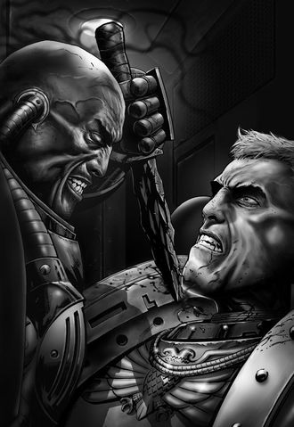

# 0502 仪式之刃 Athames

精校状态：中文行文已逐段精校，部分术语仍为暂定

分类：组织 / 混沌 Chaos

原文来源：https://www.bilibili.com/opus/1068932444178087956

原作者：帝国神选罐头

原文时间：2025年05月20日 13:23

[返回分类目录](目录.md) · [全书目录](../../目录.md)

<!-- A0502-B0001 -->
**英文原文**

During the Battle of Calth, the Word Bearers and several of their cultist soldiers carried small daggers of flint or crude metal, known as athames. They were a mark of status or membership among both, and seemed to have special properties that could manipulate the fabric of reality.

<!-- /A0502-B0001 -->

<!-- A0502-B0002 -->

原译文

在考斯之战中，怀言者和他们的几名邪教徒士兵携带了被称为仪式之刃的燧石或粗金属小匕首。它们是两者之间地位或成员关系的标志，似乎具有可以操纵现实结构的特殊属性。

**校订译文**

考斯之战中，怀言者及其部分混沌教徒士兵携带着燧石或粗制金属制成的小匕首，称为仪式之刃。这些刀既是地位或成员身份的标志，似乎也具有操纵现实结构的特殊性质。

<!-- /A0502-B0002 -->

<!-- A0502-B0003 图片 -->

<!-- A0502-B0004 -->

原译文

Kor Phaeron attacks Roboute Guilliman with an athame 科尔·法伦用仪式之刃攻击罗伯特·基里曼

**校订译文**

Kor Phaeron attacks Roboute Guilliman with an athame 科尔·法伦用仪式之刃攻击罗保特·基里曼

<!-- /A0502-B0004 -->

<!-- A0502-B0005 -->
## History 历史

<!-- /A0502-B0005 -->

<!-- A0502-B0006 -->
**英文原文**

First Chaplain Erebus forged eight athames from the anathame weapon that he had stolen from the Interex, and which later turned Horus to the worship of Chaos. He kept one for himself and gifted the others to the commanders of the Word Bearers Host on Calth; Kor Phaeron, Morpal Cxir, Foedrall Fell, Hol Beloth, Quor Vondar, and Phael Rabor, and the last one for his own bodyguard commander, Kolos Undil.

<!-- /A0502-B0006 -->

<!-- A0502-B0007 -->

原译文

第一牧师艾瑞巴斯用他从英特雷斯偷来的诅咒武器铸造了八个仪式之刃，后来这使荷鲁斯开始崇拜混沌。他为自己留了一个，并把其他的送给了考斯上怀言者的指挥官；科尔·法伦、莫帕尔·克希尔、弗德拉·费尔、霍尔·贝洛斯、库尔·旺达和费尔·拉博，最后一位是他自己的护卫指挥官科洛斯·昂迪尔。

**校订译文**

首席教士艾瑞巴斯将从英特雷斯盗走的诅咒之刃，分铸为八把仪式之刃。那件原本的武器曾使荷鲁斯转而信奉混沌。艾瑞巴斯为自己保留一把，其余分别赠给考斯怀言者大军的指挥官科尔·法伦、莫帕尔·克希尔、弗德拉·费尔、霍尔·贝洛斯、库尔·旺达与费尔·拉博，最后一把则给了自己的卫队指挥官科洛斯·昂迪尔。

**校注：** Anathame 为原刃专名“诅咒之刃”，athame 为“仪式之刃”的通称；两者已由主审决定区分，第13篇负责补首见旧称说明。此处混沌腐化荷鲁斯的是原刃，不是后来八把刀统称。

<!-- /A0502-B0007 -->

<!-- A0502-B0008 -->
**英文原文**

When passing these out, Erebus warned the assembled commanders that these were no "ordinary" athames, indicating that the athame was a name used by the Word Bearers even before Erebus acquired the anathame.

<!-- /A0502-B0008 -->

<!-- A0502-B0009 -->

原译文

在分发这些时，艾瑞巴斯警告聚集的指挥官，这些不是“普通”的仪式之刃，表明仪式之刃甚至在艾瑞巴斯获得仪式之刃之前就已经使用过这个名字。

**校订译文**

分发时，艾瑞巴斯提醒众指挥官，这些并非“普通”的仪式之刃。由此可见，早在他取得诅咒之刃（Anathame）之前，怀言者就已经使用仪式之刃（athame）这一称呼。

<!-- /A0502-B0009 -->

<!-- A0502-B0010 -->
**英文原文**

Ultramarines Captain Remus Ventanus was able to banish the daemon Samus with an athame confiscated from Morpal Cxir. He used the knife because he had no other weapon to hand, but was amazed by its potency against the daemon. His Sergeant, Kiuz Selaton, suggested gathering the other fallen daggers and using them against the hordes of daemons rampaging across Calth. Ventanus considered using them might have a corrupting influence and refused, but kept the one he had used on Samus in his belt.

<!-- /A0502-B0010 -->

<!-- A0502-B0011 -->

原译文

极限战士连长雷穆斯·文坦努斯能够用从莫帕尔·克希尔夺取的仪式之刃驱逐恶魔萨姆斯。他使用这把刀是因为他手头没有其他武器，但对它对抗恶魔的效力感到惊讶。他的军士基乌兹·塞拉顿建议收集其他堕落的匕首，并用它们来对付在考斯肆虐的成群恶魔。文坦努斯认为使用它们可能会产生腐化的影响，并拒绝了，但将他在萨姆斯身上使用的那一个放在腰带上。

**校订译文**

极限战士连长雷穆斯·文坦努斯曾用从莫帕尔·克希尔手中夺得的仪式之刃放逐恶魔萨姆斯。他起初只是因为手边没有其他武器才用这把刀，却惊讶于它对恶魔的威力。军士基乌兹·塞拉顿提议收集其他遗落的匕首，用来对付肆虐考斯的恶魔群。文坦努斯担心它们具有腐化影响，拒绝了建议，却仍将自己用过的那一把留在腰间。

<!-- /A0502-B0011 -->

<!-- A0502-B0012 -->
**英文原文**

Kor Phaeron and his elite guard carried athames during their boarding action of the Ultramarines' orbital weapons platform. When Roboute Guilliman and a small force of Ultramarines boarded the platform, Phaeron was able to stun Guilliman with his sorcerous powers. While the Ultramarines' Primarch was temporarily helpless, Phaeron became intoxicated with the idea of using his athame to turn him to Chaos, just as Erebus had turned Horus. He pierced the flesh of Guilliman's throat with it, but didn't strike a fatal blow. That was his mistake: resistant to whatever dark influence was carried by the knife, Guilliman counter-attacked, driving Phaeron back and forcing the Word Bearers to retreat.

<!-- /A0502-B0012 -->

<!-- A0502-B0013 -->

原译文

科尔·法伦和他的精英卫队在登上极限战士轨道武器平台时携带了仪式之刃。当罗伯特·基里曼和一小队极限战士登上平台时，法伦能够用他的魔法力量眩晕基里曼。当极限战士的原体暂时无能为力时，法伦陶醉于使用他的仪式之刃将他堕入混沌的想法，就像艾瑞巴斯转变了荷鲁斯一样。他用它刺穿了基里曼的喉咙，但没有造成致命的打击。这是他的错误：基里曼抵抗了刀刃带来的任何黑暗影响，进行了反击，将法伦赶了回去，迫使怀言者撤退。

**校订译文**

科尔·法伦及其精锐卫队登上极限战士的轨道武器平台时，也携带了仪式之刃。罗保特·基里曼率少量极限战士登台后，法伦以巫术将其击昏，使原体暂时失去抵抗能力。法伦沉醉于一个念头：像艾瑞巴斯腐化荷鲁斯那样，用仪式之刃使基里曼投向混沌。他刺破了基里曼颈部的皮肉，却没有施以致命一击。这一失误使他付出代价：基里曼抵御了刀中的黑暗影响，奋起反击，击退法伦，迫使怀言者撤退。

<!-- /A0502-B0013 -->

<!-- A0502-B0014 -->
**英文原文**

Kor Phaeron used his athame to great effect in the subsequent Battle of the Macragge's Honour, cutting a "hole" in realspace that allowed the battleship Infidus Imperator to make an instant translation into the warp, without the need for the normal calculations. Later, when the Macragge's Honour devastated the Infidus Imperator with an overwhelming volley, Phaeron cut another hole that allowed him and a small entourage to escape the bridge of his doomed ship, to reappear on Sicarus. Later, during the Underworld War, Ventanus slew Hol Beloth with Beloth's own athame.

<!-- /A0502-B0014 -->

<!-- A0502-B0015 -->

原译文

科尔·法伦在随后的马库拉格之耀之战中使用了他的仪式之刃，在现实空间中开了一个“洞”，使战列舰伪帝号能够立即转换到亚空间，而不需要进行正常的计算。后来，当马库拉格之耀号以压倒性的齐射摧毁了伪帝号时，法伦又开了一个洞，让他和一小群随从逃离了他注定要失败的船的桥，重新出现在西卡鲁斯上。后来，在冥土战争期间，文坦怒斯用贝洛斯自己的仪式之刃杀死了霍尔·贝洛斯。

**校订译文**

随后的马库拉格之耀之战中，科尔·法伦充分发挥了仪式之刃的力量，在现实空间切开一个“洞”，使伪帝号战列舰无需正常计算便能立即跃入亚空间。后来，马库拉格之耀号以压倒性的齐射重创伪帝号，法伦又切开一条通道，带少数随从逃离注定毁灭的舰桥，出现在西卡鲁斯。此后冥土战争中，文坦努斯以霍尔·贝洛斯自己的仪式之刃杀死了他。

<!-- /A0502-B0015 -->

<!-- A0502-B0016 -->
**英文原文**

Criol Fowst, a human leader of the Brotherhood of the Knife, possessed an athame gifted to him by his Legionary patron, Arune Xen. Fowst used his athame to sacrifice victims as part of the Word Bearers' summoning ritual. He considered it his most treasured possession, and was enraged when he lost it to Oll Persson. Persson later used this athame to cut a rift in realspace that allowed him and a small group of survivors to escape the poisoning of Calth's atmosphere. This athame is apparently made of a rock that was used in the first murder in Terra's history, when Cain slew Abel. Ultimately, Ollanius Persson gave his Athame knife to the Emperor, who used it to kill Horus during the final battle aboard the Vengeful Spirit in the Siege of Terra. The kill marked the blade's 8th murder. This athame then disintegrated to dust after the act.

<!-- /A0502-B0016 -->

<!-- A0502-B0017 -->

原译文

克里奥尔·福斯特是短刀兄弟会的人类领袖，他拥有一个由他的军团赞助者阿鲁内1克森赠送给他的仪式之刃。福斯特用他的仪式之刃来祭祀受害者，这是怀言者召唤仪式的一部分。他认为这是他最珍贵的财产，当他把它输给欧尔·佩松时，他非常愤怒。佩森后来用这个仪式之刃在现实空间中制造了一个裂隙，让他和一小群幸存者逃离了考斯大气的毒害。这个仪式之刃显然是由一块石头制成的，这块石头在泰拉历史上第一次谋杀中使用过，当时该隐杀死了亚伯。最终，欧兰尼奥斯·佩松将他的仪式之刃交给了帝皇，帝皇在泰拉围城中的复仇之魂号上的最后一场战斗中用它杀死了荷鲁斯。这起谋杀标志着这把刀的第八次谋杀。行动结束后，仪式之刃便化为灰烬。

**校订译文**

短刀兄弟会的人类领袖克里奥尔·福斯特，拥有一把由军团庇护者阿鲁内·克森赠予的仪式之刃。他用它献祭受害者，参与怀言者的召唤仪式，并将其视为最珍贵的财产；匕首落入欧尔·佩松手中时，他愤怒不已。佩松后来用这把刀切开现实裂隙，带领少量幸存者逃离毒化的考斯大气。这把刀似乎由一块特殊石头制成：在泰拉历史上第一次谋杀中，该隐曾用那块石头杀死亚伯。最终，欧良尼乌斯·佩松将刀交给帝皇。泰拉围城末期，帝皇在复仇之魂号上的最终决战中，用它杀死荷鲁斯。这是此刃的第八次杀戮，随后它便碎成尘埃。

**校注：** 英文 lost it to 未说明通过赌输失去，改为落入佩松手中。Arune Xen 原译“阿鲁内1克森”含数字讹误。Oll 与 Ollanius 是原文简称和全名，分别依决定作欧尔与欧良尼乌斯。

<!-- /A0502-B0017 -->

<!-- A0502-B0018 -->
## The Shard of Erebus 艾瑞巴斯的碎片

<!-- /A0502-B0018 -->

<!-- A0502-B0019 -->
**英文原文**

Ten thousand years later, during the Invasion of Ultramar, Marneus Calgar, the Chapter Master of the Ultramarines, killed the Daemon Prince M'kar with the athame that Uriel Ventris had retrieved from Captain Ventanus' tomb. The Daemon recognised the knife as the Shard of Erebus.\[Note 1\]

<!-- /A0502-B0019 -->

<!-- A0502-B0020 -->

原译文

一万年后，在奥特拉马入侵期间，极限战士战团长马涅乌斯·卡尔加用乌瑞尔·文崔斯从文坦努斯连长的坟墓中取回的仪式之刃杀死了恶魔王子姆’卡。恶魔认出这把刀是艾瑞巴斯的碎片。\[注释一\]

**校订译文**

一万年后，奥特拉玛遭入侵时，极限战士战团长马涅乌斯·卡尔加，用乌瑞尔·文崔斯从文坦努斯连长墓中取回的仪式之刃，杀死了恶魔亲王姆’卡。恶魔认出这把刀是艾瑞巴斯碎片之一。\[注 1\]

<!-- /A0502-B0020 -->

<!-- A0502-B0021 -->
**英文原文**

By the 5th year of the Indomitus Crusade, Abaddon had despatched agents dubbed the Hand of Abaddon across the Galaxy to gather the Shards of Erebus. The Hand eventually succeeded in gathering all 8 shards to rebuild the Anathame. The shards were subsequently inserted into the body of the Red Corsair Graeyl Herek and sent into the realm of Vashtorr the Arkifane within the Warp. Before a great anvil, the shards were reassembled into a new blade dubbed the Culler and taken up by the Hand members Tharador Yheng and Augury.

<!-- /A0502-B0021 -->

<!-- A0502-B0022 -->

原译文

到不屈远征的第五年，阿巴顿已经派遣了被称为阿巴顿之手的特工穿越银河系，收集艾瑞巴斯碎片。最终成功地收集了所有8块碎片来重造诅咒之刃。这些碎片随后被插入红海盗格雷尔·赫里克的身体，并被送往亚空间内的造物者瓦什托尔的领域。在一个巨大的铁砧之前，这些碎片被重新组装成一个名为库列尔的新刀刃，并被阿巴顿之手成员塔拉多·伊恩和奥格里拿起。

**校订译文**

不屈远征进行到第五年时，阿巴顿已将称为阿巴顿之手的特工派往银河各地，搜集艾瑞巴斯碎片。他们最终集齐八片，准备重铸诅咒之刃。碎片被嵌入红海盗格雷尔·赫里克体内，送往亚空间中造物者瓦什托尔的领域，并在巨砧前重新锻成名为库列尔的新刃。阿巴顿之手成员塔拉多·伊恩与奥格里随后取得了这件武器。

<!-- /A0502-B0022 -->

<!-- A0502-B0023 -->
## Other Athames 其他仪式之刃

<!-- /A0502-B0023 -->

<!-- A0502-B0024 -->
**英文原文**

In M41, an operative of the Ordo Malleus stole an athame from a museum on a T'au Sept World; the T'au had mistaken it for a crude flint knife, proof of how little the gue'la had evolved over their long history, and had no idea of its special properties. When trapped by a team of Fire Warriors, the operative used the knife to "cut a hole in reality" and escape.

<!-- /A0502-B0024 -->

<!-- A0502-B0025 -->

原译文

在M41，一名圣锤修会的特工从钛家门世界的一家博物馆偷走了一个仪式之刃；钛误以为这是一把粗糙的燧石刀，这证明古’拉在漫长的历史中进化得很少，也不知道它的特殊性质。当被一队火战士困住时，特工用刀“在现实中开了一个洞”并逃跑了。

**校订译文**

M41，一名恶魔审判庭特工从钛的家门世界博物馆中偷走一把仪式之刃。钛将其误认作粗糙的燧石刀，认为这恰好说明“古’拉”在漫长历史中几乎没有进步，完全不知道它的特殊性质。特工被一队火战士困住时，用刀“切开现实”，从而逃脱。

**校注：** “古’拉”是钛对人类的称呼，保留其主观评价，不将进化判断写成叙述者认可的事实。

<!-- /A0502-B0025 -->

<!-- A0502-B0026 -->
## Trivia 琐事

<!-- /A0502-B0026 -->

<!-- A0502-B0027 -->
**英文原文**

In real life, athames are ceremonial blades used in certain rituals.

<!-- /A0502-B0027 -->

<!-- A0502-B0028 -->

原译文

在现实生活中，仪式之刃是某些仪式中使用的仪式刀。

**校订译文**

现实中的 athame，是用于某些仪式的刀具。

<!-- /A0502-B0028 -->

<!-- A0502-B0029 -->
### Notes 注释

<!-- /A0502-B0029 -->

<!-- A0502-B0030 -->
**英文原文**

Note 1: This knife was likely the same athame that Ventanus had taken from Hol Beloth, though it could also have been the knife Ventanus had taken from Morpal Cxir and used to banish Samus.

<!-- /A0502-B0030 -->

<!-- A0502-B0031 -->

原译文

注1：这把刀可能与文坦怒斯从霍尔·贝洛斯那里拿走的那把刀是一样的，尽管它也可能是文坦努斯从莫帕尔·克希尔那里拿走的用来驱逐萨姆斯的刀。

**校订译文**

注 1：这把刀很可能是文坦努斯从霍尔·贝洛斯那里取得的那把，也可能是他从莫帕尔·克希尔手中夺来、曾用以放逐萨姆斯的那把。

<!-- /A0502-B0031 -->

本篇核心术语与暂定项

以下列出本篇出现的英文原形及核心术语表用词。同形词可能指不同对象，具体词义以本篇正文和校注为准；单复数、别名和仅见于图注的名称可能尚未列入。完整候选见[术语表](../../术语表/双语术语候选.csv)。

| 英文 | 采用中文 | 状态 |
| --- | --- | --- |
| Roboute Guilliman | 罗保特·基里曼 | 官方已核对 |
| Ultramar | 奥特拉玛 | 官方已核对 |
| Ultramarines | 极限战士 | 官方已核对 |
| Warp | 亚空间 | 官方已核对 |
| Indomitus | 不屈学派 | 暂定·学派语境 |
| History | 历史 | 编辑用语已统一 |
| Ordo Malleus | 恶魔审判庭 | 用户指定 |
| Emperor | 帝皇 | 官方已核对 |
| Primarch | 原体 | 官方已核对 |
| Word Bearers | 怀言者 | 暂定·官方待核 |
| Daemon Prince | 恶魔亲王 | 官方已核对 |
| Corsair | 海盗 | 暂定·官方待核 |
| Interex | 英特雷斯 | 暂定·官方待核 |
| Terra | 泰拉 | 暂定·官方待核 |
| Murder | 谋杀 | 暂定·官方待核 |
| Horus | 荷鲁斯 | 暂定·官方待核 |
| Erebus | 艾瑞巴斯 | 暂定·官方待核 |
| Anathame | 诅咒之刃 | 暂定·官方待核 |
| The Brotherhood | 兄弟会 | 暂定·官方待核 |
| Vengeful Spirit | 复仇之魂号 | 暂定·官方待核 |
| Indomitus Crusade | 不屈远征 | 暂定·官方待核 |
| Ollanius Persson | 欧良尼乌斯·佩松 | 官方词根参考·全名待核 |
| Oll Persson | 欧尔·佩松 | 暂定·官方待核 |
| Brotherhood | 兄弟会 | 暂定·官方待核 |
| Calth | 考斯 | 暂定·官方待核 |
| Banish | 巴尼什 | 暂定·官方待核 |
| Macragge | 马库拉格 | 暂定·官方待核 |
| Master | 导师（审判庭职衔）／舰务官（舰员职务） | 语境定译·官方待核 |
| Chaplain | 教士 | 官方已核对 |
| Kor Phaeron | 科尔·法伦 | 暂定·官方待核 |
| Chapter | 战团 | 暂定·官方待核 |
| Chapter Master | 战团长 | 暂定·官方待核 |
| Captain | 连长 | 暂定·官方待核 |
| Sergeant | 军士 | 暂定·官方待核 |
| Marneus Calgar | 马涅乌斯·卡尔加 | 暂定·官方待核 |
| Uriel Ventris | 乌瑞尔·文崔斯 | 官方已核 |
| Sicarus | 西卡鲁斯 | 暂定·官方待核 |
| Infidus Imperator | 伪帝号 | 暂定·官方待核 |
| Quor Vondar | 库尔·旺达 | 暂定·官方待核 |
| Powers | 能天使 | 暂定·官方待核 |
| Operative | 特工 | 暂定·官方待核 |
| Host | 天军 | 暂定·官方待核 |
| T'au | 钛族 | 暂定·官方待核 |
| athame | 仪式之刃 | 暂定·官方待核 |
| Remus Ventanus | 雷穆斯·文坦努斯 | 暂定·官方待核 |
| Arune Xen | 阿鲁内·克森 | 暂定·官方待核 |
| Shard of Erebus | 艾瑞巴斯碎片 | 暂定·官方待核 |
| Vashtorr the Arkifane | 造物者瓦什托尔 | 官方已核对 |
| Fire Warriors | 火战士 | 暂定·官方待核 |
| Sept | 家门 | 暂定·官方待核 |
| Phaeron | 法皇 | 暂定·官方待核 |
| Battle of Calth | 考斯之战 | 暂定·官方待核 |
| Macragge's Honour | 马库拉格之耀号 | 暂定·官方待核 |
| Morpal Cxir | 莫帕尔·西尔 | 暂定·官方待核 |
| Foedrall Fell | 弗德拉尔·费尔 | 暂定·官方待核 |
| Hol Beloth | 霍尔·贝洛斯 | 暂定·官方待核 |
| First Chaplain | 首席教士 | 暂定·官方待核 |
| Invasion of Ultramar | 入侵奥特拉玛 | 暂定·官方待核 |

