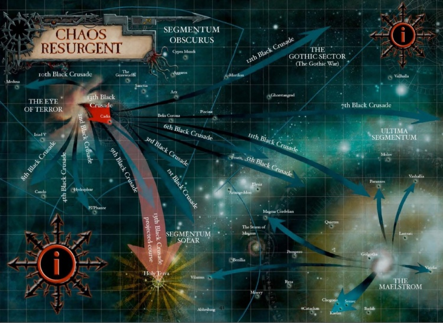

# 0503 黑色远征 Black Crusade

精校状态：中文行文已逐段精校，部分术语仍为暂定

分类：组织 / 混沌 Chaos

原文来源：https://www.bilibili.com/opus/1145689832006090758

原作者：帝国神选罐头

原文时间：2025年12月13日 09:41

[返回分类目录](目录.md) · [全书目录](../../目录.md)

<!-- A0503-B0001 -->
**英文原文**

A Black Crusade is an incursion that is formed when the usually disparate forces of Chaos unite under a particularly strong Chaos Champion and go forth en masse to wage war against the Imperium of Man.

<!-- /A0503-B0001 -->

<!-- A0503-B0002 -->

原译文

黑色远征是一种入侵，当通常不同的混沌部队在一个特别强大的混沌冠军的领导下团结起来，集体向人类帝国发动战争时形成。

**校订译文**

黑色远征是大规模的混沌入侵：平日各自为政的混沌势力，在一位格外强大的混沌冠军麾下集结，向人类帝国共同进军。

<!-- /A0503-B0002 -->

<!-- A0503-B0003 -->
## Overview 概述

<!-- /A0503-B0003 -->

<!-- A0503-B0004 -->
**英文原文**

Following the devastating events of the Horus Heresy, the Imperium began the Great Scouring, a campaign to cast out all traitors who had sided with Chaos and drove them into the warp storm known as the Eye of Terror. There, the followers of Chaos began to fight among each other for domination and territory and their vast armies eventually fractured.

<!-- /A0503-B0004 -->

<!-- A0503-B0005 -->

原译文

在荷鲁斯叛乱的毁灭性事件之后，帝国开始了大清洗，这是一场驱逐所有支持混沌的叛徒并将他们推入被称为恐惧之眼的亚空间风暴的战役。在那里，混沌的追随者开始为争夺统治权和领土而相互争斗，他们庞大的军队最终分崩离析。

**校订译文**

荷鲁斯之乱造成的灾难之后，帝国发动大清洗，驱逐所有投向混沌的叛徒，将他们赶入恐惧之眼这一亚空间风暴。混沌追随者在那里为霸权与领土彼此争斗，庞大的军势最终分裂。

<!-- /A0503-B0005 -->

<!-- A0503-B0006 -->
**英文原文**

Even so, the threat the exiles posed was far from gone. To this day they seek to overthrow the Imperium, launching separate raids and invasions against it. Once or twice within a millennium however, an exceptional Chaos Champion rises who is strong enough to bring his fellow warlords and their hosts under his sway. When this happens ancient rivalries are set aside and uneasy alliances are forged, clearing the way for what is called a Black Crusade.

<!-- /A0503-B0006 -->

<!-- A0503-B0007 -->

原译文

即便如此，流亡者构成的威胁远未消除。直到今天，他们仍试图推翻帝国，对帝国发动单独的突袭和入侵。然而，在一千年内，有一两次，一位非凡的混沌冠军崛起，他足够强大，能够将他的军阀同僚及其天军置于他的统治之下。当这种情况发生时，古老的较量被搁置一边，不稳定的联盟被建立起来，为所谓的黑色远征扫清了道路。

**校订译文**

但流亡者的威胁远未消失。他们至今仍企图推翻帝国，不断各自发动突袭与入侵。每隔数百年，通常一个千年内会有一两次，一位格外强大的混沌冠军崛起，将其他军阀及其大军收归麾下。宿怨暂时搁置，脆弱的联盟形成，一场黑色远征便由此展开。

<!-- /A0503-B0007 -->

<!-- A0503-B0008 -->
**英文原文**

The forces and fleets that gather for a Black Crusade are made up of all types of Chaos servants: the multitudinous hordes of the Lost and the Damned, ancient and towering Chaos Titans, the bizarre war machines of the Dark Mechanicum and the Daemons of the warp. Leading them into the realm of man are the vengeful warbands of the Chaos Space Marines.

<!-- /A0503-B0008 -->

<!-- A0503-B0009 -->

原译文

聚集在一起进行黑色远征的部队和舰队由各种类型的混沌之仆组成：迷失者和被诅咒者的众多部落，古老而高耸的混沌泰坦，黑暗机械教的奇异战争机器和亚空间的恶魔。带领他们进入人类领域的是混沌星际战士的复仇战帮。

**校订译文**

黑色远征集结的军队与舰队，囊括各类混沌仆从：无数迷失者与被诅咒者、古老高耸的混沌泰坦、黑暗机械教的奇诡战争机器，以及亚空间恶魔。充满复仇欲望的混沌星际战士战帮，则领着它们攻入人类疆域。

<!-- /A0503-B0009 -->

<!-- A0503-B0010 -->
**英文原文**

When the crusade is launched, whole worlds fall prey to the rampaging hordes and the Dark Gods themselves divert their attention to the material realm, delighting in the sacrifices made in their names. Still, the nature of Chaos is fickle and unless it is repelled by the defenders, the crusade is bound to splinter into separate hosts and warbands who pursue their own ambitions.

<!-- /A0503-B0010 -->

<!-- A0503-B0011 -->

原译文

当远征开始时，整个世界都成为狂暴的部落的牺牲品，黑暗诸神自己将注意力转移到物质领域，为以他们的名义做出的祭祀感到高兴。尽管如此，混沌的性质是变化无常的，除非被防御者击退，否则远征必然会分裂成追求自己野心的不同的天军和战帮。

**校订译文**

远征一旦发动，整个世界都会沦为肆虐大军的猎物。黑暗诸神也会将目光转向物质宇宙，欣然接受以它们之名献上的祭品。然而，混沌本性反复无常；远征即使没有被守军击退，最终也注定分裂成各自追逐野心的军势与战帮。

<!-- /A0503-B0011 -->

<!-- A0503-B0012 -->
### The Black Crusades of Abaddon the Despoiler 掠夺者阿巴顿的黑色远征

<!-- /A0503-B0012 -->

<!-- A0503-B0013 -->
**英文原文**

The most infamous Black Crusades are those led by Abaddon the Despoiler, Warmaster of the Black Legion and successor to Horus. So far, he has led thirteen such attacks, which ranged from small raids to battles that spanned entire sectors. His latest Black Crusade, the Thirteenth, has succeeded in destroying Cadia.

<!-- /A0503-B0013 -->

<!-- A0503-B0014 -->

原译文

最著名的黑色远征是由掠夺者阿巴顿领导的，他是黑色军团的战帅，也是荷鲁斯的继任者。到目前为止，他已经领导了13次这样的袭击，从小型突袭到跨越整个星区的战斗。他最近的第十三次黑色远征成功摧毁了卡迪亚。

**校订译文**

最臭名昭著的黑色远征，由黑色军团战帅、荷鲁斯的继承者掠夺者阿巴顿率领。截至本篇所述时期，他已发动十三次，规模从小型突袭到席卷整个星区的战争不等。最近的第十三次黑色远征，成功摧毁了卡迪亚。

<!-- /A0503-B0014 -->

<!-- A0503-B0015 图片 -->

<!-- A0503-B0016 -->

原译文

Paths of the first twelve Black Crusades. The 13th Black Crusade was a massive invasion of the sectors surrounding the Cadian Gate 前十二次黑色远征的路径。第十三次黑色远征是对卡迪亚之门周围星区的大规模入侵

**校订译文**

Paths of the first twelve Black Crusades. The 13th Black Crusade was a massive invasion of the sectors surrounding the Cadian Gate 前十二次黑色远征的路径。第十三次黑色远征是对卡迪亚之门周围星区的大规模入侵

<!-- /A0503-B0016 -->

<!-- A0503-B0017 -->
**英文原文**

The Black Crusaders of Abaddon have a secret and even more sinister purpose. Throughout the Millennia he has identified ancient monoliths holding back the tides of the Warp. Using his Black Crusades to sometimes conceal his true objective, Abaddon has targeted and destroyed many of these structures as part of a plan known as the Crimson Path. The ultimate objective of Abaddon's Black Crusades is to expand the Eye of Terror to envelop Terra itself.

<!-- /A0503-B0017 -->

<!-- A0503-B0018 -->

原译文

阿巴顿的黑色远征有一个秘密，甚至更险恶的目的。在整个千年中，他发现了阻碍亚空间潮汐的古代巨石。阿巴顿有时会利用他的黑色远征来掩盖他的真实目标，作为深红之路计划的一部分，他瞄准并摧毁了许多这些结构。阿巴顿的黑色远征的最终目标是扩大恐惧之眼，以包围泰拉本身。

**校订译文**

阿巴顿的黑色远征还隐藏着更险恶的目的。数千年来，他逐渐找出阻挡亚空间潮汐的古代巨石结构，有时以远征掩盖真正目标，并按照“深红之路”计划摧毁其中许多。其终极目的，是扩大恐惧之眼，直至将泰拉也吞没。

<!-- /A0503-B0018 -->

<!-- A0503-B0019 -->
**英文原文**

781.M31 - 1st Black Crusade, The First Battle of Cadia. Abaddon claims the daemon sword Drach'nyen.

<!-- /A0503-B0019 -->

<!-- A0503-B0020 -->

原译文

第一次黑色远征，第一次卡迪亚之战。阿巴顿获得了恶魔剑德拉科'尼恩。

**校订译文**

781.M31——第一次黑色远征，第一次卡迪亚之战。阿巴顿取得恶魔剑德拉科’尼恩。

**校注：** 本篇年表中文原稿遗漏了英文每条开头的年代，本次全部补回。

<!-- /A0503-B0020 -->

<!-- A0503-B0021 -->
**英文原文**

597.M32 - 2nd Black Crusade, the Cursing of Corona. Abaddon invokes a curse that sinks into the core of Belis Corona.

<!-- /A0503-B0021 -->

<!-- A0503-B0022 -->

原译文

第二次黑色远征，卡罗纳的诅咒。阿巴顿唤起了一个深植于比利斯·卡罗那核心的诅咒。

**校订译文**

597.M32——第二次黑色远征，卡罗纳诅咒。阿巴顿施下诅咒，使其深入贝利斯·卡罗纳的核心。

<!-- /A0503-B0022 -->

<!-- A0503-B0023 -->
**英文原文**

909.M32 - 3rd Black Crusade, the Host of Tallomin, Desecration of Gerstahl. Abaddon destroys the remains of Saint Gerstahl.

<!-- /A0503-B0023 -->

<!-- A0503-B0024 -->

原译文

第三次黑色远征，塔洛明的天军，格斯塔尔的亵渎。阿巴顿摧毁了圣格斯塔尔的遗体。

**校订译文**

909.M32——第三次黑色远征，塔洛明大军、格斯塔尔亵渎事件。阿巴顿毁掉圣格斯塔尔的遗骸。

<!-- /A0503-B0024 -->

<!-- A0503-B0025 -->
**英文原文**

001.M34 - 4th Black Crusade, the Devastation of El'Phanor, the Death of the Kromarch. Destruction of the Grand Citadel of Kromarch.

<!-- /A0503-B0025 -->

<!-- A0503-B0026 -->

原译文

第四次黑色远征，埃尔帕诺的毁灭，克罗马奇的死亡。克罗马奇大城堡的毁灭。

**校订译文**

001.M34——第四次黑色远征，埃尔帕诺浩劫、克罗马奇之死。克罗马奇大城堡被毁。

<!-- /A0503-B0026 -->

<!-- A0503-B0027 -->
**英文原文**

723.M36 - 5th Black Crusade, the Tide of Blood, the Scouring of Elysia. Abaddon summons the daemon prince Doombreed and destroys the Warhawks and Venerators Chapters.

<!-- /A0503-B0027 -->

<!-- A0503-B0028 -->

原译文

第五次黑色远征，血潮，艾丽西亚的清洗。阿巴顿召唤了恶魔王子毁灭之种，并摧毁了战鹰和崇敬者战团。

**校订译文**

723.M36——第五次黑色远征，血潮、艾丽西亚清洗。阿巴顿召来恶魔亲王毁灭之种，并摧毁战鹰与崇敬者战团。

<!-- /A0503-B0028 -->

<!-- A0503-B0029 -->
**英文原文**

901.M36 - 6th Black Crusade, Drecarth's Folly. Abaddon brings the Sons of the Eye to heel.

<!-- /A0503-B0029 -->

<!-- A0503-B0030 -->

原译文

第六次黑色远征，德雷卡斯的愚行。阿巴顿使眼之子屈服。

**校订译文**

901.M36——第六次黑色远征，德雷卡斯的愚行。阿巴顿迫使眼之子臣服。

<!-- /A0503-B0030 -->

<!-- A0503-B0031 -->
**英文原文**

811.M37 - 7th Black Crusade, the Ghost War. Abaddon claims the gene-seed of Blood Angels slaughtered at Mackan.

<!-- /A0503-B0031 -->

<!-- A0503-B0032 -->

原译文

第七次黑色远征，幽灵战争。阿巴顿获得在马坎被屠杀的圣血天使的基因种子。

**校订译文**

811.M37——第七次黑色远征，幽灵战争。阿巴顿夺取了在马坎遭屠戮的圣血天使的基因种子。

<!-- /A0503-B0032 -->

<!-- A0503-B0033 -->
**英文原文**

999.M37 - 8th Black Crusade, the Skullgather. Abaddon appeases the Changer of Ways with sequences of death creating a mathematical equation of terrible and profane perfection.

<!-- /A0503-B0033 -->

<!-- A0503-B0034 -->

原译文

第八次黑色远征，颅骨聚集。阿巴顿用一连串的死亡来安抚万变之主，创造了一个可怕而世俗完美的数学方程式。

**校订译文**

999.M37——第八次黑色远征，聚颅行动。阿巴顿以一连串死亡拼成恐怖而亵渎、却又完美的数学方程，取悦万变之主。

**校注：** profane 指亵渎，非世俗；此处形容献给混沌之神的死亡方程。

<!-- /A0503-B0034 -->

<!-- A0503-B0035 -->
**英文原文**

573.M38 - 9th Black Crusade, the Starving of Cancephalus. Several Chaos fleets leave the Eye of Terror undetected during the Antecanis Massacre.

<!-- /A0503-B0035 -->

<!-- A0503-B0036 -->

原译文

第九次黑色远征，坎塞法卢斯的缺乏。在安特卡尼斯大屠杀期间，几支混沌舰队离开恐惧之眼。

**校订译文**

573.M38——第九次黑色远征，坎塞法卢斯大饥荒。安特卡尼斯大屠杀期间，数支混沌舰队悄然离开恐惧之眼，未被察觉。

<!-- /A0503-B0036 -->

<!-- A0503-B0037 -->
**英文原文**

001.M39 - 10th Black Crusade, the Conflict of Helica. Abaddon and the Iron Warriors fight the Iron Hands at Medusa.

<!-- /A0503-B0037 -->

<!-- A0503-B0038 -->

原译文

第十次黑色远征，赫利卡冲突。阿巴顿和钢铁勇士在美杜莎与钢铁之手作战。

**校订译文**

001.M39——第十次黑色远征，赫利卡冲突。阿巴顿与钢铁勇士在美杜莎迎战钢铁之手。

<!-- /A0503-B0038 -->

<!-- A0503-B0039 -->
**英文原文**

301.M39 - 11th Black Crusade, the Doom of Relorria. Abaddon abducts thousands of orks to conduct experiments on their use of the warp.

<!-- /A0503-B0039 -->

<!-- A0503-B0040 -->

原译文

第十一次黑色远征，雷洛里亚的毁灭。阿巴顿绑架了数千名欧克，对他们使用亚空间进行实验。

**校订译文**

301.M39——第十一次黑色远征，雷洛里亚毁灭。阿巴顿掳走数千名欧克蛮人，研究他们运用亚空间的方式。

<!-- /A0503-B0040 -->

<!-- A0503-B0041 -->
**英文原文**

139.M41 - 12th Black Crusade, the Gothic War. Abaddon captures the last two Blackstone Fortresses.

<!-- /A0503-B0041 -->

<!-- A0503-B0042 -->

原译文

第十二次黑色远征，哥特战争。阿巴顿捕获了最后两座黑石堡垒。

**校订译文**

139.M41——第十二次黑色远征，哥特战争。阿巴顿夺取最后两座黑石要塞。

<!-- /A0503-B0042 -->

<!-- A0503-B0043 -->
**英文原文**

999.M41 - 13th Black Crusade, the Fall of Cadia. Abaddon gathers the blessings of the Daemon Primarchs and launches a major attack on the Cadian system, resulting in the destruction of Cadia.

<!-- /A0503-B0043 -->

<!-- A0503-B0044 -->

原译文

第十三次黑色远征，卡迪亚沦陷。阿巴顿收集了恶魔原体的祝福，并对卡迪亚星系发动了重大攻击，导致卡迪亚被摧毁。

**校订译文**

999.M41——第十三次黑色远征，卡迪亚沦陷。阿巴顿集得恶魔原体的赐福，对卡迪亚星系发动大规模进攻，最终摧毁卡迪亚。

<!-- /A0503-B0044 -->

<!-- A0503-B0045 -->
### Other known Black Crusades 其他已知黑色远征

<!-- /A0503-B0045 -->

<!-- A0503-B0046 -->
**英文原文**

c.034.M31 - The Primarch of the Imperial Fists, Rogal Dorn, was killed while stopping a Black Crusade by an unknown force sometime after the Horus Heresy

<!-- /A0503-B0046 -->

<!-- A0503-B0047 -->

原译文

帝国之拳的原体罗格·多恩在荷鲁斯叛乱之后的某个时候，在阻止一场黑色远征时被一支未知的部队杀害

**校订译文**

约 034.M31——据本条所引版本，帝国之拳原体罗格·多恩在荷鲁斯之乱之后，阻止一支身份不明的军势发动黑色远征时战死。

**校注：** 英文明确称多恩被杀，另有版本称失踪或只发现遗骨。保留本条所依据的战死版本并提示来源差异，不据别版直接改英文。

<!-- /A0503-B0047 -->

<!-- A0503-B0048 -->
**英文原文**

M34 - The Blackstar Crusade. Lord Ekrak, a champion of Khorne, leads a crusade to conquer the world of M'Laar XIII and ascends to deamonhood.

<!-- /A0503-B0048 -->

<!-- A0503-B0049 -->

原译文

黑星远征。恐虐冠军埃克拉克领主领导了一场远征，征服了姆'拉尔十三号世界，并升格为恶魔领主。

**校订译文**

M34——黑星远征。恐虐冠军埃克拉克领主发动远征，征服姆’拉尔十三号世界，并升格为恶魔。

**校注：** ascends to daemonhood 仅说明升格为恶魔，未明指“恶魔领主”，删除原译增添的领主称谓。

<!-- /A0503-B0049 -->

<!-- A0503-B0050 -->
**英文原文**

M36 - The Black Crusade of Sicklefell. A century long war saw the Forge World Barnassus destroyed and thirty-three worlds systematically murdered.

<!-- /A0503-B0050 -->

<!-- A0503-B0051 -->

原译文

镰落的黑色远征。在长达一个世纪的战争中，铸造世界巴纳索斯被摧毁，33个世界被系统地毁灭。

**校订译文**

M36——镰落黑色远征。长达一个世纪的战争中，铸造世界巴纳索斯被毁，三十三个世界惨遭有计划的灭绝。

<!-- /A0503-B0051 -->

<!-- A0503-B0052 -->
**英文原文**

599.M37 - The Black Crusade of Jihar the Lacerator. Jihar the Lacerator, champion of Slaanesh, inspires uprisings on the Gloom Worlds before an unexpectedly sudden defeat.

<!-- /A0503-B0052 -->

<!-- A0503-B0053 -->

原译文

撕裂者吉哈的黑色远征。色孽冠军、在一场意外的突然失败之前，在幽暗世界引发了叛乱。

**校订译文**

599.M37——撕裂者吉哈黑色远征。这位色孽冠军在幽暗世界煽动叛乱，随后却突然遭到出人意料的击败。

<!-- /A0503-B0053 -->

<!-- A0503-B0054 -->
**英文原文**

Between 113.M38 and 955.M39 - The Black Crusade of Von Mallas. Lord Von Mallas reduces the Agri-World Epirus to a wasteland, causing famine throughout the sector.

<!-- /A0503-B0054 -->

<!-- A0503-B0055 -->

原译文

冯·马拉斯的黑色远征。冯·马拉斯领主将农业世界伊庇鲁斯夷为平地，导致整个星区的饥荒。

**校订译文**

113.M38 至 955.M39 之间——冯·马拉斯黑色远征。冯·马拉斯领主将农业世界伊庇鲁斯化为荒原，使整个星区陷入饥荒。

<!-- /A0503-B0055 -->

<!-- A0503-B0056 -->
**英文原文**

Pre-997.M41 - The Black Crusade of Furion. Khornate Lord Furion of the Skull-scythes attacks the Dark Angels, killing Master Nadael.

<!-- /A0503-B0056 -->

<!-- A0503-B0057 -->

原译文

弗瑞恩的黑色远征。颅骨镰刀的恐虐领主弗瑞恩攻击黑暗天使，杀死了纳达尔导师。

**校订译文**

997.M41 之前——弗瑞恩黑色远征。颅骨镰刀战帮的恐虐领主弗瑞恩攻击黑暗天使，杀死纳达尔大师。

<!-- /A0503-B0057 -->

<!-- A0503-B0058 -->
**英文原文**

The Black Crusade of the Destroyer. The Destroyer, a daemon of Tzeentch, possesses Captain Leonatos of the Blood Angels.

<!-- /A0503-B0058 -->

<!-- A0503-B0059 -->

原译文

毁灭者的黑色远征。毁灭者，奸奇的恶魔，占据圣血天使的莱昂纳托斯连长。

**校订译文**

毁灭者黑色远征。奸奇恶魔毁灭者附身于圣血天使连长莱昂纳托斯。

<!-- /A0503-B0059 -->

本篇核心术语与暂定项

以下列出本篇出现的英文原形及核心术语表用词。同形词可能指不同对象，具体词义以本篇正文和校注为准；单复数、别名和仅见于图注的名称可能尚未列入。完整候选见[术语表](../../术语表/双语术语候选.csv)。

| 英文 | 采用中文 | 状态 |
| --- | --- | --- |
| Space Marines | 星际战士 | 官方已核对 |
| Blood Angels | 圣血天使 | 官方已核对 |
| Dark Angels | 黑暗天使 | 官方已核对 |
| Chaos Space Marines | 混沌星际战士 | 官方已核对 |
| Orks | 欧克蛮人 | 官方已核对 |
| Horus Heresy | 荷鲁斯之乱 | 官方已核对 |
| Warp | 亚空间 | 官方已核对 |
| Imperium of Man | 人类帝国 | 官方已核对 |
| Imperium | 帝国 | 暂定·简称 |
| Mechanicum | 机械教 | 暂定·历史称谓 |
| Dark Mechanicum | 黑暗机械教 | 暂定·官方待核 |
| The Lost and the Damned | 迷失者与被诅咒者 | 暂定 |
| Khorne | 恐虐 | 官方已核对 |
| Tzeentch | 奸奇 | 官方已核对 |
| Eye of Terror | 恐惧之眼 | 官方已核对 |
| Imperial Fists | 帝国之拳 | 暂定 |
| Primarch | 原体 | 官方已核对 |
| Agri-World | 农业世界 | 暂定·官方待核 |
| Forge World | 铸造世界 | 暂定·官方待核 |
| Daemon Prince | 恶魔亲王 | 官方已核对 |
| Black Legion | 黑色军团 | 暂定·官方待核 |
| Slaanesh | 色孽 | 官方已核对 |
| Iron Warriors | 钢铁勇士 | 暂定·官方待核 |
| Terra | 泰拉 | 暂定·官方待核 |
| Horus | 荷鲁斯 | 暂定·官方待核 |
| Iron Hands | 钢铁之手 | 暂定·官方待核 |
| Sector | 星区 | 暂定·官方待核 |
| Elysia | 艾丽西亚 | 暂定·官方待核 |
| Cadia | 卡迪亚 | 暂定·官方待核 |
| Belis Corona | 贝利斯·卡罗纳 | 暂定·官方待核 |
| Medusa | 美杜莎 | 暂定·官方待核 |
| Master | 导师（审判庭职衔）／舰务官（舰员职务） | 语境定译·官方待核 |
| Ancient | 旗手 | 官方已核对 |
| Sons of the Eye | 眼之子 | 暂定·官方待核 |
| Long War | 万古长战 | 暂定·官方待核 |
| Champion | 冠军 | 暂定·官方待核 |
| Despoiler | 劫掠者 | 暂定·官方待核 |
| Destroyer | 毁灭者 | 暂定·官方待核 |
| Captain | 连长 | 暂定·官方待核 |
| Black Crusaders | 黑色十字军 | 暂定·官方待核 |
| Crusaders | 十字军 | 暂定·官方待核 |
| Venerators | 崇敬者 | 暂定·官方待核 |
| Warhawks | 战鹰 | 暂定·官方待核 |
| Gene-seed | 基因种子 | 暂定·官方待核 |
| Host | 天军 | 暂定·官方待核 |
| Crimson Path | 深红之路 | 暂定·官方待核 |
| Skullgather | 聚颅行动 | 暂定·官方待核 |
| Abaddon the Despoiler | 掠夺者阿巴顿 | 官方已核对 |
| Doombreed | 毁灭之种 | 暂定·官方待核 |
| Tallomin | 塔洛明 | 暂定·官方待核 |
| Jihar the Lacerator | 撕裂者吉哈尔 | 暂定·官方待核 |
| Leonatos | 莱昂纳托斯 | 暂定·官方待核 |
| Great Scouring | 大清洗 | 暂定·官方待核 |
| Furion | 弗里翁 | 暂定·官方待核 |
| The Dark | 《黑暗》 | 暂定·官方待核 |
| The Blood | 鲜血 | 暂定·官方待核 |
| Warp Storm | 亚空间风暴 | 暂定·官方待核 |
| System | 星系（恒星系统） | 暂定·官方待核 |
| Barnassus | 巴纳索斯 | 暂定·官方待核 |
| Epirus | 伊庇鲁斯 | 暂定·官方待核 |
| Kromarch | 克罗马奇 | 暂定·官方待核 |

