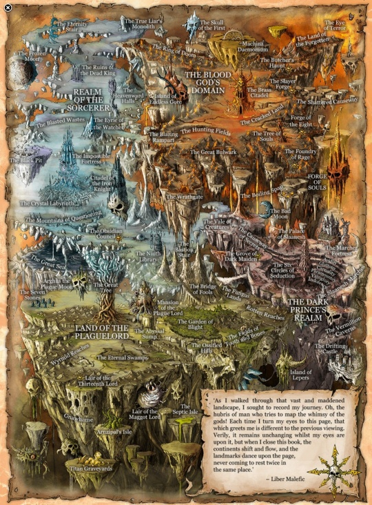

# 0506 混沌诸神 Chaos Gods

精校状态：中文行文已逐段精校，部分术语仍为暂定

分类：组织 / 混沌 Chaos / 混沌诸神 Chaos Gods

原文来源：https://www.bilibili.com/opus/1052614557781983281

原作者：帝国神选罐头

原文时间：2025年04月06日 14:02

[返回分类目录](目录.md) · [全书目录](../../目录.md)

<!-- A0506-B0001 -->
**英文原文**

The Chaos Gods, also called the Dark Gods or the Ruinous Powers, are powerful beings of the psychic universe known as the Warp, created and sustained by the emotions and souls of every living being of the material universe. Although they are god-like beings, they are by their nature monomaniacal and completely single-minded (formed completely of a single emotion or concept) as well as being completely dependent on the emotions of mortal creatures for their power and continued existence.

<!-- /A0506-B0001 -->

<!-- A0506-B0002 -->

原译文

混沌诸神，也被称为黑暗诸神或毁灭之力，是被称为亚空间的精神宇宙中的强大生物，由物质宇宙中每个生物的情感和灵魂产生和维持。虽然他们是神一样的生物，但他们天生偏执，完全一心一意（完全由单一的情感或概念组成），并且完全依赖凡人的情感来获得力量和持续存在。

**校订译文**

混沌诸神又称黑暗诸神或毁灭诸力，是亚空间这一灵能宇宙中的强大存在，由物质宇宙生命的情感与灵魂孕育、维系。它们虽具有神一般的力量，本质却极端偏执，只执着于单一目标，因为每位神祇都由某种情感或概念凝成。它们的力量乃至继续存在，也完全依赖凡人的情绪。

<!-- /A0506-B0002 -->

<!-- A0506-B0003 图片 -->

<!-- A0506-B0004 -->

原译文

The realm of the Chaos Gods 混沌诸神领域

**校订译文**

The realm of the Chaos Gods 混沌诸神领域

<!-- /A0506-B0004 -->

<!-- A0506-B0005 -->
**英文原文**

Gods are able to devote a fraction of their power to create daemons, whose appearance and character reflect the god's own nature. These daemons may be reabsorbed into the god at whim. The least of the minor gods may be so limited in their power that expending their power to create a daemon means their entire power is expended; in effect, the god becomes a daemon.

<!-- /A0506-B0005 -->

<!-- A0506-B0006 -->

原译文

诸神能够投入一小部分力量来创造恶魔，恶魔的外观和性格反映了神自己的本性。这些恶魔可能会在一时兴起时重新被诸神吸收。最小的小神的力量可能是如此有限，以至于消耗他们的力量来创造一个恶魔意味着他们的全部力量都被消耗了；实际上，神变成了一个恶魔。

**校订译文**

诸神可以分出一部分力量创造恶魔，其外形与性情反映各自神祇的本质；诸神也可随意将这些恶魔重新吸收。最弱小的次级神祇力量有限，创造一只恶魔就可能耗尽全部力量，实际上相当于神祇本身化作了恶魔。

<!-- /A0506-B0006 -->

<!-- A0506-B0007 -->
## Origins 起源

<!-- /A0506-B0007 -->

<!-- A0506-B0008 -->
**英文原文**

In the early history of the Galaxy, the powers of the Warp had yet to form into distinct entities. At this time, the emotions of mortals flowed and ebbed as water does in a stream. As the mortal races grew and prospered, so did the strength of their emotions. Eventually, the gods grew to such a point where they could act independently of the general flow of emotions and thus became the Gods of Chaos. They reached into the dreams of mortals and demanded praise and servitude in order to increase their own power, as the more one emotion is exhibited (in both thought and action) the stronger that god becomes.

<!-- /A0506-B0008 -->

<!-- A0506-B0009 -->

原译文

在银河系的早期历史中，亚空间的力量尚未形成不同的实体。此时，凡人的情感如流水般起伏。随着凡人种族的成长和繁荣，他们的情感力量也在增强。最终，众神发展到可以独立于情绪的一般流动而行动的地步，从而成为混沌诸神。他们进入凡人的梦境，要求赞美和奴役，以增加自己的力量，因为一种情感（在思想和行动中）表现得越多，神就越强大。

**校订译文**

银河早期，亚空间的力量尚未凝成独立存在，凡人的情感如溪流般涨落。随着各种族繁荣发展，情感的力量也不断增强，最终凝成能够独立于整体情感潮流行动的神祇，即混沌诸神。它们伸入凡人梦境，要求赞颂与侍奉，以继续增强自身：无论在思想还是行动中，与某位神祇相关的情感表现得越多，该神就越强。

<!-- /A0506-B0009 -->

<!-- A0506-B0010 -->
**英文原文**

The first three gods, Khorne, Tzeentch, and Nurgle, became sapient by the end of M2, but Slaanesh didn't fully awaken until the Fall of the Eldar in M29.

<!-- /A0506-B0010 -->

<!-- A0506-B0011 -->

原译文

前三位神，恐虐、奸奇和纳垢，在M2最后产生意识，但色孽直到M29灵族陨落才完全觉醒。

**校订译文**

按本段所依据的起源记述，恐虐、奸奇与纳垢在 M2 末期已产生自我意识，色孽则直到 M29 灵族陨落时才完全觉醒。

**校注：** 与499同属把诸神觉醒系于泰拉历史的版本；具体年代按英文保留，不据后续设定改写。

<!-- /A0506-B0011 -->

<!-- A0506-B0012 -->
## Followers 追随者

<!-- /A0506-B0012 -->

<!-- A0506-B0013 -->
**英文原文**

The Chaos Gods' most devoted followers are known as Champions, spiritually bound to their patrons. Chaos Champions are rewarded with 'gifts' unique to each god and the potential 'blessing' of ascension to Daemon Princedom.

<!-- /A0506-B0013 -->

<!-- A0506-B0014 -->

原译文

混沌诸神最忠诚的追随者被称为冠军，在精神上与他们的冠军紧密相连。混沌冠军将获得每个神独有的“礼物”，以及提升到恶魔王子的潜在“祝福”。

**校订译文**

混沌诸神最忠诚的追随者称为冠军，在灵魂层面与庇护自己的神祇相连。他们会得到各神独有的“馈赠”，还有机会获得升格为恶魔亲王的“赐福”。

**校注：** patrons 指庇护冠军的神祇，原译“与他们的冠军相连”指代错误。

<!-- /A0506-B0014 -->

<!-- A0506-B0015 -->
**英文原文**

When a follower of a Chaos God dies, their soul is absorbed into the greater mass of that god, adding its energy to the already formidable power of that god.

<!-- /A0506-B0015 -->

<!-- A0506-B0016 -->

原译文

当混沌诸神的追随者死亡时，他们的灵魂被质量更大的神所吸收，为该神已经很强大的力量增添能量。

**校订译文**

混沌神祇的追随者死亡后，灵魂会被其所奉神祇吸收，融入更庞大的整体，为其本已强大的力量再添一份能量。

<!-- /A0506-B0016 -->

<!-- A0506-B0017 -->
## Daemons 恶魔

<!-- /A0506-B0017 -->

<!-- A0506-B0018 -->
**英文原文**

A Daemon is a creature formed from a fragment of a Chaos God's consciousness. They form the armies of the Chaos Gods, and frequently battle the armies of other gods and unbelievers on the material plane.

<!-- /A0506-B0018 -->

<!-- A0506-B0019 -->

原译文

恶魔是由混沌诸神的意识碎片形成的生物。他们组成了混沌诸神的军队，并经常在物质层面上与其他神和非信徒的军队作战。

**校订译文**

恶魔由混沌神祇的一缕意识凝成，组成诸神的军队，常与其他神祇的军势交战，也会在物质世界攻击不信者。

<!-- /A0506-B0019 -->

<!-- A0506-B0020 -->
## Relationships between the gods 众神之间的关系

<!-- /A0506-B0020 -->

<!-- A0506-B0021 -->
**英文原文**

The gods are rivals of each other - the constant war between them mirrors the struggle between their followers in the material universe, and vice versa. Victory in mortal battles lends more power to the relevant god, although often victory is not necessary, just the shedding blood and sacrifice is required.

<!-- /A0506-B0021 -->

<!-- A0506-B0022 -->

原译文

众神是彼此的对手—他们之间不断的战争反映了他们的追随者在物质世界中的斗争，反之亦然。凡人战争的胜利为相关的神提供了更多的力量，尽管胜利往往不是必需的，只需要流血和牺牲。

**校订译文**

诸神彼此敌对，它们之间的战争与追随者在物质宇宙中的争斗互为映照。凡人战场上的胜利会增强相应神祇，不过很多时候无需取胜，流血和献祭本身就已足够。

<!-- /A0506-B0022 -->

<!-- A0506-B0023 -->
**英文原文**

The Chaos Gods are almost constantly at war with one another within the Warp, vying for power amid the immaterial planes. Despite their myriad differences, the Great Gods of Chaos have the same goal: total domination. Such absolute power cannot be shared - especially amongst gods. With the ebb and flow of energy within the Warp, the powers of the Chaos Gods expand and contract. This eternal struggle for dominance is known as the Great Game.

<!-- /A0506-B0023 -->

<!-- A0506-B0024 -->

原译文

混沌诸神在亚空间中几乎一直处于战争状态，在非物质层面争夺权力。尽管存在无数差异，但混沌诸神有着相同的目标：完全统治。这种绝对的权力是不能分享的，尤其是在众神之间。随着亚空间内能量的涨落，混沌诸神的力量会膨胀和收缩。这种争夺统治地位的永恒斗争被称为“伟大游戏”。

**校订译文**

混沌诸神几乎始终在亚空间中相互征战，争夺非物质领域的权力。它们虽有无数差异，却都追求绝对支配，而这种权力无法分享，诸神之间尤其如此。随着亚空间能量涨落，诸神的力量也此消彼长。这场永恒的霸权之争，称为“伟大游戏”。

<!-- /A0506-B0024 -->

<!-- A0506-B0025 -->
## Notable 著名

<!-- /A0506-B0025 -->

<!-- A0506-B0026 -->
**英文原文**

The four main Gods of Chaos are:

<!-- /A0506-B0026 -->

<!-- A0506-B0027 -->

原译文

四个主要的混沌诸神是：

**校订译文**

四位主要的混沌神祇是：

<!-- /A0506-B0027 -->

<!-- A0506-B0028 -->
**英文原文**

Khorne — The Blood God

<!-- /A0506-B0028 -->

<!-- A0506-B0029 -->

原译文

恐虐 — 血神

**校订译文**

恐虐 — 血神

<!-- /A0506-B0029 -->

<!-- A0506-B0030 -->
**英文原文**

Tzeentch — The Changer of the Ways

<!-- /A0506-B0030 -->

<!-- A0506-B0031 -->

原译文

奸奇 — 万变之主

**校订译文**

奸奇 — 万变之主

<!-- /A0506-B0031 -->

<!-- A0506-B0032 -->
**英文原文**

Nurgle — The Great Lord of Decay

<!-- /A0506-B0032 -->

<!-- A0506-B0033 -->

原译文

纳垢 — 腐朽大君

**校订译文**

纳垢 — 腐朽大君

<!-- /A0506-B0033 -->

<!-- A0506-B0034 -->
**英文原文**

Slaanesh — The Prince of Excess

<!-- /A0506-B0034 -->

<!-- A0506-B0035 -->

原译文

色孽 — 纵欲王子

**校订译文**

色孽 — 纵欲王子

<!-- /A0506-B0035 -->

<!-- A0506-B0036 -->
**英文原文**

Beyond the main four, the Warp has created many nameless Chaos gods, only for them to die with the passing of aeons. Of these the following are known or speculated to exist within the setting:

<!-- /A0506-B0036 -->

<!-- A0506-B0037 -->

原译文

除了主要的四个，亚空间创造了许多无名的混沌诸神，只是为了让他们随着岁月的流逝而死去。其中，已知或推测该环境中存在以下情况：

**校订译文**

除四大神祇外，亚空间还曾孕育许多无名的混沌之神，它们又随漫长岁月消逝。以下是设定中已知或推测存在的其他神祇：

<!-- /A0506-B0037 -->

<!-- A0506-B0038 -->
**英文原文**

Ans'l, Mo'rcck, and Phraz-Etar are minor Chaos deities. Chaos Space Marines were rumoured to praise them by putting spikes on their power armour. Their names are puns on the last names of Bryan Ansell, Michael Moorcock, and Frank Frazetta.

<!-- /A0506-B0038 -->

<!-- A0506-B0039 -->

原译文

安斯尔、莫尔克和弗拉兹·埃塔尔是混沌的小神。据传，混沌星际战士通过在他们的动力装甲上安装尖刺来赞扬他们。 他们的名字是布莱恩·安塞尔、迈克尔·穆尔科克和弗兰克·弗雷泽塔姓氏的双关。

**校订译文**

安斯尔、莫尔克与弗拉兹·埃塔尔是次级混沌神祇。据说，混沌星际战士会在动力甲上安装尖刺，向它们致敬。这些名字分别戏仿布莱恩·安塞尔、迈克尔·穆尔科克与弗兰克·弗雷泽塔的姓氏。

**校注：** 姓名戏仿是所给底稿的作者说明，未另行核验创作访谈或初版注释。

<!-- /A0506-B0039 -->

<!-- A0506-B0040 -->
**英文原文**

The Dark King, theoretical 5th major Chaos God.

<!-- /A0506-B0040 -->

<!-- A0506-B0041 -->

原译文

黑暗之王，理论上的第五大混沌之神。

**校订译文**

黑暗之王，理论上的第五大混沌之神。

<!-- /A0506-B0041 -->

<!-- A0506-B0042 -->
**英文原文**

Malice is an entity worshipped as the Renegade God of Chaos and Hierarch of Anarchy and Terror. The Renegade Chapter Sons of Malice are among his followers.

<!-- /A0506-B0042 -->

<!-- A0506-B0043 -->

原译文

恶意是一个被崇拜为叛逆的混乱之神和无政府状态与恐怖的神祇的实体。他的追随者中有叛徒战团怨恶之子。

**校订译文**

恶意被奉为混沌的叛逆之神、无序与恐怖的至高主宰。叛变战团怨恶之子便是其追随者之一。

<!-- /A0506-B0043 -->

<!-- A0506-B0044 -->
**英文原文**

Mord’dagan, the Eater of the Dead, supernatural beast of legend, godhead of the Saynay cannibal cult.

<!-- /A0506-B0044 -->

<!-- A0506-B0045 -->

原译文

莫尔德’达甘，死亡吞噬者，传说中的超自然野兽，塞内食人教派的神。

**校订译文**

莫尔德’达甘，食尸者，传说中的超自然巨兽，也是塞内食人教派崇拜的神祇。

<!-- /A0506-B0045 -->

<!-- A0506-B0046 -->
**英文原文**

Vashtorr, the ruler of the Forge of Souls, have been called a demi-god of inventors, engineers, scientists, and artisans. He seeks to become a 5th major Chaos God in his own right.

<!-- /A0506-B0046 -->

<!-- A0506-B0047 -->

原译文

灵魂熔炉的统治者瓦什托尔被称为发明家、工程师、科学家和工匠的半神。他试图凭借自己的力量成为第五大混沌神。

**校订译文**

瓦什托尔统治灵魂熔炉，被称为发明家、工程师、科学家与工匠的半神。他希望凭自身力量，跻身第五位主要混沌神祇。

<!-- /A0506-B0047 -->

<!-- A0506-B0048 -->
**英文原文**

It is speculated that Raptor Cults worship a minor Chaos deity.

<!-- /A0506-B0048 -->

<!-- A0506-B0049 -->

原译文

据推测，猛禽教派崇拜一个小混沌神。

**校订译文**

有人推测，猛禽教派崇拜着一位次级混沌神祇。

<!-- /A0506-B0049 -->

本篇核心术语与暂定项

以下列出本篇出现的英文原形及核心术语表用词。同形词可能指不同对象，具体词义以本篇正文和校注为准；单复数、别名和仅见于图注的名称可能尚未列入。完整候选见[术语表](../../术语表/双语术语候选.csv)。

| 英文 | 采用中文 | 状态 |
| --- | --- | --- |
| Space Marines | 星际战士 | 官方已核对 |
| Chaos Space Marines | 混沌星际战士 | 官方已核对 |
| Eldar | 灵族 | 暂定·语境区分 |
| Warp | 亚空间 | 官方已核对 |
| Khorne | 恐虐 | 官方已核对 |
| Tzeentch | 奸奇 | 官方已核对 |
| Nurgle | 纳垢 | 官方已核对 |
| History | 历史 | 编辑用语已统一 |
| Slaanesh | 色孽 | 官方已核对 |
| Power Armour | 动力盔甲 | 暂定·官方待核 |
| Chapter | 战团 | 暂定·官方待核 |
| Nameless | 无名者 | 暂定·官方待核 |
| Mortal | 凡人 | 暂定·官方待核 |
| Absolute | 绝对号 | 暂定·官方待核 |
| Powers | 能天使 | 暂定·官方待核 |
| Great Game | 伟大游戏 | 暂定·官方待核 |
| Malice | 恶意 | 暂定·官方待核 |
| Ruinous Powers | 毁灭诸力 | 暂定·官方待核 |
| Mord’dagan | 莫尔德’达甘 | 暂定·官方待核 |
| Dark King | 黑暗之王 | 暂定·官方待核 |
| The Dark | 《黑暗》 | 暂定·官方待核 |
| The Blood | 鲜血 | 暂定·官方待核 |
| Bryan Ansell | 布莱恩·安塞尔 | 暂定·官方待核 |

