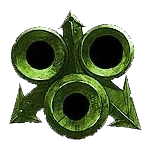
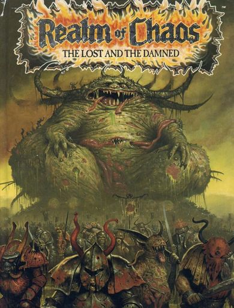
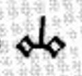
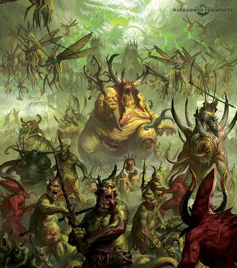
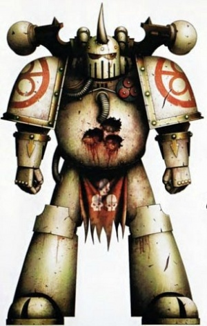
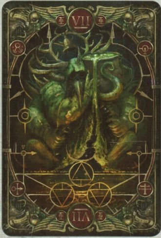

# 0507 纳垢 Nurgle

精校状态：中文行文已逐段精校，部分术语仍为暂定

分类：组织 / 混沌 Chaos / 混沌诸神 Chaos Gods

原文来源：https://www.bilibili.com/opus/1135085334360490100

原作者：帝国神选罐头

原文时间：2025年11月14日 19:50

[返回分类目录](目录.md) · [全书目录](../../目录.md)

<!-- A0507-B0001 -->
**英文原文**

Nurgle is the Chaos God of despair, decay, and disease. He was the third to awake of the four Gods of Chaos, fully coming into existence during Terra's Middle Ages, with plagues sweeping across continents in the wake of his birth. His titles include the Plague Father, Fly Lord, Great Corruptor, Plague Lord, Master of Pestilence, Lord of Decay (the Dark Tongue translation of his name is, Nurgh-leth)

<!-- /A0507-B0001 -->

<!-- A0507-B0002 -->

原译文

纳垢是绝望、腐朽和疾病的混沌之神。他是第三个觉醒的混沌四神，在泰拉的中世纪完全存在，他诞生后瘟疫席卷各大洲。他的头衔包括瘟疫之父、苍蝇领主、大腐化者、瘟疫领主、瘟疫之主、腐朽领主（他的名字的暗语翻译是努尔格-莱斯）

**校订译文**

纳垢是掌管绝望、腐朽与疾病的混沌之神。按本篇采用的起源记述，他是混沌四神中第三位觉醒者，在泰拉中世纪完全成形，诞生后瘟疫席卷各大洲。他的称号包括瘟疫之父、苍蝇领主、大腐化者、瘟疫领主、瘟疫之主与腐朽领主，其名字的黑暗语形式为 Nurgh-leth，暂译努尔格-莱斯。

**校注：** 纳垢第三个觉醒及泰拉中世纪年代，按英文此版起源说法保留；与其他宇宙史版本可能不同。

<!-- /A0507-B0002 -->

<!-- A0507-B0003 图片 -->

<!-- A0507-B0004 -->

原译文

Nurgle 纳垢

**校订译文**

Nurgle 纳垢

<!-- /A0507-B0004 -->

<!-- A0507-B0005 -->
**英文原文**

Titles:Plague Father, Fly Lord, Great Corruptor, Plague Lord, Master of Pestilence, Lord of Decay

<!-- /A0507-B0005 -->

<!-- A0507-B0006 -->

原译文

头衔：瘟疫之父、苍蝇领主、大腐化者、瘟疫领主、瘟疫之主、腐朽领主

**校订译文**

头衔：瘟疫之父、苍蝇领主、大腐化者、瘟疫领主、瘟疫之主、腐朽领主

<!-- /A0507-B0006 -->

<!-- A0507-B0007 -->
**英文原文**

Status:Active

<!-- /A0507-B0007 -->

<!-- A0507-B0008 -->

原译文

状态：活动

**校订译文**

状态：活跃

<!-- /A0507-B0008 -->

<!-- A0507-B0009 -->
**英文原文**

Type:Chaos God

<!-- /A0507-B0009 -->

<!-- A0507-B0010 -->

原译文

类型：混沌之神

**校订译文**

类型：混沌之神

<!-- /A0507-B0010 -->

<!-- A0507-B0011 -->
**英文原文**

Domains:Mortality, morbidity, despair

<!-- /A0507-B0011 -->

<!-- A0507-B0012 -->

原译文

领域：死亡、疾病、绝望

**校订译文**

领域：死亡、疾病、绝望

<!-- /A0507-B0012 -->

<!-- A0507-B0013 -->
**英文原文**

Daemons:Great Unclean One, Poxbringer, Spoilpox Scrivener, Sloppity Bilepiper, Plaguebearer, Nurgling, Beast of Nurgle, Rot Fly, Battle Fly, Bloat Fly, Molluscoid, Glitchling, Sludge-Grub, Feculent Gnarlmaw, Plague Fly

<!-- /A0507-B0013 -->

<!-- A0507-B0014 -->

原译文

恶魔：大不净者，毒疹使者，坏疹书记官，污秽胆汁散布者，瘟疫携带者，纳垢灵，纳垢兽，腐蝇，战蝇，胀蝇，纳垢蜗牛，故障灵，淤泥蛆，纳垢毒枝，瘟疫蝇

**校订译文**

恶魔：大不净者、疱疹使者、坏疹书记员、雀跃乐手、瘟疫使、纳垢灵、纳垢野兽、腐蝇、战蝇、胀蝇、纳垢蜗牛、故障灵、淤泥蛆、肮脏瘤口树、瘟疫蝇

<!-- /A0507-B0014 -->

<!-- A0507-B0015 -->
**英文原文**

Home:Garden of Nurgle

<!-- /A0507-B0015 -->

<!-- A0507-B0016 -->

原译文

家园：纳垢花园

**校订译文**

家园：纳垢花园

<!-- /A0507-B0016 -->

<!-- A0507-B0017 -->
**英文原文**

Adjectives:Nurglesque

<!-- /A0507-B0017 -->

<!-- A0507-B0018 -->

原译文

形容词：纳垢的

**校订译文**

形容词：纳垢的

<!-- /A0507-B0018 -->

<!-- A0507-B0019 -->
**英文原文**

Sacred Number:7

<!-- /A0507-B0019 -->

<!-- A0507-B0020 -->

原译文

圣数：7

**校订译文**

圣数：7

<!-- /A0507-B0020 -->

<!-- A0507-B0021 -->
**英文原文**

Symbols:Tripartite Fly

<!-- /A0507-B0021 -->

<!-- A0507-B0022 -->

原译文

象征：三蝇

**校订译文**

象征：三蝇

<!-- /A0507-B0022 -->

<!-- A0507-B0023 -->
**英文原文**

Enemies:Tzeentch

<!-- /A0507-B0023 -->

<!-- A0507-B0024 -->

原译文

敌人：奸奇

**校订译文**

敌人：奸奇

<!-- /A0507-B0024 -->

<!-- A0507-B0025 -->
## Overview 概述

<!-- /A0507-B0025 -->

<!-- A0507-B0026 -->
**英文原文**

Of the four Gods of Chaos, Nurgle is said to be the most involved with the plight of mortals. Those afflicted by his contagions often turn to him in order to escape their suffering. The physical likeness of Nurgle is described as gigantic and bloated with corruption, with foul-coloured, leathery and necrotic skin. Nurgle can also be regarded as the Lord of All, because all things, no matter how solid and permanent they seem, are liable to physical corruption:

<!-- /A0507-B0026 -->

<!-- A0507-B0027 -->

原译文

在混沌四神中，纳垢据说是最关心凡人困境的人。那些被他的传染病折磨的人经常向他求助，以逃避他们的痛苦。纳垢的外形被描述为巨大而臃肿的腐化，有着肮脏、坚韧和坏死的皮肤。纳垢也可以被视为万物之主，因为一切事物，无论它们看起来多么坚固和永恒，都容易受到身体腐化：

**校订译文**

据说，混沌四神中，纳垢最关切凡人的困境。受其疫病折磨的人，往往为了摆脱痛苦而转向他求援。他的形象巨大臃肿、腐败不堪，皮肤色泽污浊，呈革质并遍布坏死。纳垢也可被视为万物之主，因为一切事物，无论看起来多么坚固恒久，最终都可能腐朽：

<!-- /A0507-B0027 -->

<!-- A0507-B0028 图片 -->

<!-- A0507-B0029 -->

原译文

Nurgle overlooking his army 纳垢俯瞰着他的军队

**校订译文**

Nurgle overlooking his army 纳垢俯瞰着他的军队

<!-- /A0507-B0029 -->

<!-- A0507-B0030 -->
**英文原文**

"Indeed, the very process of construction and creation foreshadow destruction and decay. The palace of today is tomorrow's ruin, the maiden of the morning is the crone of the night, and the hope of a moment is but the foundation stone of everlasting regret."

<!-- /A0507-B0030 -->

<!-- A0507-B0031 -->

原译文

“事实上，建造和创造的过程预示着毁灭和衰败。今天的宫殿是明天的废墟，早晨的少女是夜晚的老妪，片刻的希望只是永恒遗憾的基石。”

**校订译文**

“事实上，建造和创造的过程预示着毁灭和衰败。今天的宫殿是明天的废墟，早晨的少女是夜晚的老妪，片刻的希望只是永恒遗憾的基石。”

<!-- /A0507-B0031 -->

<!-- A0507-B0032 -->
**英文原文**

All the Chaos gods are embodiments of the hopes, fears and other strong emotions and concepts generated by the mortal races. In Nurgle's case, the source of power is insecurity, denial, self-delusion and the living's fear of inevitable death and disease, as well as their unconscious response to that fear, which is the "power of life", the motivating power of mankind and other races. Nurgle coaxes new worshippers into his fold by stripping them of any other options, inflicting a spiritual taint upon the populace that is reflected outwardly as disease and pestilence. The desperate, ostracised and dying come to Nurgle to find alleviation from their pain. To these potential devotees, Nurgle provides not redemption from their ailments, but rather comfort within their suffering. Those blessed by Nurgle are granted relief from physical pain as well as a bizarre satisfaction in their depressive state. It is a twisting of a being's perceived reality, turning delusion and denial into truth and acceptance, just as self-respect and vanity turn into monstrous self-satisfaction.

<!-- /A0507-B0032 -->

<!-- A0507-B0033 -->

原译文

所有混沌之神都是凡人种族产生的希望、恐惧和其他强烈情感和概念的化身。在纳垢的方面中，力量的来源是不安全感、否认、自欺欺人和生者对不可避免的死亡和疾病的恐惧，以及他们对这种恐惧的无意识反应，这就是“生命的力量”，是人类和其他种族的动力。纳垢通过剥夺新信徒的任何其他选择来诱使他们加入他的行列，给民众带来精神上的污点，表面上表现为疾病和瘟疫。绝望、被排斥和垂死的人来到纳垢寻求缓解他们的痛苦。对于这些潜在的奉献者来说，纳垢提供的不是从他们的疾病中得到救赎，而是在他们的痛苦中得到安慰。那些受到纳垢祝福的人不仅可以缓解身体疼痛，还可以在抑郁状态下获得一种奇怪的满足感。这是对一个人感知到的现实的扭曲，将妄想和否认变成了真理和接受，就像自尊和虚荣变成了可怕的自我满足一样。

**校订译文**

混沌诸神都体现着凡人种族的希望、恐惧及其他强烈情感与观念。纳垢的力量来自不安、否认、自我欺骗，以及生者对不可避免的死亡和疾病的恐惧；也来自面对这种恐惧时本能的回应，即推动人类和其他种族活下去的“生命之力”。他先剥夺潜在信徒的其他出路，再诱其归附：灵魂上的污染显现在肉体上，化为疾病与瘟疫。绝望者、被排斥者和垂死者于是向他求救。纳垢并不治好他们的病，而是让他们在苦难中获得安慰：受赐者不再承受肉体疼痛，甚至对悲惨处境产生怪异的满足。他扭曲他们对现实的认识，让妄想与否认变成眼中的真相与接纳，正如自尊与虚荣被扭成可怖的自我陶醉。

<!-- /A0507-B0033 -->

<!-- A0507-B0034 -->
**英文原文**

Nurgle and his daemons, in contrast to their putrid appearance, are jovial and friendly in demeanor. His daemon servants and mortal followers usually demonstrate a disturbing joviality and joy at the pestilence that he inflicts, seeing the plagues as gifts and the cries of their victims as gratitude rather than agony. This is demonstrated on the Daemon World of Bubonicus, where an endless chain of crazed revellers circles the planet's equator in a never-ending dance.

<!-- /A0507-B0034 -->

<!-- A0507-B0035 -->

原译文

纳垢和他的恶魔，与他们腐烂的外表形成鲜明对比，举止愉快友好。他的恶魔仆人和凡人追随者通常对他造成的瘟疫表现出令人不安的快乐和喜悦，将瘟疫视为礼物，将受害者的哭声视为感激而非痛苦。这在布博尼库斯恶魔世界上得到了证明，在那里，一条无休止的疯狂狂欢者链绕着行星的赤道跳舞。

**校订译文**

纳垢及其恶魔虽然外貌腐烂，举止却和善欢快。无论恶魔仆从还是凡人信徒，都常对他散播的瘟疫表现出令人不安的喜悦，把疫病当成礼物，将受害者的哭号听作感激。在恶魔世界布博尼库斯，无数疯狂的欢宴者手连手绕着赤道，跳着永不停歇的舞蹈，正体现了这种狂喜。

<!-- /A0507-B0035 -->

<!-- A0507-B0036 -->
**英文原文**

Nurgle is often referred to as Grandfather Nurgle, Father Nurgle or Papa Nurgle by his followers because of his paternal nature. His main enemy is Tzeentch, the Lord of Change, because their power comes from opposing sources. Tzeentch is hope and ambition, while Nurgle is defiance born of despair and hopelessness.

<!-- /A0507-B0036 -->

<!-- A0507-B0037 -->

原译文

纳垢通常被他的追随者称为祖父纳垢、父亲纳垢或爸爸纳垢，因为他的父亲本性。他的主要敌人是万变之主奸奇，因为他们的力量来自对立的源头。奸奇是希望和野心，而纳垢是绝望和无望的反抗。

**校订译文**

由于这种父亲般的姿态，信徒常称他为祖父纳垢、父亲纳垢或纳垢爸爸。他的主要敌人是万变之主奸奇，因为两者的力量来自相反的情感：奸奇体现希望与野心，纳垢则体现绝望和无望之中滋生的抗拒。

**校注：** 此处 Lord of Change 是直接修饰奸奇的尊号，沿“万变之主”，并非 Lord of Change 恶魔单位“诡变领主”；同形词按对象区分。

<!-- /A0507-B0037 -->

<!-- A0507-B0038 -->
## The Garden of Nurgle 纳垢花园

<!-- /A0507-B0038 -->

<!-- A0507-B0039 -->
**英文原文**

The Garden of Nurgle is Nurgle's realm within the Warp. This unwholesome realm is home to every pox and affliction imaginable and is alive with the stench of rot. This 'garden' is not a barren wasteland, but rather a macabre paradise of death and pestilence. A thick sheet of buzzing swarms of black, furry flies litter the sky, and twisted, rotten boughs entangled with grasping vines cover the mouldering ground, beneath an insect-ravaged canopy of leaves. Defiled fungi both plain and extraordinary break through the leaf-strewn mulch of the forest floor, puffing out vile clouds of spores. Muddy rivers slither across the bloated landscape. Nurgle's Mansion of rotted timbers and broken walls resides at the heart of the garden; decrepit and ancient, yet eternally strong at its foundations. It is within these tumbling walls that Nurgle toils at his cauldron, a receptacle vast enough to contain all the oceans of the worlds of the Galaxy.

<!-- /A0507-B0039 -->

<!-- A0507-B0040 -->

原译文

纳垢花园是纳垢在亚空间中的领地。这个不健康的领域是所有可以想象的痘疹和痛苦的家园，充满了腐烂的恶臭。这个“花园”不是一片贫瘠的荒地，而是一个充满死亡和瘟疫的可怕天堂。一大片嗡嗡作响的黑色毛茸茸的苍蝇散布在天空中，扭曲的腐烂树枝与紧紧抓住的藤蔓缠绕在发霉的地面上，在昆虫肆虐的树叶下。亵渎真菌 — 无论是普通的还是非同寻常的 — 都会冲破森林地面上铺满树叶的覆盖，喷出肮脏的孢子云。泥泞的河流滑过臃肿的风景。由腐朽的木材和破碎的墙壁组成的纳垢公馆位于花园的中心；破旧而古老，但根基永远坚固。正是在这些翻滚的墙壁内，纳垢在他的大锅旁辛勤劳作，这个容器足够大，可以容纳银河系的世界的所有海洋。

**校订译文**

纳垢花园是他在亚空间中的领域，滋生着所有能想象到的疮病与苦难，充满腐败恶臭。这里并非荒芜死地，而是一座死亡与瘟疫的骇人乐园。密密麻麻的黑色茸毛苍蝇在天空嗡鸣；虫蛀的树冠下，腐枝与攫取猎物般的藤蔓缠绕，遮盖霉烂地面。普通或奇形怪状的污秽真菌，从落叶腐殖层中钻出，喷吐恶毒孢子云。污泥河流蜿蜒穿过臃肿的土地。花园中央矗立着纳垢公馆，由腐木和残墙构成，古老破败，地基却永远牢固。摇摇欲坠的墙壁内，纳垢日夜伏在大锅旁劳作；那口锅巨大得足以容纳银河各世界的全部海洋。

<!-- /A0507-B0040 -->

<!-- A0507-B0041 -->
**英文原文**

Nurgle keeps his companion Isha trapped in a cage in the garden of Nurgle, in the corner of a room where he keeps the cauldron in which he creates all of his plagues. Being a goddess of healing, Isha can cure herself of any of Nurgle's diseases. Nurgle takes advantage of this by force-feeding her his latest creation and sees how long it takes the goddess to overcome its effects. If he is pleased, he releases it upon some unsuspecting world, if not, he starts over, working at his cauldron until he has something new to give to his 'companion'. Whilst he is busy working though, Isha takes advantage of his distraction to instruct mortals on how to rid themselves of Nurgle's poxes.

<!-- /A0507-B0041 -->

<!-- A0507-B0042 -->

原译文

纳垢把他的伴侣伊莎困在纳垢花园的一个笼子里，在一个房间的角落里，他在那里放着他制造所有瘟疫的大锅。作为治愈女神，伊莎可以治愈纳垢的任何疾病。纳垢利用这一点，强行喂她他最新的创作，并观察女神需要多长时间才能克服其影响。如果他高兴，他会把它释放到一个毫无戒心的世界上，如果不高兴，他就会重新开始，在他的锅里工作，直到他有新的东西可以给他的“伴侣”。当他忙于工作时，伊莎利用他的分心来指导凡人如何摆脱纳垢的痘疹。

**校订译文**

纳垢将伊莎囚在花园中的牢笼里，笼子位于摆放瘟疫大锅的房间一角。作为治愈女神，她能治好自己所染上的任何纳垢疫病。纳垢便利用这一点，强迫她吞下新调制的瘟疫，观察她需要多久才能消除影响。成果令他满意，就被释放到毫无防备的世界；不满意，他就回到锅边继续调配，为自己的“伴侣”准备下一种疾病。而在纳垢忙碌分心时，伊莎会暗中向凡人传授摆脱疫病的方法。

<!-- /A0507-B0042 -->

<!-- A0507-B0043 -->
**英文原文**

When Nurgle's power waxes, the Garden blooms, encroaching on the lands of the other Chaos Gods. Nurgle's enemies would fight back, and the Plaguebearers would take up arms to defend it. Although the Garden will recede again, it would still have fed deeply on the essence of those who have fallen in such wars, and will lie in gestate peace until it is ready to bloom again.

<!-- /A0507-B0043 -->

<!-- A0507-B0044 -->

原译文

当纳垢的力量耗尽时，花园盛开，侵占了其他混沌之神的土地。纳垢的敌人会反击，瘟疫携带者会拿起武器保卫它。虽然花园会再次退缩，但它仍然会深深地汲取那些在战争中倒下的人的精华，并将处于孕育和平的状态，直到它准备再次绽放。

**校订译文**

纳垢力量增长时，花园随之繁盛，侵入其他混沌诸神的领地。敌人反击，瘟疫使便拿起武器保卫花园。即使花园随后退缩，也已充分吸取战争死者的精华，暂时安静地孕育，等待下一次盛放。

**校注：** waxes 意为增长、增强，原译“力量耗尽”意思完全相反。

<!-- /A0507-B0044 -->

<!-- A0507-B0045 -->
**英文原文**

The Garden of Nurgle contains ravenous creatures such as Feculent Gnarlmaws.

<!-- /A0507-B0045 -->

<!-- A0507-B0046 -->

原译文

纳垢花园里有饥饿的生物，如纳垢毒枝。

**校订译文**

纳垢花园中栖息着肮脏瘤口树等贪食生物。

<!-- /A0507-B0046 -->

<!-- A0507-B0047 -->
## Worship of Nurgle 纳垢崇拜

<!-- /A0507-B0047 -->

<!-- A0507-B0048 -->
**英文原文**

Like the other Chaos Gods, Nurgle has a multitude of followers across the galaxy, drawn from all mortal species.

<!-- /A0507-B0048 -->

<!-- A0507-B0049 -->

原译文

像其他混沌之神一样，纳垢在银河系中拥有众多追随者，他们来自所有凡人物种。

**校订译文**

像其他混沌之神一样，纳垢在银河系中拥有众多追随者，他们来自所有凡人物种。

<!-- /A0507-B0049 -->

<!-- A0507-B0050 图片 -->

<!-- A0507-B0051 -->

原译文

Dark Tongue Rune Of Nurgle 纳垢的暗语符文

**校订译文**

Dark Tongue Rune Of Nurgle 纳垢的暗语符文

<!-- /A0507-B0051 -->

<!-- A0507-B0052 -->
**英文原文**

The followers of Nurgle often pit themselves against those of Tzeentch in complex political intrigues, forever attempting to mire his schemes for change with dull-minded conservationisms and parochial self-interest. Their influence is often successful in thwarting Tzeentch, knowing that whatever survives the collapse into entropy becomes theirs. The church of the Fly Lord is always open to all.

<!-- /A0507-B0052 -->

<!-- A0507-B0053 -->

原译文

纳垢的追随者经常在复杂的政治阴谋中与奸奇的追随者对立，永远试图用头脑迟钝的资源保护主义和狭隘的自身利益来困住他的变化计划。他们的影响力往往成功地挫败了奸奇，因为他们知道，任何在坍缩成熵的过程中幸存下来的东西都是他们的。苍蝇领主的教会始终对所有人开放。

**校订译文**

纳垢信徒常在复杂的政治阴谋中对抗奸奇信徒，试图以愚钝的保守主义和狭隘私利，阻挠对方的变革计划。他们经常能够挫败奸奇，因为他们相信，万物最终崩解于熵增时，残存的一切终将属于纳垢。苍蝇领主的教会永远向所有人敞开。

**校注：** conservationisms 此处为抗拒变化的保守思想，非环境或资源保护主义。

<!-- /A0507-B0053 -->

<!-- A0507-B0054 -->
## Daemons of Nurgle 纳垢恶魔

<!-- /A0507-B0054 -->

<!-- A0507-B0055 -->
### The Plague Legions 瘟疫军团

<!-- /A0507-B0055 -->

<!-- A0507-B0056 -->
**英文原文**

The armies of Nurgle are collectively referred to as the Plague Legions. Each of these Legions is associated with a specific stage of Nurgle's cycle of decay and regeneration. The Fecundus Legions are tasked with making disease, traveling across the Warp to gather ingredients. The Infecticus Legions are the harbingers of infection, the carriers of new diseases that lay the groundwork for the greater virulence to follow. The Pathogenus Legions are disease fully bloomed and sickness made manifest, equal in both attack or defense and often deployed to guard key sites within the Garden of Nurgle or to spearhead assaults. The Epidemic Legions contain the most Daemons, spreading outward to ensure initial gains turn into rampaging outbreaks. The Rot Legions revel in decay and break down anything and it is their presence more than any other that causes Nurgle's power to swell. The Morbidus Legions are the reapers, tolltakers, and bringers of death. The Necroticus Legions are the most resilient, for they use hopelessness and despair as weapons.

<!-- /A0507-B0056 -->

<!-- A0507-B0057 -->

原译文

纳垢的军队统称为瘟疫军团。这些军团中的每一个都与纳垢腐朽和再生周期的特定阶段有关。丰饶军团的任务是制造疾病，穿越亚空间收集原料。感染军团是感染的先兆，是新疾病的携带者，为随后更大的恶毒奠定了基础。病原军团是疾病完全爆发和疾病显现，在攻击或防御方面都是平等的，经常被部署来守卫纳垢花园内的关键地点或带头攻击。疫病军团包含了最多的恶魔，向外传播，以确保最初的成果转化为肆虐的疫情。腐烂军团沉迷于腐朽，破坏任何东西，正是他们的存在比其他任何人都更能使纳垢的力量膨胀。恶疫军团是收割者、收获者和死亡的使者。坏死军团是最有适应力的，因为他们使用无希望和绝望作为武器。

**校订译文**

纳垢的军队统称瘟疫军团，每类军团对应腐朽与再生循环中的一个阶段。丰饶军团负责制造疾病，遍游亚空间搜集原料；感染军团是传染的先驱，携带新疫病，为更猛烈的蔓延铺路；病原军团代表完全爆发的疾病，攻守兼备，常驻守花园要地或担任突击先锋；疫病军团恶魔数量最多，不断向外扩散，将最初的成果化为失控的疫情；腐烂军团沉醉于腐朽，分解一切，其存在比其他军团更能壮大纳垢之力；恶疫军团是收割者、索命者和死亡的使者；坏死军团则最为坚韧，以无望和绝望作为武器。

<!-- /A0507-B0057 -->

<!-- A0507-B0058 图片 -->

<!-- A0507-B0059 -->

原译文

daemonic host of Nurgle Daemons 纳垢恶魔的恶魔天军

**校订译文**

daemonic host of Nurgle Daemons 纳垢恶魔大军

<!-- /A0507-B0059 -->

<!-- A0507-B0060 -->
**英文原文**

Each Plague Legion is commanded by a Great Unclean One. Beneath them are Daemon Princes or Heralds of Nurgle that each command one of the Legions seven tallybands. At its peak, each Tallyband is composed of seven packs of Lesser Daemons and Daemonic beasts.

<!-- /A0507-B0060 -->

<!-- A0507-B0061 -->

原译文

每个瘟疫军团都由一个大不净者指挥。在他们下面是恶魔王子或纳垢传令官，每个人都指挥着军团七个记帮中的一个。在巅峰时期，每个记帮由七队低级恶魔和恶魔野兽组成。

**校订译文**

每个瘟疫军团由一位大不净者统领，下辖七个记账战帮，分别由恶魔亲王或纳垢传令官指挥。满编时，每个战帮又由七群低阶恶魔与恶魔野兽组成。

**校注：** Tallyband 原译记帮不通，暂作记账战帮；GW09第18页另有“记账队召唤师”强化，尚无对应英文同页可证完整Tallyband官译，不作官方认证。

<!-- /A0507-B0061 -->

<!-- A0507-B0062 -->
### Nurgle's Creations 纳垢的造物

<!-- /A0507-B0062 -->

<!-- A0507-B0063 -->
**英文原文**

The Daemons of Nurgle are putrid in appearance and sickening to look upon. Their skin is filled with the fever-heat of corruption, their innards pushing through the lesions in their skin, and their bodies ooze with putrid slime. However Nurgle's Daemons are often cheerful, energetic beings that show a disturbingly friendly demeanor, they are jovial in their work and show great pride in their achievements.

<!-- /A0507-B0063 -->

<!-- A0507-B0064 -->

原译文

纳垢的恶魔外表腐烂，看起来令人作呕。他们的皮肤充满了腐化的发热，他们的内脏穿过皮肤上的病变，他们的身体渗出了腐烂的黏液。然而，纳垢的恶魔通常快乐、精力充沛，表现出令人不安的友好态度，他们在工作中很快乐，并对自己的成就感到非常自豪。

**校订译文**

纳垢恶魔外表腐败，令人作呕。皮肤因腐化而发热，内脏从溃烂伤口中挤出，全身渗着恶臭黏液。然而，它们常常活泼开朗，展现出令人不安的友善，在劳作中乐此不疲，并为自己的成果无比自豪。

<!-- /A0507-B0064 -->

<!-- A0507-B0065 -->
### Great Unclean Ones 大不净者

<!-- /A0507-B0065 -->

<!-- A0507-B0066 -->
**英文原文**

The Greater Daemons of Nurgle, massive, bloated disease-carriers, often carrying a blade known as a Plague Sword into battle. These massive, rusted blades are said to be dipped in the foul pus and contagion at the base of Nurgle's throne. Great Unclean Ones are unlike the Great Daemons of other Powers, in that where the latter are essentially just immensely powerful servants, the Great Unclean Ones are each facsimiles of Nurgle himself, both physically and in terms of their personality. In other words, every Great Unclean One is also Nurgle. Thus these followers often refer to these Daemons as 'Papa', 'Nurgle' or 'Father Nurgle'. Despite their completely bloated and putrid appearance, Great Unclean Ones are neither deathlike nor morbid in character. In fact the opposite is true, and the Daemons are motivated by all the trivial human enthusiasms which drive the living. They are gregarious and even sentimental in nature, and hold their followers dear, even referring to them as their "Children", and taking an obvious pride in their appearance and endearing behaviour.

<!-- /A0507-B0066 -->

<!-- A0507-B0067 -->

原译文

纳垢的大魔，庞大而臃肿的疾病携带者，经常携带一把被称为瘟疫之剑的刀刃投入战斗。据说，这些巨大的生锈刀刃被浸在纳垢王座底部的恶臭脓液和传染病中。大不净者不同于其他力量的大魔，因为后者本质上只是非常强大的仆人，大不净者在身体和性格上都是纳垢本人的复制品。换言之，每一个大不净者也是纳垢。因此，这些追随者经常将这些恶魔称为“爸爸”、“纳垢”或“父亲纳垢“。尽管他们的外表完全臃肿和腐烂，但大不净者在性格上既不是死亡的，也不是病态的。事实上，情况恰恰相反，驱动生者的所有琐碎的人类热情都激励着恶魔。他们性格外向，甚至多愁善感，珍视追随者，甚至称他们为“孩子”，并对他们的外表和可爱的行为感到自豪。

**校订译文**

大不净者是纳垢的大魔，体形巨大臃肿，满载疫病，常挥舞瘟疫之剑上阵。这种庞大的锈刃据说浸泡过纳垢王座脚下的脓液与疫毒。其他神祇的大魔本质上只是异常强大的仆从，大不净者却无论外形还是性格，都像纳垢本人的复制体；换言之，每位大不净者也都是纳垢。因此，追随者常称它们为“爸爸”“纳垢”或“父亲纳垢”。它们虽然臃肿腐烂，性情却毫不阴沉病态，反而被活人所有细碎的热情所驱动。它们合群，甚至多愁善感，珍爱自己的追随者，称其为“孩子”，并为孩子们的外貌和可爱举止深感骄傲。

<!-- /A0507-B0067 -->

<!-- A0507-B0068 -->
### Plaguebearers 瘟疫使

原题：Plaguebearers 瘟疫携带者

<!-- /A0507-B0068 -->

<!-- A0507-B0069 -->
**英文原文**

The common Daemons of Nurgle, having a vaguely humanoid appearance with a single burning eye. They are often referred to as the 'Tallymen of Nurgle' for they constantly strive to number the poxes and represent the need of Humanity to impose order on a chaotic and uncaring universe. A single scratch from their rusted swords is sufficient to bestow a plague that sends its host to Nurgle's realm. They have special combat abilities allowing them to hurt enemies no matter how tough they are and are consumed with Nurgle's Rot. The most powerful Plaguebearers will serve as Plague Drones, the heavy cavalry of Nurgle's armies.

<!-- /A0507-B0069 -->

<!-- A0507-B0070 -->

原译文

纳垢常见的恶魔，有着模糊的人形外观，有一只燃烧的眼睛。他们经常被称为“纳垢的记事员”，因为他们不断努力对痘疹进行编号，并代表人类在混乱和漠不关心的宇宙中建立秩序的需要。他们生锈的剑上的一道划痕就足以引发一场瘟疫，将宿主送到纳垢的领域。他们有特殊的战斗能力，无论敌人有多强壮，他们都能伤害敌人，并被纳垢的腐烂吞噬。最强大的瘟疫携带者将供应瘟疫机蜂，纳垢军队的重骑兵。

**校订译文**

瘟疫使是纳垢最常见的恶魔，大致呈人形，只有一只燃烧般的独眼。它们不停清点疫病的数量，因此常被称为“纳垢的计数者”，体现了人类想在混乱、冷漠的宇宙中建立秩序的冲动。锈剑只需划出一道伤口，就能使目标染上疫病，将其送入纳垢的领域。它们身负纳垢之腐，具有特殊的作战力量，无论敌人多么坚韧都能伤及。最强大的瘟疫使会成为瘟疫蜂兵，担任纳垢大军的重骑兵。

**校注：** 瘟疫使、瘟疫蜂兵为 GW09/GW10 第12页对应官方单位译名；Tallymen of Nurgle此为恶魔称号，按计数职能译，不混同死亡守卫Tallyman书记官。

<!-- /A0507-B0070 -->

<!-- A0507-B0071 -->
### Nurglings 纳垢灵

<!-- /A0507-B0071 -->

<!-- A0507-B0072 -->
**英文原文**

Daemonic servants of Nurgle, they look like miniature representations of Nurgle, with friendly, mischievous faces. They are gregarious, agile and constantly active. They attack an enemy in vast swarms, overwhelming them by their numbers. Nurglings are often found following the shadow of Champions of Nurgle or gathering in hordes around Great Unclean Ones. When attacking they use their claws, which are infected by plagues and diseases, to drag down larger enemies where they can use their venomous bites.

<!-- /A0507-B0072 -->

<!-- A0507-B0073 -->

原译文

他们是纳垢的恶魔仆人，看起来像纳垢的微型代表，有着友好、淘气的面孔。他们合群、敏捷、经常活动。他们成群结队地攻击敌人，人数众多。纳垢灵经常出现在纳垢冠军的暗影下，或者成群结队地聚集在大不净者周围。攻击时，它们会用被瘟疫和疾病感染的爪子拖垮更大的敌人，在那里它们可以用有毒的咬。

**校订译文**

纳垢灵是纳垢的恶魔仆从，宛如缩小的纳垢，面容友善而淘气。它们合群敏捷，始终忙个不停，会成群扑向敌人，以数量将其淹没。它们常跟在纳垢冠军身后，或聚集于大不净者周围。攻击时，纳垢灵用带满病菌的利爪扯倒更高大的敌人，再施以毒咬。

<!-- /A0507-B0073 -->

<!-- A0507-B0074 -->
### Molluscoid 纳垢蜗牛

<!-- /A0507-B0074 -->

<!-- A0507-B0075 -->
**英文原文**

Large snail-like creatures that can serve as Daemonic mounts.

<!-- /A0507-B0075 -->

<!-- A0507-B0076 -->

原译文

大型蜗牛状生物，可以作为恶魔坐骑。

**校订译文**

大型蜗牛状生物，可以作为恶魔坐骑。

<!-- /A0507-B0076 -->

<!-- A0507-B0077 -->
### Beasts of Nurgle 纳垢野兽

原题：Beasts of Nurgle 纳垢兽

<!-- /A0507-B0077 -->

<!-- A0507-B0078 -->
**英文原文**

Huge, happy, slug-like creatures that slither across the battlefield leaving a trail of slime behind them. They incarnate the Plague Lord's bountiful excitement, and show a friendy nature utterly at odds with the deadly consequences they bring about.

<!-- /A0507-B0078 -->

<!-- A0507-B0079 -->

原译文

巨大、快乐、像蛞蝓一样的生物在战场上滑行，身后留下一条黏液痕迹。它们体现了瘟疫领主的极度兴奋，并表现出与它们带来的致命后果完全不一致的友好本性。

**校订译文**

这些庞大、欢快、形似蛞蝓的生物在战场上蠕行，身后留下一道黏液。它们体现着瘟疫领主充沛的兴奋，性情友善，却总给接触者带来致命后果。

<!-- /A0507-B0079 -->

<!-- A0507-B0080 -->
### Rot Flies and Battle Flies 腐蝇和战蝇

<!-- /A0507-B0080 -->

<!-- A0507-B0081 -->
**英文原文**

Huge, disgusting insectoid Daemonic beasts sometimes used for riding.

<!-- /A0507-B0081 -->

<!-- A0507-B0082 -->

原译文

巨大的、令人厌恶的昆虫状恶魔野兽，有时用于骑乘。

**校订译文**

巨大的、令人厌恶的昆虫状恶魔野兽，有时用于骑乘。

<!-- /A0507-B0082 -->

<!-- A0507-B0083 -->
### Bloat Flies 胀蝇

<!-- /A0507-B0083 -->

<!-- A0507-B0084 -->

原译文

Daemonic Familiars 恶魔魔宠

**校订译文**

Daemonic Familiars 恶魔魔宠

<!-- /A0507-B0084 -->

<!-- A0507-B0085 -->
### Feculent Gnarlmaws 肮脏瘤口树

原题：Feculent Gnarlmaws 纳垢毒枝

<!-- /A0507-B0085 -->

<!-- A0507-B0086 -->

原译文

Tree-like monsters 像树一样的怪物。

**校订译文**

Tree-like monsters 像树一样的怪物。

<!-- /A0507-B0086 -->

<!-- A0507-B0087 -->
### Sludge-Grub, Cursemite, Eyestinger Swarms 淤泥蛆，诅咒螨，刺眼蜂群

<!-- /A0507-B0087 -->

<!-- A0507-B0088 -->

原译文

Grubs spawned from the Gellerpox 来自盖勒铁瘟的孵化蛆虫

**校订译文**

Grubs spawned from the Gellerpox 来自盖勒铁瘟的孵化蛆虫

<!-- /A0507-B0088 -->

<!-- A0507-B0089 -->
### Glitchling 故障灵

<!-- /A0507-B0089 -->

<!-- A0507-B0090 -->
**英文原文**

Similar to Nurglings, but associated with malfunctioning machinery.

<!-- /A0507-B0090 -->

<!-- A0507-B0091 -->

原译文

与纳垢灵类似，但与机器故障有关。

**校订译文**

与纳垢灵类似，但与机器故障有关。

<!-- /A0507-B0091 -->

<!-- A0507-B0092 -->
### Daemon Engines of Nurgle 纳垢恶魔引擎

<!-- /A0507-B0092 -->

<!-- A0507-B0093 -->
**英文原文**

A Daemon Engine is a part-technological, part-daemonic vehicle, those dedicated to Nurgle include:

<!-- /A0507-B0093 -->

<!-- A0507-B0094 -->

原译文

恶魔引擎是一种半技术半恶魔的载具，专门用于纳垢的载具包括：

**校订译文**

恶魔引擎是结合技术与恶魔力量的载具，奉献给纳垢的型号包括：

<!-- /A0507-B0094 -->

<!-- A0507-B0095 -->

原译文

Blight Drone 枯萎机蜂

**校订译文**

Blight Drone 枯萎机蜂

<!-- /A0507-B0095 -->

<!-- A0507-B0096 -->

原译文

Contagion 传播者

**校订译文**

Contagion 传播者

<!-- /A0507-B0096 -->

<!-- A0507-B0097 -->

原译文

Foetid Bloat-Drone 恶臭肿胀机蜂

**校订译文**

Foetid Bloat-Drone 恶臭肿胀机兵

<!-- /A0507-B0097 -->

<!-- A0507-B0098 -->

原译文

Nurgle Plague Tower 纳垢瘟疫之塔

**校订译文**

Nurgle Plague Tower 纳垢瘟疫之塔

<!-- /A0507-B0098 -->

<!-- A0507-B0099 -->

原译文

Plague Hulk 瘟疫巨人

**校订译文**

Plague Hulk 瘟疫巨人

<!-- /A0507-B0099 -->

<!-- A0507-B0100 -->

原译文

Plaguereaper 瘟疫收割者

**校订译文**

Plaguereaper 瘟疫收割者

<!-- /A0507-B0100 -->

<!-- A0507-B0101 -->
## Forces dedicated to Nurgle 献身于纳垢的部队

<!-- /A0507-B0101 -->

<!-- A0507-B0102 -->
### Chaos Space Marines 混沌星际战士

<!-- /A0507-B0102 -->

<!-- A0507-B0103 -->
**英文原文**

The Death Guard Legion — During the Horus Heresy the Death Guard Space Marine Legion became afflicted with one of Nurgle's plagues and dedicated themselves to Nurgle. Known Death Guard sub-factions include:

<!-- /A0507-B0103 -->

<!-- A0507-B0104 -->

原译文

死亡守卫军团 — 在荷鲁斯叛乱时期，死亡守卫星际战士军团遭受了纳垢的瘟疫之一，并献身于纳垢。已知的死亡守卫子派系包括：

**校订译文**

死亡守卫军团——荷鲁斯之乱期间，军团感染了纳垢的一种瘟疫，随后投身于他。已知死亡守卫分支包括：

<!-- /A0507-B0104 -->

<!-- A0507-B0105 图片 -->

<!-- A0507-B0106 -->

原译文

Plague Marine 瘟疫战士

**校订译文**

Plague Marine 瘟疫战士

<!-- /A0507-B0106 -->

<!-- A0507-B0107 -->

原译文

Apostles of Contagion 传染使徒

**校订译文**

Apostles of Contagion 传染使徒

<!-- /A0507-B0107 -->

<!-- A0507-B0108 -->

原译文

Bilious Ones 胆汁众

**校订译文**

Bilious Ones 胆汁众

<!-- /A0507-B0108 -->

<!-- A0507-B0109 -->

原译文

Bringers of Putrid Salvation 腐烂救赎使者

**校订译文**

Bringers of Putrid Salvation 腐烂救赎使者

<!-- /A0507-B0109 -->

<!-- A0507-B0110 -->

原译文

Brotherhood of Reaping 收割兄弟会

**校订译文**

Brotherhood of Reaping 收割兄弟会

<!-- /A0507-B0110 -->

<!-- A0507-B0111 -->

原译文

Carrion Hounds 腐肉猎犬

**校订译文**

Carrion Hounds 腐肉猎犬

<!-- /A0507-B0111 -->

<!-- A0507-B0112 -->

原译文

Children of Blain 布莱恩之子

**校订译文**

Children of Blain 布莱恩之子

<!-- /A0507-B0112 -->

<!-- A0507-B0113 -->

原译文

Corpsemakers 尸体制造者

**校订译文**

Corpsemakers 尸体制造者

<!-- /A0507-B0113 -->

<!-- A0507-B0114 -->

原译文

Dolorous Gnaw 悲哀之噬

**校订译文**

Dolorous Gnaw 悲哀之噬

<!-- /A0507-B0114 -->

<!-- A0507-B0115 -->

原译文

Empyrion's Blight 帝国之疫

**校订译文**

Empyrion's Blight 埃姆皮里昂之疫

**校注：** Empyrion 是专名拼写，非 Imperium 帝国，暂音译埃姆皮里昂。

<!-- /A0507-B0115 -->

<!-- A0507-B0116 -->

原译文

Favoured Sons 受宠之子

**校订译文**

Favoured Sons 受宠之子

<!-- /A0507-B0116 -->

<!-- A0507-B0117 -->

原译文

Fecund Ones 肥沃众

**校订译文**

Fecund Ones 丰饶众

<!-- /A0507-B0117 -->

<!-- A0507-B0118 -->

原译文

Festerlung Brotherhood 烂肺兄弟会

**校订译文**

Festerlung Brotherhood 烂肺兄弟会

<!-- /A0507-B0118 -->

<!-- A0507-B0119 -->

原译文

Festering Scar 溃烂疤痕

**校订译文**

Festering Scar 溃烂疤痕

<!-- /A0507-B0119 -->

<!-- A0507-B0120 -->

原译文

Filthfavoured 污秽偏爱

**校订译文**

Filthfavoured 污秽眷者

<!-- /A0507-B0120 -->

<!-- A0507-B0121 -->

原译文

Glooming Lords 悲观领主

**校订译文**

Glooming Lords 悲观领主

<!-- /A0507-B0121 -->

<!-- A0507-B0122 -->

原译文

Hand of Filth 污秽之手

**校订译文**

Hand of Filth 污秽之手

<!-- /A0507-B0122 -->

<!-- A0507-B0123 -->

原译文

Heralds of Despair 绝望使者

**校订译文**

Heralds of Despair 绝望使者

<!-- /A0507-B0123 -->

<!-- A0507-B0124 -->

原译文

Infested Brethren 感染兄弟

**校订译文**

Infested Brethren 感染兄弟

<!-- /A0507-B0124 -->

<!-- A0507-B0125 -->

原译文

Legion Host 军团宿主

**校订译文**

Legion Host 军团大军

**校注：** Host 此处为战帮名的一部分，军事语境意为大军，并非附身宿主。

<!-- /A0507-B0125 -->

<!-- A0507-B0126 -->

原译文

Lords of Decay 腐朽领主

**校订译文**

Lords of Decay 腐朽领主

<!-- /A0507-B0126 -->

<!-- A0507-B0127 -->

原译文

Lords of Silence 寂静领主

**校订译文**

Lords of Silence 寂静领主

<!-- /A0507-B0127 -->

<!-- A0507-B0128 -->

原译文

Mouldering Claw 腐烂之爪

**校订译文**

Mouldering Claw 腐烂之爪

<!-- /A0507-B0128 -->

<!-- A0507-B0129 -->

原译文

Neverdead 不死者

**校订译文**

Neverdead 不死者

<!-- /A0507-B0129 -->

<!-- A0507-B0130 -->

原译文

Pallid Hand 苍白之手

**校订译文**

Pallid Hand 苍白之手

<!-- /A0507-B0130 -->

<!-- A0507-B0131 -->

原译文

Poisoned Chalice 剧毒圣杯

**校订译文**

Poisoned Chalice 剧毒圣杯

<!-- /A0507-B0131 -->

<!-- A0507-B0132 -->

原译文

Pox Mortis 死亡痘疹

**校订译文**

Pox Mortis 死亡痘疹

<!-- /A0507-B0132 -->

<!-- A0507-B0133 -->

原译文

Prophets of the Seven 七之先知

**校订译文**

Prophets of the Seven 七之先知

<!-- /A0507-B0133 -->

<!-- A0507-B0134 -->

原译文

Putrid Choir 腐烂唱诗班

**校订译文**

Putrid Choir 腐烂唱诗班

<!-- /A0507-B0134 -->

<!-- A0507-B0135 -->

原译文

Rotworm Brotherhood 蛔虫兄弟会

**校订译文**

Rotworm Brotherhood 腐虫兄弟会

<!-- /A0507-B0135 -->

<!-- A0507-B0136 -->

原译文

Rusted Claws 锈爪

**校订译文**

Rusted Claws 锈爪

<!-- /A0507-B0136 -->

<!-- A0507-B0137 -->

原译文

Selminster's Curse 塞尔明斯特的诅咒

**校订译文**

Selminster's Curse 塞尔明斯特的诅咒

<!-- /A0507-B0137 -->

<!-- A0507-B0138 -->

原译文

Sevenfold Filth 七重污秽

**校订译文**

Sevenfold Filth 七重污秽

<!-- /A0507-B0138 -->

<!-- A0507-B0139 -->

原译文

Seventh-day Morbidians 七日死亡

**校订译文**

Seventh-day Morbidians 七日死亡

<!-- /A0507-B0139 -->

<!-- A0507-B0140 -->

原译文

Smogrot Brotherhood 腐烟兄弟会

**校订译文**

Smogrot Brotherhood 腐烟兄弟会

<!-- /A0507-B0140 -->

<!-- A0507-B0141 -->

原译文

Sons of the Maggot 蛆虫之子

**校订译文**

Sons of the Maggot 蛆虫之子

<!-- /A0507-B0141 -->

<!-- A0507-B0142 -->

原译文

Suppurant Sting 脓疮之刺

**校订译文**

Suppurant Sting 脓疮之刺

<!-- /A0507-B0142 -->

<!-- A0507-B0143 -->

原译文

The Tainted 污染者

**校订译文**

The Tainted 污染者

<!-- /A0507-B0143 -->

<!-- A0507-B0144 -->

原译文

Tainted Lung 污染之肺

**校订译文**

Tainted Lung 污染之肺

<!-- /A0507-B0144 -->

<!-- A0507-B0145 -->

原译文

Tainted Sons 污染之子

**校订译文**

Tainted Sons 污染之子

<!-- /A0507-B0145 -->

<!-- A0507-B0146 -->

原译文

The Tollguard 征收守卫

**校订译文**

The Tollguard 征收守卫

<!-- /A0507-B0146 -->

<!-- A0507-B0147 -->

原译文

Tide of Filth 污秽浪潮

**校订译文**

Tide of Filth 污秽浪潮

<!-- /A0507-B0147 -->

<!-- A0507-B0148 -->

原译文

Weeping Legion 哭泣军团

**校订译文**

Weeping Legion 哭泣军团

<!-- /A0507-B0148 -->

<!-- A0507-B0149 -->
**英文原文**

Other Chaos Space Marine warbands dedicated to Nurgle include:

<!-- /A0507-B0149 -->

<!-- A0507-B0150 -->

原译文

其他献身于纳垢的混沌星际战士战帮包括：

**校订译文**

其他献身于纳垢的混沌星际战士战帮包括：

<!-- /A0507-B0150 -->

<!-- A0507-B0151 -->

原译文

The Blighted Claw 枯萎之爪

**校订译文**

The Blighted Claw 枯萎之爪

<!-- /A0507-B0151 -->

<!-- A0507-B0152 -->

原译文

The Bringers of Decay 腐朽使者

**校订译文**

The Bringers of Decay 腐朽使者

<!-- /A0507-B0152 -->

<!-- A0507-B0153 -->

原译文

The Cleaved 分裂者

**校订译文**

The Cleaved 分裂者

<!-- /A0507-B0153 -->

<!-- A0507-B0154 -->

原译文

The Death Bringers 死亡使者

**校订译文**

The Death Bringers 死亡使者

<!-- /A0507-B0154 -->

<!-- A0507-B0155 -->

原译文

The Deathmongers 死亡贩子

**校订译文**

The Deathmongers 死亡贩子

<!-- /A0507-B0155 -->

<!-- A0507-B0156 -->

原译文

The Grey Death 灰色死亡

**校订译文**

The Grey Death 灰色死亡

<!-- /A0507-B0156 -->

<!-- A0507-B0157 -->

原译文

The Plaguebones 瘟疫之骨

**校订译文**

The Plaguebones 瘟疫之骨

<!-- /A0507-B0157 -->

<!-- A0507-B0158 -->

原译文

The Purge 净世疫军

**校订译文**

The Purge 净世疫军

<!-- /A0507-B0158 -->

<!-- A0507-B0159 -->

原译文

The Vectors of Pox 痘疹载体

**校订译文**

The Vectors of Pox 痘疹载体

<!-- /A0507-B0159 -->

<!-- A0507-B0160 -->
### Renegades and Cults 变节者与教派

<!-- /A0507-B0160 -->

<!-- A0507-B0161 图片 -->

<!-- A0507-B0162 -->

原译文

Representaton of Nurgle 纳垢的表征

**校订译文**

Representaton of Nurgle 纳垢的表征

<!-- /A0507-B0162 -->

<!-- A0507-B0163 -->

原译文

14th Volpone Bluebloods 第14沃尔波贵族军

**校订译文**

14th Volpone Bluebloods 第14沃尔波贵族军

<!-- /A0507-B0163 -->

<!-- A0507-B0164 -->

原译文

Children of the Merciful Lord 仁慈领主之子

**校订译文**

Children of the Merciful Lord 仁慈领主之子

<!-- /A0507-B0164 -->

<!-- A0507-B0165 -->

原译文

Cult of Amber 琥珀教派

**校订译文**

Cult of Amber 琥珀教派

<!-- /A0507-B0165 -->

<!-- A0507-B0166 -->
**英文原文**

Cult Tenebrous (Genestealer Cult)

<!-- /A0507-B0166 -->

<!-- A0507-B0167 -->

原译文

阴暗教派（基因窃取者教派）

**校订译文**

阴暗教派（基因窃取者教派）

<!-- /A0507-B0167 -->

<!-- A0507-B0168 -->

原译文

Death Priests of Mire 泥沼死亡牧师

**校订译文**

Death Priests of Mire 泥沼死亡祭司

<!-- /A0507-B0168 -->

<!-- A0507-B0169 -->

原译文

Givers of Life 生命给予者

**校订译文**

Givers of Life 生命给予者

<!-- /A0507-B0169 -->

<!-- A0507-B0170 -->

原译文

The Hidden Hand 隐藏之手

**校订译文**

The Hidden Hand 隐藏之手

<!-- /A0507-B0170 -->

<!-- A0507-B0171 -->

原译文

Sevenfold Conjuction 七重连词

**校订译文**

Sevenfold Conjuction 七重合相

**校注：** Conjuction 疑为 conjunction 的拼写遗漏，原译连词不合教派名语境，暂作七重合相，待原出处核实。

<!-- /A0507-B0171 -->

<!-- A0507-B0172 -->

原译文

Seventh Blessed 第七祝福

**校订译文**

Seventh Blessed 第七祝福

<!-- /A0507-B0172 -->

<!-- A0507-B0173 -->

原译文

The Stigmatus Convent 圣痕盟约

**校订译文**

The Stigmatus Convent 圣痕盟约

<!-- /A0507-B0173 -->

<!-- A0507-B0174 -->

原译文

Tattered Veil 破烂面纱

**校订译文**

Tattered Veil 破烂面纱

<!-- /A0507-B0174 -->

<!-- A0507-B0175 -->

原译文

Vile Savants 卑鄙学者

**校订译文**

Vile Savants 卑鄙学者

<!-- /A0507-B0175 -->

<!-- A0507-B0176 -->

原译文

Withering Stem 枯萎根茎

**校订译文**

Withering Stem 枯萎根茎

<!-- /A0507-B0176 -->

<!-- A0507-B0177 -->

原译文

Writhing World Sorcerer Kings 盘绕世界巫师之王

**校订译文**

Writhing World Sorcerer Kings 盘绕世界巫师之王

<!-- /A0507-B0177 -->

<!-- A0507-B0178 -->

原译文

Plaguechildren 瘟疫之子

**校订译文**

Plaguechildren 瘟疫之子

<!-- /A0507-B0178 -->

<!-- A0507-B0179 -->

原译文

Tri-fold Scourge 三重天灾

**校订译文**

Tri-fold Scourge 三重天灾

<!-- /A0507-B0179 -->

<!-- A0507-B0180 -->

原译文

Plaguebrewer 瘟疫制造者

**校订译文**

Plaguebrewer 瘟疫制造者

<!-- /A0507-B0180 -->

<!-- A0507-B0181 -->

原译文

Poxpriest 痘疹牧师

**校订译文**

Poxpriest 痘疹祭司

<!-- /A0507-B0181 -->

<!-- A0507-B0182 -->

原译文

Hazakh Plaguetakers 哈扎克瘟疫接受者

**校订译文**

Hazakh Plaguetakers 哈扎克瘟疫接受者

<!-- /A0507-B0182 -->

<!-- A0507-B0183 -->
### Other Servants of Nurgle 纳垢的其他仆人

<!-- /A0507-B0183 -->

<!-- A0507-B0184 -->

原译文

Pestigors 瘟角兽

**校订译文**

Pestigors 瘟角兽

<!-- /A0507-B0184 -->

<!-- A0507-B0185 -->

原译文

Poxwalkers 痘疹行者

**校订译文**

Poxwalkers 瘟疫行者

<!-- /A0507-B0185 -->

<!-- A0507-B0186 -->
### Daemonic Warbands 恶魔战帮

<!-- /A0507-B0186 -->

<!-- A0507-B0187 -->

原译文

Plague Guard 瘟疫守卫

**校订译文**

Plague Guard 瘟疫守卫

<!-- /A0507-B0187 -->

<!-- A0507-B0188 -->

原译文

Septicus Legion 败血军团

**校订译文**

Septicus Legion 败血军团

<!-- /A0507-B0188 -->

<!-- A0507-B0189 -->
### Titan Legions & Knight Houses 泰坦军团&骑士家族

<!-- /A0507-B0189 -->

<!-- A0507-B0190 -->

原译文

Festering Death 溃烂死亡

**校订译文**

Festering Death 溃烂死亡

<!-- /A0507-B0190 -->

<!-- A0507-B0191 -->

原译文

Legio Iritans 伊里坦斯军团

**校订译文**

Legio Iritans 伊里坦斯军团

<!-- /A0507-B0191 -->

<!-- A0507-B0192 -->

原译文

Legio Onerus 沉重军团

**校订译文**

Legio Onerus 沉重军团

<!-- /A0507-B0192 -->

<!-- A0507-B0193 -->

原译文

Legio Pestis 瘟疫军团

**校订译文**

Legio Pestis 瘟疫军团

<!-- /A0507-B0193 -->

<!-- A0507-B0194 -->

原译文

Legio Morbus 疾病军团

**校订译文**

Legio Morbus 疾病军团

<!-- /A0507-B0194 -->

<!-- A0507-B0195 -->

原译文

Legio Morbidus 病态军团

**校订译文**

Legio Morbidus 病态军团

<!-- /A0507-B0195 -->

<!-- A0507-B0196 -->

原译文

House Drear 德里尔家族

**校订译文**

House Drear 德里尔家族

<!-- /A0507-B0196 -->

<!-- A0507-B0197 -->

原译文

House Slughorn 斯拉格霍恩家族

**校订译文**

House Slughorn 斯拉格霍恩家族

<!-- /A0507-B0197 -->

<!-- A0507-B0198 -->

原译文

House Phleghra 弗莱格拉家族

**校订译文**

House Phleghra 弗莱格拉家族

<!-- /A0507-B0198 -->

<!-- A0507-B0199 -->

原译文

Rusthounds 锈蚀猎犬

**校订译文**

Rusthounds 锈蚀猎犬

<!-- /A0507-B0199 -->

<!-- A0507-B0200 -->
## Notable Servants of Nurgle 纳垢的著名仆人

<!-- /A0507-B0200 -->

<!-- A0507-B0201 -->
**英文原文**

Mortarion — Primarch of the Death Guard, now a powerful Daemon Prince.

<!-- /A0507-B0201 -->

<!-- A0507-B0202 -->

原译文

莫塔里安 — 死亡守卫原体，现在是一位强大的恶魔王子

**校订译文**

莫塔里安——死亡守卫原体，如今是一位强大的恶魔亲王。

<!-- /A0507-B0202 -->

<!-- A0507-B0203 -->
**英文原文**

Scabeiathrax — One of the mightiest of Nurgle's Great Unclean Ones.

<!-- /A0507-B0203 -->

<!-- A0507-B0204 -->

原译文

斯卡贝亚撒拉克斯 — 纳垢最强大的大不净者之一。

**校订译文**

斯卡贝亚撒拉克斯 — 纳垢最强大的大不净者之一。

<!-- /A0507-B0204 -->

<!-- A0507-B0205 -->
**英文原文**

Ku'Gath — A powerful Great Unclean One.

<!-- /A0507-B0205 -->

<!-- A0507-B0206 -->

原译文

库'噶斯 — 一个强大的大不净者。

**校订译文**

库噶斯——强大的大不净者。

<!-- /A0507-B0206 -->

<!-- A0507-B0207 -->
**英文原文**

Epidemius — A powerful Plaguebearer and Daemonic Herald of Nurgle.

<!-- /A0507-B0207 -->

<!-- A0507-B0208 -->

原译文

埃皮德米乌斯 — 强大的瘟疫携带者和纳垢的传令官。

**校订译文**

传疫魔——强大的瘟疫使，纳垢的恶魔传令官。

**校注：** Epidemius、Horticulous Slimux、Rotigus依GW09/GW10第12页完整官译；原稿埃皮德米乌斯、园丁斯利姆克斯、罗提古斯保留于本注供检索。

<!-- /A0507-B0208 -->

<!-- A0507-B0209 -->
**英文原文**

Horticulous Slimux — Gardener of the Garden of Nurgle.

<!-- /A0507-B0209 -->

<!-- A0507-B0210 -->

原译文

园丁斯利姆克斯 — 纳垢花园的园丁。

**校订译文**

园艺师史莱姆克斯——纳垢花园的园丁。

<!-- /A0507-B0210 -->

<!-- A0507-B0211 -->
**英文原文**

Typhus — A Death Guard Captain - now the favoured mortal Champion of Nurgle.

<!-- /A0507-B0211 -->

<!-- A0507-B0212 -->

原译文

泰丰斯 — 死亡守卫连长 — 现在是纳垢最宠爱的凡人冠军。

**校订译文**

泰弗斯——死亡守卫连长，如今是纳垢最宠爱的凡人冠军。

**校注：** Typhus依GW09/GW10第18页作泰弗斯，旧译泰丰斯。

<!-- /A0507-B0212 -->

<!-- A0507-B0213 -->
**英文原文**

Ignatius Grulgor — Former Captain of the Death Guard, now a powerful Daemon Prince.

<!-- /A0507-B0213 -->

<!-- A0507-B0214 -->

原译文

伊格纳修斯·格鲁戈尔 — 前死亡守卫连长，现在是一位强大的恶魔王子。

**校订译文**

伊格纳修斯·格鲁戈尔——前死亡守卫连长，如今是一位强大的恶魔亲王。

<!-- /A0507-B0214 -->

<!-- A0507-B0215 -->
**英文原文**

Ulkair — Great Unclean One, corrupted the Chapter Master of the Blood Ravens.

<!-- /A0507-B0215 -->

<!-- A0507-B0216 -->

原译文

乌凯尔 — 大不净者，腐化了血鸦的战团长。

**校订译文**

乌凯尔 — 大不净者，腐化了血鸦的战团长。

<!-- /A0507-B0216 -->

<!-- A0507-B0217 -->
**英文原文**

Corpulax — A Chaos Lord of Nurgle serving in the Black Legion as one of Abaddon's most trusted warlords.

<!-- /A0507-B0217 -->

<!-- A0507-B0218 -->

原译文

科普拉克斯 — 纳垢的混沌领主，在黑色军团服役，是阿巴顿最信任的军阀之一。

**校订译文**

科普拉克斯 — 纳垢的混沌领主，在黑色军团服役，是阿巴顿最信任的军阀之一。

<!-- /A0507-B0218 -->

<!-- A0507-B0219 -->
**英文原文**

Cor’bax Utterblight — Daemon Prince of Nurgle.

<!-- /A0507-B0219 -->

<!-- A0507-B0220 -->

原译文

科尔’巴克斯·枯毁 — 纳垢恶魔王子

**校订译文**

科尔’巴克斯·枯毁——纳垢的恶魔亲王。

<!-- /A0507-B0220 -->

<!-- A0507-B0221 -->
**英文原文**

Rotigus — Great Unclean One.

<!-- /A0507-B0221 -->

<!-- A0507-B0222 -->

原译文

罗提古斯 — 大不净者

**校订译文**

烂格斯——大不净者。

<!-- /A0507-B0222 -->

<!-- A0507-B0223 -->
**英文原文**

Vulgrar Thrice-Cursed — Victim of the Gellerpox.

<!-- /A0507-B0223 -->

<!-- A0507-B0224 -->

原译文

沃尔格拉·三重诅咒 — 盖勒铁瘟的受害者

**校订译文**

沃尔格拉·三重诅咒 — 盖勒铁瘟的受害者

<!-- /A0507-B0224 -->

<!-- A0507-B0225 -->
**英文原文**

The Tattleslug — Intelligence gatherer.

<!-- /A0507-B0225 -->

<!-- A0507-B0226 -->

原译文

泄密蛞蝓 — 情报收集者。

**校订译文**

泄密蛞蝓 — 情报收集者。

<!-- /A0507-B0226 -->

<!-- A0507-B0227 -->

原译文

The Harbinger of Vermin 害虫先驱者

**校订译文**

The Harbinger of Vermin 害虫先驱者

<!-- /A0507-B0227 -->

<!-- A0507-B0228 -->
## Gifts of Nurgle 纳垢的礼物

<!-- /A0507-B0228 -->

<!-- A0507-B0229 -->
**英文原文**

As with all the Chaos Gods, Nurgle will often reward his most favoured followers with special gifts and blessings. Nurgle's gifts can take many forms, including physical mutations, daemon weapons or particularly foul diseases.

<!-- /A0507-B0229 -->

<!-- A0507-B0230 -->

原译文

与所有混沌之神一样，纳垢经常用特殊的礼物和祝福来奖励他最宠爱的追随者。纳垢的礼物可以采取多种形式，包括物理突变、恶魔武器或特别严重的疾病。

**校订译文**

与其他混沌诸神一样，纳垢常以特殊馈赠和赐福奖赏最受宠爱的追随者。这些礼物形式多样，可能是肉体突变、恶魔武器，也可能是尤其恶毒的疾病。

<!-- /A0507-B0230 -->

<!-- A0507-B0231 -->
## Notable Infections of Nurgle 纳垢的著名感染

<!-- /A0507-B0231 -->

<!-- A0507-B0232 -->

原译文

Bulging Eye 凸出之眼

**校订译文**

Bulging Eye 凸出之眼

<!-- /A0507-B0232 -->

<!-- A0507-B0233 -->

原译文

Creeping Buboes 潜变淋巴

**校订译文**

Creeping Buboes 蔓生淋巴肿

<!-- /A0507-B0233 -->

<!-- A0507-B0234 -->

原译文

Crook Bone 弯曲之骨

**校订译文**

Crook Bone 弯曲之骨

<!-- /A0507-B0234 -->

<!-- A0507-B0235 -->

原译文

Death Dance 死亡之舞

**校订译文**

Death Dance 死亡之舞

<!-- /A0507-B0235 -->

<!-- A0507-B0236 -->
**英文原文**

Gellerpox — Targets operators of Geller Fields

<!-- /A0507-B0236 -->

<!-- A0507-B0237 -->

原译文

盖勒铁瘟 — 针对盖勒力场的操作者

**校订译文**

盖勒铁瘟 — 针对盖勒力场的操作者

<!-- /A0507-B0237 -->

<!-- A0507-B0238 -->

原译文

Green Pox 绿痘

**校订译文**

Green Pox 绿痘

<!-- /A0507-B0238 -->

<!-- A0507-B0239 -->

原译文

Grey Ague 灰色疟疾

**校订译文**

Grey Ague 灰色疟疾

<!-- /A0507-B0239 -->

<!-- A0507-B0240 -->

原译文

Metalophagic Rust Plague 噬铁锈蚀瘟疫

**校订译文**

Metalophagic Rust Plague 噬铁锈蚀瘟疫

<!-- /A0507-B0240 -->

<!-- A0507-B0241 -->
**英文原文**

Nurgle's Rot — the most feared of Nurgle's many contagions - the afflicted is eventually transformed into a Plaguebearer

<!-- /A0507-B0241 -->

<!-- A0507-B0242 -->

原译文

纳垢之腐 — 是纳垢许多传染病中最可怕的一种，患者最终会变成瘟疫携带者

**校订译文**

纳垢之腐——纳垢众多疫病中最令人恐惧的一种，感染者最终会转化为瘟疫使。

<!-- /A0507-B0242 -->

<!-- A0507-B0243 -->
**英文原文**

Zombie Plague — victims of this infection return from the dead as undead zombies

<!-- /A0507-B0243 -->

<!-- A0507-B0244 -->

原译文

僵尸瘟疫 — 这种感染的受害者作为不死僵尸从死亡中复活

**校订译文**

僵尸瘟疫——感染者死后会复起，成为不死僵尸。

<!-- /A0507-B0244 -->

<!-- A0507-B0245 -->

原译文

Walking Pox 步行痘疹

**校订译文**

Walking Pox 步行痘疹

<!-- /A0507-B0245 -->

<!-- A0507-B0246 -->
## Inspiration 灵感

<!-- /A0507-B0246 -->

<!-- A0507-B0247 -->
**英文原文**

The inspiration for Nurgle comes from the Babylonian god known as Nergal.

<!-- /A0507-B0247 -->

<!-- A0507-B0248 -->

原译文

纳垢的灵感来自巴比伦神祇内尔伽勒。

**校订译文**

纳垢的灵感来自巴比伦神祇内尔伽勒。

<!-- /A0507-B0248 -->

本篇核心术语与暂定项

以下列出本篇出现的英文原形及核心术语表用词。同形词可能指不同对象，具体词义以本篇正文和校注为准；单复数、别名和仅见于图注的名称可能尚未列入。完整候选见[术语表](../../术语表/双语术语候选.csv)。

| 英文 | 采用中文 | 状态 |
| --- | --- | --- |
| Death Guard | 死亡守卫 | 官方已核对 |
| Horus Heresy | 荷鲁斯之乱 | 官方已核对 |
| Warp | 亚空间 | 官方已核对 |
| Daemon Engine | 恶魔引擎 | 暂定 |
| Tzeentch | 奸奇 | 官方已核对 |
| Nurgle | 纳垢 | 官方已核对 |
| Blood Ravens | 血鸦 | 暂定 |
| Primarch | 原体 | 官方已核对 |
| Daemon Prince | 恶魔亲王 | 官方已核对 |
| Black Legion | 黑色军团 | 暂定·官方待核 |
| Mortarion | 莫塔里安 | 官方已核对 |
| Terra | 泰拉 | 暂定·官方待核 |
| Horus | 荷鲁斯 | 暂定·官方待核 |
| Master | 导师（审判庭职衔）／舰务官（舰员职务） | 语境定译·官方待核 |
| Ancient | 旗手 | 官方已核对 |
| Space Marine Legion | 星际战士军团 | 暂定·官方待核 |
| Champion | 冠军 | 暂定·官方待核 |
| Herald | 传令官 | 暂定·官方待核 |
| Space Marine | 星际战士 | 暂定·官方待核 |
| Chapter | 战团 | 暂定·官方待核 |
| Chapter Master | 战团长 | 暂定·官方待核 |
| Captain | 连长 | 暂定·官方待核 |
| Harbingers | 凶兆 | 暂定·官方待核 |
| Mortal | 凡人 | 暂定·官方待核 |
| Powers | 能天使 | 暂定·官方待核 |
| Host | 天军 | 暂定·官方待核 |
| Great Unclean One | 大不净者 | 官方已核对 |
| Lord of Change | 诡变领主 | 官方已核对 |
| Epidemius | 传疫魔 | 官方已核对 |
| Feculent Gnarlmaw | 肮脏瘤口树 | 官方已核对 |
| Horticulous Slimux | 园艺师史莱姆克斯 | 官方已核对 |
| Nurglings | 纳垢灵 | 官方已核对 |
| Plague Drones | 瘟疫蜂兵 | 官方已核对 |
| Plaguebearers | 瘟疫使 | 官方已核对 |
| Poxbringer | 疱疹使者 | 官方已核对 |
| Rotigus | 烂格斯 | 官方已核对 |
| Sloppity Bilepiper | 雀跃乐手 | 官方已核对 |
| Spoilpox Scrivener | 坏疹书记员 | 官方已核对 |
| Tallyband | 记账战帮 | 暂定·官方待核 |
| Tallymen of Nurgle | 纳垢的计数者 | 暂定·官方待核 |
| Typhus | 泰弗斯 | 官方已核对 |
| Contagion | 传播者 | 暂定·官方待核 |
| Scabeiathrax | 斯卡贝亚撒拉克斯 | 暂定·官方待核 |
| Bubonicus | 布波尼库斯 | 暂定·官方待核 |
| Ignatius | 伊格纳修斯 | 暂定·官方待核 |
| Cor’bax Utterblight | 科尔’巴克斯·枯毁 | 暂定·官方待核 |
| Ignatius Grulgor | 伊格纳修斯·格鲁戈尔 | 暂定·官方待核 |
| The Dark | 《黑暗》 | 暂定·官方待核 |
| The Blood | 鲜血 | 暂定·官方待核 |
| Defiance | 反抗号 | 暂定·官方待核 |
| Corruption | 腐败 | 暂定·官方待核 |
| Plague Sword | 瘟疫之剑 | 暂定·官方待核 |
| Gellerpox | 盖勒瘟疫 | 暂定·待核官方 |
| Daemon Weapons | 恶魔武器 | 暂定·官方待核 |
| Resilient | 坚韧号 | 暂定·官方待核 |

