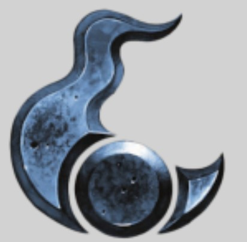
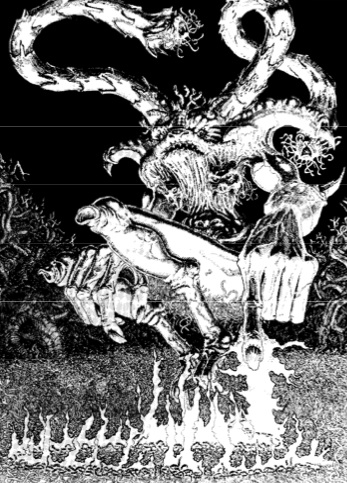
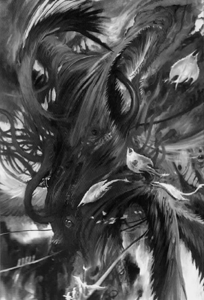
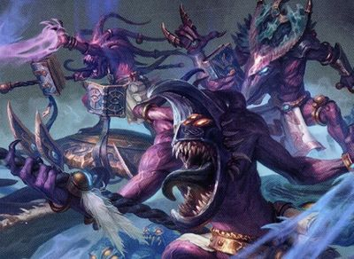
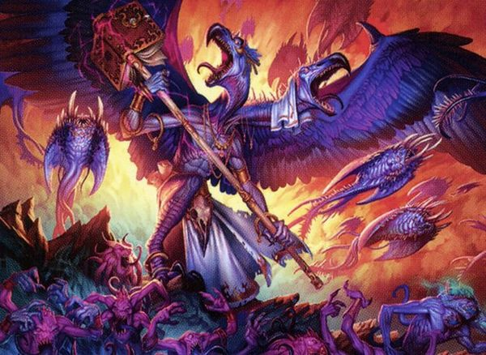
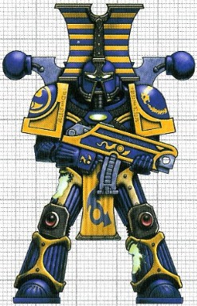
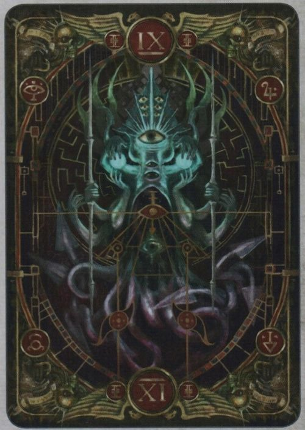

# 0508 奸奇 Tzeentch

精校状态：中文行文已逐段精校，部分术语仍为暂定

分类：组织 / 混沌 Chaos / 混沌诸神 Chaos Gods

原文来源：https://www.bilibili.com/opus/1076691671982276609

原作者：帝国神选罐头

原文时间：2025年06月10日 11:13

[返回分类目录](目录.md) · [全书目录](../../目录.md)

<!-- A0508-B0001 -->
**英文原文**

Tzeentch is a God of Chaos who represents the vitality and volatility of change. Tzeentch is closely associated with sorcery and magic, as well as dynamic mutation, and grand, convoluted scheming. The domains of history, destiny, intrigue and plots are his chief interests, and in pursuit of these aspects he listens to the dreams and hopes of all and watches their plans take form. He is not content to merely observe, however, and chooses to interfere in the skeins of fate in order to fulfill his own, unknowably complex schemes. Tzeentch is known by an endless multitude of names, but the chief titles he bears are the Changer of the Ways, the Master of Fortune, the Great Conspirator and the Architect of Fate.

<!-- /A0508-B0001 -->

<!-- A0508-B0002 -->

原译文

奸奇是一位混沌之神，代表着变化的活力和波动性。奸奇与巫术、魔法、动态突变和宏伟复杂的阴谋密切相关。历史、命运、阴谋和密谋是他的主要兴趣，在追求这些方面时，他倾听所有人的梦想和希望，看着他们的计划形成。然而，他并不满足于仅仅观察，而是选择干涉命运的蛛丝马迹，以实现他自己不可知的复杂计划。奸奇有无数的名字，但他拥有的主要头衔是万变之主、命运之主、大阴谋家和命运缔造者。

**校订译文**

奸奇是一位混沌之神，象征变化所蕴含的活力与无常。祂与巫术、魔法、不断发生的突变，以及庞大而错综复杂的阴谋密不可分。历史、命运、诡计与密谋尤其令祂着迷；为此，祂倾听众生的梦想与希望，注视他们的计划逐渐成形。然而，祂并不满足于旁观，还会拨弄命运的丝线，以实现自己复杂得难以揣测的谋划。奸奇的名号不计其数，其中最主要的是万变之主、命运之主、大阴谋家与命运缔造者。

<!-- /A0508-B0002 -->

<!-- A0508-B0003 图片 -->

<!-- A0508-B0004 -->

原译文

Tzeentch 奸奇

**校订译文**

Tzeentch 奸奇

<!-- /A0508-B0004 -->

<!-- A0508-B0005 -->
**英文原文**

Titles:Changer of Ways,the Dark Lord,Great Conspirator,Great Mutator,Great Sorcerer,Lord of the Fifteen Devils,Master of the Five Elements,Weaver of All Fates

<!-- /A0508-B0005 -->

<!-- A0508-B0006 -->

原译文

头衔：万变之主，黑暗领主，大阴谋家，大魔法师，十五恶魔之主，五元素之主，所有命运的编织者

**校订译文**

头衔：万变之主、黑暗领主、大阴谋家、大突变者、大魔法师、十五恶魔之主、五元素之主、万般命运的编织者

**校注：** 原译漏列 Great Mutator，补作“大突变者”，暂定。

<!-- /A0508-B0006 -->

<!-- A0508-B0007 -->
**英文原文**

Status:Active

<!-- /A0508-B0007 -->

<!-- A0508-B0008 -->

原译文

状态：活动

**校订译文**

状态：活跃

<!-- /A0508-B0008 -->

<!-- A0508-B0009 -->
**英文原文**

Type:Chaos God

<!-- /A0508-B0009 -->

<!-- A0508-B0010 -->

原译文

类型：混沌之神

**校订译文**

类型：混沌之神

<!-- /A0508-B0010 -->

<!-- A0508-B0011 -->
**英文原文**

Domains:Magic, Hope, Ambition,Scheming, Plotting, Change,Hubris, Magic, Mutation,Prophecy, Fate, Unpredictability

<!-- /A0508-B0011 -->

<!-- A0508-B0012 -->

原译文

领域：魔法、希望、野心、计划、阴谋、变化、傲慢、魔法、突变、预言、命运、不可预测性

**校订译文**

领域：魔法、希望、野心、谋划、阴谋、变化、傲慢、突变、预言、命运、不可预测性

**校注：** 英文领域列表重复列出 Magic，中文合并重复项。

<!-- /A0508-B0012 -->

<!-- A0508-B0013 -->
**英文原文**

Daemons:Lord of Change,Horror of Tzeentch,Flamer,Screamer

<!-- /A0508-B0013 -->

<!-- A0508-B0014 -->

原译文

恶魔：万变魔君、奸奇惧妖、火妖、尖啸者

**校订译文**

恶魔：诡变领主、奸奇惧妖、火妖、尖啸魔

<!-- /A0508-B0014 -->

<!-- A0508-B0015 -->
**英文原文**

Home:Impossible Fortress

<!-- /A0508-B0015 -->

<!-- A0508-B0016 -->

原译文

家园：虚妄堡垒

**校订译文**

家园：虚妄堡垒

<!-- /A0508-B0016 -->

<!-- A0508-B0017 -->
**英文原文**

Adjectives:Tzeentchian

<!-- /A0508-B0017 -->

<!-- A0508-B0018 -->

原译文

形容词：奸奇的

**校订译文**

形容词：奸奇的

<!-- /A0508-B0018 -->

<!-- A0508-B0019 -->
**英文原文**

Sacred Number:9

<!-- /A0508-B0019 -->

<!-- A0508-B0020 -->

原译文

圣数：9

**校订译文**

圣数：9

<!-- /A0508-B0020 -->

<!-- A0508-B0021 -->
**英文原文**

Symbols:Vulture,Raven,Fire

<!-- /A0508-B0021 -->

<!-- A0508-B0022 -->

原译文

象征：秃鹫、乌鸦、火

**校订译文**

象征：秃鹫、乌鸦、火

<!-- /A0508-B0022 -->

<!-- A0508-B0023 -->
**英文原文**

Enemies:Nurgle

<!-- /A0508-B0023 -->

<!-- A0508-B0024 -->

原译文

敌人：纳垢

**校订译文**

敌人：纳垢

<!-- /A0508-B0024 -->

<!-- A0508-B0025 -->
## Overview 概述

<!-- /A0508-B0025 -->

<!-- A0508-B0026 -->
**英文原文**

Tzeentch was created and sustained by the desire for change that is an essential part of nearly all mortal life; almost all species are aware of the concept of a better tomorrow, and any form of dreaming, imagining or resolution for change empowers the Chaos God. Like the other Chaos Gods, Tzeentch is strongly interested in humanity due to the power and drive of the human spirit and how that uniquely ties into his interests; no creature is more volatile or more ambitious. The spark of wishing for a different existence can turn into a fire that can change a country, a world, and perhaps ultimately an inferno that can alter the fate of galaxy itself; this is Tzeentch.

<!-- /A0508-B0026 -->

<!-- A0508-B0027 -->

原译文

奸奇是由对改变的渴望创造和维持的，而改变是几乎所有凡人生活的重要组成部分；几乎所有物种都意识到美好明天的概念，任何形式的梦想、想象或改变的决心都会赋予混沌之神力量。与其他混沌之神一样，奸奇对人类有着浓厚的兴趣，因为人类精神的力量和驱动力，以及这与他的利益有着独特的联系；没有哪种生物比它更不稳定，也没有哪种动物比它更有野心。渴望不同生活的火花可能会变成一场大火，改变一个国家、一个世界，甚至可能最终变成一个炼狱，改变银河系本身的命运；这就是奸奇。

**校订译文**

奸奇诞生于众生对改变的渴望，并以此维系自身。这种渴望是几乎所有凡俗生命不可分割的一部分：几乎每个物种都懂得憧憬更好的明天，而任何关于改变的梦想、想象或决心，都会为这位混沌之神增添力量。与其他混沌之神一样，奸奇对人类尤感兴趣；人类精神中强大的力量与进取心，恰好与祂的本性紧密相连，没有其他生物比人类更加反复无常、野心勃勃。渴望改变生活的一点火星，可以燃成改变一个国家乃至一个世界的大火，最终甚至化作足以改变整个银河命运的烈焰——这便是奸奇。

<!-- /A0508-B0027 -->

<!-- A0508-B0028 图片 -->

<!-- A0508-B0029 -->

原译文

The Changer of the Ways 万变之主

**校订译文**

The Changer of the Ways 万变之主

<!-- /A0508-B0029 -->

<!-- A0508-B0030 -->
**英文原文**

Magic is essentially an expression of change driven by will, and as such is the domain of the Changer of the Ways; Tzeentch is the greatest magician in all of the Warp. Many of those drawn to his auspices are sorcerers, while many others will be gifted with sorcerous powers as a reward for their actions. Tzeentch's daemonic aspects are essentially creatures of magic rather than any sort of conventionally understandable physicality.

<!-- /A0508-B0030 -->

<!-- A0508-B0031 -->

原译文

魔法本质上是由意志驱动的变化的表达，因此是万变之主的领域；奸奇是所有亚空间中最伟大的魔法师。许多被他吸引的人是巫师，而许多其他人将被赋予魔法力量作为对他们行为的奖励。奸奇的恶魔方面本质上是魔法的生物，而不是任何一种传统上可以理解的物质。

**校订译文**

魔法本质上是意志推动变化的表现，因此归于万变之主的领域；奸奇是整个亚空间中最强大的魔法师。投身祂麾下的人，许多本就是巫师，另有许多人因自己的作为而获赐巫术力量。奸奇的恶魔化身本质上是由魔法构成的生灵，无法用通常对物质形体的理解来衡量。

<!-- /A0508-B0031 -->

<!-- A0508-B0032 -->
**英文原文**

As well as an interest in magic, Tzeentch takes keen notice of all plots and plans. As the Great Conspirator, he is aware of all the dreams and plans of mortals. This is how Tzeentch is able to perceive the future; by being aware of all that is planned and all that may potentially happen, he can see all possible fates. Wishing to be involved with the fates of existence, Tzeentch directly and indirectly interferes in the fates of all things. His intentions are unknown, his schemes insanely complicated and his plans so extraordinarily long-term it may be that none other than he will ever see the end of all of them. It is often claimed that Tzeentch wishes to extend his power over the Materium, or to defeat his brother Gods; however, it is the nature of Tzeentch to care just as much about altering the fate of a single individual. Tzeentch's schemes also often appear contradictory to those who discern them; this is because only Tzeentch can understand his own interests and perceive the full possibilities of each action.

<!-- /A0508-B0032 -->

<!-- A0508-B0033 -->

原译文

除了对魔法的兴趣，奸奇还对所有的阴谋和计划都非常关注。作为大阴谋家，他知道凡人的所有梦想和计划。这就是奸奇感知未来的方式；通过了解所有计划中的事情和可能发生的事情，他可以看到所有可能的命运。为了参与存在的命运，奸奇直接或间接地干预了所有事物的命运。他的意图是未知的，他的计划极其复杂，他的计划非常长期，可能只有他自己才能看到所有这些计划的结束。人们常说，奸奇希望扩大他对物质界的权力，或击败他的兄弟诸神；然而，奸奇的天性是同样关心改变一个人的命运。奸奇的计划也经常与那些辨别它们的人相矛盾；这是因为只有奸奇才能理解自己的利益，并感知到每一个行动的全部可能性。

**校订译文**

除了魔法，奸奇也密切关注一切阴谋与计划。作为大阴谋家，祂知晓凡人的每一个梦想、每一项谋划；也正因此，祂能够窥见未来。祂知道所有已筹划之事与可能发生之事，从而看见一切可能的命运。奸奇渴望参与万物的命运，便以直接或间接的方式加以干涉。祂的意图无人知晓，谋划复杂得近乎疯狂，计划的时间跨度更是漫长到或许只有祂自己才能见证所有结局。人们常说，奸奇想要将自己的力量扩展至物质界，或击败其他混沌之神；但同样专注于改变某个个体的命运，也是祂的本性。在那些窥见部分计划的人看来，奸奇的谋划往往自相矛盾；这是因为只有祂自己才明白自身所求，并看清每一步行动所包含的全部可能。

<!-- /A0508-B0033 -->

<!-- A0508-B0034 -->
**英文原文**

Tzeentch has as many depictions as he has names. His skin is said to constantly shift and roll with faces, faces that leer and express mockery. As Tzeentch speaks, these faces repeat what he says, but with different inflections, or a word different here and there, or in fact provide running commentary or analysis on what he is saying; this makes it almost impossible to be certain what meaning Tzeentch is actually expressing. While these skin-faces come and go very quickly, Tzeentch's actual body is said to be constant; his head is low on his chest as if he had no neck and horns project from his shoulders. Raw magical energy surrounds him like smoke, with the faces and bodies of those whose fates he is considering manifesting before him in subtle and complex patterns.

<!-- /A0508-B0034 -->

<!-- A0508-B0035 -->

原译文

奸奇的描述和他的名字一样多。据说他的皮肤会随着脸而不断变化和滚动，脸上会露出斜视和嘲弄的表情。当奸奇说话时，这些面孔会重复他说的话，但会有不同的语调，或者在这里和那里使用不同的单词，或者实际上对他说的内容进行持续的评论或分析；这使得几乎不可能确定奸奇实际上表达了什么意思。虽然这些皮肤面孔来来去去很快，但据说奸奇的实际身体是恒定的；他的头低在胸前，好像没有脖子，角从肩膀上伸出来。原始的魔法能量像烟雾一样围绕着他，那些他正在考虑以微妙而复杂的模式展现其命运的人的脸和身体。

**校订译文**

关于奸奇外貌的描述，与祂的名号一样繁多。据说祂的皮肤不停翻涌变幻，浮现出一张张斜睨嘲笑的面孔。奸奇开口时，这些面孔会重复祂的话，却改变语调、替换个别词语，或不断对祂的言语作出评论与分析，让人几乎无从判断祂究竟想表达什么。皮肤上的面孔转瞬生灭，但据说祂的躯体本身保持不变：头颅低垂于胸前，仿佛没有脖颈，双角则从肩上伸出。纯粹的魔法能量如烟雾般缭绕其身；凡是祂正在思量其命运的人，面孔与身躯都会以微妙复杂的图景在祂面前显现。

<!-- /A0508-B0035 -->

<!-- A0508-B0036 -->
**英文原文**

Tzeentch's opposite force in the Chaos pantheon is Nurgle, who stands for despair and the acceptance of one's fate. Such a form of existence is anathema to Tzeentch, who derives power from the will to change one's destiny.

<!-- /A0508-B0036 -->

<!-- A0508-B0037 -->

原译文

奸奇在混沌万神殿中的对手是纳垢，祂代表绝望和接受自己的命运。这种存在形式是奸奇所憎恶的，他从改变命运的意志中获得力量。

**校订译文**

在混沌诸神之中，与奸奇相对的是纳垢，后者象征绝望与对命运的接受。奸奇从改变命运的意志中汲取力量，因此极其憎恶这种听天由命的生存方式。

<!-- /A0508-B0037 -->

<!-- A0508-B0038 -->
**英文原文**

Tzeentch is often visualised as the serpent which writhes and twists to represent constant change and this is mirrored in his symbol with curves and points to represent change and conclusion.

<!-- /A0508-B0038 -->

<!-- A0508-B0039 -->

原译文

奸奇经常被想象成一条蛇，它扭动和扭曲以代表不断的变化，这反映在他的符号中，曲线和点代表变化和结论。

**校订译文**

奸奇常被描绘成一条蜿蜒扭动的蛇，象征永不停息的变化。祂的徽记也体现了这一意象：曲线与尖端分别象征变化与终结。

<!-- /A0508-B0039 -->

<!-- A0508-B0040 -->
**英文原文**

There was once a time when Tzeentch ruled supreme over the Warp, his powers vastly superior to those of the Other Chaos Gods. However this state of affairs ended when the other Dark Gods temporarily set aside their differences and joined forces. During the final battle, Tzeentch faced certain defeat and cast a great spell upon himself. He crystalized his thoughts and body even as he was hurled against the Endless Mountains. Upon impact, his form was shattered into ten thousand pieces, each of which contained a fragment of his essence. These were flung across space and time, and while Tzeentch was forever weakened legend suggests this event marked the beginning of the use of sorcery in realspace.

<!-- /A0508-B0040 -->

<!-- A0508-B0041 -->

原译文

曾经有一段时间，奸奇统治着亚空间，他的力量远远大于其他混沌之神。然而，当其他黑暗诸神暂时搁置分歧并联合起来时，这种状态就结束了。在最后的战斗中，奸奇面临着一定的失败，并对自己施加了庞大的咒语。当他被抛向无尽山脉时，他的思想和身体都变得清晰起来。撞击后，他的身体被粉碎成一万块，每一块都包含着他本质的一部分。这些东西被抛向时空，虽然奸奇永远被削弱了，但传说这一事件标志着在现实空间中使用巫术的开始。

**校订译文**

曾有一段时期，奸奇独霸亚空间，力量远远凌驾于其他混沌之神。然而，其他黑暗诸神暂时搁置分歧、联手对付祂，终结了这一局面。在最后一战中，奸奇眼看败局已定，便对自身施下强大的法术；就在被抛向无尽山脉之际，祂将思想与躯体一并化为水晶。撞击使祂碎裂成一万块，每块都包含一片本质的碎屑，并散落于时空各处。奸奇的力量因此永久衰弱；传说中，这一事件也标志着巫术开始在现实空间中出现。

<!-- /A0508-B0041 -->

<!-- A0508-B0042 -->
**英文原文**

"Nine is the number most sacred to the changer of the ways. It is only upon tracing the ninth sigil that the runes of a change-scroll begin to glow, morphıng into their true nature. There are nine distinct rites an acolyte must master before he can unlock the secrets that will permit him to pierce the veil, a process that will allow a worthy aspirant to draw upon the boundless energies of the immaterium. To remain unbroken, a summoning symbol must contain nine sequential rings – each perfectly executed in a nine-fold process. Nine are the chants of the kairic cultists, and for casting, a coven of nine is by far the most powerful of groupings. Yet it is not mortal rites alone that obey the great sorcerer’s enneadic rules. The number nine can be found woven throughout the unfathomable and ever changing structures of the architect of fate’s own realm within the warp. The lords of change, the greatest servants of Tzeentch and commanders of his convocations, are ordered within nine levels of trust. All seek their master’s favour, and those in ascendency rule the nine fractal fortresses. Beneath each of those most exalted are nine hundred and nintety-nine legions, each divided into nine hosts. It is said that when daemons are slain, their immortal spirit appears within the impossıble fortress, arriving before their maker from one of the ever-shifting nine gates – there to be either reformed or re-absorbed by the will of Tzeentch."

<!-- /A0508-B0042 -->

<!-- A0508-B0043 -->

原译文

“对于万变之主来说，九是最神圣的数字。只有在绘制完第九个符文后，变化卷轴的符文才开始发光，变成它们的真实本相。一个追随者必须掌握九种不同的仪式，才能解开揭开面纱的秘密，这个过程将使一个有价值的追随者能够利用内在的无限能量。为了保持不间断，召唤符文必须包含九个连续的环 — 每个环都在九重过程中完美地执行。凯里克邪教徒要吟唱九次，而对于施法，九人的团体是迄今为止最强大的团体。然而，这不仅仅是凡人的仪式。遵循大魔法师的永恒规则。数字9可以在亚空间中命运领域的建筑师的深不可测和不断变化的结构中找到。万变魔君，奸奇最伟大的仆人和他召集的指挥官，被命令在九个信任级别内。所有人都看到了他们的主人的青睐，而那些占优势的人统治九个分形堡垒。在每一个最崇高的军团之下，都有九百九十九个军团，每个军团分为九个天军。据说，当恶魔被杀死时，他们的不朽灵魂会出现在虚妄堡垒中，从不断移动的九扇门中的一扇门到达他们的创造者面前——在那里，要么被改变，要么被奸奇的意志重新吸收。"

**校订译文**

“九是万变之主最神圣的数字。唯有绘出第九道符印，变化卷轴上的符文才开始发光，显现真正的形态。侍从必须掌握九种不同的仪式，才能解开穿透帷幕的奥秘；唯有如此，合格的求道者方能汲取非物质界无穷无尽的能量。召唤法阵若要保持完整，就必须包含九重依次相套的圆环，每一环都要经过九重步骤，且分毫无误。凯里克教徒的颂咒共有九种；施法时，以九人结成的法团最为强大。然而，遵循这位大魔法师九重法则的，并非只有凡人的仪式。在命运缔造者的亚空间领域中，那些深不可测、永远变化的建筑处处交织着数字九。诡变领主是奸奇最强大的仆从，也是祂麾下诸集会的统帅；祂们依受信任的程度分为九等，无不争取主人的宠爱。最受青睐者统治九座分形堡垒，每一位麾下都有九百九十九个军团，各军团又分为九支大军。据说，恶魔遭到杀戮后，不朽的灵魂会显现在虚妄堡垒，从九扇永远变换的门之一来到创造者面前；奸奇将依自己的意志，决定让它们重塑形体，还是重新吸收它们。”

**校注：** 修复 immaterium 误译“内在”、enneadic 误译“永恒”，并按句法还原九等统帅、每位统帅下辖 999 个军团的层级。此处为引文，不据其他段落所述编制擅自合并。

<!-- /A0508-B0043 -->

<!-- A0508-B0044 -->
**英文原文**

— Excerpt from Ahriman’s masterworks

<!-- /A0508-B0044 -->

<!-- A0508-B0045 -->

原译文

— 阿里曼的大师之作节选

**校订译文**

——摘自阿里曼的杰作

<!-- /A0508-B0045 -->

<!-- A0508-B0046 -->
## The Maze of Tzeentch 奸奇迷宫

<!-- /A0508-B0046 -->

<!-- A0508-B0047 -->
**英文原文**

The Maze of Tzeentch, also known as the Crystal Labyrinth, is Tzeentch's realm within the Warp. This maze is woven from the raw fabric of magic, threaded upon deceit and conspiracy. Of all the landscapes of the Warp, this domain is by far the most bizarre and incomprehensible, for its crystalline structures force travelers to view all nine dimensions simultaneously. This effect not only distorts the senses of any who intrude, but will also pull apart their purpose and aspirations and turns them to insanity and despair. Unlike the realms of the other Gods of Chaos, it is not defended by Daemonic warriors, allowing instead for any intruder to become inevitably lost within its confines.

<!-- /A0508-B0047 -->

<!-- A0508-B0048 -->

原译文

奸奇迷宫，也被称为水晶迷宫，是奸奇在亚空间内的领地。这个迷宫是由魔法的原始织物编织而成的，交织着欺骗和阴谋。在亚空间的所有景观中，这个领域是迄今为止最奇怪和最难以理解的，因为它的水晶结构迫使旅行者同时观察所有九个维度。这种影响不仅会扭曲任何闯入者的感官，还会撕裂他们的目的和愿望，使他们变得疯狂和绝望。与其他混沌诸神的领域不同，它不受恶魔战士的保护，而是允许任何入侵者不可避免地迷失在它的范围内。

**校订译文**

奸奇迷宫又称水晶迷宫，是奸奇在亚空间中的领域。它以原初魔法为经纬，交织着欺骗与阴谋。在亚空间的种种景观中，这片领域格外怪诞、难以理解；其中的水晶结构迫使行旅者同时看见全部九个维度。这不仅扭曲闯入者的感官，也会瓦解他们的意志与抱负，使其陷入疯狂和绝望。与其他混沌之神的领域不同，这里无需恶魔战士守卫，因为任何入侵者都注定会迷失其中。

<!-- /A0508-B0048 -->

<!-- A0508-B0049 图片 -->

<!-- A0508-B0050 -->

原译文

The Maze of Tzeentch 奸奇迷宫

**校订译文**

The Maze of Tzeentch 奸奇迷宫

<!-- /A0508-B0050 -->

<!-- A0508-B0051 -->
**英文原文**

Interchanging, shifting avenues made of pure crystals of every colour crisscross Tzeentch's realm. Hidden pathways built from lies and schemes lead out from the maze and infiltrate the dominions of other gods, binding together the fractious Realms of Chaos. Its glittering corridors reflect not only light but also hope, misery, dreams and nightmares. Driven by Tzeentch's unconscious schemes, the labyrinth constantly moves and rearranges. Those lost within the maze's reaches will wander for eternity with their minds shattered, their dreams broken upon the wheel of their own failed ambition.

<!-- /A0508-B0051 -->

<!-- A0508-B0052 -->

原译文

由各种颜色的纯水晶制成的相互交换、不断变化的道路纵横交错于奸奇的领域。由谎言和阴谋构建的隐藏路径从迷宫中引出，渗透到其他诸神的领地，将难以驾驭的混沌领域联系在一起。它闪闪发光的走廊不仅反映了光明，也反映了希望、痛苦、梦想和噩梦。在奸奇无意识计划的驱使下，迷宫不断地移动和重新排列。那些迷失在迷宫中的人将永远徘徊，他们的思想破碎，他们的梦想在自己失败的野心之轮上破灭。

**校订译文**

各色纯净水晶构成的大道纵横交错，不停变换位置。由谎言与阴谋铺成的隐秘路径从迷宫向外延伸，渗入其他神祇的疆域，将彼此纷争的混沌领域连接起来。闪亮的回廊映照的不只是光，还有希望、苦难、美梦与噩梦。在奸奇无意识的谋划推动下，迷宫不断移动、重组。迷失者将永远在其中徘徊，心智破碎，梦想则被自身失败野心的车轮碾得粉碎。

<!-- /A0508-B0052 -->

<!-- A0508-B0053 -->
**英文原文**

At the centre of the maze, hidden from those who have not the insane insight to find it, stands the Impossible Fortress. The architecture of the bastion is constantly replaced by new and ever more maddening spires, gates and walls. Doors and other entrance points yawn open like starving mouths, before clamping for eternity moments later, barring all access. Within the Fortress time and space does not exist at all and gravity shifts and changes, or disappears altogether. Lights of every colour, some even unknown in the real universe, spring from the shifting walls. For mortals, who are so locked in their physical ways, the fortress is impenetrable. Men are driven mad, while their bodies might implode or be pulled apart by the forces unleashed by Tzeentch's passing thoughts. Even immortal daemons cannot easily endure the twisted horror of the Impossible Fortress and only the Lords of Change can safely navigate its corridors, and tread the secret paths that lead to the inner sanctum of the fortress, the Hidden Library, where Tzeentch, the puppet master himself resides, eternally plotting.

<!-- /A0508-B0053 -->

<!-- A0508-B0054 -->

原译文

在迷宫的中心，隐藏着那些没有疯狂洞察力的人，矗立着虚妄堡垒。堡垒的建筑不断被新的、越来越令人抓狂的尖顶、大门和墙壁所取代。门和其他入口像饥饿的嘴一样张开，然后在片刻之后永远夹紧，禁止所有人进入。在要塞内，时间和空间根本不存在，重力会移动和变化，或者完全消失。各种颜色的光，有些甚至在现实宇宙中是未知的，从移动的墙壁上射出。对于那些被身体束缚的凡人来说，这座堡垒是无法穿越的。人会发疯，而他们的身体可能会内爆或被奸奇过去的思想所释放的力量撕裂。即使是不朽的恶魔也无法轻易忍受虚妄堡垒的扭曲恐怖，只有万变魔君才能安全地穿过它的走廊，踏上通往堡垒内部圣所 — 隐秘图书馆的秘密之路，傀儡之主奸奇本人就住在那里，永远在密谋。

**校订译文**

虚妄堡垒矗立于迷宫中心，唯有具备疯狂洞见者才能发现。堡垒的建筑不断被新的尖塔、门户和墙垣替代，模样愈发令人发狂。门扉与其他入口如饥饿的巨口般张开，片刻后却可能永远闭合，阻绝一切通行。堡垒内根本不存在时间与空间，重力不断转移、变化，甚至彻底消失。变动的墙壁迸出各种光芒，其中有些颜色甚至不为现实宇宙所知。凡人受肉身形态所限，根本无法安然穿行其间。他们会陷入疯狂，身体也可能因奸奇一闪而过的念头所释放的力量而向内崩塌，或被撕得粉碎。即使不朽的恶魔，也难以承受虚妄堡垒中扭曲的恐怖；只有诡变领主能够安全穿越回廊，循着秘密道路抵达堡垒最深处的圣所——隐秘图书馆。操纵一切的奸奇就栖居于此，永无止境地谋划。

<!-- /A0508-B0054 -->

<!-- A0508-B0055 -->
**英文原文**

Another location within Tzeentch's realm is the Library of Lies, where all lies told in the galaxy are recorded and catalogued.

<!-- /A0508-B0055 -->

<!-- A0508-B0056 -->

原译文

奸奇领地内的另一个地方是谎言图书馆，在那里记录和编纂了银河系中所有的谎言。

**校订译文**

奸奇的领域中还有一座谎言图书馆，银河中曾被说出的每一句谎言都在那里记录归档。

<!-- /A0508-B0056 -->

<!-- A0508-B0057 -->
## Followers of Tzeentch 奸奇追随者

<!-- /A0508-B0057 -->

<!-- A0508-B0058 -->
**英文原文**

The mortal champions of Tzeentch are especially dangerous, as they often wield awesome sorcerous power on top of their considerable physical prowess. Professors, philosophers, scientists, intellectuals, and artists also swell Tzeentch’s ranks, for as much as the Changer of Ways embraces magic and guile, he also loves knowledge in all its forms. Predictably, Tzeentch finds those who investigate forbidden or taboo subjects particularly interesting, as individuals willing to defy convention and perhaps even ethics and the law to pursue their intellectual ambitions often make willing and effective servants. Some thinkers who reach a stumbling block in their scholarly pursuits can become obsessed with a particular problem or question. These scholars may try any number of approaches to find answers, but no experiment, no amount of research or consultation with experts, and no amount of sweat and elbow grease brings them closer to a solution. These obsessed scholars are particularly vulnerable to Tzeentch’s temptations. While some may deliberately seek the assistance of the Master of Fate, many more unwittingly fall into Tzeentch’s service after accepting help from an insightful but mysterious new colleague or after gazing too long at a classified or forbidden text that somehow finds its way onto their desk.

<!-- /A0508-B0058 -->

<!-- A0508-B0059 -->

原译文

奸奇的凡人冠军尤其危险，因为他们经常在相当强大的身体力量之外施展令人敬畏的魔法力量。专家、哲学家、科学家、知识分子和艺术家也扩大了奸奇的队伍，因为尽管万变之主拥抱魔法和诡计，但他也热爱各种形式的知识。可以预见的是，奸奇发现那些调查被禁止或禁忌话题的人特别有趣，因为那些愿意违反惯例甚至道德和法律来追求自己的知识野心的人往往会成为积极且有效的仆人。一些在学术追求中遇到绊脚石的思考者可能会痴迷于一个特定的问题或疑问。这些学者可能会尝试任何方法来寻找答案，但没有实验，没有多少研究或咨询专家，也没有多少汗水和推动能让他们更接近解决方案。这些痴迷的学者特别容易受到奸奇的诱惑。虽然有些人可能会故意寻求命运之主的帮助，但更多的人在接受了一位富有洞察力但神秘的新同事的帮助后，或者在长时间凝视了一篇不知何故出现在他们桌子上的机密或违禁文本后，不知不觉地加入了奸奇的事业。

**校订译文**

奸奇的凡人勇士尤其危险：他们不仅体魄强健，还往往掌握可怕的巫术力量。教授、哲学家、科学家、知识分子与艺术家也不断加入其麾下，因为万变之主热爱魔法和诡计，也同样热爱一切形式的知识。不难想见，奸奇对研究禁忌课题的人格外感兴趣；那些为满足求知野心而甘愿打破常规、甚至违背伦理与法律的人，往往乐于为祂效力，也能成为得力的仆从。一些思想者在学术探索中遭遇瓶颈后，会对某个难题走火入魔。他们穷尽各种方法，却无论怎样实验、研究、请教专家，或付出多少汗水与苦功，都无法向答案再靠近一步。这类痴迷的学者尤其容易受到奸奇诱惑。有些人会主动向命运之主求助；更多人则是在接受某位眼光敏锐却身份神秘的新同僚的帮助后，或因反复研读一份不知为何出现在桌上的机密或禁忌文献，不知不觉间沦为奸奇的仆从。

<!-- /A0508-B0059 -->

<!-- A0508-B0060 -->
## Daemons of Tzeentch 奸奇恶魔

<!-- /A0508-B0060 -->

<!-- A0508-B0061 -->
### The Scintillating Legions 闪耀军团

原题：The Scintillating Legions 闪烁军团

**校注：** 采用 GW-09 中文第 12 页“闪耀军团”、GW-10 英文第 13 页 Scintillating Legion 的对应译名。这里为同名恶魔军团的复数总称；原稿“闪烁军团”。同份 GW-09 第36页出现“闪烁军团”异译，但所配 GW-10 第35页未列对应分组，本稿采用已明确核对整名的第12／13页译法。

<!-- /A0508-B0061 -->

<!-- A0508-B0062 -->
**英文原文**

The Daemonic armies of Tzeentch are known as the Scintillating Legions. These hordes go to war in bizarre carnivals of magical violence, obliterating and mutating foes with sorcererous magic. Unlike the forces of Khorne or Nurgle, the Tzeentchian Legions are often in flux, shifting composition or altering tactics to better serve their master. There are several types of Tzeentchian Legions, such as Conflagration Legion which is built around a force of Flamers or a Legions Anarchus, unpredictable formations used in random and unexpected incursions. The Veiled Legions are the most mysterious of all of Tzeentch's forces; they rarely appear and when they do are known to slink away unseen after their plan's culmination.

<!-- /A0508-B0062 -->

<!-- A0508-B0063 -->

原译文

奸奇的恶魔军队被称为闪烁军团。这些部落在奇异的暴虐魔法狂欢中战斗，用巫术魔法消灭和变异敌人。与恐虐或纳垢的部队不同，奸奇的军团经常处于动荡之中，改变组成或改变战术以更好地为他们的主人服务。奸奇的军团有几种类型，例如围绕火焰部队或无序军团建立的火灾军团，这些不可预测的编队用于随机和意外的入侵。帷幕军团是奸奇所有部队中最神秘的；他们很少出现，当他们出现时，他们会在计划达到顶峰后偷偷溜走。

**校订译文**

奸奇的恶魔军队被称为闪耀军团。它们以诡异的魔法暴力狂欢投入战斗，用巫术摧毁敌人，或使敌人发生突变。与恐虐、纳垢的军队不同，奸奇军团经常改变编制与战术，以更好地为主人效劳。这些军团有多种类型，例如以火妖为核心的烈焰军团，以及用于在随机时刻、意外地点发动入侵、行动难以预测的无序军团。帷幕军团则是奸奇所有军队中最神秘的一类：它们极少现身，即使出现，也会在计划完成后悄然隐去。

**校注：** 原译把两种军团误合成一种；Conflagration Legion 暂定烈焰军团，Legions Anarchus 沿无序军团。

<!-- /A0508-B0063 -->

<!-- A0508-B0064 图片 -->

<!-- A0508-B0065 -->

原译文

Heralds of Tzeentch 奸奇传令官

**校订译文**

Heralds of Tzeentch 奸奇传令官

<!-- /A0508-B0065 -->

<!-- A0508-B0066 -->
**英文原文**

Each of the innumerable Scintillating Legions is commanded by a Lord of Change who operates with a high degree of independence. Each of these legions is divided into nine hosts, each commanded by a Daemon Prince or Herald of Tzeentch. Fitting of the Changer of Ways, these commanders endlessly plot against one another for Tzeentch's favour. The nine most favoured Legions are granted one of the Fractal Fortresses of the Crystal Labyrinth of Tzeentch.

<!-- /A0508-B0066 -->

<!-- A0508-B0067 -->

原译文

无数闪烁军团中的每一个都由一位万变魔君指挥，以高度的独立性运作。这些军团中的每一个都分为九个天军，每个天军都由一位恶魔王子或奸奇传令官指挥。这些指挥官为了奸奇的利益，无休止地相互密谋。九个最受欢迎的军团被授予了奸奇水晶迷宫的分形堡垒之一。

**校订译文**

每个闪耀军团都由一位诡变领主统率，并享有很大的自主权。军团下分九支大军，各由一位恶魔亲王或奸奇传令官指挥。正如万变之主的本性，这些统帅为了争取奸奇的青睐，始终相互算计。最受宠爱的九个军团，各获赐水晶迷宫中的一座分形堡垒。

<!-- /A0508-B0067 -->

<!-- A0508-B0068 -->
### Tzeentchian Daemons 奸奇恶魔

<!-- /A0508-B0068 -->

<!-- A0508-B0069 -->
**英文原文**

The Daemons of Tzeentch are inherently magical creatures, even more so than the other Daemons of Chaos; they appear ephemeral, transparent, or as if made of light. Their very presence can alter the rules of reality, and they can leave trails of multi-coloured fire and mist behind them as they move.

<!-- /A0508-B0069 -->

<!-- A0508-B0070 -->

原译文

奸奇的恶魔天生就是魔法的生物，甚至比混沌的其他恶魔更神奇；它们看起来是短暂的、透明的，或者像是由光组成的。它们的存在可以改变现实的规则，当它们移动时，它们可以在身后留下多色的火焰和薄雾。

**校订译文**

奸奇恶魔天生便是魔法生灵，其魔法本质甚至比其他混沌恶魔更为鲜明。它们显得虚幻、透明，或仿佛完全由光构成。仅仅是它们的存在，就足以改变现实法则；移动时，它们身后会拖曳着五彩火焰与迷雾。

<!-- /A0508-B0070 -->

<!-- A0508-B0071 图片 -->

<!-- A0508-B0072 -->

原译文

Lord of Change 万变魔君

**校订译文**

Lord of Change 诡变领主

<!-- /A0508-B0072 -->

<!-- A0508-B0073 -->

原译文

Lords of Change 万变魔君

**校订译文**

Lords of Change 诡变领主

<!-- /A0508-B0073 -->

<!-- A0508-B0074 -->
**英文原文**

The Greater Daemon of Tzeentch. Typically an avian-like winged humanoid Daemon of vast intelligence and massive sorcerous and psychic power, although less so in physical strength - at least compared to other Greater Daemons.

<!-- /A0508-B0074 -->

<!-- A0508-B0075 -->

原译文

奸奇的大魔。通常是一种类似鸟类的有翼类人恶魔，拥有庞大的智慧和巨大的魔法和灵能力量，尽管在身体力量上不如其他大魔。

**校订译文**

奸奇的大魔，通常呈现为长着翅膀的鸟形人身恶魔。它们智慧超群，拥有极其强大的巫术与灵能力量；肉身力量则相对逊色，至少与其他大魔相比是如此。

<!-- /A0508-B0075 -->

<!-- A0508-B0076 -->

原译文

Horrors 惧妖

**校订译文**

Horrors 惧妖

<!-- /A0508-B0076 -->

<!-- A0508-B0077 -->
**英文原文**

The common Daemons of Tzeentch, generally manifesting as an ever-shifting mass of flesh and limbs with numerous orifices for launching fire.

<!-- /A0508-B0077 -->

<!-- A0508-B0078 -->

原译文

奸奇常见的恶魔，通常表现为不断移动的肉和四肢，有许多发射火焰的孔口。

**校订译文**

奸奇最常见的恶魔，通常显现为一团不断变形的血肉与肢体，遍布可喷射火焰的孔洞。

<!-- /A0508-B0078 -->

<!-- A0508-B0079 -->

原译文

Flamers 火妖

**校订译文**

Flamers 火妖

<!-- /A0508-B0079 -->

<!-- A0508-B0080 -->
**英文原文**

Daemonic servants of Tzeentch with numerous gaping maws that produce the searing flames which give these Daemons their name.

<!-- /A0508-B0080 -->

<!-- A0508-B0081 -->

原译文

奸奇的恶魔仆人，有无数张张开的嘴，产生灼热的火焰，这些恶魔因此而得名。

**校订译文**

奸奇的恶魔仆从，身上长着无数张开的巨口，喷吐灼热烈焰，“火妖”之名正由此而来。

<!-- /A0508-B0081 -->

<!-- A0508-B0082 -->

原译文

Screamers 尖啸者

**校订译文**

Screamers 尖啸魔

<!-- /A0508-B0082 -->

<!-- A0508-B0083 -->
**英文原文**

Ray-like creatures that swoop down on foes and cut them apart with their sharp claws before retreating and charging again.

<!-- /A0508-B0083 -->

<!-- A0508-B0084 -->

原译文

像鳐鱼一样的生物，俯冲下来攻击敌人，用锋利的爪子把他们分解，然后撤退并再次冲锋。

**校订译文**

形似鳐鱼的生物，会俯冲向敌人，以利爪将其撕碎，随后退开，再度发动冲锋。

<!-- /A0508-B0084 -->

<!-- A0508-B0085 -->

原译文

Discs of Tzeentch 奸奇飞盘

**校订译文**

Discs of Tzeentch 奸奇飞盘

<!-- /A0508-B0085 -->

<!-- A0508-B0086 -->
**英文原文**

A meld of magic, metal, and Screamer, often used as a mount for a mortal or Daemonic champion.

<!-- /A0508-B0086 -->

<!-- A0508-B0087 -->

原译文

魔法、金属和尖啸者的混合物，通常用作凡人或恶魔冠军的坐骑。

**校订译文**

由魔法、金属与尖啸魔融合而成，常被凡人或恶魔勇士用作坐骑。

<!-- /A0508-B0087 -->

<!-- A0508-B0088 -->
### Daemon Engines of Tzeentch 奸奇恶魔引擎

<!-- /A0508-B0088 -->

<!-- A0508-B0089 -->
**英文原文**

A Daemon Engine is a part-technological, part-daemonic vehicle, those dedicated to Tzeentch include -

<!-- /A0508-B0089 -->

<!-- A0508-B0090 -->

原译文

恶魔引擎是一种半科技半恶魔的载具，专门用于奸奇的包括-

**校订译文**

恶魔引擎是融合科技与恶魔力量的载具。奉献给奸奇的类型包括：

<!-- /A0508-B0090 -->

<!-- A0508-B0091 -->

原译文

Fire Lord 火焰领主

**校订译文**

Fire Lord 火焰领主

<!-- /A0508-B0091 -->

<!-- A0508-B0092 -->

原译文

Silver Tower of Tzeentch 奸奇银塔

**校订译文**

Silver Tower of Tzeentch 奸奇银塔

<!-- /A0508-B0092 -->

<!-- A0508-B0093 -->

原译文

Doom Wing 末日之翼

**校订译文**

Doom Wing 末日之翼

<!-- /A0508-B0093 -->

<!-- A0508-B0094 -->

原译文

Warp Palace of Tzeentch 奸奇亚空间宫殿

**校订译文**

Warp Palace of Tzeentch 奸奇亚空间宫殿

<!-- /A0508-B0094 -->

<!-- A0508-B0095 -->
## Forces dedicated to Tzeentch 献身奸奇的部队

<!-- /A0508-B0095 -->

<!-- A0508-B0096 -->
### Chaos Space Marines 混沌星际战士

<!-- /A0508-B0096 -->

<!-- A0508-B0097 图片 -->

<!-- A0508-B0098 -->

原译文

Thousand Sons marine 千子战士

**校订译文**

Thousand Sons marine 千子战士

<!-- /A0508-B0098 -->

<!-- A0508-B0099 -->

原译文

Thousand Sons Legion. 千子军团

**校订译文**

Thousand Sons Legion. 千子军团

<!-- /A0508-B0099 -->

<!-- A0508-B0100 -->

原译文

Blades Of Magnus 马格努斯之刃

**校订译文**

Blades Of Magnus 马格努斯之刃

<!-- /A0508-B0100 -->

<!-- A0508-B0101 -->

原译文

Brotherhood of Dust 尘埃兄弟会

**校订译文**

Brotherhood of Dust 尘埃兄弟会

<!-- /A0508-B0101 -->

<!-- A0508-B0102 -->

原译文

Brothers of Retaliation 复仇兄弟

**校订译文**

Brothers of Retaliation 复仇兄弟

<!-- /A0508-B0102 -->

<!-- A0508-B0103 -->

原译文

Crimson Sons 深红之子

**校订译文**

Crimson Sons 深红之子

<!-- /A0508-B0103 -->

<!-- A0508-B0104 -->

原译文

Crystal Harbingers 水晶先驱

**校订译文**

Crystal Harbingers 水晶先驱

<!-- /A0508-B0104 -->

<!-- A0508-B0105 -->

原译文

Grand Order of Hermetic Blades 奥秘之刃大密会

**校订译文**

Grand Order of Hermetic Blades 奥秘之刃大密会

<!-- /A0508-B0105 -->

<!-- A0508-B0106 -->

原译文

Mind Eaters 思维吞噬者

**校订译文**

Mind Eaters 思维吞噬者

<!-- /A0508-B0106 -->

<!-- A0508-B0107 -->

原译文

Silver Sons 银色之子

**校订译文**

Silver Sons 银色之子

<!-- /A0508-B0107 -->

<!-- A0508-B0108 -->

原译文

Kha'Sherhan 卡哈’谢罕

**校订译文**

Kha'Sherhan 卡哈’谢罕

<!-- /A0508-B0108 -->

<!-- A0508-B0109 -->

原译文

Prism of Fate 命运棱镜

**校订译文**

Prism of Fate 命运棱镜

<!-- /A0508-B0109 -->

<!-- A0508-B0110 -->

原译文

Prodigal Sons 挥霍之子

**校订译文**

Prodigal Sons 浪子

**校注：** Prodigal 此处为战帮专名，暂定“浪子”（原稿“挥霍之子”）；保留英文以便后续核实。

<!-- /A0508-B0110 -->

<!-- A0508-B0111 -->

原译文

Reflected Ones 倒影之人

**校订译文**

Reflected Ones 倒影之人

<!-- /A0508-B0111 -->

<!-- A0508-B0112 -->

原译文

Lorehost of Apoketh 阿波凯斯传说承载者

**校订译文**

Lorehost of Apoketh 阿波凯斯秘学大军

**校注：** Lorehost 中 host 为军队，非“承载者”；暂定“阿波凯斯秘学大军”，原稿“阿波凯斯传说承载者”。

<!-- /A0508-B0112 -->

<!-- A0508-B0113 -->

原译文

Magisters of the Burning Amethyst 燃烧紫晶法师

**校订译文**

Magisters of the Burning Amethyst 燃烧紫晶法师

<!-- /A0508-B0113 -->

<!-- A0508-B0114 -->

原译文

Masters of the Crystal Serpent 水晶毒蛇之主

**校订译文**

Masters of the Crystal Serpent 水晶毒蛇之主

<!-- /A0508-B0114 -->

<!-- A0508-B0115 -->

原译文

Six-Cursed 六重诅咒

**校订译文**

Six-Cursed 六重诅咒

<!-- /A0508-B0115 -->

<!-- A0508-B0116 -->

原译文

Sectai Prosperine 繁荣教派

**校订译文**

Sectai Prosperine 普罗斯佩罗教派

**校注：** Prosperine 指向普罗斯佩罗，原译“繁荣教派”按普通词释义失当；暂定“普罗斯佩罗教派”。

<!-- /A0508-B0116 -->

<!-- A0508-B0117 -->

原译文

Sect of the Red Echo 鲜红回响教派

**校订译文**

Sect of the Red Echo 鲜红回响教派

<!-- /A0508-B0117 -->

<!-- A0508-B0118 -->

原译文

Seth's Chosen 赛特神选

**校订译文**

Seth's Chosen 赛特神选

<!-- /A0508-B0118 -->

<!-- A0508-B0119 -->

原译文

Thralls of Magnus 马格努斯之奴

**校订译文**

Thralls of Magnus 马格努斯之奴

<!-- /A0508-B0119 -->

<!-- A0508-B0120 -->

原译文

Tizcan Host 提兹卡天军

**校订译文**

Tizcan Host 提兹卡天军

<!-- /A0508-B0120 -->

<!-- A0508-B0121 -->

原译文

Warband of Sektoth 塞克托斯战帮

**校订译文**

Warband of Sektoth 塞克托斯战帮

<!-- /A0508-B0121 -->

<!-- A0508-B0122 -->

原译文

Warp Gheists 亚空间旅客

**校订译文**

Warp Gheists 亚空间幽魂

**校注：** Gheists 为幽魂意象，原译“旅客”缺乏词义依据；暂定“亚空间幽魂”。

<!-- /A0508-B0122 -->

<!-- A0508-B0123 -->

原译文

Scions of the Great Architect 大创造者之裔

**校订译文**

Scions of the Great Architect 大建筑师之裔

<!-- /A0508-B0123 -->

<!-- A0508-B0124 -->

原译文

Masters of Magnus' Will 马格努斯意志之主

**校订译文**

Masters of Magnus' Will 马格努斯意志之主

<!-- /A0508-B0124 -->

<!-- A0508-B0125 -->

原译文

Xenash Capensis' Rubric Phalanx 克萨纳什·卡彭西斯的红字方阵

**校订译文**

Xenash Capensis' Rubric Phalanx 克萨纳什·卡彭西斯的红字方阵

<!-- /A0508-B0125 -->

<!-- A0508-B0126 -->

原译文

Changebringers 变革使者

**校订译文**

Changebringers 变革使者

<!-- /A0508-B0126 -->

<!-- A0508-B0127 -->

原译文

Coven of Nine 九人集会

**校订译文**

Coven of Nine 九人集会

<!-- /A0508-B0127 -->

<!-- A0508-B0128 -->

原译文

Sons of the Cyclops 独眼巨人之子

**校订译文**

Sons of the Cyclops 独眼巨人之子

<!-- /A0508-B0128 -->

<!-- A0508-B0129 -->

原译文

Knights of the Silver Tower 银塔骑士

**校订译文**

Knights of the Silver Tower 银塔骑士

<!-- /A0508-B0129 -->

<!-- A0508-B0130 -->

原译文

Oracles of Change 变革神谕

**校订译文**

Oracles of Change 变革神谕

<!-- /A0508-B0130 -->

<!-- A0508-B0131 -->

原译文

The Scourged 天灾

**校订译文**

The Scourged 天灾

<!-- /A0508-B0131 -->

<!-- A0508-B0132 -->

原译文

Eagles Iridescent 彩虹之鹰

**校订译文**

Eagles Iridescent 彩虹之鹰

<!-- /A0508-B0132 -->

<!-- A0508-B0133 -->

原译文

Warriors Resplendent 辉煌战士

**校订译文**

Warriors Resplendent 辉煌战士

<!-- /A0508-B0133 -->

<!-- A0508-B0134 -->
### Renegades and Cults 叛徒和教派

<!-- /A0508-B0134 -->

<!-- A0508-B0135 -->

原译文

The Menagerie 兽群

**校订译文**

The Menagerie 兽群

<!-- /A0508-B0135 -->

<!-- A0508-B0136 -->

原译文

Prospero Spireguard 普罗斯佩罗尖塔守卫

**校订译文**

Prospero Spireguard 普罗斯佩罗尖塔守卫

<!-- /A0508-B0136 -->

<!-- A0508-B0137 -->

原译文

Thrall Wizards 奴隶巫师

**校订译文**

Thrall Wizards 奴隶巫师

<!-- /A0508-B0137 -->

<!-- A0508-B0138 -->

原译文

The Nine Eyes 九眼

**校订译文**

The Nine Eyes 九眼

<!-- /A0508-B0138 -->

<!-- A0508-B0139 -->

原译文

The Q'Sal Magister Immaterials 寇塞非物质法师

**校订译文**

The Q'Sal Magister Immaterials 寇塞非物质法师

<!-- /A0508-B0139 -->

<!-- A0508-B0140 -->

原译文

Children of the Blessed Light 圣光之子

**校订译文**

Children of the Blessed Light 圣光之子

<!-- /A0508-B0140 -->

<!-- A0508-B0141 -->

原译文

Cult of the Severed Tongue 割舌教派

**校订译文**

Cult of the Severed Tongue 割舌教派

<!-- /A0508-B0141 -->

<!-- A0508-B0142 -->

原译文

Cult of the Ebon Flame 乌木火焰教派

**校订译文**

Cult of the Ebon Flame 乌木火焰教派

<!-- /A0508-B0142 -->

<!-- A0508-B0143 -->

原译文

Cult of the Lost Spiral 迷失螺旋教派

**校订译文**

Cult of the Lost Spiral 迷失螺旋教派

<!-- /A0508-B0143 -->

<!-- A0508-B0144 -->

原译文

Followers of the Red Monarch 赤红君王的追随者

**校订译文**

Followers of the Red Monarch 赤红君王的追随者

<!-- /A0508-B0144 -->

<!-- A0508-B0145 -->

原译文

Cult of Chalkonides 铜裔教派

**校订译文**

Cult of Chalkonides 铜裔教派

<!-- /A0508-B0145 -->

<!-- A0508-B0146 -->

原译文

Cyclopeans 独眼

**校订译文**

Cyclopeans 独眼

<!-- /A0508-B0146 -->

<!-- A0508-B0147 -->

原译文

Kardone Changeseekers 卡拉顿变革寻求者

**校订译文**

Kardone Changeseekers 卡拉顿变革寻求者

<!-- /A0508-B0147 -->

<!-- A0508-B0148 -->

原译文

The Touched 触碰

**校订译文**

The Touched 受触者

**校注：** The Touched 为指人的名词化称号，原译“触碰”未表达所指，暂定“受触者”。

<!-- /A0508-B0148 -->

<!-- A0508-B0149 -->

原译文

Tzaangors 奸角兽

**校订译文**

Tzaangors 奸角兽

<!-- /A0508-B0149 -->

<!-- A0508-B0150 -->

原译文

Tzaangor Shaman 奸角兽萨满

**校订译文**

Tzaangor Shaman 奸角兽萨满

<!-- /A0508-B0150 -->

<!-- A0508-B0151 -->

原译文

Tzaangor Enlightened 奸角兽启迪者

**校订译文**

Tzaangor Enlightened 奸角兽开悟者

**校注：** 采用 GW-09 第36页／GW-10 第35页官译奸角兽开悟者；原稿奸角兽启迪者。

<!-- /A0508-B0151 -->

<!-- A0508-B0152 -->
### Daemonic Warbands 恶魔战帮

<!-- /A0508-B0152 -->

<!-- A0508-B0153 -->

原译文

The Burning Paradox 燃烧悖论

**校订译文**

The Burning Paradox 燃烧悖论

<!-- /A0508-B0153 -->

<!-- A0508-B0154 -->

原译文

The Conflagral Swarm 燃灾集群

**校订译文**

The Conflagral Swarm 燃灾集群

<!-- /A0508-B0154 -->

<!-- A0508-B0155 -->

原译文

Great Changehost 伟大变革天军

**校订译文**

Great Changehost 伟大变革天军

<!-- /A0508-B0155 -->

<!-- A0508-B0156 -->

原译文

Pyroclastic Conclave 火山岩秘会

**校订译文**

Pyroclastic Conclave 火山碎屑秘会

**校注：** Pyroclastic 指火山碎屑，区别一般火山岩；专名暂定。

<!-- /A0508-B0156 -->

<!-- A0508-B0157 -->

原译文

The Adulant Host of Hazriah the Believer 信仰者哈兹里亚的阿杜兰天军

**校订译文**

The Adulant Host of Hazriah the Believer 信仰者哈兹里亚的颂扬大军

**校注：** Adulant 为颂扬、奉承之义，原稿“阿杜兰”被误当作人名；暂定“颂扬大军”。

<!-- /A0508-B0157 -->

<!-- A0508-B0158 -->
### Knight Houses 骑士家族

<!-- /A0508-B0158 -->

<!-- A0508-B0159 -->

原译文

House Arcanus 阿卡努斯家族

**校订译文**

House Arcanus 阿卡努斯家族

<!-- /A0508-B0159 -->

<!-- A0508-B0160 -->

原译文

House Chromatic 克罗马蒂克家族

**校订译文**

House Chromatic 克罗马蒂克家族

<!-- /A0508-B0160 -->

<!-- A0508-B0161 -->

原译文

House Manticos 曼提科斯家族

**校订译文**

House Manticos 曼提科斯家族

<!-- /A0508-B0161 -->

<!-- A0508-B0162 -->

原译文

House Gurgeon 朱尔金家族

**校订译文**

House Gurgeon 朱尔金家族

<!-- /A0508-B0162 -->

<!-- A0508-B0163 -->

原译文

House Mutica 穆蒂卡家族

**校订译文**

House Mutica 穆蒂卡家族

<!-- /A0508-B0163 -->

<!-- A0508-B0164 -->
### Titan Legions 泰坦军团

<!-- /A0508-B0164 -->

<!-- A0508-B0165 -->

原译文

Legio Incurvos 扭曲军团

**校订译文**

Legio Incurvos 扭曲军团

<!-- /A0508-B0165 -->

<!-- A0508-B0166 -->

原译文

Legio Inardescus 秘火军团

**校订译文**

Legio Inardescus 秘火军团

<!-- /A0508-B0166 -->

<!-- A0508-B0167 -->

原译文

Burning Stars 燃烧星辰

**校订译文**

Burning Stars 燃烧星辰

<!-- /A0508-B0167 -->

<!-- A0508-B0168 -->
## Notable Servants of Tzeentch 著名奸奇之仆

<!-- /A0508-B0168 -->

<!-- A0508-B0169 -->
**英文原文**

Magnus the Red — Primarch of the Thousand Sons, now a powerful Daemon Prince.

<!-- /A0508-B0169 -->

<!-- A0508-B0170 -->

原译文

赤红之马格努斯 — 千子原体，现在是一位强大的恶魔王子。

**校订译文**

红魔马格努斯——千子的原体，如今是一位强大的恶魔亲王。

<!-- /A0508-B0170 -->

<!-- A0508-B0171 -->
**英文原文**

Kairos Fateweaver — the Oracle of Tzeentch.

<!-- /A0508-B0171 -->

<!-- A0508-B0172 -->

原译文

卡洛斯·织命者 — 奸奇的先知。

**校订译文**

凯洛斯·织命者——奸奇的神谕者。

<!-- /A0508-B0172 -->

<!-- A0508-B0173 -->
**英文原文**

Ghargatuloth — the "Prince of a Thousand Faces," Greater Daemon of Tzeentch

<!-- /A0508-B0173 -->

<!-- A0508-B0174 -->

原译文

迦戈图罗斯 — “千面王子”，奸奇的大魔

**校订译文**

迦戈图罗斯——“千面亲王”，奸奇大魔。

<!-- /A0508-B0174 -->

<!-- A0508-B0175 -->
**英文原文**

Blue Scribes — A pair of Blue Horrors of Tzeentch.

<!-- /A0508-B0175 -->

<!-- A0508-B0176 -->

原译文

蓝色文士 — 一对奸奇的蓝色惧妖。

**校订译文**

蓝书记——一对奸奇的蓝色惧妖。

<!-- /A0508-B0176 -->

<!-- A0508-B0177 -->
**英文原文**

Ahzek Ahriman — One of the most powerful Sorcerers of the Thousand Sons.

<!-- /A0508-B0177 -->

<!-- A0508-B0178 -->

原译文

阿扎克·阿里曼 — 千子中最强大的巫师之一。

**校订译文**

阿扎克·阿里曼 — 千子中最强大的巫师之一。

<!-- /A0508-B0178 -->

<!-- A0508-B0179 -->
**英文原文**

Ti'Lath — Daemon Prince

<!-- /A0508-B0179 -->

<!-- A0508-B0180 -->

原译文

提’拉特 — 恶魔王子

**校订译文**

提’拉特——恶魔亲王。

<!-- /A0508-B0180 -->

<!-- A0508-B0181 -->
**英文原文**

Gallus Herodicus — Chaos Lord of The Scourged.

<!-- /A0508-B0181 -->

<!-- A0508-B0182 -->

原译文

加卢斯·希罗多德 — 天灾战帮的混沌领主。

**校订译文**

加卢斯·希罗多德 — 天灾战帮的混沌领主。

<!-- /A0508-B0182 -->

<!-- A0508-B0183 -->
**英文原文**

Akhor'menet — A powerful Sorcerer of the Thousand Sons. Dedicated to freeing those members of the Thousand Sons imprisoned by The Rubric of Ahriman.

<!-- /A0508-B0183 -->

<!-- A0508-B0184 -->

原译文

阿科尔·梅内 — 千子巫师。致力于释放那些被阿里曼的红字法术囚禁的千子成员。

**校订译文**

阿科尔·梅内——千子中一位强大的巫师，致力于解放那些被阿里曼的红字法术禁锢的千子成员。

<!-- /A0508-B0184 -->

<!-- A0508-B0185 -->
**英文原文**

Malfallax — Greater Daemon

<!-- /A0508-B0185 -->

<!-- A0508-B0186 -->

原译文

玛尔法拉克斯 — 奸奇大魔

**校订译文**

玛尔法拉克斯——大魔。

<!-- /A0508-B0186 -->

<!-- A0508-B0187 -->
**英文原文**

The Reckoner — Daemon

<!-- /A0508-B0187 -->

<!-- A0508-B0188 -->

原译文

清算者 — 恶魔

**校订译文**

清算者 — 恶魔

<!-- /A0508-B0188 -->

<!-- A0508-B0189 -->
**英文原文**

The Changeling - Daemon

<!-- /A0508-B0189 -->

<!-- A0508-B0190 -->

原译文

变化灵 - 恶魔

**校订译文**

诡变灵——恶魔。

<!-- /A0508-B0190 -->

<!-- A0508-B0191 -->
## Gifts of Tzeentch 奸奇的礼物

<!-- /A0508-B0191 -->

<!-- A0508-B0192 -->
**英文原文**

As with all the Chaos Gods, Tzeentch will often reward his most favoured followers with special gifts and blessings. Tzeentch's gifts can take many forms, including physical mutations, daemon weapons or great sorcerous abilities.

<!-- /A0508-B0192 -->

<!-- A0508-B0193 -->

原译文

与所有混沌诸神一样，奸奇经常用特殊的礼物和祝福来奖励他最宠爱的追随者。奸奇的礼物可以采取多种形式，包括物理突变、恶魔武器或强大的魔法能力。

**校订译文**

与其他混沌之神一样，奸奇经常以特殊赐礼与祝福奖赏最受宠爱的追随者。祂的赐礼形式多样，包括肉体突变、恶魔武器或强大的巫术能力。

<!-- /A0508-B0193 -->

<!-- A0508-B0194 图片 -->

<!-- A0508-B0195 -->

原译文

Representation of Tzeentch 奸奇的表征

**校订译文**

Representation of Tzeentch 奸奇形象图

<!-- /A0508-B0195 -->

本篇核心术语与暂定项

以下列出本篇出现的英文原形及核心术语表用词。同形词可能指不同对象，具体词义以本篇正文和校注为准；单复数、别名和仅见于图注的名称可能尚未列入。完整候选见[术语表](../../术语表/双语术语候选.csv)。

| 英文 | 采用中文 | 状态 |
| --- | --- | --- |
| Thousand Sons | 千子 | 官方已核对 |
| Warp | 亚空间 | 官方已核对 |
| Daemon Engine | 恶魔引擎 | 暂定 |
| Sorcerer | 巫师 | 官方已核对 |
| Khorne | 恐虐 | 官方已核对 |
| Tzeentch | 奸奇 | 官方已核对 |
| Nurgle | 纳垢 | 官方已核对 |
| History | 历史 | 编辑用语已统一 |
| Primarch | 原体 | 官方已核对 |
| Daemon Prince | 恶魔亲王 | 官方已核对 |
| Unbroken | 不屈者 | 暂定·官方待核 |
| Magnus the Red | 红魔马格努斯 | 官方已核对 |
| Great Sorcerer | 大巫师 | 暂定·官方待核 |
| Master | 导师（审判庭职衔）／舰务官（舰员职务） | 语境定译·官方待核 |
| Veil | 韦尔 | 暂定·官方待核 |
| Aspirant | 候补骑士 | 暂定·官方待核 |
| Fates | 命运者 | 暂定·官方待核 |
| Ahzek Ahriman | 阿扎克·阿里曼 | 暂定·官方待核 |
| Champion | 冠军 | 暂定·官方待核 |
| Herald | 传令官 | 暂定·官方待核 |
| Brother | 修士 | 暂定·官方待核 |
| Mortal | 凡人 | 暂定·官方待核 |
| Powers | 能天使 | 暂定·官方待核 |
| Kairos Fateweaver | 凯洛斯·织命者 | 官方已核对 |
| Lord of Change | 诡变领主 | 官方已核对 |
| Blue Horrors | 蓝色惧妖 | 官方已核对 |
| Flamers | 火妖（奸奇单位）／火焰喷射器（武器） | 语境定译·对应官译已核 |
| The Changeling | 诡变灵 | 官方已核对 |
| Great Mutator | 大突变者 | 暂定·官方待核 |
| Conflagration Legion | 烈焰军团 | 暂定·官方待核 |
| Legions Anarchus | 无序军团 | 暂定·官方待核 |
| Veiled Legions | 帷幕军团 | 暂定·官方待核 |
| Ghargatuloth | 迦戈图罗斯 | 暂定·官方待核 |
| Malfallax | 玛尔法拉克斯 | 暂定·官方待核 |
| The Scourged | 天灾 | 暂定·官方待核 |
| Sanctum | 圣所星 | 暂定·官方待核 |
| Scribes | 抄写员 | 暂定·官方待核 |
| Hubris | 傲慢星 | 暂定·官方待核 |
| The Dark | 《黑暗》 | 暂定·官方待核 |
| Flamer | 火焰喷射器（武器）／火妖（奸奇单位） | 语境定译·对应官译已核 |
| Daemon Weapons | 恶魔武器 | 暂定·官方待核 |
| The Impossible Fortress | 虚妄堡垒 | 暂定·官方待核 |
| The Hidden Library | 隐秘图书馆 | 暂定·官方待核 |

