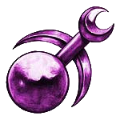
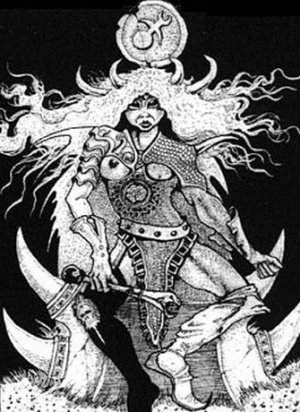
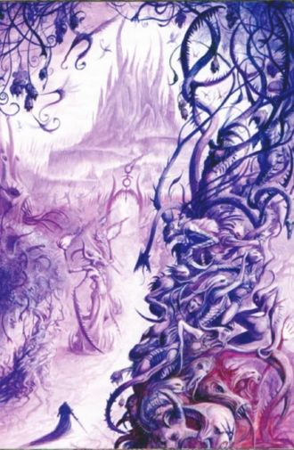
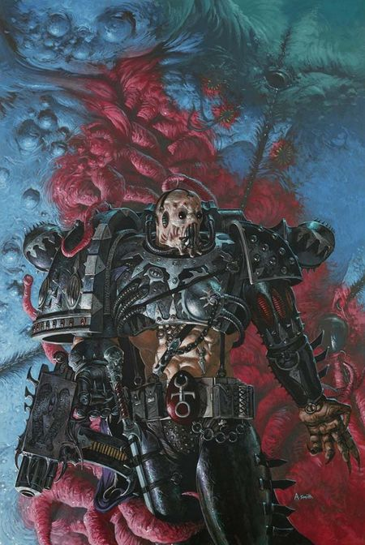
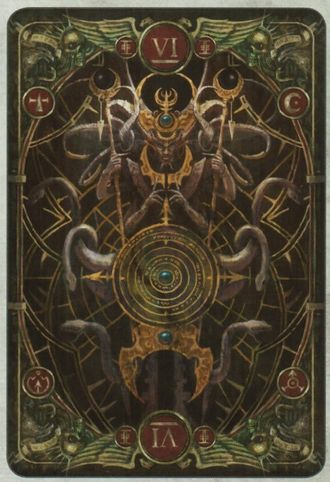

# 0509 色孽 Slaanesh

精校状态：中文行文已逐段精校，部分术语仍为暂定

分类：组织 / 混沌 Chaos / 混沌诸神 Chaos Gods

原文来源：https://www.bilibili.com/opus/1189191747519905799

原作者：帝国神选罐头

原文时间：2026年04月09日 15:11

[返回分类目录](目录.md) · [全书目录](../../目录.md)

<!-- A0509-B0001 -->
**英文原文**

Slaanesh is the Chaos God of lust, greed, excess, pain, pleasure, perfection, and hedonism. Slaanesh was the last of the major Chaos Gods to be born—coming into existence with the cataclysmic collapse of the Eldar civilisation.

<!-- /A0509-B0001 -->

<!-- A0509-B0002 -->

原译文

色孽是色欲、贪婪、纵欲、痛苦、欢愉、完美和享乐主义的混沌之神。色孽是最后一个诞生的主要混沌诸神 — 随着灵族文明的灾难性崩溃而诞生。

**校订译文**

色孽是掌管色欲、贪婪、过度放纵、痛苦、欢愉、完美与享乐主义的混沌之神。祂是几位主要混沌之神中最后诞生的一位，其降生伴随着灵族文明的灾难性崩溃。

<!-- /A0509-B0002 -->

<!-- A0509-B0003 图片 -->

<!-- A0509-B0004 -->

原译文

Slaanesh 色孽

**校订译文**

Slaanesh 色孽

<!-- /A0509-B0004 -->

<!-- A0509-B0005 -->
**英文原文**

Titles:Dark Prince of Chaos, Prince of Excess, Prince of Pleasure

<!-- /A0509-B0005 -->

<!-- A0509-B0006 -->

原译文

头衔：混沌黑暗王子，纵欲王子，欢愉王子

**校订译文**

头衔：混沌黑暗王子，纵欲王子，欢愉王子

<!-- /A0509-B0006 -->

<!-- A0509-B0007 -->
**英文原文**

Status:Active

<!-- /A0509-B0007 -->

<!-- A0509-B0008 -->

原译文

状态：活动

**校订译文**

状态：活跃

<!-- /A0509-B0008 -->

<!-- A0509-B0009 -->
**英文原文**

Type:Chaos God

<!-- /A0509-B0009 -->

<!-- A0509-B0010 -->

原译文

类别：混沌之神

**校订译文**

类别：混沌之神

<!-- /A0509-B0010 -->

<!-- A0509-B0011 -->
**英文原文**

Domains:Lust, Desire, Sexuality, Greed, Gluttony, Temptation, Hedonism, Indulgence, Excess, Pleasure, Pain, Joy, Sadness, Perfection, Obsession, Need, Want, Opulence

<!-- /A0509-B0011 -->

<!-- A0509-B0012 -->

原译文

领域：色欲、欲望、性欲、贪婪、暴食、诱惑、享乐主义、放纵、纵欲、欢愉、痛苦、快乐、悲伤、完美、痴迷、需求、希望、财富

**校订译文**

领域：色欲、欲望、性、贪婪、暴食、诱惑、享乐主义、沉溺、过度放纵、欢愉、痛苦、喜悦、悲伤、完美、痴迷、需求、渴求、奢华

<!-- /A0509-B0012 -->

<!-- A0509-B0013 -->
**英文原文**

Daemons:Keeper of Secrets, Daemonette, Fiend, Steed of Slaanesh, Hate Angel

<!-- /A0509-B0013 -->

<!-- A0509-B0014 -->

原译文

恶魔:守密者，魅魔，色孽兽，色孽马，仇恨天使

**校订译文**

恶魔：守密者、魅魔、欢愉魔、色孽马、仇恨天使

<!-- /A0509-B0014 -->

<!-- A0509-B0015 -->
**英文原文**

Followers:Emperor's Children

<!-- /A0509-B0015 -->

<!-- A0509-B0016 -->

原译文

追随者：帝皇之子

**校订译文**

追随者：帝皇之子

<!-- /A0509-B0016 -->

<!-- A0509-B0017 -->
**英文原文**

Adjectives:Slaaneshi

<!-- /A0509-B0017 -->

<!-- A0509-B0018 -->

原译文

形容词：色孽的

**校订译文**

形容词：色孽的

<!-- /A0509-B0018 -->

<!-- A0509-B0019 -->
**英文原文**

Sacred Number:6

<!-- /A0509-B0019 -->

<!-- A0509-B0020 -->

原译文

圣数：6

**校订译文**

圣数：6

<!-- /A0509-B0020 -->

<!-- A0509-B0021 -->
**英文原文**

Symbols:Male and Female symbol combined

<!-- /A0509-B0021 -->

<!-- A0509-B0022 -->

原译文

标志：男性和女性符号组合

**校订译文**

标志：男性和女性符号组合

<!-- /A0509-B0022 -->

<!-- A0509-B0023 -->
**英文原文**

Enemies:Khorne

<!-- /A0509-B0023 -->

<!-- A0509-B0024 -->

原译文

敌人：恐虐

**校订译文**

敌人：恐虐

<!-- /A0509-B0024 -->

<!-- A0509-B0025 -->
## Overview 概述

<!-- /A0509-B0025 -->

<!-- A0509-B0026 -->
**英文原文**

Slaanesh, as it is called, derives from Slaa Neth or Slaaneth — the god's name in the Dark Tongue, the language of Chaos — (Slaa meaning "ecstasy", "pleasure", etc, Neth meaning "lord of", "master of", or "prince of"; hence, the Prince of Pleasure). The correct adjective of things associated with Slaanesh (such as its worshipers) is "Slaaneshi". In the Aeldari language she is known as Sai'lanthresh, but they tend to avoid using her name at all, instead referring to her as She Who Thirsts.

<!-- /A0509-B0026 -->

<!-- A0509-B0027 -->

原译文

色孽，顾名思义，源自斯拉·内斯或斯拉涅斯 — 暗语中的神名，混沌的语言 — （斯拉意为“狂喜”、“欢愉”等，内斯意为“领主”、“主人”或“王子”；因此，欢愉王子）。与色孽相关的事物（如它的崇拜者）的正确形容词是“色孽的”。在艾尔达里语中，她被称为赛'兰瑟斯，但他们倾向于完全避免使用她的名字，而是称她为“饥渴女士”。

**校订译文**

“色孽”（Slaanesh）一名源于混沌语言暗语中的神名 Slaa Neth 或 Slaaneth。Slaa 意为“狂喜”“欢愉”等，Neth 则意为“……之主”或“……王子”，因此合起来便是“欢愉王子”。英语中，描述与色孽有关的事物（例如其崇拜者）时，使用形容词 Slaaneshi。在艾达灵族语中，祂名为赛’兰瑟斯，但灵族通常避免直呼其名，而以“饥渴女士”代称。

**校注：** 保留原文词源拆分与英文形容词，修复把 Slaaneshi 本身译掉后无法说明英语用法的问题。

<!-- /A0509-B0027 -->

<!-- A0509-B0028 图片 -->

<!-- A0509-B0029 -->

原译文

Slaanesh 色孽

**校订译文**

Slaanesh 色孽

<!-- /A0509-B0029 -->

<!-- A0509-B0030 -->
**英文原文**

Slaanesh typically appears in a form which is female on the right side and male on the left, with two sets of horns rising from its flowing golden hair. It can, however, assume any form—male, female, hermaphrodite or asexual—but prefers male bodies. Its sacred number is six. The symbol of Slaanesh combines the conventional symbols for male and female. It is also known by a multitude of titles, such as Prince of Chaos, Prince of Excess, Prince of Pleasure and Lord of Dark Delights. To the Eldar, who name it Sai'lanthresh (literally - She Who Thirsts), and also by the titles of, She Who Is Not Named, The Great Enemy, The Great Serpent, the Dark Prince, the Lord of Excess, the Perfect One, and a thousand other names across the galaxy.

<!-- /A0509-B0030 -->

<!-- A0509-B0031 -->

原译文

色孽通常以右侧为雌性，左侧为雄性的形态出现，从其流动的金色头发中长出两组角。然而，它可以呈现任何形态 — 雄性、雌性、雌雄同体或无性 — 但更喜欢雄性身体。它的圣数是六。色孽符号结合了男性和女性的传统象征。它也以众多头衔而闻名，如混沌王子、纵欲王子、欢愉王子和黑暗喜悦领主。对于灵族，将其命名为赛'兰瑟斯（字面意思是饥渴女士），以及无名女士、大敌、巨蛇、黑暗王子、纵欲领主、完美者等众多名字，以及银河系中的其他一千个名字。

**校订译文**

色孽通常以右半身为女性、左半身为男性的形态显现，飘逸的金发间伸出两对角。祂也能化为男性、女性、雌雄同体或无性的任何形态，但更偏爱男性身躯。祂的圣数为六，徽记则将传统的男性与女性符号合为一体。祂的名号众多，包括混沌王子、纵欲王子、欢愉王子与黑暗欢愉之主。灵族称祂为赛’兰瑟斯，字面意为“饥渴女士”，也称祂为不可直呼其名者、大敌、巨蛇、黑暗王子、纵欲之主、完美者；银河各处还流传着上千种其他称谓。

**校注：** She Who Is Not Named 指不被直呼其名者，原译“无名女士”不够准确；暂定“不可直呼其名者”，英文仍保留供核。

<!-- /A0509-B0031 -->

<!-- A0509-B0032 -->
**英文原文**

Known as the Feastbringer to the cannibal tribes on Ghoma VI, Slaanesh is depicting as an insatiable, slavering maw as vast as a canyon. To the xenos species known as the Jorvax, his name is a mind-shattering cacophony of inharmonious notes emitted at mind shattering volumes. The traitor regiments of Toloso, know him as the Cruel Mirror. The name and appearance ascribed to this Dark God matters little, so long as the mortals fixate upon him and worship in their ways.

<!-- /A0509-B0032 -->

<!-- A0509-B0033 -->

原译文

色孽被戈玛六号食人部落称为盛宴使者，他被描绘成一个像峡谷一样巨大的贪得无厌的垂涎之口。对于被称为乔瓦克斯的异型物种来说，他的名字是一种令人心碎的不谐音符，以令人心碎的响度发出。托洛索的叛徒兵团称他为残酷之镜。只要凡人以他们的方式关注并崇拜这位黑暗之神，那么赋予他的名字和外表就无关紧要。

**校订译文**

戈玛六号星的食人部落称色孽为“盛宴使者”，将祂描绘成一道峡谷般巨大的深渊巨口，垂涎不止、永不知足。对名为乔瓦克斯的异形种族而言，祂的名字由一连串刺耳而不和谐的音符组成，以足以震碎心智的音量响起。托洛索的叛军团则称祂为“残酷之镜”。只要凡人将心神系于这位黑暗之神，并以自己的方式崇拜祂，赋予祂什么名字与形象并不重要。

<!-- /A0509-B0033 -->

<!-- A0509-B0034 -->
**英文原文**

Slaanesh was fully born at the moment of the Fall of the Eldar. The birth of Slaanesh created the Eye of Terror — mere echoes of its birth-cries — and found its first followers — the Eldar — fleeing from it in ignorance of the Primordial Truth, refusing to live in harmony with it as Humanity would soon begin to learn. Slaanesh devoured the souls of most of the Eldar except those far enough away from the Eldar homeworlds to escape, or those insulated within the Webway. This event also slew all the Eldar gods except for Khaine (who was shattered into many pieces), the Laughing God — Cegorach, and Isha — who was, according to one Craftworld, taken captive by the Chaos God Nurgle.

<!-- /A0509-B0034 -->

<!-- A0509-B0035 -->

原译文

色孽在灵族陨落的那一刻诞生了。色孽的诞生创造了恐惧之眼 — 仅仅是其诞生哭声的回响 — 并发现其第一批追随者 — 灵族 — 在对原初真理一无所知的情况下逃离了它，拒绝与它和谐相处，因为人类很快就会开始学习。色孽吞噬了大多数灵族的灵魂，除了那些离灵族家园世界足够远的人，或者那些被隔离在网道内的人。这一事件也杀死了所有的灵族诸神，除了凯恩（他被粉碎成许多碎片）、笑神西高奇和伊莎，据一个方舟世界称，伊莎被混沌之神纳垢俘虏了。

**校订译文**

色孽在灵族陨落的那一刻完全诞生。仅仅是祂诞生时啼哭的回响，便造就了恐惧之眼。祂最初的追随者——灵族——却在不知原初真理的情况下逃离，拒绝与祂共处；人类此后却将开始学习这样做。除远离灵族母星而逃过一劫者，以及受到网道庇护者外，大多数灵族的灵魂都被色孽吞噬。灵族诸神也在这场灾难中殒命，仅有被击碎成无数碎片的凯恩、笑神西高奇，以及伊莎幸存。按某个方舟世界的传说，伊莎被混沌之神纳垢俘虏。

**校注：** 本段“追随者”“原初真理”“和谐共处”为英文原文带有混沌立场的表述，译文忠实保留其叙述视角，不将其改写为中立史论。

<!-- /A0509-B0035 -->

<!-- A0509-B0036 -->
**英文原文**

Slaanesh has a neutral attitude to some of the other Gods of Chaos (as he is generally too caught up in his own pleasures to be interested in rivalries or alliances), but his particular enemy is Khorne, whose belief in pain and death is completely opposed to Slaanesh's principle of a life of unrestricted pleasure.

<!-- /A0509-B0036 -->

<!-- A0509-B0037 -->

原译文

色孽对其他一些混沌之神持中立态度（因为他通常过于沉迷于自己的欢愉，对竞争或联盟不感兴趣），但他特别的敌人是恐虐，他对痛苦和死亡的信仰完全反对色孽的无限制快乐生活原则。

**校订译文**

色孽对部分混沌之神保持中立，因为祂通常沉迷于自身的欢愉，无暇关心争斗或结盟。不过，恐虐是祂格外敌视的对手：后者对痛苦与死亡的推崇，与色孽追求无拘无束享乐生活的原则针锋相对。

<!-- /A0509-B0037 -->

<!-- A0509-B0038 -->
## Worship of Slaanesh 色孽崇拜

<!-- /A0509-B0038 -->

<!-- A0509-B0039 -->
**英文原文**

Slaanesh's symbol is rarely worn openly by its followers. They instead often wear items of jewelry bearing erotic motifs. Followers dress in robes which are often opened to leave the right side of the chest uncovered, a requirement of many of the rituals involved in his worship. Pastel and electric shades are the chief colours, although white may be used as well. These colours are also sometimes carried over into everyday wear, although they may be modified to fit in with current fashions. In all cases, all Slaanesh followers wear garb of sensuously high quality.

<!-- /A0509-B0039 -->

<!-- A0509-B0040 -->

原译文

色孽的标志很少被其追随者公开佩戴。相反，他们经常佩戴带有色情图案的珠宝。追随者穿着长袍，长袍通常敞开，露出胸部的右侧，这是他崇拜中许多仪式的要求。柔和和鲜艳的色彩是主要的颜色，尽管白色也可以使用。这些颜色有时也会延续到日常穿着中，尽管它们可能会被修改以适应当前的时尚。在所有情况下，所有色孽追随者都穿着高质量的服装。

**校订译文**

色孽的追随者很少公开佩戴其徽记，更多时候会选择带有情色纹样的珠宝。他们常穿着敞开的长袍，露出右侧胸膛——许多崇拜仪式都有这一要求。服饰以柔和的淡色与鲜明耀眼的色调为主，也会使用白色；日常衣着有时也沿用这些色彩，再依当时的流行稍作调整。无论如何，色孽信徒的服装总是质地上乘，能带来感官享受。

<!-- /A0509-B0040 -->

<!-- A0509-B0041 -->
**英文原文**

Even the most militant of Slaanesh's followers do not deny themselves this hedonistic lifestyle; cultist hideouts may be fortified and stocked with weapons, but they are equally stocked with luxurious furniture, sumptuous food, and erotic decorations.

<!-- /A0509-B0041 -->

<!-- A0509-B0042 -->

原译文

即使是色孽最激进的追随者也不会否认自己这种享乐主义的生活方式；邪教徒的藏身之处可能会加强防御并储备武器，但它们同样会储备豪华的家具、丰盛的食物和色情装饰品。

**校订译文**

即使最热衷战斗的色孽信徒，也不会舍弃这种享乐生活。他们的藏身处或许筑有防御工事、囤满武器，但同样少不了奢华家具、丰盛食物与情色装饰。

<!-- /A0509-B0042 -->

<!-- A0509-B0043 -->
**英文原文**

In the mythology of the primitive inhabitants of Fenris, "Sla Nahesh" (presumably a misinterpretation of Slaanesh) is an evil deity, described as the offspring of the dark god Horus and the dragon goddess Skrinneir, and is imprisoned within one of the planet's volcanic islands after being defeated by Leman Russ.

<!-- /A0509-B0043 -->

<!-- A0509-B0044 -->

原译文

在芬里斯原始居民的神话中，“斯拉·纳赫什”（可能是对色孽的误解）是一个邪恶的神，被描述为黑暗之神荷鲁斯和龙之女神斯克林奈尔的后代，在被黎曼·鲁斯击败后被囚禁在行星上的一个火山岛上。

**校订译文**

在芬里斯原住民的神话中，“斯拉·纳赫什”（推测是对色孽之名的讹传）是一位邪神，是黑暗之神荷鲁斯与龙女神斯克林奈尔的后代。传说祂被黎曼·鲁斯击败，随后囚禁在这颗行星的一座火山岛内。

**校注：** 本段叙述芬里斯当地神话，不能与前文灵族陨落所述色孽起源混为同一层面的历史。

<!-- /A0509-B0044 -->

<!-- A0509-B0045 -->
## The Palace of Slaanesh 色孽宫殿

<!-- /A0509-B0045 -->

<!-- A0509-B0046 -->
**英文原文**

The Palace of Slaanesh is Slaanesh's realm within the Warp. Those that dare his realm risk becoming trapped in its warped delights for eternity.

<!-- /A0509-B0046 -->

<!-- A0509-B0047 -->

原译文

色孽宫殿是色孽在亚空间的领地。那些敢于挑战他的领域的人有可能永远被困在扭曲的快乐中。

**校订译文**

色孽宫殿是色孽在亚空间中的领域。胆敢踏入者，都有可能永远陷于其中扭曲的欢愉。

<!-- /A0509-B0047 -->

<!-- A0509-B0048 图片 -->

<!-- A0509-B0049 -->

原译文

The Palace of Slaanesh 色孽宫殿

**校订译文**

The Palace of Slaanesh 色孽宫殿

<!-- /A0509-B0049 -->

<!-- A0509-B0050 -->
## Daemons of Slaanesh 色孽恶魔

<!-- /A0509-B0050 -->

<!-- A0509-B0051 -->
## The Legions of Excess 恣肆军团

原题：The Legions of Excess 纵欲军团

**校注：** 采用 GW-09 第 12 页“恣肆军团”与 GW-10 第 13 页 Legion of Excess 的对应；这里为同名复数总称。原稿“纵欲军团”。

<!-- /A0509-B0051 -->

<!-- A0509-B0052 -->
**英文原文**

The armies of Slaanesh are known as the Legions of Excess. Each Legion is commanded by a Keeper of Secrets, though there are cases where a favoured Daemon Prince is known to have lordship instead. Below these commanders are Daemon Princes or Heralds of Slaanesh, each in command of one of six formations. While some of the Dark Prince's generals are obsessive in commanding a single type of legion, the majority will change formations as mood or need suits them.

<!-- /A0509-B0052 -->

<!-- A0509-B0053 -->

原译文

色孽的军队被称为纵欲军团。每个军团都由一名守密者指挥，尽管在某些情况下，被一位受宠爱的恶魔王子以替代领导权。在这些指挥官之下是恶魔王子或色孽先驱，每个人都指挥着六个编队中的一个。虽然黑暗王子的一些将军痴迷于指挥一种类型的军团，但大多数人会根据自己的心情或需要改变组成。

**校订译文**

色孽的军队被称为恣肆军团。每个军团通常由一位守密者统率，但有时也由备受宠爱的恶魔亲王执掌。统帅之下设有六支部队，各由一位恶魔亲王或色孽传令官指挥。黑暗王子麾下有些将领执着于指挥某一种军团，但大多数会依心情或需要调整编制。

<!-- /A0509-B0053 -->

<!-- A0509-B0054 -->
**英文原文**

There are several types of Legions of excess. Flayer Legions are geared towards wanton destruction and their many Daemonettes take great pleasure in the act. The Hunter Legions are masters of quick kills and are built primarily around fast moving cavalry and chariots. The flamboyant Glamiatrix Legions are the most sorcerous, relying heavily upon psychic powers and mesmerism. The Terror Legions are a shock force specialising in elaborate and gory displays of combat, infamous for unleashing a barrage upon the senses that can overwhelm weak-willed enemies. The Legions of Eternal Punishment have no speciality, but rather call upon the damnations of Slaanesh, intermixing magics and temptation alongside battlecraft. The strangest of Slaanesh's legions are known as the Courante Legions. To them, battle is but a dance and their Daemons whirl about one another as they slay their foes in bizarrely choreographed manoeuvres. While they lack the speed of other Legions, their elegance and creativity captures the favour of their master more than practical assaults could ever hope.

<!-- /A0509-B0054 -->

<!-- A0509-B0055 -->

原译文

有几种类型的纵欲军团。剥皮者军团致力于肆意破坏，他们的许多魅魔对在行动中获取巨大欢愉。猎手军团是快速杀戮的大师，主要围绕快速移动的骑兵和战车而建。华丽的魅影军团是最巫术的，严重依赖灵能力量和催眠术。恐怖军团是一支专门从事精心设计和血腥战斗表演的突击部队，以对感官进行猛烈攻击而臭名昭著，这种攻击可以压倒意志薄弱的敌人。永罚军团没有专长，而是呼召色孽的诅咒，将魔法和诱惑与战斗技艺混杂在一起。最奇怪的色孽军团被称为库朗军团。对他们来说，战斗只是一场舞蹈，他们的恶魔在以奇怪的编排动作杀死敌人的同时，互相旋转。虽然他们缺乏其他军团的速度，但他们的优雅和创造力比实际攻击所希望的更能赢得主人的青睐。

**校订译文**

恣肆军团分为多种类型。剥皮者军团专事肆意破坏，麾下大量魅魔从中获得无穷乐趣。猎手军团擅长迅速杀敌，以机动迅捷的骑兵与战车为主力。华丽招摇的魅影军团最精于巫术，高度依赖灵能力量与催眠术。恐怖军团是突击部队，专门上演精心编排的血腥杀戮，以猛烈冲击敌人感官、击垮意志薄弱者而闻名。永罚军团没有特定专长，而是借助色孽的诅咒，将魔法、诱惑与战斗技艺融为一体。其中最奇特的是库朗军团。对它们而言，战斗只是一支舞曲：恶魔彼此绕旋，以怪诞的舞步编排斩杀敌人。它们虽不及其他军团迅捷，但其优雅与创意，比任何务实高效的攻势都更能取悦主人。

<!-- /A0509-B0055 -->

<!-- A0509-B0056 -->
## Daemons of Excess 欲魔

<!-- /A0509-B0056 -->

<!-- A0509-B0057 -->
**英文原文**

Daemons of Slaanesh are elegant and eerily beautiful, agile and graceful while also cruel and violent to the extreme. Slaanesh's servants are both horrific and alluring, mesmerising and loathsome. Although they can not match the raw power of Khorne's armies, the resiliency of Nurgle's tallybands, or the eldritch might of Tzeentch's hosts, Daemons of Slaanesh are possessed of a speed and lethality that is unequalled.

<!-- /A0509-B0057 -->

<!-- A0509-B0058 -->

原译文

色孽的恶魔优雅而美丽，敏捷而优美，但也极端残忍和暴力。色孽的仆人既可怕又诱人，既令人着迷又令人厌恶。尽管他们无法与恐虐军队的原始力量、纳垢记帮的韧性或奸奇天军的怪异力量相匹敌，但色孽的恶魔拥有无与伦比的速度和致命性。

**校订译文**

色孽恶魔优雅灵巧，具有诡异的美感，却也极度残忍暴虐。它们既可怖又诱人，既令人着迷又令人厌恶。论蛮力，它们不及恐虐的大军；论坚韧，不及纳垢的记账战帮；论玄奥的魔法威能，又不及奸奇的军队。然而，它们拥有无与伦比的速度与杀伤力。

<!-- /A0509-B0058 -->

<!-- A0509-B0059 -->
**英文原文**

Keepers of Secrets — the Greater Daemons of Slaanesh (Q'tlahsi'issho'akshami). They can resemble huge, bestial and ugly creatures or lithe, terrifying creatures with an unholy beauty.

<!-- /A0509-B0059 -->

<!-- A0509-B0060 -->

原译文

守密者 — 色孽的大魔（奎'特拉西'索'阿克沙米）。它们可以像巨大的、野兽般的、丑陋的生物，也可以像柔软的、可怕的、具有邪恶之美的生物。

**校订译文**

守密者——色孽的大魔（奎’特拉西’索’阿克沙米）。它们既可能呈现为庞大、兽性十足的丑陋怪物，也可能是身形矫健、散发邪异美感的恐怖生灵。

<!-- /A0509-B0060 -->

<!-- A0509-B0061 -->
**英文原文**

Daemonettes — the common Daemons of Slaanesh (Q'tlahs'itsu'ashko). They are disturbingly beautiful — often feminine on one side, masculine on the other. They usually have crab-like claws instead of hands.

<!-- /A0509-B0061 -->

<!-- A0509-B0062 -->

原译文

魅魔 - 色孽的常见恶魔（奎'特拉斯'苏'阿什科）。它们美丽得令人不安 — 一边通常是女性化的，另一边是男性化的。它们通常有螃蟹般的爪子，而不是手。

**校订译文**

魅魔——色孽常见的恶魔（奎’特拉斯’苏’阿什科）。它们美得令人不安，通常半边身躯带有女性特征，另一半带有男性特征，双手的位置则往往长着蟹螯。

<!-- /A0509-B0062 -->

<!-- A0509-B0063 -->

原译文

Infernal Enrapturess 炼狱狂喜者

**校订译文**

Infernal Enrapturess 炼狱琴魔

<!-- /A0509-B0063 -->

<!-- A0509-B0064 -->

原译文

Herald of Slaanesh 色孽先驱

**校订译文**

Herald of Slaanesh 色孽传令官

<!-- /A0509-B0064 -->

<!-- A0509-B0065 -->
**英文原文**

Steeds of Slaanesh — the daemonic mounts of Slaanesh (Q'qha'thashi'i), lurid snakelike creatures who lash with their prehensile tongues. They are often ridden by Daemonettes, as well as gifted to favoured Champions.

<!-- /A0509-B0065 -->

<!-- A0509-B0066 -->

原译文

色孽马 — 色孽的恶魔坐骑（奎'哈'塔希'伊），是一种可怕的蛇状生物，用其可抓握的舌头鞭打。他们经常被魅魔骑着，也被赠送给受宠冠军。

**校订译文**

色孽马——色孽的恶魔坐骑（奎’哈’塔希’伊）。它们是色彩妖异的蛇形生物，以能够卷握物体的长舌抽击敌人，常供魅魔骑乘，也会被赐予受宠的勇士。

<!-- /A0509-B0066 -->

<!-- A0509-B0067 -->
**英文原文**

Fiends of Slaanesh — the daemonic beasts of Slaanesh (Q'qha'shy'ythlis). They are a bizarre hybrid of insectoid, reptilian and human.

<!-- /A0509-B0067 -->

<!-- A0509-B0068 -->

原译文

色孽兽 — 色孽的恶魔野兽（奎'哈'希'伊利斯）。它们是昆虫、爬行动物和人类的奇怪杂交种。

**校订译文**

欢愉魔——色孽的恶魔野兽（奎’哈’希’伊利斯），外形诡异，兼具昆虫、爬行动物与人类的特征。

<!-- /A0509-B0068 -->

<!-- A0509-B0069 -->
**英文原文**

Hate-Angel — Flight-capable Daemons

<!-- /A0509-B0069 -->

<!-- A0509-B0070 -->

原译文

仇恨天使 — 有飞行能力的恶魔

**校订译文**

仇恨天使 — 有飞行能力的恶魔

<!-- /A0509-B0070 -->

<!-- A0509-B0071 -->
**英文原文**

Cackling Abomination — Daemonhost

<!-- /A0509-B0071 -->

<!-- A0509-B0072 -->

原译文

狞笑憎恶 — 恶魔宿主

**校订译文**

狞笑憎恶 — 恶魔宿主

<!-- /A0509-B0072 -->

<!-- A0509-B0073 -->
## Daemon Engines of Slaanesh 色孽恶魔引擎

<!-- /A0509-B0073 -->

<!-- A0509-B0074 -->
**英文原文**

A Daemon Engine is a part-technological, part-daemonic vehicle, those dedicated to Slaanesh include the Slaanesh Subjugator and Sonic Dreadnought

<!-- /A0509-B0074 -->

<!-- A0509-B0075 -->

原译文

恶魔引擎是一种半技术半恶魔的载具，专门用于色孽的包括色孽压制者和音波无畏

**校订译文**

恶魔引擎是融合科技与恶魔力量的载具。奉献给色孽的类型包括色孽压制者与音波无畏。

<!-- /A0509-B0075 -->

<!-- A0509-B0076 -->
## Titans of Slaanesh 色孽泰坦

<!-- /A0509-B0076 -->

<!-- A0509-B0077 -->

原译文

Questor 探索者

**校订译文**

Questor 探索者

<!-- /A0509-B0077 -->

<!-- A0509-B0078 -->

原译文

Hell-Knight 地狱骑士

**校订译文**

Hell-Knight 地狱骑士

<!-- /A0509-B0078 -->

<!-- A0509-B0079 -->

原译文

Hell-Scourge 狱灾

**校订译文**

Hell-Scourge 狱灾

<!-- /A0509-B0079 -->

<!-- A0509-B0080 -->

原译文

Hell-Strider 地狱漫游者

**校订译文**

Hell-Strider 地狱漫游者

<!-- /A0509-B0080 -->

<!-- A0509-B0081 -->
## Forces dedicated to Slaanesh 献身色孽的部队

<!-- /A0509-B0081 -->

<!-- A0509-B0082 -->
## Chaos Space Marines 混沌星际战士

<!-- /A0509-B0082 -->

<!-- A0509-B0083 图片 -->

<!-- A0509-B0084 -->

原译文

Chaos Space Marine of Slaanesh 色孽混沌星际战士

**校订译文**

Chaos Space Marine of Slaanesh 色孽混沌星际战士

<!-- /A0509-B0084 -->

<!-- A0509-B0085 -->
**英文原文**

The Emperor's Children — Chaos Space Marines, once amongst the Emperor's most loyal servants they turned traitor during the Horus Heresy. Most of their remaining members are little more than hedonistic psychopaths who often wield unique sonic weaponry in battle.

<!-- /A0509-B0085 -->

<!-- A0509-B0086 -->

原译文

帝皇之子 — 混沌星际战士，曾经是帝皇最忠诚的仆人之一，在荷鲁斯叛乱期间变成了叛徒。他们剩下的大多数成员只不过是享乐主义精神变态者，他们经常在战斗中使用独特的声波武器。

**校订译文**

帝皇之子——混沌星际战士。他们曾是帝皇最忠诚的仆从之一，却在荷鲁斯之乱中背叛了帝国。如今留下的成员大多已沦为沉溺享乐的疯狂之徒，常在战斗中使用独特的声波武器。

<!-- /A0509-B0086 -->

<!-- A0509-B0087 -->

原译文

Flickering Blades 闪烁之刃

**校订译文**

Flickering Blades 闪烁之刃

<!-- /A0509-B0087 -->

<!-- A0509-B0088 -->

原译文

Thirsting Brethren 饥渴兄弟会

**校订译文**

Thirsting Brethren 饥渴兄弟会

<!-- /A0509-B0088 -->

<!-- A0509-B0089 -->

原译文

Ripping Nails 撕裂之钉

**校订译文**

Ripping Nails 撕裂之钉

<!-- /A0509-B0089 -->

<!-- A0509-B0090 -->

原译文

Sensorians 感知者

**校订译文**

Sensorians 感知者

<!-- /A0509-B0090 -->

<!-- A0509-B0091 -->

原译文

The Consortium 共同体

**校订译文**

The Consortium 共同体

<!-- /A0509-B0091 -->

<!-- A0509-B0092 -->

原译文

Phoenix Conclave 凤凰秘会

**校订译文**

Phoenix Conclave 凤凰秘会

<!-- /A0509-B0092 -->

<!-- A0509-B0093 -->

原译文

12th Millennial 第12千人队

**校订译文**

12th Millennial 第 12 千人队

<!-- /A0509-B0093 -->

<!-- A0509-B0094 -->

原译文

Cohors Nasicae/Faultless 纳希凯大队/无暇

**校订译文**

Cohors Nasicae/Faultless 纳希凯大队/无暇

<!-- /A0509-B0094 -->

<!-- A0509-B0095 -->

原译文

Glittering Myriad 无量闪光

**校订译文**

Glittering Myriad 无量闪光

<!-- /A0509-B0095 -->

<!-- A0509-B0096 -->

原译文

Konstrictus 绞缠者

**校订译文**

Konstrictus 绞缠者

<!-- /A0509-B0096 -->

<!-- A0509-B0097 -->

原译文

Adored 被崇拜者

**校订译文**

Adored 被崇拜者

<!-- /A0509-B0097 -->

<!-- A0509-B0098 -->

原译文

Threnodic Choir 三重合唱团

**校订译文**

Threnodic Choir 挽歌合唱团

**校注：** Threnodic 为哀悼、挽歌之意，与“三重”无关；暂定“挽歌合唱团”。

<!-- /A0509-B0098 -->

<!-- A0509-B0099 -->

原译文

Transcendent Spectacle 超凡奇观

**校订译文**

Transcendent Spectacle 超凡奇观

<!-- /A0509-B0099 -->

<!-- A0509-B0100 -->
**英文原文**

Over the thousands of years since the Horus Heresy, a few other Space Marine chapters have inevitably fallen to the seductions of Slaanesh and become renegades. Among these are:

<!-- /A0509-B0100 -->

<!-- A0509-B0101 -->

原译文

在荷鲁斯叛乱事件发生后的数千年里，其他一些星际战士战团不可避免地被色孽的诱惑所堕落，成为叛徒。其中包括：

**校订译文**

荷鲁斯之乱后的数千年间，另有一些星际战士战团终于抵不住色孽的诱惑，堕落为叛徒，其中包括：

<!-- /A0509-B0101 -->

<!-- A0509-B0102 -->

原译文

The Violators 叛逆者

**校订译文**

The Violators 叛逆者

<!-- /A0509-B0102 -->

<!-- A0509-B0103 -->

原译文

The Flawless Host 无暇之主

**校订译文**

The Flawless Host 无暇大军

**校注：** Host 在战帮清单中指军众，不是主人；原稿“无暇之主”修为暂定“无暇大军”。

<!-- /A0509-B0103 -->

<!-- A0509-B0104 -->

原译文

Angels of Ecstasy 狂喜天使

**校订译文**

Angels of Ecstasy 狂喜天使

<!-- /A0509-B0104 -->

<!-- A0509-B0105 -->

原译文

Hedonistarii 享乐者

**校订译文**

Hedonistarii 享乐者

<!-- /A0509-B0105 -->

<!-- A0509-B0106 -->

原译文

The Corpus Brethren 圣体兄弟会

**校订译文**

The Corpus Brethren 圣体兄弟会

<!-- /A0509-B0106 -->

<!-- A0509-B0107 -->

原译文

The Children of Torment 折磨之子

**校订译文**

The Children of Torment 折磨之子

<!-- /A0509-B0107 -->

<!-- A0509-B0108 -->

原译文

The Exquisite Host 精致之主

**校订译文**

The Exquisite Host 精致大军

**校注：** Host 在战帮清单中指军众；原稿“精致之主”修为暂定“精致大军”。

<!-- /A0509-B0108 -->

<!-- A0509-B0109 -->

原译文

The Silken Death 丝滑死亡

**校订译文**

The Silken Death 丝滑死亡

<!-- /A0509-B0109 -->

<!-- A0509-B0110 -->

原译文

The Punishers 惩罚者

**校订译文**

The Punishers 惩罚者

<!-- /A0509-B0110 -->

<!-- A0509-B0111 -->

原译文

The Sirens of Agony 痛苦海妖

**校订译文**

The Sirens of Agony 痛苦海妖

<!-- /A0509-B0111 -->

<!-- A0509-B0112 -->
## Renegades and Cults 变节者和教派

<!-- /A0509-B0112 -->

<!-- A0509-B0113 图片 -->

<!-- A0509-B0114 -->

原译文

Representation of Slaanesh 色孽表征

**校订译文**

Representation of Slaanesh 色孽形象图

<!-- /A0509-B0114 -->

<!-- A0509-B0115 -->

原译文

House Glaw 格劳家族

**校订译文**

House Glaw 格劳家族

<!-- /A0509-B0115 -->

<!-- A0509-B0116 -->

原译文

Cult of Frantic Flensing 狂热剥皮教派

**校订译文**

Cult of Frantic Flensing 狂热剥皮教派

<!-- /A0509-B0116 -->

<!-- A0509-B0117 -->

原译文

Cult of the Hedonic Lord 享乐领主教派

**校订译文**

Cult of the Hedonic Lord 享乐领主教派

<!-- /A0509-B0117 -->

<!-- A0509-B0118 -->

原译文

Pirate Princes of the Ragged Helix 褴褛螺旋的海盗王子

**校订译文**

Pirate Princes of the Ragged Helix 褴褛螺旋的海盗王子

<!-- /A0509-B0118 -->

<!-- A0509-B0119 -->

原译文

Flesh Shapers of Melancholia 忧郁血肉塑形者

**校订译文**

Flesh Shapers of Melancholia 忧郁血肉塑形者

<!-- /A0509-B0119 -->

<!-- A0509-B0120 -->

原译文

Hollow Cult 空洞教派

**校订译文**

Hollow Cult 空洞教派

<!-- /A0509-B0120 -->

<!-- A0509-B0121 -->

原译文

Rypax 瑞帕克斯

**校订译文**

Rypax 瑞帕克斯

<!-- /A0509-B0121 -->

<!-- A0509-B0122 -->

原译文

Sons of the Silver King 白银王者之子

**校订译文**

Sons of the Silver King 白银王者之子

<!-- /A0509-B0122 -->

<!-- A0509-B0123 -->

原译文

Vanitine Hedonites 虚荣享乐者

**校订译文**

Vanitine Hedonites 虚荣享乐者

<!-- /A0509-B0123 -->

<!-- A0509-B0124 -->

原译文

Slaangors 孽角兽

**校订译文**

Slaangors 孽角兽

<!-- /A0509-B0124 -->

<!-- A0509-B0125 -->
## Daemonic Warbands 恶魔战帮

<!-- /A0509-B0125 -->

<!-- A0509-B0126 -->

原译文

The Golden Host 黄金之主

**校订译文**

The Golden Host 黄金大军

**校注：** Host 指恶魔军众；原稿“黄金之主”修为暂定“黄金大军”。

<!-- /A0509-B0126 -->

<!-- A0509-B0127 -->

原译文

The Decadent Horde 颓废部落

**校订译文**

The Decadent Horde 颓废部落

<!-- /A0509-B0127 -->

<!-- A0509-B0128 -->
## Traitor Titan Legions 叛徒泰坦军团

<!-- /A0509-B0128 -->

<!-- A0509-B0129 -->

原译文

Riotous Host 狂乱之主

**校订译文**

Riotous Host 狂乱大军

**校注：** Host 指泰坦军团；原稿“狂乱之主”修为暂定“狂乱大军”。

<!-- /A0509-B0129 -->

<!-- A0509-B0130 -->
## Notable Servants of Slaanesh 色孽的著名仆人

<!-- /A0509-B0130 -->

<!-- A0509-B0131 -->
**英文原文**

Fulgrim — Primarch of the Emperor's Children, now a powerful Daemon Prince

<!-- /A0509-B0131 -->

<!-- A0509-B0132 -->

原译文

福格瑞姆 — 帝皇之子的原体，现在是一位强大的恶魔王子

**校订译文**

福格瑞姆——帝皇之子的原体，如今是一位强大的恶魔亲王。

<!-- /A0509-B0132 -->

<!-- A0509-B0133 -->
**英文原文**

Zarakynel — the most revered of Slaanesh's Keepers of Secrets

<!-- /A0509-B0133 -->

<!-- A0509-B0134 -->

原译文

扎拉基尼尔 — 色孽守密者中最受尊敬的角色

**校订译文**

扎拉基尼尔——色孽麾下最受尊崇的守密者。

<!-- /A0509-B0134 -->

<!-- A0509-B0135 -->
**英文原文**

N'Kari — A Daemon Prince who fought on Horus's Battle barge during the Heresy

<!-- /A0509-B0135 -->

<!-- A0509-B0136 -->

原译文

纳'卡里 — 叛乱时期在荷鲁斯的战斗驳船上作战的恶魔王子

**校订译文**

纳’卡里——荷鲁斯之乱期间，曾在荷鲁斯的战斗驳船上作战的恶魔亲王。

**校注：** 此处按英文原稿将 N’Kari 列为 Daemon Prince，保留该来源的分类，不依据其他版本改写。

<!-- /A0509-B0136 -->

<!-- A0509-B0137 -->
**英文原文**

Shalaxi Helbane - A Keeper of Secrets

<!-- /A0509-B0137 -->

<!-- A0509-B0138 -->

原译文

夏拉希·狱灾 - 一位守密者

**校订译文**

夏拉希·魔灾——一位守密者。

<!-- /A0509-B0138 -->

<!-- A0509-B0139 -->
**英文原文**

The Masque — A powerful Daemonette and Daemonic Herald of Slaanesh

<!-- /A0509-B0139 -->

<!-- A0509-B0140 -->

原译文

假面舞者 — 强大的魅魔和色孽的恶魔先驱

**校订译文**

假面舞者——强大的魅魔，也是色孽的恶魔传令官。

<!-- /A0509-B0140 -->

<!-- A0509-B0141 -->
**英文原文**

Eidolon - Lord Commander Primus of the Emperor's Children.

<!-- /A0509-B0141 -->

<!-- A0509-B0142 -->

原译文

艾多隆 - 帝皇之子的首席领主指挥官。

**校订译文**

艾多隆 - 帝皇之子的首席领主指挥官。

<!-- /A0509-B0142 -->

<!-- A0509-B0143 -->
**英文原文**

Doomrider - Daemon Prince of Slaanesh.

<!-- /A0509-B0143 -->

<!-- A0509-B0144 -->

原译文

末日骑手 - 色孽的恶魔王子。

**校订译文**

末日骑手——色孽的恶魔亲王。

<!-- /A0509-B0144 -->

<!-- A0509-B0145 -->
**英文原文**

Lucius the Eternal — former Captain of the Emperor's Children, now a favoured Champion of Slaanesh

<!-- /A0509-B0145 -->

<!-- A0509-B0146 -->

原译文

不灭者卢修斯 — 前帝皇之子连长，现在是色孽宠爱的冠军

**校订译文**

不灭者卢修斯——曾任帝皇之子连长，如今是备受色孽宠爱的勇士。

<!-- /A0509-B0146 -->

<!-- A0509-B0147 -->
**英文原文**

Syll'Esske - Daemon Prince

<!-- /A0509-B0147 -->

<!-- A0509-B0148 -->

原译文

希尔'埃斯克 - 恶魔王子

**校订译文**

希尔艾斯克——恶魔亲王。

**校注：** 希尔艾斯克官译对应同名单位；此处原文仅称其为恶魔亲王，保留原文概述，不自行扩充单位构成。

<!-- /A0509-B0148 -->

<!-- A0509-B0149 -->

原译文

Jihar the Lacerator 撕裂者吉哈尔

**校订译文**

Jihar the Lacerator 撕裂者吉哈尔

<!-- /A0509-B0149 -->

<!-- A0509-B0150 -->
**英文原文**

Emeli Duboir — leader of a Chaos cult on Slawkenberg, later manifests as a powerful Daemoness on Adumbria

<!-- /A0509-B0150 -->

<!-- A0509-B0151 -->

原译文

艾米丽·杜波依尔 — 斯拉肯伯格上混沌教派的领袖，后来在阿登布里亚上显现为强大的女恶魔

**校订译文**

艾米丽·杜波依尔——斯拉肯伯格上一支混沌教派的首领，后来在阿登布里亚显现为强大的女恶魔。

<!-- /A0509-B0151 -->

<!-- A0509-B0152 -->

原译文

Xavaes Split-Tongue 泽维伊斯·裂舌

**校订译文**

Xavaes Split-Tongue 泽维伊斯·裂舌

<!-- /A0509-B0152 -->

<!-- A0509-B0153 -->

原译文

Hex'tan 赫克斯'坦

**校订译文**

Hex'tan 赫克斯'坦

<!-- /A0509-B0153 -->

<!-- A0509-B0154 -->
**英文原文**

Ula, the Doom of Heroes

<!-- /A0509-B0154 -->

<!-- A0509-B0155 -->

原译文

乌尔拉，英雄们的末日

**校订译文**

乌尔拉，英雄们的末日

<!-- /A0509-B0155 -->

<!-- A0509-B0156 -->
## Gifts of Slaanesh 色孽之礼

<!-- /A0509-B0156 -->

<!-- A0509-B0157 -->
**英文原文**

As with all the Chaos Gods, Slaanesh will often reward his most favoured followers with special gifts and blessings. Slaanesh's gifts can take many forms, including physical mutations, daemon weapons or an exotic appearance.

<!-- /A0509-B0157 -->

<!-- A0509-B0158 -->

原译文

与所有混沌之神一样，色孽经常用特殊的礼物和祝福来奖励他最宠爱的追随者。色孽的天赋可以采取多种形式，包括身体突变、恶魔武器或奇异外观。

**校订译文**

与其他混沌之神一样，色孽经常以特殊赐礼与祝福奖赏最受宠爱的追随者。祂的赐礼形式多样，包括肉体突变、恶魔武器或奇异的外貌。

<!-- /A0509-B0158 -->

本篇核心术语与暂定项

以下列出本篇出现的英文原形及核心术语表用词。同形词可能指不同对象，具体词义以本篇正文和校注为准；单复数、别名和仅见于图注的名称可能尚未列入。完整候选见[术语表](../../术语表/双语术语候选.csv)。

| 英文 | 采用中文 | 状态 |
| --- | --- | --- |
| Space Marines | 星际战士 | 官方已核对 |
| Chaos Space Marines | 混沌星际战士 | 官方已核对 |
| Aeldari | 艾达灵族 | 官方已核对 |
| Eldar | 灵族 | 暂定·语境区分 |
| Horus Heresy | 荷鲁斯之乱 | 官方已核对 |
| Warp | 亚空间 | 官方已核对 |
| Daemon Engine | 恶魔引擎 | 暂定 |
| Webway | 网道 | 暂定 |
| Khorne | 恐虐 | 官方已核对 |
| Tzeentch | 奸奇 | 官方已核对 |
| Nurgle | 纳垢 | 官方已核对 |
| Craftworld | 方舟世界 | 官方已核对 |
| Notes | 注释 | 编辑用语已统一 |
| Eye of Terror | 恐惧之眼 | 官方已核对 |
| Emperor | 帝皇 | 官方已核对 |
| Primarch | 原体 | 官方已核对 |
| Battle Barge | 战斗驳船 | 暂定·官方待核 |
| Daemon Prince | 恶魔亲王 | 官方已核对 |
| Emperor's Children | 帝皇之子 | 官方已核对 |
| Slaanesh | 色孽 | 官方已核对 |
| Horus | 荷鲁斯 | 暂定·官方待核 |
| Fulgrim | 福格瑞姆 | 官方已核对 |
| Lucius | 卢修斯 | 暂定·官方待核 |
| Fenris | 芬里斯 | 暂定·官方待核 |
| Master | 导师（审判庭职衔）／舰务官（舰员职务） | 语境定译·官方待核 |
| Lash | 鞭笞号 | 暂定·官方待核 |
| Lord Commander | 领主指挥官 | 暂定·官方待核 |
| Eidolon | 艾多隆 | 暂定·官方待核 |
| Champion | 冠军 | 暂定·官方待核 |
| Herald | 传令官 | 暂定·官方待核 |
| Space Marine | 星际战士 | 暂定·官方待核 |
| Captain | 连长 | 暂定·官方待核 |
| Primordial Truth | 原初真理 | 暂定·官方待核 |
| Powers | 能天使 | 暂定·官方待核 |
| Xenos | 异形 | 暂定·官方待核 |
| Keeper of Secrets | 守密者 | 官方已核对 |
| Daemonettes | 魅魔 | 官方已核对 |
| Fiends | 欢愉魔 | 官方已核对 |
| Shalaxi Helbane | 夏拉希·魔灾 | 官方已核对 |
| Herald of Slaanesh | 色孽传令官 | 暂定·官方待核 |
| She Who Thirsts | 饥渴女士 | 暂定·官方待核 |
| She Who Is Not Named | 不可直呼其名者 | 暂定·官方待核 |
| Zarakynel | 扎拉基尼尔 | 暂定·官方待核 |
| Doomrider | 末日骑手 | 暂定·官方待核 |
| Lucius the Eternal | 不灭者卢修斯 | 官方已核对 |
| Skrinneir | 斯克林奈尔 | 暂定·官方待核 |
| Cegorach | 西高奇 | 暂定·官方待核 |
| Harmony | 和谐星 | 暂定·官方待核 |
| Sonic Dreadnought | 音波无畏 | 暂定·官方待核 |
| Primus | 领军 | 官方已核对 |
| Dreadnought | 无畏机甲 | 暂定·官方待核 |
| The Dark | 《黑暗》 | 暂定·官方待核 |
| Adumbria | 亚杜布里亚 | 暂定·官方待核 |
| Daemon Weapons | 恶魔武器 | 暂定·官方待核 |

