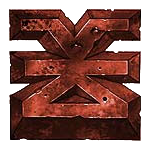
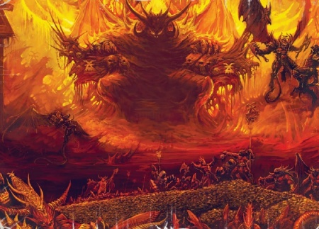
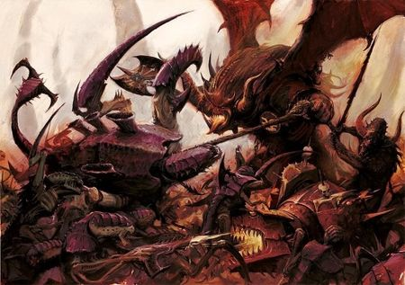
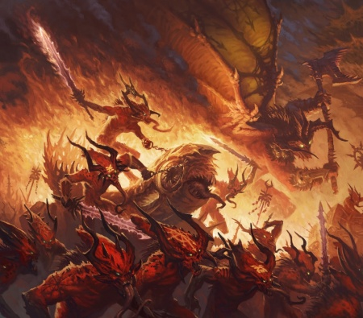
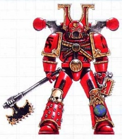
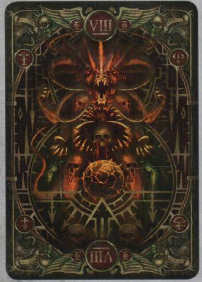

# 0510 恐虐 Khorne

精校状态：中文行文已逐段精校，部分术语仍为暂定

分类：组织 / 混沌 Chaos / 混沌诸神 Chaos Gods

原文来源：https://www.bilibili.com/opus/1211508058333642835

原作者：帝国神选罐头

原文时间：2026年06月08日 18:30

[返回分类目录](目录.md) · [全书目录](../../目录.md)

<!-- A0510-B0001 -->
**英文原文**

Khorne, the Blood God, is the Chaos God of anger, violence, and hate. Khorne was the first to awake of the four Gods of Chaos, fully coming into existence during Terra's Middle Ages - an era of wars blooming in the wake of his birth. Every act of violence gives Khorne power, whether committed by his followers or by their enemies. His titles include the Lord of Rage, the Taker of Skulls, the Lord of Battle, the Lord Gore, the Master of the Brazen Throne and the Great Butcher.

<!-- /A0510-B0001 -->

<!-- A0510-B0002 -->

原译文

恐虐，血神，是愤怒、暴力和仇恨的混沌之神。恐虐是第一个觉醒的混沌四神，在泰拉的中世纪完全存在，这是一个在祂诞生后爆发战争的时代。每一次暴力行为都赋予了恐虐力量，无论是他的追随者还是他们的敌人。他的头衔包括怒火之王、夺颅者、战斗之王、流血之王、黄铜王座之主和大屠夫。

**校订译文**

血神恐虐是愤怒、暴力与仇恨的混沌之神。祂是混沌四神中最早觉醒的一位，在泰拉的中世纪完全成形；祂的诞生也开启了一个战乱纷起的时代。无论暴力来自信徒还是信徒的敌人，每一次暴力行为都会增强恐虐的力量。祂的名号包括怒火之王、夺颅者、战斗之王、流血之王、黄铜王座之主与大屠夫。

**校注：** 此处关于恐虐在泰拉中世纪完全成形的年代说法，来自所给英文原稿；保留这一版本，不据其他混沌起源叙述擅自改写。

<!-- /A0510-B0002 -->

<!-- A0510-B0003 图片 -->

<!-- A0510-B0004 -->
**英文原文**

Titles:Lord of Rage, Taker of Skulls, Lord of Battle, Lord Gore, Master of the Brazen Throne, Blood God, Great Butcher

<!-- /A0510-B0004 -->

<!-- A0510-B0005 -->

原译文

头衔：怒火之王、夺颅者、战斗之王、流血之王、黄铜王座之主和大屠夫

**校订译文**

头衔：怒火之王、夺颅者、战斗之王、流血之王、黄铜王座之主、血神、大屠夫

**校注：** 原译漏列 Blood God，补“血神”。Taker of Skulls 为恐虐头衔，虽译作夺颅者，不与同名恶魔角色 Skulltaker 合并。

<!-- /A0510-B0005 -->

<!-- A0510-B0006 -->
**英文原文**

Status:Active

<!-- /A0510-B0006 -->

<!-- A0510-B0007 -->

原译文

状态：活动

**校订译文**

状态：活跃

<!-- /A0510-B0007 -->

<!-- A0510-B0008 -->
**英文原文**

Type:Chaos God

<!-- /A0510-B0008 -->

<!-- A0510-B0009 -->

原译文

类型：混沌之神

**校订译文**

类型：混沌之神

<!-- /A0510-B0009 -->

<!-- A0510-B0010 -->
**英文原文**

Domains:Hate, Rage, Anger, Violence, Warfare, Bloodshed, Reckless/Indiscriminate Killing, Slaughter, Murder

<!-- /A0510-B0010 -->

<!-- A0510-B0011 -->

原译文

领域：仇恨、怒火、愤怒、暴力、战争、流血、鲁莽/滥杀、屠杀、谋杀

**校订译文**

领域：仇恨、狂怒、愤怒、暴力、战争、流血、鲁莽或不分对象的杀戮、屠杀、谋杀

<!-- /A0510-B0011 -->

<!-- A0510-B0012 -->
**英文原文**

Daemons:Bloodthirster, Bloodletter, Flesh Hound, Juggernaut

<!-- /A0510-B0012 -->

<!-- A0510-B0013 -->

原译文

恶魔：嗜血狂魔，放血鬼，血肉猎犬，钢牛

**校订译文**

恶魔：嗜血狂魔、放血者、血肉猎犬、铁甲兽

**校注：** Juggernaut 按官方整名“骑铁甲兽的领主”确认词根铁甲兽，原稿钢牛；词根参考，非独立整名认证。

<!-- /A0510-B0013 -->

<!-- A0510-B0014 -->
**英文原文**

Home:Brass Citadel

<!-- /A0510-B0014 -->

<!-- A0510-B0015 -->

原译文

家园：黄铜城堡

**校订译文**

家园：黄铜城堡

<!-- /A0510-B0015 -->

<!-- A0510-B0016 -->
**英文原文**

Affiliation:Daemons

<!-- /A0510-B0016 -->

<!-- A0510-B0017 -->

原译文

隶属关系：恶魔

**校订译文**

隶属关系：恶魔

<!-- /A0510-B0017 -->

<!-- A0510-B0018 -->
**英文原文**

Followers:World Eaters

<!-- /A0510-B0018 -->

<!-- A0510-B0019 -->

原译文

追随者：吞世者

**校订译文**

追随者：吞世者

<!-- /A0510-B0019 -->

<!-- A0510-B0020 -->
**英文原文**

Adjectives:Khornate

<!-- /A0510-B0020 -->

<!-- A0510-B0021 -->

原译文

形容词：恐虐的

**校订译文**

形容词：恐虐的

<!-- /A0510-B0021 -->

<!-- A0510-B0022 -->
**英文原文**

Sacred Number:8

<!-- /A0510-B0022 -->

<!-- A0510-B0023 -->

原译文

圣数：8

**校订译文**

圣数：8

<!-- /A0510-B0023 -->

<!-- A0510-B0024 -->
**英文原文**

Symbols:Skull, Brass, Bronze, Red, Black

<!-- /A0510-B0024 -->

<!-- A0510-B0025 -->

原译文

标志：颅骨，黄铜、青铜、红色、黑色

**校订译文**

标志：颅骨，黄铜、青铜、红色、黑色

<!-- /A0510-B0025 -->

<!-- A0510-B0026 -->
**英文原文**

Enemies:Slaanesh

<!-- /A0510-B0026 -->

<!-- A0510-B0027 -->

原译文

敌人：色孽

**校订译文**

敌人：色孽

<!-- /A0510-B0027 -->

<!-- A0510-B0028 -->
## Overview 概述

<!-- /A0510-B0028 -->

<!-- A0510-B0029 -->
**英文原文**

The name "Khorne" derives from his Dark Tongue name,"Kharneth", meaning "Lord of Rage" or "Lord of Blood".

<!-- /A0510-B0029 -->

<!-- A0510-B0030 -->

原译文

“恐虐”这个名字来源于他的暗语名“卡尔内特”，意思是“怒火之王”或“鲜血之王”。

**校订译文**

“恐虐”这个名字来源于他的暗语名“卡尔内特”，意思是“怒火之王”或“鲜血之王”。

<!-- /A0510-B0030 -->

<!-- A0510-B0031 -->
**英文原文**

Although Khorne despises the use of magic and accordingly hates Tzeentch, Slaanesh is the one he loathes most of all. Khorne and Slaanesh personify two entirely opposing aspects of Chaos, and Khorne considers Slaanesh's self-indulgent sensualities insulting. Khorne is said to have inherited the instinctive values of martial honour, pride and bravery, some of Khorne's followers using these to justify their killings. But Khorne's most fanatical worshippers know that Khorne cares not from where the blood flows, only that it does - all else is meaningless artifice. His associated number is eight, reflected in the organisation of his armies, and in smaller matters such as the number of syllables in a daemonic follower's name.

<!-- /A0510-B0031 -->

<!-- A0510-B0032 -->

原译文

尽管恐虐鄙视魔法的使用，因此也讨厌奸奇，但色孽是他最讨厌的。恐虐和色孽代表了混沌的两个完全相反的方面，恐虐认为色孽的自我放纵的感官是一种侮辱。据说恐虐继承了军事荣誉、骄傲和勇敢的本能价值观，恐虐的一些追随者利用这些来为他们的杀戮辩护。但恐虐最狂热的信徒知道，恐虐不在乎血从哪里流出来，只在乎血从何而来 — 其他一切都是毫无意义的诡计。他的关联数字是8，这反映在他的军队的组织上，也反映在较小的事情上，比如恶魔追随者的名字中的音节数量。

**校订译文**

恐虐鄙视魔法，因此憎恨奸奇，但祂最厌恶的仍是色孽。两者分别体现混沌截然相反的面向，恐虐将色孽放纵感官的行为视为侮辱。据说恐虐也秉持尚武者的荣誉、骄傲与勇气，部分信徒借此为杀戮辩护。然而，最狂热的崇拜者深知：恐虐不在乎鲜血来自何处，只在乎鲜血是否流淌，其他一切都只是毫无意义的矫饰。祂的圣数是八，从军队编制，到恶魔仆从姓名中的音节数，都体现着这一数字。

**校注：** 原译误将 only that it does 重译为“只在乎血从何而来”，修复为只在乎鲜血流淌。

<!-- /A0510-B0032 -->

<!-- A0510-B0033 -->
**英文原文**

Images of Khorne show it to be a mighty being, sitting upon a great throne of brass atop a mountainous pile of bleached skulls centred in a lake of blood. The skulls are of all those slain by Khorne's Champions, and of all his slain Champions, ranging from Human heads beyond counting to gigantic Tyranid skulls the size of hab-blocks. The mountain slowly grows ever higher. Khorne himself is most commonly depicted as a gargantuan figure, broad and muscular, with a snarling hound-like countenance brooding beneath his red and black armour of brass and iron. His every word is a growl of inexhaustible rage, and his roar is that of pure bloodlust, echoing across his realm.

<!-- /A0510-B0033 -->

<!-- A0510-B0034 -->

原译文

恐虐的图像显示它是一个强大的存在，坐在一个巨大的黄铜王座上，上面是一堆以血湖为中心的退色颅骨。这些头骨是所有被恐虐的冠军杀死的人的头骨，也是他所有被杀的冠军的头骨，从数不清的人头到区块大小的巨大的泰伦颅骨。山慢慢地越来越高。恐虐本人最常被描绘成一个巨大的人，宽阔而肌肉发达，在他红黑相间的黄铜和铁的盔甲下，有一张咆哮的猎犬般的脸。他的每一句话都是无尽愤怒的咆哮，他的咆哮是纯粹的嗜血，回荡在他的领域里。

**校订译文**

在恐虐的画像中，祂是一位强大的存在，端坐于巨大的黄铜王座。王座立在堆积如山的惨白颅骨之上，颅骨山又坐落在血湖中央。堆积于此的既有恐虐勇士斩下的首级，也有阵亡勇士自己的颅骨：小至数不清的人类头骨，大至住宅楼般庞大的泰伦颅骨。这座山仍在缓缓增高。恐虐本人通常被描绘得硕大无比、肩背宽阔、肌肉虬结，身披由黄铜与钢铁制成的红黑铠甲，一张猎犬般的面孔在甲胄下阴沉咆哮。祂每说一句话，都如同无尽愤怒的低吼；祂的怒号则满含纯粹的嗜血欲望，响彻整个领域。

<!-- /A0510-B0034 -->

<!-- A0510-B0035 图片 -->

<!-- A0510-B0036 -->

原译文

Khorne on his Skull Throne 恐虐在祂的颅骨王座上

**校订译文**

Khorne on his Skull Throne 恐虐在祂的颅骨王座上

<!-- /A0510-B0036 -->

<!-- A0510-B0037 -->
**英文原文**

Khorne's domain is known as the Fortress of Khorne and includes his Brass Citadel.

<!-- /A0510-B0037 -->

<!-- A0510-B0038 -->

原译文

恐虐的领地被称为恐虐堡垒，包括他的黄铜城堡。

**校订译文**

恐虐的领地被称为恐虐堡垒，包括他的黄铜城堡。

<!-- /A0510-B0038 -->

<!-- A0510-B0039 -->
## Worship of Khorne 恐虐崇拜

<!-- /A0510-B0039 -->

<!-- A0510-B0040 -->
**英文原文**

Khorne's followers are warriors without exception, in mind if not in occupation. His followers build no temples but rather worship him on the battlefield. To devote time to building temples rather than fighting for something would more likely incur Khorne's wrath than please him. Worship of Khorne is purely through bloodshed, either from one's enemies in victory or one's own through earnest struggle; it is said that any follower who allows a day to pass without contributing to this act of worship will incur Khorne's displeasure.

<!-- /A0510-B0040 -->

<!-- A0510-B0041 -->

原译文

恐虐的追随者无一例外都是战士，即使不是在工作期间。他的追随者没有建造神殿，而是在战场上崇拜他。把时间花在建造神殿上，而不是为某事而战，更有可能招致恐虐的愤怒，而不是取悦他。对恐虐的崇拜纯粹是通过流血来实现的，要么来自胜利的敌人，要么来自自己的敌人，通过认真的斗争；据说，任何允许一天过去而不参与这种崇拜行为的追随者都会招致恐虐的不满。

**校订译文**

恐虐的信徒无一例外都具有战士的心性，即使并非以战斗为业。他们不建造神殿，而是在战场上敬奉恐虐。花时间修建神殿而非为某个目标战斗，更可能激怒祂，而不是取悦祂。对恐虐的崇拜完全通过流血实现：可以是胜利时敌人流下的鲜血，也可以是自己奋力搏杀时流下的血。据说，任何信徒若有一天不曾献上这样的敬拜，就会招致恐虐的不满。

**校注：** 修复 in mind if not in occupation 与敌我双方鲜血的施受关系。

<!-- /A0510-B0041 -->

<!-- A0510-B0042 图片 -->

<!-- A0510-B0043 -->

原译文

Daemons of Khorne fighting Tyranids 恐虐恶魔与泰伦战斗

**校订译文**

Daemons of Khorne fighting Tyranids 恐虐恶魔与泰伦战斗

<!-- /A0510-B0043 -->

<!-- A0510-B0044 -->
**英文原文**

The battle-cry of the followers of Khorne reflects his desire for wanton violence and is feared by all who hear it: 'Blood for the Blood God! Skulls for the Skull Throne!'.

<!-- /A0510-B0044 -->

<!-- A0510-B0045 -->

原译文

恐虐的追随者的战吼反映了他对肆意的暴力的渴望，所有听到它的人都会害怕：“血祭血神！颅献颅座！'.

**校订译文**

恐虐信徒的战吼道出祂对肆意暴力的渴望，令闻者胆寒：“血祭血神！颅献颅座！”

<!-- /A0510-B0045 -->

<!-- A0510-B0046 -->
**英文原文**

In the mythology of the primitive inhabitants of Fenris, "Ghorghe" (presumably a misinterpretation of Khorne) is an evil deity, described as the offspring of the dark god Horus and the dragon goddess Skrinneir, and is imprisoned within one of the planet's volcanic islands after being defeated by Leman Russ.

<!-- /A0510-B0046 -->

<!-- A0510-B0047 -->

原译文

在芬里斯原始居民的神话中，“戈格赫”（可能是对恐虐的错误解释）是一个邪恶的神，被描述为黑暗神荷鲁斯和龙女神斯克林尼尔的后代，在被黎曼·鲁斯击败后被囚禁在行星上的一个火山岛上。

**校订译文**

在芬里斯原住民的神话中，“戈格赫”（推测是恐虐之名的讹传）是一位邪神，是黑暗之神荷鲁斯与龙女神斯克林奈尔的后代。传说祂被黎曼·鲁斯击败后，囚禁在这颗行星的一座火山岛内。

<!-- /A0510-B0047 -->

<!-- A0510-B0048 -->
## The Sacred Number Eight 圣数八

<!-- /A0510-B0048 -->

<!-- A0510-B0049 -->
**英文原文**

Why Khorne is connected to the number eight is unknown, but it has been so since the Warp first echoed to his fury. His affinity for the figure, and any of its multiples, is strongly reflected in the organisation of his legions – from the number of Bloodthirster ranks to the number of cohorts in a full strength legion. It is a number that also appears throughout the Blood God’s domain in the Immaterium, as eight enormous towers ring the Brass Citadel, and a Daemon slain in realspace must complete eight tasks before Khorne will once again give them shape. In the most sprawling of battles within the Warp, it is always Khorne’s eighth wave that is the most powerful. Even his mortal worshippers recognise and revere the sacred number, using it in their blood-soaked summoning rituals and carving it upon their flesh in gruesome ceremonies. The seers of many races have foretold that only after eight ages of war have passed will Khorne’s blood-thirst finally be slaked by a last, apocalyptic battle.

<!-- /A0510-B0049 -->

<!-- A0510-B0050 -->

原译文

为什么恐虐与数字8有关尚不清楚，但自从亚空间首次回应他的愤怒以来，情况就一直如此。他对这个数及其任何倍数的喜爱都强烈地反映在他的军团的组织中 — 从嗜血狂魔的数量到全兵力军团中的大队数量。这个数字也出现在非物质界的血神领地上，因为八座巨大的塔楼环绕着黄铜城堡，一个在现实空间中被杀死的恶魔必须完成八项任务，然后恐虐才会再次塑造它们。在亚空间最庞大的战斗中，恐虐的第八波总是最强大的。甚至他的凡人崇拜者也认识并敬畏这个神圣的数字，在他们浸透鲜血的召唤仪式中使用它，并在可怕的仪式中将其刻在他们的身上。许多种族的预言家预言，只有在八个时代的战争结束后，霍恩的嗜血才能最终被最后一场世界末日般的战斗所满足。

**校订译文**

恐虐为何与数字八相连，无人知晓；但自亚空间首次回荡祂的怒吼，这种关联便已存在。祂对八及其倍数的偏爱，鲜明地体现在军团编制中：嗜血狂魔的等级数、满编军团的大队数，都遵循这一数字。八也遍布血神在非物质界的领域：黄铜城堡由八座巨塔环绕，而在现实空间遭到杀死的恶魔，必须完成八项任务，才能由恐虐重塑形体。在亚空间规模最为浩大的战役中，恐虐的第八波攻势总是最强。凡人信徒也敬畏这个圣数，在血腥的召唤仪式中运用它，甚至以骇人的仪式将其刻在皮肉上。许多种族的先知都曾预言，只有经过八个战争纪元，恐虐的嗜血渴望才会在最后一场末日决战中得到满足。

**校注：** Bloodthirster ranks 指嗜血狂魔的等级数量，不是恶魔个体总数；并改正“霍恩”误音译。

<!-- /A0510-B0050 -->

<!-- A0510-B0051 -->
## Daemons of Khorne 恐虐恶魔

<!-- /A0510-B0051 -->

<!-- A0510-B0052 -->
## The Blood Legions 鲜血军团

**校注：** GW-09 第 12 页鲜血军团对应 GW-10 第 13 页 Blood Legion；此处指恐虐恶魔军队，不能与第 225 篇同英文名的圣血军团战团混为一条。

<!-- /A0510-B0052 -->

<!-- A0510-B0053 -->
**英文原文**

The Daemonic Legions of Khorne are collectively referred to as the Blood Legions. They are the largest and most martial of the Daemonic armies of the Immaterium. Though savage and unrestrained, they nonetheless have a strict hierarchy determined by martial prowess. Each of the innumberable Blood Legions are divided into eight cohorts, each of which is led by a Khornate Daemonic Herald or Daemon Prince. The Blood Legions specialise in melee combat, though variants do exist. Red Tide Legions are made up of Bloodletters which overrun the foe in waves of attacks while Hellfire Legions specialise in siege warfare and Daemon Engines. Brazen Thunder Legions are the most mobile of Khorne's Legions, made up of Bloodcrushers, Blood Thrones, and Flesh Hound packs.

<!-- /A0510-B0053 -->

<!-- A0510-B0054 -->

原译文

恐虐的恶魔军团统称为鲜血军团。他们是非物质界中规模最大、最具军事力量的恶魔军队。虽然野蛮放纵，但他们有着严格的等级制度，这取决于他们的军事实力。无数鲜血军团中的每一个都被分为八个大队，每个大队都由一名恐虐传令官或恶魔王子领导。鲜血军团擅长近战，尽管确实存在变体。赤潮军团由放血鬼组成，在一波又一波的攻击中击败敌人，而狱火军团则专门从事攻城战和恶魔引擎。铜雷军团是恐虐军团中最具机动性的，由碎血者、鲜血王座和血肉猎犬组成。

**校订译文**

恐虐的恶魔军团统称鲜血军团，是非物质界规模最大、最为尚武的恶魔军队。它们虽野蛮狂放，却遵守以战斗实力划分的严格等级。每个鲜血军团都分为八个大队，各由一位恐虐恶魔传令官或恶魔亲王统领。鲜血军团以近战见长，但也有不同类型：赤潮军团由放血者组成，以接连不断的攻势淹没敌人；狱火军团专精攻城战与恶魔引擎；铜雷军团则拥有最强机动性，由碾血骑兵、鲜血宝座与成群血肉猎犬组成。

<!-- /A0510-B0054 -->

<!-- A0510-B0055 -->
## Khornate Daemons 恐虐恶魔

<!-- /A0510-B0055 -->

<!-- A0510-B0056 图片 -->

<!-- A0510-B0057 -->

原译文

horde of Khornate Daemons 恐虐恶魔部落

**校订译文**

horde of Khornate Daemons 恐虐恶魔大军

<!-- /A0510-B0057 -->

<!-- A0510-B0058 -->
**英文原文**

Bloodthirsters (Khak'akaoz'khyshk'akami)

<!-- /A0510-B0058 -->

<!-- A0510-B0059 -->

原译文

嗜血狂魔(卡克'阿卡奥兹'基什克 '阿卡米)

**校订译文**

嗜血狂魔(卡克'阿卡奥兹'基什克 '阿卡米)

<!-- /A0510-B0059 -->

<!-- A0510-B0060 -->
**英文原文**

The Greater Daemons of Khorne. Of all the Daemons of Chaos they bear the greatest resemblance to the archetypal demon, having a Human body, cloven hooves, leathery bat-like wings and horned dogs-heads. They wield a fiery whip and a massive two-headed battleaxe (which, in original background were daemon weapons binding another Bloodthirster) simultaneously in battle. They are the strongest and most aggressive of all Daemons, their muscle-bound forms having been fashioned from pure rage. Bloodthirsters (and other Greater Daemons) are only known as "Bloodthirsters" by scholars of the forbidden and esoteric, while other Imperial forces facing these entities in the battlefield might have other names for them, an example being "Skullrender" coined by veterans of Catachan. The mightiest Bloodthirster of Khorne is An'ggrath the Unbound. In the last 10,000 years, An'ggrath has only been summoned twice from the Warp. Both successful summonings have resulted in great loss for the Imperium as many worlds fell to his terrible wrath.

<!-- /A0510-B0060 -->

<!-- A0510-B0061 -->

原译文

恐虐的大魔。在所有混沌的恶魔中，它们与原型恶魔最相似，有一个人类身体、偶蹄、坚韧的蝙蝠般的翅膀和有角的狗头。他们在战斗中同时挥舞着一根炽热的鞭子和一把巨大的双头战斧（在最初的背景中，这是束缚者另一只嗜血狂魔的恶魔武器）。他们是所有恶魔中最强壮、最具攻击性的，他们的肌肉束缚形式是由纯粹的愤怒形成的。嗜血狂魔（和其他大魔）只被禁止和秘传的学者称为“嗜血狂魔”，而在战场上面对这些实体的其他帝国部队可能会有其他的名字，一个例子是卡塔昌老兵创造的“供颅者”。恐虐最强大的嗜血狂魔是无束者安'格拉斯。在过去的一万年里，安格拉斯只被从亚空间召唤过两次。两次成功的召唤都给帝国带来了巨大的损失，因为许多世界都落入了他的可怕愤怒之中。

**校订译文**

恐虐的大魔。在所有混沌恶魔中，它们的外形最接近传统恶魔意象：人形躯干、分趾蹄足、蝙蝠般的革质双翼，以及长角的犬首。战斗时，它们一手挥舞火焰长鞭，另一手持巨大的双头战斧；在早期设定中，这种斧头是封印着另一头嗜血狂魔的恶魔武器。它们是最强壮、最凶暴的恶魔，肌肉虬结的身躯由纯粹怒火塑成。“嗜血狂魔”这一名称主要为研究禁忌与秘学的学者所知；帝国其他部队在战场上遭遇它们时，可能另起称呼，例如卡塔昌老兵便称其为“裂颅者”。恐虐最强大的嗜血狂魔是无束者安’格拉斯。在过去一万年中，祂仅两次被从亚空间召入现实，但每次都令帝国蒙受巨大的损失，许多世界毁于祂可怖的怒火。

**校注：** Skullrender 暂定“裂颅者”（原稿供颅者）。英文关于名称的句子括注“and other Greater Daemons”范围含混；中文按本段主题叙述嗜血狂魔的学术称呼，不推论所有大魔均称嗜血狂魔。保留其“两次召唤”等原稿版本信息。

<!-- /A0510-B0061 -->

<!-- A0510-B0062 -->
**英文原文**

Bloodletters (Khak'akamshy'y)

<!-- /A0510-B0062 -->

<!-- A0510-B0063 -->

原译文

放血鬼(卡克'阿卡姆希伊)

**校订译文**

放血者（卡克’阿卡姆希伊）

<!-- /A0510-B0063 -->

<!-- A0510-B0064 -->
**英文原文**

The common Daemons of Khorne. They are horned humanoids with hunched, crested backs, their limbs wiry but notoriously strong. They care nothing for strategy or subtlety as they are anger personified. Unless guided by a higher intellect, they will simply hurl themselves into battle, heedless of the risks involved. To be in the presence of a Bloodletter is to experience new heights of religious ecstasy for a follower of Khorne. To fight alongside them is enough to drive many warriors to a deranged euphoria that results in permanent insanity. Bloodletters almost exclusively wield blood-drinking blades called Hellblades. These blades present their one source of pleasure, allowing them to hack into mortal flesh. Bloodletters are also known as the Naked Slayers, the Teeth of Death and the Horned Ones. Sub-types of Bloodletters include Bloodmasters.

<!-- /A0510-B0064 -->

<!-- A0510-B0065 -->

原译文

恐虐的普通恶魔。它们是有角的类人生物，驼背，四肢瘦削，但以强壮而闻名。他们不在乎策略或微妙之处，因为他们是愤怒的化身。除非有更高的智慧指导，否则他们只会不顾一切地投入战斗。对于恐虐的追随者来说，在放血鬼面前是体验宗教狂喜的新高度。与他们并肩作战足以让许多战士极度兴奋，导致永久性精神失常。放血鬼几乎只挥舞着被称为地狱之刃的饮血剑。这些刀刃提供了它们快乐的一个来源，使它们能够侵入凡人的血肉。放血者也被称为裸体杀手、死亡之牙和有角者。放血鬼的子类型包括鲜血之主。

**校订译文**

恐虐常见的恶魔。它们是长角的类人生物，佝偻的背部生有脊冠，四肢看似精瘦，却以巨力著称。它们是愤怒的化身，不在乎战略或巧计；若无更高智慧者引导，就只会不顾危险地冲入战场。对恐虐信徒而言，置身放血者身旁，便能体验前所未有的宗教狂喜；与它们并肩作战，更会让许多战士陷入癫狂的亢奋，乃至永远丧失理智。放血者几乎只使用一种称为地狱之刃的饮血利刃。挥刀劈入凡人的血肉，是它们唯一的乐趣。它们也被称为赤身杀手、死亡之牙与有角者，鲜血主宰则是其中一种类型。

<!-- /A0510-B0065 -->

<!-- A0510-B0066 -->
**英文原文**

Flesh Hounds (Kha'a'a Khak'hyshk)

<!-- /A0510-B0066 -->

<!-- A0510-B0067 -->

原译文

血肉猎犬(卡阿'阿'阿卡克'希什克)

**校订译文**

血肉猎犬(卡阿'阿'阿卡克'希什克)

<!-- /A0510-B0067 -->

<!-- A0510-B0068 -->
**英文原文**

The Daemon Beasts of Khorne are the monstrous and ferocious vaguely-canine creatures notorious for their ability to track down their chosen prey by tracking the psychic spoor of their victims. They are also known as Hunters of Blood and have claws to rend their foes apart once they catch them. They exist for the sheer thrill of the chase and the inevitable kill. By some accounts, the Flesh Hounds were loosed against cowardly warriors who killed the weak and unworthy.

<!-- /A0510-B0068 -->

<!-- A0510-B0069 -->

原译文

恐虐的恶魔野兽是一种可怕而凶猛的类犬生物，因其能够通过追踪受害者的灵能痕迹来追踪他们选择的猎物而臭名昭著。它们也被称为鲜血猎手，一旦抓到敌人，它们就会用爪子把敌人撕裂。它们的存在纯粹是为了追逐的刺激和不可避免的杀戮。根据某些说法，血肉猎犬被用来对付杀害弱者和不值得尊重的懦弱战士。

**校订译文**

恐虐的恶魔野兽，是外形近似犬类的凶残怪物。它们因能够循着受害者的灵能痕迹追踪目标而声名狼藉，又称鲜血猎手；一旦追上敌人，就会用利爪将其撕碎。它们只为追逐的刺激与最终必然到来的杀戮而存在。某些记载声称，血肉猎犬会被放出去追杀那些专杀弱者、屠戮不堪一战之人的懦夫。

**校注：** 原文 weak and unworthy 修饰被杀者；修正原译使“不值得尊重”错误落在懦弱战士上的歧义。

<!-- /A0510-B0069 -->

<!-- A0510-B0070 -->
**英文原文**

Juggernauts (Kha'a'a Akh'h)

<!-- /A0510-B0070 -->

<!-- A0510-B0071 -->

原译文

钢牛(卡阿'阿'阿赫'赫)

**校订译文**

铁甲兽(卡阿'阿'阿赫'赫)

<!-- /A0510-B0071 -->

<!-- A0510-B0072 -->
**英文原文**

Daemonic steeds of Khorne, sometimes granted to Champions of Khorne as mounts. Huge beasts made from living daemonic metal, it roughly resembles a gigantic rhinoceros. These beasts, being amongst Khorne's most savage and belligerent daemons, are kept in pens where they tend to fight for dominance amongst themselves. However, a particularly favoured mortal or daemonic champion will sometimes attempt to claim one as a mount. This is no easy task, and the smashed remnants of the unlucky ones are left smeared around the Juggernauts' pens, but a few are successful and subdue one, receiving the boon of being its master and riding it into battle.

<!-- /A0510-B0072 -->

<!-- A0510-B0073 -->

原译文

恐虐的恶魔坐骑，有时作为坐骑授予恐虐冠军。由活的恶魔金属制成的巨大野兽，它大致像一只巨大的犀牛。这些野兽是恐虐最野蛮、最好战的恶魔之一，它们被关在围栏里，在那里它们往往会为自己的统治地位而战。然而，一个特别受宠的凡人或恶魔冠军有时会试图将其作为坐骑。这不是一件容易的事，被砸碎的不幸者的残余物被涂抹在钢牛的围栏上，但也有一些人成功地制服了一只，成为了它的主人，并骑着它投入战斗。

**校订译文**

恐虐的恶魔坐骑，有时会被赐给祂麾下的勇士。它们由活的恶魔金属构成，体形庞大，外观大致近似巨型犀牛。铁甲兽是恐虐最野蛮好斗的恶魔之一，通常被关在兽栏中，彼此争斗以决出强弱。有时，格外受宠的凡人或恶魔勇士会尝试驯服一头作为坐骑。这绝非易事：兽栏周围到处涂抹着失败者被撞碎的残骸。只有少数人能够成功降服铁甲兽，获享成为其主人的恩赐，并骑着它投入战斗。

<!-- /A0510-B0073 -->

<!-- A0510-B0074 -->
## Gifts of Khorne 恐虐之礼

<!-- /A0510-B0074 -->

<!-- A0510-B0075 -->
**英文原文**

As with all the Chaos Gods, Khorne will often reward his most favoured followers with special gifts and blessings. Khorne's gifts can take many forms, including physical mutations, daemon weapons or heightened strength.

<!-- /A0510-B0075 -->

<!-- A0510-B0076 -->

原译文

与所有混沌诸神一样，恐虐经常用特殊的礼物和祝福来奖励他最宠爱的追随者。恐虐之礼可以采取多种形式，包括身体突变、恶魔武器或增强的力量。

**校订译文**

与其他混沌之神一样，恐虐经常以特殊赐礼与祝福奖赏最受宠爱的追随者。恐虐之礼形式多样，包括肉体突变、恶魔武器或增强的力量。

<!-- /A0510-B0076 -->

<!-- A0510-B0077 -->
## The Fortress of Khorne 恐虐堡垒

<!-- /A0510-B0077 -->

<!-- A0510-B0078 -->
**英文原文**

The Fortress of Khorne is Khorne's realm within the Warp. It is a monument to fury and bloodshed, and is built upon foundations of murder and conflict. This blood-soaked realm echoes constantly with Khorne's bellows and the clash of weapons.

<!-- /A0510-B0078 -->

<!-- A0510-B0079 -->

原译文

恐虐堡垒是恐虐在亚空间的领地。它是愤怒和流血的纪念碑，建立在谋杀和冲突的基础上。这个浸血的领域不断地回荡着恐虐的咆哮和武器的冲突。

**校订译文**

恐虐堡垒是恐虐在亚空间中的领域。它是献给愤怒与流血的丰碑，以谋杀和冲突为基石。在这片浸透鲜血的国度，恐虐的咆哮与兵器交击声永不停息。

<!-- /A0510-B0079 -->

<!-- A0510-B0080 -->
## Forces dedicated to Khorne 献身于恐虐的部队

<!-- /A0510-B0080 -->

<!-- A0510-B0081 -->
## Chaos Space Marines 混沌星际战士

<!-- /A0510-B0081 -->

<!-- A0510-B0082 -->
**英文原文**

The World Eaters Traitor Legion: Chaos Space Marines who have been dedicated to Khorne since the time of the Horus Heresy. Since the aftermath of the Heresy, the legion no longer operates as a whole but is split into many smaller warbands, known sub-factions include:

<!-- /A0510-B0082 -->

<!-- A0510-B0083 -->

原译文

吞世者叛徒军团：自荷鲁斯叛乱时代以来一直献身于恐虐的混沌星际战士。自叛乱之后，军团不再作为一个整体运作，而是分裂成许多较小的战帮，已知的子派系包括：

**校订译文**

吞世者叛徒军团：自荷鲁斯之乱以来便奉献于恐虐的混沌星际战士。叛乱后，军团不再作为整体行动，而是分裂成许多规模较小的战帮。已知派系包括：

<!-- /A0510-B0083 -->

<!-- A0510-B0084 图片 -->

<!-- A0510-B0085 -->

原译文

World Eater berzerker 吞世者狂战士

**校订译文**

World Eater berzerker 吞世者狂战士

<!-- /A0510-B0085 -->

<!-- A0510-B0086 -->

原译文

66th Armoured Company 第66装甲连队

**校订译文**

66th Armoured Company 第 66 装甲连

<!-- /A0510-B0086 -->

<!-- A0510-B0087 -->

原译文

Angron's Chosen 安格隆亲选

**校订译文**

Angron's Chosen 安格隆亲选

<!-- /A0510-B0087 -->

<!-- A0510-B0088 -->

原译文

Axes of the Forge 铸炉之斧

**校订译文**

Axes of the Forge 铸炉之斧

<!-- /A0510-B0088 -->

<!-- A0510-B0089 -->

原译文

Ba'ar Zul's Cleavers 巴’尔·祖尔的砍刀

**校订译文**

Ba'ar Zul's Cleavers 巴’尔·祖尔的砍刀

<!-- /A0510-B0089 -->

<!-- A0510-B0090 -->

原译文

Berserkers of Skallathrax 斯卡拉特拉克斯狂战士

**校订译文**

Berserkers of Skallathrax 斯卡拉特拉克斯狂战士

<!-- /A0510-B0090 -->

<!-- A0510-B0091 -->

原译文

Blood Legion of Khorne 恐虐鲜血军团

**校订译文**

Blood Legion of Khorne 恐虐鲜血军团

<!-- /A0510-B0091 -->

<!-- A0510-B0092 -->

原译文

Bloody Dawn 血腥黎明

**校订译文**

Bloody Dawn 血腥黎明

<!-- /A0510-B0092 -->

<!-- A0510-B0093 -->

原译文

Bloodstalkers 鲜血追猎者

**校订译文**

Bloodstalkers 鲜血追猎者

<!-- /A0510-B0093 -->

<!-- A0510-B0094 -->

原译文

Bonescar 骨疤

**校订译文**

Bonescar 骨疤

<!-- /A0510-B0094 -->

<!-- A0510-B0095 -->

原译文

The Brazen Butchers 黄铜屠夫

**校订译文**

The Brazen Butchers 黄铜屠夫

<!-- /A0510-B0095 -->

<!-- A0510-B0096 -->

原译文

The Butcherhorde 屠夫部落

**校订译文**

The Butcherhorde 屠夫部落

<!-- /A0510-B0096 -->

<!-- A0510-B0097 -->

原译文

Crimson Desecrators 深红亵渎者

**校订译文**

Crimson Desecrators 深红亵渎者

<!-- /A0510-B0097 -->

<!-- A0510-B0098 -->

原译文

Crushers of Bone 碎骨者

**校订译文**

Crushers of Bone 碎骨者

<!-- /A0510-B0098 -->

<!-- A0510-B0099 -->

原译文

Dhorngar's Goredrinkers 霍恩加尔的饮血者

**校订译文**

Dhorngar's Goredrinkers 霍恩加尔的饮血者

<!-- /A0510-B0099 -->

<!-- A0510-B0100 -->

原译文

Eight Sons 八子

**校订译文**

Eight Sons 八子

<!-- /A0510-B0100 -->

<!-- A0510-B0101 -->

原译文

Fifteen Fangs 十五獠牙

**校订译文**

Fifteen Fangs 十五獠牙

<!-- /A0510-B0101 -->

<!-- A0510-B0102 -->

原译文

Fire Riders 火焰骑手

**校订译文**

Fire Riders 火焰骑手

<!-- /A0510-B0102 -->

<!-- A0510-B0103 -->

原译文

Fleshreavers 血肉掠夺者

**校订译文**

Fleshreavers 血肉掠夺者

<!-- /A0510-B0103 -->

<!-- A0510-B0104 -->

原译文

The Foresworn 弃誓者

**校订译文**

The Foresworn 弃誓者

<!-- /A0510-B0104 -->

<!-- A0510-B0105 -->

原译文

Gladiator Cadre 331 角斗士干部331

**校订译文**

Gladiator Cadre 331 第 331 角斗士骨干队

**校注：** Cadre 为一支骨干部队，非单个“干部”；单位名称暂定，保留第 331 编号。

<!-- /A0510-B0105 -->

<!-- A0510-B0106 -->

原译文

Gladiator Group 138 角斗士队138

**校订译文**

Gladiator Group 138 第 138 角斗士队

<!-- /A0510-B0106 -->

<!-- A0510-B0107 -->

原译文

Gorehunters 流血猎手

**校订译文**

Gorehunters 流血猎手

<!-- /A0510-B0107 -->

<!-- A0510-B0108 -->

原译文

Lifeslayers 生命杀手

**校订译文**

Lifeslayers 生命杀手

<!-- /A0510-B0108 -->

<!-- A0510-B0109 -->

原译文

Lord Skchalick's Elite 斯卡尔利克领主的精英

**校订译文**

Lord Skchalick's Elite 斯卡尔利克领主的精英

<!-- /A0510-B0109 -->

<!-- A0510-B0110 -->

原译文

Pistonhand's Daemoniforge 活塞之手的恶魔熔炉

**校订译文**

Pistonhand's Daemoniforge 活塞之手的恶魔熔炉

<!-- /A0510-B0110 -->

<!-- A0510-B0111 -->

原译文

The Ravagers 掠夺者

**校订译文**

The Ravagers 掠夺者

<!-- /A0510-B0111 -->

<!-- A0510-B0112 -->

原译文

The Riven 撕裂者

**校订译文**

The Riven 撕裂者

<!-- /A0510-B0112 -->

<!-- A0510-B0113 -->

原译文

The Sanctified 神圣者

**校订译文**

The Sanctified 神圣者

<!-- /A0510-B0113 -->

<!-- A0510-B0114 -->

原译文

Skull Takers of Hans Kho'ren 汉斯·科’伦的夺颅者

**校订译文**

Skull Takers of Hans Kho'ren 汉斯·科’伦的夺颅者

<!-- /A0510-B0114 -->

<!-- A0510-B0115 -->

原译文

Skullhunt 猎颅者

**校订译文**

Skullhunt 猎颅者

<!-- /A0510-B0115 -->

<!-- A0510-B0116 -->

原译文

Skulltakers 夺颅者

**校订译文**

Skulltakers 夺颅者

<!-- /A0510-B0116 -->

<!-- A0510-B0117 -->

原译文

Viscerati 脏器

**校订译文**

Viscerati 脏器

<!-- /A0510-B0117 -->

<!-- A0510-B0118 -->

原译文

Voidbutchers 虚空屠夫

**校订译文**

Voidbutchers 虚空屠夫

<!-- /A0510-B0118 -->

<!-- A0510-B0119 -->

原译文

Witchcleavers 女巫砍刀

**校订译文**

Witchcleavers 斩巫者

**校注：** Witchcleavers 为战帮名，暂定斩巫者；原译女巫砍刀未体现主体。

<!-- /A0510-B0119 -->

<!-- A0510-B0120 -->
**英文原文**

Not all Khornate Space Marines are descended from the World Eaters, some of these warbands include:

<!-- /A0510-B0120 -->

<!-- A0510-B0121 -->

原译文

并非所有的恐虐星际战士都是吞世者的后裔，其中一些战帮包括：

**校订译文**

并非所有恐虐星际战士都出自吞世者，其他谱系的战帮包括：

<!-- /A0510-B0121 -->

<!-- A0510-B0122 图片 -->

<!-- A0510-B0123 -->

原译文

Representation of Khorne 恐虐表征

**校订译文**

Representation of Khorne 恐虐形象图

<!-- /A0510-B0123 -->

<!-- A0510-B0124 -->

原译文

Black Lions 黑狮

**校订译文**

Black Lions 黑狮

<!-- /A0510-B0124 -->

<!-- A0510-B0125 -->

原译文

Blades of Rage 怒火之刃

**校订译文**

Blades of Rage 怒火之刃

<!-- /A0510-B0125 -->

<!-- A0510-B0126 -->

原译文

Blades of the Despoiler 掠夺者之刃

**校订译文**

Blades of the Despoiler 掠夺者之刃

<!-- /A0510-B0126 -->

<!-- A0510-B0127 -->

原译文

Blood Disciples 鲜血门徒

**校订译文**

Blood Disciples 鲜血门徒

<!-- /A0510-B0127 -->

<!-- A0510-B0128 -->

原译文

Bloodblessed 鲜血受祝

**校订译文**

Bloodblessed 鲜血受祝

<!-- /A0510-B0128 -->

<!-- A0510-B0129 -->

原译文

Bloodgorged 鲜血吞食

**校订译文**

Bloodgorged 鲜血吞食

<!-- /A0510-B0129 -->

<!-- A0510-B0130 -->

原译文

Bloodlords 鲜血领主

**校订译文**

Bloodlords 鲜血领主

<!-- /A0510-B0130 -->

<!-- A0510-B0131 -->

原译文

Brazen Beasts 黄铜野兽

**校订译文**

Brazen Beasts 黄铜野兽

<!-- /A0510-B0131 -->

<!-- A0510-B0132 -->

原译文

Children of the Crimson Lord 深红领主之子

**校订译文**

Children of the Crimson Lord 深红领主之子

<!-- /A0510-B0132 -->

<!-- A0510-B0133 -->

原译文

Disciples of Rage 怒火门徒

**校订译文**

Disciples of Rage 怒火门徒

<!-- /A0510-B0133 -->

<!-- A0510-B0134 -->

原译文

Eightscarred 八痕

**校订译文**

Eightscarred 八痕

<!-- /A0510-B0134 -->

<!-- A0510-B0135 -->

原译文

Fists of Brass 黄铜之拳

**校订译文**

Fists of Brass 黄铜之拳

<!-- /A0510-B0135 -->

<!-- A0510-B0136 -->

原译文

Gorehands 流血之手

**校订译文**

Gorehands 流血之手

<!-- /A0510-B0136 -->

<!-- A0510-B0137 -->

原译文

Gorefists 流血之拳

**校订译文**

Gorefists 流血之拳

<!-- /A0510-B0137 -->

<!-- A0510-B0138 -->

原译文

Gorestalkers 夺血者

**校订译文**

Gorestalkers 夺血者

<!-- /A0510-B0138 -->

<!-- A0510-B0139 -->

原译文

Harvest 收割者

**校订译文**

Harvest 收割者

<!-- /A0510-B0139 -->

<!-- A0510-B0140 -->

原译文

Hounds of Abaddon 阿巴顿猎犬

**校订译文**

Hounds of Abaddon 阿巴顿猎犬

<!-- /A0510-B0140 -->

<!-- A0510-B0141 -->

原译文

Khar-Zhal's Desecrators 哈尔-扎尔的亵渎者

**校订译文**

Khar-Zhal's Desecrators 哈尔-扎尔的亵渎者

<!-- /A0510-B0141 -->

<!-- A0510-B0142 -->

原译文

Knights of Blood 鲜血骑士

**校订译文**

Knights of Blood 鲜血骑士

<!-- /A0510-B0142 -->

<!-- A0510-B0143 -->

原译文

Maulers 猛击者

**校订译文**

Maulers 猛击者

<!-- /A0510-B0143 -->

<!-- A0510-B0144 -->

原译文

Murderhounds 谋杀猎犬

**校订译文**

Murderhounds 谋杀猎犬

<!-- /A0510-B0144 -->

<!-- A0510-B0145 -->

原译文

Reaver-Kithe 掠夺宣告

**校订译文**

Reaver-Kithe 掠夺宣告

<!-- /A0510-B0145 -->

<!-- A0510-B0146 -->

原译文

The Sanctified 神圣者

**校订译文**

The Sanctified 神圣者

<!-- /A0510-B0146 -->

<!-- A0510-B0147 -->

原译文

Savage Swords 野蛮之剑

**校订译文**

Savage Swords 野蛮之剑

<!-- /A0510-B0147 -->

<!-- A0510-B0148 -->

原译文

Skullsworn 誓颅者

**校订译文**

Skullsworn 誓颅者

<!-- /A0510-B0148 -->

<!-- A0510-B0149 -->

原译文

Slaughterkin 屠杀之裔

**校订译文**

Slaughterkin 屠杀之裔

<!-- /A0510-B0149 -->

<!-- A0510-B0150 -->

原译文

Veindrinkers 饮脉者

**校订译文**

Veindrinkers 饮脉者

<!-- /A0510-B0150 -->

<!-- A0510-B0151 -->

原译文

Wrath 愤怒

**校订译文**

Wrath 愤怒

<!-- /A0510-B0151 -->

<!-- A0510-B0152 -->

原译文

Voidrippers 虚空撕裂者

**校订译文**

Voidrippers 虚空撕裂者

<!-- /A0510-B0152 -->

<!-- A0510-B0153 -->
**英文原文**

A number of these warbands are collective known as Khorne Daemonkin for their dedication in emulating their god's Neverborn servants.

<!-- /A0510-B0153 -->

<!-- A0510-B0154 -->

原译文

其中一些战帮被统称为恐虐魔裔，因为他们致力于模仿神的无生者仆人。

**校订译文**

其中一些战帮统称恐虐魔裔；他们致力于效仿自己的神祇麾下那些无生者仆从。

<!-- /A0510-B0154 -->

<!-- A0510-B0155 -->
## Daemon Engines of Khorne 恐虐恶魔引擎

<!-- /A0510-B0155 -->

<!-- A0510-B0156 -->
**英文原文**

A Daemon Engine is a part-technological, part-daemonic vehicle, those dedicated to Khorne include:

<!-- /A0510-B0156 -->

<!-- A0510-B0157 -->

原译文

恶魔引擎是一种半技术半恶魔的载具，专门用于恐虐的包括：

**校订译文**

恶魔引擎是融合科技与恶魔力量的载具。奉献给恐虐的类型包括：

<!-- /A0510-B0157 -->

<!-- A0510-B0158 -->

原译文

Lord of Battles 战斗领主

**校订译文**

Lord of Battles 战斗领主

<!-- /A0510-B0158 -->

<!-- A0510-B0159 -->

原译文

Cauldron of Blood 鲜血坩埚

**校订译文**

Cauldron of Blood 鲜血坩埚

<!-- /A0510-B0159 -->

<!-- A0510-B0160 -->

原译文

Tower of Skulls 颅骨之塔

**校订译文**

Tower of Skulls 颅骨之塔

<!-- /A0510-B0160 -->

<!-- A0510-B0161 -->

原译文

Death Dealer 死亡贩子

**校订译文**

Death Dealer 死亡贩子

<!-- /A0510-B0161 -->

<!-- A0510-B0162 -->

原译文

Blood Reaper 鲜血收割者

**校订译文**

Blood Reaper 鲜血收割者

<!-- /A0510-B0162 -->

<!-- A0510-B0163 -->

原译文

Doom Blaster 毁灭爆破者

**校订译文**

Doom Blaster 毁灭爆破者

<!-- /A0510-B0163 -->

<!-- A0510-B0164 -->

原译文

Brass Scorpion 黄铜蝎

**校订译文**

Brass Scorpion 黄铜蝎

<!-- /A0510-B0164 -->

<!-- A0510-B0165 -->

原译文

Blood Slaughterer 鲜血屠夫

**校订译文**

Blood Slaughterer 鲜血屠夫

<!-- /A0510-B0165 -->

<!-- A0510-B0166 -->

原译文

Blood Throne 鲜血王座

**校订译文**

Blood Throne 鲜血宝座

<!-- /A0510-B0166 -->

<!-- A0510-B0167 -->

原译文

Skull Cannon 颅骨炮

**校订译文**

Skull Cannon 颅骨大炮

<!-- /A0510-B0167 -->

<!-- A0510-B0168 -->

原译文

Lord of Skulls 颅骨之主

**校订译文**

Lord of Skulls 颅骨之主

<!-- /A0510-B0168 -->

<!-- A0510-B0169 -->

原译文

Kytan 凯坦

**校订译文**

Kytan 凯坦

<!-- /A0510-B0169 -->

<!-- A0510-B0170 -->
## Renegades 变节者

<!-- /A0510-B0170 -->

<!-- A0510-B0171 -->
**英文原文**

The Blood Pact — a highly organised Chaos warrior-cult devoted to Khorne.

<!-- /A0510-B0171 -->

<!-- A0510-B0172 -->

原译文

血契 — 一个高度组织化的混沌战士教派，献身于恐虐。

**校订译文**

血契 — 一个高度组织化的混沌战士教派，献身于恐虐。

<!-- /A0510-B0172 -->

<!-- A0510-B0173 -->

原译文

Blood Cults 鲜血教派

**校订译文**

Blood Cults 鲜血教派

<!-- /A0510-B0173 -->

<!-- A0510-B0174 -->

原译文

Bloodgors 流血者

**校订译文**

Bloodgors 血角兽

**校注：** Bloodgors 的 -gor 指角兽，原稿“流血者”未体现类别；暂定“血角兽”。

<!-- /A0510-B0174 -->

<!-- A0510-B0175 -->

原译文

Cadian 666th 卡迪亚第666团

**校订译文**

Cadian 666th 卡迪亚第 666 团

<!-- /A0510-B0175 -->

<!-- A0510-B0176 -->

原译文

Hearthood 心境

**校订译文**

Hearthood 心境

<!-- /A0510-B0176 -->

<!-- A0510-B0177 -->

原译文

Kith 亲裔

**校订译文**

Kith 亲裔

<!-- /A0510-B0177 -->

<!-- A0510-B0178 -->

原译文

Sons of Slaughter 屠杀之子

**校订译文**

Sons of Slaughter 屠杀之子

<!-- /A0510-B0178 -->

<!-- A0510-B0179 -->

原译文

Goremongers 流血贩子

**校订译文**

Goremongers 流血贩子

<!-- /A0510-B0179 -->

<!-- A0510-B0180 -->
## Daemonic Warbands 恶魔战帮

<!-- /A0510-B0180 -->

<!-- A0510-B0181 -->

原译文

Uraka's Head-Hunters 乌拉卡的猎头者

**校订译文**

Uraka's Head-Hunters 乌拉卡的猎头者

<!-- /A0510-B0181 -->

<!-- A0510-B0182 -->

原译文

Scarblades 疤刃

**校订译文**

Scarblades 疤刃

<!-- /A0510-B0182 -->

<!-- A0510-B0183 -->

原译文

Rage Legion 怒火军团

**校订译文**

Rage Legion 怒火军团

<!-- /A0510-B0183 -->

<!-- A0510-B0184 -->

原译文

Brimstone Stampede 硫磺狂奔

**校订译文**

Brimstone Stampede 硫磺狂奔

<!-- /A0510-B0184 -->

<!-- A0510-B0185 -->

原译文

Doom Court 毁灭法庭

**校订译文**

Doom Court 毁灭法庭

<!-- /A0510-B0185 -->

<!-- A0510-B0186 -->
## Traitor Titan Legions and Knight Houses 叛徒泰坦军团和骑士家族

<!-- /A0510-B0186 -->

<!-- A0510-B0187 -->

原译文

Legio Audax 莽勇军团

**校订译文**

Legio Audax 莽勇军团

<!-- /A0510-B0187 -->

<!-- A0510-B0188 -->

原译文

Legio Vulpa 鬼狐军团

**校订译文**

Legio Vulpa 鬼狐军团

<!-- /A0510-B0188 -->

<!-- A0510-B0189 -->

原译文

House Annihilation 湮灭家族

**校订译文**

House Annihilation 湮灭家族

<!-- /A0510-B0189 -->

<!-- A0510-B0190 -->

原译文

House Bazhkar 巴兹卡尔家族

**校订译文**

House Bazhkar 巴兹卡尔家族

<!-- /A0510-B0190 -->

<!-- A0510-B0191 -->
## Notable Servants of Khorne 著名恐虐之仆

<!-- /A0510-B0191 -->

<!-- A0510-B0192 -->
**英文原文**

Angron — Primarch of the World Eaters, now a powerful Daemon Prince

<!-- /A0510-B0192 -->

<!-- A0510-B0193 -->

原译文

安格隆 — 吞世者的原体，现在是一位强大的恶魔王子

**校订译文**

安格隆——吞世者的原体，如今是一位强大的恶魔亲王。

<!-- /A0510-B0193 -->

<!-- A0510-B0194 -->
**英文原文**

An'ggrath — the mightiest of Khorne's Bloodthirsters

<!-- /A0510-B0194 -->

<!-- A0510-B0195 -->

原译文

安'格拉斯 — 最强大的恐虐嗜血狂魔

**校订译文**

安'格拉斯 — 最强大的恐虐嗜血狂魔

<!-- /A0510-B0195 -->

<!-- A0510-B0196 -->
**英文原文**

Ka'Bandha — a powerful Bloodthirster who fought Sanguinius twice during the Horus Heresy, and rumoured to be responsible for the Red Thirst that has afflicted the Blood Angels chapter ever since.

<!-- /A0510-B0196 -->

<!-- A0510-B0197 -->

原译文

卡'班哈 — 一位强大的嗜血狂魔，在荷鲁斯叛乱期间曾两次与圣吉列斯作战，据传他对此后困扰圣血天使战团的血渴负有责任。

**校订译文**

卡’班哈——强大的嗜血狂魔，在荷鲁斯之乱期间曾两度与圣吉列斯交战。据传，祂与此后困扰圣血天使战团的红渴有关。

**校注：** 红渴起源归因于卡’班哈在原文中明确为传闻；保留其限定，不将传闻改作事实。

<!-- /A0510-B0197 -->

<!-- A0510-B0198 -->
**英文原文**

Skarbrand — a powerful Bloodthirster

<!-- /A0510-B0198 -->

<!-- A0510-B0199 -->

原译文

斯卡布兰德 — 强大的嗜血狂魔

**校订译文**

斯卡布兰德 — 强大的嗜血狂魔

<!-- /A0510-B0199 -->

<!-- A0510-B0200 -->
**英文原文**

Doombreed — An ancient Daemon Prince of Khorne who fought on Horus's battlebarge during the Heresy

<!-- /A0510-B0200 -->

<!-- A0510-B0201 -->

原译文

毁灭之种 — 恐虐的一位古老恶魔王子，在叛乱时期曾在荷鲁斯的战舰上作战

**校订译文**

毁灭之种——恐虐麾下一位古老的恶魔亲王，荷鲁斯之乱期间曾在荷鲁斯的战斗驳船上作战。

<!-- /A0510-B0201 -->

<!-- A0510-B0202 -->
**英文原文**

Skulltaker — A powerful Bloodletter and Daemonic Herald of Khorne

<!-- /A0510-B0202 -->

<!-- A0510-B0203 -->

原译文

夺颅者 — 一名强大的放血鬼和恐虐的恶魔传令官

**校订译文**

夺颅者——强大的放血者，也是恐虐的恶魔传令官。

**校注：** 这里的 Skulltaker 为放血者角色“夺颅者”，区别同名战帮与恐虐的头衔。

<!-- /A0510-B0203 -->

<!-- A0510-B0204 -->
**英文原文**

Karanak - The greatest Flesh Hound

<!-- /A0510-B0204 -->

<!-- A0510-B0205 -->

原译文

卡拉纳克 - 最强大的血肉猎犬

**校订译文**

卡拉纳克 - 最强大的血肉猎犬

<!-- /A0510-B0205 -->

<!-- A0510-B0206 -->
**英文原文**

Khârn — formerly a Captain of the World Eaters and Angron's equerry — now the favoured mortal Champion of Khorne

<!-- /A0510-B0206 -->

<!-- A0510-B0207 -->

原译文

卡恩 — 以前是吞世者的连长和安格隆的侍从官，现在是恐虐最受宠的凡人冠军

**校订译文**

卡恩——曾任吞世者连长与安格隆的侍从官，如今是恐虐最宠爱的凡人勇士。

<!-- /A0510-B0207 -->

<!-- A0510-B0208 -->
**英文原文**

Kossolax — powerful warband leader

<!-- /A0510-B0208 -->

<!-- A0510-B0209 -->

原译文

科索拉克斯 — 强大的战帮领袖

**校订译文**

科索拉克斯 — 强大的战帮领袖

<!-- /A0510-B0209 -->

<!-- A0510-B0210 -->
**英文原文**

Roghrax Bloodhand — World Eaters champion who has vowed to collect a skull from every warrior species in the galaxy.

<!-- /A0510-B0210 -->

<!-- A0510-B0211 -->

原译文

罗格拉克斯·血手 — 吞世者冠军，他发誓要从银河系的每个战士种族那里收集颅骨。

**校订译文**

罗格拉克斯·血手——吞世者勇士，发誓要从银河中每个战士种族各取一颗颅骨。

<!-- /A0510-B0211 -->

<!-- A0510-B0212 -->
**英文原文**

Iconoclast - Former Celestian of the Sisters of Battle

<!-- /A0510-B0212 -->

<!-- A0510-B0213 -->

原译文

圣像破坏者 - 战斗修女的前洁天使

**校订译文**

圣像破坏者——曾为战斗修女中的洁天使。

<!-- /A0510-B0213 -->

<!-- A0510-B0214 -->
**英文原文**

Sholen Skara — A warlord under Archon Nadzybar during the Sabbat Worlds Crusade

<!-- /A0510-B0214 -->

<!-- A0510-B0215 -->

原译文

肖伦·斯卡拉 — 安息日世界远征期间执政官纳兹巴尔领导下的军阀

**校订译文**

肖伦·斯卡拉——萨巴特诸世界远征期间，执政官纳兹巴尔麾下的一位军阀。

<!-- /A0510-B0215 -->

<!-- A0510-B0216 -->
**英文原文**

Uraka Az'baramael — A powerful Daemon Prince and leader of the daemonic warband Uraka's Head-Hunters

<!-- /A0510-B0216 -->

<!-- A0510-B0217 -->

原译文

乌拉卡·阿兹'巴拉玛埃尔 — 一个强大的恶魔王子和恶魔战帮乌拉卡的猎头者的领袖

**校订译文**

乌拉卡·阿兹’巴拉玛埃尔——强大的恶魔亲王，恶魔战帮“乌拉卡的猎头者”的首领。

<!-- /A0510-B0217 -->

<!-- A0510-B0218 -->
**英文原文**

Zhufor the Impaler — Leader of the powerful World Eaters warband known as the Skulltakers. Also known as the Butcher of Vraks.

<!-- /A0510-B0218 -->

<!-- A0510-B0219 -->

原译文

穿刺者朱佛尔 — 被称为夺颅者的强大吞世者战帮的领袖。也被称为弗拉克斯的屠夫。

**校订译文**

穿刺者朱佛尔——强大的吞世者战帮“夺颅者”的首领，又称弗拉克斯屠夫。

<!-- /A0510-B0219 -->

<!-- A0510-B0220 -->

原译文

The Fallen 堕落者

**校订译文**

The Fallen 堕落者

<!-- /A0510-B0220 -->

<!-- A0510-B0221 -->

原译文

Fell Reaver 收割者

**校订译文**

Fell Reaver 收割者

<!-- /A0510-B0221 -->

<!-- A0510-B0222 -->
**英文原文**

Askarra the Ensanguined - powerful Cultist leader on Armageddon

<!-- /A0510-B0222 -->

<!-- A0510-B0223 -->

原译文

染血者阿斯卡拉 - 阿玛吉多顿上强大的邪教徒领袖

**校订译文**

染血者阿斯卡拉——阿玛吉多顿上一位强大的混沌教徒首领。

<!-- /A0510-B0223 -->

本篇核心术语与暂定项

以下列出本篇出现的英文原形及核心术语表用词。同形词可能指不同对象，具体词义以本篇正文和校注为准；单复数、别名和仅见于图注的名称可能尚未列入。完整候选见[术语表](../../术语表/双语术语候选.csv)。

| 英文 | 采用中文 | 状态 |
| --- | --- | --- |
| Space Marines | 星际战士 | 官方已核对 |
| Blood Angels | 圣血天使 | 官方已核对 |
| Chaos Space Marines | 混沌星际战士 | 官方已核对 |
| World Eaters | 吞世者 | 官方已核对 |
| Horus Heresy | 荷鲁斯之乱 | 官方已核对 |
| Warp | 亚空间 | 官方已核对 |
| Imperium | 帝国 | 暂定·简称 |
| Daemon Engine | 恶魔引擎 | 暂定 |
| Khorne | 恐虐 | 官方已核对 |
| Tzeentch | 奸奇 | 官方已核对 |
| Primarch | 原体 | 官方已核对 |
| Daemon Prince | 恶魔亲王 | 官方已核对 |
| Slaanesh | 色孽 | 官方已核对 |
| Archon | 执政官 | 官方已核对 |
| Terra | 泰拉 | 暂定·官方待核 |
| Murder | 谋杀 | 暂定·官方待核 |
| Horus | 荷鲁斯 | 暂定·官方待核 |
| Sisters of Battle | 战斗修女 | 暂定·官方待核 |
| Armageddon | 阿玛吉多顿 | 暂定·官方待核 |
| Catachan | 卡塔昌 | 暂定·官方待核 |
| Fenris | 芬里斯 | 暂定·官方待核 |
| Thrones | 王座币 | 暂定·官方待核 |
| Master | 导师（审判庭职衔）／舰务官（舰员职务） | 语境定译·官方待核 |
| Ancient | 旗手 | 官方已核对 |
| Khârn | 卡恩 | 暂定·官方待核 |
| Champion | 冠军 | 暂定·官方待核 |
| Herald | 传令官 | 暂定·官方待核 |
| Chapter | 战团 | 暂定·官方待核 |
| Captain | 连长 | 暂定·官方待核 |
| Remnants | 残骸 | 暂定·官方待核 |
| Equerry | 近侍 | 暂定·官方待核 |
| Mortal | 凡人 | 暂定·官方待核 |
| Red Tide | 赤潮 | 暂定·官方待核 |
| Bloodletters | 放血者 | 官方已核对 |
| Bloodthirster | 嗜血狂魔 | 官方已核对 |
| Flesh Hounds | 血肉猎犬 | 官方已核对 |
| Bloodcrushers | 碾血骑兵 | 官方已核对 |
| Skarbrand | 斯卡布兰德 | 官方已核对 |
| Skulltaker | 夺颅者 | 官方已核对 |
| Skullrender | 裂颅者 | 暂定·官方待核 |
| Doombreed | 毁灭之种 | 暂定·官方待核 |
| Roghrax Bloodhand | 罗格拉克斯·血手 | 暂定·官方待核 |
| Sholen Skara | 肖伦·斯卡拉 | 暂定·官方待核 |
| Skrinneir | 斯克林奈尔 | 暂定·官方待核 |
| Zhufor the Impaler | 穿刺者朱佛尔 | 暂定·官方待核 |
| Juggernaut | 铁甲兽 | 官方词根参考·整名待核 |
| Kossolax | 科索拉克斯 | 暂定·官方待核 |
| Zhufor | 朱佛尔 | 暂定·官方待核 |
| Angron | 安格隆 | 官方已核对 |
| Butcher | 屠夫号 | 暂定·官方待核 |
| Bear | 熊 | 暂定·官方待核 |
| The Dark | 《黑暗》 | 暂定·官方待核 |
| The Blood | 鲜血 | 暂定·官方待核 |
| Sabbat Worlds | 萨巴特诸世界 | 暂定·官方待核 |
| Daemon Weapons | 恶魔武器 | 暂定·官方待核 |
| Nadzybar | 纳兹巴尔 | 暂定·官方待核 |

