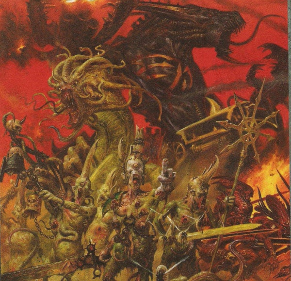
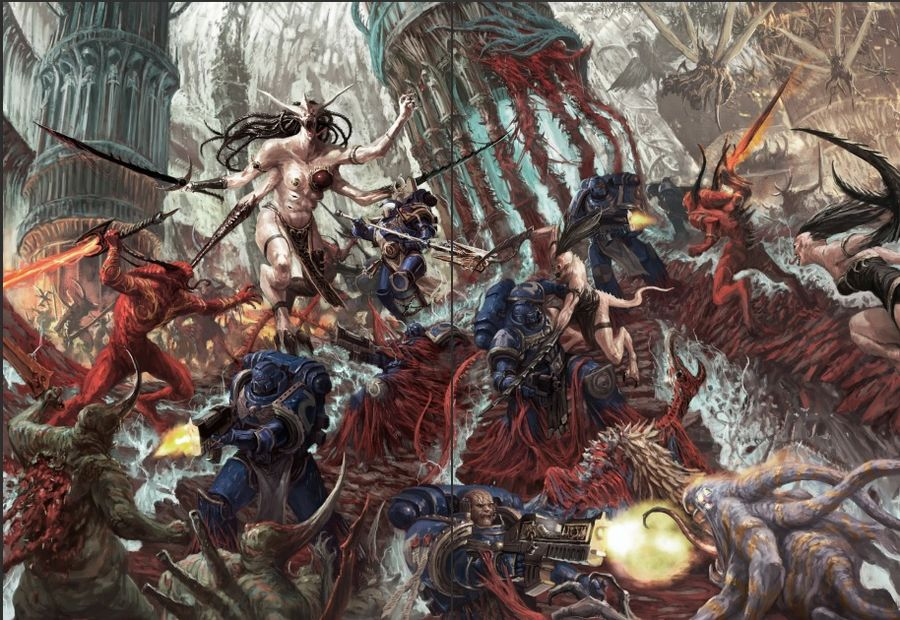
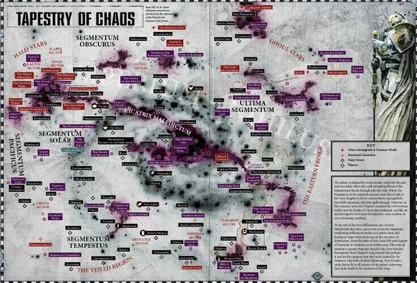
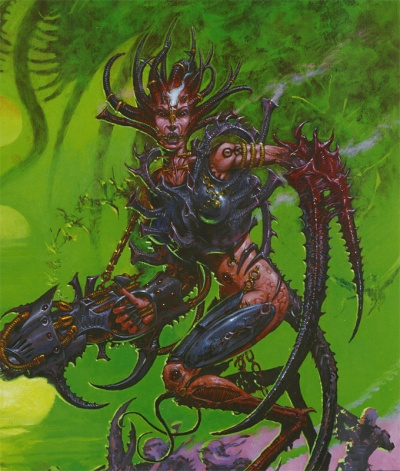
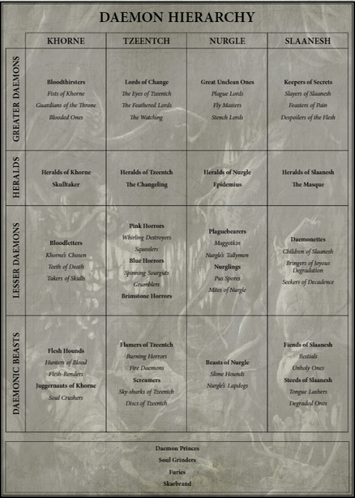
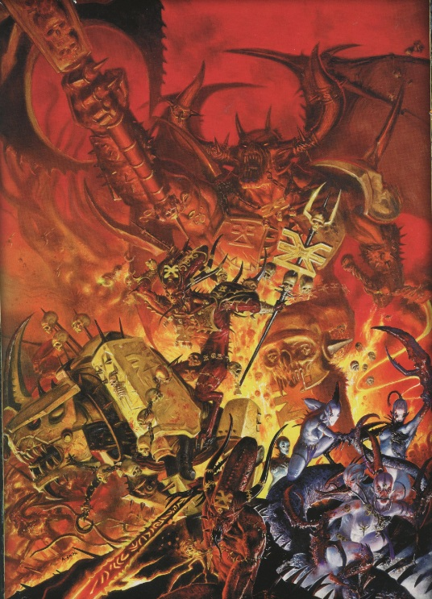

# 0512 恶魔 Daemons

精校状态：中文行文已逐段精校，部分术语仍为暂定

分类：组织 / 混沌 Chaos / 混沌诸神 Chaos Gods

原文来源：https://www.bilibili.com/opus/1052618539201986569

原作者：帝国神选罐头

原文时间：编辑于 2025年07月26日 11:39

[返回分类目录](目录.md) · [全书目录](../../目录.md)

<!-- A0512-B0001 -->
**英文原文**

Daemons, also known as Neverborn, are entities of the Warp, and servants of the Gods of Chaos. They are created at the whim of a Chaos god from a fraction of the god's own power and act as an extension of their will. A daemon's appearance and character reflect the god's own nature. These daemons may be reabsorbed into the god at whim.

<!-- /A0512-B0001 -->

<!-- A0512-B0002 -->

原译文

恶魔，也被称为无生者，是亚空间的实体，也是混沌诸神的仆人。它们是混沌诸神从自己的一小部分力量中创造出来的，是他们意志的延伸。恶魔的外表和性格反映了神自己的本性。这些恶魔可能会在一时兴起时重新被神吸收。

**校订译文**

恶魔又称无生者，是亚空间的存在，也是混沌诸神的仆从。混沌之神随自己的意愿，分出一小部分力量创造恶魔，使其成为自身意志的延伸。恶魔的外貌与性情反映创造者的本性，而神祇也可随时将其重新吸收。

<!-- /A0512-B0002 -->

<!-- A0512-B0003 图片 -->

<!-- A0512-B0004 -->

原译文

Daemons of Chaos 混沌恶魔

**校订译文**

Daemons of Chaos 混沌恶魔

<!-- /A0512-B0004 -->

<!-- A0512-B0005 -->
## Overview 概述

<!-- /A0512-B0005 -->

<!-- A0512-B0006 -->
**英文原文**

Daemons are the creation of the Gods of Chaos, formed from their own essences. Of a somewhat different nature than their masters, they are the most numerous of the Warp's inhabitants and are thought to be near-infinite in number. A Daemon is "born" when a Chaos God expends a portion of its power to create a separate being, binding a collection of senses, thoughts, and purposes together. This essentially creates a consciousness and personality that can move within the Warp. The Chaos God can reclaim this form at any time, and this ensures the loyalty of the Daemon. Not all Daemons act entirely in accord with their masters, but even the greatest of them would not dare outright defiance. Though it may appear to be made of matter in the Materium, within the Warp a Daemon is no more physical than the rest of the Realm of Chaos.

<!-- /A0512-B0006 -->

<!-- A0512-B0007 -->

原译文

恶魔是混沌诸神的造物，由他们自己的本质形成。它们的性质与它们的主人有些不同，它们是亚空间中数量最多的居民，被认为数量几乎是无限的。当混沌诸神消耗其部分力量创造一个独立的存在，将一系列感官、思想和目的结合在一起时，恶魔就“诞生”了。这本质上创造了一种可以在亚空间中移动的意识和个性。混沌诸神可以随时收回这种形态，这确保了恶魔的忠诚。并非所有的恶魔都完全按照他们的主人行事，但即使是最伟大的恶魔也不敢公然反抗。虽然它可能看起来是由物质组成的，但在亚空间中，恶魔并不比混沌领域的其他部分更具物理性。

**校订译文**

恶魔由混沌诸神自身的本质塑成，与主人却又并非完全相同。它们是亚空间中数量最多的居民，据认为近乎无穷无尽。当一位混沌之神耗费部分力量，将感知、思想与目标凝结为一个独立存在时，恶魔便“诞生”了：一种能够在亚空间中活动的意识与人格由此形成。神祇可以随时收回这部分力量，以此维系恶魔的忠诚。并非所有恶魔都完全按照主人的意愿行事，但即便最强大者，也不敢公然违抗。在物质界中，恶魔可能看似具有实体；然而在亚空间里，它与混沌领域的其他部分一样，并无通常意义上的物质形态。

<!-- /A0512-B0007 -->

<!-- A0512-B0008 图片 -->

<!-- A0512-B0009 -->

原译文

Daemons battle Space Marines 恶魔战星际战士

**校订译文**

Daemons battle Space Marines 恶魔与星际战士交战

<!-- /A0512-B0009 -->

<!-- A0512-B0010 -->
**英文原文**

Though Daemons eternally wage the Great Game against their counterparts of the other Chaos Gods within the Warp, they are known to unite when the interests of the Chaos gods align. Faced with the prospect of claiming mortal souls and spreading Chaos within the Materium, Daemonic armies will put aside their differences for a time to fight a greater foe.

<!-- /A0512-B0010 -->

<!-- A0512-B0011 -->

原译文

尽管恶魔永远与亚空间中其他混沌诸神的对手进行伟大游戏，但众所周知，当混沌诸神的利益一致时，他们会团结起来。面对要求凡人灵魂和在物质世界内传播混沌的前景，恶魔军队将暂时搁置分歧，与大敌作战。

**校订译文**

恶魔在亚空间中永远与其他混沌之神的仆从进行伟大游戏，但当诸神的利益一致时，它们也会联手。为了夺取凡人的灵魂、向物质界传播混沌，恶魔军队会暂时搁置分歧，共同对付更强的敌人。

<!-- /A0512-B0011 -->

<!-- A0512-B0012 -->
**英文原文**

Particularly strong Daemons can be formed through an especially powerful, cruel, emotional, or destructive act in the Materium being echoed back into the Warp. The time these acts take place matter not, for time does not exist within the Warp. Thus, Daemons can be active and even killed in the material realm long before the act that spawns them occurs. Examples of such births are Samus and Drach'nyen.

<!-- /A0512-B0012 -->

<!-- A0512-B0013 -->

原译文

特别强大的恶魔可以通过在物质世界中特别强大、残酷、情绪化或破坏性的行为形成，这些行为会在亚空间中回响。这些行为发生的时间并不重要，因为时间在亚空间中并不存在。因此，在产生它们的行为发生之前，恶魔就可以在物质领域活跃甚至被杀死。萨姆斯和德拉科尼恩就是这种诞生的例子。

**校订译文**

物质界中某些格外强烈、残酷、情感激烈或极具破坏性的行为，其回响传入亚空间后，能够催生特别强大的恶魔。这些行为发生于何时并不重要，因为亚空间中不存在时间。因此，一头恶魔甚至可能在催生它的事件发生之前，就已活跃于物质界，乃至在那里遭到杀死。萨姆斯与德拉科尼恩便是这类诞生方式的例子。

<!-- /A0512-B0013 -->

<!-- A0512-B0014 -->
### Daemons in realspace 现实空间中的恶魔

<!-- /A0512-B0014 -->

<!-- A0512-B0015 -->
**英文原文**

Being an entity of the Warp (a dimension of the immaterial) a daemon cannot exist for long periods of time in realspace, any more than a mortal can survive unprotected in warp space. There are a few ways a daemon can breach the walls separating warp from real space and gain entry into the mortal universe. Daemons can be fought in a physical sense whilst in realspace but are rarely killed, more frequently they are banished back into the warp to fester and brood until their next chance into realspace presents itself. Daemons who are banished back to the Warp often have their pride wounded and face mockery by their peers. In order to regain their form, the banished Daemon must remain in some sort of purgatorial state within its master's realm for an indeterminate period of time depending on the whims of their master and the circumstances of their banishment.

<!-- /A0512-B0015 -->

<!-- A0512-B0016 -->

原译文

作为亚空间（非物质维度）的一个实体，恶魔不能在现实空间中长期存在，就像凡人不能在亚空间中不受保护地生存一样。恶魔可以通过几种方式突破将亚空间与真实空间隔开的墙壁，进入物质宇宙。在现实空间中，恶魔可以在物理意义上进行战斗，但很少被杀死，更常见的是，它们被驱逐回亚空间，溃烂和孵化，直到下一次进入现实空间的机会出现。被驱逐回亚空间的恶魔经常自尊心受损，并面临同族的嘲笑。为了恢复他们的形态，被放逐的恶魔必须在其主人的领域内保持某种炼狱状态一段不确定的时间，具体取决于主人的突发奇想和被放逐的情况。

**校订译文**

恶魔来自亚空间这一非物质维度，不能在现实空间长期存在，就像凡人无法毫无防护地在亚空间中生存一样。它们可以通过数种途径突破两界之间的屏障，进入凡人的宇宙。在现实空间，人们可以用实体攻击与恶魔交战，但很少能真正将其杀死；更常见的结果是将它们放逐回亚空间，让它们在怨恨中蛰伏，等待下一次进入现实的机会。遭到放逐的恶魔往往自尊受挫，还会受到同类嘲弄。它们必须在主人的领域中经历一段类似炼狱的状态，才能重获形体；这段时期有多长，取决于主人的意愿与它们被放逐的具体情形。

<!-- /A0512-B0016 -->

<!-- A0512-B0017 -->
**英文原文**

Exposure to even a single daemon can in some circumstances make humans who interact with them, be it in combat or otherwise, more sensitive to the Warp. Such individuals are easier for Psykers to influence, but also for daemons to possess.

<!-- /A0512-B0017 -->

<!-- A0512-B0018 -->

原译文

在某些情况下，即使接触到一个恶魔，也会使与之互动的人类，无论是在战斗中还是其他场合，对亚空间更加敏感。这样的个体更容易被灵能者影响，也更容易被恶魔占据。

**校订译文**

在某些情况下，人类即使只接触过一头恶魔，无论是在战斗中还是其他情境下，也可能因此变得对亚空间更加敏感。这些人更容易受到灵能者影响，也更容易被恶魔附身。

<!-- /A0512-B0018 -->

<!-- A0512-B0019 -->
### Possession 附身

原题：Possession 占据

<!-- /A0512-B0019 -->

<!-- A0512-B0020 -->
**英文原文**

Instead of being summoned into real space, a daemon may enter the mind of a mortal (the mind of a psyker is the most susceptible to this), and turn the individual to its will and, through its host, affect reality. Some heretics offer themselves as hosts through daemonic pacts such as the Possessed Chaos Space Marines.

<!-- /A0512-B0020 -->

<!-- A0512-B0021 -->

原译文

恶魔可能不会被召唤到真实的空间，而是进入凡人的头脑（灵能者的头脑最容易受到这种影响），并将个人转变为自己的意志，并通过其宿主影响现实。一些异端通过与恶魔订立契约，甘愿让自己成为宿主，比如那些被恶魔附身的混沌星际战士。

**校订译文**

恶魔不一定要被直接召入现实，也可以进入凡人的心智，尤其是最易受侵入的灵能者心智，使宿主屈从于自己的意志，再借其影响现实。一些异端会通过恶魔契约自愿成为宿主，例如附魔混沌星际战士。

<!-- /A0512-B0021 -->

<!-- A0512-B0022 图片 -->

<!-- A0512-B0023 -->

原译文

Daemon Worlds throughout the galaxy 整个银河系的恶魔世界

**校订译文**

Daemon Worlds throughout the galaxy 整个银河系的恶魔世界

<!-- /A0512-B0023 -->

<!-- A0512-B0024 -->
### Daemonic incursions 恶魔入侵

<!-- /A0512-B0024 -->

<!-- A0512-B0025 -->
**英文原文**

In order to enter real space in greater numbers Daemons need to use Warp rifts. These are breaches in the fabric of reality that can vary in nature and size. At times a Daemon can possess a mortal and turn him into a portal through which whole hosts can pass. These daemonic incursions can taint real space severely, often twisting and reshaping whole planets until they are lost and turned into Daemon Worlds. It is not surprising that the Imperium's Daemonhunters are granted unlimited resources to deal with such threats.

<!-- /A0512-B0025 -->

<!-- A0512-B0026 -->

原译文

为了更多进入真实空间，恶魔需要使用亚空间裂隙。这些是现实结构中的缺口，其性质和规模可能各不相同。有时，一个恶魔可以占据一个凡人，并将他变成一个所有宿主都可以通过的门户。这些恶魔的入侵会严重污染现实空间，经常扭曲和重塑整个行星，直到它们消失并变成恶魔世界。帝国的恶魔猎手被授予无限的资源来应对此类威胁，这并不奇怪。

**校订译文**

恶魔若要大规模进入现实空间，就需要借助亚空间裂隙。这些裂隙是现实结构中的破口，性质与规模各异。有时，恶魔还会附身于一个凡人，将其变成可供整支大军穿行的门户。这类入侵会严重污染现实，甚至扭曲、重塑整颗行星，使其彻底沦陷，化作恶魔世界。因此，帝国的恶魔猎手获准调动无限资源来应对此类威胁，也就不足为奇了。

**校注：** whole hosts 指整支大军，不是“所有宿主”；lost 指行星沦陷，并非行星物理消失。

<!-- /A0512-B0026 -->

<!-- A0512-B0027 图片 -->

<!-- A0512-B0028 -->

原译文

Daemon of Slaanesh 色孽恶魔

**校订译文**

Daemon of Slaanesh 色孽恶魔

<!-- /A0512-B0028 -->

<!-- A0512-B0029 -->
**英文原文**

Notable past Daemonic Incursions include:

<!-- /A0512-B0029 -->

<!-- A0512-B0030 -->

原译文

过去著名的恶魔入侵包括：

**校订译文**

过去著名的恶魔入侵包括：

<!-- /A0512-B0030 -->

<!-- A0512-B0031 -->

原译文

The Noctis Aeterna 永恒之夜

**校订译文**

The Noctis Aeterna 永恒之夜

<!-- /A0512-B0031 -->

<!-- A0512-B0032 -->

原译文

The Blood Crusade 鲜血远征

**校订译文**

The Blood Crusade 鲜血远征

<!-- /A0512-B0032 -->

<!-- A0512-B0033 -->

原译文

The Blood Star Campaign 血星战役

**校订译文**

The Blood Star Campaign 血星战役

<!-- /A0512-B0033 -->

<!-- A0512-B0034 -->

原译文

The Fall of Toreus 托雷乌斯之陨

**校订译文**

The Fall of Toreus 托雷乌斯之陨

<!-- /A0512-B0034 -->

<!-- A0512-B0035 -->

原译文

The Fall of Shadowbrink 影际星陷落

**校订译文**

The Fall of Shadowbrink 影际星陷落

<!-- /A0512-B0035 -->

<!-- A0512-B0036 -->

原译文

The Fallaxian Scourging 法拉克西安清洗

**校订译文**

The Fallaxian Scourging 法拉克西安清洗

<!-- /A0512-B0036 -->

<!-- A0512-B0037 -->

原译文

The Ghallamore Cleansing 净化加拉莫尔

**校订译文**

The Ghallamore Cleansing 净化加拉莫尔

<!-- /A0512-B0037 -->

<!-- A0512-B0038 -->

原译文

The Gheistos Cataclysm 盖斯托斯大灾变

**校订译文**

The Gheistos Cataclysm 盖斯托斯大灾变

<!-- /A0512-B0038 -->

<!-- A0512-B0039 -->

原译文

The Godjera Incursion 哥吉拉入侵

**校订译文**

The Godjera Incursion 哥吉拉入侵

<!-- /A0512-B0039 -->

<!-- A0512-B0040 -->

原译文

The Great Awakening 大觉醒

**校订译文**

The Great Awakening 大觉醒

<!-- /A0512-B0040 -->

<!-- A0512-B0041 -->
**英文原文**

The Juruga Uprising - approximately middle of M38

<!-- /A0512-B0041 -->

<!-- A0512-B0042 -->

原译文

朱鲁加暴动 - 大约在M38中期

**校订译文**

朱鲁加暴动——约在 M38 中期。

<!-- /A0512-B0042 -->

<!-- A0512-B0043 -->
**英文原文**

The Plague of Madness - major incursion in 941.M41

<!-- /A0512-B0043 -->

<!-- A0512-B0044 -->

原译文

疯狂瘟疫 - M41.941的大规模入侵。

**校订译文**

疯狂瘟疫——941.M41 发生的大规模入侵。

<!-- /A0512-B0044 -->

<!-- A0512-B0045 -->

原译文

The Purging of Camp 109 净化109营地

**校订译文**

The Purging of Camp 109 净化第 109 营地

<!-- /A0512-B0045 -->

<!-- A0512-B0046 -->

原译文

The Purging of Jollana 净化乔拉纳

**校订译文**

The Purging of Jollana 净化乔拉纳

<!-- /A0512-B0046 -->

<!-- A0512-B0047 -->

原译文

The Raxos Civil War 拉索斯内战

**校订译文**

The Raxos Civil War 拉索斯内战

<!-- /A0512-B0047 -->

<!-- A0512-B0048 -->

原译文

The Barbarus Incursion 巴巴鲁斯入侵

**校订译文**

The Barbarus Incursion 巴巴鲁斯入侵

<!-- /A0512-B0048 -->

<!-- A0512-B0049 -->

原译文

The War for Piety 虔诚之战

**校订译文**

The War for Piety 虔诚之战

<!-- /A0512-B0049 -->

<!-- A0512-B0050 -->
**英文原文**

The destruction of Ichtar IX in 161.M32

<!-- /A0512-B0050 -->

<!-- A0512-B0051 -->

原译文

伊克塔九号毁灭，在M32.161

**校订译文**

伊克塔九号毁灭——发生于 161.M32。

<!-- /A0512-B0051 -->

<!-- A0512-B0052 -->
**英文原文**

Attempt of Nurgle's daemons incursion near the Squire's Rest of Sanctus Reach

<!-- /A0512-B0052 -->

<!-- A0512-B0053 -->

原译文

纳垢的恶魔试图入侵圣图斯星区的扈从之息附近

**校订译文**

纳垢恶魔试图入侵圣图斯疆域的扈从之息附近。

**校注：** Reach 为地理疆域，不能无依据等同正式行政级别 Sector 星区；沿音译圣图斯。

<!-- /A0512-B0053 -->

<!-- A0512-B0054 -->

原译文

Kasdeya Incursion 卡斯德亚入侵

**校订译文**

Kasdeya Incursion 卡斯德亚入侵

<!-- /A0512-B0054 -->

<!-- A0512-B0055 -->

原译文

The incursion on Absolom Reach 阿布索伦星区入侵

**校订译文**

The incursion on Absolom Reach 阿布索伦疆域入侵

**校注：** 同类 Reach 统一为疆域，原稿星区。

<!-- /A0512-B0055 -->

<!-- A0512-B0056 -->
**英文原文**

The incursion on Azoth and ensuing battle - Azoth Drop in 999.M37

<!-- /A0512-B0056 -->

<!-- A0512-B0057 -->

原译文

阿佐特入侵与随后的战斗 - M37.999的阿佐特空降

**校订译文**

阿佐特入侵及其后续战斗——999.M37 的阿佐特空降。

<!-- /A0512-B0057 -->

<!-- A0512-B0058 -->

原译文

The incursion of Ferrite Mons 费里特·蒙斯入侵

**校订译文**

The incursion of Ferrite Mons 费里特·蒙斯入侵

<!-- /A0512-B0058 -->

<!-- A0512-B0059 -->
**英文原文**

The incursion on Garanhir followed the Garanhir Rebellion

<!-- /A0512-B0059 -->

<!-- A0512-B0060 -->

原译文

加拉希尔叛乱之后的加拉希尔入侵

**校订译文**

加拉希尔叛乱之后的加拉希尔入侵

<!-- /A0512-B0060 -->

<!-- A0512-B0061 -->

原译文

The incursion on Gehöft 格霍夫特入侵

**校订译文**

The incursion on Gehöft 格霍夫特入侵

<!-- /A0512-B0061 -->

<!-- A0512-B0062 -->
**英文原文**

The incursion on Giridium in 011.M32. See Giridium Experiment

<!-- /A0512-B0062 -->

<!-- A0512-B0063 -->

原译文

M32.011的吉里迪姆入侵。参见吉里迪姆实验

**校订译文**

吉里迪姆入侵——发生于 011.M32，参见“吉里迪姆实验”。

<!-- /A0512-B0063 -->

<!-- A0512-B0064 -->
**英文原文**

The incursion on Gythos in 888.M41

<!-- /A0512-B0064 -->

<!-- A0512-B0065 -->

原译文

M41.888的吉索斯入侵

**校订译文**

吉索斯入侵——发生于 888.M41。

<!-- /A0512-B0065 -->

<!-- A0512-B0066 -->

原译文

The incursion on Innocence III 因诺森斯三号入侵

**校订译文**

The incursion on Innocence III 因诺森斯三号入侵

<!-- /A0512-B0066 -->

<!-- A0512-B0067 -->

原译文

The incursion on Longhallow 长圣入侵

**校订译文**

The incursion on Longhallow 长圣入侵

<!-- /A0512-B0067 -->

<!-- A0512-B0068 -->

原译文

The incursion on Magdelon 马格德隆入侵

**校订译文**

The incursion on Magdelon 马格德隆入侵

<!-- /A0512-B0068 -->

<!-- A0512-B0069 -->
**英文原文**

The incursion on the Plains of Azoth (See also Azoth Drop)

<!-- /A0512-B0069 -->

<!-- A0512-B0070 -->

原译文

阿佐特平原入侵（同见阿佐特空降）

**校订译文**

阿佐特平原入侵——另见“阿佐特空降”。

<!-- /A0512-B0070 -->

<!-- A0512-B0071 -->

原译文

The incursion on Rhorsch 罗尔施入侵

**校订译文**

The incursion on Rhorsch 罗尔施入侵

<!-- /A0512-B0071 -->

<!-- A0512-B0072 -->
**英文原文**

The Slaanesh incursion on Sandava II and later - on Sandava III

<!-- /A0512-B0072 -->

<!-- A0512-B0073 -->

原译文

赛德瓦二号和后来的赛德瓦三号色孽入侵

**校订译文**

色孽先后入侵赛德瓦二号与赛德瓦三号。

<!-- /A0512-B0073 -->

<!-- A0512-B0074 -->
**英文原文**

A slew of major incursions that manifested during the Hunt for the Wulfen and culminated in the Siege of the Fenris System

<!-- /A0512-B0074 -->

<!-- A0512-B0075 -->

原译文

一系列重大入侵，在狼人狩猎的过程中显现出来，最终导致了芬里斯星系的围攻

**校订译文**

猎捕狼人期间接连发生的大规模入侵，最终演变为芬里斯星系围城战。

<!-- /A0512-B0075 -->

<!-- A0512-B0076 -->
**英文原文**

The Nurgle incursion on Tarsok V in 230.M41

<!-- /A0512-B0076 -->

<!-- A0512-B0077 -->

原译文

M41.230的塔尔索克五号纳垢入侵

**校订译文**

纳垢入侵塔尔索克五号——发生于 230.M41。

<!-- /A0512-B0077 -->

<!-- A0512-B0078 -->
**英文原文**

The Plaguebearers incursion on Vulgate

<!-- /A0512-B0078 -->

<!-- A0512-B0079 -->

原译文

武加大瘟疫携带者入侵

**校订译文**

瘟疫使入侵武加大。

<!-- /A0512-B0079 -->

<!-- A0512-B0080 -->
**英文原文**

The Battle of Lion's Gate - major Daemonic outbreak on Terra.

<!-- /A0512-B0080 -->

<!-- A0512-B0081 -->

原译文

狮门之战 - 泰拉上大规模的恶魔爆发。

**校订译文**

狮门之战——泰拉上爆发的大规模恶魔入侵。

<!-- /A0512-B0081 -->

<!-- A0512-B0082 -->
**英文原文**

With the opening of the Great Rift, an unprecedented amount of Daemonic Incursions now plague the Galaxy. The Chaos Gods may have conquered the entire galaxy had they united, but true to their nature they quickly began to squabble amongst themselves.

<!-- /A0512-B0082 -->

<!-- A0512-B0083 -->

原译文

随着大裂隙的打开，数量空前的恶魔入侵现在困扰着银河系。混沌诸神如果团结起来，可能已经征服了整个银河系，但忠于他们的本性，他们很快就开始相互争吵。

**校订译文**

大裂隙开启后，银河遭到前所未有的大量恶魔入侵。混沌诸神若能联手，或许早已征服整个银河；然而本性使然，祂们很快又开始彼此争斗。

<!-- /A0512-B0083 -->

<!-- A0512-B0084 -->
## Types of daemon 恶魔种类

<!-- /A0512-B0084 -->

<!-- A0512-B0085 -->
### Daemon Princes 恶魔亲王

原题：Daemon Princes 恶魔王子

<!-- /A0512-B0085 -->

<!-- A0512-B0086 -->
**英文原文**

The followers of Chaos try to gain the attention of their gods in order to gain terrible power and great rewards. Those striving in the way of their god are known as Chaos Champions, whose ultimate, driving goal is to transcend mortality by becoming a Daemon Prince. Those who become Daemon Princes are counted among the most powerful creatures of Chaos, second only to the Chaos Gods themselves. However this path can just as easily lead to another extreme. Throughout the path to power, the Champion undergoes constant change until either the god judges him worthy of Daemonic ascension or his form finally is overcome by the accumulated mutations and he descends into a mindless Chaos Spawn.

<!-- /A0512-B0086 -->

<!-- A0512-B0087 -->

原译文

混沌的追随者试图吸引他们的神的注意，以获得可怕的力量和巨大的回报。那些为他们的神而奋斗的人被称为混沌冠军，他们的最终驱动目标是通过成为一名恶魔王子来超越死亡。那些成为恶魔王子的人被认为是混沌中最强大的生物之一，仅次于混沌诸神本身。然而，这条路也很容易导致另一个极端。在通往力量的道路上，冠军经历了不断的变化，直到神判断他值得获得恶魔的升华，或者他的身体最终被累积的突变所克服，陷入一个无意识的混沌之躯。

**校订译文**

混沌信徒努力吸引神祇的注意，以获取可怖的力量与丰厚的赏赐。沿着各自神祇所指道路奋斗的人被称为混沌勇士，他们最终的追求，是升为恶魔亲王、超越凡人的局限。恶魔亲王位列最强大的混沌存在之中，仅次于混沌诸神本身。然而，这条道路同样容易通向另一个极端。勇士在追逐力量的过程中不断变化，最终要么获神祇认可，升格为恶魔；要么肉身被积累的突变压垮，沦为失去心智的混沌魔物。

**校注：** Chaos Spawn 统一官方“混沌魔物”，原译“混沌之躯”错漏类别。段落声称恶魔亲王仅次于诸神；下一节又称大魔为最强仆从，均保留原文的概述，未擅自编排统一战力排名。

<!-- /A0512-B0087 -->

<!-- A0512-B0088 图片 -->

<!-- A0512-B0089 -->

原译文

Hierarchy of Chaos Daemons 混沌恶魔的层次结构

**校订译文**

Hierarchy of Chaos Daemons 混沌恶魔的等级体系

<!-- /A0512-B0089 -->

<!-- A0512-B0090 -->
### Greater Daemons 大魔

<!-- /A0512-B0090 -->

<!-- A0512-B0091 -->
**英文原文**

Greater Daemons are the most powerful of the Chaos Gods' servants. They act as wardens of their patron's realm and have authority over the lesser Daemons of their respective God. It is often they who lead Daemonic Incursions.

<!-- /A0512-B0091 -->

<!-- A0512-B0092 -->

原译文

大魔是混沌诸神最强大的仆人。他们充当恶魔领域的监察者，并对各自诸神的低级恶魔拥有权威。通常是他们领导了恶魔入侵。

**校订译文**

大魔是混沌诸神最强大的仆从，负责守卫各自庇护神的领域，并统辖该神麾下的低级恶魔。恶魔入侵也往往由它们率领。

<!-- /A0512-B0092 -->

<!-- A0512-B0093 -->
**英文原文**

Such is their might that they cannot simply be summoned like Lesser Daemons. A greater Daemon needs to possess a living body in order to manifest itself.

<!-- /A0512-B0093 -->

<!-- A0512-B0094 -->

原译文

他们的力量如此之大，以至于他们不能像低级恶魔那样被召唤。一个大魔需要拥有一个活的身体才能显现出来。

**校订译文**

大魔的力量过于庞大，不能像低级恶魔那样简单地召唤出来，而必须附身于一个活体，才能显现。

**校注：** 原文将大魔显现表述为必须附身活体，带有版本与机制上的概括性；按原文保留，不自行添加例外。

<!-- /A0512-B0094 -->

<!-- A0512-B0095 -->
**英文原文**

Greater Daemon of Khorne: Bloodthirster

<!-- /A0512-B0095 -->

<!-- A0512-B0096 -->

原译文

恐虐大魔：嗜血狂魔

**校订译文**

恐虐大魔：嗜血狂魔

<!-- /A0512-B0096 -->

<!-- A0512-B0097 -->
**英文原文**

Greater Daemon of Nurgle: Great Unclean One

<!-- /A0512-B0097 -->

<!-- A0512-B0098 -->

原译文

纳垢大魔：大不净者

**校订译文**

纳垢大魔：大不净者

<!-- /A0512-B0098 -->

<!-- A0512-B0099 -->
**英文原文**

Greater Daemon of Slaanesh: Keeper of Secrets

<!-- /A0512-B0099 -->

<!-- A0512-B0100 -->

原译文

色孽大魔：守密者

**校订译文**

色孽大魔：守密者

<!-- /A0512-B0100 -->

<!-- A0512-B0101 -->
**英文原文**

Greater Daemon of Tzeentch: Lord of Change

<!-- /A0512-B0101 -->

<!-- A0512-B0102 -->

原译文

奸奇大魔：万变魔君

**校订译文**

奸奇大魔：诡变领主。

<!-- /A0512-B0102 -->

<!-- A0512-B0103 -->
### Lesser Daemons 低级恶魔

<!-- /A0512-B0103 -->

<!-- A0512-B0104 -->
**英文原文**

They are the foot soldiers of Chaos, building the core of the Daemonic Legions. They are usually anthropomorphic in appearance and possess a calculating, malevolent intellect. Among the Daemons of Chaos they are ones most likely to answer the call of mortal heretics.

<!-- /A0512-B0104 -->

<!-- A0512-B0105 -->

原译文

他们是混沌的步兵，建立了恶魔军团的核心。他们的外表通常是拟人化的，拥有算计、恶毒的智慧。在混沌的恶魔中，他们最有可能回应凡人异教徒的召唤。

**校订译文**

低级恶魔是混沌的步兵，也是恶魔军团的核心。它们通常呈类人形态，心思狡诈而恶毒。在混沌恶魔中，它们最可能回应凡人异端的召唤。

<!-- /A0512-B0105 -->

<!-- A0512-B0106 -->
**英文原文**

Lesser Daemon of Khorne: Bloodletter

<!-- /A0512-B0106 -->

<!-- A0512-B0107 -->

原译文

恐虐低级恶魔：放血魔

**校订译文**

恐虐低级恶魔：放血者。

<!-- /A0512-B0107 -->

<!-- A0512-B0108 -->
**英文原文**

Lesser Daemons of Nurgle: Plaguebearer, Nurgling

<!-- /A0512-B0108 -->

<!-- A0512-B0109 -->

原译文

纳垢低级恶魔：瘟疫携带者，纳垢灵

**校订译文**

纳垢低级恶魔：瘟疫使、纳垢灵。

<!-- /A0512-B0109 -->

<!-- A0512-B0110 -->
**英文原文**

Lesser Daemon of Slaanesh: Daemonette

<!-- /A0512-B0110 -->

<!-- A0512-B0111 -->

原译文

色孽低级恶魔：女妖

**校订译文**

色孽低级恶魔：魅魔。

<!-- /A0512-B0111 -->

<!-- A0512-B0112 -->
**英文原文**

Lesser Daemons of Tzeentch: Pink and Blue Horror, Flamer

<!-- /A0512-B0112 -->

<!-- A0512-B0113 -->

原译文

奸奇低级恶魔：粉色和蓝色惧妖，火妖

**校订译文**

奸奇低级恶魔：粉色惧妖、蓝色惧妖、火妖。

<!-- /A0512-B0113 -->

<!-- A0512-B0114 -->
**英文原文**

Favored Lesser Daemons often become Daemonic Heralds for their respective Gods.

<!-- /A0512-B0114 -->

<!-- A0512-B0115 -->

原译文

受青睐的低级恶魔经常成为各自神的恶魔传令官。

**校订译文**

受宠的低级恶魔，往往会成为各自神祇的恶魔传令官。

<!-- /A0512-B0115 -->

<!-- A0512-B0116 -->
### Daemonic Creatures 恶魔生物

<!-- /A0512-B0116 -->

<!-- A0512-B0117 -->
**英文原文**

These more primal entities are lowest type and least intelligent of Daemons. They are often granted to other Daemons and occasionally, one of the Gods more powerful mortal followers. Daemonic Creatures can be further divided into Daemonic Beasts and Daemonic Steeds.

<!-- /A0512-B0117 -->

<!-- A0512-B0118 -->

原译文

这些更原始的实体是最低级、最不聪明的恶魔。他们经常被授予其他恶魔，偶尔也会被授予一位更强大的凡人追随者。恶魔生物可进一步分为恶魔野兽和恶魔战马。

**校订译文**

这些更为原始的存在，是恶魔中等级最低、智慧最少的一类。它们常被赐给其他恶魔，偶尔也会赏赐给诸神麾下实力较强的凡人信徒。恶魔生物还可细分为恶魔野兽与恶魔坐骑。

<!-- /A0512-B0118 -->

<!-- A0512-B0119 -->
### Daemonic Beasts 恶魔野兽

<!-- /A0512-B0119 -->

<!-- A0512-B0120 -->
**英文原文**

Daemonic Beasts are driven by a feral intellect and commonly used as hunting beasts by Chaos forces.

<!-- /A0512-B0120 -->

<!-- A0512-B0121 -->

原译文

恶魔野兽由野性的智慧驱动，通常被混沌势力用作狩猎野兽。

**校订译文**

恶魔野兽受野性本能驱使，常被混沌军队用作猎兽。

<!-- /A0512-B0121 -->

<!-- A0512-B0122 -->
**英文原文**

Beast of Khorne: Flesh Hound

<!-- /A0512-B0122 -->

<!-- A0512-B0123 -->

原译文

恐虐野兽：血肉猎犬

**校订译文**

恐虐野兽：血肉猎犬

<!-- /A0512-B0123 -->

<!-- A0512-B0124 -->
**英文原文**

Beasts of Nurgle: Beast of Nurgle, Battle Fly, Feculent Gnarlmaw, Plague Wyrm, Bloat-Fly

<!-- /A0512-B0124 -->

<!-- A0512-B0125 -->

原译文

纳垢野兽：纳垢兽，战蝇，纳垢毒枝，疫病妖蛆，肿腹蝇

**校订译文**

纳垢野兽：纳垢野兽、战蝇、肮脏瘤口树、疫病妖蛆、肿腹蝇。

**校注：** Feculent Gnarlmaw 官译肮脏瘤口树；原文将其列于野兽类别，保留来源分类，不据名称自行改成其他类别。

<!-- /A0512-B0125 -->

<!-- A0512-B0126 -->
**英文原文**

Beast of Slaanesh: Fiend, Hate-Angel

<!-- /A0512-B0126 -->

<!-- A0512-B0127 -->

原译文

色孽野兽：色孽兽，憎恨天使

**校订译文**

色孽野兽：欢愉魔、仇恨天使。

<!-- /A0512-B0127 -->

<!-- A0512-B0128 -->
**英文原文**

Beast of Tzeentch: Screamer

<!-- /A0512-B0128 -->

<!-- A0512-B0129 -->

原译文

奸奇野兽：尖啸兽

**校订译文**

奸奇野兽：尖啸魔。

<!-- /A0512-B0129 -->

<!-- A0512-B0130 -->
### Daemonic Steeds 恶魔坐骑

<!-- /A0512-B0130 -->

<!-- A0512-B0131 -->
**英文原文**

Daemonic Steeds are prized mounts for more experienced Champions of Chaos. Earning one of these creatures can be as dangerous as facing them in battle.

<!-- /A0512-B0131 -->

<!-- A0512-B0132 -->

原译文

恶魔坐骑是更有经验的混沌冠军的珍贵坐骑。获得这些生物之一可能和在战斗中面对它们一样危险。

**校订译文**

恶魔坐骑是资深混沌勇士珍视的坐骑。想要获得其中一头，可能与在战场上迎战它同样危险。

<!-- /A0512-B0132 -->

<!-- A0512-B0133 -->
**英文原文**

Steed of Khorne: Juggernaut

<!-- /A0512-B0133 -->

<!-- A0512-B0134 -->

原译文

恐虐坐骑：钢牛

**校订译文**

恐虐坐骑：铁甲兽

<!-- /A0512-B0134 -->

<!-- A0512-B0135 -->
**英文原文**

Steed of Nurgle: Rot Fly, Molluscoid

<!-- /A0512-B0135 -->

<!-- A0512-B0136 -->

原译文

纳垢坐骑：腐蝇，纳垢蜗牛

**校订译文**

纳垢坐骑：腐蝇，纳垢蜗牛

<!-- /A0512-B0136 -->

<!-- A0512-B0137 -->
**英文原文**

Steed of Slaanesh: Mount of Slaanesh

<!-- /A0512-B0137 -->

<!-- A0512-B0138 -->

原译文

色孽坐骑：色孽兽

**校订译文**

色孽坐骑：色孽马。

**校注：** 此处 Mount of Slaanesh 指前文所列色孽坐骑，采用色孽马，区别 Fiend 欢愉魔。

<!-- /A0512-B0138 -->

<!-- A0512-B0139 -->
**英文原文**

Steed of Tzeentch: Disc of Tzeentch

<!-- /A0512-B0139 -->

<!-- A0512-B0140 -->

原译文

奸奇坐骑：奸奇飞盘

**校订译文**

奸奇坐骑：奸奇飞盘

<!-- /A0512-B0140 -->

<!-- A0512-B0141 -->
### Unaligned Daemons 无分恶魔

<!-- /A0512-B0141 -->

<!-- A0512-B0142 -->
**英文原文**

Apart from the four major powers that form the Pantheon of Chaos, there are numerous minor spirits in the Warp who are chaotic in nature too. The Gods tend to have less direct control over them.

<!-- /A0512-B0142 -->

<!-- A0512-B0143 -->

原译文

除了构成混沌万神殿的四大力量外，亚空间中还有许多本质上混沌的次要灵魂。神往往对他们没有直接的控制。

**校订译文**

除了构成混沌万神殿的四大神祇，亚空间中还有许多本质同样属于混沌的较弱灵体。诸神对它们的直接控制通常较少。

<!-- /A0512-B0143 -->

<!-- A0512-B0144 -->
**英文原文**

Fury, Daemonic Beast of Chaos Undivided

<!-- /A0512-B0144 -->

<!-- A0512-B0145 -->

原译文

愤怒，无分混沌恶魔野兽

**校订译文**

狂怒魔——无分混沌的恶魔野兽。

**校注：** Fury 此处为恶魔种类，非普通情绪“愤怒”；暂定狂怒魔。

<!-- /A0512-B0145 -->

<!-- A0512-B0146 -->
**英文原文**

Leviathan - great warp-beast

<!-- /A0512-B0146 -->

<!-- A0512-B0147 -->

原译文

利维坦-巨大亚空间野兽

**校订译文**

利维坦-巨大亚空间野兽

<!-- /A0512-B0147 -->

<!-- A0512-B0148 -->

原译文

Daemon Brutes 恶魔暴君

**校订译文**

Daemon Brutes 恶魔蛮兽

**校注：** Brutes 指蛮力怪物，原稿“暴君”不当；暂定“恶魔蛮兽”。

<!-- /A0512-B0148 -->

<!-- A0512-B0149 -->

原译文

Daemon Shrike 恶魔伯劳

**校订译文**

Daemon Shrike 恶魔伯劳

<!-- /A0512-B0149 -->

<!-- A0512-B0150 -->
**英文原文**

Soul Grinder, former Daemon of the Chaos Pantheon. Dedicated to the Forge of Souls.

<!-- /A0512-B0150 -->

<!-- A0512-B0151 -->

原译文

磨魂者，混沌万神殿的前恶魔。灵魂熔炉专用。

**校订译文**

磨魂者——原先隶属混沌诸神的恶魔，如今效忠于灵魂熔炉。

<!-- /A0512-B0151 -->

<!-- A0512-B0152 -->
**英文原文**

Daemon Behemoth, Titan-scale creatures

<!-- /A0512-B0152 -->

<!-- A0512-B0153 -->

原译文

恶魔巨兽，泰坦级生物

**校订译文**

恶魔巨兽，泰坦级生物

<!-- /A0512-B0153 -->

<!-- A0512-B0154 -->
**英文原文**

Imp - Servants of Vashtor

<!-- /A0512-B0154 -->

<!-- A0512-B0155 -->

原译文

劣魔 - 瓦什托尔的侍从

**校订译文**

劣魔 - 瓦什托尔的侍从

<!-- /A0512-B0155 -->

<!-- A0512-B0156 -->
## Daemonic Warbands 恶魔战帮

<!-- /A0512-B0156 -->

<!-- A0512-B0157 -->
**英文原文**

Daemons occasionally form together into groups, alliances, pacts, or covens known as warbands. The constant shifting loyalties of the Chaos gods means that no two invasions into real space are ever the same, and the Imperium has no reliable way of identifying warbands as survivors of such Daemon attacks are often rendered insane or the Inquisition is forced to sanction them.

<!-- /A0512-B0157 -->

<!-- A0512-B0158 -->

原译文

恶魔偶尔会组成团体、联盟、契约或被称为战帮的团体。混沌诸神不断变化的忠诚意味着，没有两次对真实空间的入侵是相同的，帝国也没有可靠的方法来识别战帮，因为这种恶魔攻击的幸存者往往会变得疯狂，或者审判庭被迫制裁他们。

**校订译文**

恶魔有时会组成团体、联盟、契约同盟或集会，统称战帮。混沌诸神之间的联盟关系不断变化，因此每次入侵现实的阵容都不尽相同。帝国也没有可靠的办法辨认这些战帮：恶魔袭击的幸存者往往已陷入疯狂，或被审判庭迫于情势加以处置。

**校注：** sanction 此处指审判庭对幸存者采取惩处措施，并未具体说明方式，译为“处置”，不自行增写处决。

<!-- /A0512-B0158 -->

<!-- A0512-B0159 -->
## Daemonic Names 恶魔真名

<!-- /A0512-B0159 -->

<!-- A0512-B0160 -->
**英文原文**

One of the few things all Daemons have in common is their True Name. Many names are rolling tides of unpronounceable syllables that can test the sanity of mortals. Nonetheless these names are highly prized. To have a Daemons name is to hold ultimate power over it, and so their bearers keep them secret even from each other.

<!-- /A0512-B0160 -->

<!-- A0512-B0161 -->

原译文

所有恶魔都有一个共同点，那就是他们的真名。许多名字都是无法发音的音浪，可以测试凡人的理智。尽管如此，这些名字仍然非常珍贵。拥有一个恶魔的名字就是拥有对它的终极权力，所以它们的持有者甚至对彼此保密。

**校订译文**

恶魔为数不多的共性之一，是各自都拥有真名。许多真名如连绵涌来的音节浪潮，难以发音，足以动摇凡人的理智。然而，真名仍然极其珍贵，因为掌握一头恶魔的真名，就能取得对它的绝对支配力。因此，恶魔严守真名，连彼此之间也不透露。

<!-- /A0512-B0161 -->

<!-- A0512-B0162 图片 -->

<!-- A0512-B0163 -->

原译文

Daemonic Horde 恶魔部落

**校订译文**

Daemonic Horde 恶魔大军

<!-- /A0512-B0163 -->

<!-- A0512-B0164 -->
**英文原文**

To this end, use-names and titles are often utilized instead. These follow certain patterns. Khorne Daemons use-names are guttural and violent sounding, and those of Bloodthirsters are often composed of eight syllables or letters, like Khazdrak. Khornate names are also often descriptive, such as Skulltaker. Tzeentch Daemons are the most likely to change names and titles, for it often suits their need to do so. A Single Lord of Change may go by many different names and titles at any given time. Nurgle creations favor names with seven letters and their epithets are often grandiose or descriptive such as Feculux the Master Mucanoid. Slaaneshi Daemons use-names utilize sibilant sounds, such as Sslthri or Drya, while they have a preference for long-grandioise titles such as Exquisite Matriarch of Agonizing Death.

<!-- /A0512-B0164 -->

<!-- A0512-B0165 -->

原译文

为此，通常会使用名字和头衔。这些遵循一定的模式。恐虐恶魔使用的名字是喉音和暴力的声音，嗜血狂魔的名字通常由八个音节或字母组成，如卡兹德拉克。恐虐的名字也经常是描述性的，比如夺颅者。奸奇恶魔最有可能更改名字和头衔，因为这通常符合他们的需要。一位万变魔君在任何时候都可能使用许多不同的名字和头衔。纳垢的造物喜欢七个字母的名字，他们的绰号通常是浮夸的或描述性的，比如粘液之主费库勒克斯。色孽恶魔的名字使用的是嘶嘶声，如斯尔斯里或德里亚，而他们更喜欢长而夸张的头衔，如苦痛死亡的精致女族长。

**校订译文**

为了隐藏真名，恶魔通常以通用名与头衔示人。这些称谓遵循一定规律。恐虐恶魔的通用名多用喉音，听来凶暴；嗜血狂魔的名字通常有八个音节或字母，例如 Khazdrak（卡兹德拉克）。恐虐恶魔也常使用描述性的称号，如“夺颅者”。奸奇恶魔最常改换名号，因为这往往符合它们的需要；一位诡变领主可能同时使用许多名字与头衔。纳垢造物偏爱由七个字母组成的名字，其称号常夸张华丽，或描述自身特征，例如“黏液之主费库勒克斯”。色孽恶魔的通用名则喜欢嘶擦音，例如 Sslthri（斯尔斯里）或 Drya（德里亚）；它们也偏好冗长浮夸的头衔，如“苦痛死亡的精致女族长”。

**校注：** 保留原文关于音节或字母数的泛指规律；Khazdrak 本身为七个拉丁字母，与前句八字母例示不完全相合，不擅自更改名字或数字。

<!-- /A0512-B0165 -->

<!-- A0512-B0166 -->
## Notable Chaos Daemons 著名混沌恶魔

<!-- /A0512-B0166 -->

<!-- A0512-B0167 -->
### Khorne 恐虐

<!-- /A0512-B0167 -->

<!-- A0512-B0168 -->
**英文原文**

Ka'Bandha - Bloodthirster

<!-- /A0512-B0168 -->

<!-- A0512-B0169 -->

原译文

卡班哈 - 嗜血狂魔

**校订译文**

卡’班哈——嗜血狂魔。

<!-- /A0512-B0169 -->

<!-- A0512-B0170 -->
**英文原文**

Skarbrand the Exiled One - Bloodthirster

<!-- /A0512-B0170 -->

<!-- A0512-B0171 -->

原译文

流放者斯卡布兰德 - 嗜血狂魔

**校订译文**

流放者斯卡布兰德 - 嗜血狂魔

<!-- /A0512-B0171 -->

<!-- A0512-B0172 -->
**英文原文**

Doombreed - Daemon Prince

<!-- /A0512-B0172 -->

<!-- A0512-B0173 -->

原译文

毁灭之裔 - 恶魔王子

**校订译文**

毁灭之种——恶魔亲王。

<!-- /A0512-B0173 -->

<!-- A0512-B0174 -->
**英文原文**

Akashneth of the Boiling Brass - Daemon

<!-- /A0512-B0174 -->

<!-- A0512-B0175 -->

原译文

沸腾黄铜阿卡什奈特 - 恶魔

**校订译文**

沸腾黄铜阿卡什奈特 - 恶魔

<!-- /A0512-B0175 -->

<!-- A0512-B0176 -->
**英文原文**

Sa'ra'am - Daemon

<!-- /A0512-B0176 -->

<!-- A0512-B0177 -->

原译文

萨拉姆 - 恶魔

**校订译文**

萨拉姆 - 恶魔

<!-- /A0512-B0177 -->

<!-- A0512-B0178 -->
**英文原文**

Skulltaker - Bloodletter

<!-- /A0512-B0178 -->

<!-- A0512-B0179 -->

原译文

夺颅者 - 放血魔

**校订译文**

夺颅者——放血者。

<!-- /A0512-B0179 -->

<!-- A0512-B0180 -->
**英文原文**

Karanak - Flesh Hound

<!-- /A0512-B0180 -->

<!-- A0512-B0181 -->

原译文

卡拉纳克 - 血肉猎犬

**校订译文**

卡拉纳克 - 血肉猎犬

<!-- /A0512-B0181 -->

<!-- A0512-B0182 -->
**英文原文**

The Dhorexx Fiend - Warp beast.

<!-- /A0512-B0182 -->

<!-- A0512-B0183 -->

原译文

多雷克斯魔 - 亚空间野兽

**校订译文**

多雷克斯魔 - 亚空间野兽

<!-- /A0512-B0183 -->

<!-- A0512-B0184 -->
**英文原文**

The Malcrusher - Warp beast.

<!-- /A0512-B0184 -->

<!-- A0512-B0185 -->

原译文

恶意粉碎者-亚空间野兽

**校订译文**

恶意粉碎者-亚空间野兽

<!-- /A0512-B0185 -->

<!-- A0512-B0186 -->
**英文原文**

Samus - One of the Heralds of the Ruinstorm.

<!-- /A0512-B0186 -->

<!-- A0512-B0187 -->

原译文

萨姆斯 - 毁灭风暴传令官之一

**校订译文**

萨姆斯 - 毁灭风暴传令官之一

**校注：** Samus 在原稿本节列于恐虐之下，后文又列于无分／未注明归属之下；保留其重复与分类差异供读者核对。

<!-- /A0512-B0187 -->

<!-- A0512-B0188 -->
### Tzeentch 奸奇

<!-- /A0512-B0188 -->

<!-- A0512-B0189 -->
**英文原文**

Kairos Fateweaver - Lord of Change

<!-- /A0512-B0189 -->

<!-- A0512-B0190 -->

原译文

卡洛斯·织命者 - 万变魔君

**校订译文**

凯洛斯·织命者——诡变领主。

<!-- /A0512-B0190 -->

<!-- A0512-B0191 -->
**英文原文**

M'Kachen - Lord of Change

<!-- /A0512-B0191 -->

<!-- A0512-B0192 -->

原译文

马’卡辰-万变魔君

**校订译文**

马’卡辰——诡变领主。

<!-- /A0512-B0192 -->

<!-- A0512-B0193 -->

原译文

The Blue Scribes 蓝色书记官

**校订译文**

The Blue Scribes 蓝书记

<!-- /A0512-B0193 -->

<!-- A0512-B0194 -->

原译文

The Changeling 变化灵

**校订译文**

The Changeling 诡变灵

<!-- /A0512-B0194 -->

<!-- A0512-B0195 -->
### Nurgle 纳垢

<!-- /A0512-B0195 -->

<!-- A0512-B0196 -->
**英文原文**

Ku'Gath - Great Unclean One

<!-- /A0512-B0196 -->

<!-- A0512-B0197 -->

原译文

库’噶斯 - 大不净者

**校订译文**

库噶斯——大不净者。

<!-- /A0512-B0197 -->

<!-- A0512-B0198 -->
**英文原文**

Scabeiathrax - Great Unclean One

<!-- /A0512-B0198 -->

<!-- A0512-B0199 -->

原译文

斯卡贝亚撒拉克斯 - 大不净者

**校订译文**

斯卡贝亚撒拉克斯 - 大不净者

<!-- /A0512-B0199 -->

<!-- A0512-B0200 -->
**英文原文**

Epidemius - Nurgle's Tallyman

<!-- /A0512-B0200 -->

<!-- A0512-B0201 -->

原译文

埃皮迪米乌斯 - 纳垢记患官

**校订译文**

传疫魔——纳垢的计数者。

**校注：** 此处 Tallyman 是纳垢恶魔传疫魔的计数职能，区别死亡守卫正式单位 Tallyman 书记官。

<!-- /A0512-B0201 -->

<!-- A0512-B0202 -->
**英文原文**

Horticulous Slimux - Nurgle's Gardener

<!-- /A0512-B0202 -->

<!-- A0512-B0203 -->

原译文

园丁斯利姆克斯 - 纳垢园丁

**校订译文**

园艺师史莱姆克斯——纳垢的园丁。

<!-- /A0512-B0203 -->

<!-- A0512-B0204 -->

原译文

The Prince of Corpseblooms 尸花王子

**校订译文**

The Prince of Corpseblooms 尸花王子

<!-- /A0512-B0204 -->

<!-- A0512-B0205 -->
**英文原文**

Rotigus - Great Unclean One

<!-- /A0512-B0205 -->

<!-- A0512-B0206 -->

原译文

罗提古斯 - 大不净者

**校订译文**

烂格斯——大不净者。

<!-- /A0512-B0206 -->

<!-- A0512-B0207 -->

原译文

Thogralathrax 索格亚拉斯克斯

**校订译文**

Thogralathrax 索格亚拉斯克斯

<!-- /A0512-B0207 -->

<!-- A0512-B0208 -->
**英文原文**

Cor'bax Utterblight - One of the Heralds of the Ruinstorm

<!-- /A0512-B0208 -->

<!-- A0512-B0209 -->

原译文

科尔’巴克斯·枯毁 - 毁灭风暴传令官之一

**校订译文**

科尔’巴克斯·枯毁 - 毁灭风暴传令官之一

<!-- /A0512-B0209 -->

<!-- A0512-B0210 -->

原译文

The Befouled Beast 污染野兽

**校订译文**

The Befouled Beast 污染野兽

<!-- /A0512-B0210 -->

<!-- A0512-B0211 -->

原译文

Bilebringer 携毒者

**校订译文**

Bilebringer 携毒者

<!-- /A0512-B0211 -->

<!-- A0512-B0212 -->

原译文

Dhornurgh the Reborn 重生者多努尔格

**校订译文**

Dhornurgh the Reborn 重生者多努尔格

<!-- /A0512-B0212 -->

<!-- A0512-B0213 -->
### Slaanesh 色孽

<!-- /A0512-B0213 -->

<!-- A0512-B0214 -->
**英文原文**

Amnaich - Keeper of Secrets

<!-- /A0512-B0214 -->

<!-- A0512-B0215 -->

原译文

阿姆纳克-守密者

**校订译文**

阿姆纳克-守密者

<!-- /A0512-B0215 -->

<!-- A0512-B0216 -->
**英文原文**

Shalaxi Helbane - Keeper of Secrets

<!-- /A0512-B0216 -->

<!-- A0512-B0217 -->

原译文

夏拉希·魔灾-守密者

**校订译文**

夏拉希·魔灾-守密者

<!-- /A0512-B0217 -->

<!-- A0512-B0218 -->
**英文原文**

N'Kari - Daemon Prince

<!-- /A0512-B0218 -->

<!-- A0512-B0219 -->

原译文

纳卡里-恶魔王子

**校订译文**

纳’卡里——恶魔亲王。

<!-- /A0512-B0219 -->

<!-- A0512-B0220 -->

原译文

Sapphire King 蓝宝石之王

**校订译文**

Sapphire King 蓝宝石之王

<!-- /A0512-B0220 -->

<!-- A0512-B0221 -->
**英文原文**

Syll'Esske - Daemon Prince

<!-- /A0512-B0221 -->

<!-- A0512-B0222 -->

原译文

希尔·伊斯科 - 恶魔王子

**校订译文**

希尔艾斯克——恶魔亲王。

<!-- /A0512-B0222 -->

<!-- A0512-B0223 -->
**英文原文**

The Masque - Daemonette

<!-- /A0512-B0223 -->

<!-- A0512-B0224 -->

原译文

假面 - 女妖

**校订译文**

假面舞者——魅魔。

<!-- /A0512-B0224 -->

<!-- A0512-B0225 -->
### Chaos Undivided/Unspecified 无分混沌／归属不明

原题：Chaos Undivided/Unspecified 无分混沌

<!-- /A0512-B0225 -->

<!-- A0512-B0226 -->
**英文原文**

Amarok - Daemon

<!-- /A0512-B0226 -->

<!-- A0512-B0227 -->

原译文

阿玛洛克 - 恶魔

**校订译文**

阿玛洛克 - 恶魔

<!-- /A0512-B0227 -->

<!-- A0512-B0228 -->

原译文

Balphomael 巴弗灭尔

**校订译文**

Balphomael 巴弗灭尔

<!-- /A0512-B0228 -->

<!-- A0512-B0229 -->
**英文原文**

Be'lakor - Daemon Prince

<!-- /A0512-B0229 -->

<!-- A0512-B0230 -->

原译文

比拉克 - 恶魔王子

**校订译文**

比拉克尔——恶魔亲王。

**校注：** 比拉克尔采用已核官方姓名，不沿原稿比拉克。

<!-- /A0512-B0230 -->

<!-- A0512-B0231 -->

原译文

Blorothrax 布洛罗斯拉克斯

**校订译文**

Blorothrax 布洛罗斯拉克斯

<!-- /A0512-B0231 -->

<!-- A0512-B0232 -->

原译文

Ghidorquiel 吉多尔奎尔

**校订译文**

Ghidorquiel 吉多尔奎尔

<!-- /A0512-B0232 -->

<!-- A0512-B0233 -->

原译文

Madail 玛戴尔

**校订译文**

Madail 玛戴尔

<!-- /A0512-B0233 -->

<!-- A0512-B0234 -->
**英文原文**

M'kar the Reborn - Daemon Prince

<!-- /A0512-B0234 -->

<!-- A0512-B0235 -->

原译文

重生者姆’卡尔-恶魔王子

**校订译文**

重生者姆’卡尔——恶魔亲王。

<!-- /A0512-B0235 -->

<!-- A0512-B0236 -->

原译文

Samus 萨姆斯

**校订译文**

Samus 萨姆斯

<!-- /A0512-B0236 -->

<!-- A0512-B0237 -->
**英文原文**

Seven Pale Spinners - may grant extended life for a price

<!-- /A0512-B0237 -->

<!-- A0512-B0238 -->

原译文

七苍白纺织者 - 可以以一定的代价延长寿命

**校订译文**

七位苍白纺织者——能够延长他人寿命，但索取相应代价。

<!-- /A0512-B0238 -->

<!-- A0512-B0239 -->

原译文

The Traveller 旅行者

**校订译文**

The Traveller 旅行者

<!-- /A0512-B0239 -->

<!-- A0512-B0240 -->

原译文

Vashtorr the Arkifane 造物者瓦什托尔

**校订译文**

Vashtorr the Arkifane 造物者瓦什托尔

<!-- /A0512-B0240 -->

<!-- A0512-B0241 -->
**英文原文**

The Whisperer - plagued the dreams of those taking part in the Indomitus Crusade

<!-- /A0512-B0241 -->

<!-- A0512-B0242 -->

原译文

低语者-困扰着那些参加不屈远征的人的梦境

**校订译文**

低语者——纠缠不屈远征参与者的梦境。

<!-- /A0512-B0242 -->

<!-- A0512-B0243 -->
**英文原文**

Yesugei - patron of the Blood Gorgons

<!-- /A0512-B0243 -->

<!-- A0512-B0244 -->

原译文

也速该 - 鲜血戈尔贡的幕后恶魔

**校订译文**

也速该 - 鲜血戈尔贡的幕后恶魔

<!-- /A0512-B0244 -->

本篇核心术语与暂定项

以下列出本篇出现的英文原形及核心术语表用词。同形词可能指不同对象，具体词义以本篇正文和校注为准；单复数、别名和仅见于图注的名称可能尚未列入。完整候选见[术语表](../../术语表/双语术语候选.csv)。

| 英文 | 采用中文 | 状态 |
| --- | --- | --- |
| Space Marines | 星际战士 | 官方已核对 |
| Chaos Space Marines | 混沌星际战士 | 官方已核对 |
| Psyker | 灵能者 | 官方已核对 |
| Be'lakor | 比拉克尔 | 官方已核对 |
| Warp | 亚空间 | 官方已核对 |
| Great Rift | 大裂隙 | 官方已核对 |
| Inquisition | 审判庭 | 暂定 |
| Imperium | 帝国 | 暂定·简称 |
| Khorne | 恐虐 | 官方已核对 |
| Tzeentch | 奸奇 | 官方已核对 |
| Nurgle | 纳垢 | 官方已核对 |
| Indomitus | 不屈学派 | 暂定·学派语境 |
| Daemon Prince | 恶魔亲王 | 官方已核对 |
| Slaanesh | 色孽 | 官方已核对 |
| Chaos Spawn | 混沌魔物 | 官方已核对 |
| Terra | 泰拉 | 暂定·官方待核 |
| Indomitus Crusade | 不屈远征 | 暂定·官方待核 |
| Realm of Chaos | 混沌领域 | 暂定·官方待核 |
| Fenris | 芬里斯 | 暂定·官方待核 |
| Titan | 泰坦 | 暂定·官方待核 |
| Master | 导师（审判庭职衔）／舰务官（舰员职务） | 语境定译·官方待核 |
| Tallyman | 书记官 | 官方已核对 |
| Champion | 冠军 | 暂定·官方待核 |
| Blood Gorgons | 鲜血戈尔贡 | 暂定·官方待核 |
| Gorgons | 戈尔贡 | 暂定·官方待核 |
| Reborn | 复生者（战团）／重生者（死神军自称） | 语境定译·官方待核 |
| Mortal | 凡人 | 暂定·官方待核 |
| Chaos Undivided | 混沌无分 | 暂定·官方待核 |
| Powers | 能天使 | 暂定·官方待核 |
| Host | 天军 | 暂定·官方待核 |
| Great Game | 伟大游戏 | 暂定·官方待核 |
| Kairos Fateweaver | 凯洛斯·织命者 | 官方已核对 |
| Great Unclean One | 大不净者 | 官方已核对 |
| Lord of Change | 诡变领主 | 官方已核对 |
| Keeper of Secrets | 守密者 | 官方已核对 |
| Bloodthirster | 嗜血狂魔 | 官方已核对 |
| Soul Grinder | 磨魂者 | 官方已核对 |
| Beasts of Nurgle | 纳垢野兽 | 官方已核对 |
| Epidemius | 传疫魔 | 官方已核对 |
| Feculent Gnarlmaw | 肮脏瘤口树 | 官方已核对 |
| Horticulous Slimux | 园艺师史莱姆克斯 | 官方已核对 |
| Plaguebearers | 瘟疫使 | 官方已核对 |
| Rotigus | 烂格斯 | 官方已核对 |
| Shalaxi Helbane | 夏拉希·魔灾 | 官方已核对 |
| Skarbrand | 斯卡布兰德 | 官方已核对 |
| Skulltaker | 夺颅者 | 官方已核对 |
| Wulfen | 狼人 | 官方已核对 |
| Doombreed | 毁灭之种 | 暂定·官方待核 |
| Sanctus Reach | 圣图斯疆域 | 暂定·官方待核 |
| Scabeiathrax | 斯卡贝亚撒拉克斯 | 暂定·官方待核 |
| Seven Pale Spinners | 七位苍白纺织者 | 暂定·官方待核 |
| Juggernaut | 铁甲兽 | 官方词根参考·整名待核 |
| Sanctus | 圣裁者 | 官方已核对 |
| Prospect | 开拓团 | 暂定·官方待核 |
| Amarok | 阿玛罗克 | 暂定·官方待核 |
| The Blood | 鲜血 | 暂定·官方待核 |
| Price | 普莱斯 | 暂定·官方待核 |
| Ruinstorm | 毁灭风暴 | 暂定·官方待核 |
| Real Space | 现实空间 | 暂定·官方待核 |
| System | 星系（恒星系统） | 暂定·官方待核 |
| Squire's Rest | 侍从憩所 | 暂定·官方待核 |
| Defiance | 反抗号 | 暂定·官方待核 |
| Flamer | 火焰喷射器（武器）／火妖（奸奇单位） | 语境定译·对应官译已核 |
| Vulgate | 沃尔盖特 | 暂定·官方待核 |
| Garanhir Rebellion | 加拉尼尔叛乱 | 暂定·官方待核 |
| Lion's Gate | 狮门 | 暂定·官方待核 |

