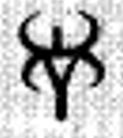
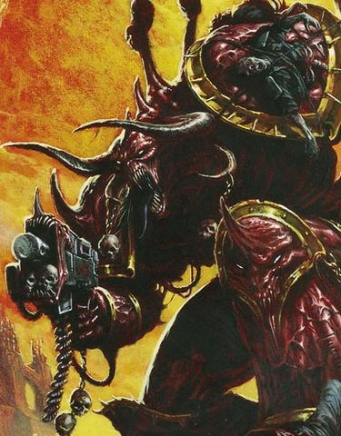
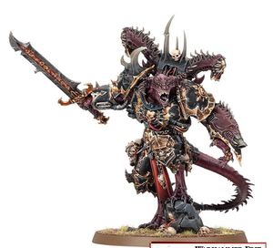
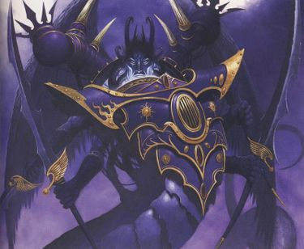
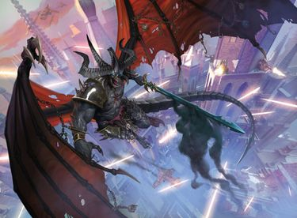

# 0513 恶魔亲王 Daemon Princes

精校状态：中文行文已逐段精校，部分术语仍为暂定

分类：组织 / 混沌 Chaos / 混沌诸神 Chaos Gods

原文来源：https://www.bilibili.com/opus/1206962260626374697

原作者：帝国神选罐头

原文时间：2026年05月27日 12:30

[返回分类目录](目录.md) · [全书目录](../../目录.md)

原篇名：恶魔王子 Daemon Princes

<!-- A0513-B0001 -->
**英文原文**

Daemon Princes are former mortal Champions of Chaos who have been elevated to daemonhood by the Gods of Chaos. They have bartered their humanity for unearthly power and immortality.

<!-- /A0513-B0001 -->

<!-- A0513-B0002 -->

原译文

恶魔王子是前凡人混沌冠军，被混沌诸神升格为恶魔王子。他们用人性换取了超凡的力量和不朽。

**校订译文**

恶魔亲王原本是凡人的混沌勇士，后来获混沌诸神擢升为恶魔。他们以人性为代价，换取超凡的力量与永生。

<!-- /A0513-B0002 -->

<!-- A0513-B0003 图片 -->

<!-- A0513-B0004 -->

原译文

Dark Tongue rune for Daemon Prince 恶魔王子的暗语符文

**校订译文**

Dark Tongue rune for Daemon Prince 恶魔亲王的暗语符文

<!-- /A0513-B0004 -->

<!-- A0513-B0005 -->
## Overview 概述

<!-- /A0513-B0005 -->

<!-- A0513-B0006 -->
**英文原文**

In order to attract the attention of their patrons, Chaos Champions have to perform great and terrible deeds. They sacrifice enemies and allies alike for their ambitions and risk their demise at the hands of both their foes and gods. The few that manage to avoid death and spawndom are changed beyond recognition.

<!-- /A0513-B0006 -->

<!-- A0513-B0007 -->

原译文

为了吸引他们主人的注意，混沌冠军必须做出伟大而可怕的行为。他们为了自己的野心牺牲敌人和盟友，冒着被敌人和神杀死的风险。少数设法避开死亡和混沌卵的人已经发生了翻天覆地的变化。

**校订译文**

为了吸引庇护神的注意，混沌勇士必须做出惊天动地的可怖行径。他们为实现野心，将敌人与盟友一并献祭，冒着死于敌人或神祇之手的风险。极少数既逃过死亡，又未沦为混沌魔物的人，最终会变得与原先判若两人。

**校注：** spawndom 指沦为 Chaos Spawn 的状态，统一混沌魔物，不是避开某只混沌卵。

<!-- /A0513-B0007 -->

<!-- A0513-B0008 图片 -->

<!-- A0513-B0009 -->

原译文

Dhar'leth, Daemon Prince of the Black Legion 达拉'利斯，黑色军团的恶魔王子

**校订译文**

Dhar'leth, Daemon Prince of the Black Legion 达拉'利斯，黑色军团的恶魔亲王

<!-- /A0513-B0009 -->

<!-- A0513-B0010 -->
**英文原文**

While Daemon Princes come in various shapes, most are of hulking stature, displaying numerous mutations such as horns and wings. Even more notable are the supernatural powers they wield, some of which are associated with their patron god. What they maintain of former selves are the driving ambition and ruthless cunning which helped them earn their ultimate reward.

<!-- /A0513-B0010 -->

<!-- A0513-B0011 -->

原译文

虽然恶魔王子有各种各样的形状，但大多数都是笨重的身材，显示出许多变异，如角和翅膀。更值得注意的是他们所拥有的超自然力量，其中一些与他们的主神有关。他们对过去的自我所保留的是驱使他们的野心和无情的狡猾，这帮助他们获得了最终的回报。

**校订译文**

恶魔亲王形态各异，大多身形魁梧，具有犄角、翅膀等诸多突变特征。更为惊人的是它们掌握的超自然力量，其中一部分与庇护神相关。它们从凡人时期保留下来的，是强烈的野心与冷酷的狡诈——正是这些特质帮助它们赢得了最终的赏赐。

<!-- /A0513-B0011 -->

<!-- A0513-B0012 -->
**英文原文**

In the 41st millennium, most Daemon Princes hail from the ranks of the Chaos Space Marines, warriors with the capability and motivation to slay the populations of entire worlds, although the oldest managed to ascend during the savage age long before mankind left ancient Earth.

<!-- /A0513-B0012 -->

<!-- A0513-B0013 -->

原译文

在第41个千年里，大多数恶魔王子都来自混沌星际战士，他们是有能力和动机杀死全世界人口的战士，尽管最年长的在人类离开古代地球之前很久的野蛮时代就成功地升格了。

**校订译文**

到第 41 千年，大多数恶魔亲王都出身混沌星际战士。这些战士既有能力，也有意愿屠灭整颗行星的人口。然而，最古老的恶魔亲王早在人类离开古地球之前的蛮荒时代，就已完成升格。

<!-- /A0513-B0013 -->

<!-- A0513-B0014 图片 -->

<!-- A0513-B0015 -->

原译文

Daemon Princes 恶魔王子

**校订译文**

Daemon Princes 恶魔亲王

<!-- /A0513-B0015 -->

<!-- A0513-B0016 -->
**英文原文**

Daemon Princes rule supreme over mortal Chaos followers and are usually granted reign over a Daemon World of their own. Despite this, it is not uncommon for them to leave the material plane completely and join a daemonic legion in order to serve as right hand of a mighty Greater Daemon or even as that daemon's commander. For all their rank and power however, real Daemons commonly regard them as inferior due to their human origin, a belief that is very rarely proven, as many Princes have slain powerful Daemons long before joining their immortal ranks.

<!-- /A0513-B0016 -->

<!-- A0513-B0017 -->

原译文

恶魔王子统治着凡人混沌追随者，通常被授予统治自己的恶魔世界的权利。尽管如此，他们完全离开物质界并加入一个恶魔军团，以担任强大的大魔的右手，甚至担任该恶魔的指挥官，这种情况并不罕见。然而，尽管他们的地位和力量，但真正的恶魔通常认为他们是低等的，因为他们的人类起源，这种看法很少得到证实，因为许多王子在加入他们不朽的行列之前很久就杀死了强大的恶魔。

**校订译文**

恶魔亲王凌驾于凡人混沌信徒之上，通常还会获赐一颗属于自己的恶魔世界。即便如此，它们也常彻底离开物质界，加入恶魔军团，担任强大大魔的得力助手，甚至反过来统率大魔。尽管恶魔亲王位高权重，天生的恶魔仍往往因其人类出身而轻视它们。但这种优越感很少能得到实力印证，因为许多亲王在加入不朽者行列之前，就已杀死过强大的恶魔。

<!-- /A0513-B0017 -->

<!-- A0513-B0018 -->
**英文原文**

Daemon Princes frequently wield Hellforged Swords and Daemonic Axes in battle.

<!-- /A0513-B0018 -->

<!-- A0513-B0019 -->

原译文

恶魔王子经常在战斗中挥舞狱铸之剑和恶魔之斧。

**校订译文**

恶魔亲王经常在战斗中挥舞狱铸之剑和恶魔之斧。

<!-- /A0513-B0019 -->

<!-- A0513-B0020 -->
## Daemon Primarchs 恶魔原体

<!-- /A0513-B0020 -->

<!-- A0513-B0021 -->
**英文原文**

The most infamous of the Daemon Princes come from the traitor Primarchs that turned against the Emperor during the Horus Heresy. These powerful beings are still revered by the very Legions they corrupted millennia ago, even though it is uncommon for them to personally lead them forth from their Daemon Worlds. Instead they prefer to fight against their enemies within the Eye of Terror, leaving the direction of their Legions to their loyal minions and Champions. Arguably greater in power than any other Daemon Prince or Greater Daemon, they are feared and respected by all who worship chaos and are looked upon as personal champions by their gods.

<!-- /A0513-B0021 -->

<!-- A0513-B0022 -->

原译文

最臭名昭著的恶魔王子来自荷鲁斯叛乱期间背叛帝皇的叛徒原体。这些强大的生物仍然受到数千年前被他们腐化的军团的尊敬，尽管他们亲自带领他们离开他们的恶魔世界的情况并不常见。相反，他们更喜欢在恐惧之眼内与敌人作战，将军团的方向留给忠诚的下属和冠军。可以说，他们的力量比任何其他恶魔王子或大魔都要大，他们被所有崇拜混沌的人所敬畏和尊重，并被他们的神视为个人冠军。

**校订译文**

恶魔亲王中最声名狼藉者，便是荷鲁斯之乱期间背叛帝皇的原体。这些强大存在仍受到数千年前被它们腐化的军团尊崇，却很少亲自率军离开各自的恶魔世界。它们更愿意在恐惧之眼内部与敌人交战，将军团的指挥权交给忠诚的爪牙与勇士。它们或许比任何其他恶魔亲王或大魔都更强大，令所有混沌信徒既敬且畏，也被各自神祇视为亲自选中的勇士。

**校注：** 本段关于恶魔原体很少亲自离开恶魔世界的表述保留原稿版本；并保留 arguably 的推测语气，不改为绝对战力定论。

<!-- /A0513-B0022 -->

<!-- A0513-B0023 图片 -->

<!-- A0513-B0024 -->

原译文

Fulgrim, Daemon Primarch of the Emperor's Children 福格瑞姆，帝皇之子的恶魔原体

**校订译文**

Fulgrim, Daemon Primarch of the Emperor's Children 福格瑞姆，帝皇之子的恶魔原体

<!-- /A0513-B0024 -->

<!-- A0513-B0025 -->
## Notable Daemon Princes 著名恶魔亲王

原题：Notable Daemon Princes 著名恶魔王子

<!-- /A0513-B0025 -->

<!-- A0513-B0026 -->
**英文原文**

Angron — Daemon Prince of Khorne

<!-- /A0513-B0026 -->

<!-- A0513-B0027 -->

原译文

安格隆 — 恐虐恶魔王子

**校订译文**

安格隆 — 恐虐恶魔亲王

<!-- /A0513-B0027 -->

<!-- A0513-B0028 -->
**英文原文**

Be'lakor — The first Daemon Prince

<!-- /A0513-B0028 -->

<!-- A0513-B0029 -->

原译文

比'拉克 — 第一个恶魔王子

**校订译文**

比拉克尔——第一位恶魔亲王。

<!-- /A0513-B0029 -->

<!-- A0513-B0030 图片 -->

<!-- A0513-B0031 -->

原译文

Be'lakor 比'拉克

**校订译文**

Be'lakor 比拉克尔

<!-- /A0513-B0031 -->

<!-- A0513-B0032 -->
**英文原文**

Bubonicus — Daemon Prince of Nurgle

<!-- /A0513-B0032 -->

<!-- A0513-B0033 -->

原译文

布波尼库斯 — 纳垢恶魔王子

**校订译文**

布波尼库斯 — 纳垢恶魔亲王

<!-- /A0513-B0033 -->

<!-- A0513-B0034 -->
**英文原文**

Doombreed — Daemon Prince of Khorne

<!-- /A0513-B0034 -->

<!-- A0513-B0035 -->

原译文

毁灭之种 — 恐虐恶魔王子

**校订译文**

毁灭之种 — 恐虐恶魔亲王

<!-- /A0513-B0035 -->

<!-- A0513-B0036 -->
**英文原文**

Doomrider — Daemon Prince of Slaanesh

<!-- /A0513-B0036 -->

<!-- A0513-B0037 -->

原译文

末日骑手 — 色孽恶魔王子

**校订译文**

末日骑手 — 色孽恶魔亲王

<!-- /A0513-B0037 -->

<!-- A0513-B0038 -->
**英文原文**

Fulgrim — Daemon Prince of Slaanesh

<!-- /A0513-B0038 -->

<!-- A0513-B0039 -->

原译文

福格瑞姆 — 色孽恶魔王子

**校订译文**

福格瑞姆 — 色孽恶魔亲王

<!-- /A0513-B0039 -->

<!-- A0513-B0040 -->
**英文原文**

Lorgar — Daemon Prince of Chaos Undivided

<!-- /A0513-B0040 -->

<!-- A0513-B0041 -->

原译文

珞珈 — 混沌无分恶魔王子

**校订译文**

珞珈——无分混沌的恶魔亲王。

<!-- /A0513-B0041 -->

<!-- A0513-B0042 -->
**英文原文**

Perturabo — Daemon Prince of Chaos Undivided

<!-- /A0513-B0042 -->

<!-- A0513-B0043 -->

原译文

佩图拉博 — 混沌无分恶魔王子

**校订译文**

佩图拉博——无分混沌的恶魔亲王。

<!-- /A0513-B0043 -->

<!-- A0513-B0044 -->
**英文原文**

Mortarion — Daemon Prince of Nurgle

<!-- /A0513-B0044 -->

<!-- A0513-B0045 -->

原译文

莫塔里安 —纳垢恶魔王子

**校订译文**

莫塔里安——纳垢恶魔亲王。

<!-- /A0513-B0045 -->

<!-- A0513-B0046 -->
**英文原文**

Magnus the Red — Daemon Prince of Tzeentch

<!-- /A0513-B0046 -->

<!-- A0513-B0047 -->

原译文

赤红之马格努斯 — 奸奇恶魔王子

**校订译文**

红魔马格努斯——奸奇恶魔亲王。

<!-- /A0513-B0047 -->

<!-- A0513-B0048 -->
**英文原文**

M'Kar the Reborn — Daemon Prince of Chaos Undivided

<!-- /A0513-B0048 -->

<!-- A0513-B0049 -->

原译文

重生者姆'卡 — 混沌无分恶魔王子

**校订译文**

重生者姆’卡尔——无分混沌的恶魔亲王。

<!-- /A0513-B0049 -->

<!-- A0513-B0050 -->
**英文原文**

N'Kari — Daemon Prince of Slaanesh

<!-- /A0513-B0050 -->

<!-- A0513-B0051 -->

原译文

纳'卡里 — 色孽恶魔王子

**校订译文**

纳’卡里——色孽恶魔亲王。

<!-- /A0513-B0051 -->

<!-- A0513-B0052 -->
**英文原文**

Tallomin — Daemon Prince of Khorne

<!-- /A0513-B0052 -->

<!-- A0513-B0053 -->

原译文

塔洛明 —恐虐恶魔王子

**校订译文**

塔洛明——恐虐恶魔亲王。

<!-- /A0513-B0053 -->

<!-- A0513-B0054 -->
**英文原文**

The Witness — Daemon Prince of Nurgle and Khorne

<!-- /A0513-B0054 -->

<!-- A0513-B0055 -->

原译文

见证者 — 纳垢和恐虐恶魔王子

**校订译文**

见证者——同时奉于纳垢与恐虐的恶魔亲王。

**校注：** 原文明列 The Witness 同时与纳垢和恐虐相关，忠实保留，不按单一神祇归属惯例改写。

<!-- /A0513-B0055 -->

本篇核心术语与暂定项

以下列出本篇出现的英文原形及核心术语表用词。同形词可能指不同对象，具体词义以本篇正文和校注为准；单复数、别名和仅见于图注的名称可能尚未列入。完整候选见[术语表](../../术语表/双语术语候选.csv)。

| 英文 | 采用中文 | 状态 |
| --- | --- | --- |
| Space Marines | 星际战士 | 官方已核对 |
| Chaos Space Marines | 混沌星际战士 | 官方已核对 |
| Be'lakor | 比拉克尔 | 官方已核对 |
| Horus Heresy | 荷鲁斯之乱 | 官方已核对 |
| Khorne | 恐虐 | 官方已核对 |
| Tzeentch | 奸奇 | 官方已核对 |
| Nurgle | 纳垢 | 官方已核对 |
| Eye of Terror | 恐惧之眼 | 官方已核对 |
| Emperor | 帝皇 | 官方已核对 |
| Daemon Prince | 恶魔亲王 | 官方已核对 |
| Slaanesh | 色孽 | 官方已核对 |
| Mortarion | 莫塔里安 | 官方已核对 |
| Horus | 荷鲁斯 | 暂定·官方待核 |
| Fulgrim | 福格瑞姆 | 官方已核对 |
| Magnus the Red | 红魔马格努斯 | 官方已核对 |
| Ancient | 旗手 | 官方已核对 |
| Reborn | 复生者（战团）／重生者（死神军自称） | 语境定译·官方待核 |
| Mortal | 凡人 | 暂定·官方待核 |
| Lorgar | 珞珈 | 暂定·官方待核 |
| Chaos Undivided | 混沌无分 | 暂定·官方待核 |
| Powers | 能天使 | 暂定·官方待核 |
| Daemon Prince of Chaos | 混沌恶魔亲王 | 官方已核对 |
| Doomrider | 末日骑手 | 暂定·官方待核 |
| Doombreed | 毁灭之种 | 暂定·官方待核 |
| Bubonicus | 布波尼库斯 | 暂定·官方待核 |
| Tallomin | 塔洛明 | 暂定·官方待核 |
| Angron | 安格隆 | 官方已核对 |

