# 0514 嗜血狂魔 Bloodthirsters

精校状态：中文行文已逐段精校，部分术语仍为暂定

分类：组织 / 混沌 Chaos / 混沌诸神 Chaos Gods

原文来源：https://www.bilibili.com/opus/1206591175464583172

原作者：帝国神选罐头

原文时间：2026年05月26日 12:30

[返回分类目录](目录.md) · [全书目录](../../目录.md)

<!-- A0514-B0001 -->
**英文原文**

Bloodthirsters are the Greater Daemons of Khorne. These savage beasts exhibit extreme rage, martial skill and bloodlust.

<!-- /A0514-B0001 -->

<!-- A0514-B0002 -->

原译文

嗜血狂魔是恐虐的大魔。这些野兽表现出极度的愤怒、武艺和嗜血。

**校订译文**

嗜血狂魔是恐虐的大魔。这些凶残巨兽狂怒不息、嗜血成性，也拥有高超的武艺。

<!-- /A0514-B0002 -->

<!-- A0514-B0003 图片 -->
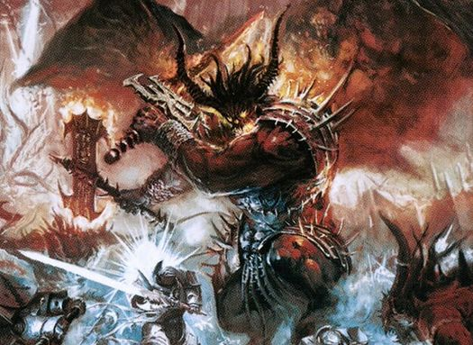

<!-- A0514-B0004 -->

原译文

Bloodthirster 嗜血狂魔

**校订译文**

Bloodthirster 嗜血狂魔

<!-- /A0514-B0004 -->

<!-- A0514-B0005 -->
## Overview 概述

<!-- /A0514-B0005 -->

<!-- A0514-B0006 -->
**英文原文**

Bloodthirsters are the most savage and martial of the Blood God's servants. Their bloodlust extends beyond mortal comprehension and their power is said to be only matched by the Primarchs of old.

<!-- /A0514-B0006 -->

<!-- A0514-B0007 -->

原译文

嗜血狂魔是血神的仆人中最野蛮、最好战的。他们的嗜血欲望超出了凡人的理解范围，据说他们的力量只有旧日的原体才能与之匹敌。

**校订译文**

嗜血狂魔是血神的仆人中最野蛮、最好战的。他们的嗜血欲望超出了凡人的理解范围，据说他们的力量只有旧日的原体才能与之匹敌。

<!-- /A0514-B0007 -->

<!-- A0514-B0008 图片 -->
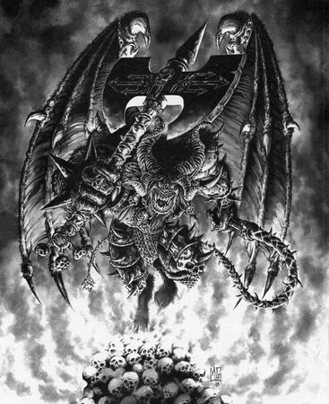

<!-- A0514-B0009 -->

原译文

Bloodthirster of Khorne 恐虐嗜血狂魔

**校订译文**

Bloodthirster of Khorne 恐虐嗜血狂魔

<!-- /A0514-B0009 -->

<!-- A0514-B0010 -->
**英文原文**

They manifest as towering, muscular behemoths with bestial, almost canine faces, bloodied manes and sharp horns and are clad in the Brass Armour of Khorne which protects them from magic spells and from ranged attacks. More noteworthy are their great leathery wings that allow them to dive into the midst of battle. In combat they use immense Axes that have been forged in the heat of Khorne's wrath and bear the essence of a caged Greater Daemon in conjunction with a long whip known as a Gorewhip that allows them to attack more distant foes. Some of the most favored Bloodthirsters of Khorne will also wield great Firestorm Blades.

<!-- /A0514-B0010 -->

<!-- A0514-B0011 -->

原译文

他们表现为高大、肌肉发达的巨兽，有着野兽般的、似犬一样的脸、染血的鬃毛和锋利的角，穿着恐虐黄铜盔甲，保护他们免受魔法咒语和远程攻击。更值得注意的是，它们巨大的坚韧翅膀使它们能够在战斗中俯冲。在战斗中，他们使用在恐虐之怒的温度下铸造的巨大斧头，并带有笼中的大魔本质，以及一根被称为流血之鞭的长鞭，使他们能够攻击更远的敌人。一些最受宠的恐虐嗜血狂魔也将挥舞着巨大的火焰风暴刃。

**校订译文**

嗜血狂魔显现为高大魁梧、肌肉虬结的巨兽，面孔兽性十足，近似犬类，生有染血的鬃毛与尖角。它们身披恐虐黄铜甲，抵御法术与远程攻击；巨大的革质双翼则让它们能够从空中俯冲，直扑战阵中心。它们的巨斧以恐虐怒火的炽热锻成，内部封印着一头大魔的本质；另一手则挥舞流血之鞭，抽击较远的敌人。最受恐虐宠爱的嗜血狂魔中，有些还会使用巨大的火焰风暴刃。

<!-- /A0514-B0011 -->

<!-- A0514-B0012 图片 -->
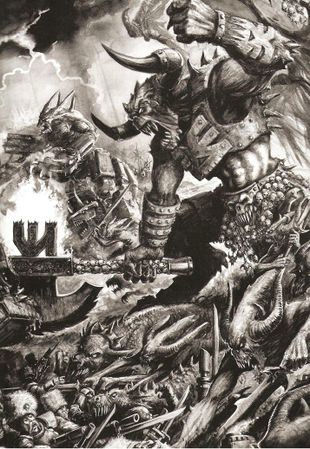

<!-- A0514-B0013 -->

原译文

Bloodthirster leading an army 领导军队的嗜血狂魔

**校订译文**

Bloodthirster leading an army 领导军队的嗜血狂魔

<!-- /A0514-B0013 -->

<!-- A0514-B0014 -->
## The Eight Hosts 八大天军

<!-- /A0514-B0014 -->

<!-- A0514-B0015 -->
**英文原文**

Only those well versed in daemonic lore are aware of the Bloodthirster hierarchy. They are organised into eight hosts, ascending in power, prestige, and favour. Each Bloodthirster commands its own legions of daemons and possesses its own lethal skills. Underestimating even those of the eighth and weakest host is a fatal error; they are still greater daemons and far more powerful than any mortal warriors.

<!-- /A0514-B0015 -->

<!-- A0514-B0016 -->

原译文

只有那些精通恶魔传说的人才知道嗜血狂魔的等级制度。他们被组织成八个天军，在力量、威望和恩宠方面不断上升。每个嗜血狂魔都有自己的恶魔军团，并拥有自己的致命技能。即使低估第八个也是最弱的天军，也是一个致命的错误；他们仍然是大魔，比任何凡人战士都强大得多。

**校订译文**

只有精通恶魔知识的人，才了解嗜血狂魔的等级体系。它们分为八大天军，实力、威望与所受恩宠逐级递增。每头嗜血狂魔都统率自己的恶魔军团，并具备独到的杀戮本领。即使是排名第八、实力最弱的天军，也绝不可低估；其中的成员仍是大魔，远比任何凡人战士强大。

**校注：** 八大天军的编号越小等级越高；英文仅列第一、第三、第六、第八天军，未附其余四级，本稿不自行补写。

<!-- /A0514-B0016 -->

<!-- A0514-B0017 图片 -->
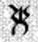

<!-- A0514-B0018 -->

原译文

Dark Tongue rune for Bloodthirster 嗜血狂魔的暗语符文

**校订译文**

Dark Tongue rune for Bloodthirster 嗜血狂魔的暗语符文

<!-- /A0514-B0018 -->

<!-- A0514-B0019 -->
**英文原文**

First Host: These Exalted Bloodthirsters are the mightiest of their kind. Only eight of these mighty Daemons exist, and amonst their ranks are An'ggrath, Ka'Bandha, and Skarbrand.

<!-- /A0514-B0019 -->

<!-- A0514-B0020 -->

原译文

第一天军：这些神尊嗜血狂魔是同类中最强大的。这些强大的恶魔只有八个存在，其中包括安'格拉斯、卡'班哈和斯卡布兰德。

**校订译文**

第一天军：这些神尊嗜血狂魔是同类中的最强者，总共只有八头，包括安’格拉斯、卡’班哈与斯卡布兰德。

<!-- /A0514-B0020 -->

<!-- A0514-B0021 -->
**英文原文**

Third Host: The Wrath of Khorne are hero-hunters who seek out the mightiest heroes of the enemy and maim them in the name of Khorne. They wield a Bloodflail and an Axe of Khorne.

<!-- /A0514-B0021 -->

<!-- A0514-B0022 -->

原译文

第三天军：恐虐之怒是英雄猎手，他们以恐虐的名义寻找敌人中最强大的英雄，并使他们重伤。他们挥舞着鲜血链枷和恐虐之斧。

**校订译文**

第三天军：恐虐之怒嗜血狂魔专门猎杀英雄，寻找敌军最强大的勇士，以恐虐之名将其重创、残害。它们使用鲜血链枷与恐虐之斧。

<!-- /A0514-B0022 -->

<!-- A0514-B0023 图片 -->
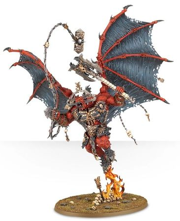

<!-- A0514-B0024 -->

原译文

Wrath of Khorne Bloodthirsters 恐虐之怒嗜血狂魔

**校订译文**

Wrath of Khorne Bloodthirsters 恐虐之怒嗜血狂魔

<!-- /A0514-B0024 -->

<!-- A0514-B0025 -->
**英文原文**

Sixth Host: Bloodthirsters of Insensate Rage are berserk destroyers who wield great axes as tall as a castle's gate. Nothing can stand before them on the battlefield and daemons of Khorne are instinctively drawn on in their wake. They wield a Great Axe of Khorne.

<!-- /A0514-B0025 -->

<!-- A0514-B0026 -->

原译文

第六天军：狂暴愤怒嗜血狂魔是狂暴的破坏者，他们挥舞着像城堡大门一样高的斧头。在战场上，没有什么能站在他们面前，恐虐的恶魔本能地被他们吸引。他们挥舞着恐虐大斧。

**校订译文**

第六天军：狂暴愤怒嗜血狂魔是癫狂的毁灭者，挥舞着城堡大门般高大的巨斧。战场上没有什么能够阻挡它们，其他恐虐恶魔也会本能地追随其后。它们的武器称为恐虐大斧。

<!-- /A0514-B0026 -->

<!-- A0514-B0027 图片 -->
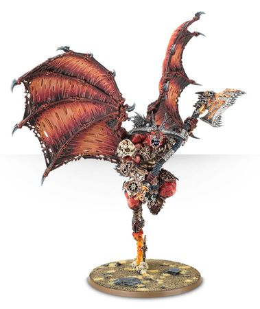

<!-- A0514-B0028 -->

原译文

Bloodthirsters of Insensate Rage 狂暴愤怒嗜血狂魔

**校订译文**

Bloodthirsters of Insensate Rage 狂暴愤怒嗜血狂魔

<!-- /A0514-B0028 -->

<!-- A0514-B0029 -->
**英文原文**

Eighth Host: Bloodthirsters of Unfettered Fury are skilled generals and command Khorne's daemonic legions in their attacks on real space. They are armed with the combination of an Axe of Khorne and a Lash of Khorne.

<!-- /A0514-B0029 -->

<!-- A0514-B0030 -->

原译文

第八天军：无拘愤怒嗜血狂魔是熟练的将军，指挥恐虐的恶魔军团对现实空间的攻击。他们配备了恐虐之斧和恐虐之鞭的组合。

**校订译文**

第八天军：无拘愤怒嗜血狂魔是老练的统帅，指挥恐虐恶魔军团进攻现实空间，以恐虐之斧与恐虐之鞭的组合作战。

<!-- /A0514-B0030 -->

<!-- A0514-B0031 图片 -->
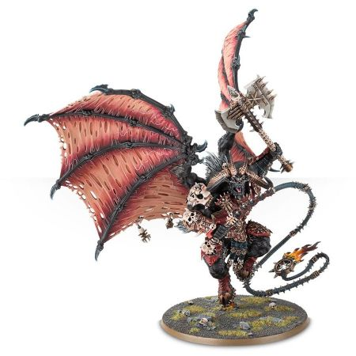

<!-- A0514-B0032 -->

原译文

Bloodthirsters of Unfettered Fury 无拘愤怒嗜血狂魔

**校订译文**

Bloodthirsters of Unfettered Fury 无拘愤怒嗜血狂魔

<!-- /A0514-B0032 -->

<!-- A0514-B0033 -->
## Notable Bloodthirsters 著名嗜血狂魔

<!-- /A0514-B0033 -->

<!-- A0514-B0034 图片 -->
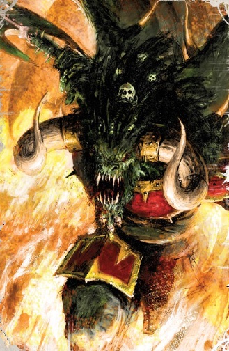

<!-- A0514-B0035 -->

原译文

Bloodthirster 嗜血狂魔

**校订译文**

Bloodthirster 嗜血狂魔

<!-- /A0514-B0035 -->

<!-- A0514-B0036 -->

原译文

Anarkh'ad'nron 阿纳克'阿德'纳隆

**校订译文**

Anarkh'ad'nron 阿纳克'阿德'纳隆

<!-- /A0514-B0036 -->

<!-- A0514-B0037 -->
**英文原文**

An'ggrath — Lord of Bloodthirsters, Guardian of the Throne of Skulls

<!-- /A0514-B0037 -->

<!-- A0514-B0038 -->

原译文

安'格拉斯 — 嗜血狂魔领主，颅骨王座的守卫者

**校订译文**

安'格拉斯 — 嗜血狂魔领主，颅骨王座的守卫者

<!-- /A0514-B0038 -->

<!-- A0514-B0039 图片 -->
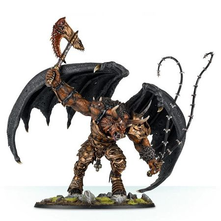

<!-- A0514-B0040 -->

原译文

An'ggrath 安'格拉斯

**校订译文**

An'ggrath 安'格拉斯

<!-- /A0514-B0040 -->

<!-- A0514-B0041 -->
**英文原文**

An'kha'arak — butchered 50,000 Imperial servants at Toreus

<!-- /A0514-B0041 -->

<!-- A0514-B0042 -->

原译文

安'卡'阿拉克 — 在托勒斯屠杀了50000名帝国之仆

**校订译文**

安’卡’阿拉克——曾在托雷乌斯屠杀 50,000 名帝国仆从。

**校注：** Toreus 沿第512篇已用“托雷乌斯”，本段原稿误作托勒斯。

<!-- /A0514-B0042 -->

<!-- A0514-B0043 -->
**英文原文**

Arbra'Gax — massacred the Masque of the Silent Shroud

<!-- /A0514-B0043 -->

<!-- A0514-B0044 -->

原译文

阿布拉'加克斯 — 屠杀了寂静寿衣假面舞会

**校订译文**

阿布拉’加克斯——曾屠戮寂静寿衣假面剧团。

**校注：** Masque 此处指丑角剧团，不是一次舞会；名称暂沿“寂静寿衣”。

<!-- /A0514-B0044 -->

<!-- A0514-B0045 -->

原译文

Ax'akhan 阿克斯'阿坎

**校订译文**

Ax'akhan 阿克斯'阿坎

<!-- /A0514-B0045 -->

<!-- A0514-B0046 -->

原译文

Bhorghaster 博尔加斯特

**校订译文**

Bhorghaster 博尔加斯特

<!-- /A0514-B0046 -->

<!-- A0514-B0047 -->
**英文原文**

Cruor Praetoria — twelve Bloodthirsters who acted as Angron's bodyguard during the First War for Armageddon.

<!-- /A0514-B0047 -->

<!-- A0514-B0048 -->

原译文

残酷者卫队 —在第一次阿玛吉多顿战争中，担任安格隆的护卫的十二名嗜血狂魔。

**校订译文**

残酷者卫队——第一次阿玛吉多顿战争中，担任安格隆护卫的十二头嗜血狂魔。

<!-- /A0514-B0048 -->

<!-- A0514-B0049 -->
**英文原文**

Ere'khul — head of the Kaedium Blood Cult

<!-- /A0514-B0049 -->

<!-- A0514-B0050 -->

原译文

埃瑞'库尔 — 凯迪姆鲜血教派的首领

**校订译文**

埃瑞'库尔 — 凯迪姆鲜血教派的首领

<!-- /A0514-B0050 -->

<!-- A0514-B0051 -->

原译文

Gahrlukh 加尔鲁克

**校订译文**

Gahrlukh 加尔鲁克

<!-- /A0514-B0051 -->

<!-- A0514-B0052 -->
**英文原文**

Gha’Kharax — turned Almarit into a Daemon World

<!-- /A0514-B0052 -->

<!-- A0514-B0053 -->

原译文

加'卡拉克斯 — 把阿尔玛瑞特变成了恶魔世界

**校订译文**

加'卡拉克斯 — 把阿尔玛瑞特变成了恶魔世界

<!-- /A0514-B0053 -->

<!-- A0514-B0054 -->
**英文原文**

Ghalh'kra — Commands eight lesser Bloodthirsters

<!-- /A0514-B0054 -->

<!-- A0514-B0055 -->

原译文

加尔赫'克拉 — 指挥八个次级嗜血狂魔

**校订译文**

加尔赫’克拉——统率八头较弱的嗜血狂魔。

**校注：** lesser 为相对强弱，不能误认其属于 Lesser Daemons 低级恶魔这一不同类别。

<!-- /A0514-B0055 -->

<!-- A0514-B0056 -->
**英文原文**

Gore Lord — master of the vast Daemonic warband the Brazen Host.

<!-- /A0514-B0056 -->

<!-- A0514-B0057 -->

原译文

流血领主 — 巨大的恶魔战帮黄铜天军之主。

**校订译文**

流血领主——庞大恶魔战帮“黄铜天军”的主人。

<!-- /A0514-B0057 -->

<!-- A0514-B0058 -->

原译文

G'rmakht 格'玛赫特

**校订译文**

G'rmakht 格'玛赫特

<!-- /A0514-B0058 -->

<!-- A0514-B0059 -->
**英文原文**

Hakk'an'graah — ally of Abaddon the Despoiler

<!-- /A0514-B0059 -->

<!-- A0514-B0060 -->

原译文

哈克'安'格拉 — 掠夺者阿巴顿的盟友

**校订译文**

哈克'安'格拉 — 掠夺者阿巴顿的盟友

<!-- /A0514-B0060 -->

<!-- A0514-B0061 -->
**英文原文**

Hak'Vasha — member of the Quadrifold Abominatum

<!-- /A0514-B0061 -->

<!-- A0514-B0062 -->

原译文

哈克'瓦沙 — 四重憎恶的成员

**校订译文**

哈克'瓦沙 — 四重憎恶的成员

<!-- /A0514-B0062 -->

<!-- A0514-B0063 -->
**英文原文**

Hk'ghaa'resh - Exalted Bloodthirster

<!-- /A0514-B0063 -->

<!-- A0514-B0064 -->

原译文

赫克'伽阿'雷什 - 神尊嗜血狂魔

**校订译文**

赫克'伽阿'雷什 - 神尊嗜血狂魔

<!-- /A0514-B0064 -->

<!-- A0514-B0065 -->
**英文原文**

Infurnace — near-mythical in the sagas of the Space Wolves

<!-- /A0514-B0065 -->

<!-- A0514-B0066 -->

原译文

因弗纳斯 — 太空狼野故事中近乎神话的

**校订译文**

因弗纳斯——在太空野狼的英雄史诗中，其形象近乎神话。

<!-- /A0514-B0066 -->

<!-- A0514-B0067 -->
**英文原文**

Ka'Bandha — bane of the Blood Angels

<!-- /A0514-B0067 -->

<!-- A0514-B0068 -->

原译文

卡'班哈 — 圣血天使之灾

**校订译文**

卡'班哈 — 圣血天使之灾

<!-- /A0514-B0068 -->

<!-- A0514-B0069 图片 -->
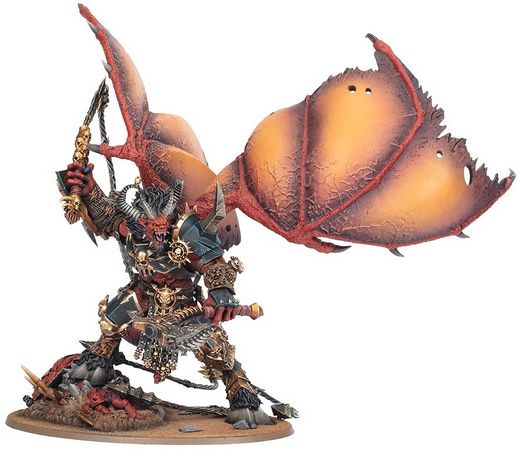

<!-- A0514-B0070 -->

原译文

Ka'Bandha 卡'班哈

**校订译文**

Ka'Bandha 卡'班哈

<!-- /A0514-B0070 -->

<!-- A0514-B0071 -->
**英文原文**

Ka'jagga'nath — Lord of the Bloodtide

<!-- /A0514-B0071 -->

<!-- A0514-B0072 -->

原译文

卡'贾加'纳斯 — 血潮领主

**校订译文**

卡'贾加'纳斯 — 血潮领主

<!-- /A0514-B0072 -->

<!-- A0514-B0073 -->
**英文原文**

Kar'Voth — killed in the warp by Kaldor Draigo.

<!-- /A0514-B0073 -->

<!-- A0514-B0074 -->

原译文

卡尔'沃斯 — 在亚空间中被卡尔多·迪亚哥所杀

**校订译文**

卡尔'沃斯 — 在亚空间中被卡尔多·迪亚哥所杀

<!-- /A0514-B0074 -->

<!-- A0514-B0075 -->
**英文原文**

Kha Ak-Lash Kha-Aksha — bound in a daemon axe

<!-- /A0514-B0075 -->

<!-- A0514-B0076 -->

原译文

卡·阿克-拉什·卡-阿克沙 — 束缚在一件恶魔之斧中

**校订译文**

卡·阿克-拉什·卡-阿克沙——被封印在一柄恶魔战斧中。

<!-- /A0514-B0076 -->

<!-- A0514-B0077 -->
**英文原文**

Khargenthul — ally of Chaos Lord Bane of the World Eaters

<!-- /A0514-B0077 -->

<!-- A0514-B0078 -->

原译文

卡根苏尔 — 混沌领主吞世者之灾的盟友

**校订译文**

卡根苏尔——吞世者混沌领主贝恩的盟友。

**校注：** Bane 是吞世者混沌领主之名，原译“混沌领主吞世者之灾”误拆句法；暂定“贝恩”。

<!-- /A0514-B0078 -->

<!-- A0514-B0079 -->

原译文

Kh'argosh Boilblood 卡'尔戈什·沸血

**校订译文**

Kh'argosh Boilblood 卡'尔戈什·沸血

<!-- /A0514-B0079 -->

<!-- A0514-B0080 -->

原译文

Khaz'khul 卡兹'库尔

**校订译文**

Khaz'khul 卡兹'库尔

<!-- /A0514-B0080 -->

<!-- A0514-B0081 -->

原译文

Khan'zhar 坎'扎尔

**校订译文**

Khan'zhar 坎'扎尔

<!-- /A0514-B0081 -->

<!-- A0514-B0082 -->

原译文

Kharkexx 哈尔凯克斯

**校订译文**

Kharkexx 哈尔凯克斯

<!-- /A0514-B0082 -->

<!-- A0514-B0083 -->

原译文

Khulzhar 库尔扎尔

**校订译文**

Khulzhar 库尔扎尔

<!-- /A0514-B0083 -->

<!-- A0514-B0084 -->

原译文

Khorg'gux 科尔格'古克斯

**校订译文**

Khorg'gux 科尔格'古克斯

<!-- /A0514-B0084 -->

<!-- A0514-B0085 -->

原译文

Kor'agar'and 科尔'阿加'安德

**校订译文**

Kor'agar'and 科尔'阿加'安德

<!-- /A0514-B0085 -->

<!-- A0514-B0086 -->

原译文

Krangar 克兰加尔

**校订译文**

Krangar 克兰加尔

<!-- /A0514-B0086 -->

<!-- A0514-B0087 -->

原译文

Ma'ken'gorr 马'肯'戈尔

**校订译文**

Ma'ken'gorr 马'肯'戈尔

<!-- /A0514-B0087 -->

<!-- A0514-B0088 -->
**英文原文**

Ragged Knight — ancient daemon born in M2

<!-- /A0514-B0088 -->

<!-- A0514-B0089 -->

原译文

褴褛骑士 — 诞生于M2的古代恶魔

**校订译文**

褴褛骑士——诞生于 M2 的古老恶魔。

<!-- /A0514-B0089 -->

<!-- A0514-B0090 -->
**英文原文**

Skarbrand — the Exiled One

<!-- /A0514-B0090 -->

<!-- A0514-B0091 -->

原译文

斯卡布兰德 — 流放者

**校订译文**

斯卡布兰德 — 流放者

<!-- /A0514-B0091 -->

<!-- A0514-B0092 图片 -->
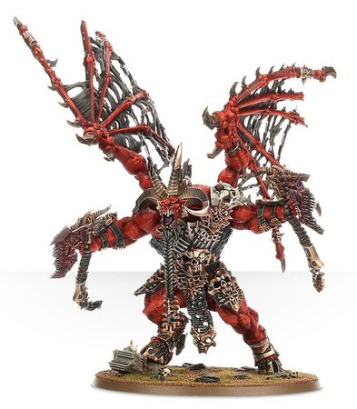

<!-- A0514-B0093 -->

原译文

Skarbrand 斯卡布兰德

**校订译文**

Skarbrand 斯卡布兰德

<!-- /A0514-B0093 -->

<!-- A0514-B0094 -->

原译文

Slayer of Worlds 世界杀手

**校订译文**

Slayer of Worlds 世界杀手

<!-- /A0514-B0094 -->

<!-- A0514-B0095 -->
**英文原文**

Shazhn'oegtol — bound in a small dagger

<!-- /A0514-B0095 -->

<!-- A0514-B0096 -->

原译文

沙兹恩'奥格托尔 — 束缚在一个小匕首中

**校订译文**

沙兹恩’奥格托尔——被封印在一柄小匕首中。

<!-- /A0514-B0096 -->

<!-- A0514-B0097 -->

原译文

Xakros'Ka 扎克罗斯'卡

**校订译文**

Xakros'Ka 扎克罗斯'卡

<!-- /A0514-B0097 -->

<!-- A0514-B0098 -->
**英文原文**

Vangash'hagash the Ever-Bloody — rules the Daemon World of Kathalon, continually battling the daemonic legions of Tzeentch.

<!-- /A0514-B0098 -->

<!-- A0514-B0099 -->

原译文

永血者万加什'哈加什 — 统治卡塔隆恶魔世界，不断与奸奇的恶魔军团作战。

**校订译文**

永血者万加什'哈加什 — 统治卡塔隆恶魔世界，不断与奸奇的恶魔军团作战。

<!-- /A0514-B0099 -->

<!-- A0514-B0100 -->
**英文原文**

Vor'hakk — the Annihilator of Xarn, Bloodthirster of the Sixth Host

<!-- /A0514-B0100 -->

<!-- A0514-B0101 -->

原译文

沃尔'哈克 — 沙恩的毁灭者，第六天军的嗜血狂魔

**校订译文**

沃尔'哈克 — 沙恩的毁灭者，第六天军的嗜血狂魔

<!-- /A0514-B0101 -->

<!-- A0514-B0102 -->

原译文

Zhul'korr 祖尔'科尔

**校订译文**

Zhul'korr 祖尔'科尔

<!-- /A0514-B0102 -->

<!-- A0514-B0103 -->

原译文

Zakhan'gar 扎坎'加尔

**校订译文**

Zakhan'gar 扎坎'加尔

<!-- /A0514-B0103 -->

<!-- A0514-B0104 -->

原译文

Z'Satrop 泽'萨卓普

**校订译文**

Z'Satrop 泽'萨卓普

<!-- /A0514-B0104 -->

本篇核心术语与暂定项

以下列出本篇出现的英文原形及核心术语表用词。同形词可能指不同对象，具体词义以本篇正文和校注为准；单复数、别名和仅见于图注的名称可能尚未列入。完整候选见[术语表](../../术语表/双语术语候选.csv)。

| 英文 | 采用中文 | 状态 |
| --- | --- | --- |
| Blood Angels | 圣血天使 | 官方已核对 |
| Space Wolves | 太空野狼 | 官方已核对 |
| World Eaters | 吞世者 | 官方已核对 |
| Warp | 亚空间 | 官方已核对 |
| Khorne | 恐虐 | 官方已核对 |
| Tzeentch | 奸奇 | 官方已核对 |
| Armageddon | 阿玛吉多顿 | 暂定·官方待核 |
| Praetoria | 普雷托利亚 | 暂定·官方待核 |
| Master | 导师（审判庭职衔）／舰务官（舰员职务） | 语境定译·官方待核 |
| Ancient | 旗手 | 官方已核对 |
| Lash | 鞭笞号 | 暂定·官方待核 |
| The Primarchs | 原体 | 暂定·官方待核 |
| Despoiler | 劫掠者 | 暂定·官方待核 |
| Kaldor Draigo | 卡尔多·迪亚哥 | 暂定·官方待核 |
| Destroyers | 毁灭者 | 暂定·官方待核 |
| Mortal | 凡人 | 暂定·官方待核 |
| Host | 天军 | 暂定·官方待核 |
| Bloodthirster | 嗜血狂魔 | 官方已核对 |
| Skarbrand | 斯卡布兰德 | 官方已核对 |
| Abaddon the Despoiler | 掠夺者阿巴顿 | 官方已核对 |
| Exalted Bloodthirster | 神尊嗜血狂魔 | 暂定·官方待核 |
| Bloodthirsters of Insensate Rage | 狂暴愤怒嗜血狂魔 | 暂定·官方待核 |
| Bloodthirsters of Unfettered Fury | 无拘愤怒嗜血狂魔 | 暂定·官方待核 |
| Masque of the Silent Shroud | 寂静寿衣假面剧团 | 暂定·官方待核 |
| Cruor Praetoria | 残酷者卫队 | 暂定·官方待核 |
| Angron | 安格隆 | 官方已核对 |
| Bear | 熊 | 暂定·官方待核 |
| The Blood | 鲜血 | 暂定·官方待核 |
| Real Space | 现实空间 | 暂定·官方待核 |
| Shroud | 裹尸布 | 暂定·官方待核 |
| Bloodflail | 鲜血连枷 | 暂定·官方待核 |
| Gorewhip | 凝血之鞭 | 暂定·官方待核 |
| Great Axe of Khorne | 恐虐巨斧 | 暂定·官方待核 |
| Lash of Khorne | 恐虐之鞭 | 暂定·官方待核 |
| Axe of Khorne | 恐虐之斧 | 暂定·官方待核 |
| Firestorm Blades | 火焰风暴刃 | 暂定·官方待核 |

