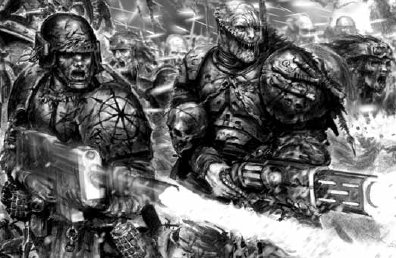
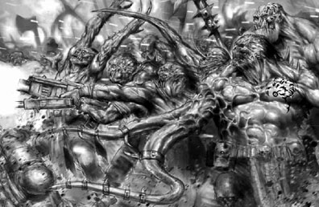

# 0515 迷失者与被诅咒者 The Lost and the Damned

精校状态：中文行文已逐段精校，部分术语仍为暂定

分类：组织 / 混沌 Chaos / 混沌诸神 Chaos Gods / 迷失者与被诅咒者 The Lost and the Damned

原文来源：https://www.bilibili.com/opus/1067204673366130713

原作者：帝国神选罐头

原文时间：2025年05月15日 21:39

[返回分类目录](目录.md) · [全书目录](../../目录.md)

<!-- A0515-B0001 -->
**英文原文**

The Lost and the Damned are the hordes of combined Chaos forces drawing from various elements united under the command of powerful Chaos Space Marines, Daemon Princes, and other great leaders who have attracted the attention of Chaos powers.

<!-- /A0515-B0001 -->

<!-- A0515-B0002 -->

原译文

迷失者和被诅咒者是一群由各种成员组成的混沌力量部落，他们在强大的混沌星际战士、恶魔王子和其他引起混沌力量注意的强大领袖的指挥下团结起来。

**校订译文**

迷失者与被诅咒者，是由多种混沌力量汇成的庞大联军。他们归于强大的混沌星际战士、恶魔亲王，以及其他受到混沌诸力关注的首领麾下。

<!-- /A0515-B0002 -->

<!-- A0515-B0003 -->
## Overview 概述

<!-- /A0515-B0003 -->

<!-- A0515-B0004 -->
**英文原文**

Chaos Space Marines rarely make war alone, with many of their operations involving other servants of the Ruinous Powers. Influential warlords may barter with the Dark Magi of the Dark Mechanicum for possession of Daemon Engines. Others may incite hateful uprisings with cult demagogues or Dark Apostles. Others may summon Daemons or call upon the Traitor Titan Legions. Regardless, only those warlords most favoured by the Ruinous Powers can rise to unite so many factions, as by nature the servants of Chaos remain in continuous war and competition with one another for the patronage and blessings of the Gods.

<!-- /A0515-B0004 -->

<!-- A0515-B0005 -->

原译文

混沌星际战士很少单独作战，他们的许多行动都涉及毁灭力量的其他仆人。有影响力的军阀可能会与黑暗机械教的黑暗贤者进行交换，以获得恶魔引擎的所有权。其他人可能会煽动邪教煽动者或黑暗使徒的仇恨叛乱。其他人可能会召唤恶魔或召唤叛徒泰坦军团。无论如何，只有那些最受毁灭力量青睐的军阀才能团结如此多的派系，因为混沌的仆人天生就处于持续的战争和相互竞争中，以获得众神的庇护和祝福。

**校订译文**

混沌星际战士很少孤军作战，许多行动都会动用毁灭诸力的其他仆从。有影响力的军阀可能与黑暗机械教的黑暗贤者交易，换取恶魔引擎；也有人联手教派煽动者或黑暗使徒，挑起充满仇恨的叛乱。还有人会召唤恶魔，或请求叛徒泰坦军团出战。无论采用何种方式，只有最受毁灭诸力青睐的军阀，才能将如此众多的派系联合起来。混沌仆从的本性使然，他们始终相互征战、争夺诸神的庇护与赐福。

<!-- /A0515-B0005 -->

<!-- A0515-B0006 图片 -->

<!-- A0515-B0007 -->

原译文

Traitor Guardsmen 叛徒卫队

**校订译文**

Traitor Guardsmen 叛徒卫队

<!-- /A0515-B0007 -->

<!-- A0515-B0008 -->
**英文原文**

The forces of Chaos include a multitude of lesser hosts which form the Chaos hordes, including bestial mutants, tribes of corrupted Ogryns, warbands of Renegade Knights. The Dark Apostles especially participate in the corruption of members of the Imperial Guardsmen in order to form the renegade forces which take up the fight against the Imperium.

<!-- /A0515-B0008 -->

<!-- A0515-B0009 -->

原译文

混沌部队包括许多较小的军队，他们组成了混沌部落，包括野兽般的变种人、堕落的欧格林部落、变节骑士战帮。黑暗使徒特别参与了帝国卫队成员的腐化，以组建反抗帝国的叛徒部队。

**校订译文**

混沌大军由许多较小的部队汇聚而成，包括兽性十足的变种人、被腐化的欧格林部落，以及变节骑士战帮。黑暗使徒尤其热衷于腐化帝国卫队士兵，借此组建与帝国作战的叛军。

<!-- /A0515-B0009 -->

<!-- A0515-B0010 -->
## Organisation 组织

<!-- /A0515-B0010 -->

<!-- A0515-B0011 -->
**英文原文**

The warbands of the Lost and Damned are led by those powerful individuals who have caught the eye of the Chaos powers. This includes powerful Chaos Space Marines, Daemon Princes, Greater Daemons, Demagogues, and Arch Heretics. These great leaders draw upon the strength of the Chaos hordes composed of elements of Chaos Space Marines, Dark Mechanicum, Renegades and Heretics, Chaos Daemons, Renegade Knights, and Traitor Titan Legions. The Lost and Damned may also possess fleets of void-capable ships.

<!-- /A0515-B0011 -->

<!-- A0515-B0012 -->

原译文

迷失者与被诅咒者的战帮由那些吸引了混沌力量目光的强大个体领导。这包括强大的混沌星际战士、恶魔王子、大魔、煽动者和极端异端。这些强大的领袖利用了由混沌星际战士、黑暗机械教、叛徒和异端、混沌恶魔、变节骑士和叛徒泰坦军团组成的混沌部落的力量。迷失者与被诅咒者也可能拥有具有虚空舰的舰队。

**校订译文**

迷失者与被诅咒者的战帮，由受到混沌诸力注目的强者统领，包括强大的混沌星际战士、恶魔亲王、大魔、煽动者与大异端。这些首领调动的军队可能混合了混沌星际战士、黑暗机械教、变节者与异端、混沌恶魔、变节骑士，以及叛徒泰坦军团等不同力量。他们也可能拥有由具备虚空航行能力的舰船组成的舰队。

**校注：** Arch Heretics 为领袖类型，暂定“大异端”，非强调观点极端的“极端异端”。

<!-- /A0515-B0012 -->

<!-- A0515-B0013 图片 -->

<!-- A0515-B0014 -->

原译文

mutant rabble led by a Mutant Champion 由变种人冠军领导的变种人暴民

**校订译文**

mutant rabble led by a Mutant Champion 由变种人勇士率领的变种人乌合之众

<!-- /A0515-B0014 -->

本篇核心术语与暂定项

以下列出本篇出现的英文原形及核心术语表用词。同形词可能指不同对象，具体词义以本篇正文和校注为准；单复数、别名和仅见于图注的名称可能尚未列入。完整候选见[术语表](../../术语表/双语术语候选.csv)。

| 英文 | 采用中文 | 状态 |
| --- | --- | --- |
| Space Marines | 星际战士 | 官方已核对 |
| Chaos Space Marines | 混沌星际战士 | 官方已核对 |
| Chaos Daemons | 混沌恶魔 | 官方已核对 |
| Imperium | 帝国 | 暂定·简称 |
| Mechanicum | 机械教 | 暂定·历史称谓 |
| Dark Mechanicum | 黑暗机械教 | 暂定·官方待核 |
| The Lost and the Damned | 迷失者与被诅咒者 | 暂定 |
| Titan | 泰坦 | 暂定·官方待核 |
| Powers | 能天使 | 暂定·官方待核 |
| Ruinous Powers | 毁灭诸力 | 暂定·官方待核 |
| The Dark | 《黑暗》 | 暂定·官方待核 |
| Corruption | 腐败 | 暂定·官方待核 |
| Titan Legions | 泰坦军团 | 暂定·官方待核 |

