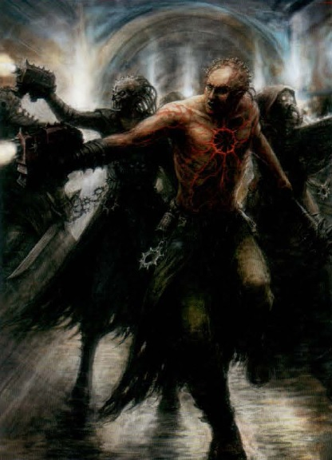
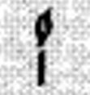
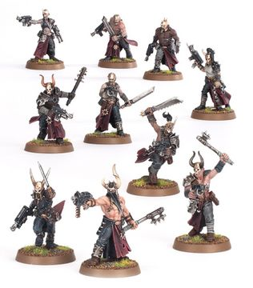
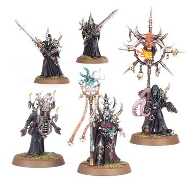
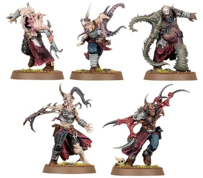
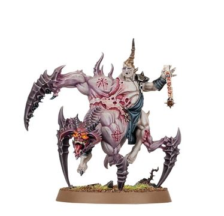

# 0516 混沌教派 Chaos Cult

精校状态：中文行文已逐段精校，部分术语仍为暂定

分类：组织 / 混沌 Chaos / 混沌诸神 Chaos Gods / 迷失者与被诅咒者 The Lost and the Damned

原文来源：https://www.bilibili.com/opus/1076691538842484740

原作者：帝国神选罐头

原文时间：编辑于 2025年11月07日 13:55

[返回分类目录](目录.md) · [全书目录](../../目录.md)

<!-- A0516-B0001 -->
**英文原文**

Chaos Cults are the most dangerous of all those who plot to overthrow the rule of the Imperium from within.

<!-- /A0516-B0001 -->

<!-- A0516-B0002 -->

原译文

混沌教派是所有阴谋从内部推翻帝国统治的人中最危险的。

**校订译文**

在所有阴谋从内部推翻帝国统治的势力中，混沌教派最为危险。

<!-- /A0516-B0002 -->

<!-- A0516-B0003 图片 -->

<!-- A0516-B0004 -->

原译文

Chaos Cultists 混沌邪教徒

**校订译文**

Chaos Cultists 混沌邪教徒

<!-- /A0516-B0004 -->

<!-- A0516-B0005 -->
## Overview 概述

<!-- /A0516-B0005 -->

<!-- A0516-B0006 -->
**英文原文**

All planets and civilisations belonging to the Imperium can harbour Chaos organisations, which themselves are as diverse in practice and membership as is imaginable. From the blood-soaked sacrificial cults of feral worlds to the philosophical secret societies of more advanced worlds, the temptations of Chaos can capture all. Indeed, according to the Ordo Hereticus, Chaos Cults can arise from any class of Imperial society, be it impoverished, noble, hive-gang, abhuman, soldiers, or mutant.

<!-- /A0516-B0006 -->

<!-- A0516-B0007 -->

原译文

属于帝国的所有行星和文明都可以藏有混沌组织，这些组织本身在实践和成员方面都是可以想象的多样化的。从野蛮世界的血腥祭祀崇拜到更先进世界的哲学秘密社团，混沌的诱惑可以抓住一切。事实上，根据讨逆修会的说法，混沌教派可以产生于帝国社会的任何阶层，无论是贫民、贵族、巢都帮派、亚人、士兵还是变种人。

**校订译文**

帝国的任何行星、任何文明，都可能潜藏混沌组织；其活动方式与成员构成千差万别。从蛮荒世界的血腥献祭教派，到发达世界探讨哲学的秘密结社，混沌的诱惑无所不及。据异端审判庭所述，混沌教派可以出自帝国社会的任何阶层或群体，包括穷人、贵族、巢都帮派、亚人、士兵与变种人。

<!-- /A0516-B0007 -->

<!-- A0516-B0008 图片 -->

<!-- A0516-B0009 -->

原译文

Dark Tongue rune for Cultist 邪教徒的暗语符文

**校订译文**

Dark Tongue rune for Cultist 邪教徒的暗语符文

<!-- /A0516-B0009 -->

<!-- A0516-B0010 -->
**英文原文**

The objective of the Chaos Cult is to survive and eventually dominate the society. Mere survival is particularly important on Imperial worlds, where Chaos worship is the greatest of heresies and Inquisitors are always vigilant and ready to wipe out any taint of Chaos. One technique, the Bone-brand, enables cultists to know one another with outsiders being none the wiser.

<!-- /A0516-B0010 -->

<!-- A0516-B0011 -->

原译文

混沌教派的目标是生存并最终统治社会。在帝国世界，仅仅生存就尤为重要，在那里，混沌教派是最大的异端，审判官总是保持警惕，随时准备消灭任何混沌的污点。其中一种技术，即骸骨烙印，使信徒能够在外人不知情的情况下相互了解。

**校订译文**

混沌教派的目标是存续，并最终支配所在社会。在帝国世界，单是存续本身便至关重要，因为崇拜混沌属于最严重的异端行径，审判官始终警戒着，随时准备清除任何混沌污迹。“骸骨烙印”是一种秘密识别手段，能让教徒相互辨认，而外人毫不知情。

<!-- /A0516-B0011 -->

<!-- A0516-B0012 -->
**英文原文**

Generally clandestine in nature, as discovery could bring with it attention from local Arbites all the way up to the Inquisition, cults often hide behind the front of some form of legitimate organisation in their attempt to accumulate local or planetary power, such as trade unions, charitable organisations, accepted religious groups and even local variants of the Imperial cult.

<!-- /A0516-B0012 -->

<!-- A0516-B0013 -->

原译文

教派本质上通常是秘密的，因为发现可能会引起当地法务部甚至审判庭的注意，教派经常躲在某种形式的合法组织的后面，试图积累当地或全球的力量，如工会、慈善组织、公认的宗教团体，甚至帝国教派的当地变体。

**校订译文**

混沌教派通常秘密活动，因为一旦暴露，可能招来当地法务部人员乃至审判庭的注意。它们常以合法组织作掩护，例如工会、慈善团体、获认可的宗教组织，甚至帝皇信仰的地方分支，逐步积聚对当地乃至整颗行星的影响力。

<!-- /A0516-B0013 -->

<!-- A0516-B0014 图片 -->

<!-- A0516-B0015 -->

原译文

Cultist 邪教徒

**校订译文**

Cultist 邪教徒

<!-- /A0516-B0015 -->

<!-- A0516-B0016 -->
**英文原文**

Extreme political organisations make good fronts for cults, as they naturally attract power-hungry and mentally unbalanced individuals, which make particularly good material for potential cult members. A very successful organisation can gain real political power, even gaining enough power to make it possible for the cult to become the governing body of the planet without having to resort to rebellion.

<!-- /A0516-B0016 -->

<!-- A0516-B0017 -->

原译文

极端政治组织为教派提供了很好的掩护，因为它们自然会吸引渴望权力和精神不平衡的人，这为潜在的邪教成员提供了特别好的物资。一个非常成功的组织可以获得真正的政治权力，甚至获得足够的力量，使教派能够成为星球的治理机构，而不必诉诸叛乱。

**校订译文**

极端政治组织是理想的掩护，因为它们容易吸引渴望权力、精神失衡的人，而这些人尤其适合被招揽为教徒。运作成功的组织可以取得真正的政治权力，甚至不必发动叛乱，就让混沌教派掌握整颗行星的政权。

<!-- /A0516-B0017 -->

<!-- A0516-B0018 -->
**英文原文**

After taking root, and as it expands in power and influence, eventually the cult may end up effectively ruling anything from a township to an entire planet. Eventually, an uprising breaks out, either on purpose or because the cult has grown too large and/or unruly to remain secret any longer. At this point, the cult can be expected to summon aid from their Chaotic masters, ranging from incurring daemonic possession to summoning the Traitor Legions. Cults may also be uprising in concert with an invasion of Chaos Marines. The ultimate aim of the cult's uprising is to overthrow the Imperial government and attain direct control of the world. After the conflict, cultists are often taken back into the Eye of Terror where they either join the damned population of a daemon world or are formed up into a Chaos Warlord's armed forces.

<!-- /A0516-B0018 -->

<!-- A0516-B0019 -->

原译文

在扎根之后，随着力量和影响力的扩大，教派最终可能会有效地统治从一个城镇到整个星球的任何东西。最终，一场叛乱爆发了，要么是故意的，要么是因为教派已经变得太大和/或不守规矩，无法再保密。在这一点上，可以预期教派会从他们的混沌主人那里获得帮助，从招致恶魔附体到召唤叛徒军团。教派也可能随着混沌星际战士的入侵而叛乱。教派叛乱的最终目的是推翻帝国政府，实现对世界的直接控制。冲突结束后，邪教徒经常被带回恐惧之眼，在那里他们要么加入恶魔世界的被诅咒者，要么组成混沌军阀的武装部队。

**校订译文**

教派扎根后，随着实力与影响不断扩大，其实际统治范围可能从一座城镇扩展至整颗行星。最终，叛乱会爆发：有时是蓄意发动，有时则因组织过于庞大、难以约束，再也无法隐藏。到这一步，教派通常会向混沌主人求援，方式从引来恶魔附身，到召来叛徒军团不等；它们也可能配合混沌星际战士的入侵同时起事。叛乱的最终目的，是推翻帝国政府并直接控制该世界。战事结束后，教徒常被带回恐惧之眼，成为恶魔世界受诅居民的一员，或编入某位混沌军阀的武装力量。

<!-- /A0516-B0019 -->

<!-- A0516-B0020 -->
## Cult Personnel 教派人员

<!-- /A0516-B0020 -->

<!-- A0516-B0021 -->
**英文原文**

Dark Communes, which are the headquarters of a Cultist force. They normally consist of :

<!-- /A0516-B0021 -->

<!-- A0516-B0022 -->

原译文

黑暗公社，是教派势力的总部。它们通常包括：

**校订译文**

黑暗传教团是混沌教徒部队的指挥核心，通常由以下成员组成：

**校注：** Dark Commune 官译“黑暗传教团”（GW-09/GW-10 均第15页）；原稿黑暗公社。此处 headquarters 指指挥成员组成的核心，不是建筑总部。

<!-- /A0516-B0022 -->

<!-- A0516-B0023 图片 -->

<!-- A0516-B0024 -->

原译文

Dark Commune 黑暗公社

**校订译文**

Dark Commune 黑暗传教团

<!-- /A0516-B0024 -->

<!-- A0516-B0025 -->
**英文原文**

a Cult Demagogue, Heretics whose words convince others to embrace Heresy, and lead to the formation of a Chaos Cult

<!-- /A0516-B0025 -->

<!-- A0516-B0026 -->

原译文

教派煽动者，其言论说服他人接受异端，并导致混沌教派的形成

**校订译文**

一位教派煽动者——以言辞诱使他人接受异端思想，进而建立混沌教派。

<!-- /A0516-B0026 -->

<!-- A0516-B0027 -->
**英文原文**

a Mindwitch, who is a Rogue Psyker,

<!-- /A0516-B0027 -->

<!-- A0516-B0028 -->

原译文

一个心灵巫师，一个非法灵能者，

**校订译文**

一位心灵巫师——未经帝国认可的灵能者。

<!-- /A0516-B0028 -->

<!-- A0516-B0029 -->
**英文原文**

an Iconarch, who inspires a Cult's members by carrying its icon

<!-- /A0516-B0029 -->

<!-- A0516-B0030 -->

原译文

雕像崇拜者，通过携带雕像来激励教派成员

**校订译文**

一位圣像执掌者——携带教派圣像，激励其成员。

**校注：** Iconarch 为携带圣像者，暂定“圣像执掌者”；原稿“雕像崇拜者”未表达职能。

<!-- /A0516-B0030 -->

<!-- A0516-B0031 -->
**英文原文**

Blessed Blades, who defend a Cult's Dark Commune leaders

<!-- /A0516-B0031 -->

<!-- A0516-B0032 -->

原译文

受祝之刃，保护教派的黑暗公社领袖

**校订译文**

受祝之刃——负责保护黑暗传教团首领的护卫。

<!-- /A0516-B0032 -->

<!-- A0516-B0033 -->
**英文原文**

Accursed Cultists, who have been overcome by the powers of Chaos. They consist of either:

<!-- /A0516-B0033 -->

<!-- A0516-B0034 -->

原译文

被混沌力量征服的诅咒邪教徒。它们包括：

**校订译文**

受诅教徒——被混沌力量彻底侵蚀的信徒，分为以下两类：

**校注：** Accursed Cultists 采用 GW-09/GW-10 均第15页官译“受诅教徒”。

<!-- /A0516-B0034 -->

<!-- A0516-B0035 -->
**英文原文**

Mutants, who are heavily mutated by Chaos

<!-- /A0516-B0035 -->

<!-- A0516-B0036 -->

原译文

被混沌严重变异的变种人

**校订译文**

变种人——因混沌影响发生严重突变者。

<!-- /A0516-B0036 -->

<!-- A0516-B0037 图片 -->

<!-- A0516-B0038 -->

原译文

Accursed Mutants 受诅变种人

**校订译文**

Accursed Mutants 受诅变种人

<!-- /A0516-B0038 -->

<!-- A0516-B0039 -->
**英文原文**

Torments, whose bodies have been twisted beyond recognition by dark rituals and daemonic influence

<!-- /A0516-B0039 -->

<!-- A0516-B0040 -->

原译文

身体被黑暗仪式和恶魔影响扭曲得面目全非的折磨者

**校订译文**

折磨者——躯体被黑暗仪式与恶魔力量扭曲得面目全非者。

<!-- /A0516-B0040 -->

<!-- A0516-B0041 图片 -->

<!-- A0516-B0042 -->

原译文

Accursed Torment 受诅折磨者

**校订译文**

Accursed Torment 受诅折磨者

<!-- /A0516-B0042 -->

<!-- A0516-B0043 -->
**英文原文**

Cult Devotees, whose bodies have yet to become mutated by daemonic possession

<!-- /A0516-B0043 -->

<!-- A0516-B0044 -->

原译文

教派崇拜者，他们的身体尚未被恶魔附身而变异

**校订译文**

教派虔信者——身体尚未因恶魔附身而发生突变的信徒。

<!-- /A0516-B0044 -->

<!-- A0516-B0045 -->
## Cults Variations 教派类型

原题：Cults Variations 教派变体

<!-- /A0516-B0045 -->

<!-- A0516-B0046 -->
**英文原文**

Jakhals, cultists who serve World Eaters Chaos Space Marine warbands.

<!-- /A0516-B0046 -->

<!-- A0516-B0047 -->

原译文

裂伤者，为吞世者混沌星际战士服务的邪教徒。

**校订译文**

裂伤者——为吞世者混沌星际战士战帮效力的教徒。

<!-- /A0516-B0047 -->

<!-- A0516-B0048 -->
**英文原文**

Corpse Grinder Cult, cannibals who worship Khorne from Necromunda.

<!-- /A0516-B0048 -->

<!-- A0516-B0049 -->

原译文

尸体研磨教派，涅克罗蒙达崇拜恐虐的食人族。

**校订译文**

尸体研磨教派——涅克罗蒙达上崇拜恐虐的食人者。

<!-- /A0516-B0049 -->

<!-- A0516-B0050 -->
**英文原文**

Helot Cults are a type of Chaos Cult on Necromunda.

<!-- /A0516-B0050 -->

<!-- A0516-B0051 -->

原译文

农奴教派是涅克罗蒙达上的一种混沌教派。

**校订译文**

农奴教派是涅克罗蒙达上的一种混沌教派。

<!-- /A0516-B0051 -->

本篇核心术语与暂定项

以下列出本篇出现的英文原形及核心术语表用词。同形词可能指不同对象，具体词义以本篇正文和校注为准；单复数、别名和仅见于图注的名称可能尚未列入。完整候选见[术语表](../../术语表/双语术语候选.csv)。

| 英文 | 采用中文 | 状态 |
| --- | --- | --- |
| World Eaters | 吞世者 | 官方已核对 |
| Psyker | 灵能者 | 官方已核对 |
| Inquisition | 审判庭 | 暂定 |
| Imperium | 帝国 | 暂定·简称 |
| Rogue Psyker | 非法灵能者 | 暂定 |
| Mindwitch | 心灵巫师 | 暂定·官方待核 |
| Khorne | 恐虐 | 官方已核对 |
| Eye of Terror | 恐惧之眼 | 官方已核对 |
| Helot | 农奴；希洛人（古希腊语境） | 语境定译·官方待核 |
| Abhuman | 亚人 | 暂定·官方待核 |
| Mutant | 变种人 | 暂定·官方待核 |
| Necromunda | 涅克罗蒙达 | 暂定·官方待核 |
| Imperial Cult | 帝皇信仰 | 暂定·官方待核 |
| Ordo Hereticus | 异端审判庭 | 用户指定 |
| Feral Worlds | 蛮荒世界 | 暂定·官方待核 |
| Space Marine | 星际战士 | 暂定·官方待核 |
| Powers | 能天使 | 暂定·官方待核 |
| Iconarch | 圣像执掌者 | 暂定·官方待核 |
| Blessed Blades | 受祝之刃 | 暂定·官方待核 |
| Cult Devotees | 教派虔信者 | 暂定·官方待核 |
| Bone-brand | 骸骨烙印 | 暂定·官方待核 |
| Dark Commune | 黑暗传教团 | 官方已核对 |
| Accursed Cultists | 受诅教徒 | 官方已核对 |
| Jakhals | 裂伤者 | 官方已核对 |
| Brand | 布兰德 | 暂定·官方待核 |
| Vigilant | 维吉兰特 | 暂定·官方待核 |
| The Blood | 鲜血 | 暂定·官方待核 |

