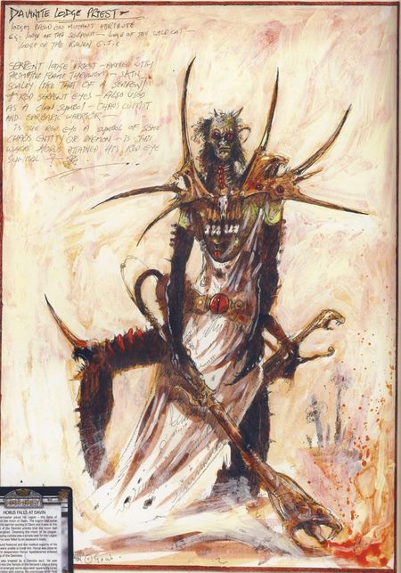
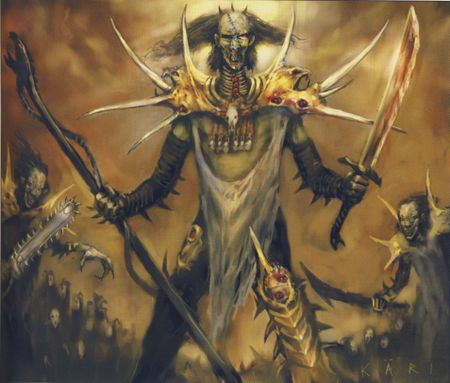

# 0517 蛇之结社 Serpent Lodge

精校状态：中文行文已逐段精校，部分术语仍为暂定

分类：组织 / 混沌 Chaos / 混沌诸神 Chaos Gods / 迷失者与被诅咒者 The Lost and the Damned

原文来源：https://www.bilibili.com/opus/1191319581685186563

原作者：帝国神选罐头

原文时间：2026年04月15日 08:48

[返回分类目录](目录.md) · [全书目录](../../目录.md)

原篇名：蛇屋 Serpent Lodge

<!-- A0517-B0001 -->
**英文原文**

The Serpent Lodge was the name given to both a group of suspected Chaos cultists and their Temple on the planet of Davin. The Lodge members treated Warmaster Horus for the crippling injury he received campaigning on Davin's moon, and the Lodge itself is the location where Horus was turned against the Emperor as part of an elaborate scheme by the Word Bearers and Ruinous Powers.

<!-- /A0517-B0001 -->

<!-- A0517-B0002 -->

原译文

蛇屋是一群疑似混沌邪教徒及其在戴文行星上的神庙的名字。小屋成员治疗了战帅荷鲁斯在戴文的卫星上战斗时受到的重伤，小屋本身就是荷鲁斯对抗帝皇的地方，这是怀言者和毁灭力量精心策划的计划的一部分。

**校订译文**

蛇之结社是戴文行星上一个疑似混沌教派的名称，也用于指其神庙。战帅荷鲁斯在戴文卫星作战时身负重伤，由结社成员为他治疗。怀言者与毁灭诸力精心策划阴谋，正是在这座神庙中使荷鲁斯转而反对帝皇。

**校注：** 组织名沿已统一核心 Serpent Lodge“蛇之结社”，原稿篇名“蛇屋”；神庙称蛇之结社神庙，不再在正文随机换成“小屋”。

<!-- /A0517-B0002 -->

<!-- A0517-B0003 -->
## Overview 概述

<!-- /A0517-B0003 -->

<!-- A0517-B0004 -->
**英文原文**

The Temple of the Serpent Lodge, also known as the Delphos, was an imposing stone building set in the middle of a huge crater that had a diameter of thousands of metres. The crater was located at the end of a long valley, and the chief way to approach it by land involved traveling along a stone causeway set along the bottom of the valley. The causeway was lined with crumbling statues of ancient Davinite kings.

<!-- /A0517-B0004 -->

<!-- A0517-B0005 -->

原译文

蛇屋神庙，也被称为德尔弗斯，是一座气势恢宏的石头建筑，坐落在一个直径数千米的巨大陨石坑中间。这个坑位于一个长山谷的尽头，从陆地接近它的主要方式是沿着山谷底部设置的石堤行进。堤道两旁是摇摇欲坠的古代戴文王者雕像。

**校订译文**

蛇之结社的神庙又称德尔弗斯，是一座气势恢宏的石砌建筑，坐落在直径数千米的巨大坑地中央。坑地位于一条长谷的尽头；若从陆路前往，主要须沿谷底的石筑堤道行进。道路两侧排列着残破的古代戴文君王雕像。

**校注：** crater 原文未明确成因，译坑地，不自行确认是陨石撞击坑。

<!-- /A0517-B0005 -->

<!-- A0517-B0006 图片 -->

<!-- A0517-B0007 -->

原译文

Serpent Lodge Priest 蛇屋牧师

**校订译文**

Serpent Lodge Priest 蛇之结社祭司

<!-- /A0517-B0007 -->

<!-- A0517-B0008 -->
**英文原文**

The actual temple building was an octagonal structure, with a bastion and tower built at each corner. A further eight towers surrounded a dome raised in the centre of the structure, each tower tipped with a fire. A single large archway led into the dome and the building itself. The approach to this dome involved climbing a set of massive stone steps that were lined with coal braziers and pillars carved to feature serpents. At the top of the steps was a path that narrowed as it approached the gate that was similarly lined with fires and pillars. However, between the gated archway and the top of the steps was a wide circular pool. This pool generated three narrow watercourses that rushed towards the steps, and in fact continued down it, with one channel on either side and one set in the middle, splitting the staircase. The gate itself consisted of two large doors of beaten and carved bronze. They featured a complex design only fully understandable when the gate was closed. It showed a large tree with spreading and fruit-laden branches. Many minor serpents twisted and spiraled around the edges of the design, but two great snakes coiled around the tree and each other, with their heads entwined together above it. Captain Garviel Loken of the Sons of Horus Space Marine Legion noted that this central image was strikingly similar to that worn by Marine Apothecaries; the caduceus. The paving in front of the gate continued the image of the tree by featuring a carving of three great roots that led to the edge of the wide pool. Apparently, once the gates were closed they could only be opened from within.

<!-- /A0517-B0008 -->

<!-- A0517-B0009 -->

原译文

实际的神庙建筑是一座八角形结构，每个角落都建有堡垒和塔楼。另外八座塔楼围绕着建筑中心凸起的穹顶，每座塔楼都燃烧着火焰。一个大拱门通向穹顶和建筑本身。通往这个穹顶的方法包括爬上一组巨大的石阶，石阶上排列着碳火盆和雕刻有蛇的柱子。台阶的顶部有一条小路，当它靠近同样排列着火堆和柱子的大门时，小路变窄了。然而，在带门的拱门和台阶顶部之间，有一个宽阔的圆形水池。这个水池产生了三条狭窄的水道，这些水道冲向台阶，事实上，它一直延伸到台阶的尽头，两侧各有一条通道，中间则有一条通道，将楼梯分隔开来。大门本身由两扇经过锤打和雕刻的青铜大门组成。它们的设计复杂，只有在大门关闭时才能完全理解。它展示了一棵大树，树枝伸展，结满了果实。许多小蛇在图案的边缘扭曲盘旋，两条大蛇在树上盘旋，彼此缠绕，它们的头在树上缠绕在一起。荷鲁斯之子星际战士军团的连长加维尔·洛肯指出，这张中心图像与星际战士药剂师佩戴的图像惊人地相似；墨丘利节杖。大门前的铺路石延续了这棵树的形象，雕刻着三个巨大的根，通向宽阔的池塘边缘。显然，一旦大门关闭，它们只能从内部打开。

**校订译文**

神庙主体为八角形，每个角上都建有堡垒与塔楼。中央隆起一座穹顶，另有八座塔楼环绕其周，塔顶各燃着一团火焰。通往穹顶大厅及神庙内部的入口，只有一道巨大拱门。来者须先登上宽大的石阶，沿途排列着燃煤火盆与雕有蛇纹的柱子。石阶顶端通往大门的小径渐渐收窄，两侧同样有火焰与立柱。拱门与石阶顶端之间还设有一座宽阔的圆池，池水分作三道细流，奔向并沿着石阶向下流淌；两道位于阶梯两侧，另一道居中，将石阶分开。大门由两扇锤制并雕刻的青铜门板组成，只有合拢时，才能看清完整复杂的图案：一棵枝叶伸展、结满果实的大树，许多小蛇沿图案边缘蜿蜒盘旋，两条巨蛇则绕着树干与彼此缠卷，头颅交缠于树冠上方。荷鲁斯之子军团连长加维尔·洛肯注意到，这一中心图案与星际战士药剂师佩戴的双蛇杖徽记惊人地相似。门前的铺地石延续了树的图案，雕出三条巨根，伸向宽阔的池边。据观察，大门一旦关闭，就只能从内部打开。

**校注：** caduceus 为双蛇缠杖图案，原译墨丘利节杖改为直观的双蛇杖；此处是相似性观察，不增写两者实际关联。

<!-- /A0517-B0009 -->

<!-- A0517-B0010 -->
**英文原文**

There was a secret chamber at the heart of the Lodge, protected by powerful magic and screening technology installed by disgruntled adepts of the Mechanicum in return for information given to them by the Word Bearers Legion. Circular in nature, the chamber had a sacrificial circle and sinkhole built into its centre. It was here that the Lodge members cast the spells that allowed Erebus to communicate with Horus during the Warmaster's stay in the Temple.

<!-- /A0517-B0010 -->

<!-- A0517-B0011 -->

原译文

小屋的中心有一个密室，受到心怀不满的机械教专家安装的强大魔法和扫描技术的保护，以换取怀言者军团提供的信息。这个房间是圆形的，中心有一个祭祀圈和灰岩坑。正是在这里，小屋成员施展了咒语，使艾瑞巴斯在战帅留在神庙期间能够与荷鲁斯交流。

**校订译文**

结社深处藏有一间密室，受到强大魔法与屏蔽技术的保护。屏蔽设备由心怀不满的机械教技术专家安装，作为怀言者军团向他们提供情报的回报。密室呈圆形，中央设有献祭法阵与一口深坑。战帅留在神庙期间，结社成员正是在这里施法，使艾瑞巴斯得以与荷鲁斯交流。

**校注：** screening technology 为屏蔽技术，原译扫描技术相反；sinkhole 仅作深坑，原文未指明石灰岩。

<!-- /A0517-B0011 -->

<!-- A0517-B0012 -->
**英文原文**

Davinite belief was that the injured taken inside were left to the care of the spirits of the deceased, and their destiny. They were expected to come forth healed, but if this did not occur after nine days, their remains were brought out and burned, the ashes cast into the pool. Horus came forth upon the ninth day.

<!-- /A0517-B0012 -->

<!-- A0517-B0013 -->

原译文

戴文人认为，被带进去的伤员将由死者的灵魂和命运来照顾。他们被期望痊愈，但如果九天后没有发生这种情况，他们的遗体就会被带出来焚烧，灰烬被扔进水池。第九天，荷鲁斯出来了。

**校订译文**

戴文人相信，被送入神庙的伤者将交由亡者之灵照料，生死由命运决定。人们期待他们康复后自行走出；若九天后仍未出现，便会将遗体抬出焚烧，再把骨灰撒入池中。荷鲁斯正是在第九天走出的。

<!-- /A0517-B0013 -->

<!-- A0517-B0014 -->
## History 历史

<!-- /A0517-B0014 -->

<!-- A0517-B0015 -->
**英文原文**

The Serpent Lodge existed for many years on Davin's moon, worshiping the Dark Gods. In antiquity before Davin had even been settled by Humanity a form of the cult worshiped a serpentine deity known as Seytan. During the Great Crusade when the planet was brought into Imperial compliance by the Luna Wolves and Word Bearers, the warriors of Davin fought under the banner of the Serpent Lodge, and gained the respect of the Legiones Astartes for their martial culture and prowess despite their Feral World status. After the Davin campaign the first Warrior Lodges were secretly established by the treacherous Word Bearers throughout the Astartes Legiones in a bid to usurp loyalty to the Emperor. Unknown to most, the Warrior Lodges were heavily based on the Davinite Serpent Lodge.

<!-- /A0517-B0015 -->

<!-- A0517-B0016 -->

原译文

蛇屋在戴文的卫星上存在了很多年，崇拜黑暗诸神。在人类定居戴文之前的古代，有一种崇拜蛇形神的形式，称为塞坦。在大远征期间，当影月苍狼和怀言者将行星带入帝国平定状态时，戴文的战士在蛇屋的旗帜下作战，尽管他们处于蛮荒世界的地位，但他们的军事文化和实力赢得了阿斯塔特军团的尊重。戴文战役后，第一个战士结社由遍及阿斯塔特军团的背叛的怀言者秘密建立，以篡夺对帝皇的忠诚。大多数人都不知道，战士结社在很大程度上是以戴文的蛇屋为基础的。

**校订译文**

蛇之结社在戴文卫星上存在已久，崇拜黑暗诸神。甚至在人类尚未定居戴文的远古，这个教派的某种早期形态就已崇拜一位名为塞坦的蛇神。大远征期间，影月苍狼与怀言者征服戴文、使其归顺帝国；当地战士曾在蛇之结社的旗帜下作战。尽管戴文属于蛮荒世界，他们的尚武文化与战斗本领仍赢得了阿斯塔特军团的尊重。战役结束后，心怀叛意的怀言者开始在各阿斯塔特军团中秘密建立最初的战士结社，企图取代战士们对帝皇的忠诚。鲜有人知，这些战士结社在很大程度上以戴文的蛇之结社为蓝本。

**校注：** 原稿本段称结社在戴文卫星，开篇则称神庙在戴文行星；同时提及人类定居前的教派形态。均保留原文范围差异，不无据统一地点或历史。

<!-- /A0517-B0016 -->

<!-- A0517-B0017 图片 -->

<!-- A0517-B0018 -->

原译文

Davinite Priest 戴文牧师

**校订译文**

Davinite Priest 戴文祭司

<!-- /A0517-B0018 -->

<!-- A0517-B0019 -->
**英文原文**

Sixty years later following the Battle of Davin's Moon when Warmaster Horus was injured by the Anathame, the nearby Serpent Lodge was cited by Erebus as the only way to save the Primarch. In desperation the Luna Wolves agreed to have the Lodge Priests heal Horus, but in truth this was a plot to corrupt him with the powers of Chaos and bring about the Horus Heresy. The Chaos plan was successful, and members of the Serpent Lodge were still employed as agents of Horus after his conversion to the Dark Powers.

<!-- /A0517-B0019 -->

<!-- A0517-B0020 -->

原译文

60年后，在戴文之月之战中，战帅荷鲁斯被仪式之刃击伤，附近的蛇屋被艾瑞巴斯称为拯救原体的唯一途径。在绝望中，影月苍狼同意让小屋牧师治愈荷鲁斯，但事实上，这是一个用混沌的力量腐化他并导致荷鲁斯叛乱的阴谋。混沌的计划取得了成功，在荷鲁斯皈依黑暗势力后，蛇屋的成员被聘为荷鲁斯的代理人。

**校订译文**

六十年后，战帅荷鲁斯在戴文之月之战中被诅咒之刃重创。艾瑞巴斯宣称，附近的蛇之结社是拯救原体的唯一希望。绝望之下，影月苍狼同意让结社祭司医治荷鲁斯；实际上，这是一场借混沌力量腐化他、引发荷鲁斯之乱的阴谋。计划最终成功，荷鲁斯转投黑暗诸力后，蛇之结社成员仍继续担任他的代理人。

**校注：** Anathame 为诅咒之刃，区别 athame 仪式之刃；按第502篇全书决定。原文此时仍称 Luna Wolves，未按军团改名时间自行更换。

<!-- /A0517-B0020 -->

<!-- A0517-B0021 -->
## Known Members 已知成员

<!-- /A0517-B0021 -->

<!-- A0517-B0022 -->

原译文

Akshub 阿克舒布

**校订译文**

Akshub 阿克舒布

<!-- /A0517-B0022 -->

<!-- A0517-B0023 -->

原译文

Bruja 布鲁佳

**校订译文**

Bruja 布鲁佳

<!-- /A0517-B0023 -->

<!-- A0517-B0024 -->
## Trivia 琐事

<!-- /A0517-B0024 -->

<!-- A0517-B0025 -->
**英文原文**

The chief deity of the Serpent Lodge, "Seytan", is likely a reference to 'The Devil' of Abrahamic religions, being Satan and Iblis (Shayṭān ar-Rajīm). In myth, the Devil is a being that acts to tempt humans into evil and falsehood.

<!-- /A0517-B0025 -->

<!-- A0517-B0026 -->

原译文

蛇屋的神主“塞坦”可能是指亚伯拉罕宗教的“魔鬼”，即撒旦和伊布力斯(舍伊坦和拉吉姆)。在神话中，魔鬼是一种引诱人类堕入邪恶和谎言的存在。

**校订译文**

蛇之结社的主神“塞坦”，很可能影射亚伯拉罕诸宗教中的魔鬼，即撒旦与伊布力斯（Shayṭān ar-Rajīm）。在相关传说中，魔鬼诱使人类堕入邪恶与虚妄。

**校注：** 宗教名源仅为英文原文的推测性说明。保留完整 Shayṭān ar-Rajīm，不将其误拆成两个名称“舍伊坦和拉吉姆”。

<!-- /A0517-B0026 -->

<!-- A0517-B0027 -->
### Notes 注释

<!-- /A0517-B0027 -->

<!-- A0517-B0028 -->
**英文原文**

Note 1: The red serpent eye is a symbol of the Serpent Lodge. It is eerily similar to that worn by Horus.

<!-- /A0517-B0028 -->

<!-- A0517-B0029 -->

原译文

注释1：红蛇眼是蛇屋的象征。它与荷鲁斯所穿的极为相似。

**校订译文**

注 1：红色蛇眼是蛇之结社的象征，与荷鲁斯佩戴的标志相似得令人不安。

<!-- /A0517-B0029 -->

本篇核心术语与暂定项

以下列出本篇出现的英文原形及核心术语表用词。同形词可能指不同对象，具体词义以本篇正文和校注为准；单复数、别名和仅见于图注的名称可能尚未列入。完整候选见[术语表](../../术语表/双语术语候选.csv)。

| 英文 | 采用中文 | 状态 |
| --- | --- | --- |
| Horus Heresy | 荷鲁斯之乱 | 官方已核对 |
| Mechanicum | 机械教 | 暂定·历史称谓 |
| Emperor | 帝皇 | 官方已核对 |
| Primarch | 原体 | 官方已核对 |
| Word Bearers | 怀言者 | 暂定·官方待核 |
| Great Crusade | 大远征 | 暂定·官方待核 |
| Compliance | 归顺；纳入帝国统治 | 暂定·官方待核 |
| Luna Wolves | 影月苍狼 | 暂定·官方待核 |
| Horus | 荷鲁斯 | 暂定·官方待核 |
| Erebus | 艾瑞巴斯 | 暂定·官方待核 |
| Anathame | 诅咒之刃 | 暂定·官方待核 |
| Garviel Loken | 加维尔·洛肯 | 暂定·官方待核 |
| Sons of Horus | 荷鲁斯之子 | 暂定·官方待核 |
| Legiones Astartes | 阿斯塔特军团 | 暂定·官方待核 |
| Davin | 戴文 | 暂定·官方待核 |
| Luna | 月球 | 暂定·官方待核 |
| Ancient | 旗手 | 官方已核对 |
| Serpent Lodge | 蛇之结社 | 暂定·官方待核 |
| Space Marine Legion | 星际战士军团 | 暂定·官方待核 |
| Warrior Lodges | 战士结社 | 暂定·官方待核 |
| Space Marine | 星际战士 | 暂定·官方待核 |
| Captain | 连长 | 暂定·官方待核 |
| Powers | 能天使 | 暂定·官方待核 |
| Ruinous Powers | 毁灭诸力 | 暂定·官方待核 |
| Delphos | 德尔弗斯 | 暂定·官方待核 |
| Seytan | 塞坦 | 暂定·官方待核 |
| The Dark | 《黑暗》 | 暂定·官方待核 |
| Feral World | 蛮荒世界 | 暂定·官方待核 |
| Falsehood | 伪装器 | 暂定·官方待核 |
| Temple of the Serpent Lodge | 蛇之结社神庙 | 暂定·官方待核 |
| Davin's Moon | 戴文之月 | 暂定·官方待核 |

