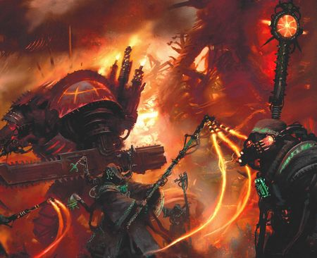
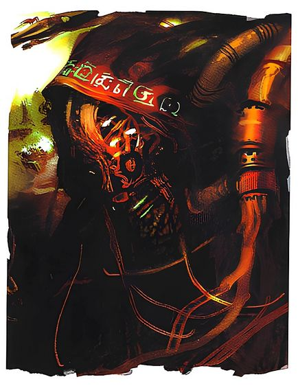
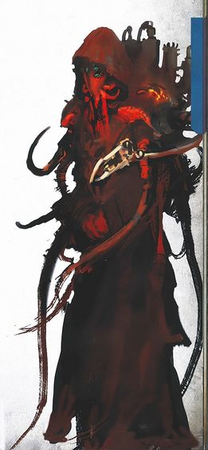
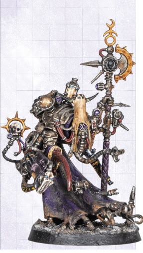
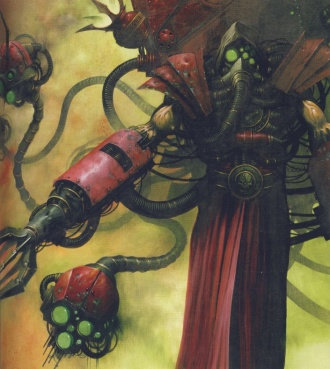
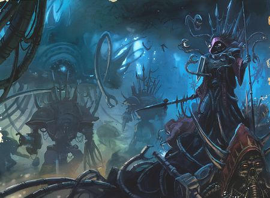
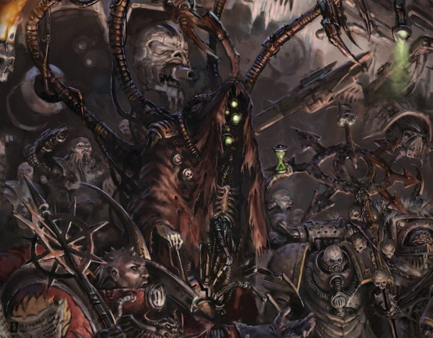
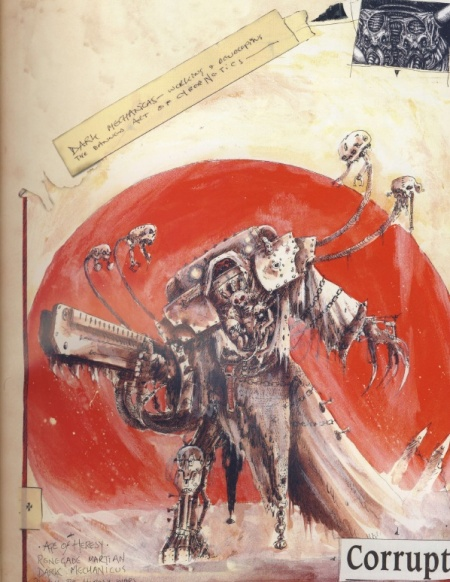
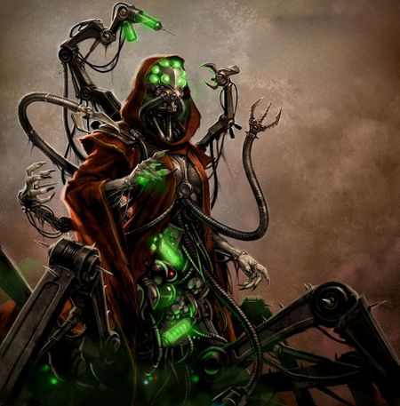
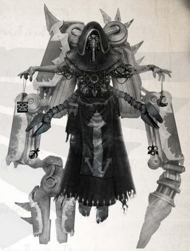

# 0518 黑暗机械教 Dark Mechanicum

精校状态：中文行文已逐段精校，部分术语仍为暂定

分类：组织 / 混沌 Chaos / 混沌诸神 Chaos Gods / 黑暗机械教 Dark Mechanicum

原文来源：https://www.bilibili.com/opus/1187981533128949769

原作者：帝国神选罐头

原文时间：2026年04月06日 08:55

[返回分类目录](目录.md) · [全书目录](../../目录.md)

<!-- A0518-B0001 -->

原译文

"The path of the Omnissiah has left humanity dithering in the darkness, incapable of advancing on the paths of knowledge. Embracing the warp reveals technology that the primitives on Mars could never dream of wielding."- Magos Caine of the Five-Fold Path “欧姆尼赛亚之路让人类在黑暗中踌躇，无法在知识之路上前进。拥抱亚空间揭示了火星上的原始人从未梦想过拥有的技术。”- 五重道途的贤者凯恩

**校订译文**

"The path of the Omnissiah has left humanity dithering in the darkness, incapable of advancing on the paths of knowledge. Embracing the warp reveals technology that the primitives on Mars could never dream of wielding."- Magos Caine of the Five-Fold Path “欧姆尼赛亚之路让人类在黑暗中徘徊，无法沿求知之路前行。拥抱亚空间，便能发现火星上那些蒙昧之辈做梦也不敢想象能掌握的技术。”——五重道途的贤者凯恩

<!-- /A0518-B0001 -->

<!-- A0518-B0002 -->
**英文原文**

The Dark Mechanicum, or Dark Mechanicus, referred to by themselves as the New Mechanicum or True Mechanicum, is a Chaos-affiliated counterpart to the Adeptus Mechanicus. Its origins trace back to those who pledged loyalty to Warmaster Horus at the end of the Great Crusade. The Dark Mechanicum serves as a dark "mirror" to their counterparts within the Imperium.

<!-- /A0518-B0002 -->

<!-- A0518-B0003 -->

原译文

黑暗机械教，或黑机械教，被称为新机械教或真机械教。它的起源可以追溯到那些在大远征结束时承诺效忠战帅荷鲁斯的人。黑暗机械教是帝国内部对应者的黑暗“镜像”。

**校订译文**

黑暗机械教亦称 Dark Mechanicus，自称新机械教或真机械教，是机械修会在混沌阵营中的对应组织。其起源可追溯至大远征末期向战帅荷鲁斯效忠的机械教成员。它如同帝国内部机械修会的一面黑暗镜像。

**校注：** 原文明确 Dark Mechanicum 与 Dark Mechanicus 为该组织别称，本篇均作黑暗机械教；不能据此混同忠诚派 Mechanicum 机械教与 Adeptus Mechanicus 机械修会。补回原译遗漏的混沌归属与对应组织关系。

<!-- /A0518-B0003 -->

<!-- A0518-B0004 -->
**英文原文**

The tech-adepts of the Dark Mechanicum readily adopted black robes and wear a perversion of the Machina Opus: the symbol of the Machine God but with eight arrows added to make the star of Chaos and a skull with a daemonic grimace. Adepts of the Dark Mechanicum are often bestowed with mutation and other Gifts of Chaos.

<!-- /A0518-B0004 -->

<!-- A0518-B0005 -->

原译文

黑暗机械教的技术神甫欣然接受了黑色长袍，并佩戴了万机神的象征 — 机械齿轮，但增加了八支箭，形成混沌八芒星和一个带着恶魔般鬼脸的头骨。黑暗机械教的专家通常会被赋予突变和其他混沌之赐。

**校订译文**

黑暗机械教的技术专家纷纷换上黑袍，佩戴经过亵渎改造的“机械之作”徽记：在万机神的标志上添入八支箭头，构成混沌八芒星，骷髅也变成恶魔般狰狞的模样。他们还经常获赐突变及其他混沌之礼。

**校注：** Machina Opus 沿核心机械之作，为万机神徽记名称；不是泛指一只机械齿轮。tech-adepts 沿主审技术专家。

<!-- /A0518-B0005 -->

<!-- A0518-B0006 图片 -->

<!-- A0518-B0007 -->

原译文

Dark Machina Opus 黑暗机械教齿轮

**校订译文**

Dark Machina Opus 黑暗机械之作徽记

<!-- /A0518-B0007 -->

<!-- A0518-B0008 -->
**英文原文**

Official languages:Cant Mechanicus

<!-- /A0518-B0008 -->

<!-- A0518-B0009 -->

原译文

官方语言：机械之语

**校订译文**

官方语言：机械之语

<!-- /A0518-B0009 -->

<!-- A0518-B0010 -->
**英文原文**

Major Species:Human

<!-- /A0518-B0010 -->

<!-- A0518-B0011 -->

原译文

主要种族：人类

**校订译文**

主要种族：人类

<!-- /A0518-B0011 -->

<!-- A0518-B0012 -->
**英文原文**

Head of state:Decentralized

<!-- /A0518-B0012 -->

<!-- A0518-B0013 -->

原译文

首脑：去中心化

**校订译文**

首脑：无统一首脑，权力分散。

<!-- /A0518-B0013 -->

<!-- A0518-B0014 -->
**英文原文**

Governing body:Decentralized

<!-- /A0518-B0014 -->

<!-- A0518-B0015 -->

原译文

政体：去中心化

**校订译文**

统治机构：无统一机构，权力分散。

<!-- /A0518-B0015 -->

<!-- A0518-B0016 -->
**英文原文**

State Religion:Cult Mechanicus, Chaos

<!-- /A0518-B0016 -->

<!-- A0518-B0017 -->

原译文

宗教：机械教派，混沌

**校订译文**

宗教：机械教派，混沌

<!-- /A0518-B0017 -->

<!-- A0518-B0018 -->
**英文原文**

Military forces:Dark Skitarii, Daemon Engines, Traitor Titan Legions, Fallen Knight Houses, Some Chaos Space Marines

<!-- /A0518-B0018 -->

<!-- A0518-B0019 -->

原译文

军事部队：黑暗护教军，恶魔引擎，叛徒泰坦军团，堕落骑士家族，一些混沌星际战士

**校订译文**

军事部队：黑暗护教军，恶魔引擎，叛徒泰坦军团，堕落骑士家族，一些混沌星际战士

<!-- /A0518-B0019 -->

<!-- A0518-B0020 -->
## History 历史

<!-- /A0518-B0020 -->

<!-- A0518-B0021 -->
**英文原文**

Horus gained the loyalty of a sect within the Mechanicum after promising them STC technology gained from the worlds of the Auretian Technocracy and the opening of the vaults of forbidden technology on Mars. In addition, Horus's emissaries and spies told the Tech-Priests that the Emperor planned to steal the secrets and technology of the Martian Mechanicum and even eventually enslave the Tech-Priests. Lastly, Horus used the ideological schism within the Mechanicum, between those who believed the Emperor was the earthly representation of the Omnissiah and those who still thought such a figure was entombed on Mars, suggesting it was the Emperor himself who had presented himself as their god in a scheme to make him their servants.

<!-- /A0518-B0021 -->

<!-- A0518-B0022 -->

原译文

荷鲁斯向他们承诺了从奥瑞提安技术联盟的世界获得的STC技术，并在火星上打开了禁忌密库，从而获得了机械教内部一个教派的忠诚。此外，荷鲁斯的使者和间谍告诉技术神甫，帝皇计划窃取火星机械教的秘密和技术，甚至最终奴役技术神甫。最后，荷鲁斯利用了机械教内部的意识形态分歧，即那些认为帝皇是欧姆尼赛亚的世俗代表的人和那些仍然认为这样的一个人物仍被埋葬在火星上的人之间的分歧，这表明是帝皇自己在一个计划中把自己当作他们的神，让他成为他们的仆人。

**校订译文**

荷鲁斯许诺提供从奥瑞提安技术联盟诸世界夺取的 STC 技术，并开放火星封存禁忌科技的密库，从而赢得机械教内部一个派系的效忠。同时，他的使者与间谍向技术祭司散布说法，声称帝皇计划窃取火星机械教的秘密与技术，最终甚至要将神甫们奴役。荷鲁斯还利用了机械教内部的信仰分歧：一派相信帝皇就是欧姆尼赛亚在尘世的化身，另一派则相信真正的欧姆尼赛亚仍埋藏在火星上。荷鲁斯借此暗示，帝皇冒充他们的神，只是为了让他们俯首为仆。

**校注：** 原文末尾 to make him their servants 有代词笔误；结合前句“奴役技术神甫”和整句含义，中文修为帝皇令神甫为仆，并标出原文问题。

<!-- /A0518-B0022 -->

<!-- A0518-B0023 图片 -->

<!-- A0518-B0024 -->

原译文

Dark Mechanicum and Chaos Knight forces 黑暗机械教和混沌骑士部队

**校订译文**

Dark Mechanicum and Chaos Knight forces 黑暗机械教和混沌骑士部队

<!-- /A0518-B0024 -->

<!-- A0518-B0025 -->
**英文原文**

Having won over many of the Mechanicum's Priests, Horus encouraged his new allies to dabble in previously forbidden technologies, gradually enticing them to the powers of Chaos. In the resulting Schism of Mars, the Dark Mechanicum led by Fabricator-General Kelbor-Hal supported the Warmaster during the start of the Horus Heresy and were present on Istvaan V where they used dark and forbidden knowledge against the Loyalist forces. With the defeat of traitor forces after the Battle of Terra and the subsequent Great Scouring, the Dark Mechanicum fled into the Eye of Terror with their Chaos Space Marine allies.

<!-- /A0518-B0025 -->

<!-- A0518-B0026 -->

原译文

在赢得了许多机械教的神甫之后，荷鲁斯鼓励他的新盟友涉足以前被禁止的技术，逐渐吸引他们使用混沌的力量。在由此产生的火星分裂中，由铸造将军凯尔博·哈尔领导的黑暗机械教在荷鲁斯叛乱开始时支持了战帅，并出现在伊斯塔万五号，在那里他们使用黑暗和被禁止的知识来对抗忠诚派部队。在泰拉之战和随后的大清洗之后，随着叛徒部队的失败，黑暗机械教与他们的混沌星际战士盟友一起逃入了恐惧之眼。

**校订译文**

赢得众多机械教神甫支持后，荷鲁斯鼓励这些新盟友涉足原先遭禁的科技，逐步诱使他们接触混沌力量。在随之爆发的火星分裂中，铸造将军凯尔博·哈尔率领黑暗机械教支持战帅。他们在荷鲁斯之乱初期出现在伊斯塔万五号，以黑暗禁忌知识对抗忠诚派。叛军在泰拉之战及随后的大清洗中败北后，黑暗机械教便与混沌星际战士盟友一同逃入恐惧之眼。

<!-- /A0518-B0026 -->

<!-- A0518-B0027 图片 -->

<!-- A0518-B0028 -->

原译文

Dark Mechanicum portrait 黑暗机械教半身像

**校订译文**

Dark Mechanicum portrait 黑暗机械教半身像

<!-- /A0518-B0028 -->

<!-- A0518-B0029 -->
**英文原文**

In the 41st Millennium, the Dark Mechanicum are still active and believe that the Emperor is the False Omnissiah. They utilise massive, daemonically corrupted Titan war machines of the Traitor Titan Legions against the Imperium and produce infernal weapons and Daemon Engines from Hell-Forge worlds such as Xana II. They see themselves as the True Mechanicum, merging daemon and artificial sentience. They believe the usurpers of Holy Mars deny the darkness of the universe. Without darkness, there can be no light. To deny the Warp is to deny the fullness of the Machine God’s creation. Spirit and matter work in tandem. The True Mechanicum acknowledges this and believes it makes them superior.

<!-- /A0518-B0029 -->

<!-- A0518-B0030 -->

原译文

在第41个千年，黑暗机械教仍然活跃，并相信帝皇是虚假的欧姆尼赛亚。他们利用叛徒泰坦军团庞大的、被恶魔腐化的泰坦战争机器对抗帝国，并从地狱熔炉世界（如夏娜二号）生产炼狱武器和恶魔引擎。他们将自己视为真正的机械教，融合了恶魔和人工感知。他们认为，神圣火星的篡位者否认宇宙的黑暗。没有黑暗，就没有光明。否认亚空间就是否认万机神创造的完美。精神和物质是相辅相成的。真机械教承认这一点，并认为这使他们更优秀。

**校订译文**

到第 41 千年，黑暗机械教仍在活动，并坚信帝皇是伪欧姆尼赛亚。他们驱使叛徒泰坦军团中那些受恶魔腐化的庞大战争机器对抗帝国，也在夏娜二号等地狱熔炉世界制造炼狱武器与恶魔引擎。他们自认是真机械教，将恶魔与人工意识相融合。在他们看来，神圣火星上的篡位者拒绝承认宇宙的黑暗；没有黑暗，也就没有光明。否认亚空间，便是否认万机神造物的完整面貌。精神与物质应当协同运作，而真机械教认可这一点，并以此自认高人一等。

<!-- /A0518-B0030 -->

<!-- A0518-B0031 图片 -->

<!-- A0518-B0032 -->

原译文

Dark Mechanicum tech-priest 黑暗机械教技术神甫

**校订译文**

Dark Mechanicum tech-priest 黑暗机械教技术祭司

<!-- /A0518-B0032 -->

<!-- A0518-B0033 -->
**英文原文**

During the Thirteenth Black Crusade, the Dark Mechanicum began invading Imperial worlds that were devastated in the aftermath of the Great Rift's creation. Their targets are not picked at random, however, as the Dark Mechanicum are searching for ancient archeotech that will help them complete an unholy weapon of war and terror whose like has not been seen since the Dark Age of Technology.

<!-- /A0518-B0033 -->

<!-- A0518-B0034 -->

原译文

在第十三次黑色远征期间，黑暗机械教开始入侵在大裂隙形成后被摧毁的帝国世界。然而，他们的目标不是随机选择的，因为黑暗机械教正在寻找古老的考古科技，这将帮助他们完成一种邪恶的战争和恐怖武器，这种武器自黑暗技术时代以来从未见过。

**校订译文**

第十三次黑色远征期间，黑暗机械教开始入侵那些在大裂隙开启后遭到重创的帝国世界。这些目标并非随意选定：他们正在寻找远古科技遗物，以完成一件亵渎的战争与恐怖兵器，其同类自科技黑暗时代以来便未曾出现。

<!-- /A0518-B0034 -->

<!-- A0518-B0035 图片 -->

<!-- A0518-B0036 -->

原译文

Dark Mechanicum Tech-Priest devoted to Slaanesh 忠诚于色孽的黑暗机械教技术神甫

**校订译文**

Dark Mechanicum Tech-Priest devoted to Slaanesh 奉献于色孽的黑暗机械教技术祭司

<!-- /A0518-B0036 -->

<!-- A0518-B0037 -->
## Technology 技术

<!-- /A0518-B0037 -->

<!-- A0518-B0038 -->
**英文原文**

Unlike their loyal Mechanicum brethren, the Dark Mechanicus has no issue with modifying STCs or other forms of sanctioned Imperial technology. As a result they have no qualms about uncovering forbidden technology from the Dark Ages, such as the Silica Animus and Anima Mori. Dark Mechanicus technology is heavily intertwined with the Warp and the daemonic and they have no boundaries when it comes to genetic experimentation and advanced cybernetics that push the limit of humanity. As demonstrated with devices such as the Kaban Machine, the Dark Mechanicum has little to no qualms when it comes to the development of Abominable Intelligence. They even seek to utilise ancient androids of Chaos when possible.

<!-- /A0518-B0038 -->

<!-- A0518-B0039 -->

原译文

与他们忠诚的机械教兄弟不同，黑暗机械教对修改STC或其他形式的帝国技术没有异议。因此，他们毫不犹豫地开发了黑暗时代的禁忌技术，如硅基知灵和死亡之魂。黑暗机械教技术与亚空间和恶魔紧密交织在一起，在推动人类极限的基因实验和先进智控方面没有界限。正如卡班机械等设备所证明的那样，黑暗机械教在发展憎恶智能方面几乎没有任何顾虑。他们甚至试图在可能的情况下利用混沌的古代人形机器人。

**校订译文**

与忠于帝国的机械教同僚不同，黑暗机械教毫不介意修改 STC 或其他获帝国认可的科技，也不忌讳发掘硅基知灵、死亡之魂等来自黑暗时代的禁忌技术。他们的科技与亚空间、恶魔力量深度交融，在突破人类界限的基因实验与先进机械植入改造方面，完全不受禁忌约束。卡班机械等造物表明，他们对发展憎恶智能几乎毫无顾忌；有机会时，他们甚至试图利用古老的混沌人形机器人。

**校注：** cybernetics 此处指机械义体/植入技术，不是独立智控系统；人工意识与憎恶智能按不同原词保留。

<!-- /A0518-B0039 -->

<!-- A0518-B0040 图片 -->

<!-- A0518-B0041 -->

原译文

Tech-Priest of the Dark Mechanicum 黑暗机械教技术神甫

**校订译文**

Tech-Priest of the Dark Mechanicum 黑暗机械教技术祭司

<!-- /A0518-B0041 -->

<!-- A0518-B0042 -->
**英文原文**

However, of all their esoteric technologies, daemon engines are the most infamous technological creations of the Dark Mechanicum. Dark Mechanicum Forge Worlds produce weapons of war for not only themselves but also chaos space marine and other Chaos-affiliated warbands in exchange for slaves and resources.

<!-- /A0518-B0042 -->

<!-- A0518-B0043 -->

原译文

然而，在所有隐秘的技术中，恶魔引擎是黑暗机械教最臭名昭著的技术创造。黑暗机械教铸造世界不仅为自己生产战争武器，还为混沌星际战士和其他混沌附属的战帮生产战争武器以换取奴隶和资源。

**校订译文**

黑暗机械教的诸多秘术科技中，最声名狼藉的造物当属恶魔引擎。他们的铸造世界不仅为自身生产战争武器，也为混沌星际战士与其他混沌战帮供货，以换取奴隶和资源。

<!-- /A0518-B0043 -->

<!-- A0518-B0044 -->
## Forces 部队

<!-- /A0518-B0044 -->

<!-- A0518-B0045 -->
**英文原文**

The forces of the Dark Mechanicum are an echo to those of their Adeptus Mechanicus brethren. Their Tech-Priests often wear dark red robes while others wear black robes symbolising their original loyalty to Horus, though there is little standardisation, and Dark Magi cabals often decide their own appearance and level of bionics.

<!-- /A0518-B0045 -->

<!-- A0518-B0046 -->

原译文

黑暗机械教的部队与他们的机械神教兄弟的部队相呼应。他们的神甫经常穿着深红色长袍，而黑暗机械教则穿着黑色长袍，象征着他们最初对荷鲁斯的忠诚，尽管几乎没有标准化，黑暗贤者阴谋团经常选定自己的外貌和仿生水平。

**校订译文**

黑暗机械教的武装力量与机械修会的军队颇为相似。其技术祭司常穿深红色长袍，也有人身披黑袍，象征最初向荷鲁斯效忠的历史。不过，服饰与改造程度并无多少统一规范，各黑暗贤者密会通常自行决定。

<!-- /A0518-B0046 -->

<!-- A0518-B0047 图片 -->

<!-- A0518-B0048 -->

原译文

Dark Mechanicum and Chaos Knight forces 黑暗机械教和混沌骑士部队

**校订译文**

Dark Mechanicum and Chaos Knight forces 黑暗机械教和混沌骑士部队

<!-- /A0518-B0048 -->

<!-- A0518-B0049 -->
**英文原文**

Below their Tech-Priest masters, Dark Mechanicum infantry consists of both hordes of expendable drug-fueled Mutant slaves and Servitors alongside crack infantry dubbed Dark Skitarii. These dark mirrors of the Skitarii are heavily mutated and corrupted, often wearing black robes and donning horned helms. Daemons and Possessed are also common infantry in Dark Mechanicum armies. The War Robots of the Dark Mechanicum are steeped in Chaos energy and wield ancient energy weapons. Some Chaos Space Marines have also joined the ranks of the Dark Mechanicum.

<!-- /A0518-B0049 -->

<!-- A0518-B0050 -->

原译文

在他们的技术神甫主人之下，黑暗机械教步兵由一群可消耗的药物燃料变种奴隶和机仆以及被称为黑暗护教军的精锐步兵组成。这些护教军的黑暗镜像严重变异和腐化，经常穿着黑色长袍，戴着角盔。恶魔和附魔者也是黑暗机械教军队中常见的步兵。黑暗机械师的战争机兵浸没在混沌能量中，并使用古老的能量武器。一些混沌星际战士也加入了黑暗机械教的行列。

**校订译文**

在技术祭司的统辖下，黑暗机械教步兵既包括大量以药物刺激、可随意牺牲的变种人奴隶与机仆，也有被称为黑暗护教军的精锐。后者是护教军遭到严重突变与腐化的黑暗镜像，通常身穿黑袍、头戴角盔。恶魔与附魔战士也是军中常见的步兵。黑暗机械教的战争机兵浸透混沌能量，使用古老的能量武器；一些混沌星际战士也加入了他们的队伍。

<!-- /A0518-B0050 -->

<!-- A0518-B0051 图片 -->

<!-- A0518-B0052 -->

原译文

Heretek Savant 技术异端仆人

**校订译文**

Heretek Savant 技术异端博学者

**校注：** Savant 是博学者，原稿误作仆人（混淆 servant）。

<!-- /A0518-B0052 -->

<!-- A0518-B0053 -->
**英文原文**

Dark Mechanicum armour consists of a wide variety of vehicles. These include anti-grav vehicles and light walkers, Eviscerator Engines and artillery carriages. They wield a large amount of Daemon Engines, including Defilers and Brass Scorpions and Robotic walkers such as the Stalker Cohort and Harpax. Commonly used aircraft include Hell Blades and Hell Talons.

<!-- /A0518-B0053 -->

<!-- A0518-B0054 -->

原译文

黑暗机械教装甲由各种各样的载具组成。这些包括反重力载具和轻型步行者、开膛者引擎和四轮火炮。他们运用着大量的恶魔引擎，包括亵渎者和黄铜蝎，以及追猎者大队和掠夺者等机器人步行者。常用的飞机包括地狱刃和地狱爪。

**校订译文**

黑暗机械教的装甲力量拥有多种载具，包括反重力载具、轻型步行机、开膛者引擎与炮车。他们还部署大量恶魔引擎，例如污染者与黄铜蝎，以及追猎者大队、掠夺者等步行机器人。常用航空器包括地狱刃与地狱爪。

**校注：** Defiler 采用 GW-09/GW-10 第15页官方“污染者”；原稿亵渎者。Harpax 沿核心掠夺者，不因一般词义改名。

<!-- /A0518-B0054 -->

<!-- A0518-B0055 -->
**英文原文**

The Dark Mechanicum still maintains strong ties with the Traitor Titan Legions and Chaos Knights. Dark Tech-Priests maintain ancient Chaos-corrupted Titan and Knight engines in exchange for their services in war.

<!-- /A0518-B0055 -->

<!-- A0518-B0056 -->

原译文

黑暗机械教仍然与叛徒泰坦军团和混沌骑士保持着密切的联系。黑暗技术神甫维护着被混沌腐化的泰坦和骑士引擎，以换取他们在战争中的服务。

**校订译文**

黑暗机械教仍与叛徒泰坦军团及混沌骑士保持密切联系。黑暗技术祭司为古老而遭混沌腐化的泰坦与骑士维护机体，以换取它们在战争中的效力。

<!-- /A0518-B0056 -->

<!-- A0518-B0057 图片 -->

<!-- A0518-B0058 -->

原译文

Dark Mechanicum Techpriest 黑暗机械教技术神甫

**校订译文**

Dark Mechanicum Techpriest 黑暗机械教技术祭司

<!-- /A0518-B0058 -->

<!-- A0518-B0059 -->
## Notable Members 著名成员

<!-- /A0518-B0059 -->

<!-- A0518-B0060 -->

原译文

Anacharis Scoria 阿纳卡里斯・斯科里亚

**校订译文**

Anacharis Scoria 阿纳卡里斯・斯科里亚

<!-- /A0518-B0060 -->

<!-- A0518-B0061 -->

原译文

Ardim Protos 阿尔迪姆·普罗托斯

**校订译文**

Ardim Protos 阿尔迪姆·普罗托斯

<!-- /A0518-B0061 -->

<!-- A0518-B0062 -->

原译文

Axmar Tre 阿克斯马尔·特雷

**校订译文**

Axmar Tre 阿克斯马尔·特雷

<!-- /A0518-B0062 -->

<!-- A0518-B0063 -->

原译文

Bartolomus Kroll the Living Baneblade 活毒刃巴托洛缪斯·克罗尔

**校订译文**

Bartolomus Kroll the Living Baneblade 活毒刃巴托洛缪斯·克罗尔

<!-- /A0518-B0063 -->

<!-- A0518-B0064 -->

原译文

Brughost 布鲁戈斯特

**校订译文**

Brughost 布鲁戈斯特

<!-- /A0518-B0064 -->

<!-- A0518-B0065 -->

原译文

Ceraxia 塞拉克西亚

**校订译文**

Ceraxia 塞拉克西亚

<!-- /A0518-B0065 -->

<!-- A0518-B0066 -->

原译文

Clain Pent 克莱恩·彭特

**校订译文**

Clain Pent 克莱恩·彭特

<!-- /A0518-B0066 -->

<!-- A0518-B0067 -->
**英文原文**

Draykavac — Archmagos

<!-- /A0518-B0067 -->

<!-- A0518-B0068 -->

原译文

德拉卡瓦克 — 大贤者

**校订译文**

德拉卡瓦克 — 大贤者

<!-- /A0518-B0068 -->

<!-- A0518-B0069 -->

原译文

Etolph Cycerin 艾托夫·赛克林

**校订译文**

Etolph Cycerin 艾托夫·赛克林

<!-- /A0518-B0069 -->

<!-- A0518-B0070 -->

原译文

Furnace Lord 熔炉领主

**校订译文**

Furnace Lord 熔炉领主

<!-- /A0518-B0070 -->

<!-- A0518-B0071 -->

原译文

Gavrak Daelin 加夫拉克·达林

**校订译文**

Gavrak Daelin 加夫拉克·达林

<!-- /A0518-B0071 -->

<!-- A0518-B0072 -->
**英文原文**

Gureod — Magos, Furious Abyss

<!-- /A0518-B0072 -->

<!-- A0518-B0073 -->

原译文

古雷德 — 贤者，狂怒深渊

**校订译文**

古雷德——狂怒深渊号上的贤者。

<!-- /A0518-B0073 -->

<!-- A0518-B0074 -->

原译文

Hester Aspertia Sigma-Sigma 海丝特·阿斯佩尔蒂亚·西格玛-西格玛

**校订译文**

Hester Aspertia Sigma-Sigma 海丝特·阿斯佩尔蒂亚·西格玛-西格玛

<!-- /A0518-B0074 -->

<!-- A0518-B0075 -->

原译文

Illivia Epta 伊莉薇娅·艾普塔

**校订译文**

Illivia Epta 伊莉薇娅·艾普塔

<!-- /A0518-B0075 -->

<!-- A0518-B0076 -->

原译文

Inar Satarael 伊纳尔·萨塔瑞尔

**校订译文**

Inar Satarael 伊纳尔·萨塔瑞尔

<!-- /A0518-B0076 -->

<!-- A0518-B0077 -->

原译文

The Iron Magus of the Hand of Abaddon 阿巴顿之手的钢铁术士

**校订译文**

The Iron Magus of the Hand of Abaddon 阿巴顿之手的钢铁术士

<!-- /A0518-B0077 -->

<!-- A0518-B0078 -->
**英文原文**

Kelbor-Hal — Fabricator General

<!-- /A0518-B0078 -->

<!-- A0518-B0079 -->

原译文

凯尔博-哈尔 — 铸造将军

**校订译文**

凯尔博·哈尔——铸造将军。

<!-- /A0518-B0079 -->

<!-- A0518-B0080 -->

原译文

Las Taol 拉斯·塔奥尔

**校订译文**

Las Taol 拉斯·塔奥尔

<!-- /A0518-B0080 -->

<!-- A0518-B0081 -->

原译文

Lukas Chrom 卢卡斯·克罗姆

**校订译文**

Lukas Chrom 卢卡斯·克罗姆

<!-- /A0518-B0081 -->

<!-- A0518-B0082 -->

原译文

Melgator 梅尔加托

**校订译文**

Melgator 梅尔加托

<!-- /A0518-B0082 -->

<!-- A0518-B0083 -->

原译文

Oriax 欧瑞亚克斯

**校订译文**

Oriax 欧瑞亚克斯

<!-- /A0518-B0083 -->

<!-- A0518-B0084 -->

原译文

Persephora Hexxen 珀耳塞弗拉·赫克森

**校订译文**

Persephora Hexxen 珀耳塞弗拉·赫克森

<!-- /A0518-B0084 -->

<!-- A0518-B0085 -->

原译文

Regulus 雷古勒斯

**校订译文**

Regulus 雷古勒斯

<!-- /A0518-B0085 -->

<!-- A0518-B0086 -->

原译文

Rhaal 拉尔

**校订译文**

Rhaal 拉尔

<!-- /A0518-B0086 -->

<!-- A0518-B0087 -->

原译文

Rhombor the Transphasic Assassin 超相位刺客隆博尔

**校订译文**

Rhombor the Transphasic Assassin 超相位刺客隆博尔

<!-- /A0518-B0087 -->

<!-- A0518-B0088 -->

原译文

Rissin 里辛

**校订译文**

Rissin 里辛

<!-- /A0518-B0088 -->

<!-- A0518-B0089 -->

原译文

Sagarekha 'Eightswords' Politix 萨加雷卡“八剑”波利提克斯

**校订译文**

Sagarekha 'Eightswords' Politix 萨加雷卡“八剑”波利提克斯

<!-- /A0518-B0089 -->

<!-- A0518-B0090 -->

原译文

Sota-Nul 索塔-努尔

**校订译文**

Sota-Nul 索塔-努尔

<!-- /A0518-B0090 -->

<!-- A0518-B0091 图片 -->

<!-- A0518-B0092 -->

原译文

Sota-Nul 索塔-努尔

**校订译文**

Sota-Nul 索塔-努尔

<!-- /A0518-B0092 -->

<!-- A0518-B0093 -->

原译文

Telemoht 特勒莫特

**校订译文**

Telemoht 特勒莫特

<!-- /A0518-B0093 -->

<!-- A0518-B0094 -->

原译文

Unithrax 尤尼思拉克斯

**校订译文**

Unithrax 尤尼思拉克斯

<!-- /A0518-B0094 -->

<!-- A0518-B0095 -->

原译文

Urtzi Malevolus 乌尔齐·马勒沃卢斯

**校订译文**

Urtzi Malevolus 乌尔齐·马勒沃卢斯

<!-- /A0518-B0095 -->

<!-- A0518-B0096 -->

原译文

Votheer Tark 沃希尔·塔克

**校订译文**

Votheer Tark 沃希尔·塔克

<!-- /A0518-B0096 -->

<!-- A0518-B0097 -->

原译文

Vel-Kheredar 维尔-凯雷达

**校订译文**

Vel-Kheredar 维尔-凯雷达

<!-- /A0518-B0097 -->

<!-- A0518-B0098 -->

原译文

Kazadin Yallamagasa 卡扎丁·亚拉玛加萨

**校订译文**

Kazadin Yallamagasa 卡扎丁·亚拉玛加萨

<!-- /A0518-B0098 -->

<!-- A0518-B0099 -->
## Notable Groups 著名集体

<!-- /A0518-B0099 -->

<!-- A0518-B0100 -->

原译文

Disciples of Nul 努尔门徒

**校订译文**

Disciples of Nul 努尔门徒

<!-- /A0518-B0100 -->

<!-- A0518-B0101 图片 -->

<!-- A0518-B0102 -->

原译文

Chaos worshiping Heretek 混沌崇拜技术异端

**校订译文**

Chaos worshiping Heretek 崇拜混沌的技术异端

<!-- /A0518-B0102 -->

<!-- A0518-B0103 -->
## Notable Worlds of the Dark Mechanicum 黑暗机械教的著名世界

<!-- /A0518-B0103 -->

<!-- A0518-B0104 -->

原译文

Abheilüng 阿布海隆

**校订译文**

Abheilüng 阿布海隆

<!-- /A0518-B0104 -->

<!-- A0518-B0105 -->

原译文

Crucible-Omega 坩埚-欧米伽

**校订译文**

Crucible-Omega 坩埚-欧米伽

<!-- /A0518-B0105 -->

<!-- A0518-B0106 -->

原译文

Cyclotrathe 赛克洛特拉特

**校订译文**

Cyclotrathe 赛克洛特拉特

<!-- /A0518-B0106 -->

<!-- A0518-B0107 -->

原译文

Diesos 迪索斯

**校订译文**

Diesos 迪索斯

<!-- /A0518-B0107 -->

<!-- A0518-B0108 -->

原译文

Junkatta 琼卡塔

**校订译文**

Junkatta 琼卡塔

<!-- /A0518-B0108 -->

<!-- A0518-B0109 -->

原译文

Ordex-Thaag 奥德克斯-塔格

**校订译文**

Ordex-Thaag 奥德克斯-塔格

<!-- /A0518-B0109 -->

<!-- A0518-B0110 -->

原译文

Omega-Threx 欧米伽-瑟雷克斯

**校订译文**

Omega-Threx 欧米伽-瑟雷克斯

<!-- /A0518-B0110 -->

<!-- A0518-B0111 -->

原译文

Retlaxi 雷特拉克西

**校订译文**

Retlaxi 雷特拉克西

<!-- /A0518-B0111 -->

<!-- A0518-B0112 -->

原译文

Samech 萨姆西

**校订译文**

Samech 萨姆西

<!-- /A0518-B0112 -->

<!-- A0518-B0113 -->

原译文

Sarum 萨勒姆

**校订译文**

Sarum 萨勒姆

<!-- /A0518-B0113 -->

<!-- A0518-B0114 -->

原译文

Silent Forge 寂静熔炉

**校订译文**

Silent Forge 寂静熔炉

<!-- /A0518-B0114 -->

<!-- A0518-B0115 -->

原译文

Temporia 坦珀利亚

**校订译文**

Temporia 坦珀利亚

<!-- /A0518-B0115 -->

<!-- A0518-B0116 -->

原译文

Uraniborg 1572 乌拉尼伯格1572

**校订译文**

Uraniborg 1572 乌拉尼伯格 1572

<!-- /A0518-B0116 -->

<!-- A0518-B0117 -->

原译文

Xana II 夏娜二号

**校订译文**

Xana II 夏娜二号

<!-- /A0518-B0117 -->

<!-- A0518-B0118 -->
## Known Disciplines 已知学科

<!-- /A0518-B0118 -->

<!-- A0518-B0119 -->
**英文原文**

Biologis Diabolicus - Heretek magos biologis

<!-- /A0518-B0119 -->

<!-- A0518-B0120 -->

原译文

恶魔生物 - 技术异端生物贤者

**校订译文**

恶魔生物贤者——技术异端中的生物贤者。

**校注：** Biologis Diabolicus 为技术异端专业称号，不是某种“恶魔生物”；暂定恶魔生物贤者。

<!-- /A0518-B0120 -->

<!-- A0518-B0121 -->

原译文

Daemonomagos 恶魔贤者

**校订译文**

Daemonomagos 恶魔贤者

<!-- /A0518-B0121 -->

本篇核心术语与暂定项

以下列出本篇出现的英文原形及核心术语表用词。同形词可能指不同对象，具体词义以本篇正文和校注为准；单复数、别名和仅见于图注的名称可能尚未列入。完整候选见[术语表](../../术语表/双语术语候选.csv)。

| 英文 | 采用中文 | 状态 |
| --- | --- | --- |
| Space Marines | 星际战士 | 官方已核对 |
| Adeptus Mechanicus | 机械修会 | 官方已核对 |
| Chaos Space Marines | 混沌星际战士 | 官方已核对 |
| Horus Heresy | 荷鲁斯之乱 | 官方已核对 |
| Warp | 亚空间 | 官方已核对 |
| Great Rift | 大裂隙 | 官方已核对 |
| Imperium | 帝国 | 暂定·简称 |
| Mechanicum | 机械教 | 暂定·历史称谓 |
| Cult Mechanicus | 机械教派 | 暂定·概念区分 |
| Tech-Priest | 技术祭司 | 官方已核对 |
| Dark Mechanicum | 黑暗机械教 | 暂定·官方待核 |
| Abominable Intelligence | 憎恶智能 | 暂定·官方待核 |
| Dark Age of Technology | 黑暗科技时代 | 暂定 |
| Eye of Terror | 恐惧之眼 | 官方已核对 |
| Archeotech | 古科技 | 暂定 |
| Emperor | 帝皇 | 官方已核对 |
| Mutant | 变种人 | 暂定·官方待核 |
| Magos Biologis | 生物贤者 | 暂定·官方待核 |
| Great Crusade | 大远征 | 暂定·官方待核 |
| Terra | 泰拉 | 暂定·官方待核 |
| Horus | 荷鲁斯 | 暂定·官方待核 |
| Auretian Technocracy | 奥瑞提安技术联盟 | 暂定·官方待核 |
| STC | 标准建造模板 | 暂定·官方待核 |
| Harpax | 掠夺者 | 暂定·官方待核 |
| Stalker | 追猎者 | 暂定·官方待核 |
| Skitarii | 护教军 | 暂定·官方待核 |
| Machine God | 万机神 | 暂定·官方待核 |
| Omnissiah | 欧姆尼赛亚 | 暂定·官方待核 |
| Mars | 火星 | 暂定·官方待核 |
| Titan | 泰坦 | 暂定·官方待核 |
| Tech | 技术语 | 暂定·官方待核 |
| Cant Mechanicus | 机械之语 | 暂定·官方待核 |
| Bionics | 仿生改造／仿生部件（依语境） | 语境定译·官方待核 |
| Silica Animus | 硅基知灵 | 暂定·官方待核 |
| Machina Opus | 机械之作 | 暂定·官方待核 |
| Ancient | 旗手 | 官方已核对 |
| Fabricator-General | 铸造将军 | 暂定·官方待核 |
| Space Marine | 星际战士 | 暂定·官方待核 |
| Cohort | 大队 | 暂定·官方待核 |
| Furious Abyss | 狂怒深渊号 | 暂定·官方待核 |
| Powers | 能天使 | 暂定·官方待核 |
| Dark Mechanicus | 黑暗机械教 | 暂定·官方待核 |
| New Mechanicum | 新机械教 | 暂定·官方待核 |
| True Mechanicum | 真机械教 | 暂定·官方待核 |
| Anima Mori | 死亡之魂 | 暂定·官方待核 |
| Kaban Machine | 卡班机械 | 暂定·官方待核 |
| Biologis Diabolicus | 恶魔生物贤者 | 暂定·官方待核 |
| Kelbor-Hal | 凯尔博·哈尔 | 暂定·官方待核 |
| Xana II | 夏娜二号 | 暂定·官方待核 |
| Draykavac | 德拉卡瓦克 | 暂定·官方待核 |
| Great Scouring | 大清洗 | 暂定·官方待核 |
| The Dark | 《黑暗》 | 暂定·官方待核 |
| Xana | 夏娜 | 暂定·官方待核 |
| Fabricator | 铸造师 | 暂定·待核官方 |
| Eviscerator | 开膛者 | 暂定·官方待核 |
| Titan Legions | 泰坦军团 | 暂定·官方待核 |

