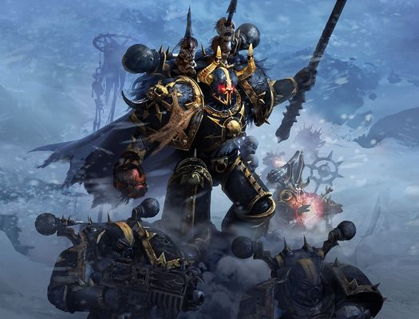
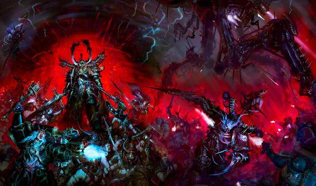
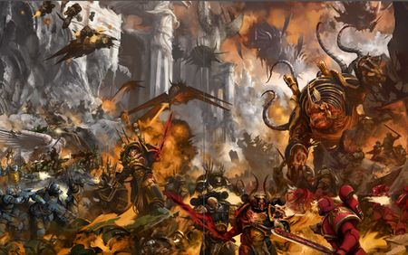
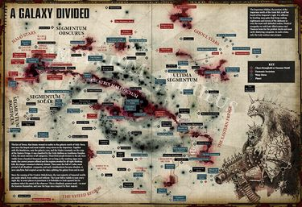
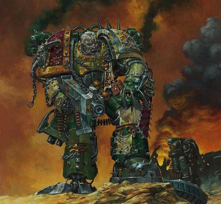
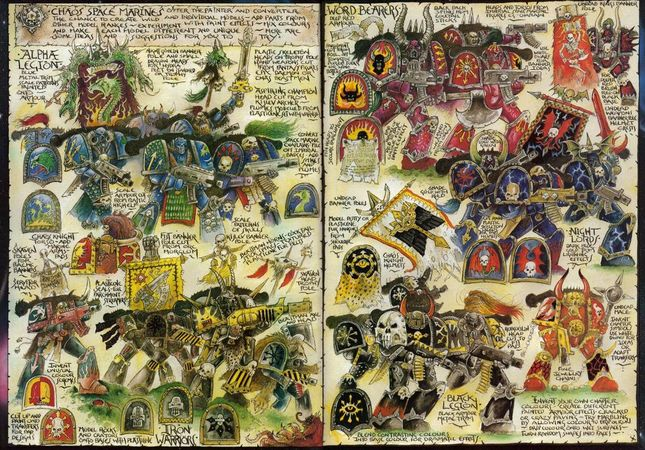

# 0520 混沌星际战士 Chaos Space Marine

精校状态：中文行文已逐段精校，部分术语仍为暂定

分类：组织 / 混沌 Chaos / 混沌诸神 Chaos Gods / 混沌星际战士 Chaos Space Marine

原文来源：https://www.bilibili.com/opus/1124190711778902049

原作者：帝国神选罐头

原文时间：2025年10月16日 11:14

[返回分类目录](目录.md) · [全书目录](../../目录.md)

<!-- A0520-B0001 -->
**英文原文**

The Chaos Space Marines (also known as Traitor Marines, Chaos Marines, Heretic Astartes or Traitor Legionnaires) are counted among the most favoured and powerful servants of the Powers of Chaos.

<!-- /A0520-B0001 -->

<!-- A0520-B0002 -->

原译文

混沌星际战士（也被称为叛徒战士、混沌战士、异端阿斯塔特或叛徒军团士兵）被认为是混沌力量最受欢迎和最强大的仆人之一。

**校订译文**

混沌星际战士又称叛徒星际战士、混沌战士、阿斯塔特叛军或叛徒军团战士，是混沌诸力最宠爱、也最强大的仆从之一。

**校注：** Heretic Astartes 采用官方复合单位名“阿斯塔特叛军恶魔亲王”所确认的词根“阿斯塔特叛军”；该简称为词根参考，不冒充独立整名官方认证。

<!-- /A0520-B0002 -->

<!-- A0520-B0003 图片 -->

<!-- A0520-B0004 -->

原译文

Black Legion Chaos Space Marines led by Araghast the Pillager 劫掠者阿拉加斯特领导的黑色军团混沌星际战士

**校订译文**

Black Legion Chaos Space Marines led by Araghast the Pillager 劫掠者阿拉加斯特领导的黑色军团混沌星际战士

<!-- /A0520-B0004 -->

<!-- A0520-B0005 -->
## Origins 起源

<!-- /A0520-B0005 -->

<!-- A0520-B0006 -->
**英文原文**

Ten thousand years ago, Horus, Warmaster of the Imperium and most trusted 'son' of the Emperor, fell to Chaos due to a conspiracy by the Word Bearers. Besides the Space Marine Legion under his direct command, the Sons of Horus, eight of his brother-Primarchs and their legions also joined him in the Horus Heresy against the Emperor.

<!-- /A0520-B0006 -->

<!-- A0520-B0007 -->

原译文

一万年前，由于怀言者的阴谋，帝皇最信任的“儿子”、帝国的战帅荷鲁斯堕入了混沌。除了他直接指挥的星际战士，荷鲁斯之子外、他的八个兄弟原体及其军团也加入了他对抗帝皇的荷鲁斯叛乱。

**校订译文**

一万年前，帝国战帅、帝皇最信任的“儿子”荷鲁斯，因怀言者的阴谋堕入混沌。除其直接统率的荷鲁斯之子军团外，另有八位兄弟原体及其军团加入他的阵营，在荷鲁斯之乱中反抗帝皇。

<!-- /A0520-B0007 -->

<!-- A0520-B0008 图片 -->

<!-- A0520-B0009 -->

原译文

Chaos Space Marines 混沌星际战士

**校订译文**

Chaos Space Marines 混沌星际战士

<!-- /A0520-B0009 -->

<!-- A0520-B0010 -->
**英文原文**

Only when Horus was slain at the ultimate conflict of the Heresy, the Battle of Terra, was the rebellion broken and the defeated Traitor Legions hounded into the Eye of Terror, which remains both their prison and sanctuary to this day. The Chaos Space Marines have not forgotten their defeat in the Heresy, and for the last ten thousand years have waged the Long War against the Imperium.

<!-- /A0520-B0010 -->

<!-- A0520-B0011 -->

原译文

只有当荷鲁斯在叛乱的最终冲突 — 泰拉之战中被杀时，叛乱才被打破，被击败的叛徒军团才被逐入恐惧之眼，直到今天，恐惧之眼仍然是他们的监狱和避难所。混沌星际战士并没有忘记他们在叛乱中的失败，在过去的一万年里，他们一直在与帝国进行万古长战。

**校订译文**

直到叛乱的最终决战——泰拉之战——中荷鲁斯被杀，叛军才告溃败。战败的叛徒军团被一路追逐，逃入恐惧之眼；直到如今，那里仍既是他们的牢笼，也是避难所。混沌星际战士从未忘记这场失败，此后一万年始终对帝国进行万古长战。

<!-- /A0520-B0011 -->

<!-- A0520-B0012 -->
## The Eye of Terror 恐惧之眼

<!-- /A0520-B0012 -->

<!-- A0520-B0013 -->
**英文原文**

Within the confines of the hellish zone of the Galaxy known as the Eye of Terror, the banished Chaos Space Marines, along with their exiled allies and slaves, have created their own Imperium of Chaos. In the most Chaos-saturated region of the galaxy, few in the ten thousand years of their exile have escaped mutation in some form.

<!-- /A0520-B0013 -->

<!-- A0520-B0014 -->

原译文

在被称为恐惧之眼的银河系地狱地带的范围内，被放逐的混沌星际战士与他们的流亡盟友和奴隶一起创建了自己的混沌帝国。在银河系混沌最深的区域，在他们流亡的一万年里，很少有人逃脱了某种形式的突变。

**校订译文**

在恐惧之眼这片地狱般的银河区域，遭放逐的混沌星际战士与流亡盟友、奴隶一同建立了自己的混沌帝国。这是银河中混沌力量最浓烈的地方，在长达一万年的流亡中，几乎无人能完全避免某种形式的突变。

<!-- /A0520-B0014 -->

<!-- A0520-B0015 图片 -->

<!-- A0520-B0016 -->

原译文

Chaos Space Marine forces at war 战争中的混沌星际战士部队

**校订译文**

Chaos Space Marine forces at war 战争中的混沌星际战士部队

<!-- /A0520-B0016 -->

<!-- A0520-B0017 -->
**英文原文**

Within the Eye, the legions fight among themselves for gene-seed, resources, slaves, or for the greater glory of the Chaos Gods. The legions however are far more driven by their hatred of the Imperium than by internecine rivalry. From the Eye, the forces of Chaos Marines emerge to exact their vengeance upon the Imperium, continuing the Long War they begun ten thousand years ago.

<!-- /A0520-B0017 -->

<!-- A0520-B0018 -->

原译文

在恐惧之眼里，军团之间为基因种子、资源、奴隶或混沌诸神的更大荣耀而战。然而，军团更多的是出于对帝国的仇恨，而不是内部竞争。从恐惧之眼，混沌战士的部队出现了，向帝国复仇，继续他们在一万年前开始的万古长战。

**校订译文**

在恐惧之眼内部，各军团为基因种子、资源、奴隶，或为了向混沌诸神献上更大荣耀而彼此交战。然而，相比内部纷争，对帝国的仇恨才是更强烈的驱动力。混沌星际战士从恐惧之眼出击，向帝国复仇，延续一万年前开始的万古长战。

<!-- /A0520-B0018 -->

<!-- A0520-B0019 -->
**英文原文**

Chaos incursions range from the small scale but brutal raids which can occur anywhere in the galaxy, to the apocalyptic Black Crusades led by the Warmaster of Chaos, Abaddon the Despoiler, when the forces of Chaos in all its forms unite to batter the fortress worlds close to the Eye.

<!-- /A0520-B0019 -->

<!-- A0520-B0020 -->

原译文

混沌入侵的范围从银河系任何地方都可能发生的小规模但残酷的袭击，到由混沌战帅、掠夺者阿巴顿领导的启示录黑色远征，当时各种形式的混沌部队联合起来，打击靠近恐惧之眼的堡垒世界。

**校订译文**

混沌入侵规模不一：小到可能发生在银河任何角落的残酷劫掠，大到混沌战帅掠夺者阿巴顿率领的末日般黑色远征。后者会汇集各种混沌力量，共同猛攻恐惧之眼附近的堡垒世界。

<!-- /A0520-B0020 -->

<!-- A0520-B0021 -->
## Traitor Legions 叛徒军团

<!-- /A0520-B0021 -->

<!-- A0520-B0022 -->
**英文原文**

Technically the Chaos Space Marine Legions are the only Space Marine Legions still in existence, the loyalist Legions having been reformed into self-contained Chapters after the Heresy. Though the Legion remains alive to the Chaos Marines as an identifying concept, in reality nearly all of the Chaos Legions have over time been scattered into separate war bands following rival Chaos Champions. It is said that only the Black Legion, Death Guard, and Word Bearers have retained their cohesion as a Legion. On occasion a highly favoured Champion of Chaos, such as Abaddon, is able to temporarily reunite these Traitor Legions against the Imperium.

<!-- /A0520-B0022 -->

<!-- A0520-B0023 -->

原译文

从技术上讲，混沌星际战士军团是唯一仍然存在的星际战士军团，在叛乱之后，忠诚军团已经被改造成独立的战团。尽管军团作为一个识别概念仍然存在于混沌战士中，但实际上，随着时间的推移，几乎所有的混沌军团都分散到了各自的战帮，追随着竞争的混沌冠军。据说，只有黑色军团、死亡守卫和怀言者保留了他们作为军团的凝聚力。偶尔，一位备受青睐的混沌冠军，如阿巴顿，能够暂时团结这些叛徒军团对抗帝国。

**校订译文**

严格说来，仍以星际战士军团形式存在的只剩混沌军团，因为忠诚派军团已在叛乱后改组为独立战团。不过，对混沌星际战士而言，“军团”虽然仍是认同的纽带，现实中几乎所有军团都已逐渐分裂成独立战帮，分别追随相互竞争的混沌勇士。据说，只有黑色军团、死亡守卫与怀言者仍保有军团的凝聚力。有时，阿巴顿这样的受宠强者能够暂时将叛徒军团重新联合起来，共同对抗帝国。

**校注：** 本段是原稿对军团凝聚力的概括，保留“据说”及其列举，不用后续历史更新替换原文。

<!-- /A0520-B0023 -->

<!-- A0520-B0024 -->
**英文原文**

Black Legion - Ezekyle Abaddon - None - Chaos Undivided

<!-- /A0520-B0024 -->

<!-- A0520-B0025 -->

原译文

黑色军团 - 以泽凯尔·阿巴顿 - 无 - 混沌无分

**校订译文**

黑色军团——以泽凯尔·阿巴顿——无——无分混沌。

**校注：** 原稿这组清单缺少表头；依条目语义为军团、首领、驻地、信仰归属。保留原次序与“无”值，未把首领一栏误标成原体。

<!-- /A0520-B0025 -->

<!-- A0520-B0026 -->
**英文原文**

World Eaters - Angron - None - Khorne

<!-- /A0520-B0026 -->

<!-- A0520-B0027 -->

原译文

吞世者 - 安格隆 - 无 - 恐虐

**校订译文**

吞世者 - 安格隆 - 无 - 恐虐

<!-- /A0520-B0027 -->

<!-- A0520-B0028 -->
**英文原文**

Thousand Sons - Magnus - Sortiarius - Tzeentch

<!-- /A0520-B0028 -->

<!-- A0520-B0029 -->

原译文

千子 - 马格努斯 - 索提尔瑞斯 - 奸奇

**校订译文**

千子 - 马格努斯 - 索提尔瑞斯 - 奸奇

<!-- /A0520-B0029 -->

<!-- A0520-B0030 -->
**英文原文**

Death Guard - Mortarion - Munificence - Nurgle

<!-- /A0520-B0030 -->

<!-- A0520-B0031 -->

原译文

死亡守卫 - 莫塔里安 - 慷慨星 - 纳垢

**校订译文**

死亡守卫 - 莫塔里安 - 慷慨星 - 纳垢

<!-- /A0520-B0031 -->

<!-- A0520-B0032 -->
**英文原文**

Emperor's Children - Fulgrim - None - Slaanesh

<!-- /A0520-B0032 -->

<!-- A0520-B0033 -->

原译文

帝皇之子 - 福格瑞姆 - 无 - 色孽

**校订译文**

帝皇之子 - 福格瑞姆 - 无 - 色孽

<!-- /A0520-B0033 -->

<!-- A0520-B0034 -->
**英文原文**

Word Bearers - Lorgar - Sicarus - Chaos Undivided

<!-- /A0520-B0034 -->

<!-- A0520-B0035 -->

原译文

怀言者 - 珞珈 - 西卡鲁斯 - 混沌无分

**校订译文**

怀言者——珞珈——西卡鲁斯——无分混沌。

<!-- /A0520-B0035 -->

<!-- A0520-B0036 -->
**英文原文**

Iron Warriors - Perturabo - Medrengard - Chaos Undivided

<!-- /A0520-B0036 -->

<!-- A0520-B0037 -->

原译文

钢铁勇士 - 佩图拉博 - 梅林德加德 - 混沌无分

**校订译文**

钢铁勇士——佩图拉博——梅林德加德——无分混沌。

<!-- /A0520-B0037 -->

<!-- A0520-B0038 -->
**英文原文**

Alpha Legion - Unclear - None - Chaos Undivided

<!-- /A0520-B0038 -->

<!-- A0520-B0039 -->

原译文

阿尔法军团 - 不明 - 无 - 混沌无分

**校订译文**

阿尔法军团——不明——无——无分混沌。

<!-- /A0520-B0039 -->

<!-- A0520-B0040 -->
**英文原文**

Night Lords - None - None - Chaos Undivided

<!-- /A0520-B0040 -->

<!-- A0520-B0041 -->

原译文

午夜领主 - 无 - 无 - 混沌无分

**校订译文**

午夜领主——无——无——无分混沌。

<!-- /A0520-B0041 -->

<!-- A0520-B0042 -->
## Traitor Chapters and Warbands 叛徒战团和战帮

<!-- /A0520-B0042 -->

<!-- A0520-B0043 -->
**英文原文**

Inevitably, during the ten thousand years following the Heresy, entire chapters of once loyal Space Marines have fallen to Chaos.

<!-- /A0520-B0043 -->

<!-- A0520-B0044 -->

原译文

不可避免的是，在叛乱之后的一万年里，曾经忠诚的星际战士的整个战团都堕入了混沌。

**校订译文**

荷鲁斯之乱后的一万年间，也不断有原本忠诚的星际战士战团整体堕入混沌。

<!-- /A0520-B0044 -->

<!-- A0520-B0045 图片 -->

<!-- A0520-B0046 -->

原译文

Chaos Space Marine activity in the Galaxy 银河系中混沌星际战士行动

**校订译文**

Chaos Space Marine activity in the Galaxy 银河系中混沌星际战士行动

<!-- /A0520-B0046 -->

<!-- A0520-B0047 -->
**英文原文**

Some of the most notable Traitor Chapters and Warbands not affiliated with the original Heretic Legions include the:

<!-- /A0520-B0047 -->

<!-- A0520-B0048 -->

原译文

一些与原初叛乱军团无关的最著名的叛徒战团和战帮包括：

**校订译文**

未归属于最初叛徒军团的著名叛徒战团与战帮，包括：

<!-- /A0520-B0048 -->

<!-- A0520-B0049 -->

原译文

Red Corsairs 红海盗

**校订译文**

Red Corsairs 红海盗

<!-- /A0520-B0049 -->

<!-- A0520-B0050 -->

原译文

Crimson Slaughter 猩红屠杀者

**校订译文**

Crimson Slaughter 猩红屠杀者

<!-- /A0520-B0050 -->

<!-- A0520-B0051 -->

原译文

Fallen 堕天使

**校订译文**

Fallen 堕天使

<!-- /A0520-B0051 -->

<!-- A0520-B0052 -->

原译文

Purge 净世疫军

**校订译文**

Purge 净世疫军

<!-- /A0520-B0052 -->

<!-- A0520-B0053 -->

原译文

Flawless Host 无暇之主

**校订译文**

Flawless Host 无暇大军

<!-- /A0520-B0053 -->

<!-- A0520-B0054 -->

原译文

Sons of Malice 怨恶之子

**校订译文**

Sons of Malice 怨恶之子

<!-- /A0520-B0054 -->

<!-- A0520-B0055 -->

原译文

Company of Misery 痛苦连队

**校订译文**

Company of Misery 痛苦连队

<!-- /A0520-B0055 -->

<!-- A0520-B0056 -->

原译文

Skulltakers 夺颅者

**校订译文**

Skulltakers 夺颅者

<!-- /A0520-B0056 -->

<!-- A0520-B0057 -->

原译文

Brazen Beasts 黄铜野兽

**校订译文**

Brazen Beasts 黄铜野兽

<!-- /A0520-B0057 -->

<!-- A0520-B0058 -->

原译文

Scourged 鞭挞者

**校订译文**

Scourged 天灾

**校注：** Scourged 沿第508篇原稿“The Scourged 天灾”；本处原译鞭挞者。暂定统一，等待官方整名证据。

<!-- /A0520-B0058 -->

<!-- A0520-B0059 -->

原译文

Cleaved 分裂者

**校订译文**

Cleaved 分裂者

<!-- /A0520-B0059 -->

<!-- A0520-B0060 -->

原译文

Oracles of Change 万变神谕

**校订译文**

Oracles of Change 变革神谕

**校注：** Oracles of Change 沿第508篇“变革神谕”，不与单个神祇称号混同。

<!-- /A0520-B0060 -->

<!-- A0520-B0061 -->

原译文

Warp Ghosts 亚空间幽灵

**校订译文**

Warp Ghosts 亚空间幽灵

<!-- /A0520-B0061 -->

<!-- A0520-B0062 -->

原译文

Dragon Warriors 龙兽战士

**校订译文**

Dragon Warriors 龙兽战士

<!-- /A0520-B0062 -->

<!-- A0520-B0063 -->

原译文

Blood Gorgons 鲜血戈尔贡

**校订译文**

Blood Gorgons 鲜血戈尔贡

<!-- /A0520-B0063 -->

<!-- A0520-B0064 -->

原译文

Deathmongers 死亡贩子

**校订译文**

Deathmongers 死亡贩子

<!-- /A0520-B0064 -->

<!-- A0520-B0065 -->

原译文

Bleak Brotherhood 荒凉兄弟会

**校订译文**

Bleak Brotherhood 荒凉兄弟会

<!-- /A0520-B0065 -->

<!-- A0520-B0066 -->

原译文

Death Shadows 死亡暗影

**校订译文**

Death Shadows 死亡暗影

<!-- /A0520-B0066 -->

<!-- A0520-B0067 -->
## Creation of new Chaos Marines 新混沌星际战士的诞生

原题：Creation of new Chaos Marines 创建新的混沌战士

<!-- /A0520-B0067 -->

<!-- A0520-B0068 -->
**英文原文**

The Chaos Marines still maintain the process of gene-seeding — the transformation of humans into superhumans through organ implantation and associated psychological and chemical conditioning - in order to create new Chaos Marines. The children that are turned into new Chaos Marines are bred from slave stock and captives acquired from raids on Imperial worlds. The process is a brutal ordeal, differing from the carefully measured program of development used by Imperial Space Marines.

<!-- /A0520-B0068 -->

<!-- A0520-B0069 -->

原译文

混沌战士仍然保持着基因种子的过程 — 通过器官植入和相关的心理和化学调节将人类转化为超人 — 以创造新的混沌战士。被改造成新混沌战士的孩子们是从奴隶和突袭帝国世界中获得的俘虏中长大的。这个过程是一场残酷的磨难，与帝国星际战士使用的精心衡量的发展计划不同。

**校订译文**

混沌星际战士仍通过植入基因种子器官，并辅以心理训练和化学调适，将普通人改造成超人战士，以补充新成员。受改造的儿童来自奴隶群体的后代，或劫掠帝国世界时取得的俘虏。这一过程是残酷的磨炼，与帝国星际战士精心安排、循序施行的改造程序不同。

<!-- /A0520-B0069 -->

<!-- A0520-B0070 -->
**英文原文**

In every Legion, Apothecaries, or their Chaos Marine equivalents, are still charged with the important task of retrieving the gene-seed organs from their fallen brethren.

<!-- /A0520-B0070 -->

<!-- A0520-B0071 -->

原译文

在每一个军团中，药剂师或他们的混沌战士等价者仍然承担着从他们倒下的兄弟那里取回基因种子器官的重要任务。

**校订译文**

每个军团的药剂师，或承担同等职责的混沌星际战士，仍负责从阵亡同袍身上回收基因种子器官。

<!-- /A0520-B0071 -->

<!-- A0520-B0072 -->
## Equipment 装备

<!-- /A0520-B0072 -->

<!-- A0520-B0073 -->
**英文原文**

Over the millennia the energies that saturate the Eye of Terror have worked their transformative effects on both the living flesh and the inanimate weapons and armour of the Chaos Space Marines. As far as weapons and equipment, the Chaos Legions retain much of their Legiones Astartes heritage. The bolter remains the main weapon even when it has been refigured into a fusion of biological and inorganic parts, or redesigned into strange and baroque forms by the whims of Chaos or the user himself. Although power armour is often unrecognisable as once being Astartes-issue, the suits continue to function the same, and include standard auto-sensory technology, communicators and respirators. Armour has been recoloured and redecorated to show allegiance to the Legion's Chaos patron.

<!-- /A0520-B0073 -->

<!-- A0520-B0074 -->

原译文

数千年来，充满恐惧之眼的能量对混沌星际战士的活体和无生命的武器和盔甲产生了变革性的影响。就武器和装备而言，混沌军团保留了大部分阿斯塔特军团的遗产。即使被改装成生物和无机部件的融合，或者被混沌或使用者自己的突发奇想重新设计成奇怪的巴洛克形式，爆矢枪仍然是主要武器。尽管动力盔甲经常无法辨认，因为曾经是阿斯塔特的问题，但这些盔甲的功能仍然相同，包括标准的自动感应技术、通讯器和呼吸器。盔甲已经重新着色和装饰，以表明对军团的混沌主人的忠诚。

**校订译文**

数千年来，充斥恐惧之眼的能量持续改变着混沌星际战士的肉体，也改变着他们原本没有生命的武器与护甲。尽管如此，混沌军团在装备方面仍保留了大量阿斯塔特军团的遗产。爆矢枪依然是主力武器，即使它可能已化为有机组织与无机零件的混合物，或随混沌力量及使用者的意愿，被改造成怪诞繁复的样式。动力甲也常变得难以辨认出原先阿斯塔特制式装备的模样，但其功能仍然如故，包括标准的自动感测装置、通信器与呼吸系统。护甲会重新涂装、装饰，以表明对军团庇护神的效忠。

<!-- /A0520-B0074 -->

<!-- A0520-B0075 图片 -->

<!-- A0520-B0076 -->

原译文

Chaos Space Marine 混沌星际战士

**校订译文**

Chaos Space Marine 混沌星际战士

<!-- /A0520-B0076 -->

<!-- A0520-B0077 -->
## Notable Chaos Space Marines 著名混沌星际战士

<!-- /A0520-B0077 -->

<!-- A0520-B0078 -->

原译文

Black Legion 黑色军团

**校订译文**

Black Legion 黑色军团

<!-- /A0520-B0078 -->

<!-- A0520-B0079 -->
**英文原文**

Abaddon the Despoiler, Master of the Black Legion, Warmaster of Chaos.

<!-- /A0520-B0079 -->

<!-- A0520-B0080 -->

原译文

掠夺者阿巴顿，黑色军团之主，混沌战帅

**校订译文**

掠夺者阿巴顿，黑色军团之主，混沌战帅

<!-- /A0520-B0080 -->

<!-- A0520-B0081 -->
**英文原文**

Haarken Worldclaimer, Herald of Abaddon.

<!-- /A0520-B0081 -->

<!-- A0520-B0082 -->

原译文

夺世者哈肯，阿巴顿的传令官

**校订译文**

夺星者哈尔肯，阿巴顿的传令官。

**校注：** Haarken Worldclaimer 官译夺星者哈尔肯（GW-09/GW-10 第15页），原稿夺世者哈肯。

<!-- /A0520-B0082 -->

<!-- A0520-B0083 -->
**英文原文**

Falkus Kibre, Captain of the Bringers of Despair.

<!-- /A0520-B0083 -->

<!-- A0520-B0084 -->

原译文

法库斯·凯博，绝望使者的连长

**校订译文**

法库斯·凯博，绝望使者的连长

<!-- /A0520-B0084 -->

<!-- A0520-B0085 -->
**英文原文**

Devram Korda, one of the four Chosen of Abaddon.

<!-- /A0520-B0085 -->

<!-- A0520-B0086 -->

原译文

德拉姆·科尔达，阿巴顿亲选之一

**校订译文**

德拉姆·科尔达，阿巴顿四位亲选之一。

<!-- /A0520-B0086 -->

<!-- A0520-B0087 -->
**英文原文**

Ygethmor, one of the four Chosen of Abaddon.

<!-- /A0520-B0087 -->

<!-- A0520-B0088 -->

原译文

伊戈斯莫，阿巴顿亲选之一

**校订译文**

伊戈斯莫，阿巴顿四位亲选之一。

<!-- /A0520-B0088 -->

<!-- A0520-B0089 -->
**英文原文**

Threxos Hellbreed, one of the four Chosen of Abaddon.

<!-- /A0520-B0089 -->

<!-- A0520-B0090 -->

原译文

瑟克索斯·地狱之种，阿巴顿亲选之一

**校订译文**

瑟克索斯·地狱之种，阿巴顿四位亲选之一。

<!-- /A0520-B0090 -->

<!-- A0520-B0091 -->
**英文原文**

Skyrak Slaughterborn, one of the four Chosen of Abaddon.

<!-- /A0520-B0091 -->

<!-- A0520-B0092 -->

原译文

斯凯拉克·屠杀降生，阿巴顿亲选之一

**校订译文**

斯凯拉克·屠杀降生，阿巴顿四位亲选之一。

<!-- /A0520-B0092 -->

<!-- A0520-B0093 -->

原译文

Emperor's Children 帝皇之子

**校订译文**

Emperor's Children 帝皇之子

<!-- /A0520-B0093 -->

<!-- A0520-B0094 -->
**英文原文**

Eidolon, Lord Commander Primus and leader of the Phoenix Conclave.

<!-- /A0520-B0094 -->

<!-- A0520-B0095 -->

原译文

艾多隆，领主指挥官之首和凤凰密会领袖

**校订译文**

艾多隆，首席领主指挥官，凤凰秘会的首领。

<!-- /A0520-B0095 -->

<!-- A0520-B0096 -->
**英文原文**

Lucius the Eternal, Champion and leader of the Cohors Nasicae.

<!-- /A0520-B0096 -->

<!-- A0520-B0097 -->

原译文

永恒者卢修斯，冠军和纳希凯大队的领袖

**校订译文**

不灭者卢修斯，混沌勇士，纳希凯大队的首领。

**校注：** Lucius the Eternal 官译不灭者卢修斯（均第21页），与509原稿一致。

<!-- /A0520-B0097 -->

<!-- A0520-B0098 -->
**英文原文**

Fabius Bile, former Chief Apothecary and leader of The Consortium and Creations of Bile.

<!-- /A0520-B0098 -->

<!-- A0520-B0099 -->

原译文

法比乌斯·拜尔，前首席药剂师，联合体和拜尔造物的领袖

**校订译文**

法比乌斯·拜尔，前首席药剂师，共同体与拜尔造物的首领。

<!-- /A0520-B0099 -->

<!-- A0520-B0100 -->
**英文原文**

Julius Kaesoron, former First Captain, now a Daemon Prince.

<!-- /A0520-B0100 -->

<!-- A0520-B0101 -->

原译文

尤里乌斯·卡索隆，前第一连长，现在是一个恶魔王子

**校订译文**

尤里乌斯·卡索隆，前第一连长，如今为恶魔亲王。

<!-- /A0520-B0101 -->

<!-- A0520-B0102 -->
**英文原文**

Doomrider, Daemon Prince of Slaanesh.

<!-- /A0520-B0102 -->

<!-- A0520-B0103 -->

原译文

末日骑手，色孽恶魔王子

**校订译文**

末日骑手，色孽恶魔亲王。

<!-- /A0520-B0103 -->

<!-- A0520-B0104 -->

原译文

World Eaters 吞世者

**校订译文**

World Eaters 吞世者

<!-- /A0520-B0104 -->

<!-- A0520-B0105 -->
**英文原文**

Khârn the Betrayer, Champion of Khorne and leader of the Butcherhorde.

<!-- /A0520-B0105 -->

<!-- A0520-B0106 -->

原译文

背叛者卡恩，恐虐冠军和屠夫部落的领袖

**校订译文**

背叛者卡恩，恐虐勇士，屠夫部落的首领。

<!-- /A0520-B0106 -->

<!-- A0520-B0107 -->
**英文原文**

Kossolax, Lord Regent and commander of The Foresworn.

<!-- /A0520-B0107 -->

<!-- A0520-B0108 -->

原译文

科索拉克斯，领主摄政和背誓者的领袖

**校订译文**

科索拉克斯，摄政领主，弃誓者的指挥官。

<!-- /A0520-B0108 -->

<!-- A0520-B0109 -->
**英文原文**

Invocatus, Horseman of the Apocalypse and leader of the Fire Riders.

<!-- /A0520-B0109 -->

<!-- A0520-B0110 -->

原译文

因沃卡图斯，天启骑士和火焰骑士的领袖。

**校订译文**

因维卡图斯，天启骑士，火焰骑手的首领。

**校注：** Lord Invocatus 官译因维卡图斯尊主（GW-09 第39页；GW-10 第38页）；此处原文 Invocatus 为简称，故只用姓名词根。

<!-- /A0520-B0110 -->

<!-- A0520-B0111 -->

原译文

Death Guard 死亡守卫

**校订译文**

Death Guard 死亡守卫

<!-- /A0520-B0111 -->

<!-- A0520-B0112 -->
**英文原文**

Typhus the Traveler, leader of the 1st Plague Company.

<!-- /A0520-B0112 -->

<!-- A0520-B0113 -->

原译文

旅行者泰丰斯，第一瘟疫连队的领袖

**校订译文**

旅行者泰弗斯，第一瘟疫连的首领。

<!-- /A0520-B0113 -->

<!-- A0520-B0114 -->
**英文原文**

Vorx, Siegemaster and leader of the Lords of Silence.

<!-- /A0520-B0114 -->

<!-- A0520-B0115 -->

原译文

沃克斯，攻城大师和寂静领主的领袖

**校订译文**

沃克斯，攻城大师和寂静领主的领袖

<!-- /A0520-B0115 -->

<!-- A0520-B0116 -->
**英文原文**

Ignatius Grulgor, Eater of Lives and Daemon Prince.

<!-- /A0520-B0116 -->

<!-- A0520-B0117 -->

原译文

伊格纳修斯·格鲁戈尔，生命吞食者和恶魔王子

**校订译文**

伊格纳修斯·格鲁戈尔，生命吞食者，恶魔亲王。

<!-- /A0520-B0117 -->

<!-- A0520-B0118 -->

原译文

Thousand Sons 千子

**校订译文**

Thousand Sons 千子

<!-- /A0520-B0118 -->

<!-- A0520-B0119 -->
**英文原文**

Ahzek Ahriman, former Chief Librarian and leader of the Prodigal Sons.

<!-- /A0520-B0119 -->

<!-- A0520-B0120 -->

原译文

阿扎克·阿里曼，前首席智库和浪子的领袖

**校订译文**

阿扎克·阿里曼，前首席智库员，浪子的首领。

<!-- /A0520-B0120 -->

<!-- A0520-B0121 -->
**英文原文**

Amon, former Equerry to Magnus the Red and leader of the The Brotherhood of Dust.

<!-- /A0520-B0121 -->

<!-- A0520-B0122 -->

原译文

阿蒙，前赤红之马格努斯的侍从官和尘埃兄弟会的领袖

**校订译文**

阿蒙，曾任红魔马格努斯的侍从官，尘埃兄弟会的首领。

<!-- /A0520-B0122 -->

<!-- A0520-B0123 -->
**英文原文**

Mordant Hex, Sorcerer Lord of the Six-Cursed.

<!-- /A0520-B0123 -->

<!-- A0520-B0124 -->

原译文

莫丹特·海克斯，六重诅咒的巫师领主

**校订译文**

莫丹特·海克斯，六重诅咒的巫师领主

<!-- /A0520-B0124 -->

<!-- A0520-B0125 -->
**英文原文**

Madox, Sorcerer

<!-- /A0520-B0125 -->

<!-- A0520-B0126 -->

原译文

马多克斯，巫师

**校订译文**

马多克斯，巫师

<!-- /A0520-B0126 -->

<!-- A0520-B0127 -->

原译文

Iron Warriors 钢铁勇士

**校订译文**

Iron Warriors 钢铁勇士

<!-- /A0520-B0127 -->

<!-- A0520-B0128 -->
**英文原文**

Barban Falk, Daemon Prince

<!-- /A0520-B0128 -->

<!-- A0520-B0129 -->

原译文

巴尔班·法尔克，恶魔王子

**校订译文**

巴尔本·法尔克，恶魔亲王。

<!-- /A0520-B0129 -->

<!-- A0520-B0130 -->
**英文原文**

Honsou, Warsmith and leader of the Bloodborn.

<!-- /A0520-B0130 -->

<!-- A0520-B0131 -->

原译文

洪索，战争铁匠和血裔的领袖

**校订译文**

洪索，战争铁匠和血裔的领袖

<!-- /A0520-B0131 -->

<!-- A0520-B0132 -->
**英文原文**

Shon'tu, Warsmith and leader of the Sons of the Forge.

<!-- /A0520-B0132 -->

<!-- A0520-B0133 -->

原译文

绍恩'图，战争铁匠和铸炉之子的领袖

**校订译文**

绍恩'图，战争铁匠和铸炉之子的领袖

<!-- /A0520-B0133 -->

<!-- A0520-B0134 -->

原译文

Night Lords 午夜领主

**校订译文**

Night Lords 午夜领主

<!-- /A0520-B0134 -->

<!-- A0520-B0135 -->
**英文原文**

Talos Valcoran, the Soul Hunter.

<!-- /A0520-B0135 -->

<!-- A0520-B0136 -->

原译文

塔洛斯·瓦尔科兰，灵魂猎手

**校订译文**

塔洛斯·瓦尔科兰，灵魂猎手

<!-- /A0520-B0136 -->

<!-- A0520-B0137 -->
**英文原文**

Krieg Acerbus, Daemon Prince.

<!-- /A0520-B0137 -->

<!-- A0520-B0138 -->

原译文

克里格·阿瑟布斯，恶魔王子

**校订译文**

克里格·阿瑟布斯，恶魔亲王。

<!-- /A0520-B0138 -->

<!-- A0520-B0139 -->
**英文原文**

Malcharion, the War Sage.

<!-- /A0520-B0139 -->

<!-- A0520-B0140 -->

原译文

马卡里昂，战争贤者

**校订译文**

马卡里昂，战争贤者

<!-- /A0520-B0140 -->

<!-- A0520-B0141 -->
**英文原文**

Decimus, Prophet.

<!-- /A0520-B0141 -->

<!-- A0520-B0142 -->

原译文

狄西摩斯，预言者

**校订译文**

狄西摩斯，预言者

<!-- /A0520-B0142 -->

<!-- A0520-B0143 -->

原译文

Word Bearers 怀言者

**校订译文**

Word Bearers 怀言者

<!-- /A0520-B0143 -->

<!-- A0520-B0144 -->
**英文原文**

Kor Phaeron, Dark Apostle, First Captain, and Keeper of the Faith.

<!-- /A0520-B0144 -->

<!-- A0520-B0145 -->

原译文

科尔·法伦，黑暗使徒，第一连长，和信仰守护者

**校订译文**

科尔·法伦，黑暗使徒，第一连长，和信仰守护者

<!-- /A0520-B0145 -->

<!-- A0520-B0146 -->
**英文原文**

Erebus, Dark Apostle, First Chaplain, and the first known Chaos Space Marine.

<!-- /A0520-B0146 -->

<!-- A0520-B0147 -->

原译文

艾瑞巴斯，黑暗使徒，第一牧师，和第一位已知的星际战士

**校订译文**

艾瑞巴斯，黑暗使徒、首席教士，也是第一位已知的混沌星际战士。

**校注：** 原译漏掉 Chaos，导致艾瑞巴斯被说成第一位星际战士；补回“混沌”。First Chaplain 依官方教士统一为首席教士。

<!-- /A0520-B0147 -->

<!-- A0520-B0148 -->
**英文原文**

Marduk, Dark Apostle

<!-- /A0520-B0148 -->

<!-- A0520-B0149 -->

原译文

马杜克，黑暗使徒

**校订译文**

马杜克，黑暗使徒

<!-- /A0520-B0149 -->

<!-- A0520-B0150 -->

原译文

Alpha Legion 阿尔法军团

**校订译文**

Alpha Legion 阿尔法军团

<!-- /A0520-B0150 -->

<!-- A0520-B0151 -->
**英文原文**

Solomon Akurra, Chaos Lord and leader of the Serpent's Teeth.

<!-- /A0520-B0151 -->

<!-- A0520-B0152 -->

原译文

所罗门·阿库拉，混沌领主和毒蛇之牙的领袖

**校订译文**

所罗门·阿库拉，混沌领主和毒蛇之牙的领袖

<!-- /A0520-B0152 -->

<!-- A0520-B0153 -->
**英文原文**

Occam the Untrue, leader of The Redacted.

<!-- /A0520-B0153 -->

<!-- A0520-B0154 -->

原译文

无实者奥卡姆，编辑者的领袖

**校订译文**

无实者奥卡姆，抹除者的首领。

**校注：** The Redacted 指遭删抹者，原稿“编辑者”将受事误作施事；暂定抹除者。

<!-- /A0520-B0154 -->

<!-- A0520-B0155 -->
**英文原文**

Kernax Voldorius, Strikemaster and Daemon Prince.

<!-- /A0520-B0155 -->

<!-- A0520-B0156 -->

原译文

克纳克斯·沃尔多里乌斯，打击大师和恶魔王子。

**校订译文**

克纳克斯·沃尔多里乌斯，打击大师，恶魔亲王。

<!-- /A0520-B0156 -->

<!-- A0520-B0157 -->

原译文

Others 其他

**校订译文**

Others 其他

<!-- /A0520-B0157 -->

<!-- A0520-B0158 -->
**英文原文**

Huron Blackheart, Chaos Lord of the Red Corsairs.

<!-- /A0520-B0158 -->

<!-- A0520-B0159 -->

原译文

休伦·黑心，红海盗的混沌领主

**校订译文**

休伦·黑心，红海盗的混沌领主

<!-- /A0520-B0159 -->

<!-- A0520-B0160 -->
**英文原文**

Cypher, Fallen Angel.

<!-- /A0520-B0160 -->

<!-- A0520-B0161 -->

原译文

赛弗，堕天使

**校订译文**

塞弗，堕天使。

<!-- /A0520-B0161 -->

<!-- A0520-B0162 -->
**英文原文**

Kranon the Relentless, Chaos Lord of the Crimson Slaughter.

<!-- /A0520-B0162 -->

<!-- A0520-B0163 -->

原译文

无情者克拉能，猩红屠杀者的混沌领主

**校订译文**

无情者克拉能，猩红屠杀者的混沌领主

<!-- /A0520-B0163 -->

<!-- A0520-B0164 -->
## Trivia 琐事

<!-- /A0520-B0164 -->

<!-- A0520-B0165 -->
### Development History 发展历史

<!-- /A0520-B0165 -->

<!-- A0520-B0166 -->
**英文原文**

Chaos Space Marines, as well as the entire concept of Chaos, were not present in the original Rogue Trader Rulebook of Warhammer 40,000, and would not have rules until Realm of Chaos: Slaves to Darkness in 1988.

<!-- /A0520-B0166 -->

<!-- A0520-B0167 -->

原译文

混沌星际战士，以及混沌的整个概念，都没有出现在最初的《战锤40000：行商浪人规则书》中，直到1988年《混沌领域：黑暗之奴》才有了规则。

**校订译文**

混沌星际战士乃至混沌的整体概念，都未出现在《战锤 40,000》最初的《行商浪人》规则书中；直到 1988 年《混沌领域：黑暗之奴》出版，才有了相应规则。

<!-- /A0520-B0167 -->

<!-- A0520-B0168 -->
**英文原文**

The earliest reference to what would become Chaos Space Marines comes with 1988's Book of the Astronomican, which first mentioned in a single box-text Horus' allegiance with Daemons and the Horus Heresy.

<!-- /A0520-B0168 -->

<!-- A0520-B0169 -->

原译文

最早提到混沌星际战士的是1988年的《星炬之书》，该书首次在一个方框文本中提到了荷鲁斯对恶魔的效忠和荷鲁斯叛乱。

**校订译文**

最早为混沌星际战士设定埋下伏笔的是 1988 年的《星炬之书》。该书首次在一段框内文字中，提及荷鲁斯与恶魔的结盟及荷鲁斯之乱。

<!-- /A0520-B0169 -->

<!-- A0520-B0170 -->
**英文原文**

The first exploration of traitor legions would come in White Dwarf 99 (UK) in the article On the Boil: Realms of Chaos Slaves to Darkness, which had original text despite its pitch as a pre-print of Realm of Chaos: Slaves to Darkness and would explore the Horus Heresy in greater detail to introduce the idea of Inter-legionary wars, the Eye of Terror, and the chaos-warped renegades. Shortly after, Realm of Chaos: Slaves to Darkness firmly established the idea of Chaos-worshipping Space Marines with expanded and revised text.

<!-- /A0520-B0170 -->

<!-- A0520-B0171 -->

原译文

对叛徒军团的第一次探究将出现在《白矮人第99期》（英国）的一篇文章《沸腾之上：向黑暗的混沌奴隶的领域》中，尽管其宣传是《混沌领域：黑暗之奴》的预印本，但该文章仍有原始文本，并更详细地探究荷鲁斯叛乱，以介绍军团间战争、恐惧之眼和混沌扭曲的变节者的概念。不久之后，《混沌领域：黑暗之奴》通过扩展和修订的文本，牢固地确立了崇拜混沌的星际战士的印象。

**校订译文**

最早专门介绍叛徒军团的是英国版《白矮人》第 99 期文章《沸腾之际：混沌领域——黑暗之奴》。它虽以《混沌领域：黑暗之奴》的预刊内容作宣传，却包含独立撰写的文字，更详细地介绍了荷鲁斯之乱，并提出军团内战、恐惧之眼，以及遭混沌扭曲的变节者等概念。随后出版的《混沌领域：黑暗之奴》通过扩充、修订文字，正式确立了崇拜混沌的星际战士这一设定。

**校注：** 篇名原译语序错误，依英文修为《沸腾之际：混沌领域——黑暗之奴》，书刊名中文暂定，未冒称官方出版译名。

<!-- /A0520-B0171 -->

<!-- A0520-B0172 图片 -->

<!-- A0520-B0173 -->

原译文

Chaos Space Marines 混沌星际战士

**校订译文**

Chaos Space Marines 混沌星际战士

<!-- /A0520-B0173 -->

<!-- A0520-B0174 -->
**英文原文**

The Chaos Space Marines design was originated by Jes Goodwin in 1990, and fleshed out by John Blanche in 1996. 1996's 2nd Edition Chaos Codex cemented most modern Chaos Space Marine lore such as the 9 Traitor Legions, Abaddon the Despoiler and most of their prominent named characters, and the idea of the Long War.

<!-- /A0520-B0174 -->

<!-- A0520-B0175 -->

原译文

混沌星际战士的设计由杰斯·古德温于1990年提出，并于1996年由约翰·布兰奇充实。1996年的第二版《混沌圣典》巩固了最现代的混沌星际战士传说，如9个叛徒军团、掠夺者阿巴顿及其大多数著名人物，以及万古长战的概念。

**校订译文**

混沌星际战士的设计由杰斯·古德温在 1990 年创立，约翰·布兰奇又于 1996 年加以充实。1996 年第二版《混沌圣典》确立了现代混沌星际战士背景中的大部分基础设定，包括九大叛徒军团、掠夺者阿巴顿与其他许多重要角色，以及万古长战的概念。

<!-- /A0520-B0175 -->

<!-- A0520-B0176 -->
### Note 注释

<!-- /A0520-B0176 -->

<!-- A0520-B0177 -->
**英文原文**

Note: The Traitor Legions of Horus banished to the Eye of Terror in White Dwarf 99 (UK) are actually referred to with a different and unique name:"Treacher Legions". With the publication of Traitor Legions in Realm of Chaos: Slaves to Darkness, this term would never be used again.

<!-- /A0520-B0177 -->

<!-- A0520-B0178 -->

原译文

注：在《白矮人第99期》（英国）中，被放逐到恐惧之眼的荷鲁斯的叛徒军团实际上有一个不同而独特的名字：“变节军团”。随着《混沌领域：黑暗之奴》里叛徒军团的出版，这个词再也不会被使用了。

**校订译文**

注：英国版《白矮人》第 99 期，将遭放逐至恐惧之眼的荷鲁斯叛军称作一个独特的旧称——“Treacher Legions”。《混沌领域：黑暗之奴》改用“Traitor Legions”之后，这一旧写法便不再使用。中文均可译作“叛徒军团”，故此保留英文，以显示两者的拼写差别。

**校注：** 原注重点为 Treacher 与 Traitor 的不同拼写，保留英文说明，避免凭两种中文译法制造设定实体差异。

<!-- /A0520-B0178 -->

本篇核心术语与暂定项

以下列出本篇出现的英文原形及核心术语表用词。同形词可能指不同对象，具体词义以本篇正文和校注为准；单复数、别名和仅见于图注的名称可能尚未列入。完整候选见[术语表](../../术语表/双语术语候选.csv)。

| 英文 | 采用中文 | 状态 |
| --- | --- | --- |
| Space Marines | 星际战士 | 官方已核对 |
| Chaos Space Marines | 混沌星际战士 | 官方已核对 |
| Death Guard | 死亡守卫 | 官方已核对 |
| Thousand Sons | 千子 | 官方已核对 |
| World Eaters | 吞世者 | 官方已核对 |
| Librarian | 智库员 | 官方已核对 |
| Horus Heresy | 荷鲁斯之乱 | 官方已核对 |
| Astronomican | 星炬 | 暂定 |
| Imperium | 帝国 | 暂定·简称 |
| Sorcerer | 巫师 | 官方已核对 |
| Khorne | 恐虐 | 官方已核对 |
| Tzeentch | 奸奇 | 官方已核对 |
| Nurgle | 纳垢 | 官方已核对 |
| Equipment | 装备 | 编辑用语已统一 |
| Eye of Terror | 恐惧之眼 | 官方已核对 |
| Rogue Trader | 行商浪人 | 暂定 |
| Emperor | 帝皇 | 官方已核对 |
| Word Bearers | 怀言者 | 暂定·官方待核 |
| Dark Apostle | 黑暗使徒 | 官方已核对 |
| Daemon Prince | 恶魔亲王 | 官方已核对 |
| Black Legion | 黑色军团 | 暂定·官方待核 |
| Emperor's Children | 帝皇之子 | 官方已核对 |
| Slaanesh | 色孽 | 官方已核对 |
| Lords of Silence | 寂静领主 | 暂定·官方待核 |
| Iron Warriors | 钢铁勇士 | 暂定·官方待核 |
| Night Lords | 午夜领主 | 暂定·官方待核 |
| Mortarion | 莫塔里安 | 官方已核对 |
| Terra | 泰拉 | 暂定·官方待核 |
| Horus | 荷鲁斯 | 暂定·官方待核 |
| Erebus | 艾瑞巴斯 | 暂定·官方待核 |
| The Brotherhood | 兄弟会 | 暂定·官方待核 |
| Sons of Horus | 荷鲁斯之子 | 暂定·官方待核 |
| Fulgrim | 福格瑞姆 | 官方已核对 |
| Magnus the Red | 红魔马格努斯 | 官方已核对 |
| Legiones Astartes | 阿斯塔特军团 | 暂定·官方待核 |
| Realm of Chaos: Slaves to Darkness | 混沌领域：黑暗之奴 | 暂定·官方待核 |
| Realm of Chaos | 混沌领域 | 暂定·官方待核 |
| Slaves to Darkness | 黑暗之奴 | 暂定·官方待核 |
| Brotherhood | 兄弟会 | 暂定·官方待核 |
| Lucius | 卢修斯 | 暂定·官方待核 |
| Fortress Worlds | 堡垒世界 | 暂定·官方待核 |
| Warsmith | 战争铁匠 | 暂定·官方待核 |
| Chief Librarian | 首席智库员 | 暂定·官方待核 |
| Master | 导师（审判庭职衔）／舰务官（舰员职务） | 语境定译·官方待核 |
| Marduk | 马尔杜克 | 暂定·官方待核 |
| Chief Apothecary | 首席药剂师 | 暂定·官方待核 |
| Chaplain | 教士 | 官方已核对 |
| Apothecary | 药剂师 | 官方已核对 |
| Fabius Bile | 法比乌斯·拜尔 | 官方已核对 |
| Long War | 万古长战 | 暂定·官方待核 |
| Falkus Kibre | 法库斯·凯博 | 暂定·官方待核 |
| Space Marine Legion | 星际战士军团 | 暂定·官方待核 |
| Lord Commander | 领主指挥官 | 暂定·官方待核 |
| Alpha Legion | 阿尔法军团 | 暂定·官方待核 |
| Chaos Space Marine Legions | 混沌星际战士军团 | 暂定·官方待核 |
| First Captain | 第一连长 | 暂定·官方待核 |
| Eidolon | 艾多隆 | 暂定·官方待核 |
| Julius Kaesoron | 尤利乌斯·凯索伦 | 暂定·官方待核 |
| Barban Falk | 巴尔本·法尔克 | 暂定·官方待核 |
| Khârn | 卡恩 | 暂定·官方待核 |
| Ahzek Ahriman | 阿扎克·阿里曼 | 暂定·官方待核 |
| Amon | 阿蒙 | 暂定·官方待核 |
| Ezekyle Abaddon | 以泽凯尔·阿巴顿 | 暂定·官方待核 |
| Kor Phaeron | 科尔·法伦 | 暂定·官方待核 |
| Champion | 冠军 | 暂定·官方待核 |
| Herald | 传令官 | 暂定·官方待核 |
| Despoiler | 劫掠者 | 暂定·官方待核 |
| Power Armour | 动力盔甲 | 暂定·官方待核 |
| Space Marine | 星际战士 | 暂定·官方待核 |
| Captain | 连长 | 暂定·官方待核 |
| Brother | 修士 | 暂定·官方待核 |
| Gene-seed | 基因种子 | 暂定·官方待核 |
| Equerry | 近侍 | 暂定·官方待核 |
| Strikemaster | 打击大师 | 暂定·官方待核 |
| Bringers of Despair | 绝望使者 | 暂定·官方待核 |
| Lorgar | 珞珈 | 暂定·官方待核 |
| Chaos Undivided | 混沌无分 | 暂定·官方待核 |
| Sicarus | 西卡鲁斯 | 暂定·官方待核 |
| Powers | 能天使 | 暂定·官方待核 |
| Occam | 奥卡姆 | 暂定·官方待核 |
| Solomon Akurra | 所罗门·阿库拉 | 暂定·官方待核 |
| Kernax Voldorius | 克纳克斯·沃尔多里乌斯 | 暂定·官方待核 |
| The Redacted | 抹除者 | 暂定·官方待核 |
| The Serpent's Teeth | 巨蛇之牙 | 暂定·官方待核 |
| Cypher | 塞弗 | 官方已核对 |
| Abaddon the Despoiler | 掠夺者阿巴顿 | 官方已核对 |
| Typhus | 泰弗斯 | 官方已核对 |
| Prodigal Sons | 浪子 | 暂定·官方待核 |
| Doomrider | 末日骑手 | 暂定·官方待核 |
| Lucius the Eternal | 不灭者卢修斯 | 官方已核对 |
| Khârn the Betrayer | 背叛者卡恩 | 官方已核对 |
| The Consortium | 共同体 | 暂定·官方待核 |
| Phoenix Conclave | 凤凰秘会 | 暂定·官方待核 |
| Sortiarius | 索提尔瑞斯 | 暂定·官方待核 |
| Medrengard | 梅林德加德 | 暂定·官方待核 |
| Munificence | 慷慨星 | 暂定·官方待核 |
| On the Boil: Realms of Chaos Slaves to Darkness | 《沸腾之际：混沌领域——黑暗之奴》 | 暂定·官方待核 |
| Haarken Worldclaimer | 夺星者哈尔肯 | 官方已核对 |
| Heretic Astartes | 阿斯塔特叛军 | 官方词根参考·整名待核 |
| Primus | 领军 | 官方已核对 |
| Hex | 施法号 | 暂定·官方待核 |
| Talos Valcoran | 塔洛斯·瓦尔科兰 | 暂定·官方待核 |
| Kossolax | 科索拉克斯 | 暂定·官方待核 |
| Angron | 安格隆 | 官方已核对 |
| Jes Goodwin | 杰斯·古德温 | 暂定·官方待核 |
| Phaeron | 法皇 | 暂定·官方待核 |
| Vengeance | 复仇号 | 暂定·官方待核 |
| Ignatius | 伊格纳修斯 | 暂定·官方待核 |
| Mordant Hex | 莫丹特·海克斯 | 暂定·官方待核 |
| Madox | 马多克斯 | 暂定·官方待核 |
| First Chaplain | 首席教士 | 暂定·官方待核 |
| Keeper of the Faith | 信仰守护者 | 暂定·官方待核 |
| Ignatius Grulgor | 伊格纳修斯·格鲁戈尔 | 暂定·官方待核 |
| Bloodborn | 血裔 | 暂定·官方待核 |
| Krieg | 克里格 | 暂定·官方待核 |
| Solomon | 所罗门 | 暂定·官方待核 |
| Huron Blackheart | 休伦·黑心 | 官方已核对 |
| Honsou | 洪索 | 暂定·官方待核 |
| Typhus the Traveler | 旅行者泰弗斯 | 暂定·官方待核 |
| Devram Korda | 德夫拉姆·科尔达 | 暂定·官方待核 |
| Kranon the Relentless | 无情者克拉能 | 暂定·官方待核 |
| Bolter | 爆矢枪 | 暂定·官方待核 |
| The Lords of Silence | 寂静领主 | 暂定·官方待核 |
| Butcherhorde | 屠夫大军 | 暂定·官方待核 |
| John Blanche | 约翰·布兰奇 | 暂定·官方待核 |
| Fire Riders | 火焰骑士 | 暂定·官方待核 |

