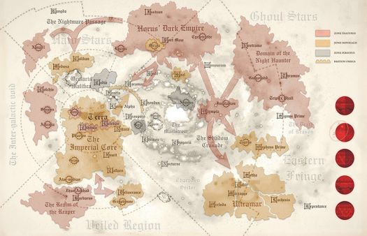

# 0521 黑暗帝国 Dark Empire

精校状态：中文行文已逐段精校，部分术语仍为暂定

分类：组织 / 混沌 Chaos / 混沌诸神 Chaos Gods / 混沌星际战士 Chaos Space Marine

原文来源：https://www.bilibili.com/opus/1186869523132710913

原作者：帝国神选罐头

原文时间：2026年04月03日 08:59

[返回分类目录](目录.md) · [全书目录](../../目录.md)

<!-- A0521-B0001 -->
**英文原文**

The Dark Empire was the informal title given to the vast territories of the northern Imperium claimed by Horus Lupercal's personal forces during the Horus Heresy.

<!-- /A0521-B0001 -->

<!-- A0521-B0002 -->

原译文

黑暗帝国是荷鲁斯叛乱时期，荷鲁斯·卢佩卡尔的个人部队声称拥有的帝国北方大片领地的非正式名称。

**校订译文**

黑暗帝国，是对荷鲁斯之乱期间由荷鲁斯·卢佩卡尔直属部队控制的帝国北方大片疆域的非正式称呼。

<!-- /A0521-B0002 -->

<!-- A0521-B0003 图片 -->

<!-- A0521-B0004 -->

原译文

Location of the Dark Empire as well as other traitor and loyalist territories during the Heresy 叛乱时期黑暗帝国以及其他叛徒和忠诚派地区的位置

**校订译文**

Location of the Dark Empire as well as other traitor and loyalist territories during the Heresy 叛乱时期黑暗帝国以及其他叛徒和忠诚派地区的位置

<!-- /A0521-B0004 -->

<!-- A0521-B0005 -->
**英文原文**

Expanding quickly across Segmentum Obscurus and the northern reaches of Segmentum Ultima, it consisted of at least 10,000 inhabited Human worlds, many of which were quick to pledge allegiance to the Warmaster. Only vital Forge Worlds such as Cyclothrathe, especially well-defended worlds, or mercenary planets with little love of distant Terra could hope to escape Horus' direct lordship. Most of the worlds were remorselessly crushed in so-called "Dark Compliances", their assets pressed into service for the greater Traitor war effort. During a Dark Compliance a simple choice was given: submission or horrific destruction.

<!-- /A0521-B0005 -->

<!-- A0521-B0006 -->

原译文

它在朦胧星域和极限星域的北部区域迅速扩张，由至少10000个有人居住的人类世界组成，其中许多很快宣誓效忠战帅。只有像赛克洛斯拉斯这样至关重要的铸造世界，特别是防御良好的世界，或者对遥远的泰拉几乎没有爱的佣兵行星，才有希望摆脱荷鲁斯的直接统治。大多数世界在所谓的“黑暗平定”中被无情地摧毁，他们的资产被压入更大的叛徒战争中。在黑暗平定期间，人们被给予了一个简单的选择：屈服或可怕的毁灭。

**校订译文**

这片领地迅速扩展，遍及朦胧星域及极限星域北部，至少包括 10,000 颗有人类居住的行星，其中许多很快便宣誓效忠战帅。只有赛克洛特拉特这样的关键铸造世界、防御格外坚固的行星，或那些对遥远泰拉缺乏忠心、唯利是图的世界，才有希望免于荷鲁斯的直接统治。大多数世界在所谓“黑暗平定”中被无情征服，资源被强征以支援叛军的总体战事。黑暗平定只给人们两种选择：臣服，或遭受恐怖的毁灭。

**校注：** mercenary planets 此处修饰世界的唯利属性，不必然指专营雇佣兵的行星；修正原译佣兵行星。crushed 在征服语境不等于行星被物理摧毁。Cyclothrathe 与518 Cyclotrathe 为原稿异拼，中文沿518赛克洛特拉特，英文不改。

<!-- /A0521-B0006 -->

<!-- A0521-B0007 -->
**英文原文**

During the Heresy, only a few outposts within the boundaries within the Dark Empire managed to resist the Traitors, most notably Mezoa.

<!-- /A0521-B0007 -->

<!-- A0521-B0008 -->

原译文

在叛乱时期，黑暗帝国境内只有少数前哨成功抵挡了叛徒，最著名的是梅佐亚。

**校订译文**

荷鲁斯之乱期间，黑暗帝国境内只有少数据点成功抵抗叛军，其中最著名的是梅佐亚。

<!-- /A0521-B0008 -->

本篇核心术语与暂定项

以下列出本篇出现的英文原形及核心术语表用词。同形词可能指不同对象，具体词义以本篇正文和校注为准；单复数、别名和仅见于图注的名称可能尚未列入。完整候选见[术语表](../../术语表/双语术语候选.csv)。

| 英文 | 采用中文 | 状态 |
| --- | --- | --- |
| Horus Heresy | 荷鲁斯之乱 | 官方已核对 |
| Imperium | 帝国 | 暂定·简称 |
| Compliance | 归顺；纳入帝国统治 | 暂定·官方待核 |
| Terra | 泰拉 | 暂定·官方待核 |
| Horus | 荷鲁斯 | 暂定·官方待核 |
| Segmentum Obscurus | 朦胧星域 | 暂定·官方待核 |
| Segmentum | 星域 | 暂定·官方待核 |
| Mezoa | 梅佐亚 | 暂定·官方待核 |
| Obscurus | 朦胧星 | 暂定·官方待核 |
| Horus Lupercal | 荷鲁斯·卢佩卡尔 | 暂定·官方待核 |
| Lupercal | 卢佩卡尔 | 暂定·官方待核 |
| Cyclothrathe | 赛克洛特拉特 | 暂定·官方待核 |
| Dark Compliance | 黑暗平定 | 暂定·官方待核 |
| The Dark | 《黑暗》 | 暂定·官方待核 |
| Dark Compliances | 黑暗平定 | 暂定·官方待核 |

