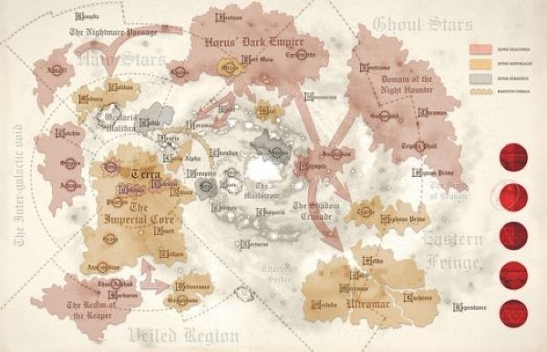

# 0522 收割者领域 Realm of the Reaper

精校状态：中文行文已逐段精校，部分术语仍为暂定

分类：组织 / 混沌 Chaos / 混沌诸神 Chaos Gods / 混沌星际战士 Chaos Space Marine

原文来源：https://www.bilibili.com/opus/1187251002152058886

原作者：帝国神选罐头

原文时间：2026年04月04日 09:40

[返回分类目录](目录.md) · [全书目录](../../目录.md)

<!-- A0522-B0001 -->
**英文原文**

The Realm of the Reaper was a territory established by Traitor forces during the Horus Heresy.

<!-- /A0522-B0001 -->

<!-- A0522-B0002 -->

原译文

收割者领域是荷鲁斯叛乱时期叛徒势力建立的领地。

**校订译文**

收割者领域，是荷鲁斯之乱期间叛军建立的一片领地。

<!-- /A0522-B0002 -->

<!-- A0522-B0003 图片 -->

<!-- A0522-B0004 -->

原译文

Location of the Realm of the Reaper as well as other traitor and loyalist territories during the Heresy 叛乱时期收割者领域以及其他叛徒和忠诚派领土的位置

**校订译文**

Location of the Realm of the Reaper as well as other traitor and loyalist territories during the Heresy 叛乱时期收割者领域以及其他叛徒和忠诚派领土的位置

<!-- /A0522-B0004 -->

<!-- A0522-B0005 -->
**英文原文**

Overseen by Mortarion (known as "The Reaper") and his Death Guard, it was centered on their homeworld of Barbarus and encompassed a significant portion of the southwestern Imperium.

<!-- /A0522-B0005 -->

<!-- A0522-B0006 -->

原译文

在莫塔里安（被称为“收割者”）和他的死亡守卫的监督下，它以他们的家园世界巴巴鲁斯为中心，涵盖了帝国西南的很大一部分。

**校订译文**

它由号称“收割者”的莫塔里安及死亡守卫统治，以军团母星巴巴鲁斯为中心，囊括了帝国西南部的大片疆域。

<!-- /A0522-B0006 -->

本篇核心术语与暂定项

以下列出本篇出现的英文原形及核心术语表用词。同形词可能指不同对象，具体词义以本篇正文和校注为准；单复数、别名和仅见于图注的名称可能尚未列入。完整候选见[术语表](../../术语表/双语术语候选.csv)。

| 英文 | 采用中文 | 状态 |
| --- | --- | --- |
| Death Guard | 死亡守卫 | 官方已核对 |
| Horus Heresy | 荷鲁斯之乱 | 官方已核对 |
| Imperium | 帝国 | 暂定·简称 |
| Mortarion | 莫塔里安 | 官方已核对 |
| Barbarus | 巴巴鲁斯 | 暂定·官方待核 |
| Horus | 荷鲁斯 | 暂定·官方待核 |
| Reaper | 收割者号 | 暂定·官方待核 |

