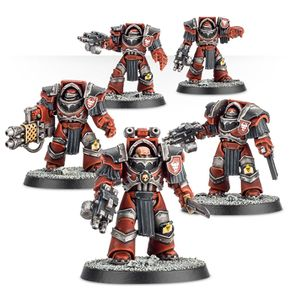
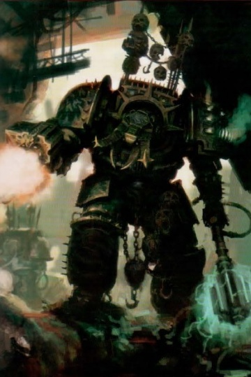
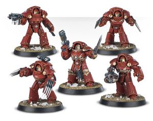
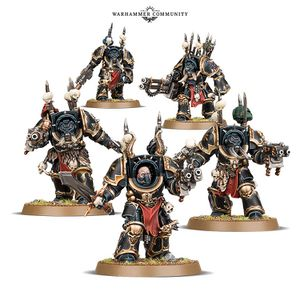
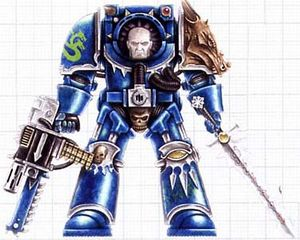
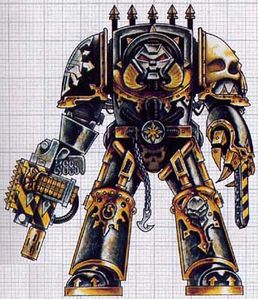
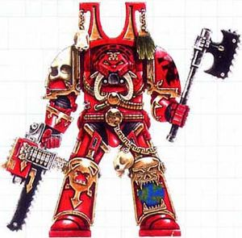
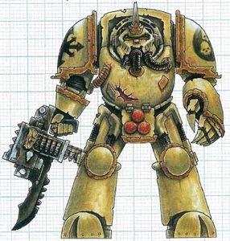
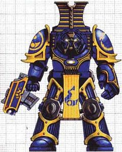
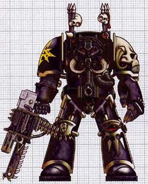

# 0527 混沌终结者 Chaos Terminators

精校状态：中文行文已逐段精校，部分术语仍为暂定

分类：组织 / 混沌 Chaos / 混沌诸神 Chaos Gods / 混沌星际战士 Chaos Space Marine

原文来源：https://www.bilibili.com/opus/1219200344738758693

原作者：帝国神选罐头

原文时间：2026年06月29日 12:00

[返回分类目录](目录.md) · [全书目录](../../目录.md)

<!-- A0527-B0001 -->
**英文原文**

Chaos Terminators are grizzled veterans who fight wearing Tactical Dreadnought Armour of the Chaos Space Marines.

<!-- /A0527-B0001 -->

<!-- A0527-B0002 -->

原译文

混沌终结者是灰白老兵，他们穿着混沌星际战士的战术无畏盔甲作战。

**校订译文**

混沌终结者是久经沙场的老兵，身穿混沌星际战士的战术无畏甲作战。

<!-- /A0527-B0002 -->

<!-- A0527-B0003 图片 -->

<!-- A0527-B0004 -->

原译文

Traitor Cataphractii Terminators 叛徒铁骑终结者

**校订译文**

Traitor Cataphractii Terminators 叛徒铁骑终结者

<!-- /A0527-B0004 -->

<!-- A0527-B0005 -->
## Overview 概述

<!-- /A0527-B0005 -->

<!-- A0527-B0006 -->
**英文原文**

The weapons combinations available to Chaos Terminators combined with their fearsome armour make them terrifying opponents to fight against. While not the swiftest of troops, they can use a Land Raider to travel across the battlefield to positions which their weaponry will make the best impact. Otherwise they can teleport through the use of arcane technology or sorcerous powers. Often they appear ready to strike, giving their foes little chance to react.

<!-- /A0527-B0006 -->

<!-- A0527-B0007 -->

原译文

混沌终结者可用的武器组合与他们可怕的盔甲相结合，使他们成为可怕的对手。虽然他们不是敏捷的部队，但他们可以使用兰德掠袭者穿越战场，到达他们的武器将产生最佳影响的位置。除此以外，他们可以通过使用神秘技术或巫术力量进行传送。他们似乎随时准备进攻，让敌人几乎没有反应的机会。

**校订译文**

混沌终结者可选用多种武器组合，配合厚重强悍的护甲，令他们成为可怕的对手。他们行动不算迅捷，却能乘坐兰德掠袭者战车穿越战场，抵达最能发挥武器效能的位置；也可以借助奥秘科技或巫术传送。传送现身时，他们往往已准备好立即进攻，几乎不给敌人反应的机会。

<!-- /A0527-B0007 -->

<!-- A0527-B0008 图片 -->

<!-- A0527-B0009 -->

原译文

Chaos Terminator 混沌终结者

**校订译文**

Chaos Terminator 混沌终结者

<!-- /A0527-B0009 -->

<!-- A0527-B0010 -->
**英文原文**

Chaos Terminators stand in high respect to the Chaos gods. Many of them are Aspiring Champions although often the only way to acquire terminator armour is to kill the previous owner. They usually form the bodyguard of the highest ranking leader or Champion and are often seen enforcing the will of the Champion. Often they abuse their position, intimidating other members of the warband, while many simply see them as a vision to strive towards, one day assuming the mantle of Terminator themselves.

<!-- /A0527-B0010 -->

<!-- A0527-B0011 -->

原译文

混沌终结者对混沌诸神怀有高度尊敬。他们中的许多人都是野心冠军，尽管获得终结者盔甲的唯一方法通常是杀死前主人。他们通常是最高级别领导人的护卫或冠军，经常被看到执行冠军的意志。他们经常滥用自己的地位，威胁其他战帮成员，而许多人只是把他们看作是一种努力的愿景，有一天他们自己也会披上终结者的衣钵。

**校订译文**

混沌终结者颇受混沌诸神看重，其中许多人本就是野心勇士；不过，想要获得终结者甲，常常只能杀死它原先的主人。他们通常充当最高首领或混沌勇士的护卫，执行其意志，也常滥用地位恐吓战帮中的其他成员。但对许多人而言，他们仍是值得追逐的目标：有朝一日，自己也能披上终结者甲，跻身这一行列。

**校注：** 原句 stand in high respect to the Chaos gods 结构不够规范；结合段落地位与恩宠语境，译作受到诸神看重，原译仅写他们敬神。Aspiring Champions 暂定野心勇士，原稿野心冠军。

<!-- /A0527-B0011 -->

<!-- A0527-B0012 图片 -->

<!-- A0527-B0013 -->

原译文

Traitor Tartaros Terminators 叛徒冥府终结者

**校订译文**

Traitor Tartaros Terminators 叛徒冥府终结者

<!-- /A0527-B0013 -->

<!-- A0527-B0014 -->
## Chaos Terminators 混沌终结者

<!-- /A0527-B0014 -->

<!-- A0527-B0015 -->
**英文原文**

The standard Chaos Terminator armament is a Combi-Bolter and a Power Weapon which can be upgraded to either a Power Fist or Chainfist. In addition, Terminators may also take a Reaper Autocannon or Heavy Flamer in place of their Combi-Bolter. The Combi-bolter itself can be configured to function as either a Combi-Meltagun, Combi-Plasma Gun or Combi-Flamer.

<!-- /A0527-B0015 -->

<!-- A0527-B0016 -->

原译文

标准的混沌终结者武器是一把复合爆矢枪和一把动力武器，可以升级为动力拳或链锯拳。此外，终结者还可以使用收割者自动炮或重型火焰枪代替其复合爆矢枪。复合爆矢枪本身可以配置为复合热熔枪、复合等离子枪或复合火焰枪。

**校订译文**

混沌终结者的标准武装为复合爆矢枪与动力武器；后者可换为动力拳或链锯拳。他们也可用收割者自动炮或重型火焰喷射器替换复合爆矢枪，或将其配置成复合热熔枪、复合等离子枪或复合火焰枪。

**校注：** 武器选项保留所给原文版本，未按当前游戏规则改写。

<!-- /A0527-B0016 -->

<!-- A0527-B0017 图片 -->

<!-- A0527-B0018 -->

原译文

Chaos Terminators 混沌终结者

**校订译文**

Chaos Terminators 混沌终结者

<!-- /A0527-B0018 -->

<!-- A0527-B0019 -->
**英文原文**

They can also be equipped with a pair of Lightning Claws for close combat.

<!-- /A0527-B0019 -->

<!-- A0527-B0020 -->

原译文

他们还可以配备一对闪电爪进行近距离战斗。

**校订译文**

他们还可以配备一对闪电爪进行近距离战斗。

<!-- /A0527-B0020 -->

<!-- A0527-B0021 -->
**英文原文**

During the Horus Heresy, the Traitor Legions fielded units clad in Cataphractii and Tartaros pattern Terminator armour. The former were armed with combi-bolters, power fists, and grenade harnesses, but also had access to chainfists, lightning claws, heavy flamers, and power swords. The latter made use of combi-bolters and power fists, but also had access to lightning claws, chainfists, reaper autocannons, plasma blasters, heavy flamers, grenade harnesses and volkite chargers.

<!-- /A0527-B0021 -->

<!-- A0527-B0022 -->

原译文

在荷鲁斯叛乱时期，叛徒军团派出了身穿铁骑和冥府型终结者盔甲的部队。前者装备有复合爆矢枪、动力拳和背带式榴弹发射器，但也可以使用链锯拳、闪电爪、重型火焰枪和动力剑。后者使用复合爆矢枪和动力拳，但也可以使用闪电爪、链锯拳、收割者自动炮、等离子爆破枪、重型火焰枪、背带式榴弹发射器和爆燃突击铳。

**校订译文**

荷鲁斯之乱期间，叛徒军团部署过装备铁骑型与冥府型终结者甲的部队。铁骑型通常配备复合爆矢枪、动力拳与背带式榴弹发射器，也可使用链锯拳、闪电爪、重型火焰喷射器或动力剑。冥府型通常使用复合爆矢枪与动力拳，也可配备闪电爪、链锯拳、收割者自动炮、等离子爆破枪、重型火焰喷射器、背带式榴弹发射器与爆燃突击铳。

<!-- /A0527-B0022 -->

<!-- A0527-B0023 图片 -->

<!-- A0527-B0024 -->

原译文

Alpha Legion Terminator 阿尔法军团终结者

**校订译文**

Alpha Legion Terminator 阿尔法军团终结者

<!-- /A0527-B0024 -->

<!-- A0527-B0025 -->
## Variations 变体

<!-- /A0527-B0025 -->

<!-- A0527-B0026 -->
### Emperor's Children 帝皇之子

<!-- /A0527-B0026 -->

<!-- A0527-B0027 -->
**英文原文**

The Phoenix Guard were the Emperor's Children bodyguard of Fulgrim.

<!-- /A0527-B0027 -->

<!-- A0527-B0028 -->

原译文

凤凰卫队是福格瑞姆的帝皇之子护卫。

**校订译文**

凤凰卫队是帝皇之子中担任福格瑞姆护卫的部队。

<!-- /A0527-B0028 -->

<!-- A0527-B0029 -->
### Iron Warriors 钢铁勇士

<!-- /A0527-B0029 -->

<!-- A0527-B0030 图片 -->

<!-- A0527-B0031 -->

原译文

Iron Warriors Terminator 钢铁勇士终结者

**校订译文**

Iron Warriors Terminator 钢铁勇士终结者

<!-- /A0527-B0031 -->

<!-- A0527-B0032 -->
**英文原文**

The Tyranthikos were elite linebreakers of the Iron Warriors, who also deployed Tyrant Siege Terminators.

<!-- /A0527-B0032 -->

<!-- A0527-B0033 -->

原译文

僭主是钢铁勇士的精英破线者，他们还部署了暴君攻城终结者。

**校订译文**

提兰提科斯卫队是钢铁勇士的精锐破阵部队；钢铁勇士也会部署暴君攻城终结者。

**校注：** Tyranthikos 沿已有核心提兰提科斯卫队，原稿“僭主”。后半句主语指钢铁勇士，避免误将其与所有暴君攻城终结者当作同一单位。

<!-- /A0527-B0033 -->

<!-- A0527-B0034 -->
### Night Lords 午夜领主

<!-- /A0527-B0034 -->

<!-- A0527-B0035 -->
**英文原文**

The Atramentar are the elite Terminator bodyguards of the Night Lords.

<!-- /A0527-B0035 -->

<!-- A0527-B0036 -->

原译文

黑甲卫是午夜领主的精英终结者护卫。

**校订译文**

黑甲卫是午夜领主的精英终结者护卫。

<!-- /A0527-B0036 -->

<!-- A0527-B0037 -->
**英文原文**

The Contekar were Night Lords adept at sowing panic and dismay.

<!-- /A0527-B0037 -->

<!-- A0527-B0038 -->

原译文

肯特卡是善于制造恐慌和诧异的暗夜领主。

**校订译文**

肯特卡是午夜领主中善于制造恐慌与惊惧的战士。

<!-- /A0527-B0038 -->

<!-- A0527-B0039 -->
### World Eaters 吞世者

<!-- /A0527-B0039 -->

<!-- A0527-B0040 图片 -->

<!-- A0527-B0041 -->

原译文

World Eaters Cult Terminator 吞世者教派终结者

**校订译文**

World Eaters Cult Terminator 吞世者教派终结者

<!-- /A0527-B0041 -->

<!-- A0527-B0042 -->
**英文原文**

The Red Butchers were World Eaters who wore customized suits of Terminator Armour to serve as both wargear and a means of confinement.

<!-- /A0527-B0042 -->

<!-- A0527-B0043 -->

原译文

红屠夫是吞世者，他们穿着定制的终结者盔甲套装作为战争装备和监禁手段。

**校订译文**

红屠夫是穿着特制终结者甲的吞世者；这套护甲既是战具，也是束缚他们的牢笼。

<!-- /A0527-B0043 -->

<!-- A0527-B0044 -->
**英文原文**

The Indurate were World Eaters wearing suits of Saturnine Armour stolen from Loyalist corpses.

<!-- /A0527-B0044 -->

<!-- A0527-B0045 -->

原译文

坚固者是吞世者，穿着从忠诚派尸体上偷走的土星盔甲套装。

**校订译文**

坚固者是身穿土星型护甲的吞世者，这些护甲是从忠诚派尸体上夺来的。

<!-- /A0527-B0045 -->

<!-- A0527-B0046 -->
### Death Guard 死亡守卫

<!-- /A0527-B0046 -->

<!-- A0527-B0047 图片 -->

<!-- A0527-B0048 -->

原译文

Death Guard Cult Terminator 死亡守卫教派终结者

**校订译文**

Death Guard Cult Terminator 死亡守卫教派终结者

<!-- /A0527-B0048 -->

<!-- A0527-B0049 -->
**英文原文**

Blightlord Terminators serve as the disease-ridden elite of the Death Guard.

<!-- /A0527-B0049 -->

<!-- A0527-B0050 -->

原译文

疫病领主终结者是死亡守卫中疾病缠身的精英。

**校订译文**

腐毒领主终结者是死亡守卫中疾病缠身的精锐。

<!-- /A0527-B0050 -->

<!-- A0527-B0051 -->
**英文原文**

The Deathshroud are the elite bodyguards of Mortarion.

<!-- /A0527-B0051 -->

<!-- A0527-B0052 -->

原译文

死亡寿衣是莫塔里安的精英护卫

**校订译文**

死亡寿衣是莫塔里安的精英护卫

<!-- /A0527-B0052 -->

<!-- A0527-B0053 -->
### Thousand Sons 千子

<!-- /A0527-B0053 -->

<!-- A0527-B0054 图片 -->

<!-- A0527-B0055 -->

原译文

Thousand Sons Cult Terminator 千子教派终结者

**校订译文**

Thousand Sons Cult Terminator 千子教派终结者

<!-- /A0527-B0055 -->

<!-- A0527-B0056 -->
**英文原文**

Scarab Occult Terminators were once the finest psykers in the Thousand Sons, bodyguards to Magnus the Red himself. Like their brothers, they where affected by the Rubric of Ahriman spell and turned into dust. Now they stride into battle at side of their sorcerous masters. Clad in ornate armour, they are armed with Khopesh blades and Inferno Combi-Bolters. The unit has also access to Heavy Warpflamers, Soulreaper Cannons and Hellfyre Missile Racks. The Sorcerer leading his unit also wields a Force staff.

<!-- /A0527-B0056 -->

<!-- A0527-B0057 -->

原译文

圣甲虫密会终结者曾经是千子中最优秀的灵能者，是赤红之马格努斯本人的护卫。像他们的兄弟一样，他们受到阿里曼的红字法术的影响，变成了尘土。现在，他们大步走向战斗，站在他们的巫术主人一边。他们身穿华丽的盔甲，装备着霍佩什镰刃和地狱火复合爆矢枪。该单位还可以使用重型次元魔焰枪、灵魂收割者炮和地狱火导弹架。领导单位的巫师也挥舞一把灵能杖。

**校订译文**

圣甲虫终结者曾是千子中最优秀的灵能者，也是红魔马格努斯本人的护卫。与同袍一样，他们受到阿里曼红字法术的影响，化为尘埃。如今，他们追随巫师主人踏入战场，身披华丽护甲，装备霍佩什镰刃与地狱火复合爆矢枪，也可使用重型次元魔焰枪、灵魂收割者炮及地狱火导弹架。率领他们的巫师还会持有灵能杖。

**校注：** Scarab Occult Terminators 官译圣甲虫终结者（GW-09 第36页；GW-10 第35页），原稿圣甲虫密会终结者。组织Scar​ab Occult的短名需另依550篇语境。

<!-- /A0527-B0057 -->

<!-- A0527-B0058 -->
### Sons of Horus/Black Legion 荷鲁斯之子/黑色军团

<!-- /A0527-B0058 -->

<!-- A0527-B0059 图片 -->

<!-- A0527-B0060 -->

原译文

Black Legion Terminator 黑色军团终结者

**校订译文**

Black Legion Terminator 黑色军团终结者

<!-- /A0527-B0060 -->

<!-- A0527-B0061 -->
**英文原文**

The Justaerin were the Terminator elite of the Luna Wolves and later Sons of Horus.

<!-- /A0527-B0061 -->

<!-- A0527-B0062 -->

原译文

加斯塔林是影月苍狼和后来的荷鲁斯之子的终结者精英。

**校订译文**

加斯塔林是影月苍狼、以及后来荷鲁斯之子军团的终结者精锐。

<!-- /A0527-B0062 -->

<!-- A0527-B0063 -->
**英文原文**

The Bringers of Despair are the modern Terminator elite of Abaddon the Despoiler.

<!-- /A0527-B0063 -->

<!-- A0527-B0064 -->

原译文

绝望使者是掠夺者阿巴顿的最新的终结者精英。

**校订译文**

绝望使者是当今掠夺者阿巴顿麾下的终结者精锐。

<!-- /A0527-B0064 -->

<!-- A0527-B0065 -->
### Word Bearers 怀言者

<!-- /A0527-B0065 -->

<!-- A0527-B0066 -->
**英文原文**

The Phraetus Anointed were Daemonically-possessed, Saturnine Armour-wearing Word Bearers.

<!-- /A0527-B0066 -->

<!-- A0527-B0067 -->

原译文

弗拉图斯受膏者是被恶魔附身，身穿土星盔甲的怀言者。

**校订译文**

弗拉图斯受膏者是被恶魔附身、穿着土星型护甲的怀言者。

<!-- /A0527-B0067 -->

<!-- A0527-B0068 -->
### Red Corsairs 红海盗

<!-- /A0527-B0068 -->

<!-- A0527-B0069 -->
**英文原文**

The Huscarls are the Terminator elite of Huron Blackheart within the Red Corsairs.

<!-- /A0527-B0069 -->

<!-- A0527-B0070 -->

原译文

侍卫是红海盗中休伦·黑心的终结者精英。

**校订译文**

侍卫是红海盗中为休伦·黑心效力的终结者精锐。

<!-- /A0527-B0070 -->

本篇核心术语与暂定项

以下列出本篇出现的英文原形及核心术语表用词。同形词可能指不同对象，具体词义以本篇正文和校注为准；单复数、别名和仅见于图注的名称可能尚未列入。完整候选见[术语表](../../术语表/双语术语候选.csv)。

| 英文 | 采用中文 | 状态 |
| --- | --- | --- |
| Space Marines | 星际战士 | 官方已核对 |
| Chaos Space Marines | 混沌星际战士 | 官方已核对 |
| Death Guard | 死亡守卫 | 官方已核对 |
| Thousand Sons | 千子 | 官方已核对 |
| World Eaters | 吞世者 | 官方已核对 |
| Terminator | 终结者 | 官方已核对 |
| Horus Heresy | 荷鲁斯之乱 | 官方已核对 |
| Sorcerer | 巫师 | 官方已核对 |
| Emperor | 帝皇 | 官方已核对 |
| Word Bearers | 怀言者 | 暂定·官方待核 |
| Emperor's Children | 帝皇之子 | 官方已核对 |
| Iron Warriors | 钢铁勇士 | 暂定·官方待核 |
| Night Lords | 午夜领主 | 暂定·官方待核 |
| Mortarion | 莫塔里安 | 官方已核对 |
| Luna Wolves | 影月苍狼 | 暂定·官方待核 |
| Horus | 荷鲁斯 | 暂定·官方待核 |
| Sons of Horus | 荷鲁斯之子 | 暂定·官方待核 |
| Fulgrim | 福格瑞姆 | 官方已核对 |
| Magnus the Red | 红魔马格努斯 | 官方已核对 |
| Luna | 月球 | 暂定·官方待核 |
| Land Raider | 兰德掠袭者战车 | 官方已核对 |
| Tyranthikos | 提兰提科斯卫队 | 暂定·官方待核 |
| Adept | 帝国任职者（广义）／文吏（行政语境） | 语境定译·官方待核 |
| Justaerin | 加斯塔林 | 暂定·官方待核 |
| Champion | 冠军 | 暂定·官方待核 |
| Despoiler | 劫掠者 | 暂定·官方待核 |
| Terminators | 终结者 | 暂定·官方待核 |
| Bringers of Despair | 绝望使者 | 暂定·官方待核 |
| Anointed | 受膏者 | 暂定·官方待核 |
| Powers | 能天使 | 暂定·官方待核 |
| Flamers | 火妖（奸奇单位）／火焰喷射器（武器） | 语境定译·对应官译已核 |
| Abaddon the Despoiler | 掠夺者阿巴顿 | 官方已核对 |
| Blightlord Terminators | 腐毒领主终结者 | 官方已核对 |
| Raider | 掠袭者飞艇 | 官方已核对 |
| Contekar | 肯特卡 | 暂定·官方待核 |
| Indurate | 坚固者 | 暂定·官方待核 |
| Saturnine Armour | 土星型护甲 | 暂定·官方待核 |
| Phraetus Anointed | 弗拉图斯受膏者 | 暂定·官方待核 |
| Scarab Occult Terminators | 圣甲虫终结者 | 官方已核对 |
| Dreadnought | 无畏机甲 | 暂定·官方待核 |
| Reaper | 收割者号 | 暂定·官方待核 |
| Scarab Occult | 圣甲虫密会 | 暂定·官方待核 |
| Gun | 甘 | 暂定·官方待核 |
| Huron Blackheart | 休伦·黑心 | 官方已核对 |
| Combi-Bolter | 复合爆矢枪 | 暂定·官方待核 |
| Combi-Flamer | 复合喷火器 | 暂定·官方待核 |
| Combi-Plasma Gun | 复合等离子枪 | 暂定·官方待核 |
| Force Staff | 灵能权杖 | 暂定·官方待核 |
| Autocannon | 自动炮 | 暂定·官方待核 |
| Phoenix Guard | 凤凰卫队 | 暂定·官方待核 |
| Reaper Autocannon | 收割者自动炮 | 暂定·官方待核 |
| Bolter | 爆矢枪 | 暂定·官方待核 |
| Flamer | 火焰喷射器（武器）／火妖（奸奇单位） | 语境定译·对应官译已核 |
| Heavy flamer | 重型火焰喷射器 | 官方已核对 |
| Meltagun | 热熔枪 | 官方已核对 |
| Grenade | 手榴弹 | 暂定·官方待核 |
| Plasma gun | 等离子枪 | 官方已核对 |
| Power fist | 动力拳 | 官方已核对 |
| Power weapon | 动力武器 | 官方已核对 |
| Terminator Armour | 终结者盔甲 | 暂定·官方待核 |
| Tartaros Pattern | 冥府型 | 暂定·官方待核 |

