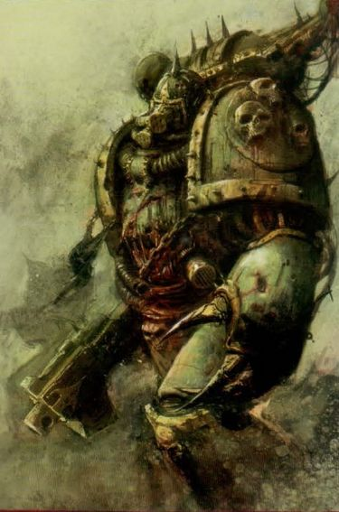
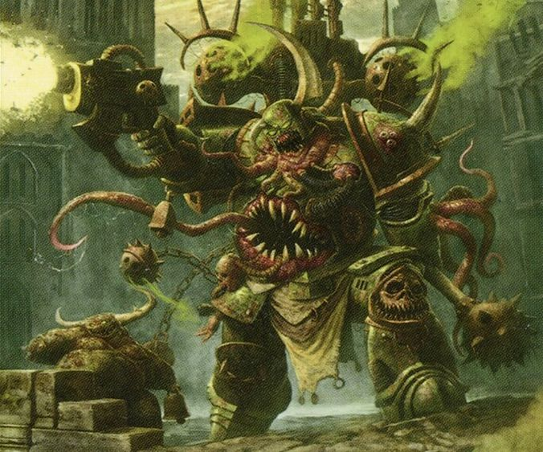
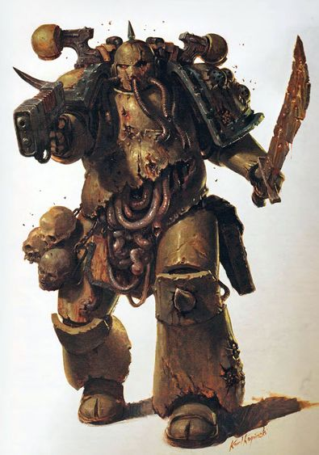
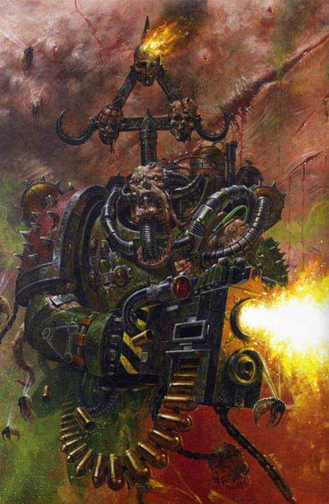
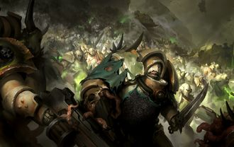

# 0528 瘟疫战士 Plague Marines

精校状态：中文行文已逐段精校，部分术语仍为暂定

分类：组织 / 混沌 Chaos / 混沌诸神 Chaos Gods / 混沌星际战士 Chaos Space Marine

原文来源：https://www.bilibili.com/opus/1206583453101850677

原作者：帝国神选罐头

原文时间：2026年05月26日 12:00

[返回分类目录](目录.md) · [全书目录](../../目录.md)

<!-- A0528-B0001 -->
**英文原文**

Plague Marines are Chaos Space Marines dedicated to the Chaos God Nurgle.

<!-- /A0528-B0001 -->

<!-- A0528-B0002 -->

原译文

瘟疫战士是献身于混沌之神纳垢的混沌星际战士。

**校订译文**

瘟疫战士是献身于混沌之神纳垢的混沌星际战士。

<!-- /A0528-B0002 -->

<!-- A0528-B0003 图片 -->

<!-- A0528-B0004 -->

原译文

Plague Marine 瘟疫战士

**校订译文**

Plague Marine 瘟疫战士

<!-- /A0528-B0004 -->

<!-- A0528-B0005 -->
## Description 描述

<!-- /A0528-B0005 -->

<!-- A0528-B0006 -->
**英文原文**

Within their corpulent and disgusting armour their bodies are bloated with disease, swollen with corruption and rank with decay. Their weaponry and equipment may be pitted with decay and corroding away, but they are still terrifying opponents. They have an inhuman tolerance for pain, enduring injuries that would cripple other Marines, their nerves dulled by disease or even partly rotted away.

<!-- /A0528-B0006 -->

<!-- A0528-B0007 -->

原译文

在他们臃肿恶心的盔甲里，他们的身体因疾病而肿胀，因腐化和腐朽的等级而膨胀。他们的武器和装备可能已经腐朽和腐蚀，但他们仍然是可怕的对手。他们对疼痛有着非人的忍耐力，忍受着会削弱其他战士的伤害，他们的神经因疾病而迟钝，甚至部分腐烂。

**校订译文**

在臃肿污秽的护甲内，瘟疫战士的肉体因疾病与腐化而肿胀，散发着腐烂恶臭。他们的武器装备虽被侵蚀得坑洼斑驳，甚至逐渐锈坏，却丝毫不减其可怕。他们的神经被疾病麻痹，有些甚至已经腐烂，因此能忍受超乎常人的痛苦，承受足以使其他星际战士失去战斗力的创伤。

**校注：** rank with decay 中 rank 指腐臭，原稿错译“腐朽的等级”。

<!-- /A0528-B0007 -->

<!-- A0528-B0008 图片 -->

<!-- A0528-B0009 -->

原译文

Plague Marine Astartes Warrior 瘟疫战士阿斯塔特战士

**校订译文**

Plague Marine Astartes Warrior 阿斯塔特瘟疫战士

<!-- /A0528-B0009 -->

<!-- A0528-B0010 -->
**英文原文**

Plague Marines normally appear armed with some manner of boltgun with which they unleash a steady rain of firepower, but may carry other weapons. They also often arm themselves with some form of close-combat blade that can communicate Nurgle's Rot to the victim.

<!-- /A0528-B0010 -->

<!-- A0528-B0011 -->

原译文

瘟疫战士通常配备某种爆矢枪，用它可以释放源源不断的火力，但也可能携带其他武器。他们还经常用某种形式的近战刀刃武装自己，可以将纳垢之腐传染给受害者。

**校订译文**

瘟疫战士通常使用某种爆矢枪，倾泻稳定持续的火力，也可能携带其他武器。他们还常配备能将纳垢之腐传染给受害者的近战利刃。

<!-- /A0528-B0011 -->

<!-- A0528-B0012 图片 -->

<!-- A0528-B0013 -->

原译文

Plague Marine 瘟疫战士

**校订译文**

Plague Marine 瘟疫战士

<!-- /A0528-B0013 -->

<!-- A0528-B0014 -->
**英文原文**

They make up much of the numbers of the Death Guard Legion, but not all Plague Marines are Death Guard; any Chaos Space Marine who dedicates himself to Nurgle may become a Plague Marine. The art of producing true Plague Marines is rare however, and few outside of the Death Guard know its secret. However Abaddon the Despoiler has won many of the Death Guard's Sorcerers to his cause, and as a result the Black Legion is known to field substantial numbers of these foul warriors.

<!-- /A0528-B0014 -->

<!-- A0528-B0015 -->

原译文

他们在死亡守卫军团中占很大比例，但并非所有瘟疫战士都是死亡守卫；任何献身于纳垢的混沌星际战士都可能成为瘟疫战士。然而，培养真正的瘟疫战士的技艺是罕见的，除了死亡守卫之外，很少有人知道它的秘密。然而，掠夺者阿巴顿为他的事业赢得了许多死亡守卫的巫师，因此，众所周知，黑色军团派出了大量这些难闻的战士。

**校订译文**

死亡守卫的大部分成员都是瘟疫战士，但瘟疫战士并不全都出自死亡守卫；任何献身纳垢的混沌星际战士都有可能成为其中一员。不过，真正制造瘟疫战士的技艺罕为人知，死亡守卫之外很少有人掌握其秘密。掠夺者阿巴顿成功招揽了多位死亡守卫巫师，因此黑色军团也能部署大量这种污秽的战士。

<!-- /A0528-B0015 -->

<!-- A0528-B0016 图片 -->

<!-- A0528-B0017 -->

原译文

Plague Marine 瘟疫战士

**校订译文**

Plague Marine 瘟疫战士

<!-- /A0528-B0017 -->

<!-- A0528-B0018 -->
## History 历史

<!-- /A0528-B0018 -->

<!-- A0528-B0019 -->
**英文原文**

The first Plague Marines were members of the Death Guard during the Horus Heresy. Horus planned for the Death Guard to form part of the invasion force he would lead to attack Terra. Determined to join the Warmaster’s siege of the Imperial Palace, Mortarion led his fleet into the Warp. He did not know that he was entering an eternal nightmare from which he would never escape. The fleet was trapped and becalmed in the midst of an impenetrable Warp storm. No one could guide the ships through the murk, and they were unable to shift the fleet back into realspace. Few knew this was truly a part of Calas Typhon’s plan. The entire fleet was forced to drift helplessly through the Immaterium. Without hope of salvation, their warships moved aimlessly. It was during this time that the infections of Nurgle began to silently assail the Death Guard. One by one, the Destroyer Plague and Nurgle’s Rot – two of the favoured inventions of the Plaguefather – infiltrated their ships. Had they been any other Legion, the Death Guard would have succumbed to the horrific maladies that beset them. Instead, the superhuman augmentations of the Space Marines proved their worst enemy; their own legendary resilience was rendered into a flaw for, despite the dire diseases which now polluted their every bodily function, they could not die. Instead, the Death Guard were slowly, sickeningly transformed. Unable to endure the suffering any longer, Mortarion first offered into the Immaterium himself, followed by his Legion, and finally his very soul in exchange for deliverance. A presence in the Immaterium answered, as though it had been waiting all along, biding its time. In the depths of the Warp, the great god Nurgle, Lord of Decay and Father of Disease, claimed that debt and accepted Mortarion and the Death Guard as his own. Thus were born the first Plague Marines.

<!-- /A0528-B0019 -->

<!-- A0528-B0020 -->

原译文

第一批瘟疫战士是荷鲁斯叛乱时期的死亡守卫成员。荷鲁斯计划让死亡守卫成为他将率领的入侵部队的一部分，以攻击泰拉。决心加入战帅对帝国皇宫的围攻，莫塔里安带领他的舰队进入了亚空间。他不知道自己正在进入一场永远无法逃脱的噩梦。舰队被困在一场无法穿越的亚空间风暴中，停滞不前。没有人能引导船只穿过黑暗，他们也无法将舰队转移回现实空间。很少有人知道这真的是卡拉斯·提丰计划的一部分。整个舰队被迫无助地漂流通过非物质界。没有得救的希望，他们的战舰漫无目的地前进。正是在这段时间里，纳垢的感染开始悄悄地袭击死亡守卫。毁灭者瘟疫和纳垢之腐 — 瘟疫之父最喜欢的两项发明 — 一个接一个地渗入了他们的船只。如果他们是其他军团，死亡守卫就会死于困扰他们的可怕疾病。相反，星际战士的超人增强证明了他们最大的敌人；他们自己传奇般的恢复力变成了一个缺陷，因为尽管可怕的疾病现在污染了他们的每一个身体功能，但他们不会死。相反，死亡守卫慢慢地、令人厌恶地转变了。由于无法再忍受痛苦，莫塔里安首先亲自进入非物质界，随后是他的军团，最后是他的灵魂，以换取解脱。非物质界里的一个存在回答，好像它一直在等待，等待时机。在亚空间的深处，伟大之神，腐朽领主和疾病之父纳垢声称了这笔债务，并接受了莫塔里安和死亡守卫作为它自己的。第一批瘟疫战士就这样诞生了。

**校订译文**

最初的瘟疫战士诞生于荷鲁斯之乱时期的死亡守卫军团。荷鲁斯原计划让他们参与进攻泰拉；莫塔里安一心要加入战帅对帝国皇宫的围攻，便率舰队跃入亚空间，却不知自己正步入一场永远无法挣脱的噩梦。舰队被困于无法穿越的亚空间风暴，停滞不前：无人能引导航船穿过幽暗，也无法返回现实空间。鲜有人知，这其实是卡拉斯·提丰计划的一部分。整个舰队只能在非物质界中无助漂流，毫无获救的希望。就在此时，纳垢的瘟疫悄然侵袭死亡守卫。毁灭者瘟疫与纳垢之腐——瘟疫之父最钟爱的两种造物——接连渗入战舰。换作其他军团，恐怕早已死于这些可怖疾病；死亡守卫的超人改造却反成了最大的敌人。他们引以为傲的顽强体质成了诅咒：尽管疾病污染了每一项身体机能，他们仍无法死去，只能缓慢而痛苦地发生令人作呕的变化。莫塔里安再也无法承受折磨，先向亚空间中的存在献上自己，再献上整个军团，最终连灵魂也愿交出，只求获得解脱。非物质界中的某个存在回应了他，仿佛早已等候多时。亚空间深处，腐朽领主、疾病之父纳垢收取了这份代价，将莫塔里安及死亡守卫据为己有。第一批瘟疫战士就此诞生。

**校注：** offered ... himself 为献祭、献上自身，不是他先进入非物质界；舰队此前已在亚空间。按英文还原逐步献出自身、军团与灵魂的顺序。Calas Typhon 为人物旧名，保留卡拉斯·提丰，不机械替换成其后 Typhus 官译泰弗斯。

<!-- /A0528-B0020 -->

<!-- A0528-B0021 图片 -->

<!-- A0528-B0022 -->

原译文

Plague Marine Forces 瘟疫战士部队

**校订译文**

Plague Marine Forces 瘟疫战士部队

<!-- /A0528-B0022 -->

<!-- A0528-B0023 -->
## Weaponry 武器

<!-- /A0528-B0023 -->

<!-- A0528-B0024 -->
**英文原文**

Many of the weapons employed by the Plague Marines transmit horrific and deadly maladies. They are wicked devices of death designed to please Nurgle and bring about both death and suffering. These weapons include:

<!-- /A0528-B0024 -->

<!-- A0528-B0025 -->

原译文

瘟疫战士使用的许多武器都会传播可怕而致命的疾病。它们是邪恶的死亡装置，旨在取悦纳垢，并带来死亡和痛苦。这些武器包括：

**校订译文**

瘟疫战士使用的许多武器都会传播骇人而致命的疾病。这些邪恶的杀戮器具旨在取悦纳垢，同时制造死亡与苦痛，具体包括：

<!-- /A0528-B0025 -->

<!-- A0528-B0026 -->

原译文

Bile Flamer 胆汁喷射器

**校订译文**

Bile Flamer 胆汁喷射器

<!-- /A0528-B0026 -->

<!-- A0528-B0027 -->

原译文

Blight Grenade 枯萎手榴弹

**校订译文**

Blight Grenade 枯萎手榴弹

<!-- /A0528-B0027 -->

<!-- A0528-B0028 -->

原译文

Blight Launcher 枯萎发射器

**校订译文**

Blight Launcher 枯萎发射器

<!-- /A0528-B0028 -->

<!-- A0528-B0029 -->

原译文

Bolters 爆矢枪

**校订译文**

Bolters 爆矢枪

<!-- /A0528-B0029 -->

<!-- A0528-B0030 -->

原译文

Bolt Pistols 爆矢手枪

**校订译文**

Bolt Pistols 爆矢手枪

<!-- /A0528-B0030 -->

<!-- A0528-B0031 -->

原译文

Bubotic Axe 疫病之斧

**校订译文**

Bubotic Axe 疫病之斧

<!-- /A0528-B0031 -->

<!-- A0528-B0032 -->

原译文

Flail of Corruption 腐蚀链枷

**校订译文**

Flail of Corruption 腐蚀链枷

<!-- /A0528-B0032 -->

<!-- A0528-B0033 -->

原译文

Great Plague Cleaver 大瘟疫屠刀

**校订译文**

Great Plague Cleaver 大瘟疫屠刀

<!-- /A0528-B0033 -->

<!-- A0528-B0034 -->

原译文

Krak Grenade 穿甲手榴弹

**校订译文**

Krak Grenade 穿甲手榴弹

<!-- /A0528-B0034 -->

<!-- A0528-B0035 -->

原译文

Mace of Contagion 传染之杖

**校订译文**

Mace of Contagion 传染之锤

**校注：** Mace 指锤类钝击武器，原稿“杖”不准确；暂定传染之锤，待官方整名核对。

<!-- /A0528-B0035 -->

<!-- A0528-B0036 -->

原译文

Meltaguns 热熔枪

**校订译文**

Meltaguns 热熔枪

<!-- /A0528-B0036 -->

<!-- A0528-B0037 -->

原译文

Plague Belcher 瘟疫发射器

**校订译文**

Plague Belcher 瘟疫发射器

<!-- /A0528-B0037 -->

<!-- A0528-B0038 -->

原译文

Plague Knife 瘟疫刀

**校订译文**

Plague Knife 瘟疫刀

<!-- /A0528-B0038 -->

<!-- A0528-B0039 -->

原译文

Plague Spewer 瘟疫喷射器

**校订译文**

Plague Spewer 瘟疫喷射器

<!-- /A0528-B0039 -->

<!-- A0528-B0040 -->

原译文

Plague Sword 瘟疫剑

**校订译文**

Plague Sword 瘟疫剑

<!-- /A0528-B0040 -->

<!-- A0528-B0041 -->

原译文

Plasma Guns 等离子枪

**校订译文**

Plasma Guns 等离子枪

<!-- /A0528-B0041 -->

<!-- A0528-B0042 -->

原译文

Plasma Pistols 等离子手枪

**校订译文**

Plasma Pistols 等离子手枪

<!-- /A0528-B0042 -->

<!-- A0528-B0043 -->
## Notable Plague Marines 著名瘟疫战士

<!-- /A0528-B0043 -->

<!-- A0528-B0044 -->

原译文

Corpulax 科尔普拉克斯

**校订译文**

Corpulax 科尔普拉克斯

<!-- /A0528-B0044 -->

<!-- A0528-B0045 -->

原译文

Dragan 德拉甘

**校订译文**

Dragan 德拉甘

<!-- /A0528-B0045 -->

<!-- A0528-B0046 -->

原译文

Garstag 加尔斯塔格

**校订译文**

Garstag 加尔斯塔格

<!-- /A0528-B0046 -->

<!-- A0528-B0047 -->

原译文

Lethrax 莱斯拉克斯

**校订译文**

Lethrax 莱斯拉克斯

<!-- /A0528-B0047 -->

本篇核心术语与暂定项

以下列出本篇出现的英文原形及核心术语表用词。同形词可能指不同对象，具体词义以本篇正文和校注为准；单复数、别名和仅见于图注的名称可能尚未列入。完整候选见[术语表](../../术语表/双语术语候选.csv)。

| 英文 | 采用中文 | 状态 |
| --- | --- | --- |
| Space Marines | 星际战士 | 官方已核对 |
| Chaos Space Marines | 混沌星际战士 | 官方已核对 |
| Death Guard | 死亡守卫 | 官方已核对 |
| Boltgun | 爆矢枪 | 官方已核对 |
| Horus Heresy | 荷鲁斯之乱 | 官方已核对 |
| Warp | 亚空间 | 官方已核对 |
| Nurgle | 纳垢 | 官方已核对 |
| Equipment | 装备 | 编辑用语已统一 |
| Black Legion | 黑色军团 | 暂定·官方待核 |
| Plague Marine | 瘟疫战士 | 官方已核对 |
| Mortarion | 莫塔里安 | 官方已核对 |
| Terra | 泰拉 | 暂定·官方待核 |
| Horus | 荷鲁斯 | 暂定·官方待核 |
| Deliverance | 拯救星 | 暂定·官方待核 |
| Calas Typhon | 卡拉斯·提丰 | 暂定·官方待核 |
| Despoiler | 劫掠者 | 暂定·官方待核 |
| Destroyer | 毁灭者 | 暂定·官方待核 |
| Space Marine | 星际战士 | 暂定·官方待核 |
| Abaddon the Despoiler | 掠夺者阿巴顿 | 官方已核对 |
| Plague Marines | 瘟疫战士 | 官方已核对 |
| Nurgle’s Rot | 纳垢之腐 | 暂定·官方待核 |
| Destroyer Plague | 毁灭者瘟疫 | 暂定·官方待核 |
| Warp Storm | 亚空间风暴 | 暂定·官方待核 |
| Corruption | 腐败 | 暂定·官方待核 |

