# 0529 III - 帝皇之子 Emperor's Children

精校状态：中文行文已逐段精校，部分术语仍为暂定

分类：组织 / 混沌 Chaos / 混沌诸神 Chaos Gods / 混沌星际战士 Chaos Space Marine

原文来源：https://www.bilibili.com/opus/1091876258303705089

原作者：帝国神选罐头

原文时间：编辑于 2025年08月17日 11:35

[返回分类目录](目录.md) · [全书目录](../../目录.md)

<!-- A0529-B0001 -->
**英文原文**

The Emperor's Children were the III Legion of the twenty original Space Marine Legions, also known after their fall as the Lords of Profligacy. Their Primarch is Fulgrim. One of the nine legions that betrayed the Emperor during the Horus Heresy, they became Chaos Space Marines. They worship the Chaos god Slaanesh and are hedonistic psychopaths who live for experiences of excess.

<!-- /A0529-B0001 -->

<!-- A0529-B0002 -->

原译文

帝皇之子是20个原初星际战士军团中的第三军团，在他们堕落后也被称为放荡领主。他们的原体是福格瑞姆。在荷鲁斯叛乱期间背叛帝皇的九个军团之一，他们成为了混沌星际战士。他们崇拜混沌之神色孽，是享乐主义的精神病，为极度的刺激而活。

**校订译文**

帝皇之子是最初二十支星际战士军团中的第三军团，原体为福格瑞姆，堕落后又被称为放荡领主。他们是荷鲁斯之乱中背叛帝皇的九支军团之一，此后成为混沌星际战士。他们崇拜混沌之神色孽，沉迷享乐、心智扭曲，只为追逐极端体验而活。

<!-- /A0529-B0002 -->

<!-- A0529-B0003 图片 -->
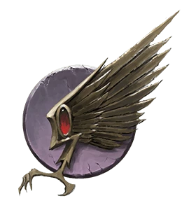

<!-- A0529-B0004 图片 -->
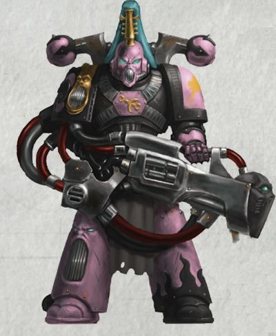

<!-- A0529-B0005 -->
**英文原文**

Legion Number:III

<!-- /A0529-B0005 -->

<!-- A0529-B0006 -->

原译文

军团编号：III

**校订译文**

军团编号：III

<!-- /A0529-B0006 -->

<!-- A0529-B0007 -->
**英文原文**

Primarch:Fulgrim

<!-- /A0529-B0007 -->

<!-- A0529-B0008 -->

原译文

原体：福格瑞姆

**校订译文**

原体：福格瑞姆

<!-- /A0529-B0008 -->

<!-- A0529-B0009 -->
**英文原文**

Homeworld:Chemos

<!-- /A0529-B0009 -->

<!-- A0529-B0010 -->

原译文

家园世界：彻莫斯

**校订译文**

家园世界：彻莫斯

<!-- /A0529-B0010 -->

<!-- A0529-B0011 -->
**英文原文**

Current Base:Eye of Terror

<!-- /A0529-B0011 -->

<!-- A0529-B0012 -->

原译文

当前基地：恐惧之眼

**校订译文**

当前基地：恐惧之眼

<!-- /A0529-B0012 -->

<!-- A0529-B0013 -->
**英文原文**

Chaos Affiliation:Slaanesh

<!-- /A0529-B0013 -->

<!-- A0529-B0014 -->

原译文

混沌隶属：色孽

**校订译文**

混沌隶属：色孽

<!-- /A0529-B0014 -->

<!-- A0529-B0015 -->
**英文原文**

Colours:Pink, Black and Gold (formerly Purple and Gold)

<!-- /A0529-B0015 -->

<!-- A0529-B0016 -->

原译文

颜色：粉色，黑色和金色（前身为紫色和金色）

**校订译文**

配色：粉色、黑色与金色；原为紫色与金色。

<!-- /A0529-B0016 -->

<!-- A0529-B0017 -->
**英文原文**

Specialty:Combined arms, maneuver warfare, and asymmetric assault (Heresy-era)，Sonic Weaponry, Demoralization (Post-Heresy)

<!-- /A0529-B0017 -->

<!-- A0529-B0018 -->

原译文

专长：联合作战、机动战、非对称攻击（异端时期）、声波武器、纪律松弛（叛乱后）

**校订译文**

专长：诸兵种协同、机动作战与非对称突击（叛乱时期）；声波武器与瓦解敌军士气（叛乱后）。

**校注：** Demoralization 为打击或瓦解敌人士气，原稿“纪律松弛”完全改变了专长含义。

<!-- /A0529-B0018 -->

<!-- A0529-B0019 -->
**英文原文**

Battle Cry:Children of the Emperor! Death to his foes!

<!-- /A0529-B0019 -->

<!-- A0529-B0020 -->

原译文

战吼：帝皇之子，斩父之敌

**校订译文**

战吼：帝皇之子，斩父之敌

<!-- /A0529-B0020 -->

<!-- A0529-B0021 -->
**英文原文**

Known Warbands:

<!-- /A0529-B0021 -->

<!-- A0529-B0022 -->

原译文

著名战帮

**校订译文**

著名战帮

<!-- /A0529-B0022 -->

<!-- A0529-B0023 -->

原译文

12th Millennial 第十二千人队

**校订译文**

12th Millennial 第十二千人队

<!-- /A0529-B0023 -->

<!-- A0529-B0024 -->

原译文

The Adored 被崇拜者

**校订译文**

The Adored 被崇拜者

<!-- /A0529-B0024 -->

<!-- A0529-B0025 -->

原译文

Black Crusade of Jihar the Lacerator 撕裂者扎哈尔的黑色远征

**校订译文**

Black Crusade of Jihar the Lacerator 撕裂者吉哈尔的黑色远征

**校注：** Jihar 沿第509篇撕裂者吉哈尔，不再混用扎哈尔。

<!-- /A0529-B0025 -->

<!-- A0529-B0026 -->

原译文

Choir of Aberrance 畸变合唱团

**校订译文**

Choir of Aberrance 畸变合唱团

<!-- /A0529-B0026 -->

<!-- A0529-B0027 -->
**英文原文**

Cohors Nasicae – the Warhost of Lucius the Eternal

<!-- /A0529-B0027 -->

<!-- A0529-B0028 -->

原译文

纳希凯大队 - 不灭者卢修斯的战帮

**校订译文**

纳希凯大队 - 不灭者卢修斯的战帮

<!-- /A0529-B0028 -->

<!-- A0529-B0029 -->
**英文原文**

The Consortium – The followers of Fabius Bile

<!-- /A0529-B0029 -->

<!-- A0529-B0030 -->

原译文

共同体 — 法比乌斯·拜尔的追随者

**校订译文**

共同体 — 法比乌斯·拜尔的追随者

<!-- /A0529-B0030 -->

<!-- A0529-B0031 -->

原译文

Creations of Bile 拜尔造物

**校订译文**

Creations of Bile 拜尔造物

<!-- /A0529-B0031 -->

<!-- A0529-B0032 -->

原译文

The Faultless 无缺者

**校订译文**

The Faultless 无缺者

**校注：** Faultless、Flawless、The Flawless Host 在此分别出现，暂保留无缺者、无暇、无暇大军的区分，不因字面相似合并不同战帮。

<!-- /A0529-B0032 -->

<!-- A0529-B0033 -->
**英文原文**

Flawless – Leaders of the Incarnadine Host greater warband

<!-- /A0529-B0033 -->

<!-- A0529-B0034 -->

原译文

无暇 — 血色之主大战帮的领导者

**校订译文**

无暇——大型战帮“血色大军”的领导者。

**校注：** Incarnadine Host 为大型战帮，Host 指军队，原稿血色之主误解为个人；暂定血色大军。

<!-- /A0529-B0034 -->

<!-- A0529-B0035 -->

原译文

Flickering Blades 闪烁之刃

**校订译文**

Flickering Blades 闪烁之刃

<!-- /A0529-B0035 -->

<!-- A0529-B0036 -->

原译文

Fulgrim's Song 福格瑞姆之歌

**校订译文**

Fulgrim's Song 福格瑞姆之歌

<!-- /A0529-B0036 -->

<!-- A0529-B0037 -->

原译文

Glittering Myriad 无量闪光

**校订译文**

Glittering Myriad 无量闪光

<!-- /A0529-B0037 -->

<!-- A0529-B0038 -->

原译文

Golden Host 黄金之主

**校订译文**

Golden Host 黄金大军

**校注：** Golden Host 原稿列于帝皇之子战帮；第509篇同名又见恶魔战帮。两处均译黄金大军，但名称相同不视为已证实是同一组织。

<!-- /A0529-B0038 -->

<!-- A0529-B0039 -->

原译文

Hex-Clawed Phoenix 六爪凤凰

**校订译文**

Hex-Clawed Phoenix 六爪凤凰

<!-- /A0529-B0039 -->

<!-- A0529-B0040 -->

原译文

Konstrictus 绞缠者

**校订译文**

Konstrictus 绞缠者

<!-- /A0529-B0040 -->

<!-- A0529-B0041 -->

原译文

Mirrorhost 镜之主

**校订译文**

Mirrorhost 镜像大军

**校注：** Mirrorhost 为战帮专名，host 非主人；暂定镜像大军，原稿镜之主。

<!-- /A0529-B0041 -->

<!-- A0529-B0042 -->

原译文

Pallid Raptors 苍白猛禽

**校订译文**

Pallid Raptors 苍白猛禽

<!-- /A0529-B0042 -->

<!-- A0529-B0043 -->

原译文

Phoenix Conclave 凤凰秘会

**校订译文**

Phoenix Conclave 凤凰秘会

<!-- /A0529-B0043 -->

<!-- A0529-B0044 -->

原译文

Perfecti 完美者

**校订译文**

Perfecti 完美者

<!-- /A0529-B0044 -->

<!-- A0529-B0045 -->

原译文

Ripping Nails 撕裂之钉

**校订译文**

Ripping Nails 撕裂之钉

<!-- /A0529-B0045 -->

<!-- A0529-B0046 -->

原译文

Terra's Caress‎ 泰拉之抚

**校订译文**

Terra's Caress‎ 泰拉之抚

<!-- /A0529-B0046 -->

<!-- A0529-B0047 -->

原译文

Thirsting Brethren 饥渴兄弟

**校订译文**

Thirsting Brethren 饥渴兄弟会

<!-- /A0529-B0047 -->

<!-- A0529-B0048 -->

原译文

Threnodic Choir 三重合唱团

**校订译文**

Threnodic Choir 挽歌合唱团

<!-- /A0529-B0048 -->

<!-- A0529-B0049 -->

原译文

Transcendent Spectacle 超越景象

**校订译文**

Transcendent Spectacle 超凡奇观

<!-- /A0529-B0049 -->

<!-- A0529-B0050 -->

原译文

The Vibrant Choristry‎ 生机合唱团

**校订译文**

The Vibrant Choristry‎ 生机合唱团

<!-- /A0529-B0050 -->

<!-- A0529-B0051 -->

原译文

Warband of Excrucias the Flawless 无暇者埃克斯克鲁西亚斯的战帮

**校订译文**

Warband of Excrucias the Flawless 无暇者埃克斯克鲁西亚斯的战帮

<!-- /A0529-B0051 -->

<!-- A0529-B0052 -->

原译文

Warband of the Silver Prince 白银王子的战帮

**校订译文**

Warband of the Silver Prince 白银王子的战帮

<!-- /A0529-B0052 -->

<!-- A0529-B0053 -->

原译文

Warband of Evenus 埃文纳斯的战帮

**校订译文**

Warband of Evenus 埃文纳斯的战帮

<!-- /A0529-B0053 -->

<!-- A0529-B0054 -->
## History 历史

<!-- /A0529-B0054 -->

<!-- A0529-B0055 -->
### Pre-Heresy 叛乱前

<!-- /A0529-B0055 -->

<!-- A0529-B0056 -->
### Unification Wars 统一战争

<!-- /A0529-B0056 -->

<!-- A0529-B0057 -->
**英文原文**

The earliest recruits to the Emperor's Children, then known as III Legion, were recruits gathered from Europa during the Unification Wars. Noble houses, such as House Loculus of Komarg, selected the finest of their youth and gave them to the Emperor following their defeat by his Thunder Warriors as tribute for their previous defiance. Following the Houses of Europa's lead, other noble Terran dynasties also sent their children to fight in the III Legion. This was rumoured to be the source of the Legion's adopted name, the Emperor's Children, a name that was re-affirmed later following Fulgrim's rediscovery.

<!-- /A0529-B0057 -->

<!-- A0529-B0058 -->

原译文

帝皇之子最早的新兵，当时被称为第三军团，是在统一战争期间从欧罗巴招募的新兵。贵族家族，如科马格的洛库卢斯家族，挑选了他们青年中最优秀的人才，并在他们被雷霆战士击败后将他们交给了帝皇，作为对他们之前反抗的礼物。在欧罗巴家族的带领下，其他高贵的泰拉王朝也派他们的孩子参加了第三军团的战斗。据传，这是军团采用的名字帝皇之子的来源，这个名字在福格瑞姆回归后得到了再次确认。

**校订译文**

帝皇之子最初仅称第三军团，早期新兵是在统一战争期间从欧罗巴征集的。科马格的洛库卢斯家族等贵族势力被雷霆战士击败后，便挑出族中最优秀的少年献给帝皇，以此为先前的反抗谢罪。其他泰拉贵族王朝随后效仿，也将子弟送入第三军团作战。据传，“帝皇之子”之名正源于此，并在后来寻回福格瑞姆后得到再次确认。

**校注：** 此处为帝皇之子名称来源的一种传闻；后文另述原体归来后正式命名，保留原文两种叙述层次。

<!-- /A0529-B0058 -->

<!-- A0529-B0059 图片 -->
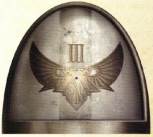

<!-- A0529-B0060 -->

原译文

Unification Era III Legion Shoulderpad 统一时期第三军团肩甲

**校订译文**

Unification Era III Legion Shoulderpad 统一时期第三军团肩甲

<!-- /A0529-B0060 -->

<!-- A0529-B0061 -->
**英文原文**

One distinction with the early days of the Emperor's Children was that they willingly cooperated with and even led the young Imperial Army into battle during the Unification Wars, something other Legions saw as disdainful. Leading "lesser" troops seemed natural for the aristocrats of the Legion. Perfectionists even before having been reunified with their Primarch, the III Legion became known to efficiently execute and exceed the Emperor's own expectations.

<!-- /A0529-B0061 -->

<!-- A0529-B0062 -->

原译文

帝皇之子早期的一个区别是，他们愿意在统一战争期间与年轻的帝国军队合作，甚至带领他们投入战斗，其他军团认为这是轻蔑的。对于军团的贵族来说，领导“较小”的军队似乎很自然。完美主义者甚至在与他们的原体重新统一之前，第三军团就以高效执行和超越帝皇的期望而闻名。

**校订译文**

早期帝皇之子的一个特点，是在统一战争期间愿意与初建的帝国军合作，甚至率领他们作战，而其他军团往往不屑如此。对军团中的贵族而言，统率“低一等”的部队本就理所当然。第三军团尚未与原体重聚时，就已经追求完美，以高效完成任务、甚至超越帝皇期望而著称。

<!-- /A0529-B0062 -->

<!-- A0529-B0063 图片 -->
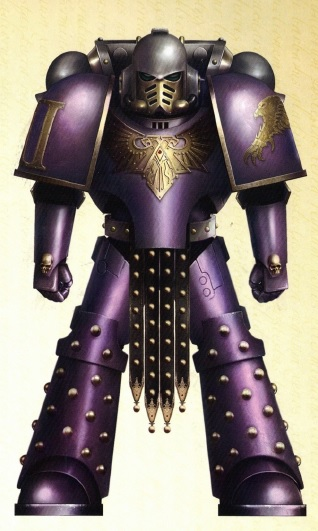

<!-- A0529-B0064 -->

原译文

Pre-Heresy Emperor's Children Marine 叛乱前帝皇之子星际战士

**校订译文**

Pre-Heresy Emperor's Children Marine 叛乱前帝皇之子星际战士

<!-- /A0529-B0064 -->

<!-- A0529-B0065 -->
### Great Crusade 大远征

<!-- /A0529-B0065 -->

<!-- A0529-B0066 -->
**英文原文**

The Legion was frequently given diplomatic and emissary-protection missions by the Emperor and were known by some as His heralds, the marines painting their armour imperial purple to signify their mission, emblazoned with a thunderbolt and rayed sun. The right to bear the Emperor's personal standard, the Palatine Aquilla, was granted following the Proximan Betrayal when the XVIth Cohort were all killed in defense of the Emperor, wounded by a Vortex weapon, during a surprise insurrectionist attack at the ceremonial plaza during the Imperial Compliance ceremonies.

<!-- /A0529-B0066 -->

<!-- A0529-B0067 -->

原译文

军团经常被帝皇授予外交和使者保护任务，并被一些人称为他的使者，星际战士将他们的盔甲涂成帝国紫色，以象征他们的使命，并饰有雷电和阳光。在普罗西莫叛乱之后，当第十六大队在帝国征服仪式期间在仪式广场遭到叛乱者的突然袭击时，为保卫帝皇而全部被杀，帝皇被涡旋武器击伤，从而获得了承载帝皇个人标志，帝国天鹰的权利。

**校订译文**

帝皇经常将外交与使节护卫任务交给第三军团，有些人因此称他们为帝皇的传令者。战士们将护甲涂为帝国紫色，绘上雷电与放射光芒的太阳，以彰显使命。在普罗西莫叛乱中，帝国归顺仪式的广场遭叛乱者突袭，帝皇被涡旋武器击伤，第十六大队为保卫祂全员战死。此后，军团获准佩戴帝皇的个人徽记——帝国天鹰。

**校注：** 保留原文“帝皇被涡旋武器击伤”这一叙述，修复军团获赐徽记权与第十六大队牺牲之间的因果。Palatine Aquilla 沿原稿帝国天鹰，英文拼写保留。

<!-- /A0529-B0067 -->

<!-- A0529-B0068 -->
**英文原文**

Despite this status, the Legion was struck with disaster within a year of Proxima following the pacification of the Selenar gene-cults of Luna and the Martian Compact, when a substantial portion of gene-seed reserve was lost during its transit to Luna. In truth, this stock was stolen by Trazyn the Infinite. It was then found that a Selenite plot had corrupted gene-seed stock held on Terra with what was known as 'the Blight', causing organ degeneration that then spread more widely in the Legion.

<!-- /A0529-B0068 -->

<!-- A0529-B0069 -->

原译文

尽管处于这种状态，但在火星契约和月球的赛琳娜基因教派平息后的一年内，军团遭受了灾难，当时大部分基因种子储备在运往月球的途中丢失。事实上，这只货物是被无限者塔拉辛偷走的。然后发现，赛琳娜教派阴谋破坏了泰拉上的基因种子库，导致了所谓的“枯萎病”，导致器官退化，然后在军团中更广泛地传播。

**校订译文**

然而，这份荣耀并未使军团免于灾难。平定月球的赛琳娜基因教派、缔结火星盟约后，在距离普罗西莫事件尚不足一年时，军团一大批基因种子储备在运往月球途中失踪；实际上，它们被无尽者塔拉辛盗走。随后又发现，月球教派的阴谋已用一种称为“枯萎病”的灾疫污染泰拉的基因种子储备。它导致器官退化，并在军团中进一步扩散。

**校注：** 恢复 within a year of Proxima 的时间基准；Trazyn the Infinite 按官方无尽者塔拉辛。Selenar 与 Selenite 在此均指月球基因教派背景，未擅自声称是不同组织。

<!-- /A0529-B0069 -->

<!-- A0529-B0070 -->
**英文原文**

Rapid deployment of reserves, purging the infected, and the establishment of methods such as salvaging Progenoid Glands from its dead warriors helped to reverse the decline, but the Legion never recovered from this incident, and thus were always among the smallest of the Legio Astartes. While other legions such as the Ultramarines, Imperial Fists, and Luna Wolves all exceeded the 100,000 mark, the III Legion numbered only in the hundreds.

<!-- /A0529-B0070 -->

<!-- A0529-B0071 -->

原译文

快速部署预备役、清除感染者以及建立从死去的战士身上抢救基因存收腺等方法有助于扭转颓势，但军团从未从这一事件中恢复过来，因此一直是阿斯塔特军团中规模最小的军团之一。虽然其他军团，如极限战士、帝国之拳和影月苍狼，都超过了10万人，但第三军团的人数只有数百人。

**校订译文**

军团迅速调动后备力量，清除感染者，并建立从阵亡战士身上回收基因存收腺等措施，才逐渐遏制衰落。但这场灾难的影响始终未能彻底消除，第三军团因而长期是规模最小的阿斯塔特军团之一。当极限战士、帝国之拳与影月苍狼的人数均已超过十万时，第三军团却只有数百人。

**校注：** 本段为军团衰落时期概述，后文有原体归来后的大规模恢复；不将此处数百人套用于全时期。

<!-- /A0529-B0071 -->

<!-- A0529-B0072 -->
### Rediscovery of Fulgrim 福格瑞姆的回归

<!-- /A0529-B0072 -->

<!-- A0529-B0073 -->
**英文原文**

Following his rediscovery on Chemos, Fulgrim was placed at the head of his Legion. Fulgrim addressed the mere 200 Marines upon their first meeting, stating that they would go out into the Galaxy and spread the wisdom of the Emperor. "We are His children," the Book of Primarchs relates he told them, "Let all who look upon us know this. Only by imperfection can we fail him. We will not fail!" Following this address, the Emperor named the IIIrd Legion the "Emperor's Children".

<!-- /A0529-B0073 -->

<!-- A0529-B0074 -->

原译文

在重新发现彻莫斯之后，福格瑞姆被置于他的军团之首。福格瑞姆在第一次会面时向仅仅200名星际战士发表讲话，表示他们将前往银河系传播皇帝的智慧。“我们是他的孩子，”原体之书中写道，他告诉他们，“让所有看着我们的人都知道这一点。只有不完美才会让他失望。我们不会失败！”在发表这一讲话后，帝皇将第三军团命名为“帝皇之子”。

**校订译文**

福格瑞姆在彻莫斯被寻回后，受命统率自己的军团。初次相见时，他面对仅存的两百名星际战士发表演说，宣告他们将远赴银河，传播帝皇的智慧。据《原体之书》记载，他说：“我们是祂的子嗣。要让所有注视我们的人都明白这一点。唯有不完美，才会令祂失望。我们绝不会失败！”演说之后，帝皇将第三军团命名为“帝皇之子”。

**校注：** 原文为福格瑞姆在彻莫斯被找到，原译变成“重新发现彻莫斯”主客体颠倒。

<!-- /A0529-B0074 -->

<!-- A0529-B0075 图片 -->
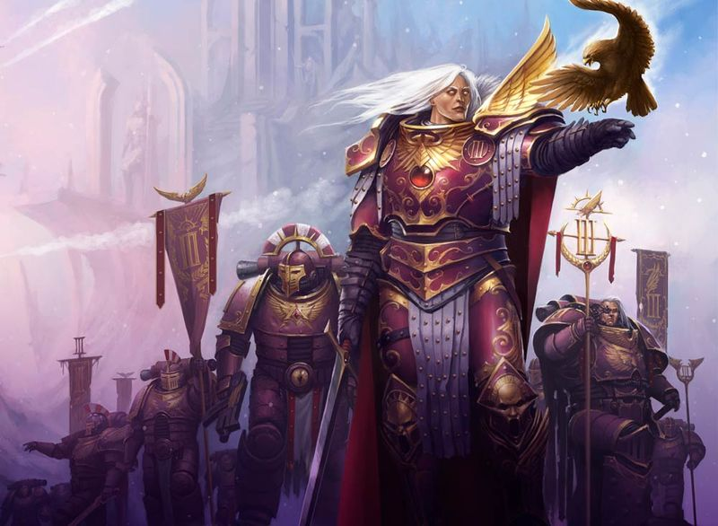

<!-- A0529-B0076 -->

原译文

Fulgrim and the Emperor's Children during the Great Crusade 大远征期间的福格瑞姆和帝皇之子

**校订译文**

Fulgrim and the Emperor's Children during the Great Crusade 大远征期间的福格瑞姆和帝皇之子

<!-- /A0529-B0076 -->

<!-- A0529-B0077 -->
**英文原文**

As they were so few in number, the Emperor's Children were placed under the command of the Primarch Horus of the Luna Wolves, and they would fight together for almost a century until Horus's promotion to Warmaster following the Ullanor Crusade. Horus and Fulgrim grew close to one another, with eventual dire consequences for the Imperium.

<!-- /A0529-B0077 -->

<!-- A0529-B0078 -->

原译文

由于他们的人数很少，帝皇之子被置于影月苍狼的原体荷鲁斯的指挥之下，他们将一起战斗近一个世纪，直到荷鲁斯在乌兰诺远征后晋升为战帅。荷鲁斯和福格瑞姆变得越来越亲密，最终给帝国带来了可怕的后果。

**校订译文**

由于兵力稀少，帝皇之子被编入影月苍狼原体荷鲁斯的指挥体系。两军并肩作战近一个世纪，直到乌兰诺远征后，荷鲁斯升任战帅。荷鲁斯与福格瑞姆由此结下深厚情谊，最终却给帝国带来惨重后果。

<!-- /A0529-B0078 -->

<!-- A0529-B0079 -->
**英文原文**

Swollen by new recruits drawn from Chemos and Terra, the Emperor's Children finally mustered the strength to undertake a crusade alone, and Fulgrim proudly led his warriors into the unknown at the head of the 28th Expedition Fleet. To many worlds he brought the rule of the Emperor, crushing any resistance in the certain knowledge that any who fought against the Emperor fought against humanity itself. This wish to achieve perfection met its martial zenith during their first major campaign since parting with the Sons of Horus, the Cleansing of Laeran, where the Emperor's Children met an alien foe that offensively echoed their ideals. The Laer were judged so formidable by the Adeptus Administratum that it was feared any attempt to subjugate them would take over a decade. The Emperor's Children scoured them from their home-system in a month. This titanic effort was a notable feat of arms perhaps achievable only by Fulgrim's legion. However, it cost them dear; 700 marines perished with over 4,200 being injured. Shortly after the campaign, the Emperor's Children fought alongside their closest brethren, the Iron Hands, against the Diasporex.

<!-- /A0529-B0079 -->

<!-- A0529-B0080 -->

原译文

在来自彻莫斯和泰拉的新兵的鼓舞下，帝皇之子终于鼓起勇气独自进行远征，福格瑞姆自豪地带领他的战士们率领第28远征舰队进入未知领域。他把帝皇的统治带到了许多世界，粉碎了任何抵抗，因为他知道任何与帝皇作战的人都是在与人类本身作战。这种追求完美的愿望在他们与荷鲁斯之子分道扬镳后的第一次重大战役中达到了军事顶峰，即刺人清洗，帝皇之子在那里遇到了一个与他们的理想相呼应的外星敌人。刺人被内务部认为是如此强大，以至于担心任何征服他们的企图都需要十多年的时间。帝皇之子在一个月内将他们从家园星系中清除。这一巨大的努力是一项值得注意的军事壮举，也许只有福格瑞姆的军团才能实现。然而，这让他们付出了高昂的代价；700名星际战士死亡，4200多人受伤。战役结束后不久，帝皇之子与他们最亲密的兄弟钢铁之手一起对抗流散者。

**校订译文**

来自彻莫斯与泰拉的新兵不断补充，帝皇之子终于具备独立远征的兵力。福格瑞姆自豪地率领战士，作为第 28 远征舰队的统帅驶向未知。他将帝皇的统治带到众多世界，坚信反抗帝皇就是反抗人类，因而粉碎一切抵抗。离开荷鲁斯之子后，军团首次展开的大规模战役是莱兰清洗；他们对完美的追求，在这一战中达到了武力上的巅峰。敌对异形莱尔也秉持相似的理想，在帝皇之子看来，这本身就是冒犯。内政部认为莱尔实力强大，征服它们恐怕需要十年以上，帝皇之子却仅用一个月，便将其从母星系彻底清除。这是一场惊人的军事壮举，或许唯有福格瑞姆的军团能够做到，但代价也十分惨重：七百名星际战士阵亡，逾四千二百人受伤。不久后，帝皇之子又与最亲近的钢铁之手并肩作战，进攻流散者。

**校注：** Laer 为莱尔种族，Laeran 为地名／战役名词根；清洗战役暂定莱兰清洗，原稿刺人清洗。不得把 Adeptus Administratum 与其他行政机构混称。

<!-- /A0529-B0080 -->

<!-- A0529-B0081 -->
### Notable Engagements pre-Heresy 叛乱之前的著名交战

<!-- /A0529-B0081 -->

<!-- A0529-B0082 -->

原译文

???.??? - Proximan Betrayal 普罗西莫叛乱

**校订译文**

???.??? - Proximan Betrayal 普罗西莫叛乱

<!-- /A0529-B0082 -->

<!-- A0529-B0083 -->

原译文

???.M30 - Byzas Campaign 拜扎斯战役

**校订译文**

???.M30 - Byzas Campaign 拜扎斯战役

<!-- /A0529-B0083 -->

<!-- A0529-B0084 -->

原译文

???.M30 - Defeat of the Omakkad Princes 击败奥马卡德王子

**校订译文**

???.M30 - Defeat of the Omakkad Princes 击败奥马卡德王子

<!-- /A0529-B0084 -->

<!-- A0529-B0085 -->

原译文

???.M30 - The Night Crusade 午夜远征

**校订译文**

???.M30 - The Night Crusade 午夜远征

<!-- /A0529-B0085 -->

<!-- A0529-B0086 -->

原译文

???.M30 - Cleansing of Laeran 刺人清洗

**校订译文**

???.M30 - Cleansing of Laeran 莱兰清洗

<!-- /A0529-B0086 -->

<!-- A0529-B0087 -->

原译文

???.M30 - Battle with the Eldar on the Tza-Chao 在扎-潮与灵族战斗

**校订译文**

???.M30 - Battle with the Eldar on the Tza-Chao 在扎-潮与灵族战斗

<!-- /A0529-B0087 -->

<!-- A0529-B0088 -->

原译文

???.M31 - Diasporex War 流散者战争

**校订译文**

???.M31 - Diasporex War 流散者战争

<!-- /A0529-B0088 -->

<!-- A0529-B0089 -->

原译文

???.M30 - Battle of the Corollis Star 科罗利斯星之战

**校订译文**

???.M30 - Battle of the Corollis Star 科罗利斯恒星之战

**校注：** 战役名沿第17篇核心科罗利斯恒星之战。

<!-- /A0529-B0089 -->

<!-- A0529-B0090 -->

原译文

???.M31 - War on Murder 谋杀之战

**校订译文**

???.M31 - War on Murder 谋杀星之战

<!-- /A0529-B0090 -->

<!-- A0529-B0091 -->

原译文

???.M31 - Treab's World Campaign 特里布世界战役

**校订译文**

???.M31 - Treab's World Campaign 特里布世界战役

<!-- /A0529-B0091 -->

<!-- A0529-B0092 -->

原译文

'??? - The Extinction of the Katara 卡塔拉灭绝

**校订译文**

'??? - The Extinction of the Katara 卡塔拉灭绝

<!-- /A0529-B0092 -->

<!-- A0529-B0093 -->

原译文

??? - The Praxil Compliance 普拉克西征服

**校订译文**

??? - The Praxil Compliance 普拉克西征服

<!-- /A0529-B0093 -->

<!-- A0529-B0094 -->
### The Horus Heresy 荷鲁斯之乱

原题：The Horus Heresy 荷鲁斯叛乱

<!-- /A0529-B0094 -->

<!-- A0529-B0095 -->
**英文原文**

When the events that led to the Horus Heresy erupted, Fulgrim rushed to the Warmaster's side, attempting to reason with his old friend. Instead, Horus seduced him, playing upon his love of flawlessness to weaken Fulgrim's loyalty to the Emperor. Although Fulgrim initially resisted and wanted to speak out against Horus, the weapon he had taken from the Laer temple actually contained a daemon of Slaanesh. This daemon had been whispering to Fulgrim since he picked it up and weakened his resolve to the point where Horus was able to sway him.

<!-- /A0529-B0095 -->

<!-- A0529-B0096 -->

原译文

当导致荷鲁斯叛乱的事件爆发时，福格瑞姆冲向战帅身边，试图与他的老朋友讲道理。相反，荷鲁斯引诱了他，利用他对完美的热爱来削弱福格瑞姆对帝皇的忠诚。尽管福格瑞姆最初进行了抵抗，并想公开反抗荷鲁斯，但他从刺人神庙拿走的武器实际上包含了色孽的恶魔。自从福格瑞姆拿起它以来，这个恶魔一直在和他低语，并削弱了他的决心，以至于荷鲁斯能够动摇他。

**校订译文**

荷鲁斯之乱的祸端初现时，福格瑞姆赶到战帅身边，试图劝说旧友。然而，荷鲁斯反过来利用他对完美的执念，动摇其对帝皇的忠诚。福格瑞姆最初曾抗拒，并想公开反对荷鲁斯，但他从莱尔神庙带走的武器中封藏着一头色孽恶魔。从他拿起武器的那一刻起，恶魔便持续在他耳边低语，逐步侵蚀他的意志，最终让荷鲁斯得以说服他。

<!-- /A0529-B0096 -->

<!-- A0529-B0097 图片 -->
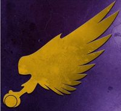

<!-- A0529-B0098 -->

原译文

Heresy-era Symbol 叛乱时期标志

**校订译文**

Heresy-era Symbol 叛乱时期标志

<!-- /A0529-B0098 -->

<!-- A0529-B0099 -->
**英文原文**

The rot spread from Fulgrim to his Lord Commanders, then to company and squad leaders, and finally all but a bare handful of Marines followed Slaanesh rather than the Emperor. The remaining loyalists, led by Saul Tarvitz, a Captain of the Emperors Children, fought bravely on Isstvan III but were eventually overwhelmed as Horus, and the three Primarchs who had already declared for him wiped out those forces they believed would remain loyal to the Emperor. The Legion then gleefully proceeded to aid in the destruction of the arriving loyalist legions. During the protracted intra-legion battles the Emperor’s Children would lose an enormous number of their armoured vehicles. After the fighting on Istvaan III, Fulgrim entered the Heresy proper with approximately 50,000 marines. They fought alongside the traitors in the Dropsite Massacre. The Emperor's Children saw heavy fighting with the Iron Hands and Fulgrim slew their Primarch, Ferrus Manus Some elements of the Emperor's Children loyal to the Emperor remained, with one known Blackshields warband being the Death Eagles.

<!-- /A0529-B0099 -->

<!-- A0529-B0100 -->

原译文

腐化从福格瑞姆蔓延到他的领主指挥官，然后是连长和队长，最后除了极少数星际战士外，所有人都追随色孽而不是帝皇。剩下的忠诚者，由皇帝之子连长索尔·塔维兹领导，在伊斯塔万三号英勇作战，但最终被荷鲁斯击败，三位已经宣布支持他的原体消灭了他们认为会继续忠于帝皇的部队。然后，军团兴高采烈地着手协助摧毁抵达的忠诚军团。在漫长的军团内部战斗中，帝皇之子失去大量的装甲载具。在伊斯塔万三号之战后，福格瑞姆率领约5万名星际战士加入叛乱。他们在登陆点大屠杀中与叛徒并肩作战。帝皇之子看到了钢铁之手的激烈战斗，福格瑞姆杀死了他们的原体费鲁斯·马努斯。一些忠于帝皇的帝皇之子仍然存在，其中一个已知的黑盾战帮是死亡天鹰。

**校订译文**

腐化从福格瑞姆传至领主指挥官，再蔓延到连长与小队长。最终，除了极少数战士，军团成员都转而追随色孽。忠诚派由帝皇之子连长索尔·塔维兹率领，在伊斯塔万三号英勇奋战，但终究寡不敌众：荷鲁斯与当时已支持他的三位原体，正联手清除各自军中被认为仍会忠于帝皇的部队。随后，帝皇之子又欣然参与对赶来平叛的忠诚派军团的毁灭行动。漫长的军团内战使他们损失了大量装甲载具；伊斯塔万三号战役结束后，福格瑞姆带着约五万名星际战士正式投身叛乱。他们参与了登陆点大屠杀，与钢铁之手激烈交战，福格瑞姆更亲手杀死了对方原体费鲁斯·马努斯。军团中仍有忠于帝皇的零星力量幸存，例如后来成为黑盾战帮的死亡天鹰。

**校注：** 修复荷鲁斯与三位原体共同清洗忠诚派的并列主语；按英文区分伊斯塔万三号内战与其后登陆点大屠杀。

<!-- /A0529-B0100 -->

<!-- A0529-B0101 -->
**英文原文**

Some time after Isstvan V, The Perfect Fortress erected by Fulgrim in a strategic key system, was taken by the Raven Guard by luring the self-reliant Emperor's Children out. The whole Emperor's Children garrison was destroyed. Later, the Legion accompanied Fulgrim along with Perturabo and the Iron Warriors to the Crone World of Iydris, where Fulgrim would achieve Daemonhood. After the events on Iydris, the Emperor's Children devolved into disparate warbands. While most accompanied Fulgrim as he rendezvoused with Horus or undertook his own adventures in the Warp, several warband leaders arose who undertook their own sadistic raids into Imperial territory. A third of the Legion remained under the control of the Eidolon, which attempted to destroy the White Scars both at the Kalium Gate and the Catallus Rift.

<!-- /A0529-B0101 -->

<!-- A0529-B0102 -->

原译文

在伊斯塔万五号之后的一段时间，福格瑞姆在战略关键星系中建造的完美堡垒被暗鸦守卫引诱独立的帝皇之子离开。整个帝皇之子的驻军被摧毁了。后来，军团陪同福格瑞姆与佩图拉博和钢铁勇士一起前往伊德瑞斯老妪世界，福格瑞姆在那里成为恶魔王子。在伊德瑞斯事件之后，帝皇之子变成了各自为政的战帮。当福格瑞姆与荷鲁斯会合或在亚空间进行自己的冒险时，大多数人都陪伴着他，但也有几位战帮领袖出现了，他们对帝国领土进行了自己的狂虐袭击。三分之一的军团仍处于艾多隆的控制之下，艾多隆试图摧毁钾之门和卡塔鲁斯裂隙的白色伤疤。

**校订译文**

伊斯塔万五号战役后不久，暗鸦守卫将自恃甚高的帝皇之子诱出防御阵地，夺取了福格瑞姆在战略要地修建的完美堡垒，并消灭全部驻军。此后，军团随福格瑞姆，与佩图拉博及钢铁勇士一同前往老妪世界伊德瑞斯；福格瑞姆在那里升格为恶魔。此事过后，帝皇之子分裂为各自为政的战帮。大多数成员继续追随福格瑞姆，与荷鲁斯会合，或在亚空间展开原体自己的冒险；也有一些战帮首领独自行事，残酷劫掠帝国领土。艾多隆仍控制着约三分之一军团，曾先后在卡利乌姆之门与卡塔鲁斯裂隙试图歼灭白疤。

**校注：** Kalium Gate 沿核心卡利乌姆之门，White Scars 官译白疤；原稿钾之门、白色伤疤。Perfect Fortress 为完美堡垒。

<!-- /A0529-B0102 -->

<!-- A0529-B0103 -->
**英文原文**

After Horus ordered a muster for all traitor forces to converge on Ullanor in preparation for the final drive on Terra, Fulgrim was still nowhere to be found and the Emperor's Children still leaderless. However Lorgar was able to find the Primarch inside the Palace of Slaanesh and used Zardu Layak to bind him to his will with his True Name. Now forced to rejoin the war, Fulgrim let out a cry that rippled across the Warp. All across the galaxy, the various Emperor's Children's warbands heard the cry of their Primarch and rushed back to his side. Due to the blessing of the Gods, Warp trips that should have taken weeks took only hours, and soon the Emperor's Children were whole once more under the leadership of Fulgrim. Fulgrim was eventually freed by Layak, and the Emperor's Children pledged themselves to Horus for the assault on Terra.

<!-- /A0529-B0103 -->

<!-- A0529-B0104 -->

原译文

在荷鲁斯下令召集所有叛徒部队向乌兰诺集结，为泰拉的最后冲刺做准备后，福格瑞姆仍然无处可寻，帝皇之子仍然没有领袖。然而，珞珈在色孽宫殿找到了原体，并利用扎杜·拉亚克用他的真名将他束缚在自己的意志上。现在被迫重新加入战争，福格瑞姆发出了一声在亚空间回荡的呼喊。在整个银河系中，各个帝皇之子听到了他们的原体的呼喊，冲回了他的身边。由于众神的祝福，本应花费数周时间的亚空间之旅只花了几个小时，很快，在福格瑞姆的领导下，帝皇之子又恢复了完整。福格瑞姆最终被拉亚克释放，帝皇之子向荷鲁斯承诺要进攻泰拉。

**校订译文**

荷鲁斯命令叛军前往乌兰诺集结，准备最终进军泰拉时，福格瑞姆仍不知所踪，帝皇之子群龙无首。珞珈却在色孽宫殿找到这位原体，并借扎度·拉亚克掌握其真名，将他束缚于自己的意志。被迫重返战争的福格瑞姆发出一声响彻亚空间的呼喊。银河各处的帝皇之子战帮听见原体召唤，纷纷赶回他身边。诸神赐福之下，原本需要数周的亚空间航程缩短为数小时；帝皇之子很快再次团结于福格瑞姆麾下。拉亚克最终解除了对他的束缚，帝皇之子也向荷鲁斯承诺参与进攻泰拉。

**校注：** Zardu Layak 沿核心扎度·拉亚克；原文 him/his 涉及真名持有者与束缚者，按上下文明确为福格瑞姆被束缚于珞珈的意志。

<!-- /A0529-B0104 -->

<!-- A0529-B0105 -->
**英文原文**

All trace of decency amongst the Emperor's Children had vanished by the time they partook in the Siege of Terra. While other Traitor Legions assaulted the Imperial Palace, the Emperor's Children embarked upon a spree of terror and gratification amongst the helpless citizenry of Terra. Millions of defenseless civilians were slaughtered and rendered down to create endless varieties of drugs and stimulants, countless thousands more dying to provide the Legionnaires with more direct and cruder pleasure. Though they could rarely be controlled, Abaddon managed to have Eidolon convince Fulgrim to have the whole of the III Legion, over 100,000 Legionaries, take part in the assault on the Saturnine Gate. The assault failed due to preparations by Rogal Dorn, but during the attack Fulgrim and Dorn came to blows.

<!-- /A0529-B0105 -->

<!-- A0529-B0106 -->

原译文

当帝皇之子参加泰拉围城时，他们所有的体面都消失了。当其他叛徒军团袭击皇宫时，帝皇之子在泰拉无助的平民中开始了一场恐怖和满足的狂欢。数以百万计的手无寸铁的平民被屠杀和杀害，制造出各种各样的毒品和兴奋剂，还有无数人为了给军团士兵提供更直接、更粗俗的快乐而死去。虽然他们很少能被控制，但阿巴顿设法让艾多隆说服福格瑞姆让整个第三军团，超过10万名军团士兵，参加对土星之门的袭击。由于罗格·多恩的准备，袭击失败了，但在袭击中，福格瑞姆和多恩发生了冲突。

**校订译文**

到参加泰拉围城时，帝皇之子已丧失最后一丝体面。其他叛徒军团猛攻帝国皇宫，他们却将恐怖与纵欲的狂欢施加于泰拉无助的平民。数百万手无寸铁者遭到屠杀，尸身被分解加工，制成花样无尽的毒品与兴奋剂；还有数不清的人死于更直接、更粗野的虐乐之中。尽管这支军团几乎不受约束，阿巴顿仍设法通过艾多隆说服福格瑞姆，令第三军团逾十万名战士全部投入土星之门攻势。罗格·多恩早有准备，使进攻失败；其间，福格瑞姆与多恩也正面交锋。

**校注：** rendered down 指将受害者尸体分解加工成毒品材料，原译重复“屠杀和杀害”漏译这一结果。兵力逾十万人按本段原文保留，不据前文五万人自行改数。

<!-- /A0529-B0106 -->

<!-- A0529-B0107 -->
**英文原文**

As the Emperor's Children assailed Terra, their homeworld of Chemos would meet its end at the hands of vengeful Imperial forces. Emperor's Children forces fleeing Chemos' destruction later took up residence in the Pale Stars near Nocturne, forcing the Salamanders to respond.

<!-- /A0529-B0107 -->

<!-- A0529-B0108 -->

原译文

当帝皇之子攻击泰拉时，他们的家园世界彻莫斯在复仇的帝国军队手中终结。逃离彻莫斯毁灭的皇帝之子部队后来在夜曲星附近的苍白星定居，迫使火蜥蜴做出回应。

**校订译文**

当帝皇之子进攻泰拉时，母星彻莫斯也遭到复仇的帝国军队毁灭。逃过母星毁灭的帝皇之子后来盘踞于夜曲星附近的苍白群星，迫使火蜥蜴出兵应对。

**校注：** Pale Stars 为复数地区名，暂定苍白群星；原稿苍白星。

<!-- /A0529-B0108 -->

<!-- A0529-B0109 -->
### Post-Heresy 叛乱后

<!-- /A0529-B0109 -->

<!-- A0529-B0110 -->
**英文原文**

When Horus was defeated, the Emperor's Children left a trail of depopulated worlds in their wake as they fled to the Eye of Terror. They were the first of Legions to begin raiding Imperial worlds for captives and plunder. Their excesses knew no limits and raiding alone could not fuel their ever more boundless depravities. In their unrestrained fervour, they soon took to capturing the slaves and servants of the other Traitor Legions, triggering a series of wars within the Eye of Terror. At some point during this period, Fulgrim disappeared from the Legion, rumoured to have retreated to a planet of pleasure gifted to him by Slaanesh.

<!-- /A0529-B0110 -->

<!-- A0529-B0111 -->

原译文

当荷鲁斯被击败时，帝皇之子在逃亡到恐惧之眼，留下了一条人口稀少的世界。他们是第一批开始突袭帝国世界掠夺俘虏的军团。他们的暴行没有限度，仅靠突袭无法助长他们日益猖獗的堕落。在他们不受约束的热情中，他们很快开始抓捕其他叛徒军团的奴隶和仆人，在恐惧之眼引发了一系列战争。在这一时期的某个时候，福格瑞姆从军团中消失了，据传他已经撤退到色孽送给他的一个极乐行星。

**校订译文**

荷鲁斯败亡后，帝皇之子一路逃向恐惧之眼，沿途留下一个个居民被屠尽的世界。他们也是最早袭击帝国世界、掠取俘虏与财物的叛徒军团。可无止境的放纵，使单纯对外劫掠越来越无法满足他们的堕落欲望。他们很快开始掳掠其他叛徒军团的奴隶与仆役，由此引爆恐惧之眼中的连串战争。在这段时期的某个时刻，福格瑞姆离开军团；传说他隐居到了色孽赐予的欢愉行星。

<!-- /A0529-B0111 -->

<!-- A0529-B0112 图片 -->
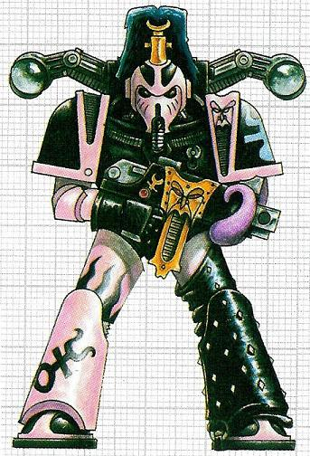

<!-- A0529-B0113 -->

原译文

Post-Heresy Emperor's Children Chaos Space Marine 叛乱后帝皇之子混沌星际战士

**校订译文**

Post-Heresy Emperor's Children Chaos Space Marine 叛乱后帝皇之子混沌星际战士

<!-- /A0529-B0113 -->

<!-- A0529-B0114 -->
**英文原文**

Fabius Bile, the former Chief Apothecary, took up command of the remaining Emperor's Children and regrouped at at Canticle City, the fortress of the Emperor's Children on the Daemon world of Harmony. From here Bile launched the destruction of the fortress of the Sons of Horus at Maleum, after which the body of Horus was taken and cloned by the Emperor's Children. Ezekyle Abaddon (himself a rumoured clone of Horus) led the Sons in a lightning attack against the Emperor's Children at the Battle of Harmony, destroying the body of Horus and his clone. Bile fled, salvaging what he could of his experimentations, the other Emperor's Children considered Bile's retreat from Canticle City with the remnants of his work as a betrayal.

<!-- /A0529-B0114 -->

<!-- A0529-B0115 -->

原译文

前首席药剂师法比乌斯·拜尔接管了剩余的帝皇之子的指挥权，并在和谐星恶魔世界的帝皇之子堡垒颂歌城重新集结。从这里，拜耳开始摧毁马勒姆的荷鲁斯之子堡垒，之后荷鲁斯的尸体被帝皇之子带走并克隆。以泽凯尔·阿巴顿（他本人就是传闻中的荷鲁斯克隆人）带领子嗣在和谐星之战中对帝皇之子进行了闪电战，摧毁了荷鲁斯和他的克隆人的身体。拜尔逃离了，尽其所能地抢救他的实验品，其余的帝皇之子认为拜尔带着他的残余作品从颂歌城撤退是一种背叛。

**校订译文**

前首席药剂师法比乌斯·拜尔接管残余帝皇之子，在和谐星上的军团堡垒颂歌城重新集结。拜尔从这里发动进攻，摧毁荷鲁斯之子位于玛勒姆的要塞，并夺取荷鲁斯遗体，进行克隆。以泽凯尔·阿巴顿随后率领荷鲁斯之子，在和谐星之战中突袭帝皇之子，毁掉荷鲁斯的遗体与克隆体；阿巴顿本人也曾被传是荷鲁斯的克隆体。拜尔携带尽可能多的实验成果逃离，其他帝皇之子则将他抛下颂歌城、带走研究成果的行为视为背叛。

**校注：** 阿巴顿是荷鲁斯克隆体为原稿明确标注的传闻，不译成已证实身份。

<!-- /A0529-B0115 -->

<!-- A0529-B0116 -->
**英文原文**

As the wars against the other Traitor Legions intensified, the Emperor's Children soon exhausted their supply of slaves and began to prey upon the only victims they had ready access to: each other. Bereft of leadership, the ensuing bloodshed on Harmony shattered the Emperor's Children as a unified Legion and splintered them into many warbands. After the Legion War ended, all the Legions resumed their raids on the Imperium, with the Emperor's Children proving the most successful in this pursuit.

<!-- /A0529-B0116 -->

<!-- A0529-B0117 -->

原译文

随着对其他叛徒军团的战争加剧，帝皇之子很快耗尽了他们的奴隶供应，开始掠夺他们唯一可以接触到的受害者：彼此。由于失去了领导权，随后在和谐星上发生的流血事件将帝皇之子作为一个统一的军团粉碎，并将他们分裂成许多战帮。军团战争结束后，所有军团都恢复了对帝国的突袭，帝皇之子在这场追求中取得了最大的成功。

**校订译文**

与其他叛徒军团的战争愈演愈烈，帝皇之子很快耗尽奴隶，开始迫害唯一唾手可得的牺牲品——彼此。缺乏领导的军团在和谐星内斗中彻底分裂，化为众多战帮。军团战争结束后，各叛徒军团重新劫掠帝国，而帝皇之子在这方面尤其成功。

<!-- /A0529-B0117 -->

<!-- A0529-B0118 图片 -->
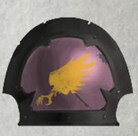

<!-- A0529-B0119 -->

原译文

Post-Heresy Emblem 叛乱后徽章

**校订译文**

Post-Heresy Emblem 叛乱后徽章

<!-- /A0529-B0119 -->

<!-- A0529-B0120 -->
**英文原文**

At some point, certain warband leaders of the Legion banded together to form the Phoenix Conclave, a grouping of the splintered remnants led by Lord Commander Primus Eidolon, aimed at restoring the Legion to its former glory. By the time of the Great Rift it is said that the Emperor's Children are more united than they have ever been.

<!-- /A0529-B0120 -->

<!-- A0529-B0121 -->

原译文

在某个时刻，军团的某些战帮领袖联合起来组成了凤凰秘会，这是由首席领主指挥官艾多隆领导的分裂残余势力组成的一个团体，旨在恢复军团昔日的辉煌。到大裂隙时期，据说帝皇之子比以往任何时候都更加团结。

**校订译文**

后来，一些战帮首领联合组成凤凰秘会，由首席领主指挥官艾多隆统领军团的分裂残部，试图恢复昔日辉煌。据说，到大裂隙时期，帝皇之子的团结程度已超过以往。

<!-- /A0529-B0121 -->

<!-- A0529-B0122 -->
**英文原文**

Today, thanks to the Great Rift, the Emperor's Children are more active than ever in their raids against the Galaxy. Where they strike - by design or inadvertently via their own hedonistic desires - committed atrocities so vile that reality itself weeps, weakening the barriers between dimensions to the point of allowing for the manifestation of Daemons of Slaanesh. Even after they have moved on, the sites of the Emperor's Childrens atrocities often remain stages of empyric insanity. Increasingly, Fulgrim has appeared seemingly at random alongside his sons, furthering the mayhem and debauchery wherever he may manifest.

<!-- /A0529-B0122 -->

<!-- A0529-B0123 -->

原译文

今天，由于大裂隙，帝皇之子比以往任何时候都更积极地袭击银河系。他们袭击的地方 — 无论是故意还是无意中通过自己的享乐主义欲望 — 犯下了如此卑鄙的暴行，以至于现实本身都在哭泣，削弱了维度之间的屏障，以至于允许色孽的恶魔出现。即使在他们离开后，帝皇之子暴行的地点往往仍然是以太错乱的阶段。福格瑞姆似乎越来越多地随机出现在他的子嗣身边，无论他在哪里显现，都会加剧混乱和放荡。

**校订译文**

大裂隙使如今的帝皇之子更频繁地劫掠银河。无论是蓄意为之，还是任纵欲驱使而无意造成，他们所到之处的暴行都邪恶得令现实本身为之哀鸣，削弱维度之间的屏障，直至色孽恶魔得以显现。即使战帮离开，受害之地也常成为亚空间狂乱长久上演的舞台。福格瑞姆越来越频繁地、仿佛毫无规律地出现在子嗣身旁；他每一次显现，都会让当地的混乱与放荡更甚。

<!-- /A0529-B0123 -->

<!-- A0529-B0124 -->
### Notable Engagements Post-Heresy 叛乱后的著名战役

<!-- /A0529-B0124 -->

<!-- A0529-B0125 -->
**英文原文**

???.M31 – The Battle of Skalathrax. Pitched battle against the World Eaters. The World Eaters scattered as a Legion in the aftermath.

<!-- /A0529-B0125 -->

<!-- A0529-B0126 -->

原译文

斯卡拉特拉克斯战役。与吞世者展开激战。事后，吞世者以军团的形式分散。

**校订译文**

???.M31——斯卡拉特拉克斯之战。帝皇之子与吞世者展开激战，此后吞世者军团分崩离析。

<!-- /A0529-B0126 -->

<!-- A0529-B0127 -->

原译文

121.M31 – The Battle of Thessala 塞萨拉之战

**校订译文**

121.M31 – The Battle of Thessala 塞萨拉之战

<!-- /A0529-B0127 -->

<!-- A0529-B0128 -->

原译文

???.M31 – The Eye of Terror Slave Wars 恐惧之眼奴隶战争

**校订译文**

???.M31 – The Eye of Terror Slave Wars 恐惧之眼奴隶战争

<!-- /A0529-B0128 -->

<!-- A0529-B0129 -->

原译文

???.M31 – The Hunt For Bile 拜尔狩猎

**校订译文**

???.M31 – The Hunt For Bile 拜尔狩猎

<!-- /A0529-B0129 -->

<!-- A0529-B0130 -->

原译文

764.M34 – The Shattering 破碎之战

**校订译文**

764.M34 – The Shattering 破碎之战

<!-- /A0529-B0130 -->

<!-- A0529-B0131 -->

原译文

599.M37 – The Black Crusade of Jihar the Lacerator 撕裂者扎哈尔的黑色远征

**校订译文**

599.M37 – The Black Crusade of Jihar the Lacerator 撕裂者吉哈尔的黑色远征

<!-- /A0529-B0131 -->

<!-- A0529-B0132 -->

原译文

993.M37 – The Battle of Belial IV 贝利亚四号之战

**校订译文**

993.M37 – The Battle of Belial IV 贝利亚四号之战

<!-- /A0529-B0132 -->

<!-- A0529-B0133 -->

原译文

929.M40 – The Skarvus Ambush 斯卡维斯伏击

**校订译文**

929.M40 – The Skarvus Ambush 斯卡维斯伏击

<!-- /A0529-B0133 -->

<!-- A0529-B0134 -->

原译文

142-160.M41 - The 12th Black Crusade 第十二次黑色远征

**校订译文**

142-160.M41 - The 12th Black Crusade 第十二次黑色远征

<!-- /A0529-B0134 -->

<!-- A0529-B0135 -->

原译文

460.M41 – The Gaudinian Heresy 高迪尼安叛乱

**校订译文**

460.M41 – The Gaudinian Heresy 高迪尼安叛乱

<!-- /A0529-B0135 -->

<!-- A0529-B0136 -->

原译文

999.M41 – The destruction of Ichorax 伊科拉克斯毁灭

**校订译文**

999.M41 – The destruction of Ichorax 伊科拉克斯毁灭

<!-- /A0529-B0136 -->

<!-- A0529-B0137 -->

原译文

999.M41 – The 13th Black Crusade 第十三次黑色远征

**校订译文**

999.M41 – The 13th Black Crusade 第十三次黑色远征

<!-- /A0529-B0137 -->

<!-- A0529-B0138 -->

原译文

~999.M41 – The Cacophony of Extremis Six 极端六杂音

**校订译文**

~999.M41 – The Cacophony of Extremis Six 埃克斯特里米斯六号喧嚣事件

**校注：** Extremis Six 是事件中的专名，原稿“极端六杂音”逐字误译；暂定埃克斯特里米斯六号喧嚣事件。

<!-- /A0529-B0138 -->

<!-- A0529-B0139 -->

原译文

???.M41 – The Battle of Vindor 文多尔之战

**校订译文**

???.M41 – The Battle of Vindor 文多尔之战

<!-- /A0529-B0139 -->

<!-- A0529-B0140 -->

原译文

???.M42 – The Battle for K'tokh 克’托赫之战

**校订译文**

???.M42 – The Battle for K'tokh 克’托赫之战

<!-- /A0529-B0140 -->

<!-- A0529-B0141 -->

原译文

???.M42 – The Battle for Kamador 卡马多尔之战

**校订译文**

???.M42 – The Battle for Kamador 卡马多尔之战

<!-- /A0529-B0141 -->

<!-- A0529-B0142 -->

原译文

???.M42 - The battle of Crucible 坩埚之战

**校订译文**

???.M42 - The battle of Crucible 坩埚之战

<!-- /A0529-B0142 -->

<!-- A0529-B0143 -->

原译文

???.M42 – The Invasion of Tsadrekha 赛德瑞卡入侵

**校订译文**

???.M42 – The Invasion of Tsadrekha 赛德瑞卡入侵

<!-- /A0529-B0143 -->

<!-- A0529-B0144 -->

原译文

???.M42 - The Nachmund Rift War 纳克蒙德裂隙战争

**校订译文**

???.M42 - The Nachmund Rift War 纳克蒙德裂隙战争

<!-- /A0529-B0144 -->

<!-- A0529-B0145 -->

原译文

???.M42 – The Arks of Omen Campaign 噩兆方舟战役

**校订译文**

???.M42 – The Arks of Omen Campaign 噩兆方舟战役

<!-- /A0529-B0145 -->

<!-- A0529-B0146 -->

原译文

??? – The devastation of Knaus Lambda 克瑙斯·拉姆达毁灭

**校订译文**

??? – The devastation of Knaus Lambda 克瑙斯·拉姆达毁灭

<!-- /A0529-B0146 -->

<!-- A0529-B0147 -->
## Organisation 组织

<!-- /A0529-B0147 -->

<!-- A0529-B0148 -->
### Pre-Heresy 叛乱前

<!-- /A0529-B0148 -->

<!-- A0529-B0149 -->
**英文原文**

From its perilous beginning, the Emperor's Children Legion continued to grow until it met its eventual end in the Eye of Terror. Fulgrim selected a few individuals, the bravest, strongest and noblest, to become Lord Commanders, called by Sanguinius the 'Princes of War', who were each given authority over the Company commanders. Fulgrim taught the Lord Commanders personally, taking care that they were worthy of the honour of being the representatives of the Emperor. In turn the Lord Commanders passed Fulgrim's words on to the officers under their command, and they to their squads. In this way, through their leaders, each Space Marine of the Emperor's Children Legion followed the Emperor himself. To honour the Emperor, they strove for perfection in all things: battlefield doctrine was obeyed to the letter, tactics and strategy were studied in minute detail and perfected, and the Emperor's decrees were memorised by every Space Marine, adhered to in every way. While the Emperor's Children, like most legions, considered the Emperor a man, not a god, their reverence and adoration for him bordered on the fanatical.

<!-- /A0529-B0149 -->

<!-- A0529-B0150 -->

原译文

从危险的开始，帝皇之子军团一直在发展，直到它在恐惧之眼中最终结束。福格瑞姆挑选了一些最勇敢、最强壮、最高尚的人，成为圣吉列斯称之为“战争王子”的领主主指挥官，他们每个人都被赋予了指挥连长的权力。福格瑞姆亲自教导领主指挥官，确保他们配得上作为帝皇代表的荣誉。反过来，领主指挥官将福格瑞姆的话传达给了他们指挥下的军官，他们也传达给了自己的小队。这样，通过他们的领导人，帝皇之子军团的每个星际战士都跟随了帝皇本人。为了尊重帝皇，他们在所有事情上都力求完美：严格遵守战场学说，仔细研究战术和战略并加以完善，每个星际战士都牢记帝皇的法令，并以各种方式遵守。虽然帝皇之子和大多数军团一样，认为帝皇是人，而不是神，但他们对他的崇敬和崇拜近乎狂热。

**校订译文**

帝皇之子从险象环生的早期不断壮大，直到最终在恐惧之眼中瓦解。福格瑞姆选拔最勇敢、最强大、最具高贵品质的战士担任领主指挥官，授予他们统辖各连长的权力；圣吉列斯称这些人为“战争王子”。福格瑞姆亲自教导他们，确保他们配得上帝皇代表的荣誉。他们再将原体的教诲传给下属军官，由军官传至各小队。通过这条指挥链，每一位帝皇之子都将自己视为直接追随帝皇的人。为了荣耀帝皇，他们凡事力求完美：不折不扣地遵循作战教范，细究并完善战略战术，将帝皇的法令牢记于心、严格奉行。与大多数军团一样，他们认为帝皇是人而非神，但对祂的崇敬与爱戴仍近乎狂热。

<!-- /A0529-B0150 -->

<!-- A0529-B0151 图片 -->
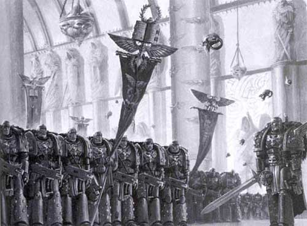

<!-- A0529-B0152 -->

原译文

Emperor's Children on parade 帝皇之子列队行进

**校订译文**

Emperor's Children on parade 帝皇之子列队行进

<!-- /A0529-B0152 -->

<!-- A0529-B0153 -->
**英文原文**

The Emperor's Children developed a very rigid combat methodology that was reflected in their order of battle. By the time Fulgrim led them into rebellion his Legion comprised 110,000 marines organized into 30 Millennials, the first ten of which were led by a Lord Commander. As each Space Marine looked to his superior officer for guidance, each Company inherited its manner and practices from its Commander. Though this was the case with many Legions, the Emperor's Children had a strength of devotion to their leaders that was almost unmatched.

<!-- /A0529-B0153 -->

<!-- A0529-B0154 -->

原译文

帝皇之子发展了一种非常严格的战斗方法，这反映在他们的战斗顺序中。当福格瑞姆带领他们叛乱时，他的军团由11万名星际战士组成，分为30个千人队，其中前10个由一位领主指挥官领导。当每个星际战士都向上级军官寻求指导时，每个连队都继承了指挥官的方式和做法。尽管许多军团都是如此，但帝皇之子在对他们的领导人的忠诚几乎是无与伦比的。

**校订译文**

帝皇之子形成了一套极其严密的作战方式，其战斗编制也体现了这一点。福格瑞姆率军叛乱时，军团共有十一万名星际战士，分为三十个千人队，前十个千人队各由一位领主指挥官统率。战士向上级寻求指引，各连也因此继承了指挥官的作风与惯例。许多军团都有类似传统，但帝皇之子对首领的忠诚与奉献，几乎无可比拟。

**校注：** Millennial 沿本稿千人队，但十一万人／三十单位说明不能据名称机械认定每队恰一千人。前十单位各有领主指挥官，非一人统一指挥前十队。后文还出现超过30的编号，保留原稿各时期记录。

<!-- /A0529-B0154 -->

<!-- A0529-B0155 -->
**英文原文**

The Legion strove for perfection in all their endeavours and worked continuously to perfect their military operations. Each and every Space Marine trained almost ceaselessly for his assigned task, whether it be foot soldier, driver, gunner, scout or sniper. The Legion employed no Librarians, as the genetic mutation that allowed a psyker to access the warp was considered a flaw, and nothing considered a flaw would be allowed in the Legion.

<!-- /A0529-B0155 -->

<!-- A0529-B0156 -->

原译文

军团在所有尝试中都力求完美，并不断努力完善其军事行动。每一位星际战士几乎都在为自己分配的任务不断训练，无论是步兵、驾驶员、枪手、侦察兵还是狙击手。军团没有使用智库，因为允许灵能者进入亚空间的基因突变被认为是一种缺陷，军团中不允许任何被认为是缺陷的东西。

**校订译文**

军团在一切事务上追求完美，不断打磨作战能力。每位星际战士都为自己的职责几乎不眠不休地训练，无论担任步兵、驾驶员、炮手、侦察兵还是狙击手。军团不设智库员，因为他们将灵能者得以接触亚空间的基因突变视作缺陷，而任何被认为有缺陷之物都不被允许留在军团。

**校注：** 不设智库员为原文关于该阶段军团制度的说法；后文混沌时期存在巫师，不据此删改前文。

<!-- /A0529-B0156 -->

<!-- A0529-B0157 -->
**英文原文**

Every aspect of battle was analysed and used to the Emperor's Children's advantage, from terrain and weather to deployment or reserves. As well as standard formations the Emperor's Children also fielded many specialised units, such as the lascannon equipped 'Sun-Killers', the duellist 'Brotherhoods of the Palatine Blades', the Primarch's 200 strong 'Phoenix Guard', and the elite assault companies 'Wings of the Phoenician' whose commander bore the title 'Eagle King'.

<!-- /A0529-B0157 -->

<!-- A0529-B0158 -->

原译文

从地形和天气到部署或预备役，对战斗的各个方面都进行了分析，并利用了帝皇之子的优势。除了标准编队外，帝皇之子在还派出了许多专业部队，如配备激光炮的“太阳杀手”、决斗者“宫廷剑士兄弟会”、原体的200人“凤凰卫队”和精英突击连“紫庭凤凰之翼”，其指挥官拥有“鹰王”的头衔。

**校订译文**

从地形、天气到兵力部署与预备队运用，帝皇之子都会分析战斗的每个方面，使之转化为自身优势。除常规编制外，军团还部署多种特化部队，包括装备激光炮的太阳杀手、善于决斗的宫廷剑士兄弟会、两百人组成的原体凤凰卫队，以及精锐突击连紫庭凤凰之翼；后者的指挥官拥有“鹰王”头衔。

<!-- /A0529-B0158 -->

<!-- A0529-B0159 -->
**英文原文**

In combat the Emperor's Children were as brave as any Space Marine who ever lived. Sustained not merely by the example of their peers but by a deep individual belief in their duty to their superiors and the Legion as a whole, they fought to the best of their abilities in all conditions, whether the battle was a massive attack or a simple patrol. It was widely believed that no Space Marine of the Emperor's Children had ever been routed in battle. Similarly, the Legion was highly demanding of forces allied with it - signs of hesitation or inefficiency within the Imperial Army or even their brother Space Marines were not tolerated. The principle of leading by example was ingrained into every fibre of the Emperor's Children, and they had little patience for any other approach. Fulgrim embodied these principles and when he entered combat he would lead his Legion from the very front.

<!-- /A0529-B0159 -->

<!-- A0529-B0160 -->

原译文

在战斗中，帝皇之子和任何活着的星际战士一样勇敢。他们不仅以同伴为榜样，而且以个人对上级和整个军团的责任的坚定信念为支撑，无论是大规模袭击还是简单的巡逻，他们都在各种条件下尽其所能地战斗。人们普遍认为，帝皇之子的星际战士从未在战斗中被击溃。同样，军团对与其结盟的部队要求很高 — 帝国陆军甚至其兄弟星际战士内部犹豫不决或效率低下的迹象都是不可容忍的。以身作则的原则深深植根于帝皇之子的每一根纤维中，他们对任何其他方法都没有耐心。福格瑞姆体现了这些原则，当他进入战斗时，他将从前线领导他的军团。

**校订译文**

帝皇之子在战场上的勇气，不逊于任何时代的星际战士。支撑他们的不只是同袍的榜样，更有每个人对上级与整个军团所负责任的坚定信念。无论参加大规模攻势还是普通巡逻，他们都竭尽所能。人们普遍相信，帝皇之子从未在战场上溃逃过。同样，军团对盟友也要求苛刻，绝不容忍帝国军乃至其他星际战士部队表现出迟疑或低效。“以身作则”已深植其心，他们对其他做法几乎毫无耐心。福格瑞姆就是这些原则的化身，亲临战场时总会冲在军团最前方。

<!-- /A0529-B0160 -->

<!-- A0529-B0161 -->
**英文原文**

The Legion had a highly restrained tactical 'rulebook' that they attempted to apply to all combat situations. For example, ground assaults were to be accompanied with both heavy weapon and air cover; the Emperor's Children looked to Land Speeders for the latter purpose. When a particular aspect of their textbook approach to war broke down (again for example, no air cover being available), the Legion would still fight with determination, while an alternate tactic was selected from their repertoire by the commanding officer. Fast attack was seen as a preferred style by the Legion, however, and the Legion made heavy use of high speed vehicles such as the jetbike, both for its swift and elegant style, as well as the practical consideration that the Legion could not sustain the same levels of attrition that some others could.

<!-- /A0529-B0161 -->

<!-- A0529-B0162 -->

原译文

军团有一个高度克制的战术“规则书”，他们试图将其应用于所有战斗情况。例如，地面攻击将伴随着重型武器和空中掩护；帝皇之子为了后一个目的而注意到了兰德速攻艇。当他们教科书中的战争方法的某个特定方面崩溃时（再次例如，没有空中掩护），军团仍将坚定不移地战斗，而指挥官则从他们的战术库中选择了一种替代战术。然而，快速攻击被军团视为一种首选风格，军团大量使用悬浮摩托等高速载具，这既是因为其快速而优雅的风格，也是因为考虑到军团无法维持与其他人相同的消耗等级。

**校订译文**

军团拥有一套限制严密的战术教范，并试图将它用于所有作战情境。例如，地面突击必须有重武器与空中掩护，后者通常由兰德速攻艇承担。若某项规定条件无法满足，例如没有空中掩护，战士仍会坚决作战，同时由指挥官从既有战术中选择替代方案。军团总体偏爱快速突击，大量使用悬浮摩托等高速载具；这既符合他们对迅捷、优雅的追求，也出于实际需要——军团无法像某些其他军团一样承受大量伤亡。

<!-- /A0529-B0162 -->

<!-- A0529-B0163 -->
**英文原文**

The Emperor's Children also entertained a warrior-lodge, the Brotherhood of the Phoenix. Like everything in the Legion it was highly formalised and as a result was only open to the Primarch and his senior officers.

<!-- /A0529-B0163 -->

<!-- A0529-B0164 -->

原译文

帝皇之子还成立了一个战士结社，凤凰兄弟会。像军团中的一切一样，它是高度正式化的，因此只对原体和他的高级军官开放。

**校订译文**

帝皇之子还设有一个名为凤凰兄弟会的战士结社。与军团内的一切一样，它高度重视规制与仪式，因此只接纳原体及其高级军官。

<!-- /A0529-B0164 -->

<!-- A0529-B0165 -->
### Post-Heresy 叛乱后

<!-- /A0529-B0165 -->

<!-- A0529-B0166 -->
**英文原文**

In the aftermath of the Eye of Terror Slave Wars, the Legion of the Emperor's Children was shattered as an organised fighting force. Without the guidance of their Primarch, they have since been fractured into individual warbands and have lost any semblance of unity. At one point, the Emperor's Children adopted the rank of "Sardar". In the aftermath of the Horus Heresy, this title was claimed by the leaders of larger warbands.

<!-- /A0529-B0166 -->

<!-- A0529-B0167 -->

原译文

在恐惧之眼奴隶战争之后，帝皇之子军团作为一支有组织的战斗力量被粉碎了。在没有他们的原体的指导下，他们已经分裂成单独的战帮，失去了任何团结的外像。有一次，帝皇之子采用了“萨达尔”的军衔。在荷鲁斯叛乱之后，这个头衔被更大的战帮的领导人所宣称。

**校订译文**

恐惧之眼奴隶战争后，帝皇之子作为统一作战组织的形态已被摧毁。失去原体指引的他们分裂为独立战帮，不复团结。帝皇之子曾在某个时期采用“萨达尔”这一军衔；荷鲁斯之乱后，规模较大战帮的首领便以此自称。

<!-- /A0529-B0167 -->

<!-- A0529-B0168 图片 -->
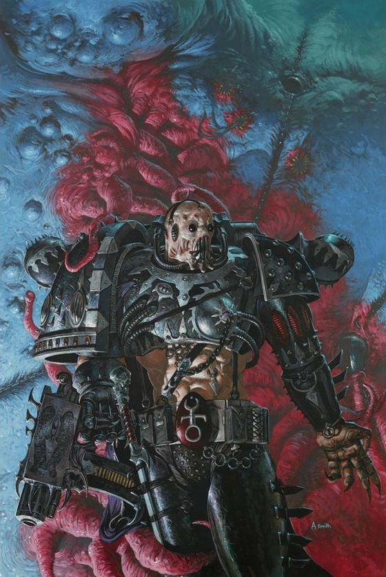

<!-- A0529-B0169 -->

原译文

Post-Heresy Emperor's Children Marine 叛乱后帝皇之子战士

**校订译文**

Post-Heresy Emperor's Children Marine 叛乱后帝皇之子战士

<!-- /A0529-B0169 -->

<!-- A0529-B0170 -->
**英文原文**

The only focus of admiration for the Emperor's Children now is senseless indulgence. This makes them the most violent, sadistic and debauched creatures imaginable. Having abandoned most of their old traditions, the Legion still maintains their original name, taking pleasure in the grievous insult to the grandeur of the 'false' Emperor and his Imperium. Their armour has been corrupted into sensuous and grotesque designs and bears dazzling, pastel colours, silks and golden chains. Slaanesh gifts his favoured warriors of the Emperor's Children with the ability to feel pain and pleasure through the layered ceramite of their armour as if it were their own skin and flesh, making every blade or bullet that rebounds from its contours a thrill of sublime agony. This quality also applies to weapons - some of the Emperor's Children learn to taste blood of enemies with their blades.

<!-- /A0529-B0170 -->

<!-- A0529-B0171 -->

原译文

现在，人们对帝皇之子的唯一钦佩是毫无意义的放纵。这使它们成为可以想象到的最暴力、最残忍、最放荡的生物。在放弃了大部分旧传统后，军团仍然保留着原来的名字，对“伪”帝皇及其帝国的辉煌受到的严重侮辱感到高兴。他们的盔甲已经被腐蚀成感官和怪诞的设计，并带有耀眼的、柔和的颜色、丝绸和金色的链子。色孽赋予他最宠爱的帝皇之子战士们通过盔甲的分层陶钢来感受痛苦和快乐的能力，就好像这是他们自己的皮肤和血肉一样，使每一把从轮廓上反弹的刀刃或子弹都充满了极度的痛苦。这种品质也适用于武器 — 一些帝皇之子学会了用刀刃品尝敌人的鲜血。

**校订译文**

如今，帝皇之子所崇尚的唯有毫无节制的放纵。这使他们成为极端残暴、嗜虐而堕落的存在。他们舍弃了大部分旧传统，却故意保留军团原名，以侮辱“伪帝”及其帝国的威严为乐。护甲被扭曲成诱人而怪诞的造型，涂上耀眼的淡色，饰以丝绸和金链。色孽让最受宠的帝皇之子能透过层层陶钢，像用自身皮肉一样感受痛苦与欢愉；每一颗被弹开的子弹、每一道被挡下的刀锋，都会带来美妙剧痛的刺激。这种感官延伸同样能作用于武器：一些战士甚至学会通过刀刃品尝敌人的鲜血。

**校注：** 原文 admiration 的主体是帝皇之子，原译变成外人对他们的钦佩；现已还原。

<!-- /A0529-B0171 -->

<!-- A0529-B0172 -->
**英文原文**

Many Emperor's Children Space Marines have become Noise Marines, twisted creatures addicted to fury and tempest, only satisfied by the roar of explosions and the screams of the dying. A Noise Marine's hearing is a thousand times more sensitive than even that of a normal Space Marine, and can distinguish between even the subtlest differences in pitch and volume. A Noise Marine's enhanced hearing affects his whole mind, causing extreme emotional reactions that make all other sensations seem pale and worthless. The louder and more discordant the noise, the more extreme the emotional reaction provoked. Eventually only the clamour of battle and heightened screams of fear stir a Noise Marine.

<!-- /A0529-B0172 -->

<!-- A0529-B0173 -->

原译文

许多帝皇之子星际战士已经变成了噪音战士，这是一种扭曲的造物，沉迷于愤怒和暴风，只满足于爆炸的咆哮和垂死者的尖叫。噪音战士的听力比普通星际战士灵敏一千倍，甚至可以区分音调和音量上最微妙的差异。一名噪音战士增强的听力会影响他的整个大脑，引起极端的情绪反应，使所有其他感觉都显得苍白和毫无价值。噪音越大、越不和谐，引发的情绪反应就越极端。最终，只有战斗的喧嚣和恐惧的尖叫声能够激起一名噪音战士。

**校订译文**

许多帝皇之子已成为噪音战士——沉迷于狂暴与喧嚣、唯有爆炸巨响和临死尖叫才能满足的扭曲生灵。他们的听觉甚至比普通星际战士敏锐一千倍，能分辨音高与音量最细微的差别。这种异常听觉影响整个心智，激起极端情绪，使其他感官体验都变得苍白无味。噪声越响、越不和谐，情绪反应就越强烈；最终，只有战场轰鸣与拔高的恐惧尖叫，才能再令他们有所触动。

<!-- /A0529-B0173 -->

<!-- A0529-B0174 -->
**英文原文**

The name comes from their preference for weapons that use sound, such as the Blastmaster - a rifle-like weapon that fires different frequencies that overpower senses and destroy flesh; and the Doom Siren, a loudspeaker melded into the Marine's body that amplifies his screams to violent torrents that can knock the largest enemy back. Noise Marines also possess an ability called the 'Warp Scream'. This screech shocks and dulls the reactions of all in close vicinity to them. Some have risen to become warlords in their own right. Warbands of the Emperor's Children are rare in general, however.

<!-- /A0529-B0174 -->

<!-- A0529-B0175 -->

原译文

这个名字来自他们对使用声音的武器的偏好，比如爆裂大师 — 一种发射不同频率的步枪式武器，可以压倒感官并摧毁肉体；还有末日塞壬，一个融入星际战士体内的扬声器，可以将他的尖叫声放大成猛烈的洪流，将最大的敌人击退。噪音战士还拥有一种叫做“亚空间尖啸”的能力。这种尖叫声会让他们附近的所有人感到震惊和迟钝。有些人凭借自己的力量成为了战争领主。然而，帝皇之子的战帮通常很少见。

**校订译文**

噪音战士之名，源于他们偏爱声波武器。例如，“爆裂大师”是一种形似步枪的武器，发射不同频率的声波，压垮感官、摧毁血肉；“末日鸣笛器”则是与战士躯体融合的扬声器，将尖叫放大为狂暴声浪，足以击退最庞大的敌人。他们还拥有称为“亚空间尖啸”的能力，以刺耳啸声震慑近旁所有人，迟滞其反应。有些噪音战士已自立为军阀。不过，帝皇之子战帮总体仍较少见。

**校注：** Doom Siren 为扬声器武器，暂定末日鸣笛器（原稿末日塞壬）。末句战帮稀少与其他段落所述活跃程度可能对应不同版本，原文保留并列。

<!-- /A0529-B0175 -->

<!-- A0529-B0176 -->
**英文原文**

Today, most warbands of the Emperor's Children operate as fleet-based hedonists, reaving wherever they see fit both inside and outside the Eye of Terror and Great Rift. The raids reap a tally of fresh resources, often including biomaterials for the production of new stimulant drugs as well as the acquisition of slaves. These warbands see their raids as both experiences and performances, seeking to outdo one another in its hedonism, depravity, flamboyancy, and artistry. Emperor's Children raids are known for their unpredictability, and no two are exactly the same. However their extreme swiftness is a common unifying factor in these assaults.

<!-- /A0529-B0176 -->

<!-- A0529-B0177 -->

原译文

今天，帝皇之子的大多数战士都是以舰基的享乐主义者，在恐惧之眼和大裂隙内外的任何地方都能找到他们认为合适的地方。突袭收获了大量新资源，通常包括用于生产新兴奋剂的生物材料以及获取奴隶。这些战帮将他们的突袭视为体验和表演，试图在享乐主义、堕落、华丽和艺术性方面超越彼此。帝皇之子的突袭以其不可预测性而闻名，没有两个是完全相同的。然而，他们的极快速度是这些袭击中一个共同的统一因素。

**校订译文**

如今，大多数帝皇之子战帮以舰队为家，在恐惧之眼与大裂隙内外随心所欲地劫掠、享乐。每次袭击都会带来新的资源，包括制造兴奋剂所需的生物材料与奴隶。对这些战帮而言，劫掠既是体验，也是演出：他们争相比拼放纵、堕落、华丽与艺术性。帝皇之子的袭击难以预测，每一次都不相同；但快得惊人，始终是共同特点。

<!-- /A0529-B0177 -->

<!-- A0529-B0178 -->
**英文原文**

The composition of Emperor's Childrens warbands are extremely diverse and non-standard. Some may only number several dozen warriors, others can include well over a thousand. Few, however, manage to field the types of numbers seen with Traitor Legions such as the Black Legion, Death Guard, Word Bearers, or Iron Warriors. Each warband maintains a fleet of ancient and powerful warships, but depending on their warlord's power and influence such fleets can range from a handful of sleek and heavily armed Destroyers to huge armadas headed by Battleships. Each warband is held together by a powerful and influential Chaos Lord in a manner similar to how Fulgrim once was the cement that held together the Legion's unity. These warlords may be simple Chaos Lords, while other may have more exotic status such as Lord Exultant, Lord Kakophonist, Sorcerer, and even Daemon Prince of Slaanesh.

<!-- /A0529-B0178 -->

<!-- A0529-B0179 -->

原译文

帝皇之子战帮的组成极其多样化和不规范。有些可能只有几十名战士，而另一些可能包括一千多名战士。然而，很少有人能像叛徒军团那样，如黑色军团、死亡守卫、怀言者或钢铁勇士。每个战帮都拥有一支由古老而强大的战舰组成的舰队，但根据其战帮的力量和影响力，这些舰队的范围可以从少数光滑而全副武装的驱逐舰到以战列舰为首的庞大舰队。每个战帮都由一位强大而有影响力的混沌领主团结在一起，就像福格瑞姆曾经是团结军团的凝聚力一样。这些战争领主可能是简单的混沌领主，而其他可能具有更奇异的身份，如欢欣领主、噪音领主、巫师，甚至是色孽的恶魔王子。

**校订译文**

帝皇之子战帮的构成千差万别，毫无统一编制。有的只有数十名战士，有的则超过一千人；但很少能达到黑色军团、死亡守卫、怀言者或钢铁勇士那样的兵力规模。每个战帮都有古老而强大的战舰，舰队规模则取决于首领的实力与影响力：小到几艘舰形修长、武装精良的驱逐舰，大到由战列舰领衔的庞大舰队。战帮依靠强势而有威望的混沌领主维系，正如福格瑞姆昔日维系军团团结那样。这些军阀有些只是通常的混沌领主，有些则拥有更特殊的身份，如极乐领主、噪音领主、巫师，甚至色孽恶魔亲王。

<!-- /A0529-B0179 -->

<!-- A0529-B0180 -->
**英文原文**

Beneath these warlords are the fighting elite of the warband, usually in the form of Terminators and Flawless Blades. Beneath these are the rank-and-file warriors, which may consist of not only devout Noise Marines but also Tormentors and Infractors.

<!-- /A0529-B0180 -->

<!-- A0529-B0181 -->

原译文

在这些战争领主之下，是战帮的战斗精英，通常以终结者和无瑕之刃的形式出现。下面是普通战士，他们可能不仅包括虔诚的噪音战士，还包括折磨者和侵犯者。

**校订译文**

军阀之下是战帮精锐，通常包括终结者与无暇剑魔。再往下是普通战士，除了虔诚的噪音战士，也可能包括施虐者与破戒者。

**校注：** 无暇剑魔、施虐者与破戒者为 GW-09/GW-10 第21页对应 Flawless Blades、Tormentors、Infractors 的官译。Tormentors 此处是帝皇之子单位，与同名星际战士战团折磨者分开。

<!-- /A0529-B0181 -->

<!-- A0529-B0182 图片 -->
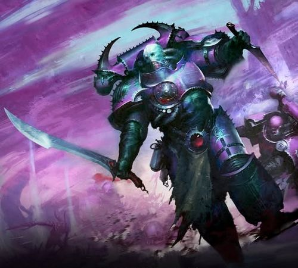

<!-- A0529-B0183 -->

原译文

Emperor's Children 帝皇之子

**校订译文**

Emperor's Children 帝皇之子

<!-- /A0529-B0183 -->

<!-- A0529-B0184 -->
**英文原文**

Besides these assets, a warband also consists of combat vehicles, Daemon Engines, and usually various mortal followers of the Lost and the Damned. Others may have allied Chaos Knights/Titans, and even Daemons.

<!-- /A0529-B0184 -->

<!-- A0529-B0185 -->

原译文

除了这些资产，战帮还包括战车、恶魔引擎，以及通常由迷失者和被诅咒者的各种凡人追随者组成。其他人可能有盟友混沌骑士/泰坦，甚至是恶魔。

**校订译文**

此外，战帮还拥有战斗载具、恶魔引擎，通常也有来自迷失者与被诅咒者的各类凡人追随者。有些战帮还有混沌骑士、泰坦乃至恶魔盟友。

<!-- /A0529-B0185 -->

<!-- A0529-B0186 -->
### Known units of the Great Crusade and Horus Heresy 大远征和荷鲁斯之乱的著名单位

原题：Known units of the Great Crusade and Horus Heresy 大远征和荷鲁斯叛乱的著名单位

<!-- /A0529-B0186 -->

<!-- A0529-B0187 -->
### Known Millennials 著名千人队

<!-- /A0529-B0187 -->

<!-- A0529-B0188 -->

原译文

1st Millennial 第一千人队

**校订译文**

1st Millennial 第一千人队

<!-- /A0529-B0188 -->

<!-- A0529-B0189 -->

原译文

3rd Millennial 第三千人队

**校订译文**

3rd Millennial 第三千人队

<!-- /A0529-B0189 -->

<!-- A0529-B0190 -->

原译文

5th Millennial 第五千人队

**校订译文**

5th Millennial 第五千人队

<!-- /A0529-B0190 -->

<!-- A0529-B0191 -->

原译文

7th Millennial 第七千人队

**校订译文**

7th Millennial 第七千人队

<!-- /A0529-B0191 -->

<!-- A0529-B0192 -->

原译文

8th Millennial 第八千人队

**校订译文**

8th Millennial 第八千人队

<!-- /A0529-B0192 -->

<!-- A0529-B0193 -->

原译文

9th Millennial 第九千人队

**校订译文**

9th Millennial 第九千人队

<!-- /A0529-B0193 -->

<!-- A0529-B0194 -->
**英文原文**

12th Millennial – later reduced to 12th Company

<!-- /A0529-B0194 -->

<!-- A0529-B0195 -->

原译文

第12千人队 — 后来减少到第12连队

**校订译文**

第 12 千人队——后来缩编为第 12 连。

**校注：** reduced to 为部队缩编，不是仅把编号降到12。

<!-- /A0529-B0195 -->

<!-- A0529-B0196 -->
**英文原文**

28th Millennial – fought alongside the Dark Angels during the Siege of Mykana

<!-- /A0529-B0196 -->

<!-- A0529-B0197 -->

原译文

第28千人队 — 在米卡纳围城中与黑暗天使并肩作战

**校订译文**

第 28 千人队——米卡纳围城战期间曾与黑暗天使并肩作战。

<!-- /A0529-B0197 -->

<!-- A0529-B0198 -->
**英文原文**

34th Millennial – also know as "the Death Eagles" and "the Death Eagles Millennial", stayed loyal to the Emperor and turned Blackshields

<!-- /A0529-B0198 -->

<!-- A0529-B0199 -->

原译文

第34千人队 — 也被称为“死亡天鹰”和“死亡天鹰千人队”，忠于帝皇，成为黑盾

**校订译文**

第 34 千人队——又称死亡天鹰或死亡天鹰千人队，始终忠于帝皇，后来成为黑盾。

<!-- /A0529-B0199 -->

<!-- A0529-B0200 -->
**英文原文**

39th Millennial – eradicated by Space Wolves during the Fall of Baztel III

<!-- /A0529-B0200 -->

<!-- A0529-B0201 -->

原译文

第39千人队 — 巴泽尔三号陷落期间被太空野狼根除

**校订译文**

第 39 千人队——在巴泽尔三号陷落期间被太空野狼歼灭。

<!-- /A0529-B0201 -->

<!-- A0529-B0202 -->

原译文

42nd Millennial 第42千人队

**校订译文**

42nd Millennial 第42千人队

<!-- /A0529-B0202 -->

<!-- A0529-B0203 -->

原译文

214th Millennial 第214千人队

**校订译文**

214th Millennial 第214千人队

<!-- /A0529-B0203 -->

<!-- A0529-B0204 -->
### Known Companies 著名连队

<!-- /A0529-B0204 -->

<!-- A0529-B0205 -->

原译文

1st Company 第一连队

**校订译文**

1st Company 第一连队

<!-- /A0529-B0205 -->

<!-- A0529-B0206 -->

原译文

2nd Company 第二连队

**校订译文**

2nd Company 第二连队

<!-- /A0529-B0206 -->

<!-- A0529-B0207 -->

原译文

3rd Company 第三连队

**校订译文**

3rd Company 第三连队

<!-- /A0529-B0207 -->

<!-- A0529-B0208 -->

原译文

5th Company 第五连队

**校订译文**

5th Company 第五连队

<!-- /A0529-B0208 -->

<!-- A0529-B0209 -->

原译文

7th Company 第七连队

**校订译文**

7th Company 第七连队

<!-- /A0529-B0209 -->

<!-- A0529-B0210 -->

原译文

9th Company 第九连队

**校订译文**

9th Company 第九连队

<!-- /A0529-B0210 -->

<!-- A0529-B0211 -->

原译文

10th Company 第10连队

**校订译文**

10th Company 第10连队

<!-- /A0529-B0211 -->

<!-- A0529-B0212 -->

原译文

13th Company 第13连队

**校订译文**

13th Company 第13连队

<!-- /A0529-B0212 -->

<!-- A0529-B0213 -->

原译文

16th Company 第16连队

**校订译文**

16th Company 第16连队

<!-- /A0529-B0213 -->

<!-- A0529-B0214 -->

原译文

17th Company 第17连队

**校订译文**

17th Company 第17连队

<!-- /A0529-B0214 -->

<!-- A0529-B0215 -->

原译文

18th Company 第18连队

**校订译文**

18th Company 第18连队

<!-- /A0529-B0215 -->

<!-- A0529-B0216 -->

原译文

21st Company 第21连队

**校订译文**

21st Company 第21连队

<!-- /A0529-B0216 -->

<!-- A0529-B0217 -->

原译文

23rd Company 第23连队

**校订译文**

23rd Company 第23连队

<!-- /A0529-B0217 -->

<!-- A0529-B0218 -->

原译文

28th Company 第28连队

**校订译文**

28th Company 第28连队

<!-- /A0529-B0218 -->

<!-- A0529-B0219 -->

原译文

31st Company 第31连队

**校订译文**

31st Company 第31连队

<!-- /A0529-B0219 -->

<!-- A0529-B0220 -->

原译文

32th Company 第32连队

**校订译文**

32th Company 第32连队

**校注：** 英文 32th 为序数后缀笔误，应为32nd；英文底稿不改，中文仍正确作第32连。

<!-- /A0529-B0220 -->

<!-- A0529-B0221 -->

原译文

37th Company 第37连队

**校订译文**

37th Company 第37连队

<!-- /A0529-B0221 -->

<!-- A0529-B0222 -->

原译文

40th Company 第40连队

**校订译文**

40th Company 第40连队

<!-- /A0529-B0222 -->

<!-- A0529-B0223 -->

原译文

51st Company 第51连队

**校订译文**

51st Company 第51连队

<!-- /A0529-B0223 -->

<!-- A0529-B0224 -->

原译文

63rd Provisional Company 第63临时连队

**校订译文**

63rd Provisional Company 第63临时连队

<!-- /A0529-B0224 -->

<!-- A0529-B0225 -->

原译文

71st Company 第71连队

**校订译文**

71st Company 第71连队

<!-- /A0529-B0225 -->

<!-- A0529-B0226 -->

原译文

85th Company 第85连队

**校订译文**

85th Company 第85连队

<!-- /A0529-B0226 -->

<!-- A0529-B0227 -->

原译文

97th Company 第97连队

**校订译文**

97th Company 第97连队

<!-- /A0529-B0227 -->

<!-- A0529-B0228 -->

原译文

102nd Company 第102连队

**校订译文**

102nd Company 第102连队

<!-- /A0529-B0228 -->

<!-- A0529-B0229 -->

原译文

318th Company 第318连队

**校订译文**

318th Company 第318连队

<!-- /A0529-B0229 -->

<!-- A0529-B0230 -->
## Gene-Seed 基因种子

<!-- /A0529-B0230 -->

<!-- A0529-B0231 -->
**英文原文**

During the early Great Crusade, the Emperor's Children suffered many problems with their gene-seed. First, it was lost during its transit to Luna and in short supply until the coming of Fulgrim. It was then found that a Selenite plot had corrupted gene-seed stocks still on Terra, creating a genetic disorder known as "The Blight" which caused organ degradation. The problem was rectified in future Space Marines after further genetic research was conducted, utilising fresh samples provided after the coming of Fulgrim, but the original surviving 200 Emperor's Children from before the discovery of their Primarch (such as Fabius Bile) still suffered from genetic malfunctions. Following the arrival of Fulgrim, the further batches of gene-seed produced were widely considered amongst the purest and most stable in the Imperium.

<!-- /A0529-B0231 -->

<!-- A0529-B0232 -->

原译文

在大远征早期，帝皇之子的基因种子遇到了许多问题。首先，它在前往月球的途中丢失了，在福格瑞姆到来之前一直供不应求。然后发现，赛琳娜教派阴谋破坏了仍然在泰拉上的基因种子库，造成了一种被称为“枯萎病”的遗传疾病，导致器官退化。在进行了进一步的基因研究后，这个问题在未来的星际战士中得到了纠正，利用了福格瑞姆到来后提供的新样本，但在发现他们的原体（如法比乌斯·拜尔）之前幸存的200名帝皇之子仍然患有基因故障。随着福格瑞姆的到来，进一步生产的基因种子被广泛认为是帝国中最纯净、最稳定的种子之一。

**校订译文**

大远征早期，帝皇之子的基因种子遭遇重重问题。一批储备在运往月球途中遗失，直到福格瑞姆归来前，军团始终面临短缺。随后又发现，月球教派的阴谋污染了仍存于泰拉的基因种子，造成称为“枯萎病”的遗传疾病，使植入器官退化。福格瑞姆归来后，研究者利用他提供的新鲜样本继续研究，才使后来新造的星际战士免于这一缺陷。但在寻回原体前幸存的两百名帝皇之子，例如法比乌斯·拜尔，仍饱受基因机能障碍之苦。此后生产的新批次基因种子，则被普遍认为是帝国最纯净、最稳定的基因种子之一。

**校注：** Fabius Bile 是两百名早期幸存战士中的例子，原译括号位置易使其被误认成原体；现已明确。

<!-- /A0529-B0232 -->

<!-- A0529-B0233 图片 -->
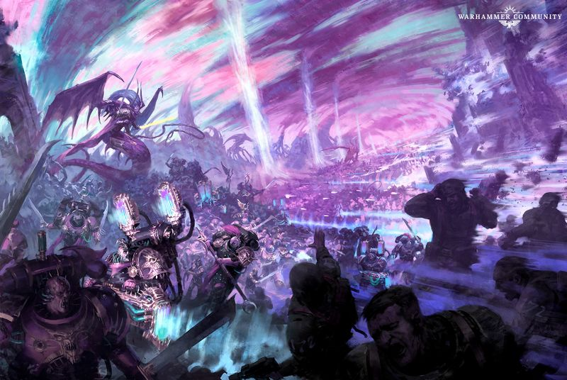

<!-- A0529-B0234 -->

原译文

Fulgrim leads the corrupted Emperor's Children 福格瑞姆率领腐化的帝皇之子

**校订译文**

Fulgrim leads the corrupted Emperor's Children 福格瑞姆率领腐化的帝皇之子

<!-- /A0529-B0234 -->

<!-- A0529-B0235 -->
**英文原文**

Today, the Emperor's Children have lost the technology and expertise to reproduce the original form of their unusually pure and efficient gene-seed. Like many modern Chaos Space Marine armies, modern Emperor's Children warbands will make do with stealing uncorrupted gene-seed from loyalist Chapters if their own is in short supply. Eidolon seeks vast amounts of loyalist gene-seed in order to rebuild the Emperor's Children into a proper Legion once more.

<!-- /A0529-B0235 -->

<!-- A0529-B0236 -->

原译文

如今，帝皇之子已经失去了复制其异常纯净和高效的基因种子的原始形式的技术和专业知识。与许多现代混沌星际战士一样，如果他们自己的基因种子短缺，现代帝皇之子将勉强从忠诚的战团中窃取未受破坏的基因种子。艾多隆寻求大量的忠诚基因种子，以便将帝皇之子再次重建成一个真正的军团。

**校订译文**

如今，帝皇之子已失去复制原先那种异常纯净、高效基因种子所需的技术与专门知识。与许多当代混沌星际战士军队一样，他们在自身储备不足时，便转而窃取忠诚战团未遭腐化的基因种子。艾多隆正谋求大量这样的种子，以将帝皇之子重新建立为真正的军团。

<!-- /A0529-B0236 -->

<!-- A0529-B0237 -->
## Noted Elements of the Emperor's Children 帝皇之子的著名力量

原题：Noted Elements of the Emperor's Children 帝皇之子的著名成员

<!-- /A0529-B0237 -->

<!-- A0529-B0238 -->
### Emperor's Children Armoury 帝皇之子军械库

<!-- /A0529-B0238 -->

<!-- A0529-B0239 -->
### Vessels 战舰

<!-- /A0529-B0239 -->

<!-- A0529-B0240 -->
**英文原文**

Pride of the Emperor - Flagship

<!-- /A0529-B0240 -->

<!-- A0529-B0241 -->

原译文

帝皇之傲号 - 旗舰

**校订译文**

帝皇之傲号 - 旗舰

<!-- /A0529-B0241 -->

<!-- A0529-B0242 -->
**英文原文**

Proudheart - Dictatus Class Battleship (Heresy-era)

<!-- /A0529-B0242 -->

<!-- A0529-B0243 -->

原译文

高傲之心号 - 独裁者级战列舰

**校订译文**

高傲之心号——独裁者级战列舰，服役于荷鲁斯之乱时期。

<!-- /A0529-B0243 -->

<!-- A0529-B0244 -->
**英文原文**

Andronius - Strike Cruiser and second Flagship

<!-- /A0529-B0244 -->

<!-- A0529-B0245 -->

原译文

安德罗尼乌斯号 - 打击巡洋舰和第二艘旗舰

**校订译文**

安德罗尼乌斯号 - 打击巡洋舰和第二艘旗舰

<!-- /A0529-B0245 -->

<!-- A0529-B0246 -->
**英文原文**

Wage of Sin - Battle Barge and flagship of Eidolon

<!-- /A0529-B0246 -->

<!-- A0529-B0247 -->

原译文

罪恶之酬号 - 战斗驳船和艾多隆的旗舰

**校订译文**

罪恶之酬号 - 战斗驳船和艾多隆的旗舰

<!-- /A0529-B0247 -->

<!-- A0529-B0248 -->
**英文原文**

Quarzhazat - Lunar Class Cruiser and flagship of the Radiant King.

<!-- /A0529-B0248 -->

<!-- A0529-B0249 -->

原译文

夸尔扎扎特号 - 月级巡洋舰和光辉之王的旗舰

**校订译文**

夸尔扎扎特号——月球级巡洋舰，光辉之王的旗舰。

**校注：** Lunar 词根沿核心月球级；原文此舰明确为 Cruiser 巡洋舰，不能据第230篇含Battleship的另条表述改变舰种。

<!-- /A0529-B0249 -->

<!-- A0529-B0250 -->
**英文原文**

Pulchritudinous - Former Cruiser of Fabius Bile

<!-- /A0529-B0250 -->

<!-- A0529-B0251 -->

原译文

俊美号 - 法比乌斯·拜尔的前巡洋舰

**校订译文**

俊美号 - 法比乌斯·拜尔的前巡洋舰

<!-- /A0529-B0251 -->

<!-- A0529-B0252 -->
**英文原文**

Herald of Pain - Base of Excrucias

<!-- /A0529-B0252 -->

<!-- A0529-B0253 -->

原译文

苦痛使者号 - 埃克斯克鲁西亚斯的基地

**校订译文**

苦痛使者号 - 埃克斯克鲁西亚斯的基地

<!-- /A0529-B0253 -->

<!-- A0529-B0254 -->
**英文原文**

Sybarite - Indrajit Class Heavy Cruiser (Horus Heresy)

<!-- /A0529-B0254 -->

<!-- A0529-B0255 -->

原译文

享乐者号 - 因陀罗耆特级重型巡洋舰

**校订译文**

享乐者号——因陀罗耆特级重型巡洋舰，服役于荷鲁斯之乱时期。

<!-- /A0529-B0255 -->

<!-- A0529-B0256 -->
### Notable Members of the Emperor's Children 帝皇之子的著名成员

<!-- /A0529-B0256 -->

<!-- A0529-B0257 -->
### Great Crusade and Heresy Era 大远征和叛乱时期

<!-- /A0529-B0257 -->

<!-- A0529-B0258 -->
### Senior Officers 高级军官

<!-- /A0529-B0258 -->

<!-- A0529-B0259 -->
**英文原文**

Fulgrim - Primarch

<!-- /A0529-B0259 -->

<!-- A0529-B0260 -->

原译文

福格瑞姆 - 原体

**校订译文**

福格瑞姆 - 原体

<!-- /A0529-B0260 -->

<!-- A0529-B0261 -->
**英文原文**

Thrallas - Legion Master prior to the discovery of Fulgrim

<!-- /A0529-B0261 -->

<!-- A0529-B0262 -->

原译文

萨尔阿斯 - 福格瑞姆回归前的军团长

**校订译文**

萨尔阿斯 - 福格瑞姆回归前的军团长

<!-- /A0529-B0262 -->

<!-- A0529-B0263 -->
**英文原文**

Abdemon - Lord Commander

<!-- /A0529-B0263 -->

<!-- A0529-B0264 -->

原译文

阿贝德蒙 - 领主指挥官

**校订译文**

阿贝德蒙 - 领主指挥官

<!-- /A0529-B0264 -->

<!-- A0529-B0265 -->
**英文原文**

Archorian - Lord Commander

<!-- /A0529-B0265 -->

<!-- A0529-B0266 -->

原译文

阿科里安 - 领主指挥官

**校订译文**

阿科里安 - 领主指挥官

<!-- /A0529-B0266 -->

<!-- A0529-B0267 -->
**英文原文**

Cyrius - Lord Commander

<!-- /A0529-B0267 -->

<!-- A0529-B0268 -->

原译文

西里乌斯 - 领主指挥官

**校订译文**

西里乌斯 - 领主指挥官

<!-- /A0529-B0268 -->

<!-- A0529-B0269 -->
**英文原文**

Eidolon - Lord Commander

<!-- /A0529-B0269 -->

<!-- A0529-B0270 -->

原译文

艾多隆 - 领主指挥官

**校订译文**

艾多隆 - 领主指挥官

<!-- /A0529-B0270 -->

<!-- A0529-B0271 -->
**英文原文**

Vespasian - Lord Commander

<!-- /A0529-B0271 -->

<!-- A0529-B0272 -->

原译文

维斯帕先 - 领主指挥官

**校订译文**

维斯帕先 - 领主指挥官

<!-- /A0529-B0272 -->

<!-- A0529-B0273 -->
**英文原文**

Fabius - Chief Apothecary and Lieutenant-Commander

<!-- /A0529-B0273 -->

<!-- A0529-B0274 -->

原译文

法比乌斯 - 首席药剂师和副指挥官

**校订译文**

法比乌斯 - 首席药剂师和副指挥官

<!-- /A0529-B0274 -->

<!-- A0529-B0275 -->
**英文原文**

Julius Kaesoron - First Captain

<!-- /A0529-B0275 -->

<!-- A0529-B0276 -->

原译文

尤里乌斯·卡索隆 - 第一连长

**校订译文**

尤里乌斯·卡索隆 - 第一连长

<!-- /A0529-B0276 -->

<!-- A0529-B0277 -->
**英文原文**

Solomon Demeter - Captain of the 2nd Company

<!-- /A0529-B0277 -->

<!-- A0529-B0278 -->

原译文

所罗门·德米特尔 - 第二连队连长

**校订译文**

所罗门·德米特尔 - 第二连队连长

<!-- /A0529-B0278 -->

<!-- A0529-B0279 -->
**英文原文**

Marius Vairosean - Captain of the 3rd Company

<!-- /A0529-B0279 -->

<!-- A0529-B0280 -->

原译文

马吕斯·瓦尔罗森 - 第三连队连长

**校订译文**

马吕斯·瓦尔罗森 - 第三连队连长

<!-- /A0529-B0280 -->

<!-- A0529-B0281 -->
**英文原文**

Saul Tarvitz - Captain of the 10th Company

<!-- /A0529-B0281 -->

<!-- A0529-B0282 -->

原译文

索尔·塔维兹 - 第10连队连长

**校订译文**

索尔·塔维兹——第 10 连连长。

<!-- /A0529-B0282 -->

<!-- A0529-B0283 -->
**英文原文**

Kasperos Telmar - Captain of the 12th Company

<!-- /A0529-B0283 -->

<!-- A0529-B0284 -->

原译文

卡斯佩罗斯·泰尔马 - 第12连队连长

**校订译文**

卡斯佩罗斯·泰尔马——第 12 连连长。

<!-- /A0529-B0284 -->

<!-- A0529-B0285 -->
**英文原文**

Lucius - Captain of the 13th Company

<!-- /A0529-B0285 -->

<!-- A0529-B0286 -->

原译文

卢修斯 - 第13连队连长

**校订译文**

卢修斯——第 13 连连长。

<!-- /A0529-B0286 -->

<!-- A0529-B0287 -->
**英文原文**

Ravasch Cario - Prefector of the Palatine Blades

<!-- /A0529-B0287 -->

<!-- A0529-B0288 -->

原译文

拉瓦什·卡里奥 - 宫廷剑士的提督

**校订译文**

拉瓦什·卡里奥 - 宫廷剑士的提督

<!-- /A0529-B0288 -->

<!-- A0529-B0289 -->
**英文原文**

Rylanor - Ancient of Rites

<!-- /A0529-B0289 -->

<!-- A0529-B0290 -->

原译文

瑞拉诺 - 古贤者

**校订译文**

瑞拉诺——仪典古贤者。

**校注：** Ancient of Rites 保留本稿古贤者称谓，并补出仪典职责，不将Ancient与普通军旗手统一处理。

<!-- /A0529-B0290 -->

<!-- A0529-B0291 -->
### Post-Heresy 叛乱后

<!-- /A0529-B0291 -->

<!-- A0529-B0292 -->
**英文原文**

Fulgrim - Daemon Primarch

<!-- /A0529-B0292 -->

<!-- A0529-B0293 -->

原译文

福格瑞姆 - 恶魔原体

**校订译文**

福格瑞姆 - 恶魔原体

<!-- /A0529-B0293 -->

<!-- A0529-B0294 -->
**英文原文**

Eidolon - Champion of Chaos

<!-- /A0529-B0294 -->

<!-- A0529-B0295 -->

原译文

艾多隆 - 混沌冠军

**校订译文**

艾多隆——混沌勇士。

<!-- /A0529-B0295 -->

<!-- A0529-B0296 -->
**英文原文**

Fabius Bile - Former Chief Apothecary who cooperated with the Legion until at least the Battle of Harmony. Now a renegade.

<!-- /A0529-B0296 -->

<!-- A0529-B0297 -->

原译文

法比乌斯·拜尔 - 前首席药剂师，至少在和谐星之战之前与军团合作。现在是个叛徒。

**校订译文**

法比乌斯·拜尔——前首席药剂师，至少直到和谐星之战时仍与军团合作，如今已脱离军团。

**校注：** 本段renegade指拜尔脱离军团；原译“现在是个叛徒”易掩盖其所叛离的对象。

<!-- /A0529-B0297 -->

<!-- A0529-B0298 -->
**英文原文**

Julius Kaesoron - Daemon Prince

<!-- /A0529-B0298 -->

<!-- A0529-B0299 -->

原译文

尤里乌斯·卡索隆 - 恶魔王子

**校订译文**

尤里乌斯·卡索隆——恶魔亲王。

<!-- /A0529-B0299 -->

<!-- A0529-B0300 -->
**英文原文**

Lucius the Eternal - Champion of Chaos

<!-- /A0529-B0300 -->

<!-- A0529-B0301 -->

原译文

不灭者卢修斯 - 混沌冠军

**校订译文**

不灭者卢修斯——混沌勇士。

<!-- /A0529-B0301 -->

<!-- A0529-B0302 图片 -->
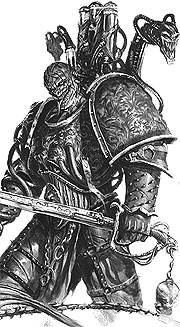

<!-- A0529-B0303 -->

原译文

Lucius the Eternal 不灭者卢修斯

**校订译文**

Lucius the Eternal 不灭者卢修斯

<!-- /A0529-B0303 -->

<!-- A0529-B0304 -->
**英文原文**

Telemachon Lyras - Former Second-in-command to warband leader Kadalus Orlantir, a lieutenant of the Black Legion during the Ninth Black Crusade

<!-- /A0529-B0304 -->

<!-- A0529-B0305 -->

原译文

泰雷玛克昂·莱拉斯 - 曾任第九次黑色远征期间黑色军团副官，战帮领导人卡达鲁斯·奥尔兰蒂尔的副指挥官

**校订译文**

泰雷玛克昂·莱拉斯——曾任战帮首领卡达鲁斯·奥尔兰蒂尔的副手，第九次黑色远征期间为黑色军团副官。

**校注：** 英文以逗号连接 former second-in-command 与 a lieutenant，后者的修饰对象略含混；本稿按条目主语泰雷玛克昂处理并保留待核，不额外指定卡达鲁斯的军职。

<!-- /A0529-B0305 -->

<!-- A0529-B0306 -->
**英文原文**

Zarghan Ironfist - Chaos Champion

<!-- /A0529-B0306 -->

<!-- A0529-B0307 -->

原译文

扎尔甘·铁拳 - 混沌冠军

**校订译文**

扎尔甘·铁拳——混沌勇士。

<!-- /A0529-B0307 -->

<!-- A0529-B0308 -->
**英文原文**

Tiberius Angellus Anteus - Lord Emissary, leader of the forces at Skalathrax, and whose death started the Battle of Skalathrax.

<!-- /A0529-B0308 -->

<!-- A0529-B0309 -->

原译文

提比略·安杰卢斯·安忒乌斯 - 使徒领主，斯卡拉特拉克斯部队的领袖，他的死引发了斯卡拉特拉克斯之战。

**校订译文**

提比略·安杰卢斯·安忒乌斯——使节领主，斯卡拉特拉克斯当地军队的首领；他的死引发了斯卡拉特拉克斯之战。

**校注：** Emissary 为使节，非Apostle使徒；暂定使节领主。

<!-- /A0529-B0309 -->

<!-- A0529-B0310 -->
**英文原文**

Doomrider - Daemon Prince of Slaanesh, speculated to be a member of the Emperor's Children.

<!-- /A0529-B0310 -->

<!-- A0529-B0311 -->

原译文

末日骑手 - 色孽恶魔王子，据推测，他是帝皇之子中的一员。

**校订译文**

末日骑手——色孽恶魔亲王，据推测曾是帝皇之子的一员。

<!-- /A0529-B0311 -->

<!-- A0529-B0312 -->
### Formations 编队

<!-- /A0529-B0312 -->

<!-- A0529-B0313 -->
### Great Crusade and Heresy Era 大远征和叛乱时期

<!-- /A0529-B0313 -->

<!-- A0529-B0314 -->

原译文

Phoenix Guard 凤凰卫队

**校订译文**

Phoenix Guard 凤凰卫队

<!-- /A0529-B0314 -->

<!-- A0529-B0315 -->

原译文

Palatine Blades 宫廷剑士

**校订译文**

Palatine Blades 宫廷剑士

<!-- /A0529-B0315 -->

<!-- A0529-B0316 -->

原译文

Wings of the Phoenician 紫庭凤凰之翼

**校订译文**

Wings of the Phoenician 紫庭凤凰之翼

<!-- /A0529-B0316 -->

<!-- A0529-B0317 -->
### Unique Troops & Vehicles 特有部队与载具

原题：Unique Troops & Vehicles 独特部队&载具

<!-- /A0529-B0317 -->

<!-- A0529-B0318 -->
**英文原文**

Lord Exultant (Post Heresy)

<!-- /A0529-B0318 -->

<!-- A0529-B0319 -->

原译文

欢欣领主（叛乱后）

**校订译文**

极乐领主（叛乱后）。

<!-- /A0529-B0319 -->

<!-- A0529-B0320 -->
**英文原文**

Lord Kakophonist (Post Heresy)

<!-- /A0529-B0320 -->

<!-- A0529-B0321 -->

原译文

噪音领主（叛乱后）

**校订译文**

噪音领主（叛乱后）

<!-- /A0529-B0321 -->

<!-- A0529-B0322 -->
**英文原文**

Kakophoni, also known as Noise Marines (Heresy-era and Post Heresy)

<!-- /A0529-B0322 -->

<!-- A0529-B0323 -->

原译文

噪音者，也被称为噪音战士（叛乱时期和叛乱后）

**校订译文**

卡科弗尼噪音部队，也称噪音战士（叛乱时期及叛乱后）。

**校注：** Kakophoni 沿第9篇核心卡科弗尼噪音部队；原文也称Noise Marines，但名称不可在所有时期与泛称完全互换。

<!-- /A0529-B0323 -->

<!-- A0529-B0324 图片 -->
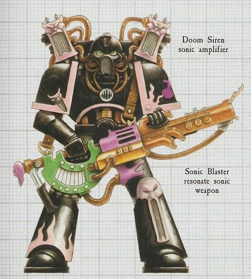

<!-- A0529-B0325 -->

原译文

Noise Marines 噪音战士

**校订译文**

Noise Marines 噪音战士

<!-- /A0529-B0325 -->

<!-- A0529-B0326 -->
**英文原文**

Terata, also known as Enhanced Warriors (Heresy-era and Post Heresy)

<!-- /A0529-B0326 -->

<!-- A0529-B0327 -->

原译文

特拉塔，也被称为强化战士

**校订译文**

特拉塔，又称强化战士（叛乱时期及叛乱后）。

**校注：** 补回原文时代限定。

<!-- /A0529-B0327 -->

<!-- A0529-B0328 -->
**英文原文**

Sonic Dreadnought (Post Heresy)

<!-- /A0529-B0328 -->

<!-- A0529-B0329 -->

原译文

声波无畏（叛乱后）

**校订译文**

音波无畏（叛乱后）。

<!-- /A0529-B0329 -->

<!-- A0529-B0330 -->
**英文原文**

Palatine Blades (Heresy-era)

<!-- /A0529-B0330 -->

<!-- A0529-B0331 -->

原译文

宫廷剑士（叛乱时期）

**校订译文**

宫廷剑士（叛乱时期）

<!-- /A0529-B0331 -->

<!-- A0529-B0332 -->
**英文原文**

Phoenix Guard (Heresy-era)

<!-- /A0529-B0332 -->

<!-- A0529-B0333 -->

原译文

凤凰卫队（叛乱时期）

**校订译文**

凤凰卫队（叛乱时期）

<!-- /A0529-B0333 -->

<!-- A0529-B0334 -->
**英文原文**

Sun Killers (Heresy-era)

<!-- /A0529-B0334 -->

<!-- A0529-B0335 -->

原译文

太阳杀手（叛乱时期）

**校订译文**

太阳杀手（叛乱时期）

<!-- /A0529-B0335 -->

<!-- A0529-B0336 -->
**英文原文**

Flawless Blades (Post Heresy)

<!-- /A0529-B0336 -->

<!-- A0529-B0337 -->

原译文

无暇之刃（叛乱后）

**校订译文**

无暇剑魔（叛乱后）。

<!-- /A0529-B0337 -->

<!-- A0529-B0338 -->
**英文原文**

Tormentors (Post Heresy)

<!-- /A0529-B0338 -->

<!-- A0529-B0339 -->

原译文

折磨者（叛乱后）

**校订译文**

施虐者（叛乱后）。

<!-- /A0529-B0339 -->

<!-- A0529-B0340 -->
**英文原文**

Infractors (Post Heresy)

<!-- /A0529-B0340 -->

<!-- A0529-B0341 -->

原译文

侵犯者（叛乱后）

**校订译文**

破戒者（叛乱后）。

<!-- /A0529-B0341 -->

本篇核心术语与暂定项

以下列出本篇出现的英文原形及核心术语表用词。同形词可能指不同对象，具体词义以本篇正文和校注为准；单复数、别名和仅见于图注的名称可能尚未列入。完整候选见[术语表](../../术语表/双语术语候选.csv)。

| 英文 | 采用中文 | 状态 |
| --- | --- | --- |
| Space Marines | 星际战士 | 官方已核对 |
| Dark Angels | 黑暗天使 | 官方已核对 |
| Space Wolves | 太空野狼 | 官方已核对 |
| Imperial Army | 帝国军 | 暂定·官方待核 |
| Chaos Space Marines | 混沌星际战士 | 官方已核对 |
| Death Guard | 死亡守卫 | 官方已核对 |
| World Eaters | 吞世者 | 官方已核对 |
| Psyker | 灵能者 | 官方已核对 |
| Ultramarines | 极限战士 | 官方已核对 |
| Horus Heresy | 荷鲁斯之乱 | 官方已核对 |
| Warp | 亚空间 | 官方已核对 |
| Great Rift | 大裂隙 | 官方已核对 |
| Imperium | 帝国 | 暂定·简称 |
| The Lost and the Damned | 迷失者与被诅咒者 | 暂定 |
| Sorcerer | 巫师 | 官方已核对 |
| Trazyn the Infinite | 无尽者塔拉辛 | 官方已核对 |
| Administratum | 内政部 | 暂定 |
| Adeptus Administratum | 内政部 | 暂定 |
| Eye of Terror | 恐惧之眼 | 官方已核对 |
| Imperial Fists | 帝国之拳 | 暂定 |
| Emperor | 帝皇 | 官方已核对 |
| Primarch | 原体 | 官方已核对 |
| Battle Barge | 战斗驳船 | 暂定·官方待核 |
| Word Bearers | 怀言者 | 暂定·官方待核 |
| Daemon Prince | 恶魔亲王 | 官方已核对 |
| Black Legion | 黑色军团 | 暂定·官方待核 |
| Emperor's Children | 帝皇之子 | 官方已核对 |
| Noise Marine | 噪音战士 | 官方已核对 |
| Slaanesh | 色孽 | 官方已核对 |
| Kakophoni | 卡科弗尼噪音部队 | 暂定·官方待核 |
| Iron Warriors | 钢铁勇士 | 暂定·官方待核 |
| Great Crusade | 大远征 | 暂定·官方待核 |
| Compliance | 归顺；纳入帝国统治 | 暂定·官方待核 |
| Ferrus Manus | 费鲁斯·马努斯 | 暂定·官方待核 |
| Terra | 泰拉 | 暂定·官方待核 |
| Luna Wolves | 影月苍狼 | 暂定·官方待核 |
| Horus | 荷鲁斯 | 暂定·官方待核 |
| The Brotherhood | 兄弟会 | 暂定·官方待核 |
| Sons of Horus | 荷鲁斯之子 | 暂定·官方待核 |
| Isstvan III | 伊斯塔万三号 | 暂定·官方待核 |
| The Diasporex | 流散者 | 暂定·官方待核 |
| Iron Hands | 钢铁之手 | 暂定·官方待核 |
| Solomon Demeter | 所罗门·得墨忒耳 | 暂定·官方待核 |
| Fulgrim | 福格瑞姆 | 官方已核对 |
| Thunder Warriors | 雷霆战士 | 暂定·官方待核 |
| Unification Wars | 统一战争 | 暂定·官方待核 |
| Salamanders | 火蜥蜴 | 暂定·官方待核 |
| Brotherhood | 兄弟会 | 暂定·官方待核 |
| Lucius | 卢修斯 | 暂定·官方待核 |
| Nocturne | 夜曲星 | 暂定·官方待核 |
| Luna | 月球 | 暂定·官方待核 |
| Chemos | 彻莫斯 | 暂定·官方待核 |
| Discordant | 失谐者 | 暂定·官方待核 |
| Master | 导师（审判庭职衔）／舰务官（舰员职务） | 语境定译·官方待核 |
| Mission | 教团／传教机构 | 暂定 |
| Palatine | 宫廷官 | 官方已核对 |
| Chief Apothecary | 首席药剂师 | 暂定·官方待核 |
| Progenoid glands | 基因存收腺 | 暂定·官方待核 |
| Apothecary | 药剂师 | 官方已核对 |
| Fabius Bile | 法比乌斯·拜尔 | 官方已核对 |
| Ancient | 旗手 | 官方已核对 |
| Maleum | 玛勒姆 | 暂定·官方待核 |
| Ullanor | 乌兰诺 | 暂定·官方待核 |
| Saturnine Gate | 土星之门 | 暂定·官方待核 |
| Lord Commander | 领主指挥官 | 暂定·官方待核 |
| Lieutenant | 副官 | 暂定·官方待核 |
| White Scars | 白疤 | 官方已核 |
| Raven Guard | 暗鸦守卫 | 官方已核 |
| Scars | 伤疤 | 暂定·官方待核 |
| Blackshields | 黑盾 | 暂定·官方待核 |
| Death Eagles | 死亡天鹰 | 暂定·官方待核 |
| Isstvan | 伊斯塔万 | 暂定·官方待核 |
| Legion Master | 军团长 | 暂定·官方待核 |
| Thrallas | 萨尔阿斯 | 暂定·官方待核 |
| First Captain | 第一连长 | 暂定·官方待核 |
| Eidolon | 艾多隆 | 暂定·官方待核 |
| Vespasian | 维斯帕西安 | 暂定·官方待核 |
| Julius Kaesoron | 尤利乌斯·凯索伦 | 暂定·官方待核 |
| Ezekyle Abaddon | 以泽凯尔·阿巴顿 | 暂定·官方待核 |
| Zardu Layak | 扎度·拉亚克 | 暂定·官方待核 |
| Champion | 冠军 | 暂定·官方待核 |
| Herald | 传令官 | 暂定·官方待核 |
| Lieutenant-Commander | 副指挥官 | 暂定·官方待核 |
| Space Marine | 星际战士 | 暂定·官方待核 |
| Captain | 连长 | 暂定·官方待核 |
| Terminators | 终结者 | 暂定·官方待核 |
| Brother | 修士 | 暂定·官方待核 |
| Scout | 侦察兵 | 暂定·官方待核 |
| Destroyers | 毁灭者 | 暂定·官方待核 |
| Land Speeders | 兰德速攻艇 | 暂定·官方待核 |
| Remnants | 残骸 | 暂定·官方待核 |
| Tormentors | 折磨者（星际战士战团）／施虐者（帝皇之子单位） | 语境定译·单位官译已核 |
| Gene-seed | 基因种子 | 暂定·官方待核 |
| Dictatus Class Battleship | 独裁者级战列舰 | 暂定·官方待核 |
| Strike Cruiser | 打击巡洋舰 | 暂定·官方待核 |
| Indrajit Class Heavy Cruiser | 因陀罗耆特级重型巡洋舰 | 暂定·官方待核 |
| Mortal | 凡人 | 暂定·官方待核 |
| Cohort | 大队 | 暂定·官方待核 |
| Lorgar | 珞珈 | 暂定·官方待核 |
| Host | 天军 | 暂定·官方待核 |
| Risen | 赦天使 | 暂定·官方待核 |
| Laer | 莱尔 | 暂定·官方待核 |
| Laeran | 莱兰 | 暂定·官方待核 |
| Cleansing of Laeran | 莱兰清洗 | 暂定·官方待核 |
| Kalium Gate | 卡利乌姆之门 | 暂定·官方待核 |
| Doomrider | 末日骑手 | 暂定·官方待核 |
| Lucius the Eternal | 不灭者卢修斯 | 官方已核对 |
| The Consortium | 共同体 | 暂定·官方待核 |
| Phoenix Conclave | 凤凰秘会 | 暂定·官方待核 |
| Incarnadine Host | 血色大军 | 暂定·官方待核 |
| Palatine Aquilla | 帝国天鹰 | 暂定·官方待核 |
| Selenar | 赛琳娜基因教派 | 暂定·官方待核 |
| House Loculus | 洛库卢斯家族 | 暂定·官方待核 |
| Komarg | 科马格 | 暂定·官方待核 |
| Pale Stars | 苍白群星 | 暂定·官方待核 |
| Doom Siren | 末日鸣笛器 | 暂定·官方待核 |
| Blastmaster | 爆裂大师 | 暂定·官方待核 |
| Sardar | 萨达尔 | 暂定·官方待核 |
| Brotherhood of the Phoenix | 凤凰兄弟会 | 暂定·官方待核 |
| The Perfect Fortress | 完美堡垒 | 暂定·官方待核 |
| Iydris | 伊德瑞斯 | 暂定·官方待核 |
| Catallus Rift | 卡塔鲁斯裂隙 | 暂定·官方待核 |
| Canticle City | 颂歌城 | 暂定·官方待核 |
| Harmony | 和谐星 | 暂定·官方待核 |
| Lunar Class Cruiser | 月球级巡洋舰 | 暂定·官方待核 |
| Ancient of Rites | 仪典古贤者 | 暂定·官方待核 |
| Lord Emissary | 使节领主 | 暂定·官方待核 |
| Sonic Dreadnought | 音波无畏 | 暂定·官方待核 |
| Saul Tarvitz | 索尔·塔维兹 | 暂定·官方待核 |
| Rylanor | 瑞拉诺 | 暂定·官方待核 |
| Telemachon Lyras | 泰雷玛克昂·莱拉斯 | 暂定·官方待核 |
| Lord Exultant | 极乐领主 | 官方已核对 |
| Lord Kakophonist | 噪音领主 | 官方已核对 |
| Flawless Blades | 无暇剑魔 | 官方已核对 |
| Infractors | 破戒者 | 官方已核对 |
| Cyrius | 西里乌斯 | 暂定·官方待核 |
| Primus | 领军 | 官方已核对 |
| Dreadnought | 无畏机甲 | 暂定·官方待核 |
| The Weapon | 武器 | 暂定·官方待核 |
| Perfect Fortress | 完美堡垒 | 暂定·官方待核 |
| Enhanced Warriors | 增强战士 | 暂定·官方待核 |
| Terata | 特拉塔 | 暂定·官方待核 |
| Pulchritudinous | 俊美号 | 暂定·官方待核 |
| Bear | 熊 | 暂定·官方待核 |
| Catallus | 卡塔鲁斯 | 暂定·官方待核 |
| The Dark | 《黑暗》 | 暂定·官方待核 |
| The Phoenician | 紫庭凤凰 | 暂定·官方待核 |
| Legion War | 军团战争 | 暂定·官方待核 |
| Eye of Terror Slave Wars | 恐惧之眼奴隶战争 | 暂定·官方待核 |
| Radiant King | 光辉之王 | 暂定·官方待核 |
| System | 星系（恒星系统） | 暂定·官方待核 |
| Solomon | 所罗门 | 暂定·官方待核 |
| Defiance | 反抗号 | 暂定·官方待核 |
| Abdemon | 阿布德蒙 | 暂定·官方待核 |
| Andronius | 安德罗尼乌斯号 | 暂定·官方待核 |
| Marius Vairosean | 马吕斯·瓦伊罗西恩 | 暂定·官方待核 |
| Phoenix Guard | 凤凰卫队 | 暂定·官方待核 |
| Incarnadine | 血色号 | 暂定·官方待核 |
| Proxima | 普罗西马 | 暂定·官方待核 |
| Kasperos Telmar | 卡斯佩罗斯·泰尔马 | 暂定·官方待核 |
| Lascannon | 激光炮 | 官方已核对 |
| Jetbike | 喷气摩托 | 暂定·官方待核 |
| Wage of Sin | 罪恶之酬号 | 暂定·官方待核 |
| Skalathrax | 斯卡拉特拉克斯 | 暂定·官方待核 |
| Sublime | 极端星 | 暂定·官方待核 |

