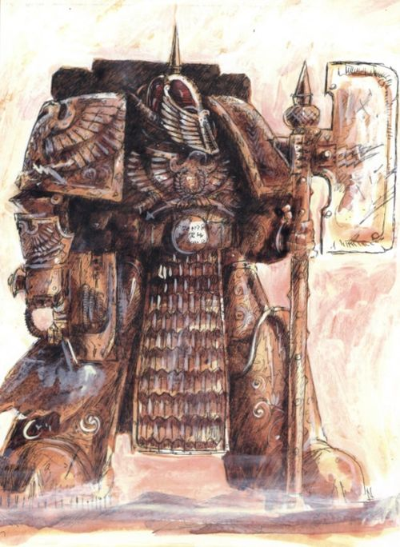

# 0530 凤凰卫队 Phoenix Guard

精校状态：中文行文已逐段精校，部分术语仍为暂定

分类：组织 / 混沌 Chaos / 混沌诸神 Chaos Gods / 混沌星际战士 Chaos Space Marine

原文来源：https://www.bilibili.com/opus/1031413714422595600

原作者：帝国神选罐头

原文时间：2025年02月08日 10:51

[返回分类目录](目录.md) · [全书目录](../../目录.md)

<!-- A0530-B0001 -->
**英文原文**

The Phoenix Guard were an elite unit within the Adeptus Astartes of the Emperor's Children and served as the personal bodyguards of their Primarch Fulgrim.

<!-- /A0530-B0001 -->

<!-- A0530-B0002 -->

原译文

凤凰卫队是阿斯塔特修会内的帝皇之子的一支精英部队，担任其原体福格瑞姆的个人护卫。

**校订译文**

凤凰卫队是帝皇之子中的精锐阿斯塔特部队，担任原体福格瑞姆的贴身护卫。

<!-- /A0530-B0002 -->

<!-- A0530-B0003 -->
## Overview 概述

<!-- /A0530-B0003 -->

<!-- A0530-B0004 -->
**英文原文**

The Phoenix Guard consisted of both standard Power Armour and Terminator Space Marines. Acting as honor guards for not only Fulgrim but also as an elite cadre that guarded officers that had gained the Primarch's favor. The greatest of the Phoenix Guard were known as Phoenix Wardens and acted as the personal guards of Fulgrim himself.

<!-- /A0530-B0004 -->

<!-- A0530-B0005 -->

原译文

凤凰卫队由标准动力盔甲和终结者星际战士组成。不仅担任福格瑞姆的荣誉卫队，还担任精英干部，保护获得原体青睐的军官。凤凰卫队中最伟大的一位被称为凤凰守护者，他本人也担任福格瑞姆的个人守卫。

**校订译文**

凤凰卫队既有身穿常规动力甲的战士，也有终结者。他们不仅担任福格瑞姆的荣誉卫队，还会保护受到原体青睐的军官。其中最杰出的成员称为凤凰守护者，负责直接护卫福格瑞姆本人。

**校注：** Phoenix Wardens 为复数，原译误说最伟大的一位；常规动力甲与终结者指两种装备的战士，不是卫队包含空护甲。

<!-- /A0530-B0005 -->

<!-- A0530-B0006 图片 -->

<!-- A0530-B0007 -->

原译文

Phoenix Guard Champion 凤凰卫队冠军

**校订译文**

Phoenix Guard Champion 凤凰卫队冠军

<!-- /A0530-B0007 -->

<!-- A0530-B0008 -->
**英文原文**

The Phoenix Guard wielded Phoenix Power Spears, deadly arcane Power Halberds based on the famed Guardian Spears of the Custodian Guard. They followed their leader where ever he went as part of their duties; even when he was travelling within the relative safety of the starships of the Imperial Navy. During the battle of Laer, they accompanied Fulgrim in the extermination of the Laeran species.

<!-- /A0530-B0008 -->

<!-- A0530-B0009 -->

原译文

凤凰卫队挥舞着凤凰动力长矛，这是一种致命的神秘动力长戟，基于著名的禁军戍卫之矛。作为职责的一部分，他们追随他们的领袖，无论他走到哪里；即使他在帝国海军星舰的相对安全范围内旅行。在刺人之战中，他们陪同福格瑞姆灭绝了刺人。

**校订译文**

凤凰卫队使用凤凰动力长矛，这是一种奥秘而致命的动力长戟，以禁军著名的戍卫之矛为蓝本。无论首领去往何处，他们都须随行护卫，即使是在相对安全的帝国海军舰船上也不例外。莱尔之战中，他们陪同福格瑞姆参与了对莱尔种族的灭绝。

<!-- /A0530-B0009 -->

<!-- A0530-B0010 -->
**英文原文**

The entire guard was killed on the planet Tarsus in the Perdus Region by Ulthwé Craftworld Eldar. A new Phoenix Guard was assembled and accompanied their Lord in a meeting with Warmaster Horus. They accompanied their master onto the Fist of Iron where they slaughtered the Iron Hands Morlock Terminators bodyguard detail when Fulgrim attempted to convince Ferrus Manus to join Horus's cause.

<!-- /A0530-B0010 -->

<!-- A0530-B0011 -->

原译文

整个卫队在佩尔杜斯星区的塔尔苏斯星上被乌斯维方舟世界灵族杀死。一支新的凤凰卫队被召集起来，陪同他们的主人与战帅荷鲁斯会面。当福格瑞姆试图说服费鲁斯·马努斯加入荷鲁斯的事业时，他们陪同他们的主人登上钢铁之拳号，在那里屠杀了钢铁之手莫洛克终结者护卫。

**校订译文**

凤凰卫队曾在佩尔杜斯地区的塔尔苏斯行星上，被乌斯维方舟世界的灵族全歼。重建后的卫队又随原体前去会见战帅荷鲁斯。福格瑞姆试图说服费鲁斯·马努斯加入荷鲁斯阵营时，他们随行登上钢铁之拳号，屠杀了担任护卫的钢铁之手莫洛克终结者。

**校注：** Region 暂作地区，不据此推定是正式Sector星区。

<!-- /A0530-B0011 -->

<!-- A0530-B0012 -->
## Known Members of the Phoenix Guard 凤凰卫队的著名成员

<!-- /A0530-B0012 -->

<!-- A0530-B0013 -->

原译文

Flavius Alkenex 弗莱维厄斯·阿尔克内斯

**校订译文**

Flavius Alkenex 弗莱维厄斯·阿尔克内斯

<!-- /A0530-B0013 -->

<!-- A0530-B0014 -->

原译文

Thestis 塞蒂斯

**校订译文**

Thestis 塞蒂斯

<!-- /A0530-B0014 -->

本篇核心术语与暂定项

以下列出本篇出现的英文原形及核心术语表用词。同形词可能指不同对象，具体词义以本篇正文和校注为准；单复数、别名和仅见于图注的名称可能尚未列入。完整候选见[术语表](../../术语表/双语术语候选.csv)。

| 英文 | 采用中文 | 状态 |
| --- | --- | --- |
| Space Marines | 星际战士 | 官方已核对 |
| Adeptus Astartes | 阿斯塔特修会 | 官方已核对 |
| Eldar | 灵族 | 暂定·语境区分 |
| Terminator | 终结者 | 官方已核对 |
| Imperial Navy | 帝国海军 | 暂定 |
| Ulthwé | 乌斯维 | 暂定 |
| Craftworld | 方舟世界 | 官方已核对 |
| Emperor | 帝皇 | 官方已核对 |
| Primarch | 原体 | 官方已核对 |
| Emperor's Children | 帝皇之子 | 官方已核对 |
| Ferrus Manus | 费鲁斯·马努斯 | 暂定·官方待核 |
| Horus | 荷鲁斯 | 暂定·官方待核 |
| Iron Hands | 钢铁之手 | 暂定·官方待核 |
| Fulgrim | 福格瑞姆 | 官方已核对 |
| Master | 导师（审判庭职衔）／舰务官（舰员职务） | 语境定译·官方待核 |
| Custodian Guard | 禁军卫队 | 官方已核对 |
| Cadre | 骨干连（寂静修女）／核心队（钛族） | 语境定译·钛族词根参考 |
| Power Armour | 动力盔甲 | 暂定·官方待核 |
| Terminators | 终结者 | 暂定·官方待核 |
| Laer | 莱尔 | 暂定·官方待核 |
| Laeran | 莱兰 | 暂定·官方待核 |
| Phoenix Wardens | 凤凰守护者 | 暂定·官方待核 |
| Perdus Region | 佩尔杜斯地区 | 暂定·官方待核 |
| Fist of Iron | 钢铁之拳号 | 暂定·官方待核 |
| Morlock | 莫洛克 | 暂定·官方待核 |
| Tarsus | 塔苏斯 | 暂定·官方待核 |
| Phoenix Guard | 凤凰卫队 | 暂定·官方待核 |

