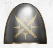
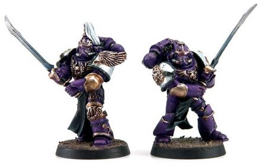

# 0531 宫廷剑士 Palatine Blades

精校状态：中文行文已逐段精校，部分术语仍为暂定

分类：组织 / 混沌 Chaos / 混沌诸神 Chaos Gods / 混沌星际战士 Chaos Space Marine

原文来源：https://www.bilibili.com/opus/1031035576954912774

原作者：帝国神选罐头

原文时间：2025年02月07日 10:24

[返回分类目录](目录.md) · [全书目录](../../目录.md)

<!-- A0531-B0001 -->
**英文原文**

The Palatine Blades was a specialist warrior-brotherhood of the Emperor's Children Legion during the Great Crusade and Horus Heresy.

<!-- /A0531-B0001 -->

<!-- A0531-B0002 -->

原译文

宫廷剑士是大远征和荷鲁斯叛乱时期帝皇之子军团的一个专业战士兄弟会。

**校订译文**

宫廷剑士是大远征及荷鲁斯之乱时期，帝皇之子军团中的特化战士兄弟会。

<!-- /A0531-B0002 -->

<!-- A0531-B0003 图片 -->

<!-- A0531-B0004 -->

原译文

Palatine Blades symbol 宫廷剑士标志

**校订译文**

Palatine Blades symbol 宫廷剑士标志

<!-- /A0531-B0004 -->

<!-- A0531-B0005 -->
## Overview 概述

<!-- /A0531-B0005 -->

<!-- A0531-B0006 -->
**英文原文**

The Palatine Blades existed outside the rigid formations of the Emperor's Children's military order, consisting of a dueling society to whose ranks consisted of those who had gained Fulgrim's favor. At the discretion of the lords of the Legion, members of the Palatine Blades without their own command fought together in battle, serving as a shining example of perfection in war to their Battle-Brothers.

<!-- /A0531-B0006 -->

<!-- A0531-B0007 -->

原译文

宫廷剑士存在于帝皇之子军事秩序的严格组成之外，由一个决斗学会组成，其队伍由那些获得福格瑞姆青睐的人组成。根据军团领主的自由裁量权，没有独立指挥权的宫廷战士成员们在战斗中协同作战，为他们的战斗兄弟树立了战争中完美表现的光辉典范。

**校订译文**

宫廷剑士独立于帝皇之子严格的常规编制，是由获福格瑞姆青睐的战士组成的决斗结社。军团领主可根据需要，将没有独立指挥职责的宫廷剑士编在一起作战，为同袍树立追求完美武艺的典范。

<!-- /A0531-B0007 -->

<!-- A0531-B0008 图片 -->

<!-- A0531-B0009 -->

原译文

Squad of Palatine Blades 宫廷剑士小队

**校订译文**

Squad of Palatine Blades 宫廷剑士小队

<!-- /A0531-B0009 -->

<!-- A0531-B0010 -->
**英文原文**

In battle, Palatine Blades fought with Power Swords, Power Lances, Bolt Pistols, and Grenades.

<!-- /A0531-B0010 -->

<!-- A0531-B0011 -->

原译文

在战斗中，宫廷剑士使用了动力剑、动力长枪、爆矢手枪和手榴弹。

**校订译文**

在战斗中，宫廷剑士使用了动力剑、动力长枪、爆矢手枪和手榴弹。

<!-- /A0531-B0011 -->

<!-- A0531-B0012 -->
## Notable Palatine Blades 著名宫廷剑士

<!-- /A0531-B0012 -->

<!-- A0531-B0013 -->
**英文原文**

Ravasch Cario — Prefector.

<!-- /A0531-B0013 -->

<!-- A0531-B0014 -->

原译文

拉瓦什·卡里奥 — 提督

**校订译文**

拉瓦什·卡里奥 — 提督

<!-- /A0531-B0014 -->

<!-- A0531-B0015 -->
**英文原文**

Rubitaille — Palatine Blade, part of Cohors Nasicae post-Heresy.

<!-- /A0531-B0015 -->

<!-- A0531-B0016 -->

原译文

鲁比泰尔 — 宫廷剑士，叛乱后纳希凯大队的一员

**校订译文**

鲁比泰尔 — 宫廷剑士，叛乱后纳希凯大队的一员

<!-- /A0531-B0016 -->

<!-- A0531-B0017 -->
**英文原文**

Egil Galerius — Palatine Blade, bodyguard of Cyrius.

<!-- /A0531-B0017 -->

<!-- A0531-B0018 -->

原译文

埃吉尔·加莱里乌斯 — 宫廷剑士，赛瑞乌斯的护卫

**校订译文**

埃吉尔·加莱里乌斯——宫廷剑士，西里乌斯的护卫。

**校注：** Cyrius 沿529西里乌斯，原稿赛瑞乌斯为异译。

<!-- /A0531-B0018 -->

本篇核心术语与暂定项

以下列出本篇出现的英文原形及核心术语表用词。同形词可能指不同对象，具体词义以本篇正文和校注为准；单复数、别名和仅见于图注的名称可能尚未列入。完整候选见[术语表](../../术语表/双语术语候选.csv)。

| 英文 | 采用中文 | 状态 |
| --- | --- | --- |
| Horus Heresy | 荷鲁斯之乱 | 官方已核对 |
| Emperor | 帝皇 | 官方已核对 |
| Emperor's Children | 帝皇之子 | 官方已核对 |
| Great Crusade | 大远征 | 暂定·官方待核 |
| Horus | 荷鲁斯 | 暂定·官方待核 |
| Fulgrim | 福格瑞姆 | 官方已核对 |
| Brotherhood | 兄弟会 | 暂定·官方待核 |
| Palatine | 宫廷官 | 官方已核对 |
| Cyrius | 西里乌斯 | 暂定·官方待核 |
| Bolt | 爆矢 | 暂定·官方待核 |

