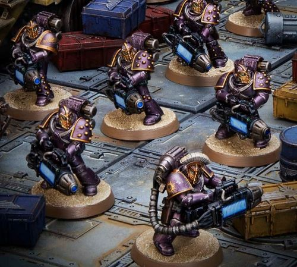

# 0532 太阳杀手 Sun Killer

精校状态：中文行文已逐段精校，部分术语仍为暂定

分类：组织 / 混沌 Chaos / 混沌诸神 Chaos Gods / 混沌星际战士 Chaos Space Marine

原文来源：https://www.bilibili.com/opus/1034708993761607683

原作者：帝国神选罐头

原文时间：2025年02月17日 07:59

[返回分类目录](目录.md) · [全书目录](../../目录.md)

<!-- A0532-B0001 -->
**英文原文**

The Sun Killers were the Emperor's Children Legion's veteran Heavy Support Squads, during the Great Crusade and Horus Heresy, that were exclusively armed with heavy Energy Weapons.

<!-- /A0532-B0001 -->

<!-- A0532-B0002 -->

原译文

在大远征和荷鲁斯叛乱期间，太阳杀手是帝皇之子军团的资深重型支援小队，他们专门配备了重型能量武器。

**校订译文**

太阳杀手是帝皇之子在大远征与荷鲁斯之乱期间的老兵重支援小队，专门装备重型能量武器。

<!-- /A0532-B0002 -->

<!-- A0532-B0003 图片 -->

<!-- A0532-B0004 -->

原译文

Sun Killer Squad 太阳杀手小队

**校订译文**

Sun Killer Squad 太阳杀手小队

<!-- /A0532-B0004 -->

<!-- A0532-B0005 -->
## Description 描述

<!-- /A0532-B0005 -->

<!-- A0532-B0006 -->
**英文原文**

Arrogance is suspected to be the reason behind their eschewing indiscriminate primitive projectile weapons, in favor of more elegant and precise energy weapons. The Sun Killers used these to great effect in war, operated far ahead of their Legion's battle lines, in pursuit of an enemy's largest bioforms or war machines. In doing so, they ensured that they and they alone destroyed such targets, with exacting precision and defined kill shots. In the rare instances that the Emperor's Children opted to make a strategic departure from the field, it fell to the Sun Killers to provide covering fire for their Battle Brothers. They were not compelled to do so by oath or duty, however, but out of boastful pride.

<!-- /A0532-B0006 -->

<!-- A0532-B0007 -->

原译文

傲慢被怀疑是他们避开滥杀滥伤的原始投射武器，转而使用更优雅、更精确的能量武器的原因。太阳杀手在战争中使用了这些武器，远远领先于他们的军团战线，追猎敌人最大的生物或战争机器。在这样做的过程中，他们确保了他们自己以如此的精确度和明确的杀伤性射击摧毁了这些目标。在极少数情况下，帝皇之子选择战略性地离开战场，太阳杀手为他们的战斗兄弟提供掩护火力。然而，他们这样做并不是出于誓言或责任，而是出于自身的骄傲。

**校订译文**

有人猜测，他们出于傲慢而摒弃难以精准控制的原始实弹武器，偏爱更加优雅、精确的能量武器。太阳杀手能充分发挥这些武器的威力，常深入军团战线前方，追猎敌军最庞大的生物或战争机器，以精确的致命射击确保目标完全由自己击毁，不让旁人分享战功。在帝皇之子极少数选择战略撤退的情况下，太阳杀手负责为同袍提供掩护火力。但驱使他们如此行事的，并非誓言或职责，而是夸耀自身的骄傲。

<!-- /A0532-B0007 -->

<!-- A0532-B0008 -->
**英文原文**

When they were grouped in squadrons, they were individually referred to as a Sun Killer and were led by officers known as a Novaetor. The elite of their formation bore the mark of the Sundered Star upon their gilded panoply. These warriors were renowned across the Imperium, due to their Great Crusade exploits, where they had, time and again, sought out and defeated the deadliest Xenos monstrosities and armored behemoths. Curiously information about Sun Killer squads that failed in their mission, or fell to the enemy, though, are all but unknown. Some believe that all such failures are stricken from the Emperor's Children's records by order of their Primarch Fulgrim himself. In doing so, their was nothing left to tarnish the flawless honor associated with the Sun Killers.

<!-- /A0532-B0008 -->

<!-- A0532-B0009 -->

原译文

当他们被分成中队时，他们被单独称为太阳杀手，由被称为新星的军官领导。他们队伍中的精英们在镀金的盔甲上刻着割裂之星的印记。这些战士因其大远征的功绩而闻名于帝国，他们一次又一次地寻找并击败了最致命的异型怪物和装甲巨兽。然而，关于在任务中失败或落入敌手的太阳杀手小队的新奇信息几乎都是未知的。有些人认为，所有这些失败都是根据他们的原体福格瑞姆本人的命令从帝皇之子的记录中删除的。他们这样做就没有什么可以玷污与太阳杀手相关的完美荣誉了。

**校订译文**

他们以小队形式作战，成员各称太阳杀手，由称作“新星”的军官率领。部队精锐会在镀金甲胄上佩戴割裂之星的标志。大远征期间，他们屡次主动猎杀最危险的异形怪物与装甲巨兽，由此名震帝国。奇怪的是，几乎没有关于太阳杀手任务失败或战死的记录。有些人认为，是福格瑞姆亲自下令，将所有此类败绩从军团档案中删去，使太阳杀手的完美荣誉不留一丝污点。

**校注：** curiously 修饰“缺乏失败记录令人奇怪”，原译“新奇信息”错误；fell to the enemy 在此指被敌击杀或击败，不等于被俘。Novaetor 沿原稿“新星”职衔暂定，未据Latin词根自造官译。

<!-- /A0532-B0009 -->

<!-- A0532-B0010 -->
## Known Sun Killers 著名太阳杀手

<!-- /A0532-B0010 -->

<!-- A0532-B0011 -->

原译文

Helion 赫利翁

**校订译文**

Helion 赫利翁

<!-- /A0532-B0011 -->

本篇核心术语与暂定项

以下列出本篇出现的英文原形及核心术语表用词。同形词可能指不同对象，具体词义以本篇正文和校注为准；单复数、别名和仅见于图注的名称可能尚未列入。完整候选见[术语表](../../术语表/双语术语候选.csv)。

| 英文 | 采用中文 | 状态 |
| --- | --- | --- |
| Horus Heresy | 荷鲁斯之乱 | 官方已核对 |
| Imperium | 帝国 | 暂定·简称 |
| Emperor | 帝皇 | 官方已核对 |
| Primarch | 原体 | 官方已核对 |
| Emperor's Children | 帝皇之子 | 官方已核对 |
| Great Crusade | 大远征 | 暂定·官方待核 |
| Horus | 荷鲁斯 | 暂定·官方待核 |
| Fulgrim | 福格瑞姆 | 官方已核对 |
| Mission | 教团／传教机构 | 暂定 |
| Veteran | 老兵 | 暂定·官方待核 |
| Xenos | 异形 | 暂定·官方待核 |
| Novaetor | 新星 | 暂定·官方待核 |
| Sundered Star | 割裂之星 | 暂定·官方待核 |
| Gilded Panoply | 覆金之铠 | 暂定·官方待核 |

