# 0534 IV - 钢铁勇士 Iron Warriors

精校状态：中文行文已逐段精校，部分术语仍为暂定

分类：组织 / 混沌 Chaos / 混沌诸神 Chaos Gods / 混沌星际战士 Chaos Space Marine

原文来源：https://www.bilibili.com/opus/1093430722934341635

原作者：帝国神选罐头

原文时间：2025年07月25日 13:49

[返回分类目录](目录.md) · [全书目录](../../目录.md)

<!-- A0534-B0001 -->
**英文原文**

The Iron Warriors were the IV Legion of the twenty original Space Marine Legions, sons of the Primarch Perturabo. They were one of the nine legions which betrayed the Emperor during the Horus Heresy, becoming Chaos Space Marines.

<!-- /A0534-B0001 -->

<!-- A0534-B0002 -->

原译文

钢铁勇士是二十个原初星际战士军团中的第四军团，是原体佩图拉博的子嗣。他们是荷鲁斯叛乱期间背叛帝皇的九个军团之一，成为混沌星际战士。

**校订译文**

钢铁勇士是最初二十支星际战士军团中的第四军团，原体佩图拉博的子嗣。他们是荷鲁斯之乱中背叛帝皇的九支军团之一，此后成为混沌星际战士。

<!-- /A0534-B0002 -->

<!-- A0534-B0003 图片 -->
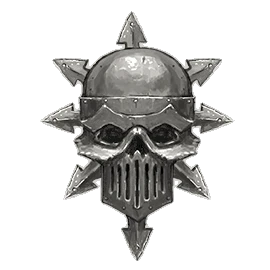

<!-- A0534-B0004 图片 -->
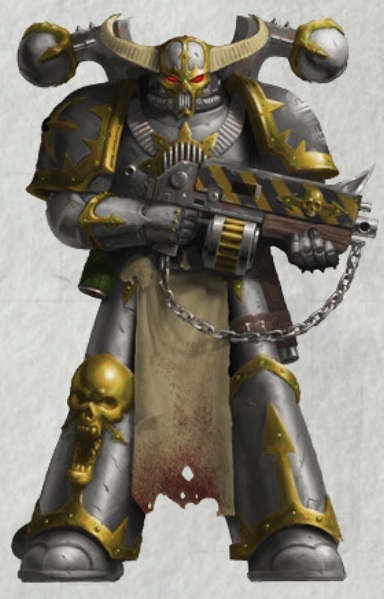

<!-- A0534-B0005 -->
**英文原文**

Legion Number:IV

<!-- /A0534-B0005 -->

<!-- A0534-B0006 -->

原译文

军团编号：IV

**校订译文**

军团编号：IV

<!-- /A0534-B0006 -->

<!-- A0534-B0007 -->
**英文原文**

Primarch:Perturabo

<!-- /A0534-B0007 -->

<!-- A0534-B0008 -->

原译文

原体：佩图拉博

**校订译文**

原体：佩图拉博

<!-- /A0534-B0008 -->

<!-- A0534-B0009 -->
**英文原文**

Homeworld:Olympia

<!-- /A0534-B0009 -->

<!-- A0534-B0010 -->

原译文

家园世界：奥林匹亚

**校订译文**

家园世界：奥林匹亚

<!-- /A0534-B0010 -->

<!-- A0534-B0011 -->
**英文原文**

Current Base:Medrengard in the Eye of Terror

<!-- /A0534-B0011 -->

<!-- A0534-B0012 -->

原译文

当前基地：恐惧之眼的梅林德加德

**校订译文**

当前基地：恐惧之眼的梅林德加德

<!-- /A0534-B0012 -->

<!-- A0534-B0013 -->
**英文原文**

Chaos Affiliation:Chaos Undivided

<!-- /A0534-B0013 -->

<!-- A0534-B0014 -->

原译文

混沌隶属：混沌无分

**校订译文**

混沌归属：无分混沌。

<!-- /A0534-B0014 -->

<!-- A0534-B0015 -->
**英文原文**

Colours:Silver armour, gold trim, black shoulder pads

<!-- /A0534-B0015 -->

<!-- A0534-B0016 -->

原译文

颜色：银色盔甲，金色装饰，黑色肩甲

**校订译文**

颜色：银色盔甲，金色装饰，黑色肩甲

<!-- /A0534-B0016 -->

<!-- A0534-B0017 -->
**英文原文**

Specialty:Siege Warfare

<!-- /A0534-B0017 -->

<!-- A0534-B0018 -->

原译文

专业：围攻战

**校订译文**

专长：攻城战。

<!-- /A0534-B0018 -->

<!-- A0534-B0019 -->
**英文原文**

Battle Cry:Iron Within, Iron Without!

<!-- /A0534-B0019 -->

<!-- A0534-B0020 -->

原译文

战吼：内外皆钢！

**校订译文**

战吼：内外皆钢！

<!-- /A0534-B0020 -->

<!-- A0534-B0021 -->
**英文原文**

Known Warbands

<!-- /A0534-B0021 -->

<!-- A0534-B0022 -->

原译文

著名战帮

**校订译文**

著名战帮

<!-- /A0534-B0022 -->

<!-- A0534-B0023 -->

原译文

Abrial's Claw 阿布瑞尔之爪

**校订译文**

Abrial's Claw 阿布瑞尔之爪

<!-- /A0534-B0023 -->

<!-- A0534-B0024 -->

原译文

Anathraxis Warhost 阿纳瑟拉斯战帮

**校订译文**

Anathraxis Warhost 阿纳瑟拉斯战帮

<!-- /A0534-B0024 -->

<!-- A0534-B0025 -->

原译文

Barbican Lords 巴比肯领主

**校订译文**

Barbican Lords 巴比肯领主

<!-- /A0534-B0025 -->

<!-- A0534-B0026 -->

原译文

Bitter Sons 苦涩之子

**校订译文**

Bitter Sons 苦涩之子

<!-- /A0534-B0026 -->

<!-- A0534-B0027 -->

原译文

The Bloodborn 血裔

**校订译文**

The Bloodborn 血裔

<!-- /A0534-B0027 -->

<!-- A0534-B0028 -->

原译文

Born of Iron 铁裔

**校订译文**

Born of Iron 铁裔

<!-- /A0534-B0028 -->

<!-- A0534-B0029 -->

原译文

Chromite Beasts 铬铁野兽

**校订译文**

Chromite Beasts 铬铁野兽

<!-- /A0534-B0029 -->

<!-- A0534-B0030 -->

原译文

Deathmaul 死槌

**校订译文**

Deathmaul 死槌

<!-- /A0534-B0030 -->

<!-- A0534-B0031 -->

原译文

Effacers of Medrengard 梅林德加德抹消者

**校订译文**

Effacers of Medrengard 梅林德加德抹消者

<!-- /A0534-B0031 -->

<!-- A0534-B0032 -->

原译文

Ferrocratic Creed 铁权信条

**校订译文**

Ferrocratic Creed 铁权信条

<!-- /A0534-B0032 -->

<!-- A0534-B0033 -->

原译文

Forgemaws 铸炉之喉

**校订译文**

Forgemaws 铸炉之喉

<!-- /A0534-B0033 -->

<!-- A0534-B0034 -->

原译文

Hammers Relentless 无情铁锤

**校订译文**

Hammers Relentless 无情铁锤

<!-- /A0534-B0034 -->

<!-- A0534-B0035 -->

原译文

Iron Fist 钢铁之拳

**校订译文**

Iron Fist 钢铁之拳

<!-- /A0534-B0035 -->

<!-- A0534-B0036 -->

原译文

Metal Claw 金属之爪

**校订译文**

Metal Claw 金属之爪

<!-- /A0534-B0036 -->

<!-- A0534-B0037 -->

原译文

Oppressors 压迫者

**校订译文**

Oppressors 压迫者

<!-- /A0534-B0037 -->

<!-- A0534-B0038 -->

原译文

Pitiless 无情

**校订译文**

Pitiless 无情

<!-- /A0534-B0038 -->

<!-- A0534-B0039 -->

原译文

Rebuilt 重组

**校订译文**

Rebuilt 重组

<!-- /A0534-B0039 -->

<!-- A0534-B0040 -->

原译文

Savagers 野蛮人

**校订译文**

Savagers 野蛮人

<!-- /A0534-B0040 -->

<!-- A0534-B0041 -->

原译文

Scions of Medrengard 梅林德加德之裔

**校订译文**

Scions of Medrengard 梅林德加德之裔

<!-- /A0534-B0041 -->

<!-- A0534-B0042 -->

原译文

Siege-masters Olympian 奥林匹亚围攻大师

**校订译文**

Siege-masters Olympian 奥林匹亚围攻大师

<!-- /A0534-B0042 -->

<!-- A0534-B0043 -->

原译文

Sons of the Forge 铸炉之子

**校订译文**

Sons of the Forge 铸炉之子

<!-- /A0534-B0043 -->

<!-- A0534-B0044 -->

原译文

Steel Brethren 钢铁兄弟

**校订译文**

Steel Brethren 钢铁兄弟

<!-- /A0534-B0044 -->

<!-- A0534-B0045 -->
**英文原文**

Their specialty is siege warfare and the reduction of fortified positions, which made them natural rivals of the Imperial Fists even before the Heresy. The Iron Warriors are also fierce close-range fighters, witnesses comparing their ferocity to the berserkers of the World Eaters traitor legion or the loyalist Blood Angels. They make common use of slave-soldiers as cannon fodder to wither the ammunition supplies of the besieged and to locate the positions of enemy gun emplacements. Like the Iron Hands they used bionics often to replace mutated limbs, as they hated all forms of mutation.

<!-- /A0534-B0045 -->

<!-- A0534-B0046 -->

原译文

他们的专长是攻城战和突破防御阵地，这使他们在叛乱之前就成为了帝国之拳的天然对手。钢铁勇士也是凶猛的近距离战士，目击者将他们的凶猛比作吞世者叛徒军团或忠诚的圣血天使的狂战士。他们经常使用奴隶士兵作为炮灰，以减少被围困者的弹药供应，并确定敌方炮位的位置。像钢铁之手一样，他们经常使用仿生部件来代替变异的肢体，因为他们讨厌所有形式的变异。

**校订译文**

钢铁勇士擅长攻城与摧毁坚固阵地，早在叛乱之前，就与帝国之拳形成天然的竞争。他们同样是凶猛的近战战士，见证者甚至将其悍勇与吞世者狂战士、或忠诚派的圣血天使相提并论。他们常以奴隶士兵作炮灰，消耗守军弹药并试探敌方火力点。由于憎恶一切突变，他们也像钢铁之手一样广泛采用机械义体，替换发生突变的肢体。

<!-- /A0534-B0046 -->

<!-- A0534-B0047 -->
## History 历史

<!-- /A0534-B0047 -->

<!-- A0534-B0048 -->
### Origins 起源

<!-- /A0534-B0048 -->

<!-- A0534-B0049 -->
**英文原文**

Originally created as the IVth Legion, the Legion was founded atop the wreckage of a recidivist fortress on the Terran Auro Plateau of Sek-Amrak. The warlike gun-tribes in the surrounding areas made up the first of the Legion's Marines. The early IVth Legion proved itself in the Unification Wars, making its domain one of the most stalwart bastions of the Emperor. The Legion's gene-seed showed above average adaptability and a below average resistance rate to Bionics. This allowed the Legion to be one of the largest and the earliest deployed alongside the I Legion and V Legion.

<!-- /A0534-B0049 -->

<!-- A0534-B0050 -->

原译文

最初创建为第四军团，该军团建立在泰拉萨克-阿姆瑞克的奥罗高原上一座累犯堡垒的废墟之上。周围地区好战的枪火部落组成了军团的第一支星际战士。早期的第四军团在统一战争中证明了自己，使其领地成为帝皇最坚固的堡垒之一。军团的基因种子对仿生部件表现出高于平均水平的适应性和低于平均水平的抗性。这使得该军团成为与第一军团和第五军团并肩部署的最大、最早的军团之一。

**校订译文**

第四军团最初建立于泰拉萨克-阿姆瑞克的奥罗高原，驻地建在一座反叛要塞的废墟之上。周边好战的持枪部落提供了第一批新兵。统一战争期间，军团证明了自身实力，将所在地区变为帝皇最坚实的支柱之一。其基因种子适应性高于平均水平，对机械义体的排异倾向也较低，因此能较早扩充为庞大军团，与第一、第五军团一同投入早期战事。

**校注：** recidivist fortress 指反叛势力的要塞，原稿“累犯堡垒”过于按刑法字面套用。

<!-- /A0534-B0050 -->

<!-- A0534-B0051 图片 -->
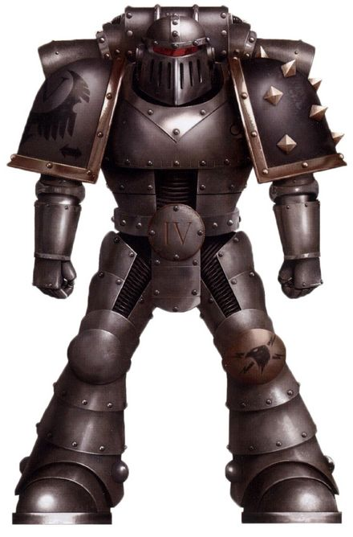

<!-- A0534-B0052 -->

原译文

Unification Wars-era Iron Warrior 统一战争时期钢铁勇士

**校订译文**

Unification Wars-era Iron Warrior 统一战争时期钢铁勇士

<!-- /A0534-B0052 -->

<!-- A0534-B0053 -->
**英文原文**

The Legion continued to distinguish itself in the conquest of the Sol System during the early days of the Great Crusade, winning honours in many battles, most notably in the Mehr Yasht campaign on Venus, where the IVth Legion was commanded by the Emperor himself to defeat the deadly Litho-Gholem armies of the War Witches. In light of their early successes, the Legion was given first access to new equipment being delivered from Mars. The Legion led the 8th Expeditionary Fleet, which distinguished itself in many campaigns. However, the Legion did not adapt their tactics to the new realities of the expanding Crusade and was called unimaginative by other Space Marine Legions and by Horus himself. Horus however was impressed by their stubbornness and would use the Legion to fight inglorious but vital campaigns of attrition. They soon became known as the workhorse Legion, relied upon for their tenacity and to follow orders to the letter. It was during this time that the Legion began to spread itself out, garrisoning many worlds and fighting many smaller campaigns across the expanding Imperium.

<!-- /A0534-B0053 -->

<!-- A0534-B0054 -->

原译文

在大远征的早期，军团在征服太阳系的过程中继续脱颖而出，在许多战斗中赢得了荣誉，最著名的是在金星上的梅赫·亚什特战役中，第四军团由帝皇亲自指挥，击败了战争女巫的致命岩石魔像军队。鉴于他们早期的成功，军团首次获得了从火星运送的新设备。军团领导了第八远征舰队，该舰队在许多战役中都表现出色。然而，军团并没有使他们的战术适应不断扩大的远征的新现实，并被其他星际战士军团和荷鲁斯本人称为缺乏想象力。然而，荷鲁斯对他们的固执印象深刻，并将利用军团进行不光彩但至关重要的消耗战。他们很快就被称为主力军团，依靠他们的坚韧和严格遵守命令。正是在这段时间里，军团开始向外扩张，驻扎了许多世界，并在不断扩大的帝国中进行了许多较小的战役。

**校订译文**

大远征初期，第四军团在征服太阳系的战争中继续立功，最著名的是金星的梅赫·亚什特战役：他们在帝皇亲自指挥下，击败了战争女巫麾下致命的岩石魔像大军。早期战功使军团优先获得火星运来的新装备。他们率领第八远征舰队，屡建功勋，却未能随远征范围扩大而调整战术，因此被其他星际战士军团乃至荷鲁斯批评缺乏想象力。不过，荷鲁斯赞赏他们的顽强，常派他们执行不受瞩目却至关重要的消耗战任务。军团很快以埋头苦战、坚韧可靠且严格服从命令而闻名。此时，他们的兵力也开始分散，在不断扩张的帝国各处驻守行星、参加小型战役。

**校注：** first access 为优先取得装备，不是首次拿到装备。

<!-- /A0534-B0054 -->

<!-- A0534-B0055 -->
**英文原文**

One of the Legion's most tragic episodes would come in 842.M30 during the liberation of the Forge World of Incaladion: The stubborn IVth Legion used their typical tactics of heavy artillery and armoured spearheads, and suffered staggering losses in a protracted siege. Nearly 29,000 Legionaries died over the yearlong campaign, virtually annihilating the 8th Expeditionary Fleet.

<!-- /A0534-B0055 -->

<!-- A0534-B0056 -->

原译文

军团最悲惨的事件之一发生在842.M30，英卡拉迪翁铸造世界解放期间：顽固的第四军团使用了他们典型的重型火炮和装甲矛头战术，在长期围困中遭受了惊人的损失。在长达一年的战役中，近29000名军团士兵死亡，几乎消灭了第8远征舰队。

**校订译文**

842.M30 解放英卡拉迪翁铸造世界时，军团遭逢最惨痛的灾难之一。第四军团固守重炮配合装甲矛头的惯用战术，在漫长围攻中付出惊人代价。近二万九千名军团战士死于这场持续一年的战役，第八远征舰队几乎全军覆没。

<!-- /A0534-B0056 -->

<!-- A0534-B0057 -->
**英文原文**

Meanwhile, the Iron Warriors' Primarch, Perturabo, was raised on Olympia, a mountainous planet divided into warring city-states. Because of the rugged terrain, military supremacy revolved around the construction of stone fortresses and the control of strategic mountain passes. Perturabo had an affinity for cold logic and the use of technology which made him a superb military engineer. By the time the Emperor's Great Crusade reached Olympia, Perturabo was warlord to the Tyrant of Lochos. As was his custom when one of his lost sons was found, the Emperor gave Perturabo rule over his home planet and relocated his Legion's headquarters there. Upon taking command of his Legion, Perturabo reviewed the war record of his new forces. After extensively analysing their record, effectiveness, doctrines and practices, Perturabo found them wanting. His punishment was decimation. By lottery, one in every ten Legionaries was chosen to be beaten to death by his comrades. Such would be Perturabo's reign: brutal and unforgiving.

<!-- /A0534-B0057 -->

<!-- A0534-B0058 -->

原译文

与此同时，钢铁勇士的原体佩图拉博在奥林匹亚长大，奥林匹亚是一个多山的星球，被划分为交战的城邦。由于地形崎岖，军事霸权围绕着建造石头堡垒和控制战略山口展开。佩图拉博对冷逻辑和技术的使用有着浓厚的兴趣，这使他成为一名出色的军事工程师。当帝皇的大远征到达奥林匹亚时，佩图拉博已经是洛科斯暴君的军阀。按照他的惯例，当他的一个失踪的子嗣被发现时，帝皇让佩图拉博统治他的家园行星，并将他的军团总部迁至那里。在接管他的军团后，佩图拉博回顾了他的新部队的战争记录。在广泛分析了他们的记录、有效性、理论和实践后，佩图拉博发现他们存在不足。他的惩罚是毁灭性的。通过抽签，每十名军团士兵中就有一人被他的战友们殴打致死。这就是佩图拉博的统治：残酷无情。

**校订译文**

与此同时，佩图拉博在奥林匹亚长大。这颗多山行星分裂为相互征战的城邦；崎岖地形使军事优势取决于石砌要塞的构筑与战略山隘的控制。佩图拉博长于冷静推理与技术运用，成为卓越的军事工程师。帝皇的大远征抵达奥林匹亚时，他已是洛科斯僭主麾下的军事统帅。帝皇依照寻回原体后的惯例，将母星统治权授予佩图拉博，并把军团总部迁到那里。接掌军团后，佩图拉博详细审查其战史、效能、作战理论与实际做法，却认为表现远未达标。他施以十分抽一的处死惩罚：每十名战士抽出一人，由同袍活活打死。残酷而不容宽恕的统治由此开始。

**校注：** decimation 指每十人处死一人的具体刑罚，原稿“毁灭性的”漏掉制度含义；正文已用完整释义。

<!-- /A0534-B0058 -->

<!-- A0534-B0059 -->
**英文原文**

Even before they were reunited with their Primarch, the Space Marines of the IV Legion had inherited his military qualities. Perturabo quickly recruited new troops from Olympia and embarked on a campaign against the nearby moon base known as the Rock of Judgement, ruled by the Black Judges. It was a stunning success, though only fragmentary records of it survive in the aftermath of the Horus Heresy.

<!-- /A0534-B0059 -->

<!-- A0534-B0060 -->

原译文

甚至在他们与原体团聚之前，第四军团的星际战士就继承了他的军事品质。佩图拉博迅速从奥林匹亚招募了新的部队，并开始对附近的被称为审判之岩的卫星基地发动战役，该基地由黑色法官统治。这是一个惊人的成功，尽管在荷鲁斯叛乱之后，只有零星的记录幸存下来。

**校订译文**

第四军团在与原体重聚之前，就已继承了他的军事特质。佩图拉博迅速从奥林匹亚征兵，随后进攻邻近卫星上的审判之岩基地；那里由黑色法官统治。这场战役取得辉煌胜利，但荷鲁斯之乱后，仅有零散记录留存。

<!-- /A0534-B0060 -->

<!-- A0534-B0061 -->
### The Great Crusade 大远征

<!-- /A0534-B0061 -->

<!-- A0534-B0062 -->
**英文原文**

Quickly recognised as experts in the art of siege warfare, the Iron Warriors were regularly called upon to exercise their skills in cracking open enemy defences. This had an unfortunate effect on the character of their Legion. By their nature, sieges are the most grinding and demoralising type of warfare: long periods of tedium and unspectacular labour, broken by episodes of merciless, close-quarters brutality. The Iron Warriors saw the storming of the breach as an escape from the tedium, and developed into ferocious close quarters fighters. They even came to prefer for enemy strongholds not to surrender, thus justifying the slaughter of everyone within once the fortresses were taken. It became the Legion's curse (one of many) that these episodes of brutality eclipsed their superb affinity for the application of logic and mathematics to military problems in the eyes of their fellow Space Marines and the Imperium as a whole. Even in its earliest days before officially being dubbed the Iron Warriors, the Legion was known for its thankless and brutal siege operations which led to the informal slang as the Corpse Grinders. However the use of this term was frowned down upon by Imperial authorities, and could even result in punishment.

<!-- /A0534-B0062 -->

<!-- A0534-B0063 -->

原译文

钢铁勇士很快被公认为攻城战的专家，他们经常被要求锻炼自己的技能，以突破敌人的防御。这对他们军团的性格产生了不幸的影响。从本质上讲，围攻是最残酷、最令人沮丧的战争类型：长时间的乏味和不引人注目的劳动，被无情、近距离的暴行打断。钢铁勇士将突破缺口视为摆脱乏味的一种方式，并发展成为凶猛的近距离战士。他们甚至宁愿敌人的据点不投降，因此一旦堡垒被占领，就有理由屠杀里面的每个人。这成为了军团的诅咒（许多诅咒之一），这些暴行事件掩盖了他们在星际战士和整个帝国眼中对将逻辑和数学应用于军事问题的高超亲和力。即使在正式被称为钢铁勇士之前的早期，军团也以其吃力不讨好和残酷的围攻行动而闻名，这导致了非正式的称号尸体研磨者。然而，使用这个词遭到了帝国当局的反对，甚至可能导致惩罚。

**校订译文**

钢铁勇士很快成为公认的攻城专家，经常受命击破敌方防线。这也逐渐损害了军团的性情。攻城本就是最磨人、最摧折士气的战争形式：漫长、乏味而少有荣耀的劳动，间或被残酷无情的近距离杀戮打断。钢铁勇士将冲入城墙缺口视为摆脱枯燥的机会，因而发展出凶悍的近战能力。他们甚至希望敌人拒绝投降，好在破城后名正言顺地屠戮全体守军与居民。对其他星际战士乃至整个帝国而言，这些暴行掩盖了他们以逻辑与数学解决军事难题的非凡天赋，成为军团诸多诅咒之一。早在正式获得钢铁勇士之名前，他们便因吃力不讨好而血腥的围攻行动，被私下称作“尸体研磨者”。帝国当局却不赞许这一称谓，使用者甚至可能遭到惩处。

<!-- /A0534-B0063 -->

<!-- A0534-B0064 图片 -->
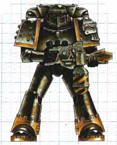

<!-- A0534-B0065 -->

原译文

Pre-Heresy Iron Warrior Space Marine 叛乱前钢铁勇士星际战士

**校订译文**

Pre-Heresy Iron Warrior Space Marine 叛乱前钢铁勇士星际战士

<!-- /A0534-B0065 -->

<!-- A0534-B0066 -->
**英文原文**

Given their expertise at constructing and manning fortresses, the Legion also found itself constantly diminishing in active crusading size as units were detached from it to act as garrison troops watching over worlds in the process of compliance. One infamous garrison for this task was that of the Iron Keep on Delgas II, where a single ten-marine squad of Iron Warriors watched over a disgruntled population of 130 million. It is unknown why the Iron Warriors were so often selected for such assignments, or why Perturabo always accepted such orders without protest, but it is supposed that it began to inflict serious damage to the Legion's morale. Even Space Marines need rest, but the Crusade gave them none. A particularly brutal battle of the Great Crusade for the Iron Warriors was the thankless Sak'trada Deeps Campaign against the Hrud, which resulted in heavy casualties on a strategically far-off and worthless system.

<!-- /A0534-B0066 -->

<!-- A0534-B0067 -->

原译文

鉴于他们在建造和配备堡垒方面的专业知识，军团还发现，随着部队从军团中分离出来，作为守备部队在征服过程中监视世界，其积极的规模也在不断缩小。一个臭名昭著的驻军是德尔加斯二号上的钢铁要塞，在那里，一支由十名钢铁勇士组成的星际战士小队监视着1.3亿心怀不满的人民。目前尚不清楚为什么钢铁勇士经常被选中执行这样的任务，也不清楚为什么佩图拉博总是毫无异议地接受这样的命令，但据推测，这开始对军团的士气造成严重损害。即使是星际战士也需要休息，但远征没有给他们任何休息。钢铁勇士大远征中一场特别残酷的战斗是吃力不讨好的萨克’特拉达深渊战役，该战役在战略上遥远而毫无价值的星系上造成了重大伤亡。

**校订译文**

因为擅长筑城与守城，钢铁勇士的部队不断被抽调，驻守正在归顺帝国的世界，真正参与远征的兵力因而持续减少。最恶名昭著的例子，是德尔加斯二号的钢铁要塞：仅十名钢铁勇士，就要监视一亿三千万心怀不满的居民。为何他们总被选中执行这类任务、佩图拉博又为何始终毫不抗议，无人能够确定；但人们认为，这些任务严重损害了军团士气。即使星际战士也需要休整，大远征却从未给他们喘息之机。对赫鲁德的萨克’特拉达深渊战役尤其残酷：钢铁勇士在一个偏远且毫无战略价值的星系付出惨重伤亡，仍得不到应有回报。

**校注：** 补回被原译漏掉的敌人 Hrud 赫鲁德。active crusading size 指可参加远征的兵力，非抽象积极规模。

<!-- /A0534-B0067 -->

<!-- A0534-B0068 图片 -->
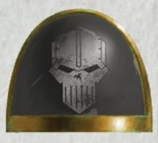

<!-- A0534-B0069 -->

原译文

Heresy-era symbol 叛乱时期标志

**校订译文**

Heresy-era symbol 叛乱时期标志

<!-- /A0534-B0069 -->

<!-- A0534-B0070 -->
**英文原文**

Worse, their "typecasting" as siege engineers or garrison troops set them apart from their brother Legions and made them feel increasingly marginalized. In particular they were aggrieved by the Imperial Fists, whose Primarch, Rogal Dorn, often boasted about the impregnability of the defences they had constructed around the Imperial Palace on Terra. Perturabo was not the only Primarch who found his brother Dorn boastful and arrogant, but Perturabo was unable to let the insults to himself and his Legion pass, and these continued to fester in his heart. Likewise, Corax, the Primarch of the Raven Guard, made little secret of his contempt for Perturabo and his Legion, dismissing them as stolid attritionists, anathema to Corax's own concept of fluid, hit-and-run warfare.

<!-- /A0534-B0070 -->

<!-- A0534-B0071 -->

原译文

更糟糕的是，他们作为攻城工程师或驻军的“定型”使他们与兄弟军团区别开来，并使他们感到越来越被边缘化。他们尤其对帝国之拳感到不满，其首领罗格·多恩经常吹嘘他们在泰拉皇宫周围建造的防御工事坚不可摧。佩图拉博并不是唯一一个发现他的兄弟多恩自夸和傲慢的原体，但佩图拉博无法让对自己和他的军团的侮辱过去，这些侮辱继续在他的心中溃烂。同样，暗鸦守卫的原体科拉克斯毫不掩饰他对佩图拉博和他的军团的蔑视，认为他们是冷漠的归因论者，是科拉克斯自己的流动、跑打的战争概念的诅咒。

**校订译文**

更糟的是，攻城工程兵与驻军这一固定角色，使钢铁勇士与其他军团渐行渐远，也让他们愈发感到被边缘化。他们尤其怨恨帝国之拳：罗格·多恩常夸耀自己在泰拉皇宫周围修建的防御坚不可摧。觉得多恩傲慢自负的原体并非只有佩图拉博，但他无法释怀那些对自己与军团的冒犯，任怨恨在心中积聚。暗鸦守卫原体科拉克斯同样毫不掩饰轻蔑，斥他们为死板的消耗战信徒；这与他崇尚灵活机动、袭后即走的作战理念格格不入。

**校注：** attritionists 为坚持消耗战者，原译归因论者误读。

<!-- /A0534-B0071 -->

<!-- A0534-B0072 -->
**英文原文**

The Iron Warriors did little to improve relations with the rest of the Imperium's armed forces. They maintained a cold and rude relationship with their fellow Space Marine Legions, while to the Imperial Army they became known as the Corpse Grinders for the high casualties their forces experienced under Iron Warriors command. Imperial Army regiments began to mutiny rather than be placed under Iron Warriors command or continue with their bloody attacks. Horus remedied the situation by ensuring that only criminals and slaves would be transferred to Perturabo.

<!-- /A0534-B0072 -->

<!-- A0534-B0073 -->

原译文

钢铁勇士几乎没有改善与帝国其他武装部队的关系。他们与星际战士保持着冷淡而粗鲁的关系，而在帝国陆军中，他们因在钢铁勇士指挥下部队遭受的高伤亡而被称为尸体研磨者。帝国兵团开始兵变，而不是被钢铁勇士指挥或继续进行血腥袭击。荷鲁斯通过确保只有罪犯和奴隶会被转移到佩图拉博来纠正这种情况。

**校订译文**

钢铁勇士也几乎不曾努力改善与帝国其他武装的关系。他们对其他军团冷漠无礼；帝国军则因在其麾下承受惊人的伤亡，将他们称为尸体研磨者。有些帝国军团宁愿哗变，也不愿再受钢铁勇士指挥或继续发动血腥进攻。荷鲁斯只好确保交给佩图拉博的部队全部来自罪犯与奴隶，以此缓和局面。

<!-- /A0534-B0073 -->

<!-- A0534-B0074 -->
### The Turning Point 转折点

<!-- /A0534-B0074 -->

<!-- A0534-B0075 -->
**英文原文**

The growing disillusionment that began to show itself during bitter and pointless battles such as the Sak'trada Deeps Campaign would eventually translate into a tragic explosion of despair and rage as the Iron Warriors learned that their own homeworld, Olympia, had revolted against Imperial rule. Enraged, Perturabo drew his Legion away from the extermination campaign they were waging upon the Hrud and led them homewards, falling upon the world with no mercy. The planet was battered into submission, and he gave orders that the cities were to enact decimation, killing one in every ten of their own or face extermination and enslavement. Cities burned, and over five million inhabitants were killed. Some Iron Warriors refused to take part in the genocide, and they too were struck down. In the aftermath, the Legion as a whole seemed aghast at their actions, aware that they had committed an unforgivable atrocity.

<!-- /A0534-B0075 -->

<!-- A0534-B0076 -->

原译文

在萨克’特拉达深渊战役等痛苦而毫无意义的战斗中，人们开始表现出越来越大的幻灭感，最终转化为绝望和愤怒的悲剧爆发，因为钢铁勇士得知他们自己的家园世界奥林匹亚已经反抗帝国统治。佩图拉博怒不可遏，将他的军团从他们对赫鲁德发动的灭绝战役中拉了出来，带领他们回家，毫不留情地降临到世界上。这个行星被打得屈服了，他下令各城市进行大规模屠杀，每十个城市中就有一个被屠杀，否则将面临灭绝和奴役。城市被烧毁，500多万居民死亡。一些钢铁勇士拒绝参与灭绝罪行，他们也被击倒了。事后，整个军团似乎对他们的行为感到震惊，意识到他们犯下了不可原谅的暴行。

**校订译文**

萨克’特拉达深渊等残酷而无意义的战役，已让钢铁勇士逐渐心灰意冷；母星奥林匹亚反抗帝国的消息传来后，积怨终于化为绝望与狂怒的悲剧爆发。佩图拉博从对赫鲁德的灭绝战中撤出军团，率军返回母星，毫不留情地镇压。行星被打服后，他命令各城自行处死十分之一居民，否则就将遭到灭绝与奴役。城市燃烧，逾五百万人丧生。部分钢铁勇士拒绝参与种族灭绝，也被杀死。事后，整个军团似乎都为自己的所作所为震惊，意识到他们犯下了不可饶恕的暴行。

**校注：** one in every ten of their own 指每城十分之一居民，原译“每十个城市屠杀一个”改变屠杀对象与规模。

<!-- /A0534-B0076 -->

<!-- A0534-B0077 -->
**英文原文**

However, before word of their actions could reach the other arms of the Imperium, the Iron Warriors once again received orders to move into action. This time it was to move to the Isstvan system. While the Iron Warriors had been engaged in suppressing the rebellion on Olympia, the Galaxy had turned upside down: Horus had rebelled against the Emperor, Fulgrim, Angron and Mortarion had joined him, and the Space Wolves had slaughtered the Thousand Sons on Prospero. If the Iron Warriors had committed an outrage on Olympia, then their brother legions seemed determined to outdo them; the Horus Heresy had begun. Horus promised Perturabo not only forgiveness for his genocide on Olympia but even commended him for it. So Perturabo soon swore a secret oath of loyalty to the Warmaster. Upon being informed of the destruction of Olympia, some Iron Warrior units broke away from their Legion, subsequently joining the Loyalists in the upcoming civil war.

<!-- /A0534-B0077 -->

<!-- A0534-B0078 -->

原译文

然而，在他们的行动消息传到帝国的其他兵种之前，钢铁勇士再次接到行动的命令。这一次，它将转向伊斯塔万行星。当钢铁勇士一直在镇压奥林匹亚的叛乱时，银河系已经天翻地覆：荷鲁斯背叛了帝皇，福格瑞姆、安格隆和莫塔里安加入了他的行列，太空野狼在普洛斯佩罗屠杀了千子。倘若钢铁勇士军团已在奥林匹亚犯下暴行，那么他们的兄弟军团似乎决意要超越这份残酷；荷鲁斯叛乱开始了。荷鲁斯不仅向佩图拉博承诺宽恕他在奥林匹亚的灭绝罪行，甚至还赞扬了他。因此，佩图拉博很快就秘密宣誓效忠战帅。在得知奥林匹亚被毁后，一些钢铁勇士部队脱离了他们的军团，随后加入了即将到来的内战中的忠诚派。

**校订译文**

然而，暴行的消息尚未来得及传至帝国其他部门，钢铁勇士就又接到出征命令：前往伊斯塔万星系。他们镇压奥林匹亚的这段时间，银河已天翻地覆。荷鲁斯背叛帝皇，福格瑞姆、安格隆与莫塔里安相继加入，太空野狼则在普罗斯佩罗屠戮千子。若说钢铁勇士在奥林匹亚犯下暴行，其他军团似乎还要做得更甚——荷鲁斯之乱已经开始。荷鲁斯不仅承诺赦免佩图拉博，甚至赞许他的屠杀。佩图拉博随即秘密向战帅宣誓效忠。不过，一些钢铁勇士部队在得知母星遭难后脱离军团，于接下来的内战中加入忠诚派。

**校注：** Isstvan system 指星系，不是单颗行星；地名普罗斯佩罗统一。

<!-- /A0534-B0078 -->

<!-- A0534-B0079 -->
### The Horus Heresy 荷鲁斯之乱

原题：The Horus Heresy 荷鲁斯叛乱

<!-- /A0534-B0079 -->

<!-- A0534-B0080 -->
**英文原文**

The Iron Warriors were ordered to join the second assault on the Traitors' position on Isstvan V, but instead declared their true allegiance to Horus and fell upon their former brothers of the Raven Guard and the Iron Hands without mercy during the Drop Site Massacre. Following the Massacre on Isstvan V, the next major action of the Iron Warriors was the ambush of the Imperial Fists fleet at Phall. While these main contingents of the Iron Warriors under Perturabo became major assets to the developing Traitor campaign, the Legion saw a great number of garrisons and isolated expeditions declare for the Loyalists or go completely rogue at the Horus Heresy's start.

<!-- /A0534-B0080 -->

<!-- A0534-B0081 -->

原译文

钢铁勇士被命令加入对伊斯塔万五号叛徒阵地的第二次进攻，但他们却宣布了对荷鲁斯的真正忠诚，并在登陆点大屠杀中毫不留情地袭击了他们的前暗鸦守卫和钢铁之手兄弟。在伊斯塔万五号大屠杀之后，钢铁勇士的下一个主要行动是在法尔伏击帝国之拳舰队。虽然佩图拉博领导下的钢铁勇士的这些主要特遣队成为了发展中的叛徒战役的主要资产，但军团看到了大量的驻军和孤立的探索队在荷鲁斯叛乱开始时宣布支持忠诚派或完全叛变。

**校订译文**

钢铁勇士奉命参加对伊斯塔万五号叛军阵地的第二波进攻，却临阵公开效忠荷鲁斯，在登陆点大屠杀中无情袭击昔日的暗鸦守卫与钢铁之手同袍。此后，他们的下一次重大行动是在法尔伏击帝国之拳舰队。佩图拉博亲率的军团主力虽成为叛军战事的重要支柱，但在叛乱初起时，也有大量分散的驻军与远征部队选择忠于帝皇，或完全独立行事。

**校注：** go completely rogue 指不再听命于任何一方，不必然加入叛徒军团，译为独立行事。

<!-- /A0534-B0081 -->

<!-- A0534-B0082 图片 -->
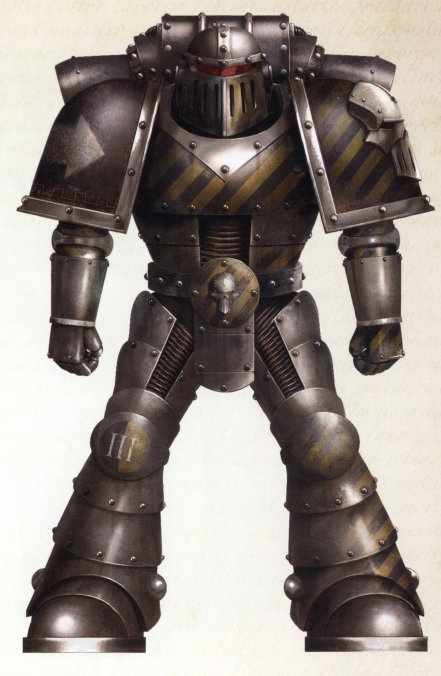

<!-- A0534-B0083 -->

原译文

Heresy-era Iron Warriors Space Marine 叛乱时期钢铁勇士星际战士

**校订译文**

Heresy-era Iron Warriors Space Marine 叛乱时期钢铁勇士星际战士

<!-- /A0534-B0083 -->

<!-- A0534-B0084 -->
**英文原文**

Following the action at Phall and the reduction of Hydra Cordatus, the Legion under Perturabo's personal command would journey with Fulgrim to the Crone World of Iydris, pursuing an ancient weapon known as the Angel Exterminatus. However, the entire affair was a ploy by Fulgrim to achieve daemonhood.

<!-- /A0534-B0084 -->

<!-- A0534-B0085 -->

原译文

在法尔的行动和九头蛇之心的削弱之后，佩图拉博亲自指挥的军团将与福格瑞姆一起前往伊德瑞斯老妪世界，追逐一种名为灭绝天使的古老武器。然而，整个事件都是福格瑞姆为成为恶魔王子而采取的策略。

**校订译文**

法尔之战与攻克海德拉之心后，佩图拉博亲自率领军团，与福格瑞姆前往老妪世界伊德瑞斯，寻找传说中的古老武器“灭绝天使”。然而，整件事其实是福格瑞姆为升格成魔布下的阴谋。

**校注：** Hydra Cordatus 沿核心海德拉之心；reduction 指攻克，不是抽象削弱。

<!-- /A0534-B0085 -->

<!-- A0534-B0086 -->
**英文原文**

After this incident, Perturabo and his Iron Warriors found themselves trapped by the singularity in the heart of the Eye of Terror. In a desperate gamble, their fleet dove straight into the heart of the Eye of Terror, and were transported far across the Warp to the Tallarn System. Once arriving at Tallarn, Perturabo was made aware of the Black Oculus (also known as the Cursus of Alganar) hidden beneath the planet, and he immediately drew up plans to acquire it.

<!-- /A0534-B0086 -->

<!-- A0534-B0087 -->

原译文

事件发生后，佩图拉博和他的钢铁勇士发现自己被恐惧之眼中心的奇点所困。在一场孤注一掷的赌博中，他们的舰队直接潜入恐惧之眼的中心，并被运送到亚空间对岸的塔兰星系。抵达塔兰后，佩图拉博意识到隐藏在星球下面的黑暗之眼（也称为阿尔加纳尔之诅咒），他立即制定了获得计划。

**校订译文**

事件过后，佩图拉博与钢铁勇士被困于恐惧之眼中心的奇点。他们孤注一掷，令舰队径直冲入恐惧之眼核心，结果跨越遥远的亚空间，抵达塔兰星系。到达后，佩图拉博得知行星地下藏有黑暗之眼，又称阿尔加纳尔驰道，便立即筹划夺取它。

**校注：** Cursus 不是英语curse。参照本书第797篇同名原译阿尔加纳尔驰道，以及其明确为门户的叙述，暂定统一驰道；原稿本处阿尔加纳尔之诅咒。Black Oculus沿本处黑暗之眼，另有黑色之眼/黑眼异译待全书统一。

<!-- /A0534-B0087 -->

<!-- A0534-B0088 -->
**英文原文**

The intended hit-and-seize raid turned into a protracted conflict, as both the Traitors and the Imperium poured war material to their respective allies on Tallarn, neither willing to admit defeat. Over a million armored vehicles fought across the desert, which is reckoned as the largest tank confrontation in Imperial history, until eventually the Iron Warriors were forced to retreat without the Cursus. So great were their losses that Perturabo had to launch a mass recruitment program to replenish their strength in the aftermath.

<!-- /A0534-B0088 -->

<!-- A0534-B0089 -->

原译文

计划中的突袭变成了一场旷日持久的冲突，因为叛徒和帝国都向各自在塔兰的盟友倾倒了战争物资，双方都不愿意承认失败。超过一百万辆装甲载具在沙漠中作战，这被认为是帝国历史上最大的坦克对抗，直到最终钢铁勇士在没有诅咒的情况下被迫撤退。他们的损失如此之大，以至于佩图拉博不得不启动大规模招募计划，以在事后补充他们的力量。

**校订译文**

原本意在突袭夺宝的行动，却演变为旷日持久的战争。叛军与帝国不断向各自在塔兰的盟军输送战争物资，双方都不肯认输。逾一百万辆装甲载具驰骋沙海，形成据称是帝国历史上规模最大的坦克会战。钢铁勇士最终被迫撤退，未能夺得驰道。由于损失过于惨重，佩图拉博事后不得不大规模征兵，补充实力。

<!-- /A0534-B0089 -->

<!-- A0534-B0090 -->
**英文原文**

After Tallarn, the Iron Warriors were assigned to guard worlds to the rear of Horus' front that since the death of the Ruinstorm were now threatened by the advance of the Ultramarines. Many of these worlds served as the Traitor's chief supply line. Overextended, under-supplied, and engaging in thankless bitter sieges against the forces of Roboute Guilliman, the Iron Warriors took heavy losses and found themselves in a situation similar to that of the Great Crusade. This situation was interrupted when Perturabo received orders to find Angron and muster at Ullanor in preparation for the Siege of Terra. Despite having to abandon large amounts of warriors and worlds for which they bitterly bled for many years, Perturabo dutifully obeyed. Though many Iron Warriors were lost in the ensuing redeployments, Perturabo succeeded in arriving at Ullanor with Angron and his World Eaters. During the Siege of Terra, Perturabo became the face of Horus' war to the loyalists, engaging in the ultimate siege against his rival brother Rogal Dorn. The Iron Warriors led the assault against the Lion's Gate Spaceport and Gorgon Bar during the battle. Following the setback at the Saturnine Wall, Perturabo began to despair over the state of his allies. All save he and the Iron Warriors had by now fully fallen to Chaos, and with his warriors marched all kinds of Warp abominations. Perturabo realised that the war was no longer one of Legion vs. Legion and the ultimate test against his brother Rogal was now tainted. The final straw for Perturabo came after Horus informed Perturabo that he was to disperse his Iron Warriors amongst the various warzones and that his position was to be taken over by Mortarion and the Death Guard. Finally having had enough, Perturabo ordered the Iron Warriors to evacuate Terra and withdrew to the Iron Blood. Some Iron Warrior contingents refused to abandon the campaign or were just left behind by their comrades, and would keep fighting on Terra until the siege's conclusion.

<!-- /A0534-B0090 -->

<!-- A0534-B0091 -->

原译文

在塔兰之后，钢铁勇士被指派守卫荷鲁斯前线后方的世界，自从毁灭风暴结束后，这些世界现在受到了极限战士的威胁。这些世界中的许多都是叛徒的主要补给线。过度扩张，供应不足，并对罗伯特·基里曼的部队进行了吃力不讨好的艰苦围攻，钢铁勇士遭受了重大损失，发现自己处于类似于大远征的境地。当佩图拉博接到命令，要找到安格隆并在乌兰诺集结，准备围攻泰拉时，这种情况被打断了。尽管不得不放弃大量的战士和世界，他们在多年为此付出了惨痛代价，但佩图拉博还是尽职尽责地服从了。尽管许多钢铁勇士在随后的重新部署中失利，但佩图拉博成功地与安格隆和他的吞世者一起抵达了乌兰诺。在泰拉围城期间，佩图拉博成为荷鲁斯对忠诚派战争的代言人，对他的对手兄弟罗格·多恩进行了终极围攻。钢铁勇士在战斗中领导了对狮门太空港和戈尔贡障碍的进攻。在土星之墙遭遇挫折后，佩图拉博开始对盟友的状况感到绝望。除了他和钢铁勇士，所有人现在都已经完全堕入混沌，他的战士们带着各种亚空间的可憎之物。佩图拉博意识到这场战争不再是军团与军团之间的战争，对他的兄弟罗格的最终考验现在被玷污了。在荷鲁斯通知佩图拉博，他将把他的钢铁勇士分散到各个战区，他的阵地由莫塔里安和死亡守卫接管后，佩图拉博的最后一根稻草落了下来。终于受够了，佩图拉博命令钢铁勇士撤离泰拉，撤退到铁血号。一些钢铁勇士特遣队拒绝放弃这场战役，或者只是被他们的战友留下，并将继续在泰拉上战斗，直到围城结束。

**校订译文**

塔兰之战后，钢铁勇士被派去守卫荷鲁斯战线后方的世界。毁灭风暴消散，极限战士的推进开始威胁这些构成叛军主要补给线的据点。兵力分散、补给不足，还要与罗保特·基里曼的部队进行吃力不讨好的围攻战，使钢铁勇士伤亡惨重，重陷大远征时期的困境。随后，佩图拉博奉命寻找安格隆，并赴乌兰诺集结，为泰拉围城作准备。尽管这意味着抛下大量战士，以及多年浴血争夺的世界，他仍忠实执行命令。重新部署又损失了许多钢铁勇士，但他最终带着安格隆与吞世者抵达乌兰诺。围攻泰拉时，佩图拉博成为忠诚派正面面对的叛军主将，与宿敌兄弟罗格·多恩展开终极攻防较量。钢铁勇士率军进攻狮门太空港与戈尔贡防线。土星之墙受挫后，佩图拉博开始对盟友绝望：除他与钢铁勇士外，其他盟军都已完全堕入混沌，各类亚空间怪物也与他的战士一同行进。他意识到，这已不再是军团之间的战争；与罗格较量的最终考验受到了玷污。荷鲁斯又命令他将军团分散至各战区，把自身职位交给莫塔里安与死亡守卫，这成了压垮他的最后一根稻草。佩图拉博终于下令撤离泰拉，自己退回铁血号。但仍有部队不愿放弃战役，或被同袍遗留在地面，继续战斗到围城结束。

**校注：** 保留本段以佩图拉博立场描述其盟军堕落的叙述，不与后文军团混沌归属强行拼成同一时间。position 为指挥职位，不是战术阵地。Gorgon Bar 暂作戈尔贡防线，原稿戈尔贡障碍。

<!-- /A0534-B0091 -->

<!-- A0534-B0092 -->
**英文原文**

In the end, Horus was defeated by the Emperor, and the bulk of the Iron Warriors retreated into the Eye of Terror, while the rest sought to defend their scattered empire across Imperial space. Their "Empire of Iron" continued to be a thorn in the Imperium's side for a substantial time. Jointly assaulted by both the Imperial Fists and the Ultramarines, Olympia itself held out for two years. Eventually, the Iron Warriors triggered their own missile stockpiles when defeat was near, transforming the planet into a barren wasteland that, like the other Traitor Legion homeworlds, was declared perdita.

<!-- /A0534-B0092 -->

<!-- A0534-B0093 -->

原译文

最终，荷鲁斯被帝皇击败，大部分钢铁勇士撤退到恐惧之眼，而其余的人则试图在帝国空域保卫他们分散的帝国。他们的“钢铁帝国”在相当长的一段时间内仍然是帝国的眼中钉。受到帝国之拳和极限战士的联合攻击，奥林匹亚本身坚持了两年。最终，当失败临近时，钢铁勇士发射了自己的导弹储备，将行星变成了一片贫瘠的荒地，就像其他叛徒军团的家园世界一样，被宣布为已失落。

**校订译文**

荷鲁斯最终败于帝皇之手，钢铁勇士主力退入恐惧之眼，其余部队则试图守住散布帝国各处的领地。这片钢铁帝国在很长一段时间里仍是帝国的心腹之患。奥林匹亚在帝国之拳与极限战士联合围攻下坚持了两年；败局将定时，钢铁勇士引爆导弹库存，将行星化为荒芜废土。它随后与其他叛徒军团母星一样，被宣布为失落世界。

**校注：** triggered their own missile stockpiles 为引爆库存，原译发射库存改变行为。

<!-- /A0534-B0093 -->

<!-- A0534-B0094 -->
### Post-Heresy 叛乱后

<!-- /A0534-B0094 -->

<!-- A0534-B0095 -->
**英文原文**

Perturabo soon devised and enacted the one real victory for the Iron Warriors in the immediate aftermath of the Horus Heresy. He crafted a trap on Sebastus IV, designed to ensnare Rogal Dorn and the Imperial Fists, with whom Perturabo and his warriors harboured a bitter rivalry. This trap was known as the Eternal Fortress, a keep centred within twenty square miles of bunkers, towers, minefields, trenches, tank traps and redoubts. Upon hearing of this, Rogal Dorn publicly declared that he "would dig Perturabo out of his hole and bring him back to Terra in an iron cage". As a result of this statement, the ensuing battle has become known as the Iron Cage or "Iron Cage Incident".

<!-- /A0534-B0095 -->

<!-- A0534-B0096 -->

原译文

在荷鲁斯叛乱事件之后，佩图拉博很快为钢铁勇士设计并实施了一场真正的胜利。他在塞瓦斯图斯四号上设计了一个陷阱，旨在诱捕罗格·多恩和帝国之拳，佩图拉博和他的战士们与他们展开了激烈的竞争。这个陷阱被称为“永恒堡垒”，它位于20平方英里的掩体、塔楼、雷区、战壕、坦克陷阱和堡垒内。听到这个消息后，罗格·多恩公开宣布他“将把佩图拉博从洞里挖出来，把他关进铁笼里带回泰拉”。由于这一声明，随后的战斗被称为铁笼或“铁笼事件”。

**校订译文**

荷鲁斯之乱刚结束不久，佩图拉博便谋划并取得了钢铁勇士在这一时期唯一真正的胜利。他在塞瓦斯图斯四号布下陷阱，诱捕与自己及麾下战士宿怨深重的罗格·多恩和帝国之拳。这个陷阱被称为永恒堡垒：一座位于防御体系中心的要塞，周围二十平方英里内遍布掩体、塔楼、雷区、战壕、反坦克障碍与棱堡。多恩听闻后公开宣布，要“把佩图拉博从洞里挖出来，关进铁笼带回泰拉”。随后的战役因此得名“铁笼”，又称“铁笼事件”。

<!-- /A0534-B0096 -->

<!-- A0534-B0097 图片 -->
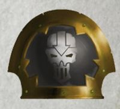

<!-- A0534-B0098 -->

原译文

Post-Heresy Iron Warriors shoulderpad symbol 叛乱后钢铁勇士肩甲标志

**校订译文**

Post-Heresy Iron Warriors shoulderpad symbol 叛乱后钢铁勇士肩甲标志

<!-- /A0534-B0098 -->

<!-- A0534-B0099 -->
**英文原文**

Rogal Dorn expected an honourable battle, but this was not to be. Beginning by isolating the four Companies of the Imperial Fists that landed from their orbital support, Perturabo began to carefully divide his enemy and destroy them piecemeal. Some Imperial Fists managed to penetrate the defences and reach the centre of the Eternal Fortress, only to find there was no central keep - simply an open space watched by yet more defenses. The fortress was a decoy of no real value. By the sixth day of the siege, Imperial Fists Space Marines were fighting individually, without support, using the bodies of their own battle brothers for cover.

<!-- /A0534-B0099 -->

<!-- A0534-B0100 -->

原译文

罗格·多恩期待着一场光荣的战斗，但事实并非如此。从将降落的四个帝国之拳连队从轨道支援中隔离出来开始，佩图拉博开始小心地分裂敌人，并将其逐一摧毁。一些帝国之拳设法穿透了防御工事，到达了永恒堡垒的中心，却发现那里没有中央要塞 — 只是一个被更多防御工事监视的开放空间。这座堡垒是一个没有真正价值的诱饵。到围城的第六天，帝国之拳星际战士在没有支援的情况下，利用自己战斗兄弟的尸体作为掩护，单独作战。

**校订译文**

罗格·多恩期待一场堂堂正正的较量，但事实并非如此。佩图拉博先切断登陆的四个帝国之拳连队与轨道支援的联系，再谨慎地分割敌军，逐一歼灭。一些帝国之拳突破防御，抵达永恒堡垒中心，却发现那里根本没有中央要塞，只有一片暴露于更多防御阵地火力之下的空地。整座堡垒只是毫无实际价值的诱饵。围攻到第六天，帝国之拳已经各自为战，得不到任何支援，只能以战斗兄弟的尸体作掩护。

<!-- /A0534-B0100 -->

<!-- A0534-B0101 -->
**英文原文**

The siege of the Eternal Fortress lasted for a further three weeks. Relief came only in the form of Roboute Guilliman and a force of Ultramarines. The sacrifice of over four hundred loyalist Marines' gene-seed paved the way for Perturabo's ascension to Daemon Prince. Following this, the Iron Warriors retreated into the Eye of Terror and Perturabo crowned the world of Medrengard as the new home of the Legion. Since then, Perturabo has remained on Medrengard while his Legion continues the Long War while warbands periodically battle one another. Their grudge against the Sons of Dorn has, however, endured the long millennia, and even now, the Iron Warriors take great pleasure in tearing down the defences of the Imperial Fists.

<!-- /A0534-B0101 -->

<!-- A0534-B0102 -->

原译文

对永恒要塞的围攻又持续了三个星期。救援只以罗伯特·基里曼和极限战士部队的形式出现。四百多名牺牲的忠诚派星际战士的基因种子为佩图拉博升格恶魔王子铺平了道路。在此之后，钢铁勇士撤退到恐惧之眼，佩图拉博将梅林德加德世界加冕为军团的新家园。从那时起，佩图拉博一直留在梅林德加德，而他的军团继续进行长期战争，而战士们则定期相互作战。然而，他们对多恩之子的怨恨已经持续了数千年，即使是现在，钢铁勇士也非常乐意拆除帝国之拳的防御。

**校订译文**

永恒堡垒之围又持续了三周，直到罗保特·基里曼率极限战士抵达，帝国之拳才获救。佩图拉博献祭了四百多名忠诚派星际战士的基因种子，为自己升格恶魔亲王铺平道路。此后，钢铁勇士退入恐惧之眼，佩图拉博将梅林德加德定为军团的新家园。从那时起，他一直留在梅林德加德，军团则继续万古长战，各战帮也时有内斗。然而，他们对多恩之子的仇恨历经数千年仍未消退。时至今日，钢铁勇士仍以摧毁帝国之拳的防御工事为乐。

**校注：** sacrifice 的宾语是四百余名忠诚派战士的基因种子，原译误作这些战士“牺牲”，漏掉献祭行为。Long War 为专名万古长战。

<!-- /A0534-B0102 -->

<!-- A0534-B0103 图片 -->
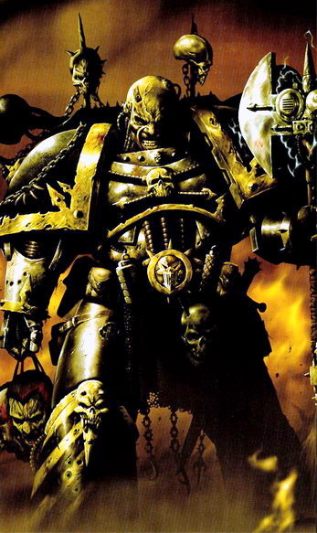

<!-- A0534-B0104 -->

原译文

Post-Heresy Iron Warrior 叛乱后钢铁勇士

**校订译文**

Post-Heresy Iron Warrior 叛乱后钢铁勇士

<!-- /A0534-B0104 -->

<!-- A0534-B0105 -->
**英文原文**

A major crisis hit the Iron Warriors when in 600.M34 a civil war shattered the Legion into various warbands.

<!-- /A0534-B0105 -->

<!-- A0534-B0106 -->

原译文

600.M34，一场内战将军团分裂成多个战帮，钢铁勇士遭遇了一场重大危机。

**校订译文**

600.M34，一场内战将军团分裂成多个战帮，钢铁勇士遭遇了一场重大危机。

<!-- /A0534-B0106 -->

<!-- A0534-B0107 -->
**英文原文**

The Iron Warriors pay homage to the Chaos Gods as a pantheon, though few of them are especially devoted. Their primary loyalty is to Perturabo, who they view as having saved from from being sacrificed in the galactic ambitions of the Emperor.

<!-- /A0534-B0107 -->

<!-- A0534-B0108 -->

原译文

钢铁勇士向混沌诸神致敬，将其视为万神殿，尽管他们中很少有人特别忠诚。他们的主要忠诚对象是佩图拉博，他们认为佩图拉博没有让他们在帝皇的银河野心中被牺牲。

**校订译文**

钢铁勇士将混沌诸神作为一个整体加以敬奉，但鲜少表现得格外虔诚。他们首先效忠的仍是佩图拉博：在他们看来，是他拯救了军团，使其免于沦为帝皇征服银河野心的祭品。

<!-- /A0534-B0108 -->

<!-- A0534-B0109 -->
**英文原文**

In the aftermath of the 13th Black Crusade, the Iron Warriors have expanded into the Imperium Nihilus, raising enormous, hideous citadels in their wake; monuments of their own malice, cruelty, and ego. These are often jagged towers, surrounded by living razor wire and daemon-haunted trenches. They hold a particular reputation as Warp-Masons and martial engineers as a result of this.

<!-- /A0534-B0109 -->

<!-- A0534-B0110 -->

原译文

在第13次黑色远征之后，钢铁勇士已经扩展到帝国暗面，在他们身后建立了巨大而丑陋的城堡；他们自己的恶意、残忍和自我的纪念碑。这些通常是锯齿状的塔楼，周围是活生生的铁丝网和恶魔出没的战壕。因此，他们作为亚空间石匠和军事工程师享有特殊的声誉。

**校订译文**

第十三次黑色远征后，钢铁勇士向帝国暗面扩张，在所经之处修起巨大而丑陋的城堡，作为自身恶意、残忍与傲慢的纪念碑。这些城堡往往由嶙峋尖塔构成，周围环绕着活体刀片铁丝网和恶魔出没的战壕。他们也因此以亚空间石匠与军事工程师闻名。

<!-- /A0534-B0110 -->

<!-- A0534-B0111 -->
### Notable Engagements Post-Heresy 叛乱后的著名交战

<!-- /A0534-B0111 -->

<!-- A0534-B0112 -->

原译文

???.M31: Iron Cage 铁笼

**校订译文**

???.M31: Iron Cage 铁笼

<!-- /A0534-B0112 -->

<!-- A0534-B0113 -->

原译文

544.M32: War of the Beast 野兽战争

**校订译文**

544.M32: War of the Beast 野兽战争

<!-- /A0534-B0113 -->

<!-- A0534-B0114 -->

原译文

???.M32: Solar Rebellion 太阳叛乱

**校订译文**

???.M32: Solar Rebellion 太阳叛乱

<!-- /A0534-B0114 -->

<!-- A0534-B0115 -->

原译文

600-730.M34: Dispute of Iron 钢铁纷争

**校订译文**

600-730.M34: Dispute of Iron 钢铁纷争

<!-- /A0534-B0115 -->

<!-- A0534-B0116 -->

原译文

999.M37: Eighth Black Crusade 第八次黑色远征

**校订译文**

999.M37: Eighth Black Crusade 第八次黑色远征

<!-- /A0534-B0116 -->

<!-- A0534-B0117 -->

原译文

War for the Andromax System 安德洛马克斯星系战争

**校订译文**

War for the Andromax System 安德洛马克斯星系战争

<!-- /A0534-B0117 -->

<!-- A0534-B0118 -->

原译文

001.M39: Tenth Black Crusade 第十次黑色远征

**校订译文**

001.M39: Tenth Black Crusade 第十次黑色远征

<!-- /A0534-B0118 -->

<!-- A0534-B0119 -->

原译文

???.M41: Scouring of Makenna VII 马金纳七号洗劫

**校订译文**

???.M41: Scouring of Makenna VII 马金纳七号洗劫

<!-- /A0534-B0119 -->

<!-- A0534-B0120 -->

原译文

???.M41: Obsus Prima Uprising 奥布斯主星暴动

**校订译文**

???.M41: Obsus Prima Uprising 奥布斯主星暴动

<!-- /A0534-B0120 -->

<!-- A0534-B0121 -->

原译文

???.M41: Second Battle of Exyrion 第二次埃克西里昂之战

**校订译文**

???.M41: Second Battle of Exyrion 第二次埃克西里昂之战

<!-- /A0534-B0121 -->

<!-- A0534-B0122 -->

原译文

???.M41: The Battle of Shen'tzi Vo 申’茨·沃之战

**校订译文**

???.M41: The Battle of Shen'tzi Vo 申’茨·沃之战

<!-- /A0534-B0122 -->

<!-- A0534-B0123 -->

原译文

455.M41: Siege of Goddeth Hive 戈德斯巢都围城

**校订译文**

455.M41: Siege of Goddeth Hive 戈德斯巢都围城

<!-- /A0534-B0123 -->

<!-- A0534-B0124 -->

原译文

755-778.M41: Sabbat Worlds Crusade 萨巴特世界远征

**校订译文**

755-778.M41: Sabbat Worlds Crusade 萨巴特诸世界远征

<!-- /A0534-B0124 -->

<!-- A0534-B0125 -->
**英文原文**

The Iron Warriors supported the Shriven Chaos Cult on the Forge World of Fortis Binary.

<!-- /A0534-B0125 -->

<!-- A0534-B0126 -->

原译文

钢铁勇士在福蒂斯二号铸造世界支援赎罪者混沌教派。

**校订译文**

钢铁勇士在福蒂斯二号铸造世界支援赎罪者混沌教派。

<!-- /A0534-B0126 -->

<!-- A0534-B0127 -->

原译文

813-830.M41: Siege of Vraks 弗拉克斯围城

**校订译文**

813-830.M41: Siege of Vraks 弗拉克斯围城

<!-- /A0534-B0127 -->

<!-- A0534-B0128 -->

原译文

865.M41: Battle of Cypra Mundi 赛普拉·蒙迪之战

**校订译文**

865.M41: Battle of Cypra Mundi 赛普拉·蒙迪之战

<!-- /A0534-B0128 -->

<!-- A0534-B0129 -->

原译文

905.M41: Siege of Castellax 卡斯蒂利亚斯围城

**校订译文**

905.M41: Siege of Castellax 卡斯蒂利亚斯围城

<!-- /A0534-B0129 -->

<!-- A0534-B0130 -->

原译文

969.M41: Invasion of Taladorn 塔拉顿入侵

**校订译文**

969.M41: Invasion of Taladorn 塔拉顿入侵

<!-- /A0534-B0130 -->

<!-- A0534-B0131 -->

原译文

971.M41: Fall of Malodrax 长恶星陷落

**校订译文**

971.M41: Fall of Malodrax 长恶星陷落

<!-- /A0534-B0131 -->

<!-- A0534-B0132 -->

原译文

~990's.M41: Siege of Hydra Cordatus 九头蛇之心围城

**校订译文**

~990's.M41: Siege of Hydra Cordatus 海德拉之心围城

<!-- /A0534-B0132 -->

<!-- A0534-B0133 -->

原译文

998.M41: Battle for the Endeavour of Will 意志奋进之战

**校订译文**

998.M41: Battle for the Endeavour of Will 意志奋进之战

<!-- /A0534-B0133 -->

<!-- A0534-B0134 -->

原译文

999.M41: Invasion of Ultramar 奥特拉玛入侵

**校订译文**

999.M41: Invasion of Ultramar 奥特拉玛入侵

<!-- /A0534-B0134 -->

<!-- A0534-B0135 -->

原译文

999.M41: Thirteenth Black Crusade 第十三次黑色远征

**校订译文**

999.M41: Thirteenth Black Crusade 第十三次黑色远征

<!-- /A0534-B0135 -->

<!-- A0534-B0136 -->

原译文

012.M42: Battle of Raukos 劳科斯之战

**校订译文**

012.M42: Battle of Raukos 劳科斯之战

<!-- /A0534-B0136 -->

<!-- A0534-B0137 -->

原译文

???.M42: Battle for Protogone V 普罗托贡五号之战

**校订译文**

???.M42: Battle for Protogone V 普罗托贡五号之战

<!-- /A0534-B0137 -->

<!-- A0534-B0138 -->

原译文

???.M42: War of Beasts on Vigilus 警戒星野兽战争

**校订译文**

???.M42: War of Beasts on Vigilus 警戒星野兽战争

<!-- /A0534-B0138 -->

<!-- A0534-B0139 -->

原译文

???.M42 - The Talledus War 塔勒都斯战争

**校订译文**

???.M42 - The Talledus War 塔勒都斯战争

<!-- /A0534-B0139 -->

<!-- A0534-B0140 -->

原译文

???.M42 - The Charadon Campaign 查拉顿战役

**校订译文**

???.M42 - The Charadon Campaign 查拉顿战役

<!-- /A0534-B0140 -->

<!-- A0534-B0141 -->

原译文

???.M42 - The Nachmund Rift War 纳克蒙德走廊战争

**校订译文**

???.M42 - The Nachmund Rift War 纳克蒙德裂隙战争

<!-- /A0534-B0141 -->

<!-- A0534-B0142 -->

原译文

???.M42 - The siege of Althis 阿尔西斯围城

**校订译文**

???.M42 - The siege of Althis 阿尔西斯围城

<!-- /A0534-B0142 -->

<!-- A0534-B0143 -->

原译文

???.M42 - The Arks of Omen Campaign 噩兆方舟战役

**校订译文**

???.M42 - The Arks of Omen Campaign 噩兆方舟战役

<!-- /A0534-B0143 -->

<!-- A0534-B0144 -->

原译文

Undated: 无日期

**校订译文**

Undated: 无日期

<!-- /A0534-B0144 -->

<!-- A0534-B0145 -->

原译文

The Battle of Holline's Hope 霍琳希望之战

**校订译文**

The Battle of Holline's Hope 霍琳希望之战

<!-- /A0534-B0145 -->

<!-- A0534-B0146 -->

原译文

The Humbling 低入尘埃

**校订译文**

The Humbling 低入尘埃

<!-- /A0534-B0146 -->

<!-- A0534-B0147 -->

原译文

Siege of Terror 恐惧围城

**校订译文**

Siege of Terror 恐惧围城

<!-- /A0534-B0147 -->

<!-- A0534-B0148 -->

原译文

Steelstone Keep Rebellion 铁石记录叛乱

**校订译文**

Steelstone Keep Rebellion 铁石堡叛乱

**校注：** keep 在此为城堡，原译“记录”误取动词义。

<!-- /A0534-B0148 -->

<!-- A0534-B0149 -->

原译文

Waaagh! Zagstomp 快脚的Waaagh!

**校订译文**

Waaagh! Zagstomp 快脚的Waaagh!

<!-- /A0534-B0149 -->

<!-- A0534-B0150 -->

原译文

War of Rust and Ruin 锈蚀与毁灭战争

**校订译文**

War of Rust and Ruin 锈蚀与毁灭战争

<!-- /A0534-B0150 -->

<!-- A0534-B0151 -->

原译文

Wars of Flesh 血肉战争

**校订译文**

Wars of Flesh 血肉战争

<!-- /A0534-B0151 -->

<!-- A0534-B0152 -->

原译文

Battle of Forlorn Falls 荒芜瀑布战役

**校订译文**

Battle of Forlorn Falls 荒芜瀑布战役

<!-- /A0534-B0152 -->

<!-- A0534-B0153 -->
## Organisation 组织

<!-- /A0534-B0153 -->

<!-- A0534-B0154 -->
**英文原文**

They have an efficiency about them that makes their corruption all the darker. It lies deep indeed to leave the surface undisturbed. Discipline without, but in their hearts is a deviance I am glad I cannot imagine. - Reclusiarch Lycaon of the Imperial Fists.

<!-- /A0534-B0154 -->

<!-- A0534-B0155 -->

原译文

他们的效率使他们的腐化更加严重。它确实很深，让表面不受干扰。没有纪律，但在他们心中是一种越轨行为，我很高兴我无法想象。-帝国之拳隐修士莱卡恩。

**校订译文**

“他们行事高效，因而那份腐化也显得越发阴暗。腐化埋藏得如此之深，竟不在表面留下丝毫波澜。他们外在纪律严明，内心却藏着某种邪异——我庆幸自己无法想象那是什么。”——帝国之拳隐修长莱卡恩。

**校注：** Discipline without 的 without 指外在，与 in their hearts 对举，不是“没有纪律”。Reclusiarch 统一隐修长。

<!-- /A0534-B0155 -->

<!-- A0534-B0156 -->
### Pre-Heresy 叛乱前

<!-- /A0534-B0156 -->

<!-- A0534-B0157 -->
**英文原文**

Even before being reunited with their Primarch Perturabo the Iron Warriors were known for an affinity with technology and the clinical application of logic to military problems. This affinity was channeled by Perturabo, a skilled practitioner of siegecraft, into the mastery of that form of warfare. These abilities were increased by cross-training with the Mechanicum. The Iron Warriors' Warsmiths could match skills with Magi and it is said that Perturabo could beat any and all in the art of machine engineering. Their methodical attitude made them merciless men in battle and siege. After the siege works were built there was a choice given to the besiegers; either to throw down their arms then and there or the Iron Warriors would show no mercy. Just like many other Legions they soon gained the reputation of brutality during siege, not to mention their merciless manner after the siege had taken place.

<!-- /A0534-B0157 -->

<!-- A0534-B0158 -->

原译文

甚至在与他们的原体佩图拉博重聚之前，钢铁勇士就以对技术的亲和力和逻辑在军事问题上的应用而闻名。这种亲和力是由熟练的攻城造物专业人员佩图拉博引导的，他掌握了这种形式的战争。通过与机械教的交叉训练，这些能力得到了提高。钢铁勇士的战争铁匠可以与贤者的技艺匹敌，据说佩图拉博可以在机械工程领域击败任何人。他们有条不紊的态度使他们在战斗和围攻中成为无情的人。攻城工事建成后，围攻者有了选择；要么当场放下武器，要么钢铁勇士毫不留情。就像许多其他军团一样，他们在围城期间很快就获得了残暴的名声，更不用说围城后他们无情的态度了。

**校订译文**

早在与原体佩图拉博重聚之前，钢铁勇士就以精通技术、冷静运用逻辑解决军事问题而著称。佩图拉博本人深谙攻城之道，引导他们将这些天赋用于钻研围城战，最终臻至精通。与机械教交流训练，又进一步提升了他们的能力。战争铁匠的技艺足以与贤者比肩，而佩图拉博据说在机械工程领域无人能敌。这种严整有序的行事方式，使他们在战斗与围城中冷酷无情。攻城工事建成后，他们会给守军一个选择：立即放下武器，否则绝不留情。和许多其他军团一样，他们很快因围城时的残暴而臭名昭著，破城后的冷酷行径更是有过之而无不及。

**校注：** 英文 besiegers（围攻者）与全段语境不符：接到投降通牒的应为 besieged（被围的守军）。中文按明确语境修正，保留英文原文。

<!-- /A0534-B0158 -->

<!-- A0534-B0159 图片 -->
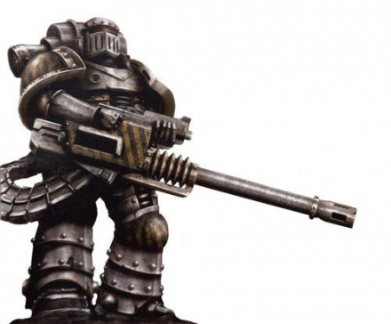

<!-- A0534-B0160 -->

原译文

Pre-Heresy Iron Warrior Space Marine 叛乱前钢铁勇士星际战士

**校订译文**

Pre-Heresy Iron Warrior Space Marine 叛乱前钢铁勇士星际战士

<!-- /A0534-B0160 -->

<!-- A0534-B0161 -->
**英文原文**

A number of warrior societies within the Legion also existed during this time, most notably the Dodekatheon, Apolakron, Kheledakos, and Lyssatra. It also maintained a special unit known as the Stor-Bezashk, which commanded mighty siege weapons unseen outside of the Adeptus Mechanicus' Ordo Reductor itself. The Iron Warriors suffered a great deal of dispersion during the Great Crusade, with various units being detached for separate siege and garrison missions.

<!-- /A0534-B0161 -->

<!-- A0534-B0162 -->

原译文

在此期间，军团中还存在着许多战士结社，最著名的是多徳卡瑟昂、阿伯拉克隆、赫勒达考斯和利萨特拉。它还维持着一个名为破城宿卫的特种部队，该部队指挥着强大的攻城武器，这些武器在机械神教的源还修会之外是看不见的。在大远征期间，钢铁勇士遭受了大量的分散，各种部队被派遣执行单独的围攻和驻军任务。

**校订译文**

这一时期，军团内部还存在多个战士结社，以多徳卡瑟昂、阿伯拉克隆、赫勒达考斯和利萨特拉最为著名。他们另设一支名为破城宿卫的特殊部队，掌管强大的攻城武器；除机械修会的源还修会外，其他组织都没有这类装备。大远征中，各支部队不断被调去执行独立的围城与驻防任务，钢铁勇士的兵力因而严重分散。

<!-- /A0534-B0162 -->

<!-- A0534-B0163 -->
**英文原文**

The strategic command of the Legion was overseen by Grand Battalions, which functioned similarly to a Chapter, but had a larger stockpile of armour, artillery, and logistical support than other Legions. The Iron Warriors had a notably high rate of attrition, so the strength of Grand Battalions fluctuated: some had as few as 500 Legionaries and others had in excess of 4,000. Severely depleted Grand Battalions were folded together into active units. Grand Battalions were commonly divided into Cohorts or Grand Companies. Below these were Line Companies and Armour Centuries. The companies had roughly 100 Legionaries and the centuries had a range of 20 to 50 armour units. In each Grand Battalion there were elements of the Tyranthikos, informally known as the Dominators - these were the Legion's Terminator veterans.

<!-- /A0534-B0163 -->

<!-- A0534-B0164 -->

原译文

军团的战略指挥由大营监督，大营的职能类似于一个军团，但拥有比其他军团更大的装甲、火炮和后勤支援。钢铁勇士的消耗率非常高，因此大营的兵力波动较大：一些只有500名军团士兵，而另一些则有4000多名。严重耗尽的大营被合并成现役部队。大营通常分为大队或大连。下面是线连和装甲百人队。这些连队大约有100名军团士兵，几个世纪以来有20到50格装甲部队。在每个大营中都有僭主的成员，非正式地称为统御者，他们是军团的终结者老兵。

**校订译文**

军团以大营统筹战略指挥。大营职能类似战团，但比其他军团的对应编制配备更多装甲载具、火炮与后勤支援。钢铁勇士伤亡率极高，大营兵力因而起伏不定：少的只有五百名军团战士，多的则超过四千。严重减员的大营会被合并，重新编成能投入作战的部队。大营通常下辖大队或大连，再向下分为战列连与装甲百人队。战列连约有一百名军团战士，装甲百人队则配有二十至五十辆装甲载具。每个大营都有提兰提科斯卫队的成员；这批军团终结者老兵也被非正式地称作统御者。

**校注：** Chapter 与 Legion 区分为战团与军团。centuries 在此为装甲百人队，不是“世纪”；该单位实际装备二十至五十辆载具。Tyranthikos 统一专名提兰提科斯卫队，统御者为另一个非正式称呼。

<!-- /A0534-B0164 -->

<!-- A0534-B0165 -->
**英文原文**

Tactically, Iron Warriors were organised as a number of Grand Companies each commanded by a Warsmith. Originally each Grand Company would have had a similar organisation, totaling around 1,000 Space Marines. At the time of the Horus Heresy, the Legion had at least twelve Companies, although with the widespread deployment of many small detachments of the Legion at the time it is impossible to be sure if this figure of around 12,000 fighting Astartes was their maximum strength. The overall size of the Legion was between 150,000 and 180,000 Marines.

<!-- /A0534-B0165 -->

<!-- A0534-B0166 -->

原译文

从战术上讲，钢铁勇士由多个大连组成，每个大连由一名战争铁匠指挥。最初，每个大连都有一个类似的组织，总共约有1000名星际战士。在荷鲁斯叛乱时期，军团至少有12个连队，尽管当时军团的许多小分队被广泛部署，但无法确定这一约12000名战斗阿斯塔特的数字是否是他们的最大兵力。军团的总规模在15万至18万名星际战士之间。

**校订译文**

在战术层面，钢铁勇士编为多个大连，各由一名战争铁匠指挥。最初，各大连组织结构相近，每连约一千名星际战士。英文底稿称，荷鲁斯之乱时军团至少有十二个连；但因许多小分遣队散布各地，无法确定据此推算的约一万两千名阿斯塔特战士是否代表其全部兵力。同段另记，军团总兵力为十五万至十八万人。

**校注：** 英文同段并列约一万两千与十五万至十八万两组军团人数，未交代版本或统计口径。保留差异并明确归于底稿，不擅自统一数字。

<!-- /A0534-B0166 -->

<!-- A0534-B0167 -->
**英文原文**

The Iron Warriors possessed a substantial war fleet of over 100 capital class ships.

<!-- /A0534-B0167 -->

<!-- A0534-B0168 -->

原译文

钢铁勇士拥有一支由100多艘主力级战舰组成的庞大舰队。

**校订译文**

钢铁勇士拥有庞大的战争舰队，其中主力舰超过一百艘。

<!-- /A0534-B0168 -->

<!-- A0534-B0169 -->
### Current 当前

<!-- /A0534-B0169 -->

<!-- A0534-B0170 -->
**英文原文**

Their current organisation is completely non-standard, particularly after their civil war fragmented the Legion. A Grand Company will often be divided into component detachments led by lesser champions. A tendency towards operating in multiples of three has been noted. While their Primarch remains in his fortress at Medrengard, the Iron Warriors are now almost exclusively led by Warsmiths who command Grand Companies. A Warsmith is a high-ranking leader within the Iron Warriors Legion with control of a Grand Company, seemingly similar to a Chapter Master with several companies led by Chaos Champions still called Captains. Those warlords of theirs who manifest a superior understanding of the relationship between Daemon and machine are known as Daemonsmiths.

<!-- /A0534-B0170 -->

<!-- A0534-B0171 -->

原译文

他们目前的组织完全不规范，特别是在他们的内战分裂了军团之后。大连通常会被分成由较小冠军领导的分队。已经注意到以3的倍数操作的趋势。虽然他们的原体仍留在梅林德加德的堡垒里，但钢铁勇士现在几乎完全由指挥大连的战争铁匠领导。战争铁匠是钢铁勇士军团中的高级领导者，控制着一个大连，似乎类似于一个战团长，由混沌冠军领导的几个连队仍然被称为连长。那些对恶魔和机械之间的关系表现出卓越理解的战争领主被称为恶魔铁匠。

**校订译文**

如今，钢铁勇士的组织已没有统一标准，内战导致军团分裂后尤其如此。大连往往再分成若干分遣队，由级别较低的勇士率领；其编组常倾向于三或三的倍数。原体仍居于梅林德加德的堡垒，军团如今几乎完全由指挥各大连的战争铁匠领导。战争铁匠是掌管大连的高级领袖，地位似乎与战团长相近，麾下有数个连队，由仍保留“连长”称谓的混沌勇士指挥。对恶魔与机械之间的关系有卓越理解的军阀，则称为恶魔铁匠。

**校注：** still called Captains 修饰混沌勇士指挥官，不是说连队叫连长。

<!-- /A0534-B0171 -->

<!-- A0534-B0172 图片 -->
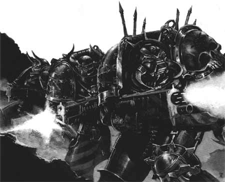

<!-- A0534-B0173 -->

原译文

Iron Warriors in action 行动中的钢铁勇士

**校订译文**

Iron Warriors in action 行动中的钢铁勇士

<!-- /A0534-B0173 -->

<!-- A0534-B0174 -->
**英文原文**

The Iron Warriors are known to pursue their recruitment programs aggressively, notably capturing a sizable source of pure gene-seed from the facility on Hydra Cordatus and using it to hot-house new Iron Warriors using a chaotic techno-organic method. These new Iron Warriors are selected periodically by Warsmiths for their Grand Companies and subjected to various ordeals until they prove themselves worthy.

<!-- /A0534-B0174 -->

<!-- A0534-B0175 -->

原译文

众所周知，钢铁勇士积极推行招募计划，特别是从九头蛇之心的设施中夺取了大量纯结基因种子，并使用混沌的有机技术方法将其用于培养新的钢铁勇士。这些新的钢铁勇士由战争铁匠定期为他们的大连挑选，并经受各种考验，直到他们证明自己值得。

**校订译文**

钢铁勇士以积极扩充兵员著称。他们曾从海德拉之心的设施中夺走大量纯净基因种子，再以混沌的技术与有机体结合手段，加速培育新的钢铁勇士。战争铁匠会定期为各自大连挑选这些新兵，使其经历种种磨难，直到证明自身合格。

**校注：** hot-house 强调加速培育；“纯结”改纯净。

<!-- /A0534-B0175 -->

<!-- A0534-B0176 -->
**英文原文**

The first Obliterators witnessed amongst Chaos forces were amongst the Iron Warriors and, on rare occasions, Iron Warriors have manifested the ability to 'morph' weapons, although with nothing like the versatility of true Obliterators. Iron Warriors hate mutations so they cut off and replace all mutated limbs with cybernetics. Many of these cybernetics are, in turn, daemonically infused to the point of resembling the mutated Obliterators.

<!-- /A0534-B0176 -->

<!-- A0534-B0177 -->

原译文

混沌部队中第一批见证的泯灭者是钢铁勇士，钢铁勇士在极少数情况下表现出“变化”武器的能力，尽管没有真正的泯灭者的多功能性。钢铁勇士讨厌突变，所以他们切断并用智控部件替换所有突变的肢体。反过来，这些智控部件中的许多都被注入恶魔，以至于类似于突变泯灭者。

**校订译文**

混沌部队中最早被目击的泯灭者，便出现在钢铁勇士中。极少数钢铁勇士也显现出变形出武器的能力，但远不及真正的泯灭者那般变化多端。钢铁勇士厌恶突变，会截除所有变异肢体，换上机械义体。然而，许多义体又被灌注恶魔力量，最终反而与发生突变的泯灭者十分相似。

**校注：** cybernetics 为机械义体，不是智控系统。

<!-- /A0534-B0177 -->

<!-- A0534-B0178 -->
## Tactics 战术

<!-- /A0534-B0178 -->

<!-- A0534-B0179 -->
**英文原文**

The Iron Warriors are unparalleled masters of siege warfare as well as of building defensive fortifications and fortresses. They frequently set up field fortifications after making an initial landing. Right after they set up their field fortifications and before the initial bombardment, the Iron Warriors will commonly send infiltration units ahead of the main force to disable the enemy's defences, set up ambushes and conduct flank attacks while the main force equipped mainly with heavily armoured vehicles such as Predators, Land Raiders and Vindicators charges the fortifications. Their attacks are slow and methodical, and once the enemy is at their mercy they will destroy them at their leisure. Wherever possible, they make frequent use of the Traitor Titan Legions, so much so that some Imperial analysts believe the Titans to be part of the Legion itself.

<!-- /A0534-B0179 -->

<!-- A0534-B0180 -->

原译文

钢铁勇士是无与伦比的攻城战大师，也是建造防御工事和堡垒的大师。他们经常在初次登陆后建立野战防御工事。在他们建立野战防御工事之后，在最初的轰炸之前，钢铁勇士通常会在主力部队之前派遣渗透部队，以摧毁敌人的防御工事，伏击并进行侧翼攻击，而主力部队主要配备重型装甲，如掠食者、兰德掠袭者和维护者，对防御工事进行冲锋。他们的攻击缓慢而有条不紊，一旦敌人被他们摆布，他们就会随意摧毁他们。只要有可能，他们就会频繁使用叛徒泰坦军团，以至于一些帝国分析家认为泰坦军团本身就是军团的一部分。

**校订译文**

钢铁勇士既是无与伦比的围城战大师，也精通修筑防御工事与堡垒。他们往往在最初登陆后立即构筑野战工事，并在首轮炮击前派出渗透部队，先行破坏敌方防御、布设伏击并袭扰侧翼；随后，主要配备掠食者战车、兰德掠袭者战车与维护者战车等重型装甲载具的主力向工事发起进攻。他们推进缓慢而有条不紊，一旦敌人完全落入掌控，便会从容将其消灭。只要条件允许，他们就会频繁动用叛徒泰坦军团，密切程度甚至让部分帝国分析人员以为，那些泰坦本就是钢铁勇士军团的编制之一。

<!-- /A0534-B0180 -->

<!-- A0534-B0181 图片 -->
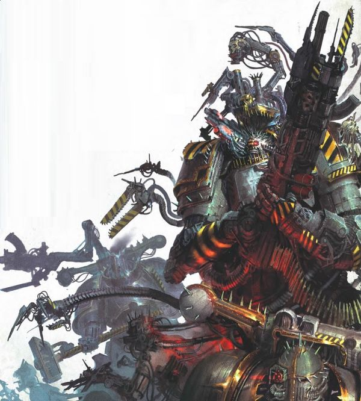

<!-- A0534-B0182 -->

原译文

Iron Warriors Chaos Space Marines 钢铁勇士混沌星际战士

**校订译文**

Iron Warriors Chaos Space Marines 钢铁勇士混沌星际战士

<!-- /A0534-B0182 -->

<!-- A0534-B0183 -->
**英文原文**

The Iron Warriors are expert sappers and engineers and have acquired a variety of siege engines over the years, including Termites, Dreadclaws, a large assortment of Imperial-made artillery and Leviathans. These are used sparingly and are maintained and guarded by the 1st Company. Additionally, they use a large number of Corvus Assault Pods which allow them to make use of any Titans and use them as mobile siege towers.

<!-- /A0534-B0183 -->

<!-- A0534-B0184 -->

原译文

钢铁勇士是专业的工兵和工程师，多年来获得了各种攻城引擎，包括白蚁、恐怖爪、各种帝国制造的火炮和利维坦。这些被谨慎使用，并由第一连队维护和保护。此外，他们使用大量的渡鸦突击舱，这使他们能够使用任何泰坦并将其用作移动攻城塔。

**校订译文**

钢铁勇士精于工兵作业与军事工程，多年来收集了各类攻城装备，包括白蚁、恐怖爪、大批帝国制火炮和利维坦。这些装备只在必要时动用，由第一连负责维护与守卫。他们还大量使用渡鸦突击舱，使各型泰坦都能充当移动攻城塔。

**校注：** siege engines按本段统称攻城装备，不一律译为机械引擎。

<!-- /A0534-B0184 -->

<!-- A0534-B0185 -->
**英文原文**

Wherever the Iron Warriors fight, they raise great citadels in their wake and convert their newly acquired territories into heavily fortified deathtraps for any attacker. Besides their skill in material engineering, they have also become skilled warp-masons and wield potent weapons of heretical design. Wherever possible, the Iron Warriors seek out the sons of Rogal Dorn as foes in order to tear down their edifices and prove their worth.

<!-- /A0534-B0185 -->

<!-- A0534-B0186 -->

原译文

无论钢铁勇士在哪里战斗，他们都会在身后建造巨大的城堡，并将新获得的领土变成对任何的攻击者重兵把守的死亡陷阱。除了在材料工程方面的技能外，他们还成为了熟练的亚空间石匠，并使用了叛乱设计的强大武器。只要有可能，钢铁勇士就会寻找罗格·多恩的子嗣作为敌人，拆除他们的建筑并证明他们的价值。

**校订译文**

钢铁勇士所战之处，总会留下巍峨城堡；新夺取的领土也会被改造成防御严密的死亡陷阱，等待一切来犯之敌。除精通材料工程外，他们也已成为熟练的亚空间石匠，操使按异端设计打造的强大武器。只要有机会，他们就会主动寻找罗格·多恩的子嗣为敌，以摧毁对方堡垒来证明自己的本领。

<!-- /A0534-B0186 -->

<!-- A0534-B0187 -->
**英文原文**

Many who face the Iron Warriors have believed that, due to their emphasis on long-ranged bombardments and grueling sieges, that the Legion can be overwhelmed with a swift assault. The Iron Warriors are thoroughly experienced in brutal, close-quarters combat from their lengthy sieges and are just as capable of crushing their enemies in hammer-blows of personal combat as they are from exhaustive bombardment.

<!-- /A0534-B0187 -->

<!-- A0534-B0188 -->

原译文

许多面对钢铁勇士的人认为，由于他们强调远程轰炸和艰苦的围困，军团可以被快速的攻击所压倒。钢铁勇士在漫长的围困中经历了残酷的近距离战斗，他们在个人战斗的锤击中能够粉碎敌人，就像他们在彻底的轰炸中一样。

**校订译文**

许多敌人以为，钢铁勇士专注于远程炮击与艰苦围城，只需迅猛突击就能将其压垮。然而，漫长的围城战同样让他们积累了残酷近战的丰富经验。无论以连绵炮火轰击，还是在贴身厮杀中以重锤般的猛攻碾碎敌人，他们都同样得心应手。

<!-- /A0534-B0188 -->

<!-- A0534-B0189 -->
## Culture 文化

<!-- /A0534-B0189 -->

<!-- A0534-B0190 -->
**英文原文**

Originally, during the days of the Great Crusade, the Iron Warriors were known for their stoic, cold, and dour nature. However, as the Crusade continued and their feats were not acknowledged, this demeanour turned to resentment, bitterness and an inclination to take offence. Any sign of compassion or failure was seen as a weakness and would result in immediate shame or punishment, as was the case with the likes of Barabas Dantioch following the Sak'trada Deeps Campaign.

<!-- /A0534-B0190 -->

<!-- A0534-B0191 -->

原译文

最初，在大远征期间，钢铁勇士以坚忍、冷酷和阴沉的天性而闻名。然而，随着大远征的继续，他们的功绩没有得到承认，这种行为变成了怨恨、苦涩和冒犯的倾向。任何同情或失败的迹象都被视为一种软弱，会导致立即的耻辱或惩罚，就像萨克’特拉达深渊战役后的巴拉巴斯·丹提欧克等人一样。

**校订译文**

大远征初期，钢铁勇士以坚忍、冷酷、阴沉著称。随着远征持续，他们的功绩却始终得不到认可，这种性情逐渐化为怨恨与苦涩，也让他们动辄觉得受到冒犯。任何怜悯或失败的表现都会被视作软弱，立刻招致羞辱或惩罚；萨克’特拉达深渊战役后，巴拉巴斯·丹提欧克等人的遭遇便是如此。

**校注：** take offence 指觉得受冒犯，不是主动冒犯他人。

<!-- /A0534-B0191 -->

<!-- A0534-B0192 图片 -->
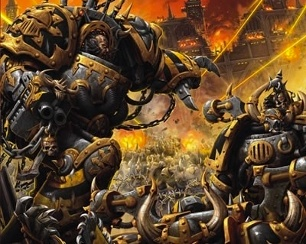

<!-- A0534-B0193 -->

原译文

Iron Warriors in battle 战斗中的钢铁勇士

**校订译文**

Iron Warriors in battle 战斗中的钢铁勇士

<!-- /A0534-B0193 -->

<!-- A0534-B0194 -->
**英文原文**

Iron Warriors came to harbour huge pent up rage, particularly against the Imperial Fists and their Primarch Rogal Dorn to whom they were often compared. This precipitated their corruption by Chaos during the ensuing Horus Heresy, but the Iron Warriors maintain absolute loyalty to Perturabo before any individual God of Chaos. The Iron Warriors revere their Daemon Primarch, whom they believe saved them from being sacrificed by the Emperor.

<!-- /A0534-B0194 -->

<!-- A0534-B0195 -->

原译文

钢铁勇士开始怀有巨大的被压抑的愤怒，尤其是对帝国之拳及其原体罗格·多恩的愤怒，他们经常被拿来与他们进行比较。这加速了他们在随后的荷鲁斯叛乱中被混沌所腐化，但钢铁勇士在任何一位混沌之神面前都对佩图拉博保持着绝对的忠诚。钢铁勇士崇敬他们的恶魔原体，他们相信是他救了他们免于被帝皇牺牲。

**校订译文**

钢铁勇士心中积压了强烈怒火，尤其憎恨时常被拿来与他们比较的帝国之拳及其原体罗格·多恩。这促成了他们在随后荷鲁斯之乱中的混沌堕落。然而，相较于任何一位混沌神，他们仍把对佩图拉博的绝对忠诚放在首位。他们敬奉自己的恶魔原体，相信是他让军团免于被帝皇牺牲。

**校注：** before any individual God 表忠诚优先次序，不是身处混沌神面前。

<!-- /A0534-B0195 -->

<!-- A0534-B0196 -->
**英文原文**

Outside of battle, the Iron Warriors would always hone their craft for warfare. They maintained a number of warrior societies to this end, such as the Lyssatra, Apolakron, Dodekatheon and Kheledakos. Iron Warriors would practice battle tactics and simulate battles by engaging in mock battles with one another using tabletop miniatures. More than mere games, such simulations were taken with dire seriousness by Iron Warriors legionnaires.

<!-- /A0534-B0196 -->

<!-- A0534-B0197 -->

原译文

在战斗之外，钢铁勇士总是会磨练他们的战斗技能。为此，他们维持了许多战士结社，如利萨特拉、阿伯拉克隆、多徳卡瑟昂和赫勒达考斯。钢铁勇士将通过使用桌面微缩模型进行模拟战斗来练习战术和模拟战斗。不仅仅是游戏，钢铁勇士军团对这种模拟非常认真。

**校订译文**

离开战场，钢铁勇士仍不断磨练战争技艺，并为此维持利萨特拉、阿伯拉克隆、多徳卡瑟昂和赫勒达考斯等多个战士结社。他们用桌面微缩模型相互推演战斗，练习战术。军团战士极其严肃地对待这些模拟，绝不将其仅仅视作游戏。

<!-- /A0534-B0197 -->

<!-- A0534-B0198 -->
**英文原文**

Ten thousand years later, the Iron Warriors still maintain the same pride, resentment, ferocity and icy methodology, especially against the Imperial Fists or any of their successor Chapters. Their anger often manifests into cruelty, and they will gladly enslave and exterminate the citizens of the Imperium in massive numbers. The Legion as a whole cares little for their own and even Perturabo was known to callously destroy ships of his own fleet if they were in the path of his flagship Iron Blood, and was know to strike down his own sons as a way to vent anger. This attitude extends to the Iron Warriors themselves, and they are known to violently settle old feuds and grudges with one another under the cover of battle.

<!-- /A0534-B0198 -->

<!-- A0534-B0199 -->

原译文

一万年后，钢铁勇士仍然保持着同样的骄傲、怨恨、凶猛和冷酷的方法，尤其是对帝国之拳或其任何子战团。他们的愤怒往往表现为残忍，他们很乐意大量奴役和消灭帝国的公民。军团作为一个整体并不关心他们自己，甚至众所周知，佩图拉博会无情地摧毁他自己舰队的船只，如果这些船只在他的旗舰“铁血号”的路上，并且知道他会为了发泄愤怒而杀死自己的子嗣。这种态度也延伸到了钢铁勇士本身，众所周知，他们会在战斗的掩护下暴力解决彼此之间的宿怨。

**校订译文**

一万年后，钢铁勇士仍保有同样的骄傲、怨恨、凶悍与冷酷作风，面对帝国之拳及其子战团时尤其如此。他们的愤怒往往化为残忍，乐于大规模奴役与屠灭帝国公民。整个军团也很少顾惜自己人：佩图拉博甚至会毫不在意地摧毁挡在旗舰铁血号前方的己方舰船，或杀死自己的子嗣以泄愤。钢铁勇士同样沿袭这种态度，常借战斗掩护，以暴力清算彼此的宿怨。

**校注：** their own 指军团自己人；原译“不关心他们自己”未明确同袍。

<!-- /A0534-B0199 -->

<!-- A0534-B0200 图片 -->
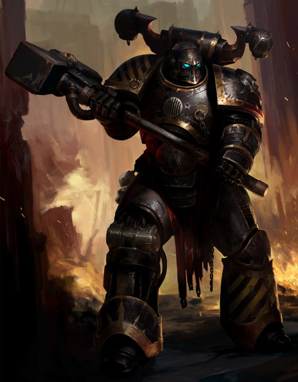

<!-- A0534-B0201 -->

原译文

Iron Warrior 钢铁勇士

**校订译文**

Iron Warrior 钢铁勇士

<!-- /A0534-B0201 -->

<!-- A0534-B0202 -->
### Unbreakable Litany 不破祷文

<!-- /A0534-B0202 -->

<!-- A0534-B0203 -->
**英文原文**

From the time before the Horus Heresy, the Unbreakable Litany has been a meditative chant and battle-cry for the Iron Warriors, used by Perturabo himself:

<!-- /A0534-B0203 -->

<!-- A0534-B0204 -->

原译文

从荷鲁斯叛乱之前开始，不破祷文一直是钢铁勇士的冥想颂歌和战斗口号，由佩图拉博自己使用：

**校订译文**

早在荷鲁斯之乱前，不破祷文就是钢铁勇士用于冥想的颂歌与战吼，佩图拉博本人也会吟诵：

<!-- /A0534-B0204 -->

<!-- A0534-B0205 -->
**英文原文**

"From Iron, cometh Strength. From Strength, cometh Will. From Will, cometh Faith. From Faith, cometh Honour. From Honour, cometh Iron. This is the Unbreakable Litany, and may it forever be so"

<!-- /A0534-B0205 -->

<!-- A0534-B0206 -->

原译文

“力量从钢铁而来。意志从力量而来。信仰从意志而来。荣誉从信仰而来。钢铁从荣誉中来。这就是不破祷文，愿它永远如此。”

**校订译文**

“力量从钢铁而来。意志从力量而来。信仰从意志而来。荣誉从信仰而来。钢铁从荣誉中来。这就是不破祷文，愿它永远如此。”

<!-- /A0534-B0206 -->

<!-- A0534-B0207 -->
## Gene-Seed 基因种子

<!-- /A0534-B0207 -->

<!-- A0534-B0208 -->
**英文原文**

During the Unification Wars and Great Crusade the Iron Warriors' gene-seed was said to show above-average rates of adaptability and low rates of implant rejection. This was present even before the capture of Selenar gene-labs during the First Pacification of Luna, allowing for the Legion to rapidly grow in size even before the Great Crusade had expanded outside the Sol System. Serving in large numbers early on alongside the I Legion and V Legion, their easily mass-produced gene-seed saw them always boast heavy numbers despite the great attrition rates endured during the Crusade and subsequent Heresy.

<!-- /A0534-B0208 -->

<!-- A0534-B0209 -->

原译文

在统一战争和大远征期间，据说钢铁勇士的基因种子表现出高于平均水平的适应性和较低的植入排斥率。这甚至在月球第一次平定期间赛琳娜基因实验室被占领之前就存在了，这使得军团在大远征扩展到太阳系之外之前就迅速扩大了规模。早期与第一军团和第五军团一起大量服役，他们易于大规模生产的基因种子使他们总是拥有大量的成员，尽管在大远征和随后的叛乱期间经历了巨大的消耗。

**校订译文**

据称，统一战争与大远征期间，钢铁勇士基因种子的适应性高于平均水平，植入排斥率则较低。甚至在第一次月球平定中夺取赛琳娜基因实验室以前，这种优势就已存在，因此大远征尚未走出太阳系，军团便迅速扩张。早期，他们与第一、第五军团一样拥有庞大兵力。易于大量培育的基因种子，使他们即便在大远征及随后的叛乱中伤亡惨重，仍能维持众多战士。

<!-- /A0534-B0209 -->

<!-- A0534-B0210 -->
**英文原文**

Today, extended time within the Eye of Terror has seen the corruption of much of their gene-seed. Many Iron Warriors become corrupted and sport mutations that are sometimes replaced with cybernetic limbs. Those implanted with Iron Warriors gene-seed are thought to suffer from varying degrees of suspicion and paranoia, but also extremely intelligent and possessing high problem solving abilities.

<!-- /A0534-B0210 -->

<!-- A0534-B0211 -->

原译文

今天，在恐惧之眼的漫长时间里，他们的大部分基因种子都遭到了破坏。许多钢铁勇士变得腐化，肢体突变有时会被智控肢体所取代。那些植入了钢铁勇士基因种子的人被认为患有不同程度的怀疑和偏执，但也非常聪明，具有很高的解决问题的能力。

**校订译文**

如今，长期身处恐惧之眼已使钢铁勇士的大部分基因种子遭到腐化。许多战士出现突变，有时会以机械义肢替换变异部位。人们认为，植入钢铁勇士基因种子的人会表现出程度不一的多疑与偏执，却也极其聪慧，善于解决问题。

<!-- /A0534-B0211 -->

<!-- A0534-B0212 -->
## Noted Elements of the Iron Warriors 钢铁勇士的著名力量

原题：Noted Elements of the Iron Warriors 著名钢铁勇士成员

<!-- /A0534-B0212 -->

<!-- A0534-B0213 -->
### Iron Warriors Armoury 钢铁勇士军械库

<!-- /A0534-B0213 -->

<!-- A0534-B0214 -->
### Fleet 舰队

原题：Fleet 战舰

<!-- /A0534-B0214 -->

<!-- A0534-B0215 -->
**英文原文**

Aesculus - Strike Cruiser during the Horus Heresy

<!-- /A0534-B0215 -->

<!-- A0534-B0216 -->

原译文

七叶树号 - 荷鲁斯叛乱时期的打击巡洋舰

**校订译文**

七叶树号 - 荷鲁斯之乱时期的打击巡洋舰

<!-- /A0534-B0216 -->

<!-- A0534-B0217 -->
**英文原文**

Calibos - Grand Cruiser

<!-- /A0534-B0217 -->

<!-- A0534-B0218 -->

原译文

卡里波斯号 - 大型巡洋舰

**校订译文**

卡里波斯号 - 大型巡洋舰

<!-- /A0534-B0218 -->

<!-- A0534-B0219 -->
**英文原文**

Contrador - Battle Barge during the Horus Heresy

<!-- /A0534-B0219 -->

<!-- A0534-B0220 -->

原译文

反抗者号 - 荷鲁斯叛乱期间的战斗驳船

**校订译文**

反抗者号 - 荷鲁斯之乱期间的战斗驳船

<!-- /A0534-B0220 -->

<!-- A0534-B0221 -->
**英文原文**

Daughter of Woe - Space Hulk during the Horus Heresy

<!-- /A0534-B0221 -->

<!-- A0534-B0222 -->

原译文

苦痛之女 - 荷鲁斯叛乱期间的太空废船

**校订译文**

苦痛之女号——荷鲁斯之乱时期的太空废船。

<!-- /A0534-B0222 -->

<!-- A0534-B0223 -->
**英文原文**

Ferrous Malice - Grand Cruiser

<!-- /A0534-B0223 -->

<!-- A0534-B0224 -->

原译文

铁之恶意号 - 大型巡洋舰

**校订译文**

铁之恶意号 - 大型巡洋舰

<!-- /A0534-B0224 -->

<!-- A0534-B0225 -->
**英文原文**

Indomitable - Ramilies-class star fort

<!-- /A0534-B0225 -->

<!-- A0534-B0226 -->

原译文

不屈号 - 拉米雷斯级星堡

**校订译文**

不屈号 - 拉米雷斯级星堡

<!-- /A0534-B0226 -->

<!-- A0534-B0227 -->
**英文原文**

Iron Blood - Battleship, flagship during the Horus Heresy

<!-- /A0534-B0227 -->

<!-- A0534-B0228 -->

原译文

铁血号 - 战列舰，荷鲁斯叛乱期间的旗舰

**校订译文**

铁血号 - 战列舰，荷鲁斯之乱期间的旗舰

<!-- /A0534-B0228 -->

<!-- A0534-B0229 -->
**英文原文**

Iron Silence - Controlled by Captain Kaurbek

<!-- /A0534-B0229 -->

<!-- A0534-B0230 -->

原译文

寂铁号 - 考尔贝克连长控制

**校订译文**

寂铁号——由考尔贝克连长掌控。

<!-- /A0534-B0230 -->

<!-- A0534-B0231 -->
**英文原文**

Merciless Spite - Flagship

<!-- /A0534-B0231 -->

<!-- A0534-B0232 -->

原译文

无情怨恨号 - 旗舰

**校订译文**

无情怨恨号 - 旗舰

<!-- /A0534-B0232 -->

<!-- A0534-B0233 -->
**英文原文**

Rebuke - Strike Cruiser during the Horus Heresy

<!-- /A0534-B0233 -->

<!-- A0534-B0234 -->

原译文

责备号 - 荷鲁斯叛乱时期的打击巡洋舰

**校订译文**

责备号 - 荷鲁斯之乱时期的打击巡洋舰

<!-- /A0534-B0234 -->

<!-- A0534-B0235 -->

原译文

Soul Harvesters 灵魂收割者号

**校订译文**

Soul Harvesters 灵魂收割者号

<!-- /A0534-B0235 -->

<!-- A0534-B0236 -->
**英文原文**

Stonebreaker - Battle Barge

<!-- /A0534-B0236 -->

<!-- A0534-B0237 -->

原译文

破石者号 - 战斗驳船

**校订译文**

破石者号 - 战斗驳船

<!-- /A0534-B0237 -->

<!-- A0534-B0238 -->
**英文原文**

Tamunash - War Barque

<!-- /A0534-B0238 -->

<!-- A0534-B0239 -->

原译文

塔蒙纳什号 - 战争三桅船

**校订译文**

塔蒙纳什号——战争三桅船。

**校注：** War Barque 为舰种名，暂沿战争三桅船；本句不能据此确认该太空舰实际设有风帆桅杆，舰种官译待核。

<!-- /A0534-B0239 -->

<!-- A0534-B0240 -->
**英文原文**

Warbreed - Battle Barge

<!-- /A0534-B0240 -->

<!-- A0534-B0241 -->

原译文

战裔号 - 战斗驳船

**校订译文**

战裔号 - 战斗驳船

<!-- /A0534-B0241 -->

<!-- A0534-B0242 -->
**英文原文**

Warforged - Strike Cruiser during the Horus Heresy

<!-- /A0534-B0242 -->

<!-- A0534-B0243 -->

原译文

战争铸造号 - 荷鲁斯叛乱时期的打击巡洋舰

**校订译文**

战争铸造号 - 荷鲁斯之乱时期的打击巡洋舰

<!-- /A0534-B0243 -->

<!-- A0534-B0244 -->
### Notable Members 著名成员

<!-- /A0534-B0244 -->

<!-- A0534-B0245 -->
### Heresy Era 叛乱时期

<!-- /A0534-B0245 -->

<!-- A0534-B0246 -->
**英文原文**

Perturabo - Primarch

<!-- /A0534-B0246 -->

<!-- A0534-B0247 -->

原译文

佩图拉博 - 原体

**校订译文**

佩图拉博 - 原体

<!-- /A0534-B0247 -->

<!-- A0534-B0248 -->
**英文原文**

Forrix - Warsmith, First Company

<!-- /A0534-B0248 -->

<!-- A0534-B0249 -->

原译文

弗里克斯 - 战争铁匠，第一连长

**校订译文**

弗里克斯——第一连战争铁匠。

**校注：** 英文仅列Warsmith, First Company，未在此明确写Captain，不额外补称第一连长。

<!-- /A0534-B0249 -->

<!-- A0534-B0250 -->
**英文原文**

Berossus - Warsmith of the 2nd Grand Battalion

<!-- /A0534-B0250 -->

<!-- A0534-B0251 -->

原译文

贝罗索斯 - 第二大营战争铁匠

**校订译文**

贝罗索斯 - 第二大营战争铁匠

<!-- /A0534-B0251 -->

<!-- A0534-B0252 -->
**英文原文**

Erasmus Golg - Captain of the 11th Grand Company

<!-- /A0534-B0252 -->

<!-- A0534-B0253 -->

原译文

伊拉斯谟·戈尔格 - 第11大连连长

**校订译文**

伊拉斯谟·戈尔格 - 第11大连连长

<!-- /A0534-B0253 -->

<!-- A0534-B0254 -->
**英文原文**

Barabas Dantioch - Warsmith, 51st Expeditionary Fleet, Loyalist

<!-- /A0534-B0254 -->

<!-- A0534-B0255 -->

原译文

巴拉巴斯·丹提欧克 - 战争铁匠，第51远征舰队，忠诚派

**校订译文**

巴拉巴斯·丹提欧克 - 战争铁匠，第51远征舰队，忠诚派

<!-- /A0534-B0255 -->

<!-- A0534-B0256 -->
**英文原文**

Barban Falk - Warsmith of the 126th Grand Battalion, later known as "The Warsmith"

<!-- /A0534-B0256 -->

<!-- A0534-B0257 -->

原译文

巴尔本·法尔克 - 第126大营战争铁匠，后来被称为“战匠”

**校订译文**

巴尔本·法尔克——第126大营战争铁匠，后来被称为“战争铁匠”。

**校注：** “The Warsmith”是人物后来使用的特称，本稿保留其与普通职衔同译，不能仅凭未具名提及便判断所有战争铁匠均指此人。

<!-- /A0534-B0257 -->

<!-- A0534-B0258 -->
**英文原文**

Harkor - Warsmith of the 23rd Grand Battalion

<!-- /A0534-B0258 -->

<!-- A0534-B0259 -->

原译文

哈尔克 - 第23大营战争铁匠

**校订译文**

哈尔克 - 第23大营战争铁匠

<!-- /A0534-B0259 -->

<!-- A0534-B0260 -->
**英文原文**

Kroeger - Trooper and later Warsmith

<!-- /A0534-B0260 -->

<!-- A0534-B0261 -->

原译文

克罗格尔 - 士兵和后来的战争铁匠

**校订译文**

克罗格尔——起初是一名士兵，后来成为战争铁匠。

<!-- /A0534-B0261 -->

<!-- A0534-B0262 -->
**英文原文**

Soltarn Vull Bronn - Warsmith of the 45th Grand Battalion

<!-- /A0534-B0262 -->

<!-- A0534-B0263 -->

原译文

索尔塔恩·沃尔·布隆 - 第45大营战争铁匠

**校订译文**

索尔塔恩·沃尔·布隆 - 第45大营战争铁匠

<!-- /A0534-B0263 -->

<!-- A0534-B0264 -->
**英文原文**

Toramino - Master of the Stor-Bezashk

<!-- /A0534-B0264 -->

<!-- A0534-B0265 -->

原译文

托拉米诺 - 破城宿卫大师

**校订译文**

托拉米诺——破城宿卫之主。

<!-- /A0534-B0265 -->

<!-- A0534-B0266 -->
**英文原文**

Auric Saxton - Warsmith, Loyalist

<!-- /A0534-B0266 -->

<!-- A0534-B0267 -->

原译文

奥里克·萨克斯顿 - 战争铁匠，忠诚派

**校订译文**

奥里克·萨克斯顿 - 战争铁匠，忠诚派

<!-- /A0534-B0267 -->

<!-- A0534-B0268 -->
**英文原文**

Bahdet Vort - Captain of the Iron Blood

<!-- /A0534-B0268 -->

<!-- A0534-B0269 -->

原译文

巴赫代特·沃特 - 铁血号船长

**校订译文**

巴赫代特·沃特——铁血号舰长。

<!-- /A0534-B0269 -->

<!-- A0534-B0270 -->
**英文原文**

Volk - Commander of the 786th Grand Flight and the first Obliterator

<!-- /A0534-B0270 -->

<!-- A0534-B0271 -->

原译文

沃尔克 - 第786飞行大队指挥官和第一个泯灭者

**校订译文**

沃尔克 - 第786飞行大队指挥官和第一个泯灭者

<!-- /A0534-B0271 -->

<!-- A0534-B0272 -->
**英文原文**

Tubal Cayne - member of the Crusader Host and later Knights-Errant, Loyalist

<!-- /A0534-B0272 -->

<!-- A0534-B0273 -->

原译文

图巴尔·凯恩 - 远征代表的成员，后来成为游侠骑士，忠诚派

**校订译文**

图巴尔·凯恩——远征代表组织成员，后来加入游侠骑士；忠诚派。

**校注：** Crusader Host 是专名组织，不等于全部参加大远征的战士，暂沿本处远征代表，并补组织说明。

<!-- /A0534-B0273 -->

<!-- A0534-B0274 -->
### Post Heresy 叛乱后

<!-- /A0534-B0274 -->

<!-- A0534-B0275 -->
**英文原文**

Perturabo - Daemon Primarch

<!-- /A0534-B0275 -->

<!-- A0534-B0276 -->

原译文

佩图拉博 - 恶魔原体

**校订译文**

佩图拉博 - 恶魔原体

<!-- /A0534-B0276 -->

<!-- A0534-B0277 -->
**英文原文**

Barban Falk - Warsmith who ascended to Daemonhood on Hydra Cordatus

<!-- /A0534-B0277 -->

<!-- A0534-B0278 -->

原译文

巴尔本·法尔克 - 在九头蛇之心升格为恶魔王子的战争铁匠

**校订译文**

巴尔本·法尔克——在海德拉之心升格成魔的战争铁匠。

<!-- /A0534-B0278 -->

<!-- A0534-B0279 -->
**英文原文**

Honsou - Warsmith and successor to the unnamed Warsmith

<!-- /A0534-B0279 -->

<!-- A0534-B0280 -->

原译文

洪索 - 继承无名战争铁匠的战争铁匠

**校订译文**

洪索——战争铁匠，继承了那位未具名战争铁匠的地位。

<!-- /A0534-B0280 -->

<!-- A0534-B0281 -->
**英文原文**

Shon'tu - Powerful Warsmith

<!-- /A0534-B0281 -->

<!-- A0534-B0282 -->

原译文

邵恩·图 - 强大的战争铁匠

**校订译文**

绍恩’图——强大的战争铁匠。

<!-- /A0534-B0282 -->

<!-- A0534-B0283 -->
**英文原文**

Manneus Drath - ruler of Brigannion Four

<!-- /A0534-B0283 -->

<!-- A0534-B0284 -->

原译文

曼纽斯·德拉斯 - 布里甘尼翁四号的统治者

**校订译文**

曼纽斯·德拉斯 - 布里甘尼翁四号的统治者

<!-- /A0534-B0284 -->

<!-- A0534-B0285 -->
**英文原文**

Forrix - Champion of the unnamed Warsmith

<!-- /A0534-B0285 -->

<!-- A0534-B0286 -->

原译文

弗里克斯 - 无名战争铁匠的冠军

**校订译文**

弗里克斯——那位未具名战争铁匠麾下的勇士。

<!-- /A0534-B0286 -->

<!-- A0534-B0287 -->
**英文原文**

Kalkator - Warsmith

<!-- /A0534-B0287 -->

<!-- A0534-B0288 -->

原译文

卡尔卡托 - 战争铁匠

**校订译文**

卡尔卡托 - 战争铁匠

<!-- /A0534-B0288 -->

<!-- A0534-B0289 -->
**英文原文**

Czagra - Warsmith

<!-- /A0534-B0289 -->

<!-- A0534-B0290 -->

原译文

察格拉 - 战争铁匠

**校订译文**

察格拉 - 战争铁匠

<!-- /A0534-B0290 -->

<!-- A0534-B0291 -->
**英文原文**

Cadaras Grendel - Master of Arms to Lord Berossus

<!-- /A0534-B0291 -->

<!-- A0534-B0292 -->

原译文

卡达拉斯·格伦戴尔 - 贝罗索斯领主的军械之主

**校订译文**

卡达拉斯·格伦戴尔 - 贝罗索斯领主的军械之主

<!-- /A0534-B0292 -->

<!-- A0534-B0293 -->
**英文原文**

Kroeger - Champion of the unnamed Warsmith

<!-- /A0534-B0293 -->

<!-- A0534-B0294 -->

原译文

克罗格尔 - 无名战争铁匠的冠军

**校订译文**

克罗格尔——那位未具名战争铁匠麾下的勇士。

<!-- /A0534-B0294 -->

<!-- A0534-B0295 -->
**英文原文**

Onyx - Champion of Honsou and Possessed Chaos Marine

<!-- /A0534-B0295 -->

<!-- A0534-B0296 -->

原译文

奥尼克斯 - 洪索的冠军和附魔混沌战士

**校订译文**

奥尼克斯——洪索麾下的勇士，也是附魔混沌星际战士。

<!-- /A0534-B0296 -->

<!-- A0534-B0297 -->
**英文原文**

The Newborn - a mutated clone of Ultramarines Captain Uriel Ventris

<!-- /A0534-B0297 -->

<!-- A0534-B0298 -->

原译文

新生 - 极限战士连长乌瑞尔·文崔斯的突变克隆体

**校订译文**

新生者——极限战士连长乌瑞尔·文崔斯的变异克隆体。

<!-- /A0534-B0298 -->

<!-- A0534-B0299 -->
**英文原文**

The Slaughterman - damned conductor of the Omphalos Daemonium

<!-- /A0534-B0299 -->

<!-- A0534-B0300 -->

原译文

屠夫 - 被诅咒的翁法洛斯·恶魔的载体

**校订译文**

屠夫——翁法洛斯恶魔的受诅引导者。

**校注：** 原文conductor不是宿主或载体。暂按引导者译；其具体职务是操纵、引领还是运输职责，底稿本句不足以确认，保留待核，不擅改成附魔宿主。

<!-- /A0534-B0300 -->

<!-- A0534-B0301 -->
**英文原文**

Tzimiskes Flay - Apothecary, joined Fabius Bile's Consortium

<!-- /A0534-B0301 -->

<!-- A0534-B0302 -->

原译文

提兹米斯克·弗莱 - 药剂师，加入法比乌斯·拜尔的共同体

**校订译文**

提兹米斯克·弗莱 - 药剂师，加入法比乌斯·拜尔的共同体

<!-- /A0534-B0302 -->

<!-- A0534-B0303 -->
**英文原文**

Malek Ugor - Warsmith

<!-- /A0534-B0303 -->

<!-- A0534-B0304 -->

原译文

马莱克·乌戈尔 - 战争铁匠

**校订译文**

马莱克·乌戈尔 - 战争铁匠

<!-- /A0534-B0304 -->

<!-- A0534-B0305 -->
### Known Fortress Worlds 著名要塞世界

<!-- /A0534-B0305 -->

<!-- A0534-B0306 -->
**英文原文**

Brigannion Four - continually disputed by other Chaos Space Marine warbands

<!-- /A0534-B0306 -->

<!-- A0534-B0307 -->

原译文

布里甘尼翁四号 - 持续受到其他混沌星际战士的争夺

**校订译文**

布里甘尼翁四号——其他混沌星际战士战帮持续争夺的世界。

<!-- /A0534-B0307 -->

<!-- A0534-B0308 -->
**英文原文**

Burjan's World - located in the Mitre Gulf

<!-- /A0534-B0308 -->

<!-- A0534-B0309 -->

原译文

布尔扬世界 - 位于米特湾

**校订译文**

布尔扬世界 - 位于米特湾

<!-- /A0534-B0309 -->

<!-- A0534-B0310 -->
**英文原文**

Castellax - overrun by Orks

<!-- /A0534-B0310 -->

<!-- A0534-B0311 -->

原译文

卡斯蒂利亚斯 - 被欧克占领

**校订译文**

卡斯蒂利亚斯——被欧克蛮人攻占。

<!-- /A0534-B0311 -->

<!-- A0534-B0312 -->
**英文原文**

Forgefane - consumed by Hive Fleet Leviathan

<!-- /A0534-B0312 -->

<!-- A0534-B0313 -->

原译文

铸造神殿 - 被虫巢舰队利维坦吞噬

**校订译文**

铸造神殿——被利维坦虫巢舰队吞噬。

<!-- /A0534-B0313 -->

<!-- A0534-B0314 -->
**英文原文**

Ironhold - destroyed by Imperial forces

<!-- /A0534-B0314 -->

<!-- A0534-B0315 -->

原译文

钢铁囚牢 - 被帝国部队摧毁

**校订译文**

钢铁囚牢 - 被帝国部队摧毁

<!-- /A0534-B0315 -->

<!-- A0534-B0316 -->
**英文原文**

Klostra - overrun by Orks

<!-- /A0534-B0316 -->

<!-- A0534-B0317 -->

原译文

克罗斯特拉 - 被欧克占领

**校订译文**

克罗斯特拉——被欧克蛮人攻占。

<!-- /A0534-B0317 -->

<!-- A0534-B0318 -->
**英文原文**

Malodrax - laid to waste by the Imperial Fists

<!-- /A0534-B0318 -->

<!-- A0534-B0319 -->

原译文

长恶星 - 被帝国之拳摧毁

**校订译文**

长恶星 - 被帝国之拳摧毁

<!-- /A0534-B0319 -->

<!-- A0534-B0320 -->
**英文原文**

Medrengard - post-Heresy Legion homeworld

<!-- /A0534-B0320 -->

<!-- A0534-B0321 -->

原译文

梅林德加德 - 叛乱后军团家园世界

**校订译文**

梅林德加德——荷鲁斯之乱后军团的母星。

<!-- /A0534-B0321 -->

<!-- A0534-B0322 -->
**英文原文**

Albric Crucible - fortress within the Imperium Nihilus

<!-- /A0534-B0322 -->

<!-- A0534-B0323 -->

原译文

智慧熔炉 - 帝国暗面的要塞

**校订译文**

阿尔布里克熔炉——位于帝国暗面的要塞。

**校注：** Albric是专名，原译智慧缺乏本句依据；暂音译阿尔布里克，待官方对应。

<!-- /A0534-B0323 -->

<!-- A0534-B0324 -->
**英文原文**

Xoraforge - fortress within the Imperium Nihilus

<!-- /A0534-B0324 -->

<!-- A0534-B0325 -->

原译文

佐拉熔炉 - 帝国暗面的要塞

**校订译文**

佐拉熔炉 - 帝国暗面的要塞

<!-- /A0534-B0325 -->

<!-- A0534-B0326 -->
**英文原文**

Fortress of Animus Eternal - fortress within the Imperium Nihilus

<!-- /A0534-B0326 -->

<!-- A0534-B0327 -->

原译文

永恒敌意要塞 - 帝国暗面的要塞

**校订译文**

永恒敌意要塞 - 帝国暗面的要塞

<!-- /A0534-B0327 -->

<!-- A0534-B0328 -->
### Unique Units 独特单位

<!-- /A0534-B0328 -->

<!-- A0534-B0329 -->
**英文原文**

Bartizan Class Remote Seeker Drone

<!-- /A0534-B0329 -->

<!-- A0534-B0330 -->

原译文

望台级遥控搜索者无人机

**校订译文**

望台级遥控搜索者无人机

<!-- /A0534-B0330 -->

<!-- A0534-B0331 -->

原译文

Black Basilica 黑色教堂

**校订译文**

Black Basilica 黑色教堂

<!-- /A0534-B0331 -->

<!-- A0534-B0332 -->
**英文原文**

Castellan Rhino - APC/mobile bunker

<!-- /A0534-B0332 -->

<!-- A0534-B0333 -->

原译文

堡主犀牛 - 装甲运兵车/移动式掩体

**校订译文**

堡主型犀牛——装甲运兵车，兼作移动掩体。

<!-- /A0534-B0333 -->

<!-- A0534-B0334 -->
**英文原文**

Cloud-Hammer - Airship

<!-- /A0534-B0334 -->

<!-- A0534-B0335 -->

原译文

云锤 - 飞艇

**校订译文**

云锤 - 飞艇

<!-- /A0534-B0335 -->

<!-- A0534-B0336 -->
**英文原文**

Dodakathik (Heresy-era)

<!-- /A0534-B0336 -->

<!-- A0534-B0337 -->

原译文

多德卡提克（叛乱时期）

**校订译文**

多德卡提克（叛乱时期）

<!-- /A0534-B0337 -->

<!-- A0534-B0338 -->
**英文原文**

Iron Havoc (Heresy-era)

<!-- /A0534-B0338 -->

<!-- A0534-B0339 -->

原译文

钢铁浩劫（叛乱时期）

**校订译文**

钢铁浩劫（叛乱时期）

<!-- /A0534-B0339 -->

<!-- A0534-B0340 -->

原译文

Lightning Crow Strike Fighter 闪电鸦攻击战斗机

**校订译文**

Lightning Crow Strike Fighter 闪电鸦攻击战斗机

<!-- /A0534-B0340 -->

<!-- A0534-B0341 -->
**英文原文**

Stor-Bezashk (Heresy-era)

<!-- /A0534-B0341 -->

<!-- A0534-B0342 -->

原译文

破城宿卫（叛乱时期）

**校订译文**

破城宿卫（叛乱时期）

<!-- /A0534-B0342 -->

<!-- A0534-B0343 -->

原译文

Stormcrow Assault Boat 风暴鸦突击船

**校订译文**

Stormcrow Assault Boat 风暴鸦突击船

<!-- /A0534-B0343 -->

<!-- A0534-B0344 -->

原译文

Thunderburst Artillery 雷暴火炮

**校订译文**

Thunderburst Artillery 雷暴火炮

<!-- /A0534-B0344 -->

<!-- A0534-B0345 -->

原译文

Thunderstrike Artillery 雷击火炮

**校订译文**

Thunderstrike Artillery 雷击火炮

<!-- /A0534-B0345 -->

<!-- A0534-B0346 -->
**英文原文**

Tyrant Siege Terminator (Heresy-era)

<!-- /A0534-B0346 -->

<!-- A0534-B0347 -->

原译文

暴君攻城终结者（叛乱时期）

**校订译文**

暴君攻城终结者（叛乱时期）

<!-- /A0534-B0347 -->

<!-- A0534-B0348 -->
**英文原文**

Tyranthikos (Heresy-era)

<!-- /A0534-B0348 -->

<!-- A0534-B0349 -->

原译文

僭主（叛乱时期）

**校订译文**

提兰提科斯卫队（荷鲁斯之乱时期）。

**校注：** Tyranthikos 与 Tyrant Siege Terminator 区分；沿全书决定采用提兰提科斯卫队。

<!-- /A0534-B0349 -->

<!-- A0534-B0350 -->

原译文

Warsmith 战争铁匠

**校订译文**

Warsmith 战争铁匠

<!-- /A0534-B0350 -->

<!-- A0534-B0351 -->

原译文

Daemonsmith 恶魔铁匠

**校订译文**

Daemonsmith 恶魔铁匠

<!-- /A0534-B0351 -->

本篇核心术语与暂定项

以下列出本篇出现的英文原形及核心术语表用词。同形词可能指不同对象，具体词义以本篇正文和校注为准；单复数、别名和仅见于图注的名称可能尚未列入。完整候选见[术语表](../../术语表/双语术语候选.csv)。

| 英文 | 采用中文 | 状态 |
| --- | --- | --- |
| Space Marines | 星际战士 | 官方已核对 |
| Blood Angels | 圣血天使 | 官方已核对 |
| Space Wolves | 太空野狼 | 官方已核对 |
| Adeptus Mechanicus | 机械修会 | 官方已核对 |
| Imperial Army | 帝国军 | 暂定·官方待核 |
| Chaos Space Marines | 混沌星际战士 | 官方已核对 |
| Death Guard | 死亡守卫 | 官方已核对 |
| Thousand Sons | 千子 | 官方已核对 |
| World Eaters | 吞世者 | 官方已核对 |
| Orks | 欧克蛮人 | 官方已核对 |
| Terminator | 终结者 | 官方已核对 |
| Roboute Guilliman | 罗保特·基里曼 | 官方已核对 |
| Ultramarines | 极限战士 | 官方已核对 |
| Horus Heresy | 荷鲁斯之乱 | 官方已核对 |
| Warp | 亚空间 | 官方已核对 |
| Imperium | 帝国 | 暂定·简称 |
| Mechanicum | 机械教 | 暂定·历史称谓 |
| History | 历史 | 编辑用语已统一 |
| Equipment | 装备 | 编辑用语已统一 |
| Eye of Terror | 恐惧之眼 | 官方已核对 |
| Imperial Fists | 帝国之拳 | 暂定 |
| Obliterator | 泯灭者 | 官方已核对 |
| Emperor | 帝皇 | 官方已核对 |
| Primarch | 原体 | 官方已核对 |
| Battle Barge | 战斗驳船 | 暂定·官方待核 |
| Forge World | 铸造世界 | 暂定·官方待核 |
| Daemon Prince | 恶魔亲王 | 官方已核对 |
| Iron Warriors | 钢铁勇士 | 暂定·官方待核 |
| Great Crusade | 大远征 | 暂定·官方待核 |
| Mortarion | 莫塔里安 | 官方已核对 |
| Compliance | 归顺；纳入帝国统治 | 暂定·官方待核 |
| Terra | 泰拉 | 暂定·官方待核 |
| Horus | 荷鲁斯 | 暂定·官方待核 |
| Iron Hands | 钢铁之手 | 暂定·官方待核 |
| Fulgrim | 福格瑞姆 | 官方已核对 |
| Imperium Nihilus | 帝国暗面 | 暂定·官方待核 |
| Hive Fleet Leviathan | 利维坦虫巢舰队 | 暂定·官方待核 |
| Ordo Reductor | 源还修会 | 暂定·官方待核 |
| Unification Wars | 统一战争 | 暂定·官方待核 |
| Mars | 火星 | 暂定·官方待核 |
| Tallarn | 塔兰 | 暂定·官方待核 |
| Olympia | 奥林匹亚 | 暂定·官方待核 |
| Luna | 月球 | 暂定·官方待核 |
| Venus | 金星 | 暂定·官方待核 |
| Titan | 泰坦 | 暂定·官方待核 |
| Barabas Dantioch | 巴拉巴斯·丹提欧克 | 暂定·官方待核 |
| Warsmith | 战争铁匠 | 暂定·官方待核 |
| Bionics | 仿生改造／仿生部件（依语境） | 语境定译·官方待核 |
| Master | 导师（审判庭职衔）／舰务官（舰员职务） | 语境定译·官方待核 |
| Reclusiarch | 隐修长 | 暂定·官方待核 |
| Tyranthikos | 提兰提科斯卫队 | 暂定·官方待核 |
| Apothecary | 药剂师 | 官方已核对 |
| Fabius Bile | 法比乌斯·拜尔 | 官方已核对 |
| Ancient | 旗手 | 官方已核对 |
| Rhino | 犀牛战车 | 官方已核对 |
| Long War | 万古长战 | 暂定·官方待核 |
| Ullanor | 乌兰诺 | 暂定·官方待核 |
| Raven Guard | 暗鸦守卫 | 官方已核 |
| Lost Sons | 失落之子 | 暂定·官方待核 |
| Knights-Errant | 游侠骑士 | 暂定·官方待核 |
| Sol | 太阳系 | 暂定·官方待核 |
| Isstvan | 伊斯塔万 | 暂定·官方待核 |
| Tubal Cayne | 图巴尔·凯恩 | 暂定·官方待核 |
| Soltarn Vull Bronn | 索尔塔恩·沃·布隆 | 暂定·官方待核 |
| Berossus | 贝罗索斯 | 暂定·官方待核 |
| Barban Falk | 巴尔本·法尔克 | 暂定·官方待核 |
| Kroeger | 克罗格 | 暂定·官方待核 |
| Toramino | 托拉米诺 | 暂定·官方待核 |
| Harkor | 哈克 | 暂定·官方待核 |
| Champion | 冠军 | 暂定·官方待核 |
| Seeker | 追踪者 | 暂定·官方待核 |
| Space Marine | 星际战士 | 暂定·官方待核 |
| Chapter | 战团 | 暂定·官方待核 |
| Chapter Master | 战团长 | 暂定·官方待核 |
| Captain | 连长 | 暂定·官方待核 |
| Brother | 修士 | 暂定·官方待核 |
| Uriel Ventris | 乌瑞尔·文崔斯 | 官方已核 |
| The Angel | 天使 | 暂定·官方待核 |
| Predators | 掠食者 | 暂定·官方待核 |
| Vindicators | 维护者 | 暂定·官方待核 |
| Land Raiders | 兰德掠袭者 | 暂定·官方待核 |
| Master of Arms | 武器之主 | 暂定·官方待核 |
| Sons of Dorn | 多恩之子 | 暂定·官方待核 |
| Gene-seed | 基因种子 | 暂定·官方待核 |
| Strike Cruiser | 打击巡洋舰 | 暂定·官方待核 |
| Castellan | 堡主 | 官方已核对 |
| Saturnine Wall | 土星之墙 | 暂定·官方待核 |
| Chaos Undivided | 混沌无分 | 暂定·官方待核 |
| Absolute | 绝对号 | 暂定·官方待核 |
| Host | 天军 | 暂定·官方待核 |
| Malice | 恶意 | 暂定·官方待核 |
| Hrud | 赫鲁德 | 暂定·官方待核 |
| Reductor | 基因提取器 | 暂定·官方待核 |
| Medrengard | 梅林德加德 | 暂定·官方待核 |
| Selenar | 赛琳娜基因教派 | 暂定·官方待核 |
| Iydris | 伊德瑞斯 | 暂定·官方待核 |
| Stonebreaker | 破石者 | 暂定·官方待核 |
| Auro Plateau | 奥罗高原 | 暂定·官方待核 |
| Sek-Amrak | 萨克-阿姆瑞克 | 暂定·官方待核 |
| Black Oculus | 黑暗之眼 | 暂定·官方待核 |
| Cursus of Alganar | 阿尔加纳尔驰道 | 暂定·官方待核 |
| Gorgon Bar | 戈尔贡防线 | 暂定·官方待核 |
| The Newborn | 新生者 | 暂定·官方待核 |
| Albric Crucible | 阿尔布里克熔炉 | 暂定·官方待核 |
| Crusader Host | 远征代表 | 暂定·官方待核 |
| The Slaughterman | 屠夫 | 暂定·官方待核 |
| Omphalos Daemonium | 翁法洛斯恶魔 | 暂定·官方待核 |
| Tamunash | 塔蒙纳什号 | 暂定·官方待核 |
| Forgefane | 铸造神殿 | 暂定·官方待核 |
| Angron | 安格隆 | 官方已核对 |
| Grendel | 格伦德尔号 | 暂定·官方待核 |
| Merciless | 无情号 | 暂定·官方待核 |
| Iron Cage | 铁笼 | 暂定·官方待核 |
| Crucible | 熔炉星 | 暂定·官方待核 |
| Hydra Cordatus | 海德拉之心 | 暂定·官方待核 |
| Stor-Bezashk | 破城宿卫 | 暂定·官方待核 |
| Lochos | 洛科斯 | 暂定·官方待核 |
| Iron Blood | 铁血（芬里斯部落）／铁血号（舰船） | 语境定译·官方待核 |
| Daughter of Woe | 灾难之女 | 暂定·官方待核 |
| Newborn | 新血 | 暂定·官方待核 |
| Ferocity | 凶猛 | 暂定·官方待核 |
| The Crusader | 十字军号 | 暂定·官方待核 |
| Gun | 甘 | 暂定·官方待核 |
| Mercy | 仁慈 | 暂定·官方待核 |
| Forgiveness | 宽恕 | 暂定·官方待核 |
| Kalkator | 卡尔卡托 | 暂定·官方待核 |
| Klostra | 克洛斯特拉 | 暂定·官方待核 |
| Tzimiskes Flay | 提兹米斯克·弗莱 | 暂定·官方待核 |
| Ruinstorm | 毁灭风暴 | 暂定·官方待核 |
| System | 星系（恒星系统） | 暂定·官方待核 |
| Fortis Binary | 福蒂斯双星 | 暂定·官方待核 |
| Incaladion | 因卡拉迪翁 | 暂定·官方待核 |
| Woe | 悲哀星 | 暂定·官方待核 |
| Volk | 沃克 | 暂定·官方待核 |
| First Pacification of Luna | 第一次月球平定 | 暂定·官方待核 |
| Erasmus Golg | 伊拉斯谟·高尔 | 暂定·官方待核 |
| Contrador | 承建者号 | 暂定·官方待核 |
| Corruption | 腐败 | 暂定·官方待核 |
| Honsou | 洪索 | 暂定·官方待核 |
| Obliterators | 泯灭者 | 官方已核 |
| Tallarn System | 塔兰星系 | 暂定·官方待核 |
| Czagra | 查格拉 | 暂定·官方待核 |
| Castellan Rhino | 堡主犀牛 | 暂定·官方待核 |
| Titan Legions | 泰坦军团 | 暂定·官方待核 |
| Angel Exterminatus | 灭绝天使 | 暂定·官方待核 |
| Gorgon | 戈尔贡 | 暂定·官方待核 |
| Shriven | 忏悔者 | 暂定·官方待核 |
| Litho-Gholem | 岩石魔像 | 暂定·官方待核 |
| Mehr Yasht | 梅赫尔·亚什特战役 | 暂定·官方待核 |
| Sol System | 太阳系 | 暂定·官方待核 |
| Lion's Gate Spaceport | 狮门太空港 | 暂定·官方待核 |
| Lion's Gate | 狮门 | 暂定·官方待核 |

