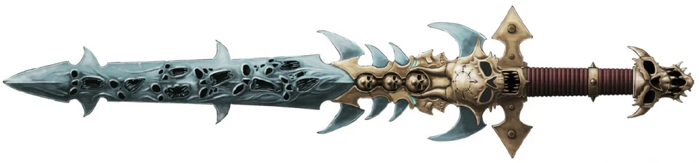
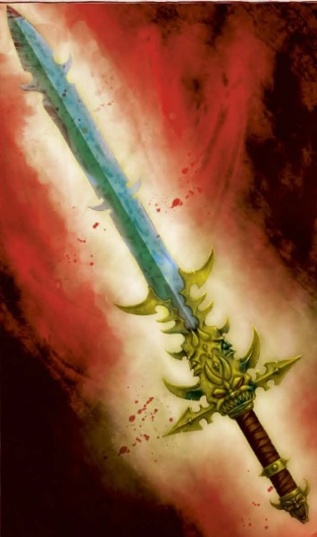
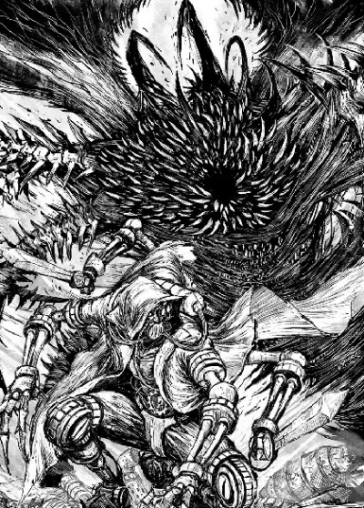
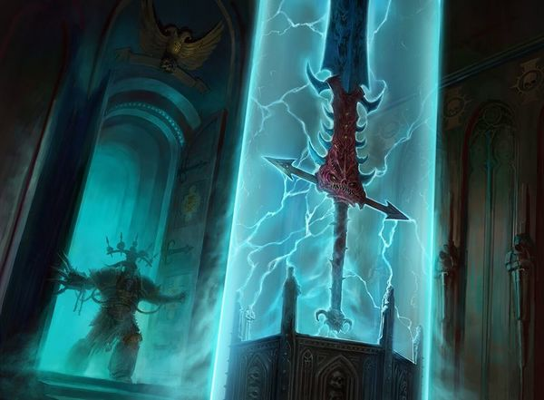

# 0733 德拉科尼恩 Drach'nyen

精校状态：中文行文已逐段精校，部分术语仍为暂定

分类：混沌 / 恶魔

原文来源：https://www.bilibili.com/opus/1060007755596693511

原作者：帝国神选罐头

原文时间：2025年04月26日 12:11

[返回分类目录](目录.md) · [全书目录](../../目录.md)

原篇名：德拉科'尼恩 Drach'nyen

<!-- A0733-B0001 -->
**英文原文**

Drach'nyen, the End of Empires and the Echo of the First Murder, is an ancient daemon of pure, unadulterated malice currently bound in the daemon sword of the same name wielded by Abaddon the Despoiler.

<!-- /A0733-B0001 -->

<!-- A0733-B0002 -->

原译文

德拉科’尼恩，帝国的终结和第一次谋杀的回声，是一个古老的纯粹、完全的恶意恶魔，目前被束缚在大掠夺者阿巴顿挥舞的同名魔剑中。

**校订译文**

德拉科尼恩，又称“帝国终结”与“首桩谋杀的回响”，是一个由纯粹恶意凝成的古老恶魔。如今，它被束缚在同名魔剑之中，由掠夺者阿巴顿持用。

**校注：** 德拉科尼恩沿512统一定译；诸别称暂定，非官网确认。

<!-- /A0733-B0002 -->

<!-- A0733-B0003 图片 -->

<!-- A0733-B0004 -->

原译文

The Daemon Sword Drach'nyen 魔剑德拉科’尼恩

**校订译文**

The Daemon Sword Drach'nyen 魔剑德拉科尼恩

<!-- /A0733-B0004 -->

<!-- A0733-B0005 -->
## Appearance 外观

<!-- /A0733-B0005 -->

<!-- A0733-B0006 -->
**英文原文**

Drach'nyen can take many forms, and it only appears as a great blade in the hands of Abaddon because that is how the Warmaster chooses it to be. In truth, the sword has no real shape or size, at least nothing that could be understood by the mind of man.

<!-- /A0733-B0006 -->

<!-- A0733-B0007 -->

原译文

德拉科’尼恩可以有很多种形态，它只在阿巴顿手中看起来像一把巨大的剑，因为战帅就是这样选择的。事实上，这把剑没有真正的形状或大小，至少没有人能理解的东西。

**校订译文**

德拉科尼恩能够呈现许多形态。它在阿巴顿手中化作一柄巨剑，只因战帅希望它如此。实际上，它并无固定的形状或尺寸，至少没有人类心智能够理解的形态。

<!-- /A0733-B0007 -->

<!-- A0733-B0008 图片 -->

<!-- A0733-B0009 -->

原译文

Drach'nyen 德拉科’尼恩

**校订译文**

Drach'nyen 德拉科尼恩

<!-- /A0733-B0009 -->

<!-- A0733-B0010 -->
**英文原文**

The weapon normally appears to be something akin to a two-handed sword, except that Abaddon wields the weapon with a single hand in conjunction with the Talon of Horus. The guard of the weapon tends to be golden in colour, with a leering face of a demon just above the handle. The ricasso of the weapon has spikes protruding from the sides as well as outward from the blade, and the blade itself is blue with red, tormented faces (the faces of souls it has devoured since being claimed by Abaddon) writhing across its surface.

<!-- /A0733-B0010 -->

<!-- A0733-B0011 -->

原译文

武器通常看起来类似于双手剑，除了阿巴顿用一只手挥舞武器，与荷鲁斯之爪一起。武器的护手往往是金色的，手柄上方有一张恶魔的斜眼脸。武器的刃柄有从侧面和刀刃向外突出的尖刺，刀刃本身是蓝色的，上面有红色的、痛苦的面孔（自阿巴顿声称拥有以来，它吞噬的灵魂的面孔）在其表面扭动。

**校订译文**

这件武器通常形似双手巨剑，但阿巴顿能够单手挥舞它，并与荷鲁斯之爪配合使用。其护手通常呈金色，剑柄上方饰有一张狞笑的恶魔面孔。靠近剑柄的未开刃部分向侧面及剑身外侧伸出尖刺。剑刃呈蓝色，表面翻涌着一张张痛苦扭曲的红色面孔——那是阿巴顿获得此剑以来，被它吞噬的灵魂。

<!-- /A0733-B0011 -->

<!-- A0733-B0012 -->
## History 历史

<!-- /A0733-B0012 -->

<!-- A0733-B0013 -->
**英文原文**

The origins of Drach'nyen are a mystery to most, unknown perhaps even to Abaddon himself. Daemons speak of the blade in fear, calling it the Thorn in Reality or the Shard of Madness. It is, however, known to be a weapon that has existed long before the rise of Mankind.

<!-- /A0733-B0013 -->

<!-- A0733-B0014 -->

原译文

德拉科’尼恩的起源对大多数人来说都是一个谜，甚至对阿巴顿本人来说都是未知的。恶魔在恐惧中谈论这把刀，称之为现实中的荆棘或疯狂的碎片。然而，众所周知，它是一种早在人类崛起之前就存在的武器。

**校订译文**

德拉科尼恩的起源对大多数人而言都是谜团，就连阿巴顿本人也可能一无所知。恶魔提及此剑时充满恐惧，称它为“现实之刺”或“疯狂碎片”。然而，人们知道，早在人类崛起之前，这件武器就已经存在。

<!-- /A0733-B0014 -->

<!-- A0733-B0015 -->
### The First Murder 第一次谋杀

<!-- /A0733-B0015 -->

<!-- A0733-B0016 -->
**英文原文**

Drach'nyen was born at the moment of the first murder - the first time a human killed another human outside of the need to survive. The name Drach'nyen, which can be translated as the End of Empires, is an approximation of the scream of the first murderer and that of the brother he murdered.

<!-- /A0733-B0016 -->

<!-- A0733-B0017 -->

原译文

德拉科’尼恩诞生在第一次谋杀发生的那一刻，这是第一次有人在生存需要之外杀死另一个人。德拉科’尼恩这个名字可以翻译成帝国的终结，是第一个杀人犯和他谋杀的兄弟的尖叫的类似事物。

**校订译文**

德拉科尼恩诞生于人类历史上第一桩谋杀发生的瞬间：那是人类第一次并非为了生存而杀死同类。“德拉科尼恩”意为“帝国终结”，其发音近似于第一个凶手及其被杀兄弟的尖叫。

<!-- /A0733-B0017 -->

<!-- A0733-B0018 -->
### War Within the Webway 网道战争

<!-- /A0733-B0018 -->

<!-- A0733-B0019 -->
**英文原文**

During the Horus Heresy, Drach'nyen entered the human portion of the webway. The Emperor of Mankind was able to sense its presence, and knew it was the daemon born of the first murder. Shortly after its arrival, the daemonic forces were able to overwhelm the Imperial forces at Calastar, forcing them to retreat to the Imperial Palace. In order to cover the retreat, the Emperor left the Golden Throne to confront Drach'nyen. The daemon took the form of a Stone Epoch war-chief, impaling the Emperor and claiming it would be His death. The Emperor ripped the daemon, now in the form of the daemon sword, from His body and hurled it at the Custodian Ra Endymion, impaling him and binding it within him. As the last Imperial forces retreated from the webway, He order Ra to run.

<!-- /A0733-B0019 -->

<!-- A0733-B0020 -->

原译文

在荷鲁斯叛乱时期，德拉科’尼恩进入了网道的人造部分。人类帝皇能够感觉到它的存在，知道这是第一次谋杀中诞生的恶魔。在它到达后不久，恶魔势力就能够在卡拉斯塔压倒帝国军队，迫使他们撤退到皇宫。为了掩护撤退，帝皇离开了黄金王座去对抗德拉科’尼恩。这个恶魔为石器时代的战酋，刺穿帝皇，声称这将是他的死亡。帝皇从他的身体上扯下了恶魔，现在是魔剑的形式，并将其扔向禁军拉·恩底弥翁，刺穿他并将其绑在他身上。当最后一支帝国军队从网道撤退时，他命令拉逃跑。

**校订译文**

荷鲁斯之乱期间，德拉科尼恩进入人类控制的网道区域。人类帝皇感知到了它的存在，知道它就是由第一桩谋杀诞生的恶魔。它抵达后不久，恶魔大军便在卡拉斯塔压倒帝国部队，迫使后者撤向帝国皇宫。为掩护撤退，帝皇离开黄金王座，亲自迎战德拉科尼恩。恶魔化作石器时代的战酋，刺穿帝皇的身体，宣称自己将成为祂的死因。随后，帝皇将已化作魔剑的恶魔从自己体内拔出，掷向禁军拉·恩底弥翁。魔剑贯穿拉的身体，恶魔也被封印在他体内。当最后一批帝国部队撤出网道时，帝皇命令拉逃走。

<!-- /A0733-B0020 -->

<!-- A0733-B0021 图片 -->

<!-- A0733-B0022 -->

原译文

Drach'nyen in its original form during the Horus Heresy 荷鲁斯叛乱时期原始形态的德拉科’尼恩

**校订译文**

Drach'nyen in its original form during the Horus Heresy 荷鲁斯之乱时期呈原始形态的德拉科尼恩

<!-- /A0733-B0022 -->

<!-- A0733-B0023 -->
**英文原文**

Later during the Siege of Terra, the host of Drach'nyen manifested upon the Throneworld to lead an army of Daemons.

<!-- /A0733-B0023 -->

<!-- A0733-B0024 -->

原译文

后来在泰拉围城中，德拉科’尼恩之主出现在王座世界，领导一支恶魔军队。

**校订译文**

后来，在泰拉围攻战期间，德拉科尼恩的宿主显现于王座世界，率领一支恶魔大军。

**校注：** host 在此暂按附身载体“宿主”理解，原“之主”不合语义；英文未明确宿主身份，不能由前段直接断言为拉·恩底弥翁。该词也有军势义，具体所指仍待原出版物核实。

<!-- /A0733-B0024 -->

<!-- A0733-B0025 -->
### Abaddon's Claim 阿巴顿的夺取

<!-- /A0733-B0025 -->

<!-- A0733-B0026 -->
**英文原文**

At some point, Drach'nyen was bound in the labyrinth beneath the Tower of Silence on Uralan, where the Chaos Gods themselves lock away their secrets. Abaddon was led to the Tower of Silence during his 1st Black Crusade in 781.M31 and, after fighting off constructs of dark energy that served as the tower's guardians, entered the mirrored heart of Uralan beneath the crypts. Wandering a haunted labyrinth of impossible angles that was continuously made and unmade as he walked, Abaddon encountered a towering figure wreathed in golden light. The golden figure led him to the centre of the labyrinth, where a shard of shifting darkness hung. When Abaddon grasped it, Drach'nyen took on the form of a fearsome blade.

<!-- /A0733-B0026 -->

<!-- A0733-B0027 -->

原译文

在某个时刻，德拉科’尼恩被束缚在乌拉兰寂静之塔下的迷宫里，混沌诸神也在那里锁住了他们的秘密。阿巴顿在781.M31的第一次黑色远征中被带到了寂静之塔，在击退了作为塔楼守护者的暗能量构造体后，进入了乌拉兰地穴下面的镜像之心。阿巴顿在一个不断被制造和拆除的、充满不可能角度的迷宫中漫步，遇到了一个被金色光芒笼罩的高耸身影。金色的身影把他带到了迷宫的中心，那里挂着一片变幻的黑暗。当阿巴顿抓住它时，德拉科’尼恩变成了一把可怕的刀刃。

**校订译文**

不知何时，德拉科尼恩被禁锢在乌拉兰寂静之塔下方的迷宫中，混沌诸神也将自己的秘密封存在那里。781.M31，阿巴顿在第一次黑色远征期间被引至寂静之塔。他击败了守卫高塔的黑暗能量构造体，深入地穴下方的乌拉兰镜像之心。那是一座角度悖谬、阴魂萦绕的迷宫，随着他的脚步不断生成又消散。阿巴顿在其中遇见一个笼罩在金光中的高大身影。对方将他引至迷宫中心，那里悬浮着一片不断变幻的黑暗。阿巴顿伸手抓住它时，德拉科尼恩便化作了一柄骇人的利剑。

<!-- /A0733-B0027 -->

<!-- A0733-B0028 图片 -->

<!-- A0733-B0029 -->

原译文

Abaddon retrieving Drach'nyen 阿巴顿找回德拉科’尼恩

**校订译文**

Abaddon retrieving Drach'nyen 阿巴顿取得德拉科尼恩

<!-- /A0733-B0029 -->

<!-- A0733-B0030 -->
**英文原文**

After that, Drach'nyen served Abaddon well. With it Abaddon hewed open the gates of the Kromarch's citadel, disrupting the nullification fields with which they were reinforcing the fabric of realspace. Another famous story tells about the impaling of the Great Technomandrite of Danth, thus sealing the fate of the anti-empyric Lemuel Cluster.

<!-- /A0733-B0030 -->

<!-- A0733-B0031 -->

原译文

在那之后，德拉科’尼恩为阿巴顿提供了很好的服务。阿巴顿用它打开了克罗马奇城堡的大门，破坏了他们用来加强现实空间结构的无效立场。另一个著名的故事讲述了刺穿了丹斯的伟大技术牧首，从而决定了反旋涡星群莱缪尔的命运。

**校订译文**

此后，德拉科尼恩成为阿巴顿的得力武器。他曾用此剑劈开克罗马奇堡垒的大门，摧毁加固现实空间结构的抑制力场。另一则著名事迹中，他以此剑刺穿丹斯大技术牧首，决定了拥有反亚空间力量的莱缪尔星团的命运。

**校注：** nullification fields 为抑制力场，原“无效立场”兼有误译与错字；anti-empyric 指对抗亚空间，非反旋涡。

<!-- /A0733-B0031 -->

<!-- A0733-B0032 -->
## Trivia and Notes 琐事和注释

<!-- /A0733-B0032 -->

<!-- A0733-B0033 -->
**英文原文**

Fratricide as the first murder could mirror the Biblical story of Cain and Abel.

<!-- /A0733-B0033 -->

<!-- A0733-B0034 -->

原译文

作为第一起谋杀的兄弟可能反映了《圣经》中该隐和亚伯的故事。

**校订译文**

以兄弟相残作为第一桩谋杀，可能呼应了《圣经》中该隐与亚伯的故事。

<!-- /A0733-B0034 -->

本篇核心术语与暂定项

以下列出本篇出现的英文原形及核心术语表用词。同形词可能指不同对象，具体词义以本篇正文和校注为准；单复数、别名和仅见于图注的名称可能尚未列入。完整候选见[术语表](../../术语表/双语术语候选.csv)。

| 英文 | 采用中文 | 状态 |
| --- | --- | --- |
| Horus Heresy | 荷鲁斯之乱 | 官方已核对 |
| Webway | 网道 | 暂定 |
| Emperor of Mankind | 人类帝皇 | 暂定 |
| Emperor | 帝皇 | 官方已核对 |
| Terra | 泰拉 | 暂定·官方待核 |
| Murder | 谋杀 | 暂定·官方待核 |
| Horus | 荷鲁斯 | 暂定·官方待核 |
| Golden Throne | 黄金王座 | 暂定·官方待核 |
| Ancient | 旗手 | 官方已核对 |
| Despoiler | 劫掠者 | 暂定·官方待核 |
| Brother | 修士 | 暂定·官方待核 |
| Tormented | 煎熬 | 暂定·官方待核 |
| Host | 天军 | 暂定·官方待核 |
| Malice | 恶意 | 暂定·官方待核 |
| Abaddon the Despoiler | 掠夺者阿巴顿 | 官方已核对 |
| Ra Endymion | 拉·恩底弥翁 | 暂定·官方待核 |
| Uralan | 乌拉兰 | 暂定·官方待核 |
| Tower of Silence | 寂静之塔 | 暂定·官方待核 |
| The Weapon | 武器 | 暂定·官方待核 |
| Calastar | 卡拉斯塔 | 暂定·官方待核 |
| End of Empires | 帝国终结 | 暂定·官方待核 |
| Echo of the First Murder | 首桩谋杀的回响 | 暂定·官方待核 |
| Thorn in Reality | 现实之刺 | 暂定·官方待核 |
| Shard of Madness | 疯狂碎片 | 暂定·官方待核 |
| Kromarch | 克罗马奇 | 暂定·官方待核 |
| Great Technomandrite of Danth | 丹斯大技术牧首 | 暂定·官方待核 |
| Lemuel Cluster | 莱缪尔星团 | 暂定·官方待核 |
| Talon of Horus | 荷鲁斯之爪 | 暂定·官方待核 |

