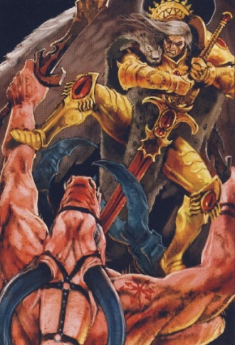

# 0734 凯瑞斯 Kyriss

精校状态：中文行文已逐段精校，部分术语仍为暂定

分类：混沌 / 恶魔

原文来源：https://www.bilibili.com/opus/1195397756257042433

原作者：帝国神选罐头

原文时间：2026年04月26日 08:33

[返回分类目录](目录.md) · [全书目录](../../目录.md)

<!-- A0734-B0001 -->
**英文原文**

Kyriss the Perverse was a Keeper of Secrets.

<!-- /A0734-B0001 -->

<!-- A0734-B0002 -->

原译文

悖逆者凯瑞斯是一名守密者

**校订译文**

悖逆者凯瑞斯是一名守密者。

<!-- /A0734-B0002 -->

<!-- A0734-B0003 图片 -->

<!-- A0734-B0004 -->

原译文

Sanguinius stabs Kyriss the Perverse 圣吉列斯刺伤悖逆者凯瑞斯

**校订译文**

Sanguinius stabs Kyriss the Perverse 圣吉列斯刺伤悖逆者凯瑞斯

<!-- /A0734-B0004 -->

<!-- A0734-B0005 -->
**英文原文**

Along with Ka'bandha, he was one of the two daemonic "generals" who orchestrated the Battle of Signus Prime against the Blood Angels and their primarch, Sanguinius. Horus and Ka'Bandha however intended to use Kyriss as a "sacrifice" to drive Sanguinius into a rage and eventually turn him to Khorne. After Ka'Bandha was forced back into the Warp, Kyriss informed Sanguinius that he would spare the Blood Angels of the Red Thirst and Black Rage if he took the hate of one of his lost sons into him and stepped into the realm of Chaos, but to save his gene-father the Apothecary Meros did instead. In a rage over the fate of his son, Sanguinius decapitated Kyriss.

<!-- /A0734-B0005 -->

<!-- A0734-B0006 -->

原译文

他和卡'班哈一起，是两位恶魔“将军”之一，他们策划了与圣血天使及其原体圣吉列斯的西格纳斯一号之战。然而，荷鲁斯和卡'班哈打算用凯瑞斯作为“祭品”来激怒圣吉列斯，并最终将他交给恐虐。在卡'班哈被迫返回亚空间后，凯瑞斯告诉圣吉列斯，如果他怀揣着对某个已逝子嗣的仇恨，踏入混沌领域，，他会放过血渴和黑怒的圣血天使，但为了拯救他的基因之父，药剂师梅洛斯却这样做了。在对子嗣命运的愤怒中，圣吉列斯斩首了凯瑞斯。

**校订译文**

在针对圣血天使及其原体圣吉列斯的西格纳斯主星之战中，凯瑞斯与卡’班哈是策划战事的两位恶魔“将军”。然而，荷鲁斯和卡’班哈打算将凯瑞斯当作祭品，以此激怒圣吉列斯，最终使他投向恐虐。卡’班哈被逐回亚空间后，凯瑞斯告诉圣吉列斯：只要他将一名迷失子嗣的仇恨纳入自身，并踏进混沌领域，凯瑞斯就会让圣血天使免受血渴与黑怒之苦。为救下基因之父，药剂师梅洛斯代替圣吉列斯接受了这一条件。子嗣的遭遇令圣吉列斯怒不可遏，他斩下了凯瑞斯的头颅。

**校注：** take the hate ... into him 指承受或容纳子嗣的仇恨，不是对死去的子嗣心怀仇恨。关于血渴、黑怒的诱惑条件照录本条英文，不因其他时期设定改写。

<!-- /A0734-B0006 -->

<!-- A0734-B0007 -->
**英文原文**

Ten-thousand years later Kyriss reappeared before the Blood Angels, this time to Dante and Mephiston. The Daemon offered the Blood Angels a bargain, that he would cure the Black Rage if Mephiston would become Slaanesh's champion. The offer was refused and Kyriss was expelled back into the Warp.

<!-- /A0734-B0007 -->

<!-- A0734-B0008 -->

原译文

一万年后，凯瑞斯再次出现在圣血天使面前，这次是但丁和墨菲斯托。恶魔向圣血天使提出了一个交易，如果墨菲斯托成为色孽冠军，他将治愈黑怒。该提议被拒绝，凯瑞斯被放逐回亚空间。

**校订译文**

一万年后，凯瑞斯再次出现在圣血天使面前，这次面对的是但丁与墨菲斯顿。恶魔提出交易：如果墨菲斯顿愿意成为色孽的冠军，它就会治愈黑怒。但圣血天使拒绝了这一条件，将凯瑞斯逐回亚空间。

<!-- /A0734-B0008 -->

本篇核心术语与暂定项

以下列出本篇出现的英文原形及核心术语表用词。同形词可能指不同对象，具体词义以本篇正文和校注为准；单复数、别名和仅见于图注的名称可能尚未列入。完整候选见[术语表](../../术语表/双语术语候选.csv)。

| 英文 | 采用中文 | 状态 |
| --- | --- | --- |
| Blood Angels | 圣血天使 | 官方已核对 |
| Warp | 亚空间 | 官方已核对 |
| Khorne | 恐虐 | 官方已核对 |
| Primarch | 原体 | 官方已核对 |
| Slaanesh | 色孽 | 官方已核对 |
| Horus | 荷鲁斯 | 暂定·官方待核 |
| Realm of Chaos | 混沌领域 | 暂定·官方待核 |
| Apothecary | 药剂师 | 官方已核对 |
| Lost Sons | 失落之子 | 暂定·官方待核 |
| Champion | 冠军 | 暂定·官方待核 |
| Dante | 但丁 | 暂定·官方待核 |
| Mephiston | 墨菲斯顿 | 暂定·官方待核 |
| Keeper of Secrets | 守密者 | 官方已核对 |
| The Blood | 鲜血 | 暂定·官方待核 |
| Kyriss the Perverse | 悖逆者凯瑞斯 | 暂定·官方待核 |
| Kyriss | 凯瑞斯 | 暂定·官方待核 |
| Meros | 梅洛斯 | 暂定·官方待核 |
| Signus Prime | 西格纳斯主星 | 暂定·官方待核 |

