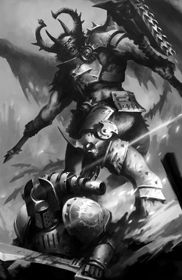
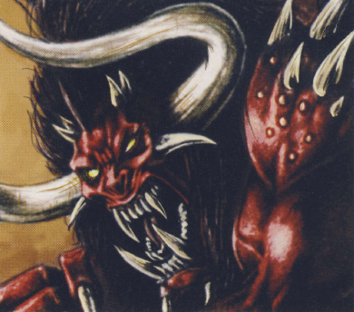
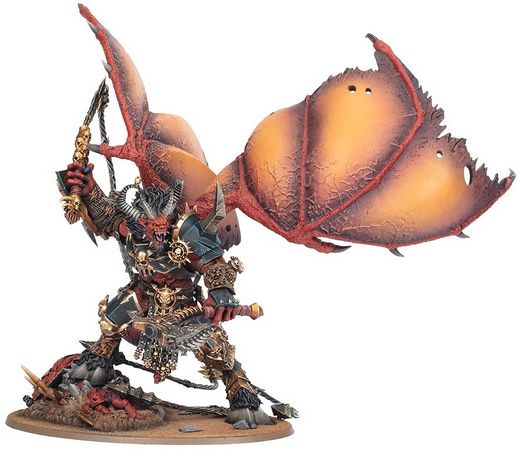
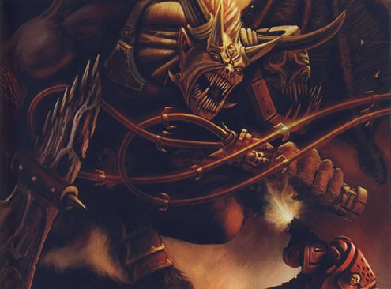

# 0735 卡'班哈 Ka'Bandha

精校状态：中文行文已逐段精校，部分术语仍为暂定

分类：混沌 / 恶魔

原文来源：https://www.bilibili.com/opus/1195761015983177735

原作者：帝国神选罐头

原文时间：2026年04月27日 08:03

[返回分类目录](目录.md) · [全书目录](../../目录.md)

<!-- A0735-B0001 -->
**英文原文**

Ka'Bandha is an Exalted Bloodthirster and one of the mightiest of Khorne's servants.

<!-- /A0735-B0001 -->

<!-- A0735-B0002 -->

原译文

卡'班哈是一名嗜血狂魔，也是恐虐最强大的仆人之一。

**校订译文**

卡’班哈是一名神尊嗜血狂魔，也是恐虐最强大的仆从之一。

**校注：** 补出 Exalted 的层级“神尊”，沿514既有定译。

<!-- /A0735-B0002 -->

<!-- A0735-B0003 图片 -->

<!-- A0735-B0004 -->

原译文

Ka'Bandha 卡'班哈

**校订译文**

Ka'Bandha 卡’班哈

<!-- /A0735-B0004 -->

<!-- A0735-B0005 -->
## History 历史

<!-- /A0735-B0005 -->

<!-- A0735-B0006 -->
## Heresy-era 叛乱时期

<!-- /A0735-B0006 -->

<!-- A0735-B0007 -->
### Battle of Signus Prime 西格纳斯一号之战

<!-- /A0735-B0007 -->

<!-- A0735-B0008 -->
**英文原文**

Ka'Bandha first appeared leading Daemonic forces against the Blood Angels at the Battle of Signus Prime alongside the Keeper of Secrets Kyriss the Perverse, being summoned to the Materium by sacrificing the Word Bearer Astropath Corocoro Sahzë. During the battle Ka'Bandha engaged in an airborne battle with Sanguinius and broke the Primarch's legs before unleashing the Ragefire upon the Legion and activating the dormant Red Thirst within the Legion. After Sanguinius was recovered thanks to the efforts of his Blood Angels, he engaged in a second round of fighting with Ka'Bandha and banished him back to the Warp.

<!-- /A0735-B0008 -->

<!-- A0735-B0009 -->

原译文

卡'班哈首次出现在西格纳斯一号之战中，率领恶魔部队对抗圣血天使，与守密者悖逆者凯瑞斯并肩作战，被召唤到物质界，牺牲了怀言者星语者科罗科罗·萨赫泽。在战斗中，卡'班哈与圣吉列斯进行了一场空战，打断了原体的腿，然后向军团释放了怒焰，激活了军团内休眠的血渴。在圣血天使的努力下，圣吉列斯康复后，他与卡'班哈进行了第二轮战斗，并将他放逐回了亚空间。

**校订译文**

卡’班哈最初在西格纳斯主星之战中现身，与守密者悖逆者凯瑞斯一同率领恶魔大军对抗圣血天使。召唤者献祭了怀言者星语者科罗科罗·萨赫泽，将卡’班哈召入物质宇宙。战斗中，他与圣吉列斯在空中交锋，打断了原体的双腿，随后向军团释放愤怒之火，唤醒了潜伏在战士们体内的血渴。在圣血天使的救助下，圣吉列斯恢复过来，再度与卡’班哈交战，将其逐回亚空间。

<!-- /A0735-B0009 -->

<!-- A0735-B0010 -->
**英文原文**

The brutal violence of Ka’bandha had unleashed a thirst for blood within the psyche of the Blood Angels, that would not rest until every taint of Chaos had been erased from the planet, and which would later be known as the Red Thirst.

<!-- /A0735-B0010 -->

<!-- A0735-B0011 -->

原译文

卡'班哈的残酷暴力在圣血天使的心灵中释放了对鲜血的渴望，这种渴望不会停止，直到混沌的每一份污染都从行星上抹去，这后来被称为血渴。

**校订译文**

卡’班哈施加的残酷暴行，激起圣血天使心中无可遏制的嗜血欲望；只有将这颗星球上的混沌污染彻底清除，这种欲望才肯平息。它后来被称为“血渴”。

**校注：** 本句“后来被称为血渴”与前句“唤醒潜伏的血渴”保留原文两种叙法，不据外部设定推断具体起源。

<!-- /A0735-B0011 -->

<!-- A0735-B0012 图片 -->

<!-- A0735-B0013 -->

原译文

Sanguinius battles Ka'Bandha at Signus Prime 圣吉列斯与卡'班哈在西格纳斯一号战斗

**校订译文**

Sanguinius battles Ka'Bandha at Signus Prime 圣吉列斯在西格纳斯主星与卡’班哈交战

<!-- /A0735-B0013 -->

<!-- A0735-B0014 -->
### The Challenge of Khorne 恐虐的考验

原题：The Challenge of Khorne 挑战恐虐

<!-- /A0735-B0014 -->

<!-- A0735-B0015 -->
**英文原文**

Upon his return to the Warp, the broken Ka'Bandha crawled before Khorne, met only with disgust and mockery. For his failure he was banished from Khorne's court, doomed to scavenge on weak souls to survive in the Formless Wastes. Other Bloodthirsters led hunting parties to seek his skull, and in time the desperate Ka'Bandha learned to be cunning. The hunters became the hunted, and Ka'Bandha took their armour and weapons for his own. Ka'Bandha eventually returned to the Fortress of Khorne with the skulls of these defeated foes, demanding a second chance from the Blood God. Khorne agreed, ordering Ka'Bandha to harvest 500 Blood Angels souls in the presence of Sanguinius.

<!-- /A0735-B0015 -->

<!-- A0735-B0016 -->

原译文

回到亚空间后，破碎的卡'班哈在恐虐面前爬行，只遭到了厌恶和嘲笑。由于他的失败，他被逐出恐虐王庭，注定要在无形的荒原中寻找弱小的灵魂以生存。其他嗜血狂魔带领狩猎队寻求他的颅骨，随着时间的推移，绝望的卡'班哈学会了狡猾。猎人成了猎物，卡'班哈把他们的盔甲和武器据为己有。卡'班哈最终带着这些战败敌人的颅骨回到了恐虐要塞，要求血神给他第二次机会。恐虐同意了，命令卡'班哈在圣吉列斯面前收获500个圣血天使的灵魂。

**校订译文**

返回亚空间后，伤痕累累的卡’班哈爬到恐虐面前，却只得到厌恶与嘲弄。他因失败被逐出恐虐王庭，只能在无形荒原捕食弱小灵魂，勉强维生。其他嗜血狂魔率领猎队追杀他，想夺取他的颅骨。绝境之中，卡’班哈逐渐学会了狡诈，猎人与猎物的角色随之逆转：他杀死追猎者，将他们的护甲和武器据为己有。最终，他带着这些败敌的颅骨回到恐虐要塞，要求血神再给自己一次机会。恐虐答应了，命令他当着圣吉列斯的面收割五百名圣血天使的灵魂。

<!-- /A0735-B0016 -->

<!-- A0735-B0017 图片 -->

<!-- A0735-B0018 -->

原译文

Ka'Bandha 卡'班哈

**校订译文**

Ka'Bandha 卡’班哈

<!-- /A0735-B0018 -->

<!-- A0735-B0019 -->
**英文原文**

He was later among the Greater Daemons summoned into Realspace by the Thousand Sons during the Battle for Terra. After the Lion's Gate Spaceport fell to the Traitors, the Daemons were unleashed to destroy the Imperial Palace's Colossi Gate. While they succeeded in tearing down the Gate's outer defences, the Daemons were destroyed by the White Scars' Stormseers and the Adeptus Custodes, before they could complete their task.

<!-- /A0735-B0019 -->

<!-- A0735-B0020 -->

原译文

后来，他是在泰拉之战中被千子召唤到现实空间的大魔之一。狮门太空港落入叛徒之手后，恶魔被释放出来摧毁了帝国皇宫的巨像之门。虽然他们成功地摧毁了大门的外部防御，但在他们完成任务之前，恶魔被白色疤痕的风暴先知和禁军修会摧毁了。

**校订译文**

后来，卡’班哈成为泰拉之战期间被千子召入现实空间的大魔之一。狮门太空港陷落后，叛军派出这些恶魔，意图摧毁帝国皇宫的巨像门。恶魔虽然突破了外围防线，却未能完成任务，便被白疤的风暴先知与帝国禁军消灭。

<!-- /A0735-B0020 -->

<!-- A0735-B0021 -->
### Siege of Terra 泰拉围城

<!-- /A0735-B0021 -->

<!-- A0735-B0022 -->
**英文原文**

Ka'Bandha would return once more to plague the Blood Angels during the last phase of the Siege of Terra. He was the first Greater Daemon who managed to pass the Emperor's weakened psychic shield around the Sanctum Imperialis, and attacked the Eternity Gate. There, he attempted to complete the mission Khorne had given him: Kill 500 Blood Angels in a set time in presence of Sanguinius. After breaking through the last Imperial defences in front of the Eternity Gate, thus paving the way for the last grand Traitor assault (though he did not care for their success or failure), the Greater Daemon sought out Blood Angels among the defenders and butchered them. Sanguinius intervened, and the two duelled, though Ka'Bandha constantly attempted to break away to keep killing regular Blood Angels. Eventually, however, the Primarch managed to enrage him so much that he focused on their duel. At one point, the Daemon cast Sanguinius to the ground. But, unlike Signus Prime, this time Sanguinius rose to his feet once again, and calling upon the last of his strength, hefted the Daemon by the neck. The Primarch was eventually able to break the Bloodthirster's back with the hilt of his sword. Afterwards the Primarch hurled the Greater Daemon back into the Heretic army and finally retreated back to the safety beyond the walls of the Eternity Gate. Ka'Bandha's broken body was then consumed by weaker Khornate Daemons; later, Ka'bandha furiously realized that he had failed the test set by Khorne.

<!-- /A0735-B0022 -->

<!-- A0735-B0023 -->

原译文

在泰拉围城的最后阶段，卡'班哈再次回归折磨圣血天使。他是第一个设法通过帝国圣地周围帝皇削弱的灵能屏障并攻击永恒之门的大魔。在那里，他试图完成恐虐给他的任务：在圣吉列斯在场的情况下，在规定的时间内杀死500名圣血天使。在突破了永恒之门前的最后一道帝国防线，为最后一次大规模的叛徒袭击铺平了道路（尽管他并不关心他们的成败）后，大魔在守军中寻找圣血天使并将其屠杀。圣吉列斯介入，两人决斗，尽管卡'班哈不断试图脱离，继续杀死普通的圣血天使。然而，最终，原体设法激怒了他，以至于他专注于他们的决斗。有一次，恶魔把圣吉列斯扔到了地上。但是，与西格纳斯一号不同的是，这一次圣吉列斯再次站起来，用尽最后的力气，抓住了恶魔的脖子。原体最终用剑柄折断了嗜血狂魔的背部。随后，原体将大魔扔回叛乱军队，最终撤退到永恒之门城墙另一边的安全地带。卡'班哈破碎的身体随后被较弱的恐虐恶魔吞噬；后来，卡'班哈愤怒地意识到，他没有通过恐虐的测试。

**校订译文**

泰拉围攻战的最后阶段，卡’班哈再次归来，向圣血天使发难。他是首个穿过帝皇为帝国圣所布设、此时已日益衰弱的灵能屏障的大魔，随后扑向永恒之门。在那里，他试图完成恐虐的考验：于规定时间内，当着圣吉列斯的面杀死五百名圣血天使。他冲破门前最后一道帝国防线，为叛军最后的大举进攻扫清道路，不过他并不关心叛军的成败，只顾在守军中寻找圣血天使，大开杀戒。圣吉列斯出手阻止，两人展开决斗，但卡’班哈始终试图脱身，继续屠杀普通战士。最终，原体彻底激怒了恶魔，使它终于专心迎战。恶魔一度将圣吉列斯击倒在地，但这一次，与西格纳斯主星的战斗不同，圣吉列斯重新站了起来。他使尽最后的力气，扼住恶魔的脖颈，将其举起，最终以剑柄击断嗜血狂魔的脊背。随后，他把大魔抛回叛军阵中，退入永恒之门城墙后的安全区域。卡’班哈残破的身躯被较弱的恐虐恶魔吞噬；后来，他愤怒地意识到，自己又一次未能通过恐虐的考验。

<!-- /A0735-B0023 -->

<!-- A0735-B0024 图片 -->

<!-- A0735-B0025 -->

原译文

Ka'Bandha 卡'班哈

**校订译文**

Ka'Bandha 卡’班哈

<!-- /A0735-B0025 -->

<!-- A0735-B0026 -->
## Post-Heresy 叛乱后

<!-- /A0735-B0026 -->

<!-- A0735-B0027 -->
**英文原文**

The first Grey Knight to defeat Ka'Bandha was Brother-Captain Solor. To this day, Solor's bones have great sway over the Daemon. With the use of a sharpened femur the Grey Knights and Blood Angels were able to defeat Ka'Bandha in 944.M41.

<!-- /A0735-B0027 -->

<!-- A0735-B0028 -->

原译文

第一位击败卡'班哈的灰骑士是索洛尔兄弟连长。直到今天，索洛尔之骨仍然对恶魔有巨大的影响。通过使用尖锐的股骨，灰骑士和圣血天使在944.M41击败了卡'班哈。

**校订译文**

第一位击败卡’班哈的灰骑士是兄弟会连长索洛尔。直到今天，索洛尔的遗骨仍对这个恶魔具有强大的压制作用。944.M41，灰骑士与圣血天使就曾借助一根磨尖的股骨击败卡’班哈。

<!-- /A0735-B0028 -->

<!-- A0735-B0029 图片 -->

<!-- A0735-B0030 -->

原译文

Ka'Bandha armed with the whip he used to crush Sanguinius' legs 卡'班哈手持鞭子用以击打圣吉列斯的双腿

**校订译文**

Ka'Bandha armed with the whip he used to crush Sanguinius' legs 卡’班哈手持曾击碎圣吉列斯双腿的鞭子

<!-- /A0735-B0030 -->

<!-- A0735-B0031 -->
**英文原文**

In 823.M41, Ka'Bandha slew Captain Abel Zorael in the Battle of Khartas. The Sanguinor intervened to banish the Daemon, but only after 80% of the Blood Angels had perished.

<!-- /A0735-B0031 -->

<!-- A0735-B0032 -->

原译文

823.M41，卡'班哈在卡尔塔斯之战中杀死了亚伯·佐拉尔连长。圣吉列诺介入放逐恶魔，但只是在80%的圣血天使死亡之后。

**校订译文**

823.M41，卡’班哈在卡尔塔斯之战中杀死亚伯·佐拉尔连长。圣血者赶来将恶魔放逐，但此时参战的圣血天使已有八成阵亡。

**校注：** The Sanguinor 沿已核官译“圣血者”；八成伤亡按该场战斗的参战者理解，不误扩大为全战团。

<!-- /A0735-B0032 -->

<!-- A0735-B0033 -->
**英文原文**

In 944.M41 the Grey Knight's prognosticars predicted that Ka’Bandha would shortly return to the mortal world. Knowing Ka'Bandha to be a dangerous foe, and moreover one who had earned the bitter enmity of the Blood Angels, the Grey Knights brought this news to the attention of Commander Dante and proposed a joint strike. A combined strike force of Blood Angels and Grey Knights assailed Ka'Bandha's fortress on the Daemon world of Kalagazaar. Ka'Bandha was banished, the Daemon armies were destroyed and Kalagazaar itself subjected to Exterminatus. At the campaign's end, the surviving Blood Angels had their memories wiped - a price Dante agreed with the Grey Knights at the mission's start.

<!-- /A0735-B0033 -->

<!-- A0735-B0034 -->

原译文

944.M41，灰骑士的预言者预测卡'班哈很快就会回到物质世界。灰骑士知道卡'班哈是一个危险的敌人，而且已经招致了圣血天使的强烈敌意，于是将这一消息提请指挥官但丁注意，并提议联合打击。一支由圣血天使和灰骑士组成的联合打击部队袭击了卡'班哈在卡拉格扎尔恶魔世界的堡垒。卡'班哈被放逐，恶魔军队被摧毁，卡拉格扎尔本身也遭受了灭绝令。在战役结束时，幸存的圣血天使们的记忆被抹去了 — 但丁在任务开始时就同意了灰骑士的代价。

**校订译文**

944.M41，灰骑士的预言者预见卡’班哈即将重返凡世。这个恶魔实力强大，又与圣血天使结下血海深仇，因此灰骑士将消息告知但丁指挥官，提议联手出击。双方组成联合突击部队，进攻卡’班哈位于恶魔世界卡拉格扎尔的堡垒。最终，卡’班哈被放逐，恶魔大军被歼灭，卡拉格扎尔也遭到灭绝令打击。战役结束后，幸存的圣血天使被抹去了相关记忆——这是但丁在行动开始前便已同意付出的代价。

<!-- /A0735-B0034 -->

<!-- A0735-B0035 -->
**英文原文**

In 999.M41, as the Blood Angels prepared for the main tendril of Hive Fleet Leviathan to assault the Baal System, Mephiston received portents that Ka'Bandha was preparing to assault the Chapter's home world where all the Chapters of the Blood had gathered. The presence of the Angel's Bane would throw the defence into chaos, and so Mephiston led a collection of Librarians from various Chapters to thwart the Daemon's arrival. Though they managed to wound Ka'Bandha, they could not prevent his entry into the material realm. As the Great Rift tore through the Galaxy, he emerged above Baal Primus, just short of his goal of Baal. Landing on the moon, he and his Daemons slaughtered Tyranids and Space Marines alike in a frenzied three-way slaughter. On Baal, as the Blood Angels finally defeated the last of the Tyranids, they could see Ka'Bandha's rune stretched across Baal Primus' southern hemisphere, written with the skulls of millions of Tyranid beasts. The monument was demolished from orbit by the fleets of the Blood Angel Chapters.

<!-- /A0735-B0035 -->

<!-- A0735-B0036 -->

原译文

999.M41，当圣血天使准备攻击巴尔星系的虫巢舰队利维坦的主卷须时，墨菲斯顿收到了卡'班哈准备攻击所有圣血战团聚集的战团家园世界的征兆。天使之灾的出现将使守军陷入混乱，因此墨菲斯顿带领来自各战团的智库阻止恶魔的到来。虽然他们设法伤害了卡'班哈，但他们无法阻止他进入物质领域。当大裂隙撕裂银河系时，他出现在巴尔一号上方，距离他的目标巴尔只有一步之遥。登上卫星后，他和他的恶魔在疯狂的三方屠杀中屠杀了泰伦和星际战士。在巴尔，当圣血天使最终击败了最后一个泰伦时，他们可以看到卡'班哈的符文横跨巴尔一号的南半球，以数百万泰伦野兽的头骨所绘。这座纪念碑被圣血天使战团的舰队从轨道上拆除。

**校订译文**

999.M41，圣血天使正准备迎击利维坦虫巢舰队主力触须舰队对巴尔星系的进攻。此时，墨菲斯顿得到预兆：卡’班哈即将袭击战团母星，而圣血诸战团此刻全都聚集在那里。若这位“天使之灾”降临，防御必将陷入混乱。墨菲斯顿于是率领来自各战团的智库员，试图阻止恶魔现身。他们虽然将其击伤，却未能阻止它进入物质宇宙。大裂隙撕开银河之际，卡’班哈出现在巴尔一号上空，与真正的目标巴尔仅一步之遥。他率恶魔降落在这颗卫星上，不分敌我地屠杀泰伦虫族与星际战士，令战场陷入三方混战。巴尔上的圣血天使终于歼灭最后一批泰伦虫族时，能够看见卡’班哈的符文横跨巴尔一号南半球——那是用数百万头泰伦生物的颅骨堆成的。圣血诸战团的舰队随后从轨道上将这座骇人的纪念碑摧毁。

**校注：** 修正主客关系：圣血天使是在准备抵御虫巢舰队对巴尔的袭击，不是在准备发动这一袭击。毁坏符文是舰队从轨道上实施的打击，非“拆除”。

<!-- /A0735-B0036 -->

<!-- A0735-B0037 -->
**英文原文**

Ka'Bandha next appeared during Khorne's Blood Crusade, leading its second wave. He was later banished back to the Warp by Mortarion during the War in the Rift.

<!-- /A0735-B0037 -->

<!-- A0735-B0038 -->

原译文

卡'班哈接下来出现在恐虐的鲜血远征期间，领导了第二波。后来，在裂隙战争期间，他被莫塔里安放逐回亚空间。

**校订译文**

此后，卡’班哈在恐虐的鲜血远征中再次现身，率领第二波攻势。后来，在裂隙战争期间，莫塔里安将他逐回了亚空间。

<!-- /A0735-B0038 -->

<!-- A0735-B0039 -->
## Trivia 琐事

<!-- /A0735-B0039 -->

<!-- A0735-B0040 -->
**英文原文**

Ka'Bandha is likely named after Khabanda, a demon from Hindu mythology.

<!-- /A0735-B0040 -->

<!-- A0735-B0041 -->

原译文

卡'班哈很可能以印度神话中的恶魔卡班达命名。

**校订译文**

卡’班哈的名字可能取自印度神话中的恶魔卡班达。

<!-- /A0735-B0041 -->

<!-- A0735-B0042 -->
## Conflicting sources 来源冲突

<!-- /A0735-B0042 -->

<!-- A0735-B0043 -->
**英文原文**

In the 5th edition Codex: Blood Angels, Ka'Bandha is described as striking Ammonai, the outermost planet of the Baal System, as Hive Fleet Leviathan descends on the system. However in The Devastation of Baal, Ka'Bandha arrives above Baal Primus in the midst of the battle.

<!-- /A0735-B0043 -->

<!-- A0735-B0044 -->

原译文

在第五版《圣典:圣血天使》中，卡'班哈被描述为在虫巢舰队利维坦降临到巴尔星系时，袭击了巴尔星系最外层的行星阿莫奈。然而，在《巴尔的毁灭》中，卡'班哈在战斗中到达了巴尔一号之上。

**校订译文**

第五版《圣典：圣血天使》记述，利维坦虫巢舰队进攻巴尔星系时，卡’班哈袭击的是该星系最外围的行星阿莫奈。然而，小说《巴尔的毁灭》写的是他在战斗中出现在巴尔一号上空。

<!-- /A0735-B0044 -->

本篇核心术语与暂定项

以下列出本篇出现的英文原形及核心术语表用词。同形词可能指不同对象，具体词义以本篇正文和校注为准；单复数、别名和仅见于图注的名称可能尚未列入。完整候选见[术语表](../../术语表/双语术语候选.csv)。

| 英文 | 采用中文 | 状态 |
| --- | --- | --- |
| Space Marines | 星际战士 | 官方已核对 |
| Blood Angels | 圣血天使 | 官方已核对 |
| Grey Knights | 灰骑士 | 官方已核对 |
| Adeptus Custodes | 帝皇禁军 | 官方已核对 |
| Thousand Sons | 千子 | 官方已核对 |
| Tyranids | 泰伦虫族 | 官方已核对 |
| Astropath | 星语者 | 官方已核对 |
| Warp | 亚空间 | 官方已核对 |
| Great Rift | 大裂隙 | 官方已核对 |
| Khorne | 恐虐 | 官方已核对 |
| Emperor | 帝皇 | 官方已核对 |
| Primarch | 原体 | 官方已核对 |
| Mortarion | 莫塔里安 | 官方已核对 |
| Terra | 泰拉 | 暂定·官方待核 |
| Devastation of Baal | 巴尔之毁 | 暂定·官方待核 |
| Hive Fleet Leviathan | 利维坦虫巢舰队 | 暂定·官方待核 |
| Baal | 巴尔 | 暂定·官方待核 |
| Banish | 巴尼什 | 暂定·官方待核 |
| Mission | 教团／传教机构 | 暂定 |
| White Scars | 白疤 | 官方已核 |
| Scars | 伤疤 | 暂定·官方待核 |
| Chapter | 战团 | 暂定·官方待核 |
| Captain | 连长 | 暂定·官方待核 |
| Brother | 修士 | 暂定·官方待核 |
| Dante | 但丁 | 暂定·官方待核 |
| Mephiston | 墨菲斯顿 | 暂定·官方待核 |
| The Angel | 天使 | 暂定·官方待核 |
| Mortal | 凡人 | 暂定·官方待核 |
| Brother-Captain | 兄弟会连长（灰骑士）／兄弟连长（通称） | 语境定译·灰骑士职衔官译已核 |
| The Sanguinor | 圣血者 | 官方已核 |
| Keeper of Secrets | 守密者 | 官方已核对 |
| Bloodthirster | 嗜血狂魔 | 官方已核对 |
| Ka’Bandha | 卡’班哈 | 暂定·官方待核 |
| Exalted Bloodthirster | 神尊嗜血狂魔 | 暂定·官方待核 |
| Prognosticars | 预言者 | 暂定·官方待核 |
| Imperialis | 帝国徽记 | 暂定·官方待核 |
| Sanctum | 圣所星 | 暂定·官方待核 |
| Primus | 领军 | 官方已核对 |
| Sanctum Imperialis | 帝国圣所 | 暂定·官方待核 |
| Colossi Gate | 巨像门 | 暂定·官方待核 |
| The Blood | 鲜血 | 暂定·官方待核 |
| Ragefire | 愤怒之火 | 暂定·官方待核 |
| Price | 普莱斯 | 暂定·官方待核 |
| War in the Rift | 裂隙战争 | 暂定·官方待核 |
| System | 星系（恒星系统） | 暂定·官方待核 |
| Kyriss the Perverse | 悖逆者凯瑞斯 | 暂定·官方待核 |
| Kyriss | 凯瑞斯 | 暂定·官方待核 |
| Corocoro Sahzë | 科罗科罗·萨赫泽 | 暂定·官方待核 |
| Formless Wastes | 无形荒原 | 暂定·官方待核 |
| Solor | 索洛尔 | 暂定·官方待核 |
| Abel Zorael | 亚伯·佐拉尔 | 暂定·官方待核 |
| Khartas | 卡尔塔斯 | 暂定·官方待核 |
| Kalagazaar | 卡拉格扎尔 | 暂定·官方待核 |
| Ammonai | 阿莫奈 | 暂定·官方待核 |
| Signus Prime | 西格纳斯主星 | 暂定·官方待核 |
| Baal Primus | 巴尔一号 | 暂定·官方待核 |
| Colossi | 巨像 | 暂定·官方待核 |
| Lion's Gate Spaceport | 狮门太空港 | 暂定·官方待核 |
| Lion's Gate | 狮门 | 暂定·官方待核 |
| Eternity Gate | 永恒之门 | 暂定·官方待核 |

